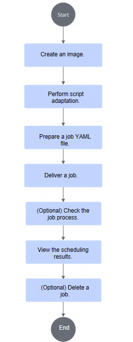
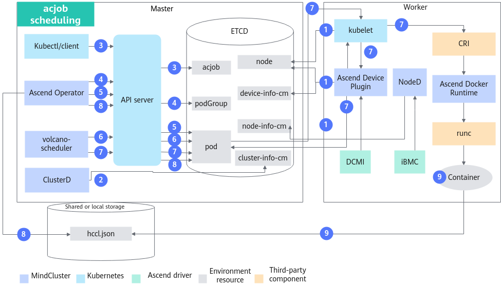
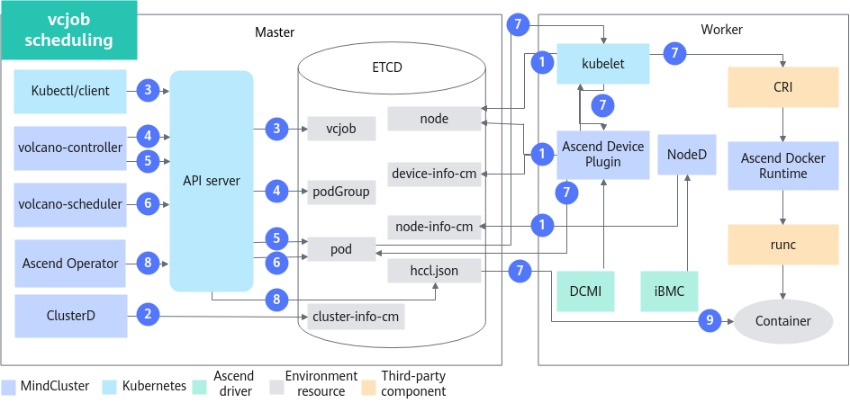
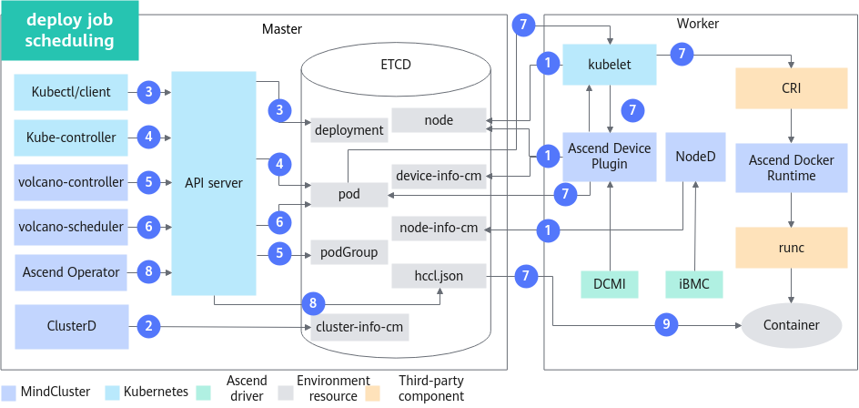

# Full NPU Scheduling/Static vNPU Scheduling (Training) <a name="ZH-CN_TOPIC_0000002479387138"></a>

## Before You Start <a name="ZH-CN_TOPIC_0000002511347093"></a>

**Prerequisites <a name="section52051339787"></a>**

- Ensure that a corresponding storage solution, such as NFS (Network File System), is configured in the environment. For details, see [Installing NFS](../../common_operations.md#installing-nfs).
- Before using the full-NPU scheduling or static vNPU scheduling feature, ensure that the relevant components have been installed. If they are not installed, refer to the [Installation and Deployment](../../installation_guide/03_installation/manual_installation/00_obtaining_software_packages.md) chapter for instructions.
    - Scheduler (Volcano or other schedulers)
    - Ascend Device Plugin
    - Ascend Docker Runtime
    - Ascend Operator
    - ClusterD
    - NodeD

- For training acjob with Volcano as the scheduler, full-NPU scheduling supports batch pod creation and batch scheduling.
    - To use the batch pod creation feature, you must use openFuyao-customized Kubernetes when installing Ascend Operator.
    - To use the batch scheduling feature, you must use openFuyao-customized Kubernetes and volcano-ext when installing Volcano, and enable the batch scheduling feature.
    - The batch scheduling feature is suitable for ultra-large-scale cluster scenarios. In such scenarios, expand the CPU and memory resources allocated to MindCluster components as needed to prevent performance degradation or out‑of‑memory issues that could lead to components being evicted by Kubernetes.

**Usage Method<a name="section179431435174811"></a>**

- Using via command line: The full-NPU scheduling or static vNPU scheduling feature requires a scheduler. You can choose to use Volcano or other schedulers. Regardless of which scheduler is chosen, Ascend Operator must be used to set resource information.
- Using after integration: Integrate cluster scheduling components into an existing third-party AI platform or an AI platform developed based on these components.

**Usage Notes<a name="section577625973520"></a>**

- Resource monitoring can be used together with all features in training scenarios.
- Multiple training jobs can run simultaneously in a cluster, and each job can use different features.
- Static vNPU scheduling must be used together with computing power virtualization. For details about static virtualization, see [Static Virtualization](../virtual_instance/virtual_instance_with_hdk/06_mounting_vnpu.md#static-virtualization).

**Supported Product Forms<a name="section169961844182917"></a>**

- The following products support full-NPU scheduling.
    - Atlas training series products
    - Atlas A2 training series products
    - Atlas A3 training series products
- The following products support static vNPU scheduling.
    - Atlas training series products

**Usage Instructions<a name="section5640184231810"></a>**

There are three usage scenarios for full-NPU scheduling, static vNPU scheduling: using via command line (Volcano), using via command line (other schedulers), and using after integration.

The usage flow for using Volcano and other schedulers via command line is the same. When using other schedulers, refer to the [Using via command line (other schedulers)](#using-via-command-line-other-schedulers) section to create the job YAML. The remaining operations for using other schedulers are the same as those for Volcano, and you can refer to [Using via command line (Volcano)](#using-via-command-line-volcano) for the operations.

**Figure 1**  Full-NPU scheduling and static vNPU scheduling usage flow<a name="fig107864120214"></a>


1. During script adaptation, you can choose to configure resource information through environment variables or files based on actual conditions.
2. When preparing the job YAML, the submitted job  YAML needs to be modified and adapted by selecting different YAMLs based on the specific NPU model. When selecting a YAML, refer to [Preparing the Job YAML](#preparing-the-job-yaml) and choose the appropriate YAML based on actual conditions.

## Implementation Principles<a name="ZH-CN_TOPIC_0000002479387150"></a>

The schematic diagram of the feature varies slightly depending on the type of training job. To use static vNPU scheduling, you need to use the npu-smi tool to create the required vNPUs in advance.

**acjob<a name="section9971431567"></a>**

The schematic diagram of acjob is shown in [Figure 1](#fig5188536014).

**Figure 1**  Schematic diagram of acjob scheduling<a name="fig5188536014"></a>


The description of each step is as follows:

1. The cluster scheduling components periodically report node and chip information.
    - kubelet reports the number of chips on a node to the node object.
    - Ascend Device Plugin periodically reports chip topology information.
        - Report full NPU information. The physical ID of the chip is reported to `device-info-cm`; the total number of schedulable chips (allocatable), the number of used chips (allocated), and basic chip information (device ip and super_device_ip) are reported to the node for full-NPU scheduling.
        - Report vNPU information to the node for static vNPU scheduling.

    - When a fault exists on a node, NodeD periodically reports the node's health status, hardware fault information, and DPC shared storage fault information to `node-info-cm`.

2. After reading the information in `device-info-cm` and `node-info-cm`, ClusterD writes the information to `cluster-info-cm`.
3. The user submits an acjob through kubectl or another deep learning platform.
4. Ascend Operator creates a corresponding PodGroup for the job. For detailed information about PodGroup, refer to the [official open-source Volcano documentation](https://volcano.sh/en/docs/v1-9-0/podgroup/).
5. Ascend Operator creates corresponding Pods for the job and injects the environment variables required for collective communication into the container.
6. volcano-scheduler selects appropriate nodes for the job based on node and chip topology information, and writes the selected processor information to the annotation of the pod.

   - Write the entire NPU information for full NPU scheduling.
   - Write vNPU information for static vNPU scheduling.

7. When kubelet creates the container, it calls Ascend Device Plugin to mount the chips. Ascend Device Plugin or volcano-scheduler writes the chip information into the Pod's annotations. Ascend Docker Runtime assists in mounting the corresponding resources.
8. Ascend Operator reads the Pod's annotations and writes the relevant information into `hccl.json`.
9. The container reads environment variables or `hccl.json` information, establishes a communication channel, and starts executing the training job.

**vcjob<a name="section13884164615313"></a>**

The schematic diagram of vcjob is shown in [Figure 2](#fig8717151315416).

**Figure 2**  vcjob scheduling schematic diagram<a name="fig8717151315416"></a>


The steps are described as follows:

1. The cluster scheduling components periodically report node and chip information.
    - kubelet reports the number of chips on a node to the node object.
    - Ascend Device Plugin periodically reports chip topology information.
        - Report full NPU information. The physical ID of the chip is reported to `device-info-cm`; the total number of schedulable chips (allocatable) and the number of used chips (allocated) are reported to the node for full-NPU scheduling.
        - Report vNPU information to the node for static vNPU scheduling.
    - When a fault exists on a node, NodeD periodically reports the node's health status, hardware fault information, and DPC shared storage fault information to `node-info-cm`.

2. After reading the information in `device-info-cm` and `node-info-cm`, ClusterD writes the information into `cluster-info-cm`.
3. The user submits a vcjob through kubectl or other deep learning platforms.
4. volcano-controller creates a corresponding PodGroup for the job. For details about PodGroup, see the [official open-source Volcano documentation](https://volcano.sh/en/docs/v1-9-0/podgroup/).
5. When the cluster resources meet the job requirements, volcano-controller creates the job Pod.
6. volcano-scheduler selects a suitable node for the job based on the node and chip topology information, and writes the selected processor information to the annotation of the pod.

   - Write the entire NPU information for full NPU scheduling.
   - Write vNPU information for static vNPU scheduling.

7. When kubelet creates a container, it calls Ascend Device Plugin to mount the chip, and Ascend Device Plugin writes the chip information into the Pod's annotation. Ascend Docker Runtime assists in mounting the corresponding resources and mounts `hccl.json` into the container.
8. Ascend Operator obtains the annotation information of each Pod and writes it into `hccl.json`.
9. The container reads the `hccl.json` information, establishes a communication channel, and starts executing the training job.

**deploy<a name="section32752223579"></a>**

The principle diagram of deploy is shown in [Figure 3](#fig06571541566).

**Figure 3** Schematic diagram of deploy scheduling<a name="fig06571541566"></a>


The steps are described as follows:

1. The cluster scheduling components periodically report node and chip information.
    - kubelet reports the number of chips on a node to the node object.
    - Ascend Device Plugin periodically reports chip topology information.
        - Report full NPU information. The physical ID of the chip is reported to `device-info-cm`; the total number of allocatable chips and the number of allocated chips are reported to the node for full-NPU scheduling.
        - Report vNPU information to the node for static vNPU scheduling.

2. After reading the information in `device-info-cm` and `node-info-cm`, ClusterD writes the information to `cluster-info-cm`.
3. The user submits a deploy job through kubectl or another deep learning platform.
4. kube-controller creates the corresponding Pod for the job.
5. volcano-controller creates PodGroup for the job. For details about the PodGroup, see [official open-source Volcano documentation](https://volcano.sh/en/docs/v1-9-0/podgroup/).
6. volcano-scheduler selects a proper node for the job based on the node and chip topology information, and writes the selected processor information to the annotation of the pod.

   - Write the entire NPU information for full NPU scheduling.
   - Write vNPU information for static vNPU scheduling.

7. When kubelet creates the container, it calls Ascend Device Plugin to mount chips. Ascend Device Plugin writes the chip information into the Pod  annotations. Ascend Docker Runtime assists in mounting corresponding resources and `hccl.json` into the container.
8. Ascend Operator obtains each Pod annotation, and write the information into `hccl.json`.
9. The container reads `hccl.json`, sets up a communication channel, and executes the training job.

## Using via Command Line (Volcano)

### Building an Image <a name="ZH-CN_TOPIC_0000002479227164"></a>

**Obtaining a Training Image <a name="zh-cn_topic_0000001609314597_section971616541059"></a>**

You can choose one of the following methods to obtain a training image:

- (Recommended) Download the **training base image** matching the driver version from [Ascend Image Repository](https://www.hiascend.com/developer/ascendhub) based on the system architecture (Arm or x86_64) and model framework (PyTorch, MindSpore). Based on the training base image, change the default user in the container to `root` (the default user in training base images after version 21.0.4 is non-root). The base image does not contain files such as training scripts and code. During training, files such as training scripts and code are usually mapped into the container by mounting.
- Customize your own training image from scratch. For the build process, refer to the container-related chapters in [Building an Image](../../common_operations.md#creating-an-image).

You can rename the downloaded/built training base image, for example. `training:v26.0.0`.

**Image Hardening<a name="zh-cn_topic_0000001609314597_section8425732111611"></a>**

Harden the security of the downloaded or built training base image by referring to [Container Security Hardening](../../security_hardening.md#container-security-hardening).

### Script Adaptation<a name="ZH-CN_TOPIC_0000002511347097"></a>

#### Configuring Resource Information via Environment Variables<a name="ZH-CN_TOPIC_0000002479387142"></a>

Select a reference based on your framework:

- [PyTorch](#zh-cn_topic_0000001558834814_section17760205783316)
- [MindSpore](#zh-cn_topic_0000001558834814_section868111733711)

    >[!NOTE]
    >- The dataset used in this section is [ImageNet2012](https://image-net.org/challenges/LSVRC/2012/2012-downloads.php). (**note: if you use this dataset, you must comply with the usage policies of the dataset provider.**)
    >- The model example code provided below may differ from the actual version. Please refer to the code of the actual version.
    >- The following MindSpore examples require a CANN version earlier than 8.5.0.

**PyTorch<a name="zh-cn_topic_0000001558834814_section17760205783316"></a>**

1. <a name="zh-cn_topic_0000001558834814_li1298552813512"></a>Download `ResNet50_ID4149_for_PyTorch` from the master branch of the [PyTorch code repository](https://gitcode.com/Ascend/ModelZoo-PyTorch/tree/master/PyTorch/built-in/cv/classification/ResNet50_ID4149_for_PyTorch) as the training code.
2. Prepare the dataset corresponding to ResNet50 by yourself, and comply with the corresponding specifications when using it.
3. The administrator uploads the dataset to the storage node.
    1. Go to the `/data/atlas_dls/public` directory and upload the dataset to any location, such as `/data/atlas_dls/public/dataset/resnet50/imagenet`.

        ```shell
        root@ubuntu:/data/atlas_dls/public/dataset/resnet50/imagenet# pwd
        ```

        Output:

        ```ColdFusion
        /data/atlas_dls/public/dataset/resnet50/imagenet
        ```

    2. Run `du -sh` to check the dataset size.

        ```shell
        root@ubuntu:/data/atlas_dls/public/dataset/resnet50/imagenet# du -sh
        ```

        Output:

        ```ColdFusion
        11G
        ```

4. Decompress the training code downloaded from [step 4](#zh-cn_topic_0000001558834814_li1298552813512) in a local environment. Upload the `ModelZoo-PyTorch/PyTorch/built-in/cv/classification/ResNet50_ID4149_for_PyTorch` directory in the training code to the `/data/atlas_dls/public/code/` path.
5. In the `/data/atlas_dls/public/code/ResNet50_ID4149_for_PyTorch` path, comment out or delete the fields in bold in `main.py`.

    <pre codetype="Python">
    def main():
        args = parser.parse_args()
        os.environ['MASTER_ADDR'] = args.addr
        <strong>#os.environ['MASTER_PORT'] = '29501'  # Comment out or delete this line of code</strong>
        if os.getenv('ALLOW_FP32', False) and os.getenv('ALLOW_HF32', False):
            raise RuntimeError('ALLOW_FP32 and ALLOW_HF32 cannot be set at the same time!')
        elif os.getenv('ALLOW_HF32', False):
            torch.npu.conv.allow_hf32 = True
        elif os.getenv('ALLOW_FP32', False):
            torch.npu.conv.allow_hf32 = False
            torch.npu.matmul.allow_hf32 = False</pre>

6. Go to the [mindcluster-deploy](https://gitcode.com/Ascend/mindxdl-deploy) repository, and based on the [mindcluster-deploy open-source repository version description](../../appendix.md#mindcluster-deploy-open-source-repository-version-description), switch to the corresponding version branch. Obtain the `train_start.sh` file from the `samples/train/basic-training/without-ranktable/pytorch` directory, and under the `/data/atlas_dls/public/code/ResNet50_ID4149_for_PyTorch/scripts` path, construct the following directory structure.

    ```text
    root@ubuntu:/data/atlas_dls/public/code/ResNet50_ID4149_for_PyTorch/scripts#
    scripts/
         ├── train_start.sh
    ```

**MindSpore<a name="zh-cn_topic_0000001558834814_section868111733711"></a>**

1. <a name="zh-cn_topic_0000001558834814_li1141932513379"></a>Download the "ResNet" code from the master branch of the [MindSpore code repository](https://gitee.com/mindspore/models/tree/master/official/cv/ResNet) as the training code.
2. Prepare the dataset corresponding to ResNet50 by yourself, and comply with the corresponding specifications when using it.
3. The administrator uploads the dataset to the storage node.
    1. Go to the `/data/atlas_dls/public` directory and upload the dataset to any location, such as `/data/atlas_dls/public/dataset/imagenet`.

        ```shell
        root@ubuntu:/data/atlas_dls/public/dataset/imagenet# pwd
        ```

        Output:

        ```ColdFusion
        /data/atlas_dls/public/dataset/imagenet
        ```

    2. Run the `du -sh` command to check the dataset size.

        ```shell
        root@ubuntu:/data/atlas_dls/public/dataset/imagenet# du -sh
        ```

        Output:

        ```ColdFusion
        11G
        ```

4. Locally extract the training code downloaded in [Step 1](#zh-cn_topic_0000001558834814_li1141932513379), and rename the ResNet directory under `models/official/cv/` to `ResNet50_for_MindSpore_2.0_code`. The subsequent steps use `ResNet50_for_MindSpore_2.0_code` as an example.
5. Upload the `ResNet50_for_MindSpore_2.0_cod`e directory to `/data/atlas_dls/public/code/` on the target environment.
6. Navigate to the [mindcluster-deploy](https://gitcode.com/Ascend/mindxdl-deploy) repository and check out the branch corresponding to the version described in the [mindcluster-deploy open-source repository version description](../../appendix.md#mindcluster-deploy-open-source-repository-version-description). Obtain the `train_start.sh` file from the `samples/train/basic-training/without-ranktable/mindspore` directory. Combine this with the scripts directory from the training code to create the following directory structure on the host.

    ```text
    root@ubuntu:/data/atlas_dls/public/code/ResNet50_for_MindSpore_2.0_code/scripts/#
    scripts/
    ├── docker_start.sh
    ├── run_standalone_train_gpu.sh
    ├── run_standalone_train.sh
     ...
    └── train_start.sh
    ```

7. Go to the `/data/atlas_dls/public/code/ResNet5_for_MindSpore_2.0_code/train.py` directory, and modify `train.py` as follows.

    ```Python
     ...
         if config.run_distribute:
             if target == "Ascend":
               #device_id = int(os.getenv('DEVICE_ID', '0'))   #Comment out this line of code
               #ms.set_context(device_id=device_id)     #Comment out this line of code
                 ms.set_auto_parallel_context(device_num=config.device_num, parallel_mode=ms.ParallelMode.DATA_PARALLEL,
                                              gradients_mean=True)
                 set_algo_parameters(elementwise_op_strategy_follow=True)
                 if config.net_name == "resnet50" or config.net_name == "se-resnet50":
                     if config.boost_mode not in ["O1", "O2"]:
                         ms.set_auto_parallel_context(all_reduce_fusion_config=config.all_reduce_fusion_config)
                 elif config.net_name in ["resnet101", "resnet152"]:
                     ms.set_auto_parallel_context(all_reduce_fusion_config=config.all_reduce_fusion_config)
                 init()
             # GPU target
     ...
    ```

#### Configuring Resource Information via Files

Configuring resource information through file variables supports creating the following three types of objects: acjob, vcjob, and deploy. The following uses vcjob and deploy as examples to introduce script adaptation.

- [PyTorch](#zh-cn_topic_0000001558834798_section17760205783316)
- [MindSpore](#zh-cn_topic_0000001558834798_section868111733711)

>[!NOTE]
>
>- The dataset used in this section is [ImageNet2012](https://image-net.org/challenges/LSVRC/2012/2012-downloads.php). (**note: if you use this dataset, you must comply with the usage policies of the dataset provider.**)
>- The model example code provided below may differ from the actual version. Please refer to the code of the actual version.
>- The following MindSpore examples require a CANN version earlier than 8.5.0.

**PyTorch<a name="zh-cn_topic_0000001558834798_section17760205783316"></a>**

1. <a name="zh-cn_topic_0000001558834798_li1298552813512"></a>Download `ResNet50_ID4149_for_PyTorch` from the master branch of the [PyTorch code repository](https://gitcode.com/Ascend/ModelZoo-PyTorch/tree/master/PyTorch/built-in/cv/classification/ResNet50_ID4149_for_PyTorch) as the training code.
2. Prepare the dataset corresponding to ResNet50 by yourself, and comply with the corresponding specifications when using it.
3. The administrator uploads the dataset to the storage node.
    1. Go to the `/data/atlas_dls/public` directory and upload the dataset to any location, such as `/data/atlas_dls/public/dataset/resnet50/imagenet`.

        ```shell
        root@ubuntu:/data/atlas_dls/public/dataset/resnet50/imagenet# pwd
        ```

        Output:

        ```ColdFusion
        /data/atlas_dls/public/dataset/resnet50/imagenet
        ```

    2. Run the `du -sh` command to check the dataset size.

        ```shell
        root@ubuntu:/data/atlas_dls/public/dataset/resnet50/imagenet# du -sh
        ```

        Output:

        ```ColdFusion
        11G
        ```

4. Decompress the training code downloaded in [Step 1](#zh-cn_topic_0000001558834798_li1298552813512) to the local environment, and upload the `ModelZoo-PyTorch/PyTorch/built-in/cv/classification/ResNet50_ID4149_for_PyTorch` directory from the decompressed training code to the environment, for example, to the `/data/atlas_dls/public/code/` path.
5. Go to the [mindcluster-deploy](https://gitcode.com/Ascend/mindxdl-deploy) repository, and switch to the version branch according to [mindcluster-deploy open-source repository version description](../../appendix.md#mindcluster-deploy-open-source-repository-version-description). Obtain the `train_start.sh`, `rank_table.sh`, and `utils.sh` files from the `samples/train/basic-training/ranktable` directory, and construct the following directory structure under the `/data/atlas_dls/public/code/ResNet50_ID4149_for_PyTorch/scripts` path.

    ```text
    root@ubuntu:/data/atlas_dls/public/code/ResNet50_ID4149_for_PyTorch/scripts#
    scripts/
         ├── train_start.sh
         ├── utils.sh
         └── rank_table.sh
    ```

**MindSpore<a name="zh-cn_topic_0000001558834798_section868111733711"></a>**

1. <a name="zh-cn_topic_0000001558834798_li1141932513379"></a>Download the "ResNet" code from the master branch of the [MindSpore code repository](https://gitee.com/mindspore/models/tree/master/official/cv/ResNet) as the training code.
2. Prepare the dataset corresponding to ResNet50 by yourself, and comply with the corresponding specifications when using it.
3. The administrator uploads the dataset to the storage node.
    1. Go to the `/data/atlas_dls/public` directory and upload the dataset to any location, such as `/data/atlas_dls/public/dataset/imagenet`.

        ```shell
        root@ubuntu:/data/atlas_dls/public/dataset/imagenet# pwd
        ```

        Output:

        ```ColdFusion
        /data/atlas_dls/public/dataset/imagenet
        ```

    2. Run the `du -sh` command to check the dataset size.

        ```shell
        root@ubuntu:/data/atlas_dls/public/dataset/imagenet# du -sh
        ```

        Output:

        ```ColdFusion
        11G
        ```

4. Decompress the training code downloaded in [Step 1](#zh-cn_topic_0000001558834798_li1141932513379) locally, and rename the `ResNet` directory under `models/official/cv/" to "ResNet50_for_MindSpore_2.0_code`. The following steps use the `ResNet50_for_MindSpore_2.0_code` directory as an example.
5. Upload the `ResNet50_for_MindSpore_2.0_code` file to the environment path `/data/atlas_dls/public/code/`.
6. Access the "[mindcluster-deploy](https://gitcode.com/Ascend/mindxdl-deploy)" repository, and based on the [mindcluster-deploy open-source repository version description](../../appendix.md#mindcluster-deploy-open-source-repository-version-description), switch to the corresponding version branch. Obtain the `train_start.sh`, `utils.sh`, and `rank_table.sh` files from the `samples/train/basic-training/ranktable` directory, and combine them with the `scripts` directory in the training code to construct the following directory structure on the host.

    ```text
    root@ubuntu:/data/atlas_dls/public/code/ResNet50_for_MindSpore_2.0_code/scripts/#
    scripts/
    ├── cache_util.sh
    ├── docker_start.sh
    ├── run_standalone_train_gpu.sh
    ├── run_standalone_train.sh
     ...
    ├── rank_table.sh
    ├── utils.sh
    └── train_start.sh
    ```

### Preparing the Job YAML

#### Selecting a YAML Example<a name="ZH-CN_TOPIC_0000002479227150"></a>

The following YAML examples are provided. You need to select the appropriate YAML example based on the components in use, chip type, and job type, and modify it according to your requirements before use.

**Configuring Resource Information via Environment Variables<a name="section1969664932615"></a>**

- For Atlas A2 training series products, see [Table 1](#table529015783811) to obtain the corresponding YAML example.

    After obtaining the example YAML from [Table 1](#table529015783811), the Atlas 800T A2 training server, Atlas 200T A2 Box16 heterogeneous subrack, and A200T A3 Box8 SuperPoD configurations can be modified and adapted based on the parameter description provided in [acjob YAML Description](../../api/).

- For Atlas training series products, see [Table 2](#table18698184918261) to obtain the corresponding YAML example.

    After obtaining the example YAML from [Table 2](#table18698184918261), the server (with Atlas 300T training card) configuration can be modified and adapted based on the YAML of the Atlas 800 training server and the parameter description provided in [acjob Yaml Description](../../api/).

- For Atlas A3 training series products, see [Table 3](#table57051049102614) to obtain the corresponding YAML example.

- For Atlas 950 training series products, see [Table 4](#table5290157950yaml) to obtain the corresponding YAML example.

**Table 1** YAML supported by Atlas A2 training series products

<a name="table529015783811"></a>
<table><thead align="left"><tr id="row52903576386"><th class="cellrowborder" valign="top" width="8.8%" id="mcps1.2.7.1.1"><p id="p129019578385"><a name="p129019578385"></a><a name="p129019578385"></a>Task Type</p>
</th>
<th class="cellrowborder" valign="top" width="15.000000000000002%" id="mcps1.2.7.1.2"><p id="p14290115712387"><a name="p14290115712387"></a><a name="p14290115712387"></a>Hardware Model</p>
</th>
<th class="cellrowborder" valign="top" width="11.650000000000002%" id="mcps1.2.7.1.3"><p id="p1329015723817"><a name="p1329015723817"></a><a name="p1329015723817"></a>Training Framework</p>
</th>
<th class="cellrowborder" valign="top" width="30.740000000000006%" id="mcps1.2.7.1.4"><p id="p14291125717389"><a name="p14291125717389"></a><a name="p14291125717389"></a>YAML File Name</p>
</th>
<th class="cellrowborder" valign="top" width="18.810000000000002%" id="mcps1.2.7.1.5"><p id="p1129114571381"><a name="p1129114571381"></a><a name="p1129114571381"></a>Description</p>
</th>
<th class="cellrowborder" valign="top" width="15.000000000000002%" id="mcps1.2.7.1.6"><p id="p1229110574387"><a name="p1229110574387"></a><a name="p1229110574387"></a>Link</p>
</th>
</tr>
</thead>
<tbody><tr id="row13291757163813"><td class="cellrowborder" rowspan="6" valign="top" width="8.8%" headers="mcps1.2.7.1.1 "><p id="p11291115783810"><a name="p11291115783810"></a><a name="p11291115783810"></a>Ascend Job</p>
<p id="p1629145703816"><a name="p1629145703816"></a><a name="p1629145703816"></a></p>
</td>
<td class="cellrowborder" rowspan="6" valign="top" width="15.000000000000002%" headers="mcps1.2.7.1.2 "><p id="p14227163913366"><a name="p14227163913366"></a><a name="p14227163913366"></a><span id="ph13291155773812"><a name="ph13291155773812"></a><a name="ph13291155773812"></a>Atlas 900 A2 PoD Cluster Basic Unit</span></p>
</td>
</tr>
<tr id="row829235719380"><td class="cellrowborder" valign="top" headers="mcps1.2.7.1.1 "><p id="p52921579382"><a name="p52921579382"></a><a name="p52921579382"></a><span id="ph1829255713389"><a name="ph1829255713389"></a><a name="ph1829255713389"></a>PyTorch</span></p>
</td>
<td class="cellrowborder" valign="top" headers="mcps1.2.7.1.2 "><p id="p1929295713389"><a name="p1929295713389"></a><a name="p1929295713389"></a>pytorch_multinodes_acjob_<span id="ph7292757133817"><a name="ph7292757133817"></a><a name="ph7292757133817"></a><em id="zh-cn_topic_0000001519959665_i1489729141619_1"><a name="zh-cn_topic_0000001519959665_i1489729141619_1"></a><a name="zh-cn_topic_0000001519959665_i1489729141619_1"></a>{xxx}</em></span>b.yaml</p>
</td>
<td class="cellrowborder" valign="top" headers="mcps1.2.7.1.3 "><p id="p1129285753810"><a name="p1129285753810"></a><a name="p1129285753810"></a>The example defaults to a two-node two-processor job.</p>
</td>
<td class="cellrowborder" rowspan="6" valign="top" width="15.000000000000002%" headers="mcps1.2.7.1.6 "><p id="p17292357133814"><a name="p17292357133814"></a><a name="p17292357133814"></a>After selecting the corresponding training framework, <a href="https://gitcode.com/Ascend/mindxdl-deploy/tree/branch_v26.0.0/samples/train/basic-training/without-ranktable" target="_blank" rel="noopener noreferrer">obtain the YAML.</a></p>
<div class="note" id="note14933145219586"><a name="note14933145219586"></a><a name="note14933145219586"></a><span class="notetitle">[!NOTE]</span><div class="notebody"><p id="p1027616512420"><a name="p1027616512420"></a><a name="p1027616512420"></a><span id="ph9014016509"><a name="ph9014016509"></a><a name="ph9014016509"></a>The following {<em id="zh-cn_topic_0000001519959665_i1914312018209"><a name="zh-cn_topic_0000001519959665_i1914312018209"></a><a name="zh-cn_topic_0000001519959665_i1914312018209"></a>xxx</em>} takes the "910" characters as the chip model value.</span></p>
</div></div>
</td>
</tr>
<tr id="row0292357163814"><td class="cellrowborder" rowspan="2" valign="top" headers="mcps1.2.7.1.1 "><p id="p1529295723813"><a name="p1529295723813"></a><a name="p1529295723813"></a><span id="ph15292125733819"><a name="ph15292125733819"></a><a name="ph15292125733819"></a>MindSpore</span></p>
</td>
<td class="cellrowborder" valign="top" headers="mcps1.2.7.1.2 "><p id="p182921757103818"><a name="p182921757103818"></a><a name="p182921757103818"></a>mindspore_multinodes_acjob_<span id="ph15292205723815"><a name="ph15292205723815"></a><a name="ph15292205723815"></a><em id="zh-cn_topic_0000001519959665_i1489729141619_2"><a name="zh-cn_topic_0000001519959665_i1489729141619_2"></a><a name="zh-cn_topic_0000001519959665_i1489729141619_2"></a>{xxx}</em></span>b.yaml</p>
</td>
<td class="cellrowborder" valign="top" headers="mcps1.2.7.1.3 "><p id="p52921657103816"><a name="p52921657103816"></a><a name="p52921657103816"></a>The example defaults to a two-node 16-processor job.</p>
</td>
</tr>
<tr id="row751217295286"><td class="cellrowborder" valign="top" headers="mcps1.2.7.1.2 "><p id="p61257345281"><a name="p61257345281"></a><a name="p61257345281"></a>mindspore_standalone_acjob_<span id="ph51251834122810"><a name="ph51251834122810"></a><a name="ph51251834122810"></a><em id="zh-cn_topic_0000001519959665_i1489729141619_4"><a name="zh-cn_topic_0000001519959665_i1489729141619_4"></a><a name="zh-cn_topic_0000001519959665_i1489729141619_4"></a>{xxx}</em></span>b.yaml</p>
</td>
<td class="cellrowborder" rowspan="2" valign="top" headers="mcps1.2.7.1.3 "><p id="p2293205715380"><a name="p2293205715380"></a><a name="p2293205715380"></a>The example defaults to a single-node single-processor job.</p>
</td>
</tr>
<tr id="row429313576389"><td class="cellrowborder" rowspan="2" valign="top" headers="mcps1.2.7.1.1 "><p id="p7293457173815"><a name="p7293457173815"></a><a name="p7293457173815"></a><span id="ph2293125773811"><a name="ph2293125773811"></a><a name="ph2293125773811"></a>PyTorch</span></p>
<p id="p1469421012715"><a name="p1469421012715"></a><a name="p1469421012715"></a></p>
</td>
<td class="cellrowborder" valign="top" headers="mcps1.2.7.1.2 "><p id="p8293457173812"><a name="p8293457173812"></a><a name="p8293457173812"></a>pytorch_standalone_acjob_<span id="ph10293195714383"><a name="ph10293195714383"></a><a name="ph10293195714383"></a><em id="zh-cn_topic_0000001519959665_i1489729141619_5"><a name="zh-cn_topic_0000001519959665_i1489729141619_5"></a><a name="zh-cn_topic_0000001519959665_i1489729141619_5"></a>{xxx}</em></span>b.yaml</p>
</td>
</tr>
<tr id="row7693111092718"><td class="cellrowborder" valign="top" headers="mcps1.2.7.1.1 "><p id="p10694181017275"><a name="p10694181017275"></a><a name="p10694181017275"></a>pytorch_multinodes_acjob_<span id="ph11166172612911"><a name="ph11166172612911"></a><a name="ph11166172612911"></a><em id="zh-cn_topic_0000001519959665_i1489729141619_6"><a name="zh-cn_topic_0000001519959665_i1489729141619_6"></a><a name="zh-cn_topic_0000001519959665_i1489729141619_6"></a>{xxx}</em></span>b_with_ranktable.yaml</p>
</td>
<td class="cellrowborder" valign="top" headers="mcps1.2.7.1.2 "><p id="p1524254417282"><a name="p1524254417282"></a><a name="p1524254417282"></a>The example defaults to a single-node 2-processor job. Uses the <span id="ph747115394291"><a name="ph747115394291"></a><a name="ph747115394291"></a>Ascend Operator</span> component to generate the RankTable file.</p>
</td>
</tr>
</tbody>
</table>

**Table 2** YAML supported by Atlas training series products

<a name="table18698184918261"></a>
<table><thead align="left"><tr id="row6698849162611"><th class="cellrowborder" valign="top" width="10.000000000000002%" id="mcps1.2.7.1.1"><p id="p15698549192614"><a name="p15698549192614"></a><a name="p15698549192614"></a>Task Type</p>
</th>
<th class="cellrowborder" valign="top" width="15.000000000000002%" id="mcps1.2.7.1.2"><p id="p11698849132612"><a name="p11698849132612"></a><a name="p11698849132612"></a>Hardware Model</p>
</th>
<th class="cellrowborder" valign="top" width="12.000000000000002%" id="mcps1.2.7.1.3"><p id="p2698124919262"><a name="p2698124919262"></a><a name="p2698124919262"></a>Training Framework</p>
</th>
<th class="cellrowborder" valign="top" width="30.000000000000004%" id="mcps1.2.7.1.4"><p id="p069914491269"><a name="p069914491269"></a><a name="p069914491269"></a>YAML File Name</p>
</th>
<th class="cellrowborder" valign="top" width="20.000000000000004%" id="mcps1.2.7.1.5"><p id="p66993497268"><a name="p66993497268"></a><a name="p66993497268"></a>Description</p>
</th>
<th class="cellrowborder" valign="top" width="13.000000000000004%" id="mcps1.2.7.1.6"><p id="p3699649192614"><a name="p3699649192614"></a><a name="p3699649192614"></a>Link</p>
</th>
</tr>
</thead>
<tbody><tr id="row206991499261"><td class="cellrowborder" rowspan="4" valign="top" width="10.000000000000002%" headers="mcps1.2.7.1.1 "><p id="p10699249132614"><a name="p10699249132614"></a><a name="p10699249132614"></a>Ascend Job</p>
</td>
<td class="cellrowborder" rowspan="4" valign="top" width="15.000000000000002%" headers="mcps1.2.7.1.2 "><p id="p196992049112613"><a name="p196992049112613"></a><a name="p196992049112613"></a><span id="ph76991749122617"><a name="ph76991749122617"></a><a name="ph76991749122617"></a>Atlas 800 Training Server</span></p>
</td>
<td class="cellrowborder" valign="top" headers="mcps1.2.7.1.1 "><p id="p146994498265"><a name="p146994498265"></a><a name="p146994498265"></a><span id="ph3699154922611"><a name="ph3699154922611"></a><a name="ph3699154922611"></a>PyTorch</span></p>
</td>
<td class="cellrowborder" valign="top" headers="mcps1.2.7.1.2 "><p id="p469944911268"><a name="p469944911268"></a><a name="p469944911268"></a>pytorch_multinodes_acjob.yaml</p>
</td>
<td class="cellrowborder" valign="top" headers="mcps1.2.7.1.3 "><p id="p269913494266"><a name="p269913494266"></a><a name="p269913494266"></a>The example defaults to a two-node, 16-processor job.</p>
</td>
<td class="cellrowborder" rowspan="4" valign="top" width="13.000000000000004%" headers="mcps1.2.7.1.6 "><p id="p369974917262"><a name="p369974917262"></a><a name="p369974917262"></a>After selecting the corresponding training framework, <a href="https://gitcode.com/Ascend/mindxdl-deploy/tree/branch_v26.0.0/samples/train/basic-training/without-ranktable" target="_blank" rel="noopener noreferrer">obtain the YAML.</a></p>
</td>
</tr>
<tr id="row670044914266"><td class="cellrowborder" valign="top" headers="mcps1.2.7.1.1 "><p id="p2070054918265"><a name="p2070054918265"></a><a name="p2070054918265"></a><span id="ph177001649182618"><a name="ph177001649182618"></a><a name="ph177001649182618"></a>MindSpore</span></p>
</td>
<td class="cellrowborder" valign="top" headers="mcps1.2.7.1.2 "><p id="p370024915266"><a name="p370024915266"></a><a name="p370024915266"></a>mindspore_multinodes_acjob.yaml</p>
</td>
<td class="cellrowborder" valign="top" headers="mcps1.2.7.1.3 "><p id="p6700104952618"><a name="p6700104952618"></a><a name="p6700104952618"></a>The example defaults to a two-node 8-processor job.</p>
<div class="note" id="note170014493266"><a name="note170014493266"></a><a name="note170014493266"></a><span class="notetitle">[!NOTE] Note</span><div class="notebody"><p id="p1370015494264"><a name="p1370015494264"></a><a name="p1370015494264"></a>If submitting a single-node 8-processor <span id="ph6700049182610"><a name="ph6700049182610"></a><a name="ph6700049182610"></a>job running MindSpore</span>, you need to modify minAvailable to 2 and Worker replicas to 1 in mindspore_multinodes_acjob.yaml.</p>
</div></div>
</td>
</tr>
<tr id="row11700124942615"><td class="cellrowborder" valign="top" headers="mcps1.2.7.1.1 "><p id="p8700114917265"><a name="p8700114917265"></a><a name="p8700114917265"></a><span id="ph1970044942611"><a name="ph1970044942611"></a><a name="ph1970044942611"></a>PyTorch</span></p>
</td>
<td class="cellrowborder" valign="top" headers="mcps1.2.7.1.2 "><p id="p117007498269"><a name="p117007498269"></a><a name="p117007498269"></a>pytorch_standalone_acjob.yaml</p>
</td>
<td class="cellrowborder" rowspan="2" valign="top" headers="mcps1.2.7.1.3 "><p id="p107007497265"><a name="p107007497265"></a><a name="p107007497265"></a>The example defaults to a single-node, single-processor job.</p>
</td>
</tr>
<tr id="row1170074952614"><td class="cellrowborder" valign="top" headers="mcps1.2.7.1.1 "><p id="p1970114911261"><a name="p1970114911261"></a><a name="p1970114911261"></a><span id="ph770124962613"><a name="ph770124962613"></a><a name="ph770124962613"></a>MindSpore</span></p>
</td>
<td class="cellrowborder" valign="top" headers="mcps1.2.7.1.2 "><p id="p770164982610"><a name="p770164982610"></a><a name="p770164982610"></a>mindspore_standalone_acjob.yaml</p>
</td>
</tr>
</tbody>
</table>

**Table 3** YAMLs supported by Atlas A3 training series products

<a name="table57051049102614"></a>
<table><thead align="left"><tr id="row107051249172610"><th class="cellrowborder" valign="top" width="8.799999999999999%" id="mcps1.2.7.1.1"><p id="p8705114972617"><a name="p8705114972617"></a><a name="p8705114972617"></a>Task Type</p>
</th>
<th class="cellrowborder" valign="top" width="15%" id="mcps1.2.7.1.2"><p id="p1870594972615"><a name="p1870594972615"></a><a name="p1870594972615"></a>Hardware Model</p>
</th>
<th class="cellrowborder" valign="top" width="11.65%" id="mcps1.2.7.1.3"><p id="p97063498264"><a name="p97063498264"></a><a name="p97063498264"></a>Training Framework</p>
</th>
<th class="cellrowborder" valign="top" width="39.269999999999996%" id="mcps1.2.7.1.4"><p id="p1706204911262"><a name="p1706204911262"></a><a name="p1706204911262"></a>YAML File Name</p>
</th>
<th class="cellrowborder" valign="top" width="10.280000000000001%" id="mcps1.2.7.1.5"><p id="p970615497266"><a name="p970615497266"></a><a name="p970615497266"></a>Description</p>
</th>
<th class="cellrowborder" valign="top" width="15%" id="mcps1.2.7.1.6"><p id="p170694910264"><a name="p170694910264"></a><a name="p170694910264"></a>Link</p>
</th>
</tr>
</thead>
<tbody><tr id="row570610499268"><td class="cellrowborder" rowspan="2" valign="top" width="8.799999999999999%" headers="mcps1.2.7.1.1 "><p id="p1770624902616"><a name="p1770624902616"></a><a name="p1770624902616"></a>Ascend Job</p>
<p id="p167068495269"><a name="p167068495269"></a><a name="p167068495269"></a></p>
</td>
<td class="cellrowborder" rowspan="2" valign="top" width="15%" headers="mcps1.2.7.1.2 "><p id="p19706849182618"><a name="p19706849182618"></a><a name="p19706849182618"></a><span id="ph167064499269"><a name="ph167064499269"></a><a name="ph167064499269"></a>Atlas 900 A3 SuperPoD</span></p>
</td>
<td class="cellrowborder" valign="top" headers="mcps1.2.7.1.1 "><p id="p0707749172618"><a name="p0707749172618"></a><a name="p0707749172618"></a><span id="ph12707184972613"><a name="ph12707184972613"></a><a name="ph12707184972613"></a>PyTorch</span></p>
</td>
<td class="cellrowborder" valign="top" headers="mcps1.2.7.1.2 "><p id="p1370794914264"><a name="p1370794914264"></a><a name="p1370794914264"></a>pytorch_standalone_acjob_super_pod.yaml</p>
</td>
<td class="cellrowborder" valign="top" headers="mcps1.2.7.1.3 "><p id="p167072049132613"><a name="p167072049132613"></a><a name="p167072049132613"></a>The example defaults to a single-node 16-processor job.</p>
</td>
<td class="cellrowborder" rowspan="2" valign="top" width="15%" headers="mcps1.2.7.1.6 "><p id="p1670794911264"><a name="p1670794911264"></a><a name="p1670794911264"></a>After selecting the corresponding training framework, <a href="https://gitcode.com/Ascend/mindxdl-deploy/tree/branch_v26.0.0/samples/train/basic-training/without-ranktable" target="_blank" rel="noopener noreferrer">obtain the YAML.</a></p>
<p id="p1770716492268"><a name="p1770716492268"></a><a name="p1770716492268"></a></p>
</td>
</tr>
<tr id="row7707164912262"><td class="cellrowborder" valign="top" headers="mcps1.2.7.1.1 "><p id="p270754962617"><a name="p270754962617"></a><a name="p270754962617"></a><span id="ph1570754952617"><a name="ph1570754952617"></a><a name="ph1570754952617"></a>MindSpore</span></p>
</td>
<td class="cellrowborder" valign="top" headers="mcps1.2.7.1.2 "><p id="p127081949202617"><a name="p127081949202617"></a><a name="p127081949202617"></a>mindspore_standalone_acjob_super_pod.yaml</p>
</td>
<td class="cellrowborder" valign="top" headers="mcps1.2.7.1.3 "><p id="p1070817499261"><a name="p1070817499261"></a><a name="p1070817499261"></a>The example defaults to a two-node 16-processor job.</p>
</td>
</tr>
</tbody>
</table>

**Table 4** YAML supported by Atlas 950 series products
<a name="table5290157950yaml"></a>
<table>
    <thead align="left">
        <tr>
            <th class="cellrowborder" valign="top" width="8.799999999999999%" id="mcps1.2.7.1.1"><p id="p8705114972617"><a name="p8705114972617"></a><a name="p8705114972617"></a>Task Type</p></th>
            <th class="cellrowborder" valign="top" width="15%" id="mcps1.2.7.1.2"><p id="p1870594972615"><a name="p1870594972615"></a><a name="p1870594972615"></a>Hardware Model</p></th>
            <th class="cellrowborder" valign="top" width="11.65%" id="mcps1.2.7.1.3"><p id="p97063498264"><a name="p97063498264"></a><a name="p97063498264"></a>Training Framework</p></th>
            <th class="cellrowborder" valign="top" width="39.269999999999996%" id="mcps1.2.7.1.4"><p id="p1706204911262"><a name="p1706204911262"></a><a name="p1706204911262"></a>YAML File Name</p></th>
            <th class="cellrowborder" valign="top" width="10.280000000000001%" id="mcps1.2.7.1.5"><p id="p970615497266"><a name="p970615497266"></a><a name="p970615497266"></a>Description</p></th>
            <th class="cellrowborder" valign="top" width="15%" id="mcps1.2.7.1.6"><p id="p170694910264"><a name="p170694910264"></a><a name="p170694910264"></a>Link</p></th>
        </tr>
    </thead>
    <tbody>
        <tr>
            <td class="cellrowborder" rowspan="2" valign="top" width="8.799999999999999%" headers="mcps1.2.7.1.1 "><p>Ascend Job</p></td>
            <td class="cellrowborder" rowspan="2" valign="top" width="15%" headers="mcps1.2.7.1.2 "><p><span>Atlas 950 SuperPoD</span></p></td>
            <td class="cellrowborder" valign="top" headers="mcps1.2.7.1.1 "><p>PyTorch</p></td>
            <td class="cellrowborder" valign="top" headers="mcps1.2.7.1.2 "><p>pytorch_standalone_acjob_950.yaml</p></td>
            <td class="cellrowborder" valign="top" headers="mcps1.2.7.1.3 "><p>The example defaults to a single-node 8-processor job.</p></td>
            <td class="cellrowborder" rowspan="2" valign="top" width="15%" headers="mcps1.2.7.1.6 ">
                <p>After selecting the corresponding training framework, <a href="https://gitcode.com/Ascend/mindxdl-deploy/tree/branch_v26.0.0/samples/train/basic-training/without-ranktable" target="_blank" rel="noopener noreferrer">obtain the YAML.</a></p>
            </td>
        </tr>
        <tr><td class="cellrowborder" valign="top" headers="mcps1.2.7.1.1 "><p>MindSpore</p></td>
            <td class="cellrowborder" valign="top" headers="mcps1.2.7.1.2 "><p>mindspore_standalone_acjob_950.yaml</p></td>
            <td class="cellrowborder" valign="top" headers="mcps1.2.7.1.3 "><p>The example defaults to a single-node single-processor job.</p></td>
        </tr>
    </tbody>
</table>

**Configuring Resource Information via Files<a name="section158807920347"></a>**

- For Atlas A2 training series products, see [Table 5](#table62591594016) to obtain the corresponding YAML example.

    After obtaining the example YAML from [Table 5](#table62591594016), the Atlas 800T A2 training server, Atlas 200T A2 Box16 heterogeneous sub-frame, and A200T A3 Box8 SuperPoD configurations can be modified and adapted based on the parameter description provided in [YAML Configuration Description](../../api/).

- For Atlas training series products, see [Table 6](#table21811158146) to obtain the corresponding YAML example.
- For Atlas 950 training series products, see [Table 7](#table950yaml) to obtain the corresponding YAML example.

**Table 5** YAML supported by Atlas A2 training series products

<a name="table62591594016"></a>
<table><thead align="left"><tr id="row72551515403"><th class="cellrowborder" valign="top" width="9.35%" id="mcps1.2.7.1.1"><p id="p72510154400"><a name="p72510154400"></a><a name="p72510154400"></a>Task Type</p>
</th>
<th class="cellrowborder" valign="top" width="14.99%" id="mcps1.2.7.1.2"><p id="p122531515408"><a name="p122531515408"></a><a name="p122531515408"></a>Hardware Model</p>
</th>
<th class="cellrowborder" valign="top" width="11.87%" id="mcps1.2.7.1.3"><p id="p1325131584014"><a name="p1325131584014"></a><a name="p1325131584014"></a>Training Framework</p>
</th>
<th class="cellrowborder" valign="top" width="36.51%" id="mcps1.2.7.1.4"><p id="p225815114016"><a name="p225815114016"></a><a name="p225815114016"></a>YAML File Name</p>
</th>
<th class="cellrowborder" valign="top" width="12.26%" id="mcps1.2.7.1.5"><p id="p2261615184014"><a name="p2261615184014"></a><a name="p2261615184014"></a>Description</p>
</th>
<th class="cellrowborder" valign="top" width="15.02%" id="mcps1.2.7.1.6"><p id="p32613153408"><a name="p32613153408"></a><a name="p32613153408"></a>Link</p>
</th>
</tr>
</thead>
<tbody><tr id="row1726201544016"><td class="cellrowborder" rowspan="2" valign="top" width="9.35%" headers="mcps1.2.7.1.1 "><p id="p326111516407"><a name="p326111516407"></a><a name="p326111516407"></a>Volcano Job</p>
<p id="p12475353114815"><a name="p12475353114815"></a><a name="p12475353114815"></a></p>
<p id="p18475175312481"><a name="p18475175312481"></a><a name="p18475175312481"></a></p>
</td>
<td class="cellrowborder" rowspan="2" valign="top" width="14.99%" headers="mcps1.2.7.1.2 "><p id="p455716252506"><a name="p455716252506"></a><a name="p455716252506"></a><span id="ph1262151402"><a name="ph1262151402"></a><a name="ph1262151402"></a>Atlas 900 A2 PoD Cluster Basic Unit</span></p>
</td>
<td class="cellrowborder" valign="top" headers="mcps1.2.7.1.1 "><p id="p102791534015"><a name="p102791534015"></a><a name="p102791534015"></a><span id="ph15271015144017"><a name="ph15271015144017"></a><a name="ph15271015144017"></a>PyTorch</span></p>
</td>
<td class="cellrowborder" valign="top" headers="mcps1.2.7.1.2 "><p id="p14271815154017"><a name="p14271815154017"></a><a name="p14271815154017"></a>a800_pytorch_vcjob.yaml</p>
</td>
<td class="cellrowborder" rowspan="2" valign="top" width="12.26%" headers="mcps1.2.7.1.5 "><p id="p15261215104017"><a name="p15261215104017"></a><a name="p15261215104017"></a>The example defaults to a single-node 16-processor job.</p>
<p id="p8271715184013"><a name="p8271715184013"></a><a name="p8271715184013"></a></p>
<p id="p7271115194015"><a name="p7271115194015"></a><a name="p7271115194015"></a></p>
</td>
<td class="cellrowborder" rowspan="2" valign="top" width="15.02%" headers="mcps1.2.7.1.6 "><p id="p142781511408"><a name="p142781511408"></a><a name="p142781511408"></a><a href="https://gitcode.com/Ascend/mindxdl-deploy/tree/branch_v26.0.0/samples/train/basic-training/ranktable/yaml/910b" target="_blank" rel="noopener noreferrer">Obtain YAML</a></p>
<p id="p71901195499"><a name="p71901195499"></a><a name="p71901195499"></a></p>
<p id="p151911091496"><a name="p151911091496"></a><a name="p151911091496"></a></p>
</td>
</tr>
<tr id="row14272155406"><td class="cellrowborder" valign="top" headers="mcps1.2.7.1.1 "><p id="p20273150409"><a name="p20273150409"></a><a name="p20273150409"></a><span id="ph62717152401"><a name="ph62717152401"></a><a name="ph62717152401"></a>MindSpore</span></p>
</td>
<td class="cellrowborder" valign="top" headers="mcps1.2.7.1.2 "><p id="p32771519408"><a name="p32771519408"></a><a name="p32771519408"></a>a800_mindspore_vcjob.yaml</p>
</td>
</tr>
<tr id="row728141517408"><td class="cellrowborder" rowspan="2" valign="top" width="9.35%" headers="mcps1.2.7.1.1 "><p id="p1289158408"><a name="p1289158408"></a><a name="p1289158408"></a>Deployment</p>
<p id="p93517386498"><a name="p93517386498"></a><a name="p93517386498"></a></p>
<p id="p12352113874920"><a name="p12352113874920"></a><a name="p12352113874920"></a></p>
</td>
<td class="cellrowborder" rowspan="2" valign="top" width="14.99%" headers="mcps1.2.7.1.2 "><p id="p1538185310530"><a name="p1538185310530"></a><a name="p1538185310530"></a><span id="ph2029215114013"><a name="ph2029215114013"></a><a name="ph2029215114013"></a>Atlas 900 A2 PoD Cluster Basic Unit</span></p>
</td>
<td class="cellrowborder" valign="top" headers="mcps1.2.7.1.1 "><p id="p172910152406"><a name="p172910152406"></a><a name="p172910152406"></a><span id="ph1029181516406"><a name="ph1029181516406"></a><a name="ph1029181516406"></a>PyTorch</span></p>
</td>
<td class="cellrowborder" valign="top" headers="mcps1.2.7.1.2 "><p id="p2029191584010"><a name="p2029191584010"></a><a name="p2029191584010"></a>a800_pytorch_deployment.yaml</p>
</td>
<td class="cellrowborder" rowspan="2" valign="top" width="12.26%" headers="mcps1.2.7.1.5 "><p id="p142910157401"><a name="p142910157401"></a><a name="p142910157401"></a>The example defaults to a single-node 16-processor job.</p>
</td>
<td class="cellrowborder" rowspan="2" valign="top" width="15.02%" headers="mcps1.2.7.1.6 "><p id="p7243709503"><a name="p7243709503"></a><a name="p7243709503"></a><a href="https://gitcode.com/Ascend/mindxdl-deploy/tree/branch_v26.0.0/samples/train/basic-training/ranktable/yaml/910b" target="_blank" rel="noopener noreferrer">Obtain YAML</a></p>
</td>
</tr>
<tr id="row32915158403"><td class="cellrowborder" valign="top" headers="mcps1.2.7.1.1 "><p id="p7291515164014"><a name="p7291515164014"></a><a name="p7291515164014"></a><span id="ph102941514401"><a name="ph102941514401"></a><a name="ph102941514401"></a>MindSpore</span></p>
</td>
<td class="cellrowborder" valign="top" headers="mcps1.2.7.1.2 "><p id="p202915155405"><a name="p202915155405"></a><a name="p202915155405"></a>a800_mindspore_deployment.yaml</p>
</td>
</tr>
</tbody>
</table>

**Table 6** YAML supported by Atlas training series products

<a name="table21811158146"></a>
<table><thead align="left"><tr id="row10181111518146"><th class="cellrowborder" valign="top" width="9.35%" id="mcps1.2.7.1.1"><p id="p51941552181410"><a name="p51941552181410"></a><a name="p51941552181410"></a>Task Type</p>
</th>
<th class="cellrowborder" valign="top" width="15%" id="mcps1.2.7.1.2"><p id="p20181111517147"><a name="p20181111517147"></a><a name="p20181111517147"></a>Hardware Model</p>
</th>
<th class="cellrowborder" valign="top" width="11.86%" id="mcps1.2.7.1.3"><p id="p5821153911586"><a name="p5821153911586"></a><a name="p5821153911586"></a>Training Framework</p>
</th>
<th class="cellrowborder" valign="top" width="36.51%" id="mcps1.2.7.1.4"><p id="p181811156149"><a name="p181811156149"></a><a name="p181811156149"></a>YAML File Name</p>
</th>
<th class="cellrowborder" valign="top" width="12.280000000000001%" id="mcps1.2.7.1.5"><p id="p86271732132719"><a name="p86271732132719"></a><a name="p86271732132719"></a>Description</p>
</th>
<th class="cellrowborder" valign="top" width="15%" id="mcps1.2.7.1.6"><p id="p11672113624010"><a name="p11672113624010"></a><a name="p11672113624010"></a>Link</p>
</th>
</tr>
</thead>
<tbody><tr id="row71811415111417"><td class="cellrowborder" rowspan="4" valign="top" width="9.35%" headers="mcps1.2.7.1.1 "><p id="p191941452171418"><a name="p191941452171418"></a><a name="p191941452171418"></a>Volcano Job</p>
</td>
<td class="cellrowborder" rowspan="2" valign="top" width="15%" headers="mcps1.2.7.1.2 "><p id="p218101516149"><a name="p218101516149"></a><a name="p218101516149"></a><span id="ph158146714142"><a name="ph158146714142"></a><a name="ph158146714142"></a>Atlas 800 training server</span></p>
</td>
<td class="cellrowborder" valign="top" headers="mcps1.2.7.1.1 "><p id="zh-cn_topic_0000001609074269_p208651518105919"><a name="zh-cn_topic_0000001609074269_p208651518105919"></a><a name="zh-cn_topic_0000001609074269_p208651518105919"></a><span id="ph19355165113512"><a name="ph19355165113512"></a><a name="ph19355165113512"></a>PyTorch</span></p>
</td>
<td class="cellrowborder" valign="top" headers="mcps1.2.7.1.2 "><p id="p779714251577"><a name="p779714251577"></a><a name="p779714251577"></a>a800_pytorch_vcjob.yaml</p>
</td>
<td class="cellrowborder" rowspan="2" valign="top" width="12.280000000000001%" headers="mcps1.2.7.1.5 "><p id="p16627332172713"><a name="p16627332172713"></a><a name="p16627332172713"></a>The example defaults to a single-node 8-processor job.</p>
</td>
<td class="cellrowborder" rowspan="8" valign="top" width="15%" headers="mcps1.2.7.1.6 "><p id="p6510121394114"><a name="p6510121394114"></a><a name="p6510121394114"></a><a href="https://gitcode.com/Ascend/mindxdl-deploy/tree/branch_v26.0.0/samples/train/basic-training/ranktable/yaml/910" target="_blank" rel="noopener noreferrer">Obtain YAML.</a></p>
</td>
</tr>
<tr id="row66819525592"><td class="cellrowborder" valign="top" headers="mcps1.2.7.1.1 "><p id="zh-cn_topic_0000001609074269_p85061291815"><a name="zh-cn_topic_0000001609074269_p85061291815"></a><a name="zh-cn_topic_0000001609074269_p85061291815"></a><span id="ph13573184092614"><a name="ph13573184092614"></a><a name="ph13573184092614"></a>MindSpore</span></p>
</td>
<td class="cellrowborder" valign="top" headers="mcps1.2.7.1.2 "><p id="p2682524593"><a name="p2682524593"></a><a name="p2682524593"></a>a800_mindspore_vcjob.yaml</p>
</td>
</tr>
<tr id="row181824157147"><td class="cellrowborder" rowspan="2" valign="top" headers="mcps1.2.7.1.1 "><p id="p11182141513140"><a name="p11182141513140"></a><a name="p11182141513140"></a>Server (with <span id="ph97657495514"><a name="ph97657495514"></a><a name="ph97657495514"></a>Atlas 300T training card</span>)</p>
</td>
<td class="cellrowborder" valign="top" headers="mcps1.2.7.1.1 "><p id="zh-cn_topic_0000001609074269_p1864871820119"><a name="zh-cn_topic_0000001609074269_p1864871820119"></a><a name="zh-cn_topic_0000001609074269_p1864871820119"></a><span id="ph134441022151619"><a name="ph134441022151619"></a><a name="ph134441022151619"></a>PyTorch</span></p>
</td>
<td class="cellrowborder" valign="top" headers="mcps1.2.7.1.2 "><p id="p1798025195718"><a name="p1798025195718"></a><a name="p1798025195718"></a>a300t_pytorch_vcjob.yaml</p>
</td>
<td class="cellrowborder" rowspan="2" valign="top" headers="mcps1.2.7.1.4 "><p id="p5627143215276"><a name="p5627143215276"></a><a name="p5627143215276"></a>The example defaults to a single-node single-processor job.</p>
</td>
</tr>
<tr id="row161351656205911"><td class="cellrowborder" valign="top" headers="mcps1.2.7.1.1 "><p id="zh-cn_topic_0000001609074269_p2648618616"><a name="zh-cn_topic_0000001609074269_p2648618616"></a><a name="zh-cn_topic_0000001609074269_p2648618616"></a><span id="ph114081559152716"><a name="ph114081559152716"></a><a name="ph114081559152716"></a>MindSpore</span></p>
</td>
<td class="cellrowborder" valign="top" headers="mcps1.2.7.1.2 "><p id="p9135145619598"><a name="p9135145619598"></a><a name="p9135145619598"></a>a300t_mindspore_vcjob.yaml</p>
</td>
</tr>
<tr id="row1182815141410"><td class="cellrowborder" rowspan="4" valign="top" headers="mcps1.2.7.1.1 "><p id="p1519415221416"><a name="p1519415221416"></a><a name="p1519415221416"></a>Deployment</p>
</td>
<td class="cellrowborder" rowspan="2" valign="top" headers="mcps1.2.7.1.2 "><p id="p151831029101812"><a name="p151831029101812"></a><a name="p151831029101812"></a><span id="ph17662124432"><a name="ph17662124432"></a><a name="ph17662124432"></a>Atlas 800 training server</span></p>
</td>
<td class="cellrowborder" valign="top" headers="mcps1.2.7.1.1 "><p id="zh-cn_topic_0000001609074269_p122181468314"><a name="zh-cn_topic_0000001609074269_p122181468314"></a><a name="zh-cn_topic_0000001609074269_p122181468314"></a><span id="ph724411337162"><a name="ph724411337162"></a><a name="ph724411337162"></a>PyTorch</span></p>
</td>
<td class="cellrowborder" valign="top" headers="mcps1.2.7.1.2 "><p id="p96517361736"><a name="p96517361736"></a><a name="p96517361736"></a>a800_pytorch_deployment.yaml</p>
</td>
<td class="cellrowborder" rowspan="2" valign="top" headers="mcps1.2.7.1.5 "><p id="p15627143202718"><a name="p15627143202718"></a><a name="p15627143202718"></a>The example defaults to a single-node 8-processor job.</p>
</td>
</tr>
<tr id="row23490341239"><td class="cellrowborder" valign="top" headers="mcps1.2.7.1.1 "><p id="zh-cn_topic_0000001609074269_p142187461335"><a name="zh-cn_topic_0000001609074269_p142187461335"></a><a name="zh-cn_topic_0000001609074269_p142187461335"></a><span id="ph541921262813"><a name="ph541921262813"></a><a name="ph541921262813"></a>MindSpore</span></p>
</td>
<td class="cellrowborder" valign="top" headers="mcps1.2.7.1.2 "><p id="p1734918342033"><a name="p1734918342033"></a><a name="p1734918342033"></a>a800_mindspore_deployment.yaml</p>
</td>
</tr>
<tr id="row11821815111419"><td class="cellrowborder" rowspan="2" valign="top" headers="mcps1.2.7.1.1 "><p id="p166661021172117"><a name="p166661021172117"></a><a name="p166661021172117"></a>Server (with <span id="ph39359582495"><a name="ph39359582495"></a><a name="ph39359582495"></a>Atlas 300T training card</span>)</p>
</td>
<td class="cellrowborder" valign="top" headers="mcps1.2.7.1.1 "><p id="zh-cn_topic_0000001609074269_p160284718315"><a name="zh-cn_topic_0000001609074269_p160284718315"></a><a name="zh-cn_topic_0000001609074269_p160284718315"></a><span id="ph162683501617"><a name="ph162683501617"></a><a name="ph162683501617"></a>PyTorch</span></p>
</td>
<td class="cellrowborder" valign="top" headers="mcps1.2.7.1.2 "><p id="p768164120310"><a name="p768164120310"></a><a name="p768164120310"></a>a300t_pytorch_deployment.yaml</p>
</td>
<td class="cellrowborder" valign="top" headers="mcps1.2.7.1.3 "><p id="p656851019573"><a name="p656851019573"></a><a name="p656851019573"></a>The example defaults to a single-node 8-processor job.</p>
</td>
</tr>
<tr id="row3166392032"><td class="cellrowborder" valign="top" headers="mcps1.2.7.1.1 "><p id="zh-cn_topic_0000001609074269_p18602047631"><a name="zh-cn_topic_0000001609074269_p18602047631"></a><a name="zh-cn_topic_0000001609074269_p18602047631"></a><span id="ph5731131512820"><a name="ph5731131512820"></a><a name="ph5731131512820"></a>MindSpore</span></p>
</td>
<td class="cellrowborder" valign="top" headers="mcps1.2.7.1.2 "><p id="p958514331647"><a name="p958514331647"></a><a name="p958514331647"></a>a300t_mindspore_deployment.yaml</p>
</td>
<td class="cellrowborder" valign="top" headers="mcps1.2.7.1.3 "><p id="p185698104572"><a name="p185698104572"></a><a name="p185698104572"></a>The example defaults to a single-node single-processor job.</p>
</td>
</tr>
</tbody>
</table>

**Table 7** YAML supported by Atlas 950 series products
<a name="table950yaml"></a>
<table>
    <thead align="left">
        <tr>
            <th class="cellrowborder" valign="top" width="9.35%" id="mcps1.2.7.1.1"><p>Task Type</p></th>
            <th class="cellrowborder" valign="top" width="14.99%" id="mcps1.2.7.1.2"><p>Hardware Model</p></th>
            <th class="cellrowborder" valign="top" width="11.87%" id="mcps1.2.7.1.3"><p>Training Framework</p></th>
            <th class="cellrowborder" valign="top" width="36.51%" id="mcps1.2.7.1.4"><p>YAML File Name</p></th>
            <th class="cellrowborder" valign="top" width="12.26%" id="mcps1.2.7.1.5"><p>Description</p></th>
            <th class="cellrowborder" valign="top" width="15.02%" id="mcps1.2.7.1.6"><p>Link</p></th>
        </tr>
    </thead>
    <tbody>
        <tr>
            <td class="cellrowborder" rowspan="2" valign="top" width="9.35%" headers="mcps1.2.7.1.1 "><p>Volcano Job</p></td>
            <td class="cellrowborder" rowspan="2" valign="top" width="14.99%" headers="mcps1.2.7.1.2 "><p>Atlas 950 SuperPoD</p><p>Atlas 850 series hardware products (SuperPoD)</p><p>Atlas 350 PCIe card</p></td>
            <td class="cellrowborder" valign="top" headers="mcps1.2.7.1.1 "><p>PyTorch</p></td>
            <td class="cellrowborder" valign="top" headers="mcps1.2.7.1.2 "><p>atlas_950_pytorch_vcjob.yaml</p></td>
            <td class="cellrowborder" rowspan="4" valign="top" width="12.26%" headers="mcps1.2.7.1.5 "><p>The example defaults to a single-node 8-processor job.</p></td>
            <td class="cellrowborder" rowspan="4" valign="top" width="15.02%" headers="mcps1.2.7.1.6 ">
                <p><a href="https://gitcode.com/Ascend/mindxdl-deploy/tree/branch_v26.0.0/samples/train/basic-training/ranktable/yaml/950" target="_blank" rel="noopener noreferrer">Obtain YAML.</a></p>
            </td>
        </tr>
        <tr>
            <td class="cellrowborder" valign="top" headers="mcps1.2.7.1.1 "><p>MindSpore</p></td>
            <td class="cellrowborder" valign="top" headers="mcps1.2.7.1.2 "><p>atlas_950_mindspore_vcjob.yaml</p></td>
        </tr>
        <tr>
            <td class="cellrowborder" rowspan="2" valign="top" width="9.35%" headers="mcps1.2.7.1.1 "><p>Deployment</p></td>
            <td class="cellrowborder" rowspan="2" valign="top" width="14.99%" headers="mcps1.2.7.1.2 "><p>Atlas 950 SuperPoD</p><p>Atlas 850 series hardware products (SuperPoD)</p><p>Atlas 350 PCIe card</p></td>
            <td class="cellrowborder" valign="top" headers="mcps1.2.7.1.1 "><p>PyTorch</p></td>
            <td class="cellrowborder" valign="top" headers="mcps1.2.7.1.2 "><p>atlas_950_pytorch_deployment.yaml</p></td>
        </tr>
        <tr>
            <td class="cellrowborder" valign="top" headers="mcps1.2.7.1.1 "><p>MindSpore</p></td>
            <td class="cellrowborder" valign="top" headers="mcps1.2.7.1.2 "><p>atlas_950_mindspore_deployment.yaml</p></td>
        </tr>
    </tbody>
</table>

#### YAML Parameter Description<a name="ZH-CN_TOPIC_0000002511347099"></a>

This section provides examples for configuring YAML for full-NPU scheduling or static vNPU scheduling. Before performing the operations, understand the parameter description of the YAML examples.

- For Ascend Job, see [acjob Yaml Description](../../api/).
- For Volcano Job, see [vcjob Yaml Description](../../api/).

#### Configuring YAML<a name="ZH-CN_TOPIC_0000002511347101"></a>

This section guides you on configuring the job YAML for the full-NPU scheduling or static vNPU scheduling feature. If you configure resources through environment variables, see [Configuring Resource Information via Environment Variables](#section598118132817); if you configure resources through files, see [Configuring Resource Information via Files](#section6131855154814).

**Scenario: Configuring Resource Information via Environment Variables<a name="section598118132817"></a>**

>[!NOTE]
>In this scenario, you must have created a specific mount path for the [hccl.json](../../api/hccl.json_file_description.md) file before performing the following operations. For detailed steps, see [Step 4](../../installation_guide/03_installation/manual_installation/08_ascend_operator.md).

1. Upload the YAML file to any directory on the management node and modify the file content based on the actual situation.

    **Table 1** Operation reference

    <a name="table9830101615287"></a>
    <table><thead align="left"><tr id="row1183115167289"><th class="cellrowborder" valign="top" width="50%" id="mcps1.2.3.1.1"><p id="p1883131617285"><a name="p1883131617285"></a><a name="p1883131617285"></a>Feature Name</p>
    </th>
    <th class="cellrowborder" valign="top" width="50%" id="mcps1.2.3.1.2"><p id="p118311416122815"><a name="p118311416122815"></a><a name="p118311416122815"></a>Operation Example</p>
    </th>
    </tr>
    </thead>
    <tbody><tr id="row1383111642810"><td class="cellrowborder" rowspan="2" valign="top" width="50%" headers="mcps1.2.3.1.1 "><p id="p183111662814"><a name="p183111662814"></a><a name="p183111662814"></a>Full-NPU Scheduling</p>
    <p id="p6831131682816"><a name="p6831131682816"></a><a name="p6831131682816"></a></p>
    <p id="p4831141617286"><a name="p4831141617286"></a><a name="p4831141617286"></a></p>
    <p id="p1783141615287"><a name="p1783141615287"></a><a name="p1783141615287"></a></p>
    <p id="p53986186431"><a name="p53986186431"></a><a name="p53986186431"></a></p>
    </td>
    <td class="cellrowborder" valign="top" width="50%" headers="mcps1.2.3.1.2 "><p id="p1083151622813"><a name="p1083151622813"></a><a name="p1083151622813"></a><a href="#li583911163280">Creating a Single-Node Job on an Atlas 800 Training Server</a></p>
    </td>
    </tr>
    <tr id="row0832171652816"><td class="cellrowborder" valign="top" headers="mcps1.2.3.1.1 "><p id="p178320163285"><a name="p178320163285"></a><a name="p178320163285"></a><a href="#li1731218243100">Creating a Distributed Job on an Atlas 800T A2 Training Server</a></p>
    </td>
    </tr>
    <tr id="row108334168282"><td class="cellrowborder" valign="top" width="50%" headers="mcps1.2.3.1.1 "><p id="p2833141612811"><a name="p2833141612811"></a><a name="p2833141612811"></a>Full Card Scheduling</p>
    </td>
    <td class="cellrowborder" valign="top" width="50%" headers="mcps1.2.3.1.2 "><p id="p18339161282"><a name="p18339161282"></a><a name="p18339161282"></a><a href="#li1086213163289">Creating a Single-Node Training Job on an Atlas 900 A3 SuperPoD</a></p>
    </td>
    </tr>
    <tr id="row524620253494"><td class="cellrowborder" valign="top" width="50%" headers="mcps1.2.3.1.1 "><p id="p1324682574913"><a name="p1324682574913"></a><a name="p1324682574913"></a>Full-NPU Scheduling</p>
    </td>
    <td class="cellrowborder" valign="top" width="50%" headers="mcps1.2.3.1.2 "><p id="p1924622524915"><a name="p1924622524915"></a><a name="p1924622524915"></a><a href="#li164321720423">Creating a Training Job on an Atlas 800T A2 Training Server (Chip Mounting by Scheduler)</a></p>
    </td>
    </tr>
    </tbody>
    </table>

    - <a name="li583911163280"></a>To use the full-NPU scheduling feature, refer to this configuration. Taking `pytorch_standalone_acjob.yaml` as an example, create a single-node training job on an Atlas 800 training server node. The job uses 1 chip. The modification example is as follows.

        ```Yaml
        apiVersion: mindxdl.gitee.com/v1
        kind: AscendJob
        metadata:
          name: default-test-pytorch
          labels:
            framework: pytorch   # Image name
            tor-affinity: "normal-schema" # This label indicates whether the job uses the switch affinity scheduling label. If it is null or not specified, this feature is not used. large-model-schema indicates a large model task or filler task, and normal-schema indicates a normal task.
        spec:
          schedulerName: volcano  # This takes effect when enableGangScheduling of Ascend Operator is set to true.
          runPolicy:
            schedulingPolicy:    # Takes effect when enableGangScheduling of  Ascend Operator is set to true
              minAvailable: 1    # Total number of job replicas
              queue: default    # Queue to which the job belongs
          successPolicy: AllWorkers   # Prerequisites for job success
          replicaSpecs:
            Master:
              replicas: 1      # Number of job replicas
              restartPolicy: Never
              template:
                spec:
                  nodeSelector:
                    host-arch: huawei-arm               # Optional. Fill in based on the actual situation.
                    accelerator-type: module         # Node type
                  containers:
                  - name: ascend                       # Must be ascend and cannot be modified.
                  image: PyTorch-test:latest       # Image name
        ...
                  env:
        ...
                  - name: ASCEND_VISIBLE_DEVICES                       # Ascend Docker Runtime uses this field.
                    valueFrom:
                      fieldRef:
                        fieldPath: metadata.annotations['huawei.com/Ascend910']               # Must be consistent with resources.requests below
        ...
                    ports:                          #Distributed training collective communication port
                      - containerPort: 2222
                        name: ascendjob-port
                    resources:
                      limits:
                        huawei.com/Ascend910: 1    # Number of chips requested by the job
                      requests:
                        huawei.com/Ascend910: 1   # Consistent with the limits value
        ...
        ```

        After modification, perform [Step 2](#li118885168281) to configure other fields in the YAML.

        >[!NOTE]
        >The `replicas` field for Chief, Master, and Scheduler in the PyTorch and MindSpore frameworks cannot exceed 1. For single-node jobs, the PyTorch framework does not require a Worker. For single-processor jobs, the MindSpore framework does not require a Scheduler.

    - <a name="li1731218243100"></a>To use the full-NPU scheduling feature, refer to this configuration. Take `pytorch_multinodes_acjob_{xxx}b.yaml` as an example. Create a distributed training job on two Atlas 800T A2 training servers to execute a 2 x 8P training job. The modification example is as follows. Each Pod of the distributed job can only be scheduled to a different node.

        ```Yaml
        apiVersion: mindxdl.gitee.com/v1
        kind: AscendJob
        metadata:
          name: default-test-pytorch        # Job name
          labels:
            framework: pytorch     # Training framework name
            ring-controller.atlas: ascend-{xxx}b  # Product type identifier
            tor-affinity: "null" #This label indicates whether the task uses switch affinity scheduling. If it is null or not specified, it is not applicable. large-model-schema indicates a large model task, and normal-schema indicates a normal task.
        spec:
          schedulerName: volcano    # Takes effect when enableGangScheduling of Ascend Operator is set to true.
          runPolicy:
            schedulingPolicy:       # Takes effect when enableGangScheduling of Ascend Operator is set to true.
              minAvailable: 2   #Total number of job replicas
              queue: default     # Queue to which the job belongs
          successPolicy: AllWorkers  # Prerequisites for job success
          replicaSpecs:
            Master:
              replicas: 1   # Number of job replicas
              restartPolicy: Never
              template:
                metadata:
                  labels:
                    ring-controller.atlas: ascend-{xxx}b  # Identifies the product type
                spec:
                  affinity:                                         # This configuration indicates that the Pods of the distributed job are scheduled to different nodes
                    podAntiAffinity:
                      requiredDuringSchedulingIgnoredDuringExecution:
                        - labelSelector:
                            matchExpressions:
                              - key: job-name
                                operator: In
                                values:
                                  - default-test-pytorch         # Must be consistent with the job name above
                          topologyKey: kubernetes.io/hostname
                  nodeSelector:
                    host-arch: huawei-arm               # Optional. Fill in based on the actual situation.
                    accelerator-type: module-{xxx}b-8   # Node type
                  containers:
                  - name: ascend                                     # Must be ascend and cannot be modified.
                  image: pytorch-test:latest  #Image name
        ...
                    resources:
                      limits:
                        huawei.com/Ascend910: 8     # Number of chips requested
                      requests:
                        huawei.com/Ascend910: 8     # Consistent with the limits value
                    volumeMounts:
        ...
                  volumes:
        ...
            Worker:
              replicas: 1   # Number of job replicas
              restartPolicy: Never
              template:
                metadata:
                  labels:
                    ring-controller.atlas: ascend-{xxx}b   # Identifies the product type
                spec:
                  affinity:            # This configuration indicates that the Pods of the distributed job are scheduled to different nodes
                    podAntiAffinity:
                      requiredDuringSchedulingIgnoredDuringExecution:
                        - labelSelector:
                            matchExpressions:
                              - key: job-name
                                operator: In
                                values:
                                  - default-test-pytorch        # Must be consistent with the job name above
                          topologyKey: kubernetes.io/hostname
                  nodeSelector:
                    host-arch: huawei-arm               # Optional. Fill in based on the actual situation.
                    accelerator-type: module-{xxx}b-8  # Node type
                  containers:
                  - name: ascend                                   # Must be ascend and cannot be modified.
        ...
                  env:
        ...
                  - name: ASCEND_VISIBLE_DEVICES                       # Ascend Docker Runtime uses this field.
                    valueFrom:
                      fieldRef:
                        fieldPath: metadata.annotations['huawei.com/Ascend910']               # Must be consistent with resources.requests below.
        ...
                    ports:                          # Distributed training collective communication port
                      - containerPort: 2222
                        name: ascendjob-port
                    resources:
                      limits:
                        huawei.com/Ascend910: 8   # Number of chips requested by the job
                      requests:
                        huawei.com/Ascend910: 8   # Consistent with the limits value
                    volumeMounts:
        ...
                  volumes:
        ...
        ```

        After modification, perform [Step 2](#li118885168281) to configure other fields in the YAML.

    - <a name="li1086213163289"></a>To use the full-NPU scheduling feature, refer to this configuration. Taking `pytorch_standalone_acjob_super_pod.yaml` as an example, create a ingle-node training job on an Atlas 900 A3 SuperPoD. The modification example is as follows.

        ```Yaml
        apiVersion: mindxdl.gitee.com/v1
        kind: AscendJob
        metadata:
          name: default-test-pytorch
          labels:
            framework: pytorch    # Framework type
            ring-controller.atlas: ascend-{xxx}b  # Identifies the product type
            podgroup-sched-enable: "true"  # Configured only when the cluster uses openFuyao customized Kubernetes and volcano-ext components. When the value is the string "true", the batch scheduling function is enabled; when the value is any other string, the batch scheduling function does not take effect, and normal scheduling is used. If this parameter is not configured, the batch scheduling function does not take effect, and normal scheduling is used.
          annotations:
            sp-block: "16"  # Must be consistent with the number of chips requested
        spec:
          schedulerName: volcano  # Takes effect when enableGangScheduling of Ascend Operator is true
          runPolicy:
            schedulingPolicy:    # Takes effect when enableGangScheduling of Ascend Operator is set to true
              minAvailable: 1     # Total number of job replicas
              queue: default  # Queue to which the job belongs
          successPolicy: AllWorkers     # Prerequisites for job success
          replicaSpecs:
            Master:
              replicas: 1   # Number of job replicas
              restartPolicy: Never
              template:
                metadata:
                  labels:
                    ring-controller.atlas: ascend-{xxx}b
                spec:
                  nodeSelector:
                    host-arch: huawei-arm      # Optional. Fill in based on the actual situation.
                    accelerator-type: module-a3-16-super-pod    # Node type
                  containers:
                  - name: ascend  # Must be ascend and cannot be modified.
                    image: pytorch-test:latest      # Training base image
                    imagePullPolicy: IfNotPresent
                    env:
        ...
                      - name: ASCEND_VISIBLE_DEVICES     # Ascend Docker Runtime uses this field.
                        valueFrom:
                          fieldRef:
                            fieldPath: metadata.annotations['huawei.com/Ascend910']
        ...
                    ports:                     # Distributed training collective communication port
                      - containerPort: 2222         # Determined by user
                        name: ascendjob-port        # Do not modify
                    resources:
                      limits:
                        huawei.com/Ascend910: 16   # Number of chips requested by the job
                      requests:
                        huawei.com/Ascend910: 16   # Consistent with the limits value
        ...
        ```

        After the modification is complete, perform [Step 2](#li118885168281) to configure other fields in the YAML.

    - <a name="li164321720423"></a>To use the full-NPU scheduling feature, refer to this configuration. Taking `mindspore_multinodes_acjob_{xxx}b.yaml` as an example, a 2 x 8P training job is executed on an Atlas 800T A2 training server by mounting chips via Scheduler. The modification example is as follows.

        ```Yaml
        apiVersion: mindxdl.gitee.com/v1
        kind: AscendJob
        metadata:
          name: default-test-mindspore
          labels:
            framework: mindspore     # Training framework
            ring-controller.atlas: ascend-{xxx}b  # Identifies the product type
        spec:
          schedulerName: volcano    # Takes effect when enableGangScheduling of Ascend Operator is set to true
          runPolicy:
            schedulingPolicy:      # Takes effect when enableGangScheduling of Ascend Operator is set to true
              minAvailable: 2  # Total number of job replicas
              queue: default     # Queue to which the job belongs
          successPolicy: AllWorkers  # Prerequisites for job success
          replicaSpecs:
            Scheduler:
              replicas: 1   # Number of job replicas
              restartPolicy: Never
              template:
                metadata:
                  labels:
                    ring-controller.atlas: ascend-{xxx}b  # Identifies the product type
                spec:
                  hostNetwork: true    # Optional. Fill in based on the actual situation. true supports creating Pods with hostIP; false does not support creating Pods with hostIP
                  affinity:                                         # This configuration indicates that the Pods of the distributed job are scheduled to different nodes.
                    podAntiAffinity:
                      requiredDuringSchedulingIgnoredDuringExecution:
                        - labelSelector:
                            matchExpressions:
                              - key: job-name
                                operator: In
                                values:
                                  - default-test-mindspore         # Must be consistent with the task name above.
                          topologyKey: kubernetes.io/hostname
                  nodeSelector:
                    host-arch: huawei-arm              # Optional. Fill in based on the actual situation.
                    accelerator-type: module-{xxx}b-8   # Node type
                  containers:
                  - name: ascend                                     # Must be ascend and cannot be modified.
                    image: mindspore-test:latest  #Image name
                    imagePullPolicy: IfNotPresent
        ...
                    env:
                      - name: HCCL_IF_IP                    # Optional. Fill in based on the actual situation.
                        valueFrom:                          # If hostNetwork is set to true, you need to configure HCCL_IF_IP simultaneously.
                          fieldRef:                         # If hostNetwork is not configured or is set to false, do not configure HCCL_IF_IP.
                            fieldPath: status.hostIP        #
        ...
                    ports:                          # Distributed training collective communication port
                      - containerPort: 2222
                        name: ascendjob-port
                    resources:
                      limits:
                        huawei.com/Ascend910: 8 # Number of chips requested
                      requests:
                        huawei.com/Ascend910: 8 # Consistent with the limits value
                    volumeMounts:
        ...
                  volumes:
        ...
            Worker:
              replicas: 1   # Number of job replicas
              restartPolicy: Never
              template:
                metadata:
                  labels:
                    ring-controller.atlas: ascend-{xxx}b   # Identifies the product type
                spec:
                  hostNetwork: true    # Optional value. Fill in based on the actual situation. true supports creating Pods with hostIP; false does not support creating Pods with hostIP
                  affinity:            # This configuration indicates that the Pods of the distributed job are scheduled to different nodes.
                    podAntiAffinity:
                      requiredDuringSchedulingIgnoredDuringExecution:
                        - labelSelector:
                            matchExpressions:
                              - key: job-name
                                operator: In
                                values:
                                  - default-test-mindspore        # Must be consistent with the task name above.
                          topologyKey: kubernetes.io/hostname
                  nodeSelector:
                    host-arch: huawei-arm              # Optional. Fill in according to the actual situation.
                    accelerator-type: module-{xxx}b-8  # Node type
                  containers:
                  - name: ascend                            # Must be ascend and cannot be modified.
        ...
                    env:
                      - name: HCCL_IF_IP                    # Optional. Fill in based on the actual situation.
                        valueFrom:                          # If hostNetwork is set to true, the HCCL_IF_IP environment variable must be configured synchronously.
                          fieldRef:                         # If hostNetwork is not configured or is set to false, the HCCL_IF_IP environment variable cannot be configured.
                            fieldPath: status.hostIP        #
        ...
                  - name: ASCEND_VISIBLE_DEVICES                       # Ascend Docker Runtime uses this field.
                    valueFrom:
                      fieldRef:
                        fieldPath: metadata.annotations['huawei.com/Ascend910']               # Must be consistent with resources.requests below.
        ...
                    ports:                          # Distributed training collective communication port
                      - containerPort: 2222
                        name: ascendjob-port
                    resources:
                      limits:
                        huawei.com/Ascend910: 8  # Number of chips requested
                      requests:
                        huawei.com/Ascend910: 8  #Consistent with the limits value
                    volumeMounts:
        ...
                  volumes:
        ...
        ```

    >[!NOTE] 
    >The operations for configuring the YAML files for full NPU scheduling or static vNPU scheduling are different only in step 1. The operations after step 1 are the same for both scheduling features.

2. <a name="li118885168281"></a>If you need to configure CPU and memory resources, see the following example to manually add the `cpu` and `memory` parameters and their corresponding values. Configure the specific values based on the actual situation.

    ```Yaml
    ...
              resources:
                requests:
                  huawei.com/Ascend910: 8
                  cpu: 100m
                  memory: 100Gi
                limits:
                  huawei.com/Ascend910: 8
                  cpu: 100m
                  memory: 100Gi
    ...
    ```

3. <a name="li0303"></a>Modify the mount path of the training script and code.

   The base image pulled from the Ascend image repository does not contain training scripts, code, or other files. During training, files such as training scripts and code are typically mapped into the container.

    ```Yaml
              volumeMounts:
              - name: ascend-server-config
                mountPath: /user/serverid/devindex/config
              - name: code
                mountPath: /job/code                     # Training script path in the container
              - name: data
                mountPath: /job/data                      # Training dataset path in the container
              - name: output
                mountPath: /job/output                    # Training output path in the container
    ```

4. As shown below, the three parameters following the training command `bash train_start.sh` in the YAML are  the training code directory in the container, the output directory (which includes the generated log redirection file and PyTorch and MindSpore files), and the path of the startup script relative to the code directory. Parameters starting with "--" that follow are parameters required by the training script. For single-node and distributed training scripts and script parameters, refer to the model description at the model script source for modifications.
    - **PyTorch command parameters**

        ```Yaml
        command:
          - /bin/bash
          - -c
        args: ["cd /job/code/scripts; chmod +x train_start.sh; bash train_start.sh /job/code /job/output main.py --data=/job/data/resnet50/imagenet --amp --arch=resnet50 --seed=49 -j=128 --world-size=1 --lr=1.6 --epochs=90 --batch-size=512"]
        ...
        ```

    - **MindSpore command parameters**

        ```Yaml
        command:
          - /bin/bash
          - -c
        args: ["cd /job/code/scripts; chmod +x train_start.sh; bash train_start.sh /job/code/ /job/code/output train.py  --data_path=/job/data/resnet50/imagenet/train --config=/job/code/config/resnet50_imagenet2012_config.yaml"]
        ...
        ```

        >[!NOTE]
        >Take PyTorch command parameters as an example.
        >- `/job/code/`: training script path in the container customized by the user in [Step 3](#li0303).
        >- `/job/output/`: training output path in the container customized by the user in [Step 3](#li0303).
        >- `main.py`: startup training script path.

5. If the YAML is used in an NFS scenario, you need to specify the NFS server address, training dataset path, script path, and training output path. Modify them according to the actual situation. If NFS is not used, modify them according to the relevant K8s instructions.

    <pre codetype="yaml">
    ...
              volumeMounts:
              - name: ascend-server-config
                mountPath: /user/serverid/devindex/config
              - name: code
                mountPath: /job/code                     # Training script path in the container
              - name: data
                mountPath: /job/data                      # Training dataset path in the container
              - name: output
                mountPath: /job/output                    # Training output path in the container
    ...
              # Optional. To generate a RankTable file for the training job, add the following bold fields to set the save path for the hccl.json file in the container. This path cannot be modified.
              <strong>- name: ranktable</strong>
                <strong>mountPath: /user/serverid/devindex/config</strong>
    ...
            volumes:
    ...
            - name: code
              nfs:
                server: 127.0.0.1        # NFS server IP address
                path: "xxxxxx"           # Configure the training script path
            - name: data
              nfs:
                server: 127.0.0.1
                path: "xxxxxx"           # Configure the training dataset path
            - name: output
              nfs:
                server: 127.0.0.1
                path: "xxxxxx"           # Set the script-related configuration model save path
    ...
            # Optional. To generate RankTable files for PyTorch and MindSpore frameworks. You need to add the following bold fields to set the hccl.json file save path
            <strong>- name: ranktable           # Do not modify the default value of this parameter. Ascend Operator will use it to check whether to enable file mounting for hccl.json</strong>
              <strong>hostPath:                 # Please use hostpath mount or NFS mount</strong>
                <strong>path: /user/mindx-dl/ranktable/default.default-test-pytorch   # Shared storage or local storage path. /user/mindx-dl/ranktable/ is the prefix path and must be consistent with the Ranktable root directory mounted by Ascend Operator. default.default-test-pytorch is the suffix path, recommended to be changed to: namespace.job-name</strong></pre>

**Configuring Resource Information via Files<a name="section6131855154814"></a>**

1. Upload the YAML file to any directory on the management node and modify the file content according to the actual situation.

    **Table 2**  Operation reference

    <a name="table353271710226"></a>
    <table><thead align="left"><tr id="row8532181713223"><th class="cellrowborder" valign="top" width="50%" id="mcps1.2.3.1.1"><p id="p8532151719228"><a name="p8532151719228"></a><a name="p8532151719228"></a>Feature Name</p>
    </th>
    <th class="cellrowborder" valign="top" width="50%" id="mcps1.2.3.1.2"><p id="p853216179225"><a name="p853216179225"></a><a name="p853216179225"></a>Operation Example</p>
    </th>
    </tr>
    </thead>
    <tbody><tr id="row4532141711226"><td class="cellrowborder" rowspan="2" valign="top" width="50%" headers="mcps1.2.3.1.1 "><p id="p16533181762219"><a name="p16533181762219"></a><a name="p16533181762219"></a>Full-NPU scheduling</p>
    <p id="p144064285710"><a name="p144064285710"></a><a name="p144064285710"></a></p>
    <p id="p1966518379556"><a name="p1966518379556"></a><a name="p1966518379556"></a></p>
    </td>
    <td class="cellrowborder" valign="top" width="50%" headers="mcps1.2.3.1.2 "><p id="p2533121714227"><a name="p2533121714227"></a><a name="p2533121714227"></a><a href="#li103534014484">Create a single-node job on an Atlas 800 training server.</a></p>
    </td>
    </tr>
    <tr id="row1753371710227"><td class="cellrowborder" valign="top" headers="mcps1.2.3.1.1 "><p id="p053317172221"><a name="p053317172221"></a><a name="p053317172221"></a><a href="#li21411371493">Create a distributed job on an Atlas 800 training server.</a></p>
    </td>
    </tr>
    <tr id="row173101655202217"><td class="cellrowborder" valign="top" width="50%" headers="mcps1.2.3.1.1 "><p id="p1366503795516"><a name="p1366503795516"></a><a name="p1366503795516"></a>Full-NPU scheduling</p>
    </td>
    <td class="cellrowborder" valign="top" width="50%" headers="mcps1.2.3.1.2 "><p id="p133113557220"><a name="p133113557220"></a><a name="p133113557220"></a><a href="#li1487005712813">Create a distributed job on an Atlas 800T A2 training server.</a></p>
    </td>
    </tr>

    </tbody>
    </table>

    - <a name="li103534014484"></a>To use the full-NPU scheduling feature, refer to this configuration. Taking `a800_pytorch_vcjob.yaml` as an example, create a single-node training job on an Atlas 800 training server. The job uses 8 chips. The modification example is as follows.

        ```Yaml
        apiVersion: v1
        kind: ConfigMap
        metadata:
          name: rings-config-mindx-dls-test     # The name after rings-config- must be consistent with the job name.
        ...
          labels:
            ring-controller.atlas: ascend-910   # Identifies the product type of the chip used by the job
        ...
        ---
        apiVersion: batch.volcano.sh/v1alpha1   # Cannot be modified. The Volcano API must be used.
        kind: Job                               # Currently, only the Job type is supported
        metadata:
          name: mindx-dls-test                  # Task name, customizable
        ...
        spec:
          minAvailable: 1                  # 1 for a single node
        ...
          - name: "default-test"
              replicas: 1                  # 1 for a single node
              template:
                metadata:
        ...
                spec:
        ...
                   containers:
                   - image: pytorch-test:latest   #Image name
        ...
                     env:
        ...
                     - name: ASCEND_VISIBLE_DEVICES                       # Ascend Docker Runtime uses this field
                       valueFrom:
                         fieldRef:
                           fieldPath: metadata.annotations['huawei.com/Ascend910']               # Must be consistent with resources.requests below
        ...
                    resources:
                      requests:
                        huawei.com/Ascend910: 8          # The number of NPU chips required is 8.
                      limits:
                        huawei.com/Ascend910: 8          # Currently, it must be consistent with the requests above.
        ...
                    nodeSelector:
                      host-arch: huawei-arm              # Optional. Fill in according to the actual situation.
                      accelerator-type: module        # Schedule to Atlas 800 training server.
        ...
        ```

        After modification, complete [Step 2](#li832632419711) and configure other fields in the YAML.

    - <a name="li21411371493"></a>To use the full-NPU scheduling feature, refer to this configuration. Taking `a800_pytorch_vcjob.yaml` as an example, create a distributed training job on two Atlas 800 training servers. The job uses 2 x 8 chips. The modification example is as follows. Each Pod of the distributed job can only be scheduled to different nodes.

        ```Yaml
        apiVersion: v1
        kind: ConfigMap
        metadata:
          name: rings-config-mindx-dls-test     # The name after rings-config- must be consistent with the job name.
        ...
          labels:
            ring-controller.atlas: ascend-910  # Identifies the chip product type used by the job.
        ...
        ---
        apiVersion: batch.volcano.sh/v1alpha1   # Cannot be modified. The Volcano API must be used.
        kind: Job                               # Currently, only the Job type is supported.
        metadata:
          name: mindx-dls-test                  # Job name, customizable.
        ...
        spec:
          minAvailable: 2                  # For a 2-node distributed job, it is 2; for an N-node job, it is N. This parameter is not required for Deployment jobs.
        ...
          - name: "default-test"
              replicas: 2                  # For an N-node distributed scenario, it is N.
              template:
                metadata:
        ...
                spec:
                  affinity:                            # This configuration indicates that the Pods of the distributed job are scheduled to different nodes.
                    podAntiAffinity:
                      requiredDuringSchedulingIgnoredDuringExecution:
                        - labelSelector:
                            matchExpressions:
                              - key: volcano.sh/job-name      # This is a fixed field for vcjob. When the job type is deployment, the key is deploy-name.
                                operator: In                   # Fixed field.
                                values:
                                  - mindx-dls-test             # Must be consistent with the job name above
                          topologyKey: kubernetes.io/hostname
                containers:
                - image: pytorch-test:latest  # Image name
        ...
                  env:
        ...
                  - name: ASCEND_VISIBLE_DEVICES                       # Ascend Docker Runtime uses this field
                    valueFrom:
                      fieldRef:
                        fieldPath: metadata.annotations['huawei.com/Ascend910']               # Must be consistent with resources.requests below

                    resources:
                      requests:
                        huawei.com/Ascend910: 8          # The number of NPU chips required is 8. You can add lines below to configure resources such as memory and CPU.
                      limits:
                        huawei.com/Ascend910: 8          # Currently, it needs to be consistent with the requests above.
        ...
                    nodeSelector:
                      host-arch: huawei-arm               # Optional. Fill in according to the actual situation.
                      accelerator-type: module     # Schedule to Atlas 800 training server.
        ...
        ```

        After modification, perform [Step 2](#li832632419711) to configure other fields in the YAML.

    - <a name="li1487005712813"></a>To use the full NPU-scheduling feature, refer to this configuration. Taking `a800_pytorch_vcjob.yaml` as an example, create a distributed training job on an Atlas 800T A2 training server. The job uses 8 chips. The modification example is as follows.

        ```Yaml
        apiVersion: v1
        kind: ConfigMap
        metadata:
          name: rings-config-mindx-dls-test     # The name after rings-config- must be consistent with the job name.
          namespace: vcjob
          labels:
            ring-controller.atlas: ascend-{xxx}b   # Product Type
        data:
          hccl.json: |
            {
                "status":"initializing"
            }
        ---
        apiVersion: batch.volcano.sh/v1alpha1   # Cannot be modified; the Volcano API must be used.
        kind: Job                               # Currently, only the Job type is supported.
        metadata:
        ...
          labels:
            ring-controller.atlas: ascend-{xxx}b   # Must be consistent with the label in the ConfigMap and cannot be modified.
            fault-scheduling: "force"
            tor-affinity: "normal-schema"      # This label indicates whether the job uses switch affinity scheduling. If it is null or not specified, this feature is not used. large-model-schema indicates a large model task or filler task, and normal-schema indicates a normal task.
        spec:
          minAvailable: 1                       # It is recommended that this be consistent with the number of nodes below.
          schedulerName: volcano                # Use Volcano for scheduling
        ...
          tasks:
          - name: "default-test"
            replicas: 1                              # This is the number of nodes.
            template:
              metadata:
                labels:
                  app: pytorch
                  ring-controller.atlas: ascend-{xxx}b  # It must be consistent with the label in the ConfigMap and cannot be modified.
              spec:
                affinity:                           # This configuration indicates that the Pods of the distributed job are scheduled to different nodes.
                  podAntiAffinity:
                    requiredDuringSchedulingIgnoredDuringExecution:
                      - labelSelector:
                          matchExpressions:
                            - key: volcano.sh/job-name
                              operator: In
                              values:
                                - mindx-dls-test
                        topologyKey: kubernetes.io/hostname
                hostNetwork: true
                containers:
                - image: torch:b030               # Training framework image; modify according to the actual situation.
                  - name: XDL_IP                   # This section remains unchanged.
                    valueFrom:
                      fieldRef:
                        fieldPath: status.hostIP
                  - name: POD_UID
                    valueFrom:
                      fieldRef:
                        fieldPath: metadata.uid
                  - name: framework
                    value: "PyTorch"
        ...
                  - name: ASCEND_VISIBLE_DEVICES
                    valueFrom:
                      fieldRef:
                        fieldPath: metadata.annotations['huawei.com/Ascend910']               # Must be consistent with the resources.requests below.
        ...
                  resources:
                    requests:
                      huawei.com/Ascend910: 8                # The maximum number of chips per Atlas 800T A2 training server is 8.
                    limits:
                      huawei.com/Ascend910: 8                 # Each Atlas 800T A2 training server has a maximum of 8 chips.
         ...
                nodeSelector:
                  host-arch: huawei-x86       # Optional. Fill in based on the actual situation.
                  accelerator-type: module-{xxx}b-8    # Schedule to Atlas 800T A2 training server nodes.
        ...
        ```

        >[!NOTE]
        >For other examples, refer to [Table 5](#table62591594016) and [Table 6](#table21811158146), and adapt and modify based on the corresponding YAML parameter description [vcjob task yaml parameter description](../../api/). After modification, perform [Step 2](#li832632419711) to continue configuring other YAML fields.        

2. <a name="li832632419711"></a>If you need to configure CPU and Memory resources, see the following example to manually add the `cpu` and `memory` parameters and their corresponding values. Configure the specific values based on the actual situation.

    ```Yaml
    ...
              resources:
                requests:
                  huawei.com/Ascend910: 8
                  cpu: 100m
                  memory: 100Gi
                limits:
                  huawei.com/Ascend910: 8
                  cpu: 100m
                  memory: 100Gi
    ...
    ```

3. <a name="li112747151117"></a>Modify the mount path of the training script and code.

    The base image pulled from the Ascend image repository does not contain files such as training scripts and code. During training, files such as training scripts and code are usually mapped into the container.

    ```Yaml
              volumeMounts:
              - name: ascend-910-config
                mountPath: /user/serverid/devindex/config
              - name: code
                mountPath: /job/code                     # Training script path in the container
              - name: data
                mountPath: /job/data                      # Training dataset path in the container
              - name: output
                mountPath: /job/output                    # Training output path in the container
    ```

4. As shown below, the training command `bash train_start.sh` in the YAML is followed by three parameters, which are the training code directory in the container, the output directory (including the generated log redirection file and framework model file), and the path of the startup script relative to the code directory. The subsequent parameters starting with "--" are parameters required by the training script. For single-node and distributed training scripts and script parameters, refer to the model description at the model script source for modifications.
    - **PyTorch command parameters**

        ```Yaml
        command:
        - "/bin/bash"
        - "-c"
        - "cd /job/code/scripts;chmod +x train_start.sh;bash train_start.sh /job/code/ /job/output/ main.py --data=/job/data/resnet50/imagenet --amp --arch=resnet50 --seed=49 -j=128 --lr=1.6 --world-size=1 --dist-backend='hccl' --multiprocessing-distributed --epochs=90 --batch-size=1024;"
        ...
        ```

    - **MindSpore command parameters**

        ```Yaml
        command:
        - "/bin/bash"
        - "-c"
        - "cd /job/code/scripts;chmod +x train_start.sh;bash train_start.sh /job/code/ /job/output/ train.py  --config_path=/job/code/config/resnet50_imagenet2012_config.yaml --output_dir=/job/output --run_distribute=True --device_num=8 --data_path=/job/data/imagenet/train"
        ...
        ```

        >[!NOTE]
        >Take PyTorch command parameters as an example.
        >- `/job/code/`: user-defined training script path in the container in [Step 3](#li112747151117).
        >- `/job/output/`: user-defined training output path in the container in [Step 3](#li112747151117).
        >- `main.py`: startup training script path.

5. If the YAML is used in NFS scenarios, you need to specify the NFS server address, training dataset path, script path, and training output path. Modify them based on the actual situation. If NFS is not used, modify it according to the relevant Kubernetes guidelines.

    ```Yaml
    ...
              volumeMounts:
              - name: ascend-910-config
                mountPath: /user/serverid/devindex/config
              - name: code
                mountPath: /job/code                     # Training script path in the container
              - name: data
                mountPath: /job/data                      # Training dataset path in the container
              - name: output
                mountPath: /job/output                    # Training output path in the container
    ...
            volumes:
    ...
            - name: code
              nfs:
                server: 127.0.0.1        # NFS server IP address
                path: "xxxxxx"           # Configure the training script path
            - name: data
              nfs:
                server: 127.0.0.1
                path: "xxxxxx"           # Configure the training set path
            - name: output
              nfs:
                server: 127.0.0.1
                path: "xxxxxx"           # Set the script-related configuration model save path
    ...
    ```

### Delivering a Job<a name="ZH-CN_TOPIC_0000002511427065"></a>

**Procedure<a name="zh-cn_topic_0000001608595413_section15243115731317"></a>**

1. Taking `a800_pytorch_vcjob.yaml` as an example, the job is deployed in the `vcjob` namespace. Run the following command on the management node to create a namespace for your training job. If the job is created in a non-default namespace, create it as required.

    ```shell
    kubectl create namespace vcjob
    ```

2. Go to the YAML file path on the management node, and run the following command to deliver the job.

    ```shell
    kubectl apply -f XXX.yaml
    ```

    >[!NOTE]
    >If the job YAML is modified after job delivery, run `kubectl delete -f XXX.yaml` to delete the original job and deliver the job again.

    - Configure resource information via environment variables:

        ```shell
        kubectl apply -f pytorch_standalone_acjob.yaml
        ```

        Output:

        ```ColdFusion
        ascendjob.mindxdl.gitee.com/default-test-pytorch created
        ```

    - Configure resource information via files:

        ```shell
        kubectl apply -f a800_pytorch_vcjob.yaml
        ```

        Output:

        ```ColdFusion
        configmap/rings-config-mindx-dls-test created
        job.batch.volcano.sh/mindx-dls-test created
        ```

>[!NOTE]
>
>- If the training job remains in the `Pending` state after being delivered, see [Training Job in Pending State, Cause: nodes are unavailable](https://gitcode.com/Ascend/mind-cluster/issues/352) or [Job in Pending State Due to Insufficient Resources](https://gitcode.com/Ascend/mind-cluster/issues/355) for troubleshooting.
>- If the `hccl.jso`n file inside the training container remains in the `initializing` state after the training job is successfully started, see [hccl.json File Not Generated](https://gitcode.com/Ascend/mind-cluster/issues/323) for troubleshooting.

### Viewing the Job Process<a name="ZH-CN_TOPIC_0000002479387130"></a>

**Procedure<a name="zh-cn_topic_0000001558675462_section15243115731317"></a>**

1. Check the Pod status on the management node, which should be `Running`.

    Check the Pod status:

    ```shell
    kubectl get pod --all-namespaces -o wide
    ```

    - Output for a single-node single-processor training job:

        ```ColdFusion
        NAMESPACE        NAME                                       READY   STATUS              RESTARTS   AGE     IP                NODE           NOMINATED NODE   READINESS GATES
        ...
        vcjob            mindx-dls-test-default-test-0             1/1     Running            0          4m      192.168.243.198   ubuntu         <none>           <none>
        ...
        ```

    - Output for a two-node eight-processor distributed job:

        ```ColdFusion
        NAMESPACE        NAME                                       READY   STATUS              RESTARTS   AGE     IP                NODE           NOMINATED NODE   READINESS GATES
        ...
        vcjob            mindx-dls-test-default-test-0             1/1     Running            0          3m      192.168.243.198   ubuntu         <none>           <none>
        vcjob            mindx-dls-test-default-test-1             1/1     Running            0          3m      192.168.243.199   ubuntu         <none>           <none>
        ...
        ```

2. Run the following command on the management node to check NPU allocation status on compute nodes.

    ```shell
    kubectl describe nodes {Nodes running the job}
    ```

    - Output for a single-node single-processor training job using the full-NPU scheduling feature:

        ```ColdFusion
        Name:               ubuntu
        Roles:              master,worker
        Labels:             accelerator=huawei-Ascend910
        ...
        Allocated resources:
          (Total limits may be over 100 percent, i.e., overcommitted.)
          Resource              Requests        Limits
          --------              --------        ------
          cpu                   37250m (19%)    37500m (19%)
          memory                117536Mi (15%)  119236Mi (15%)
          ephemeral-storage     0 (0%)          0 (0%)
          huawei.com/Ascend910  1               1
        Events:                 <none>
        ```

        >[!NOTE]
        >The value of `huawei.com/Ascend910` is `1` under `Allocated resources`, indicating that the training job uses one NPU.

        ```ColdFusion
        Name:               ubuntu
        Roles:              master,worker
        Labels:             accelerator=huawei-Ascend910
                            beta.kubernetes.io/arch=arm64
        ...
        Allocated resources:
          (Total limits may be over 100 percent, i.e., overcommitted.)
          Resource              Requests        Limits
          --------              --------        ------
          cpu                   37250m (19%)    37500m (19%)
          memory                117536Mi (15%)  119236Mi (15%)
          ephemeral-storage     0 (0%)          0 (0%)
          huawei.com/Ascend910  8               8
        Events:                 <none>
        ```

        >[!NOTE]
        >The value of `huawei.com/Ascend910` is `8` under `Allocated resources`, indicating that the distributed training job uses all NPUs on the node.

3. Check the NPU usage of the Pod.

    In this example, use the `kubectl describe pod mindx-dls-test-default-test-0 -n vcjob` command to check the running Pod status.

    - For a single-node single-processor training job, the following output indicates normal operation.

        ```ColdFusion
        root@ubuntu:/home/test/yaml# kubectl describe pod mindx-dls-test-default-test-0 -n vcjob
        Name:         mindx-dls-test-default-test-0
        Namespace:    vcjob
        Priority:     0
        Node:         ubuntu/XXX.XXX.XXX.XXX
        Start Time:   Wed, 30 Sep 2020 15:38:22 +0800
        Labels:       app=pytorch
                      ring-controller.atlas=ascend-910
                      volcano.sh/job-name=mindx-dls-test
                      volcano.sh/job-namespace=vcjob
        Annotations:  ascend.kubectl.kubernetes.io/ascend-910-configuration:
                        {"pod_name":"0","server_id":"xx-xx-xx-xx","devices":[{"device_id":"3","device_ip":"192.168.20.102"}...
                      cni.projectcalico.org/podIP: 192.168.243.195/32
                      cni.projectcalico.org/podIPs: 192.168.243.195/32
                      huawei.com/Ascend910: Ascend910-3
                      huawei.com/AscendReal: Ascend910-3
                      huawei.com/kltDev: Ascend910-3
                      predicate-time: 18446744073709551615
                      scheduling.k8s.io/group-name: mindx-dls-test
                      volcano.sh/job-name: mindx-dls-test
                      volcano.sh/job-version: 0
                      volcano.sh/task-spec: default-test
        Status:       Running
        ```

    - For a two-node eight-processor distributed training job, the following content indicates normal operation.

        ```ColdFusion
        root@ubuntu:/home/test/yaml# kubectl describe pod mindx-dls-test-default-test-0 -n vcjob
        Name:         mindx-dls-test-default-test-0
        Namespace:    vcjob
        Priority:     0
        Node:         ubuntu/XXX.XXX.XXX.XXX
        Start Time:   Wed, 30 Sep 2020 15:38:22 +0800
        Labels:       app=pytorch
                      ring-controller.atlas=ascend-910
                      volcano.sh/job-name=mindx-dls-test
                      volcano.sh/job-namespace=vcjob
        Annotations:  ascend.kubectl.kubernetes.io/ascend-910-configuration:
                        {"pod_name":"0","server_id":"xx-xx-xx-xx","devices":[{"device_id":"0","device_ip":"192.168.20.100"}...
                      cni.projectcalico.org/podIP: 192.168.243.195/32
                      cni.projectcalico.org/podIPs: 192.168.243.195/32
                      huawei.com/Ascend910: Ascend910-0,Ascend910-1,Ascend910-2,Ascend910-3,Ascend910-4,Ascend910-5,Ascend910-6,Ascend910-7
                      huawei.com/AscendReal: Ascend910-1,Ascend910-2,Ascend910-3,Ascend910-4,Ascend910-5,Ascend910-6,Ascend910-7,Ascend910-0
                      huawei.com/kltDev: Ascend910-3,Ascend910-4,Ascend910-5,Ascend910-6,Ascend910-7,Ascend910-0,Ascend910-1,Ascend910-2
                      predicate-time: 18446744073709551615
                      scheduling.k8s.io/group-name: mindx-dls-test
                      volcano.sh/job-name: mindx-dls-test
                      volcano.sh/job-version: 0
                      volcano.sh/task-spec: default-test
        Status:       Running
        ```

### Viewing Scheduling Results<a name="ZH-CN_TOPIC_0000002479387140"></a>

**PyTorch<a name="zh-cn_topic_0000001609474257_section15657195014514"></a>**

1. Execute the following command to view the training results.

    ```shell
    kubectl logs -n  <namespace> <pod-name>
    ```

    For example:

    ```shell
    kubectl logs -n vcjob mindx-dls-test-default-test-0
    ```

2. View the training logs. If the following content appears, the training is successful.

    ```ColdFusion
    [gpu id: 0 ] Test: [77/85]      Time  0.117 ( 0.281)    Loss 1.073741e+01 (1.078090e+01)        Acc@1   0.00 (  0.02)   Acc@5   0.00 (  0.12)
    [gpu id: 0 ] Test: [78/85]      Time  0.114 ( 0.279)    Loss 1.072909e+01 (1.078015e+01)        Acc@1   0.00 (  0.02)   Acc@5   0.00 (  0.12)
    [gpu id: 0 ] Test: [79/85]      Time  0.115 ( 0.277)    Loss 1.073733e+01 (1.077953e+01)        Acc@1   0.00 (  0.02)   Acc@5   0.20 (  0.12)
    [gpu id: 0 ] Test: [80/85]      Time  2.385 ( 0.306)    Loss 1.087646e+01 (1.078090e+01)        Acc@1   0.00 (  0.02)   Acc@5   0.00 (  0.12)
    [gpu id: 0 ] Test: [81/85]      Time  1.139 ( 0.318)    Loss 1.075754e+01 (1.078058e+01)        Acc@1   0.00 (  0.02)   Acc@5   0.39 (  0.12)
    [gpu id: 0 ] Test: [82/85]      Time  0.115 ( 0.315)    Loss 1.068419e+01 (1.077925e+01)        Acc@1   0.00 (  0.02)   Acc@5   0.20 (  0.13)
    [gpu id: 0 ] Test: [83/85]      Time  0.129 ( 0.313)    Loss 1.075079e+01 (1.077887e+01)        Acc@1   0.00 (  0.02)   Acc@5   0.20 (  0.13)
    [gpu id: 0 ] Test: [84/85]      Time  0.134 ( 0.310)    Loss 1.093459e+01 (1.078095e+01)        Acc@1   0.00 (  0.02)   Acc@5   0.39 (  0.13)
    [gpu id: 0 ] [AVG-ACC] * Acc@1 0.016 Acc@5 0.130
    validate acc1 tensor(0.0156, device='npu:0')
    Complete 90 epoch training, take time:1.05h
    ...
    ```

3. Go to the model output directory and view the generated model files.

    ```ColdFusion
    drwxrwx--- 2 root root      4096 Mar  4 19:28 ./
    drwxrwx--- 4 root root      4096 Mar  4 19:28 ../
    -rw-rw---- 1 root root 102489869 Mar  4 19:28 checkpoint_npu0model_best.pth.tar
    -rw-rw---- 1 root root 102489869 Mar  4 19:28 checkpoint_npu0.pth.tar
    ...
    ```

    You can refer to the "Model Inference" section of PyTorch-based [ResNet-50](https://gitcode.com/Ascend/ModelZoo-PyTorch/tree/master/PyTorch/built-in/cv/classification/ResNet50_for_PyTorch#%E6%A8%A1%E5%9E%8B%E6%8E%A8%E7%90%86) on ModelZoo to perform model conversion on the generated model files.

**MindSpore<a name="zh-cn_topic_0000001609474257_section1533335719514"></a>**

1. Run the following command to view the training results.

    ```shell
    kubectl logs -n  <namespace> <pod-name>
    ```

    For example:

    ```shell
    kubectl logs -n vcjob mindx-dls-test-default-test-0
    ```

2. View the training logs. If the following content appears, the training is successful.

    ```ColdFusion
    ...
    2023-06-09 17:55:04,837:INFO:epoch: [70/90] loss: 1.541062, epoch time: 7.563 s, per step time: 157.554 ms
    2023-06-09 17:55:10,540:INFO:epoch: [71/90] loss: 1.544771, epoch time: 5.702 s, per step time: 118.796 ms
    2023-06-09 17:55:16,347:INFO:epoch: [72/90] loss: 1.506525, epoch time: 5.807 s, per step time: 120.979 ms
    2023-06-09 17:55:24,904:INFO:epoch: [73/90] loss: 1.519342, epoch time: 8.556 s, per step time: 178.260 ms
    2023-06-09 17:55:29,887:INFO:epoch: [74/90] loss: 1.387423, epoch time: 4.982 s, per step time: 103.783 ms
    2023-06-09 17:55:39,785:INFO:epoch: [75/90] loss: 1.440862, epoch time: 9.897 s, per step time: 206.194 ms
    2023-06-09 17:55:48,780:INFO:epoch: [76/90] loss: 1.431275, epoch time: 8.995 s, per step time: 187.399 ms
    2023-06-09 17:55:55,764:INFO:epoch: [77/90] loss: 1.411003, epoch time: 6.984 s, per step time: 145.492 ms
    2023-06-09 17:56:03,962:INFO:epoch: [78/90] loss: 1.457689, epoch time: 8.198 s, per step time: 170.783 ms
    2023-06-09 17:56:11,517:INFO:epoch: [79/90] loss: 1.410896, epoch time: 7.554 s, per step time: 157.372 ms
    2023-06-09 17:56:16,643:INFO:epoch: [80/90] loss: 1.517990, epoch time: 5.126 s, per step time: 106.789 ms
    2023-06-09 17:56:23,364:INFO:epoch: [81/90] loss: 1.342399, epoch time: 6.720 s, per step time: 140.005 ms
    2023-06-09 17:56:31,835:INFO:epoch: [82/90] loss: 1.352396, epoch time: 8.471 s, per step time: 176.470 ms
    2023-06-09 17:56:36,971:INFO:epoch: [83/90] loss: 1.358075, epoch time: 5.135 s, per step time: 106.984 ms
    2023-06-09 17:56:44,259:INFO:epoch: [84/90] loss: 1.400720, epoch time: 7.288 s, per step time: 151.838 ms
    2023-06-09 17:56:52,868:INFO:epoch: [85/90] loss: 1.371813, epoch time: 8.608 s, per step time: 179.339 ms
    2023-06-09 17:56:57,613:INFO:epoch: [86/90] loss: 1.303416, epoch time: 4.745 s, per step time: 98.858 ms
    2023-06-09 17:57:04,177:INFO:epoch: [87/90] loss: 1.290425, epoch time: 6.564 s, per step time: 136.744 ms
    2023-06-09 17:57:11,797:INFO:epoch: [88/90] loss: 1.298486, epoch time: 7.619 s, per step time: 158.738 ms
    2023-06-09 17:57:16,807:INFO:epoch: [89/90] loss: 1.297104, epoch time: 5.009 s, per step time: 104.363 ms
    2023-06-09 17:57:25,568:INFO:epoch: [90/90] loss: 1.401816, epoch time: 8.759 s, per step time: 182.486 ms
    ```

3. Go to the model output directory and view the generated model files.

    ```ColdFusion
    drwx------  2 root root      4096 Dec 21 15:35 ./
    drwxrwxrwx 10 root root      4096 Dec 21 15:26 ../
    -r--------  1 root root 188546464 Dec 21 15:31 resnet50-45_234.ckpt
    -r--------  1 root root 188546464 Dec 21 15:31 resnet50-50_234.ckpt
    -r--------  1 root root 188546464 Dec 21 15:32 resnet50-55_234.ckpt
    -r--------  1 root root 188546464 Dec 21 15:32 resnet50-60_234.ckpt
    -r--------  1 root root 188546464 Dec 21 15:33 resnet50-65_234.ckpt
    -r--------  1 root root 188546464 Dec 21 15:33 resnet50-70_234.ckpt
    -r--------  1 root root 188546464 Dec 21 15:33 resnet50-75_234.ckpt
    -r--------  1 root root 188546464 Dec 21 15:34 resnet50-80_234.ckpt
    -r--------  1 root root 188546464 Dec 21 15:34 resnet50-85_234.ckpt
    -r--------  1 root root 188546464 Dec 21 15:35 resnet50-90_234.ckpt
    -rw-------  1 root root    769071 Dec 21 15:28 resnet50-graph.meta
    ```

### Deleting a Job<a name="ZH-CN_TOPIC_0000002479227168"></a>

**Procedure<a name="zh-cn_topic_0000001609474265_section1595872772813"></a>**

In the path where the sample YAML is located, run the following command to delete the corresponding training job.

```shell
kubectl delete -f XXX.yaml
```

- Configure resource information through environment variables:

    ```shell
    kubectl delete -f pytorch_standalone_acjob.yaml
    ```

    Output:

    ```ColdFusion
    ascendjob.mindxdl.gitee.com "default-test-pytorch" deleted
    ```

- Configure resource information through files:

    ```shell
    kubectl delete -f a800_pytorch_vcjob.yaml
    ```

    Output:

    ```ColdFusion
    configmap "rings-config-mindx-dls-test" deleted
    job.batch.volcano.sh "mindx-dls-test" deleted
    ```

> [!NOTE]
> If the Pod remains in the `Terminating` state after deleting the training job, see [Pod Remains in Terminating State After Manually Deleting vcjob](https://gitcode.com/Ascend/mind-cluster/issues/354) for handling.

## Using via Command Line (Other Schedulers)

The usage procedure for using via command line (other schedulers) is the same as using via command line (Volcano). Only the job YAML differs. After preparing the corresponding YAML, refer to the [Using via Command Line (Volcano)](#using-via-command-line-volcano) section for usage.

**Procedure <a name="section1780564613381"></a>**

1. Upload the YAML file to any directory on the management node and modify its content as required.

There is no YAML file of other schedulers is provided. You can modify the Volcano YAML file for adaptation.

Taking `pytorch_standalone_acjob.yaml` as an example, create a single-node eight-processor training job on an  Atlas 800T A2 server. The modification is as follows:

    <pre codetype="yaml">
    apiVersion: mindxdl.gitee.com/v1
    kind: AscendJob
    metadata:
      name: default-test-pytorch
      labels:
        framework: pytorch
        ring-controller.atlas: ascend-{xxx}b
    spec:
      schedulerName: volcano        # Delete this field when using other schedulers
      runPolicy:                    # Delete this field when using other schedulers
        schedulingPolicy:
          minAvailable: 1
          queue: default
      successPolicy: AllWorkers
      replicaSpecs:
        Chief:
          replicas: 1
          restartPolicy: Never
          template:
            metadata:
              labels:
                ring-controller.atlas: ascend-{xxx}b
            spec:
              nodeSelector:
                host-arch: huawei-arm
                accelerator-type: module-{xxx}b-8
              containers:
              - name: ascend
    ...
                env:
    ...
          # Using other schedulers does not support ASCEND_VISIBLE_DEVICES-related fields. You need to delete the following bold fields.
              <strong>- name: ASCEND_VISIBLE_DEVICES</strong>
                <strong>valueFrom:</strong>
                  <strong>fieldRef:</strong>
                    <strong>fieldPath: metadata.annotations['huawei.com/Ascend910']</strong>
    ...
              resources:
                limits:
                 huawei.com/Ascend910: 8
                requests:
                  huawei.com/Ascend910: 8
              volumeMounts:</pre>

2. If you need to configure CPU and Memory resources, see the following example to manually add the `cpu` and `memory` parameters and their corresponding values. Configure the specific values based on the actual situation.

    ```Yaml
    ...
              resources:
                requests:
                  huawei.com/Ascend910: 8
                  cpu: 100m
                  memory: 100Gi
                limits:
                  huawei.com/Ascend910: 8
                  cpu: 100m
                  memory: 100Gi
    ...
    ```

3. <a name="li1127471511178"></a>Modify the mount path of the training script and code.

    The base image pulled from the Ascend image repository does not contain files such as training scripts and code. During training, files such as training scripts and code are usually mapped into the container.

    ```Yaml
              volumeMounts:
              - name: ascend-910-config
                mountPath: /user/serverid/devindex/config
              - name: code
                mountPath: /job/code                     # Training script path in the container
              - name: data
                mountPath: /job/data                      # Training dataset path in the container
              - name: output
                mountPath: /job/output                    # Training output path in the container
    ```

4. As shown below, the three parameters following the training command `bash train_start.sh` in the YAML are the training code directory in the container, the output directory (which includes the generated log redirection file and framework model file), and the path of the startup script relative to the code directory. The parameters starting with "--" that follow are the parameters required by the training script. For single-node and distributed training scripts and script parameters, refer to the model description at the model script source for modifications.
    - **PyTorch command parameters**

        ```Yaml
        command:
        - "/bin/bash"
        - "-c"
        - "cd /job/code/scripts;chmod +x train_start.sh;bash train_start.sh /job/code/ /job/output/ main.py --data=/job/data/resnet50/imagenet --amp --arch=resnet50 --seed=49 -j=128 --lr=1.6 --world-size=1 --dist-backend='hccl' --multiprocessing-distributed --epochs=90 --batch-size=1024;"
        ...
        ```

    - **MindSpore command parameters**

        ```Yaml
        command:
        - "/bin/bash"
        - "-c"
        - "cd /job/code/scripts;chmod +x train_start.sh;bash train_start.sh /job/code/ /job/output/ train.py  --config_path=/job/code/config/resnet50_imagenet2012_config.yaml --output_dir=/job/output --run_distribute=True --device_num=8 --data_path=/job/data/imagenet/train"
        ...
        ```

    >[!NOTE]
    >Take PyTorch command parameters as an example.
    >- `/job/code/`: path to the training script in the user-defined container in [Step 3](#li1127471511178).
    >- `/job/output/`: path to the training output in the user-defined container in [Step 3](#li1127471511178).
    >- `main.py`: path to the startup training script.

5. If the YAML file is used in the NFS scenario, You need to specify the NFS server address, training dataset path, script path, and training output path. Modify them based on actual conditions. If NFS is not used, modify them according to the relevant K8s instructions.

    ```Yaml
    ...
              volumeMounts:
              - name: ascend-910-config
                mountPath: /user/serverid/devindex/config
              - name: code
                mountPath: /job/code                     # Training script path in the container
              - name: data
                mountPath: /job/data                      # Training dataset path in the container
              - name: output
                mountPath: /job/output                    # Training output path in the container
    ...
            volumes:
    ...
            - name: code
              nfs:
                server: 127.0.0.1        # NFS server IP address
                path: "xxxxxx"           # Configure the training script path
            - name: data
              nfs:
                server: 127.0.0.1
                path: "xxxxxx"           # Configure the training dataset path
            - name: output
              nfs:
                server: 127.0.0.1
                path: "xxxxxx"           # Set the script-related configuration model save path
    ...
    ```

## Using After Integration

This section describes the key operation steps for integrating the full-NPU scheduling feature on the AI platform. When delivering a training job, the platform needs to obtain the authentication file, create a client, create a Job object, create a namespace, call the job delivery API, and convert the sample YAML provided into API objects in the Go programming language provided by K8s.

**Before Integration<a name="section16646104012516"></a>**

The integration operation involves many APIs. You should refer to the relevant official websites for detailed API information based on your actual situation. This document will not provide further explanation.

- For K8s-related APIs, find the corresponding K8s [official API library](https://github.com/kubernetes-client) based on the programming language to learn about the relevant content.
- For Ascend Job, refer to the parameter description in [acjob YAML Description](../../api/) for related content.
- For Volcano Job related APIs, see [Creating a Volcano Job](https://support.huaweicloud.com/api-cci/createBatchVolcanoShV1alpha1NamespacedJob.html) in the *Cloud Container Instance API Reference* for related content.
- In the following text, `{_xxx_}` takes "910" as an example of the chip model.

**Integration Operation<a name="section9868584469"></a>**

1. Obtain the K8s authentication file.

    Select a proper [cluster authentication mode](https://kubernetes.io/zh-cn/docs/concepts/security/controlling-access/) as required and create cluster configurations. The following uses ServiceAccount as an example to create cluster configuration in InCluster mode.

    ```go
           // Create a cluster configuration using a ServiceAccount (InCluster mode)
           if config, err = rest.InClusterConfig(); err != nil {
                  // Create a cluster configuration using a KubeConfig file
                  if config, err = clientcmd.BuildConfigFromFlags("", *kubeconfig); err != nil {
                         panic(err.Error())
                  }
           }
    ```

2. Create a client.

    ```go
    Client, err := NewForConfig(cfg)
    ```

    >[!NOTE]
    >The prototype of `NewForConfig(cfg)` is `NewForConfig(c *rest.Config)(*Clientset, error)`.
    >Parameters:
    >- `*rest.Config`：client configuration file, generated by K8s interface, including host and certificate information.
    >- `*Clientset`：Client set,including Ascend Job client (or Volcano Job client) and discovery client.
    >- `error`: error message.

3. Create a job object. (Ascend Job object required if resource information is configured via environment variables; Volcano Job object required if resource information is configured via files).

    >[!NOTE]
    >Before performing this step, it is recommended that you read the [Preparing the Job YAML](#preparing-the-job-yaml) chapter to understand the example YAML implementation logic and key field descriptions, which can better help you proceed the subsequent operations.

    - Create an Ascend Job object.

        Create an Ascend Job object and initialize the related fields of the Ascend Job. An example is as follows.

        ```go
        import (
           v1 "ascend-operator-apis/pkg/apis/batch/v1"
           "ascend-operator-apis/pkg/client/clientset/versioned"
           commonv1 "github.com/kubeflow/common/pkg/apis/common/v1"
           corev1 "k8s.io/api/core/v1"
           "k8s.io/apimachinery/pkg/api/resource"
           metav1 "k8s.io/apimachinery/pkg/apis/meta/v1"
           "k8s.io/client-go/tools/clientcmd"
        )

        func initAcJob() v1.AscendJob {
           job := newAcJob().
              initName("default-test-pytorch"). // Initialize the job name
              initNameSpace("default").         // Initialize namespace
              initLabels(map[string]string{     // Initialize job label
                 "ring-controller.atlas": "ascend-{xxx}b",   // Identify the product type of the chip used by the job
                 "framework":             "pytorch",       // Name of the training framework used
                 "tor-affinity":          "normal-schema", // Whether to use switch affinity scheduling. A value of large-model-schema indicates the large model scheduling mode; a value of normal-schema indicates the normal task scheduling mode; a value of null indicates that switch affinity scheduling is disabled.
                 "podgroup-sched-enable": "true",  // Configured only when the cluster uses openFuyao-customized Kubernetes and volcano-ext components. When the value is the string "true", it indicates that the batch scheduling function is enabled; when the value is any other string, it indicates that the batch scheduling function does not take effect, and normal scheduling is used. If this parameter is not configured, it indicates that the batch scheduling function does not take effect, and normal scheduling is used.
              }).
              initSchedulerName("volcano"). // Initialize scheduler name
              initRunPolicy(&maNum).        // Initialize RunPolicy
              initSuccessPolicy().
              addReplicaSpecs("Master", newReplica(). // Initialize master replicas
                             initRcReplicas(&rcNum).                           // Initialize number of pod replicas
                             initRcRestartPolicy(commonv1.RestartPolicyNever). // Initialize container restart policy
                             initRcLabels(map[string]string{                   // Initialize the ,Master label
                    "ring-controller.atlas": "ascend-{xxx}b", // Identify the product type of the chip used by the job
                 }).                                   //
                 initRcNodeSelector(map[string]string{ // Initialize the NodeSelector of the Master
                    "host-arch":        "huawei-x86",     // Optional field; configured by the user based on actual requirements
                    "accelerator-type": "module-{xxx}b-16", // Configure based on the server type. For values, refer to the YAML parameters.
                             }).
                             initRcVolumes(). // Initialize mount items
                             addRcContainers(newContainer().
                                initContainerName("ascend").                                             // Initialize container name
                                initContainerImage("pt-arm:b120").                                       // Initialize image name
                                initContainerImagePullPolicy(corev1.PullIfNotPresent).                   // Initialize image pull policy
                                initContainerEnv().                                                      // Initialize container environment variables
                                initContainerCommand([]string{"/bin/bash", "-c", "bash train_start.sh ..."}).  // Initialize container startup commands. For specific parameters, refer to the sample YAML.
                                initContainerArgs([]string{"/bin/bash", "-c", "bash train_start.sh ..."}).  // Initialize container startup commands. For specific parameters, refer to the sample YAML.
                                initContainerPorts(2222).                                                // Initialize container ports
                                initContainerLimits("huawei.com/Ascend910", "8").                        // Initialize job resources. For Atlas 350 PCIe cards, Atlas 850 hardware products, and Atlas 950 SuperPoD, you need to modify the parameter name to huawei.com/npu.
                                initContainerRequests("huawei.com/Ascend910", "8").                      // Initialize job resources. For Atlas 350 PCIe card, Atlas 850 hardware products, and Atlas 950 SuperPoD, modify the parameter name to huawei.com/npu.
                                initContainerVolumeMounts()).                                            // Initialize container mount items.
                             initReplica()).
              addReplicaSpecs("Worker", newReplica(). // Initialize worker replicas.
                             initRcReplicas(&rcNum).                           // Initialize the number of pod replicas.
                             initRcRestartPolicy(commonv1.RestartPolicyNever). // Initialize the container restart policy.
                             initRcLabels(map[string]string{                   // Initialize the label of the Worker
                    "ring-controller.atlas": "ascend-{xxx}b", // Identify the product type of the chip used by the job
                 }).
                 initRcAffinity("default-test-pytorch"). // Initialize the anti-affinity field of the Worker
                 initRcNodeSelector(map[string]string{   // Initialize the NodeSelector of the Worker
                    "host-arch":        "huawei-x86",     // The user configures the arm architecture value as huawei-arm based on the actual architecture
                    "accelerator-type": "module-{xxx}b-8", // Users configure based on the server type. For the value, refer to the YAML parameters.
                 }).
                 initRcVolumes().
                 addRcContainers(newContainer().
                    initContainerName("ascend").                                                  // Initialize container name
                    initContainerImage("pt-arm:b120").                                            // Initialize image name
                    initContainerImagePullPolicy(corev1.PullIfNotPresent).                        // Initialize image pull policy
                    initContainerEnv().                                                           // Initialize container environment variables
                    initContainerCommand([]string{"/bin/bash", "-c", "bash train_start.sh ..."}). // Initialize container startup command. For specific parameters, refer to the example YAML.
                    initContainerArgs([]string{"/bin/bash", "-c", "bash train_start.sh ..."}).    // Initialize container startup command. For specific parameters, refer to the example YAML.
                    initContainerPorts(2222).                                                     // Initialize container port.
                    initContainerLimits("huawei.com/Ascend910", "8").                             // Initialize job resources. For Atlas 350 PCIe cards, Atlas 850 hardware products, and Atlas 950 SuperPoD, change the parameter name to huawei.com/npu.
                    initContainerRequests("huawei.com/Ascend910", "8").                           // Initialize job resources. For Atlas 350 PCIe cards, Atlas 850 hardware products, and Atlas 950 SuperPoD, change the parameter name to huawei.com/npu.
                    initContainerVolumeMounts()).
                 initReplica())
           return v1.AscendJob(job)
        }

        type acJob v1.AscendJob
        type Replica commonv1.ReplicaSpec
        type container corev1.Container

        func (job acJob) initRunPolicy(n *int32) acJob {
           job.Spec.RunPolicy = commonv1.RunPolicy{SchedulingPolicy: &commonv1.SchedulingPolicy{MinAvailable: n, Queue: "default"}}
           return job
        }
        ...
        func (rc Replica) initRcReplicas(rs *int32) Replica {
           rc.Replicas = rs
           return rc
        }
        ...
        func (ct container) initContainerEnv() container {
           ct.Env = []corev1.EnvVar{
              {
                 Name: "XDL_IP",
                 ValueFrom: &corev1.EnvVarSource{
                    FieldRef: &corev1.ObjectFieldSelector{FieldPath: "status.hostIP"},
                 },
              },
           }
           return ct
        }
        ```

    - Create a Volcano Job object.
        1. Initialize the ConfigMap mounted by the Volcano Job. Initialize the related fields of the ConfigMap. The following is an example.

            ```go
            import "k8s.io/api/core/v1"
            func newConfigMap(name string) *v1.ConfigMap {
                   cm := &v1.ConfigMap{}
                   cm.Name = name
                   cm.Labels = map[string]string{
                          "ring-controller.atlas": "ascend-{xxx}b",  // Identifies the product type of the chip used by the task
                   }
                   cm.Data = map[string]string{
                          "hccl.json": `{"status": "initializing"}`,
                   }
                   return cm
            }
            ```

        2. Initialize the Volcano Job. Create a Volcano Job object and initialize the related fields of the Volcano Job. The following is an example.

            ```go
            import (
               "k8s.io/api/core/v1"
               metav1 "k8s.io/apimachinery/pkg/apis/meta/v1"
               "k8s.io/client-go/kubernetes"
               "k8s.io/client-go/tools/clientcmd"
               "volcano.sh/apis/pkg/apis/batch/v1alpha1"
               "volcano.sh/apis/pkg/client/clientset/versioned"
            )

            func initJob() v1alpha1.Job {
               job := newJobBuilder().
                  initNameSpace("vcjob").       // Initialize the namespace
                  initName("mindx-dls-test").   // Initialize job name
                  initLabels(map[string]string{ // Initialize job label
                     "ring-controller.atlas": "ascend-{xxx}b", // Identifies the product type of the chip used by the job
                  }).
                  initMinAvailable(2).          // minAvailable indicates the minimum number of Pods that must be running for the job. The job is considered to be running normally only when the number of Pods in the running state is not less than minAvailable.
                  initSchedulerName("volcano"). // Use Volcano as the scheduler. Users can modify it based on actual conditions.
                  initPolicies([]v1alpha1.LifecyclePolicy{{Event: "PodEvicted", Action: "RestartJob"}}).
                  initPlugins(map[string][]string{"ssh": {}, "env": {}, "svc": {}}). // Initialize the scheduling plugin
                  initMaxRetry(3).                                                   // maxRetry indicates the maximum number of restarts allowed for the job
                  initQueue("default" ).                                              // queue indicates the queue to which the job belongs
                  addTask(v1alpha1.TaskSpec(newTaskSpec().
                     initTaskName("default-test").       // Initialize the task name
                     initTaskReplicas(2).                // Initialize the number of task replicas
                     initTaskAffinity("mindx-dls-test"). // Initialize the task anti-affinity field, with the input value the same as the task name.
                     initTaskLabels(map[string]string{
                        "app":                   "mindspore",   // Fixed field
                        "ring-controller.atlas": "ascend-{xxx}b", //  Identifies the product type of the chip used by the task.
                     }).
                     initTaskNodeSelector(map[string]string{
                        "host-arch":        "huawei-x86",     // Optional field, configured by the user based on actual requirements.
                        "accelerator-type": "module-{xxx}b-8", // Configured by the user based on the server type.
                     }).
                     initTaskVolumes(). // Initialize mount volumes
                     addTaskContainers(v1.Container(newContainer().
                        initContainerName("mindspore").                                             // Initialize container name
                        initContainerImage("ms-arm:b120").                                          // Initialize image name
                        initContainerImagePullPolicy("IfNotPresent").                               // Initialize image pull policy
                        initContainerLimits("huawei.com/Ascend910", "8").                           // Initialize task resources. For Atlas 350 PCIe cards, Atlas 850 hardware products, and Atlas 950 SuperPoD, change the parameter name to huawei.com/npu
                        initContainerRequests("huawei.com/Ascend910", "8").                         // Initialize task resources. For Atlas 350 PCIe card, Atlas 850 hardware products, and Atlas 950 SuperPoD, change the parameter name to huawei.com/npu.
                        initContainerVolumeMounts().                                                // Initialize container mount volumes
                        initContainerEnv("MindSpore").                                              // Initialize container environment variables
                        initContainerCommand([]string{"/bin/bash", "-c", "bash train_start.sh ..."}))))) // Initialize container startup commands. For specific parameters, refer to the sample YAML.
               return v1alpha1.Job(job)
            }

            type vcJob v1alpha1.Job
            type vcTask v1alpha1.TaskSpec
            type container v1.Container

            // Initialize job name
            func (job *vcJob) initName(n string) *vcJob {
               job.Name = n
               return job
            }
            ...
            // Initialize task name
            func (task vcTask) initTaskName(tn string) vcTask {
               task.Name = tn
               return task
            }
            ...
            // Initialize container environment variables
            func (ct container) initContainerEnv(framework string) container {
               ct.Env = []v1.EnvVar{
                  {
                     Name: "mindx-dls-test", // Task name
                     ValueFrom: &v1.EnvVarSource{
                        FieldRef: &v1.ObjectFieldSelector{FieldPath: "metadata.name"},
                     },
                  },
                  {
                     Name: "XDL_IP", // Fixed field
                     ValueFrom: &v1.EnvVarSource{
                        FieldRef: &v1.ObjectFieldSelector{FieldPath: "status.hostIP"},
                     },
                  },
                  {
                     Name:  "framework",
                     Value: framework, // Name of the training framework used. Supports MindSpore and PyTorch
                  },
               }
               return ct
            }
            ```

4. Create a namespace. The following uses vcjob as an example.

    ```go
    clientset.CoreV1().Namespaces().Create(context.TODO(), newNameSpace("vcjob"), metav1.CreateOptions{})
    ```

5. (Optional) If you configure resources through a file, you also need to create a ConfigMap for the RankTable. The following is an example.

    ```go
    clientset.CoreV1().ConfigMaps(job.Namespace).Create(context.TODO(), newConfigMap("rings-config-"+job.Name), metav1.CreateOptions{})
    ```

6. Call the `Create` API to deliver the training job.
    - Ascend Job

        ```go
        acjobClient.BatchV1().Jobs("default").Create(context.TODO(), &job, metav1.CreateOptions{})
        ```

    - Volcano Job

        ```go
        vcjobClient.BatchV1alpha1().Jobs("vcjob").Create(context.TODO(), &job, metav1.CreateOptions{})
        ```

7. Check the job process. Call the `Get` API to check whether the job has been created successfully.
    - Ascend Job

        ```go
        acjobClient.BatchV1().Jobs("default").Get(context.TODO(), job.Name, metav1.GetOptions{})
        ```

    - Volcano Job

        ```go
        vcjobClient.BatchV1alpha1().Jobs("vcjob").Get(context.TODO(), job.Name, metav1.GetOptions{})
        ```

8. Delete the job. Call the `Delete` API to delete the job.
    - Ascend Job

        ```go
        acjobClient.BatchV1().Jobs("default").Delete(context.TODO(), job.Name, metav1.DeleteOptions{})
        ```

    - Volcano Job

        ```go
        vcjobClient.BatchV1alpha1().Jobs("vcjob").Delete(context.TODO(), job.Name, metav1.DeleteOptions{})
        ```

**Usage After Integration<a name="section1027912153611"></a>**

1. [Build the corresponding image](../../common_operations.md#creating-an-image).
2. Complete [script adaptation](#script-adaptation).
3. Create a training job.
4. Run the training job. You can configure and create a training job through the platform, and view the results after delivering the job.
