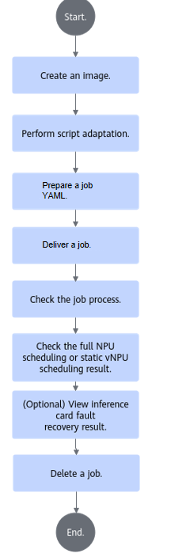
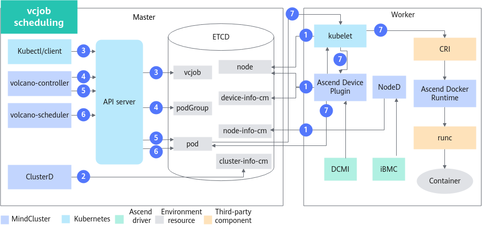
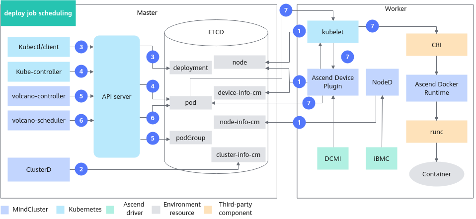

# Full-NPU Scheduling (Inference)<a name="ZH-CN_TOPIC_0000002511347095"></a>

## Before You Start<a name="ZH-CN_TOPIC_0000002511427055"></a>

**Prerequisites<a name="section116017220425"></a>**

To use the full-NPU scheduling feature in command-line scenarios, ensure that the following components are installed. If they are not installed, refer to the [Installation and Deployment](../../developer_guide/installation_deployment/manual_installation/00_obtaining_software_packages.md) section for instructions.

- Scheduler (Volcano or other schedulers)
- Ascend Device Plugin
- Ascend Docker Runtime
- Ascend Operator
- ClusterD
- NodeD

**Usage Method<a name="section91871616135119"></a>**

The usage method of the full-NPU scheduling feature is as follows:

- Use via command line: Install the cluster scheduling components and use the full-NPU scheduling feature through the command line.
- Use after integration: Integrate the cluster scheduling components into an existing third-party AI platform or an AI platform developed based on the cluster scheduling components.

**Usage Notes<a name="section577625973520"></a>**

- Resource monitoring can be used together with all features in the inference scenario.
- When multiple inference jobs run concurrently in a cluster, each job can use different features.
- The inference card fault recovery feature can be used together with the ful-NPU scheduling feature. To enable the inference card fault recovery feature, you only need to set the Ascend Device Plugin startup parameter `-hotReset` to `0` or `2` (the default value is `-1`, which means fault recovery is not supported).
- Full-NPU scheduling supports submitting single-node jobs with a single replica or multiple replicas, where each replica works independently. It only supports inference servers (with Atlas 300I Duo inference cards), Atlas 800I A2 inference servers, and A200I A2 Box heterogeneous subracks for deploying distributed acjob.

**Supported product forms<a name="section169961844182917"></a>**

- The following products support full-NPU scheduling.
    - Inference server (with Atlas 300I inference card)
    - Atlas inference series products
    - Atlas 800I A2 inference server
    - A200I A2 Box heterogeneous subrack
    - Atlas 800I A3 SuperPoD
    - Atlas 350 PCIe card
    - Atlas 850 hardware products
    - Atlas 950 SuperPoD

**Usage Process<a name="section246711128536"></a>**

The process for using the full-NPU scheduling feature through the command line can be seen in [Figure 1](#fig242524985412).

The usage process for using Volcano and other schedulers through the command line is consistent. The main difference is that when using other schedulers, you need to refer to the [Using via Command Line (Other Schedulers)](#ZH-CN_TOPIC_0000002479227152) section to create a job YAML. The remaining operations for using other schedulers are the same as those for using Volcano, and you can refer to [Using via Command Line (Volcano)](#using-via-command-line-volcano) for operations.

**Figure 1** Usage process<a name="fig242524985412"></a>


## Implementation Principles<a name="ZH-CN_TOPIC_0000002479227174"></a>

Depending on the type of inference jobs, the schematic diagram of the feature varies slightly.

**acjob<a name="section9971431567"></a>**

The schematic diagram of acjob is shown in [Figure 1](#fig36890512379).

**Figure 1**  Schematic diagram of acjob scheduling<a name="fig36890512379"></a>


The steps are described as follows:

1. The cluster scheduling components periodically report node and chip information.
    - kubelet reports the number of chips to the node.
    - Ascend Device Plugin periodically reports chip topology information.

        NPU information: Reports the physical ID of the chip to `device-info-cm`; reports the total number of allocatable chips, the number of allocated chips, and basic chip information (device ip and super_device_ip) to the node for full-NPU scheduling.

    - When a fault exists on the node, NodeD periodically reports the health status, hardware fault information, and DPC shared storage fault information of the node to `node-info-cm`.

2. After reading the information in `device-info-cm` and `node-info-cm`, ClusterD writes the information to `cluster-info-cm`.
3. The user delivers an acjob through kubectl or other deep learning platforms.
4. Ascend Operator creates a corresponding PodGroup for the job. For detailed information about PodGroup, refer to the [official open-source Volcano documentation](https://volcano.sh/zh/docs/v1-9-0/podgroup/).
5. Ascend Operator creates the corresponding Pod for the job and injects the environment variables required for collective communication into the container.
6. volcano-scheduler selects appropriate nodes for the job based on node and chip topology information, and writes the selected chip information into the Pod's annotation. For full-NPU scheduling, NPU information is written.
7. When kubelet creates the container, it calls Ascend Device Plugin to mount the chip. Ascend Device Plugin or volcano-scheduler writes the chip information into the Pod's annotation. Ascend Docker Runtime assists in mounting the corresponding resources.
8. Ascend Operator reads Pod's annotation and write the information into `hccl.json`.
9. The container read environment variables or `hccl.json` to set up an communication channel for starting the inference job.

    >[!NOTE]
    >Ascend Operator supports only `hccl.json` generation for PyTorch jobs,

**vcjob<a name="section428321965913"></a>**

The schematic diagram of vcjob is shown in [Figure 2](#fig8231124765).

**Figure 2** Schematic diagram of vcjob scheduling <a name="fig8231124765"></a>


The steps are described as follows:

1. The cluster scheduling components periodically report node and chip information.
    - kubelet reports the number of chips to the node.
    - Ascend Device Plugin periodically reports chip topology information.
        NPU information: Reports the physical ID of the chip to `device-info-cm`; reports the total number of allocatable chips and the number of allocated chips to the node for full-NPU scheduling.

    - When a fault exists on the node, NodeD periodically reports the health status, hardware fault information, and DPC shared storage fault information of the node to `node-info-cm`.

2. After reading the information in `device-info-cm` and `node-info-cm`, ClusterD writes the information to `cluster-info-cm`.
3. The user delivers a vcjob through kubectl or other deep learning platforms.
4. volcano-controller creates a corresponding PodGroup for the job. For detailed information about PodGroup, refer to the [official open-source Volcano documentation](https://volcano.sh/en/docs/v1-9-0/podgroup/).
5. volcano-controller creates the job Pod when the cluster resources meet the conditions.
6. volcano-scheduler select a proper node for the job based on the node and chip topology information, and writes chip information into the Pod's annotation.
7. When kubelet creates a container, it calls Ascend Device Plugin to mount the chip. Ascend Device Plugin writes chip information into the Pod's annotation. Ascend Docker Runtime assists in mounting resources.

**deploy<a name="section148711820709"></a>**

The schematic diagram of deploy job is shown in [Figure 3](#fig178781320593).

**Figure 3** Schematic diagram of deploy job scheduling <a name="fig178781320593"></a>


The steps are described as follows:

1. The cluster scheduling components periodically report node and chip information.
    - kubelet reports the number of chips to the node.
    - Ascend Device Plugin periodically reports chip topology information.
        NPU information: Reports the physical ID of the chip to `device-info-cm`; reports the total number of allocatable chips and the number of allocated chips to the node for full-NPU scheduling.

    - When a fault exists on the node, NodeD periodically reports the health status, hardware fault information, and DPC shared storage fault information of the node to `node-info-cm`.

2. After reading the information in `device-info-cm` and `node-info-cm`, ClusterD writes the information to `cluster-info-cm`.
3. The user delivers a deploy job through kubectl or other deep learning platforms.
4. kube-controller creates the job Pod.
5. volcano-controller creates a corresponding PodGroup for the job. For detailed information about PodGroup, refer to the [official open-source Volcano documentation](https://volcano.sh/en/docs/v1-9-0/podgroup/).
6. volcano-scheduler select a proper node for the job based on the node and chip topology information, and writes chip information into the Pod's annotation.
7. When kubelet creates a container, it calls Ascend Device Plugin to mount the chip. Ascend Device Plugin writes chip information into the Pod's annotation. Ascend Docker Runtime assists in mounting resources.

## Using via Command Line (Volcano)

### Building an Image<a name="ZH-CN_TOPIC_0000002479227156"></a>

**Obtaining an Inference Image<a name="zh-cn_topic_0000001558675566_section971616541059"></a>**

You can obtain the inference image using one of the following methods.

- It is recommended to download the inference base image (e.g., [ascend-infer](https://www.hiascend.com/developer/ascendhub/detail/e02f286eef0847c2be426f370e0c2596), [mindie](https://www.hiascend.com/developer/ascendhub/detail/af85b724a7e5469ebd7ea13c3439d48f)) from the [Ascend Image Repository](https://www.hiascend.com/developer/ascendhub) based on your system architecture (ARM or x86_64).

    Please note that after version 21.0.4, the default user in the inference base image is a non‑root user. You need to modify the default user to `root` after downloading the base image.

    >[!Note]
    >The base image does not contain inference model files, scripts, or other files. Therefore, you need to customize it according to your own requirements (e.g., adding inference scripts, models, etc.) before using it.

- (Optional) If you need a more personalized inference environment, you can further modify the downloaded inference base image using a Dockerfile.

    After completing the custom modifications, you can rename the inference image for easier management and use.

**Hardening the Image<a name="zh-cn_topic_0000001558675566_section1294572963118a"></a>**

The downloaded or customized inference base image can be security‑hardened to improve image security. For details, refer to [Container Security Hardening](../../references/security_hardening.md).

### Script Adaptation<a name="ZH-CN_TOPIC_0000002479227176"></a>

This section uses the inference image from the Ascend Image Repository as an example to describe the procedure for submitting inference tasks. The image already includes example inference scripts; for actual inference scenarios, you will need to prepare your own inference scripts. Before pulling the image, ensure that the network proxy of the current environment has been configured and that you can successfully access the Ascend Image Repository.

**Obtaining Example Scripts from the Ascend Image Repository<a name="section8181015175911"></a>**

1. After confirming that the server can access the internet, go to the [Ascend Image Repository](https://www.hiascend.com/developer/ascendhub).
2. In the left navigation pane, select Inference Images, then select the [mindie](https://www.hiascend.com/developer/ascendhub/detail/af85b724a7e5469ebd7ea13c3439d48f) image to obtain the inference example scripts.

    >[!NOTE]
    >If you do not have download permissions, apply for permissions as prompted on the page. After submitting the application, wait for administrator approval; you can download the image after approval.

### Preparing the Job YAML<a name="ZH-CN_TOPIC_0000002479387148"></a>

>[!NOTE]
> If you are not using Ascend Docker Runtime, Ascend Device Plugin will only help you mount devices under the `/dev` directory. For other directories (such as `/usr`), you must manually modify the YAML file to mount the corresponding driver directories and files. The mount paths inside the container must be consistent with those on the host.
>Because the Atlas 200I SoC A1 core board scenario does not support Ascend Docker Runtime, users do not need to modify the YAML file.

**Procedure<a name="zh-cn_topic_0000001609074213_section14665181617334"></a>**

1. Download the corresponding YAML file.

    **Table 1** YAML files of difference job types and hardware models

    <a name="zh-cn_topic_0000001609074213_table15169151021912"></a>
    <table><thead align="left"><tr id="zh-cn_topic_0000001609074213_row16169201019192"><th class="cellrowborder" valign="top" width="18.48%" id="mcps1.2.5.1.1"><p id="zh-cn_topic_0000001609074213_p4169191017192"><a name="zh-cn_topic_0000001609074213_p4169191017192"></a><a name="zh-cn_topic_0000001609074213_p4169191017192"></a>Job Type</p>
    </th>
    <th class="cellrowborder" valign="top" width="26.479999999999997%" id="mcps1.2.5.1.2"><p id="zh-cn_topic_0000001609074213_p20181111517147"><a name="zh-cn_topic_0000001609074213_p20181111517147"></a><a name="zh-cn_topic_0000001609074213_p20181111517147"></a>Hardware Model</p>
    </th>
    <th class="cellrowborder" valign="top" width="42.59%" id="mcps1.2.5.1.3"><p id="zh-cn_topic_0000001609074213_p181811156149"><a name="zh-cn_topic_0000001609074213_p181811156149"></a><a name="zh-cn_topic_0000001609074213_p181811156149"></a>YAML Name</p>
    </th>
    <th class="cellrowborder" valign="top" width="12.45%" id="mcps1.2.5.1.4"><p id="p1693015221828"><a name="p1693015221828"></a><a name="p1693015221828"></a>Link</p>
    </th>
    </tr>
    </thead>
    <tbody><tr id="zh-cn_topic_0000001609074213_row2169191091919"><td class="cellrowborder" rowspan="3" valign="top" width="18.48%" headers="mcps1.2.5.1.1 "><p id="zh-cn_topic_0000001609074213_p6169510191913"><a name="zh-cn_topic_0000001609074213_p6169510191913"></a><a name="zh-cn_topic_0000001609074213_p6169510191913"></a><span id="zh-cn_topic_0000001609074213_ph183921109162"><a name="zh-cn_topic_0000001609074213_ph183921109162"></a><a name="zh-cn_topic_0000001609074213_ph183921109162"></a>Volcano</span>-scheduled Deployment job</p>
    </td>
    <td class="cellrowborder" valign="top" width="26.479999999999997%" headers="mcps1.2.5.1.2 "><p id="zh-cn_topic_0000001609074213_p8853185832112"><a name="zh-cn_topic_0000001609074213_p8853185832112"></a><a name="zh-cn_topic_0000001609074213_p8853185832112"></a><span id="zh-cn_topic_0000001609074213_ph238151934915"><a name="zh-cn_topic_0000001609074213_ph238151934915"></a><a name="zh-cn_topic_0000001609074213_ph238151934915"></a>Atlas 200I SoC A1 core board</span></p>
    </td>
    <td class="cellrowborder" valign="top" width="42.59%" headers="mcps1.2.5.1.3 "><p id="zh-cn_topic_0000001609074213_p1116971091915"><a name="zh-cn_topic_0000001609074213_p1116971091915"></a><a name="zh-cn_topic_0000001609074213_p1116971091915"></a>infer-deploy-310p-1usoc.yaml</p>
    </td>
    <td class="cellrowborder" valign="top" width="12.45%" headers="mcps1.2.5.1.4 "><p id="p784716567219"><a name="p784716567219"></a><a name="p784716567219"></a><a href="https://gitcode.com/Ascend/mindxdl-deploy/blob/branch_v26.0.0/samples/inference/volcano/infer-deploy-310p-1usoc.yaml" target="_blank" rel="noopener noreferrer">Obtain YAML</a></p>
    </td>
    </tr>
    <tr>
    <td class="cellrowborder" valign="top" headers="mcps1.2.5.1.1 "><p>Atlas 950 SuperPoD</p><p>Atlas 850 hardware products (SuperPoD)</p><p>Atlas 350 PCIe card</p></td>
    <td class="cellrowborder" valign="top" headers="mcps1.2.5.1.2 "><p>infer-deploy-950.yaml</p></td>
    <td class="cellrowborder" valign="top" headers="mcps1.2.5.1.3 "><p><a href="https://gitcode.com/Ascend/mindxdl-deploy/blob/branch_v26.0.0/samples/inference/volcano/infer-deploy-950.yaml" target="_blank" rel="noopener noreferrer">Obtain YAML</a></p>
    </td>
    </tr>
    <tr id="zh-cn_topic_0000001609074213_row17169201091917"><td class="cellrowborder" valign="top" headers="mcps1.2.5.1.1 "><p id="zh-cn_topic_0000001609074213_p14853125832110"><a name="zh-cn_topic_0000001609074213_p14853125832110"></a><a name="zh-cn_topic_0000001609074213_p14853125832110"></a>Other types of inference nodes</p>
    <p id="p1144215219166"><a name="p1144215219166"></a><a name="p1144215219166"></a></p>
    </td>
    <td class="cellrowborder" valign="top" headers="mcps1.2.5.1.2 "><p id="zh-cn_topic_0000001609074213_p51692100191"><a name="zh-cn_topic_0000001609074213_p51692100191"></a><a name="zh-cn_topic_0000001609074213_p51692100191"></a>infer-deploy.yaml</p>
    </td>
    <td class="cellrowborder" valign="top" headers="mcps1.2.5.1.3 "><p id="p74352718168"><a name="p74352718168"></a><a name="p74352718168"></a><a href="https://gitcode.com/Ascend/mindxdl-deploy/blob/branch_v26.0.0/samples/inference/volcano/infer-deploy.yaml" target="_blank" rel="noopener noreferrer">Obtain YAML</a></p>
    </td>
    </tr>
    <tr id="row114428221610"><td class="cellrowborder" rowspan="2" valign="top" width="18.48%" headers="mcps1.2.5.1.1 "><p id="p9442102131620"><a name="p9442102131620"></a><a name="p9442102131620"></a>Volcano Job</p>
    </td>
    <td class="cellrowborder" valign="top" width="26.479999999999997%" headers="mcps1.2.5.1.2 "><p id="p367438101714"><a name="p367438101714"></a><a name="p367438101714"></a><span id="ph313817549316"><a name="ph313817549316"></a><a name="ph313817549316"></a>Atlas 800I A2 inference server</span></p>
    <p id="p20458181019389"><a name="p20458181019389"></a><a name="p20458181019389"></a><span id="ph56342369338"><a name="ph56342369338"></a><a name="ph56342369338"></a>A200I A2 Box heterogeneous subrack</span></p>
    <p id="p1792637151014"><a name="p1792637151014"></a><a name="p1792637151014"></a><span id="ph12174764117"><a name="ph12174764117"></a><a name="ph12174764117"></a>Atlas 800I A3 SuperPoD</span></p>
    </td>
    <td class="cellrowborder" valign="top" width="42.59%" headers="mcps1.2.5.1.3 "><p id="p8442112171619"><a name="p8442112171619"></a><a name="p8442112171619"></a>infer-vcjob-910.yaml</p>
    </td>
    <td class="cellrowborder" valign="top" width="12.45%" headers="mcps1.2.5.1.4 "><p id="p15442424164"><a name="p15442424164"></a><a name="p15442424164"></a><a href="https://gitcode.com/Ascend/mindxdl-deploy/blob/branch_v26.0.0/samples/inference/volcano/infer-vcjob-910.yaml" target="_blank" rel="noopener noreferrer">Obtain YAML</a></p>
    </td>
    </tr>
    <tr>
    <td class="cellrowborder" valign="top" headers="mcps1.2.5.1.1 "><p>Atlas 950 SuperPoD</p><p>Atlas 850 hardware products (SuperPoD)</p><p>Atlas 350 PCIe card</p></td>
    <td class="cellrowborder" valign="top" headers="mcps1.2.5.1.2 "><p>infer-vcjob-950.yaml</p></td>
    <td class="cellrowborder" valign="top" headers="mcps1.2.5.1.3 "><p><a href="https://gitcode.com/Ascend/mindxdl-deploy/blob/branch_v26.0.0/samples/inference/volcano/infer-vcjob-950.yaml" target="_blank" rel="noopener noreferrer">Obtain YAML</a></p>
    </td>
    </tr>
    <tr id="row16861151313547"><td class="cellrowborder" rowspan="3" valign="top" width="18.48%" headers="mcps1.2.5.1.1 "><p id="p6861171325411"><a name="p6861171325411"></a><a name="p6861171325411"></a>Ascend Job</p>
    <p id="p12446175211817"><a name="p12446175211817"></a><a name="p12446175211817"></a></p>
    </td>
    <td class="cellrowborder" valign="top" width="26.479999999999997%" headers="mcps1.2.5.1.2 "><p id="p1328416110919"><a name="p1328416110919"></a><a name="p1328416110919"></a>Inference server (with <span id="ph93658382564"><a name="ph93658382564"></a><a name="ph93658382564"></a>Atlas 300I Duo inference card</span>)</p>
    </td>
    <td class="cellrowborder" valign="top" width="42.59%" headers="mcps1.2.5.1.3 "><p id="p10861813135419"><a name="p10861813135419"></a><a name="p10861813135419"></a>pytorch_acjob_infer_310p_with_ranktable.yaml</p>
    </td>
    <td class="cellrowborder" valign="top" width="12.45%" headers="mcps1.2.5.1.4 "><p id="p1986116136544"><a name="p1986116136544"></a><a name="p1986116136544"></a><a href="https://gitcode.com/Ascend/mindxdl-deploy/blob/branch_v26.0.0/samples/inference/volcano/pytorch_acjob_infer_310p_with_ranktable.yaml" target="_blank" rel="noopener noreferrer">Obtain YAML</a></p>
    </td>
    </tr>
    <tr id="row18446115212811"><td class="cellrowborder" valign="top" headers="mcps1.2.5.1.1 "><p id="p1611216221297"><a name="p1611216221297"></a><a name="p1611216221297"></a><span id="ph10342125017508"><a name="ph10342125017508"></a><a name="ph10342125017508"></a>Atlas 800I A2 inference server</span></p>
    <p id="p1877419343388"><a name="p1877419343388"></a><a name="p1877419343388"></a><span id="ph1311636133812"><a name="ph1311636133812"></a><a name="ph1311636133812"></a>A200I A2 Box heterogeneous subrack</span></p>
    <p id="p1368016125100"><a name="p1368016125100"></a><a name="p1368016125100"></a><span id="ph17176513111020"><a name="ph17176513111020"></a><a name="ph17176513111020"></a>Atlas 800I A3 SuperPoD</span></p>
    </td>
    <td class="cellrowborder" valign="top" headers="mcps1.2.5.1.2 "><p id="p4446185212815"><a name="p4446185212815"></a><a name="p4446185212815"></a>pytorch_multinodes_acjob_infer_<em id="i232224205019"><a name="i232224205019"></a><a name="i232224205019"></a>{</em><em id="i133214249507"><a name="i133214249507"></a><a name="i133214249507"></a>xxx}</em>b_with_ranktable.yaml</p>
    </td>
    <td class="cellrowborder" valign="top" headers="mcps1.2.5.1.3 "><p id="p962512301913"><a name="p962512301913"></a><a name="p962512301913"></a><a href="https://gitcode.com/Ascend/mindxdl-deploy/blob/branch_v26.0.0/samples/inference/volcano/pytorch_multinodes_acjob_infer_910b_with_ranktable.yaml" target="_blank" rel="noopener noreferrer">Obtain YAML</a></p>
    </td>
    </tr>
    <tr>
    <td class="cellrowborder" valign="top" headers="mcps1.2.5.1.1 "><p>Atlas 950 SuperPoD</p><p>Atlas 850 hardware products (SuperPoD)</p><p>Atlas 350 PCIe card</p></td>
    <td class="cellrowborder" valign="top" headers="mcps1.2.5.1.2 "><p>pytorch_multinodes_acjob_infer_950_with_ranktable.yaml</p></td>
    <td class="cellrowborder" valign="top" headers="mcps1.2.5.1.3 "><p><a href="https://gitcode.com/Ascend/mindxdl-deploy/blob/branch_v26.0.0/samples/inference/volcano/pytorch_multinodes_acjob_infer_950_with_ranktable.yaml" target="_blank" rel="noopener noreferrer">Obtain YAML</a></p>
    </td>
    </tr>
    </tbody>
    </table>

2. Upload the YAML file to any directory on the management node, and modify the sample YAML by referring to [YAML Configuration Description](../../api).

3. Based on actual requirements, select a YAML sample and make the following modifications.

    **Table 3**  Operation examples

    <a name="table1990975873315"></a>
    <table><thead align="left"><tr id="row890916589334"><th class="cellrowborder" valign="top" width="50%" id="mcps1.2.3.1.1"><p id="p169091858183312"><a name="p169091858183312"></a><a name="p169091858183312"></a>Feature Name</p>
    </th>
    <th class="cellrowborder" valign="top" width="50%" id="mcps1.2.3.1.2"><p id="p1690905820337"><a name="p1690905820337"></a><a name="p1690905820337"></a>Operation Reference</p>
    </th>
    </tr>
    </thead>
    <tbody><tr id="row690965893312"><td class="cellrowborder" rowspan="5" valign="top" width="50%" headers="mcps1.2.3.1.1 "><p id="p690915813336"><a name="p690915813336"></a><a name="p690915813336"></a>Full-NPU scheduling</p>
    </td>
    <td class="cellrowborder" valign="top" width="50%" headers="mcps1.2.3.1.2 "><p id="p79091587334"><a name="p79091587334"></a><a name="p79091587334"></a><a href="#li1888133815128">Creating a single-processor job on an inference server (with an Atlas 300I inference card)</a></p>
    </td>
    </tr>
    <tr id="row42351537182719"><td class="cellrowborder" valign="top" headers="mcps1.2.3.1.1 "><p id="p11235173717273"><a name="p11235173717273"></a><a name="p11235173717273"></a><a href="#li108651415102917">Creating a distributed job on an inference server (with an Atlas 300I Duo inference card)</a></p>
    </td>
    </tr>
    <tr id="row59097587338"><td class="cellrowborder" valign="top" headers="mcps1.2.3.1.1 "><p id="p99091858183320"><a name="p99091858183320"></a><a name="p99091858183320"></a><a href="#li7275039313101">Creating a single-processor job on Atlas inference products (excluding the Atlas 200I SoC A1 core board and Atlas 300I Duo inference card)</a></p>
    </td>
    </tr>
    <tr id="row1890917580338"><td class="cellrowborder" valign="top" headers="mcps1.2.3.1.1 "><p id="p149091958123319"><a name="p149091958123319"></a><a name="p149091958123319"></a><a href="#li132621943121411">Creating a single-processor job on an Atlas 200I SoC A1 core board</a></p>
    </td>
    </tr>
    <tr id="row1843115298483"><td class="cellrowborder" valign="top" headers="mcps1.2.3.1.1 "><p id="p4432729124818"><a name="p4432729124818"></a><a name="p4432729124818"></a><a href="#li1134113548015">Creating a single-processor job on an Atlas 800I A2 inference server</a></p>
    </td>
    </tr>

    </tbody>
    </table>

    - <a name="li1888133815128"></a>To use the full-NPU scheduling feature, refer to this configuration. Taking `infer-deploy.yaml` as an example, create a single-processor inference job on an inference server (with an Atlas 300I inference card) and enable the scheduling policy. The example is as follows.

        ```Yaml
        apiVersion: apps/v1
        kind: Deployment
        ...
        spec:
          template:
            metadata:
              labels:
                 app: infers
                 host-arch: huawei-arm
                 npu-310-strategy: card     # Schedule by inference card
        ...
            spec:
              schedulerName: volcano        # The scheduler must be Volcano at this time.
              nodeSelector:
                host-arch: huawei-arm    # Optional. Fill in based on the actual situation.
        ...
              containers:
              - image: ubuntu-infer:v1
        ...
              env:
              - name: ASCEND_VISIBLE_DEVICES                       # Ascend Docker Runtime will use this field.
                valueFrom:
                  fieldRef:
                    fieldPath: metadata.annotations['huawei.com/Ascend310']               # Must be consistent with resources.requests below.
                resources:
                  requests:
                    huawei.com/Ascend310: 1                   # Number of chips requested
                  limits:
                    huawei.com/Ascend310: 1
        ...
        ```

    - <a name="li108651415102917"></a>To use the full-NPU scheduling feature, refer to this configuration. Taking `pytorch_acjob_infer_310p_with_ranktable.yaml` as an example, create a distributed inference job on an inference server (with Atlas 300I Duo inference card) and enable the scheduling policy. An example is as follows.

        <pre codetype="yaml">
        apiVersion: mindxdl.gitee.com/v1
        kind: AscendJob
        metadata:
          name: default-infer-test
          labels:
        ...
            app: infers
            npu-310-strategy: chip      # Schedule by Ascend AI Processor
            distributed: "true"         # Distributed inference
            duo: "true"             # Use Atlas 300I Duo inference card
            ring-controller.atlas: ascend-310P  # Identifies the product type of the chip used by the job
            framework: pytorch       # Framework type

        spec:
          schedulerName: volcano     # Takes effect when enableGangScheduling of Ascend Operator is true
          runPolicy:
            schedulingPolicy:
              minAvailable: 2  # Total number of job replicas
              queue: default      # Queue to which the job belongs
          successPolicy: AllWorkers # Prerequisite for job success
          replicaSpecs:
            Master:
              replicas: 1     # Number of job replicas
        ...
                spec:
                  nodeSelector:
                    servertype: Ascend310P
                  containers:
                    - name: ascend         # Must be ascend and cannot be modified
                      image: ubuntu:22.04          # Modify the image name based on the actual situation
        ...
                        - name: ASCEND_VISIBLE_DEVICES
                          valueFrom:
                            fieldRef:
                              fieldPath: metadata.annotations['huawei.com/Ascend310P']       # Mount the corresponding type of chip to the container
        ...
                      ports:                  # Distributed training collective communication port
                        - containerPort: 2222
                          name: ascendjob-port
                      resources:
                        limits:
                          huawei.com/Ascend310P: 1   # Number of chips requested
                        requests:
                          huawei.com/Ascend310P: 1  # Same as the limits value
                      volumeMounts:
        ...
                        - name: ranktable
                          mountPath: /user/serverid/devindex/config
        ...
                  volumes:
        ...
                    - name: ranktable
                      hostPath:
                        path: /user/mindx-dl/ranktable/default.default-infer-test
        ...
            Worker:
        ...
                spec:
                  containers:
                    - name: ascend     # Must be ascend, cannot be modified
                      image: ubuntu:22.04      # Modify the image name based on the actual situation
                      env:
        ...
                        - name: ASCEND_VISIBLE_DEVICES
                          valueFrom:
                            fieldRef:
                              fieldPath: metadata.annotations['huawei.com/Ascend310P']      # Mount the corresponding type of chips to the container
        ...
                      ports:     # Distributed training collective communication port
                        - containerPort: 2222
                          name: ascendjob-port
                      resources:
                        limits:
                          huawei.com/Ascend310P: 1   # Number of chips requested
                        requests:
                          huawei.com/Ascend310P: 1   # Consistent with the limits value
                      volumeMounts:
        ...
          # Optional. Use Ascend Operator to generate a RankTable file for the PyTorch and MindSpore frameworks. Add the following bold fields to set the save path for the hccl.json file in the container.
                        <strong>- name: ranktable</strong>
                          <strong>mountPath: /user/serverid/devindex/config</strong>
        ...
                  volumes:
        ...
          # Optional. Use Ascend Operator to generate a RankTable file for the PyTorch framework. You need to add the following bold fields to set the save path of the hccl.json file.
                    <strong>- name: ranktable</strong>
                      <strong>hostPath:</strong>
                        <strong>path: /user/mindx-dl/ranktable/default.default-infer-test  # Shared storage or local storage path. Modify it based on the actual situation.</strong>
        ...</pre>

    - <a name="li7275039313101"></a>To use the full-NPU scheduling feature, refer to this configuration. Taking `infer-deploy.yaml` as an example, create a single-processor inference job that does not use the hybrid mode on an Atlas inference product (not an Atlas 200I SoC A1 core board or Atlas 300I Duo inference card). The example is as follows.

        ```Yaml
        apiVersion: apps/v1
        kind: Deployment
        ...
        spec:
          template:
            metadata:
              labels:
                 app: infers
        ...
            spec:
              affinity:        # This code segment indicates that the job is not scheduled to the Atlas 200I SoC A1 core board.
                nodeAffinity:
                  requiredDuringSchedulingIgnoredDuringExecution:
                    nodeSelectorTerms:
                      - matchExpressions:
                          - key: servertype
                            operator: NotIn
                            values:
                              - soc
              schedulerName: volcano
              nodeSelector:
                host-arch: huawei-arm
        ...
              containers:
              - image: ubuntu-infer:v1
        ...
              env:
              - name: ASCEND_VISIBLE_DEVICES                       # The Ascend Docker Runtime will use this field.
                valueFrom:
                  fieldRef:
                    fieldPath: metadata.annotations['huawei.com/Ascend310P']               # Mount the corresponding type of chip to the container
        ...
                resources:
                  requests:
                    huawei.com/Ascend310P: 1     # Number of chips requested
                  limits:
                    huawei.com/Ascend310P: 1
        ...
        ```

        >[!NOTE]
        >Because the directories and files that need to be mounted on Atlas 200I SoC A1 core board nodes are different from those on other types of nodes, to avoid inference failures, if you need to use Atlas inference chips and there are Atlas 200I SoC A1 core board nodes in the cluster but you do not want to schedule jobs to such nodes, add the `affinity` field in the sample YAML to indicate that jobs should not be scheduled to nodes with the `servertype=soc` label.

    - <a name="li132621943121411"></a>To use the full-NPU scheduling feature, refer to this configuration. Taking `infer-deploy-310p-1usoc.yaml` as an example, create a single-processor inference job on an Atlas 200I SoC A1 core board node (which does not support mixed insertion mode). The example is as follows.

        ```Yaml
        apiVersion: apps/v1
        kind: Deployment
        ...
        spec:
          template:
            metadata:
              labels:
                 app: infers
        ...
            spec:
              schedulerName: volcano
              nodeSelector:
                host-arch: huawei-arm
                servertype: soc      # This label indicates that scheduling is only allowed on Atlas 200I SoC A1 core board nodes
        ...
              containers:
              - image: ubuntu-infer:v1
        ...
              env:
              - name: ASCEND_VISIBLE_DEVICES                       # Ascend Docker Runtime uses this field
                valueFrom:
                  fieldRef:
                    fieldPath: metadata.annotations['huawei.com/Ascend310P']               # Mount the corresponding type of chip to the container
        ...
                resources:
                  requests:
                    huawei.com/Ascend310P: 1     # Number of chips requested
                  limits:
                    huawei.com/Ascend310P: 1
        ...
        ```

    - <a name="li1134113548015"></a>To use the full-NPU scheduling feature, refer to this configuration. Taking `infer-vcjob-910.yaml` as an example, create a single-processor inference job on an Atlas 800I A2 inference server. The example is as follows.

        ```Yaml
        apiVersion: batch.volcano.sh/v1alpha1
        kind: Job
        metadata:
          name: mindx-infer-test
          namespace: vcjob                      # Select an appropriate namespace based on the actual situation
          labels:
            ring-controller.atlas: ascend-{xxx}b
            fault-scheduling: "force"
        spec:
        ...
            template:
              metadata:
                labels:
                  app: infer
                  ring-controller.atlas: ascend-{xxx}b
              spec:
                containers:
                  - image: infer_image:latest             # Inference image name, subject to actual conditions
        ...
              env:
              - name: ASCEND_VISIBLE_DEVICES                       # Ascend Docker Runtime uses this field
                valueFrom:
                  fieldRef:
                    fieldPath: metadata.annotations['huawei.com/Ascend910']               # Must be consistent with resources.requests below
                      requests:
                        huawei.com/Ascend910: 1          # Required number of chips
                      limits:
                        huawei.com/Ascend910: 1          # Must be consistent with the value of requests.
                    volumeMounts:
                      - name: localtime                  # The container time must be consistent with the host time
                        mountPath: /etc/localtime
                nodeSelector:
                  host-arch: huawei-arm                  # Configure based on actual conditions
                  accelerator-type: module-{xxx}b-8      # Atlas 800I A2 inference server
                volumes:
                - name: localtime
                  hostPath:
                    path: /etc/localtime
                restartPolicy: OnFailure
        ```

4. Mount the weight file.

    ```Yaml
    ...
                  ports:     # Distributed training collective communication port
                    - containerPort: 2222
                      name: ascendjob-port
                  resources:
                    limits:
                      huawei.com/Ascend310P: 1   # Number of chips requested
                    requests:
                      huawei.com/Ascend310P: 1   # Consistent with the limits value
                  volumeMounts:
    ...
                      # Weight file mount path
                    - name: weights
                      mountPath: /path-to-weights
    ...
              volumes:
    ...
                # Weight file mount path
                - name: weights
                  hostPath:
                    path: /path-to-weights  # Shared storage or local storage path. Modify it based on the actual situation.
    ...
    ```

    >[!NOTE]
    >- `/path-to-weights` denotes the path to your model weights. You are responsible for preparing the weights yourself. For downloading the mindie image, please follow the instructions provided in `$ATB\_SPEED\_HOME\_PATH/examples/models/llama3/README.md`.
    >- `ATB_SPEED_HOME_PATH` defaults to `/usr/local/Ascend/atb-models` and is automatically set when you source the `set_env.sh` script from the model repository—no manual setting is needed.

5. In the example YAML file, edit the container startup command (the `command` field). If it is not present, you must add it.

    ```Yaml
    ...
          containers:
          - image: ubuntu-infer:v1
    ...
            command: ["/bin/bash", "-c", "cd $ATB_SPEED_HOME_PATH; python examples/run_pa.py --model_path /path-to-weights"]
            resources:
              requests:
    ...
    ```

### Delivering a Job<a name="ZH-CN_TOPIC_0000002479387146"></a>

In the directory containing the example YAML file on the management node, run the following command to deliver the inference job using the YAML file.

```shell
kubectl apply -f XXX.yaml
```

Example:

```shell
kubectl apply -f infer-310p-1usoc.yaml
```

Output:

```ColdFusion
job.batch/resnetinfer1-2 created
```

>[!NOTE]
>If the job YAML is modified after the job is delivered, run `kubectl delete -f _XXX_.yaml` to delete the original job, and deliver it again.

### Viewing the Job Progress<a name="ZH-CN_TOPIC_0000002511347103"></a>

**Procedure<a name="zh-cn_topic_0000001609474293_section96791230183711"></a>**

1. <a name="ZH-CN_TOPIC_0000002511347103_li96791230183711"></a>Run the following command to check the Pod running status.

    ```shell
    kubectl get pod --all-namespaces
    ```

    Command output:

    ```ColdFusion
    NAMESPACE        NAME                                       READY   STATUS    RESTARTS   AGE
    ...
    default          resnetinfer1-2-scpr5                      1/1     Running   0          8s
    ...
    ```

2. Run the following command to view the details of the node running the inference job.

    ```shell
    kubectl describe node <hostname>
    ```

    For example:

    ```shell
    kubectl describe node ubuntu
    ```

    - Command output for full-NPU scheduling:

        ```ColdFusion
        ...
        Allocated resources:
          (Total limits may be over 100 percent, i.e., overcommitted.)
          Resource              Requests     Limits
          --------              --------     ------
          cpu                   4 (2%)       3500m (1%)
          memory                2140Mi (0%)  4040Mi (0%)
          ephemeral-storage     0 (0%)       0 (0%)
          huawei.com/Ascend310P  1            1
        Events:
          Type    Reason    Age   From                Message
          ----    ------    ----  ----                -------
          Normal  Starting  36m   kube-proxy, ubuntu  Starting kube-proxy.
        ...
        ```

        In the displayed information, locate `huawei.com/Ascend310P` under `Allocated resources`. The value of this parameter increases after the inference job is executed, and the increment equals the number of NPU chips used by the inference job.

    >[!NOTE]
    >- If you are using Atlas inference s in non-mixed insertion mode, the field above is displayed as `Ascend310P`.
    >- If you are using Atlas inference products in mixed insertion mode, the field above is displayed as one of `Ascend310P-V`, `Ascend310P-VPro`, or `Ascend310P-IPro`.

### Viewing Full-NPU Scheduling Results<a name="ZH-CN_TOPIC_0000002511347083"></a>

**Procedure<a name="zh-cn_topic_0000001558675486_section96791230183711"></a>**

Run the following command on the management node to view the inference results.

```shell
kubectl logs -f resnetinfer1-2-scpr5
```

The following output is for reference only.

```ColdFusion
[2025-02-24 19:13:09,331] [2269] [281472887965984] [llm] [INFO] [logging.py-331] : Answer[0]:  Deep learning is a subset of machine learning that uses neural networks with multiple layers to model complex relationships between
[2025-02-24 19:13:09,331] [2269] [281472887965984] [llm] [INFO] [logging.py-331] : Generate[0] token num: (0, 20)
```

>[!NOTE]
><i>resnetinfer1-2-scpr5</i> is the job Pod name created in [Step 1](#ZH-CN_TOPIC_0000002511347103_li96791230183711).

### (Optional) Viewing Inference Card Fault Recovery Results<a name="ZH-CN_TOPIC_0000002511427061"></a>

When an NPU fails, Volcano automatically schedules inference jobs running on that NPU to other nodes (other schedulers do not support this feature; users must implement it themselves). Ascend Device Plugin then performs a reset operation on the NPU to restore it to a healthy state. You can check NPU information using the `npu-smi info` command. If the `health` field for the faulty NPU displays `OK`, the NPU has been restored to a healthy state.

>[!NOTE]
>To enable the NPU reset function provided by Ascend Device Plugin, ensure that no inference jobs are running on the faulty NPU or that they have already been evicted. If you are using another scheduler that does not support rescheduling, you can manually delete the inference jobs on that NPU.

### Deleting a Job<a name="ZH-CN_TOPIC_0000002511427043"></a>

In the directory where the sample YAML is located, run the following command to delete the corresponding inference job.

```shell
kubectl delete -f XXX.yaml
```

Example:

```shell
kubectl delete -f infer-310p-1usoc.yaml
```

Command output:

```ColdFusion
root@ubuntu:/home/test/yaml# kubectl delete -f infer-310p-1usoc.yaml
job "resnetinfer1-2" deleted
```

## Using via Command Line (Other Schedulers)<a name="ZH-CN_TOPIC_0000002479227152"></a>

The usage flow for the command-line interface (other schedulers) is the same as that for the command-line interface (Volcano). The only difference lies in the job YAML file. After preparing the appropriate YAML, refer to [Using via Command Line (Volcano)](#using-via-command-line-volcano).

**Procedure<a name="section1290513712233"></a>**

1. Download the corresponding YAML file.

    **Table 1** YAML files of different job types and hardware models

    <a name="zh-cn_topic_0000001609074213_table15169151021912"></a>
    <table><thead align="left"><tr id="zh-cn_topic_0000001609074213_row16169201019192"><th class="cellrowborder" valign="top" width="20%" id="mcps1.2.5.1.1"><p id="zh-cn_topic_0000001609074213_p4169191017192"><a name="zh-cn_topic_0000001609074213_p4169191017192"></a><a name="zh-cn_topic_0000001609074213_p4169191017192"></a>Job Type</p>
    </th>
    <th class="cellrowborder" valign="top" width="20%" id="mcps1.2.5.1.2"><p id="zh-cn_topic_0000001609074213_p20181111517147"><a name="zh-cn_topic_0000001609074213_p20181111517147"></a><a name="zh-cn_topic_0000001609074213_p20181111517147"></a>Hardware Model</p>
    </th>
    <th class="cellrowborder" valign="top" width="40%" id="mcps1.2.5.1.3"><p id="zh-cn_topic_0000001609074213_p181811156149"><a name="zh-cn_topic_0000001609074213_p181811156149"></a><a name="zh-cn_topic_0000001609074213_p181811156149"></a>YAML File</p>
    </th>
    <th class="cellrowborder" valign="top" width="20%" id="mcps1.2.5.1.4"><p id="p1510912587514"><a name="p1510912587514"></a><a name="p1510912587514"></a>Link</p>
    </th>
    </tr>
    </thead>
    <tbody><tr id="zh-cn_topic_0000001609074213_row81696106197"><td class="cellrowborder" rowspan="2" valign="top" width="20%" headers="mcps1.2.5.1.1 "><p id="zh-cn_topic_0000001609074213_p18169161011913"><a name="zh-cn_topic_0000001609074213_p18169161011913"></a><a name="zh-cn_topic_0000001609074213_p18169161011913"></a><span id="zh-cn_topic_0000001609074213_ph1319220540374"><a name="zh-cn_topic_0000001609074213_ph1319220540374"></a><a name="zh-cn_topic_0000001609074213_ph1319220540374"></a>Job in K8s</span> or other scheduler scenarios</p>
    </td>
    <td class="cellrowborder" valign="top" width="20%" headers="mcps1.2.5.1.2 "><p id="zh-cn_topic_0000001609074213_p4169310141916"><a name="zh-cn_topic_0000001609074213_p4169310141916"></a><a name="zh-cn_topic_0000001609074213_p4169310141916"></a><span id="zh-cn_topic_0000001609074213_ph1355971413491"><a name="zh-cn_topic_0000001609074213_ph1355971413491"></a><a name="zh-cn_topic_0000001609074213_ph1355971413491"></a>Atlas 200I SoC A1 core board</span></p>
    </td>
    <td class="cellrowborder" valign="top" width="40%" headers="mcps1.2.5.1.3 "><p id="zh-cn_topic_0000001609074213_p17169210171914"><a name="zh-cn_topic_0000001609074213_p17169210171914"></a><a name="zh-cn_topic_0000001609074213_p17169210171914"></a>infer-310p-1usoc.yaml</p>
    </td>
    <td class="cellrowborder" rowspan="2" valign="top" width="20%" headers="mcps1.2.5.1.4 "><p id="p63731221566"><a name="p63731221566"></a><a name="p63731221566"></a><a href="https://gitcode.com/Ascend/mindxdl-deploy/tree/branch_v26.0.0/samples/inference/without-volcano" target="_blank" rel="noopener noreferrer">Obtain YAML</a></p>
    </td>
    </tr>
    <tr id="zh-cn_topic_0000001609074213_row63291517182014"><td class="cellrowborder" valign="top" headers="mcps1.2.5.1.1 "><p id="zh-cn_topic_0000001609074213_p13330817142010"><a name="zh-cn_topic_0000001609074213_p13330817142010"></a><a name="zh-cn_topic_0000001609074213_p13330817142010"></a>Other inference nodes</p>
    </td>
    <td class="cellrowborder" valign="top" headers="mcps1.2.5.1.2 "><p id="zh-cn_topic_0000001609074213_p433071711206"><a name="zh-cn_topic_0000001609074213_p433071711206"></a><a name="zh-cn_topic_0000001609074213_p433071711206"></a>infer.yaml</p>
    </td>
    </tr>
    </tbody>
    </table>

2. Upload the YAML file to any directory on the management node, and modify the file content based on actual conditions by referring to [YAML Configuration Description](../../api/).

3. Modify the YAML example based on actual requirements as follows.

    **Table 3** Operation example

    <a name="table1819282912379"></a>
    <table><thead align="left"><tr id="row1719292923716"><th class="cellrowborder" valign="top" width="50%" id="mcps1.2.3.1.1"><p id="p219217290379"><a name="p219217290379"></a><a name="p219217290379"></a>Feature Name</p>
    </th>
    <th class="cellrowborder" valign="top" width="50%" id="mcps1.2.3.1.2"><p id="p81921229193710"><a name="p81921229193710"></a><a name="p81921229193710"></a>Operation Reference</p>
    </th>
    </tr>
    </thead>
    <tbody><tr id="row19193152915372"><td class="cellrowborder" rowspan="3" valign="top" width="50%" headers="mcps1.2.3.1.1 "><p id="p1619313291370"><a name="p1619313291370"></a><a name="p1619313291370"></a>Full-NPU scheduling</p>
    </td>
    <td class="cellrowborder" valign="top" width="50%" headers="mcps1.2.3.1.2 "><p id="p1719312293376"><a name="p1719312293376"></a><a name="p1719312293376"></a><a href="#li18881338151288">Creating a single-processor job on an Atlas inference product node (non-Atlas 200I SoC A1 core board)</a></p>
    </td>
    </tr>
    <tr id="row18193142910374"><td class="cellrowborder" valign="top" headers="mcps1.2.3.1.1 "><p id="p161931629153719"><a name="p161931629153719"></a><a name="p161931629153719"></a><a href="#li727503931310">Creating a single-processor job on an Atlas 200I SoC A1 core board</a></p>
    </td>
    </tr>
    <tr id="row119193361316"><td class="cellrowborder" valign="top" headers="mcps1.2.3.1.1 "><p id="p4432729124818"><a name="p4432729124818"></a><a name="p4432729124818"></a><a href="#li11341135480159">Creating a single-processor job on an Atlas 800I A2 inference server</a></p>
    </td>
    </tr>

    </tbody>
    </table>

    - <a name="li18881338151288"></a>Taking `infer.yaml` as an example, create a single-processor job on an Atlas inference product (not Atlas 200I SoC A1 core board).

        ```Yaml
        apiVersion: batch/v1
        kind: Job
        metadata:
          name: resnetinfer1-1
        spec:
          template:
            spec:
              nodeSelector:
                host-arch: huawei-arm    # Optional. Fill in based on the actual situation.
              affinity:        # This section indicates that scheduling is not allowed on Atlas 200I SoC A1 core board nodes.
                nodeAffinity:
                  requiredDuringSchedulingIgnoredDuringExecution:
                    nodeSelectorTerms:
                      - matchExpressions:
                          - key: servertype
                            operator: NotIn
                            values:
                              - soc
              containers:
              - image: ubuntu-infer:v1
        ...
                resources:
                  requests:
                    huawei.com/Ascend310P: 1
                  limits:
                    huawei.com/Ascend310P: 1
        ...
        ```

    - <a name="li727503931310"></a>Taking `infer-310p-1usoc.yaml` as an example, create a single-processor inference job on an Atlas 200I SoC A1 core board (non-mixed insertion mode).

        ```Yaml
        apiVersion: batch/v1
        kind: Job
        metadata:
          name: resnetinfer1-1-1usoc
        spec:
          template:
            spec:
              nodeSelector:
                host-arch: huawei-arm     # Optional. Fill in based on the actual situation.
                servertype: soc               # This label indicates that scheduling is only allowed on Atlas 200I SoC A1 core board nodes.
              containers:
              - image: ubuntu-infer:v1
        ...
                resources:
                  requests:
                    huawei.com/Ascend310P: 1
                  limits:
                    huawei.com/Ascend310P: 1
        ...
        ```

        >[!NOTE]
        >Because the directories and files that need to be mounted on Atlas 200I SoC A1 core board nodes differ from those on other node types, to avoid inference failures, if you are using Atlas inference series products and your cluster contains Atlas 200I SoC A1 core board nodes but you do not want to schedule jobs to such nodes, add the `affinity` field to the example YAML to indicate that jobs should not be scheduled to nodes labeled `servertype=soc`.

    - <a name="li11341135480159"></a>To use full-NPU scheduling, refer to this configuration. Taking `infer.yaml` as an example, create a single-processor inference job on an Atlas 800I A2 inference server.

        ```Yaml
        apiVersion: batch/v1
        kind: Job
        metadata:
          name: resnetinfer1-1
        spec:
          template:
            spec:
              nodeSelector:
                host-arch: huawei-arm   # Optional. Fill in according to the actual situation.
        ...
              containers:
              - image: ubuntu-infer:v1
        ...
                resources:
                  requests:
                    huawei.com/Ascend910: 1
                  limits:
                    huawei.com/Ascend910: 1
        ...
        ```

## Using After Integration<a name="ZH-CN_TOPIC_0000002479387128"></a>

This section requires you to be familiar with programming and development, and have a certain understanding of K8s. If you already have an AI platform or want to develop an AI platform based on cluster scheduling components, complete the following:

1. Find the corresponding K8s [official API library](https://github.com/kubernetes-client) based on your programming language.
2. Use the API library provided by K8s to create, query, and delete jobs.
3. When creating, querying, or deleting jobs, convert the content of the [sample YAML](#preparing-the-job-yaml) into objects defined in the K8s official APIs, and send them to the K8s API Server through the APIs provided in the official library, or convert the YAML content to JSON format and send it directly to the K8s API Server.
