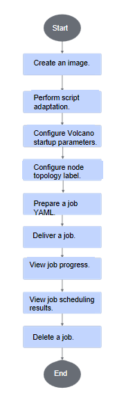
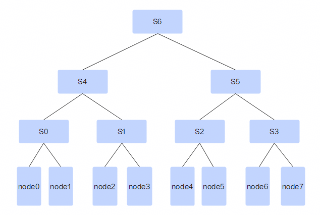

# Multi-level Scheduling<a name="ZH-CN_TOPIC_000000987564duoji"></a>

## Before You Start<a name="ZH-CN_TOPIC_0000002511987564duoji"></a>

**Prerequisites<a name="section52051339787duoji"></a>**

Before using the multi-level scheduling feature in command-line scenarios, ensure that the following components are installed. If they are not installed, refer to [Installation and Deployment](../../developer_guide/installation_deployment/manual_installation/00_obtaining_software_packages.md) for instructions. The multi-level scheduling feature supports only Volcano as the scheduler; other schedulers are not supported.

- Volcano
- Ascend Device Plugin
- Ascend Docker Runtime
- Ascend Operator
- ClusterD
- NodeD

**Usage<a name="section179431435174811duoji"></a>**

- Using via command line: Install cluster scheduling components and use the multi-level scheduling feature through the command line.
- Using after integration: Integrate cluster scheduling components into an existing third-party AI platform or an AI platform developed based on these components.

**Usage Notes<a name="section577625973520duoji"></a>**

The multi-level scheduling feature only supports distributed jobs whose job Pod replicas are configured with full-node NPU resources.

**Supported Product Forms<a name="section169961844182917duoji"></a>**

- Atlas 900 A3 SuperPoD
- Atlas 9000 A3 SuperPoD cluster computing system

**Usage Process**

For the process of using the multi-level scheduling feature through the command line, see [Figure 1](#fig2425249866601duoji).

**Figure 1**  Usage flow<a name="fig2425249866601duoji"></a>


## Implementation Principles<a name="ZH-CN_TOPIC_0000002479387150duoji"></a>

Multi-level scheduling is an advanced scheduling strategy within the ascend-for-volcano plugin, designed specifically for NPU clusters with complex network topologies. Through an innovative resource tree structure and intelligent scheduling algorithms, it abstracts cluster resources into a multi-level hierarchy, providing NPU clusters with efficient, flexible, and reliable scheduling capabilities. This feature is particularly suitable for large-scale distributed training jobs, as it can schedule jobs based on actual network-level affinity, improving cluster resource utilization.

**Core Concepts**

- Resource tree: Foundation of multi-level scheduling, which organizes cluster resources according to physical or logical hierarchies.

  - Root: Represents the resources of the entire cluster that belong to the same topology network. A single multi-level scheduling task can only be scheduled to a single topology network.
  - Intermediate nodes: Represent resource aggregation at different levels (such as racks, switches, etc.).
  - Leaf nodes: Represent specific computing resources (servers).

  For the network levels in the resource tree, refer to the `HyperNode` definition in Volcano's [Network Topology Aware Scheduling](https://volcano.sh/en/docs/network_topology_aware_scheduling/) feature.

  **Figure 1**  Resource tree example<a name="fig69396965487duoji"></a>
  

- The first-layer switches S0-S3 are directly connected to the worker nodes.
- The second-layer switch S4 is connected to switches S0 and S1, and S5 is connected to switches S2 and S3.
- The third-layer switch S6 is connected to switches S4 and S5.

In the preceding sample structure:

- node0 and node1 both belong to S0, so they have the highest communication efficiency.
  - Communication between node0 and node2 requires passing through the Layer-2 switch, resulting in lower communication efficiency.
  - Communication between node0 and node4 requires passing through the Layer-3 switch, resulting in the lowest communication efficiency.

  The actual hardware networking mode can be mapped to one or more tree structures for subsequent task scheduling. For details on resource tree configuration in multi-level scheduling scenarios, see [Configuring Volcano Startup Parameters](#configuring-volcano-startup-parameters).

- Task tree: Represents the multi-level resource requirements of a job.

  - Each layer corresponds to a level of the resource tree.
  - The size of each layer indicates the number of resource nodes required at that level.
  - The task tree reflects the distributed topology requirements of the job.

- Scheduling tree: A temporary structure built on the resource tree to execute scheduling algorithms.

  - Contains scheduling information such as the allocability and fragmentation score of resource nodes.
  - Supports resource reservation and fragmentation optimization.
  - The scheduling tree is the primary object operated on by the scheduling algorithm.

**Scheduling Process**

- Job validation phase

  Before scheduling begins, the system validates the job:

  1. Check NPU resource requirements: Ensure that the distributed job requests complete node NPU resources.
  2. Verify multi-level configuration: Parse and verify that the job's tiered configuration is valid.

- Resource tree construction phase

  1. Collect healthy nodes: Filter out available NPU nodes.
  2. Build resource tree: Build a multi-level resource tree based on the nodes' topology labels.

- Scheduling execution phase

  1. Create a scheduling tree: Create a scheduling tree based on the resource tree and add scheduling-related attributes.
  2. Initialize nodes: Calculate the number of assignable tasks and the fragmentation score for each node.
  3. Execute the scheduling algorithm:

     - Prioritize scheduling using non-reserved resources. If scheduling fails, attempt to use reserved resources for scheduling.
     - Select the scheduling scheme with the lowest fragmentation score.

## Using via Command Line (Volcano) <a name="ZH-CN_TOPIC_0000002479227158duoji"></a>

>[!NOTE]
>
>The multi-level scheduling feature is configured based on full-NPU scheduling or static vNPU scheduling (training).

### Creating an Image <a name="ZH-CN_TOPIC_0000002479227164duoji"></a>

For details, see [Creating an Image](./03_full_npu_scheduling_and_static_vnpu_scheduling_training.md).

### Script Adaptation <a name="ZH-CN_TOPIC_0000002511347097duoji"></a>

For details, see [Script Adaptation](./03_full_npu_scheduling_and_static_vnpu_scheduling_training.md#script-adaptation).

### Configuring Volcano Startup Parameters<a name="ZH-CN_TOPIC_000000251196358duoji"></a>

In `volcano-v{version}.yaml`, configure the Volcano startup parameters based on the actual network cluster topology.

```Yaml
...
data:
  volcano-scheduler.conf: |
...
    configurations:
      - name: init-params
        arguments: {"grace-over-time":"900","presetVirtualDevice":"true","nslb-version":"1.0","shared-tor-num":"2","useClusterInfoManager":"false","self-maintain-available-card":"true","super-pod-size": "48","reserve-nodes": "2","forceEnqueue":"true","resource-level-config": '{"default":  {"level1": {"label": "huawei.com/topotree.superpodid", "reservedNode": 1}, "level2": {"label": "huawei.com/topotree.groupid"}}}'}
...
```

The preceding example shows the configured  network tree `default`. The node label corresponding to the network level1 is `huawei.com/topotree.superpodid`, the number of reserved nodes in each level1 node group is `1`, and the node label corresponding to the network level2 is `huawei.com/topotree.groupid`. Volcano obtains the network topology information of nodes in the cluster through node labels.

>[!NOTE]
>
>If the above configurations are modified after Volcano is started, you need to re-run the `kubectl apply volcano-v{version}.yaml` command and restart the Pods of Volcano for the configurations to take effect.

### Configuring Node Network Topology Labels<a name="ZH-CN_TOPIC_00000025666duoji"></a>

Node labels are used to identify the node network hierarchy and need to be configured by users based on the actual network topology in the cluster.
Ascend Device Plugin automatically obtains the valid SuperPoD ID corresponding to the node through the Ascend hardware driver and adds it to the `huawei.com/topotree.superpodid` label after Ascend Device Plugin starts.

Users can add labels to nodes in the following ways:

- [Adding Node Labels Manually](#adding-node-labels-manually)
- [Adding Node Labels via Script](#adding-node-labels-via-script)

The keys and values of the labels required on the node are as follows:

- Use `huawei.com/topotree` as the key of the node label, and the name of the network topology tree in the Volcano Scheduler startup parameter configuration as the value. The Ascend Volcano plugin will classify nodes with the same `huawei.com/topotree` label value into the same topology tree during task scheduling. If the `huawei.com/topotree` label is not configured on a node, Volcano will, by default, consider the node as belonging to the default topology tree during scheduling.
- The value of the `label` field in the network layer definition configured in the Volcano Scheduler topology startup parameter configuration serves as the key, and the node's ID in the physical network layer serves as the value. The value must be unique within the cluster.

#### Adding Node Labels Manually

Add labels to cluster nodes using the `kubectl` command or the K8s API. For details, see the [K8s community documentation](https://kubernetes.io/docs/concepts/overview/working-with-objects/labels/).

#### Adding Node Labels via Script

Manually adding node labels using `kubectl` commands is inefficient and error-prone. To address this, MindCluster provides an automated deployment script for adding node labels, replacing tedious manual operations. Users only need to provide basic label configuration information, and the script will automatically complete the addition or removal of node labels using `kubectl` commands.

**Prerequisites**

- Python is installed in the environment.
- A KubeConfig file and the kubectl binary tool are available, and the kubectl tool can communicate normally with the K8s cluster.
- The CSV configuration file is ready.

**Procedure**

1. Obtain the source code from the `MindCluster-Samples` repository and go to the `multilevel-label-tool` directory.

    ```shell
    git clone https://gitcode.com/Ascend/mindcluster-deploy.git && cd mindcluster-deploy/multilevel-label-tool
    ```

2. (Optional) Create and activate a Python virtual environment. This allows different Python projects to use different versions of libraries without interfering with each other.

    ```shell
    python -m venv venv && source venv/bin/activate
    ```

    Use Python or Python3 depending on the actual environment.

3. Install dependencies.

    ```shell
    pip install -r requirements.txt
    ```

4. Prepare the network configuration file.

   The configuration file is in CSV format. The first row of the header contains nodeName and the node label key in sequence. Each subsequent row contains the node name and node label value in the cluster. The following is an example:

    ```csv
    nodeName,huawei.com/topotree,huawei.com/topotree.groupid
    node0,default,0
    node1,default,0
    ...
    node192,default,1
    node193,default,1
    ...
    ```

   For the Atlas 9000 A3 SuperPoD cluster computing system, you can generate a network configuration CSV file by using a script together with an LLD document in XLSX format. The command is as follows:

    ```shell
    python3 lld_parser.py --input {LLD file path}  --output {Generated csv configuration file path} --topotree-name default
    ```

    If the following information is displayed, the configuration file has been generated successfully.

    ```ColdFusion
    ...
    CSV file successfully generated: {Generated csv configuration file name}
    ...
    ```

5. Run the script to add node labels.

    ```shell
    python3 label-tool.py apply --config-path {csv configuration file path}
    ```

    If the following information is displayed, the node labels have been added successfully.

    ```ColdFusion
    Adding labels completed successfully!
    ```

>[!NOTE]
>For other detailed instructions, see the `-h` parameter of each script or the README in the `multilevel-label-tool` directory.

### Preparing the Job YAML<a name="ZH-CN_TOPIC_000000296583duoji"></a>

#### Select a YAML Example<a name="ZH-CN_TOPIC_0000002479duoji"></a>

Multi-level scheduling tasks are configured additionally on top of full-NPU scheduling or static vNPU scheduling (training). The following YAML examples illustrate this.

**Table 1** YAML examples

<a name="table57051049102614duoji"></a>
<table><thead align="left"><tr><th class="cellrowborder" valign="top" width="8.799999999999999%" id="mcps1.2.7.1.1"><p>Job Type</p>
</th>
<th class="cellrowborder" valign="top" width="11.65%" id="mcps1.2.7.1.3"><p>Training Framework</p>
</th>
<th class="cellrowborder" valign="top" width="39.269999999999996%" id="mcps1.2.7.1.4"><p>YAML File Name</p>
</th>
<th class="cellrowborder" valign="top" width="10.280000000000001%" id="mcps1.2.7.1.5"><p>Description</p>
</th>
<th class="cellrowborder" valign="top" width="15%" id="mcps1.2.7.1.6"><p>Link</p>
</th>
</tr>
</thead>
<tbody><tr id="row570610499268"><td class="cellrowborder" rowspan="2" valign="top" width="8.799999999999999%" headers="mcps1.2.7.1.1 "><p>Ascend Job</p>
</td>
<td class="cellrowborder" valign="top" headers="mcps1.2.7.1.1 "><p><span>PyTorch</span></p>
</td>
<td class="cellrowborder" valign="top" headers="mcps1.2.7.1.2 "><p>pytorch_multinodes_acjob_super_pod.yaml</p>
</td>
<td class="cellrowborder" rowspan="2" valign="top" width="10.280000000000001%" headers="mcps1.2.7.1.5 "><p id="p3707749162616"><a name="p3707749162616"></a><a name="p3707749162616"></a>The example defaults to a two-node job.</p>
</td>
<td class="cellrowborder" rowspan="2" valign="top" width="15%" headers="mcps1.2.7.1.6 "><p><a href="https://gitcode.com/Ascend/mindcluster-deploy/tree/branch_v26.0.0/samples/train/basic-training/without-ranktable
">Get YAML</a></p>
</td>
</tr>
<tr id="row7707164912262"><td class="cellrowborder" valign="top" headers="mcps1.2.7.1.1 "><p><span>MindSpore</span></p>
</td>
<td class="cellrowborder" valign="top" headers="mcps1.2.7.1.2 "><p>mindspore_multinodes_acjob_super_pod.yaml</p>
</td>
</tr>
</tbody>
</table>

#### YAML Parameter Description<a name="ZH-CN_TOPIC_000000251196386duoji"></a>

This section only provides the YAML parameters required for multi-level scheduling. For detailed YAML parameter descriptions, see [acjob YAML Description](../../api/).

**Table 1** YAML parameter description

<a name="table159746356276duoji"></a>

|Parameter|Value|Description|
|--|--|--|
|huawei.com/schedule_policy|multilevel|A multi-level scheduling task must specify this unique scheduling policy.|
|huawei.com/affinity-config|<p>level1=x,level2=y,...</p><p>Where x, y... are the subtask sizes at the corresponding network levels.</p>|<p>Configures the affinity levels for multi-level scheduling of the task.</p><p>The format must be a concatenation of strings in the style of leveli=ni, separated by commas. Here, i is the network level sequence number, and ni is the number of replicas for the subtask at that network level. For example, for a task with a total of 8 replicas, "level1=2,level2=4" means that every 2 Pods in the task are assigned to nodes with the same level1 label, and every 4 Pods are assigned to nodes with the same level2 label.</p><p>The network level configuration must meet the following requirements:<ul><li>When the task has more than one level, the value of level n must be an integer multiple of n-1.</li><li>The total number of task replicas must be an integer multiple of all levels.</li><li>The task level configuration must start from level1 and be consecutive in ascending order.</li></ul></p>|

#### Configuring YAML<a name="ZH-CN_TOPIC_00000025113471duoji"></a>

This section guides users on how to configure the job YAML for the multi-level scheduling feature. Taking `pytorch_multinodes_acjob_super_pod.yaml` as an example, create a multi-level scheduling training job on the Atlas 9000 A3 SuperPoD cluster computing system. The modification example is as follows.

```Yaml
apiVersion: mindxdl.gitee.com/v1
kind: AscendJob
metadata:
  name: default-test-pytorch
  labels:
    framework: pytorch    # Framework type
    ring-controller.atlas: ascend-{xxx}b  # Identifies the product type
    podgroup-sched-enable: "true"  # Configure this only when the cluster uses the openFuyao-customized Kubernetes and volcano-ext components. When the value is the string "true", the batch scheduling function is enabled. When the value is any other string, the batch scheduling function does not take effect, and normal scheduling is used. If this parameter is not configured, the batch scheduling function does not take effect, and normal scheduling is used.
  annotations:
huawei.com/schedule_policy: multilevel # Configure the scheduling policy as the multi-level scheduling policy
huawei.com/affinity-config: level1=2,level2=4 # Configure network group sizes at different levels based on actual job requirements
spec:
  schedulerName: volcano  # Takes effect when the startup parameter enableGangScheduling of the Ascend Operator component is set to true
  runPolicy:
    schedulingPolicy:    # Takes effect when the startup parameter enableGangScheduling of the Ascend Operator component is set to true
      minAvailable: 8     # Total number of job replicas
      queue: default  # Queue to which the job belongs
  successPolicy: AllWorkers     # Prerequisites for a successful job
  replicaSpecs:
    Master:
      replicas: 1   # The number of job master replicas can only be 1.
      restartPolicy: Never
      template:
        metadata:
          labels:
            ring-controller.atlas: ascend-{xxx}b
        spec:
          nodeSelector:
            host-arch: huawei-arm      # Optional. Fill in based on the actual situation.
            accelerator-type: module-a3-8-super-pod    # Optional. Fill in based on the actual hardware configuration.
          containers:
          - name: ascend  # Must be ascend and cannot be modified.
            image: pytorch-test:latest      # Training base image
            imagePullPolicy: IfNotPresent
            env:
...
              - name: ASCEND_VISIBLE_DEVICES     # Ascend Docker Runtime uses this field
                valueFrom:
                  fieldRef:
                    fieldPath: metadata.annotations['huawei.com/Ascend910']
...
            ports:                     # Distributed training collective communication port
              - containerPort: 2222         # Determined by user
                name: ascendjob-port        # Do not modify
            resources:
              limits:
                huawei.com/Ascend910: 8   # Number of chips requested by the job. For multi-level scheduling jobs, this must match the maximum NPU count of the node.
              requests:
                huawei.com/Ascend910: 8   # Consistent with the limits value
...
    Worker:
      replicas: 7   # Number of job worker replicas. Configure based on the actual situation.
      restartPolicy: Never
      template:
        metadata:
          labels:
            ring-controller.atlas: ascend-{xxx}b
        spec:
          nodeSelector:
            host-arch: huawei-arm      # Optional. Fill in based on the actual situation.
          containers:
          - name: ascend  # Must be ascend and cannot be modified.
            image: pytorch-test:latest      # Training base image
            imagePullPolicy: IfNotPresent
            env:
...
              - name: ASCEND_VISIBLE_DEVICES     # Ascend Docker Runtime uses this field.
                valueFrom:
                  fieldRef:
                    fieldPath: metadata.annotations['huawei.com/Ascend910']
...
            ports:                     # Distributed training collective communication port
              - containerPort: 2222         # Determined by user
                name: ascendjob-port        # Do not modify
            resources:
              limits:
                huawei.com/Ascend910: 8   # The number of chips requested by the job. For multi-level scheduling jobs, this must be consistent with the maximum number of NPUs on the node.
              requests:
                huawei.com/Ascend910: 8   # Consistent with the limits value
```

If you need to configure CPU and memory resources, or modify the mount paths of training scripts and code, see the corresponding steps in [Configuring YAML](./03_full_npu_scheduling_and_static_vnpu_scheduling_training.md#configuring-yaml).

### Delivering a Job

For details, see [Delivering a Job](./03_full_npu_scheduling_and_static_vnpu_scheduling_training.md).

### Viewing Job Progress

For details, see [Viewing Job Progress](./03_full_npu_scheduling_and_static_vnpu_scheduling_training.md#viewing-the-job-process).

### Viewing Job Scheduling Results

For details, see [Viewing Job Scheduling Results](./03_full_npu_scheduling_and_static_vnpu_scheduling_training.md#viewing-full-npu-scheduling-results).

### Deleting a Job

For details, see [Deleting a Job](./03_full_npu_scheduling_and_static_vnpu_scheduling_training.md#deleting-a-job).

## Using After Integration

This section requires you to be familiar with programming and development, and to have some understanding of K8s. If you already have your own an AI platform or want to develop an AI platform based on cluster scheduling components, complete the following:

1. Find the corresponding K8s [official API library](https://github.com/kubernetes-client) based on the programming language.
2. Create, query, and delete jobs based on the K8s official API library.
3. When creating, querying, or deleting jobs, you need to convert the content of the [sample YAML](#preparing-the-job-yaml) into objects defined in the K8s official APIs, and send them to the K8s API Server through the official API, or convert the YAML content into JSON format and send it directly to the K8s API Server.
