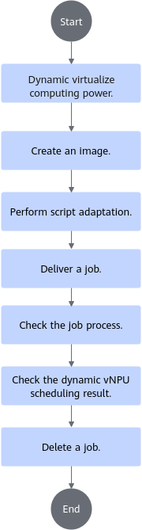
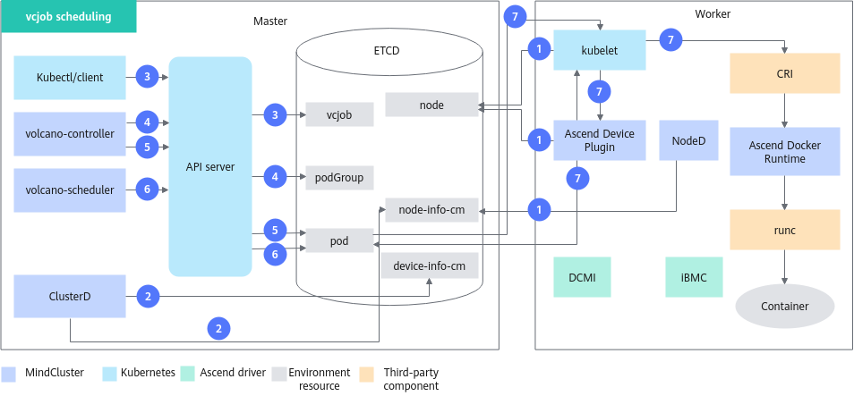
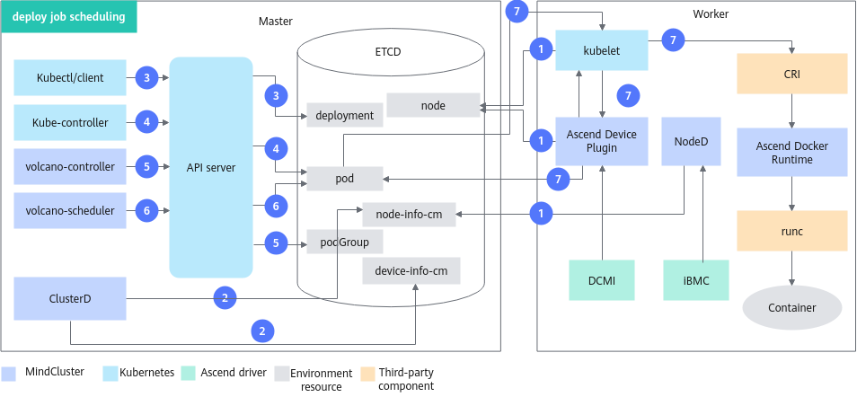

# Dynamic vNPU Scheduling (Inference)<a name="ZH-CN_TOPIC_0000002511427045"></a>

<!-- md-trans-meta sourceCommit=unknown translatedAt=2026-06-30T12:22:22.879Z pushedAt=2026-06-30T12:23:24.394Z -->

## Before You Start<a name="ZH-CN_TOPIC_0000002511347087"></a>

### Prerequisites<a name="section121807404519"></a>

To use the dynamic vNPU scheduling feature in command-line scenarios, ensure that the following components are installed. If they are not installed, refer to the [Installation and Deployment](../../installation_guide/03_installation/manual_installation/00_obtaining_software_packages.md) section for instructions. The dynamic vNPU scheduling feature only supports Volcano as the scheduler; other schedulers are not supported.

- Volcano
- Ascend Device Plugin
- Ascend Docker Runtime
- ClusterD
- NodeD

### Usage<a name="zh-cn_topic_0000001559979444_section91871616135119"></a>

The dynamic vNPU scheduling feature can be used in either of the following modes:

- Using via command line: Install the cluster scheduling components and use the dynamic vNPU scheduling feature via the command line.
- Using after integration: Integrate the cluster scheduling components into an existing third-party AI platform or an AI platform developed based on these component.

### Usage Notes<a name="section10769161412815"></a>

- Resource monitoring can be used together with all features in inference scenarios.
- Multiple inference jobs can run concurrently in a cluster, and each job can use different features. However, jobs using static vNPU and jobs using dynamic vNPU cannot coexist.
- The dynamic vNPU scheduling feature can be used in conjunction with the computing power virtualization feature. For detailed descriptions and operations of dynamic virtualization, see [Dynamic Virtualization](../virtual_instance/virtual_instance_with_hdk/06_mounting_vnpu.md#dynamic-virtualization).
- Dynamic vNPU scheduling only supports submitting single-node jobs with a single replica or multiple replicas. Each replica works independently, and distributed jobs are not supported.

### Supported Product Forms<a name="section169961844182917"></a>

Atlas inference series products

### Usage Process<a name="zh-cn_topic_0000001559979444_section246711128536"></a>

For the process of using the dynamic vNPU scheduling feature via the command line, see [Figure 1](#zh-cn_topic_0000001559979444_fig242524985412).

**Figure 1** Usage Process<a name="zh-cn_topic_0000001559979444_fig242524985412"></a>


For details about how to modify the parameters of related cluster scheduling components, see [Dynamic Virtualization](../virtual_instance/virtual_instance_with_hdk/06_mounting_vnpu.md#dynamic-virtualization).

## Implementation Principle<a name="ZH-CN_TOPIC_0000002511427057"></a>

The schematic diagram of the feature varies slightly depending on the type of inference jobs.

**vcjob<a name="section11346231114"></a>**

[Figure 2](#fig1918122131712) shows the principle of vcjob.

**Figure 2** vcjob scheduling<a name="fig1918122131712"></a>


The description of each step is as follows:

1. Custer scheduling components periodically report node and chip information.
    - kubelet reports the number of node chips to the node object.
    - Ascend Device Plugin periodically reports the number of AICores to the node.
    - When a fault exists on a node, NodeD periodically reports the node health status, node hardware fault information, and node DPC shared storage fault information to `node-info-cm`.

2. After reading the information in `device-info-cm` and `node-info-cm`, ClusterD writes the information into `cluster-info-device-cm` and `cluster-info-node-cm` respectively.
3. Deliver a vcjob through kubectl or other deep learning platforms.
4. volcano-controller creates the corresponding PodGroup for the job. For detailed information about PodGroup, refer to the [official open-source Volcano documentation](https://volcano.sh/en/docs/v1-9-0/podgroup/).
5. When cluster resources meet the job requirements, volcano-controller creates the job Pod.
6. volcano-scheduler selects an appropriate node for the job based on node and chip topology information, and writes the dynamic virtualization template information into the Pod's annotation.
7. When kubelet creates the container, it calls Ascend Device Plugin to mount the chip. Ascend Device Plugin dynamically virtualizes the NPU based on the template information. Ascend Docker Runtime assists in mounting the corresponding resources.

**Deploy Jobs<a name="section41019364253"></a>**

The schematic diagram of the deploy task is shown in [Figure 3](#fig349112913199).

**Figure 3** deploy job scheduling<a name="fig349112913199"></a>


The description of each step is as follows:

1. Cluster scheduling components periodically report node and chip information.
    - Ascend Device Plugin periodically reports the number of AICores to the node.
    - When a fault exists on a node, NodeD periodically reports the node health status, node hardware fault information, and node DPC shared storage fault information to `node-info-cm`.
2. After reading the information in `device-info-cm` and `node-info-cm`, ClusterD writes the information into `cluster-info-device-cm` and `cluster-info-node-cm` respectively.
3. Deliver a deploy job through kubectl or other deep learning platforms.
4. kube-controller creates the corresponding Pod for the job.
5. volcano-controller creates a PodGroup for the job. For detailed information about PodGroup, see the [official open-source Volcano documentation](https://volcano.sh/docs/v1.9.0/Concepts/podgroup).
6. volcano-scheduler selects an appropriate node for the task based on node and chip topology information, and writes the Dynamic Virtualization template information into the Pod's annotation.
7. When kubelet creates the container, it calls Ascend Device Plugin to mount the chip. Ascend Device Plugin dynamically virtualizes the NPU based on the template information in the Pod's annotation. Ascend Docker Runtime assists in mounting the corresponding resources.

## Using via Command Line (Volcano)<a name="ZH-CN_TOPIC_0000002479227144"></a>

### Image Creation<a name="ZH-CN_TOPIC_0000002511427049"></a>

**Obtaining an Inference Image<a name="zh-cn_topic_0000001609173557_zh-cn_topic_0000001558675566_section971616541059"></a>**

You can choose one of the following methods to obtain an inference image.

- It is recommended to download the inference base image (such as: [ascend-infer](https://www.hiascend.com/developer/ascendhub/detail/e02f286eef0847c2be426f370e0c2596), [mindie](https://www.hiascend.com/developer/ascendhub/detail/af85b724a7e5469ebd7ea13c3439d48f)) from the [Ascend Image Repository](https://www.hiascend.com/developer/ascendhub) based on the system architecture (ARM or x86_64).

  Note that after version 21.0.4, the default user of the inference base image is a non-root user. You need to modify the base image after downloading it and change the default user to root.

  >[!NOTE]
  >The base image does not contain files such as inference models and scripts. Therefore, users need to customize it according to their own requirements (such as adding inference script code, models, etc.) before use.

- (Optional) You can customize your own inference image based on the inference base image. For the creation process, see [Building an Inference Image Using a Dockerfile](../../common_operations.md#building-an-inference-image-using-a-dockerfile).

  After completing the customization, you can rename the inference image for easier management and use.

**Hardening the Image<a name="zh-cn_topic_0000001609173557_zh-cn_topic_0000001558675566_section1294572963118"></a>**

You can perform security hardening on the downloaded or created inference base image to improve the image security. For details, see the [Container Security Hardening](../../security_hardening.md#container-security-hardening) section.

### Script Adaptation<a name="ZH-CN_TOPIC_0000002511347067"></a>

This section uses the inference image from the Ascend image repository as an example to introduce the usage process. The image already contains inference example scripts. In actual inference scenarios, you need to prepare your own inference scripts. Before pulling the image, ensure that the network proxy for the current environment has been configured and that the environment can normally access the Ascend image repository.

**Obtaining a Sample Script from Ascend Image Repository<a name="section8181015175911"></a>**

1. After ensuring that the server can access the internet, visit the [Ascend image repository](https://www.hiascend.com/developer/ascendhub).
2. In the left navigation bar, select "Inference Image", and then select the [mindie](https://www.hiascend.com/developer/ascendhub/detail/af85b724a7e5469ebd7ea13c3439d48f) image to obtain the inference sample script.

    >[!NOTE]
    >If you do not have download permission, apply for permission according to the prompts on the page. After submitting the application, wait for the administrator to approve it. Once approved, you can download the image.

### Preparation of Job YAML Files<a name="ZH-CN_TOPIC_0000002479387122"></a>

>[!NOTE]
>
>- If you do not use the Ascend Docker Runtime component, Ascend Device Plugin will only help the user mount devices in the "/dev" directory. For other directories (such as "/usr"), modify the YAML file to mount the corresponding driver directories and files. The mount path inside the container must be consistent with the host path.
>- Because the Atlas 200I SoC A1 core board scenario does not support Ascend Docker Runtime, you do not need to modify the YAML file.

**Operation Steps<a name="zh-cn_topic_0000001558853680_zh-cn_topic_0000001609074213_section14665181617334"></a>**

1. Obtain the corresponding YAML file.

    **Table 5** YAML description

    <a name="table0265132716351"></a>
    <table><thead align="left"><tr id="row132651727163516"><th class="cellrowborder" valign="top" width="15.36%" id="mcps1.2.5.1.1"><p id="p1447515933616"><a name="p1447515933616"></a><a name="p1447515933616"></a>Job Type</p>
    </th>
    <th class="cellrowborder" valign="top" width="18.2%" id="mcps1.2.5.1.2"><p id="zh-cn_topic_0000001609074213_p20181111517147"><a name="zh-cn_topic_0000001609074213_p20181111517147"></a><a name="zh-cn_topic_0000001609074213_p20181111517147"></a>Hardware Model</p>
    </th>
    <th class="cellrowborder" valign="top" width="37.769999999999996%" id="mcps1.2.5.1.3"><p id="p626512711358"><a name="p626512711358"></a><a name="p626512711358"></a>YAML Name</p>
    </th>
    <th class="cellrowborder" valign="top" width="28.67%" id="mcps1.2.5.1.4"><p id="p3265172773514"><a name="p3265172773514"></a><a name="p3265172773514"></a>Link</p>
    </th>
    </tr>
    </thead>
    <tbody><tr id="row826513275355"><td class="cellrowborder" valign="top" width="15.36%" headers="mcps1.2.5.1.1 "><p id="p278965223717"><a name="p278965223717"></a><a name="p278965223717"></a>Deployment</p>
    </td>
    <td class="cellrowborder" rowspan="2" valign="top" width="18.2%" headers="mcps1.2.5.1.2 "><p id="zh-cn_topic_0000001609074213_p8853185832112"><a name="zh-cn_topic_0000001609074213_p8853185832112"></a><a name="zh-cn_topic_0000001609074213_p8853185832112"></a><span id="ph165178910439"><a name="ph165178910439"></a><a name="ph165178910439"></a>Atlas inference series products</span></p>
    </td>
    <td class="cellrowborder" valign="top" width="37.769999999999996%" headers="mcps1.2.5.1.3 "><p id="p142651427103519"><a name="p142651427103519"></a><a name="p142651427103519"></a>infer-deploy-dynamic.yaml</p>
    </td>
    <td class="cellrowborder" valign="top" width="28.67%" headers="mcps1.2.5.1.4 "><p id="p1826522718352"><a name="p1826522718352"></a><a name="p1826522718352"></a><a href="https://gitcode.com/Ascend/mindxdl-deploy/blob/branch_v26.0.0/samples/inference/volcano/infer-deploy-dynamic.yaml" target="_blank" rel="noopener noreferrer">Obtain YAML</a></p>
    </td>
    </tr>
    <tr id="row9265727173515"><td class="cellrowborder" valign="top" headers="mcps1.2.5.1.1 "><p id="p191941452171418"><a name="p191941452171418"></a><a name="p191941452171418"></a>Volcano Job</p>
    </td>
    <td class="cellrowborder" valign="top" headers="mcps1.2.5.1.2 "><p id="p15629131423715"><a name="p15629131423715"></a><a name="p15629131423715"></a>infer-vcjob-dynamic.yaml</p>
    </td>
    <td class="cellrowborder" valign="top" headers="mcps1.2.5.1.3 "><p id="p1626592713355"><a name="p1626592713355"></a><a name="p1626592713355"></a><a href="https://gitcode.com/Ascend/mindxdl-deploy/blob/branch_v26.0.0/samples/inference/volcano/infer-vcjob-dynamic.yaml" target="_blank" rel="noopener noreferrer">Obtain YAML</a></p>
    </td>
    </tr>
    </tbody>
    </table>

2. Upload the YAML file to any directory on the management node and modify the file content as required.

    The following uses infer-deploy-dynamic.yaml as an example to describe how to allocate one AI Core on an Atlas inference product.

    ```Yaml
    apiVersion: apps/v1
    kind: Deployment
    metadata:
      name: resnetinfer1-1-deploy
      labels:
        app: infers
    spec:
      replicas: 1
      selector:
        matchLabels:
          app: infers
      template:
        metadata:
          labels:
            app: infers
            fault-scheduling: "grace"           # Label used for rescheduling
             # For parameter descriptions, see infer-deploy-dynamic.yaml parameter description
            ring-controller.atlas: ascend-310P
            vnpu-dvpp: "null"
            vnpu-level: "low"
        spec:
          schedulerName: volcano              # Volcano scheduler of MindCluster is required
          nodeSelector:
            host-arch: huawei-arm
          containers:
            - image: ubuntu-infer:v1   # Example image
    ...

              resources:
                requests:
                  huawei.com/npu-core: 1        # Use the vir01 template of static virtualization for NPU dynamic virtualization
                limits:
                  huawei.com/npu-core: 1        # The value must be consistent with requests
    ```

    **Table 2** infer-deploy-dynamic.yaml parameter description

    <a name="table116201128162111"></a>
    <table><thead align="left"><tr id="row362062812113"><th class="cellrowborder" valign="top" width="33.33333333333333%" id="mcps1.2.4.1.1"><p id="p11620628192119"><a name="p11620628192119"></a><a name="p11620628192119"></a>Parameter</p>
    </th>
    <th class="cellrowborder" valign="top" width="33.33333333333333%" id="mcps1.2.4.1.2"><p id="p13620192817213"><a name="p13620192817213"></a><a name="p13620192817213"></a>Value</p>
    </th>
    <th class="cellrowborder" valign="top" width="33.33333333333333%" id="mcps1.2.4.1.3"><p id="p862022892120"><a name="p862022892120"></a><a name="p862022892120"></a>Description</p>
    </th>
    </tr>
    </thead>
    <tbody><tr id="row136201528182116"><td class="cellrowborder" rowspan="2" valign="top" width="33.33333333333333%" headers="mcps1.2.4.1.1 "><p id="p56210289215"><a name="p56210289215"></a><a name="p56210289215"></a>vnpu-level</p>
    <p id="p262172815213"><a name="p262172815213"></a><a name="p262172815213"></a></p>
    </td>
    <td class="cellrowborder" valign="top" width="33.33333333333333%" headers="mcps1.2.4.1.2 "><p id="p562182842111"><a name="p562182842111"></a><a name="p562182842111"></a>low</p>
    </td>
    <td class="cellrowborder" valign="top" width="33.33333333333333%" headers="mcps1.2.4.1.3 "><p id="p662112892120"><a name="p662112892120"></a><a name="p662112892120"></a>Low configuration, default value. Selects the virtual instance template with the lowest configuration.</p>
    </td>
    </tr>
    <tr id="row196219286214"><td class="cellrowborder" valign="top" headers="mcps1.2.4.1.1 "><p id="p146219285218"><a name="p146219285218"></a><a name="p146219285218"></a>high</p>
    </td>
    <td class="cellrowborder" valign="top" headers="mcps1.2.4.1.2 "><p id="p19621528112118"><a name="p19621528112118"></a><a name="p19621528112118"></a>Performance priority.</p>
    <p id="p6621152812214"><a name="p6621152812214"></a><a name="p6621152812214"></a>When cluster resources are sufficient, the highest possible configuration of the virtual instance template will be selected. When the overall cluster resources are heavily used, for example, most physical NPUs are already in use and each physical NPU has only a small number of AICores remaining, which is insufficient to meet the requirements of a high-configuration virtual instance template, other templates with a lower configuration but the same number of AICores will be used. For specific selection, refer to <a href="../virtual_instance/virtual_instance_with_hdk/03_virtualization_templates.md">Virtualization Templates</a>.</p>
    </td>
    </tr>
    <tr id="row1762192862114"><td class="cellrowborder" rowspan="3" valign="top" width="33.33333333333333%" headers="mcps1.2.4.1.1 "><p id="p462112842110"><a name="p462112842110"></a><a name="p462112842110"></a>vnpu-dvpp</p>
    <p id="p362120286216"><a name="p362120286216"></a><a name="p362120286216"></a></p>
    </td>
    <td class="cellrowborder" valign="top" width="33.33333333333333%" headers="mcps1.2.4.1.2 "><p id="p8621122816219"><a name="p8621122816219"></a><a name="p8621122816219"></a>yes</p>
    </td>
    <td class="cellrowborder" valign="top" width="33.33333333333333%" headers="mcps1.2.4.1.3 "><p id="p662162819213"><a name="p662162819213"></a><a name="p662162819213"></a>This <span id="ph1762113285210"><a name="ph1762113285210"></a><a name="ph1762113285210"></a>Pod</span> uses DVPP.</p>
    </td>
    </tr>
    <tr id="row1762172862117"><td class="cellrowborder" valign="top" headers="mcps1.2.4.1.1 "><p id="p46214285213"><a name="p46214285213"></a><a name="p46214285213"></a>no</p>
    </td>
    <td class="cellrowborder" valign="top" headers="mcps1.2.4.1.2 "><p id="p5621162812213"><a name="p5621162812213"></a><a name="p5621162812213"></a>This <span id="ph1362102815215"><a name="ph1362102815215"></a><a name="ph1362102815215"></a>Pod</span> does not use DVPP.</p>
    </td>
    </tr>
    <tr id="row1262122852117"><td class="cellrowborder" valign="top" headers="mcps1.2.4.1.1 "><p id="p462192852111"><a name="p462192852111"></a><a name="p462192852111"></a>null</p>
    </td>
    <td class="cellrowborder" valign="top" headers="mcps1.2.4.1.2 "><p id="p11621102818211"><a name="p11621102818211"></a><a name="p11621102818211"></a>Default value; does not care whether DVPP is used.</p>
    </td>
    </tr>
    <tr id="row1762110285219"><td class="cellrowborder" valign="top" width="33.33333333333333%" headers="mcps1.2.4.1.1 "><p id="p2062182822111"><a name="p2062182822111"></a><a name="p2062182822111"></a>ring-controller.atlas</p>
    <p id="p2062182822111_2"><a name="p2062182822111_2"></a><a name="p2062182822111_2"></a></p>
    </td>
    <td class="cellrowborder" valign="top" width="33.33333333333333%" headers="mcps1.2.4.1.2 "><p id="p8621102882111"><a name="p8621102882111"></a><a name="p8621102882111"></a>ascend-310P</p>
    </td>
    <td class="cellrowborder" valign="top" width="33.33333333333333%" headers="mcps1.2.4.1.3 "><p id="p1762182892113"><a name="p1762182892113"></a><a name="p1762182892113"></a>Identifier for jobs using <span id="ph1623844892113"><a name="ph1623844892113"></a><a name="ph1623844892113"></a>Atlas inference series products</span>.</p>
    </td>
    </tr>
    </tbody>
    </table>

    After vnpu-level and vnpu-dvpp take effect, select a vNPU template by referring to [Table 3](#table83781115185619).

    **Table 3**  DVPP and levels

    <a name="table83781115185619"></a>
    <table><thead align="left"><th class="cellrowborder" valign="top" width="16.42835716428357%" id="mcps1.2.7.1.2"><p id="p1024717408463"><a name="p1024717408463"></a><a name="p1024717408463"></a>Number of Requested AICores</p>
    </th>
    <th class="cellrowborder" valign="top" width="15.768423157684234%" id="mcps1.2.7.1.3"><p id="p192479402463"><a name="p192479402463"></a><a name="p192479402463"></a>vnpu-dvpp</p>
    </th>
    <th class="cellrowborder" valign="top" width="20.987901209879013%" id="mcps1.2.7.1.4"><p id="p1024716402460"><a name="p1024716402460"></a><a name="p1024716402460"></a>vnpu-level</p>
    </th>
    <th class="cellrowborder" valign="top" width="8.52914708529147%" id="mcps1.2.7.1.5"><p id="p8247440174613"><a name="p8247440174613"></a><a name="p8247440174613"></a>Downgrade</p>
    </th>
    <th class="cellrowborder" valign="top" width="20.987901209879013%" id="mcps1.2.7.1.6"><p id="p0247164034611"><a name="p0247164034611"></a><a name="p0247164034611"></a>Template</p>
    </th>
    </thead>
    <tbody><tr id="row1517703912018"><td class="cellrowborder" valign="top" width="16.42835716428357%" headers="mcps1.2.7.1.2 "><p id="p191771939903"><a name="p191771939903"></a><a name="p191771939903"></a>1</p>
    </td>
    <td class="cellrowborder" valign="top" width="15.768423157684234%" headers="mcps1.2.7.1.3 "><p id="p14248174010469"><a name="p14248174010469"></a><a name="p14248174010469"></a>null</p>
    </td>
    <td class="cellrowborder" valign="top" width="20.987901209879013%" headers="mcps1.2.7.1.4 "><p id="p1385717396538"><a name="p1385717396538"></a><a name="p1385717396538"></a>Any value</p>
    </td>
    <td class="cellrowborder" valign="top" width="8.52914708529147%" headers="mcps1.2.7.1.5 "><p id="p38575391531"><a name="p38575391531"></a><a name="p38575391531"></a>-</p>
    </td>
    <td class="cellrowborder" valign="top" width="20.987901209879013%" headers="mcps1.2.7.1.6 "><p id="p385603935319"><a name="p385603935319"></a><a name="p385603935319"></a>vir01</p>
    </td>
    </tr>
    <tr id="row11177839600"><td class="cellrowborder" rowspan="3" valign="top" headers="mcps1.2.7.1.1 "><p id="p1317733915013"><a name="p1317733915013"></a><a name="p1317733915013"></a>2</p>
    <p id="p8178439503"><a name="p8178439503"></a><a name="p8178439503"></a></p>
    <p id="p1732216453596"><a name="p1732216453596"></a><a name="p1732216453596"></a></p>
    </td>
    <td class="cellrowborder" rowspan="3" valign="top" headers="mcps1.2.7.1.2 "><p id="p1248174014614"><a name="p1248174014614"></a><a name="p1248174014614"></a>null</p>
    <p id="p13302164084616"><a name="p13302164084616"></a><a name="p13302164084616"></a></p>
    <p id="p1448013112212"><a name="p1448013112212"></a><a name="p1448013112212"></a></p>
    </td>
    <td class="cellrowborder" valign="top" headers="mcps1.2.7.1.3 "><p id="p14619832145315"><a name="p14619832145315"></a><a name="p14619832145315"></a>Low/Other</p>
    </td>
    <td class="cellrowborder" valign="top" headers="mcps1.2.7.1.4 "><p id="p126198326538"><a name="p126198326538"></a><a name="p126198326538"></a>-</p>
    </td>
    <td class="cellrowborder" valign="top" headers="mcps1.2.7.1.5 "><p id="p3248164094613"><a name="p3248164094613"></a><a name="p3248164094613"></a>vir02_1c</p>
    </td>
    </tr>
    <tr id="row117818394016"><td class="cellrowborder" rowspan="2" valign="top" headers="mcps1.2.7.1.1 "><p id="p162489402463"><a name="p162489402463"></a><a name="p162489402463"></a>high</p>
    <p id="p143218450593"><a name="p143218450593"></a><a name="p143218450593"></a></p>
    </td>
    <td class="cellrowborder" valign="top" headers="mcps1.2.7.1.2 "><p id="p22482040124615"><a name="p22482040124615"></a><a name="p22482040124615"></a>No</p>
    </td>
    <td class="cellrowborder" valign="top" headers="mcps1.2.7.1.3 "><p id="p182481740174611"><a name="p182481740174611"></a><a name="p182481740174611"></a>vir02</p>
    </td>
    </tr>
    <tr id="row16943192222113"><td class="cellrowborder" valign="top" headers="mcps1.2.7.1.1 "><p id="p1324834017468"><a name="p1324834017468"></a><a name="p1324834017468"></a>Yes</p>
    </td>
    <td class="cellrowborder" valign="top" headers="mcps1.2.7.1.2 "><p id="p16248840154619"><a name="p16248840154619"></a><a name="p16248840154619"></a>vir02_1c</p>
    </td>
    </tr>
    <tr id="row15502725152112"><td class="cellrowborder" rowspan="7" valign="top" headers="mcps1.2.7.1.1 "><p id="p1531894575910"><a name="p1531894575910"></a><a name="p1531894575910"></a>4</p>
    <p id="p231434585920"><a name="p231434585920"></a><a name="p231434585920"></a></p>
    <p id="p793462111111"><a name="p793462111111"></a><a name="p793462111111"></a></p>
    <p id="p1793418218114"><a name="p1793418218114"></a><a name="p1793418218114"></a></p>
    <p id="p16934112119119"><a name="p16934112119119"></a><a name="p16934112119119"></a></p>
    <p id="p1879713323111"><a name="p1879713323111"></a><a name="p1879713323111"></a></p>
    <p id="p68138391419"><a name="p68138391419"></a><a name="p68138391419"></a></p>
    </td>
    <td class="cellrowborder" valign="top" headers="mcps1.2.7.1.2 "><p id="p10248164012460"><a name="p10248164012460"></a><a name="p10248164012460"></a>yes</p>
    </td>
    <td class="cellrowborder" rowspan="3" valign="top" headers="mcps1.2.7.1.3 "><p id="p3248184024610"><a name="p3248184024610"></a><a name="p3248184024610"></a>Low/Other</p>
    </td>
    <td class="cellrowborder" rowspan="3" valign="top" headers="mcps1.2.7.1.4 "><p id="p4249114074618"><a name="p4249114074618"></a><a name="p4249114074618"></a>-</p>
    ia<p id="p1631211451596"><a name="p1631211451596"></a><a name="p1631211451596"></a></p>
    <p id="p189347217116"><a name="p189347217116"></a><a name="p189347217116"></a></p>
    </td>
    <td class="cellrowborder" valign="top" headers="mcps1.2.7.1.5 "><p id="p8249540164619"><a name="p8249540164619"></a><a name="p8249540164619"></a>vir04_4c_dvpp</p>
    </td>
    </tr>
    <tr id="row1631142722119"><td class="cellrowborder" valign="top" headers="mcps1.2.7.1.1 "><p id="p192491540164619"><a name="p192491540164619"></a><a name="p192491540164619"></a>no</p>
    </td>
    <td class="cellrowborder" valign="top" headers="mcps1.2.7.1.2 "><p id="p5249124011467"><a name="p5249124011467"></a><a name="p5249124011467"></a>vir04_3c_ndvpp</p>
    </td>
    </tr>
    <tr id="row493411217111"><td class="cellrowborder" valign="top" headers="mcps1.2.7.1.1 "><p id="p424914004612"><a name="p424914004612"></a><a name="p424914004612"></a>null</p>
    </td>
    <td class="cellrowborder" valign="top" headers="mcps1.2.7.1.2 "><p id="p192493409466"><a name="p192493409466"></a><a name="p192493409466"></a>vir04_3c</p>
    </td>
    </tr>
    <tr id="row139342211813"><td class="cellrowborder" valign="top" headers="mcps1.2.7.1.1 "><p id="p924924018462"><a name="p924924018462"></a><a name="p924924018462"></a>yes</p>
    </td>
    <td class="cellrowborder" rowspan="4" valign="top" headers="mcps1.2.7.1.2 "><p id="p2249440184619"><a name="p2249440184619"></a><a name="p2249440184619"></a>high</p>
    </td>
    <td class="cellrowborder" rowspan="2" valign="top" headers="mcps1.2.7.1.3 "><p id="p14272035114811"><a name="p14272035114811"></a><a name="p14272035114811"></a>-</p>
    <p id="p021482217814"><a name="p021482217814"></a><a name="p021482217814"></a></p>
    </td>
    <td class="cellrowborder" valign="top" headers="mcps1.2.7.1.4 "><p id="p1324984017461"><a name="p1324984017461"></a><a name="p1324984017461"></a>vir04_4c_dvpp</p>
    </td>
    </tr>
    <tr id="row1993412116119"><td class="cellrowborder" valign="top" headers="mcps1.2.7.1.1 "><p id="p824916403462"><a name="p824916403462"></a><a name="p824916403462"></a>no</p>
    </td>
    <td class="cellrowborder" valign="top" headers="mcps1.2.7.1.2 "><p id="p15249440164616"><a name="p15249440164616"></a><a name="p15249440164616"></a>vir04_3c_ndvpp</p>
    </td>
    </tr>
    <tr id="row2797113219118"><td class="cellrowborder" rowspan="2" valign="top" headers="mcps1.2.7.1.1 "><p id="p1824974014620"><a name="p1824974014620"></a><a name="p1824974014620"></a>null</p>
    <p id="p1681315391419"><a name="p1681315391419"></a><a name="p1681315391419"></a></p>
    </td>
    <td class="cellrowborder" valign="top" headers="mcps1.2.7.1.2 "><p id="p10249124011467"><a name="p10249124011467"></a><a name="p10249124011467"></a>No</p>
    </td>
    <td class="cellrowborder" valign="top" headers="mcps1.2.7.1.3 "><p id="p324964074618"><a name="p324964074618"></a><a name="p324964074618"></a>vir04</p>
    </td>
    </tr>
    <tr id="row16813143918117"><td class="cellrowborder" valign="top" headers="mcps1.2.7.1.1 "><p id="p2249340144615"><a name="p2249340144615"></a><a name="p2249340144615"></a>Yes</p>
    </td>
    <td class="cellrowborder" valign="top" headers="mcps1.2.7.1.2 "><p id="p924924064613"><a name="p924924064613"></a><a name="p924924064613"></a>vir04_3c</p>
    </td>
    </tr>
    <tr id="row1781312397116"><td class="cellrowborder" valign="top" headers="mcps1.2.7.1.1 "><p id="p102497405465"><a name="p102497405465"></a><a name="p102497405465"></a>8 or a multiple of 8</p>
    </td>
    <td class="cellrowborder" valign="top" headers="mcps1.2.7.1.2 "><p id="p42491440174615"><a name="p42491440174615"></a><a name="p42491440174615"></a>Any value</p>
    </td>
    <td class="cellrowborder" valign="top" headers="mcps1.2.7.1.3 "><p id="p5249114074614"><a name="p5249114074614"></a><a name="p5249114074614"></a>Any value</p>
    </td>
    <td class="cellrowborder" valign="top" headers="mcps1.2.7.1.4 "><p id="p1224920403467"><a name="p1224920403467"></a><a name="p1224920403467"></a>-</p>
    </td>
    <td class="cellrowborder" valign="top" headers="mcps1.2.7.1.5 "><p id="p55031522345"><a name="p55031522345"></a><a name="p55031522345"></a>-</p>
    </td>
    </tr>
    </tbody>
    </table>

    >[!NOTE]
    >If the number of requested AI Cores is 8 or a multiple of 8, the entire NPU is used.

3. Mount the weight file.

    ```Yaml
    ...
                  ports:     # Distributed training collective communication port
                    - containerPort: 2222
                      name: ascendjob-port
                  resources:
                    limits:
                      huawei.com/Ascend310P: 1   # Number of chips requested
                    requests:
                      huawei.com/Ascend310P: 1   # Consistent with the limits value
                  volumeMounts:
    ...
                      # Weight file mount path
                    - name: weights
                      mountPath: /path-to-weights
    ...
              volumes:
    ...
                # Weight file mount path
                - name: weights
                  hostPath:
                    path: /path-to-weights  # Shared storage or local storage path. Modify it based on the actual situation.
    ...
    ```

    >[!NOTE]
    >- `/path-to-weights` is the model weight, which you need to prepare. For the MindIE image, you can download it by referring to the instructions in the `$ATB_SPEED_HOME_PATH/examples/models/llama3/README.md` file in the image.
    >- The default path of `ATB_SPEED_HOME_PATH` is `/usr/local/Ascend/atb-models`. It is configured when the `set_env.sh` script in the source model repository is executed, so you do not need to configure it manually.

4. Modify the container startup command in the selected YAML, that is, the content of the `command` field. If it does not exist, add it.

    ```Yaml
    ...
          containers:
          - image: ubuntu-infer:v1
    ...
            command: ["/bin/bash", "-c", "cd $ATB_SPEED_HOME_PATH; python examples/run_pa.py --model_path /path-to-weights"]
            resources:
              requests:
    ...
    ```

### Job Delivery<a name="ZH-CN_TOPIC_0000002479227134"></a>

Run the following command in the path of the sample YAML file on the management node to deliver an inference job using the YAML file:

```shell
kubectl apply -f XXX.yaml
```

Example:

```shell
kubectl apply -f infer-deploy-dynamic.yaml
```

Output:

```ColdFusion
job.batch/resnetinfer1-2 created
```

>[!NOTE]
>If the YAML file of the job is modified after the job is successfully delivered, run the `kubectl delete -f XXX.yaml` command to delete the original job and then deliver the job again.

### Job Process Viewing<a name="ZH-CN_TOPIC_0000002511347071"></a>

**Operation Steps**

1. <a name="zh-cn_topic_0000001609093161_zh-cn_topic_0000001609474293_section96791230183711011"></a>Run the following command to check the Pod running status.

    ```shell
    kubectl get pod --all-namespaces
    ```

    Output:

    ```ColdFusion
    NAMESPACE        NAME                                       READY   STATUS    RESTARTS   AGE
    ...
    default          resnetinfer1-2-scpr5                      1/1     Running   0          8s
    ...
    ```

2. View details about the node where the inference job is running.
    1. Run the following command to view the node name.

        ```shell
        kubectl get node -A
        ```

    2. Based on the node name queried in the previous step, run the following command to view node details.

        ```shell
        kubectl describe node <nodename>
        ```

        Output:

        ```ColdFusion
        ...
        Allocated resources:
          (Total limits may be over 100 percent, i.e., overcommitted.)
          Resource              Requests     Limits
          --------              --------     ------
          cpu                   4 (2%)       3500m (1%)
          memory                2140Mi (0%)  4040Mi (0%)
          ephemeral-storage     0 (0%)       0 (0%)
          huawei.com/npu-core  4            4
        Events:
          Type    Reason    Age   From                Message
          ----    ------    ----  ----                -------
          Normal  Starting  36m   kube-proxy, ubuntu  Starting kube-proxy.
        ...
        ```

        In the displayed information, locate **huawei.com/npu-core** under "Allocated resources". The value of this parameter increases after an inference job is executed, and the increment equals the number of NPUs used by the inference job.

### Dynamic vNPU Scheduling Result Viewing<a name="ZH-CN_TOPIC_0000002479387120"></a>

**Operation Steps<a name="zh-cn_topic_0000001559013282_zh-cn_topic_0000001558675486_section96791230183711"></a>**

Run the following command on the management node to view the inference results:

```shell
kubectl logs -f resnetinfer1-2-scpr5
```

The following is an example of the command output:

```ColdFusion
[2025-02-24 19:13:09,331] [2269] [281472887965984] [llm] [INFO] [logging.py-331] : Answer[0]:  Deep learning is a subset of machine learning that uses neural networks with multiple layers to model complex relationships between
[2025-02-24 19:13:09,331] [2269] [281472887965984] [llm] [INFO] [logging.py-331] : Generate[0] token num: (0, 20)
```

>[!NOTE]
>_resnetinfer1-2-scpr5_ indicates the name of the running job in [Step 1](#zh-cn_topic_0000001609093161_zh-cn_topic_0000001609474293_section96791230183711011) in "Job Process Viewing"..

### Job Deletion<a name="ZH-CN_TOPIC_0000002511347065"></a>

Run the following command in the path of the sample YAML file to delete the corresponding inference job:

```shell
kubectl delete -f XXX.yaml
```

For example:

```shell
kubectl delete -f infer-deploy-dynamic.yaml
```

Command output:

```ColdFusion
root@ubuntu:/home/test/yaml# kubectl delete -f infer-310p-1usoc.yaml
job "resnetinfer1-1" deleted
```

## Using After Integration<a name="ZH-CN_TOPIC_0000002511347073"></a>

This section requires you to be familiar with programming and development process, as well as Kubernetes. If you have an AI platform or want to develop an AI platform based on cluster scheduling components, perform the following operations:

1. Find the corresponding [official API library](https://github.com/kubernetes-client) for K8s based on your programming language.
2. Create, query, delete, and perform other operations on jobs using the official Kubernetes API library.
3. When creating, querying, or deleting a job, you need to convert the content of the [example YAML](#preparation-of-job-yaml-files) into objects defined in the official Kubernetes API and send them to the Kubernetes API server through the official API, or convert the YAML content into JSON format and send it directly to the Kubernetes API server.
