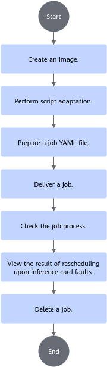

# Rescheduling upon Inference Card Faults<a name="ZH-CN_TOPIC_0000002479387124"></a>

<!-- md-trans-meta sourceCommit=unknown translatedAt=2026-06-30T12:22:10.240Z pushedAt=2026-06-30T12:23:24.391Z -->

## Before You Start<a name="ZH-CN_TOPIC_0000002479387116"></a>

After an inference chip resource managed by the cluster scheduling components becomes faulty, the cluster scheduling components can isolate the faulty resource (the corresponding chip) and automatically perform rescheduling.

**Prerequisites<a name="section166381652174516"></a>**

- To use the rescheduling upon inference card faults feature, ensure that the following components have been installed.
    - Volcano (This feature only supports Volcano as the scheduler. Other schedulers are not supported.)
    - Ascend Device Plugin
    - Ascend Docker Runtime
    - Ascend Operator
    - ClusterD
    - NodeD

- If not installed, refer to the [Installation and Deployment](../../developer_guide/installation_deployment/manual_installation/00_obtaining_software_packages.md) section for the operation.

**Usage Methods<a name="zh-cn_topic_0000001559979444_section91871616135119"></a>**

The usage methods for rescheduling upon inference card faults are as follows:

- [Using via Command Line](#ZH-CN_TOPIC_0000002511427039): Install cluster scheduling components and use rescheduling upon inference card faults via the command line.
- [using after integration](#ZH-CN_TOPIC_0000002479387118): Integrate the cluster scheduling components into an existing third-party AI platform or an AI platform developed based on these component.

**Usage Notes<a name="section10769161412815"></a>**

- Resource monitoring can be used together with all features in inference scenarios.
- When multiple inference jobs run concurrently in a cluster, each job can use different features, but jobs using static vNPUs and jobs using dynamic vNPUs cannot coexist.
- The rescheduling upon inference card faults feature uses full-NPU scheduling by default; static vNPU scheduling is not supported; dynamic vNPU scheduling is supported for Atlas inference series products.
- Rescheduling upon inference card faults supports submitting single-node jobs with single or multiple replicas, where each replica works independently. It only supports distributed jobs of the AscendJob type deployed on inference servers (with Atlas 300I Duo inference cards), Atlas 800I A2 inference servers, and A200I A2 Box heterogeneous subracks.

- Rescheduling upon inference card faults supports VolcanoJob or Deployment job types, and the label `fault-scheduling` for the rescheduling switch must be added to such jobs and set to `grace` or `force`.

**Supported Product Forms<a name="section169961844182917"></a>**

The following products are supported:

- Inference server (with Atlas 300I inference card)
- Atlas inference series products
- Atlas 800I A2 inference server
- A200I A2 Box heterogeneous subrack
- Atlas 800I A3 SuperPoD server
- Atlas 350 PCIe card

**Usage Process**<a name="zh-cn_topic_0000001559979444_section246711128536"></a>

The process for using the Inference Card Fault Rescheduling feature via the command line can be seen in [Figure 1](#zh-cn_topic_0000001559979444_fig242524985412).

**Figure 1** Usage Process<a name="zh-cn_topic_0000001559979444_fig242524985412"></a>


## Using via Command Line (Volcano)<a name="ZH-CN_TOPIC_0000002511427039"></a>

### Creating an Image<a name="ZH-CN_TOPIC_0000002511427053"></a>

**Obtaining the Ascend Image<a name="zh-cn_topic_0000001609173557_zh-cn_topic_0000001558675566_section971616541059"></a>**

You can choose one of the following methods to obtain the Ascend image.

- It is recommended to download the inference base image (such as [ascend-infer](https://www.hiascend.com/developer/ascendhub/detail/e02f286eef0847c2be426f370e0c2596) or [mindie](https://www.hiascend.com/developer/ascendhub/detail/af85b724a7e5469ebd7ea13c3439d48f)) from the [Ascend Image Repository](https://www.hiascend.com/developer/ascendhub) based on your system architecture (ARM or x86_64).

    Note that starting from version 21.0.4, the default user of the inference base image is a non-root user. You are required to modify the base image after downloading it to change the default user to root.

    >[!NOTE]
    >The base image does not contain files such as inference models or scripts. Therefore, users are required to customize it according to their own needs (for example, by adding inference script code or models) before use.

- (Optional) If you require a more personalized inference environment, you can [modify the downloaded base inference image using a Dockerfile](../../references/common_operations.md).

    After completing the custom modifications, users can rename the inference image for easier management and use.

**Image Hardening<a name="zh-cn_topic_0000001609173557_zh-cn_topic_0000001558675566_section1294572963118"></a>**

The downloaded or created base inference image can be security hardened to improve image security. See the [Container Security Hardening](../../references/security_hardening.md#container-security-hardening) section for operation steps.

### Script Adaptation<a name="ZH-CN_TOPIC_0000002479227172"></a>

This section uses the inference image from the Ascend image repository as an example to introduce the usage process. The image already contains inference example scripts. For actual inference scenarios, you are required to prepare their own inference scripts. Before pulling the image, ensure that the network proxy for the current environment has been configured and that the Ascend image repository can be accessed successfully.

**Obtaining a Sample Script from Ascend Image Repository<a name="section8181015175911"></a>**

1. After ensuring that the server can access the internet, visit the [Ascend image repository](https://www.hiascend.com/developer/ascendhub).
2. In the left navigation pane, select Inference Image, and then select the [mindie](https://www.hiascend.com/developer/ascendhub/detail/af85b724a7e5469ebd7ea13c3439d48f) image to obtain the inference example scripts.

    >[!NOTE]
    >If you do not have download permission, apply for permission as prompted on the page. After submitting the application, wait for the administrator to review it. The image can be downloaded after the review is approved.

### Preparation of Job YAML Files<a name="ZH-CN_TOPIC_0000002511427029"></a>

>[!NOTE]
>
>- If you do not use Ascend Docker Runtime, Ascend Device Plugin only helps you mount devices in the `/dev` directory. For other directories (such as `/usr`), you need to modify the YAML file and mount the corresponding driver directories and files. The mount path in the container must be the same as the host path.
>- Ascend Docker Runtime is not supported by Atlas 200I SoC A1 core boards, so you do not need to modify the YAML file.

**Operation Steps<a name="zh-cn_topic_0000001558853680_zh-cn_topic_0000001609074213_section14665181617334"></a>**

1. Download the corresponding YAML file.

    **Table 1** YAML files of different job types and hardware models

    <a name="zh-cn_topic_0000001609074213_table15169151021912"></a>
    <table><thead align="left"><tr id="zh-cn_topic_0000001609074213_row16169201019192"><th class="cellrowborder" valign="top" width="19.97%" id="mcps1.2.5.1.1"><p id="zh-cn_topic_0000001609074213_p4169191017192"><a name="zh-cn_topic_0000001609074213_p4169191017192"></a><a name="zh-cn_topic_0000001609074213_p4169191017192"></a>Job Type</p>
    </th>
    <th class="cellrowborder" valign="top" width="20.03%" id="mcps1.2.5.1.2"><p id="zh-cn_topic_0000001609074213_p20181111517147"><a name="zh-cn_topic_0000001609074213_p20181111517147"></a><a name="zh-cn_topic_0000001609074213_p20181111517147"></a>Hardware Model</p>
    </th>
    <th class="cellrowborder" valign="top" width="40%" id="mcps1.2.5.1.3"><p id="zh-cn_topic_0000001609074213_p181811156149"><a name="zh-cn_topic_0000001609074213_p181811156149"></a><a name="zh-cn_topic_0000001609074213_p181811156149"></a>YAML File Path</p>
    </th>
    <th class="cellrowborder" valign="top" width="20%" id="mcps1.2.5.1.4"><p id="p1693015221828"><a name="p1693015221828"></a><a name="p1693015221828"></a>Download Link</p>
    </th>
    </tr>
    </thead>
    <tbody><tr id="zh-cn_topic_0000001609074213_row2169191091919"><td class="cellrowborder" rowspan="3" valign="top" width="19.97%" headers="mcps1.2.5.1.1 "><p id="zh-cn_topic_0000001609074213_p6169510191913"><a name="zh-cn_topic_0000001609074213_p6169510191913"></a><a name="zh-cn_topic_0000001609074213_p6169510191913"></a><span id="zh-cn_topic_0000001609074213_ph183921109162"><a name="zh-cn_topic_0000001609074213_ph183921109162"></a><a name="zh-cn_topic_0000001609074213_ph183921109162"></a>Volcano</span>-scheduled Deployment</p>
    </td>
    <td class="cellrowborder" valign="top" width="20.03%" headers="mcps1.2.5.1.2 "><p id="zh-cn_topic_0000001609074213_p8853185832112"><a name="zh-cn_topic_0000001609074213_p8853185832112"></a><a name="zh-cn_topic_0000001609074213_p8853185832112"></a><span id="zh-cn_topic_0000001609074213_ph238151934915"><a name="zh-cn_topic_0000001609074213_ph238151934915"></a><a name="zh-cn_topic_0000001609074213_ph238151934915"></a>Atlas 200I SoC A1 Core Board</span></p>
    </td>
    <td class="cellrowborder" valign="top" width="40%" headers="mcps1.2.5.1.3 "><p id="zh-cn_topic_0000001609074213_p1116971091915"><a name="zh-cn_topic_0000001609074213_p1116971091915"></a><a name="zh-cn_topic_0000001609074213_p1116971091915"></a>infer-deploy-310p-1usoc.yaml</p>
    </td>
    <td class="cellrowborder" valign="top" width="20%" headers="mcps1.2.5.1.4 "><p id="p784716567219"><a name="p784716567219"></a><a name="p784716567219"></a><a href="https://gitcode.com/Ascend/mindxdl-deploy/tree/branch_v26.0.0/samples/inference/volcano/infer-deploy-310p-1usoc.yaml" target="_blank" rel="noopener noreferrer">Obtain YAML</a></p>
    </td>
    </tr>
    <tr>
    <td class="cellrowborder" valign="top" headers="mcps1.2.5.1.1 "><p>Atlas 950 SuperPoD</p><p>Atlas 850 Series Hardware Products (SuperPoD)</p><p>Atlas 350 PCIe Card</p></td>
    <td class="cellrowborder" valign="top" headers="mcps1.2.5.1.2 "><p>infer-deploy-950.yaml</p></td>
    <td class="cellrowborder" valign="top" headers="mcps1.2.5.1.3 "><p><a href="https://gitcode.com/Ascend/mindxdl-deploy/blob/branch_v26.0.0/samples/inference/volcano/infer-deploy-950.yaml" target="_blank" rel="noopener noreferrer">Obtain YAML</a></p>
    </td>
    </tr>
    <tr id="zh-cn_topic_0000001609074213_row17169201091917"><td class="cellrowborder" valign="top" headers="mcps1.2.5.1.1 "><p id="zh-cn_topic_0000001609074213_p14853125832110"><a name="zh-cn_topic_0000001609074213_p14853125832110"></a><a name="zh-cn_topic_0000001609074213_p14853125832110"></a>Other types of inference nodes</p>
    </td>
    <td class="cellrowborder" valign="top" headers="mcps1.2.5.1.2 "><p id="zh-cn_topic_0000001609074213_p51692100191"><a name="zh-cn_topic_0000001609074213_p51692100191"></a><a name="zh-cn_topic_0000001609074213_p51692100191"></a>infer-deploy.yaml</p>
    </td>
    <td class="cellrowborder" valign="top" headers="mcps1.2.5.1.3 "><p><a href="https://gitcode.com/Ascend/mindxdl-deploy/blob/branch_v26.0.0/samples/inference/volcano/infer-deploy.yaml" target="_blank" rel="noopener noreferrer">Obtain YAML</a></p>
    </td>
    </tr>
    <tr id="row1137784216212"><td class="cellrowborder" rowspan="2" valign="top" width="19.97%" headers="mcps1.2.5.1.1 "><p id="p9442102131620"><a name="p9442102131620"></a><a name="p9442102131620"></a>Volcano Job</p>
    </td>
    <td class="cellrowborder" valign="top" width="20.03%" headers="mcps1.2.5.1.2 "><p id="p367438101714"><a name="p367438101714"></a><a name="p367438101714"></a><span id="ph56332010913"><a name="ph56332010913"></a><a name="ph56332010913"></a>Atlas 800I A2 Inference Server</span></p>
    <p id="p168721535300"><a name="p168721535300"></a><a name="p168721535300"></a><span id="ph56342369338"><a name="ph56342369338"></a><a name="ph56342369338"></a>A200I A2 Box Heterogeneous Subrack</span></p>
    <p id="p17604333153213"><a name="p17604333153213"></a><a name="p17604333153213"></a><span id="ph12174764117"><a name="ph12174764117"></a><a name="ph12174764117"></a>Atlas 800I A3 SuperPoD Server</span></p>
    </td>
    <td class="cellrowborder" valign="top" width="40%" headers="mcps1.2.5.1.3 "><p id="p8442112171619"><a name="p8442112171619"></a><a name="p8442112171619"></a>infer-vcjob-910.yaml</p>
    </td>
    <td class="cellrowborder" rowspan="1" valign="top" width="20%" headers="mcps1.2.5.1.4 "><p id="p15442424164"><a name="p15442424164"></a><a name="p15442424164"></a><a href="https://gitcode.com/Ascend/mindxdl-deploy/blob/branch_v26.0.0/samples/inference/volcano/infer-vcjob-910.yaml" target="_blank" rel="noopener noreferrer">Obtain YAML</a></p>
    </td>
    </tr>
    <tr>
    <td class="cellrowborder" valign="top" headers="mcps1.2.5.1.1 "><p>Atlas 950 SuperPoD</p><p>Atlas 850 Series Hardware Products (SuperPoD)</p><p>Atlas 350 PCIe Card</p></td>
    <td class="cellrowborder" valign="top" headers="mcps1.2.5.1.2 "><p>infer-vcjob-950.yaml</p></td>
    <td class="cellrowborder" valign="top" headers="mcps1.2.5.1.3 "><p><a href="https://gitcode.com/Ascend/mindxdl-deploy/blob/branch_v26.0.0/samples/inference/volcano/infer-vcjob-950.yaml" target="_blank" rel="noopener noreferrer">Obtain YAML</a></p>
    </td>
    </tr>
    <tr id="row3552077269"><td class="cellrowborder" rowspan="3" valign="top" width="19.97%" headers="mcps1.2.5.1.1 "><p id="p6861171325411"><a name="p6861171325411"></a><a name="p6861171325411"></a>Ascend Job</p>
    <p id="p12446175211817"><a name="p12446175211817"></a><a name="p12446175211817"></a></p>
    <p id="p5735201117263"><a name="p5735201117263"></a><a name="p5735201117263"></a></p>
    </td>
    <td class="cellrowborder" valign="top" width="20.03%" headers="mcps1.2.5.1.2 "><p id="p1328416110919"><a name="p1328416110919"></a><a name="p1328416110919"></a>Inference server (with <span id="ph93658382564"><a name="ph93658382564"></a><a name="ph93658382564"></a>Atlas 300I Duo Inference Card</span> inserted)</p>
    </td>
    <td class="cellrowborder" valign="top" width="40%" headers="mcps1.2.5.1.3 "><p id="p10861813135419"><a name="p10861813135419"></a><a name="p10861813135419"></a>pytorch_acjob_infer_310p_with_ranktable.yaml</p>
    </td>
    <td class="cellrowborder" valign="top" width="20%" headers="mcps1.2.5.1.4 "><p id="p1986116136544"><a name="p1986116136544"></a><a name="p1986116136544"></a><a href="https://gitcode.com/Ascend/mindxdl-deploy/blob/branch_v26.0.0/samples/inference/volcano/pytorch_acjob_infer_310p_with_ranktable.yaml" target="_blank" rel="noopener noreferrer">Obtain YAML</a></p>
    </td>
    </tr>
    <tr id="row512231072611"><td class="cellrowborder" valign="top" headers="mcps1.2.5.1.1 "><p id="p1611216221297"><a name="p1611216221297"></a><a name="p1611216221297"></a><span id="ph10342125017508"><a name="ph10342125017508"></a><a name="ph10342125017508"></a>Atlas 800I A2 Inference Server</span></p>
    <p id="p981315183317"><a name="p981315183317"></a><a name="p981315183317"></a><span id="ph176921116163312"><a name="ph176921116163312"></a><a name="ph176921116163312"></a>A200I A2 Box Heterogeneous Subrack</span></p>
    <p id="p4470103717329"><a name="p4470103717329"></a><a name="p4470103717329"></a><span id="ph1695943783214"><a name="ph1695943783214"></a><a name="ph1695943783214"></a>Atlas 800I A3 SuperPoD Server</span></p>
    </td>
    <td class="cellrowborder" valign="top" headers="mcps1.2.5.1.2 "><p id="p4446185212815"><a name="p4446185212815"></a><a name="p4446185212815"></a>pytorch_multinodes_acjob_infer_{xxx}b_with_ranktable.yaml</p>
    </td>
    <td class="cellrowborder" valign="top" headers="mcps1.2.5.1.3 "><p id="p962512301913"><a name="p962512301913"></a><a name="p962512301913"></a><a href="https://gitcode.com/Ascend/mindxdl-deploy/blob/branch_v26.0.0/samples/inference/volcano/pytorch_multinodes_acjob_infer_910b_with_ranktable.yaml" target="_blank" rel="noopener noreferrer">Obtain YAML</a></p>
    </td>
    </tr>
    <tr><td class="cellrowborder" valign="top" headers="mcps1.2.5.1.1 "><p>Atlas 950 SuperPoD</p><p>Atlas 850 Series Hardware Products (SuperPoD)</p><p>Atlas 350 PCIe Card</p></td>
    <td class="cellrowborder" valign="top" headers="mcps1.2.5.1.2 "><p>pytorch_multinodes_acjob_infer_950_with_ranktable.yaml</p>
    </td>
    <td class="cellrowborder" valign="top" headers="mcps1.2.5.1.3 "><p><a href="https://gitcode.com/Ascend/mindxdl-deploy/blob/branch_v26.0.0/samples/inference/volcano/pytorch_multinodes_acjob_infer_950_with_ranktable.yaml" target="_blank" rel="noopener noreferrer">Obtain YAML</a></p>
    </td>
    </tr>
    </tbody>
    </table>

    >[!NOTE]
    >For Volcano Jobs, you need to modify the corresponding YAML file based on the example YAML file.

2. Based on the YAML configuration for [full NPU scheduling](./04_full_npu_scheduling_and_static_vnpu_scheduling_inference.md) or [dynamic vNPU scheduling](../virtual_instance/virtual_instance_with_hdk/dynamic_vnpu_scheduling/01_dynamic_vnpu_scheduling_inference.md), add the following fields to enable the rescheduling feature. The `infer-deploy.yaml` for full NPU scheduling is used as an example.

    ```Yaml
    apiVersion: apps/v1
    kind: Deployment
    metadata:
      name: resnetinfer1-1-deploy
      labels:
          app: infers
    spec:
      replicas: 1
      selector:
        matchLabels:
          app: infers
      template:
        metadata:
          labels:
    ...
             fault-scheduling: grace               # Add this field
             ring-controller.atlas: ascend-310   # Add this field
        spec:
          schedulerName: volcano
          nodeSelector:
            host-arch: huawei-arm           # Select the os arch. If the os arch is x86, change it to huawei-x86.
    ...
    ```

    **Table 2**  fault-scheduling configuration

    <a name="table0396162644916"></a>
    <table><thead align="left"><tr id="row7397112634917"><th class="cellrowborder" valign="top" width="16.48%" id="mcps1.2.4.1.1"><p id="p1339762674911"><a name="p1339762674911"></a><a name="p1339762674911"></a>Parameter</p>
    </th>
    <th class="cellrowborder" valign="top" width="29.42%" id="mcps1.2.4.1.2"><p id="p1139718264499"><a name="p1139718264499"></a><a name="p1139718264499"></a>Value</p>
    </th>
    <th class="cellrowborder" valign="top" width="54.1%" id="mcps1.2.4.1.3"><p id="p123971426144911"><a name="p123971426144911"></a><a name="p123971426144911"></a>Meaning</p>
    </th>
    </tr>
    </thead>
    <tbody><tr id="row9397182614491"><td class="cellrowborder" rowspan="2" valign="top" width="16.48%" headers="mcps1.2.4.1.1 "><p id="p113974261490"><a name="p113974261490"></a><a name="p113974261490"></a>fault-scheduling</p>
    <p id="p878610718561"><a name="p878610718561"></a><a name="p878610718561"></a></p>
    </td>
    <td class="cellrowborder" valign="top" width="29.42%" headers="mcps1.2.4.1.2 "><p id="p18397192617495"><a name="p18397192617495"></a><a name="p18397192617495"></a>grace</p>
    </td>
    <td class="cellrowborder" valign="top" width="54.1%" headers="mcps1.2.4.1.3 "><p id="p4397112614920"><a name="p4397112614920"></a><a name="p4397112614920"></a>The rescheduling switch for the job is used, and the original pod is gracefully deleted first during the process.</p>
    </td>
    </tr>
    <tr id="row1378627165613"><td class="cellrowborder" valign="top" headers="mcps1.2.4.1.1 "><p id="zh-cn_topic_0000001570873348_p2032819617590"><a name="zh-cn_topic_0000001570873348_p2032819617590"></a><a name="zh-cn_topic_0000001570873348_p2032819617590"></a>force</p>
    </td>
    <td class="cellrowborder" valign="top" headers="mcps1.2.4.1.2 "><p id="zh-cn_topic_0000001570873348_p113286645910"><a name="zh-cn_topic_0000001570873348_p113286645910"></a><a name="zh-cn_topic_0000001570873348_p113286645910"></a>The job is configured to use the forced deletion mode, during which the original <span id="zh-cn_topic_0000001570873348_ph38454178285"><a name="zh-cn_topic_0000001570873348_ph38454178285"></a><a name="zh-cn_topic_0000001570873348_ph38454178285"></a>Pod</span> is forcibly deleted.</p>
    <p id="zh-cn_topic_0000001570873348_p3206181674916"><a name="zh-cn_topic_0000001570873348_p3206181674916"></a><a name="zh-cn_topic_0000001570873348_p3206181674916"></a></p>
    </td>
    </tr>
    <tr id="row11397142634918"><td class="cellrowborder" valign="top" width="16.48%" headers="mcps1.2.4.1.1 "><p id="p7397026134913"><a name="p7397026134913"></a><a name="p7397026134913"></a>ring-controller.atlas</p>
    </td>
    <td class="cellrowborder" valign="top" width="29.42%" headers="mcps1.2.4.1.2 "><a name="ul16397426184918"></a><a name="ul16397426184918"></a><ul id="ul16397426184918"><li>Inference server (with <span id="ph3690191194813"><a name="ph3690191194813"></a><a name="ph3690191194813"></a>Atlas 300I Inference Card</span>): ascend-310</li><li><span id="ph56912120486"><a name="ph56912120486"></a><a name="ph56912120486"></a>Atlas Inference Series Products</span>: ascend-310P</li><li><span id="ph16267162611508"><a name="ph16267162611508"></a><a name="ph16267162611508"></a>Atlas 800I A2 Inference Server</span>, <span id="ph344045773615"><a name="ph344045773615"></a><a name="ph344045773615"></a>A200I A2 Box Heterogeneous Subrack</span>, <span id="ph1175141233710"><a name="ph1175141233710"></a><a name="ph1175141233710"></a>Atlas 800I A3 SuperPoD Server</span>: ascend-<span id="ph4487202241512"><a name="ph4487202241512"></a><a name="ph4487202241512"></a><em id="zh-cn_topic_0000001519959665_i1489729141619"><a name="zh-cn_topic_0000001519959665_i1489729141619"></a><a name="zh-cn_topic_0000001519959665_i1489729141619"></a>{xxx}</em></span>b</li></ul>
    </td>
    <td class="cellrowborder" valign="top" width="54.1%" headers="mcps1.2.4.1.3 "><p id="p1397826104915"><a name="p1397826104915"></a><a name="p1397826104915"></a>Used to verify the chip type used by the job.</p>
    </td>
    </tr>
    </tbody>
    </table>

3. Mount the weights file.

    ```Yaml
    ...
                  ports:     # Distributed training collective communication port
                    - containerPort: 2222
                      name: ascendjob-port
                  resources:
                    limits:
                      huawei.com/Ascend310P: 1   # Number of chips requested
                    requests:
                      huawei.com/Ascend310P: 1   # Keep consistent with the limits value
                  volumeMounts:
    ...
                      # Weight file mount path
                    - name: weights
                      mountPath: /path-to-weights
    ...
              volumes:
    ...
                # Weight file mount path
                - name: weights
                  hostPath:
                    path: /path-to-weights  # Shared storage or local storage path. Modify it based on the actual situation.
    ...
    ```

    >[!NOTE]
    >- `path-to-weights` indicates model weights, which need to be prepared by yourself. You can download the MindIE image by referring to the `$ATB_SPEED_HOME_PATH/examples/models/llama3/README.md` file.
    >- The default path for `ATB_SPEED_HOME_PATH` is /`usr/local/Ascend/atb-models`. It has been configured when sourcing the `set_env.sh` script in the model repository, so you are not required to configure it themselves.

4. Modify the container startup command in the selected YAML, which is the content of the `command` field. If it does not exist, add it.

    ```Yaml
    ...
          containers:
          - image: ubuntu-infer:v1
    ...
            command: ["/bin/bash", "-c", "cd $ATB_SPEED_HOME_PATH; python examples/run_pa.py --model_path /path-to-weights"]
            resources:
              requests:
    ...
    ```

### Job Delivery<a name="ZH-CN_TOPIC_0000002511427027"></a>

Run the following command in the path of the sample YAML file on the management node to deliver an inference job using the YAML file:

```shell
kubectl apply -f XXX.yaml
```

For example:

```shell
kubectl apply -f infer-310p-1usoc.yaml
```

Command output:

```ColdFusion
job.batch/resnetinfer1-2 created
```

>[!NOTE]
>If the YAML file of the job is modified after the job is successfully delivered, run the `kubectl delete -f XXX.yaml` command to delete the original job and then deliver the job again..

### Job Process Viewing<a name="ZH-CN_TOPIC_0000002511427025"></a>

**Operation Steps<a name="zh-cn_topic_0000001609093161_zh-cn_topic_0000001609474293_section96791230183711"></a>**

Run the following command to check the Pod status.

```shell
kubectl get pod --all-namespaces
```

Command output:

```ColdFusion
NAMESPACE        NAME                                       READY   STATUS    RESTARTS   AGE
...
default          resnetinfer1-2-scpr5                      1/1     Running   0          20m
...
```

### Result Viewing of Rescheduling Upon Inference Card Faults<a name="ZH-CN_TOPIC_0000002511347069"></a>

If a fault occurs during the running of an inference job, Volcano schedules the job to another NPU.

**Operation Steps<a name="section18664151111415"></a>**

1. Run the following command to check the job running status.

    ```shell
    kubectl get pod --all-namespaces
    ```

    If the job name changes from `resnetinfer1-2-scpr5` to `resnetinfer1-2-xsdsf`, as shown in the following command output, the rescheduling is successful. The job name is generated based on a random character string. Use the actual job name.

    ```ColdFusion
    NAMESPACE        NAME                                       READY   STATUS    RESTARTS   AGE
    ...
    default      resnetinfer1-2-xsdsf                    1/1    Running   0       10s
    ...
    ```

2. Run the following command to view the logs of the job.

    ```shell
    kubectl logs -f resnetinfer1-2-xsdsf
    ```

    Command output:

    ```ColdFusion
    [2025-02-24 19:13:09,331] [2269] [281472887965984] [llm] [INFO] [logging.py-331] : Answer[0]:  Deep learning is a subset of machine learning that uses neural networks with multiple layers to model complex relationships between
    [2025-02-24 19:13:09,331] [2269] [281472887965984] [llm] [INFO] [logging.py-331] : Generate[0] token num: (0, 20)
    ```

### Job Deletion<a name="ZH-CN_TOPIC_0000002479387108"></a>

Run the following command in the path of the sample YAML file to delete the corresponding inference job:

```shell
kubectl delete -f XXX.yaml
```

Example:

```shell
kubectl delete -f infer-310p-1usoc.yaml
```

Command output:

```ColdFusion
root@ubuntu:/home/test/yaml# kubectl delete -f infer-310p-1usoc.yaml
job "resnetinfer1-2" deleted
```

## Using After Integration<a name="ZH-CN_TOPIC_0000002479387118"></a>

This section requires you to be familiar with programming and development, and to have a certain understanding of K8s. If you already have an AI platform or intend to develop an AI platform based on cluster scheduling components, the following content needs to be completed:

1. Locate the corresponding K8s [official API library](https://github.com/kubernetes-client) based on your programming language.
2. Use the API library provided by the official K8s documentation to perform operations such as creating, querying, and deleting jobs.
3. When creating, querying, or deleting jobs, you are required to convert the content of the [sample YAML](#preparation-of-job-yaml-files) into objects defined in the official K8s API, and send them to the K8s API Server through the APIs provided in the official library, or convert the YAML content into JSON format and send it directly to the K8s API Server.
