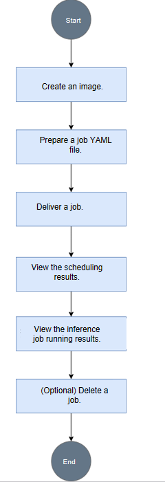

# Deploying Infer Operator Inference Jobs Based on vLLM Proxy

## Implementation Principle

1. The cluster scheduling components periodically report node and chip information.
    - kubelet reports the number of chips to the node.
    - Ascend Device Plugin reports chip memory and topology information.

        For chips with on-chip memory, Ascend Device Plugin reports the on-chip memory status at startup. For details, see the `node-label` description. It also reports full-NPU information, writing the physical ID of the chip to `device-info-cm`. The total number of allocatable chips, the number of allocated chips and basic chip information (device_ip and super_device_ip) are reported to the node for full-NPU scheduling.

    - When a fault exists on a node, NodeD periodically reports the node health status, node hardware fault information, and node DPC shared storage fault information to `node-info-cm`.

2. After reading the information in `device-info-cm` and `node-info-cm`, ClusterD integrates the information into `cluster-info-cm`.
3. The user submits an `InferServiceSet` job of Infer Operator through kubectl or another deep learning platform. Infer Operator generates sub-workloads such as `Deployment` and `StatefulSet` based on the configuration of the inference job, and the corresponding sub-workloads then generate multiple Pods of the inference job.
4. Infer Operator creates a corresponding PodGroup for the job based on the configuration of the inference job. For a detailed description of PodGroup, see the [open-source Volcano official documentation](https://volcano.sh/en/docs/v1-9-0/podgroup/).
5. volcano-scheduler selects an appropriate node for the Pod based on the node's memory, CPU, labels, and affinity, and writes the selected chip information and node hardware information to the Pod's annotation.
6. When kubelet creates the container, it calls Ascend Device Plugin to mount the chip. Ascend Device Plugin or volcano-scheduler writes the chip and node hardware information to the Pod's annotation. Ascend Docker Runtime assists in mounting the corresponding resources.

## Usage via Command Line

### Overview

The inference job of Infer Operator based on vLLM Proxy includes Routing Pods and inference instance Pods. Inference instance Pods can be divided into Prefill instance Pods and Decode instance Pods. The Routing Pod does not require NPU resources. Infer Operator generates different workloads based on different inference service configuration methods to create different inference instances, and the Router provides a unified external inference service.

**Usage Procedure**

[Figure 1](#fig38991911205816) shows the usage process of deploying an Infer Operator inference job based on vLLM Proxy using MindCluster via the command line.

**Figure 1**  Usage process<a name="fig38991911205816"></a>


### Preparing the Job YAML

You can prepare an image based on the actual situation, then select the corresponding YAML example and modify it.

**Prerequisites**

The image preparation is complete. For the vLLM inference image, refer to the [vllm-ascend official documentation](https://vllm-ascend.readthedocs.io/).

**Selecting a YAML Example**

Currently, the vLLM Proxy-based Infer Operator inference job is deployed using the `InferServiceSet`-customized CRD. For Infer Operator deployment, see [Installation and Deployment](../../installation_guide/03_installation/manual_installation/07_infer_operator.md).

The following is an adaptation example. You can modify it as needed.

```Yaml
apiVersion: mindcluster.huawei.com/v1
kind: InferServiceSet
metadata:
  name: "my-test"
  namespace: default
spec:
  replicas: 1 # Number of inference service replicas
  template:
    roles:
    - name: prefill # Prefill definition
      replicas: 1   # Number of prefill replicas
      workload:     # CRD type information of instances in prefill
        apiVersion: apps/v1
        kind: StatefulSet # Workload type. Currently, StatefulSet and Deployment are supported.
      metadata:
        labels:
          infer.huawei.com/gang-schedule: 'false' # Disable gang scheduling. When enabled, a PodGroup is created for each workload instance.
      spec:
        replicas: 1 # Number of pod replicas for the workload in prefill.
        podManagementPolicy: Parallel # This configuration is optional. When the workload is a StatefulSet and infer.huawei.com/gang-schedule is true, it must be set to Parallel.
        selector:
          matchLabels:
            app: test-prefill # User-defined. Must be consistent with the app configuration in the labels below.
        template:
          metadata:
            labels:
              app: test-prefill # User-defined. Must be consistent with the app configuration in the labels below.
              fault-scheduling: 'grace' # Enable rescheduling
              fault-retry-times: '10'
              ring-controller.atlas: ascend-910b # Product type identifier
          spec:
            schedulerName: volcano # Specify Volcano
            nodeSelector:
              accelerator-type: module-910b-8 # Set based on hardware form
            containers:
            - name: prefill
              image: vllm-ascend:xxx # Custom vLLM Image Name
              ...
              resources:
                requests:
                  huawei.com/Ascend910: 8
                limits:
                  huawei.com/Ascend910: 8
              ... # Add necessary mount items and run commands for the container
    - name: decode  # Decode definition
      replicas: 1   # Number of decode replicas
      workload:     # CRD type information of the instance in decode
        apiVersion: apps/v1
        kind: StatefulSet # Workload type. Currently supports StatefulSet/Deployment
      metadata:
        labels:
          infer.huawei.com/gang-schedule: 'false' # Disable gang scheduling. When enabled, a PodGroup is created for each workload instance.
      spec:
        replicas: 1 # Number of pod replicas for the workload in decode.
        podManagementPolicy: Parallel # This configuration is optional. When the workload is a StatefulSet and infer.huawei.com/gang-schedule is true, it must be set to Parallel.
        selector:
          matchLabels:
            app: test-decode # User-defined. Must be consistent with the app configuration in the labels below.
        template:
          metadata:
            labels:
              app: test-decode # User-defined. Must be consistent with the app configuration in the labels below.
              fault-scheduling: 'grace' # Enable rescheduling
              fault-retry-times: '10'
              ring-controller.atlas: ascend-910b # Identifies the product type
          spec:
            schedulerName: volcano # Specify Volcano
            nodeSelector:
              accelerator-type: module-910b-8 # Set based on hardware form
            containers:
            - name: decode
              image: vllm-ascend:xxx # Custom vLLM image name
              ...
              resources:
                requests:
                  huawei.com/Ascend910: 8
                limits:
                  huawei.com/Ascend910: 8
              ... # Add necessary mount items and run commands for the container
    - name: router  # Router definition
      replicas: 1   # Number of router replicas
      services:     # Router services definition. The service defined here creates only one instance within a role scope.
      - name: vllm-router-service
        spec:
          ports:    # Service port definition
          - port: 1026
            protocol: TCP
            targetPort: 1026
          selector:
            app: test-router # User-defined, must be consistent with the app configuration in the labels below
          type: ClusterIP
      workload:     # CRD type information of the instance in the router
        apiVersion: apps/v1
        kind: Deployment # Workload type. Currently supports StatefulSet/Deployment
      spec:
        replicas: 1 # Number of pod replicas for the workload in the router
        selector:
          matchLabels:
            app: test-router # User-defined, must be consistent with the app configuration in the labels below
        template:
          metadata:
            labels:
              app: test-router # User-defined, must be consistent with the app configuration in labels below.
          spec:
            schedulerName: volcano # Specify Volcano.
            containers:
            - name: router
              image: xxx:yyy # Custom image name.
              ... # Add necessary mount items and run commands for the container.
```

### YAML Parameter Description

The following table describes the fields related to MindCluster in the `InferServiceSet` YAML.

**Table 1** YAML parameters

<table><thead align="left"><tr><th class="cellrowborder" valign="top" width="27.16%" ><p>Parameter</p>
</th>
<th class="cellrowborder" valign="top" width="36.28%" ><p >Value</p>
</th>
<th class="cellrowborder" valign="top" width="36.559999999999995%" ><p >Description</p>
</th>
</tr>
</thead>
<tbody>
<tr ><td class="cellrowborder" valign="top" width="27.16%" headers="mcps1.2.4.1.1 "><p >schedulerName</p>
</td>
<td class="cellrowborder" valign="top" width="36.28%" headers="mcps1.2.4.1.2 "><p >The value is <span class="parmvalue" >"volcano"</span>.</p>
</td>
<td class="cellrowborder" valign="top" width="36.559999999999995%" headers="mcps1.2.4.1.3 "><p >Configures the scheduler as <span >Volcano</span>.</p>
</td>
</tr>
<tr ><td class="cellrowborder" valign="top" width="27.16%" headers="mcps1.2.4.1.1 "><p >(Optional) host-arch</p>
</td>
<td class="cellrowborder" valign="top" width="36.28%" headers="mcps1.2.4.1.2 "><ul ><li><span >Arm</span> environment: <span >huawei-arm</span></li><li><span >x86_64</span> environment: <span >huawei-x86</span></li></ul>
</td>
<td class="cellrowborder" valign="top" width="36.559999999999995%" headers="mcps1.2.4.1.3 "><p >The node architecture required to run the training job. Modify it based on the actual situation.</p>
</td>
</tr>
<tr ><td class="cellrowborder" valign="top" width="27.16%" headers="mcps1.2.4.1.1 "><p >pod-rescheduling</p>
</td>
<td class="cellrowborder" valign="top" width="36.28%" headers="mcps1.2.4.1.2 "><ul ><li>on: Enables <span >Pod</span>-level rescheduling.</li><li>Other values or if this field is not used: Disables <span >Pod</span>-level rescheduling.</li></ul>
</td>
<td class="cellrowborder" valign="top" width="36.559999999999995%" headers="mcps1.2.4.1.3 "><p ><span >Pod</span>-level rescheduling means that after a job failure, not all job <span >Pods</span> in the PodGroup are deleted. Instead, only the failed <span >Pod</span> is deleted, and the controller recreates a new <span >Pod</span> for rescheduling.</p>
<p>This field must be configured for PD instances and is optional for Router instances.</p>
</td>
</tr>
<tr ><td class="cellrowborder" valign="top" width="27.16%" headers="mcps1.2.4.1.1 "><p >infer.huawei.com/gang-schedule</p>
</td>
<td class="cellrowborder" valign="top" width="36.28%" headers="mcps1.2.4.1.2 "><ul ><li>true: Enables group scheduling.</li><li>Other values or if this field is not used: Disables group scheduling. Disabled by default.</li></ul>
</td>
<td class="cellrowborder" valign="top" width="36.559999999999995%" headers="mcps1.2.4.1.3 "><p >After group scheduling is enabled, Infer Operator creates a corresponding PodGroup for each instance (workload), ensuring that all Pods in the same PodGroup can start simultaneously.</p>
<p>When the workload is a StatefulSet, you must also configure podManagementPolicy to Parallel while enabling group scheduling; otherwise, the StatefulSet cannot be scheduled normally.</p>
</td>
</tr>
<tr ><td class="cellrowborder" valign="top" width="27.16%" headers="mcps1.2.4.1.1 "><p >accelerator-type</p>
</td>
<td class="cellrowborder" valign="top" width="36.28%" headers="mcps1.2.4.1.2 "><ul ><li><span >Atlas 800I A2 inference server</span>: module-910b-8</li><li><span >Atlas 800I A3 SuperPoD server</span>: module-a3-16</li>
</ul>
</td>
<td class="cellrowborder" valign="top" width="36.559999999999995%" headers="mcps1.2.4.1.3 "><p >Select different values based on the node type required to run the training job.</p>
</td>
</tr>
<tr ><td class="cellrowborder" valign="top" width="27.16%" headers="mcps1.2.4.1.1 "><p >huawei.com/Ascend910</p>
</td>
<td class="cellrowborder" valign="top" width="36.28%" headers="mcps1.2.4.1.2 "><ul ><li><span >Atlas 800I A2 inference server</span>: 8</li><li><span >Atlas 800I A3 SuperPoD server</span>: 16</li></ul>
</td>
<td class="cellrowborder" valign="top" width="36.559999999999995%" headers="mcps1.2.4.1.3 "><p >The number of NPUs requested. Currently, only full-machine scheduling is supported. Modify this based on the actual number of hardware cards.</p>
</td>
</tr>
<tr ><td class="cellrowborder" valign="top" width="27.16%" headers="mcps1.2.4.1.1 "><p >env[name==ASCEND_VISIBLE_DEVICES].valueFrom.fieldRef.fieldPath</p>
</td>
<td class="cellrowborder" valign="top" width="36.28%" headers="mcps1.2.4.1.2 "><p >The value is metadata.annotations['huawei.com/Ascend910'], which must be consistent with the actual chip type in the environment.</p>
</td>
<td class="cellrowborder" valign="top" width="36.559999999999995%" headers="mcps1.2.4.1.3 "><p ><span >Ascend Docker Runtime</span> obtains this parameter value to mount the corresponding type of NPU to the container.</p>
<p >This parameter only supports the full-card scheduling feature of the <span >Volcano</span> scheduler. Users who use static vNPU scheduling or other schedulers need to delete the relevant fields of this parameter in the sample YAML.</p>
</td>
</tr>
<tr ><td class="cellrowborder" rowspan="5" valign="top" width="27.16%" headers="mcps1.2.4.1.1 "><p >fault-scheduling</p>
</td>
<td class="cellrowborder" valign="top" width="36.28%" headers="mcps1.2.4.1.2 "><p >grace</p>
</td>
<td class="cellrowborder" valign="top" width="36.559999999999995%" headers="mcps1.2.4.1.3 "><p >Configures the job to use graceful deletion mode. During the process, the original <span >Pod</span> is gracefully deleted first. If unsuccessful after 15 minutes, the original <span >Pod</span> is forcefully deleted.</p>
</td>
</tr>
<tr ><td class="cellrowborder" valign="top" headers="mcps1.2.4.1.1 "><p >force</p>
</td>
<td class="cellrowborder" valign="top" headers="mcps1.2.4.1.2 "><p >Configures the job to use forced deletion mode. During the process, the original <span >Pod</span> is forcefully deleted.</p>
</td>
</tr>
<tr ><td class="cellrowborder" valign="top" headers="mcps1.2.4.1.1 "><p >off</p>
</td>
<td class="cellrowborder" rowspan="3" valign="top" headers="mcps1.2.4.1.2 "><p >This inference job does not use the fault rescheduling feature.</p>
</td>
</tr>
<tr ><td class="cellrowborder" valign="top" headers="mcps1.2.4.1.1 "><p >None (no fault-scheduling field)</p>
</td>
</tr>
<tr ><td class="cellrowborder" valign="top" headers="mcps1.2.4.1.1 "><p >Other values</p>
</td>
</tr>
<tr ><td class="cellrowborder" rowspan="2" valign="top" width="27.16%" headers="mcps1.2.4.1.1 "><p >fault-retry-times</p>
</td>
<td class="cellrowborder" valign="top" width="36.28%" headers="mcps1.2.4.1.2 "><p >0 &lt; fault-retry-times</p>
</td>
<td class="cellrowborder" valign="top" width="36.559999999999995%" headers="mcps1.2.4.1.3 "><p >To handle service plane faults, you must configure the number of unconditional retries on the service plane.</p>
</td>
</tr>
<tr ><td class="cellrowborder" valign="top" headers="mcps1.2.4.1.1 "><p >None (no fault-retry-times) or 0</p>
</td>
<td class="cellrowborder" valign="top" headers="mcps1.2.4.1.2 "><p >This job does not use the unconditional retry feature. After a service plane fault occurs, <span >Volcano</span> does not actively delete the faulty <span >Pod</span>.</p>
</td>
</tr>
</tbody>
</table>

### Submitting a Job

Run the following command to submit an `InferServiceSet` job, where `<job-yaml>` is the YAML file for the `InferServiceSet` job.

```shell
kubectl apply -f <job-yaml>
```

If the following information is displayed, the `InferServiceSet` job has been submitted successfully.

```ColdFusion
inferserviceset.mindcluster.huawei.com/my-test created
```

### Viewing Scheduling Results

1. Check whether the relevant inference instance Pods have been started, where `<namespace>` is the user-defined namespace.

   ```shell
   kubectl get pod -n <namespace>
   ```

   EIf the following information is displayed, all instance Pods are in the `Running` state.

   ```ColdFusion
   NAME                                  READY   STATUS    RESTARTS   AGE
   my-test-0-decode-0-0                  1/1     Running   0          2s
   my-test-0-prefill1-0-0                1/1     Running   0          2s
   my-test-0-router-0-584bd5c9f9-vhwsm   1/1     Running   0          2s
   ```

2. Check whether the related inference roles (prefill instance set, decode instance set, etc.) have been created.

   ```shell
   kubectl get instanceset -n <namespace>
   ```

   If the following information is displayed, the three instance sets have been created successfully.

   ```ColdFusion
   NAME                 AGE
   my-test-0-decode     69s
   my-test-0-prefill1   69s
   my-test-0-router     69s
   ```

3. Check whether the related inference service has been created.

   ```shell
   kubectl get inferservice -n <namespace>
   ```

   If the following information is displayed, the inference service has been created successfully.

   ```ColdFusion
   NAME        AGE
   my-test-0   112s
   ```

4. Check whether the related inference service set is created.

   ```shell
   kubectl get inferserviceset -n <namespace>
   ```

   If the following information is displayed, the inference service set is created successfully.

   ```ColdFusion
   NAME      AGE
   my-test   2m38s
   ```

### Viewing Inference job Running Results

After the inference job runs, request the inference API to verify the running results.

```shell
curl http://<routing-podip>:8080/v1/completions \
-H "Content-Type: application/json" \
-d '{
"model": "<Model Name>",
"prompt": "Who are you?",
"max_tokens": 10,
"temperature": 0
}'
```

>[!NOTE]
>
>- `<Model Name>` depends on the startup parameter `served_model_name` used by vLLM.
>- `<routing-podip>` is the IP address of the Router instance Pod. You can run the following command to query it.
>
>   ```shell
>   kubectl get pod -n <namespace> -o wide
>   ```
>
>   In the command output, the IP 10.244.1.92 corresponding to `my-test-0-router-0-584bd5c9f9-xpj28` is the IP address of the Router instance Pod.
>
>   ```ColdFusion
>   NAME                                  READY   STATUS    RESTARTS   AGE   IP             NODE                   NOMINATED NODE   READINESS GATES
>   my-test-0-decode-0-0                  1/1     Running   0          5s    10.244.2.83    test-cluster-worker3   <none>           <none>
>   my-test-0-prefill1-0-0                1/1     Running   0          5s    10.244.3.100   test-cluster-worker    <none>           <none>
>   my-test-0-router-0-584bd5c9f9-xpj28   1/1     Running   0          5s    10.244.1.92    test-cluster-worker2   <none>           <none>
>   ```

If the inference job runs successfully, the above command will return the inference result. If it fails, you can run the following command to view the inference service running logs in the corresponding instance container.

```shell
kubectl logs -n <namespace> <pod-name>
```

### Deleting a Job

Run the following command to delete the inference job, where `<job-yaml>` is the YAML file of the `InferServiceSet` job.

```shell
kubectl delete -f <job-yaml>
```

If the following information is displayed, the inference job has been deleted successfully.

```ColdFusion
inferserviceset.mindcluster.huawei.com "my-test" deleted
```

## One-Click Deployment and Usage via MindCluster Deployment Tool

When you deploy Infer Operator inference jobs in a K8s cluster, manually writing and maintaining K8s YAML files is inefficient and error-prone. To address this, the MindCluster community provides a one-click deployment tool for Infer Operator inference jobs, replacing tedious manual operations. You only need to provide basic application information (such as application name, image version, number of replicas, etc.), and the script automatically generates all necessary, compliant `InferServiceSet` YAML files and deploys them directly to the specified cluster. Meanwhile, the deployment tool provides a simple way (such as specifying the same application name) to delete all related resources with one click.

The current script supports prefill/decode disaggregation and prefill/decode hybrid deployment.

**Prerequisites<a name="section178303526285"></a>**

- MindCluster components have been installed.
- Python is installed in the environment, and dependency packages can be downloaded over the network.
- A KubeConfig file exists and can communicate normally with the K8s cluster.

**Procedure<a name="section582414444317"></a>**

1. Obtain the source code from the mindcluster-deploy repository and go to the `infer-operator-deploy-tool` directory.

    ```shell
    git clone https://gitcode.com/Ascend/mindcluster-deploy.git && cd mindcluster-deploy/infer-operator-deploy-tool
    ```

2. (Optional) Create and activate a Python virtual environment. This operation allows different Python projects to use different versions of libraries without interfering with each other.

    ```shell
    python -m venv infer-operator-deploy-tool && source infer-operator-deploy-tool/bin/activate
    ```

    Choose Python or Python3 based on the actual environment.

3. Install dependencies.

    ```shell
    pip install -r requirements.txt
    ```

4. (Optional) Copy the startup script to another directory on the host or to other nodes in the cluster, ensuring that the startup script path on other nodes is the same as that on the host. If the user environment is a single-node environment, you can skip this step. If the user environment includes shared storage, you can also copy the script file to the shared storage and mount the shared storage to the inference service.

    ```shell
    cp src/start/* <target_dir>/src/start/
    scp src/start/* <user>@<IP>:<target_dir>/src/start/
    ```

5. Edit the configuration file `config/user-config.yaml`.

    1. Open the `config/user-config.yaml` file.

        ```shell
        vi config/user-config.yaml
        ```

    2. Press `i` to enter insert mode, and modify the fields in the file according to the actual situation.
    3. Press the `Esc` key, type `:wq!`, and press `Enter` to save and exit editing.

    >[!NOTE]
    >For details about the configuration field description in the user configuration file, see [infer-operator-deploy-tool](https://gitcode.com/Ascend/mindcluster-deploy/blob/master/infer-operator-deploy-tool/README.md).

6. (Optional) Create a job namespace, where `<namespace>` is `deploy_config.namespace` set in `config/user-config.yaml`. If `deploy_config.namespace` is `default` or not set, you do not need to create a namespace.

    ```shell
    kubectl create ns <namespace>
    ```

7. Deploy the inference job. Run the deployment command on the K8s control plane or a node with K8s permissions:

    ```shell
    python main.py deploy -c config/user-config.yaml
    ```

Use Python or Python3 based on the actual environment. The parameters are described as follows:

- `-c, --config`: Path to the configuration file. Optional. Default value: `config/user-config.yaml`.
- `-k, --kubeconfig`: Path to the KubeConfig file. Optional. Default value: `~/.kube/config`.
- `--dry-run`: Dry run (does not actually deploy, displays the generated YAML). Optional.

1. Check the job running status.

    1. Check whether the Pods of the relevant inference instances are started. Here, `<namespace>` is `deploy_config.namespace` set in `config/user-config.yaml`.

       ```shell
       kubectl get pod -n <namespace>
       ```

       As shown in following command output, the Pods of all instances are in the `Running` status.

       ```ColdFusion
       NAME                               READY   STATUS    RESTARTS   AGE
       qwen-0-decode-0-0                  1/1     Running   0          2s
       qwen-0-prefill1-0-0                1/1     Running   0          2s
       qwen-0-router-0-584bd5c9f9-vhwsm   1/1     Running   0          2s
       ```

    2. Check whether the relevant inference roles (prefill instance set, decode instance set, etc.) are created.

        ```shell
        kubectl get instanceset -n <namespace>
        ```

       As shown in following command output, the three instance sets are successfully created.

       ```ColdFusion
       NAME              AGE
       qwen-0-decode     69s
       qwen-0-prefill1   69s
       qwen-0-router     69s
       ```

    3. Check whether the relevant inference service is created.

       ```shell
       kubectl get inferservice -n <namespace>
       ```

       As shown in following command output, the inference service was created successfully.

       ```ColdFusion
       NAME     AGE
       qwen-0   112s
       ```

    4. Check whether the related inference service set has been created.

       ```shell
       kubectl get inferserviceset -n <namespace>
       ```

       As shown in following command output, the inference service collection was created successfully.

       ```ColdFusion
       NAME   AGE
       qwen   2m38s
       ```

2. Open a new terminal window and run the following command on a node in the current K8s cluster to access the inference service. If the request returns successfully, the inference service has been deployed successfully.

    ```shell
    curl http://<routing-podip>:8080/v1/completions \
    -H "Content-Type: application/json" \
    -d '{
    "model": "<Model Name>",
    "prompt": "Who are you?",
    "max_tokens": 10,
    "temperature": 0
    }'
    ```

   >[!NOTE]
   >- `<routing-podip>` is the IP address of the Router instance Pod, which can be queried by executing the following command.
   >
   >   ```shell
   >   kubectl get pod -n <namespace> -o wide
   >   ```
   >
   >   The example response is as follows. The IP 10.244.1.92 corresponding to `qwen-0-router-0-584bd5c9f9-xpj28` is the IP of the Router instance Pod.
   >
   >   ```ColdFusion
   >   NAME                               READY   STATUS    RESTARTS   AGE   IP             NODE                   NOMINATED NODE   READINESS GATES
   >   qwen-0-decode-0-0                  1/1     Running   0          5s    10.244.2.83    test-cluster-worker3   <none>           <none>
   >   qwen-0-prefill1-0-0                1/1     Running   0          5s    10.244.3.100   test-cluster-worker    <none>           <none>
   >   qwen-0-router-0-584bd5c9f9-xpj28   1/1     Running   0          5s    10.244.1.92    test-cluster-worker2   <none>           <none>
   >   ```
   >
   >- `<Model Name>` is the `engine_common_config.serve_name` field in the configuration file.

3. (Optional) Delete the inference job. If you need to delete the job, perform this step.

    ```shell
    python main.py delete -n qwen -ns default
    ```

    The Parameter Description is as follows:

    - `-n, --app-name`: Application name, mandatory. The application name is the `deploy_config.job_name` field in the configuration file.
    - `-ns, --namespace`: Application namespace, optional. Default value: `default`.
    - `-k, --kubeconfig`: Path to the KubeConfig file, Optional. Default value: `~/.kube/config`.
