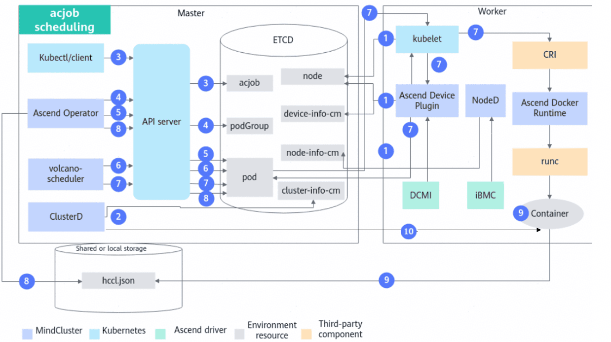
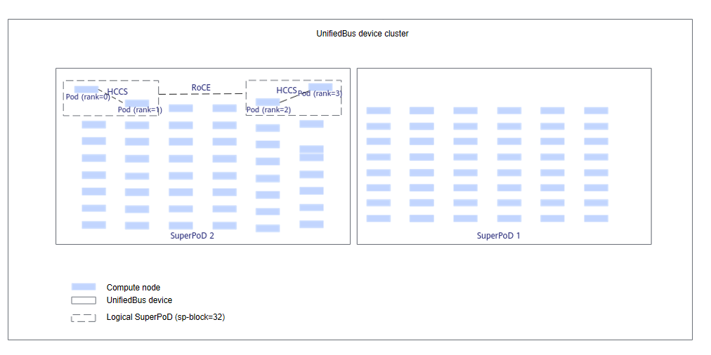

# Deploying MindIE Motor<a name="ZH-CN_TOPIC_0000002511346333"></a>

<!-- md-trans-meta sourceCommit=unknown translatedAt=2026-06-26T11:47:42.214Z pushedAt=2026-06-27T00:32:25.601Z -->

## Implementation Principle<a name="ZH-CN_TOPIC_0000002511426301"></a>



The steps are described as follows:

1. The cluster scheduling components periodically report node and chip information.
    - kubelet reports the number of node chips to the node object.
    - Ascend Device Plugin reports chip memory and topology information.

        For chips with on-chip memory, Ascend Device Plugin reports the chip memory status upon startup, as described in the node-label description; reports the full NPU information, writing the physical ID of the chip to `device-info-cm`; the total number of allocatable le chips, the number of allocated chips, and basic chip information (device ip and super_device_ip) are reported to the node for full NPU scheduling.

    - When a fault exists on a node, NodeD periodically reports the node health status and node hardware fault information to `node-info-cm`, and reports shared storage fault information to the public faults of ClusterD.

2. After reading the information in `device-info-cm`, `node-info-cm`, and the public faults, ClusterD writes the information into `cluster-info-cm`.
3. The user submits MS Controller, MS Coordinator tasks that do not use NPUs, and several MindIE Server tasks that use NPUs, through kubectl or other deep learning platforms.
4. Ascend Operator creates the corresponding podGroup for the tasks. For detailed information about podGroup, refer to the [official open-source Volcano documentation](https://volcano.sh/docs/v1.9.0/Concepts/podgroup).
5. Ascend Operator creates the corresponding Pods for the tasks and injects the environment variables required for starting the MindIE Server service. For detailed information about environment variables, see [Environment Variables Injected by Ascend Operator](../../api/environment_variable_description.md#ascend-operator-environment-variables).
6. For MS Controller and MS Coordinator tasks, volcano-scheduler selects appropriate nodes based on node memory, CPU, labels, and affinity. For MindIE Server tasks, volcano-scheduler also references chip topology information to select appropriate nodes, and writes the selected chip information and node hardware information into the Pod's annotations.
7. When kubelet creates containers, for MindIE Server tasks, it calls Ascend Device Plugin to mount chips. Ascend Device Plugin or volcano-scheduler writes chip and node hardware information into the Pod's annotations. Ascend Docker Runtime assists in mounting the corresponding resources.
8. Ascend Operator reads the annotation information of each MindIE Server task Pod, generates their respective collective communication file `hccl.json`, and stores it in etcd in the form of a ConfigMap.
9. ClusterD listens for changes in MS Controller and MS Coordinator task Pod information, as well as changes in the ConfigMaps corresponding to each `hccl.json`, and generates the `global-ranktable` in real time. For a detailed description of the `global-ranktable`, see the "global-ranktable File Description" section in [SubscribeRankTable](../../api/clusterd/05_service_configuration_apis.md).
10. After MS Controller starts, it establishes communication with ClusterD and subscribes to changes in the `global-ranktable` through the gRPC interface.

## Using via Command Line<a name="ZH-CN_TOPIC_0000002511426327"></a>

>[!NOTICE]
>If the user has not configured the RoCE network:
>
>- In non-SuperPoD scheduling scenarios, single-server inference instances can be scheduled normally, but KV transmission between inference instances may be abnormal, causing the inference job to fail to run normally.
>- In SuperPoD scheduling scenarios, if the number of logical SuperPoDs for the inference instance is 1, the inference instance can be scheduled normally, but KV transmission between inference instances may be abnormal, causing the inference job to fail to run normally.

### Process Description<a name="ZH-CN_TOPIC_0000002511426315"></a>

MindIE Motor consists of two parts: MindIE MS (MindIE Management Service) and MindIE Server. MindIE MS includes MS Controller and MS Coordinator, while MindIE Server can be divided into Prefill instances and Decode instances. MS Controller and MS Coordinator do not require NPU resources, whereas MindIE Server requires NPU resources.

The MindCluster cluster scheduling components support running MS Controller, MS Coordinator, and MindIE Server in independent Pods. When using the MindCluster cluster scheduling components for MindIE Motor task deployment, MS Controller, MS Coordinator, and each instance in MindIE Server are deployed as an AscendJob respectively. For example, if an inference job contains two Prefill instances and one Decode instance, five AscendJobs need to be deployed.

For detailed instructions on Prefill-Decode disaggregation deployment, refer to the "Cluster Service Deployment > [Prefill-Decode Disaggregation Deployment](https://www.hiascend.com/document/detail/en/mindie/300/mindiemotor/motordev/user_guide/service_deployment/pd_separation_service_deployment.md)" section in the *MindIE Motor Development Guide*.

**Usage Process<a name="zh-cn_topic_0000002328850238_section5640184231810"></a>**

The figure below shows the process of deploying MindIE Motor inference jobs using the MindCluster cluster scheduling components via the command line.

**Figure 1** Usage process<a name="fig38991911205815"></a>


### Preparing a Job YAML<a name="ZH-CN_TOPIC_0000002479386386"></a>

Prepare for image creation as required, select a YAML file, and modify the YAML file.

**Prerequisites<a name="zh-cn_topic_0000002362848597_section629963815311"></a>**

The image preparation has been completed.

**YAML Selection<a name="zh-cn_topic_0000002362848597_section132746121119"></a>**

Various YAML examples are provided for cluster scheduling. You can select an appropriate YAML example based on the used component, processor type, and job type, and make necessary modifications according to actual requirements before using it.

<a name="zh-cn_topic_0000002362848597_table74058394335"></a>

|Type|Hardware Model|YAML Name|Obtain Link|
|--|--|--|--|
|MS Controller|-|controller.yaml|[YAML](https://gitcode.com/Ascend/mindxdl-deploy/tree/c20d2ea32f5ccca8b06b735d31cf36240ed1407f/samples/inference/volcano/mindie-ms)|
|MS Coordinator|-|coordinator.yaml|[YAML](https://gitcode.com/Ascend/mindxdl-deploy/tree/c20d2ea32f5ccca8b06b735d31cf36240ed1407f/samples/inference/volcano/mindie-ms)|
|MindIE Server|<p>Atlas 800I A2 Inference Server</p><p>Atlas 800I A3 SuperPoD Server</p>|server.yaml|[YAML](https://gitcode.com/Ascend/mindxdl-deploy/tree/c20d2ea32f5ccca8b06b735d31cf36240ed1407f/samples/inference/volcano/mindie-ms)|

>[!NOTE]
>If the device used is an Atlas 800I A3 SuperPoD server, after obtaining the YAML, refer to [the example below](#li7390175311918) to modify some parameters.

**YAML Description<a name="zh-cn_topic_0000002362848597_section1870105118125"></a>**

Compared with a common AscendJob, the MindIE Motor inference job requires the two additional labels: `app` and `jobID`. MindIE Server requires NPUs. Ensure that the number of AscendJobs delivered matches the number of prefill instances and decode instances.

>[!NOTE]
>For example, if a MindIE Motor inference job contains one MS Controller instance, one MS Coordinator instance, x prefill instances, and y decode instances, the number of AscendJobs to be deployed is 1 + 1 + x + y.

- **MS Controller and MS Coordinator** do not require NPUs and are each deployed as an AscendJob, supporting multiple replicas. The YAML examples for MS Controller and MS Coordinator are as follows.

    <pre codetype="yaml">
    apiVersion: mindxdl.gitee.com/v1
    kind: AscendJob
    metadata:
      name: mindie-ms-test-controller
      namespace: mindie
      labels:
        framework: pytorch
        <strong>app: mindie-ms-controller   # Indicates the role of MindIE Motor in the Ascend Job task, non-modifiable</strong>
        <strong>jobID: mindie-ms-test       # Unique identification ID of the current MindIE Motor task in the cluster, configurable by the user based on actual conditions</strong>
        ring-controller.atlas: ascend-910b
    spec:
      schedulerName: volcano   # Scheduler selected when Ascend Operator enables "gang" scheduling
      runPolicy:
        schedulingPolicy:      # This field only takes effect when Ascend Operator enables "gang" scheduling and the scheduler is Volcano
          minAvailable: 1      # Total replica count for task running
          queue: default
      successPolicy: AllWorkers
      replicaSpecs:
        Master:
          replicas: 1
          restartPolicy: Always
          template:
            metadata:
              ...</pre>

`app` and `jobID` are described as follows. For detailed descriptions of other parameters, see [YAML Parameter Description](#yaml-parameter-description).

`app`: role of MindIE Motor in the AscendJob. Values include `mindie-ms-controller`, `mindie-ms-coordinator`, and `mindie-ms-server`.

`jobID`: unique ID of the MindIE Motor job in the cluster. You can configure the ID as required.

- YAML example for MindIE Server

    <pre codetype="yaml">
    apiVersion: v1
    kind: ConfigMap
    metadata:
      name: rings-config-mindie-server-0  # The name must be identical to the name attribute of the following AscendJob. The prefix "rings-config-" is non-modifiable.
      namespace: mindie
      labels:
        jobID: mindie-ms-test
        ring-controller.atlas: ascend-910b
        <strong>mx-consumer-cim: "true"</strong>
    data:
      hccl.json: |
        {
            "status":"initializing"
        }

    apiVersion: mindxdl.gitee.com/v1
    kind: AscendJob
    metadata:
      name: mindie-server-0
      namespace: mindie
      labels:
        framework: pytorch
        <strong>app: mindie-ms-server        # Indicates the role of the current MindIE Motor in the Ascend Job task, non-modifiable</strong>
        <strong>jobID: mindie-ms-test        # The unique identification ID of the current MindIE Motor task in the cluster. Users can configure it based on actual conditions.</strong>
        ring-controller.atlas: ascend-910b
      annotations:
        huawei.com/schedule.filter.faultCode: "8C1F8608,4C1F8608,80E01801"       # Add this annotation. For the configuration method, see YAML Parameter Description.
        huawei.com/schedule.filter.faultLevel: "RestartRequest"       # Add this annotation. For the configuration method, see YAML Parameter Description.
    spec:
      schedulerName: volcano   # The scheduler selected when Ascend Operator enables "gang" scheduling
      runPolicy:
        schedulingPolicy:      # This field only takes effect when Ascend Operator enables "gang" scheduling and the scheduler is Volcano
          minAvailable: 2      # Total replica count for task running
          queue: default
      successPolicy: AllWorkers
      replicaSpecs:
        Master:</pre>

- <a name="li7390175311918"></a>For the Atlas 800I A3 SuperPoD Server, the YAML for MindIE Server requires the following modifications:

    <pre codetype="yaml">
    apiVersion: mindxdl.gitee.com/v1
    kind: AscendJob
    metadata:
      name: mindie-server-0
      namespace: mindie
      labels:
        framework: pytorch
        app: mindie-ms-server        # Non-modifiable
        jobID: mindie-ms-test        # Unique identification ID of the MindIE Motor job in the cluster. Users can configure it based on actual conditions.
        ring-controller.atlas: ascend-910b
        fault-scheduling: force
      <strong>annotations:</strong>
        <strong>sp-block: "16"         # Add this annotation. For the configuration method, see YAML Parameter Description.</strong>
        <strong>huawei.com/schedule_policy: "chip2-node16"    # Set the scheduling policy based on the hardware form</strong>
        huawei.com/schedule.filter.faultCode: "8C1F8608,4C1F8608,80E01801"       # Add this annotation. For the configuration method, see YAML Parameter Description.
        huawei.com/schedule.filter.faultLevel: "RestartRequest"       # Add this annotation. For the configuration method, see YAML Parameter Description.
    spec:
      schedulerName: volcano   # Volcano selected when Ascend Operator enables "gang" scheduling
      runPolicy:
        schedulingPolicy:      # This field only takes effect when Ascend Operator enables "gang" scheduling and the scheduler is Volcano
          minAvailable: 2      # Total replica count for job running
          queue: default
      successPolicy: AllWorkers
      replicaSpecs:
        Master:
          replicas: 1
          restartPolicy: Always
          template:
            metadata:
              labels:
                ring-controller.atlas: ascend-910b
                app: mindie-ms-server
                jobID: mindie-ms-test
            spec:
              nodeSelector:
                accelerator: huawei-Ascend910</pre>

### (Optional) Configuring Instance-Level Affinity Scheduling<a name="ZH-CN_TOPIC_0000002511346349"></a>

For the Atlas 800I A3 SuperPoD Server, MindCluster cluster scheduling components support job-level affinity scheduling for MindIE Motor inference jobs. That is, MindIE Server instances can be scheduled to the same physical SuperPoD as much as possible, fully utilizing the HCCS network and accelerating network communication between instances.

For detailed instructions on affinity scheduling rules for logical SuperPoDs, see the [UnifiedBus Device Network Description](../basic_scheduling/01_affinity_scheduling/03_ascend_ai_processor_based_affinity.md) section.

**Figure 1**  UnifiedBus device network<a name="zh-cn_topic_0000002362872425_fig1054553210321"></a>


**Configuring Instance-Level Affinity Scheduling<a name="zh-cn_topic_0000002362872425_section18872194156"></a>**

After image preparation is finished, if instance-level affinity scheduling policies are required for MindIE Motor inference jobs during [Preparing a Job YAML](#preparing-a-job-yaml), perform the following operations simultaneously.

- Specify the `sp-block` field in the job YAML. The value of `sp-block` must be consistent with the chip quantity to ensure that the entire job is scheduled to a single physical SuperPoD.

- Ensure that there are reserved nodes in a physical SuperPoD for MindIE Server instance scheduling.

- When `sp-fit` is set to `idlest`, MindIE Server instances are scheduled to a more idle physical SuperPoD.
- When `podAffinity` is set, MindIE Server instances are scheduled to a physical SuperPoD with more affinity pods.

The YAML example is as follows:

<pre codetype="yaml">
apiVersion: mindxdl.gitee.com/v1
kind: AscendJob
metadata:
  name: mindie-server-0
  namespace: mindie
  labels:
    framework: pytorch
    app: mindie-ms-server        # Role of MindIE Motor in AscendJob, non-modifiable
    jobID: mindie-ms-test        # Unique identification ID of the current MindIE Motor job in the cluster, configurable by the user based on actual conditions
    ring-controller.atlas: ascend-910b
    fault-scheduling: force
  annotations:
    <strong>sp-block: "16"              # Specifies the sp-block field. The cluster scheduling components will divide logical SuperPoDs based on the partitioning strategy on top of the physical SuperPoD for affinity scheduling of training jobs.</strong>
    <strong>sp-fit: "idlest"            # SuperPoD scheduling policy. For detailed description, see YAML Parameter Description.</strong>
    <strong>huawei.com/schedule_policy: "chip2-node16"    # Sets the scheduling policy based on the hardware form.</strong>
spec:
  schedulerName: volcano   # Volcano selected when Ascend Operator enables "gang" scheduling
  runPolicy:
    schedulingPolicy:      # This field only takes effect when Ascend Operator enables "gang" scheduling and the scheduler is Volcano
      minAvailable: 2      # Total replica count for job running
      queue: default
  successPolicy: AllWorkers
  replicaSpecs:
    Master:
      restartPolicy: Never
      template:
        metadata:
          labels:
            ring-controller.atlas: ascend-910b
        spec:
          affinity:
            <strong>podAffinity:            # Indicates that the logical SuperPoD will be scheduled to the physical SuperPoD with more affinity pods</strong>
              <strong>preferredDuringSchedulingIgnoredDuringExecution:</strong>
              <strong>- weight: 100         # Non-modifiable</strong>
                <strong>podAffinityTerm:</strong>
                  <strong>labelSelector:</strong>
                    <strong>matchLabels:</strong>
                      <strong>jobID: mindie-ms-test  # Label required for affinity pods</strong>
                  <strong>topologyKey: kubernetes.io/hostname</strong></pre>

### YAML Parameter Description<a name="ZH-CN_TOPIC_0000002511346361"></a>

The following table describes the YAML parameters in the AscendJob.

**Table 1** YAML parameters

<a name="zh-cn_topic_0000002329010086_table7602101418317"></a>

|Parameter|Value|Description|
|---| ---| ---|
|framework|<ul><li>mindspore</li><li>pytorch</li></ul>|-|
|jobID|Unique identification ID of the current MindIE Motor inference job in the cluster.Configure it based on actual conditions.|This parameter is only supported on Atlas 800I A2 inference servers and Atlas 800I A3 SuperPoD servers.|
|app|Role of the current MindIE Motor inference job in the AscendJob. Values include mindie-ms-controller, mindie-ms-coordinator, and mindie-ms-server.|<ul><li>When the AscendJob YAML contains both the jobID and app fields, Ascend Operator automatically injects the environment variables MINDX_TASK_ID, APP_TYPE, MINDX_SERVER_IP, and MINDX_SERVER_DOMAIN, and identifies it as a MindIE inference job.</li><li>For detailed descriptions of the above environment variables, see [Environment Variables Injected by Ascend Operator](../../api/environment_variable_description.md#ascend-operator-environment-variables).</li><li>This parameter is only supported on Atlas 800I A2 inference servers and Atlas 800I A3 SuperPoD servers.</li></ul>|
|mx-consumer-cim|Marks whether this ConfigMap will be listened to by ClusterD.<p>true: Yes</p>|-|
|mind-cluster/scaling-rule|Marks the ConfigMap name corresponding to the scaling rule.|Only supported for MindIE Motor inference jobs to use this parameter on Atlas 800I A2 inference servers and Atlas 800I A3 SuperPoD servers.|
|mind-cluster/group-name|Marks the corresponding group name in the scaling rule.|Only supported for MindIE Motor inference jobs to use this parameter on Atlas 800I A2 inference servers and Atlas 800I A3 SuperPoD servers.|
|podAffinity|Indicates that the logical SuperPoD will be scheduled to the physical SuperPoD with more affinity pods.|Only supported for MindIE Motor inference jobs to use this parameter on Atlas 800I A3 SuperPoD servers.|
|sp-fit|Super node scheduling policy.<ul><li>idlest: The logical SuperPoD will be scheduled to the more idle physical SuperPoD.</li><li>Non-idlest: The logical SuperPoD will preferentially fill up the physical SuperPoD.</li></ul>|Only supported for MindIE Motor inference jobs to use this parameter on Atlas 800I A3 SuperPoD servers.|
|ring-controller.atlas|<ul><li>For Atlas A2 training series products, A200T A3 Box8 SuperPoD servers, Atlas 900 A3 SuperPoD servers, and Atlas 800T A3 SuperPoD servers, the value is: ascend-<i>{xxx}</i>b</li><li>For Atlas 800 training servers and servers (with Atlas 300T training cards), the value is: ascend-910</li></ul>|Identifies the product type of the chip used by the job. It needs to be configured in the ConfigMap and the job.|
|schedulerName|Default value is "volcano". Fill in according to the actual situation.|Scheduler selected when Ascend Operator enables "gang" scheduling.|
|minAvailable|Default value is the total replica count of the job.|Total replica count for job running when Ascend Operator enables "gang" scheduling and the scheduler is Volcano.|
|queue|Default value is "default". Fill in according to the actual situation.|Queue to which the job belongs when Ascend Operator enables "gang" scheduling and the scheduler is Volcano.|
|(Optional) successPolicy|<ul><li>The default value is empty. If not specified, the default empty value is used.</li><li>AllWorkers</li></ul>|Prerequisite for job success. An empty value means that only one Pod needs to succeed for the entire job to be judged as successful. The value "AllWorkers" indicates that all Pods must succeed for the job to be judged as successful.|
|container.name|ascend|Name of the training container; must be "ascend".|
|(Optional) ports|If not specified, the system fills in the following parameters by default:<ul><li>name: ascendjob-port</li><li>containerPort: 2222</li></ul>|Distributed training collective communication port. "containerPort" can be set according to actual conditions. If not set, the default port 2222 is used.|
|replicas|<ul><li>Single machine: 1</li><li>Distributed: N</li></ul>|N is the number of job replicas.|
|image|-|Training image name. Modify it according to the actual situation.|
|(Optional) host-arch|<ul><li>Arm: huawei-arm</li><li>x86_64: huawei-x86</li></ul>|<p>Architecture of the node where a training job is executed. Set this parameter as required.</p><p>In a distributed training job, ensure that the nodes running the training job have the same architecture.</p>|
|sp-block|Chip quantity of the logical SuperPoD.<ul><li>For single-server scenarios, it needs to be consistent with the chip quantity requested by the job.</li><li>For distributed scenarios, it needs to be an integer multiple of the node chip quantity, and the total chip quantity of the job is an integer multiple of it.</li></ul>|Specifies the sp-block field. The cluster scheduling components will divide the physical SuperPoD into logical SuperPoDs based on the partitioning policy for affinity scheduling of the job. If not specified, Volcano scheduling will specify the logical SuperPoD size as the total number of NPUs configured for the job.<ul><li>For detailed instructions, see [UnifiedBus Device Network Description](../basic_scheduling/01_affinity_scheduling/03_ascend_ai_processor_based_affinity.md).</li><li>Only supported for use on Atlas 800I A3 SuperPoD servers.</li><li>If this field is used, there is no need to additionally configure the tor-affinity field.</li><li>Refer to [Initialization Connection Failed due to Incorrect sp-block Setting](https://gitcode.com/Ascend/mind-cluster/issues/377).</li></ul>|
|tor-affinity|<ul><li>large-model-schema: Large model task or filler task</li><li>normal-schema: Normal task</li><li>null: Do not use switch affinity scheduling</li></ul><div class="note"><span class="notetitle">Note:</span><div class="notebody">Users need to select the task type based on the number of task replicas. A task with fewer than 4 replicas is a filler task. A task with 4 or more replicas is a large model task. Normal tasks have no restriction on the number of task replicas.</div></div>|The default value is null, indicating that switch affinity scheduling is not used. Users need to configure it based on the task type.<ul><li>Switch affinity scheduling version 1.0 supports Atlas training series products and Atlas A2 training series products; supports PyTorch and MindSpore frameworks.</li><li>Switch affinity scheduling version 2.0 supports Atlas A2 training series products; supports the PyTorch framework.</li></ul>|
|pod-rescheduling|<ul><li>on: Enable Pod-level rescheduling</li><li>Other values or not using this field: Disable Pod-level rescheduling</li></ul>|Pod-level rescheduling means that after a fault occurs, not all Pods are deleted. Instead, the faulty Pod is deleted, and a new Pod is created for rescheduling.<ul><li>The default rescheduling mode is Job-level rescheduling. To enable Pod-level rescheduling, this field needs to be added.</li><li>Pod-level rescheduling currently only supports MS Controller and MS Coordinator.</li></ul>|
|subHealthyStrategy|<ul><li>ignore: Ignore this sub-healthy node. Subsequent jobs will not prioritize scheduling this node in affinity scheduling.</li><li>graceExit: Do not use the sub-healthy node, save the dying gasp checkpoint file, and then perform rescheduling. Subsequent jobs will not be scheduled to this node.</li><li>forceExit: Do not use the sub-healthy node, exit directly without saving the job, and perform rescheduling. Subsequent jobs will not be scheduled to this node.</li><li>The default value is ignore.</li></ul>|Processing strategy for nodes whose status is SubHealthy.|
|accelerator-type|<ul><li>Atlas 800 training server (full configuration of NPUs): module</li><li>Atlas 800 training server (half configuration of NPUs): half</li><li>Server (with Atlas 300T training cards): card</li><li>Atlas 800T A2 training server and Atlas 900 A2 PoD cluster basic unit: module-<em>{xxx}</em>b-8</li><li>Atlas 200T A2 Box16 heterogeneous subrack and Atlas 200I A2 Box16 heterogeneous subrack: module-<em>{xxx}</em>b-16</li><li>Atlas 900 A3 SuperPoD: module-a3-16-super-pod</li></ul>|<p>Set this parameter based on the type of the node where a training job is executed. For the Atlas 800 training server (NPU full configuration), this parameter can be omitted.</p><div class="note"><span class="notetitle">[!NOTE]</span><div class="notebody">In the following example, the value of {<em>xxx</em>} is 910.</div></div>|
|huawei.com/Ascend910|Atlas 800 training server (NPUs fully configured):<ul><li>Single-server single-processor: 1</li><li>Single-server multi-processor: 2, 4, 8</li><li>Distributed: 1, 2, 4, 8</li></ul>Atlas 800 training server (half-configured NPU):<ul><li>Single-server single-processor: 1</li><li>Single-server multi-processor: 2, 4</li><li>Distributed: 1, 2, 4</li></ul>Server (with Atlas 300T training card):<ul><li>Single-server single-processor: 1</li><li>Single-server multi-processor: 2</li><li>Distributed: 2</li></ul>Atlas 800T A2 training server and Atlas 900 A2 PoD cluster base unit:<ul><li>Single-server single-processor: 1</li><li>Single-server multi-processor: 2, 3, 4, 5, 6, 7, 8</li><li>Distributed: 1, 2, 3, 4, 5, 6, 7, 8</li></ul>Atlas 200T A2 Box16 heterogeneous sub-frame and Atlas 200I A2 Box16 heterogeneous sub-frame:<ul><li>Single-server single-processor: 1</li><li>Single-server multi-processor: 2, 3, 4, 5, 6, 7, 8, 10, 12, 14, 16</li><li>Distributed: 1, 2, 3, 4, 5, 6, 7, 8, 10, 12, 14, 16</li></ul>Atlas 900 A3 SuperPoD SuperPoD<ul><li>Single-server single-processor: 1</li><li>Single-server multi-processor: 2, 4, 6, 8, 10, 12, 14, 16</li><li>Distributed: 16</li></ul>|Requested number of NPUs. Modify it according to the actual situation.|
|(.kind=="AscendJob").spec.replicaSpecs.{Master\|Scheduler\|Worker}.template.spec.containers\[0\].env\[name==ASCEND\_VISIBLE\_DEVICES\].valueFrom.fieldRef.fieldPath| The value is metadata.annotations\['huawei.com/AscendXXX'\], where XXX indicates the chip model. Supported values are 910, 310, and 310P. The value needs to be consistent with the actual chip type in the environment.|Ascend Docker Runtime obtains this parameter value to mount the corresponding type of NPU to the container.<div class="note"><span class="notetitle">Note:</span><div class="notebody">This parameter only supports the full-NPU scheduling feature using the Volcano scheduler. Users using static vNPU scheduling and other schedulers need to delete the relevant fields of this parameter in the sample YAML.</div></div>|
|fault-scheduling|<ul><li>grace: graceful deletion mode, during which the original Pod is gracefully deleted first. If unsuccessful after 15 minutes, the original Pod is forcibly deleted.</li><li>force: forced deletion mode, during which the original Pod is forcibly deleted.</li><li>off, none (no fault-scheduling field), or other values: resumable training is not used, and K8s maxRetry takes effect.</li></ul>|-|
|fault-retry-times|<ul><li>0 \< fault-retry-times: To handle service plane faults, the number of unconditional retries for the service plane must be configured.<ul><li>Using the unconditional retry function requires that the container exits abnormally when the training process is abnormal. If the container does not exit abnormally, the retry cannot succeed.</li><li>Currently, only Atlas 800T A2 training servers and Atlas 900 A2 PoD cluster basic units support the unconditional retry function.</li><li>When performing process-level recovery, a service plane fault will be triggered. To use process-level recovery, this parameter must be configured.</li></ul></li><li>None (no fault-retry-times) or 0: The task does not use the unconditional retry function and cannot perceive service plane faults. vcjob's maxRetry still takes effect.</li></ul>|-|
|backoffLimit|<ul><li>0 \< backoffLimit: Number of rescheduling times when a job is faulty. If the number of rescheduling times is the same as the value of backoffLimit, the job will not be rescheduled.<p>When both backoffLimit and fault-retry-times parameters are configured, if the number of rescheduling times already performed equals either the backoffLimit or fault-retry-times value, rescheduling will no longer be performed.</p></li><li>None (no backoffLimit) or backoffLimit ≤ 0: The total number of rescheduling times is not limited. If backoffLimit is not configured but fault-retry-times is configured, the rescheduling times of fault-retry-times is used.</li></ul>|-|
|restartPolicy|<ul><li>Never: Never restart</li><li>Always: Always restart</li><li>OnFailure: Restart on failure</li><li>ExitCode: Decide whether to restart the Pod based on the process exit code. Error codes 1 to 127 do not restart, and 128 to 255 restart the Pod.<div class="note"><span class="notetitle">Note:</span><div class="notebody">vcjob type training tasks do not support ExitCode.</div></div></li></ul>|Container restart policy. When configuring unconditional retry for service plane faults, the container restart policy value must be "Never".|
|terminationGracePeriodSeconds|0 \< terminationGracePeriodSeconds \< grace-over-time parameter value|The time from when the container receives SIGTERM to being forcibly stopped by K8s. This time needs to be greater than 0 and less than the value of the grace-over-time parameter in the volcano-v<i>{version}</i>.yaml file. It also needs to ensure that the checkpoint file can be saved. Modify it according to the actual situation. For specific instructions, refer to the K8s [Container Lifecycle Hooks](https://kubernetes.io/docs/concepts/containers/container-lifecycle-hooks/).<p>This field only takes effect when fault-scheduling is configured as grace; it is invalid when fault-scheduling is configured as force.</p>|
|hostNetwork|<ul><li>true: Use HostIP to create the Pod.</li><li>false: Do not use HostIP to create the Pod.</li></ul>|<ul><li>When the cluster scale is large (number of nodes \> 1,000), it is recommended to use HostIP to create Pods.</li><li>When this parameter is not passed in, HostIP is not used to create Pods by default.</li></ul><div class="note"><span class="notetitle">[!NOTE] Note</span><div class="notebody">When the HostNetwork value is true, if the current job YAML mounts the RankTable file path, the Pod's hostIP can be obtained by parsing the RankTable file in the training script to establish connections. If the job YAML does not mount the RankTable file path, it remains consistent with the original, using serviceIP to establish connections.</div></div>|
|huawei.com/schedule.filter.faultCode|Value example: "8C1F8608:30, 80E01801", indicating that within a 30-second time window, fault 8C1F8608 is silenced; within a 60-second time window, fault 80E01801 is silenced.<p>If the time window is not configured, the default is 60. The value range is 0 to 86400, in seconds.</p>|Configures the fault codes and time windows that the job needs to silence.<ul><li>Fault codes only support configuring fault codes for chip faults and UnifiedBus device faults. For supported fault codes, see the faultCode.json and SwitchFaultCode.json files for details.</li><li>Supports configuring multiple fault codes and time windows, separated by commas.</li><li>For MindIE Service, if this configuration item is not present in the YAML file, the following fault codes are silenced by default:<ul><li>8C1F8608 silenced for 60 seconds</li><li>4C1F8608 silenced for 60 seconds</li><li>80E01801 silenced for 60 seconds</li></ul></li></ul>|
|huawei.com/schedule.filter.faultLevel|Value example: "RestartRequest:30, RestartBusiness", indicating that within a 30-second time window, all faults at the RestartRequest level are silenced; within a 60-second time window, all faults at the RestartBusiness level are silenced.<p>If the time window is not configured, the default is 60. The value range is 0 to 86400, in seconds.</p>|Configures the fault levels and time windows that the job needs to silence.<ul><li>Fault levels only support configuring levels for chip faults and UnifiedBus device faults. For supported fault levels, see [Configuration Description](../resumable_training/03_configuring_fault_detection_levels.md) for details.</li><li>Supports configuring multiple fault levels and time windows, separated by commas.</li><li>For MindIE Service, if this configuration item is not present in the YAML file, all faults at the RestartRequest level are silenced for 60 seconds by default.</li><li>The priority of huawei.com/schedule.filter.faultCode is higher than that of huawei.com/schedule.filter.faultLevel.</li><li>For notification-type faults, after ClusterD silences such faults, Volcano may not actively reschedule the faulty Pod. The job can subscribe to ClusterD's fault subscription interface to handle received faults accordingly. If processing fails, the Pod needs to actively exit with an Error status.</li></ul>|

### Delivering, Viewing, and Deleting an Inference Job<a name="ZH-CN_TOPIC_0000002479386412"></a>

After completing the preparation of the job YAML,perform the following operations:

1. Deliver an inference job.
2. View scheduling results.
3. View  the inference job running status.
4. (Optional) Delete a job.

For detailed instructions on the above steps, see the "Cluster Service Deployment > Prefill-Decode Disaggregation Deployment > Installation and Deployment > [Deploying a Single-Server Prefill-Decode Disaggregation Service Using kubectl](https://www.hiascend.com/document/detail/en/mindie/230/servicedeploy/servicedev/mindie_service0318.html)" section in the *MindIE Motor Development Guide*.

### global-ranktable Description<a name="ZH-CN_TOPIC_0000002479226414"></a>

ClusterD listens to the information of the MS Controller and MS Coordinator job pods and the changes of the ConfigMap corresponding to each `hccl.json` file, and generates `global-ranktable` in real time. Some fields in `global-ranktable` are consistent with those in the `hccl.json` file. For details about hccl.json, see [hccl.json File Description](../../api/hccl.json_file_description.md).

- <term>global-ranktable example of Atlas A2 training series products</term>

    ```ColdFusion
    {
        "version": "1.0",
        "status": "completed",
        "server_group_list": [
            {
                "group_id": "2",
                "deploy_server": "0",
                "server_count": "1",
                "server_list": [
                    {
                        "device": [
                            {
                                "device_id": "x",
                                "device_ip": "xx.xx.xx.xx",
                                "device_logical_id": "x",
                                "rank_id": "x"
                            }
                        ],
                        "server_id": "xx.xx.xx.xx",
                        "server_ip": "xx.xx.xx.xx"
                    }
                ]
            }
        ]
    }
    ```

- <term>global-ranktable example of the Atlas A3 training series</term> products

    ```ColdFusion
    {
        "version": "1.2",
        "status": "completed",
        "server_group_list": [
            {
                "group_id": "2",
                "deploy_server": "1",
                "server_count": "1",
                "server_list": [
                    {
                        "device": [
                            {
                                "device_id": "0",
                                "device_ip": "xx.xx.xx.xx",
                                "super_device_id": "xxxxx",
                                "device_logical_id": "0",
                                "rank_id": "0"
                            }
                        ],
                        "server_id": "xx.xx.xx.xx",
                        "server_ip": "xx.xx.xx.xx"
                    }
                ],
                "super_pod_list": [
                    {
                        "super_pod_id": "0",
                        "server_list": [
                            {
                                "server_id": "xx.xx.xx.xx"
                            }
                        ]
                    }
                ]
            }
        ]
    }
    ```

**Table 1** global-ranktable field description

<a name="zh-cn_topic_0000002324328268_table5843145110294"></a>

|Field|Description|
|--|--|
|version|Version|
|status|Status|
|server_group_list|Server group list|
|group_id|Task group ID|
|server_count|Number of servers|
|server_list|Server list|
|server_id|AI Server identifier, globally unique|
|server_ip|Pod IP|
|device_id|NPU device ID|
|device_ip|NPU device IP|
|super_device_id|Unique identifier of the NPU within the <span><term>Atlas A3 Training Series</term></span> (SuperPoD)|
|rank_id|Training rank ID corresponding to the NPU|
|device_logical_id|Logical ID of the NPU|
|super_pod_list|SuperPoD list|
|super_pod_id|Logical SuperPoD ID|
