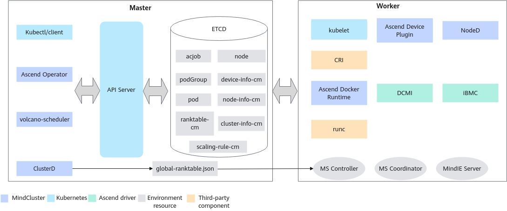

# Configuring Elastic Scaling for Inference Jobs<a name="ZH-CN_TOPIC_0000002479226430"></a>

For MindIE Motor inference jobs, you can configure the Job-level elastic scaling feature. When a hardware or software fault occurs and the current resources are insufficient to start all instances, this feature reduces the number of running instances to keep the inference job running as much as possible. When the fault is recovered or new hardware is added, the pending job instances will be rescheduled.

## Constraints<a name="zh-cn_topic_0000002356673977_section270417201799"></a>

Currently, this feature is supported only for MindIE Motor inference jobs.

## Supported Product Models<a name="zh-cn_topic_0000002356673977_section618313391397"></a>

- Atlas 800I A2 inference server
- Atlas 800I A3 SuperPoD server

## Principle Description<a name="zh-cn_topic_0000002356673977_section1445672111019"></a>

**Figure 1**  Elastic scaling principle<a name="zh-cn_topic_0000002356673977_fig685814101278"></a>


1. The user configures multiple Jobs belonging to the same inference job, divides the Jobs into multiple groups, and configures a scaling rule.
2. The elastic scaling rule is deployed in the cluster as a ConfigMap. Different types of instances correspond to different groups in the scaling-rule. For example, all Prefill instances can be classified as group0, and all Decode instances as group1.
3. In a scenario where rescheduling is configured, when a hardware or software fault occurs, Ascend Device Plugin and NodeD report the fault, and Volcano deletes all Pods under that instance.
4. ClusterD sends the `global-ranktabl`e to MindIE Controller. For details about the `global-ranktable`, see [SubscribeRankTable](../../api/clusterd/05_service_configuration_apis.md#subscriberanktable).
5. MindIE Controller determines the instance that needs to exit based on `global-ranktable` and notifies the process in the container to exit with a non-zero code.
6. After Volcano-Scheduler the Pod anomaly, it deletes all Pods of the instance.
7. After detecting that the Pods have been deleted, Ascend Operator collects the running status of all instances under the scaling-rule corresponding to the current MindIE Motor.
8. Ascend Operator determines whether the current instance needs to create a Pod based on the scaling-rule.
9. After the Pod is created, the scheduler schedule it, or the Pod enters the `Pending` state and waits for scheduling.
10. When resources are sufficient, the Pod in the `Pending` state automatically completes scheduling.
11. If a Pod cannot be created currently, it waits for other instances to run successfully before creation.

## Creating a Scaling Rule ConfigMap<a name="zh-cn_topic_0000002356673977_section476902931213"></a>

You need to set specific scaling rules and deploy them to the k8s cluster in the form of a ConfigMap. An example is as follows:

```Yaml
apiVersion: v1
data:
  elastic_scaling.json: |          # Fixed field, do not modify
    {
      "version": "1.0",            # Fixed field, do not modify
      "elastic_scaling_list": [    # The following is a template. Configure it according to your own requirements.
        {
          "group_list": [                 # Job ratio state that can run normally            {
              "group_name": "group0",      # Set by the user
              "group_num": "2",            # Set by the user. The value must not increase from top to bottom.
              "server_num_per_group": "2"  # Set by the user. For the same group_name, this value must remain unchanged.
            },
            {
              "group_name": "group1",
              "group_num": "1",
              "server_num_per_group": "2"
            }
          ]
        },
        {
          "group_list": [                 # Another Job ratio state that can run normally
            {
              "group_name": "group0",
              "group_num": "1",
              "server_num_per_group": "2"
            },
            {
              "group_name": "group1",
              "group_num": "1",
              "server_num_per_group": "2"
            }
          ]
        }
      ]
    }
kind: ConfigMap
metadata:
  name: scaling-rule              # Set by the user
  namespace: mindie-service       # Set by the user, consistent with the inference job
```

>[!NOTE]
>
>- For example, if the currently running Jobs with `group_name` as group0 and group1 are both 0, `group_list` with index 1 will be selected, meaning both group0 and group1 need to run 1 instance. In this case, the Job corresponding to group0 or group1 will create the corresponding Pod and then wait for scheduling.
>- If the Job with `group_name` as group0 is running 1 instance and the Job with `group_name` as group1 is running 0 instances, only the Job with group1 will create a Pod. The Job with group0 will wait until the Job with group1 runs successfully before creating a Pod.

In the above ConfigMap, the modifiable fields are described in the following table.

**Table 2** Parameter description

<a name="zh-cn_topic_0000002356673977_zh-cn_topic_0000002193288232_table985012534578"></a>

|Parameter|Description|Value|Required|
|--|--|--|--|
|metadata.name|Name of the ConfigMap that carries the scaling-rule.<p>Set it as needed. The value of the Job's label "mind-cluster/scaling-rule" must correspond to it, indicating that the Job is controlled by this scaling-rule.</p>|String|Yes|
|metadata.namespace|Namespace of the ConfigMap that carries the scaling-rule.<p>Set it as needed, but it must be consistent with the inference job. If not set, the namespace defaults to "default".</p>|String|No|
|group_name|Name of the group.<p>The Job's label "mind-cluster/group-name" must correspond to it, indicating that the Job belongs to this group.</p>|String|Yes|
|group_num|Target number of Jobs in a group.<p>If the number of currently running Jobs under this group does not reach this target, an attempt will be made to start a Job under this group.</p>|string|Yes|
|server_num_per_group|Target number of replicas for Jobs in a group.<p>This value must be consistent under the same group_name in different group_lists.</p>|String|Yes|

## Modifying Scaling Rules<a name="zh-cn_topic_0000002356673977_section1769411616405"></a>

If two group0 Jobs and one group1 Job are already running, and you need to run an additional group0 Job, modify the scaling template in advance and then submit the new job. The modification example is as follows:

```Yaml
apiVersion: v1
data:
  elastic_scaling.json: |          # Fixed fields, do not modify
    {
      "version": "1.0",            # Fixed field, do not modify
      "elastic_scaling_list": [    # The following is a template. Configure it based on your requirements.
        {
          "group_list": [                    # Add an entry to elastic_scaling_list
            {
              "group_name": "group0",
              "group_num": "3",              # Modify the group_num of group0
              "server_num_per_group": "2"
            },
            {
              "group_name": "group1",
              "group_num": "1",
              "server_num_per_group": "2"
            }
          ]
        },
        {
          "group_list": [
            {
              "group_name": "group0",
              "group_num": "2",
              "server_num_per_group": "2"
            },
            {
              "group_name": "group1",
              "group_num": "1",
              "server_num_per_group": "2"
            }
          ]
        },
        {
          "group_list": [                 # Another Job ratio state that can run normally
            {
              "group_name": "group0",
              "group_num": "1",
              "server_num_per_group": "2"
            },
            {
              "group_name": "group1",
              "group_num": "1",
              "server_num_per_group": "2"
            }
          ]
        }
      ]
    }
kind: ConfigMap
metadata:
  name: scaling-rule              # Set by the user
  namespace: mindie-service       # Set by the user, consistent with the inference job
```

If you need to reduce one of the group0 Jobs while the job is running normally, you need to modify the template and then delete the job. The modification example is as follows.

```Yaml
apiVersion: v1
data:
  elastic_scaling.json: |          # Fixed field, do not modify
    {
      "version": "1.0",            # Fixed field, do not modify
      "elastic_scaling_list": [    # The following is a template. Users should configure it according to their own requirements.
        {
          "group_list": [                 # A group_list has been deleted.
            {
              "group_name": "group0",
              "group_num": "1",           # The target group_num for group0 is "1".
              "server_num_per_group": "2"
            },
            {
              "group_name": "group1",
              "group_num": "1",
              "server_num_per_group": "2"
            }
          ]
        }
      ]
    }
kind: ConfigMap
metadata:
  name: scaling-rule              # Configured by the user.
  namespace: mindie-service       # Configured by the user, consistent with the inference job.
```

## Preparing the Job YAML<a name="zh-cn_topic_0000002356673977_zh-cn_topic_0000002098814658_section463203519254"></a>

In the job YAML, modify or add the following fields to enable Job-level elastic scaling.

```Yaml
...
metadata:
   labels:
     ...
     fault-scheduling: "force"
     fault-retry-times: "100000000"    # To handle service plane faults, you must configure the number of unconditional retries on the service plane.
     jobID: mindie-xxx      # Defined by the user.
     app: mindie-ms-server
     mind-cluster/scaling-rule: scaling-rule   # Must be consistent with the name of the scaling rule ConfigMap.
     mind-cluster/group-name: group0           # Must be consistent with the group_name value in the scaling rule ConfigMap
spec:
  schedulerName: volcano      # Takes effect when the startup parameter enableGangScheduling of Ascend Operator is set to true
  runPolicy:
    backoffLimit: 3         # Number of job rescheduling times
...
```
