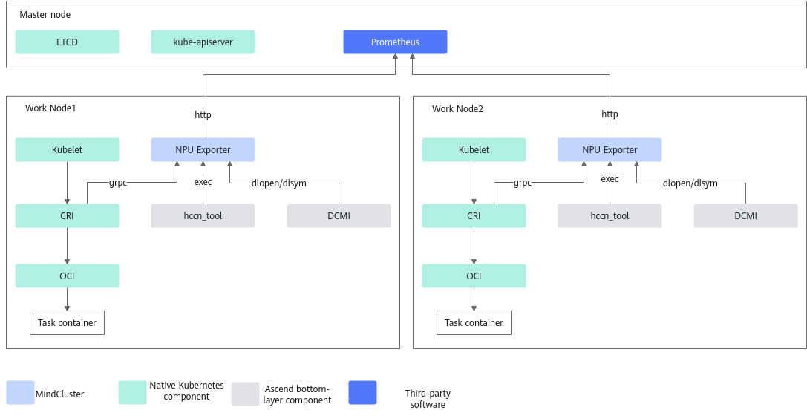

# Implementation Principles

The implementation principles of the resource monitoring feature are shown in [Figure 1](#fig167794421598).

**Figure 1**  Feature principles

NPU Exporter calls the standardized CRI interface in K8s through the gRPC service to obtain container-related information; calls the hccn_tool through exec to obtain the network information of the chip; calls the DCMI through dlopen/dlsym to obtain chip information, and reports it to Prometheus.

>[!NOTE]
>Users who use Telegraf can directly call NPU Exporter to obtain relevant information.
