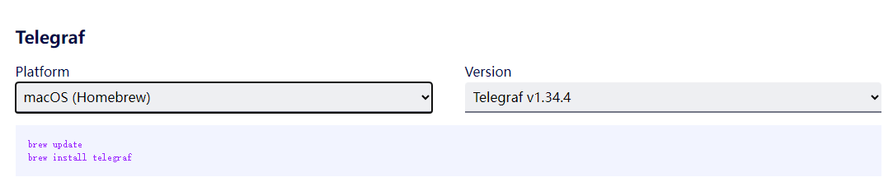

# Working with Telegraf<a name="ZH-CN_TOPIC_0000002479227042"></a>

This section guides users through installing and deploying Telegraf, and viewing resource monitoring-related Data Information via Telegraf. For details on the data information, see [Telegraf Data Information Description](../../api/npu_exporter/02_telegraf_data_description.md).

## Binary Integration with Telegraf<a name="section31082142614"></a>

>[!NOTE]
>In addition to binary integration, integrating Telegraf source code is supported by modifying the NPU Exporter open-source code.

1. (Optional) If the log directory for NPU Exporter has not been created, execute the following commands in sequence to create the log directory.

    ```shell
    mkdir -m 750 /var/log/mindx-dl/npu-exporter
    chown hwMindX:hwMindX /var/log/mindx-dl/npu-exporter
    ```

2. Obtain the NPU Exporter package from the [Ascend Community](https://www.hiascend.com/zh/developer/download/community/result?module=dl+cann), extract the NPU Exporter binary file `npu-exporter` from it, and upload it to any path in the environment (such as `/home/npu_plugin`).
3. Run the following command to create the `npu_plugin.conf` file.

    ```shell
    vi npu_plugin.conf
    ```

    Add the NPU Exporter binary file path to the file. An example is shown below.

    <pre>
    [[inputs.execd]]
      command = ["/home/npu_plugin/npu-exporter", "-platform=Telegraf", "-poll_interval=10s", "-hccsBWProfilingTime=200"]
      signal = "none"
    [[outputs.file]]
      files=["stdout"]</pre>

    For details about the input parameters of the `command` field, see [Table 1](#table5347115241118).

    **Table 1**  Parameters

    <a name="table5347115241118"></a>

    |Parameter|Type|Default Value|Value Description|Required|
    |--|--|--|--|--|
    |-platform|string|Prometheus|Specifies the integration platform. Valid values: <ul><li>Prometheus: Integration with Prometheus</li><li>Telegraf: Integration with Telegraf</li></ul>|Yes|
    |-poll_interval|duration(int)|1s|Interval for Telegraf data reporting. This parameter takes effect only when integrating with the Telegraf platform, i.e., it only takes effect when -platform=Telegraf is specified. Otherwise, this parameter does not take effect.|No|
    |-hccsBWProfilingTime|int|200|HCCS link bandwidth sampling duration. Value range: [1, 1000], in ms.|No|

4. (Optional) If Telegraf is not installed, perform the following steps to install Telegraf.
    - **Offline Installation (Recommended)**
        1. Go to the [Telegraf download page](https://github.com/influxdata/telegraf/releases).
        2. Select the version you need and complete the download, for example, `telegraf-1.34.3_linux_arm64.tar.gz`.
        3. Upload the installation package to any path on the server.
        4. Run the following command in the directory where the package is located to decompress it. An example is shown below.

            ```shell
            tar -zxvf telegraf-1.34.3_linux_arm64.tar.gz
            ```

        5. Go to the decompressed directory, find the Telegraf binary file in the `./usr/bin` path, and copy the file to any path such as "`/home/npu_plugin`.

    - **Online Installation**
        1. Go to the [Telegraf download page](https://www.influxdata.com/downloads/).
        2. Select the operating system and Telegraf version from the drop-down menus.

            **Figure 1**  Download Telegraf<a name="fig131640329479"></a>
            

        3. Copy the installation command from the pop-up dialog to the device where you want to install Telegraf, and run the command to complete the installation.

5. Run the following command to start Telegraf.
    - Offline installation:

        ```shell
        ./telegraf --config npu_plugin.conf
        ```

    - Online installation:

        ```shell
        telegraf --config npu_plugin.conf
        ```

        After Telegraf starts successfully, the output is similar to the following example. The information starting from `npu_chip_link_speed` is the monitored data information of the Ascend AI processor.

        ```ColdFusion
        2023-09-15T10:11:31Z I! Loading config file: ../npu_plugin.conf
        2023-09-15T10:11:31Z I! Starting Telegraf 1.26.0
        2023-09-15T10:11:31Z I! Available plugins: 236 inputs, 9 aggregators, 27 processors, 22 parsers, 57 outputs, 2 secret-stores2023-09-15T10:11:31Z I! Loaded inputs: execd
        2023-09-15T10:11:31Z I! Loaded aggregators:
        2023-09-15T10:11:31Z I! Loaded processors:
        2023-09-15T10:11:31Z I! Loaded secretstores:
        2023-09-15T10:11:31Z I! Loaded outputs: file
        2023-09-15T10:11:31Z I! Tags enabled: host=xxx
        2023-09-15T10:11:31Z I! [agent] Config: Interval:10s, Quiet:false, Hostname:"xxx", Flush Interval:10s
        2023-09-15T10:11:31Z I! [inputs.execd] Starting process: /xxx/npu-exporter [-platform=Telegraf -poll_interval=10s]
        Ascend910-0,host=xxx npu_chip_link_speed=104857600000i,npu_chip_roce_rx_cnp_pkt_num=0i,npu_chip_roce_unexpected_ack_num=0i,npu_chip_optical_vcc=3245.1,npu_chip_optical_rx_power_1=0.8585,npu_chip_info_hbm_used_memory=0i,npu_chip_mac_rx_pause_num=0i,npu_chip_roce_tx_all_pkt_num=0i,npu_chip_roce_tx_cnp_pkt_num=0i,npu_chip_info_temperature=46,npu_chip_mac_rx_bad_pkt_num=0i,npu_chip_roce_tx_err_pkt_num=0i,npu_chip_optical_rx_power_3=0.8466,npu_chip_optical_rx_power_0=0.7933,npu_chip_info_network_status=0i,npu_chip_mac_rx_pfc_pkt_num=0i,npu_chip_mac_tx_bad_pkt_num=0i,npu_chip_roce_rx_all_pkt_num=0i,npu_chip_mac_rx_bad_oct_num=0i,npu_chip_optical_tx_power_1=0.9162,npu_chip_info_utilization=0,npu_chip_info_power=73.9000015258789,npu_chip_info_link_status=1i,npu_chip_info_bandwidth_rx=0,npu_chip_mac_tx_pfc_pkt_num=0i,npu_chip_roce_rx_err_pkt_num=0i,npu_chip_roce_verification_err_num=0i,npu_chip_optical_state=1i,npu_chip_info_bandwidth_tx=0,npu_chip_mac_tx_bad_oct_num=0i,npu_chip_roce_out_of_order_num=0i,npu_chip_roce_qp_status_err_num=0i,npu_chip_optical_rx_power_2=0.855,npu_chip_optical_tx_power_0=0.9095,npu_chip_info_hbm_utilization=0,npu_chip_link_up_num=2i,npu_chip_info_health_status=1i,npu_chip_mac_tx_pause_num=0i,npu_chip_roce_new_pkt_rty_num=0i,npu_chip_optical_temp=53,npu_chip_optical_tx_power_2=1.0342,npu_chip_optical_tx_power_3=0.9715 1694772754612200641
        ```
