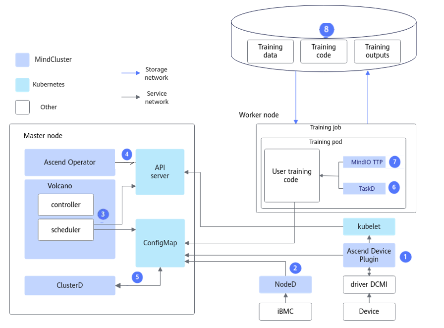
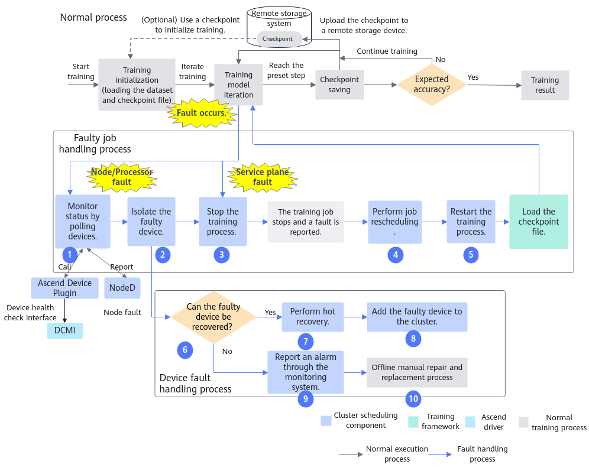
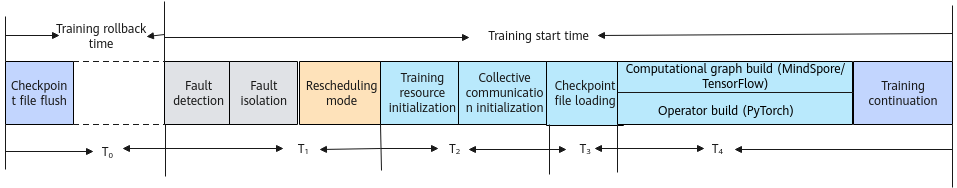
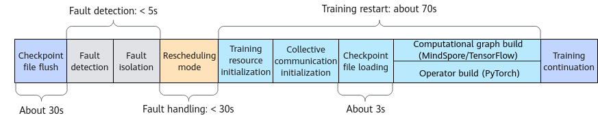
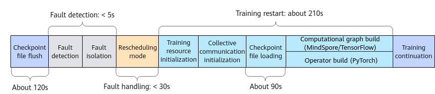

# Feature Description

<!-- md-trans-meta sourceCommit=unknown translatedAt=2026-06-09T07:59:30.496Z pushedAt=2026-06-09T09:02:55.481Z -->

## Application Scenarios

As neural networks and datasets continue to grow in scale, a single server can no longer handle large-scale training jobs. To address this challenge, multiple servers (equipped with more AI chips) are typically used to form a high-density training cluster for long-duration distributed training. However, as the number of hardware devices increases, the probability of device failures also rises, leading to more frequent training interruptions. Therefore, improving cluster availability has become a critical issue that needs to be addressed urgently.

Improving cluster availability requires reducing the fault recovery cost after each training interruption. Currently, fault recovery often involves manual troubleshooting of hardware failures or software anomalies, incurring significant labor costs. Additionally, isolating the faulty device and then re-launching a training job takes a considerable amount of time, impacting overall efficiency.

To solve these problems, resumable training is introduced, covering the following features, which can effectively handle faults during training and reduce recovery time, thereby significantly improving cluster availability and stability.

**Key Features**

| Feature | Description | Configuration Steps |
|--|--|--|
| Fault Detection | 
Supports real-time monitoring of over 20 software faults and over 90 hardware faults in training scenarios.

For details on functions and principles, see [Fault Detection](./01_solutions_principles.md#fault-detection).
 | [(Optional) Configuring Fault Detection Levels](./03_configuring_fault_detection_levels.md) |
| Fault Handling | 
Automatically isolates faulty devices without manual intervention after a fault occurs.

For details on functions and principles, see [Fault Handling](./01_solutions_principles.md#fault-handling).
 | [Configuring Fault Handling](./04_configuring_fault_handling_policies.md) |
| Recovery Acceleration | 
Accelerates training recovery. You can customize acceleration policies to reduce training launch time.

For details on functions and principles, see [Recovery Acceleration](./01_solutions_principles.md#recovery-acceleration).
 | [Configuring Recovery Acceleration](./05_configuring_training_recovery.md) |

**Use Cases**

|Scenario |Main Business|Business Value|
|--|--|--|
|AI training|Supports monitoring of computing, network, and storage device resources, health checks of the AI environment, and AI job fault diagnosis.|<ul><li>Overall monitoring of cluster environment resources.</li><li>Improve the success rate of AI training jobs.</li><li>Reduce the handling and recovery time of AI job training faults.</li></ul>|

**NOTE**

>- For smaller-scale model tasks with short training duration (< 1h), hardware failures occur less frequently, and it is not recommended to use the resumable training feature.
>- This feature is not applicable to computing power virtualization scenarios.

## Overall Architecture

When a training job fails in a Kubernetes (K8s) cluster, the resumable training feature enables the system to perceive the fault, handle or isolate the faulty resources, and reallocate resources as needed by the training job. It then relaunches the training job using periodically saved or dying gasp checkpoint, thereby reducing lost time.

**Overall Architecture**

The architecture principle of resumable training is shown in [Figure 1](#fig1285977919).

**Figure 1**  Overall architecture

The capabilities of each component are as follows:

1. Ascend Device Plugin: Detects faults by providing capabilities such as NPU resource management, NPU chip fault and NPU network fault reporting, and chip hot reset.
2. NodeD: Detects faults by providing capabilities for reporting node health status, node hardware (including CPU, memory, chip, and other components) faults, UnifiedBus network faults, and DPC shared storage faults.
3. Volcano: Handles faults by rescheduling faulty jobs.
4. Ascend Operator: Generates the corresponding environment variables for distributed training jobs of different AI frameworks; provides the RankTable information required for static networking collective communication.
5. ClusterD: Obtains all the data reported by Ascend Device Plugins and NodeD in the cluster, organizes it, and sends it to Volcano.
6. TaskD: Provides communication functionality with ClusterD to complete resumable training; provides training status monitoring and training status control capabilities for training and inference jobs on Ascend devices.
7. MindIO TTP: After a fault occurs during large model training, it verifies the integrity and consistency of intermediate state data, generates dying gasp checkpoint data, and can recover through this checkpoint data when resuming training, reducing the loss of training iterations caused by the fault.
8. Training model code: Adaptation operations related to resumable training capabilities are required.

**End-to-End Flow**

The resumable training feature is triggered by faults. After successful triggering, training can be resumed after three phases: fault detection, fault handling, and recovery acceleration.

**Figure 2** End-to-End Flow

The description of each step is as follows:

1. Query the device status through polling. Ascend Device Plugin obtains the NPU status from the DCMI, as well as the node health status, node hardware fault information, and UnifiedBus network fault information reported by NodeD. ClusterD consolidates all fault information, determines the final fault status, and reports it to Volcano.
2. After a node or chip fault is detected, isolate the faulty node or chip to prevent it from being scheduled again.
3. Stop the training process and exit the training container.
4. After a node or chip fault occurs, the system reschedules the training job to a healthy device and restarts the training container. When resources are selected for the rescheduled training job, nodes that did not cause the current training job rescheduling are preferred.
5. The training script relaunches the training process.
6. O&M personnel can determine whether a hot reset is feasible based on the fault type of the node or chip.
7. Perform a hot reset to restore the device to a healthy state.
8. The recovered device automatically rejoins the cluster.
9. Unrecoverable devices report alarms through the O&M monitoring system.
10. Perform offline manual repair and part replacement for unrecoverable devices.

>[!NOTE]
>Resumable training triggered by service-plane faults will only execute steps 3 to 5 above.

**Component Invocation Process**

The component invocation process of resumable training is shown in [Figure 3](#fig1710473818543).

**Figure 3**  Architecture Principle

The description of each step is as follows:

1. Ascend Device Plugin discovers and reports faults and health status.
2. NodeD updates node hardware fault information so that Volcano can accurately determine the node fault type.
3. ClusterD determines whether the chip is healthy based on the chip information provided by Ascend Device Plugin.
4. ClusterD obtains the fault information reported by NodeD.
5. ClusterD aggregates the collected chip and node information and places it into a ConfigMap.
6. Volcano obtains the device information of the entire cluster. If there is fault information on the device used by the job, Volcano will schedule the job to other healthy devices.
7. Volcano selects nodes and chips based on affinity rules, and after Ascend Operator creates a new Pod, it schedules the training job to nodes that meet the requirements.
8. Ascend Device Plugin allocates chips based on the chip IDs specified by Volcano on the Pod, and writes the chip IP information into the container.
9. Before the container starts, Ascend Docker Runtime automatically mounts NPU-related devices, driver so files, and directories for the training container.
10. Ascend Operator writes the relevant environment variables required by the training job (such as collective communication information and training configuration) into the container. It also obtains the chip information on the training container and automatically generates the collective communication information required for the distributed training job.

**Usage Conditions**

- For details about the components required to use the resumable training feature, see the [Required Components](../../introduction/02_feature_description.md#resumable-training) section.
- The resumable training feature is an advanced feature based on cluster scheduling components of MindCluster. For details about the preparations required before using this feature, see the [Preparing K8s and Shared Storage](./02_preparing_kubernetes_and_shared_storage.md) section.

## Performance Description

The resumable training feature can resume training after a fault occurs, reducing the training loss caused by the fault. The overall fault recovery time can be divided into training rollback time and training start time, as shown in [Figure 1](#zh-cn_topic_0000002003001306_fig13371418134510).

**Figure 1** Fault recovery phase

**Training Rollback Time**

After a training fault occurs, the original training data is lost, and training needs to be restored from the saved checkpoint file. In large model training, since saving a checkpoint each time reduces training efficiency, a checkpoint file is typically saved only once every hour or longer. After each fault, the training data from the time point when the last checkpoint was saved to the current fault time point will be lost. The training rollback time is the time required to train from the last saved checkpoint file to the point where the fault occurred. Let the average training rollback time be T0 and the checkpoint saving interval be Gf, then the average training rollback time T0=Gf/2.

**Training Start Time**

After a training failure occurs, the training job needs to be restarted by relaunching the training container and the training process. Once this is done, the system must go through resource rescheduling, collective communication initialization, checkpoint loading, and compilation before training can resume. A full training startup process must be completed after each failure, and if this start time is excessively long, it results in wasted resources. Let the resource rescheduling time be T1, the collective communication time be T2, the checkpoint loading time be T3, and the compilation time be T4, so the training start time is T1+T2+T3+T4.

The total training loss time for a single fault is T = T0 + T1 + T2 + T3 + T4. For specific time references, see [Training Recovery Duration Reference](#zh-cn_topic_0000002003001306_section1672017599123).

>[!NOTE]
> Each part of the time is related to the parameter scale and cluster scale, and network and storage performance also affect the total training loss time.

**Training Recovery Duration Reference**

Taking the GPT-3 model under the PyTorch framework as an example, this model runs a single-node eight-processor task with parameter sizes of 3B or 15B, under the condition that the NFS storage read and write speeds are 2.7 GB/s for writing and 4.8 GB/s for reading. **(The fault handling mode is rescheduling. If the graceful fault tolerance mode is used, this metric may not be referenced.)**

- For a parameter size of 3B, as shown in [Figure 2](#zh-cn_topic_0000002003001306_fig175521679432), the checkpoint write-to-disk time for this model is approximately **30** seconds. The fault discovery phase of resumable training takes less than **5** seconds, the fault processing phase takes less than **30** seconds, the training restart phase takes approximately **70** seconds, and the checkpoint loading function during the training restart phase takes approximately **3** seconds.
- For a parameter size of 15B, as shown in [Figure 3](#zh-cn_topic_0000002003001306_fig10995142020518), the checkpoint write time for this model is approximately **120** seconds. During resumable raining, the fault discovery phase takes less than **5** seconds, the fault processing phase takes less than **30** seconds, the training restart phase takes approximately **210** seconds, and checkpoint loading during the training restart phase takes approximately **90** seconds.

**Figure 2**  3B model time metrics

**Figure 3**  15B model time metrics

