# Solutions and Principles<a name="ZH-CN_TOPIC_0000002511346509"></a>

## Fault Detection<a name="ZH-CN_TOPIC_0000002479226514"></a>

### Fault Description<a name="ZH-CN_TOPIC_0000002511426413"></a>

Resumable training identifies fault states in the cluster and training services using fault detection mechanisms and resolves issues based on the detection results. Currently, this feature supports fault detection for Ascend hardware faults, training service faults, and other faults.

Among MindCluster cluster scheduling components, Ascend Device Plugin detects NPU faults and NPU parameter plane network faults; NodeD detects server faults, DPC shared storage faults, and UnifiedBus network faults; ClusterD detects public faults; and Volcano detects container exceptions on the service plane. The figure below shows the overall fault detection architecture.

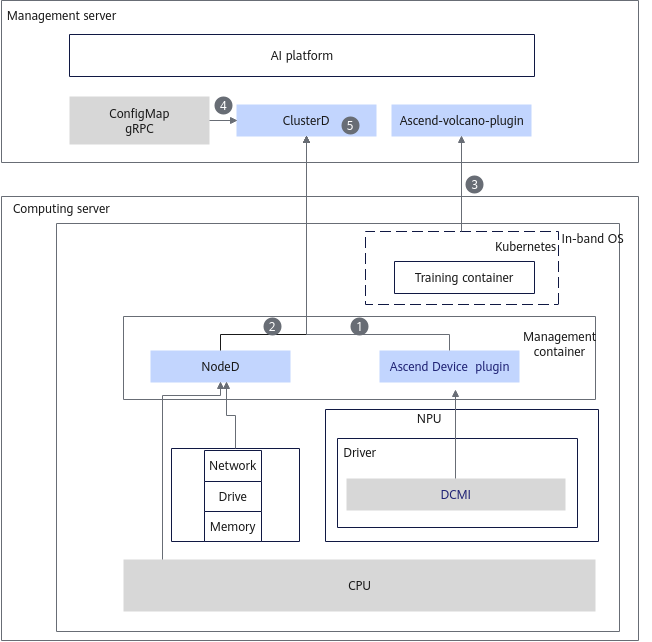

1. Ascend Device Plugin on the computing server obtains NPU chip faults and parameter plane network faults through the driver, and then reports the fault information to the management server.
2. NodeD on the computing server obtains server node faults, DPC shared storage faults, and UnifiedBus network fault information through the driver, and then reports the fault information to the management server.
3. Kubernetes on the computing server monitors the status of the training container. If an abnormality occurs, the fault is reported to Kubernetes, and Volcano, deployed on the management server, retrieves the fault information through Kubernetes.
4. After obtaining public faults through the public fault interface, ClusterD on the management server aggregates the received information and writes it into `cluster-info-device-cm`.
5. (Optional) ClusterD on the management server aggregates fault information reported by all Ascend Device Plugin and NodeD components within a cluster.

**Supported Fault Types<a name="zh-cn_topic_0000002039699773_section8301627182117"></a>**

Currently, more than 200 faults can be detected. For details about the fault types, see [Table 1](#zh-cn_topic_0000002039699773_table9980135316395).For detailed fault descriptions, see Typical Faults.

**Table 1**  Fault types

<a name="zh-cn_topic_0000002039699773_table9980135316395"></a>

|Fault Type|Fault Description|
|--|--|
|Node faults|<p>Include node health status, node hardware faults, and DPC shared storage faults.</p><p>For fault code descriptions, see [Node Fault Code References](../../references/appendix.md#node-fault-code-references).</p><p>If a node hardware fault causes the node to crash or restart, NodeD cannot detect the specific fault type and report it.</p>|
|Chip faults|<p>Chip faults are reported via the DCMI and chip network faults are detected by the device network probing tool `hccn_tool`.</p><p>For fault code descriptions, see the [Chip Fault Code References](../../references/appendix.md#chip-fault-code-references).</p>|
|Parameter plane network faults|Include chip network-related faults and UnifiedBus device faults.<ul><li>Chip network-related faults: Faults occur on the dedicated network used for parameter exchange between chips, such as NPU network port faults.</li><li>UnifiedBus device faults: Faults occur on the UnifiedBus device of <term>Atlas A3 training series products</term>.</li></ul>|
|Service plane faults|<p>The training job exits abnormally, causing the Pod status to change to `Failed`.</p><p>You can run the <strong>kubectl describe pod <em>{pod name} </em>-n <em>\{NAMESPACE\}</em> \|grep Status:</strong> command to check whether the current Pod status is `Failed`. A response example is as follows:<pre class="screen"><strong>Status:       Failed</strong></pre></p>|
|Public faults|Refer to faults reported by other fault senders (non-MindCluster components), including NPU faults, node faults, network faults, and storage faults.|
|Pingmesh UnifiedBus network fault|Refer to NPU network faults detected on the HCCS network  within or across SuperPoDs.|
|Performance degradation faults|MindCluster provides the diagnosis function for performance degradation (slow nodes) in a cluster based on the profiling capability provided by MindStudio. This function provides the capability of dynamic dotting and data persistence, allowing dotting to be enabled or disabled in real time without requiring job restart for diagnosis, ensuring uninterrupted training.|

**ConfigMap Description<a name="zh-cn_topic_0000002039699773_section49901206282"></a>**

- Ascend Device Plugin on each computing node creates a ConfigMap file that records the NPU and UnifiedBus device information of the node. This ConfigMap file is named `mindx-dl-deviceinfo-_<nodename>_` (hereinafter referred to as `device-info-cm`), and fault information is reported through this ConfigMap. For descriptions of the fields in this ConfigMap file, see the [DeviceInfoCfg](../../api/ascend_device_plugin.md#chip-resources) table.
- When a node fault exists on a node, NodeD on each computing node creates a ConfigMap file that records the device information of the node. This ConfigMap file is named `mindx-dl-nodeinfo-_<nodename>_` (hereinafter referred to as `node-info-cm`), and node fault information is reported through this ConfigMap. For descriptions of the fields in this ConfigMap file, see the [mindx-dl-nodeinfo-<nodename\>](../../api/noded.md#node-resources) table.
- ClusterD creates a ConfigMap file that records the cluster device information. The ConfigMap file is named `cluster-info-<device/switch\>-<[0-5]>` or `cluster-info-node-cm` (hereinafter referred to as `cluster-info-cm`). Node and chip fault information is reported via [cluster-info-cm](../../api/clusterd/00_cluster_resources.md).
- When creating each job, you need to configure a ConfigMap file in the YAML. The ConfigMap file is named `reset-config-_<job-name>_` (hereinafter referred to as `reset-info-cm`). This ConfigMap is mounted to the container's `/user/restore/reset/config` path. Ascend Device Plugin automatically mounts the ConfigMap to the `/user/restore/reset/<job-namespace>.<job-name>` path on the local node.

    You can also replace the ConfigMap with `/user/restore/reset/<job-namespace>.<job-nam>` on the node and mount it to the container's `/user/restore/reset/config` path. For field descriptions of this ConfigMap file, see the [reset-config-<job-name\>](../../api/ascend_device_plugin.md#job-information) table.

### Node Faults<a name="ZH-CN_TOPIC_0000002479386528"></a>

Node fault discovery is primarily implemented through NodeD. Node faults include node health status, node hardware faults, and node DPC shared storage faults. Detailed descriptions are as follows:

- Node health status

    After completing the node status diagnosis of the current node, NodeD collects fault information within this node. When a node fault occurs, it continuously sends the node status to Volcano through the node status reporting mechanism (currently, only hardware fault information within this node is collected).

- Node hardware faults

    For node hardware faults, NodeD sends a fault query request to iBMC through the IPMI driver, and iBMC responds with the current hardware alarm information to NodeD. After collecting the hardware alarm information, NodeD reports the node hardware status to Volcano.

- Node DPC shared storage faults

For nodes using the Scale-Out Storage DPC product, you can start the NodeD service using the `noded-dpc-{version}.yaml` file from the NodeD installation package. This enables detection and reporting of DPC process exceptions and out-of-memory exceptions.

>[!NOTE]
>When a node is faulty, NodeD reports the node health status and node hardware faults. If no fault occurs, the node is considered healthy by default.

**Figure 1**  Node fault reporting<a name="fig1329112151382"></a>
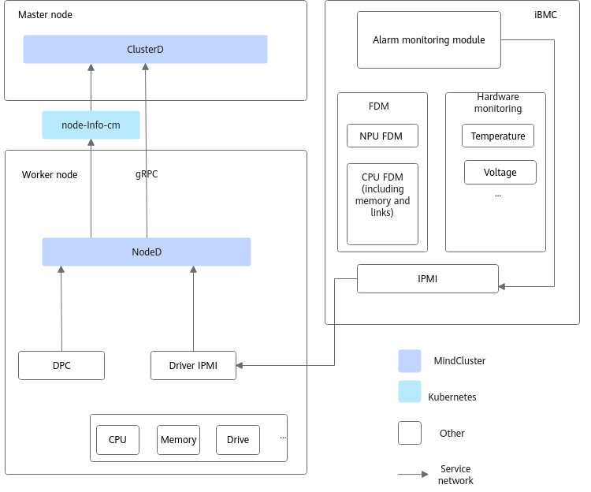

- When a node fault occurs, NodeD updates the `node-info-cm` content of the current node within a minimum of 5 seconds (default). For field descriptions, see the [mindx-dl-nodeinfo-<nodename\>](../../api/noded.md#node-resources) table.
- NodeD queries fault information from iBMC every 60 seconds (default). When the queried fault information changes compared to the last query or the interval since the last report exceeds 30 minutes, it is reported to `node-info-cm` within 1 second.

**Required Components<a name="zh-cn_topic_0000002194466236_section138036504533"></a>**

To ensure the proper functioning of the node fault detection feature, the following components must be installed: Volcano, Ascend Operator, NodeD, ClusterD

**Constraints<a name="section16867482102"></a>**

- The node hardware fault reporting capability of NodeD only supports the following products: Atlas 800T A2 training server, Atlas 900 A2 PoD cluster basic unit, Atlas 900 A3 SuperPoD.
- Only iBMC versions V2 3.15.0.1 and later, or V2 3.10.02.55, with the IPMC driver installed, support the node hardware fault reporting capability of NodeD. If an earlier iBMC or IPMI version fails to obtain node fault information, only the node health status will be reported.
- To use the SuperPoD fault detection feature, iBMC V3 5.8.3.35 or later is required.
- To use the DPC fault detection feature, Scale-Out Storage DPC 24.2.0 or later is required.

**Supported Fault Handling Types<a name="section099935818571"></a>**

Job-level rescheduling, Pod-level rescheduling, process-level rescheduling

**(Optional) Configuring Fault Detection Levels<a name="section1343172016386"></a>**

Resumable training provides default fault levels and fault handling policies for different fault codes of node hardware faults. If you want to modify the fault handling policy, see [Node Hardware Faults](./03_configuring_fault_detection_levels.md#node-hardware-faults). Do not modify it arbitrarily unless there are special requirements.

### Chip Faults<a name="ZH-CN_TOPIC_0000002511346395"></a>

Chip faults refer to basic software faults and chip hardware faults that occur on NPUs. With resumable training, processor faults are detected and reported by the device manager Ascend Device Plugin.

**NPU Reporting Mechanism<a name="section15950121613265"></a>**

When an NPU fault occurs, the fault management framework obtains the fault information and uploads it to the fault management framework of the NPU driver. After receiving the fault information, the fault management framework reports it to Ascend Device Plugin via the DCMI, as shown in [Figure 1](#fig3951191610267).

Ascend Device Plugin obtains chip health status through the DCMI. Currently, the following two acquisition modes are provided:

- Fault subscription mode: When Ascend Device Plugin starts, it first calls the DCMI fault subscription interface to register monitoring. When a fault occurs, the driver reports the fault event to Ascend Device Plugin through this interface. When the fault is recovered, the recovery event is reported to Ascend Device Plugin through this interface.
- Fault polling mode: At fixed intervals, the chip fault status is queried through the fault query interface. This mode is switched to when the device driver does not support the subscription capability.

**Figure 1**  Chip fault reporting<a name="fig3951191610267"></a>
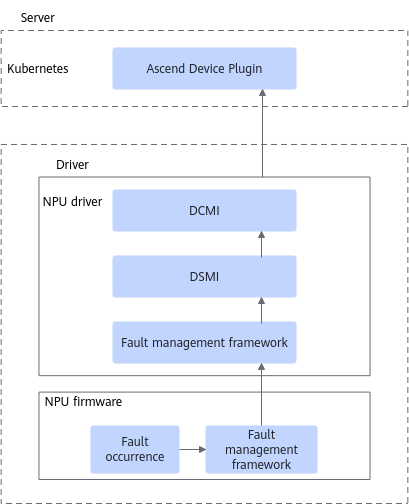

**Ascend Device Plugin Reporting Mechanism<a name="section0951116132615"></a>**

After obtaining chip fault information, Ascend Device Plugin reports it to K8s in the form of a ConfigMap. The fault reporting mechanism of Ascend Device Plugin is as follows:

**Figure 2**  Reporting faults to K8s<a name="fig10951101692610"></a>
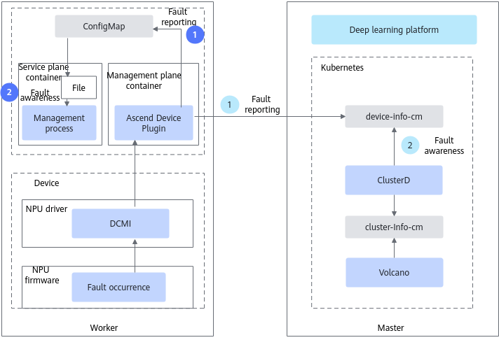

For different fault handling modes, the reporting paths differ.

- Rescheduling mode: After obtaining a chip fault, Ascend Device Plugin writes the chip fault information into `device-info-cm` of the node to which it belongs. For field descriptions, see the [DeviceInfoCfg](../../api/ascend_device_plugin.md#chip-resources) table. ClusterD reads `device-info-cm` of each node to detect chip faults and reports them to the scheduler.
  - Graceful fault tolerance mode: After obtaining a recoverable chip fault, Ascend Device Plugin writes the chip fault information into `reset-info-cm` of the job to which it belongs. The service container detects the chip fault by mounting `reset-info-cm` as a file and reading the file.

    >[!NOTE]
    >If the graceful fault tolerance mode fails to handle the fault and falls back to the rescheduling mode, the fault reporting path follows the rescheduling mode.

**Required Components<a name="zh-cn_topic_0000002194466236_section138036504533"></a>**

To ensure the proper functioning of the chip fault detection feature, the following components must be installed: Volcano, Ascend Operator, Ascend Device Plugin, and ClusterD.

**(Optional) Configuring Fault Detection Levels<a name="section1343172016386"></a>**

Resumable training provides the default fault frequency, duration, fault level, and fault handling policy for processor faults. If you want to modify the fault handling policy, see [Chip Faults](./03_configuring_fault_detection_levels.md#ZH-CN_TOPIC_0000002511346521_0101). Do not modify these settings unless you have specific requirements.

**Supported Fault Handling Types<a name="section099935818571"></a>**

Job-level rescheduling, Pod-level rescheduling, process-level rescheduling, process-level online recovery, and graceful fault tolerance.

>[!NOTE]
>Process-level online recovery is available exclusively for on-chip memory uncorrectable errors.

### Parameter Plane Network Faults<a name="ZH-CN_TOPIC_0000002511426381"></a>

NPU parameter plane network faults include chip network-related faults and UnifiedBus device faults.

When a fault occurs on the parameter plane network, it will cause training interruption or poor training task performance. After a fault occurs on the UnifiedBus device, MindCluster cluster scheduling components perform rescheduling based on the fault level.

>[!NOTE]
>
>- A parameter plane network fault does not directly trigger job rescheduling. Job rescheduling is triggered only when the parameter plane fault causes an abnormal interruption of a training task.
>- If fault handling is required for a parameter plane network fault, the unconditional retry capability for service plane faults must also be enabled.

Parameter plane network fault detection is handled by Ascend Device Plugin. [Figure 1](#fig68743107307) shows the detailed workflow.

**Figure 1**  Fault detection<a name="fig68743107307"></a>
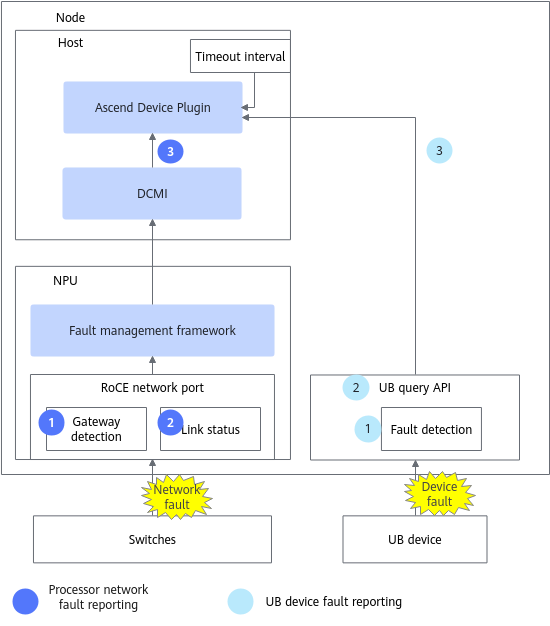

**Key Steps<a name="section1787471017308"></a>**

**Chip network fault**:

1. Each NPU periodically checks whether the communication with the gateway address is normal at an interval of 2.5 seconds and reports the result through the fault management framework.
2. The RoCE driver monitors the NPU network port link status in real time and reports `Linkdown` or `Linkup` events through the fault management framework.
3. Ascend Device Plugin obtains information from the fault management framework through the DCMI, queries the gateway detection results by polling, and subscribes to network port `Linkdown` or `Linkup` events in real time and reports them. Ascend Device Plugin counts the duration of abnormal gateway detection and the duration of `Linkdown`. If the duration is less than or equal to the RoCE network timeout (defaulted to 20 seconds), it is marked as an NPU network fault (not processed by default, which may cause a parameter plane network fault); if it exceeds 20 seconds, it is escalated to the configured fault level.

**UnifiedBus device fault**:

1. The UnifiedBus device writes the fault that occurred on the device into a local queue.
2. The UnifiedBus query interface queries the above queue, caches the fault to the query interface, and performs aggregation processing.
3. Ascend Device Plugin calls the interface through subscription or polling to obtain faults related to the UnifiedBus device, and writes them into `device-info-cm` for reporting.

**Fault Reporting Mechanism<a name="section1874141093019"></a>**

- **When a chip network fault occurs**, after the NPU fault management framework obtains the fault information, it reports the information to the NPU driver. After receiving the fault information, the NPU driver reports it to Ascend Device Plugin through the DCMI. Ascend Device Plugin then obtains the chip health status through the DCMI. Currently, the following two acquisition modes are provided:
    - Fault subscription mode: When Ascend Device Plugin starts, it first calls the DCMI fault subscription interface to register monitoring. When a fault occurs or is recovered, the driver reports the fault occurrence or recovery event to Ascend Device Plugin through this interface.
    - Fault polling mode: At fixed intervals, the chip fault status is queried through the fault query interface. This mode is switched to when the device driver does not support the subscription capability.

- **When a fault occurs on the UnifiedBus device**, Ascend Device Plugin obtains fault information through the UnifiedBus query interface. Currently, fault query provides two modes:
    - Fault subscription mode: During the startup of Ascend Device Plugin, a fault handling callback is registered with the UnifiedBus query interface. After a fault occurs, the callback is invoked to report the fault to Ascend Device Plugin, and when the fault is recovered, a recovery event is reported through this interface.
    - Fault polling mode: Ascend Device Plugin calls the full fault query interface once every 5 minutes.

**Ascend Device Plugin Reporting Mechanism<a name="section1875111093017"></a>**

After obtaining the parameter plane network fault, Ascend Device Plugin writes the fault information into `device-info-cm` and reports it to K8s in the form of a ConfigMap. For descriptions of each field in `device-info-cm`, see the [DeviceInfoCfg](../../api/ascend_device_plugin.md#chip-resources) table.

The fault reporting mechanism of Ascend Device Plugin is shown in [Figure 2](#fig1587571063011).

**Figure 2**  Fault reporting<a name="fig1587571063011"></a>
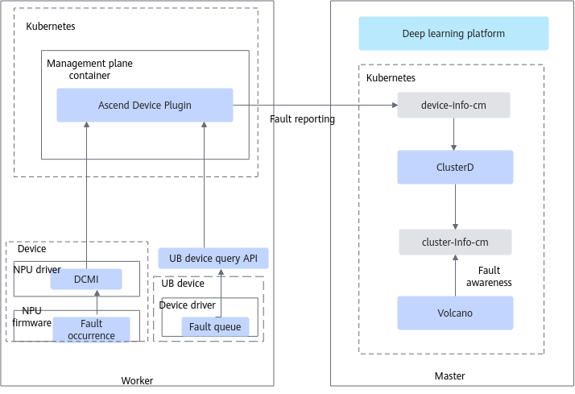

**Watchdog Fault Detection<a name="section4599926103917"></a>**

A parameter plane network link anomaly (parameter plane network fault) may prevent normal NPUs in a job from communicating with the faulty NPU, causing all NPU collective communications to enter a timeout waiting state. The collective communication for the job exits only after a waiting timeout exception occurs, which is 30 minutes by default.

Enabling the watchdog function (and enabling the unconditional retry capability for service plane faults) can isolate the faulty NPU after a parameter plane network link anomaly occurs, reschedule the job to healthy NPUs, and thus enable the job to exit quickly within 6 minutes.

>[!NOTE]
>The watchdog function is only supported under the PyTorch and MindSpore frameworks.

**Required Components<a name="zh-cn_topic_0000002194466236_section138036504533"></a>**

To ensure the normal use of the parameter plane network fault detection function, the following components must be installed: Volcano, Ascend Operator, Ascend Device Plugin, and ClusterD.

**Supported Fault Handling Types<a name="section099935818571"></a>**

Job-level rescheduling, Pod-level rescheduling, and process-level rescheduling.

**(Optional) Configuring the Fault Detection Level<a name="section1343172016386"></a>**

Resumable training provides the default fault level and fault handling policy for parameter plane faults. If you need to modify the fault handling policy, see [Parameter Plane Network Faults](./03_configuring_fault_detection_levels.md#ZH-CN_TOPIC_0000002479226486). Do not modify it unless you have special requirements.

### Service Plane Faults<a name="ZH-CN_TOPIC_0000002479386512"></a>

Resumable training supports perceiving and handling job failures caused by service plane faults through Volcano (scheduler). A service plane fault occurs when all training processes within a container exit abnormally, causing the container to exit abnormally and the Pod status to change to `Failed`. In scenarios using Ascend Operator, service plane faults only support cases where some Pods of a job fail. If the status of all Pods in a job changes to `Failed` within a few seconds, the job will not be rescheduled and will be considered as failed.

[Figure 1](#fig1761563615337) shows the detection principle of service plane faults.

**Figure 1** Detection principle<a name="fig1761563615337"></a>
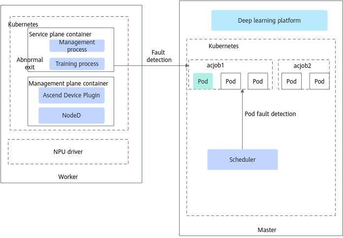

The scheduler continuously polls the Pod status of each job to perceive service plane faults and report them. You can handle service plane faults according to specific business requirements. After the resumable training feature detects a service plane fault, Volcano checks whether the unconditional retry function is enabled. If enabled, it reschedules the job to a new node that does not trigger rescheduling and re-executes it. Then the number of retry times decreases by 1. If the number of retry times is 0 or the unconditional retry function is disabled, the system does not handle the service container fault.

>[!NOTE]
>
>- To use the unconditional retry function, you need to configure the following three parameters in the job YAML: `fault-retry-times`, `restartPolicy`, and `policies`. For detailed parameter descriptions, see [YAML Configuration Description](../../api/) (`policies` is a native vcjob field).
>- In scenarios using Ascend Operator, if you want the job to still be rescheduled after the status of all Pods changes to `Failed`, refer to [When Volcano and Ascend Operator Are Used, Status of All Pods of a Faulty Job on the Service Plane Becomes Failed and the Job Cannot Trigger Unconditional Retry-Based Rescheduling](https://gitcode.com/Ascend/mind-cluster/issues/362).

**Watchdog Fault Detection<a name="section59641929143117"></a>**

Abnormal job execution on an NPU (service plane fault) may prevent normal NPUs in the job from communicating with the faulty NPU, causing the collective communication of normal NPUs to enter a timeout waiting state. The job exits only after a collective communication wait timeout exception occurs (defaulted to 30 minutes). Enabling the watchdog function (which requires simultaneously enabling the unconditional retry capability for service plane faults) can isolate the faulty NPU after such an exception occurs and reschedule the job to a healthy NPU, thereby enabling the job to exit quickly within 6 minutes.

>[!NOTE]
>Abnormal job execution on an NPU only supports the watchdog function for the PyTorch framework on <term>Atlas A2 training series products</term>.

**Required Components<a name="zh-cn_topic_0000002194466236_section138036504533"></a>**

To ensure the normal use of the service plane fault detection function, the following components must be installed: Volcano and Ascend Operator.

**Supported Fault Handling Types<a name="section099935818571"></a>**

Job-level rescheduling, Pod-level rescheduling, process-level rescheduling, and graceful fault tolerance

### Public Faults<a name="ZH-CN_TOPIC_0000002511426387"></a>

Public faults refer to faults reported by other fault senders (non-MindCluster components), including NPU faults, node faults, network faults, and storage faults..

>[!NOTE]
>The prerequisite for ClusterD to receive public faults is that Ascend Device Plugin must be installed on the node and the corresponding `device-info-cm` must be generated.

**Reporting Mechanism<a name="zh-cn_topic_0000002216292813_section64469192378"></a>**

Upon fault detection, the public fault sender transmits the fault details to ClusterD through ConfigMap or gRPC. ClusterD summarizes the received information, writes it to cluster-info-device-cm, and reports it to Ascend-volcano-plugin.

- ConfigMapL: The fault discoverer writes fault information into a ConfigMap, and ClusterD obtains the fault information. You can call the ConfigMap interface to inject public faults by referring to [ConfigMap](../../api/clusterd/03_public_fault_apis.md#configmap).
- gRPC: The fault discoverer sends fault information to ClusterD through gRPC, and ClusterD obtains the fault information. You can call the gRPC interface to inject public faults by referring to [gRPC Interface](../../api/clusterd/03_public_fault_apis.md#grpc-interface).

**Figure 1** Public fault reporting<a name="fig72618571585"></a>
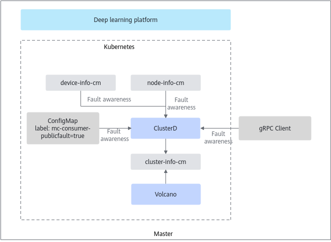

**Required Components<a name="zh-cn_topic_0000002194466236_section138036504533"></a>**

To ensure proper functioning of the public fault detection feature, the following components must be installed.

- Mandatory components: Volcano, Ascend Operator, Ascend Device Plugin, ClusterD
- Optional component: NodeD

**Supported Fault Handling Types<a name="zh-cn_topic_0000002216292813_section177211923175116"></a>**

Job-level rescheduling, Pod-level rescheduling, and process-level rescheduling

**(Optional) Configuring the Fault Detection Level and Sender<a name="zh-cn_topic_0000002216292813_section1343172016386"></a>**

Resumable training provides the default fault level and supported fault sender for public faults. If you want to modify the fault level and fault sender of public faults, see [Public Faults](./03_configuring_fault_detection_levels.md#ZH-CN_TOPIC_0000002479386564). Do not modify them unless you have special requirements.

### Pingmesh UnifiedBus Network Faults<a name="ZH-CN_TOPIC_0000002511426437"></a>

Refer to NPU network faults detected on the HCCS network within or across SuperPoDs.

**Reporting Mechanism<a name="zh-cn_topic_0000002193288232_section68367256347"></a>**

NodeD calls the DCMI to start a pingmesh task and periodically queries the pingmesh results, writing the results to `<nodename\>.log`. By default, the file is stored in `/user/mind-cluster/pingmesh` both within the container and on the physical machine. However, the path on the physical machine can be changed as follows.

>[!NOTE]
>
>- <nodename\> is not a fixed value; it is the node name queried in K8s.
>- The physical machine path for the <nodename\>.log file can be configured by the user based on actual conditions: modify the physical machine mount path of the volume named `pingmesh-result` in NodeD's startup YAML.

After obtaining the pingmesh results, ClusterD performs a preliminary analysis of the results and writes the fault information into a ConfigMap file named [pingmesh-fault-<nodename\>](#zh-cn_topic_0000002193288232_table2371535113510). ClusterD listens for information from this ConfigMap, aggregates the faults, and reports them to Volcano, which then performs scheduling.

**Prerequisites<a name="zh-cn_topic_0000002193288232_section8281518121516"></a>**

- (Required) A [namespace has been created](../../developer_guide/installation_deployment/manual_installation/01_preparing_for_installation.md#creating-a-namespace).
- The following components have been installed on the corresponding nodes: [NodeD](../../developer_guide/installation_deployment/manual_installation/09_noded.md) (required), [Ascend Device Plugin](../../developer_guide/installation_deployment/manual_installation/04_ascend_device_plugin.md) (optional), [ClusterD](../../developer_guide/installation_deployment/manual_installation/06_clusterd.md) (optional).
- (Required) The [NodeD startup parameter resultMaxAge has been configured](../../developer_guide/installation_deployment/manual_installation/09_noded.md#parameter-description).

**Constraints**<a name="zh-cn_topic_0000002193288232_section156679598384"></a>

This feature is only supported by Atlas 900 A3 SuperPoD.

**Configuring UnifiedBus Network Detection<a name="zh-cn_topic_0000002193288232_section18190175418362"></a>**

To configure UnifiedBus network detection, perform the following steps.

1. Configure shared storage.

    ClusterD and NodeD interact through shared storage, and their shared storage root paths must be consistent. The owner of the shared directory root path is user 9000, which is the same as the user running ClusterD.

    1. Configure the server.

        

    2. Modify the NodeD configuration.

        

    3. If ClusterD exists, modify the ClusterD configuration.

        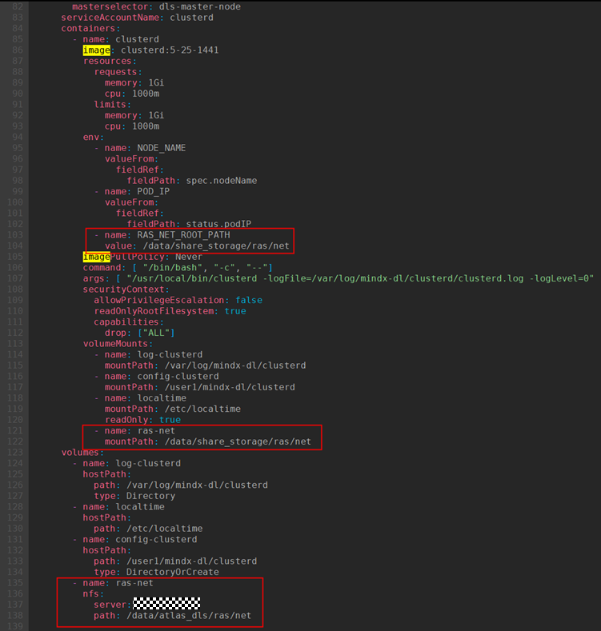

    4. Run the `kubectl get pods -o wide -A` command. If the following example is displayed, the shared storage configuration is complete.

        

2. Enable or disable UnifiedBus network detection.
    - (Recommended) Ascend Device Plugin and ClusterD installed
        1. Log in to the environment and go to the NodeD decompression directory.
        2. Run the following command to create a ConfigMap file named `pingmesh-config`.

            `pingmesh-config.yaml` is the pingmesh configuration file, which can be obtained from the NodeD installation package.

            ```shell
            kubectl apply -f pingmesh-config.yaml
            ```

            The following is a response example:

            ```ColdFusion
            configmap/pingmesh-config created
            ```

        3. Run the following command to edit the `pingmesh-config` file. For instructions on filling in the parameters in this file, see [Table 1](#zh-cn_topic_0000002193288232_table985012534578).

            ```shell
            kubectl edit cm -n cluster-system pingmesh-config
            ```

            **Table 1**  pingmesh-config cm

            <a name="zh-cn_topic_0000002193288232_table985012534578"></a>

            |Parameter|Description|Value|
            |--|--|--|
            |app|Key of one of the ConfigMap labels.|pingmesh|
            |global|Cluster configuration information.|-|
            |"1"|Configuration example for SuperPoD ID 1. Users can modify or add configurations based on actual conditions. When a SuperPoD is configured, NodeD uses the its configuration and ignores the global configuration.|SuperPoD ID|
            |activate|Whether to enable the pingmesh feature.|on or off|
            |task_interval|Pingmesh task interval, in seconds.|[1–60]|

    - Ascend Device Plugin and ClusterD not installed.

        Create a ConfigMap named `super-pod-<superPodID\>` with the label `app=pingmesh` in the namespace `cluster-system`. The fields in this ConfigMap must be filled in according to the [super-pod-<super-pod-id\>](../../api/clusterd/00_cluster_resources.md) table. An example is shown below.

        ```Yaml
        apiVersion: v1
        data:
          superPodDevice: '{"SuperPodID":"0","NodeDeviceMap":{"node-**-**":{"NodeName":"node-**-**","DeviceMap":{"0":"62914560","1":"62980097","10":"64225290","11":"64290827","12":"64487436","13":"64552973","14":"64749582","15":"64815119","2":"63176706","3":"63242243","4":"63438852","5":"63504389","6":"63700998","7":"63766535","8":"63963144","9":"64028681"}},"node-**-**":{"NodeName":"node-**-**","DeviceMap":{"0":"67108864","1":"67174401","10":"68419594","11":"68485131","12":"68681740","13":"68747277","14":"68943886","15":"69009423","2":"67371010","3":"67436547","4":"67633156","5":"67698693","6":"67895302","7":"67960839","8":"68157448","9":"68222985"}},"node-**-**":{"NodeName":"node-**-**","DeviceMap":{"0":"104857600","1":"104923137","10":"106168330","11":"106233867","12":"106430476","13":"106496013","14":"106692622","15":"106758159","2":"105119746","3":"105185283","4":"105381892","5":"105447429","6":"105644038","7":"105709575","8":"105906184","9":"105971721"}},"node-**-*":{"NodeName":"node-**-*","DeviceMap":{"0":"4194304","1":"4259841","10":"5505034","11":"5570571","12":"5767180","13":"5832717","14":"6029326","15":"6094863","2":"4456450","3":"4521987","4":"4718596","5":"4784133","6":"4980742","7":"5046279","8":"5242888","9":"5308425"}},"node-**-**":{"NodeName":"node-**-**","DeviceMap":{"0":"142606336","1":"142671873","10":"143917066","11":"143982603","12":"144179212","13":"144244749","14":"144441358","15":"144506895","2":"142868482","3":"142934019","4":"143130628","5":"143196165","6":"143392774","7":"143458311","8":"143654920","9":"143720457"}},"node-**-**":{"NodeName":"node-**-**","DeviceMap":{"0":"146800640","1":"146866177","10":"148111370","11":"148176907","12":"148373516","13":"148439053","14":"148635662","15":"148701199","2":"147062786","3":"147128323","4":"147324932","5":"147390469","6":"147587078","7":"147652615","8":"147849224","9":"147914761"}},"node-**-**":{"NodeName":"node-**-**","DeviceMap":{"0":"83886080","1":"83951617","10":"85196810","11":"85262347","12":"85458956","13":"85524493","14":"85721102","15":"85786639","2":"84148226","3":"84213763","4":"84410372","5":"84475909","6":"84672518","7":"84738055","8":"84934664","9":"85000201"}}}}'
        kind: ConfigMap
        metadata:
          labels:
            app: pingmesh
          name: super-pod-0       # 0 is the SuperPoD ID.
          namespace: cluster-system
        ```

**Viewing Detection Results<a name="zh-cn_topic_0000002193288232_section772614207398"></a>**

>[!NOTE]
>The detection result query period is 10 times the value of `task_interval`.

The pingmesh results of UnifiedBus network detection are written to the file `<nodename>.log`. The detailed description of each field in this file is shown in the following table.

**Table 2** <nodename\>.log

<a name="zh-cn_topic_0000002193288232_table313985322113"></a>

| Parameter | Description | Value |
|--|--|--|
| uid | ID of the pingmesh task | A 64-character string |
| config | User configuration of the pingmesh task | String |
| physicID | Physical ID of the NPU | [0–15] |
| taskID | Task ID. `0` indicates intra-node, and `1` indicates inter-node. | 0 or 1 |
| DestNum | Number of target addresses for this pingmesh task. | [0–47] |
| source_addr | Source address | IPv4 network address |
| target_addr | Target address | IPv4 network address |
| suc_pkt_num | Number of successfully sent packets | - |
| fail_pkt_num | Number of packets that fail to be sent | - |
| max_time | Maximum response time | <ul><li>Value is `-1` when the ping fails.</li><li>A non-negative value under normal conditions.</li></ul> |
| min_time | Minimum response time. | <ul><li>Value is `-1` when the ping fails.</li><li>A non-negative value under normal conditions.</li></ul> |
| avg_time | Average response time | <ul><li>Value is `-1` when the ping fails.</li><li>A non-negative value under normal conditions.</li></ul> |
| tp95_time | Response time at the 95th percentile | <ul><li>Value is `-1` when the ping fails.</li><li>A non-negative value under normal conditions.</li></ul> |
| reply_stat_num | Number of responses received in this query | - |
| ping_total_num | Total number of responses accumulated for this task | - |

**Viewing Fault Information<a name="zh-cn_topic_0000002193288232_section7712929183110"></a>**

Run the following command on the management node to view fault information detected for the UnifiedBus network.

```shell
kubectl describe cm -n cluster-system  pingmesh-fault-<nodename>
```

The table below describes each field in the fault information.

**Table 3**  pingmesh-fault-<nodename\>

<a name="zh-cn_topic_0000002193288232_table2371535113510"></a>

| Parameter | Description | Value |
|--|--|--|
| mc-consumer-publicfault | Label key required for ClusterD listening | true |
| PublicFault | Key for public fault information | For details, see the [fault field description](../../api/clusterd/03_public_fault_apis.md#configmap) table. |

**Known UnifiedBus Network Faults<a name="zh-cn_topic_0000002193288232_section4960201383813"></a>**

<a name="zh-cn_topic_0000002193288232_table31451934163811"></a>

| Fault Code | Fault Description | Fault Level |
|--|--|--|
| 220001001 | NPU HCCS network fault | <p>SeparateNPU</p><p>This fault level cannot be configured.</p> |

### Performance Degradation Faults<a name="ZH-CN_TOPIC_0000002479386488"></a>

#### Using TaskD 7.1.RC1 or Later<a name="ZH-CN_TOPIC_0000002511346475"></a>

MindCluster cluster scheduling components, together with the profiling capability provided by MindStudio, offers diagnostic functionality for performance degradation faults (slow nodes) within a cluster. This feature provides the capability of dynamic dotting and data persistence, allowing dotting to be enabled or disabled in real time without requiring job restart for diagnosis, ensuring uninterrupted training.

[Table 1](#zh-cn_topic_0000002194466236_table5530103025919) shows supported data dotting types.

**Table 1** Data dotting types

<a name="zh-cn_topic_0000002194466236_table5530103025919"></a>

|Data Dotting Type|Supported AI Framework|Required Components|
|--|--|--|
|<p>FP</p><p>(Identifies forward propagation data)</p>|<p>PyTorch</p><p>Only single-operator scenarios are supported.</p>|mstx_torch_plugin|
|<p>Step</p><p>(step latency)</p>|PyTorch, MindSpore|<ul><li>PyTorch<ul><li>Native optimizer scenario: If torch_npu version is 7.1.RC1, mstx_torch_plugin is required; if torch_npu version is version later than 7.1.RC1, mstx_torch_plugin is not required, because torch_npu itself provides step dotting.</li><li>Custom optimizer scenario: Manually add data dotting configurations.</li></ul></li><li>MindSpore<ul><li>MindFormers: Step data dotting are provided by MindFormers.</li><li>MindSpeed: Step data dotting is not provided.</li></ul></li></ul>|
|<p>Communication</p><p>(communication operators)</p>|PyTorch, MindSpore|<ul><li>PyTorch: torch_npu</li><li>MindSpore</li></ul>|
|<p>SaveCheckpoint</p><p>(time consumed by SaveCheckpoint)</p>|PyTorch, MindSpore|<ul><li>PyTorch: torch_npu</li><li>MindSpore</li></ul>|
|<p>DataLoader</p><p>(time consumed by DataLoader)</p>|PyTorch, MindSpore|<ul><li>PyTorch: torch_npu</li><li>MindSpore</li></ul>|

**Constraints<a name="zh-cn_topic_0000002194466236_section487603614"></a>**

- Currently, `Step`, `SaveCheckpoint`, `FP`, and `DataLoader` can only be enabled synchronously. To disable the above four types, `Communication` must be disabled at the same time.
- Communication operator data dotting can be enabled or disabled independently.
- Dynamic lightweight dotting and full dotting of MindStudio cannot be enabled at the same time. Enabling full dotting can cause data collection failures due to performance deterioration.

**Prerequisites<a name="zh-cn_topic_0000002194466236_section138036504533"></a>**

- (Optional) [ClusterD](../../developer_guide/installation_deployment/manual_installation/06_clusterd.md), [Ascend Device Plugin](../../developer_guide/installation_deployment/manual_installation/04_ascend_device_plugin.md), and [Volcano](../../developer_guide/installation_deployment/manual_installation/05_volcano.md) have been installed (the versions of the above MindCluster components must be compatible with TaskD).
- Install [torch_npu](./07_using_resumable_training_on_the_cli.md#building-a-mindspeed-llm-training-image-pytorch) (**optional**; required for PyTorch scenarios; version ≥ 7.1.RC1), MindSpore (**optional**; required for MindSpore scenarios; version ≥ 2.7.0), [CANN](./07_using_resumable_training_on_the_cli.md#building-a-mindspeed-llm-training-image-pytorch) (**mandatory**; version ≥ 8.2.RC1), and [TaskD](./07_using_resumable_training_on_the_cli.md#building-the-mindformers-training-image-mindspore) (**mandatory**) in the container.

**Preparing the Software Package<a name="zh-cn_topic_0000002194466236_section8281518121516"></a>**

**Table 2** Required packages

<a name="zh-cn_topic_0000002194466236_table232305471415"></a>

|Software Package|Required|Description|How to Obtain|Usage Scenario|
|--|--|--|--|--|
|mstx_torch_plugin|No|<p>The [collecting and parsing msproftx data](https://www.hiascend.com/document/detail/en/canncommercial/800/devaids/devtools/profiling/atlasprofiling_16_0033.html) function in Ascend PyTorch Profiler includes built-in dotting of communication operators. To capture time consumption data of more key phases without modifying the service code, mstx_torch_plugin adds dotting of the dataloader, forward, step, and save_checkpoint functions to Ascend PyTorch Profiler.</p><ul><li>To use enable FP dotting, you need to install mstx_torch_plugin. In other scenarios, you do not need to install it.</li><li>Use mstx_torch_plugin version 1.0 or later.</li></ul>|[Download Link](https://gitee.com/link?target=https://ptdbg.obs.myhuaweicloud.com/profiler/example/1.0/mstx_torch_plugin-1.0-py3-none-any.whl)|PyTorch|

**Configuring Performance Degradation Detection<a name="section1831691464111"></a>**

This solution applies only to TaskD of version 7.1.RC1 or later. If you are using a component version earlier than 7.1.RC1, see the [Using TaskD of Other Versions](#using-taskd-of-other-versions) section.

- **PyTorch**

  1. Choose one of the following two methods as required.
      - Install mstx_torch_plugin in the container.
          1. Download [mstx_torch_plugin](https://gitee.com/link?target=https%3A%2F%2Fptdbg.obs.myhuaweicloud.com%2Fprofiler%2Fexample%2F1.0%2Fmstx_torch_plugin-1.0-py3-none-any.whl).
          2. Install the package.

              ```shell
              pip install mstx_torch_plugin-1.0-py3-none-any.whl
              ```

          3. Import the .whl package in the AI task execution script.

              Ensure that it is imported after torch and torch_npu are imported.

              ```shell
              import torch
              import torch_npu
              import mstx_torch_plugin
              ```

      - If a non-native optimizer is used in the PyTorch scenario or mstx_torch_plugin is not used, you need to modify the training iteration in the training script by adding the step dotting code to obtain the time consumed by the training step.

          The following example is for the PyTorch-MindSpeed scenario. You need to modify the `./mindspeed_llm/training/training.py` file and add the following bold fields.

          <pre codetype="Python">
          def train(forward_step_func, model, optimizer, opt_param_scheduler,
                    train_data_iterator, valid_data_iterator,
                    process_non_loss_data_func, config):
            # Cache into one-logger for callback
              ……
              ……
              if is_profile_enabled():
                  prof = get_profiler()
                  prof.start()
              <strong>step_id = iteration</strong>
              while iteration < args.train_iters:
                  <strong>stream = torch.npu.current_stream()      # Obtain the execution stream of the current environment to get the NPU-side time</strong>
                  <strong>range_id = torch.npu.mstx.range_start(f"step {step_id}", stream) # Mark the start of the current training step</strong>
                  ……
                  ……
                  if args.manual_gc:
                      if args.manual_gc_interval != 0 and iteration % args.manual_gc_interval == 0:
                          gc.collect()

                  if is_profile_enabled():
                      prof.step()
                  <strong>step_id +=1  # Increment the training step by one to identify the next step</strong>
                  <strong>torch.npu.mstx.range_end(range_id) # Mark the end of the current training step</strong></pre>

  2. In the container, log in to the environment as the running user of the CANN package and run the `source ${install_path}/set_env.sh` command to set the environment variables. `${install_path}` is the installation directory of the CANN software. An example is as follows.

      ```shell
      source /usr/local/Ascend/cann/set_env.sh
      ```

  3. Before starting training, import the `LD_PRELOAD` environment variable in the training script. This environment variable allows the system to preload specified .so files. An example is as follows.

      ```shell
      export LD_PRELOAD=/usr/local/Ascend/cann/lib64/libmspti.so:/usr/local/python3.10.5/lib/python3.10/site-packages/taskd/python/cython_api/libs/libtaskd.so
      ```

      - `libmspti.so`: This .so file is provided by MindStudio and integrated in the CANN package. The default installation path is `/usr/local/Ascend/cann/lib64/libmspti.so`.

      - `libtaskd.so`: This .so file is provided by TaskD. After the whl package is installed, the path is TaskD `installation path/taskd/python/cython_api/libs/libtaskd.so.`

          The TaskD installation path can be queried using the following command. The `Location` field in the response is the TaskD installation path.

          ```shell
          pip show taskd
          ```

  4. After the distributed environment is initialized and the global rank can be obtained, modify the training script to start TaskD Manager in the training script, start TaskD Proxy in the management process, and start TaskD Worker inside the training process.
      1. <a name="li399811541"></a>(Optional) Start TaskD Manager and TaskD Proxy. If lightweight profiling is enabled through the gRPC interface to obtain data written to disk, perform the following steps. If lightweight profiling is enabled through ConfigMap to obtain data written to disk, skip this step.
          1. Create the `manager.py` file and place it in the current directory when invoking the training script. The content of the `manager.py` file is as follows.

              ```Python
              from taskd.api import init_taskd_manager, start_taskd_manager
              import os

              job_id=os.getenv("MINDX_TASK_ID")
              node_nums=XX         # Total number of nodes
              proc_per_node=XX     # Number of training processes per node

              init_taskd_manager({"job_id":job_id, "node_nums": node_nums, "proc_per_node": proc_per_node})
              start_taskd_manager()
              ```

              >[!NOTE]
              >For detailed parameter descriptions in the manager.py file, see [def init_taskd_manager(config:dict\) -\> bool:](../../api/taskd/04_taskd_manager_apis.md#def-init_taskd_managerconfigdict---bool).

          2. Add the following code to the training script to start TaskD Manager and TaskD Proxy.

              ```Python
              sed -i '/import os/i import taskd.python.adaptor.patch' $(pip3 show torch | grep Location | awk -F ' ' '{print $2}')/torch/distributed/run.py

              if [[ "${RANK}" -eq 0 ]]; then
                  export MASTER_ADDR=${POD_IP}
                  python /job/code/manager.py 2>> /job/code/alllogs/$MINDX_TASK_ID/taskd/error.log &      # The specific execution path of manager.py is determined by the current path, and the error.log path must be created in advance.
              fi

              torchrun ...
              ```

      2. <a name="li23023"></a>Start TaskD Worker.

         The following example is for the PyTorch-MindSpeed scenario. You need to modify the `QWEN3_for_PyTorch_2.7_code/mindspeed_llm/training/training.py` file and add the following bold fields to the code.

          <pre codetype="Python">
          def pretrain(train_valid_test_dataset_provider,
                        model_provider,
                        model_type,
                        forward_step_func,
                        process_non_loss_data_func=None,
                        extra_args_provider=None,
                        args_defaults={}):
              print_rank_0('time to initialize megatron (seconds): {:.3f}'.format(
                  time.time() - _TRAIN_START_TIME))
              print_datetime('after megatron is initialized')
              <strong>import torch.distributed as dist</strong>
              <strong>if dist.is_initialized():</strong>
                  <strong>rank = dist.get_rank()</strong>
                  <strong>from taskd.api.taskd_worker_api import init_taskd_worker</strong>
                  <strong>from taskd.api.taskd_worker_api import start_taskd_worker</strong>
                  <strong>init_taskd_worker(rank,5000)</strong>
                  <strong>start_taskd_worker()</strong>
              app_metrics['app_model_init_finish_time'] = one_logger_utils.get_timestamp_in_ms()
              one_logger_utils.on_pretrain_start()</pre>

         >[!NOTE]
         >In the code above, the input parameter 5000 in `init_taskd_worker(rank,5000)` is the upper limit size of `/user/cluster-info/profiling`. For details, see the `upper_limit_of_disk_in_mb` in [def init_task_worker(rank_id: int, upper_limit_of_disk_in_mb: int = 5000, framework: str = "pt") -> bool](../../api/taskd/01_taskd_worker_apis.md#def-init_taskd_workerrank_id-int-upper_limit_of_disk_in_mb-int--5000-framework-str--pt---bool).

  5. <a name="li5236yaml"></a>Modify the job YAML.
      1. Modify the container port and add port 9601 for TaskD communication under all Pods.

          ```Yaml
          ...
                spec:
          ...
                  containers:
          ...
                    ports:
                    - containerPort: 9601
                      name: taskd-port
          ...
          ```

      2. Mount files.
          1. Mount the lightweight profiling configuration file: The data-trace ConfigMap corresponding to the job on the host must be persisted to the `/user/cluster-info/datatrace-config/Namespace.data-trace-Job name/` directory. Mount the file named `profilingSwitch` to the specified container path `/user/cluster-info/datatrace-config/`.
          2. Mount the lightweight profiling persistent file: Lightweight profiling data is written to the `/user/cluster-info/profiling` path in the container. To obtain it on the host, modify the job YAML to mount this path externally.
              - The following is an example of YAML mounting inside a container.

                  ```Yaml
                  volumeMounts:
                  - name: profilingdata
                    mountPath: /user/cluster-info/
                  - name: profileswitch
                    mountPath: /user/cluster-info/datatrace-config
                  ```

              - The following is an example of YAML mounting on the host.

                  ```Yaml
                  volumes:
                  - name: profileswitch
                    hostPath:
                      path: /user/cluster-info/datatrace-config/default.data-trace-default-test-pytorch-fault-mixtral
                  - name: profilingdata
                    hostPath:
                      path: /home/profilingdatapath
                  ```

  6. <a name="li52986profiling"></a>Enable lightweight profiling to obtain data written to disk. The following two methods are supported:
      - Modify the gRPC interface provided by ClusterD: If [4.a](#li399811541) is configured, you need to use this method to enable it. For detailed interface information, see [ModifyTrainingDataTraceSwitch](../../api/clusterd/04_performance_degradation_apis.md#modifytrainingdatatraceswitch).

          >[!NOTE]
          >When you enable or modify lightweight profiling to obtain data written to disk through the gRPC interface provided by ClusterD, the lifecycle of the created data-trace-<\Job name\> ConfigMap is deleted along with the job. If the job does not exist, the interface fails to be called.

      - Modify the data-trace ConfigMap corresponding to the job. If [4.a](#li399811541) is not configured, you need to use this method to enable it. The specific steps are as follows:

          Taking the job named `default-test-pytorch-fault-mixtral` in the default namespace as an example, enable lightweight profiling to obtain data written to disk by editing the ConfigMap. An example is shown below.

          1. Run the following command on the master node to query the configuration ConfigMap.

              ```shell
              kubectl get cm
              ```

              - If `data-trace-default-test-pytorch-fault-mixtral cm` already exists, perform [Step 3](#zh-cn_topic_0000002194466236_li4751182133418) to edit the file.

                  The response example is as follows:

                  ```ColdFusion
                  NAME                                              DATA   AGE
                  data-trace-default-test-pytorch-fault-mixtral     1      18h
                  ```

              - If `data-trace-default-test-pytorch-fault-mixtral cm` does not exist, perform [Step 2](#zh-cn_topic_0000002194466236_li1633768104412) to create the file.

          2. <a name="zh-cn_topic_0000002194466236_li1633768104412"></a>Run the following command to create the ConfigMap file required for configuring lightweight profiling to obtain data written to disk.
              1. Write the following content into `datacm.yaml`.

                  ```Yaml
                  apiVersion: v1
                  kind: ConfigMap
                  metadata:
                    name: data-trace-default-test-pytorch-fault-mixtral  # The cm name must use the prefix data-trace + the job name.
                    labels:
                      reset: "true"
                  data:
                    profilingSwitch: '{"CommunicationOperator":"off","Step":"on","SaveCheckpoint":"on","FP":"on","DataLoader":"on"}'
                  ```

              2. Run the following command on the master node to create the ConfigMap.

                  ```shell
                  kubectl apply -f datacm.yaml
                  ```

                  The response is displayed as follows, indicating that the ConfigMap is created successfully.

                  ```ColdFusion
                  configmap/data-trace-default-test-pytorch-fault-mixtral created
                  ```

          3. <a name="zh-cn_topic_0000002194466236_li4751182133418"></a>Run the following command to edit the ConfigMap file.

              ```shell
              kubectl edit cm data-trace-default-test-pytorch-fault-mixtral
              ```

          4. To enable communication operators, change the value of the `CommunicationOperator` field to `on`.

              ```Yaml
              apiVersion: v1
              data:
                profilingSwitch: '{"CommunicationOperator":"on","Step":"on","SaveCheckpoint":"on","FP":"on","DataLoader":"on"}'
              ```

              >[!NOTE]
              >Enabling communication operators may deteriorate training performance. Therefore, you are advised not to enable them.

          5. Press `Esc`, enter `:wq!` to save and exit.

- **MindSpore**

  1. Inside the container, log in as the operating user of the CANN package and run the `source ${install_path}/set_env.sh` command to set environment variables. `${install_path}` is the installation directory of the CANN software. An example is as follows.

      ```shell
      source /usr/local/Ascend/cann/set_env.sh
      ```

  2. Before starting training, import the `LD_PRELOAD` environment variable in the training script. This environment variable allows the system to preload the specified .so file. An example is as follows.

      ```shell
      export LD_PRELOAD=/usr/local/Ascend/cann/lib64/libmspti.so:/usr/local/python3.10.5/lib/python3.10/site-packages/taskd/python/cython_api/libs/libtaskd.so
      ```

      - `libmspti.so`: This .so file is provided by MindStudio and integrated in the CANN package. If the default installation path is used, the path is `/usr/local/Ascend/cann/lib64/libmspti.so`.

      - `libtaskd.so`: This .so file is provided by TaskD. After installing the whl package, the path is `TaskD path/taskd/python/cython_api/libs/libtaskd.so`.

          The path where TaskD is located can be queried using the following command. The `Location` field in the response is the path where TaskD is located.

          ```shell
          pip show taskd
          ```

  3. After the distributed environment initialization is complete and the global rank can be obtained, modify the training script to start TaskD Manager in the training script, start TaskD Proxy in the management process, and start TaskD Worker in the training process.
      1. <a name="li399811541"></a>(Optional) Start TaskD Manager and TaskD Proxy. If lightweight profiling is enabled through the gRPC interface to obtain data written to disk, perform the following steps; if lightweight profiling is enabled through ConfigMap to obtain data written to disk, skip this step.

          1. Create a `manager.py` file in the current directory when calling the training script. The content of the `manager.py` file is as follows.

              ```Python
              from taskd.api import init_taskd_manager, start_taskd_manager
              import os

              job_id=os.getenv("MINDX_TASK_ID")
              node_nums=XX         # Total number of nodes
              proc_per_node=XX     # Number of training processes per node

              init_taskd_manager({"job_id":job_id, "node_nums": node_nums, "proc_per_node": proc_per_node})
              start_taskd_manager()
              ```

              >[!NOTE]
              >For detailed parameter descriptions in the manager.py file, see [def init_taskd_manager(config:dict) -> bool:](../../api/taskd/04_taskd_manager_apis.md#def-init_taskd_managerconfigdict---bool).

          2. Add the following code to the training script to start TaskD Manager.

              ```Python
              if [[ "${MS_SCHED_HOST}" -eq "${POD_IP}" ]]; then
                  python /job/code/manager.py 2>> /job/code/alllogs/$MINDX_TASK_ID/taskd/error.log &       # The specific execution path of manager.py is determined by the current path. The error.log path must be created in advance.
              fi

              msrun ...
              ```

          3. Modify the `mindspore/python/mindspore/parallel/cluster/process_entity/_api.py` file to start TaskD Proxy. An example is shown below.

              <pre codetype="Python">
              ...
                if ("TTP:1" in tft_env) or ("UCE:1" in tft_env) or ("ARF:1" in tft_env):
                          try:
                              from taskd.python.framework.agent.ms_mgr.msrun_plugin import MSRunPlugin
                              <strong>from taskd.api.taskd_proxy_api import init_taskd_proxy</strong>
                              <strong>from taskd.python.framework.common.type import CONFIG_UPSTREAMIP_KEY, LOCAL_HOST</strong>
                              <strong>import threading</strong>
                              <strong>proxy = threading.Thread(target=init_taskd_proxy, args=({CONFIG_UPSTREAMIP_KEY : os.getenv("MS_SCHED_HOST", LOCAL_HOST)},))</strong>
                              <strong>proxy.daemon = True</strong>
                              <strong>proxy.start()</strong>
                              self.msmgr = MSRunPlugin()
                              self.msmgr.register_callbacks("KILL_WORKER", self.kill_workers)
                              self.msmgr.register_callbacks("START_ALL_WORKER", self.start_all_workers)
                              self.msmgr.register_callbacks("START_WORKER_LIST", self.start_worker_list)
                              self.msmgr.register_callbacks("MONITOR", self.monitor_rank_status)
                              self.enable_mindx = True
                              os.environ["MS_ENABLE_RECOVERY"] = str(1)
              ...</pre>

      2. <a name="li2302301"></a>Start TaskD Worker.

          The following example is for the MindSpore-MindFormers scenario. You need to modify the `./mindformers/trainer/base_trainer.py` file and add the following bold fields to the code.

          <pre codetype="Python">
              def training_process(
                      self,
                      config: Optional[Union[dict, MindFormerConfig, ConfigArguments, TrainingArguments]] = None,
                      network: Optional[Union[Cell, PreTrainedModel]] = None,
                      dataset: Optional[Union[BaseDataset, GeneratorDataset]] = None,
                      optimizer: Optional[Optimizer] = None,
                      callbacks: Optional[Union[Callback, List[Callback]]] = None,
                      compute_metrics: Optional[Union[dict, set]] = None,
                      **kwargs):
                  ……
                  ……

                  logger.info(".........Starting Training Model..........")
                  if get_real_rank() % 8 == 0:
                      pprint(config)
                  logger.info(".........Model Compiling, Please Wait a Moment...........")
                  <strong>try:</strong>
                      <strong>rank = get_rank()</strong>
                      <strong>from taskd.api.taskd_worker_api import init_taskd_worker</strong>
                      <strong>from taskd.api.taskd_worker_api import start_taskd_worker</strong>
                      <strong>init_taskd_worker(rank,5000)</strong>
                      <strong>start_taskd_worker()</strong>
                  <strong>except Exception as e:</strong>
                      <strong>print("failed to call mindcluster taskd")</strong>
                  model.train(config.runner_config.epochs, dataset,
                              callbacks=callbacks,
                              dataset_sink_mode=config.runner_config.sink_mode,
                              sink_size=config.runner_config.sink_size,
                              initial_epoch=config.runner_config.initial_epoch)</pre>

          >[!NOTE]
          >The input parameter 5000 in the above code `init_taskd_worker(rank,5000)` is the upper limit size of `/user/cluster-info/profiling`. For details, see the `upper_limit_of_disk_in_mb` parameter in [def init_taskd_worker(rank_id: int, upper_limit_of_disk_in_mb: int = 5000, framework: str = "pt") -> bool](../../api/taskd/01_taskd_worker_apis.md#def-init_taskd_workerrank_id-int-upper_limit_of_disk_in_mb-int--5000-framework-str--pt---bool).

  4. Modify the job YAML. For details, see [Step 5 in the PyTorch scenario](#li5236yaml).
  5. Enable lightweight profiling to obtain data written to disk. For details, see [Step 6 in the PyTorch scenario](#li52986profiling).

**Obtaining Performance Degradation Detection Data<a name="zh-cn_topic_0000002194466236_section435518556912"></a>**

- Data written to disk is classified by rank. Lightweight profiling data is written to the `/user/cluster-info/profiling` path in the container.
- For Pods with the environment variable [MINDX_TAS_ID](../../api/environment_variable_description.md#ascend-operator-environment-variables), the path of rank 0 is `/user/cluster-info/profiling/$MINDX_TASK_ID/0`.

    >[!NOTE]
    >- If this environment variable is not present, data is written by default to a folder named `default_task_id_timestamp`.
    >- When `/user/cluster-info/profiling` reaches the configured maximum size (refer to [4.b](#li23023) for PyTorch scenarios; refer to [3.b](#li2302301) for MindSpore scenarios), file aging is triggered. By default, the oldest 20% of files are deleted each time. During the aging process, only numerically named files within the rank folders under the profiling directory are deleted. It is recommended not to manually add other files to the profiling folder. If users manually add other files, TaskD will not delete them, but these files will occupy space.
    >- Lightweight profiling files are named with timestamps, each record is separated by a newline, and data is appended to the latest file under the rank directory each time. When the latest file exceeds 10 MB, TaskD creates a new profiling file. If network storage methods such as NFS are used, a new file may be created before the file size reaches 10 MB due to slow data synchronization.

#### Using TaskD of Other Versions<a name="ZH-CN_TOPIC_0000002511346483"></a>

MindCluster cluster scheduling components provide the diagnosis function for performance degradation (slow nodes) in a cluster based on the profiling capability provided by MindStudio. This function provides the capability of dynamic dotting and data persistence, allowing dotting to be enabled or disabled in real time without requiring job restart for diagnosis, ensuring uninterrupted training.

[Table 1](#zh-cn_topic_0000002194466236_table553010302591923) describes the supported dotting data.

**Table 1** Dotting data description

<a name="zh-cn_topic_0000002194466236_table553010302591923"></a>

|Data point type|Supported AI framework|Supported components|
|--|--|--|
|<p>FP</p><p>(forward propagation data)</p>|<p>PyTorch</p><p>Only single-operator scenarios are supported.</p>|mstx_torch_plugin|
|<p>Step</p><p>(step latency)</p>|PyTorch, MindSpore|<ul><li>PyTorch<ul><li>Native optimizer scenario: If torch_npu version is 7.1.RC1 or earlier, mstx_torch_plugin is required; if torch_npu version is later than 7.1.RC1, mstx_torch_plugin is not required, as torch_npu includes built-in the step data dotting function.</li><li>Custom optimizer scenario: Manually add data dotting configurations.</li></ul></li><li>MindSpore<ul><li>MindFormers: Step data dotting is provided by MindFormers.</li><li>MindSpeed: Step data dotting is not provided.</li></ul></li></ul>|
|<p>Communication</p><p>(communication operators)</p>|PyTorch, MindSpore|<ul><li>PyTorch: torch_npu</li><li>MindSpore</li></ul>|
|<p>SaveCheckpoint</p><p>(time consumed by SaveCheckpoint)</p>|PyTorch, MindSpore|<ul><li>PyTorch: torch_npu</li><li>MindSpore</li></ul>|
|<p>DataLoader</p><p>(time consumed by DataLoader)</p>|PyTorch, MindSpore|<ul><li>PyTorch: torch_npu</li><li>MindSpore</li></ul>|

**Constraints<a name="zh-cn_topic_0000002194466236_section487603614"></a>**

- Currently, `Step`, `SaveCheckpoint`, `FP`, and `DataLoader` can only be enabled synchronously. To disable the above four data point types, `Communication` must also be disabled at the same time.
- Communication operator data dotting can be enabled or disabled separately.
- Dynamic lightweight dotting and full dotting of MindStudio cannot be enabled at the same time. Enabling full dotting can cause data collection failures due to performance deterioration.

**Prerequisites<a name="zh-cn_topic_0000002194466236_section138036504533"></a>**

- (Optional) [ClusterD](../../developer_guide/installation_deployment/manual_installation/06_clusterd.md), [Ascend Device Plugin](../../developer_guide/installation_deployment/manual_installation/04_ascend_device_plugin.md), and [Volcano](../../developer_guide/installation_deployment/manual_installation/05_volcano.md) have been installed (the versions of the above MindCluster components must be compatible with TaskD).
- Install [torch_npu](./07_using_resumable_training_on_the_cli.md#building-a-mindspeed-llm-training-image-pytorch) (**optional**; required for PyTorch scenarios; version ≥ 7.0.0), MindSpore (**optional**; required for MindSpore scenarios; version ≥ 2.6.RC1), [CANN](./07_using_resumable_training_on_the_cli.md#building-a-mindspeed-llm-training-image-pytorch) (**mandatory**; version ≥ 8.1.RC1), and [TaskD](./07_using_resumable_training_on_the_cli.md#building-a-mindspeed-llm-training-image-pytorch) (**mandatory**, version ≥ 7.0.RC1) in the container.

**Preparing the Software Package<a name="zh-cn_topic_0000002194466236_section8281518121516"></a>**

**Table 2** Preparing software packages

<a name="zh-cn_topic_0000002194466236_table232305471415"></a>

|Software Package|Required|Description|How to Obtain|Usage Scenario|
|--|--|--|--|--|
|mstx_torch_plugin|No|<p>The [collecting and parsing msproftx Data](https://www.hiascend.com/document/detail/en/canncommercial/800/devaids/devtools/profiling/atlasprofiling_16_0033.html) function in Ascend PyTorch Profiler includes built-in dotting of communication operators. To capture time consumption data of more key phases without modifying the service code, mstx_torch_plugin adds dotting of the dataloader, forward, step, and save_checkpoint functions to Ascend PyTorch Profiler.</p><ul><li>If you need to use FP data dotting, install mstx_torch_plugin. It is not required in other scenarios.</li><li>Use mstx_torch_plugin version 1.0 or later.</li></ul>|[Download Link](https://gitee.com/link?target=https://ptdbg.obs.myhuaweicloud.com/profiler/example/1.0/mstx_torch_plugin-1.0-py3-none-any.whl)|PyTorch|

**Configuring Performance Degradation Detection<a name="section167141313174510"></a>**

This solution applies only to TaskD of versions earlier than 7.1.RC1. If you are version 7.1.RC1 or later, see the [Using TaskD 7.1.RC1 or Later](#using-taskd-71rc1-or-later) section.

- **PyTorc**

  1. (Optional) Install mstx_torch_plugin in the container.
      1. Download [mstx_torc_plugin](https://gitee.com/link?target=https%3A%2F%2Fptdbg.obs.myhuaweicloud.com%2Fprofiler%2Fexample%2F1.0%2Fmstx_torch_plugin-1.0-py3-none-any.whl).
      2. Install the package.

          ```shell
          pip install mstx_torch_plugin-1.0-py3-none-any.whl
          ```

      3. Import the whl package in the AI task execution script.

          Ensure that it is imported after torch and torch_npu are imported.

          ```shell
          import torch
          import torch_npu
          import mstx_torch_plugin
          ```

  2. (Optional) If a non-native optimizer is used in the PyTorch scenario or mstx_torch_plugin is not used, you need to modify the training iteration in the training script by adding the step dotting code to obtain the time consumed by the training step.

      The following example is for the PyTorch-MindSpeed scenario. You need to modify the `./mindspeed_llm/training/training.py` file and add the following bold fields.

      <pre codetype="Python">
      def train(forward_step_func, model, optimizer, opt_param_scheduler,
                train_data_iterator, valid_data_iterator,
                process_non_loss_data_func, config):
        # Cache into one-logger for callback
          ……
          ……
          if is_profile_enabled():
              prof = get_profiler()
              prof.start()
          <strong>step_id = iteration</strong>
          while iteration < args.train_iters:
             <strong>stream = torch.npu.current_stream()      # Obtains the execution stream of the current environment, used to get the NPU-side time</strong>
              <strong>range_id = torch.npu.mstx.range_start(f"step {step_id}", stream) # Marks the start of the current training step</strong>
              ……
              ……
              if args.manual_gc:
                  if args.manual_gc_interval != 0 and iteration % args.manual_gc_interval == 0:
                      gc.collect()

              if is_profile_enabled():
                  prof.step()
              <strong>step_id +=1  # Increments the training step by one, used to identify the next step</strong>
              <strong>torch.npu.mstx.range_end(range_id) # Marks the end of the current training step</strong></pre>

  3. In the container, log in to the environment as the running user of the CANN package and run the `source ${install_path}/set_env.sh` command to set environment variables. Here, `${install_path}` is the installation directory of the CANN software. An example is shown below.

      ```shell
      source /usr/local/Ascend/cann/set_env.sh
      ```

  4. Before starting training, import the `LD_PRELOAD` environment variable in the training script. This environment variable allows the system to preload specified .so files. An example is shown below.

      ```shell
      export LD_PRELOAD=/usr/local/Ascend/cann/lib64/libmspti.so:/usr/local/python3.10.5/lib/python3.10/site-packages/taskd/python/cython_api/libs/libtaskd.so
      ```

      - `libmspti.so`: This so is provided by MindStudio and integrated in the CANN package. If the default installation path is used, the path is `/usr/local/Ascend/cann/lib64/libmspti.so`.

      - `libtaskd.so`: This so is provided by TaskD. After the whl package is installed, the path is `TaskD installation path/taskd/python/cython_api/libs/libtaskd.so`.

          The TaskD installation path can be queried using the following command. The `Location` field in the response is the TaskD installation path.

          ```shell
          pip show taskd
          ```

  5. <a name="li230238965"></a>After the distributed environment is initialized and the global rank is obtained, modify the training script to start TaskD Worker inside the training process.

      The following example is for the PyTorch-MindSpeed scenario. You need to modify the `QWEN3_for_PyTorch_2.7_code/mindspeed_llm/training/training.py` file and add the following bold fields in the code.

        <pre codetype="Python">
        def pretrain(train_valid_test_dataset_provider,
                      model_provider,
                      model_type,
                      forward_step_func,
                      process_non_loss_data_func=None,
                      extra_args_provider=None,
                      args_defaults={}):
            print_rank_0('time to initialize megatron (seconds): {:.3f}'.format(
                time.time() - _TRAIN_START_TIME))
            print_datetime('after megatron is initialized')
            <strong>import torch.distributed as dist</strong>
            <strong>if dist.is_initialized():</strong>
                <strong>rank = dist.get_rank()</strong>
                <strong>from taskd.api.taskd_worker_api import init_taskd_worker</strong>
                <strong>from taskd.api.taskd_worker_api import start_taskd_worker</strong>
                <strong>init_taskd_worker(rank,5000)</strong>
                <strong>start_taskd_worker()</strong>
            app_metrics['app_model_init_finish_time'] = one_logger_utils.get_timestamp_in_ms()
            one_logger_utils.on_pretrain_start()</pre>

        >[!NOTE]
        >The input parameter 5000 in the above code `init_taskd_worker(rank,5000)` is the upper limit size of `/user/cluster-info/profiling`. For detailed description, see the "`upper_limit_of_disk_in_mb`" parameter in [def init\_taskd\_worker\(rank\_id: int, upper\_limit\_of\_disk\_in\_mb: int = 5000, framework: str = "pt"\) -\> bool](../../api/taskd/01_taskd_worker_apis.md#def-init_taskd_workerrank_id-int-upper_limit_of_disk_in_mb-int--5000-framework-str--pt---bool).

  6. <a name="li5236890yaml"></a>Modify the job YAML.
      1. MMount the lightweight profiling configuration file: You need to flush the data-trace ConfigMap on the host to the `/user/cluster-info/datatrace-config/Namespace.data-trace-Job name/` folder. Mount the profilingSwitch file to the specified path `/user/cluster-info/datatrace-config/` in the container.
      2. Mount the lightweight profiling disk file: Lightweight profiling data is written to the `/user/cluster-info/profiling` path inside the container. To obtain it on the host, modify the job YAML to mount this path out.
          - The following is an example of YAML mounting inside a container.

              ```Yaml
              volumeMounts:
              - name: profilingdata
                mountPath: /user/cluster-info/
              - name: profileswitch
                mountPath: /user/cluster-info/datatrace-config
              ```

          - The following is an example of YAML mounting on the host.

              ```Yaml
              volumes:
              - name: profileswitch
                hostPath:
                  path: /user/cluster-info/datatrace-config/default.data-trace-default-test-pytorch-fault-mixtral
              - name: profilingdata
                hostPath:
                  path: /home/profilingdatapath
              ```

  7. <a name="li52986890profiling"></a>Enable lightweight profiling to obtain data written to disk. Modify the data-trace ConfigMap corresponding to the task or the gRPC interface provided by ClusterD (see [ModifyTrainingDataTraceSwitch](../../api/clusterd/04_performance_degradation_apis.md#modifytrainingdatatraceswitch) for interface details) to dynamically enable or disable the lightweight profiling capability.

      The following example uses the job named `default-test-pytorch-fault-mixtral` in the default namespace and enables lightweight profiling to obtain data written to disk by editing the ConfigMap.

      1. Run the following command on the master node to query the ConfigMap corresponding to the job.

          ```shell
          kubectl get cm
          ```

          - If `data-trace-default-test-pytorch-fault-mixtral cm` already exists, perform [Step 3](#zh-cn_topic_0000002194466236_li47511821334189) to edit the file.

              The response example is as follows:

              ```ColdFusion
              NAME                                              DATA   AGE
              data-trace-default-test-pytorch-fault-mixtral     1      18h
              ```

          - If `data-trace-default-test-pytorch-fault-mixtral cm` does not exist, perform [Step 2](#zh-cn_topic_0000002194466236_li16337681044126) to create the file.

      2. <a name="zh-cn_topic_0000002194466236_li16337681044126"></a>Run the following command to create the ConfigMap file required for configuring lightweight profiling to obtain data written to disk.
          1. Write the following content into `datacm.yaml`.

              ```Yaml
              apiVersion: v1
              kind: ConfigMap
              metadata:
                name: data-trace-default-test-pytorch-fault-mixtral  # The ConfigMap name must start with the prefix `data-trace` followed by the job name.
                labels:
                  reset: "true"
              data:
                profilingSwitch: '{"CommunicationOperator":"off","Step":"on","SaveCheckpoint":"on","FP":"on","DataLoader":"on"}'
              ```

          2. Run the following command on the master node to create the ConfigMap.

              ```shell
              kubectl apply -f datacm.yaml
              ```

              The following response indicates that the ConfigMap is created successfully.

              ```ColdFusion
              configmap/data-trace-default-test-pytorch-fault-mixtral created
              ```

      3. <a name="zh-cn_topic_0000002194466236_li47511821334189"></a>Run the following command to edit the ConfigMap file.

          ```shell
          kubectl edit cm data-trace-default-test-pytorch-fault-mixtral
          ```

      4. To enable communication operators, change the value of the `CommunicationOperator` field to `on`.

          ```Yaml
          apiVersion: v1
          data:
            profilingSwitch: '{"CommunicationOperator":"on","Step":"on","SaveCheckpoint":"on","FP":"on","DataLoader":"on"}'
          ```

          >[!NOTE]
          >Enabling communication operators may degrade training performance. It is not recommended to keep communication operators enabled in normal conditions.

      5. Press `Esc`, enter `:wq!` to save and exit.

- **MindSpore**

1. In the container, log in to the environment as the running user of the CANN package and run the `source ${install_path}/set_env.sh` command to set environment variables. \$\{install\_path\} is the installation directory of the CANN software. Example:

      ```shell
      source /usr/local/Ascend/cann/set_env.sh
      ```

2. Before starting training, import the `LD_PRELOAD` environment variable in the training script. This environment variable allows the system to preload specified .so files. Example:

      ```shell
      export LD_PRELOAD=/usr/local/Ascend/cann/lib64/libmspti.so:/usr/local/python3.10.5/lib/python3.10/site-packages/taskd/python/cython_api/libs/libtaskd.so
      ```

      - `libmspti.so`: This .so file is provided by MindStudio and integrated into the CANN package. If the default installation path is used, the path is `/usr/local/Ascend/cann/lib64/libmspti.so`.

      - `libtaskd.so`: This .so file is provided by TaskD. After the whl package is installed, the path is `TaskD installation path/taskd/python/cython_api/libs/libtaskd.so`.

          The TaskD installation path can be queried using the following command. The `Location` field in the response is the TaskD installation path.

          ```shell
          pip show taskd
          ```

3. <a name="li23023896501"></a>After the distributed environment initialization is complete and the global rank can be obtained, modify the training script to start TaskD Worker inside the training process.

      The following example is for the MindSpore-MindFormers scenario. You need to modify the `./mindformers/trainer/base_trainer.py` file and add the following bold fields to the code.

        <pre codetype="Python">
            def training_process(
                    self,
                    config: Optional[Union[dict, MindFormerConfig, ConfigArguments, TrainingArguments]] = None,
                    network: Optional[Union[Cell, PreTrainedModel]] = None,
                    dataset: Optional[Union[BaseDataset, GeneratorDataset]] = None,
                    optimizer: Optional[Optimizer] = None,
                    callbacks: Optional[Union[Callback, List[Callback]]] = None,
                    compute_metrics: Optional[Union[dict, set]] = None,
                    **kwargs):
                ……
                ……

                logger.info(".........Starting Training Model..........")
                if get_real_rank() % 8 == 0:
                    pprint(config)
                logger.info(".........Model Compiling, Please Wait a Moment...........")
                <strong>try:</strong>
                    <strong>rank = get_rank()</strong>
                    <strong>from taskd.api.taskd_worker_api import init_taskd_worker</strong>
                    <strong>from taskd.api.taskd_worker_api import start_taskd_worker</strong>
                    <strong>init_taskd_worker(rank,5000)</strong>
                    <strong>start_taskd_worker()</strong>
                <strong>except Exception as e:</strong>
                    <strong>print("failed to call mindcluster taskd")</strong>
                model.train(config.runner_config.epochs, dataset,
                            callbacks=callbacks,
                            dataset_sink_mode=config.runner_config.sink_mode,
                            sink_size=config.runner_config.sink_size,
                            initial_epoch=config.runner_config.initial_epoch)</pre>

    >[!NOTE]
    >In the code above, the input parameter `5000` in `init_taskd_worker(rank,5000)` is the upper limit size of `/user/cluster-info/profiling`. For details, see the "`upper_limit_of_disk_in_mb` parameter in [def init\_taskd\_worker\(rank\_id: int, upper\_limit\_of\_disk\_in\_mb: int = 5000, framework: str = "pt"\) -\> bool](../../api/taskd/01_taskd_worker_apis.md#def-init_taskd_workerrank_id-int-upper_limit_of_disk_in_mb-int--5000-framework-str--pt---bool).

4. Modify the job YAML. For details, see [Step 6 in the PyTorch Scenario](#li5236890yaml).
5. Enable lightweight profiling to obtain data flushed to disk. For details, see [Step 7 in the PyTorch Scenario](#li52986890profiling).

**Obtaining Performance Degradation Detection Data<a name="zh-cn_topic_0000002194466236_section435518556912"></a>**

- The data written to disk is classified by rank. Lightweight profiling data is written to the `/user/cluster-info/profiling` path inside the container.
- For Pods with the environment variable [MINDX\_TASK\_ID](../../api/environment_variable_description.md#ascend-operator-environment-variables), the rank 0 data path inside the container is `/user/cluster-info/profiling/$MINDX_TASK_ID/0`.

    >[!NOTE]
    >- If this environment variable does not exist, data is written to a folder named `default_task_id_timestamp</i>` by default.
    >- When`/user/cluster-info/profiling` reaches the configured upper limit (for PyTorch scenarios, refer to [Step 5](#li230238965); for MindSpore scenarios, refer to [Step 3](#li23023896501)), file aging is triggered. By default, the oldest 20% of files are deleted each time. During the aging process, only numerically named files in the rank folders under the profiling directory are deleted. It is recommended not to manually add other files to the profiling folder. If users manually add other files, TaskD will not delete them, but these files will occupy space.
    >- Lightweight profiling files are named with timestamps. Each record is separated by a newline and appended to the latest file under the rank. When the latest file exceeds 10 MB, TaskD creates a new profiling file. If network storage methods such as NFS are used, a new file may be created before the file size reaches 10 MB due to slow data synchronization.

### Slow Nodes & Slow Network Faults<a name="ZH-CN_TOPIC_0000002511426421"></a>

#### Introduction<a name="ZH-CN_TOPIC_0000002532640773"></a>

MindCluster cluster scheduling components, together with MindCluster Ascend FaultDiag (fault diagnosis tool), provide the diagnostic function for slow nodes and slow network faults in a cluster.

**Prerequisites<a name="zh-cn_topic_0000002333550505_section420815439315"></a>**

Before using the slow node & slow network fault diagnostic function, you need to increase the CPU and memory resource sizes in NodeD and change the resource information in the NodeD startup YAML file.

The current YAML file content is as follows:

```Yaml
resources:
            requests:
              memory: 300Mi
              cpu: 500m
            limits:
              memory: 300Mi
              cpu: 500m
```

The modified YAML file content is as follows:

```Yaml
resources:
            requests:
              memory: 10Gi
              cpu: 5000m
            limits:
              memory: 10Gi
              cpu: 5000m
```

**Deployment Mode<a name="zh-cn_topic_0000002333550505_section1048011118418"></a>**

ClusterD and the Fault Diagnose Online (FD-OL) framework are deployed in one process on the management node. Once ClusterD is started, FD-OL is automatically started..

#### Slow Node Diagnosis<a name="ZH-CN_TOPIC_0000002500880704"></a>

**Function Description<a name="zh-cn_topic_0000002278667326_section27999216294"></a>**

For performance degradation of node training in AI clusters, it supports real-time detection of slow nodes caused by computing domain issues or network problems, allowing users to isolate slow nodes  via switchover or other methods.

Currently, only online deployment integrated with ClusterD and NodeD is supported. See the [Installation and Deployment](../../developer_guide/installation_deployment/manual_installation/00_obtaining_software_packages.md) chapter to complete the deployment of ClusterD and NodeD.

- Slow node algorithm: Based on key performance indicators of training scenarios, it perceives real-time degradation status. For the synchronization relationship between communication operators and computing operators, it achieves problem demarcation for slow computing cards and slow communication domains.
- Slow node cleaning: Converts and cleans incremental data within nodes, generating a cleaning result CSV file.
- Slow node scheduling: Schedules the overall process of slow nodes and controls data cleaning and the slow node algorithm.

**Prerequisites**

The deployment of [performance degradation faults](#performance-degradation-faults) has been completed.

**Usage Example<a name="zh-cn_topic_0000002278667326_section19867823600"></a>**

Procedures for starting a diagnosis task on slow nodes:

1. Add a function call to obtain parallel domain information in the training iteration of the training script. The following uses the PyTorch-MindSpeed scenario as an example. You need to add the following fields in bold to the `./mindspeed_llm/training/training.py` file.

    <pre codetype="Python">
    def train(forward_step_func, model, optimizer, opt_param_scheduler,
              train_data_iterator, valid_data_iterator,
              process_non_loss_data_func, config):
        ……
        if is_profile_enabled():
            prof = get_profiler()
            prof.start()
        <strong>m_iter = 0</strong>
        while iteration < args.train_iters:
            ……
            args.curr_iteration = iteration
            loss_dict, skipped_iter, grad_norm, num_zeros_in_grad = \
                train_step(forward_step_func,
                           train_data_iterator,
                           model,
                           optimizer,
                           opt_param_scheduler,
                           config)
            iteration += 1
            <strong>m_iter += 1</strong>
            <strong>if m_iter == 5:</strong>
                <strong>from taskd.python.adaptor.pytorch.group_info import dump_group_info</strong>
                <strong>dump_group_info()</strong>
            batch_size = mpu.get_data_parallel_world_size() * \
                         args.micro_batch_size * \
                         get_num_microbatches()</pre>

2. Complete operations in [preparations before use](#zh-cn_topic_0000002333550505_section420815439315) and [deployment form](#zh-cn_topic_0000002333550505_section1048011118418).
3. Run the `kubectl apply -f ajob-2pod-16npu.yaml` command to create a slow node diagnosis task and write it to the configMap.

    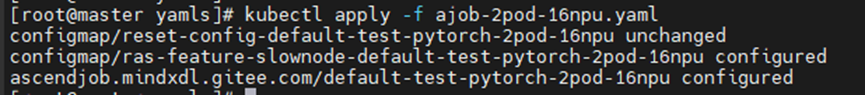

4. The content of `ajob-2pod-16npu.yaml` is as follows. For details about the command output, see [Table 1](#zh-cn_topic_0000002278667326_table1834456175114).

    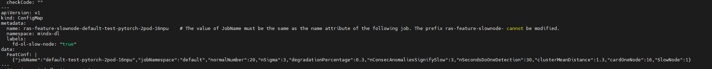

    The following is a YAML example, which cannot be directly copied, compiled, or run. It is for reference only.

    ```Yaml
    ---
    apiVersion: v1
    kind: ConfigMap
    metadata:
      name: ras-feature-slownode-default-test-pytorch-2pod-16npu    # The value of JobName must be the same as the name attribute of the following job. The prefix ras-feature-slownode- cannot be modified.
      namespace: mindx-dl
      labels:
        fd-ol-slow-node: "true"
    data:
      FeatConf: |
        {"jobName":"default-test-pytorch-2pod-16npu","jobNamespace":"default","normalNumber":20,"nSigma":3,"degradationPercentage":0.3,"nConsecAnomaliesSignifySlow":3,"nSecondsDoOneDetection":30,"clusterMeanDistance":1.3,"cardOneNode":16,"SlowNode":1}
    ---
    ```

    **Table 1** YAML file description

    <a name="zh-cn_topic_0000002278667326_table1834456175114"></a>

    |Field|Default Value|Description|
    |--|--|--|
    |jobNamespace|default|Job namespace.|
    |jobName|-|Job name|
    |normalNumber|20|Initial computing threshold (normal quantity).|
    |nSigma|3|Number of sigmas for calculating upper and lower thresholds|
    |degradationPercentage|0.3|Deterioration rate. A value of 0.3 represents a 30% performance drop.|
    |nConsecAnomaliesSignifySlow|3|Number of exceptions. Detection is triggered only when exceptions occur for multiple consecutive times.|
    |nSecondsDoOneDetection|30s|Interval for detection, in seconds|
    |clusterMeanDistance|1.3|Threshold distance (mean1 and mean2) between two clusters after clustering|
    |cardOneNode|16|Number of cards on a node|
    |slowNode|1|<p>Whether to enable the job.</p><ul><li>1: enabled</li><li>0: disabled</li></ul>|

**Querying Slow Node Diagnosis Results<a name="zh-cn_topic_0000002278667326_section208199121010"></a>**

After creating a slow node diagnosis task, you can query the logs of ClusterD and NodeD to view the task details.

**Method 1: Querying Cluster-Side Slow Node Diagnosis Logs via K8s Logs**

1. Run the `kubectl get pods -n mindx-dl` command to query the data of started ClusterD and NodeD nodes.

    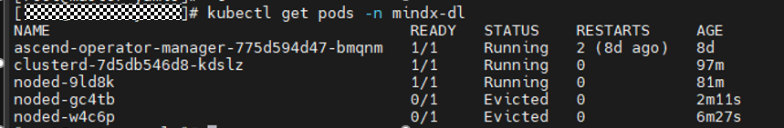

2. Then, run the kubectl `logs -n mindx-dl clusterd-7d5db546d8-kdslz | grep "got degradation, slow rank"` command to query the log data.
3. Check the log information. If information similar to the following is displayed, the node deteriorates.

    

**Method 2: Querying Cluster-Side Slow Node Diagnosis Logs via Flushed Logs**

1. Run the `cat /var/log/mindx-dl.clusterd.clusterd.log | grep "got degradation, slow rank"` command to query log data.
2. Check the log information. If information similar to the following is displayed, the node deteriorates.

    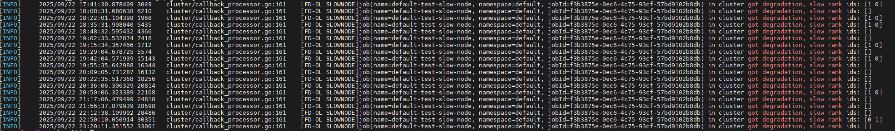

**Method 3: Querying Slow Node Diagnosis Logs on a Node**

Run the `kubectl logs -n mindx-dl node-9ld8k | grep "is degradation"` command to query the log data. If the information similar to the following is displayed, the node deteriorates.

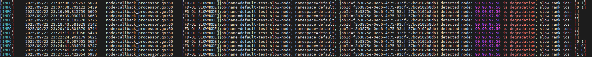

**Known Slow Node Faults <a name="zh-cn_topic_0000002278667326_section10496211245"></a>**

<a name="zh-cn_topic_0000002278667326_table4804164084414"></a>

| Fault Code | Fault Description | Fault Level |
|--|--|--|
| 110001010 | Slow node fault, reported as a one-time message. | SubHealthFault |
| 100001011 | Deterioration rectified | NotHandleFault |

#### Slow Network Diagnosis <a name="ZH-CN_TOPIC_0000002500720860"></a>

**Function Description <a name="zh-cn_topic_0000002313236861_section27999216294"></a>**

This feature provides parameter plane connectivity checks, real-time monitoring, and proactive risk warnings. By streamlining fault diagnostics and demarcation, it pre-warns network issues and sub-healthy faults and ensures the long-term stability of the cluster network.

Currently, it only supports online deployment integrated with ClusterD and NodeD. See the [Installation and Deployment](../../developer_guide/installation_deployment/manual_installation/00_obtaining_software_packages.md) section to complete the deployment of ClusterD and NodeD.

- Slow network algorithm: Analyzes and detects network probing data between nodes, and outputs network diagnosis results.
- Slow network scheduling: Controls the start and stop of detection tasks, reports fault results, and schedules the overall slow network process.

**Usage Example<a name="zh-cn_topic_0000002313236861_section1969604665710"></a>**

1. Configure shared storage.

    ClusterD and NodeD interact through shared storage, and their shared storage root paths must be consistent. The owner of the shared directory root path is user 9000, which is the same as the user running ClusterD.

    1. Configure the server.

        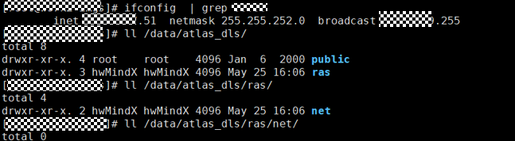

    2. Modify the NodeD configuration.

        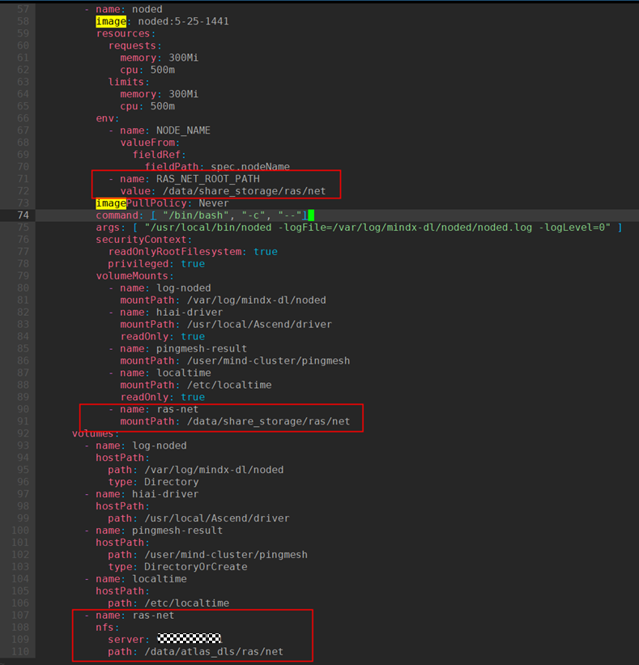

    3. Modify the ClusterD configuration.

        

    4. Run the `kubectl get pods -o wide -A` command. If the following example output appears, the shared storage configuration is complete.

        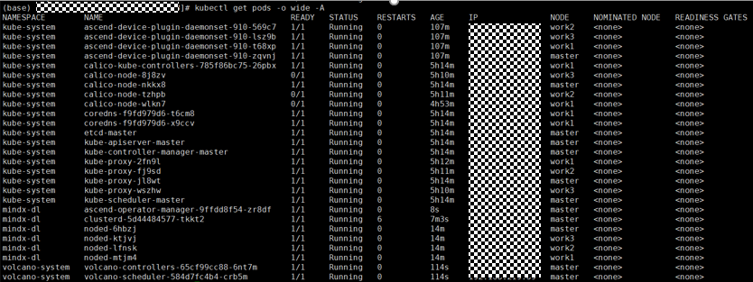

2. Enable the fault detection switch.
    1. Log in to the environment and go to the NodeD decompression directory.
    2. Run the following command to create a ConfigMap file named `pingmesh-config. pingmesh-config.yaml` is the pingmesh configuration file, which can be obtained from the NodeD installation package.

        ```shell
        kubectl apply -f pingmesh-config.yaml
        ```

        The response example is as follows:

        ```ColdFusion
        configmap/pingmesh-config created
        ```

    3. Run the following command to edit the `pingmesh-config` file. The description of each parameter in this file is shown in the following table.

        ```shell
        kubectl edit cm -n cluster-system pingmesh-config
        ```

        **Table 1**  pingmesh-config file parameter description

        <a name="zh-cn_topic_0000002313236861_table15591134151811"></a>

        |Parameter|Value|Description|
        |--|--|--|
        |app|pingmesh|Key of a label in the ConfigMap|
        |global|-|Cluster configuration|
        |"1"|SuperPoD ID|Configuration example for SuperPoD ID 1. Modify or add configurations based on actual conditions. When a SuperPoD is configured, NodeD uses the configuration of the SuperPoD and ignores the global configuration.|
        |activate|<ul><li>on: enabled</li><li>off: disabled</li></ul>|Whether to enable the pingmesh function.|
        |task_interval|[1–60]|Interval for executing a pingmesh task, in seconds.|

**Viewing Detection Results<a name="zh-cn_topic_0000002313236861_section74321914202214"></a>**

The pingmesh results of network detection are written to the file `<nodename>.log`. The detailed description of each field in this file is shown in the following table.

**Table 2** Parameter description of the <nodename\>.log file

<a name="zh-cn_topic_0000002313236861_table1485915561131"></a>

|Parameter|Value|Description|
|--|--|--|
|uid|A 64-character string|ID of this pingmesh task|
|config|String|User configuration of this pingmesh task|
|physicID|[0–15]|Physical ID of the NPU |
|taskID|<ul><li>Intra-node task: 0</li><li>Inter-node task: 1</li></ul>|Task ID|
|DestNum|[0–47]|Number of destination addresses in this pingmesh task|
|source_addr|IPv4 network address|Source address.|
|target_addr|IPv4 network address|Destination addres|
|suc_pkt_num|-|Number of packets sent successfully|
|fail_pkt_num|-|Number of packets that failed to be sent|
|max_time|<ul><li>Normal: non-negative value</li><li>Ping failure: -1</li></ul>|Maximum response time|
|min_time|<ul><li>Normal: non-negative value</li><li>Ping failure: -1</li></ul>|Minimum response time|
|avg_time|<ul><li>Normal: non-negative value</li><li>Ping failure: -1</li></ul>|Average response time|
|tp95_time|<ul><li>Normal: non-negative value</li><li>Ping failure: -1</li></ul>|Response time at the 95th percentile.|
|reply_stat_num|-|Number of responses obtained in this query|
|ping_total_num|-|Cumulative number of responses in this task|

**Viewing gRPC Report Results<a name="zh-cn_topic_0000002313236861_section28851054410"></a>**

If a slow network fault is detected, the fault is reported to the public fault management center of ClusterD through gRPC.

If a slow network fault is detected, the fault is reported to the public fault management center of ClusterD through gRPC.

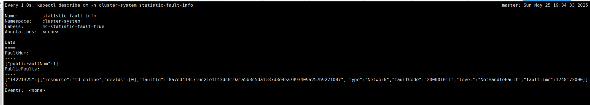

**Known Slow Network Faults<a name="zh-cn_topic_0000002313236861_section19919834124518"></a>**

<a name="zh-cn_topic_0000002313236861_table4804164084414"></a>

|Fault Code|Fault Description|Fault Level|
|--|--|--|
|200001010|Slow network detected/recovered in a node|NotHandleFault|
|200001011|Inter-node slow network detected/recovered in a SuperPoD|NotHandleFault|
|200001012|Slow network not caused by a card fault|NotHandleFault|

## Fault Handling<a name="ZH-CN_TOPIC_0000002511346405"></a>

### Fault Decision Description<a name="ZH-CN_TOPIC_0000002511346435"></a>

Once fault detection is complete, resumable training can restore the training service through fault handling or tolerance mechanisms across different fault modes, including Job-level rescheduling, Pod-level rescheduling, process-level rescheduling, elastic training, operator-level online recovery, and process-level online recovery. You can choose the appropriate sub-feature based on your requirements.

**Figure 1**  Fault handling description<a name="fig2639326192019"></a>
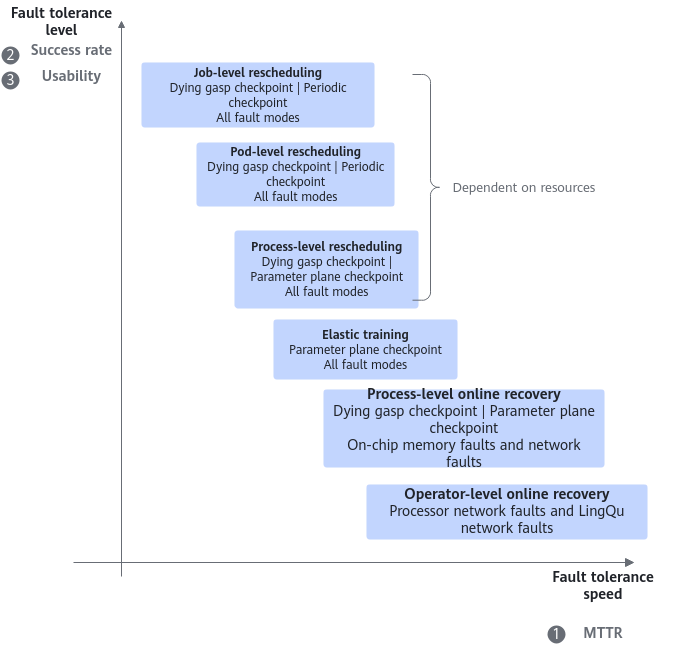

In the figure above, `Mean Time to Repair (MTTR)` represents the duration from fault occurrence to recovery. `Success rate` measures the effectiveness of fault recovery after an issue arises. `Usability` evaluates the cost of implementing or integrating a fault policy.

Job-level rescheduling, pod-level rescheduling, and process-level rescheduling support all fault modes supported by resumable training, but depend on backup redundant compute server resources. If there is an unrecoverable hardware fault and no backup redundant compute server, you can configure elastic training to perform scale-in training. Process-level online recovery is applicable to on-chip memory faults and network faults. Operator-level online recovery supports processor network faults and UnifiedBus network faults.

The multi-layer fault handling system of resumable training supports rollback at each layer based on recovery granularity, as shown in [Figure 2](#fig477415371217). If recovery at a higher layer fails, the process can revert to the next lower layer.

**Figure 2**  Recovery failure description<a name="fig477415371217"></a>
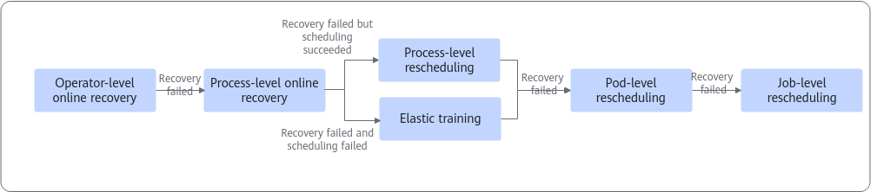

**Rescheduling Mode<a name="zh-cn_topic_0000002198051753_section1536115719358"></a>**

1. Rescheduling mode: Schedules jobs to healthy chips and isolates faulty chips.

    The default rescheduling mode is **Job-level rescheduling**, which stops all Pods upon each fault. However, for large-scale jobs, the cost of stopping all Pods before rescheduling is high, and the fault recovery time is excessively long. In addition, resumable training also provides the **Pod-level rescheduling** function. You can configure it based on the job scale, so that only the Pods related to the fault are stopped and a small number of Pods are rescheduled upon a fault, thereby achieving rapid fault recovery. To further shorten the fault recovery time and reduce the fault impact scope, resumable training also provides process-level rescheduling and process-level online recovery functions.

    **Table 1**  Differences between various rescheduling levels

    <a name="zh-cn_topic_0000002198051753_table18771108163419"></a>

    |Rescheduling Level|Recovery Time|Configuration Procedure|Description|
    |--|--|--|--|
    |Job-level rescheduling|Job-level rescheduling has a long recovery time, which degrades superlinearly as the job scale increases.|<p>The operation steps for Job-level rescheduling are simple. Users of MindCluster only need to enable the configuration switch to use it.</p><p>For key configuration procedures, see [Configuring Job-Level Rescheduling](./04_configuring_fault_handling_policies.md#configuring-job-level-rescheduling).</p>|To further reduce the resource scheduling time during recovery, you can choose to enable Pod-level rescheduling on top of Job-level rescheduling.|
    |Pod-level rescheduling|Pod-level rescheduling can shorten the resource scheduling time and is independent of the job scale. However, Pod-level rescheduling cannot optimize the time overhead during training initialization, and the overall recovery time still degrades superlinearly as the job scale increases.|<p>For Pod-level rescheduling, you need to additionally integrate training process management capabilities into the training container. Users of MindCluster can use it after acquiring the corresponding process management capabilities.</p><p>For key configuration procedures, see [Configuring Pod-Level Rescheduling](./04_configuring_fault_handling_policies.md#configuring-pod-level-rescheduling).</p>|To further reduce the recovery time during training initialization, you can choose to enable process-level rescheduling on top of Pod-level rescheduling.|
    |Process-level rescheduling (process-level recovery)|Process-level rescheduling can reduce the training initialization time, shorten the overall recovery time, and is independent of or weakly correlated with the job scale.|<p>Compared with Pod-level rescheduling, process-level rescheduling requires you to additionally integrate high-availability training capabilities into the training framework. Users of MindCluster need to modify the training script and enable the corresponding configuration switch to use it.</p><p>For key configuration procedures, see [Configuring Process-Level Rescheduling](./04_configuring_fault_handling_policies.md#configuring-process-level-rescheduling).</p>|To address the issue of short MTBF in large-scale scenarios and further reduce the overall recovery time, you can choose to enable process-level online recovery on top of process-level rescheduling.|
    |Process-level online recovery|Process-level online recovery has a lower recovery time compared with process-level rescheduling.|<p>Compared with process-level rescheduling, process-level online recovery requires users to configure the corresponding configuration switch before use.</p><p>For key configuration procedures, see [Configuring Process-Level Online Recovery](./04_configuring_fault_handling_policies.md#configuring-process-level-online-recovery).</p>|Currently, process-level online recovery supports on-chip memory faults and network faults. Other fault scenarios will fall back to other handling methods.|
    |Operator-level online recovery|-|For key configuration procedures, see [Configuring Operator-Level Online Recovery](./04_configuring_fault_handling_policies.md#configuring-operator-level-online-recovery).|-|

2. The rescheduling mode has the following two rescheduling policies.

    - **Direct rescheduling**: If a hardware fault that can be detected by the cluster scheduling components occurs during training, the system isolates the faulty node or processor and directly reschedules the job.
    - **Unconditional retry**: If a fault that cannot be detected by the cluster scheduling components occurs during training and the job container exits abnormally, the system unconditionally reschedules the job.

    **Table 2** Rescheduling policy description

    <a name="zh-cn_topic_0000002198051753_table37727194382"></a>

    |Rescheduling Policy|Description|Supported Fault Types|
    |--|--|--|
    |Direct rescheduling|The system isolates the faulty node or chip, and then directly reschedules the job.|Known node faults or chip faults at the rescheduling processing level.|
    |Unconditional retry|<p>The system reschedules a job configured with unconditional retry within the specified number of times.</p><p>After a successful rescheduling, the number of retry times decreases by 1. When the number of retry times reaches 0, rescheduling cannot be triggered again.</p><p>To use the unconditional retry function, configure the `fault-retry-times` parameter in the YAML. For detailed parameter descriptions, see [YAML Configuration Description](../../api/).</p>|Faults that cause jobs to exit abnormally and pod status to become `Failed`, which are caused by parameter plane network faults or training software faults.|

### Job-Level Rescheduling<a name="ZH-CN_TOPIC_0000002479226586"></a>

If this mode is enabled, all Pods are stopped each time a fault occurs. After the faulty Pods are re-created and rescheduled, a training job is restarted. This mode is used by default.

For key configuration procedures of Job-level rescheduling, see [Configuring Job-Level Rescheduling](./04_configuring_fault_handling_policies.md#configuring-job-level-rescheduling).

**Constraints<a name="zh-cn_topic_0000002039194017_section1178044918127"></a>**

- This feature is only supported in version 6.0.RC2 and later.
- In large-scale K8s cluster scenarios, ConfigMap mapping latency is uncontrollable. It is recommended to use shared storage for RankTable.

**Supported Product Models and AI Frameworks<a name="zh-cn_topic_0000002039194017_section140112935318"></a>**

**Table 1** Products and frameworks that support Job-level rescheduling

<a name="zh-cn_topic_0000002039194017_table6198201175416"></a>

|Product Type|Hardware Form Factor|Training Framework|
|--|--|--|
|Atlas training series products|<ul><li>Atlas 800 training server (model 9000)</li><li>Atlas 800 training server (model 9010)</li></ul><div class="note"><span class="notetitle">Note:</span><div class="notebody">If the chip operating mode of the Atlas 800 training server is SMP mode and the number of NPUs requested per Pod is 1 or 2, the rescheduling mode is not supported. For detailed instructions on querying and setting the NPU chip operating mode, see the "[Querying and Setting the NPU Chip Operating Mode (npuworkmode)](https://support.huawei.com/enterprise/en/doc/EDOC1100136583/b6e6ed5a)" section in the *Atlas 800 Training Server iBMC User Guide (Model 9000)*.</div></div>|<ul><li>MindSpore</li><li>PyTorch</li></ul>|
|Atlas A2 training series products|<ul><li>Atlas 800T A2 training server</li><li>Atlas 200T A2 Box16 heterogeneous subrack</li><li>Atlas 900 A2 PoD cluster basic unit</li></ul>|<ul><li>MindSpore</li><li>PyTorch</li></ul>|
|Atlas A3 training series products|<ul><li>Atlas 900 A3 SuperPoD</li><li>Atlas 800T A3 SuperPoD server</li></ul>|<ul><li>MindSpore</li><li>PyTorch</li></ul>|
|A200T A3 Box8 superPoD server|A200T A3 Box8 SuperPoD server|<ul><li>MindSpore</li><li>PyTorch</li></ul>|
|Atlas 950 training series products|<ul><li>Atlas 950 SuperPoD</li></ul>|<ul><li>PyTorch</li></ul>|
|Atlas 850 training series products|<ul><li>Atlas 850 Server</li><li>Atlas 850E Server</li></ul>|<ul><li>PyTorch</li></ul>|

**Rescheduling Principles<a name="zh-cn_topic_0000002039194017_section57901137171110"></a>**

If a software or hardware fault occurs during training, the training status becomes abnormal. Job-level rescheduling first destroys all training containers, isolates the faulty device, and then restarts and schedules training containers. Once restarted, the training process resumes from the beginning, similar to an initial training launch.

**Figure 1** Principles<a name="fig18343114924113"></a>
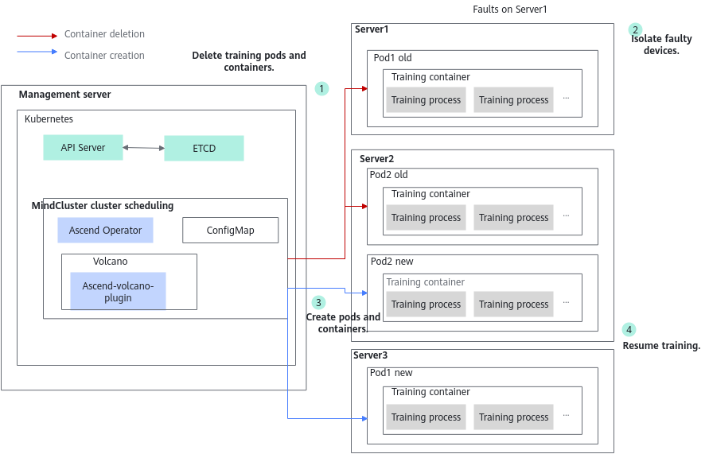

The following describes each step in the figure above.

1. After a fault is detected, first delete all Pods and containers of the current job.
2. Isolate the device where the fault is located to prevent it from being used again.
3. Recreate and reschedule the training Pods and containers.
4. After the container starts, restart the training process to resume training.

### Pod-Level Rescheduling<a name="ZH-CN_TOPIC_0000002511346429"></a>

If this mode is enabled, only the faulty Pods are stopped each time a fault occurs. After the faulty pods are re-created and rescheduled, a training job is restarted. If the fault cannot be rectified, Job-level rescheduling is triggered. Compared with Job-level rescheduling, Pod-level rescheduling reduces the time for resource scheduling and Pod creation.

For key configuration procedures of Pod-level rescheduling, see [Configuring Pod-Level Rescheduling](./04_configuring_fault_handling_policies.md#configuring-pod-level-rescheduling).

**Constraints<a name="zh-cn_topic_0000002003034876_section11983145119441"></a>**

- When Pod-level rescheduling is used for a training job in a large cluster, you are advised to set the `open files` parameter (maximum number of files that can be opened) to a large value. If the value is too small, pod rescheduling may be abnormal. For example, run the `ulimit -n 100000` command to set `open files` to `100000`.
- When a fault occurs on the Pod  with `hccl/rankIndex = 0` under annotation of a training job is faulty, pod-level rescheduling and process-level rescheduling are not triggered. Instead, Job-level rescheduling is triggered.
- Do not use ConfigMap to mount the RankTable file, as this may cause job rescheduling to fail.

**Supported Product Models and AI Frameworks<a name="zh-cn_topic_0000002003034876_section48174410591"></a>**

**Table 1** Products and frameworks that supports Pod-level rescheduling

<a name="zh-cn_topic_0000002003034876_table1991711954417"></a>
<table><thead align="left"><tr id="zh-cn_topic_0000002003034876_row1091711912447"><th class="cellrowborder" valign="top" width="20.462046204620464%" id="mcps1.2.4.1.1"><p id="zh-cn_topic_0000002003034876_p199171819164417"><a name="zh-cn_topic_0000002003034876_p199171819164417"></a><a name="zh-cn_topic_0000002003034876_p199171819164417"></a>Product Type</p>
</th>
<th class="cellrowborder" valign="top" width="63.10631063106311%" id="mcps1.2.4.1.2"><p id="zh-cn_topic_0000002003034876_p2917819114420"><a name="zh-cn_topic_0000002003034876_p2917819114420"></a><a name="zh-cn_topic_0000002003034876_p2917819114420"></a>Hardware Form</p>
</th>
<th class="cellrowborder" valign="top" width="16.43164316431643%" id="mcps1.2.4.1.3"><p id="zh-cn_topic_0000002003034876_p27578257424"><a name="zh-cn_topic_0000002003034876_p27578257424"></a><a name="zh-cn_topic_0000002003034876_p27578257424"></a>Training Framework</p>
</th>
</tr>
</thead>
<tbody><tr id="zh-cn_topic_0000002003034876_row12917151994410"><td class="cellrowborder" valign="top" width="20.462046204620464%" headers="mcps1.2.4.1.1 "><p id="zh-cn_topic_0000002003034876_p339114714459"><a name="zh-cn_topic_0000002003034876_p339114714459"></a><a name="zh-cn_topic_0000002003034876_p339114714459"></a><span id="zh-cn_topic_0000002003034876_ph327965117217"><a name="zh-cn_topic_0000002003034876_ph327965117217"></a><a name="zh-cn_topic_0000002003034876_ph327965117217"></a>Atlas training series products</span></p>
</td>
<td class="cellrowborder" valign="top" width="63.10631063106311%" headers="mcps1.2.4.1.2 "><a name="zh-cn_topic_0000002003034876_ul17412295261"></a><a name="zh-cn_topic_0000002003034876_ul17412295261"></a><ul id="zh-cn_topic_0000002003034876_ul17412295261"><li><span id="ph1179307345"><a name="ph1179307345"></a><a name="ph1179307345"></a>Atlas 800 training server (model 9000)</span></li><li><span id="zh-cn_topic_0000002039194017_ph1627888115712"><a name="zh-cn_topic_0000002039194017_ph1627888115712"></a><a name="zh-cn_topic_0000002039194017_ph1627888115712"></a>Atlas 800 training server (model 9010)</span><div class="note" id="zh-cn_topic_0000002003034876_note186291241356"><a name="zh-cn_topic_0000002003034876_note186291241356"></a><a name="zh-cn_topic_0000002003034876_note186291241356"></a><span class="notetitle">Note:</span><div class="notebody"><p id="zh-cn_topic_0000002003034876_p86294411854"><a name="zh-cn_topic_0000002003034876_p86294411854"></a><a name="zh-cn_topic_0000002003034876_p86294411854"></a>If the chip working mode of the <span id="zh-cn_topic_0000002003034876_ph1162924110518"><a name="zh-cn_topic_0000002003034876_ph1162924110518"></a><a name="zh-cn_topic_0000002003034876_ph1162924110518"></a>Atlas 800 training server</span> is SMP mode and the number of NPUs requested per Pod is 1 or 2, the rescheduling mode is not supported. For details on querying and setting the NPU chip working mode, see the "<a href="https://support.huawei.com/enterprise/en/doc/EDOC1100136583/b6e6ed5a" target="_blank" rel="noopener noreferrer">Querying and Setting the NPU Chip Working Mode (npuworkmode)</a>" section in the <span id="zh-cn_topic_0000002003034876_ph66296417518"><a name="zh-cn_topic_0000002003034876_ph66296417518"></a><a name="zh-cn_topic_0000002003034876_ph66296417518"></a>Atlas 800 Training Server iBMC User Guide (Model 9000)</span>.</p>
</div></div>
</li></ul>
</td>
<td class="cellrowborder" valign="top" width="16.43164316431643%" headers="mcps1.2.4.1.3 "><a name="zh-cn_topic_0000002003034876_ul353572894311"></a><a name="zh-cn_topic_0000002003034876_ul353572894311"></a><ul id="zh-cn_topic_0000002003034876_ul353572894311"><li><span id="zh-cn_topic_0000002003034876_ph2075216585425"><a name="zh-cn_topic_0000002003034876_ph2075216585425"></a><a name="zh-cn_topic_0000002003034876_ph2075216585425"></a>MindSpore</span></li><li><span id="zh-cn_topic_0000002003034876_ph19355165113512"><a name="zh-cn_topic_0000002003034876_ph19355165113512"></a><a name="zh-cn_topic_0000002003034876_ph19355165113512"></a>PyTorch</span></li></ul>
</td>
</tr>
<tr id="zh-cn_topic_0000002003034876_row6171182004512"><td class="cellrowborder" valign="top" width="20.462046204620464%" headers="mcps1.2.4.1.1 "><p id="zh-cn_topic_0000002003034876_p153913472453"><a name="zh-cn_topic_0000002003034876_p153913472453"></a><a name="zh-cn_topic_0000002003034876_p153913472453"></a><span id="zh-cn_topic_0000002003034876_ph151431757142112"><a name="zh-cn_topic_0000002003034876_ph151431757142112"></a><a name="zh-cn_topic_0000002003034876_ph151431757142112"></a>Atlas A2 training series products</span></p>
<p id="p15647160165615"><a name="p15647160165615"></a><a name="p15647160165615"></a></p>
</td>
<td class="cellrowborder" valign="top" width="63.10631063106311%" headers="mcps1.2.4.1.2 "><a name="zh-cn_topic_0000002003034876_ul1843217118563"></a><a name="zh-cn_topic_0000002003034876_ul1843217118563"></a><ul id="zh-cn_topic_0000002003034876_ul1843217118563"><li><span id="ph2153181425619"><a name="ph2153181425619"></a><a name="ph2153181425619"></a>Atlas 800T A2 training server</span></li><li><span id="zh-cn_topic_0000002003034876_ph1114211211203"><a name="zh-cn_topic_0000002003034876_ph1114211211203"></a><a name="zh-cn_topic_0000002003034876_ph1114211211203"></a>Atlas 200T A2 Box16 heterogeneous subrack</span></li><li><span id="zh-cn_topic_0000002003034876_ph495114991519"><a name="zh-cn_topic_0000002003034876_ph495114991519"></a><a name="zh-cn_topic_0000002003034876_ph495114991519"></a>Atlas 900 A2 PoD cluster basic unit</span></li></ul>
</td>
<td class="cellrowborder" valign="top" width="16.43164316431643%" headers="mcps1.2.4.1.3 "><a name="zh-cn_topic_0000002003034876_ul693112434815"></a><a name="zh-cn_topic_0000002003034876_ul693112434815"></a><ul id="zh-cn_topic_0000002003034876_ul693112434815"><li><span id="zh-cn_topic_0000002003034876_ph1393112494820"><a name="zh-cn_topic_0000002003034876_ph1393112494820"></a><a name="zh-cn_topic_0000002003034876_ph1393112494820"></a>MindSpore</span></li><li><span id="zh-cn_topic_0000002003034876_ph2093210246488"><a name="zh-cn_topic_0000002003034876_ph2093210246488"></a><a name="zh-cn_topic_0000002003034876_ph2093210246488"></a>PyTorch</span></li></ul>
</td>
</tr>
<tr id="zh-cn_topic_0000002003034876_row62157458147"><td class="cellrowborder" valign="top" width="20.462046204620464%" headers="mcps1.2.4.1.1 "><p id="zh-cn_topic_0000002003034876_p18222246142212"><a name="zh-cn_topic_0000002003034876_p18222246142212"></a><a name="zh-cn_topic_0000002003034876_p18222246142212"></a><span id="zh-cn_topic_0000002003034876_ph18411121792018"><a name="zh-cn_topic_0000002003034876_ph18411121792018"></a><a name="zh-cn_topic_0000002003034876_ph18411121792018"></a>Atlas A3 training series products</span></p>
</td>
<td class="cellrowborder" valign="top" width="63.10631063106311%" headers="mcps1.2.4.1.2 "><a name="zh-cn_topic_0000002003034876_ul1367372444211"></a><a name="zh-cn_topic_0000002003034876_ul1367372444211"></a><ul id="zh-cn_topic_0000002003034876_ul1367372444211"><li><p id="p14426829306"><a name="p14426829306"></a><a name="p14426829306"></a><span id="ph077885871817"><a name="ph077885871817"></a><a name="ph077885871817"></a>Atlas 900 A3 SuperPoD </span></p>
</li><li><span id="ph10355115144111"><a name="ph10355115144111"></a><a name="ph10355115144111"></a>Atlas 800T A3 SuperPoD server</span></li></ul>
</td>
<td class="cellrowborder" valign="top" width="16.43164316431643%" headers="mcps1.2.4.1.3 "><a name="zh-cn_topic_0000002039194017_ul7201511105411"></a><a name="zh-cn_topic_0000002039194017_ul7201511105411"></a><ul id="zh-cn_topic_0000002039194017_ul7201511105411"><li><span id="zh-cn_topic_0000002039194017_ph52034113546"><a name="zh-cn_topic_0000002039194017_ph52034113546"></a><a name="zh-cn_topic_0000002039194017_ph52034113546"></a>MindSpore</span></li><li><span id="zh-cn_topic_0000002039194017_ph620418118547"><a name="zh-cn_topic_0000002039194017_ph620418118547"></a><a name="zh-cn_topic_0000002039194017_ph620418118547"></a>PyTorch</span></li></ul>
</td>
</tr>
<tr id="row999211122017"><td class="cellrowborder" valign="top" width="20.462046204620464%" headers="mcps1.2.4.1.1 "><p id="p09912115201"><a name="p09912115201"></a><a name="p09912115201"></a><span id="ph126247155413"><a name="ph126247155413"></a><a name="ph126247155413"></a>A200T A3 Box8 SuperPoD server</span></p>
</td>
<td class="cellrowborder" valign="top" width="63.10631063106311%" headers="mcps1.2.4.1.2 "><p id="p49961172020"><a name="p49961172020"></a><a name="p49961172020"></a><span id="ph6124114710214"><a name="ph6124114710214"></a><a name="ph6124114710214"></a>A200T A3 Box8 SuperPoD server</span></p>
</td>
<td class="cellrowborder" valign="top" width="16.43164316431643%" headers="mcps1.2.4.1.3 "><a name="ul5581185452113"></a><a name="ul5581185452113"></a><ul id="ul5581185452113"><li><span id="ph19581195472117"><a name="ph19581195472117"></a><a name="ph19581195472117"></a>MindSpore</span></li><li><span id="ph8581154132114"><a name="ph8581154132114"></a><a name="ph8581154132114"></a>PyTorch</span></li></ul>
</td>
</tr>
<tr id="row_ascend950_pod"><td class="cellrowborder" valign="top" width="20.462046204620464%" headers="mcps1.2.4.1.1 "><p id="p_ascend950_pod"><a name="p_ascend950_pod"></a><a name="p_ascend950_pod"></a><span id="ph_ascend950_pod"><a name="ph_ascend950_pod"></a><a name="ph_ascend950_pod"></a>Atlas 950 training series products</span></p>
</td>
<td class="cellrowborder" valign="top" width="63.10631063106311%" headers="mcps1.2.4.1.2 "><ul id="ul_ascend950_pod"><li><span id="ph_ascend950_superpod_pod"><a name="ph_ascend950_superpod_pod"></a><a name="ph_ascend950_superpod_pod"></a>Atlas 950 SuperPoD</span></li></ul>
</td>
<td class="cellrowborder" valign="top" width="16.43164316431643%" headers="mcps1.2.4.1.3 "><ul id="ul_ascend950_fw_pod"><li><span id="ph_ascend950_pt_pod"><a name="ph_ascend950_pt_pod"></a><a name="ph_ascend950_pt_pod"></a>PyTorch</span></li></ul>
</td>
</tr>
<tr id="row_ascend850_pod"><td class="cellrowborder" valign="top" width="20.462046204620464%" headers="mcps1.2.4.1.1 "><p id="p_ascend850_pod"><a name="p_ascend850_pod"></a><a name="p_ascend850_pod"></a><span id="ph_ascend850_pod"><a name="ph_ascend850_pod"></a><a name="ph_ascend850_pod"></a>Atlas 850 training series products</span></p>
</td>
<td class="cellrowborder" valign="top" width="63.10631063106311%" headers="mcps1.2.4.1.2 "><ul id="ul_ascend850_pod"><li><span id="ph_ascend850_hardware_pod"><a name="ph_ascend850_hardware_pod"></a><a name="ph_ascend850_hardware_pod"></a>Atlas 850 Server</span></li><li><span id="ph_ascend850e_hardware_pod"><a name="ph_ascend850e_hardware_pod"></a><a name="ph_ascend850e_hardware_pod"></a>Atlas 850E Server</span></li></ul>
</td>
<td class="cellrowborder" valign="top" width="16.43164316431643%" headers="mcps1.2.4.1.3 "><ul id="ul_ascend850_fw_pod"><li><span id="ph_ascend850_pt_pod"><a name="ph_ascend850_pt_pod"></a><a name="ph_ascend850_pt_pod"></a>PyTorch</span></li></ul>
</td>
</tr>
</tbody>
</table>

**Rescheduling Principles<a name="zh-cn_topic_0000002003034876_section19557184814234"></a>**

If a software or hardware fault occurs during training, the training status becomes abnormal. Pod-level rescheduling destroys the faulty pods and training containers in the job, instructs the management processes in other training containers to destroy all training processes, isolates the faulty device, and reschedules and restarts training containers. Once restarted, management processes in all containers are notified to restart training processes to resume training.

1. After a fault is detected, only the faulty Pods and containers in the current job are deleted, and all training processes are destroyed.
2. Isolate the device where the fault occurs to prevent it from being used again.
3. Recreate and reschedule the training Pods and containers.
4. After the containers are started, restart the training processes to resume training.

### Process-Level Rescheduling<a name="ZH-CN_TOPIC_0000002511346457"></a>

This mode stops only the processes of the faulty node each time a fault occurs and determines whether to exit the faulty node based on the configured policy.

- `recover` policy: Migrate the containers on the faulty node to a healthy node.
- `recover-in-place` policy: For nodes where the following two types of faults occur, only the faulty processes are restarted, and the containers on the faulty node are not migrated. If faults occur on multiple nodes simultaneously, only the nodes with the following two types of faults will have their faulty processes restarted without container migration, while nodes with other fault types will have their containers migrated. If the fault types occurring on multiple nodes only include service process abnormal faults, containers on all faulty nodes will be migrated.
    - Service process abnormal fault.
    - Chip faults at the `RestartRequest` and `RestartBusiness` levels.

If recovery is not possible, it falls back to the job-level or pod-level rescheduling mode. Compared to Pod‑level rescheduling, this feature reschedules only the faulty process, significantly reducing the waiting time caused by asynchronous processes. It also leverages a new HCCL connection establishment scheme to greatly reduce connection setup time. Furthermore, it uses the high‑speed parameter‑plane P2P network between NPUs to transfer checkpoint information, avoiding the overhead associated with checkpoint saving and loading.

For the key configuration procedure of process-level rescheduling, see [Configuring Process-Level Rescheduling](./04_configuring_fault_handling_policies.md#configuring-process-level-rescheduling).

>[!NOTE]
>
>- Checkpoint transmission over the parameter plane relies on the presence of optimizer replicas on the faulty NPU. If no replica is available, parameters are restored by loading the checkpoint file from storage.
>- Since optimizer replicas consume additional device memory, you can switch to local loading mode when device memory is insufficient. In this mode, parameters are restored directly from the checkpoint file in storage zone, regardless of the existence of optimizer replicas.

**Constraints<a name="zh-cn_topic_0000002039353153_section514611624316"></a>**

- For the PyTorch training framework, it must be used with a compatible MindSpeed version. For version compatibility, see [MindSpeed-LLM](https://gitcode.com/Ascend/MindSpeed-LLM/tree/2.3.0).
- For the MindSpore training framework, it must be used with a compatible MindFormers version. For version compatibility, see [MindSpore MindFormers](https://gitcode.com/mindspore/mindformers/tree/master).
- When a Pod with the `hccl/rankIndex` field set to `0` in the training job's annotation encounters a fault and the container needs to be migrated, Pod-level rescheduling and process-level rescheduling are not triggered; instead, Job-level rescheduling is triggered directly.
- Cannot be enabled simultaneously with graceful fault tolerance. If both are enabled, resumable training will recover training through Job-level rescheduling.
- In MindSpore scenarios, to ensure the normal use of this function, install MindSpore and MindIO in the same path.
- In the MindSpore scenario, due to framework mechanism limitations, process-level rescheduling carries a very low risk of failure.
- Do not mount RankTable files using ConfigMap, as this may cause job rescheduling to fail.
- PyTorch only supports single-operator mode and models based on the Megatron framework.
- Only training Ascend Jobs are supported.
- Only single-container migration is supported; affinity-based migration is not supported.
- Multi-modal models are not supported.
- The watchdog function is not supported.
- Process-level rescheduling triggered during checkpoint saving is not supported.
- For the Atlas A3 training series products, faults such as NPU removal or OS disconnection may cause process-level rescheduling to fail.
- When a fault occurs during the HCCL link setup phase, process-level rescheduling will fail. If, in addition to the HCCL link setup during training initialization, there are other HCCL link Setup phases during training, you can refer to the [Configuring Proactive HCCL Link Setup](./05_configuring_training_recovery.md#configuring-proactive-hccl-link-setup) section to establish links in advance to prevent faults from occurring during the HCCL link setup phase.
- It is not supported in IPv6 scenarios.

**Supported Product Models and AI Frameworks<a name="zh-cn_topic_0000002039353153_section136131584164"></a>**

**Table 1** Products and frameworks that support process-level rescheduling

<a name="zh-cn_topic_0000002039353153_table1991711954417"></a>
<table><thead align="left"><tr id="zh-cn_topic_0000002039353153_row1091711912447"><th class="cellrowborder" valign="top" width="20.462046204620464%" id="mcps1.2.4.1.1"><p id="zh-cn_topic_0000002039353153_p199171819164417"><a name="zh-cn_topic_0000002039353153_p199171819164417"></a><a name="zh-cn_topic_0000002039353153_p199171819164417"></a>Product Type</p>
</th>
<th class="cellrowborder" valign="top" width="66.2966296629663%" id="mcps1.2.4.1.2"><p id="zh-cn_topic_0000002039353153_p2917819114420"><a name="zh-cn_topic_0000002039353153_p2917819114420"></a><a name="zh-cn_topic_0000002039353153_p2917819114420"></a>Hardware Form</p>
</th>
<th class="cellrowborder" valign="top" width="13.24132413241324%" id="mcps1.2.4.1.3"><p id="zh-cn_topic_0000002039353153_p27578257424"><a name="zh-cn_topic_0000002039353153_p27578257424"></a><a name="zh-cn_topic_0000002039353153_p27578257424"></a>Training Framework</p>
</th>
</tr>
</thead>
<tbody><tr id="zh-cn_topic_0000002039353153_row6171182004512"><td class="cellrowborder" valign="top" width="20.462046204620464%" headers="mcps1.2.4.1.1 "><p id="zh-cn_topic_0000002039353153_p153913472453"><a name="zh-cn_topic_0000002039353153_p153913472453"></a><a name="zh-cn_topic_0000002039353153_p153913472453"></a><span id="zh-cn_topic_0000002039353153_ph151431757142112"><a name="zh-cn_topic_0000002039353153_ph151431757142112"></a><a name="zh-cn_topic_0000002039353153_ph151431757142112"></a>Atlas A2 training series products</span></p>
<p id="p737515258512"><a name="p737515258512"></a><a name="p737515258512"></a></p>
</td>
<td class="cellrowborder" valign="top" width="66.2966296629663%" headers="mcps1.2.4.1.2 "><a name="zh-cn_topic_0000002039353153_ul1843217118563"></a><a name="zh-cn_topic_0000002039353153_ul1843217118563"></a><ul id="zh-cn_topic_0000002039353153_ul1843217118563"><li><p id="p1546725019404"><a name="p1546725019404"></a><a name="p1546725019404"></a><span id="ph157633217501"><a name="ph157633217501"></a><a name="ph157633217501"></a>Atlas 800T A2 training server</span></p>
</li><li><span id="zh-cn_topic_0000002039353153_ph1114211211203"><a name="zh-cn_topic_0000002039353153_ph1114211211203"></a><a name="zh-cn_topic_0000002039353153_ph1114211211203"></a>Atlas 200T A2 Box16 heterogeneous subrack</span></li><li><span id="zh-cn_topic_0000002039353153_ph495114991519"><a name="zh-cn_topic_0000002039353153_ph495114991519"></a><a name="zh-cn_topic_0000002039353153_ph495114991519"></a>Atlas 900 A2 PoD cluster basic unit</span></li></ul>
</td>
<td class="cellrowborder" valign="top" width="13.24132413241324%" headers="mcps1.2.4.1.3 "><a name="zh-cn_topic_0000002039353153_ul693112434815"></a><a name="zh-cn_topic_0000002039353153_ul693112434815"></a><ul id="zh-cn_topic_0000002039353153_ul693112434815"><li><span id="zh-cn_topic_0000002039353153_ph1393112494820"><a name="zh-cn_topic_0000002039353153_ph1393112494820"></a><a name="zh-cn_topic_0000002039353153_ph1393112494820"></a>MindSpore</span></li><li><span id="zh-cn_topic_0000002039353153_ph2093210246488"><a name="zh-cn_topic_0000002039353153_ph2093210246488"></a><a name="zh-cn_topic_0000002039353153_ph2093210246488"></a>PyTorch</span></li></ul>
</td>
</tr>
<tr id="zh-cn_topic_0000002039353153_row62157458147"><td class="cellrowborder" valign="top" width="20.462046204620464%" headers="mcps1.2.4.1.1 "><p id="zh-cn_topic_0000002039353153_p18222246142212"><a name="zh-cn_topic_0000002039353153_p18222246142212"></a><a name="zh-cn_topic_0000002039353153_p18222246142212"></a><span id="zh-cn_topic_0000002039353153_ph18411121792018"><a name="zh-cn_topic_0000002039353153_ph18411121792018"></a><a name="zh-cn_topic_0000002039353153_ph18411121792018"></a>Atlas A3 training series products</span></p>
</td>
<td class="cellrowborder" valign="top" width="66.2966296629663%" headers="mcps1.2.4.1.2 "><a name="ul61561253231"></a><a name="ul61561253231"></a><ul id="ul61561253231"><li><span id="ph077885871817"><a name="ph077885871817"></a><a name="ph077885871817"></a>Atlas 900 A3 SuperPoD </span></li><li><span id="ph10355115144111"><a name="ph10355115144111"></a><a name="ph10355115144111"></a>Atlas 800T A3 SuperPoD server</span></li></ul>
</td>
<td class="cellrowborder" valign="top" width="13.24132413241324%" headers="mcps1.2.4.1.3 "><a name="ul18946810161311"></a><a name="ul18946810161311"></a><ul id="ul18946810161311"><li><span id="ph99461100137"><a name="ph99461100137"></a><a name="ph99461100137"></a>MindSpore</span><p id="p664545214"><a name="p664545214"></a><a name="p664545214"></a><span id="ph294661010130"><a name="ph294661010130"></a><a name="ph294661010130"></a></span></p>
</li><li><span id="ph99469109139"><a name="ph99469109139"></a><a name="ph99469109139"></a>PyTorch</span></li></ul>
</td>
</tr>
<tr id="row_ascend950_process"><td class="cellrowborder" valign="top" width="20.462046204620464%" headers="mcps1.2.4.1.1 "><p id="p_ascend950_process"><a name="p_ascend950_process"></a><a name="p_ascend950_process"></a><span id="ph_ascend950_process"><a name="ph_ascend950_process"></a><a name="ph_ascend950_process"></a>Atlas 950 training series products</span></p>
</td>
<td class="cellrowborder" valign="top" width="66.2966296629663%" headers="mcps1.2.4.1.2 "><ul id="ul_ascend950_process"><li><span id="ph_ascend950_superpod_process"><a name="ph_ascend950_superpod_process"></a><a name="ph_ascend950_superpod_process"></a>Atlas 950 SuperPoD</span></li></ul>
</td>
<td class="cellrowborder" valign="top" width="13.24132413241324%" headers="mcps1.2.4.1.3 "><ul id="ul_ascend950_process_fw"><li><span id="ph_ascend950_pt_process"><a name="ph_ascend950_pt_process"></a><a name="ph_ascend950_pt_process"></a>PyTorch</span></li></ul>
</td>
</tr>
</tbody>
</table>

**Rescheduling Principles<a name="zh-cn_topic_0000002039353153_section12206164333619"></a>**

If a software or hardware fault occurs during training, the training status will become abnormal. Process-level rescheduling first destroys the faulty training process or container based on the configured policy, notifies the training processes in other training containers to pause the current training job, then isolates the faulty device, and reschedules and starts the training container again. After the faulty training container is restarted, it notifies the training processes in all containers to re-establish the collective communication link. After the link is established, the checkpoint is sent to the newly launched training process via the parameter plane to restore parameters. After restoration, all processes re-execute the current step to resume training.

**Figure 1** Process-level rescheduling principles<a name="fig1373016583373"></a>
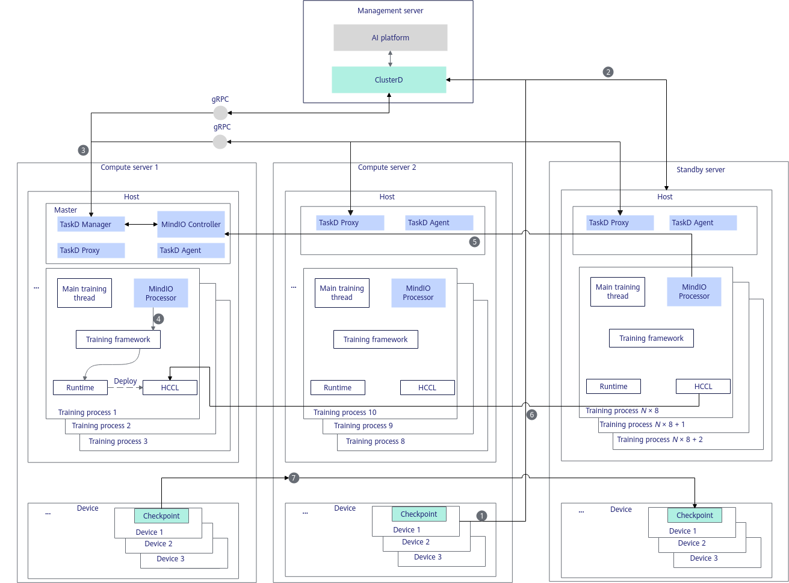

The steps in the figure are described as follows:

1. After a hardware fault occurs on a device, the detection component of MindCluster on the server reports the fault information to ClusterD. Software faults are perceived by MindIO Controller in the container and reported to ClusterD.
2. ClusterD exits the faulty training process from the container on the faulty server and reschedules it to a standby server.
3. ClusterD notifies MindIO Controller on the master node to perform fault tolerance. The fault tolerance process includes notifying to stop training, notifying global faults, and notifying recovery policies.
4. MindIO Controller notifies MindIO Processor in each training process, and MindIO Processor calls PTA to forcibly stop the training process. MindIO Processor cleans up resources on normal nodes, destroys the communication domain, and waits for new processes to join after cleanup.
5. After the management process on the standby server starts the training process, a new MindIO Processor is created. MindIO Controller notifies MindIO Processor in each training process to resume training.
6. Each process establishes links through collective communication.
7. The NPU on the normal server transfers the checkpoint to the standby server through the parameter plane, and training continues after parameter state recovery is completed.

**Feature Adaptation Points<a name="section1446615300284"></a>**

In process-level rescheduling, the cluster brain decides the recovery policy based on global fault information and delivers the policy to MindIO. The scheduler needs to support scheduling of the faulty Pod rather than rescheduling the entire job, and support sequential fallback of recovery policies. In the training container, the framework first initializes the MindIO service. After the service is started, the optimizer reports the corresponding status to MindIO during updates. Subsequently, DP replica groups and optimizer replicas are created to ensure redundant backup of model parameters. When an exception occurs, the fault mode is captured by the exception capture decorator. During recovery, operator resource cleanup is performed, and communication re-establishment is triggered after the node restarts. Process-level rescheduling recovery is completed through online repair of the parameter plane and state rollback.

For non-MindSpeed-LLM/MindCluster users, adapt the following functions as listed in [Table 2](#table1995514113610).

**Table 2**  Functions adapted for process-level rescheduling

<a name="table1995514113610"></a>
<table><thead align="left"><tr id="row169591493619"><th class="cellrowborder" valign="top" width="16.77167716771677%" id="mcps1.2.5.1.1"><p id="p46603387387"><a name="p46603387387"></a><a name="p46603387387"></a>Function</p>
</th>
<th class="cellrowborder" valign="top" width="43.23432343234324%" id="mcps1.2.5.1.2"><p id="p176601638153816"><a name="p176601638153816"></a><a name="p176601638153816"></a>Description</p>
</th>
<th class="cellrowborder" valign="top" width="18.13181318131813%" id="mcps1.2.5.1.3"><p id="p104301715185316"><a name="p104301715185316"></a><a name="p104301715185316"></a>Adapted Component</p>
</th>
<th class="cellrowborder" valign="top" width="21.862186218621858%" id="mcps1.2.5.1.4"><p id="p4660113823812"><a name="p4660113823812"></a><a name="p4660113823812"></a>Reference Link</p>
</th>
</tr>
</thead>
<tbody><tr id="row893618158397"><td class="cellrowborder" valign="top" width="16.77167716771677%" headers="mcps1.2.5.1.1 "><p id="p18221046175418"><a name="p18221046175418"></a><a name="p18221046175418"></a>Boot while initialization</p>
</td>
<td class="cellrowborder" valign="top" width="43.23432343234324%" headers="mcps1.2.5.1.2 "><p id="p14221746205412"><a name="p14221746205412"></a><a name="p14221746205412"></a>Launches the MindIO service during training framework initialization.</p>
</td>
<td class="cellrowborder" rowspan="9" valign="top" width="18.13181318131813%" headers="mcps1.2.5.1.3 "><p id="p5119132211596"><a name="p5119132211596"></a><a name="p5119132211596"></a>Distributed training framework</p>
</td>
<td class="cellrowborder" rowspan="9" valign="top" width="21.862186218621858%" headers="mcps1.2.5.1.4 "><p id="p252632095917"><a name="p252632095917"></a><a name="p252632095917"></a><a href="../../references/fault_recovery_acceleration/03_usage_guidance.md">Integrating Non-MindSpeed-LLM Frameworks</a></p>
</td>
</tr>
<tr id="row1793717157396"><td class="cellrowborder" valign="top" headers="mcps1.2.5.1.1 "><p id="p1122104645414"><a name="p1122104645414"></a><a name="p1122104645414"></a>Optimizer update status reporting</p>
</td>
<td class="cellrowborder" valign="top" headers="mcps1.2.5.1.2 "><p id="p322446155419"><a name="p322446155419"></a><a name="p322446155419"></a>Reports the start and end of optimizer updates before the optimizer updates.</p>
</td>
</tr>
<tr id="row193701523914"><td class="cellrowborder" valign="top" headers="mcps1.2.5.1.1 "><p id="p152294645418"><a name="p152294645418"></a><a name="p152294645418"></a>DP replica group creation</p>
</td>
<td class="cellrowborder" valign="top" headers="mcps1.2.5.1.2 "><p id="p6221046125412"><a name="p6221046125412"></a><a name="p6221046125412"></a>Adds creation logic for dp_cp/dp_ep replica groups and gloo groups, creating related replica groups after the native Megatron distributed parallel groups are created.</p>
</td>
</tr>
<tr id="row144014113397"><td class="cellrowborder" valign="top" headers="mcps1.2.5.1.1 "><p id="p52294618541"><a name="p52294618541"></a><a name="p52294618541"></a>Optimizer replica</p>
</td>
<td class="cellrowborder" valign="top" headers="mcps1.2.5.1.2 "><p id="p72284615410"><a name="p72284615410"></a><a name="p72284615410"></a>Takes over and inherits related Megatron native optimizer functions, embedding MindIO optimizer replica management logic.</p>
</td>
</tr>
<tr id="row74014111391"><td class="cellrowborder" valign="top" headers="mcps1.2.5.1.1 "><p id="p522194614547"><a name="p522194614547"></a><a name="p522194614547"></a>Exception capture decorator</p>
</td>
<td class="cellrowborder" valign="top" headers="mcps1.2.5.1.2 "><p id="p2221346125415"><a name="p2221346125415"></a><a name="p2221346125415"></a>Uses an exception capture decorator to decorate the train function to capture fault modes.</p>
</td>
</tr>
<tr id="row74025111392"><td class="cellrowborder" valign="top" headers="mcps1.2.5.1.1 "><p id="p9229467542"><a name="p9229467542"></a><a name="p9229467542"></a>Operator resource cleanup</p>
</td>
<td class="cellrowborder" valign="top" headers="mcps1.2.5.1.2 "><p id="p102218466541"><a name="p102218466541"></a><a name="p102218466541"></a>Completes operator resource cleanup through callback functions.</p>
</td>
</tr>
<tr id="row19531411367"><td class="cellrowborder" valign="top" headers="mcps1.2.5.1.1 "><p id="p422846105412"><a name="p422846105412"></a><a name="p422846105412"></a>Node restart and communication re-establishment</p>
</td>
<td class="cellrowborder" valign="top" headers="mcps1.2.5.1.2 "><p id="p922194612545"><a name="p922194612545"></a><a name="p922194612545"></a>Re-establishes the communication domain between healthy nodes and faulty nodes by registering re-establishment callbacks.</p>
</td>
</tr>
<tr id="row1708112845416"><td class="cellrowborder" valign="top" headers="mcps1.2.5.1.1 "><p id="p722164611549"><a name="p722164611549"></a><a name="p722164611549"></a>Online parameter plane repair</p>
</td>
<td class="cellrowborder" valign="top" headers="mcps1.2.5.1.2 "><p id="p1122246145417"><a name="p1122246145417"></a><a name="p1122246145417"></a>Restores replica and recovery ranks through callback functions.</p>
</td>
</tr>
<tr id="row1911610240547"><td class="cellrowborder" valign="top" headers="mcps1.2.5.1.1 "><p id="p92214463547"><a name="p92214463547"></a><a name="p92214463547"></a>Status rollback</p>
</td>
<td class="cellrowborder" valign="top" headers="mcps1.2.5.1.2 "><p id="p222154613543"><a name="p222154613543"></a><a name="p222154613543"></a>Completes data iterator reconstruction and framework variable reset through callback functions.</p>
</td>
</tr>
<tr id="row1311652445414"><td class="cellrowborder" valign="top" width="16.77167716771677%" headers="mcps1.2.5.1.1 "><p id="p202220467541"><a name="p202220467541"></a><a name="p202220467541"></a>Recovery policy decision</p>
</td>
<td class="cellrowborder" valign="top" width="43.23432343234324%" headers="mcps1.2.5.1.2 "><p id="p1022184612549"><a name="p1022184612549"></a><a name="p1022184612549"></a>Decides the recovery policy based on global fault information and delivers it to MindIO, supporting recovery policy fallback. If process-level rescheduling fails, it falls back to Pod-level or Job-level rescheduling.</p>
</td>
<td class="cellrowborder" rowspan="2" valign="top" width="18.13181318131813%" headers="mcps1.2.5.1.3 "><p id="p488619172591"><a name="p488619172591"></a><a name="p488619172591"></a>AI platform</p>
</td>
<td class="cellrowborder" valign="top" width="21.862186218621858%" headers="mcps1.2.5.1.4 "><p id="p1211652412545"><a name="p1211652412545"></a><a name="p1211652412545"></a><a href="https://gitcode.com/Ascend/mind-cluster/tree/branch_v26.0.0/component/clusterd/pkg/application/recover" target="_blank" rel="noopener noreferrer">Link</a></p>
</td>
</tr>
<tr id="row18952145365"><td class="cellrowborder" valign="top" headers="mcps1.2.5.1.1 "><p id="p72274605415"><a name="p72274605415"></a><a name="p72274605415"></a>Scheduling of fault Pods</p>
</td>
<td class="cellrowborder" valign="top" headers="mcps1.2.5.1.2 "><p id="p522104615410"><a name="p522104615410"></a><a name="p522104615410"></a>Schedules faulty Pods, supporting scheduling recovery policy fallback.</p>
</td>
<td class="cellrowborder" valign="top" headers="mcps1.2.5.1.3 "><p id="p11417425315"><a name="p11417425315"></a><a name="p11417425315"></a><a href="https://gitcode.com/Ascend/mind-cluster/tree/branch_v26.0.0/component/ascend-for-volcano/internal/rescheduling" target="_blank" rel="noopener noreferrer">Link</a></p>
</td>
</tr>
</tbody>
</table>

### Process-Level Online Recovery<a name="ZH-CN_TOPIC_0000002479386460"></a>

Process-level online recovery (also referred to as step-level recomputation recovery) is used to rectify the following faults:

- Network faults: Currently, only the following two scenarios are supported.
    - If BGP switches its link upon an HCCS L1-L2 port or link fault and operator-level online recovery fails, step-level recomputation is triggered to quickly rectify the fault without exiting processes. If operator-level online recovery is disabled, step-level recomputation is performed on training processes to rectify the fault without process interruption.
    - If operator-level online recovery fails to be executed upon an RoCE upper-level port or link fault, the training process is retried at the step level to quickly rectify the fault without exiting processes.

- On-chip memory faults: If an uncorrectable error (such as error 0x80E01801) occurs on the on-chip memory, the faulty on-chip memory space is isolated, and step-level recomputation is performed on training processes to quickly rectify the fault without exiting processes.

If faults cannot be rectified in the preceding two scenarios, rescheduling mode is then triggered.

Compared to process‑level rescheduling, process‑level online recovery does not reschedule the faulty process, significantly reducing the waiting time caused by asynchronous processes. At the same time, checkpoint information is transmitted through the high-speed parameter plane network P2P between NPUs, avoiding the time consumption of checkpoint saving and loading.

This fault handling mode is disabled by default. To enable it, see [(Optional) Configuring Components](./07_using_resumable_training_on_the_cli.md#optional-configuring-components).

For key configuration procedures of process-level online recovery, see [Configuring Process-Level Online Recovery](./04_configuring_fault_handling_policies.md#configuring-process-level-online-recovery).

> [!NOTE]
>
> - Checkpoint transmission over the parameter plane relies on the presence of optimizer replicas on the normal NPU. If no replica is available, parameters are restored by loading the checkpoint file from storage.
> - Since optimizer replicas consume additional device memory, you can switch to local loading mode when device memory is insufficient. In this mode, parameters are restored directly from the checkpoint file in storage zone, regardless of the existence of optimizer replicas.

**Constraints<a name="zh-cn_topic_0000002003193196_section17145122992213"></a>**

- For the PyTorch training framework, it must be used with the MindSpeed version. For version compatibility, see [MindSpeed-LLM](https://gitcode.com/Ascend/MindSpeed-LLM/tree/2.3.0).
- For the MindSpore training framework, it must be used with the MindFormers version. For version compatibility, see [MindSpore MindFormers](https://gitcode.com/mindspore/mindformers/tree/master).
- This feature depends on the PyTorch memory management mechanism and can only be used when `PYTORCH_NO_NPU_MEMORY_CACHING` is not configured.
- This feature may not take effect in certain on-chip memory fault scenarios, such as memory address faults used by HCCL collective communication, which still require recovery through process-level rescheduling or higher-level fault tolerance solutions.
- For scenarios where faults occur in global variables defined in models or training scripts such as MindSpeed-LLM and MindSpeed, see [FAQ](https://gitcode.com/Ascend/mind-cluster/issues/368) for detailed handling policies.
- Cannot be enabled simultaneously with graceful fault tolerance. If both are enabled, checkpoint resume training will recover training through job-level rescheduling.
- In MindSpore scenarios, to ensure proper functionality, install MindSpore and MindIO in the same path.
- In MindSpore scenarios, set `export TASKD_PROCESS_ENABLE="on"` before starting the TaskD Manager.
- Do not mount the RankTable file using ConfigMap, as this may cause task rescheduling to fail.
- Multimodal models are not supported.
- MC2 enabled scenarios are not supported.
- The watchdog function is not supported.
- If a fault occurs during the HCCL link establishment phase, process-level online recovery will fail. If there are HCCL link setup phases in other training stages besides the initial training one, refer to the [Configuring Proactive HCCL Link Setup](./05_configuring_training_recovery.md#configuring-proactive-hccl-link-setup) section to establish links in advance, preventing faults from occurring during the HCCL link setup phase.
- IPv6 scenarios are not supported yet.

**Supported Product Models and AI Frameworks<a name="zh-cn_topic_0000002003193196_section108582044132214"></a>**

**Table 1** Products and frameworks that support process-level online recovery for network faults

<a name="zh-cn_topic_0000002003193196_table18104314924"></a>
<table><thead align="left"><tr id="zh-cn_topic_0000002003193196_row81042144212"><th class="cellrowborder" valign="top" width="33.333333333333336%" id="mcps1.2.4.1.1"><p id="zh-cn_topic_0000002003193196_p51041814022"><a name="zh-cn_topic_0000002003193196_p51041814022"></a><a name="zh-cn_topic_0000002003193196_p51041814022"></a>Product Series</p>
</th>
<th class="cellrowborder" valign="top" width="33.29332933293329%" id="mcps1.2.4.1.2"><p id="zh-cn_topic_0000002003193196_p91041414627"><a name="zh-cn_topic_0000002003193196_p91041414627"></a><a name="zh-cn_topic_0000002003193196_p91041414627"></a>Product Name</p>
</th>
<th class="cellrowborder" valign="top" width="33.373337333733375%" id="mcps1.2.4.1.3"><p id="zh-cn_topic_0000002003193196_p11040145218"><a name="zh-cn_topic_0000002003193196_p11040145218"></a><a name="zh-cn_topic_0000002003193196_p11040145218"></a>Training Framework</p>
</th>
</tr>
</thead>
<tbody><tr id="zh-cn_topic_0000002003193196_row1910518141229"><td class="cellrowborder" valign="top" width="33.333333333333336%" headers="mcps1.2.4.1.1 "><p id="zh-cn_topic_0000002003193196_p191051114524"><a name="zh-cn_topic_0000002003193196_p191051114524"></a><a name="zh-cn_topic_0000002003193196_p191051114524"></a><span id="zh-cn_topic_0000002003193196_ph19105814420"><a name="zh-cn_topic_0000002003193196_ph19105814420"></a><a name="zh-cn_topic_0000002003193196_ph19105814420"></a>Atlas A3 training series products</span></p>
</td>
<td class="cellrowborder" valign="top" width="33.29332933293329%" headers="mcps1.2.4.1.2 "><a name="ul18927338231"></a><a name="ul18927338231"></a><ul id="ul18927338231"><li><span id="ph077885871817"><a name="ph077885871817"></a><a name="ph077885871817"></a>Atlas 900 A3 SuperPoD</span></li><li><span id="ph10355115144111"><a name="ph10355115144111"></a><a name="ph10355115144111"></a>Atlas 800T A3 SuperPoD server</span></li></ul>
</td>
<td class="cellrowborder" valign="top" width="33.373337333733375%" headers="mcps1.2.4.1.3 "><a name="ul17506112910131"></a><a name="ul17506112910131"></a><ul id="ul17506112910131"><li><span id="ph135064298139"><a name="ph135064298139"></a><a name="ph135064298139"></a>MindSpore</span></li></ul>
<a name="ul7506132918139"></a><a name="ul7506132918139"></a><ul id="ul7506132918139"><li><span id="ph550610294136"><a name="ph550610294136"></a><a name="ph550610294136"></a>PyTorch</span></li></ul>
</td>
</tr>
</tbody>
</table>

**Table 2** Products and frameworks that support process-level online recovery for on-chip memory faults

<a name="table0630917154413"></a>
<table><thead align="left"><tr id="row13630161784418"><th class="cellrowborder" valign="top" width="33.333333333333336%" id="mcps1.2.4.1.1"><p id="p963031734417"><a name="p963031734417"></a><a name="p963031734417"></a>Product Series</p>
</th>
<th class="cellrowborder" valign="top" width="33.29332933293329%" id="mcps1.2.4.1.2"><p id="p663151714415"><a name="p663151714415"></a><a name="p663151714415"></a>Product Name</p>
</th>
<th class="cellrowborder" valign="top" width="33.373337333733375%" id="mcps1.2.4.1.3"><p id="p13631111710444"><a name="p13631111710444"></a><a name="p13631111710444"></a>Training Framework</p>
</th>
</tr>
</thead>
<tbody><tr id="row5631517114410"><td class="cellrowborder" valign="top" width="33.333333333333336%" headers="mcps1.2.4.1.1 "><p id="p166312178442"><a name="p166312178442"></a><a name="p166312178442"></a><span id="ph1463121734416"><a name="ph1463121734416"></a><a name="ph1463121734416"></a>Atlas A2 training series products</span></p>
<p id="p12631191713449"><a name="p12631191713449"></a><a name="p12631191713449"></a></p>
</td>
<td class="cellrowborder" valign="top" width="33.29332933293329%" headers="mcps1.2.4.1.2 "><a name="ul0631181774417"></a><a name="ul0631181774417"></a><ul id="ul0631181774417"><li><span id="ph46319177449"><a name="ph46319177449"></a><a name="ph46319177449"></a>Atlas 800T A2 training server</span></li><li><span id="ph1463131724413"><a name="ph1463131724413"></a><a name="ph1463131724413"></a>Atlas 900 A2 PoD cluster basic unit</span></li><li><span id="ph46311417154417"><a name="ph46311417154417"></a><a name="ph46311417154417"></a>Atlas 900 A2 PoDc cluster basic unit</span></li></ul>
</td>
<td class="cellrowborder" valign="top" width="33.373337333733375%" headers="mcps1.2.4.1.3 "><a name="ul3631151714415"></a><a name="ul3631151714415"></a><ul id="ul3631151714415"><li><span id="ph36311817154419"><a name="ph36311817154419"></a><a name="ph36311817154419"></a>MindSpore</span></li></ul>
<a name="ul1263181794418"></a><a name="ul1263181794418"></a><ul id="ul1263181794418"><li><span id="ph1263191704413"><a name="ph1263191704413"></a><a name="ph1263191704413"></a>PyTorch</span></li></ul>
</td>
</tr>
<tr id="row16631181714416"><td class="cellrowborder" valign="top" width="33.333333333333336%" headers="mcps1.2.4.1.1 "><p id="p563111714440"><a name="p563111714440"></a><a name="p563111714440"></a><span id="ph363111714444"><a name="ph363111714444"></a><a name="ph363111714444"></a>Atlas A3 training series products</span></p>
</td>
<td class="cellrowborder" valign="top" width="33.29332933293329%" headers="mcps1.2.4.1.2 "><a name="ul1763161764415"></a><a name="ul1763161764415"></a><ul id="ul1763161764415"><li><span id="ph1963121720449"><a name="ph1963121720449"></a><a name="ph1963121720449"></a>Atlas 900 A3 SuperPoD </span></li><li><span id="ph1363115172443"><a name="ph1363115172443"></a><a name="ph1363115172443"></a>Atlas 800T A3 SuperPoD server</span></li></ul>
</td>
<td class="cellrowborder" valign="top" width="33.373337333733375%" headers="mcps1.2.4.1.3 "><a name="ul96311517144415"></a><a name="ul96311517144415"></a><ul id="ul96311517144415"><li><span id="ph96310177449"><a name="ph96310177449"></a><a name="ph96310177449"></a>MindSpore</span></li></ul>
<a name="ul7631141712447"></a><a name="ul7631141712447"></a><ul id="ul7631141712447"><li><span id="ph1563101734413"><a name="ph1563101734413"></a><a name="ph1563101734413"></a>PyTorch</span></li></ul>
</td>
</tr>
<tr id="row_ascend950_hbm"><td class="cellrowborder" valign="top" width="33.333333333333336%" headers="mcps1.2.4.1.1 "><p id="p_ascend950_hbm"><a name="p_ascend950_hbm"></a><a name="p_ascend950_hbm"></a><span id="ph_ascend950_hbm"><a name="ph_ascend950_hbm"></a><a name="ph_ascend950_hbm"></a>Atlas 950 training series products</span></p>
</td>
<td class="cellrowborder" valign="top" width="33.29332933293329%" headers="mcps1.2.4.1.2 "><ul id="ul_ascend950_hbm"><li><span id="ph_ascend950_superpod_hbm"><a name="ph_ascend950_superpod_hbm"></a><a name="ph_ascend950_superpod_hbm"></a>Atlas 950 SuperPoD</span></li></ul>
</td>
<td class="cellrowborder" valign="top" width="33.373337333733375%" headers="mcps1.2.4.1.3 "><ul id="ul_ascend950_hbm_fw2"><li><span id="ph_ascend950_pt_hbm"><a name="ph_ascend950_pt_hbm"></a><a name="ph_ascend950_pt_hbm"></a>PyTorch</span></li></ul>
</td>
</tr>
</tbody>
</table>

**Process-level Online Recovery Principles<a name="zh-cn_topic_0000002003193196_section961210366427"></a>**

If an on-chip memory or network fault occurs during training, the training status will become abnormal. Process-level online recovery notifies all training processes to stop, retains the current training information, and rectifies the fault. Once recovery is complete, all training processes revert to the status at the end of the previous step. The healthy server transfers the checkpoint data to the affected server via the parameter plane to restore parameters. Training then resumes by re-executing the current step.

**Figure 1** Process-level online recovery principles<a name="fig37536398327"></a>
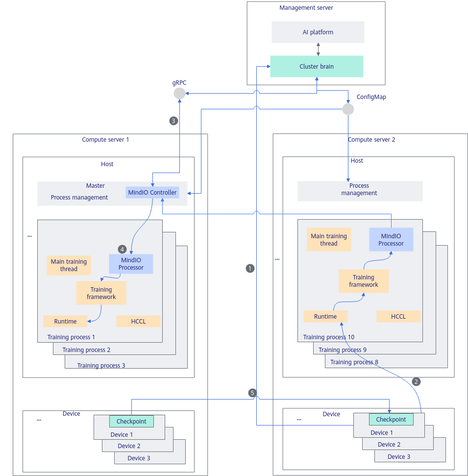

The steps in the figure are described as follows:

1. After an on-chip memory fault or network fault occurs on a device, the detection component of MindCluster on the server reports the fault information to the cluster brain, ClusterD.
2. The on-chip memory fault or network fault is detected by CANN and reported to MindIO Processor and MindIO Controller through the training framework.
3. MindIO Controller requests a decision from the cluster brain on whether to perform step-level recomputation recovery. The cluster brain makes a decision based on the health status of other nodes in the cluster.
4. MindIO Controller notifies the MindIO Processor in each training process, invokes the training framework to stop the job, repair the fault, and retain the communication domain information.
5. The NPU on the normal server transfers the checkpoint to the faulty (repaired) server through the parameter plane, resumes training after restoring the parameter state, and restarts the current step computation.

**Function Adaptation Points<a name="section1446615300284"></a>**

In process-level online recovery, the cluster brain identifies network faults and on-chip memory faults based on fault information, issues corresponding recovery policies, and supports recovery policy rollback. In the training container, the framework first initializes the MindIO service. After the service is started, the optimizer reports the corresponding status to MindIO during updates. Subsequently, a DP replica group and optimizer replicas are created to ensure redundant backup of model parameters. When an exception occurs, the fault mode is captured through an exception capture decorator. During recovery, operator resource cleanup, UCE model optimizer reconstruction, parameter plane online repair, and state rollback are performed for different faults to complete process-level online recovery.

For non-MindSpeed-LLM/MindCluster users, adapt the following functions on the framework.

**Table 3** Functions adapted for process-level online recovery for network faults

<a name="table19955141136101"></a>
<table><thead align="left"><tr id="row169591493619"><th class="cellrowborder" valign="top" width="18.61186118611861%" id="mcps1.2.5.1.1"><p id="p46603387387"><a name="p46603387387"></a><a name="p46603387387"></a>Function</p>
</th>
<th class="cellrowborder" valign="top" width="36.72367236723672%" id="mcps1.2.5.1.2"><p id="p176601638153816"><a name="p176601638153816"></a><a name="p176601638153816"></a>Description</p>
</th>
<th class="cellrowborder" valign="top" width="17.981798179817982%" id="mcps1.2.5.1.3"><p id="p1912785111610"><a name="p1912785111610"></a><a name="p1912785111610"></a>Adapted Component</p>
</th>
<th class="cellrowborder" valign="top" width="26.68266826682668%" id="mcps1.2.5.1.4"><p id="p4660113823812"><a name="p4660113823812"></a><a name="p4660113823812"></a>Reference Link</p>
</th>
</tr>
</thead>
<tbody><tr id="row199614191876"><td class="cellrowborder" valign="top" width="18.61186118611861%" headers="mcps1.2.5.1.1 "><p id="p174797321974"><a name="p174797321974"></a><a name="p174797321974"></a>Boot while initialization</p>
</td>
<td class="cellrowborder" valign="top" width="36.72367236723672%" headers="mcps1.2.5.1.2 "><p id="p1847910326710"><a name="p1847910326710"></a><a name="p1847910326710"></a>Launches the MindIO service during training framework initialization.</p>
</td>
<td class="cellrowborder" rowspan="5" valign="top" width="17.981798179817982%" headers="mcps1.2.5.1.3 "><p id="p12303135518715"><a name="p12303135518715"></a><a name="p12303135518715"></a>Distributed training framework</p>
</td>
<td class="cellrowborder" rowspan="5" valign="top" width="26.68266826682668%" headers="mcps1.2.5.1.4 "><p id="p1878873515913"><a name="p1878873515913"></a><a name="p1878873515913"></a><a href="../../references/fault_recovery_acceleration/03_usage_guidance.md#integrating-with-non-mindspeed-llm-frameworks">Integrating Non-MindSpeed-LLM Frameworks</a></p>
</td>
</tr>
<tr id="row149661916713"><td class="cellrowborder" valign="top" headers="mcps1.2.5.1.1 "><p id="p1947943212711"><a name="p1947943212711"></a><a name="p1947943212711"></a>Optimizer update status reporting</p>
</td>
<td class="cellrowborder" valign="top" headers="mcps1.2.5.1.2 "><p id="p04796323710"><a name="p04796323710"></a><a name="p04796323710"></a>Reports the start and end of optimizer updates before the optimizer updates.</p>
</td>
</tr>
<tr id="row1239411299541"><td class="cellrowborder" valign="top" headers="mcps1.2.5.1.1 "><p id="p94791332771"><a name="p94791332771"></a><a name="p94791332771"></a>Exception capture decorator</p>
</td>
<td class="cellrowborder" valign="top" headers="mcps1.2.5.1.2 "><p id="p5479103211720"><a name="p5479103211720"></a><a name="p5479103211720"></a>Uses an exception capture decorator to decorate the train function to capture fault modes.</p>
</td>
</tr>
<tr id="row13395629115418"><td class="cellrowborder" valign="top" headers="mcps1.2.5.1.1 "><p id="p17479113217716"><a name="p17479113217716"></a><a name="p17479113217716"></a>Operator resource cleanup</p>
</td>
<td class="cellrowborder" valign="top" headers="mcps1.2.5.1.2 "><p id="p10479532172"><a name="p10479532172"></a><a name="p10479532172"></a>Completes operator resource cleanup through callback functions.</p>
</td>
</tr>
<tr id="row7395142913549"><td class="cellrowborder" valign="top" headers="mcps1.2.5.1.1 "><p id="p1447912327718"><a name="p1447912327718"></a><a name="p1447912327718"></a>State rollback</p>
</td>
<td class="cellrowborder" valign="top" headers="mcps1.2.5.1.2 "><p id="p1847916321477"><a name="p1847916321477"></a><a name="p1847916321477"></a>Completes data iterator reconstruction and framework variable reset through callback functions.</p>
</td>
</tr>
<tr id="row539519296541"><td class="cellrowborder" valign="top" width="18.61186118611861%" headers="mcps1.2.5.1.1 "><p id="p114808324711"><a name="p114808324711"></a><a name="p114808324711"></a>Recovery policy decision</p>
</td>
<td class="cellrowborder" valign="top" width="36.72367236723672%" headers="mcps1.2.5.1.2 "><p id="p248011324715"><a name="p248011324715"></a><a name="p248011324715"></a>Identifies network faults or on-chip memory faults based on fault information, issues corresponding recovery policies, and supports recovery policy fallback.</p>
</td>
<td class="cellrowborder" rowspan="2" valign="top" width="17.981798179817982%" headers="mcps1.2.5.1.3 "><p id="p16303135517718"><a name="p16303135517718"></a><a name="p16303135517718"></a>AI platform</p>
</td>
<td class="cellrowborder" valign="top" width="26.68266826682668%" headers="mcps1.2.5.1.4 "><p id="p19472244965"><a name="p19472244965"></a><a name="p19472244965"></a><a href="https://gitcode.com/Ascend/mind-cluster/tree/branch_v26.0.0/component/clusterd/pkg/application/recover" target="_blank" rel="noopener noreferrer">Link</a></p>
</td>
</tr>
<tr id="row7396029145419"><td class="cellrowborder" valign="top" headers="mcps1.2.5.1.1 "><p id="p9480632573"><a name="p9480632573"></a><a name="p9480632573"></a>Scheduling of faulty Pods</p>
</td>
<td class="cellrowborder" valign="top" headers="mcps1.2.5.1.2 "><p id="p84806321578"><a name="p84806321578"></a><a name="p84806321578"></a>Schedules faulty Pods and supports scheduling recovery policy fallback.</p>
</td>
<td class="cellrowborder" valign="top" headers="mcps1.2.5.1.3 "><p id="p12472134412615"><a name="p12472134412615"></a><a name="p12472134412615"></a><a href="https://gitcode.com/Ascend/mind-cluster/tree/branch_v26.0.0/component/ascend-for-volcano/internal/rescheduling" target="_blank" rel="noopener noreferrer">Link</a></p>
</td>
</tr>
</tbody>
</table>

**Table 4** Functions adapted for process-level online recovery for on-chip memory faults

<a name="table14662336155516"></a>
<table><thead align="left"><tr id="row866213619553"><th class="cellrowborder" valign="top" width="17.119999999999997%" id="mcps1.2.5.1.1"><p id="p36629367550"><a name="p36629367550"></a><a name="p36629367550"></a>Function</p>
</th>
<th class="cellrowborder" valign="top" width="38.769999999999996%" id="mcps1.2.5.1.2"><p id="p6662103635520"><a name="p6662103635520"></a><a name="p6662103635520"></a>Description</p>
</th>
<th class="cellrowborder" valign="top" width="17.43%" id="mcps1.2.5.1.3"><p id="p1857674501116"><a name="p1857674501116"></a><a name="p1857674501116"></a>Adapted Component</p>
</th>
<th class="cellrowborder" valign="top" width="26.68%" id="mcps1.2.5.1.4"><p id="p966243617552"><a name="p966243617552"></a><a name="p966243617552"></a>Reference Link</p>
</th>
</tr>
</thead>
<tbody><tr id="row19662436145518"><td class="cellrowborder" valign="top" width="17.119999999999997%" headers="mcps1.2.5.1.1 "><p id="p339173741211"><a name="p339173741211"></a><a name="p339173741211"></a>Boot while initialization</p>
</td>
<td class="cellrowborder" valign="top" width="38.769999999999996%" headers="mcps1.2.5.1.2 "><p id="p1739537151219"><a name="p1739537151219"></a><a name="p1739537151219"></a>Launches the MindIO service during training framework initialization.</p>
</td>
<td class="cellrowborder" rowspan="9" valign="top" width="17.43%" headers="mcps1.2.5.1.3 "><p id="p9527145711216"><a name="p9527145711216"></a><a name="p9527145711216"></a>Distributed training framework</p>
</td>
<td class="cellrowborder" rowspan="9" valign="top" width="26.68%" headers="mcps1.2.5.1.4 "><p id="p7146223174212"><a name="p7146223174212"></a><a name="p7146223174212"></a><a href="../../references/fault_recovery_acceleration/03_usage_guidance.md#integrating-with-non-mindspeed-llm-frameworks">Integrating with Non-MindSpeed-LLM Frameworks</a></p>
</td>
</tr>
<tr id="row566215364551"><td class="cellrowborder" valign="top" headers="mcps1.2.5.1.1 "><p id="p23923716123"><a name="p23923716123"></a><a name="p23923716123"></a>Optimizer update status reporting</p>
</td>
<td class="cellrowborder" valign="top" headers="mcps1.2.5.1.2 "><p id="p11397374123"><a name="p11397374123"></a><a name="p11397374123"></a>Reports the start and end of optimizer updates before the optimizer updates.</p>
</td>
</tr>
<tr id="row06621936185512"><td class="cellrowborder" valign="top" headers="mcps1.2.5.1.1 "><p id="p639183714129"><a name="p639183714129"></a><a name="p639183714129"></a>DP replica group creation</p>
</td>
<td class="cellrowborder" valign="top" headers="mcps1.2.5.1.2 "><p id="p15391437141215"><a name="p15391437141215"></a><a name="p15391437141215"></a>Adds creation logic for dp_cp/dp_ep replica groups and gloo groups, creating related replica groups after the native Megatron distributed parallel groups are created.</p>
</td>
</tr>
<tr id="row2662133617558"><td class="cellrowborder" valign="top" headers="mcps1.2.5.1.1 "><p id="p73913781212"><a name="p73913781212"></a><a name="p73913781212"></a>Optimizer replica</p>
</td>
<td class="cellrowborder" valign="top" headers="mcps1.2.5.1.2 "><p id="p1039113741210"><a name="p1039113741210"></a><a name="p1039113741210"></a>Takes over and inherits related Megatron native optimizer functions, embedding MindIO optimizer replica management logic.</p>
</td>
</tr>
<tr id="row066213685511"><td class="cellrowborder" valign="top" headers="mcps1.2.5.1.1 "><p id="p143953791220"><a name="p143953791220"></a><a name="p143953791220"></a>Exception capture decorator</p>
</td>
<td class="cellrowborder" valign="top" headers="mcps1.2.5.1.2 "><p id="p203910376122"><a name="p203910376122"></a><a name="p203910376122"></a>Uses an exception capture decorator to decorate the train function to capture fault modes.</p>
</td>
</tr>
<tr id="row666243613555"><td class="cellrowborder" valign="top" headers="mcps1.2.5.1.1 "><p id="p1396379125"><a name="p1396379125"></a><a name="p1396379125"></a>Operator resource cleanup</p>
</td>
<td class="cellrowborder" valign="top" headers="mcps1.2.5.1.2 "><p id="p143993761219"><a name="p143993761219"></a><a name="p143993761219"></a>Completes operator resource cleanup via callback functions.</p>
</td>
</tr>
<tr id="row14662143645516"><td class="cellrowborder" valign="top" headers="mcps1.2.5.1.1 "><p id="p639113711122"><a name="p639113711122"></a><a name="p639113711122"></a>UCE model optimizer rebuilding</p>
</td>
<td class="cellrowborder" valign="top" headers="mcps1.2.5.1.2 "><p id="p83953718128"><a name="p83953718128"></a><a name="p83953718128"></a>Completes cleanup and rebuild operations for the model optimizer object on the faulty rank via callback functions.</p>
</td>
</tr>
<tr id="row43068171121"><td class="cellrowborder" valign="top" headers="mcps1.2.5.1.1 "><p id="p139737201218"><a name="p139737201218"></a><a name="p139737201218"></a>Online parameter plane repair</p>
</td>
<td class="cellrowborder" valign="top" headers="mcps1.2.5.1.2 "><p id="p539103711214"><a name="p539103711214"></a><a name="p539103711214"></a>Restores replica and recovery ranks via callback functions.</p>
</td>
</tr>
<tr id="row17307161715127"><td class="cellrowborder" valign="top" headers="mcps1.2.5.1.1 "><p id="p183923781214"><a name="p183923781214"></a><a name="p183923781214"></a>State rollback</p>
</td>
<td class="cellrowborder" valign="top" headers="mcps1.2.5.1.2 "><p id="p114017372126"><a name="p114017372126"></a><a name="p114017372126"></a>Completes data iterator rebuild and framework variable reset via callback functions.</p>
</td>
</tr>
<tr id="row966233613558"><td class="cellrowborder" valign="top" width="17.119999999999997%" headers="mcps1.2.5.1.1 "><p id="p114023721211"><a name="p114023721211"></a><a name="p114023721211"></a>Recovery policy decision</p>
</td>
<td class="cellrowborder" valign="top" width="38.769999999999996%" headers="mcps1.2.5.1.2 "><p id="p124083761213"><a name="p124083761213"></a><a name="p124083761213"></a>Identifies network faults or on-chip memory faults based on fault information, issues corresponding recovery policies, and supports recovery policy fallback.</p>
</td>
<td class="cellrowborder" rowspan="2" valign="top" width="17.43%" headers="mcps1.2.5.1.3 "><p id="p65272572124"><a name="p65272572124"></a><a name="p65272572124"></a>AI platform</p>
</td>
<td class="cellrowborder" valign="top" width="26.68%" headers="mcps1.2.5.1.4 "><p id="p14571125414116"><a name="p14571125414116"></a><a name="p14571125414116"></a><a href="https://gitcode.com/Ascend/mind-cluster/tree/branch_v26.0.0/component/clusterd/pkg/application/recover" target="_blank" rel="noopener noreferrer">Link</a></p>
</td>
</tr>
<tr id="row16621936105516"><td class="cellrowborder" valign="top" headers="mcps1.2.5.1.1 "><p id="p17407378128"><a name="p17407378128"></a><a name="p17407378128"></a>Scheduling of faulty Pods</p>
</td>
<td class="cellrowborder" valign="top" headers="mcps1.2.5.1.2 "><p id="p140173701218"><a name="p140173701218"></a><a name="p140173701218"></a>Schedules faulty Pods and supports scheduling recovery policy fallback.</p>
</td>
<td class="cellrowborder" valign="top" headers="mcps1.2.5.1.3 "><p id="p957195451114"><a name="p957195451114"></a><a name="p957195451114"></a><a href="https://gitcode.com/Ascend/mind-cluster/tree/branch_v26.0.0/component/ascend-for-volcano/internal/rescheduling" target="_blank" rel="noopener noreferrer">Link</a></p>
</td>
</tr>
</tbody>
</table>

### Operator-Level Online Recovery<a name="ZH-CN_TOPIC_0000002479386484"></a>

Atlas A3 training series products support HCCL performing communication operator retransmission when a parameter plane network fault occurs. With the faulty process not exiting, operator-level online recovery can tolerate longer network anomalies without interrupting the training job.

If the operator-level online recovery (HCCL communication operator re-execution) for the network fault fails, it falls back to process-level online recovery.

For key configuration procedures of operator-level online recovery, see [Configuring Operator-Level Online Recovery](./04_configuring_fault_handling_policies.md#configuring-operator-level-online-recovery).

>[!NOTE]
>HCCL (Huawei Collective Communication Library) is a distributed communication library designed by Huawei specifically for Ascend AI Processors. It aims to optimize efficient collaboration among multiple devices (such as NPU/GPU) to accelerate distributed training of deep learning models, making it suitable for AI scenarios requiring large-scale computing power. In distributed training, HCCL coordinates data synchronization (such as gradient aggregation and parameter update) among multiple Ascend AI Processors, reducing communication overhead and improving training efficiency.

**Usage Scenario<a name="section4314241154917"></a>**

Currently, the operator-level online recovery function is supported in the following two fault scenarios.

- For chip network-related faults,  if operator retransmission is successful, Volcano treats the current job as an unhealthy job. If operator retransmission fails, Volcano triggers rescheduling.
- For UnifiedBus device-related faults, after HCCL performs operator-level online recovery, Volcano treats the job as a sub-healthy job.

**Constraints<a name="section1915719315116"></a>**

- This feature does not support the scenario where MC2 is enabled.
- The watchdog function is not supported.

**Supported Products and Frameworks<a name="section996215473410"></a>**

**Table 1** Supported products and frameworks

<a name="table11647101624213"></a>
<table><thead align="left"><tr id="row17647111614214"><th class="cellrowborder" valign="top" width="33.333333333333336%" id="mcps1.2.4.1.1"><p id="p1664831610428"><a name="p1664831610428"></a><a name="p1664831610428"></a>Product Series</p>
</th>
<th class="cellrowborder" valign="top" width="33.29332933293329%" id="mcps1.2.4.1.2"><p id="p1664816167422"><a name="p1664816167422"></a><a name="p1664816167422"></a>Product Name</p>
</th>
<th class="cellrowborder" valign="top" width="33.373337333733375%" id="mcps1.2.4.1.3"><p id="p17648141664214"><a name="p17648141664214"></a><a name="p17648141664214"></a>Training Framework</p>
</th>
</tr>
</thead>
<tbody><tr id="row14649101615422"><td class="cellrowborder" valign="top" width="33.333333333333336%" headers="mcps1.2.4.1.1 "><p id="p8649101644216"><a name="p8649101644216"></a><a name="p8649101644216"></a><span id="ph96491216144210"><a name="ph96491216144210"></a><a name="ph96491216144210"></a>Atlas A3 training series products</span></p>
</td>
<td class="cellrowborder" valign="top" width="33.29332933293329%" headers="mcps1.2.4.1.2 "><p id="p10649816134219"><a name="p10649816134219"></a><a name="p10649816134219"></a><span id="ph264911612426"><a name="ph264911612426"></a><a name="ph264911612426"></a>Atlas 900 A3 SuperPoD cluster computing system</span></p>
</td>
<td class="cellrowborder" valign="top" width="33.373337333733375%" headers="mcps1.2.4.1.3 "><p id="p1664981614218"><a name="p1664981614218"></a><a name="p1664981614218"></a>-</p>
</td>
</tr>
</tbody>
</table>

**Operator-Level Online Recovery Principles<a name="section41453583611"></a>**

**Figure 1** Operator-level online recovery principles<a name="fig151851746103612"></a>
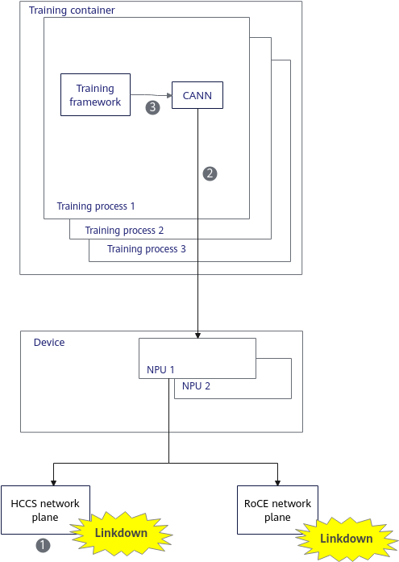

The details of each step are as follows:

1. During training, a linkdown fault occurs on the HCCS or RoCE network plane.
2. CANN detects the network fault. Once the current operator is terminated, the system attempts to recover the network link by switching BGP links on the HCCS plane or by enabling link failover communication on the RoCE network plane. After recovery, the network operator is re-executed.
3. After the operator is re-executed successfully, the training iteration resumes.

### Suspension and Switchback of Link Failover Communication <a name="ZH-CN_TOPIC_0000002479226530"></a>

For Atlas A3 training series products, MindCluster cluster scheduling components provide suspension and switchback functions for link failover communication of training jobs, allowing you to freely switch RoCE network ports used by NPUs during training via active link failover and switchback interfaces.

To learn about networking relationships of NPUs when this feature is used, see "Network Plane Introduction \> Parameter Plane Network \> [Port Interconnection Policy](https://support.huawei.com/enterprise/en/doc/EDOC1100570090/3e6a1479)" section of the *Ascend Training Solution Networking Guide (Atlas A3 Training Product)*.

For details about how to configure suspension and switchback of link failover communication, see [Configuring Suspension and Switchback of Link Failover Communication](./04_configuring_fault_handling_policies.md#configuring-suspension-and-switchback-for-link-failover-communication).

- Before calling the [link failover and switchback APIs](../../api/clusterd/08_link_failover_and_switchback_apis.md) to perform link failover and switchback, understand NPU networking first and ensure that the network link of the target NPU is normal. If the target NPU is in the linkdown state, the operation fails.
- The following uses the interface interconnection in the networking guide as an example to describe the `dev-op` mapping when the `SwitchNicTrack` API is called.
    1. If device 0 and device 8 are switched from QDD8 to QDD7, dev should be [device0, device8] and op should be [true, true].
    2. If device 0 and device 8 are switched back from QDD7 to QDD8, dev should be [device0, device8] and op should be [false, false].
    3. If device 0 is switched from PortA of QDD8 to PortA of QDD7, dev should be [device0] and op should be [true].
    4. If device 0 is switched back from PortA of QDD7 to PortA of QDD8, dev should be [device0] and op should be [false].
    5. If devices of leaf 1 are switched to leaf 2, dev should be [device0, device8, device2, device10, device4, device12, device6, device14] and op should be [true, true, true, true, true, true, true, true].
    6. If all devices of leaf 2 are switched back to leaf 1, dev should be [device0, device8, device2, device10, device4, device12, device6, device14] and op should be [false, false, false, false, false, false, false, false].

    **Figure 1**  Port interconnection relationship
<a name="fig111354543222"></a>
    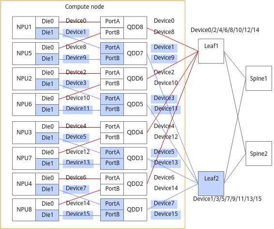

**Usage Scenario<a name="section14336140104818"></a>**

Currently, this feature can be used in the following two scenarios:

- Switch upgrade: Link failover is manually triggered to upgrade switches. After that, links are switched back.
- Troubleshooting: After the faulty port where link failover occurs is recovered, manually switch back links.

**Constraints<a name="section620412554441"></a>**

- Issue link failover or switchback command after the training iteration is normal.
- Ensure that process-level recovery is enabled.
- Currently not supported in IPv6 scenarios.
- Only supports RoCE communication between Pods.

**Supported Products and Frameworks<a name="zh-cn_topic_0000002098609234_section4771115416256"></a>**

**Table 1**  Supported products and frameworks

<a name="zh-cn_topic_0000002098609234_table1526819106465"></a>
<table><thead align="left"><tr id="zh-cn_topic_0000002098609234_row22681310134611"><th class="cellrowborder" valign="top" width="33.333333333333336%" id="mcps1.2.4.1.1"><p id="zh-cn_topic_0000002098609234_p137295354447"><a name="zh-cn_topic_0000002098609234_p137295354447"></a><a name="zh-cn_topic_0000002098609234_p137295354447"></a>Product Series</p>
</th>
<th class="cellrowborder" valign="top" width="33.29332933293329%" id="mcps1.2.4.1.2"><p id="zh-cn_topic_0000002098609234_p1172993554412"><a name="zh-cn_topic_0000002098609234_p1172993554412"></a><a name="zh-cn_topic_0000002098609234_p1172993554412"></a>Product Name</p>
</th>
<th class="cellrowborder" valign="top" width="33.373337333733375%" id="mcps1.2.4.1.3"><p id="zh-cn_topic_0000002098609234_p97299357449"><a name="zh-cn_topic_0000002098609234_p97299357449"></a><a name="zh-cn_topic_0000002098609234_p97299357449"></a>Training Framework</p>
</th>
</tr>
</thead>
<tbody><tr id="zh-cn_topic_0000002098609234_row71691214122315"><td class="cellrowborder" valign="top" width="33.333333333333336%" headers="mcps1.2.4.1.1 "><p id="zh-cn_topic_0000002098609234_p112681620231"><a name="zh-cn_topic_0000002098609234_p112681620231"></a><a name="zh-cn_topic_0000002098609234_p112681620231"></a><span id="zh-cn_topic_0000002098609234_ph9126121617231"><a name="zh-cn_topic_0000002098609234_ph9126121617231"></a><a name="zh-cn_topic_0000002098609234_ph9126121617231"></a>Atlas A3 training series products</span></p>
</td>
<td class="cellrowborder" valign="top" width="33.29332933293329%" headers="mcps1.2.4.1.2 "><a name="ul13725194132419"></a><a name="ul13725194132419"></a><ul id="ul13725194132419"><li><span id="ph077885871817"><a name="ph077885871817"></a><a name="ph077885871817"></a>Atlas 900 A3 SuperPoD</span></li><li><span id="ph10355115144111"><a name="ph10355115144111"></a><a name="ph10355115144111"></a>Atlas 800T A3 SuperPoD server</span></li></ul>
</td>
<td class="cellrowborder" valign="top" width="33.373337333733375%" headers="mcps1.2.4.1.3 "><a name="ul7583132019396"></a><a name="ul7583132019396"></a><ul id="ul7583132019396"><li><span id="ph135835207394"><a name="ph135835207394"></a><a name="ph135835207394"></a>MindSpore</span></li></ul>
<a name="ul75831320173911"></a><a name="ul75831320173911"></a><ul id="ul75831320173911"><li><span id="ph13583142013394"><a name="ph13583142013394"></a><a name="ph13583142013394"></a>PyTorch</span></li></ul>
</td>
</tr>
</tbody>
</table>

**Principles of Suspension and Switchback of Link Failover Communication<a name="section56986212179"></a>**

**Figure 2** Principles <a name="fig9336113210132"></a>
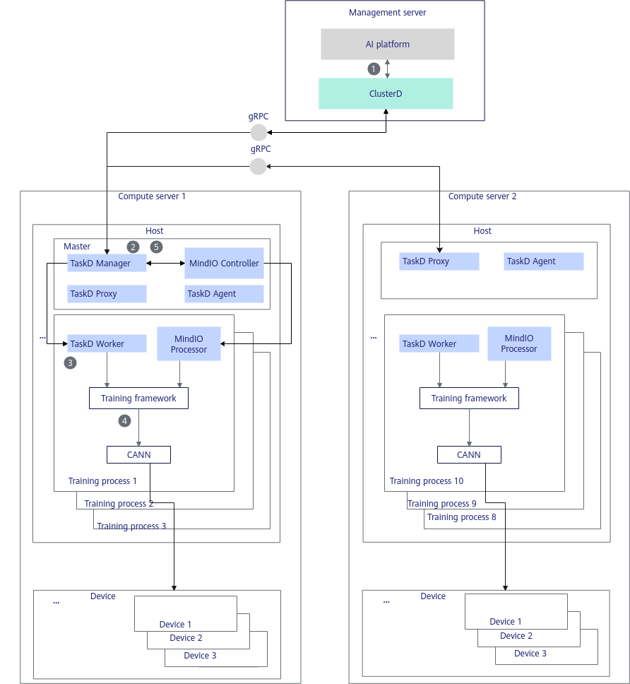

The details of each step are as follows:

1. The AI platform integrates ClusterD and calls the gRPC interface of ClusterD to issue a failover operation, specifying the NPUs to be switched.
2. ClusterD notifies MindIO to pause training.
3. TaskD Manager notifies all TaskD Workers to call the training framework interface to perform the failover operation.
4. The training framework calls the CANN interfaces one by one according to the communication domain to perform the failover operation.
5. After ClusterD determines that the failover operation for all NPUs is complete, TaskD notifies MindIO to continue executing the next training step after the switchover.

**Function Adaptation Points<a name="section1446615300284"></a>**

During suspension and switchback of link failover communication, the framework initializes the MindIO service. After the service is started, the optimizer updates the corresponding status to MindIO. The graceful suspension mechanism is called for job suspension and failover. The cluster brain needs to provide an external interface to receive failover instructions and manage the link failover communication process.

For non-MindSpeed-LLM/MindCluster users, adapt the following functions as listed in  [Table 2](#table19955141136102).

**Table 2** Functions adapted for suspension and switchback of link failover communication

<a name="table19955141136102"></a>
<table><thead align="left"><tr id="row169591493619"><th class="cellrowborder" valign="top" width="18.87%" id="mcps1.2.5.1.1"><p id="p46603387387"><a name="p46603387387"></a><a name="p46603387387"></a>Function</p>
</th>
<th class="cellrowborder" valign="top" width="43.419999999999995%" id="mcps1.2.5.1.2"><p id="p176601638153816"><a name="p176601638153816"></a><a name="p176601638153816"></a>Description</p>
</th>
<th class="cellrowborder" valign="top" width="14.719999999999999%" id="mcps1.2.5.1.3"><p id="p10978953142414"><a name="p10978953142414"></a><a name="p10978953142414"></a>Adaptated Component</p>
</th>
<th class="cellrowborder" valign="top" width="22.99%" id="mcps1.2.5.1.4"><p id="p4660113823812"><a name="p4660113823812"></a><a name="p4660113823812"></a>Reference Link</p>
</th>
</tr>
</thead>
<tbody><tr id="row893618158397"><td class="cellrowborder" valign="top" width="18.87%" headers="mcps1.2.5.1.1 "><p id="p1987424102519"><a name="p1987424102519"></a><a name="p1987424102519"></a>Boot while initialization</p>
</td>
<td class="cellrowborder" valign="top" width="43.419999999999995%" headers="mcps1.2.5.1.2 "><p id="p14351731182511"><a name="p14351731182511"></a><a name="p14351731182511"></a>Launches the MindIO service during training framework initialization.</p>
</td>
<td class="cellrowborder" rowspan="3" valign="top" width="14.719999999999999%" headers="mcps1.2.5.1.3 "><p id="p922524114255"><a name="p922524114255"></a><a name="p922524114255"></a>Distributed training framework</p>
</td>
<td class="cellrowborder" rowspan="3" valign="top" width="22.99%" headers="mcps1.2.5.1.4 "><p id="p7146223174212"><a name="p7146223174212"></a><a name="p7146223174212"></a><a href="../../references/fault_recovery_acceleration/03_usage_guidance.md#integrating-with-non-mindspeed-llm-frameworks">Integrating with Non-MindSpeed-LLM Frameworks</a></p>
</td>
</tr>
<tr id="row1793717157396"><td class="cellrowborder" valign="top" headers="mcps1.2.5.1.1 "><p id="p9871924102517"><a name="p9871924102517"></a><a name="p9871924102517"></a>Optimizer update status reporting</p>
</td>
<td class="cellrowborder" valign="top" headers="mcps1.2.5.1.2 "><p id="p16810326255"><a name="p16810326255"></a><a name="p16810326255"></a>Reports the start and end of the optimizer update before the optimizer updates.</p>
</td>
</tr>
<tr id="row193701523914"><td class="cellrowborder" valign="top" headers="mcps1.2.5.1.1 "><p id="p12878242257"><a name="p12878242257"></a><a name="p12878242257"></a>Graceful suspension</p>
</td>
<td class="cellrowborder" valign="top" headers="mcps1.2.5.1.2 "><p id="p687122472518"><a name="p687122472518"></a><a name="p687122472518"></a>Adds a MindIO function call at the end of the training iteration loop to implement active suspension.</p>
</td>
</tr>
<tr id="row1297881015253"><td class="cellrowborder" valign="top" width="18.87%" headers="mcps1.2.5.1.1 "><p id="p168711249252"><a name="p168711249252"></a><a name="p168711249252"></a>Link failover management</p>
</td>
<td class="cellrowborder" valign="top" width="43.419999999999995%" headers="mcps1.2.5.1.2 "><p id="p168762416258"><a name="p168762416258"></a><a name="p168762416258"></a> Delivers link failover requests and control the suspension and restart of training processes.</p>
</td>
<td class="cellrowborder" valign="top" width="14.719999999999999%" headers="mcps1.2.5.1.3 "><p id="p10461144315257"><a name="p10461144315257"></a><a name="p10461144315257"></a>AI platform</p>
</td>
<td class="cellrowborder" valign="top" width="22.99%" headers="mcps1.2.5.1.4 "><p id="p10979110172511"><a name="p10979110172511"></a><a name="p10979110172511"></a><a href="https://gitcode.com/Ascend/mind-cluster/blob/branch_v26.0.0/component/clusterd/pkg/application/recover/om_controller.go" target="_blank" rel="noopener noreferrer">Link</a></p>
</td>
</tr>
</tbody>
</table>

### (Optional) Graceful Fault Tolerance<a name="ZH-CN_TOPIC_0000002479226564"></a>

> [!NOTE]
> This function has been deprecated. It will not be supported in PyTorch versions beyond 7.2.RC1 and MindSpore versions beyond 7.1.RC1.

You can enable graceful fault tolerance if no backup resources are available for training jobs or if you expect a device to automatically recover. That is, if a processor is faulty during training, the system attempts to automatically recover the faulty processor. If it can be recovered, the system starts the job to continue the training while the pod is still running. If the fault persists, the system rolls back to the rescheduling mode.

Graceful fault tolerance can automatically recover the faulty device without resource scheduling. However, it cannot reduce the recovery time during training initialization. Generally, the recovery time required by graceful fault tolerance is longer than that required by process-level rescheduling and process-level online recovery.

To understand the key configuration procedure for graceful fault tolerance, see [Configuring Graceful Fault Tolerance](./04_configuring_fault_handling_policies.md#configuring-graceful-fault-tolerance).

**Constraints**<a name="zh-cn_topic_0000002098609234_section1137610139461"></a>

- Currently, graceful fault tolerance is only supported for chip faults.
- Graceful fault tolerance cannot be enabled simultaneously with process-level rescheduling or process-level online recovery. If both are enabled, resumable training will recover the training through Job-level rescheduling.
- IPv6 scenarios are not supported yet.

**Supported Product Models and AI Frameworks<a name="zh-cn_topic_0000002098609234_section4771115416256"></a>**

**Table 1** Products and frameworks that support graceful fault tolerance

<a name="zh-cn_topic_0000002098609234_table1526819106465"></a>
<table><thead align="left"><tr id="zh-cn_topic_0000002098609234_row22681310134611"><th class="cellrowborder" valign="top" width="33.333333333333336%" id="mcps1.2.4.1.1"><p id="zh-cn_topic_0000002098609234_p137295354447"><a name="zh-cn_topic_0000002098609234_p137295354447"></a><a name="zh-cn_topic_0000002098609234_p137295354447"></a>Product Series</p>
</th>
<th class="cellrowborder" valign="top" width="33.29332933293329%" id="mcps1.2.4.1.2"><p id="zh-cn_topic_0000002098609234_p1172993554412"><a name="zh-cn_topic_0000002098609234_p1172993554412"></a><a name="zh-cn_topic_0000002098609234_p1172993554412"></a>Product Name</p>
</th>
<th class="cellrowborder" valign="top" width="33.373337333733375%" id="mcps1.2.4.1.3"><p id="zh-cn_topic_0000002098609234_p97299357449"><a name="zh-cn_topic_0000002098609234_p97299357449"></a><a name="zh-cn_topic_0000002098609234_p97299357449"></a>Training Framework</p>
</th>
</tr>
</thead>
<tbody><tr id="zh-cn_topic_0000002098609234_row17268131014613"><td class="cellrowborder" valign="top" width="33.333333333333336%" headers="mcps1.2.4.1.1 "><p id="zh-cn_topic_0000002098609234_p889791444417"><a name="zh-cn_topic_0000002098609234_p889791444417"></a><a name="zh-cn_topic_0000002098609234_p889791444417"></a><span id="zh-cn_topic_0000002098609234_ph289810142442"><a name="zh-cn_topic_0000002098609234_ph289810142442"></a><a name="zh-cn_topic_0000002098609234_ph289810142442"></a>Atlas training series products</span></p>
</td>
<td class="cellrowborder" valign="top" width="33.29332933293329%" headers="mcps1.2.4.1.2 "><a name="zh-cn_topic_0000002039353153_ul17412295261"></a><a name="zh-cn_topic_0000002039353153_ul17412295261"></a><ul id="zh-cn_topic_0000002039353153_ul17412295261"><li><span id="ph1638757114220"><a name="ph1638757114220"></a><a name="ph1638757114220"></a>Atlas 800 training server (model 9000)</span></li><li><span id="zh-cn_topic_0000002039194017_ph1627888115712"><a name="zh-cn_topic_0000002039194017_ph1627888115712"></a><a name="zh-cn_topic_0000002039194017_ph1627888115712"></a>Atlas 800 training server (model 9010)</span></li></ul>
</td>
<td class="cellrowborder" valign="top" width="33.373337333733375%" headers="mcps1.2.4.1.3 "><a name="zh-cn_topic_0000002098609234_ul1381333331316"></a><a name="zh-cn_topic_0000002098609234_ul1381333331316"></a><ul id="zh-cn_topic_0000002098609234_ul1381333331316"><li><span id="zh-cn_topic_0000002098609234_ph1246144904420"><a name="zh-cn_topic_0000002098609234_ph1246144904420"></a><a name="zh-cn_topic_0000002098609234_ph1246144904420"></a>MindSpore</span></li></ul>
<a name="zh-cn_topic_0000002098609234_ul10570112811135"></a><a name="zh-cn_topic_0000002098609234_ul10570112811135"></a><ul id="zh-cn_topic_0000002098609234_ul10570112811135"><li><span id="zh-cn_topic_0000002098609234_ph473115306133"><a name="zh-cn_topic_0000002098609234_ph473115306133"></a><a name="zh-cn_topic_0000002098609234_ph473115306133"></a>PyTorch</span></li></ul>
</td>
</tr>
<tr id="zh-cn_topic_0000002098609234_row181221631185611"><td class="cellrowborder" valign="top" width="33.333333333333336%" headers="mcps1.2.4.1.1 "><p id="zh-cn_topic_0000002098609234_p128991832165620"><a name="zh-cn_topic_0000002098609234_p128991832165620"></a><a name="zh-cn_topic_0000002098609234_p128991832165620"></a><span id="zh-cn_topic_0000002098609234_ph13899123211565"><a name="zh-cn_topic_0000002098609234_ph13899123211565"></a><a name="zh-cn_topic_0000002098609234_ph13899123211565"></a>Atlas A2 training series products</span></p>
<p id="p96481557151918"><a name="p96481557151918"></a><a name="p96481557151918"></a></p>
</td>
<td class="cellrowborder" valign="top" width="33.29332933293329%" headers="mcps1.2.4.1.2 "><a name="zh-cn_topic_0000002098609234_ul13899193245613"></a><a name="zh-cn_topic_0000002098609234_ul13899193245613"></a><ul id="zh-cn_topic_0000002098609234_ul13899193245613"><li><span id="ph157633217501"><a name="ph157633217501"></a><a name="ph157633217501"></a>Atlas 800T A2 training server</span></li><li><span id="zh-cn_topic_0000002098609234_ph189001332105615"><a name="zh-cn_topic_0000002098609234_ph189001332105615"></a><a name="zh-cn_topic_0000002098609234_ph189001332105615"></a>Atlas 900 A2 PoD cluster basic unit</span></li></ul>
</td>
<td class="cellrowborder" valign="top" width="33.373337333733375%" headers="mcps1.2.4.1.3 "><a name="zh-cn_topic_0000002098609234_ul664419915495"></a><a name="zh-cn_topic_0000002098609234_ul664419915495"></a><ul id="zh-cn_topic_0000002098609234_ul664419915495"><li><span id="zh-cn_topic_0000002098609234_ph146444924919"><a name="zh-cn_topic_0000002098609234_ph146444924919"></a><a name="zh-cn_topic_0000002098609234_ph146444924919"></a>MindSpore</span></li></ul>
<a name="zh-cn_topic_0000002098609234_ul36445934915"></a><a name="zh-cn_topic_0000002098609234_ul36445934915"></a><ul id="zh-cn_topic_0000002098609234_ul36445934915"><li><span id="zh-cn_topic_0000002098609234_ph364489174917"><a name="zh-cn_topic_0000002098609234_ph364489174917"></a><a name="zh-cn_topic_0000002098609234_ph364489174917"></a>PyTorch</span></li></ul>
</td>
</tr>
<tr id="zh-cn_topic_0000002098609234_row71691214122315"><td class="cellrowborder" valign="top" width="33.333333333333336%" headers="mcps1.2.4.1.1 "><p id="zh-cn_topic_0000002098609234_p112681620231"><a name="zh-cn_topic_0000002098609234_p112681620231"></a><a name="zh-cn_topic_0000002098609234_p112681620231"></a><span id="zh-cn_topic_0000002098609234_ph9126121617231"><a name="zh-cn_topic_0000002098609234_ph9126121617231"></a><a name="zh-cn_topic_0000002098609234_ph9126121617231"></a>Atlas A3 training series products</span></p>
</td>
<td class="cellrowborder" valign="top" width="33.29332933293329%" headers="mcps1.2.4.1.2 "><a name="ul13725194132419"></a><a name="ul13725194132419"></a><ul id="ul13725194132419"><li><span id="ph077885871817"><a name="ph077885871817"></a><a name="ph077885871817"></a>Atlas 900 A3 SuperPoD</span></li><li><span id="ph10355115144111"><a name="ph10355115144111"></a><a name="ph10355115144111"></a>Atlas 800T A3 SuperPoD server</span></li></ul>
</td>
<td class="cellrowborder" valign="top" width="33.373337333733375%" headers="mcps1.2.4.1.3 "><a name="ul7583132019396"></a><a name="ul7583132019396"></a><ul id="ul7583132019396"><li><span id="ph135835207394"><a name="ph135835207394"></a><a name="ph135835207394"></a>MindSpore</span></li></ul>
<a name="ul75831320173911"></a><a name="ul75831320173911"></a><ul id="ul75831320173911"><li><span id="ph13583142013394"><a name="ph13583142013394"></a><a name="ph13583142013394"></a>PyTorch</span></li></ul>
</td>
</tr>
</tbody>
</table>

**Graceful Fault Tolerance Principles<a name="zh-cn_topic_0000002098609234_section882584011262"></a>**

If rescheduling is triggered during node or processor fault handling, O&M personnel need to manually restore the faulty device. If it is not restored in a timely manner, a large number of scattered faults may occur in a training cluster, reducing the cluster computing power utilization. Therefore, graceful fault tolerance is added for resumable training to optimize the fault tolerance capability of NPUs for some faults.

These NPU faults can be rectified by exiting the training processes and performing hot resets on the NPUs. The graceful fault tolerance mode is designed to handle such faults and does not require job rescheduling.

Ascend Device Plugin reports faults and recovers devices. The management process (Elastic Agent for PyTorch and TaskD for MindSpore) stops and restarts training processes based on the information reported by Ascend Device Plugin to complete fault recovery. If faults cannot be recovered, the rescheduling mode is used again. To integrate the graceful fault tolerance mode, add a management process to the service container. The management process must have the capabilities of detecting faults, stopping training jobs, and restarting training jobs.

In graceful fault tolerance mode, a fault is directly reported to the management process in the service container (usually by mounting a file). The management process in the container then reads the fault file to obtain specific fault information. The process of obtaining fault information is shown in [Figure 1](#zh-cn_topic_0000002098609234_fig135111361314).

**Figure 1**  Obtaining fault information<a name="zh-cn_topic_0000002098609234_fig135111361314"></a>
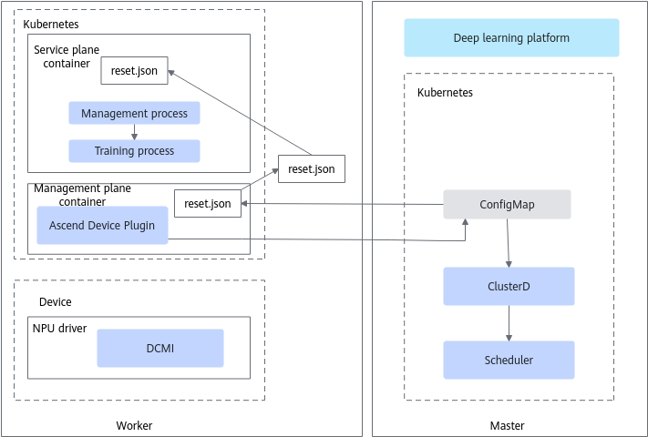

Faults are classified into four types in graceful fault tolerance mode: no handling required, service re-execution required, processor reset required, and rescheduling required. The handling for each fault type is shown in [Figure 2](#zh-cn_topic_0000002098609234_fig12620181591012).

**Figure 2**  Graceful fault tolerance fault handling process<a name="zh-cn_topic_0000002098609234_fig12620181591012"></a>
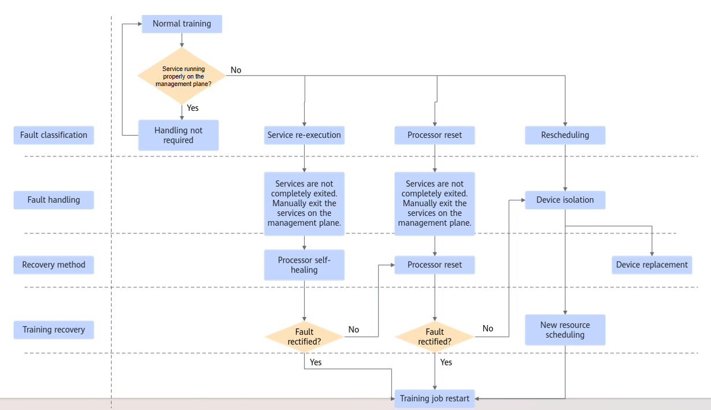

### Online Stress Testing<a name="ZH-CN_TOPIC_0000002479226572"></a>

MindCluster supports online stress tests during training. That is, you can call the online stress testing interface to suspend a specified training job and perform hardware P2P or AIC stress tests on the nodes running the job. If no fault exists, training resumes. If a fault exists, the faulty node is isolated and resumable training is triggered.

**Constraints<a name="zh-cn_topic_0000002039194017_section1178044918127"></a>**

- For the PyTorch training framework, MindSpeed-LLM 2.3.0 is required. For version compatibility, see [MindSpeed-LLM](https://gitcode.com/Ascend/MindSpeed-LLM/tree/2.3.0).
- For the MindSpore training framework, MindFormers master version is required. For version compatibility, see [MindSpore MindFormers](https://gitcode.com/mindspore/mindformers/tree/master).
- Issue online stress testing commands only after training has entered normal iteration.
- Ensure that process-level recovery features are enabled.
- Restarting ClusterD is not supported during stress testing. If ClusterD restarts abnormally, you need to restart the training and re-issue the stress testing task.
- The hot reset function must be disabled during stress testing.
- For P2P stress testing, ensure that the device side has more than 10 GB of free memory.
- You need to add the `nodeDEnable=on` label to the node to ensure that the node undergoing stress testing can be isolated.
- For the MindSpore training framework, you need to set `export TASKD_PROCESS_ENABLE="on"` before starting the TaskD Manager.
- Usage in IPv6 scenarios is not supported currently.

**Supported Product Models and AI Frameworks<a name="zh-cn_topic_0000002039194017_section140112935318"></a>**

**Table 1** Products and frameworks that support online stress testing

<a name="zh-cn_topic_0000002039194017_table6198201175416"></a>
<table><thead align="left"><tr id="zh-cn_topic_0000002039194017_row111997118547"><th class="cellrowborder" valign="top" width="25.172517251725168%" id="mcps1.2.4.1.1"><p id="zh-cn_topic_0000002039194017_p91998117543"><a name="zh-cn_topic_0000002039194017_p91998117543"></a><a name="zh-cn_topic_0000002039194017_p91998117543"></a>Product Type</p>
</th>
<th class="cellrowborder" valign="top" width="43.834383438343835%" id="mcps1.2.4.1.2"><p id="zh-cn_topic_0000002039194017_p3199161115419"><a name="zh-cn_topic_0000002039194017_p3199161115419"></a><a name="zh-cn_topic_0000002039194017_p3199161115419"></a>Hardware Form</p>
</th>
<th class="cellrowborder" valign="top" width="30.993099309930994%" id="mcps1.2.4.1.3"><p id="zh-cn_topic_0000002039194017_p5199011125416"><a name="zh-cn_topic_0000002039194017_p5199011125416"></a><a name="zh-cn_topic_0000002039194017_p5199011125416"></a>Training Framework</p>
</th>
</tr>
</thead>
<tbody><tr id="zh-cn_topic_0000002039194017_row920001115417"><td class="cellrowborder" valign="top" width="25.172517251725168%" headers="mcps1.2.4.1.1 "><p id="zh-cn_topic_0000002039194017_p192011311155411"><a name="zh-cn_topic_0000002039194017_p192011311155411"></a><a name="zh-cn_topic_0000002039194017_p192011311155411"></a><span id="ph2314323124211"><a name="ph2314323124211"></a><a name="ph2314323124211"></a><term id="zh-cn_topic_0000001519959665_term57208119917"><a name="zh-cn_topic_0000001519959665_term57208119917"></a><a name="zh-cn_topic_0000001519959665_term57208119917"></a>Atlas A2 training series products</term></span></p>
<p id="p773278122616"><a name="p773278122616"></a><a name="p773278122616"></a></p>
</td>
<td class="cellrowborder" valign="top" width="43.834383438343835%" headers="mcps1.2.4.1.2 "><p id="p17354133423610"><a name="p17354133423610"></a><a name="p17354133423610"></a><span id="ph14314162316427"><a name="ph14314162316427"></a><a name="ph14314162316427"></a>Atlas 800T A2 training server</span></p>
</td>
<td class="cellrowborder" valign="top" width="30.993099309930994%" headers="mcps1.2.4.1.3 "><a name="ul15879359132214"></a><a name="ul15879359132214"></a><ul id="ul15879359132214"><li><span id="ph135835207394"><a name="ph135835207394"></a><a name="ph135835207394"></a>MindSpore</span></li><li><span id="ph19425111582712"><a name="ph19425111582712"></a><a name="ph19425111582712"></a>PyTorch</span></li></ul>
</td>
</tr>
<tr id="zh-cn_topic_0000002039194017_row13204101125410"><td class="cellrowborder" valign="top" width="25.172517251725168%" headers="mcps1.2.4.1.1 "><p id="zh-cn_topic_0000002039194017_p172044116542"><a name="zh-cn_topic_0000002039194017_p172044116542"></a><a name="zh-cn_topic_0000002039194017_p172044116542"></a><span id="ph531432344210"><a name="ph531432344210"></a><a name="ph531432344210"></a><term id="zh-cn_topic_0000001519959665_term26764913715"><a name="zh-cn_topic_0000001519959665_term26764913715"></a><a name="zh-cn_topic_0000001519959665_term26764913715"></a>Atlas A3 training series products</term></span></p>
</td>
<td class="cellrowborder" valign="top" width="43.834383438343835%" headers="mcps1.2.4.1.2 "><p id="p4897194703620"><a name="p4897194703620"></a><a name="p4897194703620"></a><span id="ph077885871817"><a name="ph077885871817"></a><a name="ph077885871817"></a>Atlas 900 A3 SuperPoD</span></p>
</td>
<td class="cellrowborder" valign="top" width="30.993099309930994%" headers="mcps1.2.4.1.3 "><a name="ul13821123132320"></a><a name="ul13821123132320"></a><ul id="ul13821123132320"><li><span id="ph19127156230"><a name="ph19127156230"></a><a name="ph19127156230"></a>MindSpore</span></li><li><span id="ph310231710274"><a name="ph310231710274"></a><a name="ph310231710274"></a>PyTorch</span></li></ul>
</td>
</tr>
</tbody>
</table>

**Online Stress Testing Principles<a name="section56986212179"></a>**

**Figure 1** Schematic diagram<a name="fig9336113210132"></a>


The details of each step are as follows:

1. The AI platform integrates ClusterD, calls the gRPC interface of ClusterD to deliver stress testing operations, and specifies the nodes to be tested.
2. ClusterD notifies MindIO to suspend training.
3. TaskD Manager notifies the specified TaskD Worker to call the training framework interface to perform stress testing.
4. The training framework calls the CANN interface on the specified NPU to perform stress testing.
5. After ClusterD determines that the stress testing on the specified NPU is complete, TaskD notifies MindIO to continue executing the next training step after the stress testing is finished.

**Function Adaptation Points<a name="section1446615300284"></a>**

During online stress testing, the framework initializes the MindIO service. After the service is started, the optimizer updates the corresponding status to MindIO. The graceful suspension mechanism is called for job suspension. After the suspension, a hardware stress test is performed. After the test is complete, training continues. The cluster brain needs to provide an external interface to receive stress test instructions and manage the stress test process.

For non-MindSpeed-LLM/MindCluster users, adapt the following functions as listed in [Table 2](#table19955141136103).

**Table 2** Functions adapted for online stress testing

<a name="table19955141136103"></a>
<table><thead align="left"><tr id="row169591493619"><th class="cellrowborder" valign="top" width="18.98%" id="mcps1.2.5.1.1"><p id="p46603387387"><a name="p46603387387"></a><a name="p46603387387"></a>Function</p>
</th>
<th class="cellrowborder" valign="top" width="39.26%" id="mcps1.2.5.1.2"><p id="p176601638153816"><a name="p176601638153816"></a><a name="p176601638153816"></a>Description</p>
</th>
<th class="cellrowborder" valign="top" width="18.01%" id="mcps1.2.5.1.3"><p id="p106021527183014"><a name="p106021527183014"></a><a name="p106021527183014"></a>Adapted Component</p>
</th>
<th class="cellrowborder" valign="top" width="23.75%" id="mcps1.2.5.1.4"><p id="p4660113823812"><a name="p4660113823812"></a><a name="p4660113823812"></a>Reference Link</p>
</th>
</tr>
</thead>
<tbody><tr id="row893618158397"><td class="cellrowborder" valign="top" width="18.98%" headers="mcps1.2.5.1.1 "><p id="p0609650313"><a name="p0609650313"></a><a name="p0609650313"></a>Boot while initialization</p>
</td>
<td class="cellrowborder" valign="top" width="39.26%" headers="mcps1.2.5.1.2 "><p id="p195191085319"><a name="p195191085319"></a><a name="p195191085319"></a>Launches the MindIO service during training framework initialization.</p>
</td>
<td class="cellrowborder" rowspan="3" valign="top" width="18.01%" headers="mcps1.2.5.1.3 "><p id="p1855311819317"><a name="p1855311819317"></a><a name="p1855311819317"></a>Distributed training framework</p>
</td>
<td class="cellrowborder" rowspan="3" valign="top" width="23.75%" headers="mcps1.2.5.1.4 "><p id="p10701822403"><a name="p10701822403"></a><a name="p10701822403"></a><a href="../../references/fault_recovery_acceleration/03_usage_guidance.md#integrating-with-non-mindspeed-llm-frameworks">Integrating with Non-MindSpeed-LLM Frameworks</a></p>
</td>
</tr>
<tr id="row1793717157396"><td class="cellrowborder" valign="top" headers="mcps1.2.5.1.1 "><p id="p1960918515317"><a name="p1960918515317"></a><a name="p1960918515317"></a>Optimizer update status reporting</p>
</td>
<td class="cellrowborder" valign="top" headers="mcps1.2.5.1.2 "><p id="p156091533120"><a name="p156091533120"></a><a name="p156091533120"></a>Reports the start and end of optimizer updates before the optimizer updates.</p>
</td>
</tr>
<tr id="row193701523914"><td class="cellrowborder" valign="top" headers="mcps1.2.5.1.1 "><p id="p76093513110"><a name="p76093513110"></a><a name="p76093513110"></a>Graceful suspension</p>
</td>
<td class="cellrowborder" valign="top" headers="mcps1.2.5.1.2 "><p id="p136091519311"><a name="p136091519311"></a><a name="p136091519311"></a>Adds a MindIO function call at the end of the training iteration loop to implement the active pause functionality.</p>
</td>
</tr>
<tr id="row46026594305"><td class="cellrowborder" valign="top" width="18.98%" headers="mcps1.2.5.1.1 "><p id="p26091514318"><a name="p26091514318"></a><a name="p26091514318"></a>Online stress testing management</p>
</td>
<td class="cellrowborder" valign="top" width="39.26%" headers="mcps1.2.5.1.2 "><p id="p14609155183114"><a name="p14609155183114"></a><a name="p14609155183114"></a>Provides the capability to issue online stress testing requests, controlling the pause and resume of the training process.</p>
</td>
<td class="cellrowborder" valign="top" width="18.01%" headers="mcps1.2.5.1.3 "><p id="p6553121803118"><a name="p6553121803118"></a><a name="p6553121803118"></a>AI platform</p>
</td>
<td class="cellrowborder" valign="top" width="23.75%" headers="mcps1.2.5.1.4 "><p id="p1660265933015"><a name="p1660265933015"></a><a name="p1660265933015"></a><a href="https://gitcode.com/Ascend/mind-cluster/blob/branch_v26.0.0/component/clusterd/pkg/application/recover/om_controller.go" target="_blank" rel="noopener noreferrer">Link</a></p>
</td>
</tr>
</tbody>
</table>

### Hot Switching<a name="ZH-CN_TOPIC_0000002479386544"></a>

After the `hotSwitch` policy is configured for a training job, if a subhealth fault occurs, the training process is paused after the backup node is started, and then the training job is restarted using the backup node.

**Constraints<a name="zh-cn_topic_0000002039194017_section1178044918127"></a>**

- For the PyTorch training framework, it must be used with MindSpeed-LLM version 2.3.0. For version compatibility, see [MindSpeed-LLM](https://gitcode.com/Ascend/MindSpeed-LLM/tree/2.3.0).
- For the MindSpore training framework, it must be used with the MindFormers master version. For version compatibility, see [MindSpore MindFormers](https://gitcode.com/mindspore/mindformers/tree/master).
- Only supports PyTorch single-operator mode, models based on the Megatron framework, and training Ascend Jobs.
- In MindSpore scenarios, to ensure the normal use of this feature, install MindSpore and MindIO in the same path.
- Multimodal models are not supported.
- The watchdog function is not supported.
- If a hot switchover is triggered before the training task produces an iteration, it may cause MindIO to block, ultimately triggering a job-level rescheduling.
- Hot switching is not supported if the pod annotated with `hccl/rankIndex = 0` in a training job is subhealthy.
- If any of the following exceptions occurs, Job-level rescheduling is triggered, and the subhealth node handling policy is downgraded to `ignore`, meaning that subhealth faults are not handled.
    - After the backup Pod is started, training suspension fails.
    - After the backup Pod is started, MindCluster times out (15 minutes) waiting for the training suspension status to be reported.
    - The backup Pod fails to run.
    - After the original Pod is deleted, training recovery fails.
    - After the original Pod is deleted, MindCluster times out (15 minutes) waiting for the training recovery status to be reported.

- After the `hotSwitch` policy is configured, the process-level recovery option is automatically added. If a non-subhealth fault occurs, process-level recovery is triggered.
- In a scenario without standby nodes, the hot switching process cannot be completed. In this case, the subhealth fault handling policy is degraded to `ignore`, and subhealth faults are not handled.
- Currently not supported in IPv6 scenarios.

**Supported Product Models and AI Frameworks<a name="zh-cn_topic_0000002039194017_section140112935318"></a>**

**Table 1** Products and frameworks that support hot switching

<a name="zh-cn_topic_0000002039194017_table6198201175416"></a>
<table><thead align="left"><tr id="zh-cn_topic_0000002039194017_row111997118547"><th class="cellrowborder" valign="top" width="25.172517251725175%" id="mcps1.2.4.1.1"><p id="zh-cn_topic_0000002039194017_p91998117543"><a name="zh-cn_topic_0000002039194017_p91998117543"></a><a name="zh-cn_topic_0000002039194017_p91998117543"></a>Product Type</p>
</th>
<th class="cellrowborder" valign="top" width="59.82598259825983%" id="mcps1.2.4.1.2"><p id="zh-cn_topic_0000002039194017_p3199161115419"><a name="zh-cn_topic_0000002039194017_p3199161115419"></a><a name="zh-cn_topic_0000002039194017_p3199161115419"></a>Hardware Form</p>
</th>
<th class="cellrowborder" valign="top" width="15.001500150015001%" id="mcps1.2.4.1.3"><p id="zh-cn_topic_0000002039194017_p5199011125416"><a name="zh-cn_topic_0000002039194017_p5199011125416"></a><a name="zh-cn_topic_0000002039194017_p5199011125416"></a>Training Framework</p>
</th>
</tr>
</thead>
<tbody><tr id="zh-cn_topic_0000002039194017_row920001115417"><td class="cellrowborder" valign="top" width="25.172517251725175%" headers="mcps1.2.4.1.1 "><p id="zh-cn_topic_0000002039194017_p192011311155411"><a name="zh-cn_topic_0000002039194017_p192011311155411"></a><a name="zh-cn_topic_0000002039194017_p192011311155411"></a><span id="ph2314323124211"><a name="ph2314323124211"></a><a name="ph2314323124211"></a><term id="zh-cn_topic_0000001519959665_term57208119917"><a name="zh-cn_topic_0000001519959665_term57208119917"></a><a name="zh-cn_topic_0000001519959665_term57208119917"></a>Atlas A2 training series products</term></span></p>
<p id="p773278122616"><a name="p773278122616"></a><a name="p773278122616"></a></p>
</td>
<td class="cellrowborder" valign="top" width="59.82598259825983%" headers="mcps1.2.4.1.2 "><p id="p3799611168"><a name="p3799611168"></a><a name="p3799611168"></a><span id="ph14314162316427"><a name="ph14314162316427"></a><a name="ph14314162316427"></a>Atlas 800T A2 training server</span></p>
</td>
<td class="cellrowborder" valign="top" width="15.001500150015001%" headers="mcps1.2.4.1.3 "><a name="ul15879359132214"></a><a name="ul15879359132214"></a><ul id="ul15879359132214"><li><span id="ph135835207394"><a name="ph135835207394"></a><a name="ph135835207394"></a>MindSpore</span></li><li><span id="ph19425111582712"><a name="ph19425111582712"></a><a name="ph19425111582712"></a>PyTorch</span></li></ul>
</td>
</tr>
<tr id="zh-cn_topic_0000002039194017_row13204101125410"><td class="cellrowborder" valign="top" width="25.172517251725175%" headers="mcps1.2.4.1.1 "><p id="zh-cn_topic_0000002039194017_p172044116542"><a name="zh-cn_topic_0000002039194017_p172044116542"></a><a name="zh-cn_topic_0000002039194017_p172044116542"></a><span id="ph531432344210"><a name="ph531432344210"></a><a name="ph531432344210"></a><term id="zh-cn_topic_0000001519959665_term26764913715"><a name="zh-cn_topic_0000001519959665_term26764913715"></a><a name="zh-cn_topic_0000001519959665_term26764913715"></a>Atlas A3 training series products</term></span></p>
</td>
<td class="cellrowborder" valign="top" width="59.82598259825983%" headers="mcps1.2.4.1.2 "><p id="p13693112166"><a name="p13693112166"></a><a name="p13693112166"></a><span id="ph10355115144111"><a name="ph10355115144111"></a><a name="ph10355115144111"></a>Atlas 800T A3 SuperPoD server</span></p>
</td>
<td class="cellrowborder" valign="top" width="15.001500150015001%" headers="mcps1.2.4.1.3 "><a name="ul6531100274"></a><a name="ul6531100274"></a><ul id="ul6531100274"><li><span id="ph1053216019718"><a name="ph1053216019718"></a><a name="ph1053216019718"></a>MindSpore</span></li><li><span id="ph35321001570"><a name="ph35321001570"></a><a name="ph35321001570"></a>PyTorch</span></li></ul>
</td>
</tr>
</tbody>
</table>

**Hot Switching Principles<a name="zh-cn_topic_0000002039194017_section57901137171110"></a>**

**Figure 1**  Schematic diagram<a name="fig1770171514241"></a>
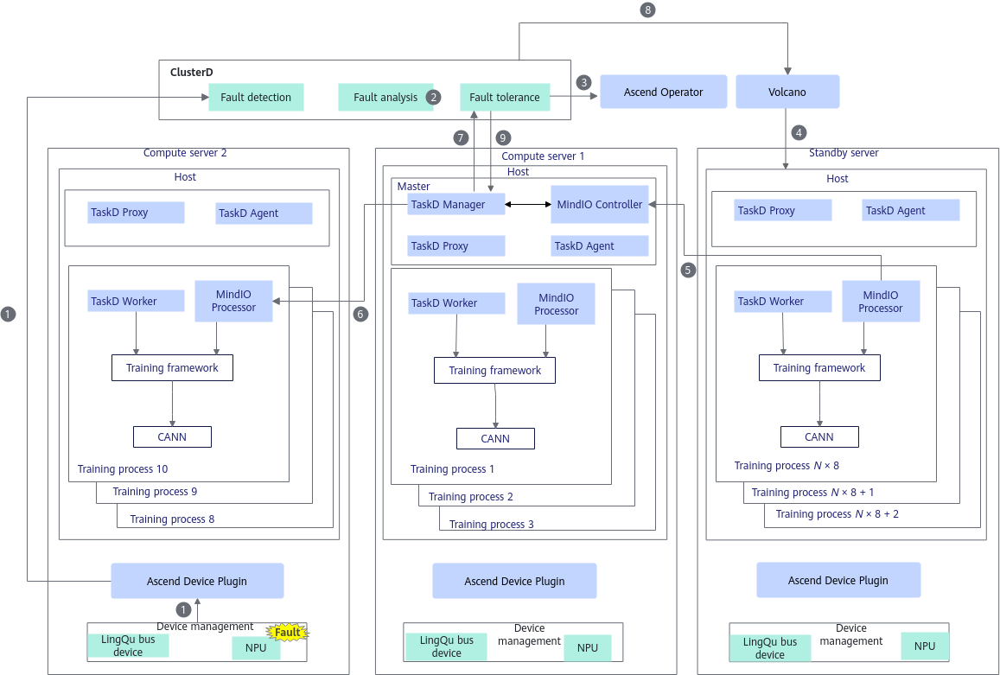

The details of each step are as follows:

1. ClusterD detects a sub-health fault through Ascend Device Plugin.
2. ClusterD decides whether to perform hot switching based on the configured policy.
3. ClusterD notifies Ascend Operator to start the backup Pod.
4. Volcano schedules the backup Pod.
5. A new MindIO Processor is created in the backup Pod, and MindIO Processor initiates registration with MindIO Controller.
6. MindIO Controller sends a training suspension notification.
7. MindIO Controller notifies ClusterD that training is paused.
8. ClusterD notifies Volcano to delete the faulty Pod.
9. ClusterD notifies MindIO to resume training.

**Function Adaptation Points<a name="section1446615300284"></a>**

During hot switching, the cluster brain sets annotations for the faulty pod based on the subhealth fault information, starts and schedules the backup pod, and notifies MindIO of the `hotSwitch` policy. Training resumes after it is switched to the backup pod. In the training container, the framework initializes the MindIO service. After the service is started, the optimizer updates the corresponding status to MindIO. When an exception occurs, the decorator is used to capture fault modes. After a new node is started, training on the normal node is paused. Then, the communicator is rebuilt, the parameter plane of the new node is restored, and the node hot switching is complete after training is complete.

For non-MindSpeed-LLM/MindCluster users, adapt the following functions as listed in [Table 2](#table19955141136104).

**Table 2** Functions adapted for hot switching

<a name="table19955141136104"></a>
<table><thead align="left"><tr id="row169591493619"><th class="cellrowborder" valign="top" width="18.200000000000003%" id="mcps1.2.5.1.1"><p id="p46603387387"><a name="p46603387387"></a><a name="p46603387387"></a>Function</p>
</th>
<th class="cellrowborder" valign="top" width="39.330000000000005%" id="mcps1.2.5.1.2"><p id="p176601638153816"><a name="p176601638153816"></a><a name="p176601638153816"></a>Description</p>
</th>
<th class="cellrowborder" valign="top" width="19.670000000000005%" id="mcps1.2.5.1.3"><p id="p237216122367"><a name="p237216122367"></a><a name="p237216122367"></a>Adapted Component</p>
</th>
<th class="cellrowborder" valign="top" width="22.800000000000004%" id="mcps1.2.5.1.4"><p id="p4660113823812"><a name="p4660113823812"></a><a name="p4660113823812"></a>Reference Link</p>
</th>
</tr>
</thead>
<tbody><tr id="row893618158397"><td class="cellrowborder" valign="top" width="18.200000000000003%" headers="mcps1.2.5.1.1 "><p id="p1698525618364"><a name="p1698525618364"></a><a name="p1698525618364"></a>Boot while initialization</p>
</td>
<td class="cellrowborder" valign="top" width="39.330000000000005%" headers="mcps1.2.5.1.2 "><p id="p117503011375"><a name="p117503011375"></a><a name="p117503011375"></a>Launches the MindIO service during training framework initialization.</p>
</td>
<td class="cellrowborder" rowspan="9" valign="top" width="19.670000000000005%" headers="mcps1.2.5.1.3 "><p id="p444112643720"><a name="p444112643720"></a><a name="p444112643720"></a>Distributed Training Framework</p>
</td>
<td class="cellrowborder" rowspan="9" valign="top" width="22.800000000000004%" headers="mcps1.2.5.1.4 "><p id="p7146223174212"><a name="p7146223174212"></a><a name="p7146223174212"></a><a href="../../references/fault_recovery_acceleration/03_usage_guidance.md#integrating-with-non-mindspeed-llm-frameworks">Integrating Non-MindSpeed-LLM Frameworks</a></p>
</td>
</tr>
<tr id="row1793717157396"><td class="cellrowborder" valign="top" headers="mcps1.2.5.1.1 "><p id="p1598625612366"><a name="p1598625612366"></a><a name="p1598625612366"></a>Optimizer update status reporting</p>
</td>
<td class="cellrowborder" valign="top" headers="mcps1.2.5.1.2 "><p id="p2986125603612"><a name="p2986125603612"></a><a name="p2986125603612"></a>Reports the start and end of optimizer updates before the optimizer updates.</p>
</td>
</tr>
<tr id="row193701523914"><td class="cellrowborder" valign="top" headers="mcps1.2.5.1.1 "><p id="p1798635633611"><a name="p1798635633611"></a><a name="p1798635633611"></a>DP replica group creation</p>
</td>
<td class="cellrowborder" valign="top" headers="mcps1.2.5.1.2 "><p id="p898615619362"><a name="p898615619362"></a><a name="p898615619362"></a>Adds creation logic for dp_cp/dp_ep replica groups and gloo groups, creating related replica groups after the native Megatron distributed parallel groups are created.</p>
</td>
</tr>
<tr id="row191961528155914"><td class="cellrowborder" valign="top" headers="mcps1.2.5.1.1 "><p id="p6986115693618"><a name="p6986115693618"></a><a name="p6986115693618"></a>Optimizer replica</p>
</td>
<td class="cellrowborder" valign="top" headers="mcps1.2.5.1.2 "><p id="p39861056113613"><a name="p39861056113613"></a><a name="p39861056113613"></a>Takes over and inherits related Megatron native optimizer functions, embedding MindIO optimizer replica management logic.</p>
</td>
</tr>
<tr id="row111971728195915"><td class="cellrowborder" valign="top" headers="mcps1.2.5.1.1 "><p id="p99861756103611"><a name="p99861756103611"></a><a name="p99861756103611"></a>Exception capture Decorator</p>
</td>
<td class="cellrowborder" valign="top" headers="mcps1.2.5.1.2 "><p id="p19986125623612"><a name="p19986125623612"></a><a name="p19986125623612"></a>Uses an exception capture decorator to decorate the train function to capture fault modes.</p>
</td>
</tr>
<tr id="row1519712855916"><td class="cellrowborder" valign="top" headers="mcps1.2.5.1.1 "><p id="p698615618367"><a name="p698615618367"></a><a name="p698615618367"></a>Node restart and communication re-establishment</p>
</td>
<td class="cellrowborder" valign="top" headers="mcps1.2.5.1.2 "><p id="p11986856193616"><a name="p11986856193616"></a><a name="p11986856193616"></a>Re-establishes the communication domain between healthy nodes and faulty nodes by registering a re-establishment callback.</p>
</td>
</tr>
<tr id="row1375943411593"><td class="cellrowborder" valign="top" headers="mcps1.2.5.1.1 "><p id="p10986256103613"><a name="p10986256103613"></a><a name="p10986256103613"></a>Online parameter plane repair</p>
</td>
<td class="cellrowborder" valign="top" headers="mcps1.2.5.1.2 "><p id="p198635693613"><a name="p198635693613"></a><a name="p198635693613"></a>Restore replica and recovery ranks through callback functions.</p>
</td>
</tr>
<tr id="row876023415918"><td class="cellrowborder" valign="top" headers="mcps1.2.5.1.1 "><p id="p49861556183618"><a name="p49861556183618"></a><a name="p49861556183618"></a>State rollback</p>
</td>
<td class="cellrowborder" valign="top" headers="mcps1.2.5.1.2 "><p id="p1398655643610"><a name="p1398655643610"></a><a name="p1398655643610"></a>Completes data iterator reconstruction and framework variable reset through callback functions.</p>
</td>
</tr>
<tr id="row17605341596"><td class="cellrowborder" valign="top" headers="mcps1.2.5.1.1 "><p id="p11986656153611"><a name="p11986656153611"></a><a name="p11986656153611"></a>Graceful suspension</p>
</td>
<td class="cellrowborder" valign="top" headers="mcps1.2.5.1.2 "><p id="p199862056113617"><a name="p199862056113617"></a><a name="p199862056113617"></a>Adds a MindIO function call at the very end of the training iteration loop to implement an active pause function.</p>
</td>
</tr>
<tr id="row144412445361"><td class="cellrowborder" valign="top" width="18.200000000000003%" headers="mcps1.2.5.1.1 "><p id="p129861056183611"><a name="p129861056183611"></a><a name="p129861056183611"></a>Hot switching control</p>
</td>
<td class="cellrowborder" valign="top" width="39.330000000000005%" headers="mcps1.2.5.1.2 "><p id="p14986125653610"><a name="p14986125653610"></a><a name="p14986125653610"></a>Manages the hot switching recovery flow, managing backup Pods and faulty Pods by setting annotations.</p>
</td>
<td class="cellrowborder" rowspan="2" valign="top" width="19.670000000000005%" headers="mcps1.2.5.1.3 "><p id="p1045122693710"><a name="p1045122693710"></a><a name="p1045122693710"></a>AI platform</p>
</td>
<td class="cellrowborder" valign="top" width="22.800000000000004%" headers="mcps1.2.5.1.4 "><p id="p64451744113612"><a name="p64451744113612"></a><a name="p64451744113612"></a><a href="https://gitcode.com/Ascend/mind-cluster/blob/branch_v26.0.0/component/clusterd/pkg/application/recover/hot_switch_controller.go" target="_blank" rel="noopener noreferrer">Link</a></p>
</td>
</tr>
<tr id="row14716101112393"><td class="cellrowborder" valign="top" headers="mcps1.2.5.1.1 "><p id="p1371681114396"><a name="p1371681114396"></a><a name="p1371681114396"></a>Pod creation and deletion</p>
</td>
<td class="cellrowborder" valign="top" headers="mcps1.2.5.1.2 "><p id="p071681117390"><a name="p071681117390"></a><a name="p071681117390"></a>Deletes and creates Pods by identifying specific annotations.</p>
</td>
<td class="cellrowborder" valign="top" headers="mcps1.2.5.1.3 "><p id="p071621117393"><a name="p071621117393"></a><a name="p071621117393"></a><a href="https://gitcode.com/Ascend/mind-cluster/blob/branch_v26.0.0/component/ascend-operator/pkg/controllers/v1/ascendjob_controller.go" target="_blank" rel="noopener noreferrer">Link</a></p>
</td>
</tr>
</tbody>
</table>

### Elastic Training<a name="ZH-CN_TOPIC_0000002479226542"></a>

When a hardware fault occurs and there are no available backup resources in the K8s cluster, MindCluster first scales down some nodes according to the data parallel domain to continue training. When idle resources become available in the cluster, it triggers scale-up to restore the original training scale. Compared with process-level rescheduling, this solves the problem of no available backup resources in the cluster for rescheduling.

**Constraints<a name="zh-cn_topic_0000002039353153_section514611624316"></a>**

- Only supports PyTorch with MindSpeed-LLM 2.3.0. For version compatibility, see [MindSpeed-LLM](https://gitcode.com/Ascend/MindSpeed-LLM/tree/2.3.0).
- Only supports acjob type training tasks.
- Depends on the optimizer replica of MindIO. A full optimizer replica must exist, so MindIO and TaskD need to be installed and used together.
- Cannot be enabled simultaneously with the graceful fault tolerance feature.
- Elastic training cannot be triggered when a fault occurs on the Pod whose `hccl/rankIndex` field is `0`.
- Multimodal models are not supported.
- The watchdog feature cannot be enabled.
- Since elastic training creates additional communication groups, it may increase on-chip memory usage.
- Currently not supported in IPv6 scenarios.

    Memory size calculation formula: `Maximum increased memory (MB) = HCCL_BUFFSIZE * 2 * 9`, where `HCCL_BUFFSIZE` defaults to 200 MB. For details about `HCCL_BUFFSIZE`, see the "[HCCL_BUFFSIZE](https://www.hiascend.com/document/detail/en/canncommercial/900/maintenref/envvar/envref_07_0080.html)" section in the *CANN Environment Variable Reference*.

For more constraints, see [MindSpeed-LLM Elastic Training Constraints](https://gitcode.com/Ascend/MindSpeed-LLM/blob/2.3.0/docs/pytorch/features/high_availability.md).

**Supported Product Types and AI Frameworks<a name="zh-cn_topic_0000002039353153_section136131584164"></a>**

**Table 1**  Products and frameworks that support elastic training

<a name="zh-cn_topic_0000002039353153_table1991711954417"></a>
<table><thead align="left"><tr id="zh-cn_topic_0000002039353153_row1091711912447"><th class="cellrowborder" valign="top" width="20.462046204620464%" id="mcps1.2.4.1.1"><p id="zh-cn_topic_0000002039353153_p199171819164417"><a name="zh-cn_topic_0000002039353153_p199171819164417"></a><a name="zh-cn_topic_0000002039353153_p199171819164417"></a>Product Type</p>
</th>
<th class="cellrowborder" valign="top" width="66.2966296629663%" id="mcps1.2.4.1.2"><p id="zh-cn_topic_0000002039353153_p2917819114420"><a name="zh-cn_topic_0000002039353153_p2917819114420"></a><a name="zh-cn_topic_0000002039353153_p2917819114420"></a>Hardware Form</p>
</th>
<th class="cellrowborder" valign="top" width="13.24132413241324%" id="mcps1.2.4.1.3"><p id="zh-cn_topic_0000002039353153_p27578257424"><a name="zh-cn_topic_0000002039353153_p27578257424"></a><a name="zh-cn_topic_0000002039353153_p27578257424"></a>Training Framework</p>
</th>
</tr>
</thead>
<tbody><tr id="zh-cn_topic_0000002039353153_row6171182004512"><td class="cellrowborder" valign="top" width="20.462046204620464%" headers="mcps1.2.4.1.1 "><p id="zh-cn_topic_0000002039353153_p153913472453"><a name="zh-cn_topic_0000002039353153_p153913472453"></a><a name="zh-cn_topic_0000002039353153_p153913472453"></a><span id="zh-cn_topic_0000002039353153_ph151431757142112"><a name="zh-cn_topic_0000002039353153_ph151431757142112"></a><a name="zh-cn_topic_0000002039353153_ph151431757142112"></a>Atlas A2 training series products</span></p>
<p id="p737515258512"><a name="p737515258512"></a><a name="p737515258512"></a></p>
</td>
<td class="cellrowborder" valign="top" width="66.2966296629663%" headers="mcps1.2.4.1.2 "><p id="p697681955215"><a name="p697681955215"></a><a name="p697681955215"></a><span id="ph157633217501"><a name="ph157633217501"></a><a name="ph157633217501"></a>Atlas 800T A2 training server</span></p>
</td>
<td class="cellrowborder" valign="top" width="13.24132413241324%" headers="mcps1.2.4.1.3 "><p id="p139316519435"><a name="p139316519435"></a><a name="p139316519435"></a><span id="zh-cn_topic_0000002039353153_ph2093210246488"><a name="zh-cn_topic_0000002039353153_ph2093210246488"></a><a name="zh-cn_topic_0000002039353153_ph2093210246488"></a>PyTorch</span></p>
</td>
</tr>
<tr id="zh-cn_topic_0000002039353153_row62157458147"><td class="cellrowborder" valign="top" width="20.462046204620464%" headers="mcps1.2.4.1.1 "><p id="zh-cn_topic_0000002039353153_p18222246142212"><a name="zh-cn_topic_0000002039353153_p18222246142212"></a><a name="zh-cn_topic_0000002039353153_p18222246142212"></a><span id="zh-cn_topic_0000002039353153_ph18411121792018"><a name="zh-cn_topic_0000002039353153_ph18411121792018"></a><a name="zh-cn_topic_0000002039353153_ph18411121792018"></a>Atlas A3 training series products</span></p>
</td>
<td class="cellrowborder" valign="top" width="66.2966296629663%" headers="mcps1.2.4.1.2 "><p id="p1711620216528"><a name="p1711620216528"></a><a name="p1711620216528"></a><span id="ph077885871817"><a name="ph077885871817"></a><a name="ph077885871817"></a>Atlas 900 A3 SuperPoD</span></p>
</td>
<td class="cellrowborder" valign="top" width="13.24132413241324%" headers="mcps1.2.4.1.3 "><p id="p16887149174313"><a name="p16887149174313"></a><a name="p16887149174313"></a><span id="ph99469109139"><a name="ph99469109139"></a><a name="ph99469109139"></a>PyTorch</span></p>
</td>
</tr>
</tbody>
</table>

**Elastic Training Principles<a name="section3841210162013"></a>**

**Figure 1**  Schematic diagram<a name="fig130013397201"></a>
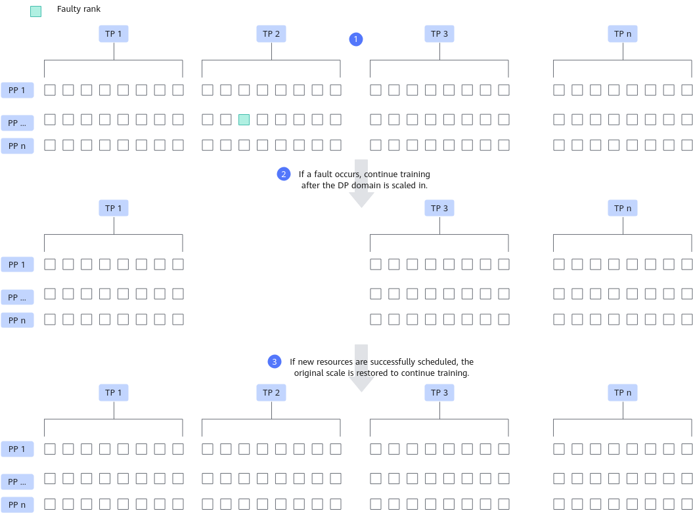

In the figure, only one DP domain is scaled in. In actual elastic training, multiple DP domains may be scaled in at a time. Each square in the figure represents a rank.

1. Distributed training is performed normally according to TP (Tensor Parallelism), PP (Pipeline Parallelism), and DP (Data Parallelism).
2. At a certain point during training, if a rank fault occurs and no more idle resources are available in the cluster for resumable training, the DP domain is scaled in, meaning the Pod corresponding to one DP domain (which may include multiple Pods) is scaled in, and training continues.
3. At a certain moment during scale-in training, if idle resources are available in the cluster, the removed pods are rescheduled, and the cluster is scaled out to the original scale for further training.

**Figure 2** Elastic training flowchart<a name="fig7783192415293"></a>
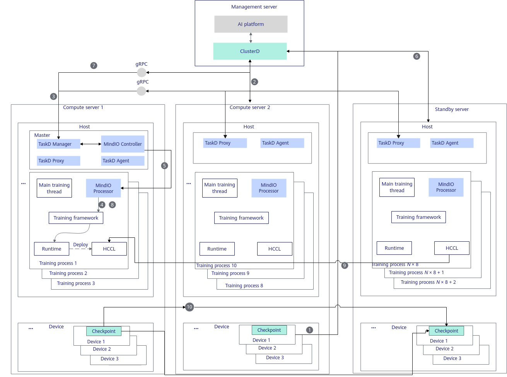

The details of each step are as follows:

1. After a hardware fault occurs on a device, the detection component of MindCluster on the server reports the fault information to ClusterD. Software faults are detected by MindIO Controller inside the container and reported to ClusterD.
2. ClusterD destroys the container on the faulty server.
3. If no backup node is available to schedule a new container, ClusterD notifies MindIO Controller on the master node to perform scale-in training.
4. MindIO Controller notifies MindIO Processor in each training process, and MindIO Processor calls PTA to stop the training process and clean up resources on normal nodes.
5. MindIO Controller notifies MindIO Processor in normal training processes to execute scale-in procedures such as communication group reconstruction and perform scale-in training.
6. Detect that the Pod deleted during scale-in has been rescheduled successfully.
7. ClusterD notifies MindIO Controller through TaskD Manager to perform scale-out.
8. MindIO Controller notifies MindIO Processor in each training process, and MindIO Processor calls PTA to stop the training process and clean up resources on normal nodes.
9. Each process establishes links through collective communication.
10. NPUs of the normal server transfer the checkpoint data to the standby server through the parameter plane. After the parameter status is restored, the training continues.

**Adaptation Feature Points<a name="section1446615300284"></a>**

In elastic training, the cluster brain decides on a recovery policy based on global fault information and delivers the policy to MindIO. The scheduler must support scheduling of faulty Pods rather than rescheduling the entire job, and support sequential fallback of recovery policies. In the training container, the framework first initializes the MindIO service. After the service is started, the optimizer reports the corresponding status to MindIO during updates. Subsequently, DP replica groups and optimizer replicas are created to ensure redundant backup of model parameters. When an exception occurs, the fault mode is captured by the exception capture decorator and reported by MindIO to the cluster brain for decision-making.

- When the cluster brain detects a fault and no redundant backup resources are available, it delivers a scale-in policy to MindIO, which performs operator resource cleanup, scale-in reconstruction, and continues training in the scaled-in state.
- When the cluster brain detects available resources and a new node is successfully brought up, it delivers a scale-out policy to MindIO, which performs operator resource cleanup, scale-out communication reconstruction, scale-out parameter plane recovery, and scale-out state rollback, completing elastic scale-out to restore the original scale and continue training.

For non-MindSpeed-LLM/MindCluster users, adapt the following functions listed in [Table 2](#table19955141136107)..

**Table 2**  Functions adapted for elastic training

<a name="table19955141136107"></a>
<table><thead align="left"><tr id="row169591493619"><th class="cellrowborder" valign="top" width="7.520000000000001%" id="mcps1.2.6.1.1"><p id="p4637165993110"><a name="p4637165993110"></a><a name="p4637165993110"></a>No.</p>
</th>
<th class="cellrowborder" valign="top" width="18.810000000000002%" id="mcps1.2.6.1.2"><p id="p46603387387"><a name="p46603387387"></a><a name="p46603387387"></a>Function</p>
</th>
<th class="cellrowborder" valign="top" width="34.39%" id="mcps1.2.6.1.3"><p id="p176601638153816"><a name="p176601638153816"></a><a name="p176601638153816"></a>Description</p>
</th>
<th class="cellrowborder" valign="top" width="18.190000000000005%" id="mcps1.2.6.1.4"><p id="p237216122367"><a name="p237216122367"></a><a name="p237216122367"></a>Adapted Component</p>
</th>
<th class="cellrowborder" valign="top" width="21.090000000000003%" id="mcps1.2.6.1.5"><p id="p4660113823812"><a name="p4660113823812"></a><a name="p4660113823812"></a>Reference Link</p>
</th>
</tr>
</thead>
<tbody><tr id="row893618158397"><td class="cellrowborder" valign="top" width="7.520000000000001%" headers="mcps1.2.6.1.1 "><p id="p26376591313"><a name="p26376591313"></a><a name="p26376591313"></a>1</p>
</td>
<td class="cellrowborder" valign="top" width="18.810000000000002%" headers="mcps1.2.6.1.2 "><p id="p1142119117913"><a name="p1142119117913"></a><a name="p1142119117913"></a>Boot while initialization</p>
</td>
<td class="cellrowborder" valign="top" width="34.39%" headers="mcps1.2.6.1.3 "><p id="p112827185916"><a name="p112827185916"></a><a name="p112827185916"></a>Starts the MindIO service during training framework initialization.</p>
</td>
<td class="cellrowborder" rowspan="16" valign="top" width="18.190000000000005%" headers="mcps1.2.6.1.4 "><p id="p444112643720"><a name="p444112643720"></a><a name="p444112643720"></a>Distributed training framework</p>
</td>
<td class="cellrowborder" rowspan="6" valign="top" width="21.090000000000003%" headers="mcps1.2.6.1.5 "><p id="p7146223174212"><a name="p7146223174212"></a><a name="p7146223174212"></a><a href="../../references/fault_recovery_acceleration/03_usage_guidance.md#integrating-with-non-mindspeed-llm-frameworks">Table 2</a></p>
</td>
</tr>
<tr id="row1793717157396"><td class="cellrowborder" valign="top" headers="mcps1.2.6.1.1 "><p id="p106371759163113"><a name="p106371759163113"></a><a name="p106371759163113"></a>2</p>
</td>
<td class="cellrowborder" valign="top" headers="mcps1.2.6.1.2 "><p id="p1942113117919"><a name="p1942113117919"></a><a name="p1942113117919"></a>Optimizer Uupdate status reproting</p>
</td>
<td class="cellrowborder" valign="top" headers="mcps1.2.6.1.3 "><p id="p92821518193"><a name="p92821518193"></a><a name="p92821518193"></a>Reports the start and end status of optimizer updates before the optimizer updates.</p>
</td>
</tr>
<tr id="row193701523914"><td class="cellrowborder" valign="top" headers="mcps1.2.6.1.1 "><p id="p363765912314"><a name="p363765912314"></a><a name="p363765912314"></a>3</p>
</td>
<td class="cellrowborder" valign="top" headers="mcps1.2.6.1.2 "><p id="p164211711596"><a name="p164211711596"></a><a name="p164211711596"></a>DP replica group creation</p>
</td>
<td class="cellrowborder" valign="top" headers="mcps1.2.6.1.3 "><p id="p22829180917"><a name="p22829180917"></a><a name="p22829180917"></a>Adds creation logic for dp_cp/dp_ep replica groups and gloo groups, creating related replica groups after the native Megatron distributed parallel groups are created.</p>
</td>
</tr>
<tr id="row191961528155914"><td class="cellrowborder" valign="top" headers="mcps1.2.6.1.1 "><p id="p7637175903115"><a name="p7637175903115"></a><a name="p7637175903115"></a>4</p>
</td>
<td class="cellrowborder" valign="top" headers="mcps1.2.6.1.2 "><p id="p134219118919"><a name="p134219118919"></a><a name="p134219118919"></a>Optimizer replica</p>
</td>
<td class="cellrowborder" valign="top" headers="mcps1.2.6.1.3 "><p id="p192829181594"><a name="p192829181594"></a><a name="p192829181594"></a>Takes over and inherits related Megatron native optimizer functions, embedding MindIO optimizer replica management logic.</p>
</td>
</tr>
<tr id="row111971728195915"><td class="cellrowborder" valign="top" headers="mcps1.2.6.1.1 "><p id="p1963725993118"><a name="p1963725993118"></a><a name="p1963725993118"></a>5</p>
</td>
<td class="cellrowborder" valign="top" headers="mcps1.2.6.1.2 "><p id="p1542111118913"><a name="p1542111118913"></a><a name="p1542111118913"></a>Exception capture decorator</p>
</td>
<td class="cellrowborder" valign="top" headers="mcps1.2.6.1.3 "><p id="p112826181914"><a name="p112826181914"></a><a name="p112826181914"></a>Uses an exception capture decorator to decorate the train function to capture fault modes.</p>
</td>
</tr>
<tr id="row1519712855916"><td class="cellrowborder" valign="top" headers="mcps1.2.6.1.1 "><p id="p363711591310"><a name="p363711591310"></a><a name="p363711591310"></a>6</p>
</td>
<td class="cellrowborder" valign="top" headers="mcps1.2.6.1.2 "><p id="p6421121796"><a name="p6421121796"></a><a name="p6421121796"></a>Operator resource cleanup</p>
</td>
<td class="cellrowborder" valign="top" headers="mcps1.2.6.1.3 "><p id="p11282181811916"><a name="p11282181811916"></a><a name="p11282181811916"></a>Completes operator resource cleanup through callback functions.</p>
</td>
</tr>
<tr id="row1375943411593"><td class="cellrowborder" valign="top" headers="mcps1.2.6.1.1 "><p id="p06375599316"><a name="p06375599316"></a><a name="p06375599316"></a>7</p>
</td>
<td class="cellrowborder" valign="top" headers="mcps1.2.6.1.2 "><p id="p34212017916"><a name="p34212017916"></a><a name="p34212017916"></a>Elastic training callback registration</p>
</td>
<td class="cellrowborder" valign="top" headers="mcps1.2.6.1.3 "><p id="p1528212181493"><a name="p1528212181493"></a><a name="p1528212181493"></a>Registers each elastic training callback function with MindIO.</p>
</td>
<td class="cellrowborder" valign="top" headers="mcps1.2.6.1.4 "><p id="p1163581571719"><a name="p1163581571719"></a><a name="p1163581571719"></a><a href="https://gitcode.com/Ascend/MindSpeed-LLM/blob/2.3.0/mindspeed_llm/core/high_availability/elastic_training_register.py" target="_blank" rel="noopener noreferrer">LLM repository reference link</a></p>
</td>
</tr>
<tr id="row876023415918"><td class="cellrowborder" valign="top" headers="mcps1.2.6.1.1 "><p id="p4637259163118"><a name="p4637259163118"></a><a name="p4637259163118"></a>8</p>
</td>
<td class="cellrowborder" valign="top" headers="mcps1.2.6.1.2 "><p id="p1342113114912"><a name="p1342113114912"></a><a name="p1342113114912"></a>Scale-in rebuilding</p>
</td>
<td class="cellrowborder" valign="top" headers="mcps1.2.6.1.3 "><p id="p528210181396"><a name="p528210181396"></a><a name="p528210181396"></a>Rebuilds communication groups and data iterators after scaling in, records and updates some framework variables, etc.</p>
</td>
<td class="cellrowborder" valign="top" headers="mcps1.2.6.1.4 "><p id="p106351815121720"><a name="p106351815121720"></a><a name="p106351815121720"></a><a href="https://gitcode.com/Ascend/MindSpeed-LLM/blob/2.3.0/mindspeed_llm/core/high_availability/elastic_training_scale_in_rebuild.py" target="_blank" rel="noopener noreferrer">LLM repository reference link</a></p>
</td>
</tr>
<tr id="row17605341596"><td class="cellrowborder" valign="top" headers="mcps1.2.6.1.1 "><p id="p1763711599312"><a name="p1763711599312"></a><a name="p1763711599312"></a>9</p>
</td>
<td class="cellrowborder" valign="top" headers="mcps1.2.6.1.2 "><p id="p74211911599"><a name="p74211911599"></a><a name="p74211911599"></a>Scale-out communication rebuilding</p>
</td>
<td class="cellrowborder" valign="top" headers="mcps1.2.6.1.3 "><p id="p52821818299"><a name="p52821818299"></a><a name="p52821818299"></a>Rebuilds communication groups between new nodes and scaled-in nodes.</p>
</td>
<td class="cellrowborder" valign="top" headers="mcps1.2.6.1.4 "><p id="p126358155177"><a name="p126358155177"></a><a name="p126358155177"></a><a href="https://gitcode.com/Ascend/MindSpeed-LLM/blob/2.3.0/mindspeed_llm/core/high_availability/elastic_training_scale_out_rebuild.py" target="_blank" rel="noopener noreferrer">LLM repository reference link</a></p>
</td>
</tr>
<tr id="row144412445361"><td class="cellrowborder" valign="top" headers="mcps1.2.6.1.1 "><p id="p56378590319"><a name="p56378590319"></a><a name="p56378590319"></a>10</p>
</td>
<td class="cellrowborder" valign="top" headers="mcps1.2.6.1.2 "><p id="p64221014919"><a name="p64221014919"></a><a name="p64221014919"></a>Scale-out parameter plane recovery</p>
</td>
<td class="cellrowborder" valign="top" headers="mcps1.2.6.1.3 "><p id="p728213181097"><a name="p728213181097"></a><a name="p728213181097"></a>Recovers parameters such as the optimizer on new nodes through parameter transfer between replica ranks and newly pulled ranks.</p>
</td>
<td class="cellrowborder" valign="top" headers="mcps1.2.6.1.4 "><p id="p935519615208"><a name="p935519615208"></a><a name="p935519615208"></a><a href="https://gitcode.com/Ascend/MindSpeed-LLM/blob/2.3.0/mindspeed_llm/core/high_availability/elastic_training_repair.py" target="_blank" rel="noopener noreferrer">LLM repository reference link</a></p>
</td>
</tr>
<tr id="row14716101112393"><td class="cellrowborder" valign="top" headers="mcps1.2.6.1.1 "><p id="p1963713597315"><a name="p1963713597315"></a><a name="p1963713597315"></a>11</p>
</td>
<td class="cellrowborder" valign="top" headers="mcps1.2.6.1.2 "><p id="p842217115916"><a name="p842217115916"></a><a name="p842217115916"></a>Scale-out state rollback</p>
</td>
<td class="cellrowborder" valign="top" headers="mcps1.2.6.1.3 "><p id="p72821618294"><a name="p72821618294"></a><a name="p72821618294"></a>Restores framework variables changed during scale-in, rebuilds datasets, etc.</p>
</td>
<td class="cellrowborder" valign="top" headers="mcps1.2.6.1.4 "><p id="p135516622010"><a name="p135516622010"></a><a name="p135516622010"></a><a href="https://gitcode.com/Ascend/MindSpeed-LLM/blob/2.3.0/mindspeed_llm/core/high_availability/elastic_training_rollback.py" target="_blank" rel="noopener noreferrer">LLM repository reference link</a></p>
</td>
</tr>
<tr id="row164994019817"><td class="cellrowborder" valign="top" headers="mcps1.2.6.1.1 "><p id="p563705923117"><a name="p563705923117"></a><a name="p563705923117"></a>12</p>
</td>
<td class="cellrowborder" valign="top" headers="mcps1.2.6.1.2 "><p id="p17422911918"><a name="p17422911918"></a><a name="p17422911918"></a>Torch communication adaptation for newly launched nodes</p>
</td>
<td class="cellrowborder" valign="top" headers="mcps1.2.6.1.3 "><p id="p1228218181798"><a name="p1228218181798"></a><a name="p1228218181798"></a>Skips communication before newly launched nodes recover.</p>
</td>
<td class="cellrowborder" rowspan="2" valign="top" headers="mcps1.2.6.1.4 "><p id="p627084962414"><a name="p627084962414"></a><a name="p627084962414"></a><a href="https://gitcode.com/Ascend/MindSpeed-LLM/blob/2.3.0/mindspeed_llm/features_manager/high_availability/high_availability.py#:~text=def pre_register_patches(self, patch_manager, args):" target="_blank" rel="noopener noreferrer">LLM repository reference link</a></p>
</td>
</tr>
<tr id="row5499401185"><td class="cellrowborder" valign="top" headers="mcps1.2.6.1.1 "><p id="p5637135973120"><a name="p5637135973120"></a><a name="p5637135973120"></a>13</p>
</td>
<td class="cellrowborder" valign="top" headers="mcps1.2.6.1.2 "><p id="p11422518917"><a name="p11422518917"></a><a name="p11422518917"></a>Scale-in training global group communication adaptation</p>
</td>
<td class="cellrowborder" valign="top" headers="mcps1.2.6.1.3 "><p id="p32829185918"><a name="p32829185918"></a><a name="p32829185918"></a>Replaces the original global group communication with the scaled-in global group during scale-in training.</p>
</td>
</tr>
<tr id="row1550640684"><td class="cellrowborder" valign="top" headers="mcps1.2.6.1.1 "><p id="p3637125953118"><a name="p3637125953118"></a><a name="p3637125953118"></a>14</p>
</td>
<td class="cellrowborder" valign="top" headers="mcps1.2.6.1.2 "><p id="p14221517919"><a name="p14221517919"></a><a name="p14221517919"></a>Scale-in training replica group communication adaptation</p>
</td>
<td class="cellrowborder" valign="top" headers="mcps1.2.6.1.3 "><p id="p6282018699"><a name="p6282018699"></a><a name="p6282018699"></a>During scale-in training, the replica rank replaces the faulty rank to communicate with the replica group where the faulty rank resides.</p>
</td>
<td class="cellrowborder" rowspan="2" valign="top" headers="mcps1.2.6.1.4 "><p id="p1320441192517"><a name="p1320441192517"></a><a name="p1320441192517"></a><a href="https://gitcode.com/Ascend/MindSpeed-LLM/blob/2.3.0/mindspeed_llm/features_manager/high_availability/high_availability.py" target="_blank" rel="noopener noreferrer">LLM repository reference link</a></p>
</td>
</tr>
<tr id="row1650540489"><td class="cellrowborder" valign="top" headers="mcps1.2.6.1.1 "><p id="p06374591313"><a name="p06374591313"></a><a name="p06374591313"></a>15</p>
</td>
<td class="cellrowborder" valign="top" headers="mcps1.2.6.1.2 "><p id="p5422415915"><a name="p5422415915"></a><a name="p5422415915"></a>Scale-in training parameter adaptation</p>
</td>
<td class="cellrowborder" valign="top" headers="mcps1.2.6.1.3 "><p id="p112827184913"><a name="p112827184913"></a><a name="p112827184913"></a>Modifies parameters such as num_microbatches, world_size, and global_batch_size during scale-in training.</p>
</td>
</tr>
<tr id="row7501940584"><td class="cellrowborder" valign="top" headers="mcps1.2.6.1.1 "><p id="p6637165923110"><a name="p6637165923110"></a><a name="p6637165923110"></a>16</p>
</td>
<td class="cellrowborder" valign="top" headers="mcps1.2.6.1.2 "><p id="p5422211095"><a name="p5422211095"></a><a name="p5422211095"></a>Gradient precision calculation</p>
</td>
<td class="cellrowborder" valign="top" headers="mcps1.2.6.1.3 "><p id="p5282161815916"><a name="p5282161815916"></a><a name="p5282161815916"></a>Adapts to precision gradient changes caused by changes such as num_micro_batches during scale-in.</p>
</td>
<td class="cellrowborder" valign="top" headers="mcps1.2.6.1.4 "><p id="p17653121214259"><a name="p17653121214259"></a><a name="p17653121214259"></a><a href="https://gitcode.com/Ascend/MindSpeed-LLM/blob/2.3.0/mindspeed_llm/features_manager/high_availability/high_availability.py" target="_blank" rel="noopener noreferrer">LLM repository reference link 1</a></p>
<p id="p116531412172515"><a name="p116531412172515"></a><a name="p116531412172515"></a><a href="https://gitcode.com/Ascend/MindSpeed-LLM/blob/2.3.0/pretrain_gpt.py#:~text=if args.enable_elastic_training:" target="_blank" rel="noopener noreferrer">LLM repository reference link 2</a></p>
</td>
</tr>
<tr id="row145017409813"><td class="cellrowborder" valign="top" width="7.520000000000001%" headers="mcps1.2.6.1.1 "><p id="p17637165943120"><a name="p17637165943120"></a><a name="p17637165943120"></a>17</p>
</td>
<td class="cellrowborder" valign="top" width="18.810000000000002%" headers="mcps1.2.6.1.2 "><p id="p15422131799"><a name="p15422131799"></a><a name="p15422131799"></a>Recovery policy decision</p>
</td>
<td class="cellrowborder" valign="top" width="34.39%" headers="mcps1.2.6.1.3 "><p id="p1628291814912"><a name="p1628291814912"></a><a name="p1628291814912"></a>Decides the recovery policy based on global fault information and delivers the policy to MindIO; supports recovery policy fallback, such as dying gasp if elastic training fails.</p>
</td>
<td class="cellrowborder" rowspan="2" valign="top" width="18.190000000000005%" headers="mcps1.2.6.1.4 "><p id="p1504404816"><a name="p1504404816"></a><a name="p1504404816"></a>AI platform</p>
</td>
<td class="cellrowborder" valign="top" width="21.090000000000003%" headers="mcps1.2.6.1.5 "><p id="p20447192572312"><a name="p20447192572312"></a><a name="p20447192572312"></a><a href="https://gitcode.com/Ascend/mind-cluster/tree/branch_v26.0.0/component/clusterd/pkg/application/recover" target="_blank" rel="noopener noreferrer">Link</a></p>
</td>
</tr>
<tr id="row155014017818"><td class="cellrowborder" valign="top" headers="mcps1.2.6.1.1 "><p id="p063755903111"><a name="p063755903111"></a><a name="p063755903111"></a>18</p>
</td>
<td class="cellrowborder" valign="top" headers="mcps1.2.6.1.2 "><p id="p1042215113910"><a name="p1042215113910"></a><a name="p1042215113910"></a>Scheduling of faulty Pods</p>
</td>
<td class="cellrowborder" valign="top" headers="mcps1.2.6.1.3 "><p id="p18282181818913"><a name="p18282181818913"></a><a name="p18282181818913"></a>Schedules faulty Pods.</p>
</td>
<td class="cellrowborder" valign="top" headers="mcps1.2.6.1.4 "><p id="p10446112592310"><a name="p10446112592310"></a><a name="p10446112592310"></a><a href="https://gitcode.com/Ascend/mind-cluster/tree/branch_v26.0.0/component/ascend-for-volcano/internal/rescheduling" target="_blank" rel="noopener noreferrer">Link</a></p>
</td>
</tr>
</tbody>
</table>

The adaptation items numbered 1 to 6 in [Table 2](#table19955141136107) are common logic for MindIO TFT (MindCluster MindIO Training Fault Tolerance), and the adaptation items numbered 17 to 18 are common logic for resumable training. They are not described in detail in this chapter. The following briefly introduces the unique functional points of elastic training based on Megatron 0.12.1.

- Elastic training callback registration

    Enabled during training startup initialization, it registers the callback functions that need to be executed during elastic training scale-in and scale-out recovery into MindIO, so that they can be invoked during the recovery process.

- Scale-in rebuilding
    1. Create a new global communication group based on the members after scale-in and record it, which will subsequently replace the original global communication group for communication.
    2. Record the original framework parameters such as `DP size` and `num_microbatches` for subsequent scale-out recovery, and update them with the data after scale-in.
    3. Rebuild other local communication groups after scale-in based on the faulty rank information, and update the communication groups in instance objects such as models and optimizers.
    4. Rebuild the dataset, and reinitialize some framework instances and parameters.

- Scale-out communication rebuilding
    1. Rebuild the global and local communication groups after scale-up, and update the communication groups in instance objects such as models and optimizers.
    2. Restore framework parameters such as DP size, and reinitialize some framework instances.

- Scale-out parameter plane recovery
    1. Create communication groups for the newly launched rank training processes and the backup rank training processes, used for sending and receiving optimizer parameters and the like.
    2. The backup rank training processes send the optimizer parameters required for recovery to the newly launched rank training processes.
    3. After receiving the optimizer parameters, the newly launched rank training processes update parameters such as `optimizer`, `opt_param_scheduler`, and global `args` as needed.

- Scale-out state rollback
    1. Restore framework parameters such as `num_microbatches`.
    2. Before resuming training, copy the optimizer parameters to the model parameters, and perform an all_gather communication operation within the corresponding DP domain to ensure the model parameters are in the latest state.
    3. Fix the printing of training iteration logs.
    4. Rebuild the dataset and reinitialize some framework instances, parameters, etc.
    5. Destroy the communication groups used for sending and receiving parameters during the recovery process.

- Torch communication adaptation for newly launched nodes
    1. For the restarted node, communication operators are issued from the pretrain startup process to the entry into training. However, the normal training rank does not rebuild the communication domain in coordination with the restarted node at this stage, so collective communication cannot succeed. Therefore, it is skipped directly.
    2. For the restarted node, a parallel communication domain is created from the pretrain startup process to the entry into training. However, the normal training rank does not rebuild the communication domain in coordination with the restarted node at this stage, which causes errors for the gloo group. Therefore, the creation of a new gloo communication group is skipped directly.

- Scale-in training global group communication adaptation

During scale-in training, because the faulty node has been removed, communication using the original global communication group will fail. It must be replaced with the scaled-in global communication group.

- Scale-in training replica group communication adaptation

In the [LLM repository reference link](https://gitcode.com/Ascend/MindSpeed-LLM/blob/2.3.0/mindspeed_llm/features_manager/high_availability/high_availability.py), `start_param_sync_wrapper`, `get_grad_norm_fp32_wrapper`, `get_parameter_state_dp_zero_wrapper`, etc., are patched to adapt replica group communication during scale-in training. The following uses `get_parameter_state_dp_zero_wrapper` as an example to introduce the replica group adaptation principles:

Assume `tp=8`, `pp=1`, and `dp=4`. The DP groups are ranks [0,8,16,24], [1,9,17,25], [2,10,18,26], …, [7,15,23,31] respectively. According to the replica optimizer principle, the replica groups are ranks [0,8], [16,24], [1,9], [17,25], [2,10], [18,26], …, [7,15], [23,31] respectively, with rank 0-15 and rank 16-31 being replicas of each other. After rank 31 fails, the DP domain corresponding to rank 24-31 is removed to continue scale-in training.

Native Megatron uses the group corresponding to the `data_parallel_group_gloo` member variable of the optimizer instance (i.e., the DP group, which is the replica group when using MindIO's optimizer replica) for communication. After scale-in, the replica groups that do not include the removed rank 24-31 continue to communicate using the original communication groups. The replica groups that include the scaled-in ranks use a scaled-in group composed of the normal rank within the group and the replica rank corresponding to the scaled-in rank for communication. For example, after the replica group rank [23,31] is scaled in, the communication group used for communication is rank [23,15].

- Scale-in training parameter adaptation

    In [LLM Repository Reference Link](https://gitcode.com/Ascend/MindSpeed-LLM/blob/2.3.0/mindspeed_llm/features_manager/high_availability/high_availability.py), functions such as `patch_world_size_func_wrapper`, `log_wrapper`, `is_last_rank_wrapper`,`optimizer_param_scheduler_step_wrapper`,`track_app_tag_wrapper`,`print_rank_last_wrapper`, and `num_floating_point_operations_wrapper` are patched to adapt parameters used during training, such as `global_batch_size` and `world_size`. For example: the native implementation uses `dp_size*micro_batch_size*num_microbatches,` but after scaling in, `num_microbatches` may differ across DPs, so `args.globatch_size` is used directly. After scaling in, the global group after scaling in is used to determine whether it is the last rank; the global group size is modified to the size after scaling in, etc.

- Gradient precision calculation

    In [LLM Repository Reference Link 1](https://gitcode.com/Ascend/MindSpeed-LLM/blob/2.3.0/mindspeed_llm/features_manager/high_availability/high_availability.py), `start_grad_sync_wrapper`, `forward_step_wrapper`, and `elastic_training_get_forward_backward_func_wrapper`, as well as the `loss\_func` code pointed to by [LLM Repository Reference Link 2](https://gitcode.com/Ascend/MindSpeed-LLM/blob/2.3.0/pretrain_gpt.py#:~text=if%20args.enable_elastic_training%3A), are patched or modified to adapt to precision gradient changes caused by scaling in.

    - `loss_func` is modified from performing all\_reduce communication within the DP group for each `micro_batch` to not performing communication during scaling-in training. The reason is that after scaling in, the number of `num_micro_batches` within each DP domain may differ, causing the first few DPs to execute one extra all\_reduce and become stuck.
    - In `start_grad_sync_wrapper`, `gradient_scaling_factor` is modified to `1.0 / (arguments.global_batch_size / arguments.micro_batch_size)`, i.e., dividing by `num_micro_batches` on top of the original `1/dp_size`.
    - `forward_step_wrapper` changes `num_microbatches` to 1, so that the loss calculation no longer divides by `num_microbatches`, because it has already been divided by `num_microbatches` in `start_grad_sync_wrapper`.
    - In `elastic_training_get_forward_backward_func_wrapper`, because `loss_func` does not perform all_reduce within the DP group, after the native `forward_backward_func` completes, at the last PP stage, the sum of each key in `losses_reduced` (i.e., the sum of `lm loss` across all `micro_batches`) performs an all_reduce sum operation within the DP group.

## Recovery Acceleration<a name="ZH-CN_TOPIC_0000002511426359"></a>

### Training Recovery Principles<a name="ZH-CN_TOPIC_0000002479226500"></a>

After a fault is rectified, the training process is restarted. The started training process needs to save and load model weights to return to the training state when a job is interrupted. During normal training, checkpoint files of the training model weights are saved at regular intervals. The training process restarted after training termination can load the previously saved checkpoint file to restore the model weight state at a certain checkpoint, thus reducing training time. The methods of saving and loading checkpoints vary according to frameworks. The following lists some examples of saving and loading checkpoints for TensorFlow, PyTorch, and MindSpore. You can modify your training model script based on these examples.

**PyTorch<a name="section77915151121"></a>**

1. Save the checkpoint.

    ```Python
    def save_checkpoint(state, is_best, args, filename='checkpoint.pth.tar'):
        filename2 = os.path.join(args.save_ckpt_path, filename)
        torch.save(state, filename2)
        if is_best:
            shutil.copyfile(filename2, os.path.join(args.save_ckpt_path, 'model_best.pth.tar'))
    ```

2. Load the checkpoint.

    ```Python
    checkpoint = torch.load(args.checkpoint_path, map_location=loc)
    args.start_epoch = checkpoint['epoch']
    best_acc1 = checkpoint['best_acc1']
    model.load_state_dict(checkpoint['state_dict'])
    optimizer.load_state_dict(checkpoint['optimizer'])
    ```

**MindSpore<a name="section104642081315"></a>**

1. Save the checkpoint.

    ```Python
    ms.save_checkpoint(net, "./lenet.ckpt",
                       choice_func=lambda x: x.startswith("conv") and not x.startswith("conv1"))
    ```

2. Load the checkpoint.

    ```Python
    param_dict = ms.load_checkpoint("./lenet.ckpt")
    ```

### Periodic Checkpoint Saving<a name="ZH-CN_TOPIC_0000002479386434"></a>

Currently, training data (such as model parameters) is saved as checkpoints to implement large-scale cluster training. When a service platform detects a fault, it can terminate the current training job and reload the saved checkpoints to resume training from the time when checkpoints are saved, avoiding a complete restart.

Periodic checkpoint saving consists of two parts: asynchronous checkpoint saving and memory checkpoint loading.

- **Asynchronous checkpoint saving**

    MindIO ACP provides the capability of asynchronous saving checkpoints at a fixed interval. If MindIO ACP is not used, the parameters to be saved need to be copied from the device to the host and then flushed to storage, which takes several minutes. MindIO ACP enables asynchronous flushing, allowing parameters to be written to storage in the background after being copied to the host from the device, without blocking the ongoing training process. This allows training to proceed uninterrupted during the flushing phase.

- **In-memory checkpoint loading**

    MindIO ACP provides the capability of periodically loading checkpoints based on memory. During training recovery, periodic checkpoints that are saved previously need to be loaded from storage to restore the training status and resume training. However, checkpoint loading within a large model typically takes several minutes due to data volume and storage performance constraints. To accelerate this process, MindIO ACP introduces a periodic memory-based checkpoint loading mechanism. In the event of a fault, checkpoints are loaded directly from memory, significantly reducing recovery time.

**Recommended Configuration<a name="section883116216236"></a>**

When using the checkpoint saving capability of the rescheduling upon faults feature, select a frequency for periodically saving checkpoints based on your actual requirements. [Figure 1](#fig41241253101) illustrates recommended frequencies.

**Figure 1**  Recommended frequencies for periodic checkpoint saving<a name="fig41241253101"></a>
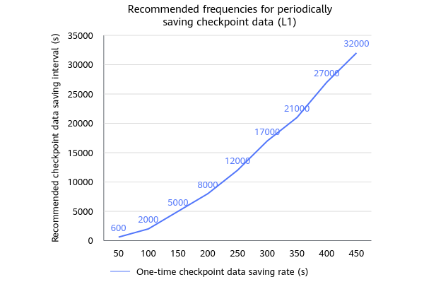

When periodic checkpoint recovery is enabled, any training progress between the last saved checkpoint and the fault event will be lost upon recovery. To minimize this loss, you can reduce the interval between checkpoint saving. However, each saving operation interrupts training while checkpoints are flushed from the device to storage, incurring training time wastes. As a result, shorter intervals lead to wasted training time and status loss. Therefore, assuming the time to save checkpoints remains constant, a trade-off must be made between minimizing training loss and avoiding loss caused by faults.

To solve this problem, the single saving time needs to be reduced. However, this duration is largely influenced by the volume of data being saved and the performance of the storage system, both of which are typically difficult to optimize. Therefore, MindIO ACP is introduced to solve the problem of high loss during periodic checkpoint recovery.

### Dying Gasp Checkpoint Saving<a name="ZH-CN_TOPIC_0000002511426397"></a>

While asynchronous checkpoint saving minimizes the checkpoint interval and fault-related loss, it still incurs overhead, making sub-second fault loss reduction challenging. MindCluster introduces dying gasp checkpoint saving, preserving the initial parameter state of the current step upon fault occurrence, effectively reducing status loss to less than one step.

MindCluster MindIO Try To Persist (MindIO TTP for short) provides the dying gasp checkpoint capability, enabling users to preserve dying gasp checkpoints when a fault occurs.

For details about how to save dying gasp checkpoints, see [Fault Recovery Acceleration](../../references/fault_recovery_acceleration/01_product_description.md).

For details about how to configure dying gasp checkpoint saving, see [Configuring Dying Gasp Saving](./05_configuring_training_recovery.md#configuring-dying-gasp-checkpoint-saving).

**Function Adaptation Points<a name="section1446615300284"></a>**

In dying gasp checkpoints, the framework initializes the MindIO service. After the service is started, the optimizer updates the corresponding status to MindIO. Then, a DP replica group and optimizer replicas are created to ensure redundant backup of model parameters. When an exception occurs, the decorator is used to capture fault modes. Then, operator resources are cleared, and dying gasp checkpoints are saved based on replicas.

For non-MindSpeed-LLM users, the functional adaptations in [Table 1](#table19955141136109) must be completed on the framework side.

**Table 1** Functions adapted for dying gasp checkpoint saving

<a name="table19955141136109"></a>
<table><thead align="left"><tr id="row169591493619"><th class="cellrowborder" valign="top" width="20.632063206320634%" id="mcps1.2.4.1.1"><p id="p46603387387"><a name="p46603387387"></a><a name="p46603387387"></a>Function</p>
</th>
<th class="cellrowborder" valign="top" width="50.51505150515051%" id="mcps1.2.4.1.2"><p id="p176601638153816"><a name="p176601638153816"></a><a name="p176601638153816"></a>Description</p>
</th>
<th class="cellrowborder" valign="top" width="28.852885288528853%" id="mcps1.2.4.1.3"><p id="p4660113823812"><a name="p4660113823812"></a><a name="p4660113823812"></a>Reference Link</p>
</th>
</tr>
</thead>
<tbody><tr id="row893618158397"><td class="cellrowborder" valign="top" width="20.632063206320634%" headers="mcps1.2.4.1.1 "><p id="p19821165420516"><a name="p19821165420516"></a><a name="p19821165420516"></a>Boot while initialization</p>
</td>
<td class="cellrowborder" valign="top" width="50.51505150515051%" headers="mcps1.2.4.1.2 "><p id="p5821185419518"><a name="p5821185419518"></a><a name="p5821185419518"></a>Starts the MindIO service during training framework initialization.</p>
</td>
<td class="cellrowborder" rowspan="7" valign="top" width="28.852885288528853%" headers="mcps1.2.4.1.3 "><p id="p7146223174212"><a name="p7146223174212"></a><a name="p7146223174212"></a><a href="../../references/fault_recovery_acceleration/03_usage_guidance.md#integrating-with-non-mindspeed-llm-frameworks">Integrating with Non-MindSpeed-LLM Frameworks</a></p>
</td>
</tr>
<tr id="row1793717157396"><td class="cellrowborder" valign="top" headers="mcps1.2.4.1.1 "><p id="p6821754125118"><a name="p6821754125118"></a><a name="p6821754125118"></a>Optimizer update status reporting</p>
</td>
<td class="cellrowborder" valign="top" headers="mcps1.2.4.1.2 "><p id="p182111545511"><a name="p182111545511"></a><a name="p182111545511"></a>Reports the start and end of optimizer updates before the optimizer updates.</p>
</td>
</tr>
<tr id="row193701523914"><td class="cellrowborder" valign="top" headers="mcps1.2.4.1.1 "><p id="p082105435116"><a name="p082105435116"></a><a name="p082105435116"></a>DP replica group creation</p>
</td>
<td class="cellrowborder" valign="top" headers="mcps1.2.4.1.2 "><p id="p11821254135115"><a name="p11821254135115"></a><a name="p11821254135115"></a>Adds the creation logic for dp_cp/dp_ep replica groups and gloo groups, creating related replica groups after the native Megatron distributed parallel groups are created.</p>
</td>
</tr>
<tr id="row191961528155914"><td class="cellrowborder" valign="top" headers="mcps1.2.4.1.1 "><p id="p1282145475118"><a name="p1282145475118"></a><a name="p1282145475118"></a>Optimizer replica</p>
</td>
<td class="cellrowborder" valign="top" headers="mcps1.2.4.1.2 "><p id="p128211854175117"><a name="p128211854175117"></a><a name="p128211854175117"></a>Takes over and inherits related Megatron native optimizer functions, embedding the MindIO optimizer replica management logic.</p>
</td>
</tr>
<tr id="row111971728195915"><td class="cellrowborder" valign="top" headers="mcps1.2.4.1.1 "><p id="p7821115445113"><a name="p7821115445113"></a><a name="p7821115445113"></a>Exception capture decorator</p>
</td>
<td class="cellrowborder" valign="top" headers="mcps1.2.4.1.2 "><p id="p138216541513"><a name="p138216541513"></a><a name="p138216541513"></a>Uses the exception capture decorator to decorate the train function to capture fault modes.</p>
</td>
</tr>
<tr id="row1519712855916"><td class="cellrowborder" valign="top" headers="mcps1.2.4.1.1 "><p id="p6821754135112"><a name="p6821754135112"></a><a name="p6821754135112"></a>Operator resource cleanup</p>
</td>
<td class="cellrowborder" valign="top" headers="mcps1.2.4.1.2 "><p id="p14822105475115"><a name="p14822105475115"></a><a name="p14822105475115"></a>Completes operator cleanup and restores operator dispatch capability through callback functions.</p>
</td>
</tr>
<tr id="row1375943411593"><td class="cellrowborder" valign="top" headers="mcps1.2.4.1.1 "><p id="p138221254105112"><a name="p138221254105112"></a><a name="p138221254105112"></a>Dying gasp checkpoint</p>
</td>
<td class="cellrowborder" valign="top" headers="mcps1.2.4.1.2 "><p id="p1582210547513"><a name="p1582210547513"></a><a name="p1582210547513"></a>Completes the dying gaspl checkpoint saving through newly added callback functions and the optimizer replica dump method.</p>
</td>
</tr>
</tbody>
</table>

### Restoring Checkpoint Transmission on the Parameter Plane<a name="ZH-CN_TOPIC_0000002511426371"></a>

With the dying gasp checkpoint mechanism, training rollback loss is reduced to a single step. However, during a fault, checkpoints still need to be flushed to storage drives, and upon fault tolerance and training resumption, must be reloaded, which prolongs the total recovery time. To address this, MindCluster introduces checkpoint transmission and recovery over the parameter plane.

When a fault occurs, the parameter state is retained in the device. Once fault tolerance is complete, the parameter state from the healthy card is transmitted to the fault-tolerant card via the parameter plane network, enabling rapid parameter restoration on the fault-tolerant card. Currently, this capability must be used together with process-level rescheduling and process-level online recovery.

To learn about the checkpoint configuration procedure on the parameter plane, see [Restoring Parameter Passing on the Parameter Plane](./05_configuring_training_recovery.md#restoring-parameter-passing-on-the-parameter-plane).
