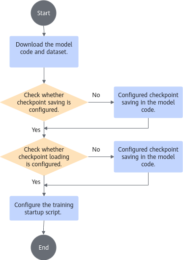
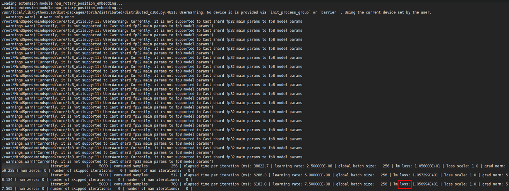
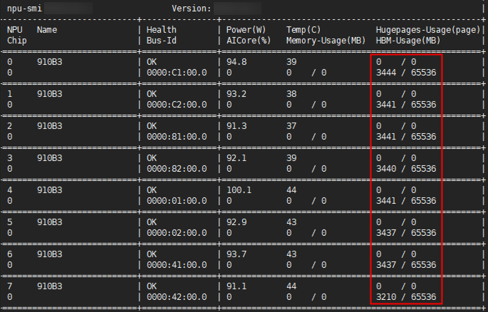
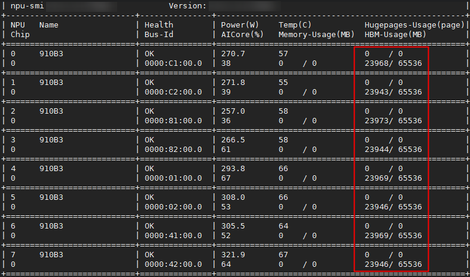

# Using via Command Line<a name="ZH-CN_TOPIC_0000002479386546"></a>

<!-- md-trans-meta sourceCommit=unknown translatedAt=2026-06-09T08:03:03.471Z pushedAt=2026-06-09T09:02:55.512Z -->

## (Optional) Configuring Components<a name="ZH-CN_TOPIC_0000002511346449"></a>

If you have already configured resumable training-related functions when installing Ascend Device Plugin and NodeD, you can skip this chapter. If not, you need to configure [Ascend Device Plugin](#section14208511958) and [NodeD](#section162092113510) accordingly.

**Configuring Ascend Device Plugin<a name="section14208511958"></a>**

Only image-based startup of Ascend Device Plugin is supported.

1. Modify the startup YAML of Ascend Device Plugin based on the fault handling mode used. The bold parts below indicate the modifications.
    1. Rescheduling mode

        >[!NOTE]
        >In rescheduling mode, an exception in Ascend Device Plugin also triggers fault rescheduling.

        <pre codetype="yaml">
        ...
              containers:
              - image: ascend-k8sdeviceplugin:v{version}
                name: device-plugin-01
                resources:
                  requests:
                    memory: 500Mi
                    cpu: 500m
                  limits:
                    memory: 500Mi
                    cpu: 500m
                command: [ "/bin/bash", "-c", "--"]
                args: [ "device-plugin
                         -useAscendDocker=true
                         <strong>-volcanoType=true                    # Volcano must be used in rescheduling scenarios</strong>
                         <strong>-autoStowing=true                    # Whether to enable the automatic management switch. The default value is true. Setting it to false disables automatic management. When the chip health status changes from unhealthy to healthy, it will not be automatically added to the scheduled resources pool. When automatic management is disabled, after the chip parameter plane network fault recovery, it will not be automatically added to the scheduled resources pool. This feature is only applicable to Atlas training series products.</strong>
                         <strong>-listWatchPeriod=5                   # Set the health status check period, in seconds. Range: [3,1800]</strong>
                         -logFile=/var/log/mindx-dl/devicePlugin/devicePlugin.log
                         -logLevel=0" ]
                securityContext:
                  privileged: true
                  readOnlyRootFilesystem: true
        ...</pre>

    2. (Optional) Graceful fault tolerance mode: Based on the rescheduling configuration, add the `-hotReset` field.

        >[!NOTE]
        >- The graceful fault tolerance feature has been sunset. It will not be supported in PyTorch versions beyond 7.2.RC1 and MindSpore versions beyond 7.1.RC1.
        >- The function corresponding to `-hotReset = 1` has been sunset.

        <pre codetype="yaml">
        ...
              containers:
              - image: ascend-k8sdeviceplugin:v{version}
                name: device-plugin-01
                resources:
                  requests:
                    memory: 500Mi
                    cpu: 500m
                  limits:
                    memory: 500Mi
                    cpu: 500m
                command: [ "/bin/bash", "-c", "--"]
                args: [ "device-plugin
                         -useAscendDocker=true
                         -volcanoType=true                    # Volcano must be used in rescheduling scenarios
                         -autoStowing=true                    # Whether to enable the automatic management switch. The default value is true. Setting it to false disables automatic management. When the chip health status changes from unhealthy to healthy, it will not be automatically added to the scheduled resource pool. When automatic management is disabled, the chip will not be automatically added to the scheduled resource pool after the parameter plane network fault recovery. This feature is only applicable to Atlas training series products.
                         <strong>-hotReset=1 # Enable graceful fault tolerance mode. The system will attempt to automatically reset faulty chips.</strong>
                         -listWatchPeriod=5                   # Health status check period, in seconds. Range: [3,1800]
                         -logFile=/var/log/mindx-dl/devicePlugin/devicePlugin.log
                         -logLevel=0" ]
                securityContext:
                  privileged: true
                  readOnlyRootFilesystem: true
        ...</pre>

2. Run the following command on the K8s management node to start Ascend Device Plugin.

    ```shell
    kubectl apply -f device-plugin-xxx-v{version}.yaml
    ```

    The following is an example of starting this component in an Atlas training environment:

    ```shell
    kubectl apply -f device-plugin-volcano-v{version}.yaml
    ```

**Configuring NodeD<a name="section162092113510"></a>**

You can configure the interval for reporting node status by manually modifying the NodeD startup YAML.

1. Go to the component decompression directory and run the following command to open the startup YAML file of NodeD.

    ```shell
    vi noded-v{version}.yaml
    ```

2. Modify the `-reportInterval` parameter in the `args` line of the YAML file, as shown below:

    <pre codetype="yaml">
    ...
              env:
                - name: NODE_NAME
                  valueFrom:
                    fieldRef:
                      fieldPath: spec.nodeName
              imagePullPolicy: Never
              command: [ "/bin/bash", "-c", "--"]
              args: [ "/usr/local/bin/noded -logFile=/var/log/mindx-dl/noded/noded.log -logLevel=0 <strong>-reportInterval=5</strong>" ]
              securityContext:
                readOnlyRootFilesystem: true
                allowPrivilegeEscalation: true
              volumeMounts:
                - name: log-noded
    ...</pre>

## Building an Image<a name="ZH-CN_TOPIC_0000002511426469"></a>

### Building a MindSpeed-LLM Training Image (PyTorch)<a name="ZH-CN_TOPIC_0000002479386504"></a>

[MindSpeed-LLM](https://gitcode.com/Ascend/MindSpeed-LLM/tree/2.3.0), as the Ascend large model training framework, aims to provide an end-to-end large language model training solution for Ascend chips, including distributed pre-training, distributed instruction fine-tuning, distributed preference alignment, and the corresponding development toolchain. The [MindSpeed-LLM User Guide](https://gitcode.com/Ascend/MindSpeed-LLM/blob/1.0.0/docs/USER_GUIDE.md) includes chapters on repository cloning, environment setup, and large model training. To build a MindSpeed-LLM training framework image, you can refer to this section and the [MindSpeed-LLM User Guide](https://gitcode.com/Ascend/MindSpeed-LLM/blob/1.0.0/docs/USER_GUIDE.md).

Resumable training can be built based on the base training image. For details on building the base training image, see the [Building a Container Image Using Dockerfile (PyTorch)](../../references/common_operations.md#building-a-container-image-using-dockerfile-pytorch) section.

This section demonstrates how to build a training image based on Ubuntu 20.04, incorporating the steps for building the base training image.

>[!NOTE]
>The following example uses MindSpeed-LLM version 2.3.0.

**Preparing Software Packages<a name="zh-cn_topic_0000002039339945_section18254161612586"></a>**

As shown in [Table 1](#zh-cn_topic_0000002039339945_table1172542119019),obtain the software packages of the corresponding OS and prepare the Dockerfile and script file required by the image. In the package names, `{version}` indicates the version number, `{arch}` indicates the architecture, and `{chip_type}` indicates the chip type.

**Table 1**  Preparing software packages

<a name="zh-cn_topic_0000002039339945_table1172542119019"></a>
<table><thead align="left"><tr id="zh-cn_topic_0000002039339945_row157251121508"><th class="cellrowborder" valign="top" width="24.55%" id="mcps1.2.5.1.1"><p id="zh-cn_topic_0000002039339945_p1441653254"><a name="zh-cn_topic_0000002039339945_p1441653254"></a><a name="zh-cn_topic_0000002039339945_p1441653254"></a>Software Package</p>
</th>
<th class="cellrowborder" valign="top" width="25.45%" id="mcps1.2.5.1.2"><p id="zh-cn_topic_0000002039339945_p2052053751"><a name="zh-cn_topic_0000002039339945_p2052053751"></a><a name="zh-cn_topic_0000002039339945_p2052053751"></a>Required</p>
</th>
<th class="cellrowborder" valign="top" width="25%" id="mcps1.2.5.1.3"><p id="zh-cn_topic_0000002039339945_p657531455"><a name="zh-cn_topic_0000002039339945_p657531455"></a><a name="zh-cn_topic_0000002039339945_p657531455"></a>Description</p>
</th>
<th class="cellrowborder" valign="top" width="25%" id="mcps1.2.5.1.4"><p id="zh-cn_topic_0000002039339945_p1859531759"><a name="zh-cn_topic_0000002039339945_p1859531759"></a><a name="zh-cn_topic_0000002039339945_p1859531759"></a>Obtaining Method</p>
</th>
</tr>
</thead>
<tbody><tr id="zh-cn_topic_0000002039339945_row16726192116014"><td class="cellrowborder" valign="top" width="24.55%" headers="mcps1.2.5.1.1 "><p id="zh-cn_topic_0000002039339945_p1754534515"><a name="zh-cn_topic_0000002039339945_p1754534515"></a><a name="zh-cn_topic_0000002039339945_p1754534515"></a>taskd-<em id="i2511021165615"><a name="i2511021165615"></a><a name="i2511021165615"></a>{version}</em>-py3-none-linux_{arch}.whl</p>
</td>
<td class="cellrowborder" valign="top" width="25.45%" headers="mcps1.2.5.1.2 "><p id="p4321152352612"><a name="p4321152352612"></a><a name="p4321152352612"></a>Yes</p>
</td>
<td class="cellrowborder" valign="top" width="25%" headers="mcps1.2.5.1.3 "><p id="zh-cn_topic_0000002039339945_p205155310512"><a name="zh-cn_topic_0000002039339945_p205155310512"></a><a name="zh-cn_topic_0000002039339945_p205155310512"></a>Resumable training whl package</p>
<div class="note" id="zh-cn_topic_0000002039339945_note494818501423"><a name="zh-cn_topic_0000002039339945_note494818501423"></a><a name="zh-cn_topic_0000002039339945_note494818501423"></a><span class="notetitle"> Note:</span><div class="notebody"><p id="zh-cn_topic_0000002039339945_p159489506423"><a name="zh-cn_topic_0000002039339945_p159489506423"></a><a name="zh-cn_topic_0000002039339945_p159489506423"></a>Before installing <span id="ph1670711477256"><a name="ph1670711477256"></a><a name="ph1670711477256"></a>TaskD</span>, ensure that the <span id="zh-cn_topic_0000002039339945_ph998914174412"><a name="zh-cn_topic_0000002039339945_ph998914174412"></a><a name="zh-cn_topic_0000002039339945_ph998914174412"></a>PyTorch</span> framework is correctly installed. The currently supported <span id="zh-cn_topic_0000002039339945_ph2908133144419"><a name="zh-cn_topic_0000002039339945_ph2908133144419"></a><a name="zh-cn_topic_0000002039339945_ph2908133144419"></a>PyTorch</span> versions are 2.1.0, 2.3.0, 2.4.0, 2.5.0, 2.6.0, 2.7.1. TaskD depends on the PyTorch framework. Select a PyTorch version without known security vulnerabilities or obtain the corresponding version with security issues fixed from the official community.</p>
</div></div>
</td>
<td class="cellrowborder" valign="top" width="25%" headers="mcps1.2.5.1.4 "><p id="zh-cn_topic_0000002039339945_p19595310517"><a name="zh-cn_topic_0000002039339945_p19595310517"></a><a name="zh-cn_topic_0000002039339945_p19595310517"></a><a href="https://www.hiascend.com/zh/developer/download/community/result?module=dl%2Bcann" target="_blank" rel="noopener noreferrer">Download Link</a></p>
<div class="note" id="zh-cn_topic_0000002039339945_note1386820525510"><a name="zh-cn_topic_0000002039339945_note1386820525510"></a><a name="zh-cn_topic_0000002039339945_note1386820525510"></a><span class="notetitle">Note:</span><div class="notebody"><p id="zh-cn_topic_0000002039339945_p12512532515"><a name="zh-cn_topic_0000002039339945_p12512532515"></a><a name="zh-cn_topic_0000002039339945_p12512532515"></a>The link points to the download page of the <span id="ph480901420289"><a name="ph480901420289"></a><a name="ph480901420289"></a>TaskD's</span> compressed package Ascend-mindxdl-taskd_<em id="i112838253389"><a name="i112838253389"></a><a name="i112838253389"></a>{version}</em>_linux-<em id="i1328312515383"><a name="i1328312515383"></a><a name="i1328312515383"></a>{arch}</em>.zip. You need to decompress it to obtain the corresponding whl software package.</p>
</div></div>
</td>
</tr>
<tr id="zh-cn_topic_0000002039339945_row572619211108"><td class="cellrowborder" valign="top" width="24.55%" headers="mcps1.2.5.1.1 "><p id="zh-cn_topic_0000002039339945_p1863531756"><a name="zh-cn_topic_0000002039339945_p1863531756"></a><a name="zh-cn_topic_0000002039339945_p1863531756"></a>mindio_ttp-<em id="zh-cn_topic_0000002039339945_i15340181201416"><a name="zh-cn_topic_0000002039339945_i15340181201416"></a><a name="zh-cn_topic_0000002039339945_i15340181201416"></a>{version}</em>-py3-none-linux_<em id="zh-cn_topic_0000002039339945_i19614531957"><a name="zh-cn_topic_0000002039339945_i19614531957"></a><a name="zh-cn_topic_0000002039339945_i19614531957"></a>{arch}</em>.whl</p>
</td>
<td class="cellrowborder" valign="top" width="25.45%" headers="mcps1.2.5.1.2 "><p id="zh-cn_topic_0000002039339945_p96553958"><a name="zh-cn_topic_0000002039339945_p96553958"></a><a name="zh-cn_topic_0000002039339945_p96553958"></a>Yes</p>
</td>
<td class="cellrowborder" valign="top" width="25%" headers="mcps1.2.5.1.3 "><p id="zh-cn_topic_0000002039339945_p66253359"><a name="zh-cn_topic_0000002039339945_p66253359"></a><a name="zh-cn_topic_0000002039339945_p66253359"></a><span id="zh-cn_topic_0000002039339945_ph845710020145"><a name="zh-cn_topic_0000002039339945_ph845710020145"></a><a name="zh-cn_topic_0000002039339945_ph845710020145"></a>MindIO TFT</span> installation package.</p>
</td>
<td class="cellrowborder" valign="top" width="25%" headers="mcps1.2.5.1.4 "><p id="zh-cn_topic_0000002039339945_p1862053354"><a name="zh-cn_topic_0000002039339945_p1862053354"></a><a name="zh-cn_topic_0000002039339945_p1862053354"></a><a href="https://www.hiascend.com/zh/developer/download/community/result?module=dl%2Bcann" target="_blank" rel="noopener noreferrer">Download Link</a></p>
</td>
</tr>
<tr id="zh-cn_topic_0000002039339945_row672652117018"><td class="cellrowborder" valign="top" width="24.55%" headers="mcps1.2.5.1.1 "><p id="zh-cn_topic_0000002039339945_p1468532510"><a name="zh-cn_topic_0000002039339945_p1468532510"></a><a name="zh-cn_topic_0000002039339945_p1468532510"></a>apex-0.1+ascend-cp3x-cp3x-linux_{arch}.whl</p>
</td>
<td class="cellrowborder" valign="top" width="25.45%" headers="mcps1.2.5.1.2 "><p id="zh-cn_topic_0000002039339945_p1869531256"><a name="zh-cn_topic_0000002039339945_p1869531256"></a><a name="zh-cn_topic_0000002039339945_p1869531256"></a>Yes</p>
<p id="zh-cn_topic_0000002039339945_p156353454"><a name="zh-cn_topic_0000002039339945_p156353454"></a><a name="zh-cn_topic_0000002039339945_p156353454"></a>MindSpeed-LLM dependency</p>
<p id="zh-cn_topic_0000002039339945_p1861353651"><a name="zh-cn_topic_0000002039339945_p1861353651"></a><a name="zh-cn_topic_0000002039339945_p1861353651"></a></p>
</td>
<td class="cellrowborder" valign="top" width="25%" headers="mcps1.2.5.1.3 "><p id="zh-cn_topic_0000002039339945_p166105316515"><a name="zh-cn_topic_0000002039339945_p166105316515"></a><a name="zh-cn_topic_0000002039339945_p166105316515"></a>Mixed precision training uses a mix of single-precision (float32) and half-precision (float16) data types during training, combining both and using the same hyperparameters to achieve almost the same precision as float32.</p>
<p id="zh-cn_topic_0000002039339945_zh-cn_topic_0000001497364957_p626262173118"><a name="zh-cn_topic_0000002039339945_zh-cn_topic_0000001497364957_p626262173118"></a><a name="zh-cn_topic_0000002039339945_zh-cn_topic_0000001497364957_p626262173118"></a>The cp3x in the software package indicates the Python version number. For example, x being 10 indicates Python 3.10. The specific Python version is subject to the MindSpeed-LLM version.</p>
</td>
<td class="cellrowborder" valign="top" width="25%" headers="mcps1.2.5.1.4 "><p id="zh-cn_topic_0000002039339945_zh-cn_topic_0000001497364957_p39761346403"><a name="zh-cn_topic_0000002039339945_zh-cn_topic_0000001497364957_p39761346403"></a><a name="zh-cn_topic_0000002039339945_zh-cn_topic_0000001497364957_p39761346403"></a>For details, see the "<a href="https://gitcode.com/Ascend/apex/blob/master/docs/zh/installing_apex.md">Installing the APEX Module</a>" section in <span id="zh-cn_topic_0000002039339945_ph156792413596"><a name="zh-cn_topic_0000002039339945_ph156792413596"></a><a name="zh-cn_topic_0000002039339945_ph156792413596"></a>Ascend Extension for PyTorch Installation Guide</span>, and compile the APEX package based on the actual situation.</p>
<p id="zh-cn_topic_0000002039339945_p1761531257"><a name="zh-cn_topic_0000002039339945_p1761531257"></a><a name="zh-cn_topic_0000002039339945_p1761531257"></a></p>
</td>
</tr>
<tr id="zh-cn_topic_0000002039339945_row197268213011"><td class="cellrowborder" valign="top" width="24.55%" headers="mcps1.2.5.1.1 "><p id="zh-cn_topic_0000002039339945_p1361953254"><a name="zh-cn_topic_0000002039339945_p1361953254"></a><a name="zh-cn_topic_0000002039339945_p1361953254"></a>torch_npu-2.7.1.<em id="zh-cn_topic_0000002039339945_i16204112111321"><a name="zh-cn_topic_0000002039339945_i16204112111321"></a><a name="zh-cn_topic_0000002039339945_i16204112111321"></a>{version}</em>-cp3x-cp3x-manylinux_2_28_{arch}.whl</p>
</td>
<td class="cellrowborder" valign="top" width="25.45%" headers="mcps1.2.5.1.2 "><p id="zh-cn_topic_0000002039339945_p56185314510"><a name="zh-cn_topic_0000002039339945_p56185314510"></a><a name="zh-cn_topic_0000002039339945_p56185314510"></a>Yes</p>
<p id="zh-cn_topic_0000002039339945_p186653757"><a name="zh-cn_topic_0000002039339945_p186653757"></a><a name="zh-cn_topic_0000002039339945_p186653757"></a>MindSpeed-LLM dependency</p>
</td>
<td class="cellrowborder" valign="top" width="25%" headers="mcps1.2.5.1.3 "><p id="zh-cn_topic_0000002039339945_p15720535517"><a name="zh-cn_topic_0000002039339945_p15720535517"></a><a name="zh-cn_topic_0000002039339945_p15720535517"></a>Ascend Extension for PyTorch is a deep learning adaptation framework based on Ascend, enabling Ascend NPUs to support the PyTorch framework, providing PyTorch users with the superior computing power of Ascend AI processors.</p>
<p id="zh-cn_topic_0000002039339945_zh-cn_topic_0000001497364957_p849562217019"><a name="zh-cn_topic_0000002039339945_zh-cn_topic_0000001497364957_p849562217019"></a><a name="zh-cn_topic_0000002039339945_zh-cn_topic_0000001497364957_p849562217019"></a>The cp3x in the software package indicates the Python version number. For example, x being 10 indicates Python 3.10. The specific Python version is subject to the MindSpeed-LLM version.</p>
</td>
<td class="cellrowborder" valign="top" width="25%" headers="mcps1.2.5.1.4 "><p id="zh-cn_topic_0000002039339945_p10718533510"><a name="zh-cn_topic_0000002039339945_p10718533510"></a><a name="zh-cn_topic_0000002039339945_p10718533510"></a><a href="https://www.hiascend.com/document/detail/zh/Pytorch/720/configandinstg/instg/insg_0004.html" target="_blank" rel="noopener noreferrer">Download Link</a></p>
<div class="note" id="zh-cn_topic_0000002039339945_note1165115165020"><a name="zh-cn_topic_0000002039339945_note1165115165020"></a><a name="zh-cn_topic_0000002039339945_note1165115165020"></a><span class="notetitle">Note:</span><div class="notebody"><p id="zh-cn_topic_0000002039339945_p167047813263"><a name="zh-cn_topic_0000002039339945_p167047813263"></a><a name="zh-cn_topic_0000002039339945_p167047813263"></a>To use the <span id="zh-cn_topic_0000002039339945_ph1987542822613"><a name="zh-cn_topic_0000002039339945_ph1987542822613"></a><a name="zh-cn_topic_0000002039339945_ph1987542822613"></a>PyTorch</span> model from the MindSpeed-LLM code repository, <span id="zh-cn_topic_0000002039339945_ph1412723132619"><a name="zh-cn_topic_0000002039339945_ph1412723132619"></a><a name="zh-cn_topic_0000002039339945_ph1412723132619"></a>Ascend Extension for PyTorch</span> 2.6.0 or later is required.</p>
</div></div>
</td>
</tr>
<tr id="zh-cn_topic_0000002039339945_row1412215399516"><td class="cellrowborder" valign="top" width="24.55%" headers="mcps1.2.5.1.1 "><a name="zh-cn_topic_0000002039339945_ul104867135415"></a><a name="zh-cn_topic_0000002039339945_ul104867135415"></a><ul id="zh-cn_topic_0000002039339945_ul104867135415"><li><span id="zh-cn_topic_0000002039339945_ph0853174512272"><a name="zh-cn_topic_0000002039339945_ph0853174512272"></a><a name="zh-cn_topic_0000002039339945_ph0853174512272"></a>x86_64</span> architecture: torch-2.7.1+cpu.cxx11.abi-cp3x-cp3x-linux_x86_64.whl</li><li><span id="zh-cn_topic_0000002039339945_ph7852164518272"><a name="zh-cn_topic_0000002039339945_ph7852164518272"></a><a name="zh-cn_topic_0000002039339945_ph7852164518272"></a>ARM</span> architecture: torch-2.7.1+cpu-cp3x-cp3x-manylinux_2_28_aarch64.whl</li></ul>
</td>
<td class="cellrowborder" valign="top" width="25.45%" headers="mcps1.2.5.1.2 "><p id="zh-cn_topic_0000002039339945_p871953357"><a name="zh-cn_topic_0000002039339945_p871953357"></a><a name="zh-cn_topic_0000002039339945_p871953357"></a>Yes</p>
<p id="zh-cn_topic_0000002039339945_p17715531453"><a name="zh-cn_topic_0000002039339945_p17715531453"></a><a name="zh-cn_topic_0000002039339945_p17715531453"></a>MindSpeed-LLM dependency</p>
</td>
<td class="cellrowborder" valign="top" width="25%" headers="mcps1.2.5.1.3 "><p id="zh-cn_topic_0000002039339945_zh-cn_topic_0000001497364957_p11461347141013"><a name="zh-cn_topic_0000002039339945_zh-cn_topic_0000001497364957_p11461347141013"></a><a name="zh-cn_topic_0000002039339945_zh-cn_topic_0000001497364957_p11461347141013"></a>Official <span id="zh-cn_topic_0000002039339945_ph19355165113512"><a name="zh-cn_topic_0000002039339945_ph19355165113512"></a><a name="zh-cn_topic_0000002039339945_ph19355165113512"></a>PyTorch</span> package.</p><p>The cp3x in the software package indicates the Python version number. For example, x being 10 indicates Python 3.10. The specific Python version is subject to the MindSpeed-LLM version.</p>
</td>
<td class="cellrowborder" valign="top" width="25%" headers="mcps1.2.5.1.4 "><p id="zh-cn_topic_0000002039339945_p99745421447"><a name="zh-cn_topic_0000002039339945_p99745421447"></a><a name="zh-cn_topic_0000002039339945_p99745421447"></a><a href="https://download.pytorch.org/whl/torch/" target="_blank" rel="noopener noreferrer">Download Link</a></p>
<p id="zh-cn_topic_0000002039339945_p483943610920"><a name="zh-cn_topic_0000002039339945_p483943610920"></a><a name="zh-cn_topic_0000002039339945_p483943610920"></a></p>
</td>
</tr>
<tr id="zh-cn_topic_0000002039339945_row151232039750"><td class="cellrowborder" valign="top" width="24.55%" headers="mcps1.2.5.1.1 "><p id="zh-cn_topic_0000002039339945_p4714531658"><a name="zh-cn_topic_0000002039339945_p4714531658"></a><a name="zh-cn_topic_0000002039339945_p4714531658"></a>Ascend-cann-{chip_type}-ops_{version}_linux-{arch}.run</p>
</td>
<td class="cellrowborder" valign="top" width="25.45%" headers="mcps1.2.5.1.2 "><p id="zh-cn_topic_0000002039339945_p1774531250"><a name="zh-cn_topic_0000002039339945_p1774531250"></a><a name="zh-cn_topic_0000002039339945_p1774531250"></a>Yes</p><p>For versions before CANN 8.5.0, this package is named Ascend-cann-kernels-<em>{chip_type}</em>_<em>{version}</em>_linux-<em>{arch}</em>.run</p>
</td>
<td class="cellrowborder" valign="top" width="25%" headers="mcps1.2.5.1.3 "><p id="zh-cn_topic_0000002039339945_p5720531514"><a name="zh-cn_topic_0000002039339945_p5720531514"></a><a name="zh-cn_topic_0000002039339945_p5720531514"></a>CANN operator package.</p>
</td>
<td class="cellrowborder" valign="top" width="25%" headers="mcps1.2.5.1.4 "><p id="zh-cn_topic_0000002039339945_p87153755"><a name="zh-cn_topic_0000002039339945_p87153755"></a><a name="zh-cn_topic_0000002039339945_p87153755"></a><a href="https://www.hiascend.com/zh/developer/download/community/result?module=cann" target="_blank" rel="noopener noreferrer">Download Link</a></p>
<div class="note" id="zh-cn_topic_0000002039339945_note13775154104217"><a name="zh-cn_topic_0000002039339945_note13775154104217"></a><a name="zh-cn_topic_0000002039339945_note13775154104217"></a><span class="notetitle">Note:</span><div class="notebody"><p id="zh-cn_topic_0000002039339945_p2075812144313"><a name="zh-cn_topic_0000002039339945_p2075812144313"></a><a name="zh-cn_topic_0000002039339945_p2075812144313"></a>Obtain the software package that matches the server.</p>
</div></div>
</td>
</tr>
<tr id="row1173819266428"><td class="cellrowborder" valign="top" width="24.55%" headers="mcps1.2.5.1.1 "><p id="p7738142674217"><a name="p7738142674217"></a><a name="p7738142674217"></a>Ascend-cann-toolkit_{version}_linux-{arch}.run</p>
</td>
<td class="cellrowborder" valign="top" width="25.45%" headers="mcps1.2.5.1.2 "><p id="p12738626184214"><a name="p12738626184214"></a><a name="p12738626184214"></a>Yes</p>
</td>
<td class="cellrowborder" valign="top" width="25%" headers="mcps1.2.5.1.3 "><p id="p13738226114218"><a name="p13738226114218"></a><a name="p13738226114218"></a>CANN Toolkit package.</p>
</td>
<td class="cellrowborder" valign="top" width="25%" headers="mcps1.2.5.1.4 "><p id="p19271154916428"><a name="p19271154916428"></a><a name="p19271154916428"></a><a href="https://www.hiascend.com/zh/developer/download/community/result?module=cann" target="_blank" rel="noopener noreferrer">Download Link</a></p>
<div class="note" id="note3272104913427"><a name="note3272104913427"></a><a name="note3272104913427"></a><span class="notetitle">Note:</span><div class="notebody"><p id="p2272174920421"><a name="p2272174920421"></a><a name="p2272174920421"></a>Obtain the software package that matches the server.</p>
</div></div>
</td>
</tr>
<tr id="zh-cn_topic_0000002039339945_row121231639952"><td class="cellrowborder" valign="top" width="24.55%" headers="mcps1.2.5.1.1 "><p id="zh-cn_topic_0000002039339945_p1048218391768"><a name="zh-cn_topic_0000002039339945_p1048218391768"></a><a name="zh-cn_topic_0000002039339945_p1048218391768"></a>MindSpeed</p>
</td>
<td class="cellrowborder" valign="top" width="25.45%" headers="mcps1.2.5.1.2 "><p id="zh-cn_topic_0000002039339945_p3482939367"><a name="zh-cn_topic_0000002039339945_p3482939367"></a><a name="zh-cn_topic_0000002039339945_p3482939367"></a>Yes</p>
</td>
<td class="cellrowborder" valign="top" width="25%" headers="mcps1.2.5.1.3 "><p id="zh-cn_topic_0000002039339945_p048215393610"><a name="zh-cn_topic_0000002039339945_p048215393610"></a><a name="zh-cn_topic_0000002039339945_p048215393610"></a>MindSpeed is a large model acceleration library for Ascend devices.</p>
</td>
<td class="cellrowborder" valign="top" width="25%" headers="mcps1.2.5.1.4 "><p id="zh-cn_topic_0000002039339945_p7482193913619"><a name="zh-cn_topic_0000002039339945_p7482193913619"></a><a name="zh-cn_topic_0000002039339945_p7482193913619"></a>git clone https://gitcode.com/Ascend/MindSpeed.git</p>
<p id="zh-cn_topic_0000002039339945_p9482139663"><a name="zh-cn_topic_0000002039339945_p9482139663"></a><a name="zh-cn_topic_0000002039339945_p9482139663"></a>cd MindSpeed</p>
<p id="zh-cn_topic_0000002039339945_p1948213912618"><a name="zh-cn_topic_0000002039339945_p1948213912618"></a><a name="zh-cn_topic_0000002039339945_p1948213912618"></a>git checkout 2.3.0_core_r0.12.1</p>
</td>
</tr>
<tr id="zh-cn_topic_0000002039339945_row144125121466"><td class="cellrowborder" valign="top" width="24.55%" headers="mcps1.2.5.1.1 "><p id="zh-cn_topic_0000002039339945_p848215391768"><a name="zh-cn_topic_0000002039339945_p848215391768"></a><a name="zh-cn_topic_0000002039339945_p848215391768"></a>version.info</p>
</td>
<td class="cellrowborder" valign="top" width="25.45%" headers="mcps1.2.5.1.2 "><p id="zh-cn_topic_0000002039339945_p1548319391465"><a name="zh-cn_topic_0000002039339945_p1548319391465"></a><a name="zh-cn_topic_0000002039339945_p1548319391465"></a>Yes</p>
<p id="zh-cn_topic_0000002039339945_p16483239968"><a name="zh-cn_topic_0000002039339945_p16483239968"></a><a name="zh-cn_topic_0000002039339945_p16483239968"></a>Dependency file for installing CANN.</p>
</td>
<td class="cellrowborder" valign="top" width="25%" headers="mcps1.2.5.1.3 "><p id="zh-cn_topic_0000002039339945_p14483939561"><a name="zh-cn_topic_0000002039339945_p14483939561"></a><a name="zh-cn_topic_0000002039339945_p14483939561"></a>Driver version information file.</p>
</td>
<td class="cellrowborder" valign="top" width="25%" headers="mcps1.2.5.1.4 "><p id="zh-cn_topic_0000002039339945_p748314394617"><a name="zh-cn_topic_0000002039339945_p748314394617"></a><a name="zh-cn_topic_0000002039339945_p748314394617"></a>Copy /usr/local/Ascend/driver/version.info from the host.</p>
</td>
</tr>
<tr id="zh-cn_topic_0000002039339945_row17301171913614"><td class="cellrowborder" valign="top" width="24.55%" headers="mcps1.2.5.1.1 "><p id="zh-cn_topic_0000002039339945_p148310396616"><a name="zh-cn_topic_0000002039339945_p148310396616"></a><a name="zh-cn_topic_0000002039339945_p148310396616"></a>ascend_install.info</p>
</td>
<td class="cellrowborder" valign="top" width="25.45%" headers="mcps1.2.5.1.2 "><p id="zh-cn_topic_0000002039339945_p348313399610"><a name="zh-cn_topic_0000002039339945_p348313399610"></a><a name="zh-cn_topic_0000002039339945_p348313399610"></a>Yes</p>
<p id="zh-cn_topic_0000002039339945_p1348313391961"><a name="zh-cn_topic_0000002039339945_p1348313391961"></a><a name="zh-cn_topic_0000002039339945_p1348313391961"></a>Dependency file for installing CANN.</p>
</td>
<td class="cellrowborder" valign="top" width="25%" headers="mcps1.2.5.1.3 "><p id="zh-cn_topic_0000002039339945_p5483239564"><a name="zh-cn_topic_0000002039339945_p5483239564"></a><a name="zh-cn_topic_0000002039339945_p5483239564"></a>Driver installation information file.</p>
</td>
<td class="cellrowborder" valign="top" width="25%" headers="mcps1.2.5.1.4 "><p id="zh-cn_topic_0000002039339945_p2483339861"><a name="zh-cn_topic_0000002039339945_p2483339861"></a><a name="zh-cn_topic_0000002039339945_p2483339861"></a>Copy /etc/ascend_install.info from the host.</p>
</td>
</tr>
<tr id="zh-cn_topic_0000002039339945_row93022191368"><td class="cellrowborder" valign="top" width="24.55%" headers="mcps1.2.5.1.1 "><p id="zh-cn_topic_0000002039339945_p15485173911615"><a name="zh-cn_topic_0000002039339945_p15485173911615"></a><a name="zh-cn_topic_0000002039339945_p15485173911615"></a>Dllogger code repository</p>
</td>
<td class="cellrowborder" valign="top" width="25.45%" headers="mcps1.2.5.1.2 "><p id="zh-cn_topic_0000002039339945_p248514391563"><a name="zh-cn_topic_0000002039339945_p248514391563"></a><a name="zh-cn_topic_0000002039339945_p248514391563"></a>Yes</p>
</td>
<td class="cellrowborder" valign="top" width="25%" headers="mcps1.2.5.1.3 "><p id="zh-cn_topic_0000002039339945_p164850391565"><a name="zh-cn_topic_0000002039339945_p164850391565"></a><a name="zh-cn_topic_0000002039339945_p164850391565"></a>PyTorch log tool.</p>
</td>
<td class="cellrowborder" valign="top" width="25%" headers="mcps1.2.5.1.4 "><p id="zh-cn_topic_0000002039339945_p1548619391164"><a name="zh-cn_topic_0000002039339945_p1548619391164"></a><a name="zh-cn_topic_0000002039339945_p1548619391164"></a>git clone https://github.com/NVIDIA/dllogger.git</p>
</td>
</tr>
<tr id="zh-cn_topic_0000002039339945_row33025197610"><td class="cellrowborder" valign="top" width="24.55%" headers="mcps1.2.5.1.1 "><p id="zh-cn_topic_0000002039339945_p0486133919618"><a name="zh-cn_topic_0000002039339945_p0486133919618"></a><a name="zh-cn_topic_0000002039339945_p0486133919618"></a>get-pip.py</p>
</td>
<td class="cellrowborder" valign="top" width="25.45%" headers="mcps1.2.5.1.2 "><p id="zh-cn_topic_0000002039339945_p1148619393610"><a name="zh-cn_topic_0000002039339945_p1148619393610"></a><a name="zh-cn_topic_0000002039339945_p1148619393610"></a>Yes</p>
</td>
<td class="cellrowborder" valign="top" width="25%" headers="mcps1.2.5.1.3 "><p id="zh-cn_topic_0000002039339945_p164861439461"><a name="zh-cn_topic_0000002039339945_p164861439461"></a><a name="zh-cn_topic_0000002039339945_p164861439461"></a>Used to install the pip module.</p>
</td>
<td class="cellrowborder" valign="top" width="25%" headers="mcps1.2.5.1.4 "><p id="zh-cn_topic_0000002039339945_p34865396611"><a name="zh-cn_topic_0000002039339945_p34865396611"></a><a name="zh-cn_topic_0000002039339945_p34865396611"></a>curl -k https://bootstrap.pypa.io/get-pip.py -o get-pip.py</p>
</td>
</tr>
<tr id="zh-cn_topic_0000002039339945_row03021191165"><td class="cellrowborder" valign="top" width="24.55%" headers="mcps1.2.5.1.1 "><p id="zh-cn_topic_0000002039339945_p15486163919616"><a name="zh-cn_topic_0000002039339945_p15486163919616"></a><a name="zh-cn_topic_0000002039339945_p15486163919616"></a>Dockerfile</p>
</td>
<td class="cellrowborder" valign="top" width="25.45%" headers="mcps1.2.5.1.2 "><p id="zh-cn_topic_0000002039339945_p1448693915619"><a name="zh-cn_topic_0000002039339945_p1448693915619"></a><a name="zh-cn_topic_0000002039339945_p1448693915619"></a>Yes</p>
</td>
<td class="cellrowborder" valign="top" width="25%" headers="mcps1.2.5.1.3 "><p id="zh-cn_topic_0000002039339945_p74862391165"><a name="zh-cn_topic_0000002039339945_p74862391165"></a><a name="zh-cn_topic_0000002039339945_p74862391165"></a>Used to image creation.</p>
</td>
<td class="cellrowborder" valign="top" width="25%" headers="mcps1.2.5.1.4 "><p id="zh-cn_topic_0000002039339945_p9571628104613"><a name="zh-cn_topic_0000002039339945_p9571628104613"></a><a name="zh-cn_topic_0000002039339945_p9571628104613"></a>-</p>
</td>
</tr>
</tbody>
</table>

To prevent software packages from being maliciously tampered with during transmission or storage, you need to download the corresponding digital signature file for integrity verification when downloading software packages.

After downloading the software package, see the [OpenPGP Signature Verification Guide](https://support.huawei.com/enterprise/en/doc/EDOC1100209376) to perform PGP digital signature verification on the software package downloaded from the Support website. If the verification fails, do not use the software package and contact Huawei technical support engineers for resolution.

Before installing or upgrading using a software package, you must also verify the digital signature of the software package following the above process to ensure that the software package has not been tampered with.

For carrier customers, please visit: [https://support.huawei.com/carrier/digitalSignatureAction](https://support.huawei.com/carrier/digitalSignatureAction)

For enterprise customers, please visit: [https://support.huawei.com/enterprise/en/tool/pgp-verify-TL1000000054](https://support.huawei.com/enterprise/en/tool/pgp-verify-TL1000000054)

> [!NOTE]
> This section uses a single Atlas 800T A2 training server, Ubuntu 20.04 Arm, and Python 3.10 as an example to describe how to build a training image. Modify the relevant steps based on the actual situation during use.

**Procedure<a name="zh-cn_topic_0000002039339945_section20489630477"></a>**

1. Prepare the software packages on the host by referring to [Table 1](#zh-cn_topic_0000002039339945_table1172542119019).
2. Write the following Dockerfile.

    ```bash
    FROM ubuntu:20.04
    WORKDIR /root
    COPY . .

    ARG PYTORCH_WHL=torch-2.7.1+cpu-cp310-cp310-manylinux_2_28_aarch64.whl
    ARG PYTORCH_NPU_WHL=torch_npu-2.7.1.{version}-cp310-cp310-manylinux_2_28_aarch64.whl
    ARG APEX_WHL=apex-0.1+ascend-cp310-cp310-linux_aarch64.whl
    ARG HOST_ASCEND_BASE=/usr/local/Ascend
    ARG TOOLKIT_PATH=/usr/local/Ascend/cann
    # The CANN version used in the example is 8.5.0. Modify it based on the actual situation during use.
    ARG TOOLKIT=Ascend-cann-toolkit_8.5.0_linux-aarch64.run
    ARG OPS=Ascend-cann-910b-ops_8.5.0_linux-aarch64.run
    ARG TASKD_WHL=taskd-7.3.0-py3-none-linux_aarch64.whl
    ARG MINDIO_TTP_WHL=mindio_ttp-1.0.0-py3-none-linux_aarch64.whl
    ARG MINDSPEED=MindSpeed
    ARG DLLOGGER=dllogger

    RUN echo "nameserver 114.114.114.114" > /etc/resolv.conf

    RUN echo "deb http://repo.huaweicloud.com/ubuntu-ports/ focal main restricted universe multiverse\n\
    deb http://repo.huaweicloud.com/ubuntu-ports/ focal-updates main restricted universe multiverse\n\
    deb http://repo.huaweicloud.com/ubuntu-ports/ focal-backports main restricted universe multiverse\n\
    deb http://ports.ubuntu.com/ubuntu-ports/ focal-security main restricted universe multiverse" > /etc/apt/sources.list

    ARG DEBIAN_FRONTEND=noninteractive

    # System packages
    RUN umask 0022 && apt update && \
        apt-get install -y --no-install-recommends \
        software-properties-common
    RUN umask 0022 && add-apt-repository ppa:deadsnakes/ppa && \
        apt update && \
        apt autoremove -y python python3 && \
        apt install -y python3.10 python3.10-dev
    # Set up Python symbolic links
    RUN ln -s /usr/bin/python3.10 /usr/bin/python
    RUN ln -s /usr/bin/python3.10 /usr/bin/python3
    RUN ln -s /usr/bin/python3.10-config /usr/bin/python-config
    RUN ln -s /usr/bin/python3.10-config /usr/bin/python3-config
    # System packages
    RUN umask 0022 && apt update && \
            apt-get install -y --no-install-recommends \
            gcc g++ make cmake vim \
            zlib1g zlib1g-dev \
            openssl libsqlite3-dev libssl-dev \
            libffi-dev unzip pciutils \
            net-tools libblas-dev \
            gfortran libblas3 libopenblas-dev \
            curl unzip liblapack3 liblapack-dev \
            libhdf5-dev libxml2 patch
    # Time zone
    RUN ln -sf /usr/share/zoneinfo/UTC /etc/localtime
    # Configure pip mirror
    RUN mkdir -p ~/.pip \
    && echo '[global] \n\
    index-url=https://mirrors.huaweicloud.com/repository/pypi/simple\n\
    trusted-host=mirrors.huaweicloud.com' >> ~/.pip/pip.conf
    # pip3.10
    RUN cd /tmp && \
        apt-get download python3-distutils && \
        dpkg-deb -x python3-distutils_*.deb / && \
        rm python3-distutils_*.deb && \
        cd - && \
        python get-pip.py && \
        rm get-pip.py
    RUN umask 0022 && \
        pip install sympy==1.4 && \
        pip install cffi && \
        pip install pathlib2 && \
        pip install grpcio && \
        pip install grpcio-tools && \
        pip install torchvision==0.22.1 && \
        pip install transformers==4.51.0 && \
        pip install absl-py && \
        pip install datasets && \
        pip install tokenizers==0.20.1 && \
        pip install pyOpenSSL
    RUN useradd -d /home/HwHiAiUser -u 1000 -m -s /bin/bash HwHiAiUser
    # Install torch, torch_npu, and apex packages
    RUN umask 0022 && pip install $PYTORCH_WHL && \
        pip install $PYTORCH_NPU_WHL && \
        pip install $APEX_WHL

    # Ascend Packages
    # Before building, copy the host's /usr/local/Ascend/driver/version.info to the current directory
    RUN umask 0022 &&  \
        cp ascend_install.info /etc/ && \
        mkdir -p /usr/local/Ascend/driver/ && \
        cp version.info /usr/local/Ascend/driver/ && \
        chmod +x $TOOLKIT && \
        chmod +x $OPS

    RUN umask 0022 && ./$TOOLKIT --install-path=/usr/local/Ascend/ --install --quiet
    RUN echo "source /usr/local/Ascend/cann/set_env.sh" >> ~/.bashrc
    RUN umask 0022 && ./$OPS --install --quiet

    # After the toolkit package is installed, clear the following files. During container startup, the toolkit package is mounted by Ascend Docker Runtime.
    RUN rm -f version.info && rm -f ascend_install.info \
        rm -rf /usr/local/Ascend/driver/

    RUN umask 0022 && cd $MINDSPEED && \
        pip install -r requirements.txt && \
        pip install -e . && \
        echo "export PYTHONPATH=/root/MindSpeed:\$PYTHONPATH" >> ~/.bashrc

    RUN umask 0022 && cd $DLLOGGER && \
        python setup.py build && \
        python setup.py install

    # Import environment variables
    ENV HCCL_WHITELIST_DISABLE=1

    # Create /lib64/ld-linux-aarch64.so.1
    RUN umask 0022 && \
        if [ ! -d "/lib64" ]; \
        then \
            mkdir /lib64 && ln -sf /lib/ld-linux-aarch64.so.1 /lib64/ld-linux-aarch64.so.1; \
        fi

    # MindCluster resumable training adaptation script.
    RUN umask 0022 && \
        pip install $TASKD_WHL && \
        pip install $MINDIO_TTP_WHL

    # Optional. The following commands must be configured when using graceful fault tolerance, pod-level rescheduling, or process-level rescheduling.
    RUN sed -i '/import os/i import taskd.python.adaptor.patch' $(pip3 show torch | grep Location | awk -F ' ' '{print $2}')/torch/distributed/run.py

    # Install the job scheduling dependency library.
    RUN pip install apscheduler

    RUN rm -rf tmp && \
        rm -f $PYTORCH_WHL && \
        rm -f $PYTORCH_NPU_WHL && \
        rm -f $APEX_WHL && \
        rm -f $TOOLKIT && \
        rm -f $OPS && \
        rm -f $TASKD_WHL && \
        rm -f $MINDIO_TTP_WHL && \
        rm -rf $DLLOGGER && \
        rm -rf Dockerfile
    # Pack the preceding content into the image mindspeed-dl:v1.
    ```

    >[!NOTE]
    >If Python 3.10 cannot be installed successfully through PPA, or the deadsnakes PPA does not provide an image source for Python 3.10, you can download the source code and manually compile and install it.

   1. Build the image. Run the following command to generate the image. To make the Dockerfile more secure, you can define a `HEALTHCHECK` in it based on your service. Check the running status of the container by running the `HEALTHCHECK _[OPTIONS]_ CMD` command inside the container. **Note: Do not omit the the period (".") at the end of the command.**

    ```shell
    docker build -t mindspeed-dl:v1 .
    ```

### Building the MindFormers Training Image (MindSpore)

The [MindSpore Transformers suite](https://gitcode.com/mindspore/mindformers) (hereinafter referred to as MindFormers) aims to build a full-process development suite for large model training, fine-tuning, evaluation, inference, and deployment. It provides mainstream Transformer-based pre-trained models and SOTA downstream task applications, covering rich parallel features. It is expected to help users easily implement large model training and innovative research.

The quick start guide in [MindSpore Transformers documentation](https://www.mindspore.cn/mindformers/docs/en/r1.3.0/start/overview.html) includes installation and quick start chapters, which can be referenced for image creation.

The training image can be built based on the base training image in conjunction with the MindFormers documentation. For details on building the base training image, see the [Building a Container Image Using Dockerfile (MindSpore)](../../references/common_operations.md#building-a-container-image-using-a-dockerfile-mindspore) section.

This section demonstrates how to build a training image based on Ubuntu 20.04, incorporating the steps for building the base training image.

**Preparing Software Packages<a name="zh-cn_topic_0000002003180012_section181941327124212"></a>**

As shown in [Table 1](#zh-cn_topic_0000002003180012_table223643812168), obtain the software packages for the corresponding operating system, and prepare the Dockerfile and script files required for the image. In the software package names, `{version}` represents the version number, `{arch}` represents the architecture, and `{chip_type}` represents the chip type.

**Table 1**  Preparing software packages

<a name="zh-cn_topic_0000002003180012_table223643812168"></a>
<table><thead align="left"><tr id="zh-cn_topic_0000002003180012_row6236938171619"><th class="cellrowborder" valign="top" width="25%" id="mcps1.2.5.1.1"><p id="zh-cn_topic_0000002003180012_p3390131317171"><a name="zh-cn_topic_0000002003180012_p3390131317171"></a><a name="zh-cn_topic_0000002003180012_p3390131317171"></a>Software Package</p>
</th>
<th class="cellrowborder" valign="top" width="25%" id="mcps1.2.5.1.2"><p id="zh-cn_topic_0000002003180012_p173901213151712"><a name="zh-cn_topic_0000002003180012_p173901213151712"></a><a name="zh-cn_topic_0000002003180012_p173901213151712"></a>Required</p>
</th>
<th class="cellrowborder" valign="top" width="25%" id="mcps1.2.5.1.3"><p id="zh-cn_topic_0000002003180012_p239018134178"><a name="zh-cn_topic_0000002003180012_p239018134178"></a><a name="zh-cn_topic_0000002003180012_p239018134178"></a>Description</p>
</th>
<th class="cellrowborder" valign="top" width="25%" id="mcps1.2.5.1.4"><p id="zh-cn_topic_0000002003180012_p1539051321714"><a name="zh-cn_topic_0000002003180012_p1539051321714"></a><a name="zh-cn_topic_0000002003180012_p1539051321714"></a>Obtaining Method</p>
</th>
</tr>
</thead>
<tbody><tr id="zh-cn_topic_0000002003180012_row13237173817161"><td class="cellrowborder" valign="top" width="25%" headers="mcps1.2.5.1.1 "><p id="zh-cn_topic_0000002003180012_p6390191319171"><a name="zh-cn_topic_0000002003180012_p6390191319171"></a><a name="zh-cn_topic_0000002003180012_p6390191319171"></a>MindFormers code repository</p>
</td>
<td class="cellrowborder" valign="top" width="25%" headers="mcps1.2.5.1.2 "><p id="zh-cn_topic_0000002003180012_p13390113131712"><a name="zh-cn_topic_0000002003180012_p13390113131712"></a><a name="zh-cn_topic_0000002003180012_p13390113131712"></a>Yes</p>
</td>
<td class="cellrowborder" valign="top" width="25%" headers="mcps1.2.5.1.3 "><p id="zh-cn_topic_0000002003180012_p153901913131711"><a name="zh-cn_topic_0000002003180012_p153901913131711"></a><a name="zh-cn_topic_0000002003180012_p153901913131711"></a>A full-process development suite for building large model training, fine-tuning, evaluation, inference, and deployment, providing mainstream Transformer-based pre-trained models and SOTA downstream applications, covering rich parallel features.<span id="ph19351335211"><a name="ph19351335211"></a><a name="ph19351335211"></a>.</span></p>
</td>
<td class="cellrowborder" valign="top" width="25%" headers="mcps1.2.5.1.4 "><p id="zh-cn_topic_0000002003180012_p3390131316172"><a name="zh-cn_topic_0000002003180012_p3390131316172"></a><a name="zh-cn_topic_0000002003180012_p3390131316172"></a>git clone https://gitcode.com/mindspore/mindformers.git</p>
<p id="zh-cn_topic_0000002003180012_p5390101317175"><a name="zh-cn_topic_0000002003180012_p5390101317175"></a><a name="zh-cn_topic_0000002003180012_p5390101317175"></a>cd mindformers</p>
<p id="zh-cn_topic_0000002003180012_p9390151318171"><a name="zh-cn_topic_0000002003180012_p9390151318171"></a><a name="zh-cn_topic_0000002003180012_p9390151318171"></a>git checkout 15ff59dd55b84b4dfc7de03f7f20f6e2be3669ec</p>
</td>
</tr>
<tr id="zh-cn_topic_0000002003180012_row14237113817167"><td class="cellrowborder" valign="top" width="25%" headers="mcps1.2.5.1.1 "><p id="zh-cn_topic_0000002003180012_p133901013201717"><a name="zh-cn_topic_0000002003180012_p133901013201717"></a><a name="zh-cn_topic_0000002003180012_p133901013201717"></a>requirements.txt file</p>
</td>
<td class="cellrowborder" valign="top" width="25%" headers="mcps1.2.5.1.2 "><p id="zh-cn_topic_0000002003180012_p10390813171719"><a name="zh-cn_topic_0000002003180012_p10390813171719"></a><a name="zh-cn_topic_0000002003180012_p10390813171719"></a>No</p>
</td>
<td class="cellrowborder" valign="top" width="25%" headers="mcps1.2.5.1.3 "><p id="zh-cn_topic_0000002003180012_p439011371714"><a name="zh-cn_topic_0000002003180012_p439011371714"></a><a name="zh-cn_topic_0000002003180012_p439011371714"></a>Since dependency installation errors may occur when MindSpore is installed via pip, dependencies can be installed first.</p>
</td>
<td class="cellrowborder" valign="top" width="25%" headers="mcps1.2.5.1.4 "><p id="zh-cn_topic_0000002003180012_p6390121315177"><a name="zh-cn_topic_0000002003180012_p6390121315177"></a><a name="zh-cn_topic_0000002003180012_p6390121315177"></a>wget https://gitcode.com/mindspore/mindspore/raw/r2.4.1/requirements.txt</p>
<div class="note" id="zh-cn_topic_0000002003180012_note14449193224617"><a name="zh-cn_topic_0000002003180012_note14449193224617"></a><a name="zh-cn_topic_0000002003180012_note14449193224617"></a><span class="notetitle">**NOTE**</span><div class="notebody"><p id="zh-cn_topic_0000002003180012_p15449133274617"><a name="zh-cn_topic_0000002003180012_p15449133274617"></a><a name="zh-cn_topic_0000002003180012_p15449133274617"></a>The MindSpore package must be used together with <span id="zh-cn_topic_0000002003180012_ph327965117217"><a name="zh-cn_topic_0000002003180012_ph327965117217"></a><a name="zh-cn_topic_0000002003180012_ph327965117217"></a>Atlas training series</span> products. For details, see the MindSpore <a href="https://www.mindspore.cn/install" target="_blank" rel="noopener noreferrer">Installation Guide</a>.</p>
</div></div>
</td>
</tr>
<tr id="zh-cn_topic_0000002003180012_row2023743821619"><td class="cellrowborder" valign="top" width="25%" headers="mcps1.2.5.1.1 "><p id="zh-cn_topic_0000002003180012_p123901513131714"><a name="zh-cn_topic_0000002003180012_p123901513131714"></a><a name="zh-cn_topic_0000002003180012_p123901513131714"></a>mindspore-<em id="zh-cn_topic_0000002003180012_i42701940155017"><a name="zh-cn_topic_0000002003180012_i42701940155017"></a><a name="zh-cn_topic_0000002003180012_i42701940155017"></a>{version}</em>-cp3x-cp3x-linux_aarch64.whl</p>
</td>
<td class="cellrowborder" valign="top" width="25%" headers="mcps1.2.5.1.2 "><p id="zh-cn_topic_0000002003180012_p73901313101718"><a name="zh-cn_topic_0000002003180012_p73901313101718"></a><a name="zh-cn_topic_0000002003180012_p73901313101718"></a>Yes</p>
</td>
<td class="cellrowborder" valign="top" width="25%" headers="mcps1.2.5.1.3 "><p id="zh-cn_topic_0000002003180012_p1839181315178"><a name="zh-cn_topic_0000002003180012_p1839181315178"></a><a name="zh-cn_topic_0000002003180012_p1839181315178"></a>MindSpore whl package.<span id="ph441575419329"><a name="ph441575419329"></a><a name="ph441575419329"></a>.</span></p><p>The cp3x in the package name indicates the Python version. For example, x=10 means Python 3.10. Please select the corresponding package based on your actual situation.</p>
</td>
<td class="cellrowborder" valign="top" width="25%" headers="mcps1.2.5.1.4 "><p id="zh-cn_topic_0000002003180012_p6391181310177"><a name="zh-cn_topic_0000002003180012_p6391181310177"></a><a name="zh-cn_topic_0000002003180012_p6391181310177"></a><a href="https://www.mindspore.cn/install/" target="_blank" rel="noopener noreferrer">Download Link</a></p>
</td>
</tr>
<tr id="zh-cn_topic_0000002003180012_row32371838111619"><td class="cellrowborder" valign="top" width="25%" headers="mcps1.2.5.1.1 "><p id="zh-cn_topic_0000002003180012_p13917139175"><a name="zh-cn_topic_0000002003180012_p13917139175"></a><a name="zh-cn_topic_0000002003180012_p13917139175"></a>mindio_ttp-<em id="zh-cn_topic_0000002003180012_i14277191551111"><a name="zh-cn_topic_0000002003180012_i14277191551111"></a><a name="zh-cn_topic_0000002003180012_i14277191551111"></a>{version}</em>-py3-none-linux_<em id="zh-cn_topic_0000002003180012_i16391113201710"><a name="zh-cn_topic_0000002003180012_i16391113201710"></a><a name="zh-cn_topic_0000002003180012_i16391113201710"></a>{arch}</em>.whl</p>
</td>
<td class="cellrowborder" valign="top" width="25%" headers="mcps1.2.5.1.2 "><p id="zh-cn_topic_0000002003180012_p183915136176"><a name="zh-cn_topic_0000002003180012_p183915136176"></a><a name="zh-cn_topic_0000002003180012_p183915136176"></a>Yes</p>
</td>
<td class="cellrowborder" valign="top" width="25%" headers="mcps1.2.5.1.3 "><p id="zh-cn_topic_0000002003180012_p13906311171017"><a name="zh-cn_topic_0000002003180012_p13906311171017"></a><a name="zh-cn_topic_0000002003180012_p13906311171017"></a><span id="zh-cn_topic_0000002003180012_ph845710020145"><a name="zh-cn_topic_0000002003180012_ph845710020145"></a><a name="zh-cn_topic_0000002003180012_ph845710020145"></a>MindIO TFT</span> installation package.</p>
</td>
<td class="cellrowborder" valign="top" width="25%" headers="mcps1.2.5.1.4 "><p id="zh-cn_topic_0000002003180012_p11392111316172"><a name="zh-cn_topic_0000002003180012_p11392111316172"></a><a name="zh-cn_topic_0000002003180012_p11392111316172"></a><a href="https://www.hiascend.com/zh/developer/download/community/result?module=dl%2Bcann" target="_blank" rel="noopener noreferrer">Download Link</a></p>
</td>
</tr>
<tr id="zh-cn_topic_0000002003180012_row1423815380168"><td class="cellrowborder" valign="top" width="25%" headers="mcps1.2.5.1.1 "><p id="zh-cn_topic_0000002003180012_p0915027134813"><a name="zh-cn_topic_0000002003180012_p0915027134813"></a><a name="zh-cn_topic_0000002003180012_p0915027134813"></a>Ascend-cann-{chip_type}-ops_{version}_linux-{arch}.run</p>
</td>
<td class="cellrowborder" valign="top" width="25%" headers="mcps1.2.5.1.2 "><p id="zh-cn_topic_0000002003180012_p1139314132170"><a name="zh-cn_topic_0000002003180012_p1139314132170"></a><a name="zh-cn_topic_0000002003180012_p1139314132170"></a>Yes</p><p>For versions before CANN 8.5.0, the package name is Ascend-cann-kernels-<em>{chip_type}</em>_<em>{version}</em>_linux-<em>{arch}</em>.run</p>
</td>
<td class="cellrowborder" valign="top" width="25%" headers="mcps1.2.5.1.3 "><p id="zh-cn_topic_0000002003180012_p193931713181710"><a name="zh-cn_topic_0000002003180012_p193931713181710"></a><a name="zh-cn_topic_0000002003180012_p193931713181710"></a>CANN operator package.</p>
</td>
<td class="cellrowborder" valign="top" width="25%" headers="mcps1.2.5.1.4 "><p id="zh-cn_topic_0000002003180012_p139312131171"><a name="zh-cn_topic_0000002003180012_p139312131171"></a><a name="zh-cn_topic_0000002003180012_p139312131171"></a><a href="https://www.hiascend.com/zh/developer/download/community/result?module=cann" target="_blank" rel="noopener noreferrer">Download Link</a></p>
<div class="note" id="zh-cn_topic_0000002003180012_note13501612171513"><a name="zh-cn_topic_0000002003180012_note13501612171513"></a><a name="zh-cn_topic_0000002003180012_note13501612171513"></a><span class="notetitle">Note:</span><div class="notebody"><p id="zh-cn_topic_0000002003180012_p1519161921516"><a name="zh-cn_topic_0000002003180012_p1519161921516"></a><a name="zh-cn_topic_0000002003180012_p1519161921516"></a>Please obtain the software package that matches the server.</p>
</div></div>
</td>
</tr>
<tr id="zh-cn_topic_0000002003180012_row8238173810165"><td class="cellrowborder" valign="top" width="25%" headers="mcps1.2.5.1.1 "><p id="zh-cn_topic_0000002003180012_p1439381351714"><a name="zh-cn_topic_0000002003180012_p1439381351714"></a><a name="zh-cn_topic_0000002003180012_p1439381351714"></a>Ascend-cann-toolkit_{version}_linux-{arch}.run</p>
</td>
<td class="cellrowborder" valign="top" width="25%" headers="mcps1.2.5.1.2 "><p id="zh-cn_topic_0000002003180012_p1239319131176"><a name="zh-cn_topic_0000002003180012_p1239319131176"></a><a name="zh-cn_topic_0000002003180012_p1239319131176"></a>Yes</p>
</td>
<td class="cellrowborder" valign="top" width="25%" headers="mcps1.2.5.1.3 "><p id="zh-cn_topic_0000002003180012_p5393121371719"><a name="zh-cn_topic_0000002003180012_p5393121371719"></a><a name="zh-cn_topic_0000002003180012_p5393121371719"></a>CANN Toolkit package.</p>
</td>
<td class="cellrowborder" valign="top" width="25%" headers="mcps1.2.5.1.4 "><p id="zh-cn_topic_0000002003180012_p239319132175"><a name="zh-cn_topic_0000002003180012_p239319132175"></a><a name="zh-cn_topic_0000002003180012_p239319132175"></a><a href="https://www.hiascend.com/zh/developer/download/community/result?module=cann" target="_blank" rel="noopener noreferrer">Download Link</a></p>
<div class="note" id="zh-cn_topic_0000002003180012_note1733918441613"><a name="zh-cn_topic_0000002003180012_note1733918441613"></a><a name="zh-cn_topic_0000002003180012_note1733918441613"></a><span class="notetitle">Note:</span><div class="notebody"><p id="zh-cn_topic_0000002003180012_p533924121616"><a name="zh-cn_topic_0000002003180012_p533924121616"></a><a name="zh-cn_topic_0000002003180012_p533924121616"></a>Please obtain the software package that matches the server.</p>
</div></div>
</td>
</tr>
<tr id="zh-cn_topic_0000002003180012_row4825411181413"><td class="cellrowborder" valign="top" width="25%" headers="mcps1.2.5.1.1 "><p id="zh-cn_topic_0000002003180012_p1882511116142"><a name="zh-cn_topic_0000002003180012_p1882511116142"></a><a name="zh-cn_topic_0000002003180012_p1882511116142"></a>taskd-{version}-py3-none-linux_{arch}.whl</p>
</td>
<td class="cellrowborder" valign="top" width="25%" headers="mcps1.2.5.1.2 "><p id="zh-cn_topic_0000002003180012_p10825811101413"><a name="zh-cn_topic_0000002003180012_p10825811101413"></a><a name="zh-cn_topic_0000002003180012_p10825811101413"></a>Yes</p>
</td>
<td class="cellrowborder" valign="top" width="25%" headers="mcps1.2.5.1.3 "><p id="zh-cn_topic_0000002003180012_p4825711171415"><a name="zh-cn_topic_0000002003180012_p4825711171415"></a><a name="zh-cn_topic_0000002003180012_p4825711171415"></a>Resumable training whl package.</p>
</td>
<td class="cellrowborder" valign="top" width="25%" headers="mcps1.2.5.1.4 "><p id="zh-cn_topic_0000002003180012_p18169645192413"><a name="zh-cn_topic_0000002003180012_p18169645192413"></a><a name="zh-cn_topic_0000002003180012_p18169645192413"></a><a href="https://www.hiascend.com/zh/developer/download/community/result?module=dl%2Bcann" target="_blank" rel="noopener noreferrer">Download Link</a></p>
<div class="note" id="zh-cn_topic_0000002003180012_note079418496154"><a name="zh-cn_topic_0000002003180012_note079418496154"></a><a name="zh-cn_topic_0000002003180012_note079418496154"></a><span class="notetitle">Note:</span><div class="notebody"><a name="zh-cn_topic_0000002003180012_ul79293962319"></a><a name="zh-cn_topic_0000002003180012_ul79293962319"></a><ul id="zh-cn_topic_0000002003180012_ul79293962319"><li>In the MindSpore scenario, this whl package must be installed to use graceful fault tolerance, Pod-level rescheduling, process-level rescheduling, and process-level online recovery.</li><li>This download link points to the <span id="zh-cn_topic_0000002003180012_ph11742444163719"><a name="zh-cn_topic_0000002003180012_ph11742444163719"></a><a name="zh-cn_topic_0000002003180012_ph11742444163719"></a>TaskD's</span> compressed package Ascend-mindxdl-taskd_<em id="i112838253389"><a name="i112838253389"></a><a name="i112838253389"></a>{version}</em>_linux-<em id="i1328312515383"><a name="i1328312515383"></a><a name="i1328312515383"></a>{arch}</em>.zip. You need to decompress it to obtain the corresponding whl package.</li></ul>
</div></div>
</td>
</tr>
<tr id="zh-cn_topic_0000002003180012_row15183115071614"><td class="cellrowborder" valign="top" width="25%" headers="mcps1.2.5.1.1 "><p id="zh-cn_topic_0000002003180012_p83941613131719"><a name="zh-cn_topic_0000002003180012_p83941613131719"></a><a name="zh-cn_topic_0000002003180012_p83941613131719"></a>version.info</p>
</td>
<td class="cellrowborder" valign="top" width="25%" headers="mcps1.2.5.1.2 "><p id="zh-cn_topic_0000002003180012_p4394913121712"><a name="zh-cn_topic_0000002003180012_p4394913121712"></a><a name="zh-cn_topic_0000002003180012_p4394913121712"></a>Yes</p>
<p id="zh-cn_topic_0000002003180012_p0394413131713"><a name="zh-cn_topic_0000002003180012_p0394413131713"></a><a name="zh-cn_topic_0000002003180012_p0394413131713"></a>Dependency file for installing CANN.</p>
</td>
<td class="cellrowborder" valign="top" width="25%" headers="mcps1.2.5.1.3 "><p id="zh-cn_topic_0000002003180012_p73942134170"><a name="zh-cn_topic_0000002003180012_p73942134170"></a><a name="zh-cn_topic_0000002003180012_p73942134170"></a>Driver version information file.</p>
</td>
<td class="cellrowborder" valign="top" width="25%" headers="mcps1.2.5.1.4 "><p id="zh-cn_topic_0000002003180012_p239415135179"><a name="zh-cn_topic_0000002003180012_p239415135179"></a><a name="zh-cn_topic_0000002003180012_p239415135179"></a>Copy the "/usr/local/Ascend/driver/version.info" file from the host.</p>
</td>
</tr>
<tr id="zh-cn_topic_0000002003180012_row218375021618"><td class="cellrowborder" valign="top" width="25%" headers="mcps1.2.5.1.1 "><p id="zh-cn_topic_0000002003180012_p5394141315176"><a name="zh-cn_topic_0000002003180012_p5394141315176"></a><a name="zh-cn_topic_0000002003180012_p5394141315176"></a>ascend_install.info</p>
</td>
<td class="cellrowborder" valign="top" width="25%" headers="mcps1.2.5.1.2 "><p id="zh-cn_topic_0000002003180012_p1039401316175"><a name="zh-cn_topic_0000002003180012_p1039401316175"></a><a name="zh-cn_topic_0000002003180012_p1039401316175"></a>Yes</p>
<p id="zh-cn_topic_0000002003180012_p14394171331717"><a name="zh-cn_topic_0000002003180012_p14394171331717"></a><a name="zh-cn_topic_0000002003180012_p14394171331717"></a>Dependency file for installing CANN</p>
</td>
<td class="cellrowborder" valign="top" width="25%" headers="mcps1.2.5.1.3 "><p id="zh-cn_topic_0000002003180012_p03941613151715"><a name="zh-cn_topic_0000002003180012_p03941613151715"></a><a name="zh-cn_topic_0000002003180012_p03941613151715"></a>Driver installation information file.</p>
</td>
<td class="cellrowborder" valign="top" width="25%" headers="mcps1.2.5.1.4 "><p id="zh-cn_topic_0000002003180012_p11394141321712"><a name="zh-cn_topic_0000002003180012_p11394141321712"></a><a name="zh-cn_topic_0000002003180012_p11394141321712"></a>Copy the "/etc/ascend_install.info" file from the host.</p>
</td>
</tr>
<tr id="zh-cn_topic_0000002003180012_row61841150171618"><td class="cellrowborder" valign="top" width="25%" headers="mcps1.2.5.1.1 "><p id="zh-cn_topic_0000002003180012_p6394713201715"><a name="zh-cn_topic_0000002003180012_p6394713201715"></a><a name="zh-cn_topic_0000002003180012_p6394713201715"></a>get-pip.py</p>
</td>
<td class="cellrowborder" valign="top" width="25%" headers="mcps1.2.5.1.2 "><p id="zh-cn_topic_0000002003180012_p14394121310177"><a name="zh-cn_topic_0000002003180012_p14394121310177"></a><a name="zh-cn_topic_0000002003180012_p14394121310177"></a>Yes</p>
</td>
<td class="cellrowborder" valign="top" width="25%" headers="mcps1.2.5.1.3 "><p id="zh-cn_topic_0000002003180012_p63959135172"><a name="zh-cn_topic_0000002003180012_p63959135172"></a><a name="zh-cn_topic_0000002003180012_p63959135172"></a>Used for installing the pip module.</p>
</td>
<td class="cellrowborder" valign="top" width="25%" headers="mcps1.2.5.1.4 "><p id="zh-cn_topic_0000002003180012_p6395913121711"><a name="zh-cn_topic_0000002003180012_p6395913121711"></a><a name="zh-cn_topic_0000002003180012_p6395913121711"></a>curl -k https://bootstrap.pypa.io/get-pip.py -o get-pip.py</p>
</td>
</tr>
<tr id="zh-cn_topic_0000002003180012_row618410501169"><td class="cellrowborder" valign="top" width="25%" headers="mcps1.2.5.1.1 "><p id="zh-cn_topic_0000002003180012_p123971013121710"><a name="zh-cn_topic_0000002003180012_p123971013121710"></a><a name="zh-cn_topic_0000002003180012_p123971013121710"></a>Dockerfile</p>
</td>
<td class="cellrowborder" valign="top" width="25%" headers="mcps1.2.5.1.2 "><p id="zh-cn_topic_0000002003180012_p18397713121711"><a name="zh-cn_topic_0000002003180012_p18397713121711"></a><a name="zh-cn_topic_0000002003180012_p18397713121711"></a>Yes</p>
</td>
<td class="cellrowborder" valign="top" width="25%" headers="mcps1.2.5.1.3 "><p id="zh-cn_topic_0000002003180012_p639719136172"><a name="zh-cn_topic_0000002003180012_p639719136172"></a><a name="zh-cn_topic_0000002003180012_p639719136172"></a>Required for image creation.</p>
</td>
<td class="cellrowborder" valign="top" width="25%" headers="mcps1.2.5.1.4 "><p id="zh-cn_topic_0000002003180012_p639714133170"><a name="zh-cn_topic_0000002003180012_p639714133170"></a><a name="zh-cn_topic_0000002003180012_p639714133170"></a>-</p>
</td>
</tr>
</tbody>
</table>

To prevent software packages from being maliciously tampered with during transmission or storage, you need to download the corresponding digital signature file for integrity verification when downloading software packages.

After downloading the software package, see the *[OpenPGP Signature Verification Guide](https://support.huawei.com/enterprise/en/doc/EDOC1100209376)* to perform PGP digital signature verification on the software package downloaded from the Support website. If the verification fails, do not use the software package and contact Huawei technical support engineers for resolution.

Before installing or upgrading using a software package, you also need to verify the digital signature of the software package following the above process to ensure that the software package has not been tampered with.

For carrier customers, please visit [https://support.huawei.com/carrier/digitalSignatureAction](https://support.huawei.com/carrier/digitalSignatureAction).

For enterprise customers, please visit [https://support.huawei.com/enterprise/en/tool/pgp-verify-TL1000000054](https://support.huawei.com/enterprise/en/tool/pgp-verify-TL1000000054)

>[!NOTE]
>This section uses a single Atlas 800T A2 training server, Ubuntu 20.04, and Python 3.10 as an example to describe the detailed process of building an image. Modify the relevant steps based on actual conditions during use.

**Procedure<a name="zh-cn_topic_0000002003180012_section614453171018"></a>**

1. Prepare the software packages on the host.
2. Build the following Dockerfile.

    ```bash
    FROM ubuntu:20.04

    WORKDIR /root

    COPY . .

    ARG HOST_ASCEND_BASE=/usr/local/Ascend
    ARG TOOLKIT_PATH=/usr/local/Ascend/cann
    # The CANN version used in this example is 8.5.0. Modify it based on the actual situation during use.
    ARG TOOLKIT=Ascend-cann-toolkit_8.5.0_linux-aarch64.run
    ARG OPS=Ascend-cann-910b-ops_8.5.0_linux-aarch64.run
    ARG MINDIO_TTP_WHL=mindio_ttp-1.0.0-py3-none-linux_aarch64.whl
    ARG MINDFORMERS=mindformers
    ARG MINDSPORE_REQUIREMENTS=requirements.txt
    ARG MINDSPORE_WHL=mindspore-2.5.0-cp310-cp310-linux_aarch64.whl
    ARG TASKD_WHL=taskd-7.0.RC1-py3-none-linux_aarch64.whl

    RUN echo "nameserver 114.114.114.114" > /etc/resolv.conf

    RUN echo "deb http://repo.huaweicloud.com/ubuntu-ports/ focal main restricted universe multiverse\n\
    deb http://repo.huaweicloud.com/ubuntu-ports/ focal-updates main restricted universe multiverse\n\
    deb http://repo.huaweicloud.com/ubuntu-ports/ focal-backports main restricted universe multiverse\n\
    deb http://ports.ubuntu.com/ubuntu-ports/ focal-security main restricted universe multiverse" > /etc/apt/sources.list

    ARG DEBIAN_FRONTEND=noninteractive

    RUN umask 0022 && apt update && \
        apt-get install -y --no-install-recommends \
        software-properties-common
    RUN umask 0022 && add-apt-repository ppa:deadsnakes/ppa && \
        apt update && \
        apt autoremove -y python python3 && \
        apt install -y python3.10 python3.10-dev

    # Create Python symbolic links
    RUN ln -s /usr/bin/python3.10 /usr/bin/python
    RUN ln -s /usr/bin/python3.10 /usr/bin/python3
    RUN ln -s /usr/bin/python3.10-config /usr/bin/python-config
    RUN ln -s /usr/bin/python3.10-config /usr/bin/python3-config

    # System packages
    RUN umask 0022 && apt update && \
        apt-get install -y --no-install-recommends \
            gcc g++ make cmake vim \
            zlib1g zlib1g-dev \
            openssl libsqlite3-dev libssl-dev \
            libffi-dev unzip pciutils \
            net-tools libblas-dev \
            gfortran libblas3 libopenblas-dev \
            curl unzip liblapack3 liblapack-dev \
            libhdf5-dev libxml2 patch

    # Time zone
    # RUN ln -sf /usr/share/zoneinfo/Asia/Shanghai /etc/localtime
    RUN ln -sf /usr/share/zoneinfo/UTC /etc/localtime

    # Configure pip mirror
    RUN mkdir -p ~/.pip \
    && echo '[global] \n\
    index-url=https://mirrors.huaweicloud.com/repository/pypi/simple\n\
    trusted-host=mirrors.huaweicloud.com' >> ~/.pip/pip.conf

    # pip3.10
    RUN cd /tmp && \
        apt-get download python3-distutils && \
        dpkg-deb -x python3-distutils_*.deb / && \
        rm python3-distutils_*.deb && \
        cd - && \
        python get-pip.py && \
    rm get-pip.py

    RUN umask 0022 && \
        pip install sympy==1.4 && \
        pip install cffi && \
        pip install pathlib2 && \
        pip install grpcio && \
        pip install grpcio-tools && \
        pip install absl-py && \
        pip install datasets && \
        pip install tokenizers==0.20.1 && \
        pip install pyOpenSSL

    # Create the HwHiAiUser and its owner. Ensure the UID and GID are consistent with those on the physical machine to avoid ownerless files. In this example, the user and the corresponding group are automatically created, with both UID and GID set to 1000.
    RUN useradd -d /home/HwHiAiUser -u 1000 -m -s /bin/bash HwHiAiUser

    # Ascend packages
    # Before building, copy the host's /usr/local/Ascend/driver/version.info to the current directory.
    RUN umask 0022 &&  \
        cp ascend_install.info /etc/ && \
        mkdir -p /usr/local/Ascend/driver/ && \
        cp version.info /usr/local/Ascend/driver/ && \
        chmod +x $TOOLKIT && \
        chmod +x $OPS

    RUN umask 0022 && ./$TOOLKIT --install-path=/usr/local/Ascend/ --install --quiet
    RUN echo "source /usr/local/Ascend/cann/set_env.sh" >> ~/.bashrc
    RUN umask 0022 && ./$OPS --install --quiet

    # After the toolkit package is installed, clear the following files. During container startup, the toolkit package is mounted by Ascend Docker..
    RUN rm -f version.info && \
        rm -rf /usr/local/Ascend/driver/

    # Install MindSpore
    RUN umask 0022 && pip uninstall te topi hccl -y && \
             pip install sympy && \
             pip install /usr/local/Ascend/cann/lib64/hccl-*-py3-none-any.whl
    RUN umask 0022 && \
        pip install -r $MINDSPORE_REQUIREMENTS && \
        pip install $MINDSPORE_WHL

    # Install MindFormers
    RUN umask 0022 && cd $MINDFORMERS && \
        pip install -r requirements.txt

    # MindCluster lossless resumable training script adaptation
    RUN umask 0022 && \
        pip install $MINDIO_TTP_WHL --target=$(pip show mindspore | awk '/Location:/ {print $2}') && \
        pip install $TASKD_WHL

    # Environment variable
    ENV HCCL_WHITELIST_DISABLE=1

    # Create /lib64/ld-linux-aarch64.so.1
    RUN umask 0022 && \
        if [ ! -d "/lib64" ]; \
        then \
            mkdir /lib64 && ln -sf /lib/ld-linux-aarch64.so.1 /lib64/ld-linux-aarch64.so.1; \
        fi

    # Install the job scheduling dependency library
    RUN pip install apscheduler

    RUN rm -rf tmp && \
        rm -f $TOOLKIT && \
        rm -f $OPS && \
        rm -f $MINDIO_TTP_WHL && \
        rm -f $MINDSPORE_REQUIREMENTS && \
        rm -f $MINDSPORE_WHL
    # Package it into the image mindformers-dl:v1
     ```

3. Build the image. Run the following command to generate the image. To make the Dockerfile more secure, you can define a `HEALTHCHECK` based on your service. Check the running status of the container by running the `HEALTHCHECK_[OPTIONS]_ CMD  command inside the container. **Note: Do not omit the period (".") at the end of the command.**

    ```shell
    docker build -t mindformers-dl:v1 .
    ```

### Creating a Post-training Image for Reinforcement Learning (Verl) <a name="ZH-CN_TOPIC_0000002511426439"></a>

[Verl](https://verl.readthedocs.io/en/latest/index.html) is a flexible, efficient, and production-ready reinforcement learning training framework designed specifically for the post-training phase of large language models (LLMs).

**Building an Image**

For details, see [Official Verl Documentation - Building an Image](https://github.com/verl-project/verl/blob/main/docs/ascend_tutorial/get_start/dockerfile_build_guidance.rst). vLLM and Megatron serve as the inference and training backends, respectively.

**Install Software**

For details, see [Official Verl Documentation - Installing Software](https://github.com/verl-project/verl/blob/main/docs/ascend_tutorial/get_start/install_guidance.rst).

>[!NOTE]
>If you need to use the Pod-level rescheduling function, it is recommended that the MindSpeed version is not earlier than the version with commit ID 6390a8ee2f0e59ae237753cce51289a3fe490905.

**(Optional) Installing jemalloc**

When building an image, you can choose to install jemalloc to optimize memory management. The source code can be downloaded from the [jemalloc releases page](https://github.com/jemalloc/jemalloc/releases).

1. Run the following command to install jemalloc.

   ```shell
   tar -xvf jemalloc-{version}.tar.bz2
   cd jemalloc-{version}
   ./configure --prefix=/usr/local
   make
   make install
   ```

2. After the installation is complete, set the environment variable. Take the installation path `/usr/local/lib/libjemalloc.so.2` as an example.

   ```shell
   export LD_PRELOAD=/usr/local/lib/libjemalloc.so.2
   ```

## Script Adaptation <a name="ZH-CN_TOPIC_0000002511426481"></a>

### Process Description <a name="ZH-CN_TOPIC_0000002511346469"></a>

Resumable training can be used only after a model script adapts to checkpoints. The general process and logic of script adaptation are shown in [Figure 1](#fig88341718121515).

**Figure 1** Script adaptation process <a name="fig88341718121515"></a>


### Adaptation Example <a name="ZH-CN_TOPIC_0000002511346445"></a>

This sectiond describes adaptation steps for resumable training.

- [Adaptation Example for PyTorch (MindSpeed-LLM)](#zh-cn_topic_0000002003180016_section412442472511)
- [Adaptation Example for MindSpor (MindFormers)](#zh-cn_topic_0000002003180016_section718243883518)
- [Adaptation Example for Reinforcement Learning Post-Training (Verl)](#section1335017512276)

>[!NOTE]

- To ensure the normal use of graceful fault tolerance and process-level online recovery, keep clocks of the K8s cluster master node and worker nodes synchronized.
- The displayed component code for resumable training is open-source code. For related security instructions, see [Security Statement](../../references/appendix.md#security-statement).
- The sample code below may differ from the actual implementation. Please use the actual code.
- Configure the model parameters according to the settings defined in the model repository. Improper modifications may lead to unexpected issues.
- If the error "Failed to bind the IP port. Reason: The IP address and port have been bound already" occurs during training, rectify the fault as follows. For details, see the "[HCCL_HOST_SOCKET_PORT_RANGE](https://www.hiascend.com/document/detail/en/canncommercial/900/maintenref/envvar/envref_07_0143.html)" section in the *CANN Environment Variable Reference*.

  ```shell
  export HCCL_HOST_SOCKET_PORT_RANGE="60000-60050"
  export HCCL_NPU_SOCKET_PORT_RANGE="61000-61050"
  ```

- If TaskD is used and the training container uses the host network, first query the current reserved port configuration using `sysctl net.ipv4.ip_local_reserved_ports`, then add reserved ports 9601 and 9602 using `sysctl -w net.ipv4.ip_local_reserved_ports="xxx,9601,9602"` (where *xxx* refers to the previously queried configured ports; omit if none exist).

**PAdaptation Example for PyTorch (MindSpeed-LLM)<a name="zh-cn_topic_0000002003180016_section412442472511"></a>**

For training code and dataset preparation, see [MindSpeed-LLM User Guide](https://gitcode.com/Ascend/MindSpeed-LLM/blob/2.3.0/docs/pytorch/solutions/pretrain/pretrain.md). The following uses two Atlas 800T A2 training servers as an example to describe the specific operation steps.

1. Pull the training code.

    ```shell
    mkdir -p /data/atlas_dls/public/code
    cd /data/atlas_dls/public/code
    git clone https://gitcode.com/Ascend/MindSpeed-LLM.git
    git clone https://github.com/NVIDIA/Megatron-LM.git
    cd MindSpeed-LLM
    git checkout 2.3.0
    cd ..
    cd Megatron-LM
    git checkout core_v0.12.1
    cp -r megatron ../MindSpeed-LLM # Copy the Megatron directory under the Megatron-LM project to the MindSpeed-LLM project.
    ## Rename MindSpeed-LLM to QWEN3_for_PyTorch_2.7_code.
    cd ..
    mv MindSpeed-LLM QWEN3_for_PyTorch_2.7_code
    ```

2. Obtain model weights.

    Download model weights from [Qwen3](https://huggingface.co/Qwen/Qwen3-8B/tree/main) and place them in a directory on the server, such as `/data/atlas_dls/public/dataset/qwen3-8b-hf`.

3. Prepare a dataset.

    Download the detailed dataset, for example, [Alpaca](https://huggingface.co/datasets/tatsu-lab/alpaca/blob/main/data/train-00000-of-00001-a09b74b3ef9c3b56.parquet), and place it in a directory on the server, such as `/data/atlas_dls/public/dataset/qwen3-alpaca`.

4. Process the dataset.
    1. Start the container.

        ```shell
        docker run -it -v /data/atlas_dls/public/:/data/atlas_dls/public/ -e ASCEND_VISIBLE_DEVICES=0-7 mindspeed-dl:v1 bash
        ```

    2. Perform the following operations in the container.

        ```shell
        export TORCH_DEVICE_BACKEND_AUTOLOAD=0
        source /usr/local/Ascend/cann/set_env.sh
        cd /data/atlas_dls/public/code/QWEN3_for_PyTorch_2.7_code
        # Optional. The following describes how to install the MindSpeed acceleration library. This operation can be performed in any directory. If it has been installed during image creation, skip this operation.
        git clone https://gitcode.com/ascend/MindSpeed.git
        cd MindSpeed
        git checkout 2.3.0_core_r0.12.1
        pip install -r requirements.txt
        pip install -e .
        export PYTHONPATH=/data/atlas_dls/public/code/QWEN3_for_PyTorch_2.7_code/MindSpeed:$PYTHONPATH
        cd ..
        ```

    3. Process the dataset.

        Qwen3 requires that Transformers version be 4.51.0 or later. Therefore, Python 3.9 or later and Transformers 4.51.0 or later must be installed.

        ```Python
        python preprocess_data.py \
            --input /data/atlas_dls/public/dataset/qwen3-alpaca/train-00000-of-00001-a09b74b3ef9c3b56.parquet \ # Dataset file path
            --tokenizer-name-or-path /data/atlas_dls/public/dataset/qwen3-8b-hf \ # Open-source model weight file directorye
            --tokenizer-type PretrainedFromHF \
            --handler-name GeneralPretrainHandler \
            --output-prefix /data/atlas_dls/public/dataset/qwen3-alpaca/alpaca \ # Generates alpaca_text_document.bin and .idx files
            --json-keys text \
            --workers 4 \
            --log-interval 1000
        ```

        >[!NOTE]
        If the error "/usr/local/lib/python3.10/dist-packages/sklearn/utils/../../scikit_learn.libs/libgomp-947d5fa1.so.1.0.0: cannot allocate memory in static TLS block" is displayed, run the following command to preload the libgomp library.

        ```shell
        export LD_PRELOAD="/usr/local/lib/python3.10/dist-packages/scikit_learn.libs/libgomp-947d5fa1.so.1.0.0"
        ```

5. Go to the "[mindcluster-deploy](https://gitcode.com/Ascend/mindxdl-deploy)" repository, switch to the branch corresponding to the version according to the [mindcluster-deploy open-source repository version description](../../references/appendix.md#mindcluster-deploy-open-source-repository-version-description), obtain the `train_start.sh` file from the `samples/train/resumable-training/fault-tolerance/without-ranktable/pytorch/Qwen3` directory, and construct the following directory structure on the management node.

    ```text
    root@ubuntu:/data/atlas_dls/public/code/QWEN3_for_PyTorch_2.7_code/scripts#
    scripts/
    └── train_start.sh
    ```

6. Obtain the [training job YAML](https://gitcode.com/Ascend/mindcluster-deploy/blob/master/samples/train/resumable-training/fault-tolerance/without-ranktable/pytorch/Qwen3/yamls/pytorch_multinodes_acjob_910b.yaml). This YAML has already configured pod-level rescheduling, process-level rescheduling, process-level online recovery, elastic training, and more. Set the IP address of the server to which the volume is mounted and rescheduling levels as required.

    Training process recovery functions such as process-level rescheduling, process-level online recovery, and elastic training cannot coexist with graceful fault tolerance. For details about how to configure graceful fault tolerance, see [Graceful Fault Tolerance Mode](#graceful-fault-tolerance-mode).

7. Configure `train_start.sh` and the training job YAML based on the actual situation.
    1. Modify the basic parameters of the startup script.

        ```shell
        mkdir -p /job/code/alllogs/$MINDX_TASK_ID/ttplogs
        mkdir -p /job/code/alllogs/$MINDX_TASK_ID/trainlogs
        mkdir -p /job/code/alllogs/$MINDX_TASK_ID/demo/
        # Log save path, which can be modified based on the actual situation
        export ASCEND_PROCESS_LOG_PATH=/job/code/alllogs/$MINDX_TASK_ID/plogs/$XDL_IP       # Set the plog save path, where $MINDX_TASK_ID is the task UID environment variable injected by Ascend Operator, and $XDL_IP is the environment variable status.hostIP written in the YAML
        export TTP_LOG_PATH=/job/code/alllogs/$MINDX_TASK_ID/ttplogs/ttplog$XDL_IP-$RANK    # Set the TTP log save path, where $RANK is the environment variable injected by Ascend Operator for the PyTorch framework
        export TRAIN_LOG_PATH=/job/code/alllogs/$MINDX_TASK_ID/trainlogs/$XDL_IP-$RANK      # Set the training log save path
        export GLOO_SOCKET_IFNAME=enp189s0f0               # The network port on the physical machine that can communicate. Configure it based on the actual high-speed NIC of the master node. If hostNetwork is set to false in the YAML, set it to eth0.
        export HCCL_SOCKET_IFNAME=enp189s0f0               # If hostNetwork is set to false in the YAML, set it to eth0.

        CKPT_SAVE_DIR="/job/code/output/ckpt" # The weight save path after training is completed
        DATA_PATH="/job/data/alpaca_text_document" # Dataset path. Enter the data path saved during data preprocessing.
        TOKENIZER_PATH="/job/data/qwen3-8b-hf" # Tokenizer path. Enter the downloaded open-source weight tokenizer path
        CKPT_LOAD_DIR="/job/code/output/ckpt" # Weight loading path
        ```

    2. To use TaskD for process-level rescheduling, process-level online recovery, process-level in-place recovery, or elastic training, you also need to start TaskD Manager.
        1. Create a `manager.py` file in the current directory when calling the training script. The content of the `manager.py` file is as follows.

            ```Python
            from taskd.api import init_taskd_manager, start_taskd_manager
            import os

            job_id=os.getenv("MINDX_TASK_ID")
            node_nums=XX         # Number of node
            proc_per_node=XX     # Number of training processes per node

            init_taskd_manager({"job_id":job_id, "node_nums": node_nums, "proc_per_node": proc_per_node})
            start_taskd_manager()
            ```

            >[!NOTE]
            >For detailed description of parameters in the manager.py file, see [def init_task_manager(config:dict) -> bool:](../../api/taskd/04_taskd_manager_apis.md#def-init_taskd_managerconfigdict---bool).

        2. Add the following code to the training script to start TaskD Manager.

            In the following code, the two statements `TASKD_SO_PATH` and `export LD_PRELOAD` are used to configure the path of `libtaskd.so` after installing TaskD into the environment variable `LD_PRELOAD`. If these two statements fail to configure successfully, you can manually run the `pip show taskd` command to obtain the value of Location, concatenate it with `/taskd/python/cython_api/libs/libtaskd.so`, and then set it via `export`.

            ```shell
            sed -i '/import os/i import taskd.python.adaptor.patch' $(pip3 show torch | grep Location | awk -F ' ' '{print $2}')/torch/distributed/run.py
            TASKD_SO_PATH="$(pip show taskd | awk '/^Location: / {print $2"/taskd/python/cython_api/libs/libtaskd.so"}')"
            export LD_PRELOAD=$TASKD_SO_PATH:$LD_PRELOAD
            export TASKD_PROCESS_ENABLE="on"
            if [[ "${RANK}" == 0 ]]; then
                export MASTER_ADDR=${POD_IP}
                python /job/code/manager.py 2>> /job/code/alllogs/$MINDX_TASK_ID/taskd/error.log &           # The specific execution path of manager.py is determined by the current path, and the error.log path must be created in advance.
            fi


            torchrun $DISTRIBUTED_ARGS ...
            ```

        3. Modify the training job YAML, add a container port, and add `port 9601` used for TaskD communication under all Pods (skip if already present).

            ```Yaml
            ...
                    spec:
            ...
                      containers:
            ...
                        ports:
                         - containerPort: 9601
                           name: taskd-port
            ...
            ```

**Adaptation Example of MindSpore (MindFormers)<a name="zh-cn_topic_0000002003180016_section718243883518"></a>**

For training code and dataset preparation, see the [MindFormers documentation](https://gitcode.com/mindspore/mindformers/tree/master/configs/qwen3). The following uses two Atlas 900 A3 SuperPoDs as an example to describe the specific steps.

1. Prepare the code.

    ```shell
    mkdir -p /data/atlas_dls/public/code
    cd /data/atlas_dls/public/code
    git clone https://gitcode.com/mindspore/mindformers.git
    cd mindformers
    git checkout 15ff59dd55b84b4dfc7de03f7f20f6e2be3669ec
    # Rename mindformers to QWEN3_for_MS_code
    cd ..
    mv mindformers QWEN3_for_MS_code
    ```

2. Prepare a dataset.

    Download [DagsHub](https://dagshub.com/DagsHub/WIkiText-103/src/main/dataset/tokens/wiki.train.tokens) and place it in a directory on the server, such as `/data/atlas_dls/public/code/QWEN3_for_MS_code/dataset`.

3. Convert the dataset.
    1. Download the dataset conversion script.

        Download the dataset conversion script from [Dataset Conversion](https://gitee.com/mindspore/mindformers/issues/ICOKGY) and place it in a directory on the server, such as `/data/atlas_dls/public/code/QWEN3_for_MS_code/dataset/gen_wiki_json.py`.

    2. Download the tokenizer file.

        Download the tokenizer file from [Qwen3-32B](https://huggingface.co/Qwen/Qwen3-32B/tree/main) and place it in a directory on the server, such as `/data/atlas_dls/public/code/QWEN3_for_MS_code/dataset/Qwen3-32B-tokenizer`.

    3. Convert the dataset.
        1. Start the container and mount the required files.

            ```shell
            docker run -it -v /data/atlas_dls/public/code/:/data/atlas_dls/public/code/ mindformers-dl:v1 bash
            ```

        2. Execute the conversion script to convert `wiki.train.tokens` to jsonl format.

            ```shell
            # Prepare the Python environment required to run this script in advance.
            cd /data/atlas_dls/public/code/QWEN3_for_MS_code/dataset
            python gen_wiki_json.py --input wiki.train.tokens  --output wiki.jsonl
            ```

        3. Convert the data from the jsonl format to the bin format.

            ```shell
            # If the error "ModuleNotFoundError: No module named 'xxx'" is reported during execution, install the dependency yourself.
            cd /data/atlas_dls/public/code/QWEN3_for_MS_code
            python toolkit/data_preprocess/megatron/preprocess_indexed_dataset.py \
              --input /data/atlas_dls/public/code/QWEN3_for_MS_code/dataset/wiki.jsonl \
              --output-prefix /data/atlas_dls/public/code/QWEN3_for_MS_code/dataset/wiki103-megatron \
              --tokenizer-type HuggingFaceTokenizer \
              --tokenizer-dir /data/atlas_dls/public/code/QWEN3_for_MS_code/dataset/Qwen3-32B-tokenizer # For models of other specifications, you can adjust to the corresponding tokenizer path.
            ```

After the execution is complete, the files `wiki103-megatron_text_document.bin` and `wiki103-megatron_text_document.idx` will be generated in the `/data/atlas_dls/public/code/QWEN3_for_MS_code/dataset` directory. When specifying the dataset path, use `/data/atlas_dls/public/code/QWEN3_for_MS_code/dataset/wiki103-megatron_text_document` without the file extension.

1. Obtain the [training job YAML](https://gitcode.com/Ascend/mindcluster-deploy/blob/master/samples/train/resumable-training/fault-tolerance/ranktable/mindspore/Qwen3/yamls/ms_multinodes_acjob_superpod.yaml) and the [training launch script](https://gitcode.com/Ascend/mindcluster-deploy/blob/master/samples/train/resumable-training/fault-tolerance/ranktable/mindspore/Qwen3/msrun_launcher.sh), and modify them.
    1. If the value of the `hostNetwork` parameter in the training job YAML is `false`, you need to set the value of `GLOO_SOCKET_IFNAME` in the startup script to `eth0`. An example is as follows:

        ```shell
        export GLOO_SOCKET_IFNAME=eth0  #eth0 is the network interface that can communicate within the container.
        export HCCL_SOCKET_IFNAME=eth0
        ```

        Then modify other parameters in the startup script based on the actual situation.

    2. Modify configurations such as the server IP address of the mounted volume in the job YAML based on actual conditions.
    3. To use TaskD for process-level rescheduling, process-level online recovery, process-level in-place recovery, suspension and switchback of cross-rail communication tasks, or online stress testing, you also need to start TaskD Manager.
        1. Create a `manager.py` file and place it in the current directory when calling the training script. The content of the `manager.py` file is as follows.

            ```Python
            from taskd.api import init_taskd_manager, start_taskd_manager
            import os

            job_id=os.getenv("MINDX_TASK_ID")
            node_nums=XX         # Total number of nodes
            proc_per_node=XX     # Number of training processes per node

            init_taskd_manager({"job_id":job_id, "node_nums": node_nums, "proc_per_node": proc_per_node})
            start_taskd_manager()
            ```

            >**NOTE**
            >For details about the parameters in the manager.py file, see [def init_taskd_manager(config:dict) -> bool:](../../api/taskd/04_taskd_manager_apis.md#def-init_taskd_managerconfigdict---bool).

        2. Add the following code to the training script to start TaskD Manager. In the code, the first two statements are used to configure the path of `libtaskd.so` to the environment variable `LD_PRELOAD` after TaskD is installed. If the two statements fail to be configured, run the `pip show taskd` command to obtain the value of Location, combine the value with `/taskd/python/cython_api/libs/libtaskd.so`, and run the `export` command.

            ```Python
            TASKD_SO_PATH="$(pip show taskd | awk '/^Location: / {print $2"/taskd/python/cython_api/libs/libtaskd.so"}')"
            export LD_PRELOAD=$TASKD_SO_PATH:$LD_PRELOAD
            export TASKD_PROCESS_ENABLE="on"
            if [[ "${MS_SCHED_HOST}" == "${POD_IP}" ]]; then
                python /job/code/manager.py 2>> /job/code/alllogs/$MINDX_TASK_ID/taskd/error.log &   # The specific execution path of manager.py is determined by the current path. The error.log path must be created in advance.
            fi
            msrun ...
            ```

        3. Modify the training job YAML by adding `port 9601` for TaskD communication under all Pods (skip if it already exists).

            ```Yaml
            ...
                    spec:
            ...
                      containers:
            ...
                        ports:
                         - containerPort: 9601
                           name: taskd-port
            ...
            ```

2. Modify the parameter model configuration file.
    1. Open the `configs/qwen3/pretrain_qwen3_32b_4k.yaml` file in the code directory.

        ```shell
        vi configs/qwen3/pretrain_qwen3_32b_4k.yaml
        ```

    2. Press `i` to enter insert mode and modify the parameter model configuration file.
        1. Modify the following configurations in bold, including the dataset path, distributed parallel parameters, and model parameters. The following model parameters are for reference only. Modify them as required.

            <pre codetype="yaml">
            train_dataset: &train_dataset
              data_loader:
                type: BlendedMegatronDatasetDataLoader
                datasets_type: "GPTDataset"
                sizes:
                  - 8000  # Number of samples in the training dataset
                  - 0     # Number of samples in the test dataset (currently unsupported)
                  - 0     # Number of samples in the evaluation dataset (currently unsupported)
                config:
                  seed: 1234  # Random seed for data sampling
                  split: "1, 0, 0"  # Proportions for training, test, and evaluation datasets (test/eval currently unsupported)
                  seq_length: 4096  # Sequence length of the dataset
                  eod_mask_loss: False  # Whether to calculate loss at the end-of-document (EOD)
                  reset_position_ids: False  # Whether to reset position_ids at EOD
                  create_attention_mask: True  # Whether to include attention_mask in the dataset
                  reset_attention_mask: False  # Whether to reset attention_mask at EOD, creating a stepped attention_mask
                  create_compressed_eod_mask: False  # Whether to include a compressed attention_mask
                  eod_pad_length: 128  # Length of the compressed attention_mask
                  eod: 1  # Token ID for EOD in the dataset
                  pad: -1  # Token ID for padding in the dataset
                  data_path:  # Sampling proportion and path for the Megatron dataset
                    - '1'
                    <strong>- "/job/data/wiki103-megatron_text_document" # Dataset path</strong>
            ……
            # Parallel configuration
            parallel_config:
              <strong>data_parallel: &dp 4  # Number of data parallel. If using the high availability feature, it must be an even number.</strong>
              <strong>model_parallel: 8  # Number of model parallel</strong>
              <strong>pipeline_stage: 1  # Number of pipeline parallel</strong>
              <strong>micro_batch_num: 1  # Pipeline parallel microbatch size</strong>
              use_seq_parallel: False  # Whether to enable sequence parallelism
              gradient_aggregation_group: 1  # Size of the gradient communication operator fusion group
            # When model_parallel > 1, setting micro_batch_interleave_num to 2 may accelerate the training process.
            micro_batch_interleave_num: 1
            ……
            model:
              model_config:
            # Configurations from Hugging Face
                <strong>vocab_size: 75968            # Model parameters reduced here for testing purposes only. Adjust as needed.</strong>
                <strong>hidden_size: 2560           # Model parameters reduced here for testing purposes only. Adjust as needed.</strong>
                <strong>intermediate_size: 12800   # Model parameters reduced here for testing purposes only. Adjust as needed.</strong>
                <strong>num_hidden_layers: 32      # Model parameters reduced here for testing purposes only. Adjust as needed.</strong>
                <strong>num_attention_heads: 32    # Model parameters reduced here for testing purposes only. Adjust as needed.</strong>
                num_key_value_heads: 8
                head_dim: 128
                hidden_act: 'swiglu'
                max_position_embeddings: 4096
                seq_length: 4096
                initializer_range: 0.02
                rms_norm_eps: 1.e-6
                use_cache: True
                tie_word_embeddings: False
                rope_theta: 1000000.
                attention_bias: False
                use_flash_attention: True
                add_bias_linear: False
                eos_token_id: 151645
                pad_token_id: 151643
                bos_token_id: 151643
                attention_dropout: 0.0
            # Configurations from MindFormers
                hidden_dropout: 0.0
                input_sliced_sig: True
                untie_embeddings_and_output_weights: True
                position_embedding_type: "rope"
                qk_layernorm: True
                use_contiguous_weight_layout_attention: False
                qkv_concat: True
                <strong>offset: [0]</strong>
                params_dtype: "float32"
                compute_dtype: "bfloat16"
                layernorm_compute_dtype: "float32"
                softmax_compute_dtype: "float32"
                rotary_dtype: "float32"
                residual_dtype: "float32"
                model_type: "qwen3"
                architectures: ["Qwen3ForCausalLM"]</pre>

        2. (Optional) If dying gasp checkpoint is used, and the checkpoint is loaded through Pod-level rescheduling after being saved, modify the following fields.

            For the first startup, ensure that the directory specified by the `load_checkpoint` parameter contains a valid checkpoint or is empty; otherwise, the training may fail to start properly.

            ```Yaml
            resume_training: True
            src_strategy_path_or_dir: './output/strategy'
            load_checkpoint: './output/checkpoint'
            ```

3. Press `Esc`, type `:wq!`, and press `Enter` to save and exit editing.

**Adaptation Example of Reinforcement Learning Post-Training (Verl)<a name="section1335017512276"></a>**

MindCluster only supports Job-level and Pod-level rescheduling for the Verl framework, where Pod-level rescheduling only supports the GRPO algorithm. Verl's training jobs are managed by a Ray cluster. To adapt to MindCluster's Ascend Job deployment, one Pod is deployed on each Worker node, and the Pod hosts all processes on that Ray cluster. The head node of the Ray cluster is the Master Pod. The head node starts the Ray cluster, and other Worker Pods join the Ray cluster after starting, after which the head node submits jobs.

The following uses two Atlas 900 A3 SuperPoDs as an example to describe the specific operation steps.

1. Prepare the Verl code.

   ```shell
   git clone https://github.com/volcengine/verl.git
   cd verl
   git checkout b97ebfd5062223337ae065c2250f8ab5c0e08e5e
   rm -rf recipe
   git clone https://github.com/verl-project/verl-recipe.git
   cd verl-recipe
   git checkout 474494acafc6482a7e16be2c82e957bd8ca11a3f
   cd ..
   mv verl-recipe recipe
   ```

2. Download [Qwen/Qwen3-32B](https://huggingface.co/Qwen/Qwen3-32B/tree/main).

3. Obtain and convert the [openai/gsm8k](https://huggingface.co/datasets/openai/gsm8k/tree/main/main) dataset.

   1. Prepare the dataset directory.

      Create a `gsm8k/main` directory under a certain directory (for example, `/data/dataset/`). Place the downloaded dataset files `train-00000-of-00001.parquet` and `test-00000-of-00001.parquet` into the /`data/dataset/gsm8k/main` directory.

   2. Start the container.

      The following example assumes that both the Verl code and dataset files are located in the `/data` path. Modify the mount path according to your actual situation.

      ```shell
      docker run -it \
      -v /data:/data \
      -v /usr/local/Ascend/driver:/usr/local/Ascend/driver \
      verl:v1 /bin/bash
      ```

   3. Go to the code directory and modify the `gsm8k.py` script.

      ```shell
      cd /data/code/verl
      vi examples/data_preprocess/gsm8k.py
      ```

      Locate the following code snippet:

      ```Python
      if local_dataset_path is not None:
          dataset = datasets.load_dataset(local_dataset_path, "main")
      else:
          dataset = datasets.load_dataset(data_source, "main")
      ```

      Modify it to:

      ```Python
      if local_dataset_path is not None:
          dataset = datasets.load_dataset(local_dataset_path)
      else:
          dataset = datasets.load_dataset(data_source, "main")
      ```

   4. Perform preprocessing.

      ```shell
       python3 examples/data_preprocess/gsm8k.py \
       --local_save_dir /data/datasets/gsm8k \
       --local_dataset_path /data/datasets/gsm8k
       ```

4. Prepare the training script and configuration files.

   1. Obtain the training script and configuration files.

      Obtain the sample training scripts `start_grpo.sh` and `run_grpo_qwen3_32b_a3b_megatron.sh` from the [sample repository](https://gitcode.com/Ascend/mindcluster-deploy/blob/master/samples/train/resumable-training/fault-tolerance/without-ranktable/pytorch/verl/grpo) and place them in the Verl root directory. Obtain the configuration file `runtime_env.yaml` and place it in the `verl/recipe/fault_recover/config` directory.

   2. Modify the training scripts.

      - Modify `start_grpo.sh`:

         ```shell
         # NIC configuration (modify based on actual NIC information when hostNetwork=true)
         export HCCL_SOCKET_IFNAME=eth0
         export TP_SOCKET_IFNAME=eth0
         export GLOO_SOCKET_IFNAME=eth0

         # Dependency path (configure based on actual path)
         export PYTHONPATH=$PYTHONPATH:/data/code/Megatron-LM

         # Log directory (configure based on actual path)
         export path_log_dir=/data/logs/$MINDX_TASK_ID/trainlog
         export ASCEND_PROCESS_LOG_PATH=/data/logs/$MINDX_TASK_ID/plog

         # Memory optimization library (configure based on actual path)
         export LD_PRELOAD=/usr/local/lib/libjemalloc.so.2:$LD_PRELOAD
         ```

      - Modify `run_grpo_qwen3_32b_a3b_megatron.sh`:

         ```shell
           MODEL_PATH=/data/models/Qwen3-32B                 # Model path. Modify it based on the actual situation.
           CKPTS_DIR="/data/ckpt/Qwen3-32B-save/"            # Path for saving checkpoints. Modify it based on the actual situation. Shared storage is recommended.
           TRAIN_FILE="/data/datasets/gsm8k/train.parquet"   # Dataset path. Modify it based on the actual situation.
           TEST_FILE="/data/datasets/gsm8k/test.parquet"     # Dataset path. Modify it based on the actual situation.
        ```

5. Prepare the job YAML and submit the job.

Obtain [verl-grpo.yaml](https://gitcode.com/Ascend/mindcluster-deploy/blob/master/samples/train/resumable-training/fault-tolerance/without-ranktable/pytorch/verl/grpo) (the example file configures Pod-level and Job-level rescheduling by default, which can be modified based on actual conditions), and run the following startup command:

    ```shell
    kubectl apply -f verl-grpo.yaml
    ```

After startup, error messages similar to the following may appear in the logs. This is normal because the head node usually does not have an NPU mounted.

    ```ColdFusion
    [ERROR] RUNTIME(38734,python3): ... [driver.cc:64]38734 GetDeviceCount:Call drvGetDevNum, drvRetCode=7.
    [ERROR] ASCENDCL(38734,python3): ... aclrtGetDeviceCountImpl:get device count failed, runtime result = 507899.
    [ERROR] APP(38734,python3): ... "[PTA]:"get device count of NPU failed""
    ```

## Preparation of Job YAML Files<a name="ZH-CN_TOPIC_0000002511426415"></a>

The cluster scheduling components provide YAML examples. You need to select an appropriate YAML example based on the functionality, model type, job type, and fault handling mode, and make necessary modifications according to actual requirements before using it.

**Table 1**  Training job YAML examples

<a name="table350244433714"></a>
<table><thead align="left"><tr id="row135031644183710"><th class="cellrowborder" valign="top" width="15.393078615723146%" id="mcps1.2.8.1.1"><p id="p8503244173715"><a name="p8503244173715"></a><a name="p8503244173715"></a>Job Type</p>
</th>
<th class="cellrowborder" valign="top" width="16.173234646929384%" id="mcps1.2.8.1.2"><p id="p145038448375"><a name="p145038448375"></a><a name="p145038448375"></a>Hardware Model</p>
</th>
<th class="cellrowborder" valign="top" width="8.521704340868173%" id="mcps1.2.8.1.3"><p id="p919210345266"><a name="p919210345266"></a><a name="p919210345266"></a>Training Framework</p>
</th>
<th class="cellrowborder" valign="top" width="13.672734546909378%" id="mcps1.2.8.1.4"><p id="p5503544193713"><a name="p5503544193713"></a><a name="p5503544193713"></a>Model</p>
</th>
<th class="cellrowborder" valign="top" width="15.393078615723146%" id="mcps1.2.8.1.5"><p id="p19672186404"><a name="p19672186404"></a><a name="p19672186404"></a>YAML File Name</p>
</th>
<th class="cellrowborder" valign="top" width="15.433086617323463%" id="mcps1.2.8.1.6"><p id="p1096741894013"><a name="p1096741894013"></a><a name="p1096741894013"></a>Link</p>
</th>
<th class="cellrowborder" valign="top" width="15.413082616523303%" id="mcps1.2.8.1.7"><p id="p2967518174012"><a name="p2967518174012"></a><a name="p2967518174012"></a>Description</p>
</th>
</tr>
</thead>
<tbody><tr id="row4503174412371"><td class="cellrowborder" valign="top" width="15.393078615723146%" headers="mcps1.2.8.1.1 "><p id="p09365292408"><a name="p09365292408"></a><a name="p09365292408"></a>Ascend Job</p>
</td>
<td class="cellrowborder" valign="top" width="16.173234646929384%" headers="mcps1.2.8.1.2 "><a name="ul129364297402"></a><a name="ul129364297402"></a><ul id="ul129364297402"><li><span id="ph157633217501"><a name="ph157633217501"></a><a name="ph157633217501"></a>Atlas 800T A2 training server</span></li><li>Atlas 900 A2 PoD cluster basic unit</li></ul>
</td>
<td class="cellrowborder" valign="top" width="8.521704340868173%" headers="mcps1.2.8.1.3 "><p id="p319343422611"><a name="p319343422611"></a><a name="p319343422611"></a><span id="ph310231710274"><a name="ph310231710274"></a><a name="ph310231710274"></a>PyTorch</span></p>
</td>
<td class="cellrowborder" valign="top" width="13.672734546909378%" headers="mcps1.2.8.1.4 "><p id="p493616294406"><a name="p493616294406"></a><a name="p493616294406"></a><span id="ph22631282914"><a name="ph22631282914"></a><a name="ph22631282914"></a>Qwen3</span></p>
</td>
<td class="cellrowborder" valign="top" width="15.393078615723146%" headers="mcps1.2.8.1.5 "><p id="p893610293406"><a name="p893610293406"></a><a name="p893610293406"></a>pytorch_multinodes_acjob_910b.yaml</p>
</td>
<td class="cellrowborder" valign="top" width="15.433086617323463%" headers="mcps1.2.8.1.6 "><p id="p1987716427402"><a name="p1987716427402"></a><a name="p1987716427402"></a><a href="https://gitcode.com/Ascend/mindcluster-deploy/blob/branch_v26.0.0/samples/train/resumable-training/fault-tolerance/without-ranktable/pytorch/Qwen3/yamls/pytorch_multinodes_acjob_910b.yaml" target="_blank" rel="noopener noreferrer">pytorch_multinodes_acjob_910b.yaml</a></p>
</td>
<td class="cellrowborder" valign="top" width="15.413082616523303%" headers="mcps1.2.8.1.7 "><p id="p8936152964011"><a name="p8936152964011"></a><a name="p8936152964011"></a>A two-server eight-processor job is presented in the example file by default.</p>
</td>
</tr>
<tr id="row91607510384"><td class="cellrowborder" valign="top" width="15.393078615723146%" headers="mcps1.2.8.1.1 "><p id="p89371529174019"><a name="p89371529174019"></a><a name="p89371529174019"></a>Ascend Job</p>
</td>
<td class="cellrowborder" valign="top" width="16.173234646929384%" headers="mcps1.2.8.1.2 "><a name="ul393742934014"></a><a name="ul393742934014"></a><ul id="ul393742934014"><li><span id="ph139426426441"><a name="ph139426426441"></a><a name="ph139426426441"></a>Atlas 800T A2 training server</span></li><li>Atlas 900 A2 PoD cluster basic unit</li></ul>
</td>
<td class="cellrowborder" valign="top" width="8.521704340868173%" headers="mcps1.2.8.1.3 "><p id="p1319333422617"><a name="p1319333422617"></a><a name="p1319333422617"></a>MindSpore</p>
</td>
<td class="cellrowborder" valign="top" width="13.672734546909378%" headers="mcps1.2.8.1.4 "><p id="p1893752924017"><a name="p1893752924017"></a><a name="p1893752924017"></a><span id="ph234505228"><a name="ph234505228"></a><a name="ph234505228"></a>Qwen3</span></p>
</td>
<td class="cellrowborder" valign="top" width="15.393078615723146%" headers="mcps1.2.8.1.5 "><p id="p1493742904013"><a name="p1493742904013"></a><a name="p1493742904013"></a><span id="ph153229411739"><a name="ph153229411739"></a><a name="ph153229411739"></a>ms_multinodes_acjob_superpod.yaml</span></p>
</td>
<td class="cellrowborder" valign="top" width="15.433086617323463%" headers="mcps1.2.8.1.6 "><p id="p1637217494110"><a name="p1637217494110"></a><a name="p1637217494110"></a><a href="https://gitcode.com/Ascend/mindcluster-deploy/blob/branch_v26.0.0/samples/train/resumable-training/fault-tolerance/ranktable/mindspore/Qwen3/yamls/ms_multinodes_acjob_superpod.yaml" target="_blank" rel="noopener noreferrer">ms_multinodes_acjob_superpod.yaml</a></p>
</td>
<td class="cellrowborder" valign="top" width="15.413082616523303%" headers="mcps1.2.8.1.7 "><p id="p79373296408"><a name="p79373296408"></a><a name="p79373296408"></a>A two-server 16-processor job is presented in the example file by default.</p>
</td>
</tr>
<tr id="row4955626202119"><td class="cellrowborder" valign="top" width="15.393078615723146%" headers="mcps1.2.8.1.1 "><p id="p95874374213"><a name="p95874374213"></a><a name="p95874374213"></a>Ascend Job</p>
</td>
<td class="cellrowborder" valign="top" width="16.173234646929384%" headers="mcps1.2.8.1.2 "><p id="p553054612118"><a name="p553054612118"></a><a name="p553054612118"></a><span id="ph077885871817"><a name="ph077885871817"></a><a name="ph077885871817"></a>Atlas 900 A3 SuperPoD</span></p>
</td>
<td class="cellrowborder" valign="top" width="8.521704340868173%" headers="mcps1.2.8.1.3 "><p id="p1419311343262"><a name="p1419311343262"></a><a name="p1419311343262"></a>Verl</p>
</td>
<td class="cellrowborder" valign="top" width="13.672734546909378%" headers="mcps1.2.8.1.4 "><p id="p558710375211"><a name="p558710375211"></a><a name="p558710375211"></a>Qwen3-30B</p>
</td>
<td class="cellrowborder" valign="top" width="15.393078615723146%" headers="mcps1.2.8.1.5 "><p id="p85871337112114"><a name="p85871337112114"></a><a name="p85871337112114"></a>verl-resche.yaml</p>
</td>
<td class="cellrowborder" valign="top" width="15.433086617323463%" headers="mcps1.2.8.1.6 "><p id="p1833456152315"><a name="p1833456152315"></a><a name="p1833456152315"></a><a href="https://gitcode.com/Ascend/mindxdl-deploy/blob/master/samples/train/resumable-training/fault-tolerance/without-ranktable/pytorch/verl/verl-resche.yaml" target="_blank" rel="noopener noreferrer">verl-resche.yaml</a></p>
</td>
<td class="cellrowborder" valign="top" width="15.413082616523303%" headers="mcps1.2.8.1.7 "><p id="p4587737102119"><a name="p4587737102119"></a><a name="p4587737102119"></a>A two-server 16-processor job is presented in the example file by default.</p>
</td>
</tr>
</tbody>
</table>

>[!NOTE]
>Currently, resumable training does not provide an example YAML for the Atlas 900 A3 SuperPoD. You can add the `annotations` field under `labels` in the example YAML. An example is as follows:
>
>```Yaml
>...
>  labels:
>...
>  annotations:
>    sp-block: "32"   # Number of processors on a logical SuperPoD. For details about the sp-block field, see YAML Parameters.
>...
>```

## Submitting a Job<a name="ZH-CN_TOPIC_0000002479226548"></a>

In the example YAML file, the job is deployed in the default namespace. This section uses the PyTorch framework as an example to describe how to submit a training job.

1. Log in to the management node and go to the directory where the YAML file is located.
2. On the management node, run the following command to submit the training job using the YAML file.

    ```shell
    kubectl apply -f XXX.yaml
    ```

    Example:

    ```shell
    kubectl apply -f pytorch_multinodes_acjob_910b.yaml
    ```

    The following information is displayed:

    ```ColdFusion
    configmap/reset-config-default-test-pytorch created
    ascendjob.mindxdl.gitee.com/default-test-pytorch created
    ```

## Viewing Job Progress<a name="ZH-CN_TOPIC_0000002511426461"></a>

After the training job is successfully submitted, it runs normally. You can view the running status of the training job as follows.

**Viewing All Training Jobs<a name="section16792164211375"></a>**

To view all training jobs running on the current node, follow the steps below.

1. Log in to the management node and navigate to the path where the YAML file is located.
2. Run the following command to view the running status of training jobs.

    ```shell
    kubectl get pods -A -o wide
    ```

    Command output:

    ```ColdFusion
    NAMESPACE        NAME                                       READY   STATUS    RESTARTS   AGE   IP                NODE           NOMINATED NODE   READINESS GATES
    default          default-test-pytorch-master-0              1/1     Running   0          5s    xxx.xxx.xxx.xxx   node1          <none>           <none>
    default          default-test-pytorch-worker-0              1/1     Running   0          5s    xxx.xxx.xxx.xxx   node2          <none>           <none>
    ……
    ```

**Viewing the Training Job of a Single Pod<a name="zh-cn_topic_0000001621551937_section1141119143319"></a>**

View the training job running on one of the Pod. The procedure is as follows.

Run the following command to view the running status of the training job.

```shell
kubectl logs default-test-pytorch-worker-0 -n default -f
```

The following is an example of the command output. The presence of "loss" indicates that the job is running normally.



**Checking Whether Checkpoint Files Exist <a name="section979416428371"></a>**

The fault recovery function is implemented based on checkpoint files. You need to check whether the checkpoint files exist on the storage node.

You can wait until the training job has been running longer than the user-configured interval for saving checkpoint files, then check whether periodic checkpoint files exist in the configured checkpoint file save path. The operation steps are as follows.

1. Log in to the storage node and run the following command to enter the checkpoint file path.

    ```shell
    cd /data/atlas_dls/public/code/QWEN3_for_PyTorch_2.7_code/output/ckpt
    ```

2. Run the following command to check whether periodic checkpoint files exist in the current directory.

    ```shell
    ll ./
    ```

    The following is an example of the command output, indicating that periodic checkpoint files exist.

    ```ColdFusion
    total 8
    drwx-xr-x-  18 root root   8192 Jun 22 18:39 iter_0000100
    -rw-r--r--  1 root root    2    Jun 22 18:39 latest_checkpointed_iteration.txt
    ```

3. (Optional) If dying gasp is used, you can run the following command in the path where checkpoint files are saved to check whether dying gasp checkpoint files exist in the current directory.

    ```shell
    ll ./
    ```

    The following is an example of the command output, indicating that dying gasp files exist.

    ```ColdFusion
    total 8
    drwx-xr-x-  18 root root   8192 Jun 22 15:39 iter_0000009
    -rw-r--r--  1 root root    2    Jun 22 15:39 latest_checkpointed_iteration.txt
    ```

## Viewing Training Results<a name="ZH-CN_TOPIC_0000002479386554"></a>

### (Optional) Constructing Faults<a name="ZH-CN_TOPIC_0000002511426449"></a>

This section describes how to construct simple faults, including node faults, parameter plane network faults, and service plane faults.

>[!NOTE]
>Constructing chip faults poses security risks. If needed, contact Huawei technical support engineers for assistance.

**Constructing a Node Fault<a name="section173881558133914"></a>**

Restart the training node to simulate node status loss caused by node power-off. This fault can be automatically rectified after the node is restarted.

1. After an iteration ends in a normal training job, log in to the node that is being trained.
2. Run the following commandto restart the training node to simulate a node status loss fault.

    ```shell
    reboot
    ```

3. Run the following command multiple times on the master node to check the pod status.

    ```shell
    kubectl get pod -A
    ```

    You can see that the pod status changes from `Terminating` to `Pending`, and finally to `Running`, indicating that the training job has been restarted.

4. Run the following command on the master node to view the training logs and record the time when resumable training succeeds.

    ```shell
    kubectl logs -n Namespace_name Pod_name
    ```

    The sample output below shows that the latest checkpoint file from the ninth iteration is used to resume training at the tenth iteration after a fault occurs.

    ```ColdFusion
    [2025-06-22 14:47:00] iteration       10/    5000 | consumed samples:          640 | elapsed time per iteration (ms): 1932.5 | learning rate: 2.500000E-07 | global batch size:    64 | lm loss: 1.053084E+01 | loss scale: 1.0 | g      rad norm: 56.739 | num zeros: 0 | number of skipped iterations:   0 | number of nan iterations:   0 |
    [2025-06-22 14:47:02] iteration       11/    5000 | consumed samples:          704 | elapsed time per iteration (ms): 1981.0 | learning rate: 2.750000E-07 | global batch size:    64 | lm loss: 1.044677E+01 | loss scale: 1.0 | g      rad norm: 57.590 | num zeros: 0 | number of skipped iterations:   0 | number of nan iterations:   0 |
    ......
    ```

**Constructing a Parameter Plane Network Fault<a name="section22113033919"></a>**

A parameter plane network fault can be simulated by disconnecting the NPU network link. NPU network faults do not affect single-server training jobs. After the link is disconnected, you need to manually restore the link. Otherwise, the fault persists.

1. After an iteration ends in a normal training job, log in to the node that is being trained.
2. Run the following command to simulate an NPU network link fault.

    ```shell
    hccn_tool -i {device_id} -link -s down
    ```

    >[!NOTE]
    >``device_id`` is the NPU ID, which can be viewed using the `npu-smi info` command.

3. Run the following command to check the NPU link status.

    ```shell
    hccn_tool -i {device_id} -net_health -g
    ```

    If the following information is displayed, the NPU network link fault is successfully created.

    ```ColdFusion
    net health status: Fault
    ```

4. Run the following command multiple times on the master node to check the pod status.

    ```shell
    kubectl get pod -A
    ```

    The pod status changes from `Terminating` to `Pending` and finally to `Running`, indicating that the training job has been restarted.

5. Run the following command on the master node to view the training logs and record the time when the training is successfully resumed.

    ```shell
    kubectl logs -n Namespace_name Pod_name
    ```

   The sample output below shows that the latest checkpoint file from the ninth iteration is used to resume training at the tenth iteration after a fault occurs.

    ```ColdFusion
    [2025-06-22 14:47:00] iteration       10/    5000 | consumed samples:          640 | elapsed time per iteration (ms): 1932.5 | learning rate: 2.500000E-07 | global batch size:    64 | lm loss: 1.053084E+01 | loss scale: 1.0 | g      rad norm: 56.739 | num zeros: 0 | number of skipped iterations:   0 | number of nan iterations:   0 |
    [2025-06-22 14:47:02] iteration       11/    5000 | consumed samples:          704 | elapsed time per iteration (ms): 1981.0 | learning rate: 2.750000E-07 | global batch size:    64 | lm loss: 1.044677E+01 | loss scale: 1.0 | g      rad norm: 57.590 | num zeros: 0 | number of skipped iterations:   0 | number of nan iterations:   0 |
    ......
    ```

6. Run the following command to recover from the NPU network link fault.

    ```shell
    hccn_tool -i {device_id} -cfg recovery
    ```

7. Run the following command to check the NPU link status.

    ```shell
    hccn_tool -i {device_id} -net_health -g
    ```

    The following is an example of the echo output, indicating that the NPU network link fault has been recovered.

    ```ColdFusion
    net health status: Success
    ```

**Constructing a Service Plane Fault<a name="section9891038124213"></a>**

A service plane fault can be simulated by deleting the training process.

1. After an iteration ends in a normal training job, log in to the node that is being trained.
2. Run the following command to query training process information using the training startup script.

    ```shell
    ps -ef | grep python| grep Training startup script.py
    ```

3. Run the following command to manually delete the training process with the smallest PID.

    ```shell
    kill -9 pid
    ```

4. Run the following command multiple times on the master node to check the pod status.

    ```shell
    kubectl get pod -A
    ```

    The pod status changes from `Terminating` to `Pending` and finally to `Running`, indicating that the training job has been restarted.

5. Run the following command on the master node to view the training logs and record the time when resumable training succeeds.

    ```shell
    kubectl logs -n Namespace_name Pod_name
    ```

    The sample output below shows that the latest checkpoint file from the ninth iteration is used to resume training at the tenth iteration after a fault occurs.

    ```ColdFusion
    [2025-06-22 14:47:00] iteration       10/    5000 | consumed samples:          640 | elapsed time per iteration (ms): 1932.5 | learning rate: 2.500000E-07 | global batch size:    64 | lm loss: 1.053084E+01 | loss scale: 1.0 | g      rad norm: 56.739 | num zeros: 0 | number of skipped iterations:   0 | number of nan iterations:   0 |
    [2025-10-16 14:47:02] iteration       11/    5000 | consumed samples:          704 | elapsed time per iteration (ms): 1981.0 | learning rate: 2.750000E-07 | global batch size:    64 | lm loss: 1.044677E+01 | loss scale: 1.0 | g      rad norm: 57.590 | num zeros: 0 | number of skipped iterations:   0 | number of nan iterations:   0 |
    ......
    ```

### Rescheduling Mode<a name="ZH-CN_TOPIC_0000002479386534"></a>

**Rescheduling Scenarios<a name="section87441013105513"></a>**

>[!NOTE]
> When a node is faulty, Volcano schedules its training jobs to other nodes that meet the requirements.

Log in to the management node and run the following command to view the running status of the training jobs.

```shell
kubectl get pods -A -o wide
```

Before the fault occurs, assume that the training jobs are scheduled to node1 and node2. After node1 is faulty, Volcano reschedules the training jobs on node1 and node2 to node2 and node3. The following shows a sample command output after rescheduling:

```ColdFusion
NAMESPACE        NAME                                       READY   STATUS    RESTARTS   AGE   IP                NODE           NOMINATED NODE   READINESS GATES
default          default-test-pytorch-master-0              1/1     Running   0          5s    xxx.xxx.xxx.xxx   node2          <none>           <none>
default          default-test-pytorch-worker-0              1/1     Running   0          5s    xxx.xxx.xxx.xxx   node3          <none>           <none>
……
```

**Checking the Job Running Status on a Single Pod<a name="section28985295314"></a>**

Run the following command to check the running status of the training job on a single pod:

```shell
kubectl logs default-test-pytorch-worker-0 -n default -f
```

The sample output below shows that the latest checkpoint file from the ninth iteration is used to resume training at the tenth iteration after a fault occurs.

```ColdFusion
2025-09-08 11:34:00.400331 warn 1900637 [77840][PYH tft_replica_optimizer.py:659] Replica optimizer increase Memory On Chip Usage by:0.6572 GB!
2025-09-08 11:34:00.401841 warn 1900631 [28432][PYH tft_replica_optimizer.py:659] Replica optimizer increase Memory On Chip Usage by:0.6572 GB!
2025-09-08 11:34:00.402489 warn 1900639 [10928][PYH tft_replica_optimizer.py:659] Replica optimizer increase Memory On Chip Usage by:0.6572 GB!
2025-09-08 11:34:00.426989 warn 1900627 [98608][PYH tft_replica_optimizer.py:659] Replica optimizer increase Memory On Chip Usage by:0.6572 GB!
2025-09-08 11:34:00.429141 warn 1900634 [24592][PYH tft_replica_optimizer.py:659] Replica optimizer increase Memory On Chip Usage by:0.6572 GB!
(min, max) time across ranks (ms):
    load-checkpoint ................................: (32107.12, 32108.53)
(min, max) time across ranks (ms):
    model-and-optimizer-setup ......................: (32528.79, 32544.35)
    train/valid/test-data-iterators-setup ..........: (72.68, 656.79)
[rank16]:[W908 11:34:01.252908110 compiler_depend.ts:335] Warning: Cannot create tensor with interal format while allow_internel_format=False, tensor will be created with base format. (function operator())
[rank24]:[W908 11:34:01.254614170 compiler_depend.ts:335] Warning: Cannot create tensor with interal format while allow_internel_format=False, tensor will be created with base format. (function operator())
[rank17]:[W908 11:34:01.421349990 compiler_depend.ts:335] Warning: Cannot create tensor with interal format while allow_internel_format=False, tensor will be created with base format. (function operator())
[rank20]:[W908 11:34:01.431165020 compiler_depend.ts:335] Warning: Cannot create tensor with interal format while allow_internel_format=False, tensor will be created with base format. (function operator())
[rank19]:[W908 11:34:01.431240250 compiler_depend.ts:335] Warning: Cannot create tensor with interal format while allow_internel_format=False, tensor will be created with base format. (function operator())
[rank30]:[W908 11:34:01.431707980 compiler_depend.ts:335] Warning: Cannot create tensor with interal format while allow_internel_format=False, tensor will be created with base format. (function operator())
...
/root/MindSpeed/mindspeed/core/fp8_utils.py:11: UserWarning: Currently, it is not supported to Cast shard fp32 main params to fp8 model params
  warnings.warn("Currently, it is not supported to Cast shard fp32 main params to fp8 model params")
/root/MindSpeed/mindspeed/core/fp8_utils.py:11: UserWarning: Currently, it is not supported to Cast shard fp32 main params to fp8 model params
  warnings.warn("Currently, it is not supported to Cast shard fp32 main params to fp8 model params")
 [2025-09-08 11:37:00] iteration       10/    5000 | consumed samples:          640 | elapsed time per iteration (ms): 6932.5 | learning rate: 2.500000E-07 | global batch size:    64 | lm loss: 1.053084E+01 | loss scale: 1.0 | g      rad norm: 56.739 | num zeros: 0 | number of skipped iterations:   0 | number of nan iterations:   0 |
 [2025-09-08 11:37:03] iteration       11/    5000 | consumed samples:          704 | elapsed time per iteration (ms): 1981.0 | learning rate: 2.750000E-07 | global batch size:    64 | lm loss: 1.044677E+01 | loss scale: 1.0 | g      rad norm: 57.590 | num zeros: 0 | number of skipped iterations:   0 | number of nan iterations:   0 |
...
```

**Viewing Job Rescheduling Records<a name="section97707231547"></a>**

Run the following command to view job rescheduling records.

```shell
kubectl describe cm -n mindx-dl job-reschedule-reason
```

Command output:

```ColdFusion
Name:         job-reschedule-reason
Namespace:    mindx-dl
Labels:       <none>
Annotations:  <none>
Data
====
recent-reschedule-records:
----
{"default/default-test-pytorch-141274b7-ce93-4d31-adde-6c24456a8a3b":{"JobID":"default/default-test-pytorch-141274b7-ce93-4d31-adde-6c24456a8a3b","TotalRescheduleTimes":1,"RescheduleRecords":[{"LogFileFormatTime":"I0908 11:36:10","RescheduleTimeStamp":1759683370,"ReasonOfTask":[{"RescheduleReason":"pod-failed","PodName":"default-test-pytorch-worker-0","NodeName":"node2","NodeRankIndex":"1"}]}]}}
Events:  <none>
```

### Graceful Fault Tolerance Mode<a name="ZH-CN_TOPIC_0000002511346479"></a>

This section describes how to view the information about a training process that uses the graceful fault tolerance mode for fault handling. When a processor fault occurs, graceful fault tolerance processing is carried out after the process exits. Once the fault has been rectified, the process restarts.

**Log Description<a name="section83075820188"></a>**

Training logs of the restarted training process are stored in `training script path_newlog,` with details as follows.

- QWEN3 (PyTorch) training logs: `/data/atlas_dls/public/code/QWEN3_for_PyTorch_2.7_code/alllogs`
- QWEN3 (MindSpore) training logs: `/data/atlas_dls/public/code/QWEN3_for_MS_code/alllogs`

**Procedure<a name="section25042117188"></a>**

1. Log in to the management node and run the following command to check the chip status.

    ```shell
    npu-smi info
    ```

    If the following information is displayed, the training process occupies the on-chip memory and runs properly.

    

2. After a fault occurs, run the following command to check the chip information.

    ```shell
    npu-smi info
    ```

    If the following information is displayed, the training process has exited and the on-chip memory has been freed.

    

3. After fault recovery, run the following command to view chip information.

    ```shell
    npu-smi info
    ```

    If the following information is displayed, the training process has been restarted. It now occupies the on-chip memory and runs properly.

    

## Deleting a Job<a name="ZH-CN_TOPIC_0000002479386566"></a>

**Procedure<a name="section324819211118"></a>**

Run the following command in the YAML directory of a delivered training job to delete the job:

```shell
kubectl delete -f XXX.yaml
```

Example:

```shell
kubectl delete -f pytorch_multinodes_acjob_910b.yaml
```

Command output:

```ColdFusion
configmap "reset-config-default-test-pytorch" deleted
ascendjob.mindxdl.gitee.com "default-test-pytorch" deleted
```

## Operations and Maintenance<a name="ZH-CN_TOPIC_0000002479386520"></a>

**Prerequisites<a name="section18751194535314"></a>**

This function is only applicable to specific scenarios where you need to use the rescheduling function and the `autoStowing` parameter has been set to false in the startup YAML of Ascend Device Plugin.

**Procedure<a name="section8557331115714"></a>**

- Run the following command to add the chips whose health status is restored from `unhealthy` to `healthy` to the resource pool.

    ```shell
    kubectl label nodes node_name huawei.com/Ascend910-Recover-
    ```

    After executing this command, the `huawei.com/Ascend910-Recover` label will be deleted, and the chips with this label will be returned to the resource pool for scheduling.

    >**NOTE**
    >This command is only used to clear the `Recover` label information. Do not use it to add labels.

- Run the following command to return chips whose parameter plane network health status has recovered from `unhealthy` to `healthy` to the resource pool.

    ```shell
    kubectl label nodes node_name huawei.com/Ascend910-NetworkRecover-
    ```

    After executing this command, the `huawei.com/Ascend910-NetworkRecover` label will be deleted, and the corresponding chips in `huawei.com/Ascend910-NetworkUnhealthy` will also be cleared.

    >**NOTE**
    >This command is only used to clear the `NetworkRecover` label information. Do not use it to add labels.
