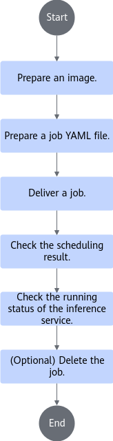

# Deploying OME-Based SGLang Inference Jobs<a name="ZH-CN_TOPIC_0000002480571816"></a>

<!-- md-trans-meta sourceCommit=unknown translatedAt=2026-06-26T11:47:10.038Z pushedAt=2026-06-27T00:32:25.563Z -->

## Implementation Principles<a name="ZH-CN_TOPIC_0000002512818803"></a>

1. The cluster scheduling components periodically report node and chip information.
    - kubelet reports the number of chips on the node to the node object.
    - Ascend Device Plugin reports chip memory and topology information.

For chips with on-chip memory, Ascend Device Plugin reports the chip memory status at startup, as described in the node-label description; it reports full-NPU information, uploading the chip's physical ID to `device-info-cm`; the total number of allocatable chips (allocatable), the number of allocated chips, and basic chip information (device ip and super_device_ip) are reported to the node for full-NPU scheduling.

    - When a fault exists on a node, NodeD periodically reports the node health status and node hardware fault information to `node-info-cm`, and reports shared storage faults to ClusterD's public faults.

2. After ClusterD reads the information in `device-info-cm` and `node-info-cm`, as well as the public fault information, it integrates the information into `cluster-info-cm`.
3. The user submits an SGLang inference job based on the OME framework through kubectl or another deep learning platform. OME generates a sub-workload of `Deployment` or `LeaderWorkerSet` (LWS) based on the inference job configuration, and the corresponding sub-workload then generates multiple Pods for the inference service. For detailed descriptions of `Deployment` or `LeaderWorkerSet`, see the [OME documentation](https://ome-projects.github.io/ome/docs/concepts/inference_service/).
4. volcano-controller or `LeaderWorkerSet` creates the corresponding PodGroup for the job. For detailed descriptions of PodGroup, see the [official open-source Volcano documentation](https://volcano.sh/docs/v1.9.0/Concepts/podgroup). The PodGroup generation policy is as follows:

    Under the OME framework, there are two different types of PodGroup mapping methods:

     - For jobs where instances do not span nodes (`Deployment` scenario), a `Deployment` requiring NPUs created by OME contains all instances of one type (P/D), and the corresponding PodGroup is created and managed by volcano-controller. A single PodGroup manages all Pods of that type of instance, with one Pod corresponding to one inference instance.

     - For jobs where instances span nodes (`LeaderWorkerSet` scenario), a `LeaderWorkerSet` requiring NPUs created by OME contains all instances of one type (P/D). When Volcano group scheduling is enabled, the LeaderWorkerSet creates a PodGroup for each inference instance, and these PodGroups are created and managed by the `LeaderWorkerSet` Controller. A single PodGroup manages all Pods of that instance, with multiple Pods belonging to the same PodGroup together forming one inference instance, and one PodGroup corresponding to one inference instance.

5. For SGLang inference job pods, volcano-scheduler selects appropriate nodes based on node memory, CPU, labels, and affinity. volcano-scheduler also selects appropriate nodes based on chip topology information, and writes the selected chip information and node hardware information to the pod's annotations.
6. When kubelet creates a container, for SGLang inference jobs deployed based on OME, it calls Ascend Device Plugin to mount chips. Ascend Device Plugin or volcano-scheduler writes chip and node hardware information to the pod's annotations. The Ascend Docker Runtime assists in mounting the corresponding resources.

## Using via Command Line<a name="ZH-CN_TOPIC_0000002480898900"></a>

### Process Description<a name="ZH-CN_TOPIC_0000002480995454"></a>

An OME-based SGLang inference job contains the Router pod (not requiring NPU resources) and inference instance pod. The inference instance pod is classified into the prefill instance pod and decode instance pod. OME generates different workloads based on different inference service configuration modes to create different inference instances, and the Router provides inference services for external systems in a unified manner. MindCluster cluster scheduling components are able to schedule workloads of OME's `Deployment` and `LeaderWorkerSet` inference jobs. LWS gang scheduling needs to be enabled in `LeaderWorkerSet` scenarios.

For detailed instructions, see the [OME documentation](https://ome-projects.github.io/ome/docs/) and [LWS documentation](https://github.com/kubernetes-sigs/lws/tree/main/docs/examples/sample/gang-scheduling).

**Usage Processes<a name="section19644656124210"></a>**

 [Figure 1](#fig38991911205815) shows the procedure for using MindCluster cluster scheduling components to deploy OME-based SGLang inference jobs via commands.

**Figure 1** Usage flow<a name="fig38991911205815"></a>


### Preparing a job YAML<a name="ZH-CN_TOPIC_0000002480835892"></a>

Prepare for image creation as required, select a YAML file, and modify the YAML file.

**Prerequisites<a name="section3759720141513"></a>**

The image preparation is complete. The SGLang inference image can be obtained from the [SGLang documentation](https://docs.sglang.ai/get_started/install.html), and the MemFabric Hybrid dependency in the image can be obtained from [MemFabric Hybrid](https://gitcode.com/Ascend/memfabric_hybrid).

**YAML Selection<a name="section1419519264165"></a>**

An OME-based SGLang inference job can be started by Base Model, Serving Runtime, and Inference Service CRDs. For details about the resource usage and deployment of Base Model and Inference Service, see the [OME documentation](https://ome-projects.github.io/ome/docs/).

Various YAML examples of ClusterServingRuntime resources required by OME jobs are provided by cluster scheduling components. You can select an appropriate YAML example based on the used component, processor type, and job type, and make necessary modifications according to actual requirements before using it.

<a name="zh-cn_topic_0000002362848597_table74058394335"></a>

| Type | Hardware Model | YAML Name | Obtain Link |
|--|--|--|--|
| Instance not across nodes (Deployment scenario) | <p>Atlas 800I A2 inference server</p><p>Atlas 800I A3 SuperPoD server</p> | llama-3-2-1b-instruct-rt-pd-standalone.yaml | [Obtain YAML](https://gitcode.com/Ascend/mindcluster-deploy/blob/master/k8s-deploy-tool/example/ome-runtimes/llama-3-2-1b-instruct-rt-pd-standalone.yaml) |
| Instance across nodes (LeaderWorkerSet scenario) | <p>Atlas 800I A2 inference server</p><p>Atlas 800I A3 SuperPoD server</p> | llama-3-2-1b-instruct-rt-pd-distributed.yaml | [Obtain YAML](https://gitcode.com/Ascend/mindcluster-deploy/blob/master/k8s-deploy-tool/example/ome-runtimes/llama-3-2-1b-instruct-rt-pd-distributed.yaml) |

>[!NOTE]
>The above YAML examples are for testing purposes only. Modify them according to the actual situation of the model.

After the Base Model, Serving Runtime, and Inference Service YAML files are modified based on the OME framework deployment mode, OME and its components are responsible for starting the sub-workload (Deployment or LeaderWorkerSet) and the corresponding pods, and managing the lifecycle of inference service pods. After inference service pods are created, MindCluster schedules them.

The number of replicas for the job's P/D instance is configured by the Inference Service resource defined by OME. For specific configuration methods, see the [OME documentation](https://ome-projects.github.io/ome/docs/concepts/inference_service/).

**Job YAML description<a name="section238217472163"></a>**

<pre codetype="yaml">
apiVersion: ome.io/v1beta1
kind: ClusterServingRuntime
metadata:
  name: srt-llama-3-2-1b-instruct-distributed
spec:
  decoderConfig:
    annotations:
      <strong>huawei.com/schedule_policy: "chip2-node16-sp"</strong>
      <strong>sp-block: "16"  #Configured only for the Atlas 800I A3 SuperPoD server scenario. The value is the total number of NPUs requested by the Pod corresponding to one P/D instance</strong>
      <strong>huawei.com/schedule_minAvailable: "2" #Configured only when instances do not span nodes, i.e., in the Deployment scenario. The value is the number of replicas of the D instance (or the P instance in the engineConfig field)</strong>
      <strong>huawei.com/recover_policy_path: "pod" #The path for job recovery when pod-rescheduling is "on". Setting it to "pod" indicates that if Pod-level rescheduling fails, it will not escalate to Job-level rescheduling. For OME jobs, in the Deployment scenario, each Pod in the PodGroup is an independent instance, so its fault handling must not propagate to other instances. In the LeaderWorkerSet scenario, restarting any Pod within a single PodGroup will cause the LeaderWorkerSet Controller to restart the entire PodGroup, triggering instance-level rescheduling</strong>
    leader:
      nodeSelector:
        <strong>schedulerName: volcano  #Set the scheduler to Volcano</strong>
      runner:
        name: sglang-decoder
        image: "sglang:xxx"
        command:
        ...
        env:
        ...
        <strong>- name: ASCEND_VISIBLE_DEVICES</strong>
          <strong>valueFrom:</strong>
            <strong>fieldRef:</strong>
              <strong>fieldPath: metadata.annotations['huawei.com/Ascend910']</strong>
        resources:
          limits:
           <strong>huawei.com/Ascend910: 16  #Configure based on the actual number of NPUs required per Pod</strong>
          requests:
           <strong>huawei.com/Ascend910: 16  #Configure based on the actual number of NPUs required per Pod</strong>
       volumeMounts:
       ...
       <strong>- name: driver</strong>
         <strong>mountPath: /usr/local/Ascend/driver</strong>
       ...
     volumes:
      ...
      <strong>- name: driver</strong>
        <strong>hostPath:</strong>
        <strong>path: /usr/local/Ascend/driver</strong>
    ...</pre>

### YAML Parameter Description<a name="ZH-CN_TOPIC_0000002513115345"></a>

The following table describes only the fields related to MindCluster in the OME Serving Runtime YAML.

**Table 1** YAML parameters

<a name="zh-cn_topic_0000002329010086_table7602101418317"></a>

|Parameter|Value|Description|
|---|---|---|
|schedulerName|The value is "volcano".|Configures the scheduler as Volcano.|
|sp-block|Specifies the number of chips in a logical SuperPoD.<p>It must be an integer multiple of the number of chips in a node, and the total number of chips in the P/D instances must be an integer multiple of it.</p>|Specifies the sp-block field. The cluster scheduling component divides the physical SuperPoD into logical SuperPoDs based on the partitioning policy for affinity scheduling of jobs. If this field is not specified, Volcano uses the total number of NPUs configured for the job as the logical SuperPoD size during scheduling.<ul><li>For detailed description, see [UnifiedBus Device Network Description](../basic_scheduling/01_affinity_scheduling/03_ascend_ai_processor_based_affinity.md).</li><li>This field is only supported on Atlas 800I A3 SuperPoD servers.</li></ul>|
|huawei.com/schedule\_minAvailable|Integer|The minimum number of replicas that can be scheduled for the job. This field must be specified in the Deployment scenario where instances do not span servers. Configure it to the effective number of replicas for the engine or decoder based on whether the field belongs to a P instance or D instance. This field is not required in other scenarios.|
|huawei.com/recover\_policy\_path|"pod"|The path for job recovery when pod-rescheduling is set to "on". Setting it to "pod" indicates that if pod-level rescheduling fails, it will not escalate to job-level rescheduling. For OME jobs, in the Deployment scenario, each Pod in a PodGroup is an independent instance, so fault handling must not propagate to other instances. In the LeaderWorkerSet scenario, restarting any Pod in a single PodGroup will cause the LeaderWorkerSet Controller to restart the entire PodGroup, triggering instance rescheduling.|
|pod-rescheduling|<ul><li>on: Enables pod-level rescheduling.</li><li>Other values or if this field is not used: Disables pod-level rescheduling.</li></ul>|Pod-level rescheduling means that after a job fault occurs, not all job Pods in the PodGroup are deleted. Instead, only the faulty Pod is deleted, and the controller recreates a new Pod for rescheduling.<div class="note"><span class="notetitle">Note:</span><div class="notebody">For OME inference jobs, this field must be set to "on". MindCluster reschedules the faulty P/D instances.</div></div>|
|huawei.com/Ascend910|<ul><li>Atlas 800I A2 inference server: 8</li><li>Atlas 900 A3 SuperPoD, Atlas 800I A3 SuperPoD server: 16</li></ul>|The number of NPUs requested. Currently, only full-server scheduling is supported. Modify this value based on the actual number of hardware cards.|
|env\[name==ASCEND\_VISIBLE\_DEVICES\].valueFrom.fieldRef.fieldPath|The value is metadata.annotations\['huawei.com/Ascend910'\], which must be consistent with the actual chip type in the environment.| Ascend Docker Runtime obtains this parameter value to mount the corresponding type of NPU to the container.<div class="note"><span class="notetitle">Note:</span><div class="notebody">This parameter only supports the full-card scheduling feature of the Volcano scheduler. Users who use static vNPU scheduling or other schedulers need to delete the related fields of this parameter in the example YAML.</div></div>|
|fault-scheduling|<ul><li>grace: Configures the job to use graceful deletion mode. During the process, the original Pod is gracefully deleted first. If it is not successful after 15 minutes, the original Pod is forcibly deleted.</li><li>force: Configures the job to use forced deletion mode. During the process, the original Pod is forcibly deleted.</li><li>off, none (no fault-scheduling field), or other values: The inference job does not use the fault rescheduling feature.</li></ul>|-|
|fault-retry-times|<ul><li>0 \< fault-retry-times: Handles service plane faults. The number of unconditional retries on the service plane must be configured.</li><li>None (no fault-retry-times) or 0: The job does not use the unconditional retry feature. After a service plane fault occurs, Volcano does not actively delete the faulty Pod.</li></ul>|-|

### Submitting, Viewing, and Deleting an Inference Job<a name="ZH-CN_TOPIC_0000002513375093"></a>

After completing the preparation of the job YAML file, you can perform the following operations:

1. Deliver an inference job.
2. View scheduling results.
3. View the inference job running status.
4. (Optional) Delete the job.

For detailed descriptions of the above steps, see the [OME documentation](https://ome-projects.github.io/ome/docs/tasks/run-workloads/deploy-inference-service/).

## Deploying Inference Jobs Using a Script in One-Click Mode<a name="ZH-CN_TOPIC_0000002480866426"></a>

If multiple associated inference jobs are deployed in the Kubernetes cluster, manually compiling and maintaining a large number of Kubernetes YAML files is inefficient and error-prone. To solve this problem, MindCluster provides an automatic script to replace complex manual operations. You only need to provide basic information, such as the application name, image version, and number of replicas, and the script automatically generates all necessary Kubernetes YAML files that comply with specifications and deploys them to the specified cluster. In addition, MindCluster provides an easy way, such as specifying a common application name, to remove all associated resources at once.

The current script only supports P/D disaggregation deployment, and can simultaneously launch multiple P/D instances, a Router, and a Memfabric_Store server.

**Prerequisites<a name="section178303526285"></a>**

- Python is installed in the environment, and dependency packages can be downloaded online.
- A KubeConfig file exists and can communicate normally with the K8s cluster.
- MindCluster and OME have been deployed.
- The Base Model and Serving Runtime resources have been deployed.

**Procedure<a name="section116575516299"></a>**

1. Obtain the source code from the mindcluster-deploy repository and navigate to the `k8s-deploy-tool` directory.

    ```shell
    git clone https://gitcode.com/Ascend/mindcluster-deploy.git && cd mindcluster-deploy/k8s-deploy-tool
    ```

2. (Optional) Create and activate a virtual Python environment. This operation allows different Python projects to use different library versions without interference.

    ```shell
    python -m venv venv && source venv/bin/activate
    ```

    Use Python or Python3 according to the actual situation of the environment.

3. Install dependencies.

    ```shell
    pip install -r requirements.txt
    ```

4. (Optional) Deploy Serving Runtime (for testing only). You can deploy the corresponding Serving Runtime based on the job requirements.

    ```shell
    kubectl apply -f example/ome-runtimes/xxx.yaml #Replace xxx.yaml with the actual selected Serving Runtime file name
    ```

5. Edit the user configuration file `config/isvc-config.yaml`.
    1. Open the `config/isvc-config.yaml` file.

        ```shell
        vi config/isvc-config.yaml
        ```

    2. Press `i` to enter insert mode, and modify the fields in the file according to the actual situation.
    3. Press `Esc`, type `:wq!`, and press `Enter` to save and exit editing.

6. (Optional) Create a namespace for the job. `xxx` is the "`app_namespace`" set in `config/isvc-config.yaml`. If `app_namespace` is `default` or not set, you can skip creating the namespace.

    ```shell
    kubectl create ns xxx
    ```

7. (Optional) Set the serving framework type. Currently, `ome` and `aibrix` are supported. If not set, `ome` is used by default.

    ```shell
    export SERVING_FRAMEWORK=ome
    ```

8. Deploy the inference job.

    ```shell
    python main.py deploy -c config/isvc-config.yaml
    ```

    Use Python or Python3 according to the actual situation of the environment. The parameter description is as follows:

    - `-c, --config`: configuration file path; required.
    - `-k, --kubeconfig`: KubeConfig file path; optional. The default value is `~/.kube/config`.
    - `--dry-run`: trial run (this parameter is not deployed actually, and is used to display the generated YAML file); optional.

9. Check the job running status.

    ```shell
    python main.py status -n my-test -ns default
    ```

    The parameter description is as follows:

    - `-n, --app-name`: App name; required. `my-test` is `app_name`" set in `config/isvc-config.yaml`.
    - `-ns, --namespace`: App namespace; optional. The default value is `default`.
    - `-k, --kubeconfig`: KubeConfig file path; optional. The default value is `~/.kube/config`.

    >[!NOTE]
    >You can also use the kubectl command-line tool to view the job running status.

10. Open a new terminal window and run the following command on a node in the current K8s cluster to access the inference service. If the request returns successfully, the inference service has been deployed successfully.

    ```shell
    curl --location 'http://<router-podip>:<router-port>/generate' --header 'Content-Type: application/json' --data '{
    "text": "Who are you",
    "sampling_params": {
    "temperature": 0,
    "max_new_tokens": 20
    },
    "stream": true
    }'
    ```

    - `<router-podip>` is the IP address of the Router Pod, which can be obtained using the following command.

        ```shell
        kubectl get pod -A -o wide
        ```

    - `<router-port>` is the service port set for the Router in the Serving Runtime.

11. (Optional) Delete the inference job.

    ```shell
    python main.py delete -n my-test
    ```

    Use Python or Python3 according to the actual situation of the environment. The parameter descriptions are as follows:

    - `-n, --app-name`: App name; required.
    - `-ns, --namespace`: App namespace; optional. The default value is `default`.
    - `-k, --kubeconfig`: KubeConfig file path; optional. The default value is `~/.kube/config`.
