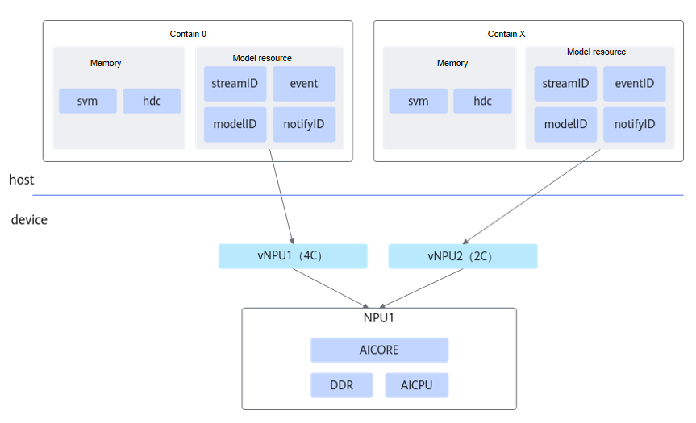

# Feature Description

The HDK-based virtual instance feature partitions the NPUs configured on a physical machine or virtual machine into multiple vNPUs (virtual NPUs) through resource virtualization, and mounts them into containers for use. The virtualization management enables the allocation and reclamation of resources in various specifications, accommodating repeated resource request and release operations from multiple users.

The Ascend HDK-based virtual instance function allows multiple users to share a single server on demand, lowering the entry barrier and cost of accessing NPU computing power. By enabling resource isolation through containers, this approach ensures a stable and secure runtime environment. The unified resource allocation and reclamation process also facilitates multi-tenant management.

## Principles

Ascend NPU hardware resources mainly include AICore (used for AI model computation), AICPU, memory, etc. The main principle of the HDK-based virtual instance function is to partition the hardware resources into vNPUs according to user‑specified resource requirements, with each vNPU corresponding to a set of AICores, AICPUs, and memory resources. For example, when a user needs only 4 AICores of computing power, the system creates a vNPU, through which it obtains 4 AICores from the NPU and provides them to the container. The HDK-based virtual instance solution is shown in [Figure 1](#fig987114711574).

**Figure 1**  Virtual instance solution based on HDK

## Products Support Notes

**Table 1**  Product support notes

<table><thead align="left"><tr id="row4278815202313"><th class="cellrowborder" valign="top" width="31.78%" id="mcps1.2.5.1.1">
Product Series

</th>
<th class="cellrowborder" valign="top" width="33.339999999999996%" id="mcps1.2.5.1.2">
Supported Scenarios

</th>
<th class="cellrowborder" valign="top" width="21.87%" id="mcps1.2.5.1.3">
Virtualization Mode

</th>
<th class="cellrowborder" valign="top" width="13.01%" id="mcps1.2.5.1.4">
Supported

</th>
</tr>
</thead>
<tbody><tr id="row147414361945"><td class="cellrowborder" valign="top" width="31.78%" headers="mcps1.2.5.1.1 ">
Atlas Inference Series Products

<ul id="ul3750195712510"><li>Atlas 300I Pro Inference Card</li><li>Atlas 300V Video Analysis Card</li><li>Atlas 300V Pro Video Analysis Card</li><li>Atlas 300I Duo Inference Card</li><li>Atlas 200I SoC A1 Core Board</li></ul>
</td>
<td class="cellrowborder" valign="top" width="33.339999999999996%" headers="mcps1.2.5.1.2 ">
Partition vNPUs on the physical machine, and mount vNPUs to the container.

</td>
<td class="cellrowborder" valign="top" width="21.87%" headers="mcps1.2.5.1.3 ">
Static Virtualization

</td>
<td class="cellrowborder" valign="top" width="13.01%" headers="mcps1.2.5.1.4 ">
Yes

</td>
</tr>
<tr id="row798113134910"><td class="cellrowborder" valign="top" width="31.78%" headers="mcps1.2.5.1.1 ">
Atlas Inference Series Products

<ul id="ul12655521159"><li>Atlas 300I Pro Inference Card</li><li>Atlas 300V Video Analysis Card</li><li>Atlas 300V Pro Video Analysis Card</li><li>Atlas 200I SoC A1 Core Board</li></ul>
</td>
<td class="cellrowborder" valign="top" width="33.339999999999996%" headers="mcps1.2.5.1.2 ">
Partition vNPUs on the physical machine, and mount vNPUs to the container.

</td>
<td class="cellrowborder" valign="top" width="21.87%" headers="mcps1.2.5.1.3 ">
Dynamic Virtualization

</td>
<td class="cellrowborder" valign="top" width="13.01%" headers="mcps1.2.5.1.4 ">
Yes

</td>
</tr>
<tr id="row1327811510231"><td class="cellrowborder" rowspan="3" valign="top" width="31.78%" headers="mcps1.2.5.1.1 ">
Atlas Inference Series Products

<ul id="ul937113279519"><li>Atlas 300I Pro Inference Card</li><li>Atlas 300V Video Analysis Card</li><li>Atlas 300V Pro Video Analysis Card</li><li>Atlas 300I Duo Inference Card</li></ul>
</td>
<td class="cellrowborder" valign="top" width="33.339999999999996%" headers="mcps1.2.5.1.2 ">
Partition vNPUs on the physical machine, and mount vNPUs to the virtual machine.

</td>
<td class="cellrowborder" valign="top" width="21.87%" headers="mcps1.2.5.1.3 ">
Static Virtualization

</td>
<td class="cellrowborder" valign="top" width="13.01%" headers="mcps1.2.5.1.4 ">
Yes

</td>
</tr>
<tr id="row11765455154717"><td class="cellrowborder" valign="top" headers="mcps1.2.5.1.1 ">
Partition vNPUs on the physical machine, mount vNPUs to the virtual machine, and then mount vNPU to  containers within the virtual machine.

</td>
<td class="cellrowborder" valign="top" headers="mcps1.2.5.1.2 ">
Static Virtualization

</td>
<td class="cellrowborder" valign="top" headers="mcps1.2.5.1.3 ">
Yes

</td>
</tr>
<tr id="row250075974919"><td class="cellrowborder" valign="top" headers="mcps1.2.5.1.1 ">
Pass through the NPU from the physical machine to the virtual machine, partition vNPUs within the virtual machine, and then mount the vNPUs to containers inside the virtual machine.

</td>
<td class="cellrowborder" valign="top" headers="mcps1.2.5.1.2 ">
Static Virtualization

</td>
<td class="cellrowborder" valign="top" headers="mcps1.2.5.1.3 ">
Yes

</td>
</tr>
<tr id="row258393195019"><td class="cellrowborder" valign="top" width="31.78%" headers="mcps1.2.5.1.1 ">
Atlas Inference Series Products

<ul id="ul12701420650"><li>Atlas 300I Pro Inference Card</li><li>Atlas 300V Video Analysis Card</li><li>Atlas 300V Pro Video Analysis Card</li></ul>
</td>
<td class="cellrowborder" valign="top" width="33.339999999999996%" headers="mcps1.2.5.1.2 ">
Pass through  the NPU from the physical machine to the virtual machine, partition vNPUs within the virtual machine, and then mount the vNPUs to containers inside the virtual machine.

</td>
<td class="cellrowborder" valign="top" width="21.87%" headers="mcps1.2.5.1.3 ">
Dynamic Virtualization

</td>
<td class="cellrowborder" valign="top" width="13.01%" headers="mcps1.2.5.1.4 ">
Yes

</td>
</tr>
<tr id="row0278415202314"><td class="cellrowborder" valign="top" width="31.78%" headers="mcps1.2.5.1.1 ">
Atlas 800 Training Server

</td>
<td class="cellrowborder" valign="top" width="33.339999999999996%" headers="mcps1.2.5.1.2 ">
Partition vNPUs on the physical machine, and mount vNPUs to the virtual machine.

</td>
<td class="cellrowborder" valign="top" width="21.87%" headers="mcps1.2.5.1.3 ">
Static Virtualization

</td>
<td class="cellrowborder" valign="top" width="13.01%" headers="mcps1.2.5.1.4 ">
Yes

</td>
</tr>
<tr id="row2010035054514"><td class="cellrowborder" valign="top" width="31.78%" headers="mcps1.2.5.1.1 ">
Atlas Training Series Products

<ul id="ul20127114712811"><li>Atlas 300T Training Card (Model 9000)</li><li>Atlas 300T Pro Training Card (Model 9000)</li><li>Atlas 800 Training Server (Model 9000)</li><li>Atlas 800 Training Server (Model 9010)</li><li>Atlas 900 PoD (Model 9000)</li><li>Atlas 900T PoD Lite</li></ul>
</td>
<td class="cellrowborder" valign="top" width="33.339999999999996%" headers="mcps1.2.5.1.2 ">
Partition vNPUs on the physical machine, and mount vNPUs to the container.

</td>
<td class="cellrowborder" valign="top" width="21.87%" headers="mcps1.2.5.1.3 ">
Static Virtualization

</td>
<td class="cellrowborder" valign="top" width="13.01%" headers="mcps1.2.5.1.4 ">
Yes

</td>
</tr>
<tr id="row32781215162311"><td class="cellrowborder" valign="top" width="31.78%" headers="mcps1.2.5.1.1 ">
<term id="zh-cn_topic_0000001519959665_term57208119917">Atlas A2 Training Series Products</term>

<ul><li>Atlas 800T A2 Training Server (24 AICores)</li></ul>
</td>
<td class="cellrowborder" valign="top" width="33.339999999999996%" headers="mcps1.2.5.1.2 ">
Partition vNPUs on the physical machine, and mount vNPUs to the container.

</td>
<td class="cellrowborder" valign="top" width="21.87%" headers="mcps1.2.5.1.3 "><ul><li>Static Virtualization</li><li>Dynamic Virtualization</li></ul>
</td>
<td class="cellrowborder" valign="top" width="13.01%" headers="mcps1.2.5.1.4 ">
Yes

</td>
</tr>
<tr id="row11243152011236"><td class="cellrowborder" valign="top" width="31.78%" headers="mcps1.2.5.1.1 ">
<term id="zh-cn_topic_0000001519959665_term26764913715">Atlas A3 Training Series Products</term>

<ul><li>Atlas 800T A3 SuperPoD Server</li></ul>
</td>
<td class="cellrowborder" valign="top" width="33.339999999999996%" headers="mcps1.2.5.1.2 ">
Partition vNPUs on the physical machine, and mount vNPUs to the container.

</td>
<td class="cellrowborder" valign="top" width="21.87%" headers="mcps1.2.5.1.3 "><ul><li>Static Virtualization</li><li>Dynamic Virtualization</li></ul>
</td>
<td class="cellrowborder" valign="top" width="13.01%" headers="mcps1.2.5.1.4 ">
Yes

</td>
</tr>
<tr id="row18359185713363"><td class="cellrowborder" valign="top" width="31.78%" headers="mcps1.2.5.1.1 ">
<term id="zh-cn_topic_0000001094307702_term99602034117">Atlas A2 Inference Series Products</term>

<ul><li>Atlas 800I A2 Inference Server</li></ul>
</td>
<td class="cellrowborder" valign="top" width="33.339999999999996%" headers="mcps1.2.5.1.2 ">
Partition vNPUs on the physical machine, and mount vNPUs to the container.

</td>
<td class="cellrowborder" valign="top" width="21.87%" headers="mcps1.2.5.1.3 "><ul><li>Static Virtualization</li><li>Dynamic Virtualization</li></ul>
</td>
<td class="cellrowborder" valign="top" width="13.01%" headers="mcps1.2.5.1.4 ">
Yes

</td>
</tr>
<tr><td>
<term>Atlas A3 Inference Series Products</term>

<ul><li>Atlas 800I A3 SuperPoD Server</li></ul>
</td>
<td>
Partition vNPUs on the physical machine, and mount vNPUs to the container.

</td>
<td><ul><li>Static Virtualization</li><li>Dynamic Virtualization</li></ul>
</td>
<td>
Yes

</td>
</tr>
<tr id="row188952007382"><td class="cellrowborder" valign="top" width="31.78%" headers="mcps1.2.5.1.1 ">
<term id="zh-cn_topic_0000001519959665_term169221139190">Atlas 200/300/500 Inference Products</term>

</td>
<td class="cellrowborder" valign="top" width="33.339999999999996%" headers="mcps1.2.5.1.2 ">
-

</td>
<td class="cellrowborder" valign="top" width="21.87%" headers="mcps1.2.5.1.3 ">
-

</td>
<td class="cellrowborder" valign="top" width="13.01%" headers="mcps1.2.5.1.4 ">
No

</td>
</tr>
<tr id="row946362719389"><td class="cellrowborder" valign="top" width="31.78%" headers="mcps1.2.5.1.1 ">
<term id="zh-cn_topic_0000001519959665_term7466858493">Atlas 200I/500 A2 Inference Products</term>

</td>
<td class="cellrowborder" valign="top" width="33.339999999999996%" headers="mcps1.2.5.1.2 ">
-

</td>
<td class="cellrowborder" valign="top" width="21.87%" headers="mcps1.2.5.1.3 ">
-

</td>
<td class="cellrowborder" valign="top" width="13.01%" headers="mcps1.2.5.1.4 ">
No

</td>
</tr>
</tbody>
</table>

## Usage Instructions

- Static virtualization and dynamic virtualization are implemented based on HDK. The NPU is partitioned into vNPUs through HDK interfaces and then mounted to containers for use.
- If you are using dynamic virtualization, directly refer to the "Dynamic vNPU Scheduling (Inference)" section. You do not need to use the `npu-smi` command to create vNPUs in advance.
- If you are using static virtualization, you need to first refer to "Creating vNPU", and then perform the operation of mounting them to a container.
- For detailed descriptions of `npu-smi` commands, see the "[Ascend Virtual Instance (AVI) Commands](https://support.huawei.com/enterprise/en/doc/EDOC1100568420/690dda6e)" section in the *Atlas A3 Center Inference and Training Hardware 26.0.RC1 npu-smi Command Reference*.

## Usage Constraints

- After a physical NPU is virtualized into vNPUs, it is no longer supported to mount the physical NPU to a container, nor is it supported to pass through the physical NPU to a virtual machine.
- A vNPU can only be used by one task container. It is not supported for multiple task containers to use the same vNPU.
- The operating modes of the two chips on the Atlas 300I Duo inference card must be consistent. That is, both chips must use the virtualization instance function, or the entire card must use this function. Plan according to your service requirements.
- The virtual instance template is used to partition resources across all NPUs on an entire server. Mixing cards of different specifications is not supported. For example, the Atlas 300V Pro video analysis card supports 24 GB and 48 GB memory specifications, virtualization does not support mixing these two memory specifications on the same server. Similarly, mixing Atlas training series products with 30 AICores and those with 32 AICores is not supported.
- For Atlas training series servers, the virtual instance function is supported only when the NPU operates in AMP mode, not in SMP mode. The steps for querying and setting the NPU working mode are as follows (ensure the server operating system is powered off).

    1. Log in to the iBMC command line.
    2. Run the `ipmcget -d npuworkmode` command to query the NPU working mode. If it is AMP mode, no switching is required.
    3. Run the `ipmcset -d npuworkmode -v 0` command to set the NPU working mode to AMP mode.

For detailed instructions on querying and setting the NPU working mode, see the "Command Line Introduction > Server Commands > [Querying and Setting the NPU Working Mode (npuworkmode)](https://support.huawei.com/enterprise/en/doc/EDOC1100136580/51fd0a0/querying-and-setting-the-npu-chip-working-mode-npuworkmode?idPath=23710424|251366513|22892968|252309113|250702818)" in the *[Atlas 800 Training Server iBMC User Guide (model 9000)](https://support.huawei.com/enterprise/en/doc/EDOC1100136580/426cffd9/about-this-document?idPath=23710424|251366513|22892968|252309113|250702818)*.
