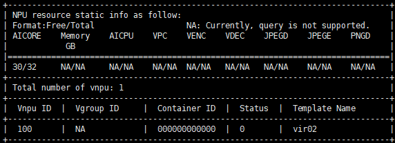

# Creating vNPUs<a name="ZH-CN_TOPIC_0000002479226382"></a>

<!-- md-trans-meta sourceCommit=unknown translatedAt=2026-06-30T12:21:26.657Z pushedAt=2026-06-30T12:23:24.374Z -->

- The commands for creating vNPUs using the npu-smi tool are basically the same for physical machines and virtual machines, so the commands listed in this section can be applied to both. However, vNPU creation on virtual machines is supported only by Atlas inference product.
- To use static virtualization, run the `npu-smi` command in this section to create vNPUs and mount them to containers and then refer to [Mounting vNPUs (Static Virtualization)](./02_mounting_vnpu_static.md) section to mount them to the container.
- To use dynamic virtualization, skip this section, as there is no the need to create vNPUs in advance. Set parameters as follows during container startup.
    - Ascend Docker Runtime: Refer to [Dynamic vNPU Scheduling (Inference)](../dynamic_vnpu_scheduling/01_dynamic_vnpu_scheduling_inference.md) to virtualize multiple vNPUs from the physical chip and mount them to the container through the `ASCEND_VISIBLE_DEVICES` and `ASCEND_VNPU_SPECS` parameters.
    - Ascend Device Plugin and Volcano: Refer to [Dynamic vNPU Scheduling (Inference)](../dynamic_vnpu_scheduling/01_dynamic_vnpu_scheduling_inference.md). vNPUs are automatically created by APIs based on configuration requirements during job running.
- For detailed usage and parameter descriptions of the following `npu-smi` commands for creating vNPUs, see the "[Ascend Virtual Instance (AVI) Related Commands](https://support.huawei.com/enterprise/en/doc/EDOC1100568420/690dda6e)" section in *Atlas A3 Center Inference and Training Hardware 26.0.RC1 npu-smi Command Reference*.

## Methods<a name="section206799361399"></a>

- On the physical machine, run the following command to set the virtualization mode (this command is not required if you are partitioning vNPUs inside a virtual machine). The command format is as follows.

    **npu-smi set -t vnpu-mode -d** _mode_

    **Table 1** Parameter description

    <a name="table11489191211336"></a>

    |Type|Description|
    |--|--|
    |mode|<p>Virtual instance mode. The value is 0 or 1:</p><ul><li>0: container mode</li><li>1: VM mode</li></ul>|

- Create vNPUs. The command format is as follows:

    **npu-smi set -t create-vnpu -i** _id_ **-c** _chip\_id_ **-f** _vnpu\_config_  \[**-v** _vnpu\_id_\] \[**-g** _vgroup\_id_\]

    <a name="table1654283920393"></a>

    |Name|Description|
    |--|--|
    |id|Device ID. The NPU ID queried by the <b>npu-smi info -l</b> command is the device ID.|
    |chip_id|Chip ID. The `Chip ID` queried by the <b>npu-smi info -m</b> command is the chip ID.|
    |vnpu_config|Name of the virtual instance template. For details, see the "Virtual Instance Template" column in Table 1 of [Virtualization Templates](../03_virtualization_templates.md).|
    |vnpu_id|<p>Specifies the ID of the vNPU to be created.</p><ul><li>This parameter can be left unspecified for the first creation, and the system will assign a default value. If the service needs to use the vnpu_id before a restart, you can use the -v parameter to specify the vnpu_id that you want to use after the restart.</li><li>Value range:<ul><li>Atlas inference series products<p>The value range of vnpu_id is [phy_id \* 16 + 100, phy_id \* 16+107].</p></li><li>Atlas training series products<p>The value range of vnpu_id is [phy_id \* 16 + 100, phy_id \* 16+115].</p></li></ul><div class="note"><span class="notetitle">Note:</span><div class="notebody">phy_id indicates the physical ID of the chip, which can be obtained by running the <strong>ls /dev/davinci*</strong> command. For example, /dev/davinci0 indicates that the physical ID of the chip is 0.</div></div></li><li>Passing 4294967295 for vnpu_id means that no virtual device ID is specified.</li><li>vNPUs with the same vnpu_id cannot be created repeatedly on the same server.</li></ul>|
    |vgroup_id|ID of the virtual resource group vGroup, with a value range of 0 to 3.<p>vGroup refers to the virtual resource group divided by the NPU based on the virtualization template specified by the user during virtualization. Each vGroup contains a certain number of AICore, AICPU, on-chip memory, and DVPP resources.</p><p>This parameter is supported only by the <span>Atlas inference series products</span>.</p>|

    Examples:

    - Create a vNPU of chip 0 on device 0 based on the template vir02.

        ```shell
        npu-smi set -t create-vnpu -i 0 -c 0 -f vir02
                Status : OK         Message : Create vnpu success
        ```

    - Create a vNPU device with `vnpu_id` specified as `100` of chip 0 on device 0. The template for this vNPU is vir02.

        ```shell
        npu-smi set -t create-vnpu -i 0 -c 0 -f vir02 -v 100
                Status : OK         Message : Create vnpu success
        ```

    - Create a vNPU device of chip 0 on device 0, specifying `vnpu_id` as `100` and `vgroup_id` as `1`, with the template vir02.

        ```shell
        npu-smi set -t create-vnpu -i 0 -c 0 -f vir02 -v 100 -g 1
                Status : OK         Message : Create vnpu success
        ```

- (Optional) Configure the vNPU configuration restoration status. This parameter allows the device to save vNPU configuration during a device restart, so that the vNPU configuration remains valid after the restart.

    **npu-smi set -t vnpu-cfg-recover -d** _mode_

    `mode`: configuration restoration status of the vNPU; `1`: enabled (default value); `0`: disabled status.

    Run the following command to enable the vNPU configuration recovery.

    **npu-smi set -t vnpu-cfg-recover -d** _1_

    ```ColdFusion
           Status : OK
           Message : The VNPU config recover mode Enable is set successfully.
    ```

- (Optional) Query the configuration restoration status of the vNPU.

    The following command queries the configuration restoration status of the vNPU in the current environment.

    **npu-smi info -t vnpu-cfg-recover**

    ```ColdFusion
    VNPU config recover mode : Enable
    ```

- (Optional) Query vNPU information.

    **npu-smi info -t info-vnpu -i** _id_ **-c** _chip\_id_

    <a name="table1585213289319"></a>

    |Name|Description|
    |--|--|
    |id|Device ID. The `NPU ID` queried by the <b>npu-smi info -l</b> command is the device ID.|
    |chip_id|Chip ID. The `Chip ID` queried by the <b>npu-smi info -m</b> command is the chip ID.|

    Run the following command to query vNPU information. The following command indicates querying the vNPU information of chip 0 on device 0.

    **npu-smi info -t info-vnpu -i** _0_ **-c** _0_

    

    >[!NOTE]
    >The AICPU and Vgroup ID information can be returned for Atlas inference series products, while cannot be returned for Atlas training series products.
