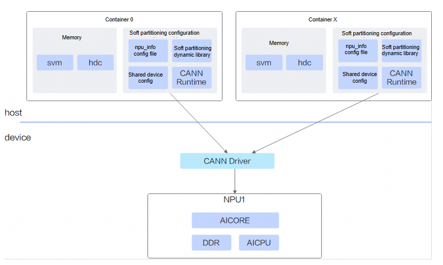

# Feature Description

The virtualization feature based on vCANN‑RT provides a soft‑slicing configuration file to the vCANN‑RT, which then mounts the NPUs (Ascend AI Processors) configured on a physical machine into containers for use. The virtualization management enables the allocation and reclamation of resources in various specifications, accommodating repeated resource request and release operations from multiple users.

The vCANN‑RT‑based virtual instance feature on Ascend allows multiple users to share a single server on demand, lowering the entry barrier and cost of accessing NPU computing power. By enabling resource isolation through containers, this approach ensures a stable and secure runtime environment. The unified resource allocation and reclamation process also facilitates multi‑tenant management.

## Principles

Ascend NPU hardware resources mainly include AICore (used for AI model computation), AICPU, memory, and others. The core principle of the vCANN‑RT‑based virtual instance feature is to allocate these hardware resources on demand according to user‑specified resource requirements, using a soft‑partitioning configuration file delivered via vCANN‑RT. For example, when a user needs only 50% of the AICore computing power and 2048 MB of high‑bandwidth memory, the system creates an npu_info configuration file, through which vCANN‑RT obtains the required resources from the NPU and provides them to the container. For details, see [Figure 1](#fig987114711574vcann).

**Figure 1**  vCANN-RT-based virtual instance solution 

## Product Support Notes

**Table 1**  Product support notes

|Product Series|Supported Scenarios|Virtualization Mode|Supported|
|--|--|--|--|
|<term>Atlas A2 inference series products</term><ul><li>Atlas 800I A2 inference server</li></ul>|Generate a soft partitioning configuration file on the physical machine, and mount the NPU and location file to the container.|Soft partitioning-based virtualization|Yes|
|<term>Atlas A3 inference series products</term><ul><li>Atlas 800I A3 SuperPoD server</li></ul>|Generate a soft partition configuration file on the physical machine, and mount the NPU and location file to the container.|Soft partitioning-based virtualization|Yes|

## Usage Instructions

- Soft partitioning-based virtualization is implemented based on [vCANN-RT](https://gitcode.com/openeuler/ubs-virt/blob/master/ubs-virt-enpu/vcann-rt/README.md). It directly mounts the NPU to multiple containers, and CANN inside the container uses NPU resources according to the configured ratio.
- To use the soft partitioning virtualization feature, see *Soft Partitioning-based Scheduling (Inference)*.

## Usage Constraints

- In a soft partitioning-based virtualization scenario, a container can mount only one NPU.
- The data corresponding to requests in the job YAML represents the requested AICore percentage of the NPU, not the actual number of NPUs.
- When using the soft partitioning-based virtualization feature for <term>Atlas A3 inference series products</term>, single-die passthrough mode must be enabled. That is, add the startup parameter `-useSingleDieMode=true` in the YAML file of Ascend Device Plugin.
- After soft partitioning-based virtualization of a physical NPU, only mounting the physical NPU to a container is supported. Passthrough of the physical NPU to a virtual machine is not supported.
- In a soft partitioning-based virtualization scenario, if all containers are mounted with the same physical NPU, the physical NPU must use the same soft partitioning policy.
- For <term>Atlas A2 inference series products</term>/<term>Atlas A3 inference series products</term>, a maximum of 63 processes are supported on one device, and the host can support a maximum of number of devices × 63 processes. For details, see [Usage Constraints](https://www.hiascend.com/document/detail/en/canncommercial/900/programug/acldevg/aclcppdevg_000222.html).
