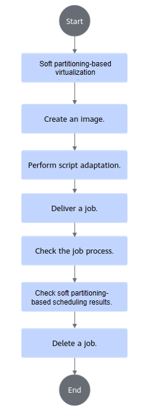
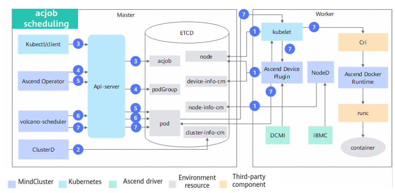

# Soft Partitioning-based Scheduling (Inference) <a name="ZH-CN_TOPIC_0000002511428569"></a>

<!-- md-trans-meta sourceCommit=unknown translatedAt=2026-06-30T12:22:24.734Z pushedAt=2026-06-30T12:23:24.398Z -->

## Before You Start <a name="ZH-CN_TOPIC_0000002511347125"></a>

### Notes on Using Soft NPU Partitioning <a name="ZH-CN_TOPIC_00000025113463450356vcann"></a>

In Kubernetes scenarios, when you need to use NPU resources, you must combine the cluster scheduling components Ascend Device Plugin and Volcano to enable Kubernetes to manage and schedule Ascend processor resources. The cluster scheduling components required for the Ascend soft partitioning-based virtual instance include Ascend Device Plugin, Volcano, Ascend Docker Runtime, Ascend Operator, and ClusterD. For supported product models, see "Table 1 Supported products" in [Feature Description](./00_description.md).

The soft partitioning-based scheduling feature only supports using Volcano as the scheduler and does not support using other schedulers.

### Scenario Description<a name="section1576110260450vcann"></a>

Before using soft partitioning-based virtualization, you need to understand the scenario descriptions in [Table 1 Scenario description](#table62551184461989657).

**Table 1**  Scenario description

<a name="table62551184461989657"></a>
<table><thead align="left"><tr><th class="cellrowborder" valign="top" width="19.98%" id="mcps1.2.3.1.1"><p>Scenario</p>
</th>
<th class="cellrowborder" valign="top" width="80.02%" id="mcps1.2.3.1.2"><p>Description</p>
</th>
</tr>
</thead>
<tbody><tr><td class="cellrowborder" rowspan="4" valign="top" width="19.98%" headers="mcps1.2.3.1.1 "><p>General description</p>
</td>
<td class="cellrowborder" valign="top" width="80.02%" headers="mcps1.2.3.1.2 "><p>The allocated chip information is reflected in the labels of the PodGroup. For detailed descriptions of PodGroup labels, see the following parameters in <a href="../../../api/volcano.md#podgroup">PodGroup label</a>: <ul><li>huawei.com/scheduler.softShareDev.aicoreQuota</li><li>huawei.com/scheduler.softShareDev.hbmQuota</li><li>huawei.com/scheduler.softShareDev.policy</li></ul></p>
</td>
</tr>
<tr><td class="cellrowborder" valign="top" headers="mcps1.2.3.1.1 "><p>Soft partitioning function must be used in conjunction with vCANN-RT.</p>
</td>
</tr>
<tr><td class="cellrowborder" valign="top" headers="mcps1.2.3.1.1 "><p>When allocating soft-partitioned NPUs, MindCluster scheduling prioritizes fully occupying the physical NPU with the least remaining computing power.</p>
</td>
</tr>
<tr><td class="cellrowborder" valign="top" headers="mcps1.2.3.1.1 "><p>Currently, each Pod of a job requests 1 NPU. The number of NPUs physically used is 1, but the number of NPUs requested in the job YAML must be consistent with the huawei.com/scheduler.softShareDev.aicoreQuota configuration.</p>
</td>
</tr>
<tr><td class="cellrowborder" rowspan="4" valign="top" width="19.98%" headers="mcps1.2.3.1.1 "><p>Supported scenarios</p>
</td>
<td class="cellrowborder" valign="top" width="80.02%" headers="mcps1.2.3.1.2 "><p>Multiple replicas are supported, but the NPU soft partitioning policy used by each Pod in the multiple replicas must be consistent.</p>
</td>
</tr>
<tr><td class="cellrowborder" valign="top" headers="mcps1.2.3.1.1 "><p>K8s mechanisms, such as affinity, are supported.</p>
</td>
</tr>
<tr><td class="cellrowborder" valign="top" headers="mcps1.2.3.1.1 "><p>Rescheduling upon chip faults and node faults is supported. For details, see the <a href="../../basic_scheduling/08_recovery_of_inference_card_faults.md">Recovery of Inference Card Faults</a> and <a href="../../basic_scheduling/07_rescheduling_upon_inference_card_faults.md">Rescheduling upon Inference Card Faults</a>.</p>
</td>
</tr>
<tr><td class="cellrowborder" valign="top" headers="mcps1.2.3.1.1 "><p>Supports scenarios where soft partitioning-based virtualization and non-soft partitioning-based virtualization functions are deployed in a mixed manner within a cluster.</p>
</td>
</tr>
<tr><td class="cellrowborder" rowspan="3" valign="top" width="19.98%" headers="mcps1.2.3.1.1 "><p>Unsupported scenarios</p>
</td>
<td class="cellrowborder" valign="top" width="80.02%" headers="mcps1.2.3.1.2 "><p>Mixing different chips within a single job is not supported.</p>
</td>
</tr>
<tr><td class="cellrowborder" valign="top" headers="mcps1.2.3.1.1 "><p>Uninstalling Volcano during task execution is not supported.</p>
</td>
</tr>
<tr><td class="cellrowborder" valign="top" headers="mcps1.2.3.1.1 "><p>Mixing with operations in Docker scenarios is not supported.</p>
</td>
</tr>
</tbody>
</table>

### Prerequisites

To use the soft partitioning-based scheduling feature, ensure that the following components are installed. If they are not installed, refer to the [Installation and Deployment](../../../developer_guide/installation_deployment/manual_installation/00_obtaining_software_packages.md) section for the operation procedure.

- Volcano
- Ascend Device Plugin
- Ascend Docker Runtime
- Ascend Operator
- ClusterD

1. You need to add the label `huawei.com/scheduler.chip1softsharedev.enable=true` to the node, indicating that the node supports the soft partitioning function.

    ```shell
    kubectl label nodes Node name huawei.com/scheduler.chip1softsharedev.enable=true
    ```

    In a mixed deployment scenario of soft partitioning-based virtualization and non-soft partitioning-based virtualization, if a node does not support soft partitioning-based virtualization, you need to add the label `huawei.com/scheduler.chip1softsharedev.enable=false` to the node.

2. You need to first obtain `Ascend-docker-runtime_{version}_linux-{arch}.run` to install the container engine plugin.
3. See the [Installation and Deployment](../../../developer_guide/installation_deployment/manual_installation/00_obtaining_software_packages.md) chapter to complete the installation of each component.

    The involved component in modifying related parameters for virtual instances is Ascend Device Plugin. Please modify and use the corresponding YAML for installation and deployment as required below:

    1. Add `-shareDevCount=100 -softShareDevConfigDir=/share_device/` in `device-plugin-volcano-v{version}.yaml`, where `/share_device/` is manually created by the user. When Atlas A3 inference series products use soft partitioning-based virtualization, you need to additionally add the startup parameter `-useSingleDieMode=true`.

       ```Yaml
       ...

               args: [ "device-plugin  -useAscendDocker=true -volcanoType=true -presetVirtualDevice=true
                 -logFile=/var/log/mindx-dl/devicePlugin/devicePlugin.log -logLevel=0 -shareDevCount=100 -softShareDevConfigDir=/share_device/ -useSingleDieMode=true" ]   # Only when Atlas A3 inference series products use the soft partitioning-based virtualization function, you need to add -useSingleDieMode=true
             ...
               volumeMounts:
             ...
                 - name:  enpu-config-dir
                   mountPath: /etc/enpu/
                 - name: share-device-config-dir
                   mountPath: /share_device/
           ...
       volumes:
             ...
         - name: enpu-config-dir
           hostPath:
             path: /etc/enpu/
         - name: share-device-config-dir
           hostPath:
             path: /share_device/
             type: DirectoryOrCreate
       ```

        The startup parameters for soft partitioning-based virtualization are described as follows:

**Table 2** Ascend Device Plugin startup parameters

<a name="table1064314568229"></a>

       |Name|Type|Mandatory|Description|
       |--|--|--|--|
       |-shareDevCount|uint|1|To use soft partitioning-based virtualization function, the value can only be 100.|
       |-softShareDevConfigDir|string|""|Configuration directory for the soft partitioning-based virtualization scenario.|
       |-useSingleDieMode|bool|false|Whether to enable single-die passthrough mode for Atlas A3 inference series products.<ul><li>true: Enable single-die passthrough mode.</li><li>false: Disable single-die passthrough mode.</li></ul>To use the soft partitioning-based virtualization function, this parameter must be set to true.|

2. (Optional) For hybrid deployment scenarios involving soft partitioning-based virtualization and non-soft partitioning-based virtualization, the YAML of Ascend Device Plugin needs to be modified as follows.

- Install Ascend Device Plugin that supports soft partitioning on nodes that support soft partitioning-based virtualization, and copy `device-plugin-volcano-v{version}.yaml to softsharedev-device-plugin-volcano-v{version}.yaml`. Modify `softsharedev-device-plugin-volcano-v{version}`.yaml as follows:

         ```Yaml
         apiVersion: apps/v1
         kind: DaemonSet
         metadata:
           name: ascend-device-plugin-daemonset-910-softShareDev # Identifies that Ascend Device Plugin supports the soft partitioning-based virtualization function in a mixed deployment scenario with both soft partitioning-based virtualization and non-soft partitioning-based virtualization functions
           namespace: kube-system
         spec:
           ...
           template:
           ...
             spec:
             ...
               nodeSelector:
                 huawei.com/scheduler.chip1softsharedev.enable: "true"  # Select nodes that support the soft partitioning-based virtualization function to deploy Ascend Device Plugin
                 accelerator: huawei-Ascend910
               serviceAccountName: ascend-device-plugin-sa-910
               containers:
               ...
                 command: [ "/bin/bash", "-c", "--"]
                 args: [ "device-plugin  -useAscendDocker=true -volcanoType=true -presetVirtualDevice=true
                 -logFile=/var/log/mindx-dl/devicePlugin/devicePlugin.log -logLevel=0 -shareDevCount=100 -softShareDevConfigDir=/share_device/" ]
               ...
                 volumeMounts:
               ...
                   - name: enpu-config-dir
                     mountPath: /etc/enpu/
                   - name: share-device-config-dir
                     mountPath: /share_device/
             ...
         volumes:
               ...
           - name: enpu-config-dir
             hostPath:
               path: /etc/enpu/
           - name: share-device-config-dir
             hostPath:
               path: /share_device/
               type: DirectoryOrCreate
         ```

       - Install the original Ascend Device Plugin on nodes that do not support the soft partitioning-based virtualization function. Modify `device-plugin-volcano-v{version}.yaml` as follows:

         ```Yaml
         apiVersion: apps/v1
         kind: DaemonSet
         metadata:
           name: ascend-device-plugin-daemonset-910 # Identifies that Ascend Device Plugin does not support the soft partitioning-based virtualization function in a mixed deployment scenario with both soft partitioning-based virtualization and non-soft partitioning-based virtualization functions
           namespace: kube-system
         spec:
           ...
           template:
           ...
             spec:
             ...
               nodeSelector:
                 huawei.com/scheduler.chip1softsharedev.enable: "false"  # Select nodes that do not support the soft partitioning-based virtualization function to deploy Ascend Device Plugin
                 accelerator: huawei-Ascend910
               serviceAccountName: ascend-device-plugin-sa-910
           ...
         ```

### Usage

The usage of the soft partitioning-based scheduling feature is as follows:

- Via command line: Instal cluster scheduling components and use the soft partitioning-based scheduling feature via the command line.
- After integration: Integrate cluster scheduling components into an existing third-party AI platform or an AI platform developed based on these components.

### Supported Product Forms

- Atlas A2 inference series products
- Atlas A3 inference series products

### Usage Process

The process for using the soft partitioning-based scheduling via command line can be seen in [Figure 1](#fig24252498666vcann).

**Figure 1** Usage process<a name="fig24252498666vcann"></a>


## Implementation Principles

Currently, only the acjob type is supported. Its schematic diagram is shown in [Figure 1](#fig23698010123).

**Figure 1** Schematic diagram of acjob scheduling<a name="fig23698010123"></a>


The description of each step is as follows:

1. Cluster scheduling components periodically reports node and chip information.
    - kubelet reports the number of node chips to the node object.
    - Ascend Device Plugin periodically reports chip topology information.

        Reports soft-partitioned NPU information. Reports the physical ID of the chip to `device-info-cm;` reports the total allocatable chip percentage, the alloacated chip percentage, and basic chip information (device_ip and super_device_ip) to the node for soft partitioning-based scheduling.

    - When a fault exists on the node, NodeD periodically reports the node health status, node hardware fault information, and node DPC shared storage fault information to `node-info-cm`.

2. After reading the information in `device-info-cm` and `node-info-cm`, ClusterD writes the information to `cluster-info-cm`.
3. Deliver an acjob via kubectl or other deep learning platforms.
4. Ascend Operator creates the corresponding PodGroup for the jop. For detailed information about PodGroup, see the [official open-source Volcano documentation](https://volcano.sh/en/docs/v1-9-0/podgroup/).
5. Ascend Operator creates the corresponding Pod for the job and injects the environment variables required for collective communication into the container.
6. volcano-scheduler selects an appropriate node for the job based on the node's total chip AICore percentage, total chip high-bandwidth memory, and the used information in the annotations of Pods already deployed on that node, and writes the selected chip information into the Pod's annotations.
7. When kubelet creates the container, it calls Ascend Device Plugin to mount the chip and the files required for chip sharing. Ascend Device Plugin or volcano-scheduler writes the chip information into the Pod's annotations. Ascend Docker Runtime assists in mounting the corresponding resources.

## Using via Command Line (Volcano) <a name="ZH-CN_TOPIC_00000024792271456"></a>

### Image Creation <a name="ZH-CN_TOPIC_0000002511427026"></a>

**Obtaining an Inference Image**

You can choose one of the following methods to obtain an inference image.

- It is recommended to download the **inference base image** (such as: [ascend-infer](https://www.hiascend.com/developer/ascendhub/detail/e02f286eef0847c2be426f370e0c2596), [mindie](https://www.hiascend.com/developer/ascendhub/detail/af85b724a7e5469ebd7ea13c3439d48f)) from the [Ascend Image Repository](https://www.hiascend.com/developer/ascendhub) based on the system architecture (ARM or x86_64).

Note that after version 21.0.4, the default user of the inference base image is a non-root user. You need to modify the base image after downloading it to change the default user to root.

>[!NOTE]
>The base image does not contain inference models, scripts, or other files. Therefore, you need to customize it according to your requirements (such as adding inference script code, models, etc.) before use.

- (Optional) You can customize your own inference image based on the inference base image. For the creation process, see [Building an Inference Image Using a  Dockerfile](../../../references/common_operations.md#building-an-inference-image-using-a-dockerfile).

After completing the customization, you can rename the inference image for easier management and use.

**Hardening the Image**

The downloaded or created base inference image can be security hardened to improve image security. See the [Container Security Hardening](../../../references/security_hardening.md#container-security-hardening) section for the operation procedure.

### Script Adaptation<a name="ZH-CN_TOPIC_000000251134706701"></a>

This section uses the inference image from the Ascend image repository as an example to introduce the usage process. The image already contains inference example scripts. In actual inference scenarios, you need to prepare your own inference scripts. Before pulling the image, ensure that the network proxy for the current environment has been configured and that the environment can normally access the Ascend image repository.

**Obtaining a Sample Script from Ascend Image Repository<a name="section8181015175911"></a>**

1. After ensuring that the server can access the internet, visit the [Ascend Image Repository](https://www.hiascend.com/developer/ascendhub).
2. Select "Inference Image" in the left navigation pane, then select the [mindie](https://www.hiascend.com/developer/ascendhub/detail/af85b724a7e5469ebd7ea13c3439d48f) image to obtain the inference example script.

    >[!NOTE]
    >If you do not have download permission, apply for permission as prompted on the page. After submitting the application, wait for the administrator to review it. Once approved, you can download the image.

### Preparation of Job YAML Files<a name="ZH-CN_TOPIC_00000024793871220102"></a>

>[!NOTE]
>If you do not use the Ascend Docker Runtime component, Ascend Device Plugin will only help you mount devices in the "/dev" directory. For other directories (such as "/usr"), you need to modify the YAML file yourself to mount the corresponding driver directories and files. The mount path inside the container must be consistent with the host path.
>Because the Atlas 200I SoC A1 core board scenario does not support Ascend Docker Runtime, you do not need to modify the YAML file.

**Operation Procedure<a name="zh-cn_topic_0000001558853680_zh-cn_topic_0000001609074213_section14665181617334"></a>**

1. Obtain the corresponding YAML file.

    **Table 3** YAML description

    |Job Type|Hardware Model|YAML Name|Obtain Link|
    |--|--|--|--|
    |Ascend Job|<ul><li>Atlas A2 inference series products</li><li>Atlas A3 inference series products</li></ul>|pytorch_acjob_infer_<i>\{xxx\}</i>b_softsharedev.yaml|[Obtain YAML](https://gitcode.com/Ascend/mindcluster-deploy/blob/branch_v26.0.0/samples/inference/volcano/pytorch_acjob_infer_910b_softsharedev.yaml)|

2. Upload the YAML file to any directory on the management node and modify the file content based on the actual situation.

    On the Atlas 800I A2 inference server, taking `pytorch_acjob_infer_910b_softsharedev.yaml` as an example, the parameter configuration example for applying for a chip AICore percentage of 50%, chip high-bandwidth memory of 2048 MB, and a soft partitioning policy of fixed-share is as follows. For YAML configuration reference, see [YAML Configuration Description](../../../api/).

    <pre codetype="yaml">
    apiVersion: mindxdl.gitee.com/v1
    kind: AscendJob
    metadata:
      name: default-infer-test-pytorch-910b
      labels:
        framework: pytorch
        ring-controller.atlas: ascend-910b
        fault-scheduling: "force"
        <strong>huawei.com/scheduler.softShareDev.aicoreQuota: "50" # Percentage of chip AICore requested by the soft partitioning task, in %</strong>
        <strong>huawei.com/scheduler.softShareDev.hbmQuota: "2048" # Amount of chip high-bandwidth memory requested by the soft partitioning task, in MB</strong>
        <strong>huawei.com/scheduler.softShareDev.policy: "fixed-share" # Soft partitioning policy, with values of fixed-share, elastic, and best-effort</strong>
      annotations:
        <strong>huawei.com/schedule_policy: "chip1-softShareDev" # Volcano scheduling policy in soft partitioning scenarios</strong>
    spec:
      schedulerName: volcano   # work when enableGangScheduling is true
      runPolicy:
        schedulingPolicy:      # work when enableGangScheduling is true
          minAvailable: 1
          queue: default
      successPolicy: AllWorkers
      replicaSpecs:
        Master:
          replicas: 1
          restartPolicy: Never
          template:
            metadata:
              labels:
                ring-controller.atlas: ascend-910b
            spec:
              automountServiceAccountToken: false
              nodeSelector:
                host-arch: huawei-arm
                accelerator-type: module-910b-8 # depend on your device model, 910bx8 is module-910b-8 ,910bx16 is module-910b-16
              containers:
                - name: ascend # do not modify
                  image: pytorch-test:latest         # training framework image， which can be modified
                  imagePullPolicy: IfNotPresent
                  env:
                    - name: XDL_IP                                       # IP address of the physical node, which is used to identify the node where the pod is running
                      valueFrom:
                        fieldRef:
                          fieldPath: status.hostIP
                  command:                           # training command,  which can be modified
                    - /bin/bash
                    - -c
                  args: [ "./infer.sh" ]
                  ports:                          # default value       containerPort: 2222 name: ascendjob-port if not set
                    - containerPort: 2222         # determined by user
                      name: ascendjob-port        # do not modify
                  resources:
                    requests:
                      <strong>huawei.com/Ascend910: 50 # This value must be consistent with the value of huawei.com/scheduler.softShareDev.aicoreQuota, indicating the AICore percentage requested by the soft partitioning task</strong>
                    limits:
                      <strong>huawei.com/Ascend910: 50 # The value must be consistent with requests</strong>
                  volumeMounts:
                    - name: ascend-driver
                      mountPath: /usr/local/Ascend/driver
                    - name: ascend-add-ons
                      mountPath: /usr/local/Ascend/add-ons
                    - name: localtime
                      mountPath: /etc/localtime
                    <strong>- name: libpreload # soft partitioning dynamic library path</strong>
                      <strong>mountPath: /opt/enpu/vcann-rt/lib/libvruntime.so</strong>
                    <strong>- name: preload # preload configuration file path</strong>
                      <strong>mountPath: ${preload_path}/ld.so.preload</strong>
              volumes:
                - name: ascend-driver
                  hostPath:
                    path: /usr/local/Ascend/driver
                - name: ascend-add-ons
                  hostPath:
                    path: /usr/local/Ascend/add-ons
                - name: localtime
                  hostPath:
                    path: /etc/localtime
                <strong>- name: libpreload # soft partitioning dynamic library path</strong>
                  <strong>hostPath:</strong>
                    <strong>path: /opt/enpu/vcann-rt/lib/libvruntime.so</strong>
                <strong>- name: preload # preload configuration file path</strong>
                  <strong>hostPath:</strong>
                    <strong>path: ${preload_path}/ld.so.preload</strong>
    </pre>

>[!NOTE]
>When submitting a soft partitioning-based virtualization task for <term>Atlas A3 inference series products</term>, in the container, `/dev/` actually mounts 1 die, but running the <b>npu-smi info</b> command shows that 2 dies are mounted. The echo example is as follows:
>
> ```ColdFusion
> +-----------------------------------------------------------------------------------------------+
> | npu-smi xxx.xxx.xxx                Version: xxx.xxx.xxx                                       |
> +---------------------------+---------------+---------------------------------------------------+
> | NPU   Name         | Health        | Power(W)    Temp(C)           Hugepages-Usage(page)      |
> | Chip  Phy-ID       | Bus-Id        | AICore(%)   Memory-Usage(MB)  HBM-Usage(MB)              |
> +===========================+===============+===================================================+
> | 0     xxx          | OK            | 157.3       32                0    / 0                   |
> | 0     0            | 0000:9D:00.0  | 0           0        / 0      3130 / 65536               |
> +---------------------------+---------------+---------------------------------------------------+
> | 0     xxx          | OK            | -           32                0    / 0                   |
> | 1     0            | 0000:9D:00.0  | 0           0        / 0      3130 / 65536               |
> +===========================+---------------+===================================================+
> +---------------------------+---------------+---------------------------------------------------+
> | NPU     Chip       | Process id    | Process name| Process memory(MB) |Process id in container|
> +===========================+===============+===================================================+
> | No running processes found in NPU 0                                                           |
> +===========================+===============+===================================================+
> ```

### Job Delivery <a name="ZH-CN_TOPIC_000000247922713402"></a>

In the path where the sample YAML is located on the management node, run the following command to submit an inference job using the YAML.

```shell
kubectl apply -f XXX.yaml
```

For example:

```shell
kubectl apply -f pytorch_acjob_infer_910b_softsharedev.yaml
```

Command output:

```ColdFusion
ascendjob.mindxdl.gitee.com/default-infer-test-pytorch-910b created
```

>[!NOTE]
>If the job YAML is modified after the job is successfully submitted, you need to run the `kubectl delete -f XXX.yaml` command to delete the original job first, and then resubmit it.

### Job Process Viewing <a name="ZH-CN_TOPIC_00000025113470710203"></a>

**Operation Procedure**

1. <a name="ZH-CN_TOPIC_00000025113470710203step01"></a>Run the following command to check the Pod running status.

    ```shell
    kubectl get pod --all-namespaces
    ```

    Command output:

    ```ColdFusion
    NAMESPACE        NAME                                       READY   STATUS    RESTARTS   AGE
    ...
    default         default-infer-test-pytorch-910b-master-0    1/1     Running   0          8s
    ...
    ```

2. View the details of the node running the inference job.
    1. Run the following command to view the node name.

        ```shell
        kubectl get node -A
        ```

    2. Based on the node name obtained in the previous step, run the following command to view the node details.

        ```shell
        kubectl describe node <nodename>
        ```

        Echo example:

        ```ColdFusion
        ...
        Allocated resources:
          (Total limits may be over 100 percent, i.e., overcommitted.)
          Resource              Requests     Limits
          --------              --------     ------
          cpu                   4 (2%)       3500m (1%)
          memory                2140Mi (0%)  4040Mi (0%)
          ephemeral-storage     0 (0%)       0 (0%)
          huawei.com/Ascend910  50           50
        Events:
          Type    Reason    Age   From                Message
          ----    ------    ----  ----                -------
          Normal  Starting  36m   kube-proxy, ubuntu  Starting kube-proxy.
        ...
        ```

        In the displayed information, locate **huawei.com/Ascend910** under "Allocated resources". The value of this parameter increases after executing an inference job, and the increment is the total AICore percentage of the NPUs used by the inference job.

### Soft Partitioning-based Scheduling Result Viewing<a name="ZH-CN_TOPIC_000000247938712002"></a>

**Operation Procedure**

Run the following command on the management node to view the inference results.

```shell
kubectl logs -f default-infer-test-pytorch-910b-master-0
```

The output is as follows, subject to the actual command output.

```ColdFusion
[20260304150146] [INFO] [eNPU] [vCANN_RT] [1799:281472853921824:config.c:145] Success to load config: physical-npu-id, value: 2
[20260304150146] [INFO] [eNPU] [vCANN_RT] [1799:281472853921824:config.c:145] Success to load config: virtual-npu-id, value: 0
[20260304150146] [INFO] [eNPU] [vCANN_RT] [1799:281472853921824:config.c:145] Success to load config: aicore-quota, value: 100
[20260304150146] [INFO] [eNPU] [vCANN_RT] [1799:281472853921824:config.c:145] Success to load config: memory-quota, value: 60000
[20260304150146] [INFO] [eNPU] [vCANN_RT] [1799:281472853921824:config.c:145] Success to load config: shm-id, value: C281A66C-80A047F2-0A645632-CC500485-100301E3
[20260304150146] [INFO] [eNPU] [vCANN_RT] [1799:281472853921824:config.c:145] Success to load config: scheduling-policy, value: 2
[20260304150146] [INFO] [eNPU] [vCANN_RT] [1799:281472853921824:npu-manager.c:127] Successfully to initialize vnpu device.
[20260304150146] [INFO] [eNPU] [vCANN_RT] [1799:281472853921824:mem-limiter.c:69] create /run/enpu/vcann-rt/ success
[20260304150146] [INFO] [eNPU] [vCANN_RT] [1799:281460942893344:core-limiter.c:290] The scheduling process has been detected to exit, and the scheduling is being taken over.
[20260304150146] [INFO] [eNPU] [vCANN_RT] [1799:281472853921824:npu-manager.c:168] Successfully to initialize all module.
[20260304150146] [INFO] [eNPU] [vCANN_RT] [1799:281472853921824:memory.c:91] Hook mem rtMemGetInfoEx.
[20260304150146] [INFO] [eNPU] [vCANN_RT] [1799:281472853921824:memory.c:91] Hook mem rtMemGetInfoEx.
```

>[!NOTE]
>`default-infer-test-pytorch-910b-master-0`: name of the running job in [Step 1](#ZH-CN_TOPIC_00000025113470710203step01) in "Job Process Viewing".

### Job Deletion<a name="ZH-CN_TOPIC_00000025113470650102"></a>

In the path where the sample YAML is located, run the following command to delete the corresponding inference job.

```shell
kubectl delete -f XXX.yaml
```

For example:

```shell
kubectl delete -f pytorch_acjob_infer_910b_softsharedev.yaml
```

Command output:

```ColdFusion
root@ubuntu:/home/test/yaml# kubectl delete -f pytorch_acjob_infer_910b_softsharedev.yaml
ascendjob.mindxdl.gitee.com "default-infer-test-pytorch-910b" deleted
```

## Using After Integration<a name="ZH-CN_TOPIC_00000025113470730102"></a>

This section requires you to be familiar with programming and development process, as well as Kubernetes. If you have an AI platform or want to develop an AI platform based on cluster scheduling components, perform the following operations:

1. Find the corresponding [official API library](https://github.com/kubernetes-client) for K8s based on your programming language.
2. Create, query, delete, and perform other operations on jobs using the official Kubernetes API library.
3. When creating, querying, or deleting a job, you need to convert the content of the [example YAML](#preparation-of-job-yaml-files) into objects defined in the official Kubernetes API and send them to the Kubernetes API server through the official API, or convert the YAML content into JSON format and send it directly to the Kubernetes API server.
