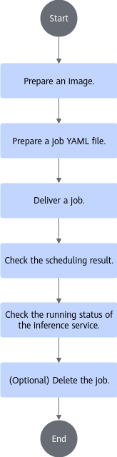

# Deploying vLLM Inference Jobs<a name="ZH-CN_TOPIC_0000002516412957"></a>

<!-- md-trans-meta sourceCommit=unknown translatedAt=2026-06-26T11:47:18.406Z pushedAt=2026-06-27T00:32:25.578Z -->

## Implementation Principles<a name="ZH-CN_TOPIC_0000002484053032"></a>

1. The cluster scheduling components periodically report node and chip information.
    - kubelet reports the node's chip count to the node object.
    - Ascend Device Plugin reports chip memory and topology information.

For chips with on-chip memory, the Ascend Device Plugin reports the chip memory status upon startup, as described in the node-label description; it reports full-NPU information, uploading the chip's physical ID to `device-info-cm`; the total number of allocatable chips, the number of allocated chips, and basic chip information (device_ip and super_device_ip) are reported to the node for full-NPU scheduling.

    - When a fault exists on a node, NodeD periodically reports the node health status and node hardware fault information to `node-info-cm`, and reports shared storage faults to the public faults of ClusterD.

1. After reading the information in `device-info-cm` and `node-info-cm`, as well as the public fault information, ClusterD integrates the information into `cluster-info-cm`.
2. Users submit StormService inference jobs of the AIBrix framework through kubectl or other deep learning platforms. The aibrix-controller-manager generates `RoleSet` or `PodSet` sub-workloads based on the inference job configuration, and the corresponding sub-workloads then generate multiple inference service Pods. For a detailed description of `RoleSet` or `PodSet`, see the [AIBrix documentation](https://aibrix.readthedocs.io/latest/designs/aibrix-stormservice.html).
3. volcano-controller creates the corresponding PodGroup for the job. For a detailed description of PodGroup, see the [official open-source Volcano documentation](https://volcano.sh/docs/v1.9.0/Concepts/podgroup). The PodGroup generation strategy is as follows:

Currently, setting `volcanoSchedulingStrategy` in `stormservice.spec.template.spec.schedulingStrategy` or `stormservice.spec.template.spec.roles[*].schedulingStrategy` is not supported. In this case, the corresponding PodGroup is created by volcano-controller, with the specific strategy as follows:

    - All instances with a podGroupSize equal to 1 belong to a single PodGroup.
    - Each instance with a podGroupSize greater than 1 belongs to an independent PodGroup.

    For example, if the prefill instance has a podGroupSize of 1 and replicas of 2, and the decode instance has a podGroupSize of 2 and replicas of 2, volcano-controller will create three PodGroups. The two prefill instances belong to one PodGroup, while each decode instance corresponds to one PodGroup, resulting in two PodGroups.

5. volcano-scheduler selects appropriate nodes for Pods based on node memory, CPU, labels, and affinity, and writes the selected chip information and node hardware information into the Pod's annotations.
6. When kubelet creates a container, it calls Ascend Device Plugin to mount the chip. Ascend Device Plugin or volcano-scheduler writes the chip and node hardware information on the Pod's annotation. Ascend Docker Runtime assists in mounting the corresponding resources.

## Using via Command Line<a name="ZH-CN_TOPIC_0000002484213018"></a>

### Flow Description<a name="ZH-CN_TOPIC_0000002516292977"></a>

An AIBrix-based vLLM inference job consists of Routing pods and inference instance pods. Inference instance pods are classified into prefill instance pods and decode instance pods pod. Routing pods do not require NPU resources. AIBrix generates different workloads based on inference service configuration modes to create different inference instances, and the Router provides inference services for external systems in a unified manner..

For a detailed description of AIBrix-based job deployment, see the [AIBrix documentation](https://aibrix.readthedocs.io/latest/designs/aibrix-stormservice.html).

**Usage Process<a name="section19644656124210"></a>**

[Figure 1](#fig38991911205815) shows the procedure for using MindCluster cluster scheduling components to deploy an AIBrix-based vLLM inference job via commands.

**Figure 1** Usage process<a name="fig38991911205815"></a>


### Preparing a Job YAML<a name="ZH-CN_TOPIC_0000002516412959"></a>

Complete the preparations for creating the image based on the actual situation, then select the corresponding YAML example and modify it.

**Prerequisites<a name="section3759720141513"></a>**

The image preparation has been completed. For the vLLM inference image, refer to the [official vllm-ascend documentation](https://vllm-ascend.readthedocs.io/).

**YAML Selection<a name="section1419519264165"></a>**

Currently, vllm-ascend inference jobs based on the AIBrix framework are deployed through the StormService custom CRD. For the usage and deployment of StormService, see the [Aibrix StormService documentation](https://aibrix.readthedocs.io/latest/designs/aibrix-stormservice.html). For a StormService YAML example, see [YAML](https://github.com/vllm-project/aibrix/blob/v0.5.0/samples/disaggregation/vllm/1p1d.yaml).

All AIBrix examples are natively configured for GPU environments. If you use NPUs, these examples must be adapted accordingly. The following provides a reference for NPU adaptation, which can be tailored to your specific requirements.

<pre codetype="yaml">
apiVersion: orchestration.aibrix.ai/v1alpha1
kind: StormService
metadata:
  name: "my-test"
  namespace: "default"
spec:
  replicas: 1                # Modification is currently not supported; the value is 1 only
  updateStrategy:
    type: "InPlaceUpdate"
  stateful: true
  selector:
    matchLabels:
      app: "my-test"
  template:
    metadata:
      labels:
        app: "my-test"
    spec:
      roles:
        - name: "prefill"         # prefill definition
          replicas: 1             # prefill replica count
          podGroupSize: 1         # prefill pod replica count
          stateful: true          # Currently, only setting to true is supported
          template:
            metadata:
              labels:
                model.aibrix.ai/name: "qwen3-moe"  # Label required by aibrix; fill in based on the actual situation
                model.aibrix.ai/port: "8000"
                model.aibrix.ai/engine: "vllm"
                fault-scheduling: "force"          # Enable rescheduling
                <strong>pod-rescheduling："on"         # If podGroupSize is 1, pod-rescheduling needs to be configured as "on"; if podGroupSize is greater than 1, configuration is not required and this parameter should be deleted</strong>
              annotations:
                <strong>huawei.com/schedule_policy: "chip2-node16-sp"</strong>
                <strong>huawei.com/schedule_minAvailable: "1" # The minimum scheduling replica count under the Gang scheduling policy. In StormService, all instances with a podGroupSize of 1 will form a podGroup for scheduling, and their minimum scheduling replica count value range is [1, the sum of instance replicas]. The recommended configuration is the sum of instance replicas. Instances with a podGroupSize greater than 1 each form their own podGroup, and their minimum scheduling replica count value range is [1, podGroupSize]. The recommended configuration is podGroupSize. For example, if the prefill instance's podGroupSize is 1 and the decode instance's podGroupSize is 2, then the prefill instance's minimum scheduling replica count is set to the prefill instance's replicas, and the decode instance's minimum scheduling replica count is set to the decode instance's podGroupSize</strong>
                <strong>huawei.com/recover_policy_path: "pod"  # The path for job execution recovery when pod-rescheduling is "on". Set to "pod", indicating that when pod-level rescheduling fails, it will not escalate to job-level rescheduling. Because each pod in the current podGroup is an independent instance, its fault handling cannot spread to other instances. (When using vcjob, this policy needs to be configured: policies: -event:PodFailed -action:RestartTask)</strong>
            spec:
              schedulerName: volcano           # Specify the scheduler as Volcano
              nodeSelector:
                accelerator-type: "module-a3-16-super-pod" # Set it based on the hardware form.
              containers:
                - name: prefill
                  image: vllm-ascend:xxx        # Image name
                  ...
                  resources:
                    limits:
                      "huawei.com/Ascend910": 16  # Configure the NPU count
                    requests:
                      "huawei.com/Ascend910": 16
        ...
        - name: decode       # decode definition
          replicas: 1        # decode replica count
          podGroupSize: 2    # decode pod replica count
          stateful: true
          template:
            metadata:
              labels:
                model.aibrix.ai/name: "qwen3-moe"
                model.aibrix.ai/port: "8000"
                model.aibrix.ai/engine: vllm
                fault-scheduling: "force"    # enable rescheduling
              annotations:
                <strong>huawei.com/schedule_policy: "chip2-node16-sp"</strong>
                <strong>huawei.com/schedule_minAvailable: "2" # see prefill instance parameter description</strong>
            spec:
              schedulerName: volcano
              nodeSelector:
                accelerator-type: "module-a3-16-super-pod"
              containers:
                - name: decode
                  image: vllm-ascend:xxx

                  ...
                  resources:
                    limits:
                      "huawei.com/Ascend910": 16  # configure NPU count
                    requests:
                      "huawei.com/Ascend910": 16
        ...
        - name: routing    # routing definition
          replicas: 1      # routing replica count
          stateful: true
          template:
            spec:
              containers:
              - name: router
                image: xxx:yyy   # routing image
                ...</pre>

### YAML Parameter Description<a name="ZH-CN_TOPIC_0000002484053034"></a>

The table below describes only the fields related to MindCluster in the StormService YAML file of AIBrix.

**Table 1**  YAML parameters

<a name="zh-cn_topic_0000002329010086_table7602101418317"></a>

|Parameter|Value|Description|
|---|---|---|
|schedulerName|The value is "volcano".|Configures the scheduler as Volcano.|
|(Optional) host-arch|<ul><li>Arm: huawei-arm</li><li>x86_64: huawei-x86</li></ul>|<p>Architecture of the node where a training job is executed. Set this parameter as required.</p><p>In a distributed training job, ensure that the nodes running the training job have the same architecture.</p>|
|sp-block|Specifies the number of logical SuperPoD chips.<p>It must be an integer multiple of the node chip count, and the total chip count of the P/D instance must be an integer multiple of it.</p>|Specifies the sp-block field. The cluster scheduling component divides the physical SuperPoD into logical SuperPoDs based on the splitting policy for affinity scheduling of the job. If the user does not specify this field, Volcano sets the logical SuperPoD size for this job to the total number of NPUs configured for the job during scheduling.<ul><li>For a detailed description, see [UnifiedBus Device Network Description](../basic_scheduling/01_affinity_scheduling/03_ascend_ai_processor_based_affinity.md).</li><li>This field is only supported on Atlas 800I A3 SuperPoD servers.</li></ul>|
|pod-rescheduling|<ul><li>on: Enables pod-level rescheduling.</li><li>Other values or when this field is not used: Disables pod-level rescheduling.</li></ul>|Pod-level rescheduling means that after a job failure, not all job pods in the PodGroup are deleted. Instead, the failed pod is deleted, and the controller recreates a new pod for rescheduling.<div class="note"><span class="notetitle">[!NOTE] Description</span><div class="notebody">If podGroupSize is 1, pod-rescheduling must be set to "on"; when podGroupSize is greater than 1, do not configure this parameter.</div></div>|
|huawei.com/schedule\_minAvailable|A numeric string|The minimum scheduling replica count under the gang scheduling policy. In StormService, <ul><li>All instances with podGroupSize of 1 form a podGroup for scheduling, and their minimum scheduling replica count value range is [1, the sum of instance replicas]. The recommended configuration is the sum of instance replicas.</li><li>Instances with podGroupSize greater than 1 each form their own podGroup, and their minimum scheduling replica count value range is [1, podGroupSize]. The recommended configuration is podGroupSize.</li></ul>For example, if the podGroupSize of the prefill instance is 1 and that of the decode instance is 2, then the minimum scheduling replica count of the prefill instance is set to the replicas of the prefill instance, and the minimum scheduling replica count of the decode instance is set to the podGroupSize of the decode instance.|
|huawei.com/recover\_policy\_path|"pod"|The path for job recovery when pod-rescheduling is "on". Set to "pod", indicating that when pod-level rescheduling fails, it will not escalate to job-level rescheduling. Because each pod in the current podGroup is an independent instance, its fault handling cannot propagate to other instances. (When using vcjob, you need to configure this policy: policies: -event:PodFailed -action:RestartTask)|
|accelerator-type|<ul><li>Atlas 800I A2 inference server: module-910b-8</li><li>Atlas 800I A3 SuperPoD Server: module-a3-16</li><li>Atlas 900 A3 SuperPoD: module-a3-16-super-pod</li></ul>|Set this parameter based on the type of the node where a training job is executed.|
|huawei.com/Ascend910|<ul><li>Atlas 800I A2 inference server: 8</li><li>Atlas 900 A3 SuperPoD SuperPoD, Atlas 800I A3 SuperPoD server: 16</li></ul>|The number of NPUs requested. Currently, only full-server scheduling is supported. Modify this based on the actual hardware card count.|
|env\[name==ASCEND\_VISIBLE\_DEVICES\].valueFrom.fieldRef.fieldPath|The value is metadata.annotations\['huawei.com/Ascend910'\], which must be consistent with the actual chip type in the environment.| Ascend Docker Runtime obtains this parameter value to mount the corresponding type of NPU to the container.<div class="note"><span class="notetitle">Note:</span><div class="notebody">This parameter only supports the full-card scheduling feature of the Volcano scheduler. Users who use static vNPU scheduling or other schedulers need to delete the relevant fields of this parameter in the sample YAML.</div></div>|
|fault-scheduling|<ul><li>grace: Configures the job to use graceful deletion mode, where the original pod is gracefully deleted first. If unsuccessful after 15 minutes, the original pod is forcefully deleted.</li><li>force: Configures the job to use forceful deletion mode, where the original pod is forcefully deleted during the process.</li><li>off, none (no fault-scheduling field), or other values: This inference job does not use the fault rescheduling feature.</li></ul>|-|
|fault-retry-times|<ul><li>0 \< fault-retry-times: Handles service plane faults. The number of unconditional retries for the service plane must be configured.</li><li>None (no fault-retry-times) or 0: This job does not use the unconditional retry feature. Volcano will not actively delete the faulty pod after a service plane fault occurs.</li></ul>|-|
|restartPolicy|<ul><li>Never: Never restart</li><li>Always: Always restart</li><li>OnFailure: Restart on failure</li><li>ExitCode: Whether to restart the pod based on the process exit code. It does not restart when the error code is 1 to 127, and restarts the pod when the error code is 128 to 255.<div class="note"><span class="notetitle">Note:</span><div class="notebody">The vcjob type training job does not support ExitCode.</div></div></li></ul>|Container restart policy. When unconditional retry for service plane faults is configured, the container restart policy value must be "Never".|

### Delivering, Viewing, and Deleting an Inference Job<a name="ZH-CN_TOPIC_0000002484213020"></a>

After you have prepared the job YAML file, you can perform the following operations:

1. Deliver an inference job.
2. Check scheduling results.
3. View the inference job running status.
4. (Optional) Delete the job.

For a detailed description of the above steps, see the [AIBrix documentation](https://aibrix.readthedocs.io/latest/getting_started/quickstart.html).

## Deploying Inference Jobs Using a Script in One-Click Mode<a name="ZH-CN_TOPIC_0000002516330447"></a>

If multiple associated inference jobs are deployed in the Kubernetes cluster, manually compiling and maintaining a large number of Kubernetes YAML files is inefficient and error-prone. To solve this problem, MindCluster provides an automatic script to replace complex manual operations. You only need to provide basic information, such as the application name, image version, and number of replicas, and the script automatically generates all necessary Kubernetes YAML files that comply with specifications and deploys them to the specified cluster. In addition, MindCluster provides an easy way, such as specifying a common application name, to remove all associated resources at once.

The current script only supports P/D disaggregation deployment.

**Prerequisites<a name="section178303526285"></a>**

- MindCluster and AIBrix components have been installed.
- Python is installed in the environment, and dependency packages can be downloaded over the network.
- A KubeConfig file exists and can communicate normally with the K8s cluster.

**Procedure<a name="section582414444317"></a>**

1. Obtain the source code from the mindcluster-deploy repository and enter the `k8s-deploy-tool` directory.

    ```shell
    git clone https://gitcode.com/Ascend/mindcluster-deploy.git && cd mindcluster-deploy/k8s-deploy-tool
    ```

2. (Optional) Create and activate a Python virtual environment. This operation allows different Python projects to use different versions of libraries without interfering with each other.

    ```shell
    python -m venv k8s-deploy-tool && source k8s-deploy-tool/bin/activate
    ```

    Use Python or Python3 based on the actual situation of the environment.

3. Install dependencies.

    ```shell
    pip install -r requirements.txt
    ```

4. (Optional) Modify the instance startup script. Modify it based on the actual situation of your model.
5. Open the `example/scripts/start_server.sh` file.

        ```shell
        vi example/scripts/start_server.sh
        ```

6. Press `i` to enter insert mode. Based on the actual situation of your model, modify the vLLM process startup command, such as `max-model-len`, `max-num-batched-tokens`, etc.
7. Press the `Esc` key, type `:wq!`, and press `Enter` to save and exit the editing.

8. (Optional) Copy the startup script to another directory on the host or to other nodes in the cluster. In a single-server environment, this step can be skipped. If your environment includes shared storage, the script file can also be copied to the shared storage, and the shared storage can be mounted to the inference service.

>[!NOTE]
>The default [proxy script](https://gitcode.com/Ascend/mindcluster-deploy/blob/master/k8s-deploy-tool/example/scripts/load_balance_proxy_layerwise_server_example.py) in the `scripts` folder enables the fault isolation feature. If this feature is not required, replace the proxy script in the `scripts` folder with the [native proxy script](https://github.com/vllm-project/vllm-ascend/blob/main/examples/disaggregated_prefill_v1/load_balance_proxy_layerwise_server_example.py).

    ```shell
    cp example/scripts/*  <target_dir>
    scp example/scripts/* <user>@<IP>:<target_dir>
    ```

6. (Optional) Edit the YAML template to configure the model and script mount paths as required.
    1. Open the `src/templates/aibrix/stormservice.yaml.j2` file.

        ```shell
        vi src/templates/aibrix/stormservice.yaml.j2
        ```

    2. Press `i` to enter insert mode, and modify the model storage directory in the container.

        ```Yaml
        volumeMounts:
        - name: model
        mountPath: /mnt/models
        volumes:                  # Modify the mounted volume
        - name: model             # Set to the actual model storage directory
        hostPath:
        path: /mnt/models
        - name: scripts           # Set to the actual directory where the startup scripts are stored
        hostPath:
        path: /scripts
        ```

    3. Press the `Esc` key, type `:wq!`, and press `Enter` to save and exit editing.

7. Edit the user configuration file `config/stormservice-config.yaml`.

    1. Open the `config/stormservice-config.yaml` file.

        ```shell
        vi config/stormservice-config.yaml
        ```

    2. Press `i` to enter insert mode, and modify the fields in the file based on the actual situation.
    3. Press the `Esc` key, enter `:wq!`, and press `Enter` to save and exit editing.

    >[!NOTE]
    >
    >- `dp_size` must be an integer multiple of `podGroupSize`.
    >
    >- When `dp_size` is set to "1", "`distributed_dp`" can only be "`false`"; it can be set to "`true`" only when greater than "1".

8. (Optional) Create a namespace for the job. `vllm-test` is `app_namespace` set in `config/stormservice-config.yaml`. If `app_namespace` is `default` or not set, you do not need to create a namespace.

    ```shell
    kubectl create ns vllm-test
    ```

9. Set the serving framework type to `aibrix`.

    ```shell
    export SERVING_FRAMEWORK=aibrix
    ```

10. Deploy the inference job.

    ```shell
    python main.py deploy -c config/stormservice-config.yaml
    ```

    Use Python or Python3 based on the actual environment. The parameter description is as follows:

    - `-c, --config`: Configuration file path; required.
    - `-k, --kubeconfig`: KubeConfig file path; optional. The default value is `~/.kube/config`.
    - `--dry-run`: trial run (this parameter is not deployed actually, and is used to display the generated YAML file); optional.

11. Check the job running status.

    ```shell
    python main.py status -n my-test -ns default
    ```

    Parameter description:

    - `-n, --app-name`: App name; required.
    - `-ns, --namespace`: App namespace; optional. The default value is `default`.
    - `-k, --kubeconfig`: KubeConfig file path; optional. The default value is `~/.kube/config`.

    >[!NOTE]
    >You can also use the kubectl command-line tool to view the job running status.

12. Open a new terminal window and execute the following command on a node in the current K8s cluster to access the inference service. If the request returns successfully, it indicates that the inference service has been deployed successfully.

    ```shell
    curl http://<routing-podip>:8080/v1/completions \
    -H "Content-Type: application/json" \
    -d '{
    "model": "<model name>",
    "prompt": "Who are you?",
    "max_tokens": 10,
    "temperature": 0
    }'
    ```

    >[!NOTE]
    >- <routing-podip\> is the IP address of the Routing Pod, which can be viewed using the following command.
    >
    >   ```shell
    >   kubectl get pod -A -o wide
    >   ```
    >
    >- <model_name> depends on the startup parameter `served_model_name` used by vLLM to set the model name.

13. (Optional) Delete the inference lob.

    ```shell
    python main.py delete -n my-test -ns default
    ```

    Parameter description:

    - `-n, --app-name`: App name; required.
    - `-ns, --namespace`: App namespace; optional. The default value is `default`.
    - `-k, --kubeconfig`: KubeConfig file path; optional. The default value is `~/.kube/config`.
