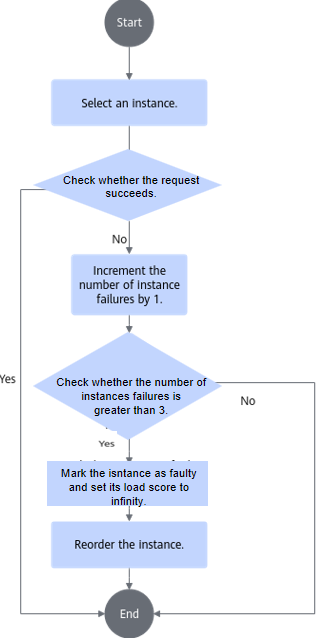
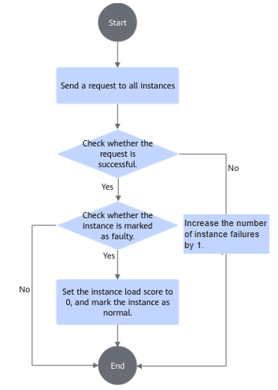

# Configuring Fault Isolation

The [native proxy script](https://github.com/vllm-project/vllm-ascend/blob/main/examples/disaggregated_prefill_v1/load_balance_proxy_layerwise_server_example.py) provided by vLLM Ascend encapsulates vLLM services as instance objects and builds a Prefill instance heap and a Decode instance heap based on the load scores of the instance objects (a min-heap is a special data structure where the element at the top of the heap is the smallest in the entire heap). When a request arrives at the proxy, the proxy selects an instance from the instance heap (i.e., the one with the smallest load score), and updates the load score after selecting the instance, thereby achieving load balancing across instances.

Since the native proxy script does not probe or handle whether instances are serviceable, fault isolation has been added on top of the native proxy script. The purpose of fault isolation is to isolate services that cannot run normally, preventing traffic from reaching faulty instances and thus failing to be served. A health probe function is also added to assist fault isolation.

## Fault Isolation Principles

In the proxy script, a mechanism has been added to count failures and check faults for instance objects. The specific process is shown in [Figure 1](#fig158696279554).

**Figure 1**  Fault isolation flowchart

1. Select an instance from the heap.
2. Route the request to this instance.
    - If the request succeeds, no action is required.
    - If the request fails, increment the failure count of this instance by 1.

3. When the failure count of an instance exceeds 3, the instance is marked as faulty and its load score is set to infinity.
4. Based on the characteristics of the min-heap, the faulty instance will be sorted to the bottom of the heap by load score, with its priority reduced to the lowest.

>[!NOTE]
>Since the proxy script implementation does not remove faulty instances from the heap, the instance selection logic has been changed from a single attempt to a loop that repeatedly fetches instances until a non‑faulty one is found. If all instances in the heap are faulty, the proxy becomes unable to serve.

## Health Probe Principles

In the proxy script, the health probe coroutine is enabled by default. It probes all instance objects and performs subsequent processing based on the probe results. The specific process is shown in [Figure 2](#fig175216161511).

**Figure 2**  Health probe flowchart

1. The health probe function probes all instance objects every 5s by calling the `/health` API.
2. If the request fails, the failure count of the instance is incremented by 1.
3. If the request succeeds, the following two cases apply:
    - If the current instance is not marked as faulty, the instance is normal and no change is needed.
    - If the current instance is marked as faulty, set its load score to 0 and mark the instance as normal. The instance can then process requests normally.

## Deployment and Usage

For details, see [One-Click Deployment and Usage via Script](./01_deploying_vllm_inference_job.md#deploying-inference-jobs-using-a-script-in-one-click-mode).
