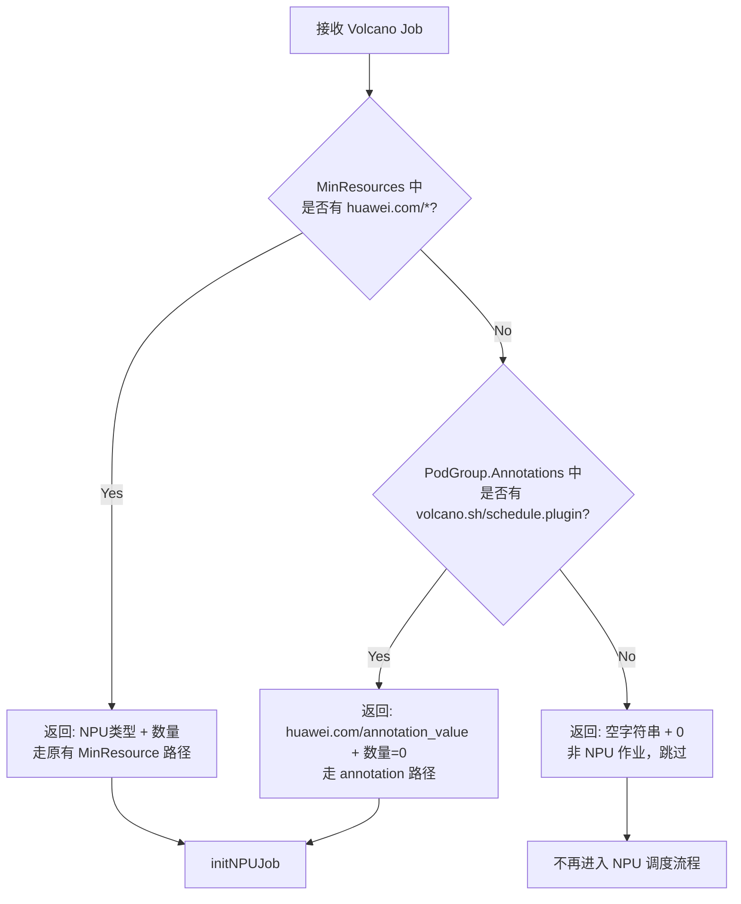
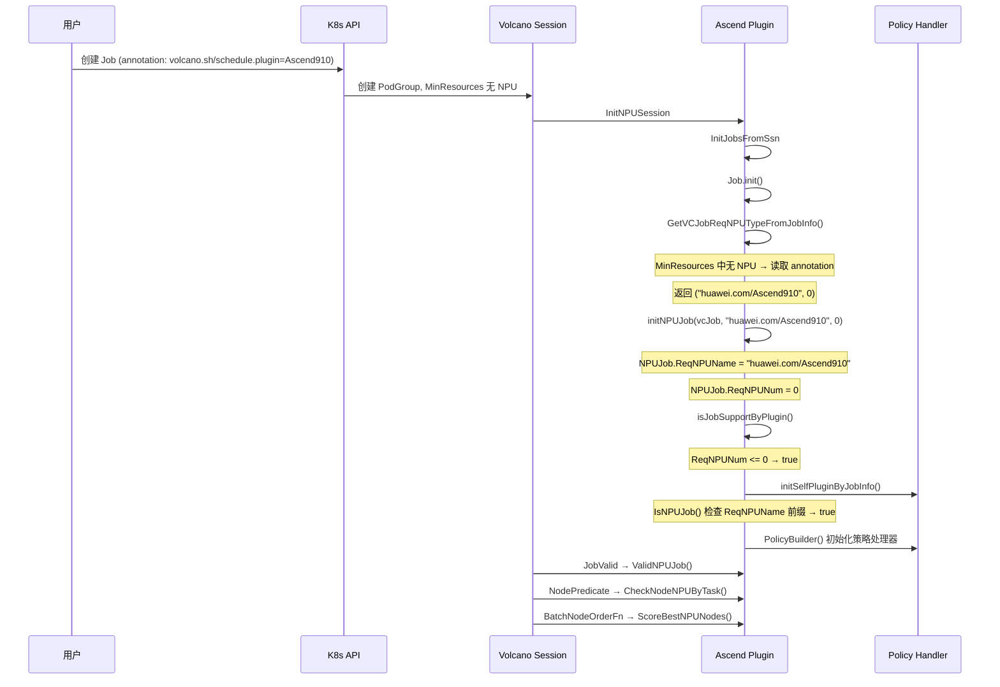
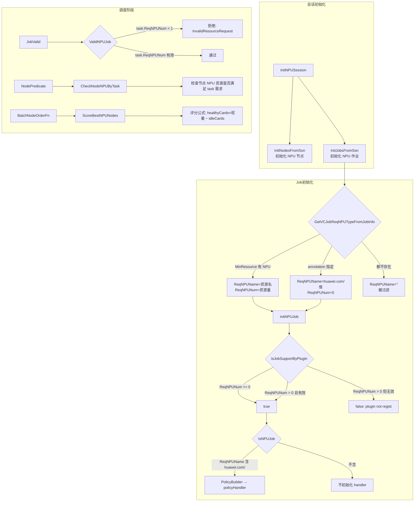

# 需求设计文档: PodGroup MinResource 中 NPU 数量设置为 0 的支持

## 背景

在现有调度系统中，用户启用 Ascend NPU 亲和性调度时必须在 PodGroup 的 `MinResources` 中显式声明 `huawei.com/Ascend910` 等 NPU 资源请求量。当用户仅需声明 NPU 类型，而不希望通过 MinResource 约束资源量（例如一个任务中包含多种pod，用户希望未使用NPU的pod可以先调度起来，等NPU资源充足时再调度使用NPU的pod），当前系统无法支持。

## 目标

支持通过 PodGroup annotation `volcano.sh/schedule.plugin` 指定 NPU 调度策略类型。当 MinResources 中不包含 `huawei.com/*` 资源时，调度器仍能识别该作业为 NPU 作业，初始化对应的调度策略处理器，应用 NPU 亲和性调度规则。

## 核心设计

### NPU 类型识别流程



### 会话初始化流程



### 调度阶段流程



### 核心变更点

**判断依据从"资源数量"转为"资源类型名称"**

- 策略处理器初始化：不再检查 `ReqNPUNum > 0`，改为检查 `IsNPUJob()`（判断 `ReqNPUName` 是否含 `huawei.com/` 前缀）
- NPU 类型来源：annotation 值动态拼接 `huawei.com/` 前缀，替代硬编码 `Ascend910`，支持所有 NPU 类型
- 作业过滤：仅在 `ReqNPUName == ""` 时跳过（非 NPU 作业），annotation 路径的作业 `ReqNPUName` 已正确设置不会被过滤
- 重调度兼容：`GetRunningJobs` 仅检查 `NPUJob == nil`，不检查 `ReqNPUNum`

## 适用场景

1. **仅声明调度策略**：通过 `schedule_policy` annotation 指定芯片亲和性策略（如 `chip8-node8`），无需在 MinResources 中重复 NPU 数量
2. **多任务混合调度**：Job 中部分 task 需要 NPU、部分不需要，annotation 统一声明 NPU 类型但不强制 MinResource
3. **动态芯片类型切换**：通过修改 annotation 快速切换 Ascend910/Ascend310P 调度策略
4. **重调度兼容**：重调度模块不再因 `ReqNPUNum == 0` 而跳过 NPU 作业

## 兼容性风险评估

| 场景 | 影响 |
|------|------|
| 非 NPU 作业（无 annotation，无 MinResource NPU） | 无影响 — `ReqNPUName=""` 被过滤 |
| 正常 NPU 作业（MinResource 中有 NPU） | 无影响 — 走原有 MinResource 路径 |
| 仅设 annotation 的 NPU 作业 | **新支持** — 正确初始化 policy handler |
| 设 annotation 但部分 pod 无 NPU request | **新支持** — 无 NPU 的 task 走 `!IsNPUTask()` 分支跳过 |
| annotation 值无效（非标准 NPU 类型） | PolicyBuilder 无法匹配，job 保持 Pending（安全拒绝，不 panic） |
| MinResource 和 annotation 同时存在 | MinResource 优先，annotation 被忽略 |
| 重调度场景 | 无影响 — `ReqNPUNum=0` 时 NPUJob 仍存在 |

## 功能测试用例

### FT-1: annotation 方式触发 Ascend910 NPU 调度（核心场景）

**前置条件**：集群已部署 volcano scheduler 及 ascend-volcano-plugin，有可用 Ascend910 节点。

**步骤**：

1. 创建 AscendJob，Pod 容器中 request `huawei.com/Ascend910: 8`，在 Job 的 metadata.annotations 中设置 `volcano.sh/schedule.plugin: Ascend910`（ascend-operator 会将 Job 的 annotations 复制到 PodGroup 上），同时通过 `runPolicy.schedulingPolicy.minResources` 显式指定不含 NPU 资源的 MinResources 以触发 annotation 识别路径：

```yaml
apiVersion: mindxdl.gitee.com/v1
kind: AscendJob
metadata:
  name: test-anno-npu-910
  labels: 
    framework: pytorch
  annotations:
    volcano.sh/schedule.plugin: Ascend910
    huawei.com/schedule_policy: chip4-node8
spec:
  schedulerName: volcano
  runPolicy:
    schedulingPolicy:
      minAvailable: 1
      queue: default
      minResources:
        cpu: "1"
        memory: "1Gi"
  replicaSpecs:
    Master:
      replicas: 1
      template:
        spec:
          containers:
          - name: ascend
            image: ubuntu:20.04
            command: ["sleep", "3600"]
            resources:
              requests:
                cpu: "1"
                memory: "1Gi"
                huawei.com/Ascend910: 4
              limits:
                cpu: "1"
                memory: "1Gi"
                huawei.com/Ascend910: 4
```

> **说明**：ascend-operator 创建 PodGroup 时将 Job `metadata.annotations` 复制到 PodGroup annotations（参见 `createPodGroup`）。`volcano.sh/schedule.plugin` 必须放在 Job annotations 中。
>
> 同时，默认 MinResources 由 `CalcPGMinResources` 根据 container requests 自动计算。若不显式指定 `minResources`，Pod 中 request 的 NPU 资源将进入 MinResources，导致 `GetVCJobReqNPUTypeFromJobInfo` 走 MinResources 路径而不触发 annotation 回退。通过 `runPolicy.schedulingPolicy.minResources` 显式指定不含 NPU 的 MinResources 可绕过自动计算，确保 annotation 路径被命中。

2. 提交 Job 并观察：
```bash
kubectl get podgroup test-anno-npu-910 -o yaml
kubectl get pod -o yaml | grep huawei.com
```

**预期结果**：
- scheduler 识别该 Job 为 Ascend910 NPU 作业（通过 annotation 路径，`ReqNPUNum=0`）
- PodGroup 状态由 Pending → Running
- Pod 被调度到具备 Ascend910 NPU 的节点上
- Pod annotation 中包含 NPU 设备分配信息（如 `huawei.com/Ascend910：Ascend910-0` 等）
- scheduler 日志中无 "plugin not regist" 错误

---

### FT-2: annotation 方式触发 Ascend310P NPU 调度

**前置条件**：集群有可用 Ascend310P 节点。

**步骤**：

1. 创建 AscendJob，在 Job metadata.annotations 中设置 `volcano.sh/schedule.plugin: Ascend310P`，Pod request `huawei.com/Ascend310P: 4`，显式指定不含 NPU 的 MinResources：

```yaml
apiVersion: mindxdl.gitee.com/v1
kind: AscendJob
metadata:
  name: test-anno-npu-310p
  labels: 
    framework: pytorch
  annotations:
    volcano.sh/schedule.plugin: Ascend310P
spec:
  schedulerName: volcano
  runPolicy:
    schedulingPolicy:
      minAvailable: 1
      minResources:
        cpu: "1"
        memory: "1Gi"
  replicaSpecs:
    Master:
      replicas: 1
      template:
        spec:
          containers:
          - name: ascend
            image: ubuntu:20.04
            command: ["sleep", "3600"]
            resources:
              requests:
                huawei.com/Ascend310P: 4
```

2. 提交并观察调度结果。

**预期结果**：
- scheduler 识别为 Ascend310P 类型，应用 Ascend310P 调度策略
- Pod 调度到 Ascend310P 节点，不会误分配到 Ascend910 节点

---

### FT-3: MinResource 中有 NPU 时 annotation 不生效（优先级验证）

**前置条件**：集群有 Ascend910 和 Ascend310P 节点。

**步骤**：

1. 创建 AscendJob，Pod 容器 request `huawei.com/Ascend910: 4`，在 `runPolicy.schedulingPolicy.minResources` 中显式设置 `huawei.com/Ascend910: 4`（MinResources 路径优先）或不设置（默认就是所有pod的requests），Job annotation 设为 `volcano.sh/schedule.plugin: Ascend310P`：

```yaml
apiVersion: mindxdl.gitee.com/v1
kind: AscendJob
metadata:
  name: test-minres-priority
  labels: 
    framework: pytorch
  annotations:
    volcano.sh/schedule.plugin: Ascend310P
    huawei.com/schedule_policy: chip4-node8
spec:
  schedulerName: volcano
  runPolicy:
    schedulingPolicy:
      minAvailable: 1
      queue: default
  replicaSpecs:
    Master:
      replicas: 1
      template:
        spec:
          containers:
          - name: ascend
            image: ubuntu:20.04
            command: ["sleep", "3600"]
            resources:
              requests:
                huawei.com/Ascend910: 4
              limits:
                huawei.com/Ascend910: 4
```

2. 提交并观察。

**预期结果**：
- `GetVCJobReqNPUTypeFromJobInfo` 在 MinResources 中匹配到 `huawei.com/Ascend910` 后直接返回，不读取 annotation
- Job 按 MinResources 中的 `Ascend910` 处理（annotation `Ascend310P` 被忽略）
- 分配 4 个 Ascend910 NPU

---

### FT-4: 非 NPU 作业不受影响（兼容性验证）

**前置条件**：普通 Kubernetes 集群。

**步骤**：

1. 创建普通 AscendJob，不设 NPU 资源请求，不设 annotation：
```yaml
apiVersion: mindxdl.gitee.com/v1
kind: AscendJob
metadata:
  name: test-no-npu
  labels: 
    framework: pytorch
spec:
  schedulerName: volcano
  runPolicy:
    schedulingPolicy:
      queue: default
      minAvailable: 1
  replicaSpecs:
    Master:
      replicas: 1
      template:
        spec:
          containers:
          - name: ascend
            image: ubuntu:20.04
            command: ["sleep", "3600"]
            resources:
              requests:
                cpu: "1"
                memory: "1Gi"
```

2. 提交并观察。

**预期结果**：
- Job 正常调度，不受 ascend-volcano-plugin 影响
- Pod 调度到任意满足 CPU/Memory 的节点
- scheduler 日志中无该 Job 的 plugin 相关日志

---

### FT-5: annotation 设为无效 NPU 类型时的表现

**前置条件**：集群已部署 ascend-volcano-plugin。

**步骤**：

1. 创建 AscendJob，Job annotation 设为不存在的类型（如 `Ascend999`），显式指定不含 NPU 的 MinResources：

```yaml
apiVersion: mindxdl.gitee.com/v1
kind: AscendJob
metadata:
  name: test-invalid-npu-type
  labels: 
    framework: pytorch
  annotations:
    volcano.sh/schedule.plugin: Ascend999
    huawei.com/schedule_policy: chip4-node8
spec:
  schedulerName: volcano
  runPolicy:
    schedulingPolicy:
      minAvailable: 1
      queue: default
      minResources:
        cpu: "1"
        memory: "1Gi"
  replicaSpecs:
    Master:
      replicas: 1
      template:
        spec:
          containers:
          - name: ascend
            image: ubuntu:20.04
            command: ["sleep", "3600"]
            resources:
              requests:
                huawei.com/Ascend910: 8
              limits:
                huawei.com/Ascend910: 8
```

2. 提交并观察 PodGroup 状态。

**预期结果**：
- `GetVCJobReqNPUTypeFromJobInfo` 通过 annotation 返回 `("huawei.com/Ascend999", 0, nil)`
- `npu.InitPolicyHandler` 的 switch 不匹配任何已知 NPU 类型，返回 `(nil, false)`，Controller 的 PolicyHandler 列表为空
- `Controller.ValidNPUJob()` 检测到空 handler 列表，返回 `NotSupportPolicy`
- PodGroup 保持 Pending 状态
- PodGroup condition 显示 `NotSupportPolicy` 原因
- scheduler 日志有相关告警
- 不 panic 或 crash

---

### FT-6: 重调度场景——annotation NPU 作业故障恢复

**前置条件**：集群有 Ascend910 节点，可模拟 NPU 故障。

**步骤**：

1. 创建 annotation 方式的 Ascend910 Job（同 FT-1和FT-4），等待正常运行。

2. 构造节点故障。

3. 等待重调度触发，观察 Pod 驱逐与重建。

**预期结果**：
- 重调度模块识别该 Job（不会因 `ReqNPUNum=0` 跳过）
- Pod 被驱逐并在健康节点重建
- 新 Pod 分配的健康 NPU 不包含故障 NPU

---

### FT-7: 部分 Pod 不 request NPU 的混合调度

**前置条件**：集群有可用 Ascend910 节点。

**步骤**：

1. 创建 AscendJob，Job annotation 设为 `Ascend910`，包含两个 ReplicaType——一个 request NPU，一个不 request，显式指定不含 NPU 的 MinResources：

```yaml
apiVersion: mindxdl.gitee.com/v1
kind: AscendJob
metadata:
  name: test-mixed-npu
  labels: 
    framework: mindspore
  annotations:
    volcano.sh/schedule.plugin: Ascend910
spec:
  schedulerName: volcano
  runPolicy:
    schedulingPolicy:
      minAvailable: 2
      queue: default
      minResources:
        cpu: "1"
        memory: "1Gi"
  replicaSpecs:
    Worker:
      replicas: 1
      template:
        spec:
          containers:
          - name: ascend
            image: ubuntu:20.04
            command: ["sleep", "3600"]
            resources:
              requests:
                huawei.com/Ascend910: 4
              limits:
                huawei.com/Ascend910: 4
    Scheduler:
      replicas: 1
      template:
        spec:
          containers:
          - name: ascend
            image: ubuntu:20.04
            command: ["sleep", "3600"]
            resources:
              requests:
                cpu: "1"
                memory: "1Gi"
              limits:
                cpu: "1"
                memory: "1Gi"
```

2. 提交并观察。

**预期结果**：
- `GetVCJobReqNPUTypeFromJobInfo` 在 MinResources 中匹配到 `huawei.com/Ascend910` 后直接返回，不读取 annotation

```

2. 提交并观察。

**预期结果**：
- Job 正常通过验证（annotation 路径生效，`ReqNPUNum=0`）
- `npu-worker` 分配到 Ascend910 节点，`cpu-worker` 正常调度到任意节点
- `cpu-worker` 在 `ValidNPUJob` 中走 `!task.IsNPUTask()` 分支跳过校验

---

### 测试覆盖矩阵

```
┌──────────────────────┬──────────────────┬──────────────────────┬──────────────────┐
│ 测试场景             │  MinResource NPU  │  Annotation NPU      │  非 NPU 作业     │
├──────────────────────┼──────────────────┼──────────────────────┼──────────────────┤
│ Ascend910 基础调度   │  原有功能（回归） │  FT-1（核心）         │  FT-4（兼容性）   │
│ Ascend310P 调度      │  原有功能（回归） │  FT-2（核心）         │  -               │
│ 优先级验证           │        -         │  FT-3（MinRes 优先）  │  -               │
│ 无效 NPU 类型        │        -         │  FT-5（异常路径）     │  -               │
│ 重调度               │  原有功能（回归） │  FT-6（核心）         │  -               │
│ 部分 Pod 无 NPU req  │        -         │  FT-7（混合正常调度） │  -               │
└──────────────────────┴──────────────────┴──────────────────────┴──────────────────┘
```

### 验证检查点汇总

| 检查项 | 验证方法 |
|--------|----------|
| Job 是否被识别为 NPU 作业 | PodGroup Conditions / scheduler 日志 |
| Pod 是否分配到正确 NPU 节点 | `kubectl get pod -o wide` |
| NPU 设备信息是否正确写入 | Pod annotations 中的 `huawei.com/Ascend910-*` |
| 非 NPU 作业是否被正确跳过 | scheduler 日志中无该 Job 的 plugin 处理记录 |
| MinResource 与 annotation 优先级 | MinResource NPU 存在时 annotation 被忽略 |
| 异常输入是否安全处理 | PodGroup Pending，scheduler 不 panic |
