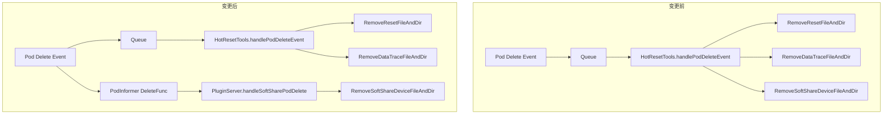

# VNPU 软切分能力补齐需求详设设计文档

## 1. 需求概述

本设计文档基于现有软切分（SoftShare）功能的实现，针对A5标卡场景进行软切分能力补齐：

1. **ascend-for-volcano 支持 950 软切分的调度与重调度**
2. **device-plugin 支持将软切分所需的配置文件挂载到容器中**
3. **ascend-operator 任务支持配置软切分所需参数**

## 2. 术语定义

| 概念 | 说明                                                                                                                                                   |
|------|------------------------------------------------------------------------------------------------------------------------------------------------------|
| **VNPU** | 虚拟 NPU，通过软切分技术在物理 NPU 上创建的虚拟设备                                                                                                                       |
| **软切分** | NPU 时间分片共享机制，允许单个物理 NPU 被多个 Pod 以虚拟配额的方式共享                                                                                                           |
| **aicoreQuota** | AI Core 配额，范围 [1, 100]，100 表示独占整卡                                                                                                                    |
| **hbmQuota** | HBM 内存配额，单位 MB，最小 1                                                                                                                                  |
| **schedulingPolicy** | 调度策略：固定配额模式（fixed-share）、弹性模式（elastic）、争抢模式（best-effort）  <br/>每种模式的详细介绍参见[调度模式介绍](#table1)，其中在争抢模式下，为充分利用算力资源，此时aicore的使用将不受配额的限制，但 HBM 的使用仍受配额的限制。 |
| **virtualID** | 虚拟 NPU ID，每个物理卡上的虚拟分区递增编号                                                                                                                            |
| **dieID** | Die 标识，用于共享内存配置文件路径                                                                                                                                  |
| **SoftShareDevCount** | 每张物理卡扩展为 100 个虚拟设备上报给 kubelet                                                                                                                        |

**调度模式介绍**<a id="table1"></a>

|模式名称|特点描述|
  |:---|:---|
|固定配额模式（fixed-share）|各vNPU按配比严格执行时间片。<br> a. 若有暂未分配的vNPU资源，则在最后一个vNPU时间片消耗完，睡眠一段时间。此时NPU将闲置空转。<br> b. 某vNPU上无任务运行，仍会给定比例消耗完该vNPU的时间片。|
|弹性模式（elastic）| 由于固定配额模式可能出现NPU资源浪费，在此模式下，在各vNPU按配比执行时间片的基础上，为提高卡资源利用率，优化了调度逻辑。<br> a. 最后一个vNPU时间片消耗完，马上将NPU使用权释放给下一个vNPU，跳过睡眠逻辑。 <br> b. 在某vNPU上无任务运行，则直接跳过未消耗完的时间片，切换至另一个vNPU。<br> c. 时间片借用机制：正在执行的vNPU在识别到卡资源空闲的情况下，允许其他vNPU借用该时间片内浪费的资源，使卡上资源不被浪费，进而提升整卡利用率。|
|争抢模式（best-effort）|vNPU之间自行争抢NPU资源，该模式的资源利用率最高，但无法保证vNPU的QoS。|

## 3. 实现分析

### 3.1 三组件协作架构

```
┌─────────────────────────────────────────────────────────────────────┐
│                        用户提交 AscendJob                            │
│  Labels: scheduler.softShareDev.aicoreQuota/hbmQuota/policy        │
└──────────────────────────┬──────────────────────────────────────────┘
                           │
                           ▼
┌─────────────────────────────────────────────────────────────────────┐
│                    ascend-operator                                   │
│  1. isSoftShareDevJob() 检测是否为软切分任务                          │
│  2. 构造 podInfo 时标记 isSoftShareDevJob=true                       │
│  3. 注入环境变量：                                                    │
│     - 跳过 ASCEND_VISIBLE_DEVICES（虚拟分区不映射物理设备）             │
│     - MindSpore: MS_LOCAL_WORKER=1, MS_WORKER_NUM=npuReplicas       │
│     - PyTorch:   LOCAL_WORLD_SIZE=1, WORLD_SIZE=npuReplicas          │
│     - TensorFlow: CM_LOCAL_WORKER=1, CM_WORKER_SIZE=npuReplicas      │
│  4. 创建 Pod，携带软切分 annotations                                  │
└──────────────────────────┬──────────────────────────────────────────┘
                           │ Pod 调度
                           ▼
┌─────────────────────────────────────────────────────────────────────┐
│                    ascend-for-volcano                                │
│  1. ValidNPUJob(): 校验 aicoreQuota∈[1,100]、hbmQuota≥1、            │
│     aicoreQuota==ReqNPUNum/NPUTaskNum、policy 合法                   │
│  2. CheckNodeNPUByTask(): 节点预选                                    │
│     - 节点必须有 label chip1softsharedev.enable=true                 │
│     - 节点总可用资源 ≥ 任务总需求                                      │
│     - 至少一张卡能容纳请求（配额+策略兼容）                              │
│  3. ScoreBestNPUNodes(): 打分偏好已占用卡（装箱策略）                   │
│  4. selectNPUFromNode(): 选卡策略                                     │
│     - 优先选择已有同策略且剩余配额充足的卡                               │
│     - 其次选择空闲卡                                                   │
│  5. GetNewNPUNodeAnnotation(): 更新节点可用设备注解                     │
│     - 卡仍有剩余配额 → 保留在可用列表                                   │
│     - 卡配额用尽 → 从可用列表移除                                      │
│  6. Job Enqueue: 软切分节点每卡算 100 个虚拟设备                       │
└──────────────────────────┬──────────────────────────────────────────┘
                           │ Pod 绑定到节点
                           ▼
┌─────────────────────────────────────────────────────────────────────┐
│                    ascend-device-plugin                              │
│  1. ListAndWatch: 每张物理 NPU 上报 100 个虚拟设备                    │
│     (npu0-0, npu0-1, ..., npu0-99)                                  │
│  2. Allocate: 处理 kubelet 分配请求                                   │
│     - 设备名归一化: npu0-5 → npu0（剥离虚拟后缀）                      │
│     - 所有虚拟设备映射到同一物理设备 (updatePresetAllocMap)             │
│     - 校验 aicoreQuota == 请求设备数                                  │
│  3. 配置文件生成:                                                     │
│     - 路径: /etc/enpu/<namespace.job>/<physicalID_vNPUId>/           │
│     - 文件: npu_info.config（含 physicalId, vNPUId, aicoreQuota,     │
│       hbmQuota, shmId, schedulingPolicy）                            │
│     - 分配虚拟 ID: 扫描已有目录取最大 vNPUId + 1                      │
│  4. 容器挂载:                                                         │
│     - 共享内存配置: host:/<softShareDevConfigDir>/<physicID>/<dieID>  │
│       → container:/dev/shm/<dieID>                                   │
│     - NPU 信息配置: host:/etc/enpu/<ns.job>/<pid_vid>/               │
│       → container:/etc/enpu/vcann-rt/                                │
│  5. 配额追踪: calculateCardUsedResourceQuota() 累加每卡已用配额        │
│     → 写入 NpuDevice.UsedAicoreQuota / UsedHbmQuota                  │
│  6. 设备过滤: filterSoftShareDevices() 将仍有剩余配额的卡              │
│     从"已用"集合中移除，使其可继续接受软切分调度                        │
│  7. Pod 删除清理: handleSoftSharePodDelete()                          │
│     → RemoveSoftShareDeviceFileAndDir() 删除配置目录                  │
└─────────────────────────────────────────────────────────────────────┘
```

### 3.2 ascend-operator
- **设计要点**：软切分场景下每个 Pod 只使用 1 个虚拟 NPU 分区，因此 `LOCAL_WORKER/SIZE` 固定为 1，`WORKER_NUM/SIZE` 等于 Pod 副本数。
- **任务识别**：检查 Job 的三个 Labels 是否齐全（aicoreQuota、hbmQuota、schedulingPolicy）
- **Pod 信息构造**：标记 isSoftShareDevJob=true
- **环境变量注入**：
  - 跳过 ASCEND_VISIBLE_DEVICES
  - 注入框架特定环境变量（MS_LOCAL_WORKER=1 等）
- **创建 Pod**：携带软切分 annotations

### 3.3 ascend-for-volcano

- **策略注册**：注册 `chip1softsharedev` 调度策略
- **Job 校验**：校验配额范围、策略合法性
- **节点谓词**：节点必须启用软切分 + 有足够资源 + 策略兼容
- **节点打分**：偏好已占用卡（装箱策略）
- **选卡策略**：优先同策略已用卡 → 空闲卡
- **节点注解更新**：卡仍有配额则保留在可用列表
- **入队容量**：软切分节点每卡 ×100 虚拟设备

> **调度策略兼容性：**
> 同一张卡上的不同 Pod 必须使用相同的 `schedulingPolicy`，不同策略的 Pod 不能共享同一张卡。这是在选节点和选卡阶段强制保证的。

### 3.4 ascend-device-plugin

- **功能开关**：`ShareCount==100 && SoftShareDevConfigDir!=""`
- **设备扩展**：1 物理卡 → 100 虚拟设备
- **设备名归一化**：`npu0-5` → `npu0`
- **分配映射**：所有虚拟设备 → 同一物理设备
- **配额校验**：`aicoreQuota == len(requestDevices)`
- **配置文件生成**：写 `npu_info.config`
- **虚拟 ID 分配**：扫描文件系统取最大 vNPUId + 1
- **容器挂载**：共享内存 + NPU 信息配置
- **配额追踪**：累加每卡已用配额到 NpuDevice
- **设备过滤**：有剩余配额的卡仍可调度
- **Pod 删除清理**：删除 `/etc/enpu/<ns.job>` 配置目录

#### 3.4.1 功能启用条件

```go
// common.go:746-749
func IsSupportSoftShareDevice() bool {
    return ParamOption.ShareCount == api.SoftShareDeviceCount && ParamOption.SoftShareDevConfigDir != ""
}
```

需要同时满足两个条件：
1. `--shareDevCount=100`（每卡扩展为 100 个虚拟设备）
2. `--softShareDevConfigDir` 指定配置目录（非空绝对路径）

#### 3.4.2 设备扩展与映射

**ListAndWatch 阶段**：每张物理 NPU 上报 100 个虚拟设备：
```
npu0 → npu0-0, npu0-1, ..., npu0-99
npu1 → npu1-0, npu1-1, ..., npu1-99
```

**Allocate 阶段**：反向映射，所有虚拟设备归一化到物理设备：
```
npu0-3, npu0-7, npu0-15 → 全部映射到物理设备 npu0
```

#### 3.4.3 配置文件结构

路径格式：`/etc/enpu/<namespace>.<jobName>/<physicalID>_<vNPUId>/npu_info.config`

配置文件内容示例：
```ini
physical-npu-id=0
virtual-npu-id=1
aicore-quota=10
memory-quota=8192
shm-id=die0
scheduling-policy=2
```

#### 3.4.4 容器挂载点

| 宿主机路径 | 容器路径 | 读写 | 用途 |
|------------|----------|------|------|
| `/<softShareDevConfigDir>/<physicID>/<dieID>` | `/dev/shm/<dieID>` | 读写 | 共享内存配置 |
| `/etc/enpu/<ns.job>/<pid_vid>/` | `/etc/enpu/vcann-rt/` | 只读 | NPU 信息配置 |

#### 3.4.5 配额追踪闭环

```
Pod Annotations → calculateCardUsedResourceQuota() → NpuDevice.UsedAicoreQuota/UsedHbmQuota
                                                              │
                                                              ▼
                                          filterSoftShareDevices() → 影响设备可用性
                                                              │
                                                              ▼
                                          ListAndWatch → 上报设备健康状态给 kubelet
```

### 3.5 端到端数据流

```
1. 用户创建 AscendJob (Labels: aicoreQuota=10, hbmQuota=8192, policy=elastic)
       │
2. ascend-operator: 识别为软切分 Job → 注入环境变量 → 创建 Pod
   (Pod Annotations: aicoreQuota=10, hbmQuota=8192, policy=2)
       │
3. ascend-for-volcano: 调度
   ├─ ValidNPUJob: 校验配额合法性
   ├─ CheckNodeNPUByTask: 过滤不满足条件的节点
   ├─ ScoreBestNPUNodes: 偏好已占用卡（装箱）
   ├─ selectNPUFromNode: 选择具体 NPU 卡
   └─ UseAnnotation: 写入 Pod annotation (Ascend910-0)
       │
4. ascend-device-plugin: 设备分配
   ├─ ListAndWatch: 上报 npu0-0~npu0-99 (100个虚拟设备)
   ├─ Allocate:
   │   ├─ 归一化设备名: npu0-3 → npu0
   │   ├─ 映射: npu0-3 → 物理设备 npu0
   │   ├─ 校验: aicoreQuota(10) == 请求设备数(10) ✓
   │   ├─ 分配 vNPUId: 扫描 /etc/enpu/ 取最大值 + 1
   │   ├─ 写配置: /etc/enpu/default.myjob/0_1/npu_info.config
   │   │   (physical-npu-id=0, virtual-npu-id=1, aicore-quota=10,
   │   │    memory-quota=8192, shm-id=die0, scheduling-policy=2)
   │   └─ 挂载:
   │       ├─ /dev/shm/die0 ← 共享内存配置
   │       └─ /etc/enpu/vcann-rt/ ← NPU 信息配置
   ├─ 配额追踪: npu0.UsedAicoreQuota += 10, UsedHbmQuota += 8192
   └─ 设备过滤: npu0 仍有剩余配额(90/100) → 保留在可用列表
       │
5. Pod 运行: 容器内通过 /etc/enpu/vcann-rt/npu_info.config 获取虚拟 NPU 配置
       │
6. Pod 删除: handleSoftSharePodDelete → 删除 /etc/enpu/default.myjob/
```

## 4 A5场景兼容开发
### 4.1 dieID接口兼容处理
**问题**：A2、A3场景从dcmi获取dieID逻辑在A5场景不适用。

**解决方案**：A5场景dcmiv2_get_device_die_id接口仅支持查询DDIE相关信息，接口调用需要针对A5设备进行兼容处理。


### 4.2 软切分清理重构

**问题**：软切分配置文件的清理被耦合在热复位（hotreset）的事件处理流程中，导致职责混乱、可用性缺陷和扩展性差。

**解决方案**：将软切分配置清理从 `HotResetTools.handlePodDeleteEvent` 中剥离，在 `PluginServer` 层面建立独立的软切分 pod 删除处理机制。

**架构变更**：



## 5. 实现细节

### 5.1 获取dieID兼容处理

- 新增枚举类型 DDIE DieType = 2
- 在getDieID接口调用前增加判断逻辑，根据ps.deviceType是否等于"npu"：
  - 若等于"npu"，表明pod挂载A5设备，接口入参中DieType为DDIE
  - 如不等于"npu"，表明pod挂载A2、A3设备，接口入参中DieType为VDIE

### 5.2 软切分配置清理重构实现

#### 5.2.1 在 `PluginServer` 结构体中新增 `softShareJobs` 字段

**文件**：`pkg/server/types.go`

```go
type PluginServer struct {
    // ... 现有字段 ...
    podLock              sync.Mutex
    softShareJobs        sync.Map  // 新增：podKey(namespace/name) -> jobName，仅记录软切分 pod
}
```

**设计决策**：使用 `sync.Map` 保证并发安全（`Allocate` 在 gRPC 调用中执行写入，pod 删除在 informer 回调中执行读取，两者并发）。

#### 5.2.2 在 Allocate 流程中记录软切分 pod 映射

在 `getNPUInfoConfigDirFromPod` 成功返回后（即配置文件已写入），将 podKey → jobName 的映射存入 `softShareJobs`：


#### 5.2.3 新增 `handleSoftSharePodDelete` 方法

1. 先检查是否支持软切分，不支持则直接返回
2. 将 obj 断言为 `*v1.Pod`，失败则返回
3. 构建 podKey，从 `softShareJobs` 中查找 jobName
4. 找到则调用 `RemoveSoftShareDeviceFileAndDir` 清理配置文件
5. 从 `softShareJobs` 中删除该 podKey

#### 5.2.4 注册软切分 pod 删除事件处理器

新增 `registerSoftSharePodDeleteHandler` 方法，
在 `HwDevManager` 初始化流程中，`initPluginServer()` 之后调用
- Kubernetes informer 支持多个 event handler，在 informer 运行后仍可追加注册
- 只注册一个 `PluginServer` 的处理器即可（所有实例共享同一逻辑）
- 先检查 `IsSupportSoftShareDevice()`，非软切分场景不注册处理器

#### 5.2.5 从 `handlePodDeleteEvent` 中移除软切分清理

**文件**：`pkg/device/ascendtolerance.go` — `handlePodDeleteEvent` 方法

移除以下代码：

```go
// 已删除
if rmErr := common.RemoveSoftShareDeviceFileAndDir(namespace, jobName); rmErr != nil {
    hwlog.RunLog.Errorf("failed to remove file: %v", rmErr)
}
```

## 6. 测试用例
| 用例ID | 测试项                | 前置条件                                                           | 测试步骤                                                                                                                                                                                                                                                | 预期结果                                                                                                                            |
|------|--------------------|----------------------------------------------------------------|-----------------------------------------------------------------------------------------------------------------------------------------------------------------------------------------------------------------------------------------------------|---------------------------------------------------------------------------------------------------------------------------------|
| 1    | 下发aicore足够hbm不足的任务 | 1. 环境部署完成， 如单芯片HBM为112G A5环境。  <br/>2. DP软切分配置完成。                | 1. 下发1x20 aicoreQuota，112000hbmQuota任务。  <br/>2. 再下发1x80 aicoreQuota，112000hbmQuota任务。                                                                                                                                                                | 1. 任务1下发成功，调度到卡1上。  <br/>2. 任务2调度到卡2上。                                                                                          |
| 2    | 下发hbm足够aicore不足的任务 | 1. 环境部署完成， 如单芯片HBM为112G A5环境。  <br/>2. DP软切分配置完成。                | 1. 下发1x80 aicoreQuota，10000hbmQuota任务。  <br/>2. 下发1x40 aicoreQuota，10000hbmQuota任务。                                                                                                                                                                   | 1. 任务1下发成功，调度到卡1上。  <br/>2. 任务2调度到卡2上。                                                                                          |
| 3    | 下发不同策略的软切分任务       | 1. 环境部署完成， 如单芯片HBM为112G A5环境。  <br/>2. DP软切分配置完成。                | 1. 下发1x20 aicoreQuota，10000hbmQuota任务，策略为fixed-shared的任务1。  <br/>2. 下发1x80 aicoreQuota，10000hbmQuota任务，策略为elastic的任务2。  <br/>3. 下发1x80 aicoreQuota，10000hbmQuota任务，策略为best-effort的任务3。  <br/>4. 下发1x80 aicoreQuota，10000hbmQuota任务，策略为fixed-shared的任务4。 | 1. 任务1下发成功,调度到卡1。  <br/>2. 任务2下发成功,调度到卡2。  <br/>3. 任务3下发成功,调度到卡3。  <br/>4. 任务4下发成功,调度到卡1。                                       |
| 4    | 下发分布在两个环境上的软切分任务   | 1. 环境部署完成， 如单芯片HBM为112G A5环境。  <br/>2. DP软切分配置完成。                | 1. 下发18x50aicoreQuota， 10000hbmQuota任务。                                                                                                                                                                                                              | 1. 任务下发失败。                                                                                                                      |
| 5    | 下发单芯片aicore占满任务    | 1. 环境部署完成， 如单芯片HBM为112G A5环境。  <br/>2. DP软切分配置完成。                | 1. 下发5x20 aicoreQuota，10000hbmQuota任务1。  <br/>2. 再下发1x20 aicoreQuota，10000hbmQuota任务2。                                                                                                                                                                | 1. 任务1下发成功，调度到卡1。  <br/>2. 任务2调度到卡2上。                                                                                           |
| 6    | 下发单芯片hbm占满任务       | 1. 环境部署完成， 如单芯片HBM为112G A5环境。  <br/>2. DP软切分配置完成。                | 1. 下发1x20 aicoreQuota，112x1024hbmQuota任务1。  <br/>2. 再下发1x20 aicoreQuota，10000hbmQuota任务2。                                                                                                                                                             | 1. 任务1下发成功，调度到卡1。  <br/>2. 任务2调度到卡2上。                                                                                           |
| 7    | job重调度             | 1. 环境部署完成， 如单芯片HBM为112G A5环境。  <br/>2. DP软切分配置完成。               | 1. 下发6x20 aicoreQuota，10000hbmQuota任务1。  <br/>2. 构造芯片1的L5故障 <br/>3. 查看节点上报配额。                                                                                                                                                                         | 1. 任务下发成功，5x20aicoreQuota占用芯片1，1x20aicoreQuota占用芯片2。  <br/>2. 芯片1故障上报，任务发生job重调度，调度后占用2个芯片且有个芯片被占满。  <br/>3. 节点上报的aicore配额-100。 |
| 8    | 软切+整卡任务            | 1. 环境部署完成， 如单芯片HBM为112G A5环境。  <br/>2. 1台环境配置软切分功能，一台环境不配置软切分功能。 | 1. 下发5x20 aicoreQuota，10000hbmQuota任务1。  <br/>2. 在下发1x8P任务2。                                                                                                                                                                                          | 1. 任务1下发成功，调度到软切环境上。  <br/>2. 任务2调度到整卡环境上。                                                                                      |
| 9    | 软切分任务配置清理          | 1. 环境部署完成， 如单芯片HBM为112G A5环境。  <br/>2. DP软切分配置完成。                | 1. 下发1x20 aicoreQuota，10000hbmQuota任务1。  <br/>2. 删除任务1。                                                                                                                                                                                                  | 1. 任务1下发成功，调度到卡1，/etc/enpu/目录中生成相关配置目录及文件。  <br/>2. 任务1删除成功，/etc/enpu/目录中删除相关配置目录及文件。                                           |

## 7. 资料
在软切分特性相关章节补充对A5标卡的支持说明。
