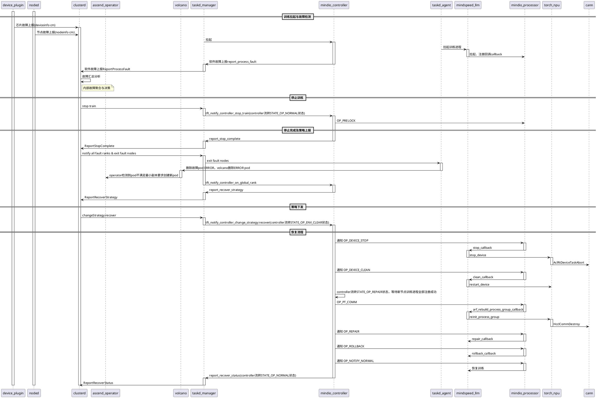

# DP弹性扩缩容流程

本文档描述了DP（Data Parallelism）弹性缩容的完整流程，包括训练拉起、故障检测、策略决策和恢复训练等阶段。

## 流程图

## 流程说明

### 1. 训练拉起与故障检测阶段
- **device_plugin**：负责芯片故障上报
- **noded**：负责节点故障上报
- **clusterd**：接收并汇总所有故障信息，进行内部故障聚合与决策
- **taskd_manager**：协调训练进程的拉起
- **mindio_controller**：管理训练进程，注册故障回调

### 2. 停止训练阶段
- **clusterd**：下发停止训练命令
- **mindio_controller**：通知处理器进入prelock状态

### 3. 停止完成及策略上报阶段
- **taskd_agent**：执行故障节点退出
- **volcano**：删除故障Pod
- **ascend_operator**：检测Pod副本数，若没有足够资源则新pod不会被调度

### 4. 策略下发阶段
- **clusterd**：决策恢复策略并下发

### 5. 恢复流程阶段
- **设备停止**：通过`AclRtDeviceTaskAbort`中止设备任务
- **设备清理**：清理设备状态
- **通信重建**：通过`HcclCommDestroy`和`reinit_process_group`重建分布式通信组
- **恢复训练**：执行rollback并恢复正常训练

## 关键组件说明

| 组件 | 职责 |
|------|------|
| **device_plugin** | NPU设备发现与故障上报 |
| **noded** | 节点健康监控与故障上报 |
| **clusterd** | 集群级故障聚合与策略决策 |
| **taskd_manager** | 任务生命周期管理 |
| **mindio_controller** | 训练进程控制器 |
| **mindspeed_llm** | LLM训练框架 |
| **torch_npu** | PyTorch NPU适配层 |
| **cann** | Ascend计算架构 |
