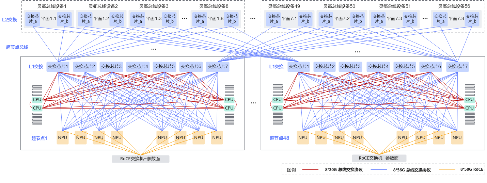

# 前置知识

在使用 ascend-fd-tk 前，建议先了解以下概念。

## 基础概念

| 概念 | 说明                                                                           |
|------|------------------------------------------------------------------------------|
| BMC（Baseboard Management Controller） | 基板管理控制器，用于远程管理服务器硬件。可采集 BMC 日志进行硬件诊断        |
| iBMC | 华为服务器智能基板管理控制器，本工具通过 `ipmcget` 系列命令访问华为 iBMC                                 |
| 交换机 | 网络交换设备，用于集群节点间的网络通信。可采集交换机日志进行网络诊断                                           |
| 主机（Host） | 主机服务器，运行训练或推理任务的计算节点                                                         |
| HCCS | Huawei Cache Coherent System，华为缓存一致性系统互联总线，用于 CPU/NPU 之间的高速互联。工具支持 HCCS 链路诊断 |
| RoCE | RDMA over Converged Ethernet，基于融合以太网的远程直接内存访问技术。RoCE 交换机用于 RoCE 参数平面数据传输     |
| 灵衢 | 华为集群高速交换平面品牌名称，分为 L1（单机内互联）和 L2（跨机柜互联）两层                                     |
| 网络平面 | 集群中不同的网络子网，多网络平面场景下需分批采集                                                     |

## 硬件组网形态

本节介绍链路诊断工具所检测的 AI 超节点智算集群硬件组网架构，帮助用户理解工具的诊断对象与适用场景。

### 组网概述

AI 超节点智算集群由**智算服务器**与**专用高速总线交换设备**两部分组成完整硬件组网架构，服务器与交换设备通过专属总线协议完成高速互联，支撑大模型训练等高算力业务。集群内部链路、硬件设备状态均为本故障诊断工具的检测对象。

### 典型示例

以 Atlas 800T A3 384 超节点作为典型示例说明组网构成，384 超节点组网方案示意图如下：

整套算力集群包含物理隔离的 RoCE 参数平面与灵衢交换平面：

| 网络平面 | 架构 | 承载流量 | 交换设备 |
|----------|------|----------|----------|
| 灵衢交换平面 | L1 + L2 两层 | 卡间内存访问类流量 | 灵衢 L1 / L2 交换机 |
| RoCE 参数平面 | 叶脊以太网 | 参数同步、数据读写、跨集群训练等业务流量 | RoCE 交换机 |

- **灵衢 L1**：实现单机内多 NPU 高速互通。
- **灵衢 L2**：完成跨机柜算力节点互联。
- 两套平面硬件链路完全独立，诊断时分别检测。

> 设备详细结构、外观、组网拓扑等完整参数可查阅[官方文档](https://support.huawei.com/enterprise/zh/doc/EDOC1100461253/7d26a40d?idPath=23710424|251366513|22892968|252309113|261716443)。
