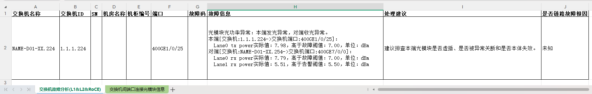
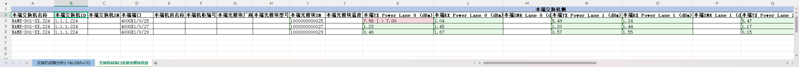

# 快速入门

本文将指导您完成 ascend-fd-tk 首次诊断操作，基于离线交换机日志演示链路故障诊断功能。详细操作步骤请参考[特性介绍&使用](../05_usage/01_usage_overview.md)。

## 前置条件

- 已安装 Linux 或 Windows 操作系统
- 已安装 Python 3.8 及以上版本
- 已安装 pip3

## 步骤 1：安装工具

1. 从开源社区获取对应版本的链路故障诊断安装包 `Ascend-mindxdl-faultdiag_{version}_linux-{arch}.zip`，[下载链接](https://gitcode.com/Ascend/mind-cluster/releases)。
    > - `{version}` 为软件包版本号。
    > - `{arch}` 为软件包架构，分为 x86_64 和 aarch64。
    > - 获取压缩包内的 ascend-fd-tk WHL 安装包：`ascend_faultdiag_toolkit-{version}-py3-none-any.whl`，不区分架构。

2. 解压并安装：

    ```bash
    unzip Ascend-mindxdl-faultdiag_{version}_linux-{arch}.zip
    pip3 install ascend_faultdiag_toolkit-{version}-py3-none-any.whl
    ```

3. 验证安装是否成功：

    ```bash
    ascend-fd-tk about
    ```

    **成功输出示例**：

    ```text
    MindCluster ascend-faultdiag-toolkit诊断工具版本：{version}
    ```

## 步骤 2：清理缓存

首次使用或重新诊断前，建议清理缓存以避免上次诊断结果影响本次诊断：

```bash
ascend-fd-tk clear_cache
```

**成功输出示例**：

```text
清理完成
```

## 步骤 3：配置数据源（离线模式）并一键诊断

以交换机离线日志为例，将[示例日志](../../../resource/switch_logs)放到服务器目录（如 temp 目录）。工具支持自动解压压缩包，无需提前解压。

执行一键式诊断命令，工具将自动完成日志清洗与故障诊断：

```bash
ascend-fd-tk set_switch_dump_log /temp/switch_logs auto_collect_diag
```

**成功输出示例**：

```text
设置成功
...
诊断完成
```

## 步骤 4：查看报告

诊断完成后，报告自动生成至以下目录：

| 操作系统 | 报告路径 |
|----------|----------|
| Linux | `~/.ascend-faultdiag-toolkit/report/diag_report_{YYYYMMDD_HHMMSS}.xlsx` |
| Windows | `{当前工作目录}/.ascend-faultdiag-toolkit/report/diag_report_{YYYYMMDD_HHMMSS}.xlsx` |

> 报告字段含义与解读方法详见[诊断 / 巡检报告说明](../05_usage/06_fault_analysis_report.md)。

诊断报告示例展示：

图1 交换机故障分析报告示例



图2 交换机间端口连接光模块信息报告示例


