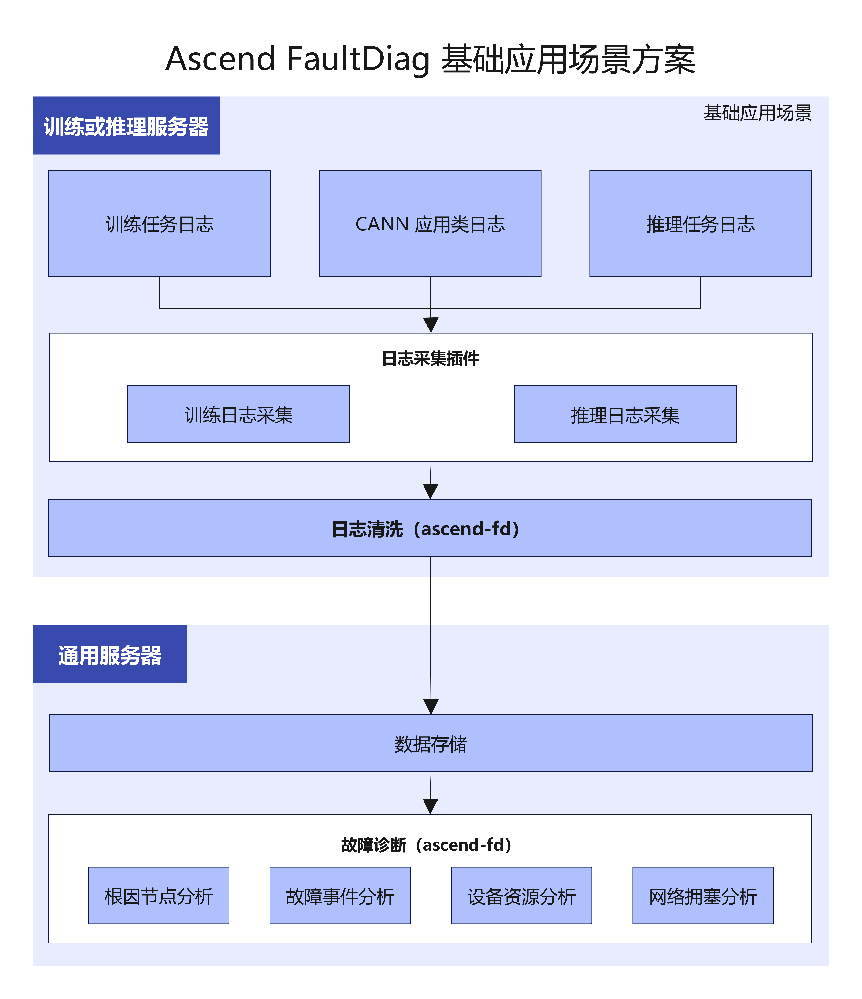

# 概述

## 产品介绍

**MindCluster Ascend FaultDiag**（以下简称 ascend-fd）是一款面向昇腾（Ascend）AI 集群的日志诊断工具，提供日志清洗、故障诊断两大核心功能。当训练或推理任务发生异常退出或性能劣化时，ascend-fd 可自动提取集群日志中的关键信息，分析故障根因节点和故障事件，帮助用户快速定位问题。

## 核心能力

<!-- markdownlint-disable MD033 -->
<table>
  <thead>
    <tr>
      <th>能力</th>
      <th>说明</th>
    </tr>
  </thead>
  <tbody>
    <tr>
      <td>日志清洗</td>
      <td>对原始日志和监测指标信息进行清洗，过滤并提取有效信息，为诊断任务提供数据支持</td>
    </tr>
    <tr>
      <td>故障诊断</td>
      <td>
        基于清洗后的数据，分析故障根因节点和故障事件，输出诊断报告。支持以下诊断类型：
        <ul>
          <li><strong>根因节点分析</strong>：根据集群通信 HCCL 报错信息，定位引发错误的根因服务器节点</li>
          <li><strong>故障事件分析</strong>：根据故障知识图谱包含的故障模式，分析节点所在设备的问题</li>
          <li><strong>设备资源分析</strong>：分析设备的资源状态，定位计算降频与 CPU 资源抢占问题</li>
          <li><strong>网络拥塞分析</strong>：分析节点间的网络状态，定位集群场景下的网络拥塞问题</li>
        </ul>
      </td>
    </tr>
  </tbody>
</table>
<!-- markdownlint-enable MD033 -->

## 集成方案

| 场景名称                      | 用户                                               | 任务类型           | 特点                                                                                                                |
|-------------------------------|----------------------------------------------------|--------------------|---------------------------------------------------------------------------------------------------------------------|
| [全量应用场景](#全量应用场景) | 企业、政府、事业单位等（具有 AI 集群运维平台能力） | 训练任务、推理任务 | 依赖于训练或推理、CANN 和主机侧资源以及硬件相关数据，采集内容较复杂，适用于 AI 集群运维平台用户进行复杂的任务诊断。 |
| [基础应用场景](#基础应用场景) | 个人                                               | 训练任务、推理任务 | 可以仅依赖训练或推理日志与 CANN 应用类日志，采集内容和方法简单，适用于个人用户进行基础任务诊断。                    |

### 全量应用场景

全量应用场景分训练和推理：

**训练场景下**需依赖于训练日志、主机资源日志、NPU 日志以及硬件日志等多类日志、指标数据信息。

**推理场景下**需依赖于推理任务日志、CANN 应用类日志、Device 侧日志、MindIE 组件日志。

任务结束后需采集上述所有日志与指标数据。

用户需在每台设备安装 ascend-fd 组件，使用清洗功能进行过滤、提取有效信息，将结果转储至 AI 运维平台进行根因诊断。

方案如下：

**图 1** 全量应用场景方案

### 基础应用场景

基础应用场景可以仅依赖训练或推理日志及 CANN 应用类日志。

用户在所有训练或推理设备安装 ascend-fd 组件，任务结束后收集训练或推理日志和 CANN 应用类日志，经清洗提取有效信息，转储至通用设备，再诊断故障根因。

方案如下：

**图 2** 基础应用场景方案

<!-- markdownlint-disable-next-line MD033 -->

## 使用流程

使用 ascend-fd 的典型流程如下：

1. **日志采集**：从各台训练/推理设备上收集日志文件
2. **日志清洗**：对日志进行清洗，提取有效信息
3. **清洗结果转储**：将各节点的清洗结果汇总到同一台设备上
4. **故障诊断**：分析故障根因

## 免责声明

- 本文档可能包含第三方信息、产品、服务、软件、组件、数据或内容（统称“第三方内容”）。华为不控制且不对第三方内容承担任何责任，包括但不限于准确性、兼容性、可靠性、可用性、合法性、适当性、性能、不侵权、更新状态等，除非本文档另有明确说明。在本文档中提及或引用任何第三方内容不代表华为对第三方内容的认可或保证。
- 用户若需要第三方许可，须通过合法途径获取第三方许可，除非本文档另有明确说明。
