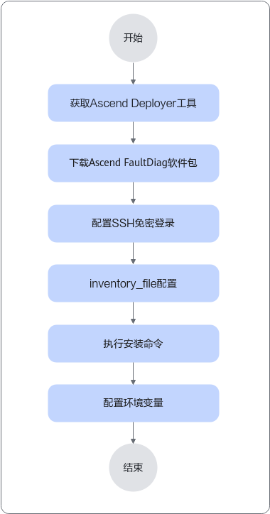

# 安装部署

## 安装前必读

- 请将 ascend-fd 独立部署在各服务器上使用。如果部署在共享目录中供多台服务器共用，可能导致功能异常或性能问题。
- 建议使用同一用户进行安装和使用。
- ascend-fd 要求 Python 版本 >= 3.7，如需使用性能劣化功能，要求 Python 版本 >= 3.8。安装前请检查 Python 版本是否满足要求。
- 安装前请检查磁盘剩余空间是否足够（建议 5GB 以上空间）。
- 安装前请检查网络连接是否正常。

> [!NOTE]
>
> - 本文档中提及的软件版本均为最低支持版本，建议选择符合组织安全要求的版本。
> - 建议及时更新安全补丁或升级至最新版本。
> - 安装过程声明了相关三方库依赖，并验证了最低兼容版本。

## 安装方式

ascend-fd 支持通过 whl 包安装，源码安装和使用 MindCluster Ascend Deployer 安装，推荐使用 whl 包安装。

### whl 包安装（推荐）

#### 获取软件包

1. 从开源社区获取软件包

    | 软件包                                                | 子文件                                                          | 说明                   | 链接                                                         |
    |-------------------------------------------------------|-----------------------------------------------------------------|------------------------|--------------------------------------------------------------|
    | `Ascend-mindxdl-faultdiag_{version}_linux-{arch}.zip` | `ascend_faultdiag-{version}-py3-none-linux_{arch}.whl`          | 日志故障诊断组件安装包 | [下载链接](https://gitcode.com/Ascend/mind-cluster/releases) |
    | `MindCluster_sha256sum.zip`                           | `Ascend-mindxdl-faultdiag_{version}_linux-{arch}.zip.sha256sum` | 软件包校验文件         | [下载链接](https://gitcode.com/Ascend/mind-cluster/releases) |

    > [!NOTE]
    >
    > - `{version}` 为软件包版本号，默认为最新版本。
    > - `{arch}` 为软件包架构，分为 x86_64 和 aarch64，请根据实际需要修改，可通过 `arch` 命令查看。

2. 软件包 SUM 值校验

    将上一步得到的两个软件包放到同一目录下。

    为防止软件包在传递过程中或存储期间被恶意篡改，建议校验软件包的 SUM 值，执行命令如下：

    ```shell
    unzip MindCluster_sha256sum.zip
    sha256sum -c Ascend-mindxdl-faultdiag_{version}_linux-{arch}.zip.sha256sum
    ```

    回显结果如下所示，即代表软件包校验通过。

    ```shell
    Ascend-mindxdl-faultdiag_{version}_linux-{arch}.zip: OK
    ```

#### 操作步骤

1. 建议修改 umask 为 027 提高安全性：

    ```shell
    umask 027
    ```

    > 永久修改 umask 为 027，可以查询[参考 -> 系统安全配置](../07_references/03_security.md#系统安全配置)。

2. 将获取到的软件包上传到服务器的任意目录（如 `~/software`）

3. 解压软件包：

    ```shell
    unzip Ascend-mindxdl-faultdiag_{version}_linux-{arch}.zip
    ```

4. 执行安装：

    ```shell
    pip3 install ascend_faultdiag-{version}-py3-none-linux_{arch}.whl
    ```

    > 如果需要设备资源分析与网络拥塞分析功能，需要安装三方库：`pip3 install scikit-learn>=1.3.0 pandas>=2.0.3`

5. 建议修改目录权限提升安全性：

    ```shell
    chmod 700 ~/.ascend_faultdiag
    chmod 600 ~/.ascend_faultdiag/*.log
    ```

6. 验证安装：

    ```shell
    ascend-fd version
    ```

    回显版本号表示安装成功，如:

    ```shell
    ascend-fd v26.1.0
    ```

#### 日志说明

- 运行日志默认目录：`$HOME/.ascend_faultdiag/RUN_LOG/`
- 操作日志默认目录：`$HOME/.ascend_faultdiag/ascend_faultdiag_operation.log`
- 日志文件大小不超过 10MB，超过后自动转储
- 如需自定义日志路径，可设置环境变量 `ASCEND_FD_HOME_PATH`，请参考 [环境变量](../07_references/01_common_operations.md)。

### 源码安装

#### 操作步骤

1. 克隆仓库

    ```shell
    git clone https://gitcode.com/Ascend/mind-cluster
    // 切换到 ascend-faultdiag 目录
    cd mind-cluster/component/ascend-faultdiag
    ```

2. 编译所需三方依赖库

    使用 pip 安装编译所需三方依赖库：

    ```shell
    pip3 install -r src/requirements.txt && pip3 install setuptools>=60.3.0 wheel>=0.45.1
    ```

3. 执行 build 脚本

    编译脚本会自动创建 `src/ascend_fd/Version.info` 版本信息文件。

    如需修改，请手动在 `src/ascend_fd/Version.info`（没有则创建）中修改, 如：`26.1.0`。

    ```shell
    bash build/build.sh
    ```

    执行 build 脚本后，会在 `output/` 目录下生成 `ascend_faultdiag-{version}-py3-none-linux_{arch}.whl` 文件。

4. 安装 ascend-fd

    ```shell
    pip3 install output/ascend_faultdiag-{version}-py3-none-linux_{arch}.whl
    ```

    可以参考[whl 包安装](#whl-包安装推荐)进行安全加固。

### 使用 MindCluster Ascend Deployer 安装

MindCluster Ascend Deployer 支持 5.0.0.2 及以上版本的 ascend-fd 组件安装。

**图 1**  使用 MindCluster Ascend Deployer 批量安装 MindCluster Ascend FaultDiag 组件



#### 单机安装

单台设备安装 MindCluster Ascend FaultDiag 组件，请参见《MindCluster Ascend Deployer 用户指南》中的“[安装昇腾软件](https://gitcode.com/Ascend/ascend-deployer/blob/dev/docs/zh/05_installation_and_upgrade/02_install_softwares.md)”章节。

#### 批量安装

批量安装 MindCluster Ascend FaultDiag 组件，请参见《MindCluster Ascend Deployer 用户指南》中的“[安装昇腾软件](https://gitcode.com/Ascend/ascend-deployer/blob/dev/docs/zh/05_installation_and_upgrade/02_install_softwares.md)”章节。
