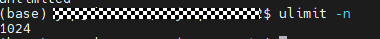
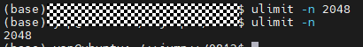

# FAQ

## 诊断失败，日志提示\[Errno 24\] Too many open files

**问题描述**

在使用诊断功能时，若集群规格较大，输入目录下日志文件数较多。可能会导致诊断失败，日志报“Too many open files.”。

**解决方案**

1.  执行**ulimit -n**命令，查看允许同时打开的最大文件描述符数量。

    

2.  执行**ulimit -n** <i>num</i>命令，调整文件描述符上限，如ulimit -n 2048。

    

