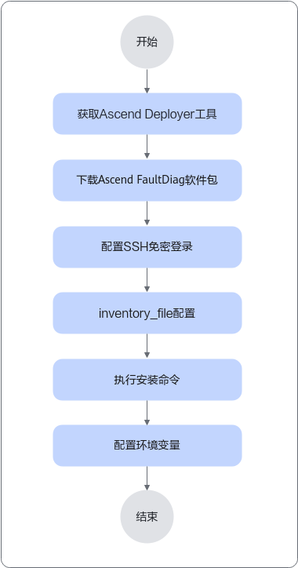

# 安装与升级<a name="ZH-CN_TOPIC_0000001541469718"></a>

## 安装组件<a name="ZH-CN_TOPIC_0000001968731908"></a>

### 安装前必读<a name="ZH-CN_TOPIC_0000002054156561"></a>

-   请保证MindCluster Ascend FaultDiag工具独立部署在各服务器产品中使用，若部署在共享目录中供多台服务器共同访问使用，可能会导致功能执行失败或性能不符合预期等不可预测情况。
-   建议使用同一用户进行安装和使用MindCluster Ascend FaultDiag。
-   MindCluster Ascend FaultDiag支持的Python版本需≥3.7。在安装MindCluster Ascend FaultDiag前，请检查依赖的Python版本是否满足要求。

    >[!NOTE] 说明 
    >-   本文档中提及的所有软件和服务均为最低支持版本，非推荐使用版本，请用户选择符合所在组织安全要求的Python、操作系统、服务、软件和相关三方依赖库及其版本。
    >-   建议用户及时合入安全补丁或升级至最新版本。
    >-   安装过程声明了相关的三方库依赖，并验证了最低兼容版本，后续使用如果三方库升级导致不兼容可单独降级安装指定版本三方包。


### 获取软件包<a name="ZH-CN_TOPIC_0000001592508717"></a>

**下载软件包<a name="zh-cn_topic_0000001511594161_section4499122813189"></a>**

请参考本章获取所需软件包和对应的数字签名文件，下载本软件即表示您同意[华为企业业务最终用户许可协议（EULA）](https://e.huawei.com/cn/about/eula)的条款和条件。

**表 1**  软件下载

<a name="table24961081552"></a>
<table><thead align="left"><tr id="row449616819513"><th class="cellrowborder" valign="top" width="22.32%" id="mcps1.2.5.1.1"><p id="p1049658459"><a name="p1049658459"></a><a name="p1049658459"></a>软件包</p>
</th>
<th class="cellrowborder" valign="top" width="47.8%" id="mcps1.2.5.1.2"><p id="p4496118351"><a name="p4496118351"></a><a name="p4496118351"></a>子文件列表</p>
</th>
<th class="cellrowborder" valign="top" width="21.77%" id="mcps1.2.5.1.3"><p id="p1349608354"><a name="p1349608354"></a><a name="p1349608354"></a>说明</p>
</th>
<th class="cellrowborder" valign="top" width="8.110000000000001%" id="mcps1.2.5.1.4"><p id="p12496085515"><a name="p12496085515"></a><a name="p12496085515"></a>获取地址</p>
</th>
</tr>
</thead>
<tbody><tr id="row19497118450"><td class="cellrowborder" rowspan="3" valign="top" width="22.32%" headers="mcps1.2.5.1.1 "><p id="p19497688516"><a name="p19497688516"></a><a name="p19497688516"></a>Ascend-mindxdl-faultdiag_<em id="i194971681054"><a name="i194971681054"></a><a name="i194971681054"></a>{version}</em>_linux-<em id="i132516204280"><a name="i132516204280"></a><a name="i132516204280"></a>{arch}</em>.zip</p>
</td>
<td class="cellrowborder" valign="top" width="47.8%" headers="mcps1.2.5.1.2 "><p id="p2417175492214"><a name="p2417175492214"></a><a name="p2417175492214"></a>ascend_faultdiag-<em id="i24971581355"><a name="i24971581355"></a><a name="i24971581355"></a>{version}</em>-py3-none-linux_<em id="i11344642192415"><a name="i11344642192415"></a><a name="i11344642192415"></a>{</em><em id="i9272113613244"><a name="i9272113613244"></a><a name="i9272113613244"></a>arch</em><em id="i12344184215241"><a name="i12344184215241"></a><a name="i12344184215241"></a>}</em>.whl</p>
</td>
<td class="cellrowborder" valign="top" width="21.77%" headers="mcps1.2.5.1.3 "><p id="p9497981514"><a name="p9497981514"></a><a name="p9497981514"></a>智能故障诊断组件安装包。</p>
<p id="p203401758145516"><a name="p203401758145516"></a><a name="p203401758145516"></a>适用于<span id="ph42741425610"><a name="ph42741425610"></a><a name="ph42741425610"></a>Python</span>3.7及以上版本。</p>
</td>
<td class="cellrowborder" rowspan="3" valign="top" width="8.110000000000001%" headers="mcps1.2.5.1.4 "><p id="p11497481255"><a name="p11497481255"></a><a name="p11497481255"></a><a href="https://www.hiascend.com/zh/developer/download/community/result?module=dl+cann" target="_blank" rel="noopener noreferrer">获取链接</a></p>
</td>
</tr>
<tr id="row84971381059"><td class="cellrowborder" valign="top" headers="mcps1.2.5.1.1 "><p id="p204971087511"><a name="p204971087511"></a><a name="p204971087511"></a>ascend_faultdiag-<em id="i114971580510"><a name="i114971580510"></a><a name="i114971580510"></a>{version}</em>-py3-none-linux_<em id="i04108535249"><a name="i04108535249"></a><a name="i04108535249"></a>{</em><em id="i13410185372418"><a name="i13410185372418"></a><a name="i13410185372418"></a>arch</em><em id="i24101353102415"><a name="i24101353102415"></a><a name="i24101353102415"></a>}</em>.whl.cms</p>
</td>
<td class="cellrowborder" valign="top" headers="mcps1.2.5.1.2 "><p id="p13425727595"><a name="p13425727595"></a><a name="p13425727595"></a>CMS证书校验文件。</p>
</td>
</tr>
<tr id="row13497081357"><td class="cellrowborder" valign="top" headers="mcps1.2.5.1.1 "><p id="p449720811520"><a name="p449720811520"></a><a name="p449720811520"></a>crldata.crl</p>
</td>
<td class="cellrowborder" valign="top" headers="mcps1.2.5.1.2 "><p id="p94971986516"><a name="p94971986516"></a><a name="p94971986516"></a>CRL证书吊销列表文件。</p>
</td>
</tr>
</tbody>
</table>

>[!NOTE] 说明 
> _\{version\}_为软件包的版本号，请用户根据实际情况需要获取对应的软件包。

**软件数字签名验证<a name="zh-cn_topic_0000001511594161_section199643813528"></a>**

为了防止软件包在传递过程中或存储期间被恶意篡改，下载软件包时需下载对应的数字签名文件用于完整性验证。

在软件包下载之后，请参考《OpenPGP签名验证指南》，对从Support网站下载的软件包进行PGP数字签名校验。如果校验失败，请不要使用该软件包，先联系华为技术支持工程师解决。

使用软件包安装/升级之前，也需要按上述过程先验证软件包的数字签名，确保软件包未被篡改。

运营商客户请访问：[https://support.huawei.com/carrier/digitalSignatureAction](https://support.huawei.com/carrier/digitalSignatureAction)

企业客户请访问：[https://support.huawei.com/enterprise/zh/tool/pgp-verify-TL1000000054](https://support.huawei.com/enterprise/zh/tool/pgp-verify-TL1000000054)


### 命令行方式安装<a name="ZH-CN_TOPIC_0000001541629190"></a>

本章节仅指导用户通过命令行方式安装故障诊断组件。5.0.0.2及以上版本的故障诊断组件可通过工具进行安装，详细安装说明请参考[使用MindCluster Ascend Deployer安装](#使用mindcluster-ascend-deployer安装)。

**前提条件<a name="section1944341425710"></a>**

-   安装前请确保网络可用。
-   install日志不会转储，安装前请注意磁盘空间剩余容量。

**操作步骤<a name="section552311587439"></a>**

1.  修改umask为027，详细操作步骤可参考[设置umask](./security_hardening.md#设置umask)。
2.  将[获取软件包](#获取软件包)获取到的软件包上传到环境的任意目录下（如“\~/software”）。
3.  在软件包所在目录执行如下命令解压。

    ```
    unzip Ascend-mindxdl-faultdiag_{version}_linux-{arch}.zip
    ```

4.  执行如下命令进行安装。

    ```
    pip3 install ascend_faultdiag-{version}-py3-none-linux_{arch}.whl --log ~/.ascend_faultdiag/install.log          
    ```

5.  修改目录权限。

    ```
    chmod 700 ~/.ascend_faultdiag
    chmod 600 ~/.ascend_faultdiag/*.log
    ```

6.  执行以下命令验证软件是否安装成功。

    ```
    ascend-fd version
    ```

    回显示例如下：

    ```
    ascend-fd ${版本号}
    ```

>[!NOTE] 说明 
>-   MindCluster Ascend FaultDiag的运行日志文件默认路径为“$\(HOME\)/.ascend\_faultdiag/RUN\_LOG/“目录下。每次执行ascend-fd parse或diag命令，会生成一个时间戳+随机数的文件夹，文件夹内部按PID分别落盘运行日志。RUN\_LOG目录下的文件夹数量若超过100个，将会按照时间先后删除20个文件夹；如果文件夹数量未超过100个，但是文件总内存大小超过100M，也会按时间先后删除旧日志并保留最大80M的文件。
>-   MindCluster Ascend FaultDiag的操作日志文件默认路径为“$\{HOME\}/.ascend\_faultdiag/ascend\_faultdiag\_operation.log“。
>-   日志文件大小不超过10M，超过限制大小后将自动转储另一个日志文件，同PID日志文件数量不超过10个，超过限制个数时将自动覆盖最早创建的日志。
>-   如果需要自定义日志文件路径，可以参考[自定义MindCluster Ascend FaultDiag家目录](./common_operations.md#自定义mindcluster-ascend-faultdiag家目录)章节进行操作。
>-   MindCluster Ascend FaultDiag的设备资源分析与网络拥塞分析模块依赖于scikit-learn、pandas、numpy与joblib三方库。若需使用这部分功能，请保证按照以下版本要求安装相应依赖库：scikit-learn\>=1.3.0、pandas\>=1.3.5、numpy\>=1.21.6、1.5.0\>joblib\>=1.2.0。


### 使用MindCluster Ascend Deployer安装<a name="ZH-CN_TOPIC_0000001987237125"></a>

MindCluster Ascend Deployer支持5.0.0.2及以上版本的MindCluster Ascend FaultDiag组件安装。5.0.0.2以下版本的MindCluster Ascend FaultDiag组件请参考[命令行方式安装](#命令行方式安装)进行安装。

**单机安装MindCluster Ascend FaultDiag<a name="section16724191613286"></a>**

单台设备安装MindCluster Ascend FaultDiag组件，请参见《MindCluster Ascend Deployer 用户指南》中的“安装昇腾软件”章节。

安装命令如下：

```
bash install.sh --install=fault-diag                                            //安装故障诊断组件
```

**批量安装MindCluster Ascend FaultDiag<a name="section207590522915"></a>**

批量安装MindCluster Ascend FaultDiag组件，请参见《MindCluster Ascend Deployer 用户指南》中的“安装昇腾软件”章节。

详细安装流程如[图1](#fig56301358747)所示：

**图 1**  使用MindCluster Ascend Deployer批量安装MindCluster Ascend FaultDiag组件<a name="fig56301358747"></a>  



## 升级组件<a name="ZH-CN_TOPIC_0000001592268721"></a>

**升级步骤<a name="section232278155416"></a>**

1.  根据[获取软件包](#获取软件包)，准备新的软件包。
2.  升级前请先卸载当前版本MindCluster Ascend FaultDiag，卸载步骤参考[卸载组件](#卸载组件)。
3.  参考[命令行方式安装](#命令行方式安装)，完成软件包的安装。
4.  执行以下命令验证软件是否升级安装成功。

    ```
    ascend-fd version
    ```

    回显示例如下：

    ```
    ascend-fd ${版本号}
    ```


## 卸载组件<a name="ZH-CN_TOPIC_0000001592628957"></a>

使用命令行方式安装后进行工具的卸载，以组件安装的用户执行以下命令。

```
pip3 uninstall ascend-faultdiag -y --log ~/.ascend_faultdiag/uninstall.log
```

使用MindCluster Ascend Deployer方式安装后进行工具的卸载，以组件的安装用户执行删除二进制文件命令。

```
rm /usr/local/bin/ascend-fd
```

>[!NOTE] 说明 
>“\~/.ascend\_faultdiag”目录保存了日志等信息，不会随着卸载自动删除，请手动删除。


