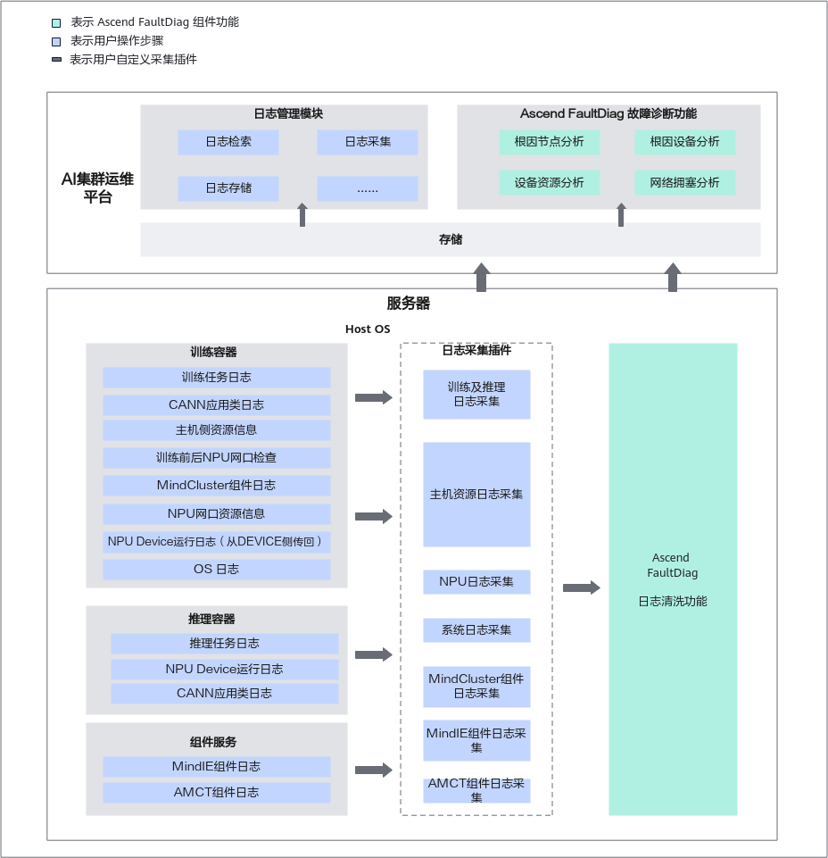
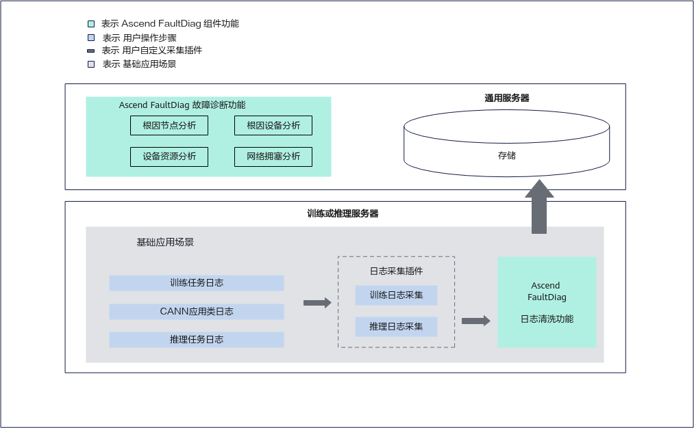

# 简介

## 前言

**免责声明**

- 本文档可能包含第三方信息、产品、服务、软件、组件、数据或内容（统称“第三方内容”）。华为不控制且不对第三方内容承担任何责任，包括但不限于准确性、兼容性、可靠性、可用性、合法性、适当性、性能、不侵权、更新状态等，除非本文档另有明确说明。在本文档中提及或引用任何第三方内容不代表华为对第三方内容的认可或保证。
- 本特性会读取并处理输入目录下用户采集的相关原日志及监测指标文件，请用户确保相关文件内无敏感信息和个人数据。华为不控制且不对输入数据内容承担任何责任。

- 用户若需要第三方许可，须通过合法途径获取第三方许可，除非本文档另有明确说明。

**读者对象**

本文档主要适用于以下人员：

- 华为技术支持工程师
- 渠道伙伴技术支持工程师
- 企业管理员
- 企业终端用户

## 概述

MindCluster Ascend FaultDiag（故障诊断工具）主要功能如下：提供日志清洗和故障诊断功能，提取训练及推理过程相关日志的关键信息，并根据集群所有节点清洗后的关键信息，分析故障根因节点以及故障事件。

**关键功能特性**

故障诊断工具主要提供以下2大功能：

**日志清洗**

当训练及推理任务失败后，由MindCluster Ascend FaultDiag对原日志和监测指标信息进行一系列清洗工作，清洗结果随原始信息一并转储到同一路径，为诊断任务提供数据支持。

目前支持清洗的内容主要包括：用户训练及推理日志、CANN应用类日志、主机侧资源信息、NPU网口资源信息等原始训练、推理日志及监测指标清洗。

**故障诊断**

MindCluster Ascend FaultDiag针对下表中的2类问题提供诊断功能：支持根因节点分析、故障事件分析、设备资源分析、网络拥塞分析。

|故障分类|诊断内容|
|--|--|
|训练及推理任务异常退出问题|<ul><li>根因节点分析用于分析故障根因节点：根据集群通信HCCL报错信息，定位引发错误的根因节点。</li><li>故障事件分析用于分析故障根因节点所在设备的根因错误：根据故障知识图谱包含的故障模式，分析节点所在设备的问题。</li></ul>|
|训练及推理过程中性能劣化问题|<ul><li>设备资源分析用于分析设备的资源状态：通过分析用户采集的设备相关指标文件，定位计算降频与CPU资源抢占等问题。</li><li>网络拥塞分析用于分析节点间的网络状态：通常用于定位Spine+Leaf双层组网场景下的网络问题，通过分析用户采集的NPU网口统计监测指标文件，分析是否发生节点链路网络拥塞异常问题。</li></ul>|

>[!NOTE]
>仅当训练及推理任务未异常退出的情况下，才会对性能劣化问题进行诊断。

**使用流程**

MindCluster Ascend FaultDiag的使用流程如下表所示。

|步骤|描述|操作参考|
|--|--|--|
|日志采集|
当发现训练或推理任务失败或异常后，用户需收集每台训练或推理设备的日志，并按预设结构进行存储。

采集的日志请参见[应用场景及方案](#应用场景及方案)中“训练及推理任务日志与指标信息参考表”。
|请参见[日志采集](./user_guide/03_collecting_logs.md)章节。|
|日志清洗|日志收集完成后，用户需在每台训练或推理设备上使用MindCluster Ascend FaultDiag工具的清洗功能对收集的原始日志及指标数据进行清洗，过滤并提取有效信息。|请参见[日志清洗与转储](./user_guide/06_cleaning_and_dumping_logs.md)章节。|
|清洗结果转储|日志清洗完成后，用户需将每台训练或推理设备的清洗结果转储汇总到同一台训练设备或通用设备，并按预设结构进行存储。|请参见[日志清洗与转储](./user_guide/06_cleaning_and_dumping_logs.md)章节。|
|故障诊断|基于转储汇总的清洗结果，用户使用MindCluster Ascend FaultDiag工具的诊断功能分析训练或推理任务失败或异常的故障根因。|请参见[故障诊断](./user_guide/07_diagnosing_faults.md)章节。|

>[!NOTE]
>在以上使用流程中，日志采集和清洗结果转储非MindCluster Ascend FaultDiag提供的功能。本文档仅提供其操作指导。

## 应用场景及方案

智能故障诊断特性可用于解决集群训练及推理任务中故障定位定界困难的问题。由于集群日志量大、AI全栈日志分析复杂，同时也可能涉及计算、网络、存储的跨域问题分析，用户在集群训练及推理业务中遇到的问题通常定位难度大、耗时长、需要拉通的领域多。

智能故障诊断特性可以有效提高训练及推理作业问题定位能力，提升用户使用意愿和促进产品生态拓展。

具体而言，本特性针对训练及推理集群的各个设备提供日志清洗和故障诊断功能，用户需要完成日志采集、清洗并将清洗后的信息文件转储至特定路径进行诊断，通过分析诊断结果实现问题的快速定界。同时，支持用户自定义故障实体或对CANN应用类日志中的ERROR报错信息进行屏蔽。

根据实际业务的不同，当前主要分为以下2种场景。

|场景名称|用户|任务类型|特点|
|--|--|--|--|
|[全量应用场景](#section1511514596338)|企业、政府、事业单位等（具有AI集群运维平台能力）|训练任务、推理任务|依赖于训练及推理、CANN和主机侧资源以及硬件相关数据，采集内容较复杂，适用于AI集群运维平台用户进行复杂的任务诊断。|
|[基础应用场景](#section587911381388)|个人|训练任务、推理任务|仅依赖训练或推理日志与CANN日志，采集内容和方法简单，适用于个人用户进行基础任务诊断。|

**全量应用场景**

全量应用场景在**训练业务场景下**需依赖于训练日志、主机资源日志、NPU日志以及硬件日志等多类日志、指标数据信息。

**推理场景下**需依赖于“推理任务日志”、“CANN应用类日志”、“Device侧日志”、“MindIE组件日志”。

其中部分指标数据需通过额外操作采集获取，因此，全量应用场景推荐具有AI集群运维平台能力的用户对接使用。

全量应用场景方案以下图为例，用户需要在所有训练或推理设备中安装MindCluster Ascend FaultDiag组件，当训练或推理任务结束后，每台设备需要收集上述所有日志及指标数据信息，然后使用MindCluster Ascend FaultDiag的清洗功能进行过滤、提取有效信息，最后将所有设备的原始日志及指标信息和清洗结果转储到AI集群运维平台，平台使用MindCluster Ascend FaultDiag的诊断功能分析故障根因。同时，支持用户自定义故障实体或对CANN应用类日志中的ERROR报错信息进行屏蔽。

**图 1**  全量应用场景方案  

在全量场景中，待采集日志及指标数据信息对应的数据来源以及数据用途如[表1](#table7211162233417)所示。

**表 1**  训练及推理任务日志与指标信息参考表

|**数据类别**|**日志说明**|数据来源|**数据用途**|
|--|--|--|--|
|训练任务日志|模型训练进程产生的日志|训练任务|用于故障事件分析|
|训练前后NPU网口检查|在执行训练任务前后，使用hccn_tool工具检查每个NPU的网口信息|训练任务|用于故障事件分析|
|主机侧资源信息|NPU状态监测等指标，包括各NPU卡训练主进程使用的CPU占比（%CPU）、使用的物理内存（RES）等信息|训练任务|用于设备资源分析|
|NPU网口资源信息|NPU网口收发报文统计信息等指标|训练任务|用于网络拥塞分析|
|OS日志|Linux系统日志|训练任务|用于故障事件分析|
|MindCluster组件日志|MindCluster的组件Ascend Device Plugin、NodeD、Ascend Docker Runtime、NPU Exporter、Volcano采集的超节点设备日志、AI服务器日志、组件日志。|训练任务|用于故障事件分析|
|推理任务日志|推理任务进程产生的日志|推理任务|用于故障事件分析|
|NPU Device运行日志|Device侧的相关日志和文件，包括slog日志、hisi_logs日志等|训练&推理任务|用于故障事件分析|
|CANN应用类日志|CANN软件产生的运行日志|训练&推理任务|用于根因节点分析与故障事件分析|
|MindIE组件日志|MindIE的组件MindIE Server、MindIE LLM、MindIE SD、MindIE RT、MindIE Torch、MindIE MS、MindIE Benchmark、MindIE Client产生的日志|推理任务|用于故障事件分析|
|AMCT组件日志|AMCT进行模型压缩流程产生的日志|模型压缩|用于AMCT工具故障事件分析|
|MindIE Pod控制台日志|MindIE Pod控制台日志|推理任务|用于根因节点分析|
|MindIO组件日志|MindIO组件产生的日志|训练&推理任务|用于故障事件分析|

>[!NOTE]
>所有日志及指标数据对应的采集方法参见[日志采集](./user_guide/03_collecting_logs.md)章节。

**基础应用场景**

考虑到不同用户的应用需求，支持仅依赖于训练或推理日志及CANN应用类日志进行诊断的基础应用场景。此类日志为训练或推理任务产生，无需额外采集。

基础应用场景方案如下图所示，用户需要在所有训练或推理设备中安装MindCluster Ascend FaultDiag组件。当训练或推理任务结束后，每台设备需要至少收集训练或推理日志和CANN应用类日志，然后使用MindCluster Ascend FaultDiag的清洗功能过滤、提取有效信息，最后将所有设备的原始日志和清洗结果转储到同一通用设备上，用户使用MindCluster Ascend FaultDiag的诊断功能分析故障根因。同时，支持用户自定义故障实体或对CANN应用类日志中的ERROR报错信息进行屏蔽。

**图 2**  基础应用场景方案  

待采集日志及指标数据信息对应的数据来源以及数据用途如下表所示。

所有日志及指标数据对应的采集方法参见[日志采集](./user_guide/03_collecting_logs.md)章节。

**表 2**  训练&推理任务日志与指标信息参考表

|数据类别|日志说明|数据来源|数据用途|
|--|--|--|--|
|训练任务日志|训练任务进程产生的日志|训练任务|用于故障事件分析|
|CANN应用类日志|CANN软件产生的运行日志|训练&推理任务|用于根因节点分析与故障事件分析|
|推理任务日志|推理任务进程产生的日志|推理任务|用于故障事件分析|
