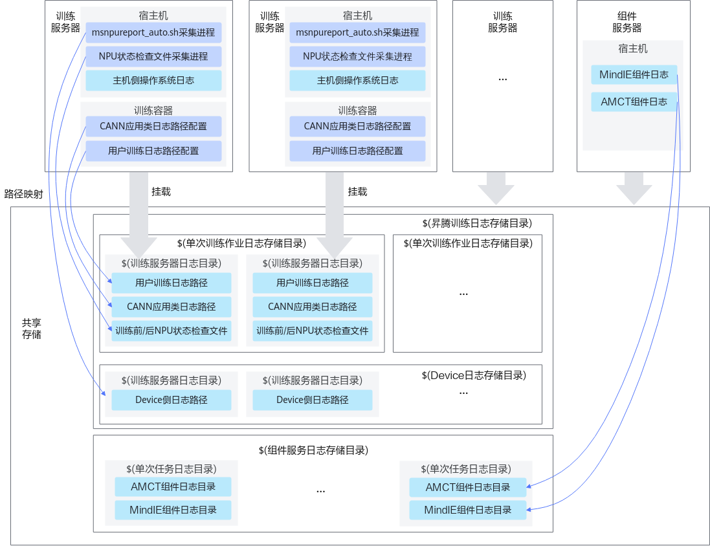
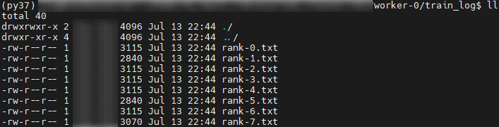

# 使用指导<a name="ZH-CN_TOPIC_0000001574609686"></a>

## 使用说明<a name="ZH-CN_TOPIC_0000001677859701"></a>

**使用建议<a name="section181951321155817"></a>**

-   使用诊断功能时，因Linux系统最大进程数限制（默认为1024），故集群规格建议≤128台服务器（1024卡）。若服务器数量超过此规格时，需使用**ulimit -n**命令调整文件描述符上限。
-   用户在使用MindCluster Ascend FaultDiag工具命令时，尽量不使用管道命令，可能会影响用户IP的获取、影响日志审计。

**支持的场景<a name="section12381154319315"></a>**

-   MindCluster Ascend FaultDiag工具仅支持对整机满卡训练及推理任务提供故障诊断能力，若非满卡训练及推理场景执行诊断可能导致故障根因定位错误或失败。
-   MindCluster Ascend FaultDiag工具当前仅支持IPv4，不支持使用IPv6。

**系统时间说明<a name="section98531395015"></a>**

-   请用户同步各训练及推理服务器的系统时间，系统时间不一致可能会导致分析结果不准确。
-   请用户同步每个训练及推理服务器上Host系统时间与Device的系统时间，系统时间不一致可能会导致分析结果不准确。
-   若使用容器执行训练及推理任务，请用户同步宿主机与训练及推理容器的系统时间，系统时间不一致可能会导致分析结果不准确。

**故障诊断日志版本配套表<a name="section087884485711"></a>**

**表 1**  日志对应软件配套表

|日志文件|对应软件|软件版本|说明|
|--|--|--|--|
|CANN应用类日志|CANN|7.0.RC1及以上|CANN打印的Host侧应用类日志和Device侧应用类日志。更多相关信息请参见《CANN 日志参考》中的“查看日志（Ascend EP标准形态）”章节。|
|PyTorch框架训练及推理日志|PyTorch1.11.0框架适配插件|5.0.RC3及以上|-|
|MindSpore框架训练日志|MindSpore|2.1.0及以上|部分故障类型描述中包含对应的MindSpore版本说明，请以实际故障诊断描述为主。|
|TensorFlow框架训练日志|TensorFlow|-|仅支持用户自定义TensorFlow故障。|
|Host OS日志|-|-|<ul><li>支持检测Host OS日志包括但不限于CentOS 7.6、Debian 10.0、EulerOS 2.10、EulerOS 2.12和CTyunOS 22.06的HOST OS日志。不同操作系统日志打印关键字可能存在差异。</li><li>建议Host OS日志大小在512MB以内。</li></ul>|
|Device侧日志|Ascend HDK|23.0.RC3及以上|-|
|MindCluster组件日志|Ascend Device Plugin、NodeD、Ascend Docker Runtime、NPU Exporter、Volcano|6.0.RC3及以上|-|
|MindIE组件日志|MindIE Server、MindIE LLM、MindIE SD、MindIE RT、MindIE Torch、MindIE MS、MindIE Benchmark、MindIE Client|6.0.0及以上|-|
|AMCT组件日志|AMCT模型压缩组件|7.0.RC1及以上|AMCT集成在CANN包中进行发布。更多相关信息请参见《AMCT模型压缩工具用户指南》。|
|MindIE Pod控制台日志|MindIE Pod控制台日志|-|-|


## 使用流程<a name="ZH-CN_TOPIC_0000001682482325"></a>

本流程以全量应用场景为例，描述整体故障诊断的对应流程，用户可参考[图1](#fig119736111011)中的使用流程和[表1](#table785432425410)中说明完成操作。

**图 1**  使用流程图<a name="fig119736111011"></a>  


**表 1**  操作说明

<a name="table785432425410"></a>
|关键操作|对应章节|说明|
|--|--|--|
|日志采集。根据日志采集目录，采集训练及推理、CANN以及主机和NPU相关日志。|<a href="#日志采集目录结构">日志采集目录结构</a>|集群平台日志采集，请以实际的方式为主，此处仅以目录结构和采集示例为用户提供日志采集流程思路。|
|日志采集。准备“训练及推理前采集NPU环境检查文件”。|<a href="#训练及推理前日志采集">训练及推理前日志采集</a>|集群平台日志采集，请以实际的方式为主，此处仅以目录结构和采集示例为用户提供日志采集流程思路。|
|日志采集。准备训练及推理中采集NPU网口统计指标、NPU状态监测指标、主机侧资源信息、MindIE Pod日志采集。|<a href="#训练及推理中采集">训练及推理中采集</a>|集群平台日志采集，请以实际的方式为主，此处仅以目录结构和采集示例为用户提供日志采集流程思路。|
|日志采集。训练及推理后采集NPU环境检查文件、用户训练及推理日志、CANN应用类日志、主机侧操作系统日志、Device侧日志。|<a href="#训练及推理后采集">训练及推理后采集</a>|集群平台日志采集，请以实际的方式为主，此处仅以目录结构和采集示例为用户提供日志采集流程思路。|
|（可选）支持用户自定义故障实体。|<a href="#可选自定义故障实体">（可选）自定义故障实体</a>|相关组件命令API接口说明请参见<a href="./api/fault_entity_customization.md">自定义故障实体接口</a>。|
|（可选）支持用户对CANN应用类日志的ERROR日志进行屏蔽操作。|<a href="#可选屏蔽故障日志">（可选）屏蔽故障日志</a>|相关组件命令API接口说明请参见<a href="./api/fault_log_masking.md">屏蔽故障日志接口</a>。关于CANN应用类日志的日志类别信息，请参见《CANN 日志参考》。|
|使用组件对采集目录进行清洗，并将完成清洗的各节点日志进行转储。|<a href="#日志清洗与转储">日志清洗与转储</a>|<ul><li>对应章节中，清洗以单节点的日志清洗为例，实际集群需按节点数量进行对应次数清洗。</li><li>相关组件命令API接口说明请参见<a href="./api/log_cleaning.md">日志清洗接口</a>。</li></ul>|
|使用组件对完成清洗转储后的日志目录进行诊断。|<a href="#故障诊断">故障诊断</a>|相关组件命令API接口说明请参见<a href="./api/fault_diagnosis.md">故障诊断接口</a>。|


## 使用示例<a name="ZH-CN_TOPIC_0000001905930376"></a>

本章节为使用示例，仅供参考，请根据训练平台、训练任务异常场景和集群存储等实际情况参考使用。

**场景说明<a name="section20829165411715"></a>**

-   本示例为训练集群挂载**共享存储**场景，请提前确保集群所有节点都挂载共享存储。
-   本示例为**集群训练任务异常退出**场景使用示例，涉及到以下日志信息。
    -   用户训练日志
    -   CANN应用类日志
    -   训练前NPU状态检查文件
    -   训练后NPU状态检查文件
    -   Device侧日志
    -   主机侧操作系统日志
    -   MindCluster组件日志
    -   MindIE组件日志
    -   MindIE Pod控制台日志
    -   AMCT组件日志
    -   BMC日志
    -   LCNE日志

**日志路径映射关系<a name="section1246617719225"></a>**

宿主机和容器中的相关日志路径与共享存储下的日志路径的映射关系如[图1](#fig118691742112210)所示。

**图 1**  日志路径映射图<a name="fig118691742112210"></a>  


**使用流程<a name="section125992312510"></a>**

1.  [日志采集](#section135847272336)。在共享存储上创建日志路径并进行相关配置。
2.  [日志清洗](#section6586172714334)。日志采集后，对日志信息进行清洗。
3.  [故障诊断](#section15416716355)。执行故障诊断命令，获取根因节点和故障事件信息。

**日志采集<a name="section135847272336"></a>**

以下日志目录仅为示例，用户可以根据实际情况自定义存储目录。示例以单台服务器名为worker-0为例，请用户为所有训练服务器创建相应目录。

>[!NOTE] 说明 
>创建日志目录时建议保证目录具有默认的读写权限。训练容器启动时不建议挂载root用户目录为日志存储目录。

1.  在共享存储任意路径下，创建昇腾训练日志存储目录，如“/ascend\_cluster\_log“。

    ```
    mkdir -p /ascend_cluster_log
    ```

2.  在昇腾训练日志存储目录下，创建Device日志存储目录，如“/ascend\_cluster\_log/device\_log/worker-0“。

    ```
    mkdir -p /ascend_cluster_log/device_log/worker-0
    ```

3.  在启动训练任务后，在昇腾训练日志存储目录下，创建单次训练作业日志存储目录，推荐使用训练任务ID作为目录名，如“/ascend\_cluster\_log/job202405181309/worker-0“。

    ```
    mkdir -p /ascend_cluster_log/job202405181309/worker-0
    ```

4.  依次执行以下命令，创建训练日志采集目录。

    ```
    mkdir -p /ascend_cluster_log/job202405181309/worker-0/process_log    # CANN应用类日志路径
    mkdir -p /ascend_cluster_log/job202405181309/worker-0/train_log      # 用户训练日志
    mkdir -p /ascend_cluster_log/job202405181309/worker-0/environment_check    # 训练前或后NPU环境检查文件
    ```

5.  配置日志采集目录。
    1.  执行以下命令，使用msnpureport\_auto\_export.sh文件脚本，周期性导出Device侧日志。如果采取单次导出Device侧日志，可以参考[Device侧日志](#device侧日志)章节进行操作。

        ```
        Driver安装目录/driver/tools/msnpureport_auto_export.sh 采集间隔时间 最大存储目录容量 /Device日志存储目录名
        ```

        如：

        ```
        /usr/local/Ascend/driver/tools/msnpureport_auto_export.sh 300 10 /ascend_cluster_log/device_log/worker-0
        ```

        在以上示例中，采集间隔时间等参数说明如下：

        **表 1**  参数说明

         |参数|说明|
         |--|--|
        |采集间隔时间|导出Device侧日志和文件的间隔时间。取值为大于0的整数，单位是s，如：2s。|
        |最大存储目录容量|导出Device侧日志和文件的存储目录容量。取值为大于等于2的整数，单位是G，如：10G。|
        |Device日志存储目录名|导出Device侧日志和文件的存储路径（任意的绝对路径）。如：“/home/log/”。|

        >[!NOTE] 说明 
        >-   msnpureport\_auto\_export.sh脚本的更多使用指导请参见《Atlas 系列硬件产品 25.3.RC1 msnpureport 工具使用指南》的“[连续导出Device侧系统类日志和其他维测信息](https://support.huawei.com/enterprise/zh/doc/EDOC1100523652/7f3ad48?idPath=23710424|251366513|254884019|261408772|252764743)”章节。
        >-   若设置采集间隔时间较短，频繁导出日志可能会导致系统资源开销较大，推荐参数设置为300（5分钟），可根据实际场景调整。
        >-   训练服务器开机后，只需执行一次msnpureport\_auto\_export.sh脚本。训练服务器重启后，也需要重新执行该采集脚本。

    2.  启动训练任务时，配置CANN应用类日志采集目录。
        -   启动训练容器时，将共享存储的CANN应用类日志目录挂载到容器内任意路径下（如“/ascend\_cluster\_log/job202405181309/worker-0/process\_log“），并配置环境变量。

            ```
            docker run \
                -v /共享存储的CANN应用类日志路径:/容器内CANN应用类日志路径 \
                --env ASCEND_PROCESS_LOG_PATH=/容器内CANN应用类日志路径 \
                \...其他启动项...\    
                ${训练镜像名} /bin/bash
            ```

            如：

            ```
            docker run \
                -v /ascend_cluster_log/job202405181309/worker-0/process_log:/ascend_cluster_log/job202405181309/worker-0/process_log \
                --env ASCEND_PROCESS_LOG_PATH=/ascend_cluster_log/job202405181309/worker-0/process_log \
                \...其他启动项...\    
                ${训练镜像名} /bin/bash
            ```

        -   使用宿主机进行训练时，需要执行以下命令。

            ```
            export ASCEND_PROCESS_LOG_PATH /CANN应用类日志路径
            ```

            如：

            ```
            export ASCEND_PROCESS_LOG_PATH /ascend_cluster_log/job202405181309/worker-0/process_log
            ```

    3.  启动训练任务时，配置用户训练日志采集目录。
        1.  启动训练容器时，将共享存储的用户训练日志采集目录挂载到容器内任意路径下（如“/ascend\_cluster\_log/job202405181309/worker-0/train\_log“）。使用宿主机进行训练时，可跳过本步骤。

            ```
            docker run \
                -v /共享存储用户训练日志采集目录:/容器内的用户训练日志采集目录 \
                \...其他启动项...\    
                ${训练镜像名} /bin/bash
            ```

            如：

            ```
            docker run \
                -v /ascend_cluster_log/job202405181309/worker-0/train_log:/ascend_cluster_log/job202405181309/worker-0/train_log \
                \...其他启动项...\    
                ${训练镜像名} /bin/bash
            ```

        2.  执行以下命令，使用重定向方式，将脚本执行回显内容落盘存储。

            ```
            python train.py > /ascend_cluster_log/job202405181309/worker-0/train_log/rank-0.txt 2>&1
            ```

            >[!NOTE] 说明 
            >-   将每张NPU卡的训练日志文件保存为txt或log文件，6.0.RC3之前的版本需要按照rank-_\(rank\_id\)_.txt的格式要求命名用户训练转储日志文件。
            >-   若使用PyTorch框架，所有NPU卡的训练日志可重定向到同一个文件，如rank-all.txt。

    4.  启动训练任务前，需要参考[训练及推理前NPU环境检查文件](#训练及推理前npu环境检查文件)章节，查询训练前NPU相关信息。在训练结束后，再参考[训练及推理后NPU环境检查文件](#训练及推理后npu环境检查文件)章节，查询训练后NPU相关信息。

        >[!NOTE] 说明 
        >更多关于日志采集的详细信息，可以参见[日志采集](#日志采集)章节。


**日志清洗<a name="section6586172714334"></a>**

以单台服务器名为worker-0为例，请用户为所有训练服务创建目录，并执行清洗命令。

1.  在日志清洗前，执行以下命令，创建清洗结果和诊断结果的输出目录。

    ```
    mkdir -p /ascend_cluster_log/job202405181309/faultdiag_work_tmp/parse_out/worker-0 # 清洗结果输出目录
    mkdir -p /ascend_cluster_log/job202405181309/faultdiag_work_tmp/diag_out   # 诊断结果输出目录
    ```

2.  执行ascend-fd parse命令，对单台训练服务器进行日志清洗。

    ```
    ascend-fd parse --process_log CANN应用类日志目录 --train_log 用户训练日志目录 --env_check 环境检查文件目录 --host_log 主机侧操作系统日志 --device_log NPU侧日志目录 --dl_log MindCluster组件日志 --custom_log 自定义解析文件目录名 -o 清洗输出目录名
    ```

    如：

    ```
    ascend-fd parse --process_log /ascend_cluster_log/job202405181309/worker-0/process_log --train_log /ascend_cluster_log/job202405181309/worker-0/train_log --env_check /ascend_cluster_log/job202405181309/worker-0/environment_check --host_log /var/log --device_log /ascend_cluster_log/device_log/worker-0/msnpureport_log_new --dl_log /ascend_cluster_log/job202405181309/worker-0/dl_log --custom_log worker-0/
    -o /ascend_cluster_log/job202405181309/faultdiag_work_tmp/parse_out/worker-0 
    ```

3.  （可选）若有BMC侧日志，执行如下。

    ```
    ascend-fd parse --bmc_log BMC侧日志目录 -o 清洗结果输出目录
    ```

    如：

    ```
    ascend-fd parse --bmc_log  "bmc/worker-00" -o "auto_diag_combine/bmc/worker-00"
    ```

4.  （可选）若有LCNE侧日志，执行如下。

    ```
    ascend-fd parse --lcne_log LCNE侧日志目录 -o 清洗结果输出目录
    ```

    如：

    ```
    ascend-fd parse --lcne_log  "lcne/worker-111" -o "auto_diag_combine/lcne/worker-111"
    ```

    更多关于日志清洗的详细信息，请参见[日志清洗与转储](#日志清洗与转储)章节。

**故障诊断<a name="section15416716355"></a>**

执行ascend-fd diag命令，对集群所有训练服务器进行故障诊断。

```
ascend-fd diag -i /清洗输出目录名 -o /诊断结果输出目录名
```

_如：_

```
ascend-fd diag -i /ascend_cluster_log/job202405181309/faultdiag_work_tmp/parse_out -o /ascend_cluster_log/job202405181309/faultdiag_work_tmp/diag_out
```

更多关于故障诊断的详细信息，请参见[故障诊断](#故障诊断)章节。


## 日志采集<a name="ZH-CN_TOPIC_0000001628171657"></a>

### 日志采集目录结构<a name="ZH-CN_TOPIC_0000001629558433"></a>

本章节介绍待清洗的目录结构组成，用户可参照以下内容进行日志收集，并按对应结构存储。

>[!NOTE] 说明 
>-   Ascend-fd parse输入目录的日志文件大小会影响执行清洗命令的效率，总文件大小应限制在5G以下，文件总数量不能超过1000000。
>-   CANN应用类日志的单个文件应限制在20MB以下。
>-   NPU状态监测指标文件、NPU网口统计监测指标文件、主机侧资源信息文件应限制在512MB以下。
>-   用户训练及推理日志大小无限制，会默认只读最后1MB日志。
>-   Host OS系统日志当前支持messages、dmesg、vmcore\_dmesg.txt和sysmonitor.log日志，其中单个文件的转储大小上限请限制在512MB以下；dmesg日志取最新的日志，最大100000行。
>-   process\_log、environment\_check、device\_log、dl\_log、mindie、amct\_log位置不受约束，存放在采集目录下任意位置均可。
>-   用户若在容器中进行训练及推理，请及时保存日志至宿主机，如用户训练及推理日志、CANN应用类日志。
>-   训练及推理前或后NPU环境检查文件、NPU网口统计监测指标文件、NPU状态监测指标文件、主机侧资源信息、主机侧操作系统日志和Device侧日志、MindCluster组件日志、MindIE组件日志、AMCT组件日志请在宿主机上采集。
>-   Volcano组件中volcano-scheduler与volcano-controller触发转储后以gzip压缩的转储日志将不会被读取，采集时需确保相关日志都已在未转储的volcano-scheduler.log与volcano-controller.log中。
>-   MindIE Pod控制台日志可在k8s集群主节点收集所有Pod的控制台日志，可将所有MindIE Pod控制台日志放在某个节点指定目录下即可，无需分开存放。
>-   MindIE Pod控制台日志存在老化机制，若采集的MindIE Pod控制台日志缺失实例节点信息，组件将不支持多实例故障诊断。

-   用户可将所有日志汇总至同一采集目录下进行清洗，待清洗相关文件目录结构示例如下。
    -   主机Host侧日志目录结构如下所示。

        ```
        采集目录
        |-- messages             # 主机侧操作系统日志
        |-- dmesg                # 主机侧内核消息日志
        |-- crash
            |-- 主机+故障时间目录(eg:127.xx.xx.1-2024-09-23-11:25:29)
                |-- vmcore_dmesg.txt     # 系统崩溃时保存的Host侧内核消息日志文件
        |-- sysmonitor.log       # 主机侧系统监测日志
        |-- rank-0.txt           # 训练及推理控制台日志
        |-- dmidecode.txt        # dmidecode命令输出日志
        ...
        |-- rank-7.txt           # 训练及推理控制台日志
        |-- process_log          # CANN应用侧原始日志，目录名需为process_log
        |-- device_log           # Device侧日志，目录名需为device_log
        |-- dl_log               # MindCluster组件日志，目录名需为dl_log
            |-- devicePlugin       # Ascend Device Plugin组件日志
            |-- noded              # NodeD组件日志
            |-- ascend-docker-runtime        # Ascend Docker Runtime组件日志
            |-- volcano-scheduler            # Volcano中的volcano-scheduler组件日志
            |-- volcano-controller           # Volcano中的volcano-controller组件日志
            |-- npu-exporter                 # NPU Exporter组件日志
        |-- mindie               # MindIE组件日志
            |-- log
                |-- debug        # MindIE组件运行日志
                |-- security     # MindIE组件审计日志
                |-- mindie_cluster_log     # MindIE Pod控制台日志
        |-- amct_log             # AMCT组件日志
        |-- environment_check # NPU网口、状态信息、资源信息
            |-- npu_smi_0_details.csv   # NPU状态监测指标文件
             ...
            |-- npu_smi_7_details.csv   # NPU状态监测指标文件
            |-- npu_0_details.csv       # NPU网口统计监测指标文件
             ...    
            |-- npu_7_details.csv       # NPU网口统计监测指标文件
            |-- npu_info_before/after.txt  # 训练及推理前或后NPU环境检查文件
            |-- host_metrics_{core_num}.json # 主机资源监测指标文件
        ```

    -   BMC侧日志目录结构如下所示。

        ```
        采集目录/dump_info/AppDump/*/*.log
        采集目录/dump_info/DeviceDump/*/*.log
        采集目录/dump_info/LogDump/*/*.log
        采集目录/dump_info/AppDump/frudata/fruinfo.txt  # BMC扩展板SN采集目录
        采集目录/dump_info/AppDump/chassis/mdb_info.log   # BMC超节点信息采集目录
        ```

    -   LCNE侧日志目录结构如下所示。

        ```
        采集目录/*/diagnostic_information/slot_1/tempdir/devm_bddrvadp.log  # LCNE扩展板SN采集目录
        采集目录/*/diag_display_info.txt  # LCNE超节点信息采集目录
        采集目录/*/log.log
        采集目录/*/log_1_*.log
        ```

        各目录中存放的日志文件请参见[表1](#table12937722195315)。

        **表 1**  日志文件列表

        <a name="table12937722195315"></a>
        <table><thead align="left"><tr id="row693332215532"><th class="cellrowborder" valign="top" width="16.150000000000002%" id="mcps1.2.5.1.1"><p id="p139331922175315"><a name="p139331922175315"></a><a name="p139331922175315"></a>文件类型</p>
        </th>
        <th class="cellrowborder" valign="top" width="21.26%" id="mcps1.2.5.1.2"><p id="p493392214536"><a name="p493392214536"></a><a name="p493392214536"></a><strong id="b493316221533"><a name="b493316221533"></a><a name="b493316221533"></a>日志文件</strong></p>
        </th>
        <th class="cellrowborder" valign="top" width="20.39%" id="mcps1.2.5.1.3"><p id="p13933142265319"><a name="p13933142265319"></a><a name="p13933142265319"></a><strong id="b17933102265312"><a name="b17933102265312"></a><a name="b17933102265312"></a>文件说明</strong></p>
        </th>
        <th class="cellrowborder" valign="top" width="42.199999999999996%" id="mcps1.2.5.1.4"><p id="p993372275310"><a name="p993372275310"></a><a name="p993372275310"></a><strong id="b189334229535"><a name="b189334229535"></a><a name="b189334229535"></a>存储目录</strong></p>
        </th>
        </tr>
        </thead>
        <tbody><tr id="row17933112220536"><td class="cellrowborder" rowspan="2" valign="top" width="16.150000000000002%" headers="mcps1.2.5.1.1 "><p id="p10933022195316"><a name="p10933022195316"></a><a name="p10933022195316"></a>CANN应用类日志</p>
        </td>
        <td class="cellrowborder" valign="top" width="21.26%" headers="mcps1.2.5.1.2 "><p id="p6933622185319"><a name="p6933622185319"></a><a name="p6933622185319"></a>plog-<em id="i1493313229537"><a name="i1493313229537"></a><a name="i1493313229537"></a>{pid}</em>_<em id="i149334227536"><a name="i149334227536"></a><a name="i149334227536"></a>{time}</em>.log</p>
        </td>
        <td class="cellrowborder" valign="top" width="20.39%" headers="mcps1.2.5.1.3 "><p id="p1093313229534"><a name="p1093313229534"></a><a name="p1093313229534"></a>Host侧应用类日志。</p>
        </td>
        <td class="cellrowborder" valign="top" width="42.199999999999996%" headers="mcps1.2.5.1.4 "><p id="p1493312235317"><a name="p1493312235317"></a><a name="p1493312235317"></a>采集目录/process_log/debug或run/plog/plog-<em id="i2933622125316"><a name="i2933622125316"></a><a name="i2933622125316"></a>{pid}</em>_<em id="i6933222145320"><a name="i6933222145320"></a><a name="i6933222145320"></a>{time}</em>.log</p>
        </td>
        </tr>
        <tr id="row159331225539"><td class="cellrowborder" valign="top" headers="mcps1.2.5.1.1 "><p id="p10933192214532"><a name="p10933192214532"></a><a name="p10933192214532"></a>device-<em id="i19933162225310"><a name="i19933162225310"></a><a name="i19933162225310"></a>{pid}</em>_<em id="i129331223539"><a name="i129331223539"></a><a name="i129331223539"></a>{time}</em>.log</p>
        </td>
        <td class="cellrowborder" valign="top" headers="mcps1.2.5.1.2 "><p id="p7933722165312"><a name="p7933722165312"></a><a name="p7933722165312"></a>Device侧应用类日志。</p>
        </td>
        <td class="cellrowborder" valign="top" headers="mcps1.2.5.1.3 "><p id="p4933722175314"><a name="p4933722175314"></a><a name="p4933722175314"></a>采集目录/process_log/debug或run/device-<em id="i139331122135318"><a name="i139331122135318"></a><a name="i139331122135318"></a>{id}</em>/device-<em id="i293313226535"><a name="i293313226535"></a><a name="i293313226535"></a>{pid}</em>_<em id="i17933222185310"><a name="i17933222185310"></a><a name="i17933222185310"></a>{time}</em>.log</p>
        </td>
        </tr>
        <tr id="row1993482285313"><td class="cellrowborder" valign="top" width="16.150000000000002%" headers="mcps1.2.5.1.1 "><p id="p1493317220533"><a name="p1493317220533"></a><a name="p1493317220533"></a>用户训练及推理日志</p>
        </td>
        <td class="cellrowborder" valign="top" width="21.26%" headers="mcps1.2.5.1.2 "><p id="p9934322185315"><a name="p9934322185315"></a><a name="p9934322185315"></a>rank<em id="i99341622195317"><a name="i99341622195317"></a><a name="i99341622195317"></a>-{id}</em>.txt</p>
        <p id="p19934722135313"><a name="p19934722135313"></a><a name="p19934722135313"></a>rank<em id="i2934162217537"><a name="i2934162217537"></a><a name="i2934162217537"></a>-{id}</em>.log</p>
        <p id="p1934192215536"><a name="p1934192215536"></a><a name="p1934192215536"></a>worker<em id="i493422219532"><a name="i493422219532"></a><a name="i493422219532"></a>-{id}</em>.txt</p>
        <p id="p793419224533"><a name="p793419224533"></a><a name="p793419224533"></a>worker<em id="i09341722175313"><a name="i09341722175313"></a><a name="i09341722175313"></a>-{id}</em>.log</p>
        </td>
        <td class="cellrowborder" valign="top" width="20.39%" headers="mcps1.2.5.1.3 "><p id="p693432219531"><a name="p693432219531"></a><a name="p693432219531"></a>训练及推理控制台日志。</p>
        </td>
        <td class="cellrowborder" valign="top" width="42.199999999999996%" headers="mcps1.2.5.1.4 "><a name="ul493492215531"></a><a name="ul493492215531"></a><ul id="ul493492215531"><li>采集目录/rank-<em id="i993414221535"><a name="i993414221535"></a><a name="i993414221535"></a>{id</em><em id="i1893410222530"><a name="i1893410222530"></a><a name="i1893410222530"></a>}</em>.*?.txt</li><li>采集目录/rank-<em id="i1934112220532"><a name="i1934112220532"></a><a name="i1934112220532"></a>{id</em><em id="i993472245319"><a name="i993472245319"></a><a name="i993472245319"></a>}</em>.*?.log</li><li>采集目录/worker-<em id="i1693413224532"><a name="i1693413224532"></a><a name="i1693413224532"></a>{id}</em>.*?.log</li><li>采集目录/worker-<em id="i129341322145314"><a name="i129341322145314"></a><a name="i129341322145314"></a>{id}</em>.*?.txt</li></ul>
        </td>
        </tr>
        <tr id="row6934122265317"><td class="cellrowborder" rowspan="4" valign="top" width="16.150000000000002%" headers="mcps1.2.5.1.1 "><p id="p119341722135319"><a name="p119341722135319"></a><a name="p119341722135319"></a>NPU网口资源信息</p>
        </td>
        <td class="cellrowborder" valign="top" width="21.26%" headers="mcps1.2.5.1.2 "><p id="p7934202225314"><a name="p7934202225314"></a><a name="p7934202225314"></a>npu_info_before.txt</p>
        </td>
        <td class="cellrowborder" valign="top" width="20.39%" headers="mcps1.2.5.1.3 "><p id="p29340221534"><a name="p29340221534"></a><a name="p29340221534"></a>训练及推理前NPU网口检查。</p>
        </td>
        <td class="cellrowborder" valign="top" width="42.199999999999996%" headers="mcps1.2.5.1.4 "><p id="p15934192245318"><a name="p15934192245318"></a><a name="p15934192245318"></a>采集目录/environment_check/npu_info_before.txt</p>
        </td>
        </tr>
        <tr id="row189341222165320"><td class="cellrowborder" valign="top" headers="mcps1.2.5.1.1 "><p id="p13934102295314"><a name="p13934102295314"></a><a name="p13934102295314"></a>npu_info_after.txt</p>
        </td>
        <td class="cellrowborder" valign="top" headers="mcps1.2.5.1.2 "><p id="p1493411228532"><a name="p1493411228532"></a><a name="p1493411228532"></a>训练及推理后NPU网口检查。</p>
        </td>
        <td class="cellrowborder" valign="top" headers="mcps1.2.5.1.3 "><p id="p1993452218536"><a name="p1993452218536"></a><a name="p1993452218536"></a>采集目录/environment_check/npu_info_after.txt</p>
        </td>
        </tr>
        <tr id="row12934182295318"><td class="cellrowborder" valign="top" headers="mcps1.2.5.1.1 "><p id="p493442275316"><a name="p493442275316"></a><a name="p493442275316"></a>npu_smi_<em id="i493482205317"><a name="i493482205317"></a><a name="i493482205317"></a>{npu_id}</em>_details.csv</p>
        </td>
        <td class="cellrowborder" valign="top" headers="mcps1.2.5.1.2 "><p id="p1193462265313"><a name="p1193462265313"></a><a name="p1193462265313"></a>NPU状态监测指标文件。</p>
        </td>
        <td class="cellrowborder" valign="top" headers="mcps1.2.5.1.3 "><p id="p3934022125312"><a name="p3934022125312"></a><a name="p3934022125312"></a>采集目录/environment_check/npu_smi_<em id="i129341722135313"><a name="i129341722135313"></a><a name="i129341722135313"></a>{npu_id}</em>_details.csv</p>
        </td>
        </tr>
        <tr id="row1593418221533"><td class="cellrowborder" valign="top" headers="mcps1.2.5.1.1 "><p id="p12934192255315"><a name="p12934192255315"></a><a name="p12934192255315"></a>npu_<em id="i199341122115317"><a name="i199341122115317"></a><a name="i199341122115317"></a>{npu_id}</em>_details.csv</p>
        </td>
        <td class="cellrowborder" valign="top" headers="mcps1.2.5.1.2 "><p id="p1793482214532"><a name="p1793482214532"></a><a name="p1793482214532"></a>NPU网口统计监测指标文件。</p>
        </td>
        <td class="cellrowborder" valign="top" headers="mcps1.2.5.1.3 "><p id="p18934122265316"><a name="p18934122265316"></a><a name="p18934122265316"></a>采集目录/environment_check/npu_<em id="i14934622125317"><a name="i14934622125317"></a><a name="i14934622125317"></a>{npu_id}</em>_details.csv</p>
        </td>
        </tr>
        <tr id="row89341122195315"><td class="cellrowborder" rowspan="2" valign="top" width="16.150000000000002%" headers="mcps1.2.5.1.1 "><p id="p693462215320"><a name="p693462215320"></a><a name="p693462215320"></a>主机侧资源信息</p>
        <p id="p14185102720010"><a name="p14185102720010"></a><a name="p14185102720010"></a></p>
        </td>
        <td class="cellrowborder" valign="top" width="21.26%" headers="mcps1.2.5.1.2 "><p id="p1934622125311"><a name="p1934622125311"></a><a name="p1934622125311"></a>host_metrics_<em id="i19934122125311"><a name="i19934122125311"></a><a name="i19934122125311"></a>{core_num}</em>.json</p>
        </td>
        <td class="cellrowborder" valign="top" width="20.39%" headers="mcps1.2.5.1.3 "><p id="p4934192215538"><a name="p4934192215538"></a><a name="p4934192215538"></a>主机资源监测指标文件。</p>
        </td>
        <td class="cellrowborder" valign="top" width="42.199999999999996%" headers="mcps1.2.5.1.4 "><p id="p4934192216538"><a name="p4934192216538"></a><a name="p4934192216538"></a>采集目录/environment_check/host_metrics_<em id="i17934622105318"><a name="i17934622105318"></a><a name="i17934622105318"></a>{core_num}</em>.json</p>
        </td>
        </tr>
        <tr id="row118418271603"><td class="cellrowborder" valign="top" headers="mcps1.2.5.1.1 "><p id="p1518513276018"><a name="p1518513276018"></a><a name="p1518513276018"></a>dmidecode.txt</p>
        </td>
        <td class="cellrowborder" valign="top" headers="mcps1.2.5.1.2 "><p id="p1518502716012"><a name="p1518502716012"></a><a name="p1518502716012"></a>主机侧包含dmi硬件信息的日志文件。</p>
        </td>
        <td class="cellrowborder" valign="top" headers="mcps1.2.5.1.3 "><p id="p1418515272016"><a name="p1418515272016"></a><a name="p1418515272016"></a>采集目录/dmidecode.txt</p>
        </td>
        </tr>
        <tr id="row1993412255313"><td class="cellrowborder" rowspan="4" valign="top" width="16.150000000000002%" headers="mcps1.2.5.1.1 "><p id="p793413223536"><a name="p793413223536"></a><a name="p793413223536"></a>主机侧日志</p>
        <p id="p5934152275312"><a name="p5934152275312"></a><a name="p5934152275312"></a></p>
        </td>
        <td class="cellrowborder" valign="top" width="21.26%" headers="mcps1.2.5.1.2 "><p id="p9934102218537"><a name="p9934102218537"></a><a name="p9934102218537"></a>dmesg</p>
        </td>
        <td class="cellrowborder" valign="top" width="20.39%" headers="mcps1.2.5.1.3 "><p id="p3934142215531"><a name="p3934142215531"></a><a name="p3934142215531"></a>主机侧内核消息类文件。</p>
        </td>
        <td class="cellrowborder" valign="top" width="42.199999999999996%" headers="mcps1.2.5.1.4 "><p id="p2934122214533"><a name="p2934122214533"></a><a name="p2934122214533"></a>采集目录/dmesg</p>
        </td>
        </tr>
        <tr id="row19935152245315"><td class="cellrowborder" valign="top" headers="mcps1.2.5.1.1 "><p id="p8934162214536"><a name="p8934162214536"></a><a name="p8934162214536"></a>sysmonitor.log</p>
        </td>
        <td class="cellrowborder" valign="top" headers="mcps1.2.5.1.2 "><p id="p993412245316"><a name="p993412245316"></a><a name="p993412245316"></a>主机侧系统监测类文件。</p>
        </td>
        <td class="cellrowborder" valign="top" headers="mcps1.2.5.1.3 "><p id="p179347221530"><a name="p179347221530"></a><a name="p179347221530"></a>采集目录/sysmonitor.log</p>
        </td>
        </tr>
        <tr id="row0935422155317"><td class="cellrowborder" valign="top" headers="mcps1.2.5.1.1 "><p id="p2093582265313"><a name="p2093582265313"></a><a name="p2093582265313"></a>messages-*?</p>
        </td>
        <td class="cellrowborder" valign="top" headers="mcps1.2.5.1.2 "><p id="p493516222539"><a name="p493516222539"></a><a name="p493516222539"></a>主机侧操作系统日志文件。</p>
        </td>
        <td class="cellrowborder" valign="top" headers="mcps1.2.5.1.3 "><p id="p1193532265318"><a name="p1193532265318"></a><a name="p1193532265318"></a>采集目录/messages-*?</p>
        </td>
        </tr>
        <tr id="row293522265317"><td class="cellrowborder" valign="top" headers="mcps1.2.5.1.1 "><p id="p69351922185310"><a name="p69351922185310"></a><a name="p69351922185310"></a>vmcore_dmesg.txt</p>
        </td>
        <td class="cellrowborder" valign="top" headers="mcps1.2.5.1.2 "><p id="p1893512218538"><a name="p1893512218538"></a><a name="p1893512218538"></a>系统崩溃时保存的Host侧内核消息日志文件。</p>
        </td>
        <td class="cellrowborder" valign="top" headers="mcps1.2.5.1.3 "><p id="p9935132235315"><a name="p9935132235315"></a><a name="p9935132235315"></a>采集目录/crash/主机+故障时间目录(eg: 127.xx.xx.1-2024-09-23-11:25:29)/vmcore_dmesg.txt</p>
        </td>
        </tr>
        <tr id="row1193562265314"><td class="cellrowborder" rowspan="4" valign="top" width="16.150000000000002%" headers="mcps1.2.5.1.1 "><p id="p149350225535"><a name="p149350225535"></a><a name="p149350225535"></a>Device侧日志</p>
        <p id="p293522215530"><a name="p293522215530"></a><a name="p293522215530"></a></p>
        <p id="p16935182211533"><a name="p16935182211533"></a><a name="p16935182211533"></a></p>
        <p id="p493572255315"><a name="p493572255315"></a><a name="p493572255315"></a></p>
        <p id="p3935422115314"><a name="p3935422115314"></a><a name="p3935422115314"></a></p>
        </td>
        <td class="cellrowborder" valign="top" width="21.26%" headers="mcps1.2.5.1.2 "><p id="p1693552225316"><a name="p1693552225316"></a><a name="p1693552225316"></a>device-os_<em id="i11935202218535"><a name="i11935202218535"></a><a name="i11935202218535"></a>{time}</em>.log</p>
        </td>
        <td class="cellrowborder" valign="top" width="20.39%" headers="mcps1.2.5.1.3 "><p id="p1393510222534"><a name="p1393510222534"></a><a name="p1393510222534"></a>Device侧Control CPU上的系统类日志。</p>
        </td>
        <td class="cellrowborder" valign="top" width="42.199999999999996%" headers="mcps1.2.5.1.4 "><p id="p99351722105318"><a name="p99351722105318"></a><a name="p99351722105318"></a>采集目录/device_log/slog/dev-os-<em id="i7935182215316"><a name="i7935182215316"></a><a name="i7935182215316"></a>{id}</em>/debug或run/device-os/device-os_<em id="i1093510226536"><a name="i1093510226536"></a><a name="i1093510226536"></a>{time}</em>.log</p>
        </td>
        </tr>
        <tr id="row159351022125320"><td class="cellrowborder" valign="top" headers="mcps1.2.5.1.1 "><p id="p2935122218532"><a name="p2935122218532"></a><a name="p2935122218532"></a>event_<em id="i10935162295311"><a name="i10935162295311"></a><a name="i10935162295311"></a>{time}</em>.log</p>
        </td>
        <td class="cellrowborder" valign="top" headers="mcps1.2.5.1.2 "><p id="p12935132215316"><a name="p12935132215316"></a><a name="p12935132215316"></a>Device侧Control CPU上的EVENT级别系统日志。</p>
        </td>
        <td class="cellrowborder" valign="top" headers="mcps1.2.5.1.3 "><p id="p11935142219539"><a name="p11935142219539"></a><a name="p11935142219539"></a>支持Ascend HDK 23.0.3及以上版本：</p>
        <p id="p293572212532"><a name="p293572212532"></a><a name="p293572212532"></a>采集目录/device_log/slog/dev-os-<em id="i1293517221539"><a name="i1293517221539"></a><a name="i1293517221539"></a>{id}</em>/run/event/event_<em id="i1935182215539"><a name="i1935182215539"></a><a name="i1935182215539"></a>{time}</em>.log</p>
        </td>
        </tr>
        <tr id="row493642295315"><td class="cellrowborder" valign="top" headers="mcps1.2.5.1.1 "><p id="p19351222125310"><a name="p19351222125310"></a><a name="p19351222125310"></a>device-<em id="i99351722195317"><a name="i99351722195317"></a><a name="i99351722195317"></a>{id}</em>_<em id="i16935422175310"><a name="i16935422175310"></a><a name="i16935422175310"></a>{time}</em>.log</p>
        </td>
        <td class="cellrowborder" valign="top" headers="mcps1.2.5.1.2 "><p id="p119351522125319"><a name="p119351522125319"></a><a name="p119351522125319"></a>Device侧非Control CPU上的系统类日志。</p>
        </td>
        <td class="cellrowborder" valign="top" headers="mcps1.2.5.1.3 "><p id="p4935722185312"><a name="p4935722185312"></a><a name="p4935722185312"></a>Ascend HDK 23.0.RC3版本：</p>
        <p id="p109351225536"><a name="p109351225536"></a><a name="p109351225536"></a>采集目录/device_log/slog/dev-os-<em id="i99354227530"><a name="i99354227530"></a><a name="i99354227530"></a>{id}</em>/device-<em id="i793592216534"><a name="i793592216534"></a><a name="i793592216534"></a>{id}</em>/device-<em id="i89354225538"><a name="i89354225538"></a><a name="i89354225538"></a>{id}</em>_<em id="i129356224537"><a name="i129356224537"></a><a name="i129356224537"></a>{time}</em>.log</p>
        <p id="p129353225539"><a name="p129353225539"></a><a name="p129353225539"></a>Ascend HDK 23.0.3及以上版本：</p>
        <p id="p1793662255315"><a name="p1793662255315"></a><a name="p1793662255315"></a>采集目录/device_log/slog/dev-os-<em id="i19935152295311"><a name="i19935152295311"></a><a name="i19935152295311"></a>{id}</em>/debug/device-<em id="i16935102219531"><a name="i16935102219531"></a><a name="i16935102219531"></a>{id}</em>/device-<em id="i18936182211536"><a name="i18936182211536"></a><a name="i18936182211536"></a>{id}</em>_<em id="i14936422105318"><a name="i14936422105318"></a><a name="i14936422105318"></a>{time}</em>.log</p>
        </td>
        </tr>
        <tr id="row169363227534"><td class="cellrowborder" valign="top" headers="mcps1.2.5.1.1 "><p id="p49363229530"><a name="p49363229530"></a><a name="p49363229530"></a>history.log</p>
        </td>
        <td class="cellrowborder" valign="top" headers="mcps1.2.5.1.2 "><p id="p7936132215531"><a name="p7936132215531"></a><a name="p7936132215531"></a>黑匣子日志。</p>
        </td>
        <td class="cellrowborder" valign="top" headers="mcps1.2.5.1.3 "><p id="p18936322155316"><a name="p18936322155316"></a><a name="p18936322155316"></a>采集目录/device_log/hisi_logs/device-<em id="i59369226534"><a name="i59369226534"></a><a name="i59369226534"></a>{id}</em>/history.log</p>
        </td>
        </tr>
        <tr id="row119369226534"><td class="cellrowborder" rowspan="7" valign="top" width="16.150000000000002%" headers="mcps1.2.5.1.1 "><p id="p139367226537"><a name="p139367226537"></a><a name="p139367226537"></a><span id="ph19936162211535"><a name="ph19936162211535"></a><a name="ph19936162211535"></a>MindCluster</span>组件日志</p>
        </td>
        <td class="cellrowborder" valign="top" width="21.26%" headers="mcps1.2.5.1.2 "><p id="p149361822115320"><a name="p149361822115320"></a><a name="p149361822115320"></a>devicePlugin*.log</p>
        </td>
        <td class="cellrowborder" valign="top" width="20.39%" headers="mcps1.2.5.1.3 "><p id="p1936222165316"><a name="p1936222165316"></a><a name="p1936222165316"></a>超节点设备日志、<span id="ph59365226535"><a name="ph59365226535"></a><a name="ph59365226535"></a>Ascend Device Plugin</span>组件日志。</p>
        </td>
        <td class="cellrowborder" valign="top" width="42.199999999999996%" headers="mcps1.2.5.1.4 "><p id="p993616221532"><a name="p993616221532"></a><a name="p993616221532"></a>采集目录/dl_log/devicePlugin/devicePlugin*.log</p>
        </td>
        </tr>
        <tr id="row2093672255310"><td class="cellrowborder" valign="top" headers="mcps1.2.5.1.1 "><p id="p1493642215320"><a name="p1493642215320"></a><a name="p1493642215320"></a>noded*.log</p>
        </td>
        <td class="cellrowborder" valign="top" headers="mcps1.2.5.1.2 "><p id="p109361822165314"><a name="p109361822165314"></a><a name="p109361822165314"></a>AI服务器日志。</p>
        </td>
        <td class="cellrowborder" valign="top" headers="mcps1.2.5.1.3 "><p id="p793602225317"><a name="p793602225317"></a><a name="p793602225317"></a>采集目录/dl_log/noded/noded*.log</p>
        </td>
        </tr>
        <tr id="row1793652265316"><td class="cellrowborder" valign="top" headers="mcps1.2.5.1.1 "><p id="p9936102213539"><a name="p9936102213539"></a><a name="p9936102213539"></a>runtime-run*.log</p>
        </td>
        <td class="cellrowborder" valign="top" headers="mcps1.2.5.1.2 "><p id="p12936132210532"><a name="p12936132210532"></a><a name="p12936132210532"></a><span id="ph193622217536"><a name="ph193622217536"></a><a name="ph193622217536"></a>Ascend Docker Runtime</span>组件中的ascend-docker-runtime执行时产生的日志。</p>
        </td>
        <td class="cellrowborder" valign="top" headers="mcps1.2.5.1.3 "><p id="p2936172225314"><a name="p2936172225314"></a><a name="p2936172225314"></a>采集目录/dl_log/ascend-docker-runtime/runtime-run*.log</p>
        </td>
        </tr>
        <tr id="row13936172212537"><td class="cellrowborder" valign="top" headers="mcps1.2.5.1.1 "><p id="p199365220535"><a name="p199365220535"></a><a name="p199365220535"></a>hook-run*.log</p>
        </td>
        <td class="cellrowborder" valign="top" headers="mcps1.2.5.1.2 "><p id="p393682217536"><a name="p393682217536"></a><a name="p393682217536"></a><span id="ph7936222145311"><a name="ph7936222145311"></a><a name="ph7936222145311"></a>Ascend Docker Runtime</span>组件中的ascend-docker-hook执行时产生的日志。</p>
        </td>
        <td class="cellrowborder" valign="top" headers="mcps1.2.5.1.3 "><p id="p393672255310"><a name="p393672255310"></a><a name="p393672255310"></a>采集目录/dl_log/ascend-docker-runtime/</p>
        <p id="p19936202213537"><a name="p19936202213537"></a><a name="p19936202213537"></a>hook-run*.log</p>
        </td>
        </tr>
        <tr id="row159361322195317"><td class="cellrowborder" valign="top" headers="mcps1.2.5.1.1 "><p id="p2936102285313"><a name="p2936102285313"></a><a name="p2936102285313"></a>volcano-scheduler*.log</p>
        </td>
        <td class="cellrowborder" valign="top" headers="mcps1.2.5.1.2 "><p id="p09364226530"><a name="p09364226530"></a><a name="p09364226530"></a><span id="ph109361622135319"><a name="ph109361622135319"></a><a name="ph109361622135319"></a>Volcano</span>组件中的volcano-scheduler组件日志。</p>
        </td>
        <td class="cellrowborder" valign="top" headers="mcps1.2.5.1.3 "><p id="p6936172255314"><a name="p6936172255314"></a><a name="p6936172255314"></a>采集目录/dl_log/volcano-scheduler/</p>
        <p id="p119364226534"><a name="p119364226534"></a><a name="p119364226534"></a>volcano-scheduler*.log</p>
        </td>
        </tr>
        <tr id="row1593692245310"><td class="cellrowborder" valign="top" headers="mcps1.2.5.1.1 "><p id="p3936112245314"><a name="p3936112245314"></a><a name="p3936112245314"></a>volcano-controller*.log</p>
        </td>
        <td class="cellrowborder" valign="top" headers="mcps1.2.5.1.2 "><p id="p2093632212539"><a name="p2093632212539"></a><a name="p2093632212539"></a><span id="ph79361122165314"><a name="ph79361122165314"></a><a name="ph79361122165314"></a>Volcano</span>组件中的volcano-controller组件日志。</p>
        </td>
        <td class="cellrowborder" valign="top" headers="mcps1.2.5.1.3 "><p id="p159362022175316"><a name="p159362022175316"></a><a name="p159362022175316"></a>采集目录/dl_log/volcano-controller/</p>
        <p id="p8936922185317"><a name="p8936922185317"></a><a name="p8936922185317"></a>volcano-controller*.log</p>
        </td>
        </tr>
        <tr id="row16936102255311"><td class="cellrowborder" valign="top" headers="mcps1.2.5.1.1 "><p id="p1193611221535"><a name="p1193611221535"></a><a name="p1193611221535"></a>npu-exporter*.log</p>
        </td>
        <td class="cellrowborder" valign="top" headers="mcps1.2.5.1.2 "><p id="p15936122219532"><a name="p15936122219532"></a><a name="p15936122219532"></a><span id="ph89361220535"><a name="ph89361220535"></a><a name="ph89361220535"></a>NPU Exporter</span>组件日志。</p>
        </td>
        <td class="cellrowborder" valign="top" headers="mcps1.2.5.1.3 "><p id="p19936122175317"><a name="p19936122175317"></a><a name="p19936122175317"></a>采集目录/dl_log/npu-exporter/</p>
        <p id="p493610224532"><a name="p493610224532"></a><a name="p493610224532"></a>npu-exporter*.log</p>
        </td>
        </tr>
        <tr id="row14937122218532"><td class="cellrowborder" valign="top" width="16.150000000000002%" headers="mcps1.2.5.1.1 "><p id="p19365227531"><a name="p19365227531"></a><a name="p19365227531"></a><span id="ph1936112216538"><a name="ph1936112216538"></a><a name="ph1936112216538"></a>MindIE</span>组件日志</p>
        </td>
        <td class="cellrowborder" valign="top" width="21.26%" headers="mcps1.2.5.1.2 "><p id="p1093652215535"><a name="p1093652215535"></a><a name="p1093652215535"></a>mindie-<em id="i79369222536"><a name="i79369222536"></a><a name="i79369222536"></a>{module}</em>_<em id="i19936102211536"><a name="i19936102211536"></a><a name="i19936102211536"></a>{pid}</em>_<em id="i693682205314"><a name="i693682205314"></a><a name="i693682205314"></a>{datetime}</em>.log</p>
        </td>
        <td class="cellrowborder" valign="top" width="20.39%" headers="mcps1.2.5.1.3 "><p id="p15937422205315"><a name="p15937422205315"></a><a name="p15937422205315"></a><span id="ph149361922175311"><a name="ph149361922175311"></a><a name="ph149361922175311"></a>MindIE Server</span>、<span id="ph1493672212536"><a name="ph1493672212536"></a><a name="ph1493672212536"></a>MindIE LLM</span>、<span id="ph2093712210533"><a name="ph2093712210533"></a><a name="ph2093712210533"></a>MindIE SD</span>、<span id="ph49372223533"><a name="ph49372223533"></a><a name="ph49372223533"></a>MindIE RT</span>、<span id="ph109374224535"><a name="ph109374224535"></a><a name="ph109374224535"></a>MindIE Torch</span>、<span id="ph5937162285320"><a name="ph5937162285320"></a><a name="ph5937162285320"></a>MindIE MS</span>、<span id="ph2093712205312"><a name="ph2093712205312"></a><a name="ph2093712205312"></a>MindIE Benchmark</span>、<span id="ph1093752225310"><a name="ph1093752225310"></a><a name="ph1093752225310"></a>MindIE Client</span>组件日志。</p>
        </td>
        <td class="cellrowborder" valign="top" width="42.199999999999996%" headers="mcps1.2.5.1.4 "><p id="p1393742217531"><a name="p1393742217531"></a><a name="p1393742217531"></a>采集目录/mindie/log/debug/mindie-<em id="i19937152285320"><a name="i19937152285320"></a><a name="i19937152285320"></a>{module}</em>_<em id="i4937192219539"><a name="i4937192219539"></a><a name="i4937192219539"></a>{pid}</em>_<em id="i0937152219532"><a name="i0937152219532"></a><a name="i0937152219532"></a>{datetime}</em>.log</p>
        </td>
        </tr>
        <tr id="row39371522175316"><td class="cellrowborder" valign="top" width="16.150000000000002%" headers="mcps1.2.5.1.1 "><p id="p4937122225319"><a name="p4937122225319"></a><a name="p4937122225319"></a>AMCT组件日志</p>
        </td>
        <td class="cellrowborder" valign="top" width="21.26%" headers="mcps1.2.5.1.2 "><p id="p7937192235317"><a name="p7937192235317"></a><a name="p7937192235317"></a>amct_<em id="i7937322135310"><a name="i7937322135310"></a><a name="i7937322135310"></a>{framework}</em>.log</p>
        </td>
        <td class="cellrowborder" valign="top" width="20.39%" headers="mcps1.2.5.1.3 "><p id="p109371922175319"><a name="p109371922175319"></a><a name="p109371922175319"></a>AMCT组件日志。</p>
        </td>
        <td class="cellrowborder" valign="top" width="42.199999999999996%" headers="mcps1.2.5.1.4 "><p id="p1693732217532"><a name="p1693732217532"></a><a name="p1693732217532"></a>采集目录/amct_log/amct_<em id="i1393742212536"><a name="i1393742212536"></a><a name="i1393742212536"></a>{framework}</em>.log</p>
        </td>
        </tr>
        <tr id="row29371022185312"><td class="cellrowborder" valign="top" width="16.150000000000002%" headers="mcps1.2.5.1.1 "><p id="p9937182225310"><a name="p9937182225310"></a><a name="p9937182225310"></a>BMC日志</p>
        </td>
        <td class="cellrowborder" valign="top" width="21.26%" headers="mcps1.2.5.1.2 "><p id="p79371422165316"><a name="p79371422165316"></a><a name="p79371422165316"></a>带外所有.log文件</p>
        </td>
        <td class="cellrowborder" valign="top" width="20.39%" headers="mcps1.2.5.1.3 "><p id="p5937132215311"><a name="p5937132215311"></a><a name="p5937132215311"></a>一键收集所有带外日志。</p>
        </td>
        <td class="cellrowborder" valign="top" width="42.199999999999996%" headers="mcps1.2.5.1.4 "><p id="p46581757586"><a name="p46581757586"></a><a name="p46581757586"></a>采集目录/dump_info/AppDump/*/*.log</p>
        <p id="p56581657582"><a name="p56581657582"></a><a name="p56581657582"></a>采集目录/dump_info/DeviceDump/*/*.log</p>
        <p id="p66589505817"><a name="p66589505817"></a><a name="p66589505817"></a>采集目录/dump_info/ LogDump/*/*.log</p>
        <p id="p16581511586"><a name="p16581511586"></a><a name="p16581511586"></a>采集目录/dump_info/AppDump/frudata/fruinfo.txt</p>
        <p id="p14658205185813"><a name="p14658205185813"></a><a name="p14658205185813"></a>采集目录/dump_info/AppDump/chassis/mdb_info.log</p>
        </td>
        </tr>
        <tr id="row793719229533"><td class="cellrowborder" valign="top" width="16.150000000000002%" headers="mcps1.2.5.1.1 "><p id="p19937922125320"><a name="p19937922125320"></a><a name="p19937922125320"></a>LCNE日志</p>
        </td>
        <td class="cellrowborder" valign="top" width="21.26%" headers="mcps1.2.5.1.2 "><p id="p6937122225315"><a name="p6937122225315"></a><a name="p6937122225315"></a>LCNE所有.log文件</p>
        </td>
        <td class="cellrowborder" valign="top" width="20.39%" headers="mcps1.2.5.1.3 "><p id="p1193714226532"><a name="p1193714226532"></a><a name="p1193714226532"></a>LCNE收集日志。</p>
        </td>
        <td class="cellrowborder" valign="top" width="42.199999999999996%" headers="mcps1.2.5.1.4 "><p id="p4306192985912"><a name="p4306192985912"></a><a name="p4306192985912"></a>采集目录/*/diagnostic_information/slot_1/tempdir/devm_bddrvadp.log</p>
        <p id="p3306132910599"><a name="p3306132910599"></a><a name="p3306132910599"></a>采集目录/*/diag_display_info.txt</p>
        <p id="p2072813615546"><a name="p2072813615546"></a><a name="p2072813615546"></a>采集目录/*/log.log</p>
        <p id="p1972918610542"><a name="p1972918610542"></a><a name="p1972918610542"></a>采集目录/*/log_1_*.log</p>
        </td>
        </tr>
        <tr id="row1393710222537"><td class="cellrowborder" valign="top" width="16.150000000000002%" headers="mcps1.2.5.1.1 "><p id="p7937112275315"><a name="p7937112275315"></a><a name="p7937112275315"></a>MindIE Pod控制台日志</p>
        </td>
        <td class="cellrowborder" valign="top" width="21.26%" headers="mcps1.2.5.1.2 "><p id="p59372228536"><a name="p59372228536"></a><a name="p59372228536"></a><em id="i193712225530"><a name="i193712225530"></a><a name="i193712225530"></a>{podname}</em>.log</p>
        </td>
        <td class="cellrowborder" valign="top" width="20.39%" headers="mcps1.2.5.1.3 "><p id="p10937192213539"><a name="p10937192213539"></a><a name="p10937192213539"></a>MindIE Pod控制台日志</p>
        </td>
        <td class="cellrowborder" valign="top" width="42.199999999999996%" headers="mcps1.2.5.1.4 "><p id="p119371222125315"><a name="p119371222125315"></a><a name="p119371222125315"></a>采集目录/mindie/log/mindie_cluster_log/<em id="i793712229536"><a name="i793712229536"></a><a name="i793712229536"></a>{podname}</em>.log</p>
        </td>
        </tr>
        </tbody>
        </table>


-   用户也可使用对应清洗命令的输入参数，分别输入对应日志目录进行清洗，各参数对应日志文件存储结构如下，清洗命令参数可参见[表1](./api/log_cleaning.md)。

    ```
    |-- ${--process_log参数指定路径}
            |-- debug/plog/plog-{pid}_{time}.log
            |-- run/plog/plog-{pid}_{time}.log
            |-- debug/device-*/device-{pid}_{time}.log
            |-- run/device-*/device-{pid}_{time}.log
    
    |-- ${--device_log参数指定路径} 
            |-- slog/dev-os-*/debug/device-os/device-os_*.log
            |-- slog/dev-os-*/run/device-os/device-os_*.log
            |-- slog/dev-os-*/run/event/event_*.log      #仅Ascend HDK 23.0.3及以上版本显示此路径
            |-- slog/dev-os-*/device-*/device-*_*.log    #Ascend HDK 23.0.RC3版本device-*_*.log在此路径下
            |-- slog/dev-os-*/debug/device-*/device-*_*.log   #Ascend HDK 23.0.3及以上版本device-*_*.log在此路径下
            |-- hisi_logs/device-*/history.log
            ....
    
    |-- ${--env_check参数指定路径} 
           |-- npu_info_before.txt 
           |-- npu_info_after.txt 
           |-- npu_smi_0_details.csv
            ...
           |-- npu_smi_0_details.csv
           |-- npu_0_details.csv
           ...
           |-- npu_7_details.csv
    
    |-- ${--train_log参数指定路径}  
           |-- rank-0.txt      
           ...
           |-- rank-7.txt  
     
    |-- ${--host_log参数指定路径}    
           |-- messages
           |-- crash
                  |-- 主机+故障时间目录(eg:127.xx.xx.1-2024-09-23-11:25:29)
                         |-- vmcore_dmesg.txt
           |-- dmesg 
           |-- sysmonitor.log   
    
    |-- ${--dl_log参数指定路径} 
           |-- devicePlugin/devicePlugin*.log
           |-- noded/noded*.log
           |-- ascend-docker-runtime/runtime-run*.log
           |-- ascend-docker-runtime/hook-run*.log
           |-- volcano-scheduler/volcano-scheduler*.log
           |-- volcano-controller/volcano-controller*.log
    
           |-- npu-exporter/npu-exporter*.log
    
    |-- ${--mindie_log参数指定路径} 
           |-- log/debug/mindie-{module}_{pid}_{datetime}.log
           |-- log/mindie_cluster_log/{podname}.log
    
    |-- ${--amct_log参数指定路径} 
           |-- amct_{framework}.log
    ```

    <a name="table192794861215"></a>
    <table><thead align="left"><tr id="row1527204819125"><th class="cellrowborder" valign="top" width="15.64%" id="mcps1.1.5.1.1"><p id="p1027134812121"><a name="p1027134812121"></a><a name="p1027134812121"></a>文件类型</p>
    </th>
    <th class="cellrowborder" valign="top" width="21.790000000000003%" id="mcps1.1.5.1.2"><p id="p152784811211"><a name="p152784811211"></a><a name="p152784811211"></a><strong id="b2027104891218"><a name="b2027104891218"></a><a name="b2027104891218"></a>日志文件</strong></p>
    </th>
    <th class="cellrowborder" valign="top" width="20.34%" id="mcps1.1.5.1.3"><p id="p12744815122"><a name="p12744815122"></a><a name="p12744815122"></a><strong id="b132710486129"><a name="b132710486129"></a><a name="b132710486129"></a>文件说明</strong></p>
    </th>
    <th class="cellrowborder" valign="top" width="42.230000000000004%" id="mcps1.1.5.1.4"><p id="p172724817129"><a name="p172724817129"></a><a name="p172724817129"></a><strong id="b42719482129"><a name="b42719482129"></a><a name="b42719482129"></a>存储目录</strong></p>
    </th>
    </tr>
    </thead>
    <tbody><tr id="row192814810125"><td class="cellrowborder" rowspan="2" valign="top" width="15.64%" headers="mcps1.1.5.1.1 "><p id="p18282048131210"><a name="p18282048131210"></a><a name="p18282048131210"></a>CANN应用类日志</p>
    </td>
    <td class="cellrowborder" valign="top" width="21.790000000000003%" headers="mcps1.1.5.1.2 "><p id="p172824815128"><a name="p172824815128"></a><a name="p172824815128"></a>plog-<em id="i858114825510"><a name="i858114825510"></a><a name="i858114825510"></a>{pid}</em>_<em id="i1734617413395"><a name="i1734617413395"></a><a name="i1734617413395"></a>{time}</em>.log</p>
    </td>
    <td class="cellrowborder" valign="top" width="20.34%" headers="mcps1.1.5.1.3 "><p id="p12287484122"><a name="p12287484122"></a><a name="p12287484122"></a>Host侧应用类日志。</p>
    </td>
    <td class="cellrowborder" valign="top" width="42.230000000000004%" headers="mcps1.1.5.1.4 "><a name="ul18745112814134"></a><a name="ul18745112814134"></a><ul id="ul18745112814134"><li>${--process_log}/debug/plog/plog-{pid}_{time}.log</li><li>${--process_log}/run/plog/plog-{pid}_{time}.log</li></ul>
    </td>
    </tr>
    <tr id="row1928164861216"><td class="cellrowborder" valign="top" headers="mcps1.1.5.1.1 "><p id="p2281348121210"><a name="p2281348121210"></a><a name="p2281348121210"></a>device-<em id="i12211557397"><a name="i12211557397"></a><a name="i12211557397"></a>{pid}</em>_<em id="i7720949402"><a name="i7720949402"></a><a name="i7720949402"></a>{time}</em>.log</p>
    </td>
    <td class="cellrowborder" valign="top" headers="mcps1.1.5.1.2 "><p id="p9281448201219"><a name="p9281448201219"></a><a name="p9281448201219"></a>Device侧应用类日志。</p>
    </td>
    <td class="cellrowborder" valign="top" headers="mcps1.1.5.1.3 "><a name="ul1134249141411"></a><a name="ul1134249141411"></a><ul id="ul1134249141411"><li>${--process_log}/debug/device-{id}/device-{pid}_{time}.log</li><li>${--process_log}/run/device-{id}/device-{pid}_{time}.log</li></ul>
    </td>
    </tr>
    <tr id="row2028104811215"><td class="cellrowborder" valign="top" width="15.64%" headers="mcps1.1.5.1.1 "><p id="p202874831219"><a name="p202874831219"></a><a name="p202874831219"></a>用户训练及推理日志</p>
    </td>
    <td class="cellrowborder" valign="top" width="21.790000000000003%" headers="mcps1.1.5.1.2 "><p id="p127491449202210"><a name="p127491449202210"></a><a name="p127491449202210"></a>rank<em id="i9749154972211"><a name="i9749154972211"></a><a name="i9749154972211"></a>-{id}</em>.txt</p>
    <p id="p137490492226"><a name="p137490492226"></a><a name="p137490492226"></a>rank<em id="i18749104992218"><a name="i18749104992218"></a><a name="i18749104992218"></a>-{id}</em>.log</p>
    <p id="p10749849152214"><a name="p10749849152214"></a><a name="p10749849152214"></a>worker<em id="i19749749142219"><a name="i19749749142219"></a><a name="i19749749142219"></a>-{id}</em>.txt</p>
    <p id="p1774984972212"><a name="p1774984972212"></a><a name="p1774984972212"></a>worker<em id="i274904942219"><a name="i274904942219"></a><a name="i274904942219"></a>-{id}</em>.log</p>
    </td>
    <td class="cellrowborder" valign="top" width="20.34%" headers="mcps1.1.5.1.3 "><p id="p128748101219"><a name="p128748101219"></a><a name="p128748101219"></a>训练及推理控制台日志。</p>
    </td>
    <td class="cellrowborder" valign="top" width="42.230000000000004%" headers="mcps1.1.5.1.4 "><a name="ul11356426182714"></a><a name="ul11356426182714"></a><ul id="ul11356426182714"><li>${--train_log}/rank-<em id="i10284481126"><a name="i10284481126"></a><a name="i10284481126"></a>id</em>.*?.txt</li><li>${--train_log}/rank-<em id="i4109203271013"><a name="i4109203271013"></a><a name="i4109203271013"></a>id</em>.*?.log</li><li>${--train_log}/worker-<em id="i3736195518112"><a name="i3736195518112"></a><a name="i3736195518112"></a>id</em>.*?.log</li><li>${--train_log}/worker-<em id="i51091325104"><a name="i51091325104"></a><a name="i51091325104"></a>id</em>.*?.txt</li></ul>
    </td>
    </tr>
    <tr id="row928104818125"><td class="cellrowborder" rowspan="4" valign="top" width="15.64%" headers="mcps1.1.5.1.1 "><p id="p18281448111210"><a name="p18281448111210"></a><a name="p18281448111210"></a>NPU网口资源信息</p>
    </td>
    <td class="cellrowborder" valign="top" width="21.790000000000003%" headers="mcps1.1.5.1.2 "><p id="p82834811121"><a name="p82834811121"></a><a name="p82834811121"></a>npu_info_before.txt</p>
    </td>
    <td class="cellrowborder" valign="top" width="20.34%" headers="mcps1.1.5.1.3 "><p id="p1028548121213"><a name="p1028548121213"></a><a name="p1028548121213"></a>训练前NPU网口检查。</p>
    </td>
    <td class="cellrowborder" valign="top" width="42.230000000000004%" headers="mcps1.1.5.1.4 "><p id="p18882956161517"><a name="p18882956161517"></a><a name="p18882956161517"></a>${--env_check}/npu_info_before.txt</p>
    </td>
    </tr>
    <tr id="row1428248191217"><td class="cellrowborder" valign="top" headers="mcps1.1.5.1.1 "><p id="p328144851218"><a name="p328144851218"></a><a name="p328144851218"></a>npu_info_after.txt</p>
    </td>
    <td class="cellrowborder" valign="top" headers="mcps1.1.5.1.2 "><p id="p192810485120"><a name="p192810485120"></a><a name="p192810485120"></a>训练后NPU网口检查。</p>
    </td>
    <td class="cellrowborder" valign="top" headers="mcps1.1.5.1.3 "><p id="p1317894520179"><a name="p1317894520179"></a><a name="p1317894520179"></a>${--env_check}/npu_info_after.txt</p>
    </td>
    </tr>
    <tr id="row528114871210"><td class="cellrowborder" valign="top" headers="mcps1.1.5.1.1 "><p id="p7291648141218"><a name="p7291648141218"></a><a name="p7291648141218"></a>npu_smi_<em id="i19656201019408"><a name="i19656201019408"></a><a name="i19656201019408"></a>{npu_id}</em>_details.csv</p>
    </td>
    <td class="cellrowborder" valign="top" headers="mcps1.1.5.1.2 "><p id="p122919480125"><a name="p122919480125"></a><a name="p122919480125"></a>NPU状态监测指标文件。</p>
    </td>
    <td class="cellrowborder" valign="top" headers="mcps1.1.5.1.3 "><p id="p10613346131713"><a name="p10613346131713"></a><a name="p10613346131713"></a>${--env_check}/npu_smi_{npu_id}_details.csv</p>
    </td>
    </tr>
    <tr id="row1429204820125"><td class="cellrowborder" valign="top" headers="mcps1.1.5.1.1 "><p id="p192944814121"><a name="p192944814121"></a><a name="p192944814121"></a>npu_<em id="i32967161405"><a name="i32967161405"></a><a name="i32967161405"></a>{npu_id}</em>_details.csv</p>
    </td>
    <td class="cellrowborder" valign="top" headers="mcps1.1.5.1.2 "><p id="p172913481124"><a name="p172913481124"></a><a name="p172913481124"></a>NPU网口统计监测指标文件。</p>
    </td>
    <td class="cellrowborder" valign="top" headers="mcps1.1.5.1.3 "><p id="p158241447111718"><a name="p158241447111718"></a><a name="p158241447111718"></a>${--env_check}/npu_{npu_id}_details.csv</p>
    </td>
    </tr>
    <tr id="row11291648171212"><td class="cellrowborder" valign="top" width="15.64%" headers="mcps1.1.5.1.1 "><p id="p1629948101218"><a name="p1629948101218"></a><a name="p1629948101218"></a>主机侧资源信息</p>
    </td>
    <td class="cellrowborder" valign="top" width="21.790000000000003%" headers="mcps1.1.5.1.2 "><p id="p62974819125"><a name="p62974819125"></a><a name="p62974819125"></a>host_metrics_<em id="i1432162014018"><a name="i1432162014018"></a><a name="i1432162014018"></a>{core_num}</em>.json</p>
    </td>
    <td class="cellrowborder" valign="top" width="20.34%" headers="mcps1.1.5.1.3 "><p id="p14291448141213"><a name="p14291448141213"></a><a name="p14291448141213"></a>主机资源监测指标文件。</p>
    </td>
    <td class="cellrowborder" valign="top" width="42.230000000000004%" headers="mcps1.1.5.1.4 "><p id="p1132018552171"><a name="p1132018552171"></a><a name="p1132018552171"></a>${--env_check}/host_metrics_{core_num}.json</p>
    </td>
    </tr>
    <tr id="row2291548141214"><td class="cellrowborder" rowspan="4" valign="top" width="15.64%" headers="mcps1.1.5.1.1 "><p id="p191119549613"><a name="p191119549613"></a><a name="p191119549613"></a>主机侧日志</p>
    </td>
    <td class="cellrowborder" valign="top" width="21.790000000000003%" headers="mcps1.1.5.1.2 "><p id="p52954818124"><a name="p52954818124"></a><a name="p52954818124"></a>messages-*?</p>
    </td>
    <td class="cellrowborder" valign="top" width="20.34%" headers="mcps1.1.5.1.3 "><p id="p7297483129"><a name="p7297483129"></a><a name="p7297483129"></a>主机侧操作系统日志文件。</p>
    </td>
    <td class="cellrowborder" valign="top" width="42.230000000000004%" headers="mcps1.1.5.1.4 "><p id="p71491818186"><a name="p71491818186"></a><a name="p71491818186"></a>${--host_log}/messages-*?</p>
    </td>
    </tr>
    <tr id="row104971028144016"><td class="cellrowborder" valign="top" headers="mcps1.1.5.1.1 "><p id="p68411848154012"><a name="p68411848154012"></a><a name="p68411848154012"></a>dmesg</p>
    </td>
    <td class="cellrowborder" valign="top" headers="mcps1.1.5.1.2 "><p id="p68411648134014"><a name="p68411648134014"></a><a name="p68411648134014"></a>主机侧内核消息类文件。</p>
    </td>
    <td class="cellrowborder" valign="top" headers="mcps1.1.5.1.3 "><p id="p1841174854011"><a name="p1841174854011"></a><a name="p1841174854011"></a>${--host_log}/dmesg</p>
    </td>
    </tr>
    <tr id="row981943679"><td class="cellrowborder" valign="top" headers="mcps1.1.5.1.1 "><p id="p1482204315716"><a name="p1482204315716"></a><a name="p1482204315716"></a>vmcore-dmesg.txt</p>
    </td>
    <td class="cellrowborder" valign="top" headers="mcps1.1.5.1.2 "><p id="p58274315720"><a name="p58274315720"></a><a name="p58274315720"></a>系统崩溃时保存的Host侧内核消息日志文件。</p>
    </td>
    <td class="cellrowborder" valign="top" headers="mcps1.1.5.1.3 "><p id="p17824439712"><a name="p17824439712"></a><a name="p17824439712"></a>${--host_log}/crash/主机+故障时间目录(eg: 127.xx.xx.1-2024-09-23-11:25:29)/vmcore_dmesg.txt</p>
    </td>
    </tr>
    <tr id="row1258783414010"><td class="cellrowborder" valign="top" headers="mcps1.1.5.1.1 "><p id="p8842648154011"><a name="p8842648154011"></a><a name="p8842648154011"></a>sysmonitor.log</p>
    </td>
    <td class="cellrowborder" valign="top" headers="mcps1.1.5.1.2 "><p id="p8842184864018"><a name="p8842184864018"></a><a name="p8842184864018"></a>主机侧系统监测类文件。</p>
    </td>
    <td class="cellrowborder" valign="top" headers="mcps1.1.5.1.3 "><p id="p3842048124010"><a name="p3842048124010"></a><a name="p3842048124010"></a>${--host_log}/sysmonitor.log</p>
    </td>
    </tr>
    <tr id="row12294488123"><td class="cellrowborder" rowspan="4" valign="top" width="15.64%" headers="mcps1.1.5.1.1 "><p id="p629144891211"><a name="p629144891211"></a><a name="p629144891211"></a>Device侧日志</p>
    <p id="p1248516164264"><a name="p1248516164264"></a><a name="p1248516164264"></a></p>
    <p id="p1248591612267"><a name="p1248591612267"></a><a name="p1248591612267"></a></p>
    <p id="p14485141682613"><a name="p14485141682613"></a><a name="p14485141682613"></a></p>
    </td>
    <td class="cellrowborder" valign="top" width="21.790000000000003%" headers="mcps1.1.5.1.2 "><p id="p102904816128"><a name="p102904816128"></a><a name="p102904816128"></a>device-os_<em id="i19815122414403"><a name="i19815122414403"></a><a name="i19815122414403"></a>{time}</em>.log</p>
    </td>
    <td class="cellrowborder" valign="top" width="20.34%" headers="mcps1.1.5.1.3 "><p id="p329144819125"><a name="p329144819125"></a><a name="p329144819125"></a>Device侧Control CPU上的系统类日志。</p>
    </td>
    <td class="cellrowborder" valign="top" width="42.230000000000004%" headers="mcps1.1.5.1.4 "><p id="p10878185661512"><a name="p10878185661512"></a><a name="p10878185661512"></a>${--device_log}/slog/dev-os-{id}/debug/device-os/device-os_{time}.log</p>
    </td>
    </tr>
    <tr id="row199869351304"><td class="cellrowborder" valign="top" headers="mcps1.1.5.1.1 "><p id="p16161374016"><a name="p16161374016"></a><a name="p16161374016"></a>event_<em id="i4381833174019"><a name="i4381833174019"></a><a name="i4381833174019"></a>{time}</em>.log</p>
    </td>
    <td class="cellrowborder" valign="top" headers="mcps1.1.5.1.2 "><p id="p126161837100"><a name="p126161837100"></a><a name="p126161837100"></a>Device侧Control CPU上的EVENT级别系统日志。</p>
    </td>
    <td class="cellrowborder" valign="top" headers="mcps1.1.5.1.3 "><p id="p161612371017"><a name="p161612371017"></a><a name="p161612371017"></a>支持Ascend HDK 23.0.3及以上版本：</p>
    <p id="p10616113711018"><a name="p10616113711018"></a><a name="p10616113711018"></a>${--device_log}/slog/dev-os-{id}/run/event/event_{time}.log</p>
    </td>
    </tr>
    <tr id="row18291948191216"><td class="cellrowborder" valign="top" headers="mcps1.1.5.1.1 "><p id="p1429124811129"><a name="p1429124811129"></a><a name="p1429124811129"></a>device-id_<em id="i17917183954011"><a name="i17917183954011"></a><a name="i17917183954011"></a>{time}</em>.log</p>
    </td>
    <td class="cellrowborder" valign="top" headers="mcps1.1.5.1.2 "><p id="p329748171215"><a name="p329748171215"></a><a name="p329748171215"></a>Device侧非Control CPU上的系统类日志。</p>
    </td>
    <td class="cellrowborder" valign="top" headers="mcps1.1.5.1.3 "><p id="p17532535016"><a name="p17532535016"></a><a name="p17532535016"></a>Ascend HDK 23.0.RC3版本：</p>
    <p id="p158782056101513"><a name="p158782056101513"></a><a name="p158782056101513"></a>${--device_log}/slog/dev-os-{id}/device-{id}/device-{id}_{time}.log</p>
    <p id="p628611308210"><a name="p628611308210"></a><a name="p628611308210"></a>Ascend HDK 23.0.3及以上版本：</p>
    <p id="p02861330921"><a name="p02861330921"></a><a name="p02861330921"></a>${--device_log}/slog/dev-os-{id}/debug/device-{id}/device-{id}_{time}.log</p>
    </td>
    </tr>
    <tr id="row12301848161217"><td class="cellrowborder" valign="top" headers="mcps1.1.5.1.1 "><p id="p83004810128"><a name="p83004810128"></a><a name="p83004810128"></a>history.log</p>
    </td>
    <td class="cellrowborder" valign="top" headers="mcps1.1.5.1.2 "><p id="p19301748141219"><a name="p19301748141219"></a><a name="p19301748141219"></a>黑匣子日志。</p>
    </td>
    <td class="cellrowborder" valign="top" headers="mcps1.1.5.1.3 "><p id="p13877145661520"><a name="p13877145661520"></a><a name="p13877145661520"></a>${--device_log}/hisi_logs/device-{id}/history.log</p>
    </td>
    </tr>
    <tr id="row1096711207261"><td class="cellrowborder" rowspan="7" valign="top" width="15.64%" headers="mcps1.1.5.1.1 "><p id="p8338102742611"><a name="p8338102742611"></a><a name="p8338102742611"></a><span id="ph686313599221"><a name="ph686313599221"></a><a name="ph686313599221"></a>MindCluster</span>组件日志</p>
    </td>
    <td class="cellrowborder" valign="top" width="21.790000000000003%" headers="mcps1.1.5.1.2 "><p id="p14338192792619"><a name="p14338192792619"></a><a name="p14338192792619"></a>devicePlugin*.log</p>
    </td>
    <td class="cellrowborder" valign="top" width="20.34%" headers="mcps1.1.5.1.3 "><p id="p17338152752619"><a name="p17338152752619"></a><a name="p17338152752619"></a>超节点设备日志、<span id="ph1297011103531"><a name="ph1297011103531"></a><a name="ph1297011103531"></a>Ascend Device Plugin</span>组件日志。</p>
    </td>
    <td class="cellrowborder" valign="top" width="42.230000000000004%" headers="mcps1.1.5.1.4 "><p id="p0338112792614"><a name="p0338112792614"></a><a name="p0338112792614"></a>${--dl_log}/devicePlugin/devicePlugin*.log</p>
    </td>
    </tr>
    <tr id="row588102412264"><td class="cellrowborder" valign="top" headers="mcps1.1.5.1.1 "><p id="p1338162713267"><a name="p1338162713267"></a><a name="p1338162713267"></a>noded*.log</p>
    </td>
    <td class="cellrowborder" valign="top" headers="mcps1.1.5.1.2 "><p id="p7338162720269"><a name="p7338162720269"></a><a name="p7338162720269"></a>AI服务器日志。</p>
    </td>
    <td class="cellrowborder" valign="top" headers="mcps1.1.5.1.3 "><p id="p16338162713268"><a name="p16338162713268"></a><a name="p16338162713268"></a>${--dl_log}/noded/noded*.log</p>
    </td>
    </tr>
    <tr id="row13715151654817"><td class="cellrowborder" valign="top" headers="mcps1.1.5.1.1 "><p id="p196021757154811"><a name="p196021757154811"></a><a name="p196021757154811"></a>runtime-run*.log</p>
    </td>
    <td class="cellrowborder" valign="top" headers="mcps1.1.5.1.2 "><p id="p16718144795013"><a name="p16718144795013"></a><a name="p16718144795013"></a><span id="ph107402047545"><a name="ph107402047545"></a><a name="ph107402047545"></a>Ascend Docker Runtime</span>组件中的ascend-docker-runtime执行时产生的日志。</p>
    </td>
    <td class="cellrowborder" valign="top" headers="mcps1.1.5.1.3 "><p id="p07449236533"><a name="p07449236533"></a><a name="p07449236533"></a>${--dl_log}/ascend-docker-runtime/runtime-run*.log</p>
    </td>
    </tr>
    <tr id="row8933819164810"><td class="cellrowborder" valign="top" headers="mcps1.1.5.1.1 "><p id="p1360345715489"><a name="p1360345715489"></a><a name="p1360345715489"></a>hook-run*.log</p>
    </td>
    <td class="cellrowborder" valign="top" headers="mcps1.1.5.1.2 "><p id="p771894714509"><a name="p771894714509"></a><a name="p771894714509"></a><span id="ph0161474547"><a name="ph0161474547"></a><a name="ph0161474547"></a>Ascend Docker Runtime</span>组件中的ascend-docker-hook执行时产生的日志。</p>
    </td>
    <td class="cellrowborder" valign="top" headers="mcps1.1.5.1.3 "><p id="p76041557104812"><a name="p76041557104812"></a><a name="p76041557104812"></a>${--dl_log}/ascend-docker-runtime/</p>
    <p id="p12604165718481"><a name="p12604165718481"></a><a name="p12604165718481"></a>hook-run*.log</p>
    </td>
    </tr>
    <tr id="row824762413484"><td class="cellrowborder" valign="top" headers="mcps1.1.5.1.1 "><p id="p11604165718480"><a name="p11604165718480"></a><a name="p11604165718480"></a>volcano-scheduler*.log</p>
    </td>
    <td class="cellrowborder" valign="top" headers="mcps1.1.5.1.2 "><p id="p76052579481"><a name="p76052579481"></a><a name="p76052579481"></a><span id="ph94341624105410"><a name="ph94341624105410"></a><a name="ph94341624105410"></a>Volcano</span>组件中的volcano-scheduler组件日志。</p>
    </td>
    <td class="cellrowborder" valign="top" headers="mcps1.1.5.1.3 "><p id="p160520575488"><a name="p160520575488"></a><a name="p160520575488"></a>${--dl_log}/volcano-scheduler/</p>
    <p id="p7605657184819"><a name="p7605657184819"></a><a name="p7605657184819"></a>volcano-scheduler*.log</p>
    </td>
    </tr>
    <tr id="row13356162964820"><td class="cellrowborder" valign="top" headers="mcps1.1.5.1.1 "><p id="p46051157134819"><a name="p46051157134819"></a><a name="p46051157134819"></a>volcano-controller*.log</p>
    </td>
    <td class="cellrowborder" valign="top" headers="mcps1.1.5.1.2 "><p id="p14606125716487"><a name="p14606125716487"></a><a name="p14606125716487"></a><span id="ph1613023013547"><a name="ph1613023013547"></a><a name="ph1613023013547"></a>Volcano</span>组件中的volcano-controller组件日志。</p>
    </td>
    <td class="cellrowborder" valign="top" headers="mcps1.1.5.1.3 "><p id="p2606057114813"><a name="p2606057114813"></a><a name="p2606057114813"></a>${--dl_log}/volcano-controller/</p>
    <p id="p1660685710486"><a name="p1660685710486"></a><a name="p1660685710486"></a>volcano-controller*.log</p>
    </td>
    </tr>
    <tr id="row1415202516523"><td class="cellrowborder" valign="top" headers="mcps1.1.5.1.1 "><p id="p19169252524"><a name="p19169252524"></a><a name="p19169252524"></a>npu-exporter*.log</p>
    </td>
    <td class="cellrowborder" valign="top" headers="mcps1.1.5.1.2 "><p id="p21617254529"><a name="p21617254529"></a><a name="p21617254529"></a><span id="ph1457105118547"><a name="ph1457105118547"></a><a name="ph1457105118547"></a>NPU Exporter</span>组件日志。</p>
    </td>
    <td class="cellrowborder" valign="top" headers="mcps1.1.5.1.3 "><p id="p9608657124815"><a name="p9608657124815"></a><a name="p9608657124815"></a>${--dl_log}/npu-exporter/</p>
    <p id="p20608657144818"><a name="p20608657144818"></a><a name="p20608657144818"></a>npu-exporter*.log</p>
    </td>
    </tr>
    <tr id="row19745101722112"><td class="cellrowborder" valign="top" width="15.64%" headers="mcps1.1.5.1.1 "><p id="p1178823162110"><a name="p1178823162110"></a><a name="p1178823162110"></a>MindIE组件日志</p>
    </td>
    <td class="cellrowborder" valign="top" width="21.790000000000003%" headers="mcps1.1.5.1.2 "><p id="p41781123132114"><a name="p41781123132114"></a><a name="p41781123132114"></a>mindie-<em id="i917915234212"><a name="i917915234212"></a><a name="i917915234212"></a>{module}</em>_<em id="i6179152313219"><a name="i6179152313219"></a><a name="i6179152313219"></a>{pid}</em>_<em id="i1417932362118"><a name="i1417932362118"></a><a name="i1417932362118"></a>{datetime}</em>.log</p>
    </td>
    <td class="cellrowborder" valign="top" width="20.34%" headers="mcps1.1.5.1.3 "><p id="p11179023172116"><a name="p11179023172116"></a><a name="p11179023172116"></a><span id="ph202226189104"><a name="ph202226189104"></a><a name="ph202226189104"></a>MindIE Server</span>、<span id="ph122221618111018"><a name="ph122221618111018"></a><a name="ph122221618111018"></a>MindIE LLM</span>、<span id="ph422211184106"><a name="ph422211184106"></a><a name="ph422211184106"></a>MindIE SD</span>、<span id="ph622211183102"><a name="ph622211183102"></a><a name="ph622211183102"></a>MindIE RT</span>、<span id="ph1422910436311"><a name="ph1422910436311"></a><a name="ph1422910436311"></a>MindIE Torch</span>、<span id="ph7973205355818"><a name="ph7973205355818"></a><a name="ph7973205355818"></a>MindIE MS</span>、<span id="ph684311814254"><a name="ph684311814254"></a><a name="ph684311814254"></a>MindIE Benchmark</span>、<span id="ph377018316257"><a name="ph377018316257"></a><a name="ph377018316257"></a>MindIE Client</span>组件日志。</p>
    </td>
    <td class="cellrowborder" valign="top" width="42.230000000000004%" headers="mcps1.1.5.1.4 "><p id="p129912577214"><a name="p129912577214"></a><a name="p129912577214"></a>${--mindie_log}/log/debug/mindie-{module}_{pid}_{datetime}.log</p>
    </td>
    </tr>
    <tr id="row1399841203612"><td class="cellrowborder" valign="top" width="15.64%" headers="mcps1.1.5.1.1 "><p id="p1899861213362"><a name="p1899861213362"></a><a name="p1899861213362"></a>MindIE Pod控制台日志</p>
    </td>
    <td class="cellrowborder" valign="top" width="21.790000000000003%" headers="mcps1.1.5.1.2 "><p id="p13998312203616"><a name="p13998312203616"></a><a name="p13998312203616"></a><em id="i1333214713616"><a name="i1333214713616"></a><a name="i1333214713616"></a>{podname}</em>.log</p>
    </td>
    <td class="cellrowborder" valign="top" width="20.34%" headers="mcps1.1.5.1.3 "><p id="p1199851233611"><a name="p1199851233611"></a><a name="p1199851233611"></a>MindIE Pod控制台日志</p>
    </td>
    <td class="cellrowborder" valign="top" width="42.230000000000004%" headers="mcps1.1.5.1.4 "><p id="p28071349378"><a name="p28071349378"></a><a name="p28071349378"></a>${--mindie_log}/log/mindie_cluster_log/<em id="i5570173643717"><a name="i5570173643717"></a><a name="i5570173643717"></a>{podname}</em>.log</p>
    </td>
    </tr>
    <tr id="row594320215217"><td class="cellrowborder" valign="top" width="15.64%" headers="mcps1.1.5.1.1 "><p id="p1724461918375"><a name="p1724461918375"></a><a name="p1724461918375"></a>AMCT组件日志</p>
    </td>
    <td class="cellrowborder" valign="top" width="21.790000000000003%" headers="mcps1.1.5.1.2 "><p id="p518002372113"><a name="p518002372113"></a><a name="p518002372113"></a>amct_<em id="i1518022382117"><a name="i1518022382117"></a><a name="i1518022382117"></a>{framework}</em>.log</p>
    </td>
    <td class="cellrowborder" valign="top" width="20.34%" headers="mcps1.1.5.1.3 "><p id="p11180202362118"><a name="p11180202362118"></a><a name="p11180202362118"></a>AMCT组件日志。</p>
    </td>
    <td class="cellrowborder" valign="top" width="42.230000000000004%" headers="mcps1.1.5.1.4 "><p id="p101808238218"><a name="p101808238218"></a><a name="p101808238218"></a>${--amct_log}/amct_{framework}.log</p>
    </td>
    </tr>
    </tbody>
    </table>


### 训练及推理前日志采集<a name="ZH-CN_TOPIC_0000001650449481"></a>

#### 训练及推理前NPU环境检查文件<a name="ZH-CN_TOPIC_0000001579398466"></a>

**文件说明<a name="section5664143619418"></a>**

-   训练及推理任务启动前，通过hccn\_tool工具或自动化脚本进行查询，记录各NPU网口IP、掩码、收发报文统计、历史link统计信息。训练启动前，通过npu-smi工具或脚本进行查询芯片健康信息。
-   命名约束：npu\_info\_before.txt。
-   存放路径约束：
    -   _采集目录_/environment\_check/
    -   $\{--env\_check参数指定路径\}/
    -   详细说明请参考[日志采集目录结构](#日志采集目录结构)

**采集方式说明<a name="section16941192518572"></a>**

故障诊断工具支持通过以下方式采集训练及推理前日志：

-   脚本采集。在[日志采集脚本](https://gitee.com/ascend/mindxdl-deploy/tree/master/npu_collector)中，使用npu\_info\_collect.sh脚本采集训练及推理前NPU环境检查文件。
-   [命令采集](#section1020314437418)。在训练及推理前使用hccn\_tool工具查询各NPU环境检查文件，并将查询指令和查询结果保存到npu\_info\_before.txt文件中。

**命令采集<a name="section1020314437418"></a>**

涉及命令及示例如下：

-   执行以下命令，查询网络健康状态。

    ```
    /usr/local/Ascend/driver/tools/hccn_tool -i ${device_id} -net_health -g
    ```

    回显如下：

    ```
    net health status: Init
    ```

-   执行以下命令，查询RoCE物理链路连接状态。

    ```
    /usr/local/Ascend/driver/tools/hccn_tool -i ${device_id} -link -g
    ```

    回显如下：

    ```
    link status: UP
    ```

-   执行以下命令，查询RoCE网络光模块信息。

    ```
    /usr/local/Ascend/driver/tools/hccn_tool -i ${device_id} -optical -g
    ```

    回显如下：

    ```
    optical info:
    present              : not present
    ...
    Tx Power             : 4.4035 mW
    Rx Power             : 1.0189 mW
    Vcc High Thres       : 3465.00 mV
    Vcc Low Thres        : 3135.00 mV
    Temp High Thres      : 70 C
    Temp Low Thres       : 0 C
    TxPower High Thres   : 3.5481 mW
    TxPower Low Thres    : 0.2818 mW
    RxPower High Thres   : 3.5481 mW
    RxPower Low Thres    : 0.1445 mW
    Tx Bias              : 7.9360 mA
    Tx Los Flag          : 0x0
    Rx Los Flag          : 0xff
    Tx LoL Flag          : 0x0
    Rx LoL Flag          : 0xff
    ...
    ```

-   执行以下命令，查询互联TLS开关配置。

    ```
    /usr/local/Ascend/driver/tools/hccn_tool -i ${device_id} -tls -g | grep switch
    ```

    回显如下：

    ```
    dev_id:0, tls switch[0](0:disable, 1:enable), tls preconfigured[1](0:non-preset, 1:preset), tls alarm time threshold[60]days
    ```

-   执行以下命令，查询Fec模式信息。

    ```
    /usr/local/Ascend/driver/tools/hccn_tool -i ${device_id} -fec -g
    ```

    回显如下：

    ```
    fec mode: rs FEC mode
    ```

-   执行以下命令，查询IP及掩码信息。

    ```
    /usr/local/Ascend/driver/tools/hccn_tool -i ${device_id} -ip -g
    ```

    回显如下：

    ```
    ipaddr:10.xx.xx.10
    netmask:255.255.255.0
    ```

-   执行以下命令，查询收发报文统计信息。

    ```
    /usr/local/Ascend/driver/tools/hccn_tool -i ${device_id} -stat -g
    ```

    回显如下：

    ```
    packet statistics:
    mac_tx_mac_pause_num:0
    mac_rx_mac_pause_num:0
    mac_tx_pfc_pkt_num:0
    ...
    roce_qp_status_err_num:0
    nic_tx_all_pkg_num:122404
    nic_tx_all_oct_num:16921741
    nic_rx_all_pkg_num:6414803
    nic_rx_all_oct_num:482237805
    ```

-   执行以下命令，查询网口历史link统计信息。

    ```
    /usr/local/Ascend/driver/tools/hccn_tool -i ${device_id} -link_stat -g
    ```

    回显如下：

    ```
    [device 0]current time        : Wed Jun  7 10:08:28 2023
    [device 0]link up count       : 2
    [device 0]link change records :
    [device 0]    Tue Jun  6 16:32:12 2023    LINK UP
    [device 0]    Tue Jun  6 16:32:10 2023    LINK DOWN
    [device 0]    Tue Jun  6 16:31:55 2023    LINK UP
    ```

    文件存储示例如下，示例仅为0卡存储示例，请用户采集所有卡的信息。

    ```
    /usr/local/Ascend/driver/tools/hccn_tool -i 0 -net_health -g
    net health status: Init
    
    /usr/local/Ascend/driver/tools/hccn_tool -i 0 -link -g
    link status: UP
    
    /usr/local/Ascend/driver/tools/hccn_tool -i 0 -optical -g
    optical info:
    present              : not present
    ...
    Tx Power             : 4.4035 mW
    Rx Power             : 1.0189 mW
    Vcc High Thres       : 3465.00 mV
    Vcc Low Thres        : 3135.00 mV
    Temp High Thres      : 70 C
    Temp Low Thres       : 0 C
    TxPower High Thres   : 3.5481 mW
    TxPower Low Thres    : 0.2818 mW
    RxPower High Thres   : 3.5481 mW
    RxPower Low Thres    : 0.1445 mW
    Tx Bias              : 7.9360 mA
    Tx Los Flag          : 0x0
    Rx Los Flag          : 0xff
    Tx LoL Flag          : 0x0
    Rx LoL Flag          : 0xff
    ...
    
    /usr/local/Ascend/driver/tools/hccn_tool -i 0 -tls -g | grep switch
    dev_id:0, tls switch[0](0:disable, 1:enable), tls preconfigured[1](0:non-preset, 1:preset), tls alarm time threshold[60]days
    
    /usr/local/Ascend/driver/tools/hccn_tool -i 0 -fec -g
    fec mode: rs FEC mode
    
    /usr/local/Ascend/driver/tools/hccn_tool -i 0 -ip -g
    ipaddr:10.xx.xx.10
    netmask:255.255.255.0
    
    /usr/local/Ascend/driver/tools/hccn_tool -i 0 -stat -g
    packet statistics:
    mac_tx_mac_pause_num:0
    mac_rx_mac_pause_num:0
    mac_tx_pfc_pkt_num:0
    ...
    roce_qp_status_err_num:0
    nic_tx_all_pkg_num:122404
    nic_tx_all_oct_num:16921741
    nic_rx_all_pkg_num:6414803
    nic_rx_all_oct_num:482237805
    
    /usr/local/Ascend/driver/tools/hccn_tool -i 0 -link_stat -g
    [device 0]current time        : Wed Jun  7 10:08:28 2023
    [device 0]link up count       : 2
    [device 0]link change records :
    [device 0]    Tue Jun  6 16:32:12 2023    LINK UP
    [device 0]    Tue Jun  6 16:32:10 2023    LINK DOWN
    [device 0]    Tue Jun  6 16:31:55 2023    LINK UP
    ```

    >[!NOTE] 说明 
    >每条采集命令的结果之间需间隔1行。示例如下：
    >```
    >/usr/local/Ascend/driver/tools/hccn_tool -i 0 -ip -g
    >XXXX
    >/usr/local/Ascend/driver/tools/hccn_tool -i 0 -stat -g
    >```

-   训练及推理前使用npu-smi工具查询芯片健康信息，并将查询指令和查询结果保存到npu\_info\_before.txt文件中。涉及命令及示例如下：

    -   执行以下命令，查询设备的基础信息。

        ```
        /usr/local/bin/npu-smi info
        ```

        回显如下：

        ```
        +------------------------------------------------------------------------------------------------+
        | npu-smi 24.1.rc1                 Version: 24.1.rc1                                             |
        +---------------------------+---------------+----------------------------------------------------+
        | NPU   Name                | Health        | Power(W)    Temp(C)           Hugepages-Usage(page)|
        | Chip                      | Bus-Id        | AICore(%)   Memory-Usage(MB)  HBM-Usage(MB)        |
        +===========================+===============+====================================================+
        ...
        +===========================+===============+====================================================+
        | 7     xxx                | OK            | 67.0        44                0    / 0             |
        | 0                         | 0000:3D:00.0  | 0           2505 / 15567      0    / 32768         |
        +===========================+===============+====================================================+
        +---------------------------+---------------+----------------------------------------------------+
        | NPU     Chip              | Process id    | Process name             | Process memory(MB)      |
        +===========================+===============+====================================================+
        | No running processes found in NPU 0                                                            |
        +===========================+===============+====================================================+
        ...
        | No running processes found in NPU 7                                                            |
        +===========================+===============+====================================================+
        ```

    -   执行以下命令，查询高带宽内存ECC计数信息。

        ```
        /usr/local/bin/npu-smi info -i ${device_id} -t ecc
        ```

        回显如下：

        ```
        NPU ID                                   : 1
        Chip Count                               : 1
        
        DDR Single Bit Error Count               : 0
        DDR Double Bit Error Count               : 0
        DDR Single Bit Aggregate Total Err Cnt   : 0
        DDR Double Bit Aggregate Total Err Cnt   : 0
        DDR Single Bit Isolated Pages Count      : 0
        DDR Double Bit Isolated Pages Count      : 0
        HBM Single Bit Error Count               : 0
        HBM Double Bit Error Count               : 0
        HBM Single Bit Aggregate Total Err Cnt   : 0
        HBM Double Bit Aggregate Total Err Cnt   : 0
        HBM Single Bit Isolated Pages Count      : 0
        HBM Double Bit Isolated Pages Count      : 0
        Chip ID                                  : 0
        ```

    -   执行以下命令，查询硬件基本信息。

        ```
        /usr/local/bin/npu-smi info -i ${device_id} -t board
        ```

        回显如下：

        ```
        NPU ID                         : 0
        Software Version               : 23.0.5
        Firmware Version               : 7.1.0.7.220
        Compatibility                  : OK
        Board ID                       : 0x02
        PCB ID                         : A
        BOM ID                         : 1
        PCIe Bus Info                  : 0000:61:00.0
        Slot ID                        : 0
        Class ID                       : NA
        PCI Vendor ID                  : 0x19e5
        PCI Device ID                  : 0xD801
        Subsystem Vendor ID            : 0x0200
        Subsystem Device ID            : 0x0100
        Chip Count                     : 1
        ```

    -   执行以下命令，查询硬件基本信息和指定卡的名称。

        ```
        /usr/local/bin/npu-smi info -i ${device_id} -c 0 -t board
        ```

        回显如下：

        ```
        NPU ID                         : 0
        Chip ID                        : 0
        Chip Type                      : Ascend
        Chip Name                      : xxx
        Chip Version                   : V1
        Board ID                       : 0x02
        PCB ID                         : NA
        BOM ID                         : 1
        VDie ID                        : 42C711D4 20B03704 4A10C8D4 14CC040A D2102003
        NDie ID                        : 27216594 20401010 4E10C8D4 14CC040A A4102003
        Chip Position ID               : 0
        PCIe Bus Info                  : 0000:61:00.0
        Firmware Version               : 7.1.0.7.220
        ```

    -   执行以下命令，查询内存用量。

        ```
        /usr/local/bin/npu-smi info -i ${device_id} -t usages
        ```

        回显如下：

        ```
        NPU ID                         : 0
        Chip Count                     : 1
        
        DDR Capacity(MB)               : 13553
        DDR Usage Rate(%)              : 6
        DDR Hugepages Total(page)      : 0
        DDR Hugepages Usage Rate(%)    : 0
        HBM Capacity(MB)               : 32768
        HBM Usage Rate(%)              : 0
        Aicore Usage Rate(%)           : 0
        Aicpu Usage Rate(%)            : 0
        Ctrlcpu Usage Rate(%)          : 0
        DDR Bandwidth Usage Rate(%)    : 0
        HBM Bandwidth Usage Rate(%)    : 0
        Chip ID                        : 0
        ```

    -   执行以下命令，查询芯片健康信息。

        ```
        /usr/local/bin/npu-smi info -i ${device_id} -c 0 -t health
        ```

        回显如下：

        ```
         Health Status                  : OK
         Error Code                     : NA
         Error Information              : NA
        ```

        文件存储示例如下，请用户采集所有卡的信息。

        ```
        /usr/local/bin/npu-smi info
        +------------------------------------------------------------------------------------------------+
        | npu-smi 23.0.5                   Version: 23.0.5                                               |
        +---------------------------+---------------+----------------------------------------------------+
        | NPU   Name                | Health        | Power(W)    Temp(C)           Hugepages-Usage(page)|
        | Chip                      | Bus-Id        | AICore(%)   Memory-Usage(MB)  HBM-Usage(MB)        |
        +===========================+===============+====================================================+
        | 0     xxx                 | OK            | 73.1        37                0    / 0             |
        | 0                         | 0000:61:00.0  | 0           920  / 13553      0    / 32768         |
        +===========================+===============+====================================================+
        ...
        +===========================+===============+====================================================+
        | 7     xxx                 | OK            | 67.0        38                0    / 0             |
        | 0                         | 0000:3D:00.0  | 0           2346 / 15567      0    / 32768         |
        +===========================+===============+====================================================+
        +---------------------------+---------------+----------------------------------------------------+
        | NPU     Chip              | Process id    | Process name             | Process memory(MB)      |
        +===========================+===============+====================================================+
        | No running processes found in NPU 0                                                            |
        +===========================+===============+====================================================+
        ...
        +===========================+===============+====================================================+
        | No running processes found in NPU 7                                                            |
        +===========================+===============+====================================================+
        
        /usr/local/bin/npu-smi info -i 0 -c 0 -t health
        Health Status                  : OK
        Error Code                     : NA
        Error Information              : NA
        
        /usr/local/bin/npu-smi info -i 0 -t ecc
        NPU ID                                   : 0
        Chip Count                               : 1
        
        DDR Single Bit Error Count               : 0
        DDR Double Bit Error Count               : 0
        DDR Single Bit Aggregate Total Err Cnt   : 0
        DDR Double Bit Aggregate Total Err Cnt   : 0
        DDR Single Bit Isolated Pages Count      : 0
        DDR Double Bit Isolated Pages Count      : 0
        HBM Single Bit Error Count               : 0
        HBM Double Bit Error Count               : 0
        HBM Single Bit Aggregate Total Err Cnt   : 0
        HBM Double Bit Aggregate Total Err Cnt   : 0
        HBM Single Bit Isolated Pages Count      : 0
        HBM Double Bit Isolated Pages Count      : 0
        Chip ID                                  : 0
        
        /usr/local/bin/npu-smi info -i 0 -t board
        NPU ID                         : 0
        Software Version               : 23.0.5
        Firmware Version               : 7.1.0.7.220
        Compatibility                  : OK
        Board ID                       : 0x02
        PCB ID                         : A
        BOM ID                         : 1
        PCIe Bus Info                  : 0000:61:00.0
        Slot ID                        : 0
        Class ID                       : NA
        PCI Vendor ID                  : 0x19e5
        PCI Device ID                  : 0xD801
        Subsystem Vendor ID            : 0x0200
        Subsystem Device ID            : 0x0100
        Chip Count                     : 1
        
        /usr/local/bin/npu-smi info -i 0 -c 0 -t board
        NPU ID                         : 0
        Chip ID                        : 0
        Chip Type                      : Ascend
        Chip Name                      : xxx
        Chip Version                   : V1
        Board ID                       : 0x02
        PCB ID                         : NA
        BOM ID                         : 1
        VDie ID                        : 42C711D4 20B03704 4A10C8D4 14CC040A D2102003
        NDie ID                        : 27216594 20401010 4E10C8D4 14CC040A A4102003
        Chip Position ID               : 0
        PCIe Bus Info                  : 0000:61:00.0
        Firmware Version               : 7.1.0.7.220
        
        /usr/local/bin/npu-smi info -i 0 -t usages
        NPU ID                         : 0
        Chip Count                     : 1
        
        DDR Capacity(MB)               : 13553
        DDR Usage Rate(%)              : 6
        DDR Hugepages Total(page)      : 0
        DDR Hugepages Usage Rate(%)    : 0
        HBM Capacity(MB)               : 32768
        HBM Usage Rate(%)              : 0
        Aicore Usage Rate(%)           : 0
        Aicpu Usage Rate(%)            : 0
        Ctrlcpu Usage Rate(%)          : 0
        DDR Bandwidth Usage Rate(%)    : 0
        HBM Bandwidth Usage Rate(%)    : 0
        Chip ID                        : 0
        
        /usr/local/bin/npu-smi info -i 0 -c 0 -t health
         Health Status                  : OK
         Error Code                     : NA
         Error Information              : NA
        ...
        ```

    >[!NOTE] 说明 
    >每条采集命令的结果之间需间隔1行。示例如下：
    >    ```
    >    /usr/local/bin/npu-smi info -i 0 -c 0 -t health
    >    XXXX
    >    /usr/local/bin/npu-smi info -i 1 -c 0 -t health
    >    ```

-   在训练及推理前使用其他相关命令查询各NPU环境检查文件，并将查询指令和查询结果保存到npu\_info\_before.txt文件中。涉及命令及示例如下：
    -   执行以下命令，查询当前系统时间。

        ```
        datetime=$(date "+%Y-%m-%d %H:%M:%S")
        echo "Datetime: $datetime">>${save_file}
        echo -e "\n">>${save_file}
        ```

        回显如下：

        ```
        Datetime: 2024-06-26 01:13:36
        ```

    -   执行以下命令，查询驱动版本号。

        ```
        cat /usr/local/Ascend/driver/version.info
        ```

        回显如下：

        ```
        Version=24.1.rc1
        ascendhal_version=7.35.19
        aicpu_version=1.0
        tdt_version=1.0
        log_version=1.0
        prof_version=2.0
        dvppkernels_version=1.1
        tsfw_version=1.0
        Innerversion=V100R001C15SPC006B220
        compatible_version=[V100R001C30],[V100R001C13],[V100R001C15],[V100R001C17]
        compatible_version_fw=[7.0.0,7.2.99]
        ```

    -   执行以下命令，查询固件版本号。

        ```
        cat /usr/local/Ascend/firmware/version.info
        ```

        回显如下：

        ```
        Version=7.1.0.11.220
        firmware_version=1.0
        package_version=23.0.7
        compatible_version_drv=[23.0.rc3,23.0.rc3.],[23.0.0,23.0.0.]
        ```

    -   执行以下命令，查询CANN版本号（aarch64架构）。

        ```
        cat /usr/local/Ascend/cann/aarch64-linux/ascend_toolkit_install.info
        ```

        回显如下：

        ```
        package_name=Ascend-cann-toolkit
        version=8.5.0
        innerversion=V100R001C25SPC001B212
        compatible_version=[V100R001C15],[V100R001C18],[V100R001C19],[V100R001C20],[V100R001C21],[V100R001C23]
        arch=aarch64
        os=linux
        path=/usr/local/Ascend/cann-8.5.0/aarch64-linux
        ```

    -   执行以下命令，查询CANN版本号（x86\_64架构）。

        ```
        cat /usr/local/Ascend/cann/x86_64-linux/ascend_toolkit_install.info
        ```

        回显如下：

        ```
        package_name=Ascend-cann-toolkit
        version=8.5.0
        innerversion=V100R001C25SPC001B212
        compatible_version=[V100R001C15],[V100R001C18],[V100R001C19],[V100R001C20],[V100R001C21],[V100R001C23]
        arch=x86_64
        os=linux
        path=/usr/local/Ascend/cann-8.5.0/x86_64-linux
        ```

    -   执行以下命令，查询AI框架版本号。

        ```
        pip list | grep "torch "
        pip list | grep torch-npu
        pip list | grep "mindspore "
        ```

        回显如下：

        ```
        torch              1.11.0
        torch-npu          2.1.0.post8.dev20241009
        mindspore          2.3.0
        ```

    -   执行以下命令，查询固件版本号明细。

        ```
        /usr/local/Ascend/driver/tools/upgrade-tool --device_index -1 --component -1 --version
        ```

        回显如下：

        ```
        {
        Get component version(7.1.0.7.220) succeed for deviceId(0), componentType(0).
        {"device_id":0, "component":nve, "version":7.1.0.7.220}
        Get component version(7.1.0.7.220) succeed for deviceId(0), componentType(3).
        {"device_id":0, "component":uefi, "version":7.1.0.7.220}
        Get component version(7.1.0.7.220) succeed for deviceId(0), componentType(8).
        {"device_id":0, "component":imu, "version":7.1.0.7.220}
        Get component version(7.1.0.7.220) succeed for deviceId(0), componentType(9).
        {"device_id":0, "component":imp, "version":7.1.0.7.220}
        …
        Get component version(7.1.0.7.220) succeed for deviceId(7), componentType(0).
        {"device_id":7, "component":nve, "version":7.1.0.7.220}
        Get component version(7.1.0.7.220) succeed for deviceId(7), componentType(3).
        {"device_id":7, "component":uefi, "version":7.1.0.7.220}
        Get component version(7.1.0.7.220) succeed for deviceId(7), componentType(8).
        {"device_id":7, "component":imu, "version":7.1.0.7.220}
        Get component version(7.1.0.7.220) succeed for deviceId(7), componentType(9).
        {"device_id":7, "component":imp, "version":7.1.0.7.220}
        }
        ```


### 训练及推理中采集<a name="ZH-CN_TOPIC_0000001650370689"></a>

#### NPU网口统计监测指标文件<a name="ZH-CN_TOPIC_0000001579238638"></a>

**文件说明<a name="section5664143619418"></a>**

-   通过hccn\_tool工具或自动化脚本进行采集，监测NPU网口收发报文统计信息等指标。
-   命名约束：npu\_\(\\d+\)\_details.csv。如npu\_0\_details.csv，其中0表示NPU卡的device id。
-   存放路径约束：
    -   _采集目录_/environment\_check/
    -   $\{--env\_check参数指定路径\}/
    -   详细说明请参考[日志采集目录结构](#日志采集目录结构)

>[!NOTE] 说明 
>设备上的每张NPU卡都需要创建对应的NPU网口统计监测指标文件。

**采集方式说明<a name="section207215361658"></a>**

故障诊断工具支持通过以下方式采集训练及推理任务中的日志：

-   脚本采集。在[日志采集脚本](https://gitee.com/ascend/mindxdl-deploy/tree/master/npu_collector)中，使用net\_data\_collect.py脚本采集NPU网口统计监测指标文件。
-   [命令采集](#section1020314437418)。在训练及推理任务期间，使用hccn\_tool工具，每15秒间隔查询一次NPU网口统计信息。

**命令采集<a name="section1020314437418"></a>**

命令参考如下：

```
/usr/local/Ascend/driver/tools/hccn_tool -i ${device_id} -stat -g
```

记录所有指标及取值，保存为csv格式文件，格式如[表1](#table205133240413)所示。

命令回显如下：

```
packet statistics:
mac_tx_mac_pause_num:0
mac_rx_mac_pause_num:0
mac_tx_pfc_pkt_num:0
...
roce_qp_status_err_num:0
nic_tx_all_pkg_num:122404
nic_tx_all_oct_num:16921741
nic_rx_all_pkg_num:6414803
nic_rx_all_oct_num:482237805
```

将每次回显中的参数名作为表头，参数值作为值保存为csv格式文件。

**表 1**  存储格式

<a name="table205133240413"></a>
|timestamp|mac_tx_mac_pause_num|...|mac_rx_mac_pause_num|mac_tx_pfc_pkt_num|mac_tx_pfc_pri0_pkt_num|...|
|--|--|--|--|--|--|--|
|1684460336|0|...|0|0|0|...|
|1684460354|0|...|0|0|0|...|


#### NPU状态监测指标文件<a name="ZH-CN_TOPIC_0000001579717794"></a>

**文件说明<a name="section5664143619418"></a>**

-   文件说明：通过npu-smi工具或自动化脚本进行采集，监测NPU卡额定频率、当前功率、温度等指标。
-   命名约束：npu\_smi\_\(\\d+\)\_details.csv。如npu\_smi\_0\_details.csv，其中0表示NPU卡的device id。
-   存放路径约束：
    -   _采集目录_/environment\_check/
    -   $\{--env\_check参数指定路径\}/
    -   详细说明请参考[日志采集目录结构](#日志采集目录结构)

>[!NOTE] 说明 
>设备上的每张NPU卡都需要创建对应的NPU状态监测指标文件。

**采集方式说明<a name="section207215361658"></a>**

故障诊断工具支持通过以下方式采集NPU网口状态监测指标文件：

-   脚本采集。在[日志采集脚本](https://gitee.com/ascend/mindxdl-deploy/tree/master/npu_collector)中，使用npu\_data\_collect.py脚本采集NPU状态监测指标文件。
-   [命令采集](#section0729525121013)。在训练及推理任务期间，使用npu-smi工具，每15秒间隔查询一次NPU状态信息。

**命令采集<a name="section0729525121013"></a>**

命令示例如下：

```
/usr/local/bin/npu-smi info -t common -i ${device_id}
```

依次记录所有卡的数据，记录“NPU ID”、“Aicore Usage Rate”、“Aicore Freq\(MHZ\)”、“Aicore curFreq\(MHZ\)”、“Temperature”、“NPU Real-time Power\(W\)”、“HBM Usage Rate”的取值，保存为csv格式文件，格式如[表1](#table9968833174718)所示。

命令回显如下：

```
        NPU ID                         : 0
        Chip Count                     : 1
        Chip ID                        : 0
        Memory Usage Rate(%)           : 6
        HBM Usage Rate(%)              : 0
        Aicore Usage Rate(%)           : 0
        Aicore Freq(MHZ)               : 900
        Aicore curFreq(MHZ)            : 900
        Aicore Count                   : 30
        Temperature(C)                 : 41
        NPU Real-time Power(W)         : 71.7
```

将每次回显中的参数指标保存至csv格式文件。

**表 1**  保存格式

<a name="table9968833174718"></a>
|**time**|**dev_id**|hbm_rate|aicore_rate|**rated_freq**|**freq**|**temp**|power|
|--|--|--|--|--|--|--|--|
|1683862905|2|0|0|1000|1000|42|70.3|
|1683862925|2|0|0|1000|1000|42|70.5|


-   time：unix当前系统采集时间。
-   dev\_id：NPU卡号，对应回显中NPU ID。
-   hbm\_rate：片上内存使用率，对应回显中HBM Usage Rate\(%\)。
-   aicore\_rate：Aicore使用率，对应回显中Aicore Usage Rate\(%\)。
-   rated\_freq：NPU额定频率，对应回显中Aicore Freq\(MHZ\)。
-   freq：NPU实时频率，对应回显中Aicore curFreq\(MHZ\)
-   temp：NPU温度，对应回显中Temperature\(C\)。
-   power：NPU功耗，对应回显中NPU Real-time Power\(W\)。


#### 主机侧资源信息<a name="ZH-CN_TOPIC_0000001629758409"></a>

**文件说明<a name="section5664143619418"></a>**

-   通过top命令或自动化脚本采集，监测主机已使用物理内存总量，各NPU卡训练及推理主进程使用的CPU占比（%CPU）、使用的物理内存（RES）等信息。以JSON文件统一存储，host\_metrics\_$\{core\_num\}.json。
-   命名约束：host\_metrics\_$\{core\_num\}.json。如host\_metrics\_64.json，其中64为CPU核数。
-   存放路径约束：
    -   _采集目录_/environment\_check/
    -   $\{--env\_check参数指定路径\}/
    -   详细说明请参考[日志采集目录结构](#日志采集目录结构)

**采集方式说明<a name="section207215361658"></a>**

故障诊断工具支持通过以下方式采集主机侧资源信息：

-   脚本采集。在[日志采集脚本](https://gitee.com/ascend/mindxdl-deploy/tree/master/npu_collector)中，使用host\_resource\_collect.py脚本采集主机侧资源信息。
-   [命令采集](#section157555973015)。通过命令采集主机侧资源信息。

**命令采集<a name="section157555973015"></a>**

-   开始训练及推理前，执行以下命令，查询训练设备的CPU总核数。

    ```
    cat /proc/cpuinfo | grep "processor" | wc -l
    ```

-   训练及推理过程中，使用npu-smi info命令查询每张卡的进程ID，记录所有的进程的Process ID为\{pid\_list\}。

    ```
    /usr/local/bin/npu-smi info
    ```

    回显如下：

    ```
    +------------------------------------------------------------------------------------------------+
    | npu-smi 23.0.rc3          Version: 23.0.rc2.3                                      |
    +---------------------------+---------------+----------------------------------------------------+
    | NPU   Name                | Health        | Power(W)    Temp(C)           Hugepages-Usage(page)|
    | Chip                      | Bus-Id        | AICore(%)   Memory-Usage(MB)  HBM-Usage(MB)        |
    +===========================+===============+====================================================+
    | 0     xxx                | OK            | 73.4        44                1123 / 1123          |
    | 0                         | 0000:C1:00.0  | 0           4565 / 15137      30710/ 32768         |
    +===========================+===============+====================================================+
    | 1     xxx                | OK            | 69.6        39                1123 / 1123          |
    | 0                         | 0000:81:00.0  | 0           4483 / 15137      30710/ 32768         |
    +===========================+===============+====================================================+
    | 2     xxx                | OK            | 70.0        36                1123 / 1123          |
    | 0                         | 0000:41:00.0  | 0           4437 / 15137      30710/ 32768         |
    +===========================+===============+====================================================+
    | 3     xxx                | OK            | 69.6        44                1123 / 1123          |
    | 0                         | 0000:01:00.0  | 0           3845 / 15039      30709/ 32768         |
    +===========================+===============+====================================================+
    | 4     xxx                | OK            | 71.3        40                1123 / 1123          |
    | 0                         | 0000:C2:00.0  | 0           4296 / 15137      30709/ 32768         |
    +===========================+===============+====================================================+
    | 5     xxx                | OK            | 67.0        36                1123 / 1123          |
    | 0                         | 0000:82:00.0  | 0           3758 / 15137      30709/ 32768         |
    +===========================+===============+====================================================+
    | 6     xxx                | OK            | 71.7        37                1123 / 1123          |
    | 0                         | 0000:42:00.0  | 0           4581 / 15137      30710/ 32768         |
    +===========================+===============+====================================================+
    | 7     xxx                | OK            | 69.1        42                1123 / 1123          |
    | 0                         | 0000:02:00.0  | 0           4690 / 15039      30710/ 32768         |
    +===========================+===============+====================================================+
    +---------------------------+---------------+----------------------------------------------------+
    | NPU     Chip              | Process id    | Process name             | Process memory(MB)      |
    +===========================+===============+====================================================+
    | 0       0                 | 139667        | python                   | 30780                   |
    +===========================+===============+====================================================+
    | 1       0                 | 139577        | python                   | 30782                   |
    +===========================+===============+====================================================+
    | 2       0                 | 139446        | python                   | 30780                   |
    +===========================+===============+====================================================+
    | 3       0                 | 139372        | python                   | 30780                   |
    +===========================+===============+====================================================+
    | 4       0                 | 139258        | python                   | 30780                   |
    +===========================+===============+====================================================+
    | 5       0                 | 139163        | python                   | 30780                   |
    +===========================+===============+====================================================+
    | 6       0                 | 139126        | python                   | 30780                   |
    +===========================+===============+====================================================+
    | 7       0                 | 139090        | python                   | 30780                   |
    +===========================+===============+====================================================+
    ```

-   训练及推理过程中，通过**top**命令查询资源占用状况，记录“主机使用物理内存总量”、“各进程PID”、“各进程使用物理内存”、“各进程使用CPU占比”信息。

    ```
    top -p {pid_list} -n 1 -b
    ```

    命令示例如下：

    ```
    top -p 139667,139577,139446,139372,139258 ,139163,139126,139090 -n 1 -b
    ```

    回显如下：

    ```
    top - 14:15:53 up 39 days, 22:54,  9 users,  load average: 28.32, 10.28, 5.44
    Tasks: 2727 total,   9 running, 1261 sleeping,   1 stopped,   0 zombie
    %Cpu(s):  5.6 us,  5.4 sy,  0.0 ni, 89.0 id,  0.0 wa,  0.0 hi,  0.0 si,  0.0 st
    KiB Mem : 80358528+total, 57884742+free, 70817856 used, 15392000+buff/cache
    KiB Swap:        0 total,        0 free,        0 used. 67941792+avail Mem
     
       PID USER      PR  NI    VIRT    RES    SHR S  %CPU %MEM     TIME+ COMMAND
    139667 root      20   0 8203.5g   3.4g 526208 R 309.5  0.4   1:46.26 python
    139577 root      20   0 8203.5g   3.4g 526208 R 214.3  0.4   1:25.03 python
    139446 root      20   0 8203.5g   3.4g 526144 R 204.8  0.4   1:54.20 python
    139372 root      20   0 8203.5g   3.4g 526144 R 314.3  0.4   2:10.20 python
    139258 root      20   0 8203.5g   3.4g 526144 R 209.5  0.4   1:23.53 python
    139163 root      20   0 8203.5g   3.4g 526144 R 309.5  0.4   2:18.71 python
    139126 root      20   0 8203.5g   3.4g 526144 R 109.5  0.4   0:58.54 python
    139090 root      20   0 8203.5g   3.4g 526144 R 409.5  0.4   2:07.01 python
    ```

    保存文件格式参考如下：

    采集服务器的主机使用物理内存总量与训练及推理进程的PID，RES，%CPU信息，并按照\[unix时间戳，数值信息\]格式记录每一条信息。最终以JSON文件统一存储，文件名为host\_metrics\_$\{core\_num\}.json，按照如下格式保存所有信息：

    ```
    host_metrics_${core_num}.json:
    {
    "node_mem_used": [[unix时间戳, 指标值],…],
    "node_rss_{pid}": [[unix时间戳, 指标值],…],
    "node_cpu_{pid}": [[unix时间戳, 指标值],…]
    }
    ```

    -   core\_num：设备的CPU总核数。
    -   node\_rss\_$\{pid\}：进程使用物理内存的指标列表，对应RES数据，按PID分组存储。
    -   node\_cpu\_$\{pid\}：进程使用的cpu占比的指标列表，对应%CPU数据，按PID分组存储。
    -   node\_mem\_used：主机使用物理内存总量的指标列表，对应KiB Mem： xxx used。

    >[!NOTE] 说明 
    >若采集的主机侧资源信息中包含较多异常数据，可能会导致后续故障诊断的设备资源分析结果异常，无法诊断实际问题。

    存储示例如下：

    ```
    {
    "node_mem_used": [[1689732534, 10259988480],[1689732594, 10259988481]],
    "node_rss_139667": [[1689732534, 353370112],[1689732594, 353370115]],
    "node_cpu_139667": [[1689732534, "12.0"],[1689732594, "13.0"]],
    "node_rss_139577": [[1689732534, 224591872],[1689732594, 224591877]],
    "node_cpu_139577": [[1689732534, "24.0"],[1689732594, "27.0"]],
    "node_rss_139446": [[1689732534, 127008768],[1689732594, 127008769]],
    "node_cpu_139446": [[1689732534, "16.0"],[1689732534, "19.0"]]
    ...
    }
    ```


#### MindIE Pod日志采集<a name="ZH-CN_TOPIC_0000002358336673"></a>

**文件说明<a name="section7111203341415"></a>**

-   通过K8s指令或者采集脚本采集MindIE Pod控制台日志，MindIE Pod日志包含实例节点信息，以JSON文件统一存储。
-   命名约束：$\{pod\_name\}.json。
-   存放路径约束：
    -   采集目录/mindie/log/mindie\_cluster\_log/
    -   $\{--mindie\_log参数指定路径\}/
    -   详细说明请参考[日志采集目录结构](#日志采集目录结构)

**使用示例<a name="section2640626141918"></a>**

1.  点击[链接](https://gitee.com/ascend/mindxdl-deploy/blob/master/mindie/pod_log_collect.sh)，参考pod\_log\_collect.sh编写采集脚本。
2.  确认脚本采集输出路径为“采集目录/mindie/log/mindie\_cluster\_log/”，可在任意目录执行命令采集。

    输出路径示例：

    ```
    log_dir="采集目录/mindie/log/mindie_cluster_log/"
    ```

    命令示例：

    ```
    bash pod_log_collect.sh
    ```

    在输出路径目录生成$\{pod\_name\}.json文件。

**采集方式说明<a name="section9137173815206"></a>**

故障诊断工具支持通过以下方式采集MindIE Pod控制台日志：

-   脚本采集。在日志采集脚本中，使用pod\_log\_collect.sh脚本采集MindIE Pod控制台日志。
-   命令采集。通过命令采集MindIE Pod控制台日志。

**命令采集<a name="section3975440173719"></a>**

-   在MindIE服务稳定拉起后，执行以下命令，采集MindIE Pod控制台日志。

    ```
    kubectl logs -f -n ${namespace} ${podname} | head -n 1000 > ${log_dir}/${podname}.log 2>&1 &
    ```


     在{log_dir}目录下查看日志$\{podname\}.log。

    日志内容如下：

    ```
    ……
    INFO:root:status of ranktable is not completed, waiting for file update.
    INFO:root:status of ranktable is not completed, waiting for file update.
    INFO:root:status of ranktable is not completed, waiting for file update.
    {"IsMindIEEPJob":true,"status":"completed","server_list":[{"device":[{"device_id":"0","device_ip":"10.0.2.41","super_device_id":"113246208","rank_id":"0"},{"device_id":"1","device_ip":"10.0.3.41","super_device_id":"113311745","rank_id":"1"},{"device_id":"2","device_ip":"10.0.2.42","super_device_id":"113508354","rank_id":"2"},{"device_id":"3","device_ip":"10.0.3.42","super_device_id":"113573891","rank_id":"3"},{"device_id":"4","device_ip":"10.0.2.43","super_device_id":"113770500","rank_id":"4"},{"device_id":"5","device_ip":"10.0.3.43","super_device_id":"113836037","rank_id":"5"},{"device_id":"6","device_ip":"10.0.2.44","super_device_id":"114032646","rank_id":"6"},{"device_id":"7","device_ip":"10.0.3.44","super_device_id":"114098183","rank_id":"7"},{"device_id":"8","device_ip":"10.0.2.45","super_device_id":"114294792","rank_id":"8"},{"device_id":"9","device_ip":"10.0.3.45","super_device_id":"114360329","rank_id":"9"},{"device_id":"10","device_ip":"10.0.2.46","super_device_id":"114556938","rank_id":"10"},{"device_id":"11","device_ip":"10.0.3.46","super_device_id":"114622475","rank_id":"11"},{"device_id":"12","device_ip":"10.0.2.47","super_device_id":"114819084","rank_id":"12"},{"device_id":"13","device_ip":"10.0.3.47","super_device_id":"114884621","rank_id":"13"},{"device_id":"14","device_ip":"10.0.2.48","super_device_id":"115081230","rank_id":"14"},{"device_id":"15","device_ip":"10.0.3.48","super_device_id":"115146767","rank_id":"15"}],"server_id":"141.61.57.128","container_ip":"192.168.247.11"}],"server_count":"1","version":"1.2","super_pod_list":[{"super_pod_id":"1","server_list":[{"server_id":"141.61.57.128"}]}]}
    ……
    ```

    -   server\_list：列表中包含该Pod所在实例的所有节点
    -   container\_ip：容器IP
    -   device\_id：卡号

>[!NOTE] 说明 
>MindIE Pod日志在拉起服务后，会记录实例相关日志，由于日志存在老化机制，若采集的MindIE Pod日志不包含实例相关日志，组件将不支持多实例故障诊断。


### 训练及推理后采集<a name="ZH-CN_TOPIC_0000001601249970"></a>

#### 训练及推理后NPU环境检查文件<a name="ZH-CN_TOPIC_0000001601090238"></a>

**文件说明<a name="section5664143619418"></a>**

-   训练及推理任务完成后，通过hccn\_tool工具或脚本进行查询，记录各NPU网口IP、掩码、收发报文统计、历史link统计信息。训练后，通过npu-smi工具或脚本进行查询芯片健康信息。
-   命名约束：npu\_info\_after.txt。
-   存放路径约束：
    -   _采集目录_/environment\_check/
    -   $\{--env\_check参数指定路径\}/
    -   详细说明请参考[日志采集目录结构](#日志采集目录结构)

**采集方式说明<a name="section225344011339"></a>**

故障诊断工具支持通过以下方式采集训练及推理任务完成后NPU环境检查文件：

-   脚本采集。在[日志采集脚本](https://gitee.com/ascend/mindxdl-deploy/tree/master/npu_collector)中，使用npu\_info\_collect.sh脚本采集NPU环境检查文件。
-   [命令采集](#section1020314437418)。通过命令的方式去采集NPU环境检查文件。

**命令采集<a name="section1020314437418"></a>**

-   在训练及推理任务完成后执行相应指令查询各NPU环境检查文件，并将查询指令和查询结果保存到npu\_info\_after.txt文件中。涉及命令及示例如下：
    -   执行以下命令，查询网络健康状态。

        ```
        /usr/local/Ascend/driver/tools/hccn_tool -i ${device_id} -net_health -g
        ```

        回显如下：

        ```
        net health status: Init
        ```

    -   执行以下命令，查询RoCE物理链路连接状态。

        ```
        /usr/local/Ascend/driver/tools/hccn_tool -i ${device_id} -link -g
        ```

        回显如下：

        ```
        link status: UP
        ```

    -   执行以下命令，查询RoCE网络光模块信息。

        ```
        /usr/local/Ascend/driver/tools/hccn_tool -i ${device_id} -optical -g
        ```

        回显如下：

        ```
        optical info:
        present              : not present
        ...
        Tx Power             : 4.4035 mW
        Rx Power             : 1.0189 mW
        Vcc High Thres       : 3465.00 mV
        Vcc Low Thres        : 3135.00 mV
        Temp High Thres      : 70 C
        Temp Low Thres       : 0 C
        TxPower High Thres   : 3.5481 mW
        TxPower Low Thres    : 0.2818 mW
        RxPower High Thres   : 3.5481 mW
        RxPower Low Thres    : 0.1445 mW
        Tx Bias              : 7.9360 mA
        Tx Los Flag          : 0x0
        Rx Los Flag          : 0xff
        Tx LoL Flag          : 0x0
        Rx LoL Flag          : 0xff
        ...
        ```

    -   执行以下命令，查询互联TLS开关配置。

        ```
        /usr/local/Ascend/driver/tools/hccn_tool -i ${device_id} -tls -g | grep switch
        ```

        回显如下：

        ```
        dev_id:0, tls switch[0](0:disable, 1:enable), tls preconfigured[1](0:non-preset, 1:preset), tls alarm time threshold[60]days
        ```

    -   执行以下命令，查询Fec模式信息。

        ```
        /usr/local/Ascend/driver/tools/hccn_tool -i ${device_id} -fec -g
        ```

        回显如下：

        ```
        fec mode: rs FEC mode
        ```

    -   执行以下命令，查询IP及掩码信息。

        ```
        /usr/local/Ascend/driver/tools/hccn_tool -i ${device_id} -ip -g
        ```

        回显如下：

        ```
        ipaddr:10.xx.xx.10
        netmask:255.255.255.0
        ```

    -   执行以下命令，查询收发报文统计信息。

        ```
        /usr/local/Ascend/driver/tools/hccn_tool -i ${device_id} -stat -g
        ```

        回显如下：

        ```
        packet statistics:
        mac_tx_mac_pause_num:0
        mac_rx_mac_pause_num:0
        mac_tx_pfc_pkt_num:0
        ...
        roce_qp_status_err_num:0
        nic_tx_all_pkg_num:122404
        nic_tx_all_oct_num:16921741
        nic_rx_all_pkg_num:6414803
        nic_rx_all_oct_num:482237805
        ```

    -   执行以下命令，查询网口历史link统计信息。

        ```
        /usr/local/Ascend/driver/tools/hccn_tool -i ${device_id} -link_stat -g
        ```

        回显如下：

        ```
        [device 0]current time        : Wed Jun  7 10:08:28 2023
        [device 0]link up count       : 2
        [device 0]link change records :
        [device 0]    Tue Jun  6 16:32:12 2023    LINK UP
        [device 0]    Tue Jun  6 16:32:10 2023    LINK DOWN
        [device 0]    Tue Jun  6 16:31:55 2023    LINK UP
        ```

        文件存储示例如下，示例仅为0卡存储示例，请用户采集所有卡的信息。

        ```
        /usr/local/Ascend/driver/tools/hccn_tool -i 0 -net_health -g
        net health status: Init
        
        /usr/local/Ascend/driver/tools/hccn_tool -i 0 -link -g
        link status: UP
        
        /usr/local/Ascend/driver/tools/hccn_tool -i 0 -optical -g
        optical info:
        present              : not present
        ...
        Tx Power             : 4.4035 mW
        Rx Power             : 1.0189 mW
        Vcc High Thres       : 3465.00 mV
        Vcc Low Thres        : 3135.00 mV
        Temp High Thres      : 70 C
        Temp Low Thres       : 0 C
        TxPower High Thres   : 3.5481 mW
        TxPower Low Thres    : 0.2818 mW
        RxPower High Thres   : 3.5481 mW
        RxPower Low Thres    : 0.1445 mW
        Tx Bias              : 7.9360 mA
        Tx Los Flag          : 0x0
        Rx Los Flag          : 0xff
        Tx LoL Flag          : 0x0
        Rx LoL Flag          : 0xff
        ...
        
        /usr/local/Ascend/driver/tools/hccn_tool -i 0 -tls -g | grep switch
        dev_id:0, tls switch[0](0:disable, 1:enable), tls preconfigured[1](0:non-preset, 1:preset), tls alarm time threshold[60]days
        
        /usr/local/Ascend/driver/tools/hccn_tool -i 0 -fec -g
        fec mode: rs FEC mode
        
        /usr/local/Ascend/driver/tools/hccn_tool -i 0 -ip -g
        ipaddr:10.xx.xx.10
        netmask:255.255.255.0
        
        /usr/local/Ascend/driver/tools/hccn_tool -i 0 -stat -g
        packet statistics:
        mac_tx_mac_pause_num:0
        mac_rx_mac_pause_num:0
        mac_tx_pfc_pkt_num:0
        ...
        roce_qp_status_err_num:0
        nic_tx_all_pkg_num:122404
        nic_tx_all_oct_num:16921741
        nic_rx_all_pkg_num:6414803
        nic_rx_all_oct_num:482237805
        
        /usr/local/Ascend/driver/tools/hccn_tool -i 0 -link_stat -g
        [device 0]current time        : Wed Jun  7 10:08:28 2023
        [device 0]link up count       : 2
        [device 0]link change records :
        [device 0]    Tue Jun  6 16:32:12 2023    LINK UP
        [device 0]    Tue Jun  6 16:32:10 2023    LINK DOWN
        [device 0]    Tue Jun  6 16:31:55 2023    LINK UP
        ```

        >[!NOTE] 说明 
        >每条采集命令的结果之间需间隔1行。示例如下：
        >```
        >/usr/local/Ascend/driver/tools/hccn_tool -i 0 -ip -g
        >XXXX
        >/usr/local/Ascend/driver/tools/hccn_tool -i 0 -stat -g
        >```

-   训练及推理任务完成后使用npu-smi工具查询芯片健康信息，并将查询指令和查询结果保存到npu\_info\_after.txt文件中。
    -   执行以下命令，查询训练及推理设备的基础信息。

        ```
        /usr/local/bin/npu-smi info
        ```

        回显如下：

        ```
        +------------------------------------------------------------------------------------------------+
        | npu-smi 24.1.rc1                 Version: 24.1.rc1                                             |
        +---------------------------+---------------+----------------------------------------------------+
        | NPU   Name                | Health        | Power(W)    Temp(C)           Hugepages-Usage(page)|
        | Chip                      | Bus-Id        | AICore(%)   Memory-Usage(MB)  HBM-Usage(MB)        |
        +===========================+===============+====================================================+
        ...
        +===========================+===============+====================================================+
        | 7     xxx                | OK            | 67.0        44                0    / 0             |
        | 0                         | 0000:3D:00.0  | 0           2505 / 15567      0    / 32768         |
        +===========================+===============+====================================================+
        +---------------------------+---------------+----------------------------------------------------+
        | NPU     Chip              | Process id    | Process name             | Process memory(MB)      |
        +===========================+===============+====================================================+
        | No running processes found in NPU 0                                                            |
        +===========================+===============+====================================================+
        ...
        | No running processes found in NPU 7                                                            |
        +===========================+===============+====================================================+
        ```

    -   执行以下命令，查询高带宽内存ECC计数信息。

        ```
        /usr/local/bin/npu-smi info -i ${device_id} -t ecc
        ```

        回显如下：

        ```
        NPU ID                                   : 1
        Chip Count                               : 1
        ```

    -   执行以下命令，查询硬件基本信息。

        ```
        /usr/local/bin/npu-smi info -i ${device_id} -t board
        ```

        回显如下：

        ```
        NPU ID                         : 0
        Software Version               : 23.0.5
        Firmware Version               : 7.1.0.7.220
        Compatibility                  : OK
        Board ID                       : 0x02
        PCB ID                         : A
        BOM ID                         : 1
        PCIe Bus Info                  : 0000:61:00.0
        Slot ID                        : 0
        Class ID                       : NA
        PCI Vendor ID                  : 0x19e5
        PCI Device ID                  : 0xD801
        Subsystem Vendor ID            : 0x0200
        Subsystem Device ID            : 0x0100
        Chip Count                     : 1
        ```

    -   执行以下命令，查询硬件基本信息和指定卡的名称。

        ```
        /usr/local/bin/npu-smi info -i ${device_id} -c 0 -t board
        ```

        回显如下：

        ```
        NPU ID                         : 0
        Chip ID                        : 0
        Chip Type                      : Ascend
        Chip Name                      : xxx
        Chip Version                   : V1
        Board ID                       : 0x02
        PCB ID                         : NA
        BOM ID                         : 1
        VDie ID                        : 42C711D4 20B03704 4A10C8D4 14CC040A D2102003
        NDie ID                        : 27216594 20401010 4E10C8D4 14CC040A A4102003
        Chip Position ID               : 0
        PCIe Bus Info                  : 0000:61:00.0
        Firmware Version               : 7.1.0.7.220
        ```

    -   执行以下命令，查询内存用量。

        ```
        /usr/local/bin/npu-smi info -i ${device_id} -t usages
        ```

        回显如下：

        ```
        NPU ID                         : 0
        Chip Count                     : 1
        
        DDR Capacity(MB)               : 13553
        DDR Usage Rate(%)              : 6
        DDR Hugepages Total(page)      : 0
        DDR Hugepages Usage Rate(%)    : 0
        HBM Capacity(MB)               : 32768
        HBM Usage Rate(%)              : 0
        Aicore Usage Rate(%)           : 0
        Aicpu Usage Rate(%)            : 0
        Ctrlcpu Usage Rate(%)          : 0
        DDR Bandwidth Usage Rate(%)    : 0
        HBM Bandwidth Usage Rate(%)    : 0
        Chip ID                        : 0
        ```

    -   执行以下命令，查询芯片健康信息。

        ```
        /usr/local/bin/npu-smi info -i ${device_id} -c 0 -t health
        ```

        回显如下：

        ```
         Health Status                  : OK
         Error Code                     : NA
         Error Information              : NA
        ```

        文件存储示例如下，请用户采集所有卡的信息。

        ```
        /usr/local/bin/npu-smi info
        +------------------------------------------------------------------------------------------------+
        | npu-smi 23.0.5                   Version: 23.0.5                                               |
        +---------------------------+---------------+----------------------------------------------------+
        | NPU   Name                | Health        | Power(W)    Temp(C)           Hugepages-Usage(page)|
        | Chip                      | Bus-Id        | AICore(%)   Memory-Usage(MB)  HBM-Usage(MB)        |
        +===========================+===============+====================================================+
        | 0     xxx                 | OK            | 73.1        37                0    / 0             |
        | 0                         | 0000:61:00.0  | 0           920  / 13553      0    / 32768         |
        +===========================+===============+====================================================+
        ...
        +===========================+===============+====================================================+
        | 7     xxx                 | OK            | 67.0        38                0    / 0             |
        | 0                         | 0000:3D:00.0  | 0           2346 / 15567      0    / 32768         |
        +===========================+===============+====================================================+
        +---------------------------+---------------+----------------------------------------------------+
        | NPU     Chip              | Process id    | Process name             | Process memory(MB)      |
        +===========================+===============+====================================================+
        | No running processes found in NPU 0                                                            |
        +===========================+===============+====================================================+
        ...
        +===========================+===============+====================================================+
        | No running processes found in NPU 7                                                            |
        +===========================+===============+====================================================+
        
        /usr/local/bin/npu-smi info -i 0 -c 0 -t health
        Health Status                  : OK
        Error Code                     : NA
        Error Information              : NA
        
        /usr/local/bin/npu-smi info -i 0 -t ecc
        NPU ID                                   : 0
        Chip Count                               : 1
        
        DDR Single Bit Error Count               : 0
        DDR Double Bit Error Count               : 0
        DDR Single Bit Aggregate Total Err Cnt   : 0
        DDR Double Bit Aggregate Total Err Cnt   : 0
        DDR Single Bit Isolated Pages Count      : 0
        DDR Double Bit Isolated Pages Count      : 0
        HBM Single Bit Error Count               : 0
        HBM Double Bit Error Count               : 0
        HBM Single Bit Aggregate Total Err Cnt   : 0
        HBM Double Bit Aggregate Total Err Cnt   : 0
        HBM Single Bit Isolated Pages Count      : 0
        HBM Double Bit Isolated Pages Count      : 0
        Chip ID                                  : 0
        
        /usr/local/bin/npu-smi info -i 0 -t board
        NPU ID                         : 0
        Software Version               : 23.0.5
        Firmware Version               : 7.1.0.7.220
        Compatibility                  : OK
        Board ID                       : 0x02
        PCB ID                         : A
        BOM ID                         : 1
        PCIe Bus Info                  : 0000:61:00.0
        Slot ID                        : 0
        Class ID                       : NA
        PCI Vendor ID                  : 0x19e5
        PCI Device ID                  : 0xD801
        Subsystem Vendor ID            : 0x0200
        Subsystem Device ID            : 0x0100
        Chip Count                     : 1
        
        /usr/local/bin/npu-smi info -i 0 -c 0 -t board
        NPU ID                         : 0
        Chip ID                        : 0
        Chip Type                      : Ascend
        Chip Name                      : xxx
        Chip Version                   : V1
        Board ID                       : 0x02
        PCB ID                         : NA
        BOM ID                         : 1
        VDie ID                        : 42C711D4 20B03704 4A10C8D4 14CC040A D2102003
        NDie ID                        : 27216594 20401010 4E10C8D4 14CC040A A4102003
        Chip Position ID               : 0
        PCIe Bus Info                  : 0000:61:00.0
        Firmware Version               : 7.1.0.7.220
        
        /usr/local/bin/npu-smi info -i 0 -t usages
        NPU ID                         : 0
        Chip Count                     : 1
        
        DDR Capacity(MB)               : 13553
        DDR Usage Rate(%)              : 6
        DDR Hugepages Total(page)      : 0
        DDR Hugepages Usage Rate(%)    : 0
        HBM Capacity(MB)               : 32768
        HBM Usage Rate(%)              : 0
        Aicore Usage Rate(%)           : 0
        Aicpu Usage Rate(%)            : 0
        Ctrlcpu Usage Rate(%)          : 0
        DDR Bandwidth Usage Rate(%)    : 0
        HBM Bandwidth Usage Rate(%)    : 0
        Chip ID                        : 0
        
        /usr/local/bin/npu-smi info -i 0 -c 0 -t health
         Health Status                  : OK
         Error Code                     : NA
         Error Information              : NA
        ...
        ```

        >[!NOTE] 说明 
        >每条采集命令的结果之间需间隔1行。示例如下：
        >```
        >/usr/local/bin/npu-smi info -i 0 -c 0 -t health
        >XXXX
        >/usr/local/bin/npu-smi info -i 1 -c 0 -t health
        >```

-   在训练及推理任务完成后使用其他相关命令查询各NPU环境检查文件，并将查询指令和查询结果保存到npu\_info\_after.txt文件中。涉及命令及示例如下：
    -   执行以下命令，查询当前系统时间。

        ```
        datetime=$(date "+%Y-%m-%d %H:%M:%S")
        echo "Datetime: $datetime">>${save_file}
        echo -e "\n">>${save_file}
        ```

        回显如下：

        ```
        Datetime: 2024-06-26 01:13:36
        ```

    -   执行以下命令，查询驱动版本号。

        ```
        cat /usr/local/Ascend/driver/version.info
        ```

        回显如下：

        ```
        Version=24.1.rc1
        ascendhal_version=7.35.19
        aicpu_version=1.0
        tdt_version=1.0
        log_version=1.0
        prof_version=2.0
        dvppkernels_version=1.1
        tsfw_version=1.0
        Innerversion=V100R001C15SPC006B220
        compatible_version=[V100R001C30],[V100R001C13],[V100R001C15],[V100R001C17]
        compatible_version_fw=[7.0.0,7.2.99]
        ```

    -   执行以下命令，查询固件版本号。

        ```
        cat /usr/local/Ascend/firmware/version.info
        ```

        回显如下：

        ```
        Version=7.1.0.11.220
        firmware_version=1.0
        package_version=23.0.7
        compatible_version_drv=[23.0.rc3,23.0.rc3.],[23.0.0,23.0.0.]
        ```

    -   执行以下命令，查询CANN版本号（aarch64架构）。

        ```
        cat /usr/local/Ascend/cann/aarch64-linux/ascend_toolkit_install.info
        ```

        回显如下：

        ```
        package_name=Ascend-cann-toolkit
        version=8.5.0
        innerversion=V100R001C25SPC001B212
        compatible_version=[V100R001C15],[V100R001C18],[V100R001C19],[V100R001C20],[V100R001C21],[V100R001C23]
        arch=aarch64
        os=linux
        path=/usr/local/Ascend/cann-8.5.0/aarch64-linux
        ```

    -   执行以下命令，查询CANN版本号（x86\_64架构）。

        ```
        cat /usr/local/Ascend/cann/x86_64-linux/ascend_toolkit_install.info
        ```

        回显如下：

        ```
        package_name=Ascend-cann-toolkit
        version=8.5.0
        innerversion=V100R001C25SPC001B212
        compatible_version=[V100R001C15],[V100R001C18],[V100R001C19],[V100R001C20],[V100R001C21],[V100R001C23]
        arch=x86_64
        os=linux
        path=/usr/local/Ascend/cann-8.5.0/x86_64-linux
        ```

    -   执行以下命令，查询AI框架版本号。

        ```
        pip list | grep "torch "
        pip list | grep torch-npu
        pip list | grep "mindspore "
        ```

        回显如下：

        ```
        torch              1.11.0
        torch-npu          2.1.0.post8.dev20241009
        mindspore          2.3.0
        ```

    -   执行以下命令，查询固件版本号明细。

        ```
        /usr/local/Ascend/driver/tools/upgrade-tool --device_index -1 --component -1 --version
        ```

        回显如下：

        ```
        {
        Get component version(7.1.0.7.220) succeed for deviceId(0), componentType(0).
        {"device_id":0, "component":nve, "version":7.1.0.7.220}
        Get component version(7.1.0.7.220) succeed for deviceId(0), componentType(3).
        {"device_id":0, "component":uefi, "version":7.1.0.7.220}
        Get component version(7.1.0.7.220) succeed for deviceId(0), componentType(8).
        {"device_id":0, "component":imu, "version":7.1.0.7.220}
        Get component version(7.1.0.7.220) succeed for deviceId(0), componentType(9).
        {"device_id":0, "component":imp, "version":7.1.0.7.220}
        …
        Get component version(7.1.0.7.220) succeed for deviceId(7), componentType(0).
        {"device_id":7, "component":nve, "version":7.1.0.7.220}
        Get component version(7.1.0.7.220) succeed for deviceId(7), componentType(3).
        {"device_id":7, "component":uefi, "version":7.1.0.7.220}
        Get component version(7.1.0.7.220) succeed for deviceId(7), componentType(8).
        {"device_id":7, "component":imu, "version":7.1.0.7.220}
        Get component version(7.1.0.7.220) succeed for deviceId(7), componentType(9).
        {"device_id":7, "component":imp, "version":7.1.0.7.220}
        }
        ```


#### 用户训练及推理日志<a name="ZH-CN_TOPIC_0000001629917781"></a>

**文件说明<a name="section5664143619418"></a>**

-   文件说明：由用户训练及推理任务产生的控制台日志。
-   命名约束：文件名内含有“rank-”或“worker-”并且以.txt或.log后缀结尾。
-   存放路径约束：存储到“采集目录”下。采集目录详细说明请参考[日志采集目录结构](#日志采集目录结构)

    **图 1**  示例<a name="fig21301540402"></a>  
    

**采集方式说明<a name="section1020314437418"></a>**

训练及推理日志为AI框架时，Python打印在屏幕上的日志，通常用户会通过重定向方式存储在本地，在PyTorch框架下，控制台日志仅有一份。

本特性要求将用户训练或推理日志转储一份至“采集目录”下，并为每张卡的训练及推理日志按照“/rank-\(rank\_id\).log”、“/rank-\(rank\_id\).txt”、“/worker-\(worker\_id\).log”或“/worker-\(worker\_id\).txt”格式命名。如“<i>采集目录</i>/rank-0.txt”。


#### CANN应用类日志<a name="ZH-CN_TOPIC_0000001579557866"></a>

**文件说明<a name="section5664143619418"></a>**

-   文件说明：由CANN打印的应用类日志，包括Host侧应用类日志plog-_\{pid\}_-_\{time\}_.log和Device侧应用类日志device-\{pid\}-\{time\}.log两类，更多日志相关信息请参见《CANN 日志参考》中的“查看日志（Ascend EP标准形态）”章节。
-   命名约束：plog-_\{pid\}_-_\{time\}_.log、device-_\{pid\}_-_\{time\}_.log
-   存放路径约束：
    -   _采集目录/_
    -   $\{--process\_log\}/

-   目录结构：

    ```
    |-- process_log    
        |-- debug
            |--plog              # Host侧应用类日志目录
               |--plog-{pid}-{unix时间}.log
            |--device-0           # Device侧应用类日志目录
                |--device-{pid}-{unix时间}.log
            |--device-1
            |--device-2
            |--…
        |-- run
        |--operation
        |--security
    ```

**采集方式说明<a name="section1020314437418"></a>**

CANN应用类日志默认存储在“$\{HOME\}/ascend/log”目录下，并支持通过环境变量ASCEND\_PROCESS\_LOG\_PATH自定义日志存储路径。

```
export ASCEND_PROCESS_LOG_PATH=${自定义目录路径}
```

本特性要求将CANN应用类日志转储一份至“<i>采集目录</i>/process\_log”下，具体格式约束如[文件说明](#section5664143619418)所示。


#### 主机侧日志<a name="ZH-CN_TOPIC_0000002069726921"></a>

**文件说明<a name="section44071732162918"></a>**

<a name="table11351184432912"></a>
<table><thead align="left"><tr id="row17351944152912"><th class="cellrowborder" valign="top" width="25.679999999999996%" id="mcps1.1.4.1.1"><p id="p19351114492919"><a name="p19351114492919"></a><a name="p19351114492919"></a>日志名称</p>
</th>
<th class="cellrowborder" valign="top" width="27.779999999999998%" id="mcps1.1.4.1.2"><p id="p8988155553014"><a name="p8988155553014"></a><a name="p8988155553014"></a>命名约束</p>
</th>
<th class="cellrowborder" valign="top" width="46.54%" id="mcps1.1.4.1.3"><p id="p193511844102913"><a name="p193511844102913"></a><a name="p193511844102913"></a>存放路径</p>
</th>
</tr>
</thead>
<tbody><tr id="row12351744202916"><td class="cellrowborder" valign="top" width="25.679999999999996%" headers="mcps1.1.4.1.1 "><p id="p10351444142912"><a name="p10351444142912"></a><a name="p10351444142912"></a>主机侧操作系统日志</p>
</td>
<td class="cellrowborder" valign="top" width="27.779999999999998%" headers="mcps1.1.4.1.2 "><p id="p11672035144216"><a name="p11672035144216"></a><a name="p11672035144216"></a>messages-*?</p>
</td>
<td class="cellrowborder" rowspan="4" valign="top" width="46.54%" headers="mcps1.1.4.1.3 "><p id="p63517444293"><a name="p63517444293"></a><a name="p63517444293"></a>存储到<em id="i44547719306"><a name="i44547719306"></a><a name="i44547719306"></a>“采集目录”</em>下。</p>
</td>
</tr>
<tr id="row12351124412296"><td class="cellrowborder" valign="top" headers="mcps1.1.4.1.1 "><p id="p1624610033412"><a name="p1624610033412"></a><a name="p1624610033412"></a>主机侧内核消息日志</p>
</td>
<td class="cellrowborder" valign="top" headers="mcps1.1.4.1.2 "><p id="p139880554303"><a name="p139880554303"></a><a name="p139880554303"></a>dmesg</p>
</td>
</tr>
<tr id="row235294472916"><td class="cellrowborder" valign="top" headers="mcps1.1.4.1.1 "><p id="p177060159402"><a name="p177060159402"></a><a name="p177060159402"></a>主机侧系统监测日志</p>
</td>
<td class="cellrowborder" valign="top" headers="mcps1.1.4.1.2 "><p id="p9601372512"><a name="p9601372512"></a><a name="p9601372512"></a>sysmonitor.log</p>
</td>
</tr>
<tr id="row397419114342"><td class="cellrowborder" valign="top" headers="mcps1.1.4.1.1 "><p id="p1497517119348"><a name="p1497517119348"></a><a name="p1497517119348"></a>系统崩溃时主机侧内核消息日志</p>
</td>
<td class="cellrowborder" valign="top" headers="mcps1.1.4.1.2 "><p id="p2975411163413"><a name="p2975411163413"></a><a name="p2975411163413"></a>vmcore-dmesg.txt</p>
</td>
</tr>
</tbody>
</table>

**采集主机侧操作系统日志<a name="section20224123123311"></a>**

1.  进入日志存储目录，打开messages文件。

    ```
    cd /var/log && vi messages
    ```

2.  根据训练及推理开始与结束时间截取对应的日志信息，并在“采集目录”下创建messages文件，转储日志内容。

    ```
    cd 采集目录/ && vi messages
    ```

    将日志信息转储，日志示例如下：

    ```
    Aug 13 03:19:24 训练及推理任务开始
    ...
    Aug 13 04:14:39 训练及推理任务结束
    ```

    执行:wq保存文件并退出，日志内容请以实际文件为准。

**采集主机侧内核消息日志<a name="section188199227357"></a>**

使用以下命令采集最新的dmesg日志到采集目录，最大采集100000行。

```
dmesg -T | tail -n 100000 > 采集目录/dmesg
```

日志示例如下：

```
[Fri Aug 30 16:42:49 2024] 日志打印
…
[Fri Aug 30 16:42:49 2024] 日志打印
```

**采集主机侧系统监测日志<a name="section060324111387"></a>**

使用以下命令复制sysmonitor.log日志到采集目录。

```
cp -r /var/log/sysmonitor.log 采集目录/
```

日志示例如下：

```
2024-08-27T19:54:48.242959+00:00|info|sysmonitor[xxxxx]: 日志打印
     …
2024-08-27T19:54:48.343493+00:00|info|sysmonitor[xxxxx]: 日志打印
```

**采集系统崩溃时主机侧内核消息日志<a name="section4793251445"></a>**

主机侧内核消息日志为系统崩溃时保存的Host侧内核消息文件。采集步骤如下：

复制vmcore-dmesg.txt日志到采集目录。

```
cp -r /var/crash/ 采集目录/
```

日志示例如下：

```
[292.448078]日志打印
……
[292.448080]日志打印
```

**采集主机侧dmidecode日志<a name="section73671119181810"></a>**

主机侧中包含dmi硬件信息的dmidecode日志，采集步骤如下：

执行如下命令。

```
dmidecode > dmidecode.txt
```


#### Device侧日志<a name="ZH-CN_TOPIC_0000001648908402"></a>

**文件说明<a name="section11629750194115"></a>**

-   文件说明：Device侧日志文件。
-   命名约束：device-os\__\{time\}_.log、event\__\{time\}_.log、device-_\{id\}_\__\{time\}_.log、history.log。
-   存放路径约束：
    -   采集目录/device\_log
    -   $\{--device\_log\}/

-   目录结构：

    Ascend HDK 23.0.RC3版本：

    ```
    |--device_log   
        |-- slog
            |-- dev-os-3
                |-- debug
                    |--device-os 
                        |-- device-os_{time}.log # Device侧Control CPU上的系统类日志
                |-- run
                    |--device-os 
                        |-- device-os_{time}.log # Device侧Control CPU上的系统类日志
                |--device-0
                    |--device-0_{time}.log   # Device侧非Control CPU上的系统类日志
                |--device-2
                |--…
                |--slogd
                |--device_sys_init_ext.log
            |-- dev-os-7
            |-- …
        |--hisi_logs
            |-- device-0
                |-- …
                |-- history.log     # 黑匣子日志
            |-- device-2
            |-- …
            |-- device_info.txt
    ```

    Ascend HDK 23.0.3及以上版本：

    ```
    |--device_log   
        |-- slog
            |-- dev-os-3
                |-- debug
                    |--device-os 
                        |-- device-os_{time}.log # Device侧Control CPU上的系统类日志
                    |--device-0
                        |--device-0_{time}.log   # Device侧非Control CPU上的系统类日志
                    |--device-2
                    |--…
                |-- run
                    |--device-os 
                        |-- device-os_{time}.log # Device侧Control CPU上的系统类日志
                    |--event
                        |-- event_{time}.log # Device Control CPU 的EVENT级别系统日志
                |--…
                |--slogd
                |--device_sys_init_ext.log
            |-- dev-os-7
            |-- …
        |--hisi_logs
            |-- device-0
                |-- …
                |-- history.log     # 黑匣子日志
            |-- device-2
            |-- …
            |-- device_info.txt
    ```

**采集方式说明<a name="section07821997403"></a>**

执行命令采集Device侧日志。

```
msnpureport
```

-   执行完成后会在当前目录下生成一个时间戳的文件夹，请用户将该时间戳目录下“slog”和“hisi\_logs”文件夹转储至“采集目录/device\_log”下。
-   若采集日志失败，请参考FAQ：《CANN 日志参考》中的“FAQ \> 日志没有正常落盘”章节进行处理。


#### MindCluster组件日志<a name="ZH-CN_TOPIC_0000002045702997"></a>

**文件说明<a name="section4835161911300"></a>**

-   文件说明：MindCluster组件日志。
-   命名约束：devicePlugin\*.log、noded\*.log、runtime-run\*.log、hook-run\*.log、volcano-scheduler\*.log、volcano-controller\*.log、npu-exporter\*.log
-   存放路径约束：存储到_“采集目录/dl\_log”_下。

**采集方式说明<a name="section2835619103019"></a>**

进入日志存储目录，拷贝相关组件日志。

```
cp /var/log/mindx-dl/devicePlugin 采集目录/dl_log
cp /var/log/mindx-dl/noded 采集目录/dl_log
cp /var/log/ascend-docker-runtime 采集目录/dl_log
cp /var/log/mindx-dl/volcano-scheduler 采集目录/dl_log
cp /var/log/mindx-dl/volcano-controller 采集目录/dl_log
cp /var/log/mindx-dl/npu-exporter 采集目录/dl_log
```


#### MindIE组件日志<a name="ZH-CN_TOPIC_0000002071852084"></a>

**文件说明<a name="section18774132472711"></a>**

-   文件说明：MindIE组件日志。
-   命名约束：mindie-_\{module\}_\__\{pid\}_\__\{datetime\}_.log
-   存放路径约束：存储到“采集目录/mindie/log/debug”下。

**采集方式说明<a name="section1429254183012"></a>**

进入日志存储目录，拷贝相关组件日志。

```
cp ~/mindie 采集目录
```


#### AMCT组件日志<a name="ZH-CN_TOPIC_0000002107731865"></a>

**文件说明<a name="section16387124912381"></a>**

-   文件说明：AMCT组件模型压缩产生的日志。
-   命名约束：amct\__\{framework\}_.log
-   存放路径约束：存储到“采集目录/amct\_log/”下。

**采集方式说明<a name="section125257584397"></a>**

模型压缩时，会根据量化进程数量产生对应数量的日志，通常只会启动一个量化进程，即产生一个对应日志。本特性要求将AMCT组件日志转储至“_采集目录/amct\_log_”下。

进入日志存储目录（即进程执行目录），拷贝相关组件日志。

```
cp ~/amct_log 采集目录/amct_log
```


## （可选）自定义故障实体<a name="ZH-CN_TOPIC_0000001849571601"></a>

支持用户自定义故障实体，通过新增、查询或者删除自定义故障实体，扩展MindCluster Ascend FaultDiag组件支持的故障类型。用户新增的故障保存在“$\{HOME\}/.ascend\_faultdiag/custom-ascend-kg-config.json”文件中。用户在执行日志清洗与转储和故障诊断功能时，MindCluster Ascend FaultDiag会自动在相应路径下加载用户自定义故障文件和MindCluster Ascend FaultDiag组件已经支持的故障文件。

>[!NOTE] 说明 
>若用户需要自定义故障文件的保存路径，可以参考[自定义MindCluster Ascend FaultDiag家目录](./common_operations.md#自定义mindcluster-ascend-faultdiag家目录)章节进行操作。

**操作步骤<a name="section620272594310"></a>**

1.  通过JSON文件，新增或修改自定义故障实体。

    ```
    ascend-fd entity --update updated_entity.json
    ```

    回显示例如下，表示操作成功。

    ```
    Updated entity successfully.
    ```

    JSON文件示例如下，该示例不可直接使用，用户需根据实际情况修改自定义故障的相关信息。JSON文件最多支持1000条自定义故障信息，超出部分将不会保存到系统。文件中的参数说明请参见[表1](#table1225010132553)。

    ```
    {
        "41001": {      #故障码，用户需根据实际情况自定义故障码，不能与MindCluster Ascend FaultDiag已支持的故障码相同
            "attribute.class": "Software",
            "attribute.component": "AI Framework",
            "attribute.module": "Compiler",
            "attribute.cause_zh": "抽象类型合并失败",
            "attribute.description_zh": "对函数输出求梯度时，抽象类型不匹配，导致抽象类型合并失败。",
            "attribute.suggestion_zh": [
                   "1. 检查求梯度的函数的输出类型与sens_param的类型是否相同，如果不相同，修改为相同类型；",
                   "2. 自动求导报错Type Join Failed"
               ],
            "attribute.cause_en": "Abstract type merge failed",
            "attribute.description_en": "When computing the gradient of a function output, the abstract types do not match, leading to a failure in abstract type merging.",
            "attribute.suggestion_en": [
                   "1. Check whether the output type of the gradient calculation function matches the type of sens_param. If they do not match, modify them to be of the same type.",
                   "2. Automatic differentiation reports an error: Type Join Failed."
               ],
            "attribute.error_case": [
                "grad = ops.GradOperation(sens_param=True)",
                "# test_net输出类型为tuple(Tensor, Tensor)",
                "def test_net(a, b):",
                "    return a, b"
                  ],
            "attribute.fixed_case": [
                "grad = ops.GradOperation(sens_param=True)",
                "# test_net输出类型为tuple(Tensor, Tensor)",
                "def test_net(a, b):",
                "    return a, b"
                ],
            "rule": [
                {
                    "dst_code": "20106"
                }
            ],
            "source_file": "TrainLog",
            "regex.in": [
                "Abstract type", "cannot join with"
                ]
        },
        "41002": {                #故障码，用户需根据实际情况自定义故障码，不能与MindCluster Ascend FaultDiag已支持的故障码相同
            "attribute.class": "",
            "attribute.component": "",
            "attribute.module": "",
            "attribute.cause_zh": "",
            "attribute.description_zh": "",
            "attribute.suggestion_zh": "",
            "attribute.cause_en": "",
            "attribute.description_en": "",
            "attribute.suggestion_en": "",
            "attribute.error_case": "",
            "attribute.fixed_case": "",
            "rule": [
                {
                    "dst_code": "20107"
                }
            ],
            "source_file": "CANN_Plog",
            "regex.in": [
                    "tsd client wait response fail"
                ]
        }
    ...
    }
    ```

    >[!NOTE] 说明 
    >JSON文件示例中的41001和41002为用户自定义故障码，取值长度需为1\~50个字符串，支持英文字母、数字、英文符号、下划线（\_）和中划线（-），不能与MindCluster Ascend FaultDiag已支持的故障码相同。

    **表 1**  参数说明

    <a name="table1225010132553"></a>
    <table><thead align="left"><tr id="row1125021311552"><th class="cellrowborder" valign="top" width="19.998000199980005%" id="mcps1.2.6.1.1"><p id="p16250131395516"><a name="p16250131395516"></a><a name="p16250131395516"></a>参数名称</p>
    </th>
    <th class="cellrowborder" valign="top" width="9.989001099890011%" id="mcps1.2.6.1.2"><p id="p1625021315515"><a name="p1625021315515"></a><a name="p1625021315515"></a>取值类型</p>
    </th>
    <th class="cellrowborder" valign="top" width="10.00899910008999%" id="mcps1.2.6.1.3"><p id="p96201150175710"><a name="p96201150175710"></a><a name="p96201150175710"></a>参数说明</p>
    </th>
    <th class="cellrowborder" valign="top" width="9.999000099990003%" id="mcps1.2.6.1.4"><p id="p10250191395510"><a name="p10250191395510"></a><a name="p10250191395510"></a>是否必选</p>
    </th>
    <th class="cellrowborder" valign="top" width="50.00499950005%" id="mcps1.2.6.1.5"><p id="p325031375510"><a name="p325031375510"></a><a name="p325031375510"></a>取值说明</p>
    </th>
    </tr>
    </thead>
    <tbody><tr id="row22501213145518"><td class="cellrowborder" valign="top" width="19.998000199980005%" headers="mcps1.2.6.1.1 "><p id="p1725071317558"><a name="p1725071317558"></a><a name="p1725071317558"></a>attribute.class</p>
    </td>
    <td class="cellrowborder" valign="top" width="9.989001099890011%" headers="mcps1.2.6.1.2 "><p id="p12456122244916"><a name="p12456122244916"></a><a name="p12456122244916"></a>String</p>
    </td>
    <td class="cellrowborder" valign="top" width="10.00899910008999%" headers="mcps1.2.6.1.3 "><p id="p1620050115712"><a name="p1620050115712"></a><a name="p1620050115712"></a>故障类别</p>
    </td>
    <td class="cellrowborder" valign="top" width="9.999000099990003%" headers="mcps1.2.6.1.4 "><p id="p725061310558"><a name="p725061310558"></a><a name="p725061310558"></a>必选</p>
    </td>
    <td class="cellrowborder" rowspan="3" valign="top" width="50.00499950005%" headers="mcps1.2.6.1.5 "><p id="p625051385513"><a name="p625051385513"></a><a name="p625051385513"></a>取值长度为1~50个字符，支持英文字母、数字、英文符号与空格。</p>
    <p id="p11337187471"><a name="p11337187471"></a><a name="p11337187471"></a></p>
    <p id="p3251171365519"><a name="p3251171365519"></a><a name="p3251171365519"></a></p>
    </td>
    </tr>
    <tr id="row725021316558"><td class="cellrowborder" valign="top" headers="mcps1.2.6.1.1 "><p id="p7250313165513"><a name="p7250313165513"></a><a name="p7250313165513"></a>attribute.component</p>
    </td>
    <td class="cellrowborder" valign="top" headers="mcps1.2.6.1.2 "><p id="p4250141320556"><a name="p4250141320556"></a><a name="p4250141320556"></a>String</p>
    </td>
    <td class="cellrowborder" valign="top" headers="mcps1.2.6.1.3 "><p id="p7620135055718"><a name="p7620135055718"></a><a name="p7620135055718"></a>故障组件</p>
    </td>
    <td class="cellrowborder" valign="top" headers="mcps1.2.6.1.4 "><p id="p32501713105520"><a name="p32501713105520"></a><a name="p32501713105520"></a>必选</p>
    </td>
    </tr>
    <tr id="row14250813135517"><td class="cellrowborder" valign="top" headers="mcps1.2.6.1.1 "><p id="p3251201355515"><a name="p3251201355515"></a><a name="p3251201355515"></a>attribute.module</p>
    </td>
    <td class="cellrowborder" valign="top" headers="mcps1.2.6.1.2 "><p id="p525141310559"><a name="p525141310559"></a><a name="p525141310559"></a>String</p>
    </td>
    <td class="cellrowborder" valign="top" headers="mcps1.2.6.1.3 "><p id="p4620105065718"><a name="p4620105065718"></a><a name="p4620105065718"></a>故障模块</p>
    </td>
    <td class="cellrowborder" valign="top" headers="mcps1.2.6.1.4 "><p id="p125161315555"><a name="p125161315555"></a><a name="p125161315555"></a>必选</p>
    </td>
    </tr>
    <tr id="row0251131313553"><td class="cellrowborder" valign="top" width="19.998000199980005%" headers="mcps1.2.6.1.1 "><p id="p182511133552"><a name="p182511133552"></a><a name="p182511133552"></a>attribute.cause_zh</p>
    </td>
    <td class="cellrowborder" valign="top" width="9.989001099890011%" headers="mcps1.2.6.1.2 "><p id="p14251181385515"><a name="p14251181385515"></a><a name="p14251181385515"></a>String</p>
    </td>
    <td class="cellrowborder" valign="top" width="10.00899910008999%" headers="mcps1.2.6.1.3 "><p id="p0620650105712"><a name="p0620650105712"></a><a name="p0620650105712"></a>故障原因（中文）</p>
    </td>
    <td class="cellrowborder" valign="top" width="9.999000099990003%" headers="mcps1.2.6.1.4 "><p id="p1925191313553"><a name="p1925191313553"></a><a name="p1925191313553"></a>必选</p>
    </td>
    <td class="cellrowborder" valign="top" width="50.00499950005%" headers="mcps1.2.6.1.5 "><p id="p1925120133551"><a name="p1925120133551"></a><a name="p1925120133551"></a>取值长度为1~200个字符，支持英文字母、数字、英文符号、中文汉字、中文符号与空格。</p>
    </td>
    </tr>
    <tr id="row1181112503394"><td class="cellrowborder" valign="top" width="19.998000199980005%" headers="mcps1.2.6.1.1 "><p id="p11811550113914"><a name="p11811550113914"></a><a name="p11811550113914"></a>attribute.cause_en</p>
    </td>
    <td class="cellrowborder" valign="top" width="9.989001099890011%" headers="mcps1.2.6.1.2 "><p id="p19811105063919"><a name="p19811105063919"></a><a name="p19811105063919"></a>String</p>
    </td>
    <td class="cellrowborder" valign="top" width="10.00899910008999%" headers="mcps1.2.6.1.3 "><p id="p58111350193910"><a name="p58111350193910"></a><a name="p58111350193910"></a>故障原因（英文）</p>
    </td>
    <td class="cellrowborder" valign="top" width="9.999000099990003%" headers="mcps1.2.6.1.4 "><p id="p1781125083919"><a name="p1781125083919"></a><a name="p1781125083919"></a>可选</p>
    </td>
    <td class="cellrowborder" valign="top" width="50.00499950005%" headers="mcps1.2.6.1.5 "><p id="p9811145093915"><a name="p9811145093915"></a><a name="p9811145093915"></a>取值长度为1~200个字符，支持英文字母、数字、英文符号与空格。</p>
    </td>
    </tr>
    <tr id="row1525121315513"><td class="cellrowborder" valign="top" width="19.998000199980005%" headers="mcps1.2.6.1.1 "><p id="p1251813185519"><a name="p1251813185519"></a><a name="p1251813185519"></a>attribute.description_zh</p>
    </td>
    <td class="cellrowborder" valign="top" width="9.989001099890011%" headers="mcps1.2.6.1.2 "><p id="p725141385516"><a name="p725141385516"></a><a name="p725141385516"></a>String</p>
    </td>
    <td class="cellrowborder" valign="top" width="10.00899910008999%" headers="mcps1.2.6.1.3 "><p id="p162015506571"><a name="p162015506571"></a><a name="p162015506571"></a>故障描述（中文）</p>
    </td>
    <td class="cellrowborder" valign="top" width="9.999000099990003%" headers="mcps1.2.6.1.4 "><p id="p18251171315559"><a name="p18251171315559"></a><a name="p18251171315559"></a>必选</p>
    </td>
    <td class="cellrowborder" rowspan="6" valign="top" width="50.00499950005%" headers="mcps1.2.6.1.5 "><div class="p" id="p112601665108"><a name="p112601665108"></a><a name="p112601665108"></a>支持字符串或列表。字符串为整段信息，可换行；列表则每一个元素为一行信息，组合起来为整段信息。<a name="ul185401024389"></a><a name="ul185401024389"></a><ul id="ul185401024389"><li>字符串：取值长度为1~2000个字符，支持英文字母、数字、英文符号、中文汉字、中文符号、空格与“\n”。</li><li>列表：列表下每个字符串的取值长度为1~200，支持英文字母、数字、英文符号、中文汉字、中文符号与空格。</li></ul>
    </div>
    </td>
    </tr>
    <tr id="row1513114714816"><td class="cellrowborder" valign="top" headers="mcps1.2.6.1.1 "><p id="p61681719154820"><a name="p61681719154820"></a><a name="p61681719154820"></a>attribute.description_en</p>
    </td>
    <td class="cellrowborder" valign="top" headers="mcps1.2.6.1.2 "><p id="p131688193481"><a name="p131688193481"></a><a name="p131688193481"></a>String</p>
    </td>
    <td class="cellrowborder" valign="top" headers="mcps1.2.6.1.3 "><p id="p11168919134814"><a name="p11168919134814"></a><a name="p11168919134814"></a>故障描述（英文）</p>
    </td>
    <td class="cellrowborder" valign="top" headers="mcps1.2.6.1.4 "><p id="p131681319174812"><a name="p131681319174812"></a><a name="p131681319174812"></a>可选</p>
    </td>
    </tr>
    <tr id="row16251101312557"><td class="cellrowborder" valign="top" headers="mcps1.2.6.1.1 "><p id="p16251101311559"><a name="p16251101311559"></a><a name="p16251101311559"></a>attribute.suggestion_zh</p>
    </td>
    <td class="cellrowborder" valign="top" headers="mcps1.2.6.1.2 "><p id="p1825111137553"><a name="p1825111137553"></a><a name="p1825111137553"></a>String</p>
    </td>
    <td class="cellrowborder" valign="top" headers="mcps1.2.6.1.3 "><p id="p662075005716"><a name="p662075005716"></a><a name="p662075005716"></a>建议方案（中文）</p>
    </td>
    <td class="cellrowborder" valign="top" headers="mcps1.2.6.1.4 "><p id="p1925111320555"><a name="p1925111320555"></a><a name="p1925111320555"></a>必选</p>
    </td>
    </tr>
    <tr id="row1036382211475"><td class="cellrowborder" valign="top" headers="mcps1.2.6.1.1 "><p id="p1136318222471"><a name="p1136318222471"></a><a name="p1136318222471"></a>attribute.suggestion_en</p>
    </td>
    <td class="cellrowborder" valign="top" headers="mcps1.2.6.1.2 "><p id="p193633224477"><a name="p193633224477"></a><a name="p193633224477"></a>String</p>
    </td>
    <td class="cellrowborder" valign="top" headers="mcps1.2.6.1.3 "><p id="p036320221476"><a name="p036320221476"></a><a name="p036320221476"></a>建议方案（英文）</p>
    </td>
    <td class="cellrowborder" valign="top" headers="mcps1.2.6.1.4 "><p id="p153633227471"><a name="p153633227471"></a><a name="p153633227471"></a>可选</p>
    </td>
    </tr>
    <tr id="row1125121316556"><td class="cellrowborder" valign="top" headers="mcps1.2.6.1.1 "><p id="p1225117133557"><a name="p1225117133557"></a><a name="p1225117133557"></a>attribute.error_case</p>
    </td>
    <td class="cellrowborder" valign="top" headers="mcps1.2.6.1.2 "><p id="p038102551"><a name="p038102551"></a><a name="p038102551"></a>String</p>
    </td>
    <td class="cellrowborder" valign="top" headers="mcps1.2.6.1.3 "><p id="p7620185017574"><a name="p7620185017574"></a><a name="p7620185017574"></a>错误示例</p>
    </td>
    <td class="cellrowborder" valign="top" headers="mcps1.2.6.1.4 "><p id="p32513132555"><a name="p32513132555"></a><a name="p32513132555"></a>可选</p>
    </td>
    </tr>
    <tr id="row1564416529419"><td class="cellrowborder" valign="top" headers="mcps1.2.6.1.1 "><p id="p176453528410"><a name="p176453528410"></a><a name="p176453528410"></a>attribute.fixed_case</p>
    </td>
    <td class="cellrowborder" valign="top" headers="mcps1.2.6.1.2 "><p id="p138112216511"><a name="p138112216511"></a><a name="p138112216511"></a>String</p>
    </td>
    <td class="cellrowborder" valign="top" headers="mcps1.2.6.1.3 "><p id="p564510525419"><a name="p564510525419"></a><a name="p564510525419"></a>修正示例</p>
    </td>
    <td class="cellrowborder" valign="top" headers="mcps1.2.6.1.4 "><p id="p1264517528410"><a name="p1264517528410"></a><a name="p1264517528410"></a>可选</p>
    </td>
    </tr>
    <tr id="row739419379132"><td class="cellrowborder" valign="top" width="19.998000199980005%" headers="mcps1.2.6.1.1 "><p id="p53951937161317"><a name="p53951937161317"></a><a name="p53951937161317"></a>rule</p>
    </td>
    <td class="cellrowborder" valign="top" width="9.989001099890011%" headers="mcps1.2.6.1.2 "><p id="p1439573711137"><a name="p1439573711137"></a><a name="p1439573711137"></a>列表</p>
    </td>
    <td class="cellrowborder" valign="top" width="10.00899910008999%" headers="mcps1.2.6.1.3 "><p id="p8395173701315"><a name="p8395173701315"></a><a name="p8395173701315"></a>故障链，存储该故障所有触发的下一级故障实体</p>
    </td>
    <td class="cellrowborder" valign="top" width="9.999000099990003%" headers="mcps1.2.6.1.4 "><p id="p17395123716136"><a name="p17395123716136"></a><a name="p17395123716136"></a>可选</p>
    </td>
    <td class="cellrowborder" valign="top" width="50.00499950005%" headers="mcps1.2.6.1.5 "><p id="p163951037151315"><a name="p163951037151315"></a><a name="p163951037151315"></a>列表内包含以下字段。</p>
    <a name="ul10875010112117"></a><a name="ul10875010112117"></a><ul id="ul10875010112117"><li>dst_code：必选，表示本次故障触发的下一级故障实体故障码，该故障码必须为<span id="ph1645992316225"><a name="ph1645992316225"></a><a name="ph1645992316225"></a>MindCluster Ascend FaultDiag</span>已支持的故障码或用户自定义故障码。</li><li>expression：可选，表示故障触发约束，当前为预留字段。取值长度为1~200个字符，支持英文字母、数字、英文符号与空格。</li></ul>
    </td>
    </tr>
    <tr id="row12754174517195"><td class="cellrowborder" valign="top" width="19.998000199980005%" headers="mcps1.2.6.1.1 "><p id="p20755154511193"><a name="p20755154511193"></a><a name="p20755154511193"></a>source_file</p>
    </td>
    <td class="cellrowborder" valign="top" width="9.989001099890011%" headers="mcps1.2.6.1.2 "><p id="p18755134521919"><a name="p18755134521919"></a><a name="p18755134521919"></a>String</p>
    </td>
    <td class="cellrowborder" valign="top" width="10.00899910008999%" headers="mcps1.2.6.1.3 "><p id="p17755104515198"><a name="p17755104515198"></a><a name="p17755104515198"></a>故障日志文件</p>
    </td>
    <td class="cellrowborder" valign="top" width="9.999000099990003%" headers="mcps1.2.6.1.4 "><p id="p175524551912"><a name="p175524551912"></a><a name="p175524551912"></a>必选</p>
    </td>
    <td class="cellrowborder" valign="top" width="50.00499950005%" headers="mcps1.2.6.1.5 "><p id="p171364919208"><a name="p171364919208"></a><a name="p171364919208"></a>各个日志文件类型对应的日志文件名称。</p>
    <p id="p1711214428203"><a name="p1711214428203"></a><a name="p1711214428203"></a>可自定义配置文件类型，也可使用默认支持的文件类型。支持配置多个，以“|”分割（例如："TrainLog|CANN_Plog"），最多配置10个，每个字符串取值长度为1~50个字符，支持英文字母、数字、英文符号与空格。</p>
    <p id="p18381715259"><a name="p18381715259"></a><a name="p18381715259"></a>默认支持的日志文件类型如下（说明：文件名称对应存储目录请参考<a href="#日志采集目录结构">日志采集目录结构</a>中“日志文件列表”）。</p>
    <a name="ul111463916256"></a><a name="ul111463916256"></a><ul id="ul111463916256"><li>TrainLog：训练及推理控制台日志。</li><li>CANN_Plog：Host侧应用类日志。</li><li>CANN_Device：Device侧应用类日志。</li><li>NPU_OS：Device侧Control CPU上的系统类日志和Device侧Control CPU上的EVENT级别系统日志。</li><li>NPU_Device：Device侧非Control CPU上的系统类日志。</li><li>NPU_History：黑匣子日志。</li><li>OS：主机侧操作系统日志文件。</li><li>OS-dmesg：主机侧内核消息类文件。</li><li>OS-vmcore-dmesg：系统崩溃时保存的Host侧内核消息日志文件。</li><li>OS-sysmon：主机侧系统监测类文件。</li><li>NodeDLog：AI服务器日志。</li><li>DL_DevicePlugin：超节点设备日志、<span id="ph1201047181913"><a name="ph1201047181913"></a><a name="ph1201047181913"></a>Ascend Device Plugin</span>组件日志。</li><li>DL_Volcano_Scheduler：<span id="ph175881448132716"><a name="ph175881448132716"></a><a name="ph175881448132716"></a>Volcano</span>中的volcano-scheduler组件日志。</li><li>DL_Volcano_Controller：<span id="ph216472421712"><a name="ph216472421712"></a><a name="ph216472421712"></a>Volcano</span>中的volcano-controller组件日志。</li><li>DL_Docker_Runtime：<span id="ph622819010286"><a name="ph622819010286"></a><a name="ph622819010286"></a>Ascend Docker Runtime</span>组件日志。</li><li>DL_Npu_Exporter：<span id="ph14925450192719"><a name="ph14925450192719"></a><a name="ph14925450192719"></a>NPU Exporter</span>组件日志。</li><li>MindIE：<span id="ph8749745104719"><a name="ph8749745104719"></a><a name="ph8749745104719"></a>MindIE</span>组件日志。</li><li>CANN_Amct：<span id="ph1416210515117"><a name="ph1416210515117"></a><a name="ph1416210515117"></a>AMCT</span>组件日志。</li></ul>
    </td>
    </tr>
    <tr id="row12399114716191"><td class="cellrowborder" valign="top" width="19.998000199980005%" headers="mcps1.2.6.1.1 "><p id="p11399124721917"><a name="p11399124721917"></a><a name="p11399124721917"></a>regex.in</p>
    </td>
    <td class="cellrowborder" valign="top" width="9.989001099890011%" headers="mcps1.2.6.1.2 "><p id="p1439919474199"><a name="p1439919474199"></a><a name="p1439919474199"></a>String</p>
    </td>
    <td class="cellrowborder" valign="top" width="10.00899910008999%" headers="mcps1.2.6.1.3 "><p id="p203991347121917"><a name="p203991347121917"></a><a name="p203991347121917"></a>故障关键词</p>
    </td>
    <td class="cellrowborder" valign="top" width="9.999000099990003%" headers="mcps1.2.6.1.4 "><p id="p18399194712194"><a name="p18399194712194"></a><a name="p18399194712194"></a>必选</p>
    </td>
    <td class="cellrowborder" valign="top" width="50.00499950005%" headers="mcps1.2.6.1.5 "><div class="p" id="p8603142020279"><a name="p8603142020279"></a><a name="p8603142020279"></a>支持一级列表与二级列表。<a name="ul7951196182711"></a><a name="ul7951196182711"></a><ul id="ul7951196182711"><li>一级列表<a name="ul186081634154310"></a><a name="ul186081634154310"></a><ul id="ul186081634154310"><li>每个元素为字符串。取值长度为1~200个字符，支持英文字母、数字、英文符号、中文汉字、中文符号与空格。</li><li>列表中每个关键词都需要满足存在性判断，且符合前后关系</li></ul>
    </li><li>二级列表<a name="ul416995414319"></a><a name="ul416995414319"></a><ul id="ul416995414319"><li>每个子列表满足一级列表的取值约束。</li><li>每个子列表内的判断规则同一级列表，每个子列表间为或关系，仅需满足一个子列表的关键词即可。</li></ul>
    </li></ul>
    </div>
    </td>
    </tr>
    <tr id="row4132132882810"><td class="cellrowborder" colspan="5" valign="top" headers="mcps1.2.6.1.1 mcps1.2.6.1.2 mcps1.2.6.1.3 mcps1.2.6.1.4 mcps1.2.6.1.5 "><a name="ul8287181216559"></a><a name="ul8287181216559"></a><ul id="ul8287181216559"><li>新增自定义故障实体时，所有必选字段都需要存在JSON文件中，且符合相关取值要求。</li><li>修改自定义故障实体时，只需要符合相关取值要求即可。</li></ul>
    </td>
    </tr>
    </tbody>
    </table>


2.  查看用户自定义的故障实体信息。支持通过故障码查看故障信息，不指定故障码时将查询所有自定义故障实体信息。

    ```
    ascend-fd entity --show entity_code_1 entity_code_2
    ```

3.  （可选）删除指定对应故障码的自定义故障实体信息。

    ```
    ascend-fd entity --delete entity_code_1 entity_code_2
    ```

4.  （可选）校验custom-ascend-kg-config.json文件。若用户直接修改custom-ascend-kg-config.json文件的相关自定义故障实体信息，可以执行以下命令，校验修改后文件的完整性和可用性。

    >[!NOTE] 说明 
    >不建议用户直接更改custom-ascend-kg-config.json文件信息，可能造成MindCluster Ascend FaultDiag组件功能异常。

    ```
    ascend-fd entity --check custom-ascend-kg-config.json
    ```

    回显示例如下，表示文件校验通过。

    ```
    Custom entity verification passed.
    ```


## （可选）屏蔽故障日志<a name="ZH-CN_TOPIC_0000001846651017"></a>

通过新增含有故障关键词的屏蔽规则，实现在日志清洗时不将含有故障关键词的信息记录到日志清洗后的文件中。系统默认将屏蔽故障关键词文件保存在“$\{HOME\}/.ascend\_faultdiag/custom-blacklist.json”文件中。

>[!NOTE] 说明 
>-   当前仅支持对CANN应用类日志的ERROR日志进行屏蔽操作。
>-   若用户需要自定义屏蔽故障关键词文件的保存路径，可以参考[自定义MindCluster Ascend FaultDiag家目录](./common_operations.md#自定义mindcluster-ascend-faultdiag家目录)章节进行操作。

**操作步骤<a name="section71028910168"></a>**

1.  新增屏蔽规则。例如屏蔽带有ERROR和FUSION关键词的日志信息。

    ```
    ascend-fd blacklist --add ERROR FUSION
    ```

    >[!NOTE] 说明 
    >-   关键词支持的最大长度为200个字符，支持大小写字母、数字和其他字符（如-./等）。
    >-   一条屏蔽规则最多支持10个关键词，支持通过空格分隔多个关键词，如ERROR FUSION、ERROR "FUSION"或"ERROR" "FUSION"。
    >-   如果关键词包含“\\”，为避免“\\”被忽略，整个关键词须打引号，如“ERR\\OR”。
    >-   当前最多保存50条屏蔽规则。若超出50条，系统将丢弃最前面的屏蔽规则，保留新增的屏蔽规则。

2.  通过JSON文件，导入屏蔽规则。

    ```
    ascend-fd blacklist --file test.json /test.json所在路径
    ```

    >[!NOTE] 说明 
    >通过导入JSON文件的方式新增屏蔽规则，导入的JSON文件会覆盖系统原有的JSON文件中的内容。

    JSON文件格式如下所示：

    ```
    {
        "blacklist":[["ERROR2","ERROR3","ERROR3"],
            ["ERR1","ERR2","ERR3","ERR4"]
        ]
    }
    ```

3.  查看当前已有的屏蔽规则。

    ```
    ascend-fd blacklist --show
    ```

    回显示例如下：

    ```
    [BLACKLIST]
    0. 'ERROR', 'FUSION'
    1. 'ERROR2', 'ERROR2', 'ERROR3'
    2. 'ERR1', 'ERR2', 'ERR3', 'ERR4'
    ```

4.  （可选）删除屏蔽规则，如删除第0条规则。支持同时删除多条规则，使用空格分隔。

    ```
    ascend-fd blacklist --delete 0
    ```


## 日志清洗与转储<a name="ZH-CN_TOPIC_0000001541788946"></a>

>[!NOTE] 说明 
>-   清洗命令指定的输出目录磁盘空间需大于5G，空间不足可能导致部分清洗结果丢失，进而导致诊断结果异常或不准确。
>-   MindCluster Ascend FaultDiag在清洗时会读取用户采集的日志文件及监测指标文件，请用户自行确认目录中无敏感信息，避免信息泄露。
>-   在进行清洗时，请保证待清洗目录仅包含单台训练设备的原始日志及监测指标文件，若包含其他设备相关文件，可能导致清洗失败。
>-   执行清洗命令时，若需要清洗设备资源、网络拥塞两个性能劣化检测模块的数据，需指定--performance\(-p\)参数。当不指定时，程序默认仅清洗根因节点、故障事件两个模块的对应数据。

1.  （可选）以root用户安装组件，普通用户使用时，请配置环境变量。若无法找到依赖时，请查看是否已安装该依赖或使用权限不符。
    1.  以**root用户**登录并查询组件位置。

        ```
        which ascend-fd
        ```

        回显示例如下，实际位置请以查询结果为主：

        ```
        /usr/local/python3.7.5/bin/ascend-fd
        ```

    2.  以**普通用户**登录配置环境变量。

        ```
        export PATH=$PATH:/usr/local/python3.7.5/bin
        ```

    3.  执行命令查看是否配置完成。

        ```
        ascend-fd -h
        ```

        显示以下内容即表示配置完成。

        ```
        usage: ascend-fd [-h] {version,parse,diag,blacklist,config,entity,single-diag} ...
        Ascend Fault Diag
        positional arguments:
          {version,parse,diag,blacklist,config,entity,single-diag}
            version             show ascend-fd version
            parse               parse origin log files
            diag                diag parsed log files
            blacklist           filter invalid CANN logs by blacklist for parsing
            config              custom configuration parsing files
            entity              perform operations on the user-defined faulty entity.
            single-diag         single parse and diag log files
        optional arguments:
          -h, --help            show this help message and exit
        ```

2.  参见[日志采集](#日志采集)完成训练设备日志收集。

    上传至服务器任意目录（例如/home），以使用-i参数为例，将所有日志汇总至同一采集目录下进行清洗，目录结构示例如下。

    -   Host主机侧：

        ```
        采集目录
        |-- messages         # 主机侧操作系统日志
        |-- dmesg                # 主机侧内核消息日志
        |-- crash
            |-- 主机+故障时间目录(eg:127.xx.xx.1-2024-09-23-11:25:29)
                |-- vmcore_dmesg.txt     # 系统崩溃时保存的Host侧内核消息日志文件
        |-- sysmonitor.log       # 主机侧系统监测日志
        |-- rank-0.txt      # 训练控制台日志
        ...
        |-- rank-7.txt      # 训练控制台日志
        |-- process_log          # CANN应用侧原始日志，目录名需为process_log
        |-- device_log           # Device侧日志，目录名需为device_log
        |-- dl_log                # MindCluster组件日志，目录名需为dl_log
            |-- devicePlugin        # Ascend Device Plugin组件日志
            |-- noded               # NodeD组件日志
            |-- ascend-docker-runtime              # Ascend Docker Runtime组件日志
            |-- volcano-scheduler              # Volcano中的volcano-scheduler组件日志
            |-- volcano-controller              # Volcano中的volcano-controller组件日志
        
            |-- npu-exporter              # NPU Exporter组件日志
        |-- mindie               # MindIE组件日志
            |-- log
                |-- debug        # MindIE组件运行日志
                |-- security     # MindIE组件审计日志
                |-- mindie_cluster_log     # MindIE Pod控制台日志
        |-- amct_log             # AMCT组件日志
        |-- environment_check # NPU网口、状态信息、资源信息
            |-- npu_smi_0_details.csv   # NPU状态监测指标文件
             ...
            |-- npu_smi_7_details.csv   # NPU状态监测指标文件
            |-- npu_0_details.csv       # NPU网口统计监测指标文件
             ...    
            |-- npu_7_details.csv       # NPU网口统计监测指标文件
            |-- npu_info_before/after.txt  # 训练前或后NPU网口
            |-- host_metrics_{core_num}.json # 主机资源监测指标文件
        ```

    -   BMC及LCNE侧：

        将Computing Toolkit或CCAE导出的BMC及LCNE侧日志，递归解压后进行单机放置、单机清洗。

        ```
        ascend-fd parse --lcne_log 解压后的单节点LCNE日志目录 -o 清洗结果输出目录
        ascend-fd parse --bmc_log 解压后的单节点BMC日志目录 -o 清洗结果输出目录
        ```

        >[!NOTE] 说明 
        >-   使用CCAE进行日志收集，可参考[灵衢日志采集](https://support.huawei.com/hedex/hdx.do?docid=EDOC1100485430&id=ZH-CN_TOPIC_0000002240474597)。
        >-   使用Computing Toolkit进行日志收集，可参考[《Computing Toolkit 用户指南》](https://support.huawei.com/carrier/productNewOffering?col=product&path=PBI1-262732867/PBI1-262735884/PBI1-261914673/PBI1-264314551)\>使用Computing Toolkit\>日志收集\>使用指导\>服务器（BMC）、IES、SWITCH日志收集。

3.  创建日志清洗输出目录。

    ```
    mkdir 清洗输出目录
    ```

4.  执行命令开始清洗日志。

    ```
    ascend-fd parse -i 采集目录  -o 清洗输出目录 --performance
    ```

    回显如下：

    ```
    The parse job starts. Please wait. Job id: [****], run log file is [****].
    These job ['模块1', '模块2'...] succeeded.
    The parse job is complete.
    ```

    清洗输出目录结构：

    ```
    └── 清洗输出目录 
       ├── ascend-kg-parser.json        # 故障事件分析清洗结果，推理引擎输入文件
       ├── ascend-kg-analyzer.json      # 故障事件分析清洗结果
       ├── ascend-rc-parser.json        # 根因节点分析清洗结果
       ├── device_ip_info.json          # 设备IP信息
       ├── mindie-cluster-info.json     # MindIE Pod控制台日志清洗结果
       ├── server-info.json             # MindIE组件日志清洗结果
       ├── nad_clean.csv                # 计算降频清洗输出结果
       ├── nic_clean.csv                # 网络拥塞清洗输出结果
       ├── process_{core_num}.csv       # CPU资源抢占清洗输出结果
       ├── plog-parser-{pid}-{0/1}.log # 根因节点分析清洗后日志，包括error、trace等关键信息，按Pid分别保存
        ...
       └── plog-parser-{pid}-{0/1}.log
    ```

5.  日志转储。

    将每台服务器的清洗输出目录下所有文件进行集中转储，转储目录结构如下。

    ```
    诊断输入目录        
        |--清洗输出目录1 
           |--plog-parser-{pid}-{0/1}.log        # 根因节点分析清洗后日志，包括error、trace等关键信息，按Pid分别保存
           |--nic_clean.csv                      # 网络拥塞清洗输出结果
           |--nad_clean.csv                      # 计算降频清洗输出结果
           |--mem_used.csv                       # 内存资源抢占清洗输出结果，预留文件，当前暂未使用，
           |--process_{core_num}.csv             # CPU资源抢占清洗输出结果
           |--device_ip_info.json                # 设备IP信息
           |--ascend-kg-parser.json              # 故障事件分析清洗结果，推理引擎输入文件
           |--ascend-kg-analyzer.json            # 故障事件分析清洗结果
           |--ascend-rc-parser.json              # 根因节点分析清洗结果   
           |--mindie-cluster-info.json           # MindIE Pod控制台日志清洗结果 
           |--server-info.json                   # MindIE组件日志清洗结果 
                   
        |--清洗输出目录2
           |--plog-parser-{pid}-{0/1}.log        
           |--nic_clean.csv  
           |--nad_clean.csv  
           |--mem_used.csv  
           |--process_{core_num}.csv
           |--device_ip_info.json
           |--ascend-kg-parser.json
           |--ascend-kg-analyzer.json               
           |--ascend-rc-parser.json
           |--server-info.json                   ...
        |--清洗输出目录n
    ```

    >[!NOTE] 说明 
    >-   清洗输出目录的名称建议修改为能标识出设备节点信息的目录名，例如：host1-192.168.x.x。
    >-   MindIE Pod控制台日志清洗结果仅需在一个节点内存储即可。


## 故障诊断<a name="ZH-CN_TOPIC_0000001541948906"></a>

1.  创建诊断结果输出目录。

    ```
    mkdir 诊断结果输出目录
    ```

2.  执行命令开始进行诊断。

    -   不指定--performance\(-p\)参数时，程序默认仅清洗根因节点、故障事件两个模块的对应数据。

        ```
        ascend-fd diag -i 诊断输入目录 -o 诊断结果输出目录 
        ```

        诊断训练任务异常退出问题，回显示例如下：

        ```
        The diag job starts. Please wait. Job id: [****], run log file is [****].
        +------------------------------------------------------------------------------------------------------------------------------------------------------------------------------------------------------+
        |                                                                                       Ascend Fault-Diag Report                                                                                       |
        +--------------+------------+--------------------------------------------------------------------------------------------------------------------------------------------------------------------------+                                                                                                                                                                       |   版本信息   |   类型     | 版本                                                                                                                                                                     |
        +--------------+------------+--------------------------------------------------------------------------------------------------------------------------------------------------------------------------+
        |              | Fault-Diag | 7.3.0                                                                                                                                                                    |
        +--------------+------------+--------------------------------------------------------------------------------------------------------------------------------------------------------------------------+
        | 根因节点分析 |    类型    | 描述                                                                                                                                                                     |
        +--------------+------------+--------------------------------------------------------------------------------------------------------------------------------------------------------------------------+
        |              |    说明    | 故障节点链中对端节点无法确认具体的Worker ID和Device ID，请通过IP检查对应Device设备                                                                                       |
        +--------------+------------+--------------------------------------------------------------------------------------------------------------------------------------------------------------------------+
        |              |  根因节点  | ['worker-0 device-2']                                                                                                                                                    |
        |              |  首错节点  | worker-1 device-2: 2023-09-01-06:35:52.960343                                                                                                                            |
        |              |  现象描述  | 部分节点发生RoCE重传超次(ERROR CQE)，此类节点为疑似根因节点，请排查。                                                                                                    |
        |              | 根因节点链 | ['worker-0 device-2 -> 192.168.102.220']                                                                                                                                 |
        +--------------+------------+--------------------------------------------------------------------------------------------------------------------------------------------------------------------------+
        | 故障事件分析 |    类型    | 描述                                                                                                                                                                     |
        +--------------+------------+--------------------------------------------------------------------------------------------------------------------------------------------------------------------------+
        |              |    说明    | 1.诊断出多个故障，已按照发生时间排序，请优先排查靠前的故障。                                                                                                             |
        |              |            | 2.注：部分故障设备过多，仅展示16条。所有故障设备可在diag_report.json中查询。                                                                                             |
        +--------------+------------+--------------------------------------------------------------------------------------------------------------------------------------------------------------------------+
        |              |   状态码   | xxx                                                                                                                                                                      |
        |              |  故障分类  | 类别:Network 组件:Network 模块:Network                                                                                                                                   |
        |              |  故障设备  | ['worker-0 device-2']                                                                                                                                                    |
        |              |  故障名称  | Link Down: NPU端闪断错误                                                                                                                                                 |
        |              |  故障描述  | 此服务器上某NPU网口发生Link Down闪断错误，且闪断时间超过30s。                                                                                                            |
        |              |  建议方案  | 1. 请联系物理网络运维同事，收集交换机日志信息，并排查有无硬件问题（光模块是否在位、交换机链路是否闪断等）；                                                              |
        |              |  关键日志  | /usr/local/Ascend/driver/tools/hccn_tool -i 2 -link_stat -g                                                                                                              |
        |              |            | [devid 2]current time        : Fri Sep  1 06:37:26 2023                                                                                                                  |
        |              |            | [devid 2]link up count       : 2                                                                                                                                         |
        |              |            | [devid 2]link change records :                                                                                                                                           |
        |              |            | [devid 2]    Fri Sep  1 06:34:43 2023    LINK DOWN                                                                                                                       |
        |              |            | [devid 2]    Thu Aug 31 07:30:46 2023    LINK UP                                                                                                                         |
        |              |            | [devid 2]    Thu Aug 31 07:30:44 2023    LINK DOWN                                                                                                                       |
        |              |            | [devid 2]    Thu Aug 31 07:30:43 2023    LINK UP                                                                                                                         |
        |              | 关键传播链 | ['worker-0']                                                                                                                                                             |
        |              |            | 故障码1（Link Down: NPU端闪断错误）-> 故障码2（RDMA通信重传超次）-> 故障码3（notify wait超时）                                                                           |
        +--------------+------------+--------------------------------------------------------------------------------------------------------------------------------------------------------------------------+
        The diag job is complete.
        ```

        诊断多实例推理任务异常，回显示例如下：

        ```
        The diag job starts. Please wait. Job id: [****], run log file is [****].
        
        ============================
        实例名：****
        节点名：[****，****]
        +--------------------------------------------------------------------------------------------------------------------------------------------------------------------------------------------+
        |                                                                                  Ascend Fault-Diag Report                                                                                  |
        +--------------+------------+----------------------------------------------------------------------------------------------------------------------------------------------------------------+
        |   版本信息   |    类型    | 版本                                                                                                                                                           |
        +--------------+------------+----------------------------------------------------------------------------------------------------------------------------------------------------------------+
        |              | Fault-Diag | 7.3.0                                                                                                                                                        |
        +--------------+------------+----------------------------------------------------------------------------------------------------------------------------------------------------------------+
        | 根因节点分析 |    类型    | 描述                                                                                                                                                           |
        +--------------+------------+----------------------------------------------------------------------------------------------------------------------------------------------------------------+
        |              |    说明    | 未诊断出根因节点，故障事件分析将尝试检测全部设备                                                                                                               |
        +--------------+------------+----------------------------------------------------------------------------------------------------------------------------------------------------------------+
        |              |  根因节点  | ['Unknown Device']                                                                                                                                             |
        |              |  现象描述  | 所有有效节点的Plog都没有错误日志信息，无法定位根因节点。同时请确认是否为正常的任务？                                                                           |
        +--------------+------------+----------------------------------------------------------------------------------------------------------------------------------------------------------------+
        | 故障事件分析 |    类型    | 描述                                                                                                                                                           |
        +--------------+------------+----------------------------------------------------------------------------------------------------------------------------------------------------------------+
        | 疑似根因故障 |   状态码   | xxx                                                                                                                                                            |
        |              |  故障分类  | 类别:Software 组件:MindIE 模块:LLM                                                                                                                             |
        |              |  故障设备  | ['worker-0 device-2']                                                                                                                                          |
        |              |  故障名称  | BackendConfig配置参数校验失败                                                                                                                                  |
        |              |  故障描述  | 配置参数不合法。                                                                                                                                               |
        |              |  建议方案  | 1. 请联系华为工程师处理；                                                                                                                                      |
        |              |  关键日志  | [2025-06-17 16:59:10.282+08:00] [97] [147] [server] [WARN] [llm_infer_engine.cpp:117] : MIE05E040000[llm_backend] get model instance processing request failed |
        +--------------+------------+----------------------------------------------------------------------------------------------------------------------------------------------------------------+
        
        ============================
        实例名：****
        节点名：[****, ****]
        +-----------------------------------------------------------------------------------------------------------------------------------------------------------------------------------------------+
        |                                                                                   Ascend Fault-Diag Report                                                                                    |
        +--------------+------------+-------------------------------------------------------------------------------------------------------------------------------------------------------------------+
        |   版本信息   |    类型    | 版本                                                                                                                                                              |
        +--------------+------------+-------------------------------------------------------------------------------------------------------------------------------------------------------------------+
        |              | Fault-Diag | 7.3.0                                                                                                                                                           |
        +--------------+------------+-------------------------------------------------------------------------------------------------------------------------------------------------------------------+
        | 根因节点分析 |    类型    | 描述                                                                                                                                                              |
        +--------------+------------+-------------------------------------------------------------------------------------------------------------------------------------------------------------------+
        |              |  根因节点  | ['worker-1 device-11']                                                                                                                                            |
        |              |  现象描述  | 所有节点的Plog都没有记录超时类错误日志。日志中有报错的节点为疑似根因节点，请排查。                                                                                |
        |              |  首错节点  | xx.xx.xx.xx device-11: 2025-06-17-17:03:02.614708                                                                                                                 |
        |              |  尾错节点  | xx.xx.xx.xx device-11: 2025-06-17-17:03:02.614708                                                                                                                 |
        +--------------+------------+-------------------------------------------------------------------------------------------------------------------------------------------------------------------+
        | 故障事件分析 |    类型    | 描述                                                                                                                                                              |
        +--------------+------------+-------------------------------------------------------------------------------------------------------------------------------------------------------------------+
        | 疑似根因故障 |   状态码   | xxx                                                                                                                                                               |
        |              |  故障分类  | 类别:Software 组件:MindIE 模块:LLM                                                                                                                                |
        |              |  故障设备  | ['worker-1 device-11']                                                                                                                                            |
        |              |  故障名称  | BackendConfig配置参数校验失败                                                                                                                                     |
        |              |  故障描述  | 配置参数不合法。                                                                                                                                                  |
        |              |  建议方案  | 1. 请联系华为工程师处理；                                                                                                                                         |
        |              |  关键日志  | [2025-06-17 17:01:44.605+08:00] [2015] [5415] [server] [WARN] [llm_infer_engine.cpp:117] : MIE05E040000[llm_backend] get model instance processing request failed |
        +--------------+------------+-------------------------------------------------------------------------------------------------------------------------------------------------------------------+
        ……
        The diag job is complete.
        ```

    -   指定--performance\(-p\)参数时，将执行所有诊断模块。

        ```
        ascend-fd diag -i 诊断输入目录 -o 诊断结果输出目录 --performance
        ```

        诊断训练过程中性能劣化问题，回显示例如下：

        ```
        +--------------------------------------------------------------------------------------------------------------------------------------------------+
        |                                                             Ascend Fault-Diag Report                                                             |
        +--------------+----------+------------------------------------------------------------------------------------------------------------------------+
        |   版本信息   |   类型   | 版本                                                                                                                   |
        +--------------+----------+------------------------------------------------------------------------------------------------------------------------+
        |              |Fault-Diag| 7.3.0                                                                                                                  |
        +--------------+----------+------------------------------------------------------------------------------------------------------------------------+
        | 根因节点分析 |   类型   | 描述                                                                                                                   |
        +--------------+----------+------------------------------------------------------------------------------------------------------------------------+
        |              |   说明   | 未诊断出根因节点，故障事件分析将尝试检测全部设备                                                                       |
        +--------------+----------+------------------------------------------------------------------------------------------------------------------------+
        |              | 根因节点 | ['Unknown Device']                                                                                                     |
        |              | 现象描述 | 所有有效节点的Plog都没有错误日志信息, 且所有节点Plog都没有心跳信息。无法定位根因节点。同时请确认是否为正常的训练任务？ |
        +--------------+----------+------------------------------------------------------------------------------------------------------------------------+
        | 故障事件分析 |   类型   | 描述                                                                                                                   |
        +--------------+----------+------------------------------------------------------------------------------------------------------------------------+
        |              |  状态码  | NORMAL_OR_UNSUPPORTED                                                                                                  |
        |              | 结果描述 | 故障事件分析模块无结果，可能为正常训练作业，无故障发生。如果训练任务异常中断，存在问题无法解决，请联系华为工程师处理。 |
        +--------------+----------+------------------------------------------------------------------------------------------------------------------------+
        | 设备资源分析 |   类型   | 描述                                                                                                                   |
        +--------------+----------+------------------------------------------------------------------------------------------------------------------------+
        |              |   说明   | 本分析模块下部分分析子项执行失败，诊断结果可能会受到影响从而不准确。请查看模块日志内的详细信息                         |
        +--------------+----------+------------------------------------------------------------------------------------------------------------------------+
        |              |  状态码  | xxx                                                                                                                    |
        |              | 故障设备 | worker-0                                                                                                               |
        |              | 故障进程 | [2381084, 2381097]                                                                                                     |
        |              | 故障区间 | [('2023-08-11 02:18:00', '2023-08-11 02:21:00'), '故障概率 : 0.663']                                                   |
        |              | 故障名称 | CPU抢占（部分进程抢占）                                                                                                |
        |              | 故障描述 | 设备资源产生异常，部分训练进程发生CPU资源抢占。                                                                        |
        +--------------+----------+------------------------------------------------------------------------------------------------------------------------+
        | 网络拥塞分析 |   类型   | 描述                                                                                                                   |
        +--------------+----------+------------------------------------------------------------------------------------------------------------------------+
        |              |  状态码  | xxx                                                                                                                    |
        |              | -------- |                                                                                                                        |
        |              | 故障设备 | worker-0                                                                                                               |
        |              | 故障节点 | ['device-0', 'device-1', 'device-2', 'device-3', 'device-4', 'device-5', 'device-6', 'device-7']                       |
        |              | -------- |                                                                                                                        |
        |              | 故障设备 | worker-1                                                                                                               |
        |              | 故障节点 | ['device-0', 'device-1', 'device-2', 'device-3', 'device-4', 'device-5', 'device-6', 'device-7']                       |
        |              | -------- |                                                                                                                        |
        |              | 故障名称 | 链路拥塞异常                                                                                                           |
        |              | 故障描述 | 部分通信链路发生冲突拥塞。                                                                                             |
        |              | 建议方案 | 建议检查交换机路由策略。                                                                                               |
        +--------------+----------+------------------------------------------------------------------------------------------------------------------------+
        ```

    回显的关键参数说明如下：

    **表 1**  关键参数说明

    |一级参数|二级参数|说明|
    |--|--|--|
    |根因节点分析|-|用于分析故障根因节点。|
    |-|根因节点|根因设备所在的Device。|
    |-|现象描述|根因节点分析的现象描述。|
    |-|首错节点|任务中最早发生错误的Device。|
    |-|尾错节点|任务中最晚发生错误的Device。|
    |-|Plog日志|当根因节点为Unknown Device且存在首错节点时，展示首错节点从首个error日志行开始的前10行Plog日志。|
    |-|日志说明|当根因节点为Unknown Device且存在首错节点时，展示首错节点的原始Plog日志的路径说明。|
    |-|根因节点链|重传超次时故障节点的传播关系。|
    |-|卡间等待链|发生Socket/Notify超时故障节点的传播关系。|
    |故障事件分析|-|用于分析故障根因节点所在设备的根因错误。|
    |-|状态码|<ul><li>当诊断出故障时，显示具体的故障码。</li><li>当未诊断出故障时，显示NORMAL OR UNSUPPORTED。</li></ul>|
    |-|故障名称|具体的故障名称。|
    |-|故障分类|故障的类别及所在的组件和模块。|
    |-|故障设备|发生故障的设备。|
    |-|故障描述|针对该故障的详细描述或说明。|
    |-|建议方案|针对该故障的处理建议。|
    |-|关键日志|该故障对应的故障日志。|
    |-|关键传播链|展示该故障引发关系中最长的一条链路。|
    |设备资源分析|-|用于分析设备的资源状态。|
    |-|状态码|<ul><li>当诊断出故障时，显示具体的故障码。</li><li>当未诊断出故障时，显示NODE_DIAGNOSIS_NORMAL。</li></ul>|
    |-|故障设备|发生故障所在的节点名称。|
    |-|故障名称|具体的故障名称。|
    |-|建议方案|针对该故障的处理建议。|
    |网络拥塞分析|-|用于分析节点间的网络状态。|
    |-|状态码|<ul><li>当诊断出故障时，显示具体的故障码。</li><li>当未诊断出故障时，显示NET_DIAGNOSIS_NORMAL。</li></ul>|
    |-|故障设备|发生故障所在的节点名称。|
    |-|故障名称|具体的故障名称。|
    |-|建议方案|针对该故障的处理建议。|
    |注：<ul><li>回显出现根因节点分析和故障事件分析，表示当前故障已经导致训练任务异常退出。</li><li>回显未诊断出根因节点且故障事件分析无结果，才会执行设备资源分析和网络拥塞分析，表示当前故障属于性能劣化问题，不会导致训练任务异常退出。</li><li>部分关键参数仅在特定场景中存在。</li></ul>|

    完成诊断后，用户可根据诊断结果中的建议方案进行优化。

    ```
    诊断结果输出目录
    ├── fault_diag_result    
        ├── diag_report.json    # 诊断结果
        ├── diag_report_{实例名}.json    # 多实例推理诊断结果
    ```

    >[!NOTE] 说明
    >-   故障诊断执行出错时，“故障事件分析”回显中的说明（或分析失败）字段将会打印失败信息。如果想查看所有异常信息，可通过diag\_report.json文件查看。
    >-   执行诊断命令时，若不指定--performance\(-p\)参数，则仅执行根因节点分析与故障事件分析两个模块，对应JSON文件中仅包含这两个模块的结果。
    >-   暂不支持发生过（有/无）冗余恢复的MindIE多实例推理集群故障诊断。由于（有/无）冗余恢复特性，会重启MindIE Pod，实例信息被刷新，MindIE各组件重启前后的日志存在相同目录，导致组件无法正确切分实例和日志。
    >-   日志级别配置较低时，会存在日志刷屏冲刷关键日志无法诊断的情况，涉及的环境变量包含ASCEND\_GLOBAL\_EVENT\_ENABLE、HCCL\_ENTRY\_LOG\_ENABLE、ASCEND\_GLOBAL\_LOG\_LEVEL、ASCEND\_MODULE\_LOG\_LEVEL。更多信息请参见《CANN 环境变量参考》中的“环境变量列表”章节。


## 单机故障诊断<a name="ZH-CN_TOPIC_0000002072345910"></a>

1.  创建单机诊断结果输出目录。

    ```
    mkdir 单机诊断结果输出目录
    ```

2.  执行命令开始进行诊断。

    单机诊断默认返回故障事件模块的对应数据。

    ```
    ascend-fd single-diag -i 采集目录 -o 单机诊断结果输出目录 
    ```

    诊断训练任务异常退出问题，回显示例如下：

    ```
    The single-diag job starts. Please wait. Job id: [****], run log file is [****].
    +------------------------------------------------------------------------------------------------------------------------------------------------------------------------------------------------------+
    |                                                                                       Ascend Fault-Diag Report                                                                                       |
    +--------------+------------+--------------------------------------------------------------------------------------------------------------------------------------------------------------------------+
    |   版本信息   |    类型    | 版本                                                                                                                                                                     |
    +--------------+------------+--------------------------------------------------------------------------------------------------------------------------------------------------------------------------+
    |              | Fault-Diag | 7.3.0                                                                                                                                                                    |
    +--------------+------------+--------------------------------------------------------------------------------------------------------------------------------------------------------------------------+
    | 故障事件分析 |    类型    | 描述                                                                                                                                                                     |
    +--------------+------------+--------------------------------------------------------------------------------------------------------------------------------------------------------------------------+
    |              |    说明    | 1.诊断出多个故障，已按照发生时间排序，请优先排查靠前的故障。                                                                                                             |
    |              |            | 2.注：部分故障设备过多，仅展示16条。所有故障设备可在diag_report.json中查询。                                                                                             | 
    +--------------+------------+--------------------------------------------------------------------------------------------------------------------------------------------------------------------------+
    |              |   状态码   | xxx                                                                                                                                                                      |
    |              |  故障分类  | 类别:Network 组件:Network 模块:Network                                                                                                                                   |
    |              |  故障设备  | ['worker-0 device-2']                                                                                                                                                    |
    |              |  故障名称  | Link Down: NPU端闪断错误                                                                                                                                                 |
    |              |  故障描述  | 此服务器上某NPU网口发生Link Down闪断错误，且闪断时间超过30s。                                                                                                            |
    |              |  建议方案  | 1. 请联系物理网络运维同事，收集交换机日志信息，并排查有无硬件问题（光模块是否在位、交换机链路是否闪断等）；                                                              |
    |              |  关键日志  | /usr/local/Ascend/driver/tools/hccn_tool -i 2 -link_stat -g                                                                                                              |
    |              |            | [devid 2]current time        : Fri Sep  1 06:37:26 2023                                                                                                                  |
    |              |            | [devid 2]link up count       : 2                                                                                                                                         |
    |              |            | [devid 2]link change records :                                                                                                                                           |
    |              |            | [devid 2]    Fri Sep  1 06:34:43 2023    LINK DOWN                                                                                                                       |
    |              |            | [devid 2]    Thu Aug 31 07:30:46 2023    LINK UP                                                                                                                         |
    |              |            | [devid 2]    Thu Aug 31 07:30:44 2023    LINK DOWN                                                                                                                       |
    |              |            | [devid 2]    Thu Aug 31 07:30:43 2023    LINK UP                                                                                                                         |
    |              | 关键传播链 | ['worker-0']                                                                                                                                                             |
    |              |            | 故障码1（Link Down: NPU端闪断错误）-> 故障码2（RDMA通信重传超次）-> 故障码3（notify wait超时）                                                                           |
    +--------------+------------+--------------------------------------------------------------------------------------------------------------------------------------------------------------------------+
    The diag job is complete.
    ```

    回显的关键参数说明如下：

    **表 1**  关键参数说明

    |一级参数|二级参数|说明|
    |--|--|--|
    |故障事件分析|-|用于分析故障根因节点所在设备的根因错误。|
    |-|状态码|<ul><li>当诊断出故障时，显示具体的故障码。</li><li>当未诊断出故障时，显示NORMAL OR UNSUPPORTED。</li></ul>|
    |-|故障名称|具体的故障名称。|
    |-|故障分类|故障的类别及所在的组件和模块。|
    |-|故障设备|发生故障的设备。|
    |-|故障描述|针对该故障的详细描述或说明。|
    |-|建议方案|针对该故障的处理建议。|
    |-|关键日志|该故障对应的故障日志。|
    |-|关键传播链|展示该故障引发关系中最长的一条链路。|
    |注：单机诊断会扫描节点中所有有效日志的故障事件，若回显出现故障事件分析，表示当前故障可能导致训练或推理任务异常退出。|


    完成诊断后，用户可根据单机诊断结果中的建议方案进行优化。

    ```
    单机诊断结果输出目录
    ├── fault_diag_result    
        ├── diag_report.json    # 诊断结果
    ```

    >[!NOTE] 说明 
    > 单机故障诊断执行出错时，“故障事件分析”回显中的说明（或分析失败）字段将会打印失败信息。如果想查看所有异常信息，可通过diag\_report.json文件查看。


## 超节点故障诊断<a name="ZH-CN_TOPIC_0000002333351060"></a>

超节点故障诊断中提供超节点拓扑信息非手动关联场景、超节点拓扑信息手动关联场景、缺失Host日志场景三种方式。

-   [超节点拓扑信息非手动关联场景](#section181656598409)下，暂不支持缺失BMC、Host、LCNE三类中任一类日志。
-   若缺失LCNE或BMC的某一类日志，请参考[超节点拓扑信息手动关联场景](#section117571749184019)。
-   若缺失Host日志，请参考[缺失host日志场景](#section2910173013308)将清洗输出结果存放至同一文件夹下进行诊断。

**超节点拓扑信息非手动关联场景<a name="section181656598409"></a>**

使用-s super_pod进行诊断，要求BMC、Host、LCNE三类日志同时存在，不可缺失某一类日志。

1.  创建超节点诊断结果输出目录。

    ```
    mkdir 超节点诊断结果输出目录
    ```

2.  按照如下示例放置超节点故障诊断清洗结果。

    ```
    超节点清洗结果输出目录/
    ├── bmc
    │   ├── bmc_xxx.xx.xx.xx4_1
    │   │   ├── ascend-kg-analyzer.json
    │   │   ├── ascend-kg-parser.json
    │   │   └── server-info.json
    │   └── bmc_xxx.xx.xx.xx5_1
    │       ├── ascend-kg-analyzer.json
    │       ├── ascend-kg-parser.json
    │       └── server-info.json
    ├── host
    │   ├── log_collect_node-29-121_20250616
    │   │   ├── ascend-kg-analyzer.json
    │   │   ├── ascend-kg-parser.json
    │   │   ├── ascend-rc-parser.json
    │   │   ├── plog-parser-9891-1.log
    │   │   └── server-info.json
    │   └── log_collect_node-29-124_20250616
    │       ├── ascend-kg-analyzer.json
    │       ├── ascend-kg-parser.json
    │       ├── ascend-rc-parser.json
    │       ├── device_ip_info.json
    │       ├── plog-parser-10802-1.log
    │       ├── plog-parser-1132-0.log
     
    │       └── server-info.json
    └── lcne
        ├── xxx.xx.xx.xx6
        │   ├── ascend-kg-analyzer.json
        │   ├── ascend-kg-parser.json
        │   └── server-info.json
        └── xxx.xx.xx.xx7
            ├── ascend-kg-analyzer.json
            ├── ascend-kg-parser.json
            └── server-info.json
    ```

3.  执行命令开始进行诊断。

    超节点故障诊断默认返回故障事件模块的对应数据。

    ```
    ascend-fd diag -i 诊断输入目录 -o 诊断结果输出目录 -s super_pod
    ```

    诊断回显示例如下：

    ```
    The diag job starts. Please wait. Job id: [***], run log file is [***].
    +-----------------------------------------------------------------------------------------------------------------------------------------------------------------------------+
    |                                                                                   Ascend Fault-Diag Report                                                                  |
    +--------------+------------+-------------------------------------------------------------------------------------------------------------------------------------------------+
    |   版本信息   |    类型    | 版本                                                                                                                                            |
    +--------------+------------+-------------------------------------------------------------------------------------------------------------------------------------------------+
    |              | Fault-Diag | 7.3.0                                                                                                                                         |
    +--------------+------------+-------------------------------------------------------------------------------------------------------------------------------------------------+
    | 根因节点分析 |    类型    | 描述                                                                                                                                            |
    +--------------+------------+-------------------------------------------------------------------------------------------------------------------------------------------------+
    |              |  根因节点  | ['xxxxxxxxxxx']                                                                                             |
    |              |  现象描述  | 所有Plog中无超时信息，疑似存在进程异常退出或卡死的节点。                                                                                        |
    +--------------+------------+-------------------------------------------------------------------------------------------------------------------------------------------------+
    | 故障事件分析 |    类型    | 描述                                                                                                                                            |
    +--------------+------------+-------------------------------------------------------------------------------------------------------------------------------------------------+
    |              |    说明    | 1. 本分析模块下部分分析子项执行失败，诊断结果可能会受到影响从而不准确。失败信息可在diag_report.json中查询                                       |
    |              |            | 2. 诊断出多个故障，已按照优先级排序，请重点排查靠前的故障                                                                                       |
    +--------------+------------+-------------------------------------------------------------------------------------------------------------------------------------------------+
    | 疑似根因故障 |   状态码   | ******                                                                                                                                          |
    |              |  故障分类  | 类别:Network 组件:Switch 模块:Chip                                                                                                              |
    |              |  故障设备  | ['LCNE:xxx.xx.xx.xx5']                                                                                                                          |
    |              |  故障名称  | 转发引擎模块功能失效                                                                                                                            |
    |              |  故障描述  | LANSWITCH芯片不稳定。                                                                                                                           |
    |              |  建议方案  | 1. 请联系华为工程师处理；                                                                                                                       |
    |              |  关键日志  | ******                                                                                                                                          |
    |              |            | ******                                                                                                                                          |
    +--------------+------------+-------------------------------------------------------------------------------------------------------------------------------------------------+
    |              |   状态码   | ******                                                                                                                                          |
    |              |  故障分类  | 类别:Network 组件:Switch 模块:Chip                                                                                                              |
    |              |  故障设备  | ['LCNE:xxx.xx.xx.xx5']                                                                                                                          |
    |              |  故障名称  | 转发芯片端口降到1/2 lane故障                                                                                                                    |
    |              |  故障描述  | 转发芯片端口降到1/2 lane故障 L1<-->CPU。                                                                                                        |
    |              |  建议方案  | 1. 请联系华为工程师处理；                                                                                                                       |
    |              |  关键日志  | ******                                                                                                                                          |
    |              |            | ******                                                                                                                                          |
    +--------------+------------+-------------------------------------------------------------------------------------------------------------------------------------------------+
    The diag job is complete.
    ```

4.  诊断结果输出如下：

    ```
    fault_diag_result/
    ├── diag_report.json #诊断结果
    └── topo_info.json #超节点拓扑信息
    ```

>[!NOTE] 说明 
>-   针对此章节场景提供的参考示例，可参考[超节点日志清洗及诊断脚本](https://gitee.com/ascend/mindxdl-deploy/tree/master/super_pod_diag)进行超节点日志批量解压，清洗及诊断。
>-   日志级别配置较低时，会存在日志刷屏冲刷关键日志无法诊断的情况，涉及的环境变量包含ASCEND\_GLOBAL\_EVENT\_ENABLE、HCCL\_ENTRY\_LOG\_ENABLE、ASCEND\_GLOBAL\_LOG\_LEVEL、ASCEND\_MODULE\_LOG\_LEVEL。更多信息请参见《CANN 环境变量参考》中的“环境变量列表”章节。

**超节点拓扑信息手动关联场景<a name="section117571749184019"></a>**

清洗时需手动关联BMC、Host、LCNE三类日志，将清洗结果汇总至同一目录中。

清洗示例如下所示。

```
ascend-fd parse --host_log parse_input/host/xxx.xx.xx.131/host_log/   --mindie_log parse_input/host/xxx.xx.xx.131/mindie/ --process_log parse_input/host/xxx.xx.xx.131/process_log/  --bmc_log parse_input/bmc/worker-104 --lcne_log parse_input/lcne/worker-204 -o 清洗结果输出目录/worker-1
ascend-fd parse --host_log parse_input/host/xxx.xx.xx.129/host_log/   --mindie_log parse_input/host/xxx.xx.xx.129/mindie/ --process_log parse_input/host/xxx.xx.xx.129/process_log/  --bmc_log parse_input/bmc/worker-102 --lcne_log parse_input/lcne/worker-202 -o 清洗结果输出目录/worker-2
ascend-fd parse --host_log parse_input/host/xxx.xx.xx.127/host_log/   --mindie_log parse_input/host/xxx.xx.xx.127/mindie/ --process_log parse_input/host/xxx.xx.xx.127/process_log/  --bmc_log parse_input/bmc/worker-100 --lcne_log parse_input/lcne/worker-200 -o 清洗结果输出目录/worker-3
ascend-fd parse --host_log parse_input/host/xxx.xx.xx.130/host_log/   --mindie_log parse_input/host/xxx.xx.xx.130/mindie/ --process_log parse_input/host/xxx.xx.xx.130/process_log/  --bmc_log parse_input/bmc/worker-103 --lcne_log parse_input/lcne/worker-203 -o 清洗结果输出目录/worker-4
ascend-fd parse --host_log parse_input/host/xxx.xx.xx.128/host_log/   --mindie_log parse_input/host/xxx.xx.xx.128/mindie/ --process_log parse_input/host/xxx.xx.xx.128/process_log/  --bmc_log parse_input/bmc/worker-101 --lcne_log parse_input/lcne/worker-201 -o 清洗结果输出目录/worker-5
```

1.  按照如下示例放置超节点故障诊断清洗结果。

    ```
    超节点清洗结果输出目录/
    ├── worker-1
    │   ├── ascend-kg-analyzer.json
    │   ├── ascend-kg-parser.json
    │   ├── ascend-rc-parser.json
    │   ├── device_ip_info.json
    │   ├── plog-parser-14121-1.log
    │   └── server-info.json
    ├── worker-2
    │   ├── ascend-kg-analyzer.json
    │   ├── ascend-kg-parser.json
    │   ├── ascend-rc-parser.json
    │   ├── device_ip_info.json
    │   ├── plog-parser-14139-1.log
    │   └── server-info.json
    ├── worker-3
    │   ├── ascend-kg-analyzer.json
    │   ├── ascend-kg-parser.json
    │   ├── ascend-rc-parser.json
    │   ├── device_ip_info.json
    │   ├── mindie-cluster-info.json
    │   ├── plog-parser-14160-1.log
    │   └── server-info.json
    ├── worker-4
    │   ├── ascend-kg-analyzer.json
    │   ├── ascend-kg-parser.json
    │   ├── ascend-rc-parser.json
    │   ├── device_ip_info.json
    │   ├── plog-parser-14175-1.log
    │   └── server-info.json
    └── worker-5
        ├── ascend-kg-analyzer.json
        ├── ascend-kg-parser.json
        ├── ascend-rc-parser.json
        ├── device_ip_info.json
        ├── plog-parser-19333-1.log
        └── server-info.json
    ```

2.  执行命令开始进行诊断。

    超节点故障诊断默认返回故障事件模块的对应数据。

    ```
    ascend-fd diag -i 诊断输入目录 -o 诊断结果输出目录
    ```

    诊断回显示例如下：

    ```
    The diag job starts. Please wait. Job id: [***], run log file is [***].
    +-----------------------------------------------------------------------------------------------------------------------------------------------------------------------------+
    |                                                                        Ascend Fault-Diag Report                                                                             |
    +--------------+------------+-------------------------------------------------------------------------------------------------------------------------------------------------+
    |   版本信息   |    类型    | 版本                                                                                                                                                                        |
    +--------------+------------+-------------------------------------------------------------------------------------------------------------------------------------------------+
    |              | Fault-Diag | 7.3.0                                                                                                                                         |
    |              |   Driver   | 25.2.0                                                                                                                                          |
    |              |  Firmware  | 7.7.0.3.220                                                                                                                                     |
    |              |  Toolkit   | 8.1.RC1                                                                                                                                         |
    +--------------+------------+-------------------------------------------------------------------------------------------------------------------------------------------------+
    | 根因节点分析 |    类型    | 描述                                                                                                                                            |
    +--------------+------------+-------------------------------------------------------------------------------------------------------------------------------------------------+
    |              |    说明    | 根因节点分析检测出了多个的疑似故障根因节点，将优先排查这几个节点                                                                                |
    +--------------+------------+-------------------------------------------------------------------------------------------------------------------------------------------------+
    |              |  根因节点  | ['xxxxxx', 'xxxxxx', 'xxxxxx', 'xxxxxx', 'xxxxxx', 'xxxxxx', 'xxxxxx', 'xxxxxx']                                                                |
    |              |  现象描述  | 所有有效节点的Plog都没有错误日志信息，无法定位根因节点。同时请确认是否为正常的任务？                                                            |
    |              |            | 此推理实例发生MindIE建链失败，请排查发生建链失败的节点。                                                                                        |
    +--------------+------------+-------------------------------------------------------------------------------------------------------------------------------------------------+
    | 故障事件分析 |    类型    | 描述                                                                                                                                            |
    +--------------+------------+-------------------------------------------------------------------------------------------------------------------------------------------------+
    |              |    说明    | 1. 关键传播链只展示每个故障设备最长的一条链路                                                                                                   |
    |              |            | 2. 诊断出多个故障，已按照优先级排序，请重点排查靠前的故障                                                                                       |
    +--------------+------------+-------------------------------------------------------------------------------------------------------------------------------------------------+
    | 疑似根因故障 |   状态码   | ******                                                                                                                                          |
    |              |  故障分类  | 类别:Network 组件:Network 模块:Network                                                                                                          |
    |              |  故障设备  | ['xxxxxx']                                                                                                                           |
    |              |  故障名称  | Link Down: NPU端闪断错误                                                                                                                        |
    |              |  故障描述  | 此服务器上某NPU网口发生Link Down闪断错误，且闪断时间超过30s。                                                                                   |
    |              |  建议方案  | 1. 请联系物理网络运维同事，收集交换机日志信息，并排查有无硬件问题（光模块是否在位、交换机链路是否闪断等）；                                     |
    |              |  关键日志  | ******                                                                                                                                          |
    |              |            | ******                                                                                                                                          |
    |              |            | ******                                                                                                                                          |
    |              | 关键传播链 | ['xxxxxx']                                                                                                                                      |
    |              |            | Comp_Network_Custom_01（Link Down: NPU端闪断错误）-> 0x81078603（网口Link状态变化，Up->Down）                                                   |
    +--------------+------------+-------------------------------------------------------------------------------------------------------------------------------------------------+
    
    ============================
    实例名：xxx.xxx.xx8.201-xxx.xxx.xx2.204-xxx.xxx.8.183-xxx.xxx.x7.203
    节点名：['xxx.xxx.xx8.201', 'xxx.xxx.xx2.204', 'xxx.xxx.8.183', 'xxx.xxx.x7.203']
    +-----------------------------------------------------------------------------------------------------------------------------------------------------------------------------+
    |                                                                     Ascend Fault-Diag Report                                                                                |
    +--------------+------------+-------------------------------------------------------------------------------------------------------------------------------------------------+
    |   版本信息   |    类型    | 版本                                                                                                                                            |
    +--------------+------------+-------------------------------------------------------------------------------------------------------------------------------------------------+
    |              | Fault-Diag | 7.3.0                                                                                                                                         |
    |              |   Driver   | 25.2.0                                                                                                                                          |
    |              |  Firmware  | 7.7.0.3.220                                                                                                                                     |
    |              |  Toolkit   | 8.1.RC1                                                                                                                                         |
    +--------------+------------+-------------------------------------------------------------------------------------------------------------------------------------------------+
    | 根因节点分析 |    类型    | 描述                                                                                                                                            |
    +--------------+------------+-------------------------------------------------------------------------------------------------------------------------------------------------+
    |              |    说明    | 部分卡间存在等待关系，在“卡间等待链”中展示一条示例                                                                                            |
    +--------------+------------+-------------------------------------------------------------------------------------------------------------------------------------------------+
    |              |  根因节点  | ['xxxxxx']                                                                                                                                      |
    |              |  现象描述  | 训练/推理任务所使用的所有节点Plog报错算子下发建链超时，且最早报错节点与最晚报错节点间报错间隔未超过设置的超时时间（480s）。请优先排查相互等待或者等待关系末端的设备。                                                                                                                                                            |
    |              | 卡间等待链 | worker-2 device-0 -> worker-5 device-0                                                                                                          |
    |              |  首错节点  | worker-2 device-0: 2025-06-23-11:10:41.730228                                                                                                   |
    |              |  尾错节点  | worker-3 device-6: 2025-06-23-11:10:44.883255                                                                                                   |
    +--------------+------------+-------------------------------------------------------------------------------------------------------------------------------------------------+
    | 故障事件分析 |    类型    | 描述                                                                                                                                            |
    +--------------+------------+-------------------------------------------------------------------------------------------------------------------------------------------------+
    |              |    说明    | 诊断出多个故障，已按照优先级排序，请重点排查靠前的故障                                                                                          |
    +--------------+------------+-------------------------------------------------------------------------------------------------------------------------------------------------+
    | 疑似根因故障 |   状态码   | ******                                                                                                                                          |
    |              |  故障分类  | 类别:Network 组件:Switch 模块:Chip                                                                                                              |
    |              |  故障设备  | ['worker-2']                                                                                                                                    |
    |              |  故障名称  | 转发引擎整体功能失效                                                                                                                            |
    |              |  故障描述  | 转发芯片内部致命故障。                                                                                                                          |
    |              |  建议方案  | 1. 请联系华为工程师处理；                                                                                                                       |
    |              |  关键日志  | ******                                                                                                                                          |
    |              |            | ******                                                                                                                                          |
    +--------------+------------+-------------------------------------------------------------------------------------------------------------------------------------------------+
    |              |   状态码   | ******                                                                                                                                          |
    |              |  故障分类  | 类别:Software 组件:MindIE 模块:LLM                                                                                                              |
    |              |  故障设备  | ['xxxxxx']                                                                                                                                      |
    |              |  故障名称  | BackendConfig配置参数校验失败                                                                                                                   |
    |              |  故障描述  | 配置参数不合法。                                                                                                                                |
    |              |  建议方案  | 1. 请联系华为工程师处理；                                                                                                                       |
    |              |  关键日志  | ******                                                                                                                                          |
    +--------------+------------+-------------------------------------------------------------------------------------------------------------------------------------------------+
    The diag job is complete.
    ```

3.  诊断结果输出如下：

    ```
    fault_diag_result/
    ├── diag_report_xxx.xxx.xx8.201-xxx.xxx.xx2.204-xxx.xxx.8.183-xxx.xxx.x7.203.json #诊断结果1
    └── diag_report_xxx.xxx.xx7.11.json #诊断结果2
    ```

**缺失Host日志场景<a name="section2910173013308"></a>**

缺失Host日志时，需要将BMC、LCNE清洗结果存放至同一目录下。以下示例为仅有lcne日志的诊断场景。

1.  创建超节点诊断结果输出目录。

    ```
    mkdir 超节点诊断结果输出目录
    ```

2.  按照如下示例放置超节点故障诊断清洗结果。

    ```
    超节点清洗结果输出目录/lcne/
    ├── worker-200
    │   ├── ascend-kg-analyzer.json
    │   ├── ascend-kg-parser.json
    │   └── server-info.json
    ├── worker-201
    │   ├── ascend-kg-analyzer.json
    │   ├── ascend-kg-parser.json
    │   └── server-info.json
    ├── worker-202
    │   ├── ascend-kg-analyzer.json
    │   ├── ascend-kg-parser.json
    │   └── server-info.json
    ├── worker-203
    │   ├── ascend-kg-analyzer.json
    │   ├── ascend-kg-parser.json
    │   └── server-info.json
    └── worker-204
        ├── ascend-kg-analyzer.json
        ├── ascend-kg-parser.json
        └── server-info.json
    ```

3.  执行命令开始进行诊断。

    超节点故障诊断默认返回故障事件模块的对应数据。

    ```
    ascend-fd diag -i 诊断输入目录/lcne -o 诊断结果输出目录
    ```

    诊断回显示例如下：

    ```
    The diag job starts. Please wait. Job id: [***], run log file is [***].
    +-----------------------------------------------------------------------------------------------------------------------------------------------------------------------------+
    |                                                                      Ascend Fault-Diag Report                                                                               |
    +--------------+------------+-------------------------------------------------------------------------------------------------------------------------------------------------+
    |   版本信息   |    类型    | 版本                                                                                                                                            |
    +--------------+------------+-------------------------------------------------------------------------------------------------------------------------------------------------+
    |              | Fault-Diag | 7.3.0                                                                                                                                         |
    +--------------+------------+-------------------------------------------------------------------------------------------------------------------------------------------------+
    | 根因节点分析 |    类型    | 描述                                                                                                                                            |
    +--------------+------------+-------------------------------------------------------------------------------------------------------------------------------------------------+
    |              |    说明    | 未诊断出根因节点，故障事件分析将尝试检测全部设备                                                                                                |
    +--------------+------------+-------------------------------------------------------------------------------------------------------------------------------------------------+
    |              |  根因节点  | ['Unknown Device']                                                                                                                              |
    |              |  现象描述  | 未查找到有效的Plog文件，无法定位根因节点。请确认是否存在Plog文件？                                                                              |
    +--------------+------------+-------------------------------------------------------------------------------------------------------------------------------------------------+
    | 故障事件分析 |    类型    | 描述                                                                                                                                            |
    +--------------+------------+-------------------------------------------------------------------------------------------------------------------------------------------------+
    |              |    说明    | 诊断出多个故障，已按照优先级排序，请重点排查靠前的故障                                                                                          |
    +--------------+------------+-------------------------------------------------------------------------------------------------------------------------------------------------+
    | 疑似根因故障 |   状态码   | ******                                                                                                                                          |
    |              |  故障分类  | 类别:Network 组件:Switch 模块:Chip                                                                                                              |
    |              |  故障设备  | ['xxxxxx', 'xxxxxx', 'xxxxxx', 'xxxxxx', 'xxxxxx']                                                                                              |
    |              |  故障名称  | 转发芯片端口降到1/2 lane故障                                                                                                                    |
    |              |  故障描述  | 转发芯片端口降到1/2 lane故障 L1<-->CPU。                                                                                                        |
    |              |  建议方案  | 1. 请联系华为工程师处理；                                                                                                                       |
    |              |  关键日志  | ******                                                                                                                                          |
    |              |            | ******                                                                                                                                          |
    +--------------+------------+-------------------------------------------------------------------------------------------------------------------------------------------------+
    |              |   状态码   | ******                                                                                                                                          |
    |              |  故障分类  | 类别:Network 组件:Switch 模块:Chip                                                                                                              |
    |              |  故障设备  | ['xxxxxx', 'xxxxx', 'xxxxxx', 'xxxxxx', 'xxxxxx']                                                                                               |
    |              |  故障名称  | 转发芯片端口down故障                                                                                                                            |
    |              |  故障描述  | 转发芯片端口down故障 L1<-->CPU。                                                                                                                |
    |              |  建议方案  | 1. 请联系华为工程师处理；                                                                                                                       |
    |              |  关键日志  | ******                                                                                                                                          |
    |              |            | ******                                                                                                                                          |
    +--------------+------------+-------------------------------------------------------------------------------------------------------------------------------------------------+
    |              |   状态码   | ******                                                                                                                                          |
    |              |  故障分类  | 类别:Network 组件:Switch 模块:Chip                                                                                                              |
    |              |  故障设备  | ['xxxxxx', 'xxxxxx', 'xxxxxx', 'xxxxxx', 'xxxxxx']                                                                                              |
    |              |  故障名称  | 转发引擎局部功能失效                                                                                                                            |
    |              |  故障描述  | 转发芯片配置错误告警。                                                                                                                          |
    |              |  建议方案  | 1. 请联系华为工程师处理；                                                                                                                       |
    |              |  关键日志  | ******                                                                                                                                          |
    |              |            | ******                                                                                                                                          |
    +--------------+------------+-------------------------------------------------------------------------------------------------------------------------------------------------+
    |              |   状态码   | ******                                                                                                                                          |
    |              |  故障分类  | 类别:Network 组件:Switch 模块:Chip                                                                                                              |
    |              |  故障设备  | ['xxxxxx', 'xxxxxx', 'xxxxxx', 'xxxxxx', 'xxxxxx']                                                                                              |
    |              |  故障名称  | 转发引擎模块功能失效                                                                                                                            |
    |              |  故障描述  | LANSWITCH芯片不稳定。                                                                                                                           |
    +--------------+------------+-------------------------------------------------------------------------------------------------------------------------------------------------+
    |              |   状态码   | ******                                                                                                                                          |
    |              |  故障分类  | 类别:Network 组件:Switch 模块:Chip                                                                                                              |
    |              |  故障设备  | ['xxxxxx', 'xxxxxx', 'xxxxxx', 'xxxxxx', 'xxxxxxx']                                                                                             |
    |              |  故障名称  | 转发引擎整体功能失效。                                                                                                                          |
    |              |  故障描述  | 转发芯片内部致命故障。                                                                                                                          |
    +--------------+------------+-------------------------------------------------------------------------------------------------------------------------------------------------+
    The diag job is complete.
    ```

4.  诊断结果输出如下：

    ```
    fault_diag_result/
    └── diag_report.json #诊断结果
    ```


## 清洗业务流日志<a name="ZH-CN_TOPIC_0000002256402980"></a>

**操作步骤<a name="section13122026153211"></a>**

1.  从MindCluster Ascend FaultDiag组件中，导入业务流清洗接口。

    ```
    from ascend_fd import parse_fault_type
    ```

2.  清洗业务流日志。

    ```
    results, err_msg_list = parse_fault_type(input_log_list)
    ```

input_log_list输入格式如下所示，该示例不可直接使用，用户需根据实际情况修改业务流输入的相关信息。

```
[
    {
        "log_domain": {
            "server": "10.1.1.1",
            "device": ["0", "1"]
        },
        "log_items": [
            {
                "item_type": "MindIE",
                "log_lines": [
                    "[ERROR] xxx",
                    "[ERROR] yyy"
                ]
            }
        ]
    },
 ...
]
```

**表 1** input_log_list参数说明

|字段|参数类型|是否必选|描述|
|--|--|--|--|
|log_domain|Dictionary|是|日志域。|
|server|String|是|服务器地址。|
|device|List|是|发生过故障的全量卡信息。|
|log_items|List|是|日志项。|
|item_type|String|是|日志类型。|
|log_lines|List|是|待解析的日志行。|


**表 2**  err_msg_list参数说明

|字段|参数类型|描述|
|--|--|--|
|错误信息|List|接口执行过程中产生的错误信息。|


results输出格式示例如下。

```
[
    {
        "error_type": "AISW_MindIE_MS_HttpServer_01",
        "fault_domain": "Software",
        "attribute": {
	    "key_info": "",
            "component": "MindIE",
            "module": "MS",
            "cause": "Httpserver通信超时",
            "description": "等待时间超过设定的时延。",
            "suggestion": [
                "1. 请联系华为工程师处理；"
            ]
        },
        "device_list": [
            {
                "server": "172.0.0.1",
                "device": [
                    "0", "1", "2"
                ]
            }
        ]
    }
]
```

**表 3**  results参数说明

|字段|参数类型|描述|
|--|--|--|
|error_type|String|故障码。|
|fault_domain|String|故障领域。|
|attribute|Dictionary|故障属性。|
|key_info|String|关键日志。|
|component|String|故障组件。|
|cause|String|故障原因。|
|description|String|故障描述。|
|suggestion|String|建议方案。|
|device_list|List|发生该故障的设备列表。|
|server|String|服务器地址。|
|device|List|device卡信息。|


## 根因节点清洗及诊断<a name="ZH-CN_TOPIC_0000002322636653"></a>

**操作步骤<a name="section13964159810"></a>**

1.  从MindCluster Ascend FaultDiag组件中，导入根因节点清洗接口、根因节点诊断接口。

    ```
    from ascend_fd import parse_root_cluster
    from ascend_fd import diag_root_cluster
    ```

2.  清洗根因节点。

    ```
    # 根因节点清洗结果与清洗过程中发生的错误
    rc_parse_results, rc_parse_err_msg = parse_root_cluster(input_log_list)
    ```

3.  诊断清洗后的根因节点。

    ```
    # 根因节点诊断结果与诊断过程中发生的错误
    results, err_msg_list = diag_root_cluster(rc_parse_results)
    ```

input_log_list输入格式如下所示，该示例不可直接使用，用户需根据实际情况修改根因节点清洗输入的相关信息。

```
[
  {
    "log_domain": {
      "server": "10.1.1.1",
      "instance_id": "instance_name"
    },
    "log_items": [
      {
        "item_type": "plog",
        "pid": 3199,
        "device_id": 0,
        "rank_id": 0,
        "log_lines": [
            '[ERROR] xxx.'
        ]
      }
    ]
  }
]
```

**表 1** input_log_list参数说明

|字段|参数类型|是否必选|描述|
|--|--|--|--|
|log_domain|Dictionary|是|日志域。|
|server|String|是|服务器地址。|
|instance_id|String|是|实例名称。|
|log_items|List|是|日志项。|
|item_type|String|是|日志类型。|
|pid|Int|是|进程号。|
|device_id|Int|否|设备卡号。|
|rank_id|Int|否|通信域卡号。|
|log_lines|List|是|待解析的日志行。|


**表 2**  err_msg_list参数说明

|字段|参数类型|描述|
|--|--|--|
|错误信息|List|接口执行过程中产生的错误信息。|


results输出格式示例如下。

```
{
    'analyze_success': True,
    'fault_description': {
        'code': 102,
        'string': '所有有效节点的Plog都没有错误日志信息，无法定位根因节点。同时请确认是否为正常的任务？'
    },
    'root_cause_device': ['ALL Device'],
    'device_link': [],
    'remote_link': '',
    'first_error_device': '',
    'last_error_device': ''
}
```

**表 3**  results参数说明

|字段|参数类型|描述|
|--|--|--|
|analyze_success|Bool|诊断是否成功。<ul><li>诊断成功：True</li><li>诊断失败：False</li></ul>|
|fault_description|Dictionary|故障描述。|
|code|Int|故障码。|
|string|String|故障码描述。|
|root_cause_device|List|根因设备信息。|
|device_link|List|根因节点链。|
|remote_link|String|卡间等待链。|
|first_error_device|String|任务中最早发生错误的Device。|
|last_error_device|String|任务中最晚发生错误的Device。|


## 故障事件清洗及诊断<a name="ZH-CN_TOPIC_0000002287924152"></a>

**操作步骤<a name="section13964159810"></a>**

1.  从MindCluster Ascend FaultDiag组件中，导入故障事件清洗接口、故障事件诊断接口。

    ```
    from ascend_fd import parse_knowledge_graph
    from ascend_fd import diag_knowledge_graph
    ```

2.  清洗故障事件。

    ```
    # 故障事件清洗结果与清洗过程中发生的错误
    kg_parse_results, kg_parse_err_msg = parse_knowledge_graph(input_log_list, custom_entity)
    ```

3.  诊断清洗后的故障事件。

    ```
    # 故障事件诊断结果与诊断过程中发生的错误
    results, err_msg_list = diag_knowledge_graph(kg_parse_results)
    ```

input_log_list输入格式如下所示，该示例不可直接使用，用户需根据实际情况修改根因节点清洗输入的相关信息。

```
[
  {
    "log_domain": {
      "server": "10.1.1.1"
    },
    "log_items": [
      {
        "item_type": "MindIE",
        "path": "/log/debug/mindie-ms_11_202411061400.log",
        "device_id": 0,
        "modification_time": "2025-08-21 23:50:59.999999",
        "component": "Controller",
        "log_lines": [
           '[ERROR] xxx.'
        ]
      }
    ]
  }
]
```

**表 1** input_log_list参数说明

|字段|参数类型|是否必选|描述|
|--|--|--|--|
|log_domain|Dictionary|是|日志域。|
|server|String|是|服务器地址。|
|log_items|List|是|日志项。|
|item_type|String|是|日志类型。|
|path|String|否|日志文件路径。在清洗NPU环境检查文件npu_info_before.txt或npu_info_after.txt时，此参数必填。|
|device_id|Int|否|设备卡号。|
|modification_time|String|否|日志修改时间。在清洗训练及推理控制台日志和MindIE组件日志时，将此时间作为故障的发生时间。|
|component|String|否|组件名称。当前仅支持MindIE的Coordinator和Controller组件。|
|log_lines|List|是|待解析的日志行。|


custom_entity输入格式如下所示，该示例不可直接使用，用户需根据实际情况修改自定义故障实体的相关信息。

```
{
    "41001": {      #故障码，用户需根据实际情况自定义故障码，不能与MindCluster Ascend FaultDiag已支持的故障码相同
        "attribute.class": "Software",
        "attribute.component": "AI Framework",
        "attribute.module": "Compiler",
        "attribute.cause_zh": "抽象类型合并失败",
        "attribute.description_zh": "对函数输出求梯度时，抽象类型不匹配，导致抽象类型合并失败。",
        "attribute.suggestion_zh": [
               "1. 检查求梯度的函数的输出类型与sens_param的类型是否相同，如果不相同，修改为相同类型；",
               "2. 自动求导报错Type Join Failed"
           ],
        "attribute.error_case": [
            "grad = ops.GradOperation(sens_param=True)",
            "# test_net输出类型为tuple(Tensor, Tensor)",
            "def test_net(a, b):",
            "    return a, b"
              ],
        "attribute.fixed_case": [
            "grad = ops.GradOperation(sens_param=True)",
            "# test_net输出类型为tuple(Tensor, Tensor)",
            "def test_net(a, b):",
            "    return a, b"
            ],
        "rule": [
            {
                "dst_code": "20106"
            }
        ],
        "source_file": "TrainLog",
        "regex.in": [
            "Abstract type", "cannot join with"
            ]
    }
}
```

>[!NOTE] 说明 
>custom_entity自定义故障实体中的相关参数说明请参见[表（可选）自定义故障实体](#可选自定义故障实体)中“参数说明”表。

**表 2**  err\_msg\_list参数说明

|字段|参数类型|描述|
|--|--|--|
|错误信息|List|接口执行过程中产生的错误信息。|


results输出格式示例如下。

```
[
	{
        'analyze_success': True,
        'version_info': {},
        'note': '',
        'fault': [{
                'code': 'NORMAL_OR_UNSUPPORTED',
                'component': '',
                'module': '',
                'cause_zh': '故障事件分析模块无结果',
                'description_zh': '故障事件分析模块无结果，可能为正常训练作业，无故障发生。如果训练任务异常中断，存在问题无法解决，请联系华为工程师处理。',
                'suggestion_zh': '1. 若存在问题无法解决，请联系华为工程师定位排查',
                'class': '',
                'fault_source': ['1.1.1.1 device-Unknown'],
                'fault_chains': []
            }
        ]
    }
]
```

**表 3**  results参数说明

|字段|参数类型|描述|
|--|--|--|
|analyze_success|Bool|诊断是否成功。<ul><li>诊断成功：True</li><li>诊断失败：False</li></ul>|
|version_info|Dictionary|版本信息。|
|note|String|备注。|
|fault|List|故障事件列表。|
|code|String|故障码。|
|component|String|故障组件。|
|module|String|故障模块。|
|cause_zh|String|故障原因。|
|description_zh|String|故障描述。|
|suggestion_zh|String|建议方案。|
|class|String|故障类别。|
|fault_source|List|故障来源。|
|fault_chains|List|故障传播链。|


## （可选）自定义配置文件<a name="ZH-CN_TOPIC_0000002447217833"></a>

支持用户自定义配置文件，可以配置是否支持清洗ModelArts关键日志、配置读取控制台日志大小、配置解析自定义的文件。用户自定义的配置信息保存在“$\{HOME\}/.ascend\_faultdiag/custom-fd-config.json”文件中。在执行故障诊断功能时，MindCluster Ascend FaultDiag会自动在相应路径下加载用户自定义配置信息，根据配置信息进行清洗和诊断。

>[!NOTE] 说明 
>若用户需要自定义故障文件的保存路径，可以参考[自定义MindCluster Ascend FaultDiag家目录](./common_operations.md#自定义mindcluster-ascend-faultdiag家目录)章节进行操作。

**操作步骤<a name="section5727144718537"></a>**

1.  <a name="li180165713467"></a>通过JSON文件，新增或修改自定义配置信息。

    ```
    ascend-fd config --update custom-config.json
    ```

    回显示例如下，表示操作成功。

    ```
    The custom config file was updated successfully.
    ```

    JSON文件示例如下，该示例不可直接使用，用户需根据实际情况修改自定义配置信息。文件中的参数说明请参见[表1](#table1225010132553)。

    ```
    {
    	"enable_model_asrt": false,   # 是否支持清洗ModelArts关键日志。默认关闭
    	"train_log_size": 1048576,    # 配置读取控制台日志大小。默认1MB=1024*1024B=1048576B
    	"custom_parse_file": [        # 配置解析自定义的文件。可配置为[]，最大支持配置10个
    		{
    			"file_path_glob": "test_custom/*.log",      # --custom_log xx，指定大目录。对应路径下，按照 Unix 风格的通配符模式匹配文件。
    			"log_time_format": "%Y-%m-%d-%H:%M:%S.%f",  # 日志文件的时间格式，日期时间解析或格式化的标准格式字符串。     
    			"source_file": ["CustomLog"]                # 日志文件类型，最大支持配置10个
    		}
    	]
    	"timezone_config" : {
    		"lcne" : true    # 是否支持LCNE日志时区转换。默认关闭
    	}
    }
    ```

    >[!NOTE] 说明 
    >配置解析自定义的文件越多，整体的清洗性能可能会下降。

    **表 1**  参数说明

    <a name="table1225010132553"></a>
    |参数名称|取值类型|参数说明|是否必选|取值说明|
    |--|--|--|--|--|
    |enable_model_asrt|Bool|是否支持清洗ModelArts关键日志。|可选|默认为false。<ul><li>true</li><li>false</li></ul>|
    |train_log_size|Int|配置读取控制台日志大小。|可选|正整数，默认为1048576（1MB=1024*1024B=1048576B）。|
    |custom_parse_file|List|配置解析自定义的文件。|可选|列表格式，最大支持配置10个文件。|
    |file_path_glob|String|自定义的解析文件（Unix风格的通配符模式）。|custom_parse_file存在且不为[]时必选|支持英文字母、数字、英文符号空格与“*”（例如配置："test_custom/*.log"）。|
    |log_time_format|String|自定义解析文件中日志打印的时间格式字符串。|可选|取值长度为1~50个字符，支持字符："YmdHMSf%- :,."（例如配置为"%Y-%m-%d %H:%M:%S.%f"）。<ul><li>%Y：4位年份（例如：2023、2024）。</li><li>%m：2位月份（01-12，例如：03 表示3月）。</li><li>%d：2位日期（01-31，例如：05表示5号）。</li><li>%H：24小时制的小时数（00-23）。</li><li>%M：2位分钟数（00-59）。</li><li>%S：2位秒数（00-59）。</li><li>%f：微秒数。</li></ul>|
    |source_file|List|日志文件类型。|custom_parse_file存在且不为[]时必选|列表格式，最大支持配置10个字符串。每个字符串取值长度为1~50个字符，支持英文字母、数字、英文符号与空格。|
    |timezone_config|Dictionary|日志时区转换。|可选|-|
    |lcne|Bool|是否支持LCNE日志时区转换。|可选|默认为false。<ul><li>true</li><li>false</li></ul>|
    |mindie|Bool|是否支持MindIE日志时区转换。该功能暂不支持。|可选|默认为false。<ul><li>true</li><li>false</li></ul>|


2.  查看用户自定义的配置信息。

    ```
    ascend-fd config --show
    ```

3.  （可选）校验custom-fd-config.json文件。若用户直接修改customfd-config.json文件的相关自定义故障实体信息，可以执行以下命令，校验修改后文件的完整性和可用性。

    ```
    ascend-fd config --check
    ```

    回显示例如下，表示文件校验通过。

    ```
    The custom config file was updated successfully.
    ```

    >[!NOTE] 说明 
    >不建议用户直接更改custom-fd-config.json文件信息，可能造成MindCluster Ascend FaultDiag组件功能异常。

4.  （可选）若配置文件中添加了自定义的解析文件（如[步骤1](#li180165713467)中JSON文件示例），可执行以下命令对自定义的解析文件进行清洗，将会清洗通配符模式（worker-0/test\_custom/\*.log）匹配到的文件。

    ```
    ascend-fd parse --custom_log worker-0/ -o 清洗输出目录
    ```

    >[!NOTE] 说明 
    >清洗自定义解析文件时，只支持--custom\_log命令，不支持-i命令。


