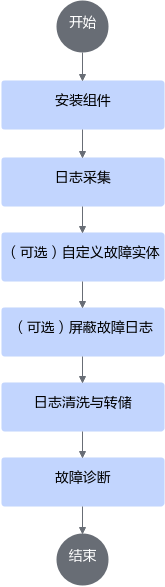

# 使用流程

本流程以全量应用场景为例，描述整体故障诊断的对应流程，用户可参考[图1](#fig119736111011)中的使用流程和[表1](#table785432425410)中说明完成操作。

**图 1**  使用流程图  

**表 1**  操作说明

|关键操作|对应章节|说明|
|--|--|--|
|日志采集。根据日志采集目录，采集训练及推理、CANN以及主机和NPU相关日志。|[日志采集目录结构](./03_collecting_logs.md#日志采集目录结构)|集群平台日志采集，请以实际的方式为主，此处仅以目录结构和采集示例为用户提供日志采集流程思路。|
|日志采集。准备“训练及推理前采集NPU环境检查文件”。|[训练及推理前日志采集](./03_collecting_logs.md#训练及推理前日志采集)|集群平台日志采集，请以实际的方式为主，此处仅以目录结构和采集示例为用户提供日志采集流程思路。|
|日志采集。准备训练及推理中采集NPU网口统计指标、NPU状态监测指标、主机侧资源信息、MindIE Pod日志采集。|[训练及推理中采集](./03_collecting_logs.md#训练及推理中采集)|集群平台日志采集，请以实际的方式为主，此处仅以目录结构和采集示例为用户提供日志采集流程思路。|
|日志采集。训练及推理后采集NPU环境检查文件、用户训练及推理日志、CANN应用类日志、主机侧操作系统日志、Device侧日志。|[训练及推理后采集](./03_collecting_logs.md#训练及推理后采集)|集群平台日志采集，请以实际的方式为主，此处仅以目录结构和采集示例为用户提供日志采集流程思路。|
|（可选）支持用户自定义故障实体。|[（可选）自定义故障实体](./04_customizing_fault_entities.md)|相关组件命令API接口说明请参见[自定义故障实体接口](../api/fault_entity_customization.md)。|
|（可选）支持用户对CANN应用类日志的ERROR日志进行屏蔽操作。|[（可选）屏蔽故障日志](./05_masking_fault_logs.md)|相关组件命令API接口说明请参见[屏蔽故障日志接口](../api/fault_log_masking.md)。关于CANN应用类日志的日志类别信息，请参见《[CANN 日志参考](https://www.hiascend.com/document/detail/zh/canncommercial/850/maintenref/logreference/logreference_0001.html)》。|
|使用组件对采集目录进行清洗，并将完成清洗的各节点日志进行转储。|[日志清洗与转储](./06_cleaning_and_dumping_logs.md)|<ul><li>对应章节中，清洗以单节点的日志清洗为例，实际集群需按节点数量进行对应次数清洗。</li><li>相关组件命令API接口说明请参见[日志清洗接口](../api/log_cleaning.md)。</li></ul>|
|使用组件对完成清洗转储后的日志目录进行诊断。|[故障诊断](./07_diagnosing_faults.md)|相关组件命令API接口说明请参见[故障诊断接口](../api/fault_diagnosis.md)。|
