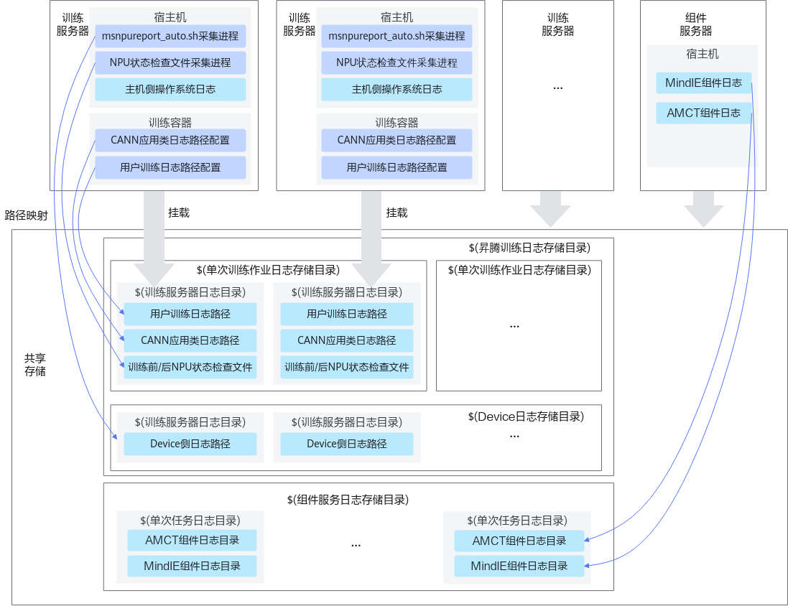

# 使用示例<a name="ZH-CN_TOPIC_0000001905930376"></a>

本章节为使用示例，仅供参考，请根据训练平台、训练任务异常场景和集群存储等实际情况参考使用。

## 场景说明<a name="section20829165411715"></a>

- 本示例为训练集群挂载**共享存储**场景，请提前确保集群所有节点都挂载共享存储。
- 本示例为**集群训练任务异常退出**场景使用示例，涉及到以下日志信息。
    - 用户训练日志
    - CANN应用类日志
    - 训练前NPU状态检查文件
    - 训练后NPU状态检查文件
    - Device侧日志
    - 主机侧操作系统日志
    - MindCluster组件日志
    - MindIE组件日志
    - MindIE Pod控制台日志
    - AMCT组件日志
    - MindIO组件日志
    - BMC日志
    - LCNE日志
    - Bus日志

## 日志路径映射关系<a name="section1246617719225"></a>

宿主机和容器中的相关日志路径与共享存储下的日志路径的映射关系如[图1](#fig118691742112210)所示。

**图 1**  日志路径映射图<a name="fig118691742112210"></a>  


## 使用流程<a name="section125992312510"></a>

1. [日志采集](#section135847272336)。在共享存储上创建日志路径并进行相关配置。
2. [日志清洗](#section6586172714334)。日志采集后，对日志信息进行清洗。
3. [故障诊断](#section15416716355)。执行故障诊断命令，获取根因节点和故障事件信息。

## 日志采集<a name="section135847272336"></a>

以下日志目录仅为示例，用户可以根据实际情况自定义存储目录。示例以单台服务器名为worker-0为例，请用户为所有训练服务器创建相应目录。

>[!NOTE] 
>创建日志目录时建议保证目录具有默认的读写权限。训练容器启动时不建议挂载root用户目录为日志存储目录。

1. 在共享存储任意路径下，创建昇腾训练日志存储目录，如“/ascend\_cluster\_log”。

    ```shell
    mkdir -p /ascend_cluster_log
    ```

2. 在昇腾训练日志存储目录下，创建Device日志存储目录，如“/ascend\_cluster\_log/device\_log/worker-0”。

    ```shell
    mkdir -p /ascend_cluster_log/device_log/worker-0
    ```

3. 在启动训练任务后，在昇腾训练日志存储目录下，创建单次训练作业日志存储目录，推荐使用训练任务ID作为目录名，如“/ascend\_cluster\_log/job202405181309/worker-0”。

    ```shell
    mkdir -p /ascend_cluster_log/job202405181309/worker-0
    ```

4. 依次执行以下命令，创建训练日志采集目录。

    ```shell
    mkdir -p /ascend_cluster_log/job202405181309/worker-0/process_log    # CANN应用类日志路径
    mkdir -p /ascend_cluster_log/job202405181309/worker-0/train_log      # 用户训练日志
    mkdir -p /ascend_cluster_log/job202405181309/worker-0/environment_check    # 训练前或后NPU环境检查文件
    ```

5. 配置日志采集目录。
    1. 执行以下命令，使用msnpureport\_auto\_export.sh文件脚本，周期性导出Device侧日志。如果采取单次导出Device侧日志，可以参考[Device侧日志](./03_collecting_logs.md#device侧日志)章节进行操作。

        ```shell
        Driver安装目录/driver/tools/msnpureport_auto_export.sh 采集间隔时间 最大存储目录容量 /Device日志存储目录名
        ```

        如：

        ```shell
        /usr/local/Ascend/driver/tools/msnpureport_auto_export.sh 300 10 /ascend_cluster_log/device_log/worker-0
        ```

        在以上示例中，采集间隔时间等参数说明如下：

        **表 1**  参数说明

        |参数|说明|
        |--|--|
        |采集间隔时间|导出Device侧日志和文件的间隔时间。取值为大于0的整数，单位是s，如：2s。|
        |最大存储目录容量|导出Device侧日志和文件的存储目录容量。取值为大于等于2的整数，单位是G，如：10G。|
        |Device日志存储目录名|导出Device侧日志和文件的存储路径（任意的绝对路径）。如：“/home/log/”。|

        >[!NOTE] 
        >- msnpureport\_auto\_export.sh脚本的更多使用指导请参见《Atlas 系列硬件产品 25.5.0 msnpureport 工具使用指南》的“[连续导出Device侧系统类日志和其他维测信息](https://support.huawei.com/enterprise/zh/doc/EDOC1100540106/7f3ad48)”章节。
        >- 若设置采集间隔时间较短，频繁导出日志可能会导致系统资源开销较大，推荐参数设置为300（5分钟），可根据实际场景调整。
        >- 训练服务器开机后，只需执行一次msnpureport\_auto\_export.sh脚本。训练服务器重启后，也需要重新执行该采集脚本。

    2. 启动训练任务时，配置CANN应用类日志采集目录。
        - 启动训练容器时，将共享存储的CANN应用类日志目录挂载到容器内任意路径下（如“/ascend\_cluster\_log/job202405181309/worker-0/process\_log”），并配置环境变量。

            ```shell
            docker run \
                -v /共享存储的CANN应用类日志路径:/容器内CANN应用类日志路径 \
                --env ASCEND_PROCESS_LOG_PATH=/容器内CANN应用类日志路径 \
                \...其他启动项...\    
                ${训练镜像名} /bin/bash
            ```

            如：

            ```shell
            docker run \
                -v /ascend_cluster_log/job202405181309/worker-0/process_log:/ascend_cluster_log/job202405181309/worker-0/process_log \
                --env ASCEND_PROCESS_LOG_PATH=/ascend_cluster_log/job202405181309/worker-0/process_log \
                \...其他启动项...\    
                ${训练镜像名} /bin/bash
            ```

        - 使用宿主机进行训练时，需要执行以下命令。

            ```shell
            export ASCEND_PROCESS_LOG_PATH=/CANN应用类日志路径
            ```

            如：

            ```shell
            export ASCEND_PROCESS_LOG_PATH=/ascend_cluster_log/job202405181309/worker-0/process_log
            ```

    3. 启动训练任务时，配置用户训练日志采集目录。
        1. 启动训练容器时，将共享存储的用户训练日志采集目录挂载到容器内任意路径下（如“/ascend\_cluster\_log/job202405181309/worker-0/train\_log”）。使用宿主机进行训练时，可跳过本步骤。

            ```shell
            docker run \
                -v /共享存储用户训练日志采集目录:/容器内的用户训练日志采集目录 \
                \...其他启动项...\    
                ${训练镜像名} /bin/bash
            ```

            如：

            ```shell
            docker run \
                -v /ascend_cluster_log/job202405181309/worker-0/train_log:/ascend_cluster_log/job202405181309/worker-0/train_log \
                \...其他启动项...\    
                ${训练镜像名} /bin/bash
            ```

        2. 执行以下命令，使用重定向方式，将脚本执行回显内容落盘存储。

            ```shell
            python train.py > /ascend_cluster_log/job202405181309/worker-0/train_log/rank-0.txt 2>&1
            ```

            >[!NOTE] 
            >- 将每张NPU卡的训练日志文件保存为txt或log文件，6.0.RC3之前的版本需要按照rank-_\(rank\_id\)_.txt的格式要求命名用户训练转储日志文件。
            >- 若使用PyTorch框架，所有NPU卡的训练日志可重定向到同一个文件，如rank-all.txt。

    4. 启动训练任务前，需要参考[训练及推理前NPU环境检查文件](./03_collecting_logs.md#训练及推理前npu环境检查文件)章节，查询训练前NPU相关信息。在训练结束后，再参考[训练及推理后NPU环境检查文件](./03_collecting_logs.md#训练及推理后npu环境检查文件)章节，查询训练后NPU相关信息。

        >[!NOTE] 
        >更多关于日志采集的详细信息，可以参见[日志采集](./03_collecting_logs.md)章节。

## 日志清洗<a name="section6586172714334"></a>

以单台服务器名为worker-0为例，请用户为所有训练服务创建目录，并执行清洗命令。

1. 在日志清洗前，执行以下命令，创建清洗结果和诊断结果的输出目录。

    ```shell
    mkdir -p /ascend_cluster_log/job202405181309/faultdiag_work_tmp/parse_out/worker-0 # 清洗结果输出目录
    mkdir -p /ascend_cluster_log/job202405181309/faultdiag_work_tmp/diag_out   # 诊断结果输出目录
    ```

2. 执行ascend-fd parse命令，对单台训练服务器进行日志清洗。

    ```shell
    ascend-fd parse --process_log CANN应用类日志目录 --train_log 用户训练日志目录 --env_check 环境检查文件目录 --host_log 主机侧操作系统日志 --device_log NPU侧日志目录 --dl_log MindCluster组件日志 --custom_log 自定义解析文件目录名 -o 清洗输出目录名
    ```

    如：

    ```shell
    ascend-fd parse --process_log /ascend_cluster_log/job202405181309/worker-0/process_log --train_log /ascend_cluster_log/job202405181309/worker-0/train_log --env_check /ascend_cluster_log/job202405181309/worker-0/environment_check --host_log /var/log --device_log /ascend_cluster_log/device_log/worker-0/msnpureport_log_new --dl_log /ascend_cluster_log/job202405181309/worker-0/dl_log --custom_log worker-0/
    -o /ascend_cluster_log/job202405181309/faultdiag_work_tmp/parse_out/worker-0 
    ```

3. （可选）若有BMC侧日志，执行如下。

    ```shell
    ascend-fd parse --bmc_log BMC侧日志目录 -o 清洗结果输出目录
    ```

    如：

    ```shell
    ascend-fd parse --bmc_log  "bmc/worker-00" -o "auto_diag_combine/bmc/worker-00"
    ```

4. （可选）若有LCNE侧日志，执行如下。

    ```shell
    ascend-fd parse --lcne_log LCNE侧日志目录 -o 清洗结果输出目录
    ```

    如：

    ```shell
    ascend-fd parse --lcne_log  "lcne/worker-111" -o "auto_diag_combine/lcne/worker-111"
    ```

    更多关于日志清洗的详细信息，请参见[日志清洗与转储](./06_cleaning_and_dumping_logs.md)章节。

## 故障诊断<a name="section15416716355"></a>

执行ascend-fd diag命令，对集群所有训练服务器进行故障诊断。

```shell
ascend-fd diag -i /清洗输出目录名 -o /诊断结果输出目录名
```

如：

```shell
ascend-fd diag -i /ascend_cluster_log/job202405181309/faultdiag_work_tmp/parse_out -o /ascend_cluster_log/job202405181309/faultdiag_work_tmp/diag_out
```

更多关于故障诊断的详细信息，请参见[故障诊断](./07_diagnosing_faults.md)章节。
