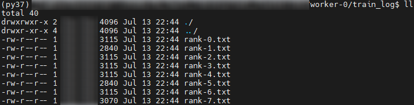

# 日志采集<a name="ZH-CN_TOPIC_0000001628171657"></a>

## 日志采集目录结构<a name="ZH-CN_TOPIC_0000001629558433"></a>

本章节介绍待清洗的目录结构组成，用户可参照以下内容进行日志收集，并按对应结构存储。

>[!NOTE] 
>
>- Ascend-fd parse输入目录的日志文件大小会影响执行清洗命令的效率，总文件大小应限制在5G以下，文件总数量不能超过1000000。
>- CANN应用类日志的单个文件应限制在20MB以下。
>- NPU状态监测指标文件、NPU网口统计监测指标文件、主机侧资源信息文件应限制在512MB以下。
>- 用户训练及推理日志大小无限制，会默认只读最后1MB日志。
>- Host OS系统日志当前支持messages、dmesg、vmcore\_dmesg.txt和sysmonitor.log日志，其中单个文件的转储大小上限请限制在512MB以下；dmesg日志取最新的日志，最大100000行。
>- process\_log、environment\_check、device\_log、dl\_log、mindie、amct\_log位置不受约束，存放在采集目录下任意位置均可。
>- 用户若在容器中进行训练及推理，请及时保存日志至宿主机，如用户训练及推理日志、CANN应用类日志。
>- 训练及推理前或后NPU环境检查文件、NPU网口统计监测指标文件、NPU状态监测指标文件、主机侧资源信息、主机侧操作系统日志和Device侧日志、MindCluster组件日志、MindIE组件日志、AMCT组件日志请在宿主机上采集。
>- Volcano组件中volcano-scheduler与volcano-controller触发转储后以gzip压缩的转储日志将不会被读取，采集时需确保相关日志都已在未转储的volcano-scheduler.log与volcano-controller.log中。
>- MindIE Pod控制台日志可在k8s集群主节点收集所有Pod的控制台日志，可将所有MindIE Pod控制台日志放在某个节点指定目录下即可，无需分开存放。
>- MindIE Pod控制台日志存在老化机制，若采集的MindIE Pod控制台日志缺失实例节点信息，组件将不支持多实例故障诊断。
>- MindIO日志采集后转储目录在/dl_log目录下，后续会适配转储在采集目录下。

- 用户可将所有日志汇总至同一采集目录下进行清洗，待清洗相关文件目录结构示例如下。
    - 主机Host侧日志目录结构如下所示。

        ```text
        采集目录
        |-- messages             # 主机侧操作系统日志
        |-- dmesg                # 主机侧内核消息日志
        |-- crash
            |-- 主机+故障时间目录(eg:127.xx.xx.1-2024-09-23-11:25:29)
                |-- vmcore_dmesg.txt     # 系统崩溃时保存的Host侧内核消息日志文件
        |-- sysmonitor.log       # 主机侧系统监测日志
        |-- rank-0.txt           # 训练及推理控制台日志
        |-- dmidecode.txt        # dmidecode命令输出日志
        ...
        |-- rank-7.txt           # 训练及推理控制台日志
        |-- process_log          # CANN应用侧原始日志，目录名需为process_log
        |-- device_log           # Device侧日志，目录名需为device_log
        |-- dl_log               # MindCluster组件日志，目录名需为dl_log
            |-- devicePlugin       # Ascend Device Plugin组件日志
            |-- noded              # NodeD组件日志
            |-- ascend-docker-runtime        # Ascend Docker Runtime组件日志
            |-- volcano-scheduler            # Volcano中的volcano-scheduler组件日志
            |-- volcano-controller           # Volcano中的volcano-controller组件日志
            |-- npu-exporter                 # NPU Exporter组件日志
            |-- ttp_log                      # MindIO组件日志
        |-- mindie               # MindIE组件日志
            |-- log
                |-- debug        # MindIE组件运行日志
                |-- security     # MindIE组件审计日志
                |-- mindie_cluster_log     # MindIE Pod控制台日志
        |-- amct_log             # AMCT组件日志
        |-- bus_log              # Ascend 950代际LCNE组件日志
        |-- environment_check # NPU网口、状态信息、资源信息
            |-- npu_smi_0_details.csv   # NPU状态监测指标文件
             ...
            |-- npu_smi_7_details.csv   # NPU状态监测指标文件
            |-- npu_0_details.csv       # NPU网口统计监测指标文件
             ...    
            |-- npu_7_details.csv       # NPU网口统计监测指标文件
            |-- npu_info_before/after.txt  # 训练及推理前或后NPU环境检查文件
            |-- host_metrics_{core_num}.json # 主机资源监测指标文件
        ```

    - BMC侧日志目录结构如下所示。

        ```text
        采集目录/dump_info/AppDump/*/*.log
        采集目录/dump_info/DeviceDump/*/*.log
        采集目录/dump_info/LogDump/*/*.log
        采集目录/dump_info/AppDump/frudata/fruinfo.txt  # BMC扩展板SN采集目录
        采集目录/dump_info/AppDump/chassis/mdb_info.log   # BMC超节点信息采集目录
        ```

    - LCNE侧日志目录结构如下所示。

        ```text
        采集目录/*/diagnostic_information/slot_1/tempdir/devm_bddrvadp.log  # LCNE扩展板SN采集目录
        采集目录/*/diag_display_info.txt  # LCNE超节点信息采集目录
        采集目录/*/log.log
        采集目录/*/log_1_*.log
        ```

        各目录中存放的日志文件请参见[表1](#table12937722195315)。

        **表 1**  日志文件列表

        <a name="table12937722195315"></a>
        <table><thead align="left"><tr id="row693332215532"><th class="cellrowborder" valign="top" width="16.150000000000002%" id="mcps1.2.5.1.1"><p id="p139331922175315"><a name="p139331922175315"></a><a name="p139331922175315"></a>文件类型</p>
        </th>
        <th class="cellrowborder" valign="top" width="21.26%" id="mcps1.2.5.1.2"><p id="p493392214536"><a name="p493392214536"></a><a name="p493392214536"></a><strong id="b493316221533"><a name="b493316221533"></a><a name="b493316221533"></a>日志文件</strong></p>
        </th>
        <th class="cellrowborder" valign="top" width="20.39%" id="mcps1.2.5.1.3"><p id="p13933142265319"><a name="p13933142265319"></a><a name="p13933142265319"></a><strong id="b17933102265312"><a name="b17933102265312"></a><a name="b17933102265312"></a>文件说明</strong></p>
        </th>
        <th class="cellrowborder" valign="top" width="42.199999999999996%" id="mcps1.2.5.1.4"><p id="p993372275310"><a name="p993372275310"></a><a name="p993372275310"></a><strong id="b189334229535"><a name="b189334229535"></a><a name="b189334229535"></a>存储目录</strong></p>
        </th>
        </tr>
        </thead>
        <tbody><tr id="row17933112220536"><td class="cellrowborder" rowspan="2" valign="top" width="16.150000000000002%" headers="mcps1.2.5.1.1 "><p id="p10933022195316"><a name="p10933022195316"></a><a name="p10933022195316"></a>CANN应用类日志</p>
        </td>
        <td class="cellrowborder" valign="top" width="21.26%" headers="mcps1.2.5.1.2 "><p id="p6933622185319"><a name="p6933622185319"></a><a name="p6933622185319"></a>plog-<em id="i1493313229537"><a name="i1493313229537"></a><a name="i1493313229537"></a>{pid}</em>_<em id="i149334227536"><a name="i149334227536"></a><a name="i149334227536"></a>{time}</em>.log</p>
        </td>
        <td class="cellrowborder" valign="top" width="20.39%" headers="mcps1.2.5.1.3 "><p id="p1093313229534"><a name="p1093313229534"></a><a name="p1093313229534"></a>Host侧应用类日志。</p>
        </td>
        <td class="cellrowborder" valign="top" width="42.199999999999996%" headers="mcps1.2.5.1.4 "><p id="p1493312235317"><a name="p1493312235317"></a><a name="p1493312235317"></a>采集目录/process_log/debug或run/plog/plog-<em id="i2933622125316"><a name="i2933622125316"></a><a name="i2933622125316"></a>{pid}</em>_<em id="i6933222145320"><a name="i6933222145320"></a><a name="i6933222145320"></a>{time}</em>.log</p>
        </td>
        </tr>
        <tr id="row159331225539"><td class="cellrowborder" valign="top" headers="mcps1.2.5.1.1 "><p id="p10933192214532"><a name="p10933192214532"></a><a name="p10933192214532"></a>device-<em id="i19933162225310"><a name="i19933162225310"></a><a name="i19933162225310"></a>{pid}</em>_<em id="i129331223539"><a name="i129331223539"></a><a name="i129331223539"></a>{time}</em>.log</p>
        </td>
        <td class="cellrowborder" valign="top" headers="mcps1.2.5.1.2 "><p id="p7933722165312"><a name="p7933722165312"></a><a name="p7933722165312"></a>Device侧应用类日志。</p>
        </td>
        <td class="cellrowborder" valign="top" headers="mcps1.2.5.1.3 "><p id="p4933722175314"><a name="p4933722175314"></a><a name="p4933722175314"></a>采集目录/process_log/debug或run/device-<em id="i139331122135318"><a name="i139331122135318"></a><a name="i139331122135318"></a>{id}</em>/device-<em id="i293313226535"><a name="i293313226535"></a><a name="i293313226535"></a>{pid}</em>_<em id="i17933222185310"><a name="i17933222185310"></a><a name="i17933222185310"></a>{time}</em>.log</p>
        </td>
        </tr>
        <tr id="row1993482285313"><td class="cellrowborder" valign="top" width="16.150000000000002%" headers="mcps1.2.5.1.1 "><p id="p1493317220533"><a name="p1493317220533"></a><a name="p1493317220533"></a>用户训练及推理日志</p>
        </td>
        <td class="cellrowborder" valign="top" width="21.26%" headers="mcps1.2.5.1.2 "><p id="p9934322185315"><a name="p9934322185315"></a><a name="p9934322185315"></a>rank<em id="i99341622195317"><a name="i99341622195317"></a><a name="i99341622195317"></a>-{id}</em>.txt</p>
        <p id="p19934722135313"><a name="p19934722135313"></a><a name="p19934722135313"></a>rank<em id="i2934162217537"><a name="i2934162217537"></a><a name="i2934162217537"></a>-{id}</em>.log</p>
        <p id="p1934192215536"><a name="p1934192215536"></a><a name="p1934192215536"></a>worker<em id="i493422219532"><a name="i493422219532"></a><a name="i493422219532"></a>-{id}</em>.txt</p>
        <p id="p793419224533"><a name="p793419224533"></a><a name="p793419224533"></a>worker<em id="i09341722175313"><a name="i09341722175313"></a><a name="i09341722175313"></a>-{id}</em>.log</p>
        </td>
        <td class="cellrowborder" valign="top" width="20.39%" headers="mcps1.2.5.1.3 "><p id="p693432219531"><a name="p693432219531"></a><a name="p693432219531"></a>训练及推理控制台日志。</p>
        </td>
        <td class="cellrowborder" valign="top" width="42.199999999999996%" headers="mcps1.2.5.1.4 "><a name="ul493492215531"></a><a name="ul493492215531"></a><ul id="ul493492215531"><li>采集目录/rank-<em id="i993414221535"><a name="i993414221535"></a><a name="i993414221535"></a>{id</em><em id="i1893410222530"><a name="i1893410222530"></a><a name="i1893410222530"></a>}</em>.*?.txt</li><li>采集目录/rank-<em id="i1934112220532"><a name="i1934112220532"></a><a name="i1934112220532"></a>{id</em><em id="i993472245319"><a name="i993472245319"></a><a name="i993472245319"></a>}</em>.*?.log</li><li>采集目录/worker-<em id="i1693413224532"><a name="i1693413224532"></a><a name="i1693413224532"></a>{id}</em>.*?.log</li><li>采集目录/worker-<em id="i129341322145314"><a name="i129341322145314"></a><a name="i129341322145314"></a>{id}</em>.*?.txt</li></ul>
        </td>
        </tr>
        <tr id="row6934122265317"><td class="cellrowborder" rowspan="4" valign="top" width="16.150000000000002%" headers="mcps1.2.5.1.1 "><p id="p119341722135319"><a name="p119341722135319"></a><a name="p119341722135319"></a>NPU网口资源信息</p>
        </td>
        <td class="cellrowborder" valign="top" width="21.26%" headers="mcps1.2.5.1.2 "><p id="p7934202225314"><a name="p7934202225314"></a><a name="p7934202225314"></a>npu_info_before.txt</p>
        </td>
        <td class="cellrowborder" valign="top" width="20.39%" headers="mcps1.2.5.1.3 "><p id="p29340221534"><a name="p29340221534"></a><a name="p29340221534"></a>训练及推理前NPU网口检查。</p>
        </td>
        <td class="cellrowborder" valign="top" width="42.199999999999996%" headers="mcps1.2.5.1.4 "><p id="p15934192245318"><a name="p15934192245318"></a><a name="p15934192245318"></a>采集目录/environment_check/npu_info_before.txt</p>
        </td>
        </tr>
        <tr id="row189341222165320"><td class="cellrowborder" valign="top" headers="mcps1.2.5.1.1 "><p id="p13934102295314"><a name="p13934102295314"></a><a name="p13934102295314"></a>npu_info_after.txt</p>
        </td>
        <td class="cellrowborder" valign="top" headers="mcps1.2.5.1.2 "><p id="p1493411228532"><a name="p1493411228532"></a><a name="p1493411228532"></a>训练及推理后NPU网口检查。</p>
        </td>
        <td class="cellrowborder" valign="top" headers="mcps1.2.5.1.3 "><p id="p1993452218536"><a name="p1993452218536"></a><a name="p1993452218536"></a>采集目录/environment_check/npu_info_after.txt</p>
        </td>
        </tr>
        <tr id="row12934182295318"><td class="cellrowborder" valign="top" headers="mcps1.2.5.1.1 "><p id="p493442275316"><a name="p493442275316"></a><a name="p493442275316"></a>npu_smi_<em id="i493482205317"><a name="i493482205317"></a><a name="i493482205317"></a>{npu_id}</em>_details.csv</p>
        </td>
        <td class="cellrowborder" valign="top" headers="mcps1.2.5.1.2 "><p id="p1193462265313"><a name="p1193462265313"></a><a name="p1193462265313"></a>NPU状态监测指标文件。</p>
        </td>
        <td class="cellrowborder" valign="top" headers="mcps1.2.5.1.3 "><p id="p3934022125312"><a name="p3934022125312"></a><a name="p3934022125312"></a>采集目录/environment_check/npu_smi_<em id="i129341722135313"><a name="i129341722135313"></a><a name="i129341722135313"></a>{npu_id}</em>_details.csv</p>
        </td>
        </tr>
        <tr id="row1593418221533"><td class="cellrowborder" valign="top" headers="mcps1.2.5.1.1 "><p id="p12934192255315"><a name="p12934192255315"></a><a name="p12934192255315"></a>npu_<em id="i199341122115317"><a name="i199341122115317"></a><a name="i199341122115317"></a>{npu_id}</em>_details.csv</p>
        </td>
        <td class="cellrowborder" valign="top" headers="mcps1.2.5.1.2 "><p id="p1793482214532"><a name="p1793482214532"></a><a name="p1793482214532"></a>NPU网口统计监测指标文件。</p>
        </td>
        <td class="cellrowborder" valign="top" headers="mcps1.2.5.1.3 "><p id="p18934122265316"><a name="p18934122265316"></a><a name="p18934122265316"></a>采集目录/environment_check/npu_<em id="i14934622125317"><a name="i14934622125317"></a><a name="i14934622125317"></a>{npu_id}</em>_details.csv</p>
        </td>
        </tr>
        <tr id="row89341122195315"><td class="cellrowborder" rowspan="2" valign="top" width="16.150000000000002%" headers="mcps1.2.5.1.1 "><p id="p693462215320"><a name="p693462215320"></a><a name="p693462215320"></a>主机侧资源信息</p>
        <p id="p14185102720010"><a name="p14185102720010"></a><a name="p14185102720010"></a></p>
        </td>
        <td class="cellrowborder" valign="top" width="21.26%" headers="mcps1.2.5.1.2 "><p id="p1934622125311"><a name="p1934622125311"></a><a name="p1934622125311"></a>host_metrics_<em id="i19934122125311"><a name="i19934122125311"></a><a name="i19934122125311"></a>{core_num}</em>.json</p>
        </td>
        <td class="cellrowborder" valign="top" width="20.39%" headers="mcps1.2.5.1.3 "><p id="p4934192215538"><a name="p4934192215538"></a><a name="p4934192215538"></a>主机资源监测指标文件。</p>
        </td>
        <td class="cellrowborder" valign="top" width="42.199999999999996%" headers="mcps1.2.5.1.4 "><p id="p4934192216538"><a name="p4934192216538"></a><a name="p4934192216538"></a>采集目录/environment_check/host_metrics_<em id="i17934622105318"><a name="i17934622105318"></a><a name="i17934622105318"></a>{core_num}</em>.json</p>
        </td>
        </tr>
        <tr id="row118418271603"><td class="cellrowborder" valign="top" headers="mcps1.2.5.1.1 "><p id="p1518513276018"><a name="p1518513276018"></a><a name="p1518513276018"></a>dmidecode.txt</p>
        </td>
        <td class="cellrowborder" valign="top" headers="mcps1.2.5.1.2 "><p id="p1518502716012"><a name="p1518502716012"></a><a name="p1518502716012"></a>主机侧包含dmi硬件信息的日志文件。</p>
        </td>
        <td class="cellrowborder" valign="top" headers="mcps1.2.5.1.3 "><p id="p1418515272016"><a name="p1418515272016"></a><a name="p1418515272016"></a>采集目录/dmidecode.txt</p>
        </td>
        </tr>
        <tr id="row1993412255313"><td class="cellrowborder" rowspan="4" valign="top" width="16.150000000000002%" headers="mcps1.2.5.1.1 "><p id="p793413223536"><a name="p793413223536"></a><a name="p793413223536"></a>主机侧日志</p>
        <p id="p5934152275312"><a name="p5934152275312"></a><a name="p5934152275312"></a></p>
        </td>
        <td class="cellrowborder" valign="top" width="21.26%" headers="mcps1.2.5.1.2 "><p id="p9934102218537"><a name="p9934102218537"></a><a name="p9934102218537"></a>dmesg</p>
        </td>
        <td class="cellrowborder" valign="top" width="20.39%" headers="mcps1.2.5.1.3 "><p id="p3934142215531"><a name="p3934142215531"></a><a name="p3934142215531"></a>主机侧内核消息类文件。</p>
        </td>
        <td class="cellrowborder" valign="top" width="42.199999999999996%" headers="mcps1.2.5.1.4 "><p id="p2934122214533"><a name="p2934122214533"></a><a name="p2934122214533"></a>采集目录/dmesg</p>
        </td>
        </tr>
        <tr id="row19935152245315"><td class="cellrowborder" valign="top" headers="mcps1.2.5.1.1 "><p id="p8934162214536"><a name="p8934162214536"></a><a name="p8934162214536"></a>sysmonitor.log</p>
        </td>
        <td class="cellrowborder" valign="top" headers="mcps1.2.5.1.2 "><p id="p993412245316"><a name="p993412245316"></a><a name="p993412245316"></a>主机侧系统监测类文件。</p>
        </td>
        <td class="cellrowborder" valign="top" headers="mcps1.2.5.1.3 "><p id="p179347221530"><a name="p179347221530"></a><a name="p179347221530"></a>采集目录/sysmonitor.log</p>
        </td>
        </tr>
        <tr id="row0935422155317"><td class="cellrowborder" valign="top" headers="mcps1.2.5.1.1 "><p id="p2093582265313"><a name="p2093582265313"></a><a name="p2093582265313"></a>messages-*?</p>
        </td>
        <td class="cellrowborder" valign="top" headers="mcps1.2.5.1.2 "><p id="p493516222539"><a name="p493516222539"></a><a name="p493516222539"></a>主机侧操作系统日志文件。</p>
        </td>
        <td class="cellrowborder" valign="top" headers="mcps1.2.5.1.3 "><p id="p1193532265318"><a name="p1193532265318"></a><a name="p1193532265318"></a>采集目录/messages-*?</p>
        </td>
        </tr>
        <tr id="row293522265317"><td class="cellrowborder" valign="top" headers="mcps1.2.5.1.1 "><p id="p69351922185310"><a name="p69351922185310"></a><a name="p69351922185310"></a>vmcore_dmesg.txt</p>
        </td>
        <td class="cellrowborder" valign="top" headers="mcps1.2.5.1.2 "><p id="p1893512218538"><a name="p1893512218538"></a><a name="p1893512218538"></a>系统崩溃时保存的Host侧内核消息日志文件。</p>
        </td>
        <td class="cellrowborder" valign="top" headers="mcps1.2.5.1.3 "><p id="p9935132235315"><a name="p9935132235315"></a><a name="p9935132235315"></a>采集目录/crash/主机+故障时间目录(eg: 127.xx.xx.1-2024-09-23-11:25:29)/vmcore_dmesg.txt</p>
        </td>
        </tr>
        <tr id="row1193562265314"><td class="cellrowborder" rowspan="7" valign="top" width="16.150000000000002%" headers="mcps1.2.5.1.1 "><p id="p149350225535"><a name="p149350225535"></a><a name="p149350225535"></a>Device侧日志</p>
        <p id="p293522215530"><a name="p293522215530"></a><a name="p293522215530"></a></p>
        <p id="p16935182211533"><a name="p16935182211533"></a><a name="p16935182211533"></a></p>
        <p id="p493572255315"><a name="p493572255315"></a><a name="p493572255315"></a></p>
        <p id="p3935422115314"><a name="p3935422115314"></a><a name="p3935422115314"></a></p>
        </td>
        <td class="cellrowborder" valign="top" width="21.26%" headers="mcps1.2.5.1.2 "><p id="p1693552225316"><a name="p1693552225316"></a><a name="p1693552225316"></a>device-os_<em id="i11935202218535"><a name="i11935202218535"></a><a name="i11935202218535"></a>{time}</em>.log</p>
        </td>
        <td class="cellrowborder" valign="top" width="20.39%" headers="mcps1.2.5.1.3 "><p id="p1393510222534"><a name="p1393510222534"></a><a name="p1393510222534"></a>Device侧Control CPU上的系统类日志。</p>
        </td>
        <td class="cellrowborder" valign="top" width="42.199999999999996%" headers="mcps1.2.5.1.4 "><p id="p99351722105318"><a name="p99351722105318"></a><a name="p99351722105318"></a>采集目录/device_log/slog/dev-os-<em id="i7935182215316"><a name="i7935182215316"></a><a name="i7935182215316"></a>{id}</em>/debug或run/device-os/device-os_<em id="i1093510226536"><a name="i1093510226536"></a><a name="i1093510226536"></a>{time}</em>.log</p>
        </td>
        </tr>
        <tr id="row159351022125320"><td class="cellrowborder" valign="top" headers="mcps1.2.5.1.1 "><p id="p2935122218532"><a name="p2935122218532"></a><a name="p2935122218532"></a>event_<em id="i10935162295311"><a name="i10935162295311"></a><a name="i10935162295311"></a>{time}</em>.log</p>
        </td>
        <td class="cellrowborder" valign="top" headers="mcps1.2.5.1.2 "><p id="p12935132215316"><a name="p12935132215316"></a><a name="p12935132215316"></a>Device侧Control CPU上的EVENT级别系统日志。</p>
        </td>
        <td class="cellrowborder" valign="top" headers="mcps1.2.5.1.3 "><p id="p11935142219539"><a name="p11935142219539"></a><a name="p11935142219539"></a>支持Ascend HDK 23.0.3及以上版本：</p>
        <p id="p293572212532"><a name="p293572212532"></a><a name="p293572212532"></a>采集目录/device_log/slog/dev-os-<em id="i1293517221539"><a name="i1293517221539"></a><a name="i1293517221539"></a>{id}</em>/run/event/event_<em id="i1935182215539"><a name="i1935182215539"></a><a name="i1935182215539"></a>{time}</em>.log</p>
        </td>
        </tr>
        <tr id="row493642295315"><td class="cellrowborder" valign="top" headers="mcps1.2.5.1.1 "><p id="p19351222125310"><a name="p19351222125310"></a><a name="p19351222125310"></a>device-<em id="i99351722195317"><a name="i99351722195317"></a><a name="i99351722195317"></a>{id}</em>_<em id="i16935422175310"><a name="i16935422175310"></a><a name="i16935422175310"></a>{time}</em>.log</p>
        </td>
        <td class="cellrowborder" valign="top" headers="mcps1.2.5.1.2 "><p id="p119351522125319"><a name="p119351522125319"></a><a name="p119351522125319"></a>Device侧非Control CPU上的系统类日志。</p>
        </td>
        <td class="cellrowborder" valign="top" headers="mcps1.2.5.1.3 "><p id="p4935722185312"><a name="p4935722185312"></a><a name="p4935722185312"></a>Ascend HDK 23.0.RC3版本：</p>
        <p id="p109351225536"><a name="p109351225536"></a><a name="p109351225536"></a>采集目录/device_log/slog/dev-os-<em id="i99354227530"><a name="i99354227530"></a><a name="i99354227530"></a>{id}</em>/device-<em id="i793592216534"><a name="i793592216534"></a><a name="i793592216534"></a>{id}</em>/device-<em id="i89354225538"><a name="i89354225538"></a><a name="i89354225538"></a>{id}</em>_<em id="i129356224537"><a name="i129356224537"></a><a name="i129356224537"></a>{time}</em>.log</p>
        <p id="p129353225539"><a name="p129353225539"></a><a name="p129353225539"></a>Ascend HDK 23.0.3及以上版本：</p>
        <p id="p1793662255315"><a name="p1793662255315"></a><a name="p1793662255315"></a>采集目录/device_log/slog/dev-os-<em id="i19935152295311"><a name="i19935152295311"></a><a name="i19935152295311"></a>{id}</em>/debug/device-<em id="i16935102219531"><a name="i16935102219531"></a><a name="i16935102219531"></a>{id}</em>/device-<em id="i18936182211536"><a name="i18936182211536"></a><a name="i18936182211536"></a>{id}</em>_<em id="i14936422105318"><a name="i14936422105318"></a><a name="i14936422105318"></a>{time}</em>.log</p>
        </td>
        </tr>
        <tr id="row169363227534"><td class="cellrowborder" valign="top" headers="mcps1.2.5.1.1 "><p id="p49363229530"><a name="p49363229530"></a><a name="p49363229530"></a>history.log</p>
        </td>
        <td class="cellrowborder" valign="top" headers="mcps1.2.5.1.2 "><p id="p7936132215531"><a name="p7936132215531"></a><a name="p7936132215531"></a>黑匣子日志。</p>
        </td>
        <td class="cellrowborder" valign="top" headers="mcps1.2.5.1.3 "><p id="p18936322155316"><a name="p18936322155316"></a><a name="p18936322155316"></a>采集目录/device_log/hisi_logs/device-<em id="i59369226534"><a name="i59369226534"></a><a name="i59369226534"></a>{id}</em>/history.log</p>
        </td>
        </tr>
        <tr><td class="cellrowborder" valign="top" headers="mcps1.2.5.1.1 "><p>kernel.log</p>
        </td>
        <td class="cellrowborder" valign="top" headers="mcps1.2.5.1.2 "><p>NPU芯片内核日志。</p>
        </td>
        <td class="cellrowborder" valign="top" headers="mcps1.2.5.1.3 "><p>采集目录/device_log/hisi_logs/device-<em>{id}/{time}</em>/log/kernel.log</p>
        </td>
        </tr>
        <tr><td class="cellrowborder" valign="top" headers="mcps1.2.5.1.1 "><p>os_info.txt</p>
        </td>
        <td class="cellrowborder" valign="top" headers="mcps1.2.5.1.2 "><p>Device侧OS基本信息。</p>
        </td>
        <td class="cellrowborder" valign="top" headers="mcps1.2.5.1.3 "><p>采集目录/device_log/hisi_logs/device-<em>{id}/{time}</em>/bbox/os/os_info.txt</p>
        </td>
        </tr>
        <tr><td class="cellrowborder" valign="top" headers="mcps1.2.5.1.1 "><p>hbm.txt</p>
        </td>
        <td class="cellrowborder" valign="top" headers="mcps1.2.5.1.2 "><p>Device侧片上内存日志。</p>
        </td>
        <td class="cellrowborder" valign="top" headers="mcps1.2.5.1.3 "><p>采集目录/device_log/hisi_logs/device-<em>{id}/{time}</em>/mntn/hbm.txt</p>
        </td>
        </tr>
        <tr id="row119369226534"><td class="cellrowborder" rowspan="7" valign="top" width="16.150000000000002%" headers="mcps1.2.5.1.1 "><p id="p139367226537"><a name="p139367226537"></a><a name="p139367226537"></a><span id="ph19936162211535"><a name="ph19936162211535"></a><a name="ph19936162211535"></a>MindCluster</span>组件日志</p>
        </td>
        <td class="cellrowborder" valign="top" width="21.26%" headers="mcps1.2.5.1.2 "><p id="p149361822115320"><a name="p149361822115320"></a><a name="p149361822115320"></a>devicePlugin*.log</p>
        </td>
        <td class="cellrowborder" valign="top" width="20.39%" headers="mcps1.2.5.1.3 "><p id="p1936222165316"><a name="p1936222165316"></a><a name="p1936222165316"></a>超节点设备日志、<span id="ph59365226535"><a name="ph59365226535"></a><a name="ph59365226535"></a>Ascend Device Plugin</span>组件日志。</p>
        </td>
        <td class="cellrowborder" valign="top" width="42.199999999999996%" headers="mcps1.2.5.1.4 "><p id="p993616221532"><a name="p993616221532"></a><a name="p993616221532"></a>采集目录/dl_log/devicePlugin/devicePlugin*.log</p>
        </td>
        </tr>
        <tr id="row2093672255310"><td class="cellrowborder" valign="top" headers="mcps1.2.5.1.1 "><p id="p1493642215320"><a name="p1493642215320"></a><a name="p1493642215320"></a>noded*.log</p>
        </td>
        <td class="cellrowborder" valign="top" headers="mcps1.2.5.1.2 "><p id="p109361822165314"><a name="p109361822165314"></a><a name="p109361822165314"></a>AI服务器日志。</p>
        </td>
        <td class="cellrowborder" valign="top" headers="mcps1.2.5.1.3 "><p id="p793602225317"><a name="p793602225317"></a><a name="p793602225317"></a>采集目录/dl_log/noded/noded*.log</p>
        </td>
        </tr>
        <tr id="row1793652265316"><td class="cellrowborder" valign="top" headers="mcps1.2.5.1.1 "><p id="p9936102213539"><a name="p9936102213539"></a><a name="p9936102213539"></a>runtime-run*.log</p>
        </td>
        <td class="cellrowborder" valign="top" headers="mcps1.2.5.1.2 "><p id="p12936132210532"><a name="p12936132210532"></a><a name="p12936132210532"></a><span id="ph193622217536"><a name="ph193622217536"></a><a name="ph193622217536"></a>Ascend Docker Runtime</span>组件中的ascend-docker-runtime执行时产生的日志。</p>
        </td>
        <td class="cellrowborder" valign="top" headers="mcps1.2.5.1.3 "><p id="p2936172225314"><a name="p2936172225314"></a><a name="p2936172225314"></a>采集目录/dl_log/ascend-docker-runtime/runtime-run*.log</p>
        </td>
        </tr>
        <tr id="row13936172212537"><td class="cellrowborder" valign="top" headers="mcps1.2.5.1.1 "><p id="p199365220535"><a name="p199365220535"></a><a name="p199365220535"></a>hook-run*.log</p>
        </td>
        <td class="cellrowborder" valign="top" headers="mcps1.2.5.1.2 "><p id="p393682217536"><a name="p393682217536"></a><a name="p393682217536"></a><span id="ph7936222145311"><a name="ph7936222145311"></a><a name="ph7936222145311"></a>Ascend Docker Runtime</span>组件中的ascend-docker-hook执行时产生的日志。</p>
        </td>
        <td class="cellrowborder" valign="top" headers="mcps1.2.5.1.3 "><p id="p393672255310"><a name="p393672255310"></a><a name="p393672255310"></a>采集目录/dl_log/ascend-docker-runtime/</p>
        <p id="p19936202213537"><a name="p19936202213537"></a><a name="p19936202213537"></a>hook-run*.log</p>
        </td>
        </tr>
        <tr id="row159361322195317"><td class="cellrowborder" valign="top" headers="mcps1.2.5.1.1 "><p id="p2936102285313"><a name="p2936102285313"></a><a name="p2936102285313"></a>volcano-scheduler*.log</p>
        </td>
        <td class="cellrowborder" valign="top" headers="mcps1.2.5.1.2 "><p id="p09364226530"><a name="p09364226530"></a><a name="p09364226530"></a><span id="ph109361622135319"><a name="ph109361622135319"></a><a name="ph109361622135319"></a>Volcano</span>组件中的volcano-scheduler组件日志。</p>
        </td>
        <td class="cellrowborder" valign="top" headers="mcps1.2.5.1.3 "><p id="p6936172255314"><a name="p6936172255314"></a><a name="p6936172255314"></a>采集目录/dl_log/volcano-scheduler/</p>
        <p id="p119364226534"><a name="p119364226534"></a><a name="p119364226534"></a>volcano-scheduler*.log</p>
        </td>
        </tr>
        <tr id="row1593692245310"><td class="cellrowborder" valign="top" headers="mcps1.2.5.1.1 "><p id="p3936112245314"><a name="p3936112245314"></a><a name="p3936112245314"></a>volcano-controller*.log</p>
        </td>
        <td class="cellrowborder" valign="top" headers="mcps1.2.5.1.2 "><p id="p2093632212539"><a name="p2093632212539"></a><a name="p2093632212539"></a><span id="ph79361122165314"><a name="ph79361122165314"></a><a name="ph79361122165314"></a>Volcano</span>组件中的volcano-controller组件日志。</p>
        </td>
        <td class="cellrowborder" valign="top" headers="mcps1.2.5.1.3 "><p id="p159362022175316"><a name="p159362022175316"></a><a name="p159362022175316"></a>采集目录/dl_log/volcano-controller/</p>
        <p id="p8936922185317"><a name="p8936922185317"></a><a name="p8936922185317"></a>volcano-controller*.log</p>
        </td>
        </tr>
        <tr id="row16936102255311"><td class="cellrowborder" valign="top" headers="mcps1.2.5.1.1 "><p id="p1193611221535"><a name="p1193611221535"></a><a name="p1193611221535"></a>npu-exporter*.log</p>
        </td>
        <td class="cellrowborder" valign="top" headers="mcps1.2.5.1.2 "><p id="p15936122219532"><a name="p15936122219532"></a><a name="p15936122219532"></a><span id="ph89361220535"><a name="ph89361220535"></a><a name="ph89361220535"></a>NPU Exporter</span>组件日志。</p>
        </td>
        <td class="cellrowborder" valign="top" headers="mcps1.2.5.1.3 "><p id="p19936122175317"><a name="p19936122175317"></a><a name="p19936122175317"></a>采集目录/dl_log/npu-exporter/</p>
        <p id="p493610224532"><a name="p493610224532"></a><a name="p493610224532"></a>npu-exporter*.log</p>
        </td>
        </tr>
        <tr id="row14937122218532"><td class="cellrowborder" valign="top" width="16.150000000000002%" headers="mcps1.2.5.1.1 "><p id="p19365227531"><a name="p19365227531"></a><a name="p19365227531"></a><span id="ph1936112216538"><a name="ph1936112216538"></a><a name="ph1936112216538"></a>MindIE</span>组件日志</p>
        </td>
        <td class="cellrowborder" valign="top" width="21.26%" headers="mcps1.2.5.1.2 "><p id="p1093652215535"><a name="p1093652215535"></a><a name="p1093652215535"></a>mindie-<em id="i79369222536"><a name="i79369222536"></a><a name="i79369222536"></a>{module}</em>_<em id="i19936102211536"><a name="i19936102211536"></a><a name="i19936102211536"></a>{pid}</em>_<em id="i693682205314"><a name="i693682205314"></a><a name="i693682205314"></a>{datetime}</em>.log</p>
        </td>
        <td class="cellrowborder" valign="top" width="20.39%" headers="mcps1.2.5.1.3 "><p id="p15937422205315"><a name="p15937422205315"></a><a name="p15937422205315"></a><span id="ph149361922175311"><a name="ph149361922175311"></a><a name="ph149361922175311"></a>MindIE Server</span>、<span id="ph1493672212536"><a name="ph1493672212536"></a><a name="ph1493672212536"></a>MindIE LLM</span>、<span id="ph2093712210533"><a name="ph2093712210533"></a><a name="ph2093712210533"></a>MindIE SD</span>、<span id="ph49372223533"><a name="ph49372223533"></a><a name="ph49372223533"></a>MindIE RT</span>、<span id="ph109374224535"><a name="ph109374224535"></a><a name="ph109374224535"></a>MindIE Torch</span>、<span id="ph5937162285320"><a name="ph5937162285320"></a><a name="ph5937162285320"></a>MindIE MS</span>、<span id="ph2093712205312"><a name="ph2093712205312"></a><a name="ph2093712205312"></a>MindIE Benchmark</span>、<span id="ph1093752225310"><a name="ph1093752225310"></a><a name="ph1093752225310"></a>MindIE Client</span>组件日志。</p>
        </td>
        <td class="cellrowborder" valign="top" width="42.199999999999996%" headers="mcps1.2.5.1.4 "><p id="p1393742217531"><a name="p1393742217531"></a><a name="p1393742217531"></a>采集目录/mindie/log/debug/mindie-<em id="i19937152285320"><a name="i19937152285320"></a><a name="i19937152285320"></a>{module}</em>_<em id="i4937192219539"><a name="i4937192219539"></a><a name="i4937192219539"></a>{pid}</em>_<em id="i0937152219532"><a name="i0937152219532"></a><a name="i0937152219532"></a>{datetime}</em>.log</p>
        </td>
        </tr>
        <tr id="row39371522175316"><td class="cellrowborder" valign="top" width="16.150000000000002%" headers="mcps1.2.5.1.1 "><p id="p4937122225319"><a name="p4937122225319"></a><a name="p4937122225319"></a>AMCT组件日志</p>
        </td>
        <td class="cellrowborder" valign="top" width="21.26%" headers="mcps1.2.5.1.2 "><p id="p7937192235317"><a name="p7937192235317"></a><a name="p7937192235317"></a>amct_<em id="i7937322135310"><a name="i7937322135310"></a><a name="i7937322135310"></a>{framework}</em>.log</p>
        </td>
        <td class="cellrowborder" valign="top" width="20.39%" headers="mcps1.2.5.1.3 "><p id="p109371922175319"><a name="p109371922175319"></a><a name="p109371922175319"></a>AMCT组件日志。</p>
        </td>
        <td class="cellrowborder" valign="top" width="42.199999999999996%" headers="mcps1.2.5.1.4 "><p id="p1693732217532"><a name="p1693732217532"></a><a name="p1693732217532"></a>采集目录/amct_log/amct_<em id="i1393742212536"><a name="i1393742212536"></a><a name="i1393742212536"></a>{framework}</em>.log</p>
        </td>
        </tr>
        <tr id="row29371022185312"><td class="cellrowborder" valign="top" width="16.150000000000002%" headers="mcps1.2.5.1.1 "><p id="p9937182225310"><a name="p9937182225310"></a><a name="p9937182225310"></a>BMC日志</p>
        </td>
        <td class="cellrowborder" valign="top" width="21.26%" headers="mcps1.2.5.1.2 "><p id="p79371422165316"><a name="p79371422165316"></a><a name="p79371422165316"></a>带外所有.log文件</p>
        </td>
        <td class="cellrowborder" valign="top" width="20.39%" headers="mcps1.2.5.1.3 "><p id="p5937132215311"><a name="p5937132215311"></a><a name="p5937132215311"></a>一键收集所有带外日志。</p>
        </td>
        <td class="cellrowborder" valign="top" width="42.199999999999996%" headers="mcps1.2.5.1.4 "><p id="p46581757586"><a name="p46581757586"></a><a name="p46581757586"></a>采集目录/dump_info/AppDump/*/*.log</p>
        <p id="p56581657582"><a name="p56581657582"></a><a name="p56581657582"></a>采集目录/dump_info/DeviceDump/*/*.log</p>
        <p id="p66589505817"><a name="p66589505817"></a><a name="p66589505817"></a>采集目录/dump_info/LogDump/*/*.log</p>
        <p id="p16581511586"><a name="p16581511586"></a><a name="p16581511586"></a>采集目录/dump_info/AppDump/frudata/fruinfo.txt</p>
        <p id="p14658205185813"><a name="p14658205185813"></a><a name="p14658205185813"></a>采集目录/dump_info/AppDump/chassis/mdb_info.log</p>
        </td>
        </tr>
        <tr id="row793719229533"><td class="cellrowborder" valign="top" width="16.150000000000002%" headers="mcps1.2.5.1.1 "><p id="p19937922125320"><a name="p19937922125320"></a><a name="p19937922125320"></a>LCNE日志</p>
        </td>
        <td class="cellrowborder" valign="top" width="21.26%" headers="mcps1.2.5.1.2 "><p id="p6937122225315"><a name="p6937122225315"></a><a name="p6937122225315"></a>LCNE所有.log文件</p>
        </td>
        <td class="cellrowborder" valign="top" width="20.39%" headers="mcps1.2.5.1.3 "><p id="p1193714226532"><a name="p1193714226532"></a><a name="p1193714226532"></a>LCNE收集日志。</p>
        </td>
        <td class="cellrowborder" valign="top" width="42.199999999999996%" headers="mcps1.2.5.1.4 "><p id="p4306192985912"><a name="p4306192985912"></a><a name="p4306192985912"></a>采集目录/*/diagnostic_information/slot_1/tempdir/devm_bddrvadp.log</p>
        <p id="p3306132910599"><a name="p3306132910599"></a><a name="p3306132910599"></a>采集目录/*/diag_display_info.txt</p>
        <p id="p2072813615546"><a name="p2072813615546"></a><a name="p2072813615546"></a>采集目录/*/log.log</p>
        <p id="p1972918610542"><a name="p1972918610542"></a><a name="p1972918610542"></a>采集目录/*/log_1_*.log</p>
        </td>
        </tr>
        <tr id="row1393710222537"><td class="cellrowborder" valign="top" width="16.150000000000002%" headers="mcps1.2.5.1.1 "><p id="p7937112275315"><a name="p7937112275315"></a><a name="p7937112275315"></a>MindIE Pod控制台日志</p>
        </td>
        <td class="cellrowborder" valign="top" width="21.26%" headers="mcps1.2.5.1.2 "><p id="p59372228536"><a name="p59372228536"></a><a name="p59372228536"></a><em id="i193712225530"><a name="i193712225530"></a><a name="i193712225530"></a>{podname}</em>.log</p>
        </td>
        <td class="cellrowborder" valign="top" width="20.39%" headers="mcps1.2.5.1.3 "><p id="p10937192213539"><a name="p10937192213539"></a><a name="p10937192213539"></a>MindIE Pod控制台日志</p>
        </td>
        <td class="cellrowborder" valign="top" width="42.199999999999996%" headers="mcps1.2.5.1.4 "><p id="p119371222125315"><a name="p119371222125315"></a><a name="p119371222125315"></a>采集目录/mindie/log/mindie_cluster_log/<em id="i793712229536"><a name="i793712229536"></a><a name="i793712229536"></a>{podname}</em>.log</p>
        </td>
        </tr>
        <tr><td class="cellrowborder" valign="top" width="16.150000000000002%" headers="mcps1.2.5.1.1 "><p>MindIO组件日志</p>
        </td>
        <td class="cellrowborder" valign="top" width="21.26%" headers="mcps1.2.5.1.2 "><p>ttp_log.log.*</p>
        </td>
        <td class="cellrowborder" valign="top" width="20.39%" headers="mcps1.2.5.1.3 "><p>MindIO组件日志</p>
        </td>
        <td class="cellrowborder" valign="top" width="42.199999999999996%" headers="mcps1.2.5.1.4 "><p>采集目录/dl_log/ttp_log/ttp_log.log.*</p>
        </td>
        </tr>
        <tr><td class="cellrowborder" valign="top" width="16.150000000000002%" headers="mcps1.2.5.1.1 "><p>Bus日志</p>
        </td>
        <td class="cellrowborder" valign="top" width="21.26%" headers="mcps1.2.5.1.2 "><p>log.log</p>
        </td>
        <td class="cellrowborder" valign="top" width="20.39%" headers="mcps1.2.5.1.3 "><p>Ascend 950代际LCNE组件日志</p>
        </td>
        <td class="cellrowborder" valign="top" width="42.199999999999996%" headers="mcps1.2.5.1.4 "><p>采集目录/lcne/*/log.log</p>
        </td>
        </tr>
        </tbody>
        </table>

- 用户也可使用对应清洗命令的输入参数，分别输入对应日志目录进行清洗，各参数对应日志文件存储结构如下，清洗命令参数可参见[表1](../api/log_cleaning.md)。

    ```text
    |-- ${--process_log参数指定路径}
            |-- debug/plog/plog-{pid}_{time}.log
            |-- run/plog/plog-{pid}_{time}.log
            |-- debug/device-*/device-{pid}_{time}.log
            |-- run/device-*/device-{pid}_{time}.log
    
    |-- ${--device_log参数指定路径} 
            |-- slog/dev-os-*/debug/device-os/device-os_*.log
            |-- slog/dev-os-*/run/device-os/device-os_*.log
            |-- slog/dev-os-*/run/event/event_*.log      #仅Ascend HDK 23.0.3及以上版本显示此路径
            |-- slog/dev-os-*/device-*/device-*_*.log    #Ascend HDK 23.0.RC3版本device-*_*.log在此路径下
            |-- slog/dev-os-*/debug/device-*/device-*_*.log   #Ascend HDK 23.0.3及以上版本device-*_*.log在此路径下
            |-- hisi_logs/device-*/history.log
            |-- hisi_logs/device-*/{time}/log/kernel.log
            |-- hisi_logs/device-*/{time}/bbox/os/os_info.txt
            |-- hisi_logs/device-*/{time}/mntn/hbm.txt
            ....
    
    |-- ${--env_check参数指定路径} 
           |-- npu_info_before.txt 
           |-- npu_info_after.txt 
           |-- npu_smi_0_details.csv
            ...
           |-- npu_smi_0_details.csv
           |-- npu_0_details.csv
           ...
           |-- npu_7_details.csv
    
    |-- ${--train_log参数指定路径}  
           |-- rank-0.txt      
           ...
           |-- rank-7.txt  
     
    |-- ${--host_log参数指定路径}    
           |-- messages
           |-- crash
                  |-- 主机+故障时间目录(eg:127.xx.xx.1-2024-09-23-11:25:29)
                         |-- vmcore_dmesg.txt
           |-- dmesg 
           |-- sysmonitor.log   
    
    |-- ${--dl_log参数指定路径} 
           |-- devicePlugin/devicePlugin*.log
           |-- noded/noded*.log
           |-- ascend-docker-runtime/runtime-run*.log
           |-- ascend-docker-runtime/hook-run*.log
           |-- volcano-scheduler/volcano-scheduler*.log
           |-- volcano-controller/volcano-controller*.log
    
           |-- npu-exporter/npu-exporter*.log
           |-- ttp_log/ttp_log.log.*
    
    |-- ${--mindie_log参数指定路径} 
           |-- log/debug/mindie-{module}_{pid}_{datetime}.log
           |-- log/mindie_cluster_log/{podname}.log
    
    |-- ${--amct_log参数指定路径} 
           |-- amct_{framework}.log
    |-- ${--bus_log参数指定路径} 
           |-- log.log
    ```

    <a name="table192794861215"></a>
    <table><thead align="left"><tr id="row1527204819125"><th class="cellrowborder" valign="top" width="15.64%" id="mcps1.1.5.1.1"><p id="p1027134812121"><a name="p1027134812121"></a><a name="p1027134812121"></a>文件类型</p>
    </th>
    <th class="cellrowborder" valign="top" width="21.790000000000003%" id="mcps1.1.5.1.2"><p id="p152784811211"><a name="p152784811211"></a><a name="p152784811211"></a><strong id="b2027104891218"><a name="b2027104891218"></a><a name="b2027104891218"></a>日志文件</strong></p>
    </th>
    <th class="cellrowborder" valign="top" width="20.34%" id="mcps1.1.5.1.3"><p id="p12744815122"><a name="p12744815122"></a><a name="p12744815122"></a><strong id="b132710486129"><a name="b132710486129"></a><a name="b132710486129"></a>文件说明</strong></p>
    </th>
    <th class="cellrowborder" valign="top" width="42.230000000000004%" id="mcps1.1.5.1.4"><p id="p172724817129"><a name="p172724817129"></a><a name="p172724817129"></a><strong id="b42719482129"><a name="b42719482129"></a><a name="b42719482129"></a>存储目录</strong></p>
    </th>
    </tr>
    </thead>
    <tbody><tr id="row192814810125"><td class="cellrowborder" rowspan="2" valign="top" width="15.64%" headers="mcps1.1.5.1.1 "><p id="p18282048131210"><a name="p18282048131210"></a><a name="p18282048131210"></a>CANN应用类日志</p>
    </td>
    <td class="cellrowborder" valign="top" width="21.790000000000003%" headers="mcps1.1.5.1.2 "><p id="p172824815128"><a name="p172824815128"></a><a name="p172824815128"></a>plog-<em id="i858114825510"><a name="i858114825510"></a><a name="i858114825510"></a>{pid}</em>_<em id="i1734617413395"><a name="i1734617413395"></a><a name="i1734617413395"></a>{time}</em>.log</p>
    </td>
    <td class="cellrowborder" valign="top" width="20.34%" headers="mcps1.1.5.1.3 "><p id="p12287484122"><a name="p12287484122"></a><a name="p12287484122"></a>Host侧应用类日志。</p>
    </td>
    <td class="cellrowborder" valign="top" width="42.230000000000004%" headers="mcps1.1.5.1.4 "><a name="ul18745112814134"></a><a name="ul18745112814134"></a><ul id="ul18745112814134"><li>${--process_log}/debug/plog/plog-{pid}_{time}.log</li><li>${--process_log}/run/plog/plog-{pid}_{time}.log</li></ul>
    </td>
    </tr>
    <tr id="row1928164861216"><td class="cellrowborder" valign="top" headers="mcps1.1.5.1.1 "><p id="p2281348121210"><a name="p2281348121210"></a><a name="p2281348121210"></a>device-<em id="i12211557397"><a name="i12211557397"></a><a name="i12211557397"></a>{pid}</em>_<em id="i7720949402"><a name="i7720949402"></a><a name="i7720949402"></a>{time}</em>.log</p>
    </td>
    <td class="cellrowborder" valign="top" headers="mcps1.1.5.1.2 "><p id="p9281448201219"><a name="p9281448201219"></a><a name="p9281448201219"></a>Device侧应用类日志。</p>
    </td>
    <td class="cellrowborder" valign="top" headers="mcps1.1.5.1.3 "><a name="ul1134249141411"></a><a name="ul1134249141411"></a><ul id="ul1134249141411"><li>${--process_log}/debug/device-{id}/device-{pid}_{time}.log</li><li>${--process_log}/run/device-{id}/device-{pid}_{time}.log</li></ul>
    </td>
    </tr>
    <tr id="row2028104811215"><td class="cellrowborder" valign="top" width="15.64%" headers="mcps1.1.5.1.1 "><p id="p202874831219"><a name="p202874831219"></a><a name="p202874831219"></a>用户训练及推理日志</p>
    </td>
    <td class="cellrowborder" valign="top" width="21.790000000000003%" headers="mcps1.1.5.1.2 "><p id="p127491449202210"><a name="p127491449202210"></a><a name="p127491449202210"></a>rank<em id="i9749154972211"><a name="i9749154972211"></a><a name="i9749154972211"></a>-{id}</em>.txt</p>
    <p id="p137490492226"><a name="p137490492226"></a><a name="p137490492226"></a>rank<em id="i18749104992218"><a name="i18749104992218"></a><a name="i18749104992218"></a>-{id}</em>.log</p>
    <p id="p10749849152214"><a name="p10749849152214"></a><a name="p10749849152214"></a>worker<em id="i19749749142219"><a name="i19749749142219"></a><a name="i19749749142219"></a>-{id}</em>.txt</p>
    <p id="p1774984972212"><a name="p1774984972212"></a><a name="p1774984972212"></a>worker<em id="i274904942219"><a name="i274904942219"></a><a name="i274904942219"></a>-{id}</em>.log</p>
    </td>
    <td class="cellrowborder" valign="top" width="20.34%" headers="mcps1.1.5.1.3 "><p id="p128748101219"><a name="p128748101219"></a><a name="p128748101219"></a>训练及推理控制台日志。</p>
    </td>
    <td class="cellrowborder" valign="top" width="42.230000000000004%" headers="mcps1.1.5.1.4 "><a name="ul11356426182714"></a><a name="ul11356426182714"></a><ul id="ul11356426182714"><li>${--train_log}/rank-<em id="i10284481126"><a name="i10284481126"></a><a name="i10284481126"></a>id</em>.*?.txt</li><li>${--train_log}/rank-<em id="i4109203271013"><a name="i4109203271013"></a><a name="i4109203271013"></a>id</em>.*?.log</li><li>${--train_log}/worker-<em id="i3736195518112"><a name="i3736195518112"></a><a name="i3736195518112"></a>id</em>.*?.log</li><li>${--train_log}/worker-<em id="i51091325104"><a name="i51091325104"></a><a name="i51091325104"></a>id</em>.*?.txt</li></ul>
    </td>
    </tr>
    <tr id="row928104818125"><td class="cellrowborder" rowspan="4" valign="top" width="15.64%" headers="mcps1.1.5.1.1 "><p id="p18281448111210"><a name="p18281448111210"></a><a name="p18281448111210"></a>NPU网口资源信息</p>
    </td>
    <td class="cellrowborder" valign="top" width="21.790000000000003%" headers="mcps1.1.5.1.2 "><p id="p82834811121"><a name="p82834811121"></a><a name="p82834811121"></a>npu_info_before.txt</p>
    </td>
    <td class="cellrowborder" valign="top" width="20.34%" headers="mcps1.1.5.1.3 "><p id="p1028548121213"><a name="p1028548121213"></a><a name="p1028548121213"></a>训练前NPU网口检查。</p>
    </td>
    <td class="cellrowborder" valign="top" width="42.230000000000004%" headers="mcps1.1.5.1.4 "><p id="p18882956161517"><a name="p18882956161517"></a><a name="p18882956161517"></a>${--env_check}/npu_info_before.txt</p>
    </td>
    </tr>
    <tr id="row1428248191217"><td class="cellrowborder" valign="top" headers="mcps1.1.5.1.1 "><p id="p328144851218"><a name="p328144851218"></a><a name="p328144851218"></a>npu_info_after.txt</p>
    </td>
    <td class="cellrowborder" valign="top" headers="mcps1.1.5.1.2 "><p id="p192810485120"><a name="p192810485120"></a><a name="p192810485120"></a>训练后NPU网口检查。</p>
    </td>
    <td class="cellrowborder" valign="top" headers="mcps1.1.5.1.3 "><p id="p1317894520179"><a name="p1317894520179"></a><a name="p1317894520179"></a>${--env_check}/npu_info_after.txt</p>
    </td>
    </tr>
    <tr id="row528114871210"><td class="cellrowborder" valign="top" headers="mcps1.1.5.1.1 "><p id="p7291648141218"><a name="p7291648141218"></a><a name="p7291648141218"></a>npu_smi_<em id="i19656201019408"><a name="i19656201019408"></a><a name="i19656201019408"></a>{npu_id}</em>_details.csv</p>
    </td>
    <td class="cellrowborder" valign="top" headers="mcps1.1.5.1.2 "><p id="p122919480125"><a name="p122919480125"></a><a name="p122919480125"></a>NPU状态监测指标文件。</p>
    </td>
    <td class="cellrowborder" valign="top" headers="mcps1.1.5.1.3 "><p id="p10613346131713"><a name="p10613346131713"></a><a name="p10613346131713"></a>${--env_check}/npu_smi_{npu_id}_details.csv</p>
    </td>
    </tr>
    <tr id="row1429204820125"><td class="cellrowborder" valign="top" headers="mcps1.1.5.1.1 "><p id="p192944814121"><a name="p192944814121"></a><a name="p192944814121"></a>npu_<em id="i32967161405"><a name="i32967161405"></a><a name="i32967161405"></a>{npu_id}</em>_details.csv</p>
    </td>
    <td class="cellrowborder" valign="top" headers="mcps1.1.5.1.2 "><p id="p172913481124"><a name="p172913481124"></a><a name="p172913481124"></a>NPU网口统计监测指标文件。</p>
    </td>
    <td class="cellrowborder" valign="top" headers="mcps1.1.5.1.3 "><p id="p158241447111718"><a name="p158241447111718"></a><a name="p158241447111718"></a>${--env_check}/npu_{npu_id}_details.csv</p>
    </td>
    </tr>
    <tr id="row11291648171212"><td class="cellrowborder" valign="top" width="15.64%" headers="mcps1.1.5.1.1 "><p id="p1629948101218"><a name="p1629948101218"></a><a name="p1629948101218"></a>主机侧资源信息</p>
    </td>
    <td class="cellrowborder" valign="top" width="21.790000000000003%" headers="mcps1.1.5.1.2 "><p id="p62974819125"><a name="p62974819125"></a><a name="p62974819125"></a>host_metrics_<em id="i1432162014018"><a name="i1432162014018"></a><a name="i1432162014018"></a>{core_num}</em>.json</p>
    </td>
    <td class="cellrowborder" valign="top" width="20.34%" headers="mcps1.1.5.1.3 "><p id="p14291448141213"><a name="p14291448141213"></a><a name="p14291448141213"></a>主机资源监测指标文件。</p>
    </td>
    <td class="cellrowborder" valign="top" width="42.230000000000004%" headers="mcps1.1.5.1.4 "><p id="p1132018552171"><a name="p1132018552171"></a><a name="p1132018552171"></a>${--env_check}/host_metrics_{core_num}.json</p>
    </td>
    </tr>
    <tr id="row2291548141214"><td class="cellrowborder" rowspan="4" valign="top" width="15.64%" headers="mcps1.1.5.1.1 "><p id="p191119549613"><a name="p191119549613"></a><a name="p191119549613"></a>主机侧日志</p>
    </td>
    <td class="cellrowborder" valign="top" width="21.790000000000003%" headers="mcps1.1.5.1.2 "><p id="p52954818124"><a name="p52954818124"></a><a name="p52954818124"></a>messages-*?</p>
    </td>
    <td class="cellrowborder" valign="top" width="20.34%" headers="mcps1.1.5.1.3 "><p id="p7297483129"><a name="p7297483129"></a><a name="p7297483129"></a>主机侧操作系统日志文件。</p>
    </td>
    <td class="cellrowborder" valign="top" width="42.230000000000004%" headers="mcps1.1.5.1.4 "><p id="p71491818186"><a name="p71491818186"></a><a name="p71491818186"></a>${--host_log}/messages-*?</p>
    </td>
    </tr>
    <tr id="row104971028144016"><td class="cellrowborder" valign="top" headers="mcps1.1.5.1.1 "><p id="p68411848154012"><a name="p68411848154012"></a><a name="p68411848154012"></a>dmesg</p>
    </td>
    <td class="cellrowborder" valign="top" headers="mcps1.1.5.1.2 "><p id="p68411648134014"><a name="p68411648134014"></a><a name="p68411648134014"></a>主机侧内核消息类文件。</p>
    </td>
    <td class="cellrowborder" valign="top" headers="mcps1.1.5.1.3 "><p id="p1841174854011"><a name="p1841174854011"></a><a name="p1841174854011"></a>${--host_log}/dmesg</p>
    </td>
    </tr>
    <tr id="row981943679"><td class="cellrowborder" valign="top" headers="mcps1.1.5.1.1 "><p id="p1482204315716"><a name="p1482204315716"></a><a name="p1482204315716"></a>vmcore-dmesg.txt</p>
    </td>
    <td class="cellrowborder" valign="top" headers="mcps1.1.5.1.2 "><p id="p58274315720"><a name="p58274315720"></a><a name="p58274315720"></a>系统崩溃时保存的Host侧内核消息日志文件。</p>
    </td>
    <td class="cellrowborder" valign="top" headers="mcps1.1.5.1.3 "><p id="p17824439712"><a name="p17824439712"></a><a name="p17824439712"></a>${--host_log}/crash/主机+故障时间目录(eg: 127.xx.xx.1-2024-09-23-11:25:29)/vmcore_dmesg.txt</p>
    </td>
    </tr>
    <tr id="row1258783414010"><td class="cellrowborder" valign="top" headers="mcps1.1.5.1.1 "><p id="p8842648154011"><a name="p8842648154011"></a><a name="p8842648154011"></a>sysmonitor.log</p>
    </td>
    <td class="cellrowborder" valign="top" headers="mcps1.1.5.1.2 "><p id="p8842184864018"><a name="p8842184864018"></a><a name="p8842184864018"></a>主机侧系统监测类文件。</p>
    </td>
    <td class="cellrowborder" valign="top" headers="mcps1.1.5.1.3 "><p id="p3842048124010"><a name="p3842048124010"></a><a name="p3842048124010"></a>${--host_log}/sysmonitor.log</p>
    </td>
    </tr>
    <tr id="row12294488123"><td class="cellrowborder" rowspan="7" valign="top" width="15.64%" headers="mcps1.1.5.1.1 "><p id="p629144891211"><a name="p629144891211"></a><a name="p629144891211"></a>Device侧日志</p>
    <p id="p1248516164264"><a name="p1248516164264"></a><a name="p1248516164264"></a></p>
    <p id="p1248591612267"><a name="p1248591612267"></a><a name="p1248591612267"></a></p>
    <p id="p14485141682613"><a name="p14485141682613"></a><a name="p14485141682613"></a></p>
    </td>
    <td class="cellrowborder" valign="top" width="21.790000000000003%" headers="mcps1.1.5.1.2 "><p id="p102904816128"><a name="p102904816128"></a><a name="p102904816128"></a>device-os_<em id="i19815122414403"><a name="i19815122414403"></a><a name="i19815122414403"></a>{time}</em>.log</p>
    </td>
    <td class="cellrowborder" valign="top" width="20.34%" headers="mcps1.1.5.1.3 "><p id="p329144819125"><a name="p329144819125"></a><a name="p329144819125"></a>Device侧Control CPU上的系统类日志。</p>
    </td>
    <td class="cellrowborder" valign="top" width="42.230000000000004%" headers="mcps1.1.5.1.4 "><p id="p10878185661512"><a name="p10878185661512"></a><a name="p10878185661512"></a>${--device_log}/slog/dev-os-{id}/debug/device-os/device-os_{time}.log</p>
    </td>
    </tr>
    <tr id="row199869351304"><td class="cellrowborder" valign="top" headers="mcps1.1.5.1.1 "><p id="p16161374016"><a name="p16161374016"></a><a name="p16161374016"></a>event_<em id="i4381833174019"><a name="i4381833174019"></a><a name="i4381833174019"></a>{time}</em>.log</p>
    </td>
    <td class="cellrowborder" valign="top" headers="mcps1.1.5.1.2 "><p id="p126161837100"><a name="p126161837100"></a><a name="p126161837100"></a>Device侧Control CPU上的EVENT级别系统日志。</p>
    </td>
    <td class="cellrowborder" valign="top" headers="mcps1.1.5.1.3 "><p id="p161612371017"><a name="p161612371017"></a><a name="p161612371017"></a>支持Ascend HDK 23.0.3及以上版本：</p>
    <p id="p10616113711018"><a name="p10616113711018"></a><a name="p10616113711018"></a>${--device_log}/slog/dev-os-{id}/run/event/event_{time}.log</p>
    </td>
    </tr>
    <tr id="row18291948191216"><td class="cellrowborder" valign="top" headers="mcps1.1.5.1.1 "><p id="p1429124811129"><a name="p1429124811129"></a><a name="p1429124811129"></a>device-id_<em id="i17917183954011"><a name="i17917183954011"></a><a name="i17917183954011"></a>{time}</em>.log</p>
    </td>
    <td class="cellrowborder" valign="top" headers="mcps1.1.5.1.2 "><p id="p329748171215"><a name="p329748171215"></a><a name="p329748171215"></a>Device侧非Control CPU上的系统类日志。</p>
    </td>
    <td class="cellrowborder" valign="top" headers="mcps1.1.5.1.3 "><p id="p17532535016"><a name="p17532535016"></a><a name="p17532535016"></a>Ascend HDK 23.0.RC3版本：</p>
    <p id="p158782056101513"><a name="p158782056101513"></a><a name="p158782056101513"></a>${--device_log}/slog/dev-os-{id}/device-{id}/device-{id}_{time}.log</p>
    <p id="p628611308210"><a name="p628611308210"></a><a name="p628611308210"></a>Ascend HDK 23.0.3及以上版本：</p>
    <p id="p02861330921"><a name="p02861330921"></a><a name="p02861330921"></a>${--device_log}/slog/dev-os-{id}/debug/device-{id}/device-{id}_{time}.log</p>
    </td>
    </tr>
    <tr id="row12301848161217"><td class="cellrowborder" valign="top" headers="mcps1.1.5.1.1 "><p id="p83004810128"><a name="p83004810128"></a><a name="p83004810128"></a>history.log</p>
    </td>
    <td class="cellrowborder" valign="top" headers="mcps1.1.5.1.2 "><p id="p19301748141219"><a name="p19301748141219"></a><a name="p19301748141219"></a>黑匣子日志。</p>
    </td>
    <td class="cellrowborder" valign="top" headers="mcps1.1.5.1.3 "><p id="p13877145661520"><a name="p13877145661520"></a><a name="p13877145661520"></a>${--device_log}/hisi_logs/device-{id}/history.log</p>
    </td>
    </tr>
    <tr><td class="cellrowborder" valign="top" headers="mcps1.2.5.1.1 "><p>kernel.log</p>
    </td>
    <td class="cellrowborder" valign="top" headers="mcps1.2.5.1.2 "><p>NPU芯片内核日志。</p>
    </td>
    <td class="cellrowborder" valign="top" headers="mcps1.2.5.1.3 "><p>${--device_log}/hisi_logs/device-{id}/{time}/log/kernel.log</p>
    </td>
    </tr>
    <tr><td class="cellrowborder" valign="top" headers="mcps1.2.5.1.1 "><p>os_info.txt</p>
    </td>
    <td class="cellrowborder" valign="top" headers="mcps1.2.5.1.2 "><p>Device侧OS基本信息。</p>
    </td>
    <td class="cellrowborder" valign="top" headers="mcps1.2.5.1.3 "><p>${--device_log}/hisi_logs/device-{id}/{time}/bbox/os/os_info.txt</p>
    </td>
    </tr>
    <tr><td class="cellrowborder" valign="top" headers="mcps1.2.5.1.1 "><p>hbm.txt</p>
    </td>
    <td class="cellrowborder" valign="top" headers="mcps1.2.5.1.2 "><p>Device侧片上内存日志。</p>
    </td>
    <td class="cellrowborder" valign="top" headers="mcps1.2.5.1.3 "><p>${--device_log}/hisi_logs/device-{id}/{time}/mntn/hbm.txt</p>
    </td>
    </tr>
    <tr id="row1096711207261"><td class="cellrowborder" rowspan="7" valign="top" width="15.64%" headers="mcps1.1.5.1.1 "><p id="p8338102742611"><a name="p8338102742611"></a><a name="p8338102742611"></a><span id="ph686313599221"><a name="ph686313599221"></a><a name="ph686313599221"></a>MindCluster</span>组件日志</p>
    </td>
    <td class="cellrowborder" valign="top" width="21.790000000000003%" headers="mcps1.1.5.1.2 "><p id="p14338192792619"><a name="p14338192792619"></a><a name="p14338192792619"></a>devicePlugin*.log</p>
    </td>
    <td class="cellrowborder" valign="top" width="20.34%" headers="mcps1.1.5.1.3 "><p id="p17338152752619"><a name="p17338152752619"></a><a name="p17338152752619"></a>超节点设备日志、<span id="ph1297011103531"><a name="ph1297011103531"></a><a name="ph1297011103531"></a>Ascend Device Plugin</span>组件日志。</p>
    </td>
    <td class="cellrowborder" valign="top" width="42.230000000000004%" headers="mcps1.1.5.1.4 "><p id="p0338112792614"><a name="p0338112792614"></a><a name="p0338112792614"></a>${--dl_log}/devicePlugin/devicePlugin*.log</p>
    </td>
    </tr>
    <tr id="row588102412264"><td class="cellrowborder" valign="top" headers="mcps1.1.5.1.1 "><p id="p1338162713267"><a name="p1338162713267"></a><a name="p1338162713267"></a>noded*.log</p>
    </td>
    <td class="cellrowborder" valign="top" headers="mcps1.1.5.1.2 "><p id="p7338162720269"><a name="p7338162720269"></a><a name="p7338162720269"></a>AI服务器日志。</p>
    </td>
    <td class="cellrowborder" valign="top" headers="mcps1.1.5.1.3 "><p id="p16338162713268"><a name="p16338162713268"></a><a name="p16338162713268"></a>${--dl_log}/noded/noded*.log</p>
    </td>
    </tr>
    <tr id="row13715151654817"><td class="cellrowborder" valign="top" headers="mcps1.1.5.1.1 "><p id="p196021757154811"><a name="p196021757154811"></a><a name="p196021757154811"></a>runtime-run*.log</p>
    </td>
    <td class="cellrowborder" valign="top" headers="mcps1.1.5.1.2 "><p id="p16718144795013"><a name="p16718144795013"></a><a name="p16718144795013"></a><span id="ph107402047545"><a name="ph107402047545"></a><a name="ph107402047545"></a>Ascend Docker Runtime</span>组件中的ascend-docker-runtime执行时产生的日志。</p>
    </td>
    <td class="cellrowborder" valign="top" headers="mcps1.1.5.1.3 "><p id="p07449236533"><a name="p07449236533"></a><a name="p07449236533"></a>${--dl_log}/ascend-docker-runtime/runtime-run*.log</p>
    </td>
    </tr>
    <tr id="row8933819164810"><td class="cellrowborder" valign="top" headers="mcps1.1.5.1.1 "><p id="p1360345715489"><a name="p1360345715489"></a><a name="p1360345715489"></a>hook-run*.log</p>
    </td>
    <td class="cellrowborder" valign="top" headers="mcps1.1.5.1.2 "><p id="p771894714509"><a name="p771894714509"></a><a name="p771894714509"></a><span id="ph0161474547"><a name="ph0161474547"></a><a name="ph0161474547"></a>Ascend Docker Runtime</span>组件中的ascend-docker-hook执行时产生的日志。</p>
    </td>
    <td class="cellrowborder" valign="top" headers="mcps1.1.5.1.3 "><p id="p76041557104812"><a name="p76041557104812"></a><a name="p76041557104812"></a>${--dl_log}/ascend-docker-runtime/</p>
    <p id="p12604165718481"><a name="p12604165718481"></a><a name="p12604165718481"></a>hook-run*.log</p>
    </td>
    </tr>
    <tr id="row824762413484"><td class="cellrowborder" valign="top" headers="mcps1.1.5.1.1 "><p id="p11604165718480"><a name="p11604165718480"></a><a name="p11604165718480"></a>volcano-scheduler*.log</p>
    </td>
    <td class="cellrowborder" valign="top" headers="mcps1.1.5.1.2 "><p id="p76052579481"><a name="p76052579481"></a><a name="p76052579481"></a><span id="ph94341624105410"><a name="ph94341624105410"></a><a name="ph94341624105410"></a>Volcano</span>组件中的volcano-scheduler组件日志。</p>
    </td>
    <td class="cellrowborder" valign="top" headers="mcps1.1.5.1.3 "><p id="p160520575488"><a name="p160520575488"></a><a name="p160520575488"></a>${--dl_log}/volcano-scheduler/</p>
    <p id="p7605657184819"><a name="p7605657184819"></a><a name="p7605657184819"></a>volcano-scheduler*.log</p>
    </td>
    </tr>
    <tr id="row13356162964820"><td class="cellrowborder" valign="top" headers="mcps1.1.5.1.1 "><p id="p46051157134819"><a name="p46051157134819"></a><a name="p46051157134819"></a>volcano-controller*.log</p>
    </td>
    <td class="cellrowborder" valign="top" headers="mcps1.1.5.1.2 "><p id="p14606125716487"><a name="p14606125716487"></a><a name="p14606125716487"></a><span id="ph1613023013547"><a name="ph1613023013547"></a><a name="ph1613023013547"></a>Volcano</span>组件中的volcano-controller组件日志。</p>
    </td>
    <td class="cellrowborder" valign="top" headers="mcps1.1.5.1.3 "><p id="p2606057114813"><a name="p2606057114813"></a><a name="p2606057114813"></a>${--dl_log}/volcano-controller/</p>
    <p id="p1660685710486"><a name="p1660685710486"></a><a name="p1660685710486"></a>volcano-controller*.log</p>
    </td>
    </tr>
    <tr id="row1415202516523"><td class="cellrowborder" valign="top" headers="mcps1.1.5.1.1 "><p id="p19169252524"><a name="p19169252524"></a><a name="p19169252524"></a>npu-exporter*.log</p>
    </td>
    <td class="cellrowborder" valign="top" headers="mcps1.1.5.1.2 "><p id="p21617254529"><a name="p21617254529"></a><a name="p21617254529"></a><span id="ph1457105118547"><a name="ph1457105118547"></a><a name="ph1457105118547"></a>NPU Exporter</span>组件日志。</p>
    </td>
    <td class="cellrowborder" valign="top" headers="mcps1.1.5.1.3 "><p id="p9608657124815"><a name="p9608657124815"></a><a name="p9608657124815"></a>${--dl_log}/npu-exporter/</p>
    <p id="p20608657144818"><a name="p20608657144818"></a><a name="p20608657144818"></a>npu-exporter*.log</p>
    </td>
    </tr>
    <tr id="row19745101722112"><td class="cellrowborder" valign="top" width="15.64%" headers="mcps1.1.5.1.1 "><p id="p1178823162110"><a name="p1178823162110"></a><a name="p1178823162110"></a>MindIE组件日志</p>
    </td>
    <td class="cellrowborder" valign="top" width="21.790000000000003%" headers="mcps1.1.5.1.2 "><p id="p41781123132114"><a name="p41781123132114"></a><a name="p41781123132114"></a>mindie-<em id="i917915234212"><a name="i917915234212"></a><a name="i917915234212"></a>{module}</em>_<em id="i6179152313219"><a name="i6179152313219"></a><a name="i6179152313219"></a>{pid}</em>_<em id="i1417932362118"><a name="i1417932362118"></a><a name="i1417932362118"></a>{datetime}</em>.log</p>
    </td>
    <td class="cellrowborder" valign="top" width="20.34%" headers="mcps1.1.5.1.3 "><p id="p11179023172116"><a name="p11179023172116"></a><a name="p11179023172116"></a><span id="ph202226189104"><a name="ph202226189104"></a><a name="ph202226189104"></a>MindIE Server</span>、<span id="ph122221618111018"><a name="ph122221618111018"></a><a name="ph122221618111018"></a>MindIE LLM</span>、<span id="ph422211184106"><a name="ph422211184106"></a><a name="ph422211184106"></a>MindIE SD</span>、<span id="ph622211183102"><a name="ph622211183102"></a><a name="ph622211183102"></a>MindIE RT</span>、<span id="ph1422910436311"><a name="ph1422910436311"></a><a name="ph1422910436311"></a>MindIE Torch</span>、<span id="ph7973205355818"><a name="ph7973205355818"></a><a name="ph7973205355818"></a>MindIE MS</span>、<span id="ph684311814254"><a name="ph684311814254"></a><a name="ph684311814254"></a>MindIE Benchmark</span>、<span id="ph377018316257"><a name="ph377018316257"></a><a name="ph377018316257"></a>MindIE Client</span>组件日志。</p>
    </td>
    <td class="cellrowborder" valign="top" width="42.230000000000004%" headers="mcps1.1.5.1.4 "><p id="p129912577214"><a name="p129912577214"></a><a name="p129912577214"></a>${--mindie_log}/log/debug/mindie-{module}_{pid}_{datetime}.log</p>
    </td>
    </tr>
    <tr id="row1399841203612"><td class="cellrowborder" valign="top" width="15.64%" headers="mcps1.1.5.1.1 "><p id="p1899861213362"><a name="p1899861213362"></a><a name="p1899861213362"></a>MindIE Pod控制台日志</p>
    </td>
    <td class="cellrowborder" valign="top" width="21.790000000000003%" headers="mcps1.1.5.1.2 "><p id="p13998312203616"><a name="p13998312203616"></a><a name="p13998312203616"></a><em id="i1333214713616"><a name="i1333214713616"></a><a name="i1333214713616"></a>{podname}</em>.log</p>
    </td>
    <td class="cellrowborder" valign="top" width="20.34%" headers="mcps1.1.5.1.3 "><p id="p1199851233611"><a name="p1199851233611"></a><a name="p1199851233611"></a>MindIE Pod控制台日志</p>
    </td>
    <td class="cellrowborder" valign="top" width="42.230000000000004%" headers="mcps1.1.5.1.4 "><p id="p28071349378"><a name="p28071349378"></a><a name="p28071349378"></a>${--mindie_log}/log/mindie_cluster_log/<em id="i5570173643717"><a name="i5570173643717"></a><a name="i5570173643717"></a>{podname}</em>.log</p>
    </td>
    </tr>
    <tr id="row594320215217"><td class="cellrowborder" valign="top" width="15.64%" headers="mcps1.1.5.1.1 "><p id="p1724461918375"><a name="p1724461918375"></a><a name="p1724461918375"></a>AMCT组件日志</p>
    </td>
    <td class="cellrowborder" valign="top" width="21.790000000000003%" headers="mcps1.1.5.1.2 "><p id="p518002372113"><a name="p518002372113"></a><a name="p518002372113"></a>amct_<em id="i1518022382117"><a name="i1518022382117"></a><a name="i1518022382117"></a>{framework}</em>.log</p>
    </td>
    <td class="cellrowborder" valign="top" width="20.34%" headers="mcps1.1.5.1.3 "><p id="p11180202362118"><a name="p11180202362118"></a><a name="p11180202362118"></a>AMCT组件日志。</p>
    </td>
    <td class="cellrowborder" valign="top" width="42.230000000000004%" headers="mcps1.1.5.1.4 "><p id="p101808238218"><a name="p101808238218"></a><a name="p101808238218"></a>${--amct_log}/amct_{framework}.log</p>
    </td>
    </tr>
    <tr><td class="cellrowborder" valign="top" width="16.150000000000002%" headers="mcps1.2.5.1.1 "><p>MindIO组件日志</p>
    </td>
    <td class="cellrowborder" valign="top" width="21.26%" headers="mcps1.2.5.1.2 "><p>ttp_log.log.*</p>
    </td>
    <td class="cellrowborder" valign="top" width="20.39%" headers="mcps1.2.5.1.3 "><p>MindIO组件日志</p>
    </td>
    <td class="cellrowborder" valign="top" width="42.199999999999996%" headers="mcps1.2.5.1.4 "><p>${--dl_log}/ttp_log/ttp_log.log.*</p>
    </td>
    </tr>
    <tr><td class="cellrowborder" valign="top" width="16.150000000000002%" headers="mcps1.2.5.1.1 "><p>Bus日志</p>
    </td>
    <td class="cellrowborder" valign="top" width="21.26%" headers="mcps1.2.5.1.2 "><p>log.log</p>
    </td>
    <td class="cellrowborder" valign="top" width="20.39%" headers="mcps1.2.5.1.3 "><p>Ascend 950代际LCNE组件日志</p>
    </td>
    <td class="cellrowborder" valign="top" width="42.199999999999996%" headers="mcps1.2.5.1.4 "><p>${--bus_log}/lcne/*/log.log</p>
    </td>
    </tr>
    </tbody>
    </table>

## 训练及推理前日志采集<a name="ZH-CN_TOPIC_0000001650449481"></a>

### 训练及推理前NPU环境检查文件<a name="ZH-CN_TOPIC_0000001579398466"></a>

**文件说明<a name="section5664143619418"></a>**

- 训练及推理任务启动前，通过hccn\_tool工具或自动化脚本进行查询，记录各NPU网口IP、掩码、收发报文统计、历史link统计信息。训练启动前，通过npu-smi工具或脚本进行查询芯片健康信息。
- 命名约束：npu\_info\_before.txt。
- 存放路径约束：
    - 采集目录/environment\_check/
    - $\{--env\_check参数指定路径\}/
    - 详细说明请参考[日志采集目录结构](#日志采集目录结构)

**采集方式说明<a name="section16941192518572"></a>**

故障诊断工具支持通过以下方式采集训练及推理前日志：

- 脚本采集。在[日志采集脚本](https://gitcode.com/Ascend/mindxdl-deploy/tree/master/npu_collector)中，使用npu\_info\_collect.sh脚本采集训练及推理前NPU环境检查文件。
- [命令采集](#section1020314437418)。在训练及推理前使用hccn\_tool工具查询各NPU环境检查文件，并将查询指令和查询结果保存到npu\_info\_before.txt文件中。

**命令采集<a name="section1020314437418"></a>**

涉及命令及示例如下：

- 执行以下命令，查询网络健康状态。

    ```shell
    /usr/local/Ascend/driver/tools/hccn_tool -i ${device_id} -net_health -g
    ```

    回显如下：

    ```ColdFusion
    net health status: Init
    ```

- 执行以下命令，查询RoCE物理链路连接状态。

    ```shell
    /usr/local/Ascend/driver/tools/hccn_tool -i ${device_id} -link -g
    ```

    回显如下：

    ```ColdFusion
    link status: UP
    ```

- 执行以下命令，查询RoCE网络光模块信息。

    ```shell
    /usr/local/Ascend/driver/tools/hccn_tool -i ${device_id} -optical -g
    ```

    回显如下：

    ```ColdFusion
    optical info:
    present              : not present
    ...
    Tx Power             : 4.4035 mW
    Rx Power             : 1.0189 mW
    Vcc High Thres       : 3465.00 mV
    Vcc Low Thres        : 3135.00 mV
    Temp High Thres      : 70 C
    Temp Low Thres       : 0 C
    TxPower High Thres   : 3.5481 mW
    TxPower Low Thres    : 0.2818 mW
    RxPower High Thres   : 3.5481 mW
    RxPower Low Thres    : 0.1445 mW
    Tx Bias              : 7.9360 mA
    Tx Los Flag          : 0x0
    Rx Los Flag          : 0xff
    Tx LoL Flag          : 0x0
    Rx LoL Flag          : 0xff
    ...
    ```

- 执行以下命令，查询互联TLS开关配置。

    ```shell
    /usr/local/Ascend/driver/tools/hccn_tool -i ${device_id} -tls -g | grep switch
    ```

    回显如下：

    ```ColdFusion
    dev_id:0, tls switch[0](0:disable, 1:enable), tls preconfigured[1](0:non-preset, 1:preset), tls alarm time threshold[60]days
    ```

- 执行以下命令，查询Fec模式信息。

    ```shell
    /usr/local/Ascend/driver/tools/hccn_tool -i ${device_id} -fec -g
    ```

    回显如下：

    ```ColdFusion
    fec mode: rs FEC mode
    ```

- 执行以下命令，查询IP及掩码信息。

    ```shell
    /usr/local/Ascend/driver/tools/hccn_tool -i ${device_id} -ip -g
    ```

    回显如下：

    ```ColdFusion
    ipaddr:10.xx.xx.10
    netmask:255.255.255.0
    ```

- 执行以下命令，查询收发报文统计信息。

    ```shell
    /usr/local/Ascend/driver/tools/hccn_tool -i ${device_id} -stat -g
    ```

    回显如下：

    ```ColdFusion
    packet statistics:
    mac_tx_mac_pause_num:0
    mac_rx_mac_pause_num:0
    mac_tx_pfc_pkt_num:0
    ...
    roce_qp_status_err_num:0
    nic_tx_all_pkg_num:122404
    nic_tx_all_oct_num:16921741
    nic_rx_all_pkg_num:6414803
    nic_rx_all_oct_num:482237805
    ```

- 执行以下命令，查询网口历史link统计信息。

    ```shell
    /usr/local/Ascend/driver/tools/hccn_tool -i ${device_id} -link_stat -g
    ```

    回显如下：

    ```ColdFusion
    [device 0]current time        : Wed Jun  7 10:08:28 2023
    [device 0]link up count       : 2
    [device 0]link change records :
    [device 0]    Tue Jun  6 16:32:12 2023    LINK UP
    [device 0]    Tue Jun  6 16:32:10 2023    LINK DOWN
    [device 0]    Tue Jun  6 16:31:55 2023    LINK UP
    ```

    文件存储示例如下，示例仅为0卡存储示例，请用户采集所有卡的信息。

    ```ColdFusion
    /usr/local/Ascend/driver/tools/hccn_tool -i 0 -net_health -g
    net health status: Init
    
    /usr/local/Ascend/driver/tools/hccn_tool -i 0 -link -g
    link status: UP
    
    /usr/local/Ascend/driver/tools/hccn_tool -i 0 -optical -g
    optical info:
    present              : not present
    ...
    Tx Power             : 4.4035 mW
    Rx Power             : 1.0189 mW
    Vcc High Thres       : 3465.00 mV
    Vcc Low Thres        : 3135.00 mV
    Temp High Thres      : 70 C
    Temp Low Thres       : 0 C
    TxPower High Thres   : 3.5481 mW
    TxPower Low Thres    : 0.2818 mW
    RxPower High Thres   : 3.5481 mW
    RxPower Low Thres    : 0.1445 mW
    Tx Bias              : 7.9360 mA
    Tx Los Flag          : 0x0
    Rx Los Flag          : 0xff
    Tx LoL Flag          : 0x0
    Rx LoL Flag          : 0xff
    ...
    
    /usr/local/Ascend/driver/tools/hccn_tool -i 0 -tls -g | grep switch
    dev_id:0, tls switch[0](0:disable, 1:enable), tls preconfigured[1](0:non-preset, 1:preset), tls alarm time threshold[60]days
    
    /usr/local/Ascend/driver/tools/hccn_tool -i 0 -fec -g
    fec mode: rs FEC mode
    
    /usr/local/Ascend/driver/tools/hccn_tool -i 0 -ip -g
    ipaddr:10.xx.xx.10
    netmask:255.255.255.0
    
    /usr/local/Ascend/driver/tools/hccn_tool -i 0 -stat -g
    packet statistics:
    mac_tx_mac_pause_num:0
    mac_rx_mac_pause_num:0
    mac_tx_pfc_pkt_num:0
    ...
    roce_qp_status_err_num:0
    nic_tx_all_pkg_num:122404
    nic_tx_all_oct_num:16921741
    nic_rx_all_pkg_num:6414803
    nic_rx_all_oct_num:482237805
    
    /usr/local/Ascend/driver/tools/hccn_tool -i 0 -link_stat -g
    [device 0]current time        : Wed Jun  7 10:08:28 2023
    [device 0]link up count       : 2
    [device 0]link change records :
    [device 0]    Tue Jun  6 16:32:12 2023    LINK UP
    [device 0]    Tue Jun  6 16:32:10 2023    LINK DOWN
    [device 0]    Tue Jun  6 16:31:55 2023    LINK UP
    ```

    >[!NOTE] 
    >每条采集命令的结果之间需间隔1行。示例如下：
    >
    >```shell
    >/usr/local/Ascend/driver/tools/hccn_tool -i 0 -ip -g
    >XXXX
    >/usr/local/Ascend/driver/tools/hccn_tool -i 0 -stat -g
    >```

- 训练及推理前使用npu-smi工具查询芯片健康信息，并将查询指令和查询结果保存到npu\_info\_before.txt文件中。涉及命令及示例如下：

    - 执行以下命令，查询设备的基础信息。

        ```shell
        /usr/local/bin/npu-smi info
        ```

        回显如下：

        ```ColdFusion
        +------------------------------------------------------------------------------------------------+
        | npu-smi 24.1.rc1                 Version: 24.1.rc1                                             |
        +---------------------------+---------------+----------------------------------------------------+
        | NPU   Name                | Health        | Power(W)    Temp(C)           Hugepages-Usage(page)|
        | Chip                      | Bus-Id        | AICore(%)   Memory-Usage(MB)  HBM-Usage(MB)        |
        +===========================+===============+====================================================+
        ...
        +===========================+===============+====================================================+
        | 7     xxx                | OK            | 67.0        44                0    / 0             |
        | 0                         | 0000:3D:00.0  | 0           2505 / 15567      0    / 32768         |
        +===========================+===============+====================================================+
        +---------------------------+---------------+----------------------------------------------------+
        | NPU     Chip              | Process id    | Process name             | Process memory(MB)      |
        +===========================+===============+====================================================+
        | No running processes found in NPU 0                                                            |
        +===========================+===============+====================================================+
        ...
        | No running processes found in NPU 7                                                            |
        +===========================+===============+====================================================+
        ```

    - 执行以下命令，查询高带宽内存ECC计数信息。

        ```shell
        /usr/local/bin/npu-smi info -i ${device_id} -t ecc
        ```

        回显如下：

        ```ColdFusion
        NPU ID                                   : 1
        Chip Count                               : 1
        
        DDR Single Bit Error Count               : 0
        DDR Double Bit Error Count               : 0
        DDR Single Bit Aggregate Total Err Cnt   : 0
        DDR Double Bit Aggregate Total Err Cnt   : 0
        DDR Single Bit Isolated Pages Count      : 0
        DDR Double Bit Isolated Pages Count      : 0
        HBM Single Bit Error Count               : 0
        HBM Double Bit Error Count               : 0
        HBM Single Bit Aggregate Total Err Cnt   : 0
        HBM Double Bit Aggregate Total Err Cnt   : 0
        HBM Single Bit Isolated Pages Count      : 0
        HBM Double Bit Isolated Pages Count      : 0
        Chip ID                                  : 0
        ```

    - 执行以下命令，查询硬件基本信息。

        ```shell
        /usr/local/bin/npu-smi info -i ${device_id} -t board
        ```

        回显如下：

        ```ColdFusion
        NPU ID                         : 0
        Software Version               : 23.0.5
        Firmware Version               : 7.1.0.7.220
        Compatibility                  : OK
        Board ID                       : 0x02
        PCB ID                         : A
        BOM ID                         : 1
        PCIe Bus Info                  : 0000:61:00.0
        Slot ID                        : 0
        Class ID                       : NA
        PCI Vendor ID                  : 0x19e5
        PCI Device ID                  : 0xD801
        Subsystem Vendor ID            : 0x0200
        Subsystem Device ID            : 0x0100
        Chip Count                     : 1
        ```

    - 执行以下命令，查询硬件基本信息和指定卡的名称。

        ```shell
        /usr/local/bin/npu-smi info -i ${device_id} -c 0 -t board
        ```

        回显如下：

        ```ColdFusion
        NPU ID                         : 0
        Chip ID                        : 0
        Chip Type                      : Ascend
        Chip Name                      : xxx
        Chip Version                   : V1
        Board ID                       : 0x02
        PCB ID                         : NA
        BOM ID                         : 1
        VDie ID                        : 42C711D4 20B03704 4A10C8D4 14CC040A D2102003
        NDie ID                        : 27216594 20401010 4E10C8D4 14CC040A A4102003
        Chip Position ID               : 0
        PCIe Bus Info                  : 0000:61:00.0
        Firmware Version               : 7.1.0.7.220
        ```

    - 执行以下命令，查询内存用量。

        ```shell
        /usr/local/bin/npu-smi info -i ${device_id} -t usages
        ```

        回显如下：

        ```ColdFusion
        NPU ID                         : 0
        Chip Count                     : 1
        
        DDR Capacity(MB)               : 13553
        DDR Usage Rate(%)              : 6
        DDR Hugepages Total(page)      : 0
        DDR Hugepages Usage Rate(%)    : 0
        HBM Capacity(MB)               : 32768
        HBM Usage Rate(%)              : 0
        Aicore Usage Rate(%)           : 0
        Aicpu Usage Rate(%)            : 0
        Ctrlcpu Usage Rate(%)          : 0
        DDR Bandwidth Usage Rate(%)    : 0
        HBM Bandwidth Usage Rate(%)    : 0
        Chip ID                        : 0
        ```

    - 执行以下命令，查询芯片健康信息。

        ```shell
        /usr/local/bin/npu-smi info -i ${device_id} -c 0 -t health
        ```

        回显如下：

        ```ColdFusion
         Health Status                  : OK
         Error Code                     : NA
         Error Information              : NA
        ```

        文件存储示例如下，请用户采集所有卡的信息。

        ```ColdFusion
        /usr/local/bin/npu-smi info
        +------------------------------------------------------------------------------------------------+
        | npu-smi 23.0.5                   Version: 23.0.5                                               |
        +---------------------------+---------------+----------------------------------------------------+
        | NPU   Name                | Health        | Power(W)    Temp(C)           Hugepages-Usage(page)|
        | Chip                      | Bus-Id        | AICore(%)   Memory-Usage(MB)  HBM-Usage(MB)        |
        +===========================+===============+====================================================+
        | 0     xxx                 | OK            | 73.1        37                0    / 0             |
        | 0                         | 0000:61:00.0  | 0           920  / 13553      0    / 32768         |
        +===========================+===============+====================================================+
        ...
        +===========================+===============+====================================================+
        | 7     xxx                 | OK            | 67.0        38                0    / 0             |
        | 0                         | 0000:3D:00.0  | 0           2346 / 15567      0    / 32768         |
        +===========================+===============+====================================================+
        +---------------------------+---------------+----------------------------------------------------+
        | NPU     Chip              | Process id    | Process name             | Process memory(MB)      |
        +===========================+===============+====================================================+
        | No running processes found in NPU 0                                                            |
        +===========================+===============+====================================================+
        ...
        +===========================+===============+====================================================+
        | No running processes found in NPU 7                                                            |
        +===========================+===============+====================================================+
        
        /usr/local/bin/npu-smi info -i 0 -c 0 -t health
        Health Status                  : OK
        Error Code                     : NA
        Error Information              : NA
        
        /usr/local/bin/npu-smi info -i 0 -t ecc
        NPU ID                                   : 0
        Chip Count                               : 1
        
        DDR Single Bit Error Count               : 0
        DDR Double Bit Error Count               : 0
        DDR Single Bit Aggregate Total Err Cnt   : 0
        DDR Double Bit Aggregate Total Err Cnt   : 0
        DDR Single Bit Isolated Pages Count      : 0
        DDR Double Bit Isolated Pages Count      : 0
        HBM Single Bit Error Count               : 0
        HBM Double Bit Error Count               : 0
        HBM Single Bit Aggregate Total Err Cnt   : 0
        HBM Double Bit Aggregate Total Err Cnt   : 0
        HBM Single Bit Isolated Pages Count      : 0
        HBM Double Bit Isolated Pages Count      : 0
        Chip ID                                  : 0
        
        /usr/local/bin/npu-smi info -i 0 -t board
        NPU ID                         : 0
        Software Version               : 23.0.5
        Firmware Version               : 7.1.0.7.220
        Compatibility                  : OK
        Board ID                       : 0x02
        PCB ID                         : A
        BOM ID                         : 1
        PCIe Bus Info                  : 0000:61:00.0
        Slot ID                        : 0
        Class ID                       : NA
        PCI Vendor ID                  : 0x19e5
        PCI Device ID                  : 0xD801
        Subsystem Vendor ID            : 0x0200
        Subsystem Device ID            : 0x0100
        Chip Count                     : 1
        
        /usr/local/bin/npu-smi info -i 0 -c 0 -t board
        NPU ID                         : 0
        Chip ID                        : 0
        Chip Type                      : Ascend
        Chip Name                      : xxx
        Chip Version                   : V1
        Board ID                       : 0x02
        PCB ID                         : NA
        BOM ID                         : 1
        VDie ID                        : 42C711D4 20B03704 4A10C8D4 14CC040A D2102003
        NDie ID                        : 27216594 20401010 4E10C8D4 14CC040A A4102003
        Chip Position ID               : 0
        PCIe Bus Info                  : 0000:61:00.0
        Firmware Version               : 7.1.0.7.220
        
        /usr/local/bin/npu-smi info -i 0 -t usages
        NPU ID                         : 0
        Chip Count                     : 1
        
        DDR Capacity(MB)               : 13553
        DDR Usage Rate(%)              : 6
        DDR Hugepages Total(page)      : 0
        DDR Hugepages Usage Rate(%)    : 0
        HBM Capacity(MB)               : 32768
        HBM Usage Rate(%)              : 0
        Aicore Usage Rate(%)           : 0
        Aicpu Usage Rate(%)            : 0
        Ctrlcpu Usage Rate(%)          : 0
        DDR Bandwidth Usage Rate(%)    : 0
        HBM Bandwidth Usage Rate(%)    : 0
        Chip ID                        : 0
        
        /usr/local/bin/npu-smi info -i 0 -c 0 -t health
         Health Status                  : OK
         Error Code                     : NA
         Error Information              : NA
        ...
        ```

    >[!NOTE] 
    >每条采集命令的结果之间需间隔1行。示例如下：
    >
    > ```shell
    > /usr/local/bin/npu-smi info -i 0 -c 0 -t health
    > XXXX
    > /usr/local/bin/npu-smi info -i 1 -c 0 -t health
    > ```

- 在训练及推理前使用其他相关命令查询各NPU环境检查文件，并将查询指令和查询结果保存到npu\_info\_before.txt文件中。涉及命令及示例如下：
    - 执行以下命令，查询当前系统时间。

        ```shell
        datetime=$(date "+%Y-%m-%d %H:%M:%S")
        echo "Datetime: $datetime">>${save_file}
        echo -e "\n">>${save_file}
        ```

        回显如下：

        ```ColdFusion
        Datetime: 2024-06-26 01:13:36
        ```

    - 执行以下命令，查询驱动版本号。

        ```shell
        cat /usr/local/Ascend/driver/version.info
        ```

        回显如下：

        ```ColdFusion
        Version=24.1.rc1
        ascendhal_version=7.35.19
        aicpu_version=1.0
        tdt_version=1.0
        log_version=1.0
        prof_version=2.0
        dvppkernels_version=1.1
        tsfw_version=1.0
        Innerversion=V100R001C15SPC006B220
        compatible_version=[V100R001C30],[V100R001C13],[V100R001C15],[V100R001C17]
        compatible_version_fw=[7.0.0,7.2.99]
        ```

    - 执行以下命令，查询固件版本号。

        ```shell
        cat /usr/local/Ascend/firmware/version.info
        ```

        回显如下：

        ```ColdFusion
        Version=7.1.0.11.220
        firmware_version=1.0
        package_version=23.0.7
        compatible_version_drv=[23.0.rc3,23.0.rc3.],[23.0.0,23.0.0.]
        ```

    - 执行以下命令，查询CANN版本号（aarch64架构）。

        ```shell
        cat /usr/local/Ascend/cann/aarch64-linux/ascend_toolkit_install.info
        ```

        回显如下：

        ```ColdFusion
        package_name=Ascend-cann-toolkit
        version=8.5.0
        innerversion=V100R001C25SPC001B212
        compatible_version=[V100R001C15],[V100R001C18],[V100R001C19],[V100R001C20],[V100R001C21],[V100R001C23]
        arch=aarch64
        os=linux
        path=/usr/local/Ascend/cann-8.5.0/aarch64-linux
        ```

    - 执行以下命令，查询CANN版本号（x86\_64架构）。

        ```shell
        cat /usr/local/Ascend/cann/x86_64-linux/ascend_toolkit_install.info
        ```

        回显如下：

        ```ColdFusion
        package_name=Ascend-cann-toolkit
        version=8.5.0
        innerversion=V100R001C25SPC001B212
        compatible_version=[V100R001C15],[V100R001C18],[V100R001C19],[V100R001C20],[V100R001C21],[V100R001C23]
        arch=x86_64
        os=linux
        path=/usr/local/Ascend/cann-8.5.0/x86_64-linux
        ```

    - 执行以下命令，查询AI框架版本号。

        ```shell
        pip list | grep "torch"
        pip list | grep torch-npu
        pip list | grep "mindspore"
        ```

        回显如下：

        ```ColdFusion
        torch              1.11.0
        torch-npu          2.1.0.post8.dev20241009
        mindspore          2.3.0
        ```

    - 执行以下命令，查询固件版本号明细。

        ```shell
        /usr/local/Ascend/driver/tools/upgrade-tool --device_index -1 --component -1 --version
        ```

        回显如下：

        ```ColdFusion
        {
        Get component version(7.1.0.7.220) succeed for deviceId(0), componentType(0).
        {"device_id":0, "component":nve, "version":7.1.0.7.220}
        Get component version(7.1.0.7.220) succeed for deviceId(0), componentType(3).
        {"device_id":0, "component":uefi, "version":7.1.0.7.220}
        Get component version(7.1.0.7.220) succeed for deviceId(0), componentType(8).
        {"device_id":0, "component":imu, "version":7.1.0.7.220}
        Get component version(7.1.0.7.220) succeed for deviceId(0), componentType(9).
        {"device_id":0, "component":imp, "version":7.1.0.7.220}
        …
        Get component version(7.1.0.7.220) succeed for deviceId(7), componentType(0).
        {"device_id":7, "component":nve, "version":7.1.0.7.220}
        Get component version(7.1.0.7.220) succeed for deviceId(7), componentType(3).
        {"device_id":7, "component":uefi, "version":7.1.0.7.220}
        Get component version(7.1.0.7.220) succeed for deviceId(7), componentType(8).
        {"device_id":7, "component":imu, "version":7.1.0.7.220}
        Get component version(7.1.0.7.220) succeed for deviceId(7), componentType(9).
        {"device_id":7, "component":imp, "version":7.1.0.7.220}
        }
        ```

## 训练及推理中采集<a name="ZH-CN_TOPIC_0000001650370689"></a>

### NPU网口统计监测指标文件<a name="ZH-CN_TOPIC_0000001579238638"></a>

**文件说明<a name="section56641436194180001"></a>**

- 通过hccn\_tool工具或自动化脚本进行采集，监测NPU网口收发报文统计信息等指标。
- 命名约束：npu\_\(\\d+\)\_details.csv。如npu\_0\_details.csv，其中0表示NPU卡的device id。
- 存放路径约束：
    - _采集目录_/environment\_check/
    - $\{--env\_check参数指定路径\}/
    - 详细说明请参考[日志采集目录结构](#日志采集目录结构)

>[!NOTE] 
>设备上的每张NPU卡都需要创建对应的NPU网口统计监测指标文件。

**采集方式说明<a name="section207215361658"></a>**

故障诊断工具支持通过以下方式采集训练及推理任务中的日志：

- 脚本采集。在[日志采集脚本](https://gitcode.com/Ascend/mindxdl-deploy/tree/master/npu_collector)中，使用net\_data\_collect.py脚本采集NPU网口统计监测指标文件。
- [命令采集](#section1020314437418_001)。在训练及推理任务期间，使用hccn\_tool工具，每15秒间隔查询一次NPU网口统计信息。

**命令采集<a name="section1020314437418_001"></a>**

命令参考如下：

```shell
/usr/local/Ascend/driver/tools/hccn_tool -i ${device_id} -stat -g
```

记录所有指标及取值，保存为csv格式文件，格式如[表1](#table205133240413)所示。

命令回显如下：

```ColdFusion
packet statistics:
mac_tx_mac_pause_num:0
mac_rx_mac_pause_num:0
mac_tx_pfc_pkt_num:0
...
roce_qp_status_err_num:0
nic_tx_all_pkg_num:122404
nic_tx_all_oct_num:16921741
nic_rx_all_pkg_num:6414803
nic_rx_all_oct_num:482237805
```

将每次回显中的参数名作为表头，参数值作为值保存为csv格式文件。

**表 1**  存储格式

<a name="table205133240413"></a>

|timestamp|mac_tx_mac_pause_num|...|mac_rx_mac_pause_num|mac_tx_pfc_pkt_num|mac_tx_pfc_pri0_pkt_num|...|
|--|--|--|--|--|--|--|
|1684460336|0|...|0|0|0|...|
|1684460354|0|...|0|0|0|...|

### NPU状态监测指标文件<a name="ZH-CN_TOPIC_0000001579717794"></a>

**文件说明<a name="section56641436194180002"></a>**

- 文件说明：通过npu-smi工具或自动化脚本进行采集，监测NPU卡额定频率、当前功率、温度等指标。
- 命名约束：npu\_smi\_\(\\d+\)\_details.csv。如npu\_smi\_0\_details.csv，其中0表示NPU卡的device id。
- 存放路径约束：
    - _采集目录_/environment\_check/
    - $\{--env\_check参数指定路径\}/
    - 详细说明请参考[日志采集目录结构](#日志采集目录结构)

>[!NOTE] 
>设备上的每张NPU卡都需要创建对应的NPU状态监测指标文件。

**采集方式说明<a name="section20721536165801"></a>**

故障诊断工具支持通过以下方式采集NPU网口状态监测指标文件：

- 脚本采集。在[日志采集脚本](https://gitcode.com/Ascend/mindxdl-deploy/tree/master/npu_collector)中，使用npu\_data\_collect.py脚本采集NPU状态监测指标文件。
- [命令采集](#section0729525121013)。在训练及推理任务期间，使用npu-smi工具，每15秒间隔查询一次NPU状态信息。

**命令采集<a name="section0729525121013"></a>**

命令示例如下：

```shell
/usr/local/bin/npu-smi info -t common -i ${device_id}
```

依次记录所有卡的数据，记录“NPU ID”、“Aicore Usage Rate”、“Aicore Freq\(MHZ\)”、“Aicore curFreq\(MHZ\)”、“Temperature”、“NPU Real-time Power\(W\)”、“HBM Usage Rate”的取值，保存为csv格式文件，格式如[表1](#table9968833174718)所示。

命令回显如下：

```ColdFusion
        NPU ID                         : 0
        Chip Count                     : 1
        Chip ID                        : 0
        Memory Usage Rate(%)           : 6
        HBM Usage Rate(%)              : 0
        Aicore Usage Rate(%)           : 0
        Aicore Freq(MHZ)               : 900
        Aicore curFreq(MHZ)            : 900
        Aicore Count                   : 30
        Temperature(C)                 : 41
        NPU Real-time Power(W)         : 71.7
```

将每次回显中的参数指标保存至csv格式文件。

**表 1**  保存格式

<a name="table9968833174718"></a>

|**time**|**dev_id**|hbm_rate|aicore_rate|**rated_freq**|**freq**|**temp**|power|
|--|--|--|--|--|--|--|--|
|1683862905|2|0|0|1000|1000|42|70.3|
|1683862925|2|0|0|1000|1000|42|70.5|

- time：unix当前系统采集时间。
- dev\_id：NPU卡号，对应回显中NPU ID。
- hbm\_rate：片上内存使用率，对应回显中HBM Usage Rate\(%\)。
- aicore\_rate：Aicore使用率，对应回显中Aicore Usage Rate\(%\)。
- rated\_freq：NPU额定频率，对应回显中Aicore Freq\(MHZ\)。
- freq：NPU实时频率，对应回显中Aicore curFreq\(MHZ\)
- temp：NPU温度，对应回显中Temperature\(C\)。
- power：NPU功耗，对应回显中NPU Real-time Power\(W\)。

### 主机侧资源信息<a name="ZH-CN_TOPIC_0000001629758409"></a>

**文件说明<a name="section56641436194180003"></a>**

- 通过top命令或自动化脚本采集，监测主机已使用物理内存总量，各NPU卡训练及推理主进程使用的CPU占比（%CPU）、使用的物理内存（RES）等信息。以JSON文件统一存储，host\_metrics\_$\{core\_num\}.json。
- 命名约束：host\_metrics\_$\{core\_num\}.json。如host\_metrics\_64.json，其中64为CPU核数。
- 存放路径约束：
    - _采集目录_/environment\_check/
    - $\{--env\_check参数指定路径\}/
    - 详细说明请参考[日志采集目录结构](#日志采集目录结构)

**采集方式说明<a name="section20721536165802"></a>**

故障诊断工具支持通过以下方式采集主机侧资源信息：

- 脚本采集。在[日志采集脚本](https://gitcode.com/Ascend/mindxdl-deploy/tree/master/npu_collector)中，使用host\_resource\_collect.py脚本采集主机侧资源信息。
- [命令采集](#section157555973015)。通过命令采集主机侧资源信息。

**命令采集<a name="section157555973015"></a>**

- 开始训练及推理前，执行以下命令，查询训练设备的CPU总核数。

    ```shell
    cat /proc/cpuinfo | grep "processor" | wc -l
    ```

- 训练及推理过程中，使用npu-smi info命令查询每张卡的进程ID，记录所有的进程的Process ID为\{pid\_list\}。

    ```shell
    /usr/local/bin/npu-smi info
    ```

    回显如下：

    ```ColdFusion
    +------------------------------------------------------------------------------------------------+
    | npu-smi 23.0.rc3          Version: 23.0.rc2.3                                      |
    +---------------------------+---------------+----------------------------------------------------+
    | NPU   Name                | Health        | Power(W)    Temp(C)           Hugepages-Usage(page)|
    | Chip                      | Bus-Id        | AICore(%)   Memory-Usage(MB)  HBM-Usage(MB)        |
    +===========================+===============+====================================================+
    | 0     xxx                | OK            | 73.4        44                1123 / 1123          |
    | 0                         | 0000:C1:00.0  | 0           4565 / 15137      30710/ 32768         |
    +===========================+===============+====================================================+
    | 1     xxx                | OK            | 69.6        39                1123 / 1123          |
    | 0                         | 0000:81:00.0  | 0           4483 / 15137      30710/ 32768         |
    +===========================+===============+====================================================+
    | 2     xxx                | OK            | 70.0        36                1123 / 1123          |
    | 0                         | 0000:41:00.0  | 0           4437 / 15137      30710/ 32768         |
    +===========================+===============+====================================================+
    | 3     xxx                | OK            | 69.6        44                1123 / 1123          |
    | 0                         | 0000:01:00.0  | 0           3845 / 15039      30709/ 32768         |
    +===========================+===============+====================================================+
    | 4     xxx                | OK            | 71.3        40                1123 / 1123          |
    | 0                         | 0000:C2:00.0  | 0           4296 / 15137      30709/ 32768         |
    +===========================+===============+====================================================+
    | 5     xxx                | OK            | 67.0        36                1123 / 1123          |
    | 0                         | 0000:82:00.0  | 0           3758 / 15137      30709/ 32768         |
    +===========================+===============+====================================================+
    | 6     xxx                | OK            | 71.7        37                1123 / 1123          |
    | 0                         | 0000:42:00.0  | 0           4581 / 15137      30710/ 32768         |
    +===========================+===============+====================================================+
    | 7     xxx                | OK            | 69.1        42                1123 / 1123          |
    | 0                         | 0000:02:00.0  | 0           4690 / 15039      30710/ 32768         |
    +===========================+===============+====================================================+
    +---------------------------+---------------+----------------------------------------------------+
    | NPU     Chip              | Process id    | Process name             | Process memory(MB)      |
    +===========================+===============+====================================================+
    | 0       0                 | 139667        | python                   | 30780                   |
    +===========================+===============+====================================================+
    | 1       0                 | 139577        | python                   | 30782                   |
    +===========================+===============+====================================================+
    | 2       0                 | 139446        | python                   | 30780                   |
    +===========================+===============+====================================================+
    | 3       0                 | 139372        | python                   | 30780                   |
    +===========================+===============+====================================================+
    | 4       0                 | 139258        | python                   | 30780                   |
    +===========================+===============+====================================================+
    | 5       0                 | 139163        | python                   | 30780                   |
    +===========================+===============+====================================================+
    | 6       0                 | 139126        | python                   | 30780                   |
    +===========================+===============+====================================================+
    | 7       0                 | 139090        | python                   | 30780                   |
    +===========================+===============+====================================================+
    ```

- 训练及推理过程中，通过**top**命令查询资源占用状况，记录“主机使用物理内存总量”、“各进程PID”、“各进程使用物理内存”、“各进程使用CPU占比”信息。

    ```shell
    top -p {pid_list} -n 1 -b
    ```

    命令示例如下：

    ```shell
    top -p 139667,139577,139446,139372,139258,139163,139126,139090 -n 1 -b
    ```

    回显如下：

    ```ColdFusion
    top - 14:15:53 up 39 days, 22:54,  9 users,  load average: 28.32, 10.28, 5.44
    Tasks: 2727 total,   9 running, 1261 sleeping,   1 stopped,   0 zombie
    %Cpu(s):  5.6 us,  5.4 sy,  0.0 ni, 89.0 id,  0.0 wa,  0.0 hi,  0.0 si,  0.0 st
    KiB Mem : 80358528+total, 57884742+free, 70817856 used, 15392000+buff/cache
    KiB Swap:        0 total,        0 free,        0 used. 67941792+avail Mem
     
       PID USER      PR  NI    VIRT    RES    SHR S  %CPU %MEM     TIME+ COMMAND
    139667 root      20   0 8203.5g   3.4g 526208 R 309.5  0.4   1:46.26 python
    139577 root      20   0 8203.5g   3.4g 526208 R 214.3  0.4   1:25.03 python
    139446 root      20   0 8203.5g   3.4g 526144 R 204.8  0.4   1:54.20 python
    139372 root      20   0 8203.5g   3.4g 526144 R 314.3  0.4   2:10.20 python
    139258 root      20   0 8203.5g   3.4g 526144 R 209.5  0.4   1:23.53 python
    139163 root      20   0 8203.5g   3.4g 526144 R 309.5  0.4   2:18.71 python
    139126 root      20   0 8203.5g   3.4g 526144 R 109.5  0.4   0:58.54 python
    139090 root      20   0 8203.5g   3.4g 526144 R 409.5  0.4   2:07.01 python
    ```

    保存文件格式参考如下：

    采集服务器的主机使用物理内存总量与训练及推理进程的PID，RES，%CPU信息，并按照\[unix时间戳，数值信息\]格式记录每一条信息。最终以JSON文件统一存储，文件名为host\_metrics\_$\{core\_num\}.json，按照如下格式保存所有信息：

    ```json
    host_metrics_${core_num}.json:
    {
    "node_mem_used": [[unix时间戳, 指标值],…],
    "node_rss_{pid}": [[unix时间戳, 指标值],…],
    "node_cpu_{pid}": [[unix时间戳, 指标值],…]
    }
    ```

    - core\_num：设备的CPU总核数。
    - node\_rss\_$\{pid\}：进程使用物理内存的指标列表，对应RES数据，按PID分组存储。
    - node\_cpu\_$\{pid\}：进程使用的cpu占比的指标列表，对应%CPU数据，按PID分组存储。
    - node\_mem\_used：主机使用物理内存总量的指标列表，对应KiB Mem：xxx used。

    >[!NOTE] 
    >若采集的主机侧资源信息中包含较多异常数据，可能会导致后续故障诊断的设备资源分析结果异常，无法诊断实际问题。

    存储示例如下：

    ```ColdFusion
    {
    "node_mem_used": [[1689732534, 10259988480],[1689732594, 10259988481]],
    "node_rss_139667": [[1689732534, 353370112],[1689732594, 353370115]],
    "node_cpu_139667": [[1689732534, "12.0"],[1689732594, "13.0"]],
    "node_rss_139577": [[1689732534, 224591872],[1689732594, 224591877]],
    "node_cpu_139577": [[1689732534, "24.0"],[1689732594, "27.0"]],
    "node_rss_139446": [[1689732534, 127008768],[1689732594, 127008769]],
    "node_cpu_139446": [[1689732534, "16.0"],[1689732534, "19.0"]]
    ...
    }
    ```

### MindIE Pod日志采集<a name="ZH-CN_TOPIC_0000002358336673"></a>

**文件说明<a name="section7111203341415"></a>**

- 通过K8s指令或者采集脚本采集MindIE Pod控制台日志，MindIE Pod日志包含实例节点信息，以JSON文件统一存储。
- 命名约束：$\{pod\_name\}.json。
- 存放路径约束：
    - 采集目录/mindie/log/mindie\_cluster\_log/
    - $\{--mindie\_log参数指定路径\}/
    - 详细说明请参考[日志采集目录结构](#日志采集目录结构)

**使用示例<a name="section2640626141918"></a>**

1. 点击[链接](https://gitcode.com/Ascend/mindxdl-deploy/blob/master/mindie/pod_log_collect.sh)，参考pod\_log\_collect.sh编写采集脚本。
2. 确认脚本采集输出路径为“采集目录/mindie/log/mindie\_cluster\_log/”，可在任意目录执行命令采集。

    输出路径示例：

    ```shell
    log_dir="采集目录/mindie/log/mindie_cluster_log/"
    ```

    命令示例：

    ```shell
    bash pod_log_collect.sh
    ```

    在输出路径目录生成$\{pod\_name\}.json文件。

**采集方式说明<a name="section9137173815206"></a>**

故障诊断工具支持通过以下方式采集MindIE Pod控制台日志：

- 脚本采集。在日志采集脚本中，使用pod\_log\_collect.sh脚本采集MindIE Pod控制台日志。
- 命令采集。通过命令采集MindIE Pod控制台日志。

**命令采集<a name="section3975440173719"></a>**

- 在MindIE服务稳定拉起后，执行以下命令，采集MindIE Pod控制台日志。

    ```shell
    kubectl logs -f -n ${namespace} ${podname} | head -n 1000 > ${log_dir}/${podname}.log 2>&1 &
    ```

     在\$\{log_dir\}目录下查看日志$\{podname\}.log。

    日志内容如下：

    ```ColdFusion
    ……
    INFO:root:status of ranktable is not completed, waiting for file update.
    INFO:root:status of ranktable is not completed, waiting for file update.
    INFO:root:status of ranktable is not completed, waiting for file update.
    {"IsMindIEEPJob":true,"status":"completed","server_list":[{"device":[{"device_id":"0","device_ip":"10.0.2.41","super_device_id":"113246208","rank_id":"0"},{"device_id":"1","device_ip":"10.0.3.41","super_device_id":"113311745","rank_id":"1"},{"device_id":"2","device_ip":"10.0.2.42","super_device_id":"113508354","rank_id":"2"},{"device_id":"3","device_ip":"10.0.3.42","super_device_id":"113573891","rank_id":"3"},{"device_id":"4","device_ip":"10.0.2.43","super_device_id":"113770500","rank_id":"4"},{"device_id":"5","device_ip":"10.0.3.43","super_device_id":"113836037","rank_id":"5"},{"device_id":"6","device_ip":"10.0.2.44","super_device_id":"114032646","rank_id":"6"},{"device_id":"7","device_ip":"10.0.3.44","super_device_id":"114098183","rank_id":"7"},{"device_id":"8","device_ip":"10.0.2.45","super_device_id":"114294792","rank_id":"8"},{"device_id":"9","device_ip":"10.0.3.45","super_device_id":"114360329","rank_id":"9"},{"device_id":"10","device_ip":"10.0.2.46","super_device_id":"114556938","rank_id":"10"},{"device_id":"11","device_ip":"10.0.3.46","super_device_id":"114622475","rank_id":"11"},{"device_id":"12","device_ip":"10.0.2.47","super_device_id":"114819084","rank_id":"12"},{"device_id":"13","device_ip":"10.0.3.47","super_device_id":"114884621","rank_id":"13"},{"device_id":"14","device_ip":"10.0.2.48","super_device_id":"115081230","rank_id":"14"},{"device_id":"15","device_ip":"10.0.3.48","super_device_id":"115146767","rank_id":"15"}],"server_id":"141.61.57.128","container_ip":"192.168.247.11"}],"server_count":"1","version":"1.2","super_pod_list":[{"super_pod_id":"1","server_list":[{"server_id":"141.61.57.128"}]}]}
    ……
    ```

    - server\_list：列表中包含该Pod所在实例的所有节点
    - container\_ip：容器IP
    - device\_id：卡号

>[!NOTE] 
>MindIE Pod日志在拉起服务后，会记录实例相关日志，由于日志存在老化机制，若采集的MindIE Pod日志不包含实例相关日志，组件将不支持多实例故障诊断。

## 训练及推理后采集<a name="ZH-CN_TOPIC_0000001601249970"></a>

### 训练及推理后NPU环境检查文件<a name="ZH-CN_TOPIC_0000001601090238"></a>

**文件说明<a name="section56641436194180005"></a>**

- 训练及推理任务完成后，通过hccn\_tool工具或脚本进行查询，记录各NPU网口IP、掩码、收发报文统计、历史link统计信息。训练后，通过npu-smi工具或脚本进行查询芯片健康信息。
- 命名约束：npu\_info\_after.txt。
- 存放路径约束：
    - _采集目录_/environment\_check/
    - $\{--env\_check参数指定路径\}/
    - 详细说明请参考[日志采集目录结构](#日志采集目录结构)

**采集方式说明<a name="section225344011339"></a>**

故障诊断工具支持通过以下方式采集训练及推理任务完成后NPU环境检查文件：

- 脚本采集。在[日志采集脚本](https://gitcode.com/Ascend/mindxdl-deploy/tree/master/npu_collector)中，使用npu\_info\_collect.sh脚本采集NPU环境检查文件。
- [命令采集](#section1020314437418_002)。通过命令的方式去采集NPU环境检查文件。

**命令采集<a name="section1020314437418_002"></a>**

- 在训练及推理任务完成后执行相应指令查询各NPU环境检查文件，并将查询指令和查询结果保存到npu\_info\_after.txt文件中。涉及命令及示例如下：
    - 执行以下命令，查询网络健康状态。

        ```shell
        /usr/local/Ascend/driver/tools/hccn_tool -i ${device_id} -net_health -g
        ```

        回显如下：

        ```ColdFusion
        net health status: Init
        ```

    - 执行以下命令，查询RoCE物理链路连接状态。

        ```shell
        /usr/local/Ascend/driver/tools/hccn_tool -i ${device_id} -link -g
        ```

        回显如下：

        ```ColdFusion
        link status: UP
        ```

    - 执行以下命令，查询RoCE网络光模块信息。

        ```shell
        /usr/local/Ascend/driver/tools/hccn_tool -i ${device_id} -optical -g
        ```

        回显如下：

        ```ColdFusion
        optical info:
        present              : not present
        ...
        Tx Power             : 4.4035 mW
        Rx Power             : 1.0189 mW
        Vcc High Thres       : 3465.00 mV
        Vcc Low Thres        : 3135.00 mV
        Temp High Thres      : 70 C
        Temp Low Thres       : 0 C
        TxPower High Thres   : 3.5481 mW
        TxPower Low Thres    : 0.2818 mW
        RxPower High Thres   : 3.5481 mW
        RxPower Low Thres    : 0.1445 mW
        Tx Bias              : 7.9360 mA
        Tx Los Flag          : 0x0
        Rx Los Flag          : 0xff
        Tx LoL Flag          : 0x0
        Rx LoL Flag          : 0xff
        ...
        ```

    - 执行以下命令，查询互联TLS开关配置。

        ```shell
        /usr/local/Ascend/driver/tools/hccn_tool -i ${device_id} -tls -g | grep switch
        ```

        回显如下：

        ```ColdFusion
        dev_id:0, tls switch[0](0:disable, 1:enable), tls preconfigured[1](0:non-preset, 1:preset), tls alarm time threshold[60]days
        ```

    - 执行以下命令，查询Fec模式信息。

        ```shell
        /usr/local/Ascend/driver/tools/hccn_tool -i ${device_id} -fec -g
        ```

        回显如下：

        ```ColdFusion
        fec mode: rs FEC mode
        ```

    - 执行以下命令，查询IP及掩码信息。

        ```shell
        /usr/local/Ascend/driver/tools/hccn_tool -i ${device_id} -ip -g
        ```

        回显如下：

        ```ColdFusion
        ipaddr:10.xx.xx.10
        netmask:255.255.255.0
        ```

    - 执行以下命令，查询收发报文统计信息。

        ```shell
        /usr/local/Ascend/driver/tools/hccn_tool -i ${device_id} -stat -g
        ```

        回显如下：

        ```ColdFusion
        packet statistics:
        mac_tx_mac_pause_num:0
        mac_rx_mac_pause_num:0
        mac_tx_pfc_pkt_num:0
        ...
        roce_qp_status_err_num:0
        nic_tx_all_pkg_num:122404
        nic_tx_all_oct_num:16921741
        nic_rx_all_pkg_num:6414803
        nic_rx_all_oct_num:482237805
        ```

    - 执行以下命令，查询网口历史link统计信息。

        ```shell
        /usr/local/Ascend/driver/tools/hccn_tool -i ${device_id} -link_stat -g
        ```

        回显如下：

        ```ColdFusion
        [device 0]current time        : Wed Jun  7 10:08:28 2023
        [device 0]link up count       : 2
        [device 0]link change records :
        [device 0]    Tue Jun  6 16:32:12 2023    LINK UP
        [device 0]    Tue Jun  6 16:32:10 2023    LINK DOWN
        [device 0]    Tue Jun  6 16:31:55 2023    LINK UP
        ```

        文件存储示例如下，示例仅为0卡存储示例，请用户采集所有卡的信息。

        ```ColdFusion
        /usr/local/Ascend/driver/tools/hccn_tool -i 0 -net_health -g
        net health status: Init
        
        /usr/local/Ascend/driver/tools/hccn_tool -i 0 -link -g
        link status: UP
        
        /usr/local/Ascend/driver/tools/hccn_tool -i 0 -optical -g
        optical info:
        present              : not present
        ...
        Tx Power             : 4.4035 mW
        Rx Power             : 1.0189 mW
        Vcc High Thres       : 3465.00 mV
        Vcc Low Thres        : 3135.00 mV
        Temp High Thres      : 70 C
        Temp Low Thres       : 0 C
        TxPower High Thres   : 3.5481 mW
        TxPower Low Thres    : 0.2818 mW
        RxPower High Thres   : 3.5481 mW
        RxPower Low Thres    : 0.1445 mW
        Tx Bias              : 7.9360 mA
        Tx Los Flag          : 0x0
        Rx Los Flag          : 0xff
        Tx LoL Flag          : 0x0
        Rx LoL Flag          : 0xff
        ...
        
        /usr/local/Ascend/driver/tools/hccn_tool -i 0 -tls -g | grep switch
        dev_id:0, tls switch[0](0:disable, 1:enable), tls preconfigured[1](0:non-preset, 1:preset), tls alarm time threshold[60]days
        
        /usr/local/Ascend/driver/tools/hccn_tool -i 0 -fec -g
        fec mode: rs FEC mode
        
        /usr/local/Ascend/driver/tools/hccn_tool -i 0 -ip -g
        ipaddr:10.xx.xx.10
        netmask:255.255.255.0
        
        /usr/local/Ascend/driver/tools/hccn_tool -i 0 -stat -g
        packet statistics:
        mac_tx_mac_pause_num:0
        mac_rx_mac_pause_num:0
        mac_tx_pfc_pkt_num:0
        ...
        roce_qp_status_err_num:0
        nic_tx_all_pkg_num:122404
        nic_tx_all_oct_num:16921741
        nic_rx_all_pkg_num:6414803
        nic_rx_all_oct_num:482237805
        
        /usr/local/Ascend/driver/tools/hccn_tool -i 0 -link_stat -g
        [device 0]current time        : Wed Jun  7 10:08:28 2023
        [device 0]link up count       : 2
        [device 0]link change records :
        [device 0]    Tue Jun  6 16:32:12 2023    LINK UP
        [device 0]    Tue Jun  6 16:32:10 2023    LINK DOWN
        [device 0]    Tue Jun  6 16:31:55 2023    LINK UP
        ```

        >[!NOTE] 
        >每条采集命令的结果之间需间隔1行。示例如下：
        >
        >```shell
        >/usr/local/Ascend/driver/tools/hccn_tool -i 0 -ip -g
        >XXXX
        >/usr/local/Ascend/driver/tools/hccn_tool -i 0 -stat -g
        >```

- 训练及推理任务完成后使用npu-smi工具查询芯片健康信息，并将查询指令和查询结果保存到npu\_info\_after.txt文件中。
    - 执行以下命令，查询训练及推理设备的基础信息。

        ```shell
        /usr/local/bin/npu-smi info
        ```

        回显如下：

        ```ColdFusion
        +------------------------------------------------------------------------------------------------+
        | npu-smi 24.1.rc1                 Version: 24.1.rc1                                             |
        +---------------------------+---------------+----------------------------------------------------+
        | NPU   Name                | Health        | Power(W)    Temp(C)           Hugepages-Usage(page)|
        | Chip                      | Bus-Id        | AICore(%)   Memory-Usage(MB)  HBM-Usage(MB)        |
        +===========================+===============+====================================================+
        ...
        +===========================+===============+====================================================+
        | 7     xxx                | OK            | 67.0        44                0    / 0             |
        | 0                         | 0000:3D:00.0  | 0           2505 / 15567      0    / 32768         |
        +===========================+===============+====================================================+
        +---------------------------+---------------+----------------------------------------------------+
        | NPU     Chip              | Process id    | Process name             | Process memory(MB)      |
        +===========================+===============+====================================================+
        | No running processes found in NPU 0                                                            |
        +===========================+===============+====================================================+
        ...
        | No running processes found in NPU 7                                                            |
        +===========================+===============+====================================================+
        ```

    - 执行以下命令，查询高带宽内存ECC计数信息。

        ```shell
        /usr/local/bin/npu-smi info -i ${device_id} -t ecc
        ```

        回显如下：

        ```ColdFusion
        NPU ID                                   : 1
        Chip Count                               : 1
        ```

    - 执行以下命令，查询硬件基本信息。

        ```shell
        /usr/local/bin/npu-smi info -i ${device_id} -t board
        ```

        回显如下：

        ```ColdFusion
        NPU ID                         : 0
        Software Version               : 23.0.5
        Firmware Version               : 7.1.0.7.220
        Compatibility                  : OK
        Board ID                       : 0x02
        PCB ID                         : A
        BOM ID                         : 1
        PCIe Bus Info                  : 0000:61:00.0
        Slot ID                        : 0
        Class ID                       : NA
        PCI Vendor ID                  : 0x19e5
        PCI Device ID                  : 0xD801
        Subsystem Vendor ID            : 0x0200
        Subsystem Device ID            : 0x0100
        Chip Count                     : 1
        ```

    - 执行以下命令，查询硬件基本信息和指定卡的名称。

        ```shell
        /usr/local/bin/npu-smi info -i ${device_id} -c 0 -t board
        ```

        回显如下：

        ```ColdFusion
        NPU ID                         : 0
        Chip ID                        : 0
        Chip Type                      : Ascend
        Chip Name                      : xxx
        Chip Version                   : V1
        Board ID                       : 0x02
        PCB ID                         : NA
        BOM ID                         : 1
        VDie ID                        : 42C711D4 20B03704 4A10C8D4 14CC040A D2102003
        NDie ID                        : 27216594 20401010 4E10C8D4 14CC040A A4102003
        Chip Position ID               : 0
        PCIe Bus Info                  : 0000:61:00.0
        Firmware Version               : 7.1.0.7.220
        ```

    - 执行以下命令，查询内存用量。

        ```shell
        /usr/local/bin/npu-smi info -i ${device_id} -t usages
        ```

        回显如下：

        ```ColdFusion
        NPU ID                         : 0
        Chip Count                     : 1
        
        DDR Capacity(MB)               : 13553
        DDR Usage Rate(%)              : 6
        DDR Hugepages Total(page)      : 0
        DDR Hugepages Usage Rate(%)    : 0
        HBM Capacity(MB)               : 32768
        HBM Usage Rate(%)              : 0
        Aicore Usage Rate(%)           : 0
        Aicpu Usage Rate(%)            : 0
        Ctrlcpu Usage Rate(%)          : 0
        DDR Bandwidth Usage Rate(%)    : 0
        HBM Bandwidth Usage Rate(%)    : 0
        Chip ID                        : 0
        ```

    - 执行以下命令，查询芯片健康信息。

        ```shell
        /usr/local/bin/npu-smi info -i ${device_id} -c 0 -t health
        ```

        回显如下：

        ```ColdFusion
         Health Status                  : OK
         Error Code                     : NA
         Error Information              : NA
        ```

        文件存储示例如下，请用户采集所有卡的信息。

        ```ColdFusion
        /usr/local/bin/npu-smi info
        +------------------------------------------------------------------------------------------------+
        | npu-smi 23.0.5                   Version: 23.0.5                                               |
        +---------------------------+---------------+----------------------------------------------------+
        | NPU   Name                | Health        | Power(W)    Temp(C)           Hugepages-Usage(page)|
        | Chip                      | Bus-Id        | AICore(%)   Memory-Usage(MB)  HBM-Usage(MB)        |
        +===========================+===============+====================================================+
        | 0     xxx                 | OK            | 73.1        37                0    / 0             |
        | 0                         | 0000:61:00.0  | 0           920  / 13553      0    / 32768         |
        +===========================+===============+====================================================+
        ...
        +===========================+===============+====================================================+
        | 7     xxx                 | OK            | 67.0        38                0    / 0             |
        | 0                         | 0000:3D:00.0  | 0           2346 / 15567      0    / 32768         |
        +===========================+===============+====================================================+
        +---------------------------+---------------+----------------------------------------------------+
        | NPU     Chip              | Process id    | Process name             | Process memory(MB)      |
        +===========================+===============+====================================================+
        | No running processes found in NPU 0                                                            |
        +===========================+===============+====================================================+
        ...
        +===========================+===============+====================================================+
        | No running processes found in NPU 7                                                            |
        +===========================+===============+====================================================+
        
        /usr/local/bin/npu-smi info -i 0 -c 0 -t health
        Health Status                  : OK
        Error Code                     : NA
        Error Information              : NA
        
        /usr/local/bin/npu-smi info -i 0 -t ecc
        NPU ID                                   : 0
        Chip Count                               : 1
        
        DDR Single Bit Error Count               : 0
        DDR Double Bit Error Count               : 0
        DDR Single Bit Aggregate Total Err Cnt   : 0
        DDR Double Bit Aggregate Total Err Cnt   : 0
        DDR Single Bit Isolated Pages Count      : 0
        DDR Double Bit Isolated Pages Count      : 0
        HBM Single Bit Error Count               : 0
        HBM Double Bit Error Count               : 0
        HBM Single Bit Aggregate Total Err Cnt   : 0
        HBM Double Bit Aggregate Total Err Cnt   : 0
        HBM Single Bit Isolated Pages Count      : 0
        HBM Double Bit Isolated Pages Count      : 0
        Chip ID                                  : 0
        
        /usr/local/bin/npu-smi info -i 0 -t board
        NPU ID                         : 0
        Software Version               : 23.0.5
        Firmware Version               : 7.1.0.7.220
        Compatibility                  : OK
        Board ID                       : 0x02
        PCB ID                         : A
        BOM ID                         : 1
        PCIe Bus Info                  : 0000:61:00.0
        Slot ID                        : 0
        Class ID                       : NA
        PCI Vendor ID                  : 0x19e5
        PCI Device ID                  : 0xD801
        Subsystem Vendor ID            : 0x0200
        Subsystem Device ID            : 0x0100
        Chip Count                     : 1
        
        /usr/local/bin/npu-smi info -i 0 -c 0 -t board
        NPU ID                         : 0
        Chip ID                        : 0
        Chip Type                      : Ascend
        Chip Name                      : xxx
        Chip Version                   : V1
        Board ID                       : 0x02
        PCB ID                         : NA
        BOM ID                         : 1
        VDie ID                        : 42C711D4 20B03704 4A10C8D4 14CC040A D2102003
        NDie ID                        : 27216594 20401010 4E10C8D4 14CC040A A4102003
        Chip Position ID               : 0
        PCIe Bus Info                  : 0000:61:00.0
        Firmware Version               : 7.1.0.7.220
        
        /usr/local/bin/npu-smi info -i 0 -t usages
        NPU ID                         : 0
        Chip Count                     : 1
        
        DDR Capacity(MB)               : 13553
        DDR Usage Rate(%)              : 6
        DDR Hugepages Total(page)      : 0
        DDR Hugepages Usage Rate(%)    : 0
        HBM Capacity(MB)               : 32768
        HBM Usage Rate(%)              : 0
        Aicore Usage Rate(%)           : 0
        Aicpu Usage Rate(%)            : 0
        Ctrlcpu Usage Rate(%)          : 0
        DDR Bandwidth Usage Rate(%)    : 0
        HBM Bandwidth Usage Rate(%)    : 0
        Chip ID                        : 0
        
        /usr/local/bin/npu-smi info -i 0 -c 0 -t health
         Health Status                  : OK
         Error Code                     : NA
         Error Information              : NA
        ...
        ```

        >[!NOTE] 
        >每条采集命令的结果之间需间隔1行。示例如下：
        >
        >```shell
        >/usr/local/bin/npu-smi info -i 0 -c 0 -t health
        >XXXX
        >/usr/local/bin/npu-smi info -i 1 -c 0 -t health
        >```

- 在训练及推理任务完成后使用其他相关命令查询各NPU环境检查文件，并将查询指令和查询结果保存到npu\_info\_after.txt文件中。涉及命令及示例如下：
    - 执行以下命令，查询当前系统时间。

        ```shell
        datetime=$(date "+%Y-%m-%d %H:%M:%S")
        echo "Datetime: $datetime">>${save_file}
        echo -e "\n">>${save_file}
        ```

        回显如下：

        ```ColdFusion
        Datetime: 2024-06-26 01:13:36
        ```

    - 执行以下命令，查询驱动版本号。

        ```shell
        cat /usr/local/Ascend/driver/version.info
        ```

        回显如下：

        ```ColdFusion
        Version=24.1.rc1
        ascendhal_version=7.35.19
        aicpu_version=1.0
        tdt_version=1.0
        log_version=1.0
        prof_version=2.0
        dvppkernels_version=1.1
        tsfw_version=1.0
        Innerversion=V100R001C15SPC006B220
        compatible_version=[V100R001C30],[V100R001C13],[V100R001C15],[V100R001C17]
        compatible_version_fw=[7.0.0,7.2.99]
        ```

    - 执行以下命令，查询固件版本号。

        ```shell
        cat /usr/local/Ascend/firmware/version.info
        ```

        回显如下：

        ```ColdFusion
        Version=7.1.0.11.220
        firmware_version=1.0
        package_version=23.0.7
        compatible_version_drv=[23.0.rc3,23.0.rc3.],[23.0.0,23.0.0.]
        ```

    - 执行以下命令，查询CANN版本号（aarch64架构）。

        ```shell
        cat /usr/local/Ascend/cann/aarch64-linux/ascend_toolkit_install.info
        ```

        回显如下：

        ```ColdFusion
        package_name=Ascend-cann-toolkit
        version=8.5.0
        innerversion=V100R001C25SPC001B212
        compatible_version=[V100R001C15],[V100R001C18],[V100R001C19],[V100R001C20],[V100R001C21],[V100R001C23]
        arch=aarch64
        os=linux
        path=/usr/local/Ascend/cann-8.5.0/aarch64-linux
        ```

    - 执行以下命令，查询CANN版本号（x86\_64架构）。

        ```shell
        cat /usr/local/Ascend/cann/x86_64-linux/ascend_toolkit_install.info
        ```

        回显如下：

        ```ColdFusion
        package_name=Ascend-cann-toolkit
        version=8.5.0
        innerversion=V100R001C25SPC001B212
        compatible_version=[V100R001C15],[V100R001C18],[V100R001C19],[V100R001C20],[V100R001C21],[V100R001C23]
        arch=x86_64
        os=linux
        path=/usr/local/Ascend/cann-8.5.0/x86_64-linux
        ```

    - 执行以下命令，查询AI框架版本号。

        ```shell
        pip list | grep "torch"
        pip list | grep torch-npu
        pip list | grep "mindspore"
        ```

        回显如下：

        ```ColdFusion
        torch              1.11.0
        torch-npu          2.1.0.post8.dev20241009
        mindspore          2.3.0
        ```

    - 执行以下命令，查询固件版本号明细。

        ```shell
        /usr/local/Ascend/driver/tools/upgrade-tool --device_index -1 --component -1 --version
        ```

        回显如下：

        ```ColdFusion
        {
        Get component version(7.1.0.7.220) succeed for deviceId(0), componentType(0).
        {"device_id":0, "component":nve, "version":7.1.0.7.220}
        Get component version(7.1.0.7.220) succeed for deviceId(0), componentType(3).
        {"device_id":0, "component":uefi, "version":7.1.0.7.220}
        Get component version(7.1.0.7.220) succeed for deviceId(0), componentType(8).
        {"device_id":0, "component":imu, "version":7.1.0.7.220}
        Get component version(7.1.0.7.220) succeed for deviceId(0), componentType(9).
        {"device_id":0, "component":imp, "version":7.1.0.7.220}
        …
        Get component version(7.1.0.7.220) succeed for deviceId(7), componentType(0).
        {"device_id":7, "component":nve, "version":7.1.0.7.220}
        Get component version(7.1.0.7.220) succeed for deviceId(7), componentType(3).
        {"device_id":7, "component":uefi, "version":7.1.0.7.220}
        Get component version(7.1.0.7.220) succeed for deviceId(7), componentType(8).
        {"device_id":7, "component":imu, "version":7.1.0.7.220}
        Get component version(7.1.0.7.220) succeed for deviceId(7), componentType(9).
        {"device_id":7, "component":imp, "version":7.1.0.7.220}
        }
        ```

### 用户训练及推理日志<a name="ZH-CN_TOPIC_0000001629917781"></a>

**文件说明<a name="section56641436194180006"></a>**

- 文件说明：由用户训练及推理任务产生的控制台日志。
- 命名约束：文件名内含有“rank-”或“worker-”并且以.txt或.log后缀结尾。
- 存放路径约束：存储到“采集目录”下。采集目录详细说明请参考[日志采集目录结构](#日志采集目录结构)

    **图 1**  示例<a name="fig21301540402"></a>  
    

**采集方式说明<a name="section1020314437418"></a>**

训练及推理日志为AI框架时，Python打印在屏幕上的日志，通常用户会通过重定向方式存储在本地，在PyTorch框架下，控制台日志仅有一份。

本特性要求将用户训练或推理日志转储一份至“采集目录”下，并为每张卡的训练及推理日志按照“/rank-\(rank\_id\).log”、“/rank-\(rank\_id\).txt”、“/worker-\(worker\_id\).log”或“/worker-\(worker\_id\).txt”格式命名。如“<i>采集目录</i>/rank-0.txt”。

### CANN应用类日志<a name="ZH-CN_TOPIC_0000001579557866"></a>

**文件说明<a name="section56641436194180007"></a>**

- 文件说明：由CANN打印的应用类日志，包括Host侧应用类日志plog-_\{pid\}_-_\{time\}_.log和Device侧应用类日志device-\{pid\}-\{time\}.log两类，更多日志相关信息请参见《CANN 日志参考》中的“[查看日志（Ascend EP）](https://www.hiascend.com/document/detail/zh/canncommercial/850/maintenref/logreference/logreference_0002.html)”章节。
- 命名约束：plog-_\{pid\}_-_\{time\}_.log、device-_\{pid\}_-_\{time\}_.log
- 存放路径约束：
    - _采集目录/_
    - $\{--process\_log\}/

- 目录结构：

    ```text
    |-- process_log    
        |-- debug
            |--plog              # Host侧应用类日志目录
               |--plog-{pid}-{unix时间}.log
            |--device-0           # Device侧应用类日志目录
                |--device-{pid}-{unix时间}.log
            |--device-1
            |--device-2
            |--…
        |-- run
        |--operation
        |--security
    ```

**采集方式说明<a name="section1020314437418"></a>**

CANN应用类日志默认存储在“$\{HOME\}/ascend/log”目录下，并支持通过环境变量ASCEND\_PROCESS\_LOG\_PATH自定义日志存储路径。

```shell
export ASCEND_PROCESS_LOG_PATH=${自定义目录路径}
```

本特性要求将CANN应用类日志转储一份至“<i>采集目录</i>/process\_log”下，具体格式约束如[文件说明](#section56641436194180007)所示。

### 主机侧日志<a name="ZH-CN_TOPIC_0000002069726921"></a>

**文件说明<a name="section44071732162918"></a>**

<a name="table11351184432912"></a>
<table><thead align="left"><tr id="row17351944152912"><th class="cellrowborder" valign="top" width="25.679999999999996%" id="mcps1.1.4.1.1"><p id="p19351114492919"><a name="p19351114492919"></a><a name="p19351114492919"></a>日志名称</p>
</th>
<th class="cellrowborder" valign="top" width="27.779999999999998%" id="mcps1.1.4.1.2"><p id="p8988155553014"><a name="p8988155553014"></a><a name="p8988155553014"></a>命名约束</p>
</th>
<th class="cellrowborder" valign="top" width="46.54%" id="mcps1.1.4.1.3"><p id="p193511844102913"><a name="p193511844102913"></a><a name="p193511844102913"></a>存放路径</p>
</th>
</tr>
</thead>
<tbody><tr id="row12351744202916"><td class="cellrowborder" valign="top" width="25.679999999999996%" headers="mcps1.1.4.1.1 "><p id="p10351444142912"><a name="p10351444142912"></a><a name="p10351444142912"></a>主机侧操作系统日志</p>
</td>
<td class="cellrowborder" valign="top" width="27.779999999999998%" headers="mcps1.1.4.1.2 "><p id="p11672035144216"><a name="p11672035144216"></a><a name="p11672035144216"></a>messages-*?</p>
</td>
<td class="cellrowborder" rowspan="4" valign="top" width="46.54%" headers="mcps1.1.4.1.3 "><p id="p63517444293"><a name="p63517444293"></a><a name="p63517444293"></a>存储到<em id="i44547719306"><a name="i44547719306"></a><a name="i44547719306"></a>“采集目录”</em>下。</p>
</td>
</tr>
<tr id="row12351124412296"><td class="cellrowborder" valign="top" headers="mcps1.1.4.1.1 "><p id="p1624610033412"><a name="p1624610033412"></a><a name="p1624610033412"></a>主机侧内核消息日志</p>
</td>
<td class="cellrowborder" valign="top" headers="mcps1.1.4.1.2 "><p id="p139880554303"><a name="p139880554303"></a><a name="p139880554303"></a>dmesg</p>
</td>
</tr>
<tr id="row235294472916"><td class="cellrowborder" valign="top" headers="mcps1.1.4.1.1 "><p id="p177060159402"><a name="p177060159402"></a><a name="p177060159402"></a>主机侧系统监测日志</p>
</td>
<td class="cellrowborder" valign="top" headers="mcps1.1.4.1.2 "><p id="p9601372512"><a name="p9601372512"></a><a name="p9601372512"></a>sysmonitor.log</p>
</td>
</tr>
<tr id="row397419114342"><td class="cellrowborder" valign="top" headers="mcps1.1.4.1.1 "><p id="p1497517119348"><a name="p1497517119348"></a><a name="p1497517119348"></a>系统崩溃时主机侧内核消息日志</p>
</td>
<td class="cellrowborder" valign="top" headers="mcps1.1.4.1.2 "><p id="p2975411163413"><a name="p2975411163413"></a><a name="p2975411163413"></a>vmcore-dmesg.txt</p>
</td>
</tr>
</tbody>
</table>

**采集主机侧操作系统日志<a name="section20224123123311"></a>**

1. 进入日志存储目录，打开messages文件。

    ```shell
    cd /var/log && vi messages
    ```

2. 根据训练及推理开始与结束时间截取对应的日志信息，并在“采集目录”下创建messages文件，转储日志内容。

    ```shell
    cd 采集目录/ && vi messages
    ```

    将日志信息转储，日志示例如下：

    ```ColdFusion
    Aug 13 03:19:24 训练及推理任务开始
    ...
    Aug 13 04:14:39 训练及推理任务结束
    ```

    执行:wq保存文件并退出，日志内容请以实际文件为准。

**采集主机侧内核消息日志<a name="section188199227357"></a>**

使用以下命令采集最新的dmesg日志到采集目录，最大采集100000行。

```shell
dmesg -T | tail -n 100000 > 采集目录/dmesg
```

日志示例如下：

```ColdFusion
[Fri Aug 30 16:42:49 2024] 日志打印
…
[Fri Aug 30 16:42:49 2024] 日志打印
```

**采集主机侧系统监测日志<a name="section060324111387"></a>**

使用以下命令复制sysmonitor.log日志到采集目录。

```shell
cp -r /var/log/sysmonitor.log 采集目录/
```

日志示例如下：

```ColdFusion
2024-08-27T19:54:48.242959+00:00|info|sysmonitor[xxxxx]: 日志打印
     …
2024-08-27T19:54:48.343493+00:00|info|sysmonitor[xxxxx]: 日志打印
```

**采集系统崩溃时主机侧内核消息日志<a name="section4793251445"></a>**

主机侧内核消息日志为系统崩溃时保存的Host侧内核消息文件。采集步骤如下：

复制vmcore-dmesg.txt日志到采集目录。

```shell
cp -r /var/crash/ 采集目录/
```

日志示例如下：

```ColdFusion
[292.448078]日志打印
……
[292.448080]日志打印
```

**采集主机侧dmidecode日志<a name="section73671119181810"></a>**

主机侧中包含dmi硬件信息的dmidecode日志，采集步骤如下：

执行如下命令。

```shell
dmidecode > dmidecode.txt
```

### Device侧日志<a name="ZH-CN_TOPIC_0000001648908402"></a>

**文件说明<a name="section11629750194115"></a>**

- 文件说明：Device侧日志文件。
- 命名约束：device-os\__\{time\}_.log、event\__\{time\}_.log、device-_\{id\}_\__\{time\}_.log、history.log。
- 存放路径约束：
    - 采集目录/device\_log
    - $\{--device\_log\}/

- 目录结构：

    Ascend HDK 23.0.RC3版本：

    ```text
    |--device_log   
        |-- slog
            |-- dev-os-3
                |-- debug
                    |--device-os 
                        |-- device-os_{time}.log # Device侧Control CPU上的系统类日志
                |-- run
                    |--device-os 
                        |-- device-os_{time}.log # Device侧Control CPU上的系统类日志
                |--device-0
                    |--device-0_{time}.log   # Device侧非Control CPU上的系统类日志
                |--device-2
                |--…
                |--slogd
                |--device_sys_init_ext.log
            |-- dev-os-7
            |-- …
        |--hisi_logs
            |-- device-0
                |-- …
                |-- history.log     # 黑匣子日志
            |-- device-2
            |-- …
            |-- device_info.txt
    ```

    Ascend HDK 23.0.3及以上版本：

    ```text
    |--device_log   
        |-- slog
            |-- dev-os-3
                |-- debug
                    |--device-os 
                        |-- device-os_{time}.log # Device侧Control CPU上的系统类日志
                    |--device-0
                        |--device-0_{time}.log   # Device侧非Control CPU上的系统类日志
                    |--device-2
                    |--…
                |-- run
                    |--device-os 
                        |-- device-os_{time}.log # Device侧Control CPU上的系统类日志
                    |--event
                        |-- event_{time}.log # Device Control CPU 的EVENT级别系统日志
                |--…
                |--slogd
                |--device_sys_init_ext.log
            |-- dev-os-7
            |-- …
        |--hisi_logs
            |-- device-0
                |-- …
                |-- history.log                  # 黑匣子日志
                |-- {time}/log/kernel.log        # NPU芯片内核日志
                |-- {time}/bbox/os/os_info.txt   # Device侧OS基本信息
                |-- {time}/mntn/hbm.txt          # Device侧片上内存日志
            |-- device-2
            |-- …
            |-- device_info.txt
    ```

**采集方式说明<a name="section07821997403"></a>**

执行命令采集Device侧日志。

```shell
msnpureport
```

- 执行完成后会在当前目录下生成一个时间戳的文件夹，请用户将该时间戳目录下“slog”和“hisi\_logs”文件夹转储至“采集目录/device\_log”下。
- 若采集日志失败，请参考FAQ：《CANN 日志参考》中的“FAQ \> [日志没有正常落盘](https://www.hiascend.com/document/detail/zh/canncommercial/850/maintenref/logreference/logreference_0024.html)”章节进行处理。

### MindCluster组件日志<a name="ZH-CN_TOPIC_0000002045702997"></a>

**文件说明<a name="section4835161911300"></a>**

- 文件说明：MindCluster组件日志。
- 命名约束：devicePlugin\*.log、noded\*.log、runtime-run\*.log、hook-run\*.log、volcano-scheduler\*.log、volcano-controller\*.log、npu-exporter\*.log
- 存放路径约束：存储到“采集目录/dl\_log”下。

**采集方式说明<a name="section2835619103019"></a>**

进入日志存储目录，拷贝相关组件日志。

```shell
cp -r /var/log/mindx-dl/devicePlugin 采集目录/dl_log
cp -r /var/log/mindx-dl/noded 采集目录/dl_log
cp -r /var/log/ascend-docker-runtime 采集目录/dl_log
cp -r /var/log/mindx-dl/volcano-scheduler 采集目录/dl_log
cp -r /var/log/mindx-dl/volcano-controller 采集目录/dl_log
cp -r /var/log/mindx-dl/npu-exporter 采集目录/dl_log
```

### MindIE组件日志<a name="ZH-CN_TOPIC_0000002071852084"></a>

**文件说明<a name="section18774132472711"></a>**

- 文件说明：MindIE组件日志。
- 命名约束：mindie-_\{module\}_\__\{pid\}_\__\{datetime\}_.log
- 存放路径约束：存储到“采集目录/mindie/log/debug”下。

**采集方式说明<a name="section1429254183012"></a>**

采集前先检查环境是否有设置MindIE组件日志落盘路径

```shell
env | grep "MINDIE_LOG_PATH"
```

- 若无结果显示或结果显示中不包含绝对路径，例如回显为以下：

    ```shell
    MINDIE_LOG_PATH="llm: llm"
    ```

    代表日志储存在默认路径下，使用以下命令进入日志默认存储目录，拷贝相关组件日志

    ```shell
    cp -r ~/mindie 采集目录
    ```

- 若有结果显示且结果显示中包含绝对路径，例如回显为以下：

    ```shell
    MINDIE_LOG_PATH="llm: /home/working/"
    ```                
  
    则需要进入回显中对应的日志存储目录，拷贝相关组件日志。

    ```shell
    cp -r /home/working 采集目录
    ```

### AMCT组件日志<a name="ZH-CN_TOPIC_0000002107731865"></a>

**文件说明<a name="section16387124912381"></a>**

- 文件说明：AMCT组件模型压缩产生的日志。
- 命名约束：amct\__\{framework\}_.log
- 存放路径约束：存储到“采集目录/amct\_log/”下。

**采集方式说明<a name="section125257584397"></a>**

模型压缩时，会根据量化进程数量产生对应数量的日志，通常只会启动一个量化进程，即产生一个对应日志。本特性要求将AMCT组件日志转储至“采集目录/amct\_log”下。

进入日志存储目录（即进程执行目录），拷贝相关组件日志。

```shell
cp -r ~/amct_log 采集目录/amct_log
```

### MindIO组件日志<a name="ZH-CN_TOPIC_0000002107731865_01"></a>

**文件说明**

- 文件说明：MindIO组件运行产生的日志。
- 命名约束：ttp_log.log.*
- 存放路径约束：存储到“采集目录/dl_log/ttp_log/”下。

**采集方式说明**

MindIO组件运行时，每个进程会产生一个ttp_log.log.*日志文件。本特性要求将MindIO组件日志转储至“采集目录/dl_log/ttp_log/”下。

进入控制台日志同级存储目录，拷贝相关组件日志。

```shell
cp -r ~/ttp_log 采集目录/dl_log/ttp_log
```

### Bus日志<a name="ZH-CN_TOPIC_00000021077318650023"></a>

**文件说明**

- 文件说明：Ascend 950代际LCNE组件运行产生的日志。
- 命名约束：log.log
- 存放路径约束：存储到“采集目录/lcne/”下。

**采集方式说明**

Ascend 950代际LCNE组件运行时，会产生相关日志文件。

- 方式一：进入Ascend 950代际1213后台，在“/opt/vrpv8/home/logfile”目录下获取log.log日志。
- 方式二：进入Ascend 950代际1213前台，执行<b>collect diagnostic information</b>命令采集日志后，从Ascend 950代际1213后台的“/opt/vrpv8/home/logfile”目录下获取diagnostic_information_*.zip压缩日志文件。需要手动解压所有压缩日志。
