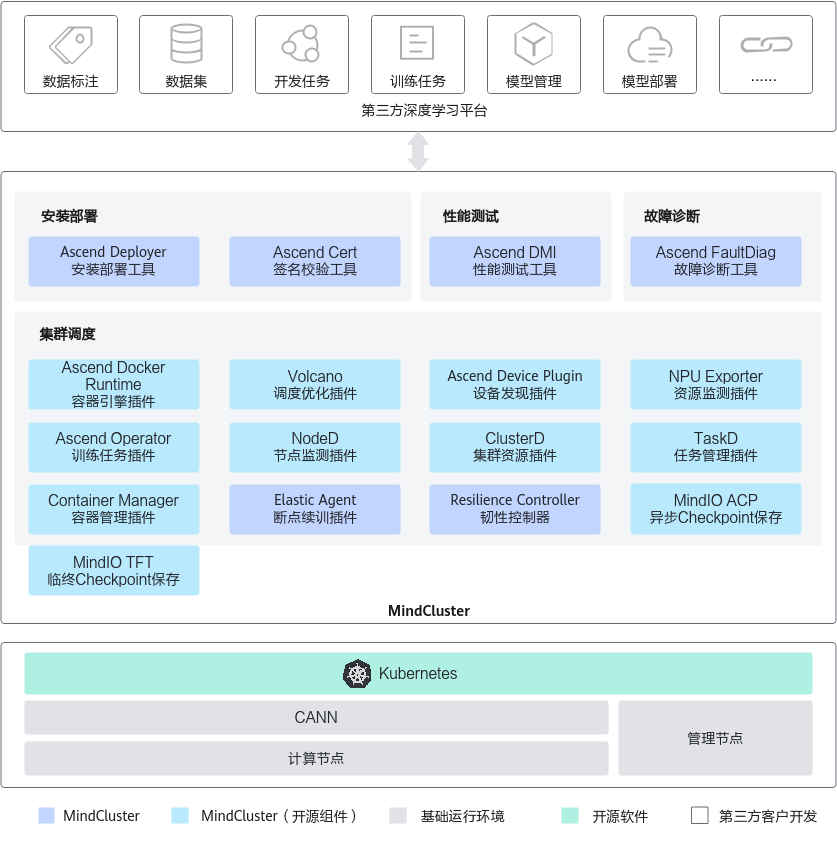

# MindCluster是什么

MindCluster（AI集群系统软件）是支持NPU（昇腾AI处理器）构建的深度学习系统组件，专为训练和推理任务提供集群级解决方案。深度学习平台开发厂商可以减少底层资源调度相关软件开发工作量，快速使能合作伙伴基于MindCluster开发深度学习平台。

**图 1** MindCluster堆栈图  

**MindCluster特性说明**

|关键特性|特性介绍|链接|
|--|--|--|
|安装部署|提供昇腾软件和其依赖软件的在线下载、安装和签名校验。|<a href="https://www.hiascend.com/document/detail/zh/mindcluster/730/deployer/deployerug/deployer_0001.html">安装部署</a>|
|性能测试|提供Atlas硬件产品兼容性检查、性能测试、故障诊断等功能。|<a href="https://www.hiascend.com/document/detail/zh/mindcluster/730/toolbox/toolboxug/toolboxug_0002.html">性能测试</a>|
|故障诊断|提供训练和推理任务的日志清洗和故障诊断功能，定位失败根因。|<a href="./faultdiag/introduction.md">故障诊断</a>|
|集群调度|提供NPU资源调度和管理、生成分布式训练集合通信配置、断点续训等功能。|<a href="./scheduling/introduction.md">集群调度</a>|

**MindCluster组件说明**

**表 1**  安装部署组件说明

|组件|功能介绍|
|--|--|
|MindCluster Ascend Deployer|提供昇腾软件和其依赖软件的自动下载及一键式安装，支持参数面网络配置等功能。|

**表 2**  ToolBox组件说明

|组件|功能介绍|
|--|--|
|Ascend DMI|提供Atlas硬件产品的兼容性检查、带宽测试、算力测试、功耗测试、诊断压测等功能。|
|Ascend Cert|提供软件包数字签名校验和更新CRL证书吊销列表等功能，保证软件包的安全性和CRL文件的有效性。|

**表 3**  故障诊断组件说明

|组件|功能介绍|
|--|--|
|MindCluster Ascend FaultDiag|提供日志清洗和故障诊断功能，提取训练及推理过程相关日志的关键信息，并根据集群所有节点清洗后的关键信息，分析故障根因节点以及故障事件。|

**表 4**  集群调度组件说明

|组件|功能介绍|
|--|--|
|Ascend Docker Runtime|为训推任务提供容器化支持，自动挂载所需文件和设备依赖。|
|Ascend Device Plugin|基于Kubernetes设备插件机制，提供昇腾AI处理器的设备发现、分配和健康状态上报功能，使能Kubernetes管理昇腾AI处理器资源。|
|NPU Exporter|实时监测昇腾AI处理器的资源指标，获取如昇腾AI处理器的利用率、温度、电压等信息。|
|Volcano|基于开源Volcano调度插件机制，增加昇腾AI处理器的亲和性调度、故障重调度等特性，最大化发挥昇腾AI处理器计算性能。|
|ClusterD|提供集群级别的可用资源信息。收集集群任务信息、资源信息和故障信息及影响范围，从任务、芯片和故障维度统计分析。|
|Ascend Operator|提供训练任务生命周期管理，为不同AI框架的分布式训练任务提供相应的环境变量、生成分布式训练任务依赖的集合通讯配置。|
|NodeD|提供节点状态上报功能，上报如节点健康状态、CPU和内存等故障信息。|
|Resilience Controller|提供弹性缩容训练服务。在训练任务使用的硬件发生故障时，剔除该硬件并继续训练。|
|Elastic Agent|提供训练任务故障时刻保存临终Checkpoint能力。|
|TaskD|提供昇腾设备上训练及推理任务的状态监测和状态控制能力。|
|MindIO ACP|在大模型训练中，使用训练服务器内存作为缓存，对Checkpoint的保存及加载进行加速。|
|MindIO TFT|提供TTP、UCE和ARF等功能。|
|Container Manager|提供无K8s场景下的业务容器恢复能力，主要用于一体机。|

