# 组件介绍

## Ascend Docker Runtime

**应用场景**

容器内使用昇腾AI处理器，需要挂载昇腾驱动相关的脚本和命令。这些脚本和命令分布在不同的文件中，且随着芯片的迭代可能发生变更。为了避免容器创建时冗长的文件挂载，MindCluster提供了Ascend Docker Runtime组件。通过输入需要挂载的昇腾AI处理器编号，即可完成昇腾AI处理器及相关驱动的文件挂载。

**表 2** 昇腾容器内依赖的文件示例

| 文件路径                           | 功能                      |
| ------------------------------ | ----------------------- |
| /dev/davinci*                  | NPU设备                   |
| /dev/vdavinci*                 | vNPU设备                  |
| /dev/davinci_manager           | 设备资源调度                  |
| /dev/devmm_svm、/dev/hisi_hdc   | 内存与通信控制                 |
| /usr/local/Ascend/driver/lib64 | 驱动交互接口                  |
| /usr/local/Ascend/driver/tools | 网络、升级工具                 |
| /usr/local/sbin/npu-smi        | 驱动交互命令                  |
| ...                            | 不同芯片迭代，还有一些其他的特有的设备或者文件 |

**组件功能**

- 提供极简的Docker或Containerd的昇腾容器化支持。
- 部分硬件形态支持输入vNPU信息，完成vNPU的自动创建和销毁。

**组件上下游依赖**
**图 1** Ascend Docker Runtime

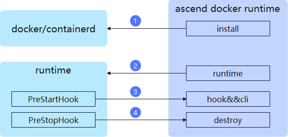

1. install模块：部署时，修改docker/containerd的配置文件，将容器运行时改为昇腾容器运行时。

2. runtime模块：修改容器配置文件，使能hook、destroy钩子函数。并做好vNPU切分，芯片设备文件解析等挂载前的准备工作。

3. hook&&cli：容器创建前被调用，负责整理芯片设备文件、驱动文件、用户自定义文件，并将其挂载到容器中。

4. destroy：容器销毁前被调用，负责销毁创建出来的vNPU。

## NPU Exporter

**应用场景**

在任务运行过程中，需要密切关注芯片的网络和算力使用情况，为任务的调优提供数据支持。MindCluster提供NPU Exporter组件，用于上报芯片的各项指标状态。

**组件功能**

- 从驱动中获取芯片、网络的各项数据信息，并支持Prometheus、Telegraf两种方式上报。
- 插件化管理，支持通过插件开发新的指标，支持针对不同类型的指标配置不同的采集周期。

**组件上下游依赖**

**图 2**  组件上下游依赖

1. 从驱动中获取芯片以及网络信息，并放入本地缓存。
2. 从K8s标准化接口CRI中获取容器信息，并放入本地缓存。
3. 实现Prometheus或者Telegraf的接口，供二者周期性获取缓存中的数据信息。

## Ascend Device Plugin

**应用场景**

考虑到复杂度，K8s只内置了CPU和内存的设备发现能力，其他资源类型通过设备插件机制维护。MindCluster提供Ascend Device Plugin服务，基于K8s的设备插件机制，上报昇腾芯片资源。

**组件功能**

- 通过实现设备插件的Register接口，上报昇腾芯片的资源名称。
- 通过实现设备插件的ListAndWatch接口，上报昇腾芯片的数量、编号及健康状态。
- 通过实现设备插件的Allocate接口，结合Ascend Docker Runtime完成昇腾芯片挂载到容器中的操作。
- 支持主动运维。在感知到芯片故障后，将芯片从业务态变更为运维态，执行芯片复位修复芯片。

**组件上下游依赖**

**图 3**  组件上下游依赖
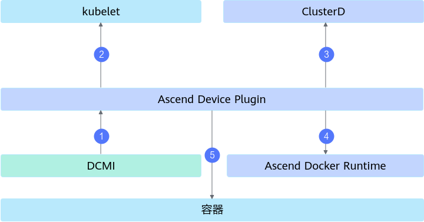

1. 从DCMI中获取芯片的类型、数量、健康状态信息，或者下发芯片复位命令。
2. 上报芯片的类型、数量和状态给kubelet。
3. 上报芯片的类型、数量和具体故障信息给ClusterD。
4. 将调度器选中的芯片信息，以环境变量的方式告知给Ascend Docker Runtime。
5. 将任务配置映射到容器中，方便容器内的业务使用。

## Volcano

**应用场景**

任务运行过程中，主要时间花费在了计算和通信上，相同数量的芯片，提供的算力是一样的，但是因为通信网络的不一致，最终的任务效率完全不一致。MindCluster提供Volcano服务，针对不同的网络拓扑提供最优的调度方案。

**组件功能**

- 感知集群可用芯片信息，基于网络、资源碎片两方面的考虑，选择最优资源调度。
- 调度后，任务运行过程中出现了芯片故障，重新选择健康芯片恢复任务。

**组件上下游依赖**

**图 4**  组件上下游依赖
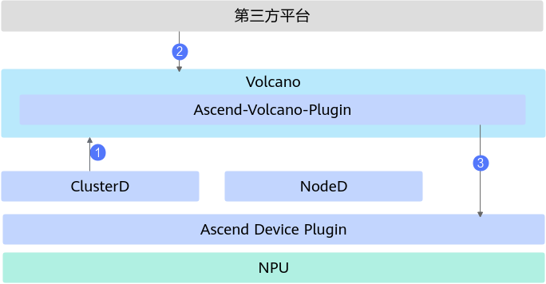

1. 从K8s的Node对象上获取芯片总数，从Pod对象上获取已使用芯片信息，从ClusterD中获取故障芯片信息，三者结合得到集群可用芯片信息。
2. 接收任务配置，根据集群资源信息，选择最优资源调度。
3. 向Ascend Device Plugin或者Ascend Docker Runtime传递具体的资源选中信息，完成设备挂载。

## ClusterD

**应用场景**

集群中多个故障间往往存在关联性，需要集群视角的故障监控，才能更准确的分辨故障的根因。 MindCluster提供了ClusterD服务，
汇聚集群资源信息，提供更准确的故障感知和更快速的故障恢复能力。

**组件功能**

- 汇总集群的昇腾任务、昇腾资源信息，提供查询接口供运维系统使用。
- 根据集群中的任务及故障信息，判断任务是否进行训练、推理的高阶恢复操作，并作为集群大脑协调恢复过程。

**组件上下游依赖**

**图 5**  组件上下游依赖
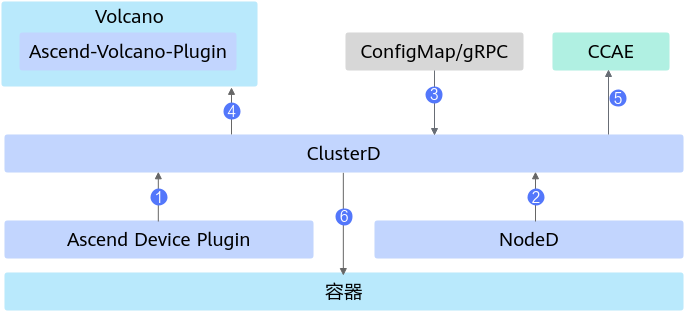

1. 从各个计算节点的Ascend Device Plugin中获取芯片的信息。
2. 从各个计算节点的NodeD中获取计算节点的CPU、内存、硬盘的健康状态，以及节点共享存储故障、灵衢慢网络故障信息。
3. 从ConfigMap或gRPC获取公共故障信息。
4. 汇总整个集群的资源信息，上报给Volcano。
5. 将集群的任务信息，将任务状态、资源使用情况等信息上报给CCAE等运维系统。
6. 与容器内的训练推理业务交互，协调高阶恢复过程。

## Ascend Operator

**应用场景**

分布式任务需要多个节点的芯片相互通信才能完成，因此需要一些参数，让芯片知道如何与其他芯片通信。这些参数在PyTorch和MindSpore中名称不一致，大规模任务场景下无法自己维护。MindCluster提供Ascend Operator组件，根据AI框架类型自动填充所需的集合通信参数。

| 参数解释          | PyTorch          | MindSpore       |
| ------------- | ---------------- | --------------- |
| Master容器IP地址  | MASTER_ADDR      | MS_SCHED_HOST   |
| Master容器端口号   | MASTER_PORT      | MS_SCHED_PORT   |
| 任务总NPU数       | WORLD_SIZE       | MS_WORKER_NUM   |
| 本容器的NPU数      | LOCAL_WORLD_SIZE | MS_LOCAL_WORKER |
| 本容器的Node Rank | RANK             | MS_NODE_RANK    |

**组件功能**

- 基于K8s的CRD机制，维护昇腾任务资源类型acjob，根据acjob的配置创建Pod。
- 根据任务配置，通过环境变量或者文件，向容器内注入参数。

**组件上下游依赖**

**图 6**  组件上下游依赖
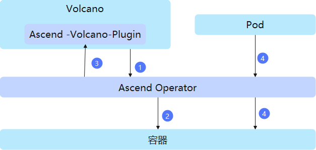

1. 通过Volcano感知当前任务所需资源是否满足。
2. 资源满足后，针对任务创建对应的Pod并注入集合通信参数的环境变量。
3. Pod创建完成后，Volcano进行资源的最终选定。
4. 通过文件的方式挂载集合通信参数（可选）。从每个Pod上获取该Pod使用的芯片编号、IP、RankId信息，汇总后生成集合通信文件并挂载到容器内。

## NodeD

**应用场景**

任务要想在节点上稳定的运行，除了保证NPU的健康以外，节点的CPU、内存或硬盘的健康也需要保证。MindCluster提供了NodeD组件，用于节点的异常检测及上报。

**组件功能**

- 从IPMI中获取节点异常，并上报给上层服务。
- 从DPC、DTFS中获取共享存储异常，并上报给上层服务。

**组件上下游依赖**

**图 7**  组件上下游依赖
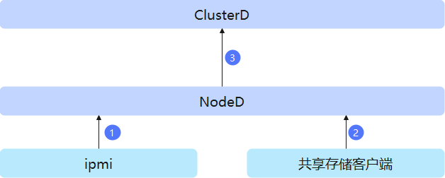

1. 从IPMI中获取计算节点的CPU、内存、硬盘的故障信息。
2. 从共享存储客户端中获取共享存储异常信息。
3. 将异常信息上报给ClusterD。

## Resilience Controller

>[!NOTE]
>Resilience Controller组件已经日落，相关内容将于2026年9月30日的版本删除。最新的弹性训练能力请参见[弹性训练](../04_usage/resumable_training/01_solutions_principles.md#弹性训练)。

**组件应用场景**

训练任务遇到故障，且无充足的健康资源替换故障资源时，可使用动态缩容的方式保证训练任务继续进行，待资源充足后，再通过动态扩容的方式恢复训练任务。集群调度提供了Resilience Controller组件，用于训练任务过程中的动态扩缩容。

**组件功能**

提供弹性缩容训练服务。在训练任务使用的硬件发生故障时，剔除该硬件并继续训练。

**组件上下游依赖**

Resilience Controller组件属于Kubernetes插件，需要安装到K8s集群中。Resilience Controller仅支持VolcanoJob类型的任务，需要集群中同时安装Volcano。Resilience Controller运行过程中仅与K8s交互，相关交互如下图所示。

**图 8** Resilience Controller组件上下游依赖
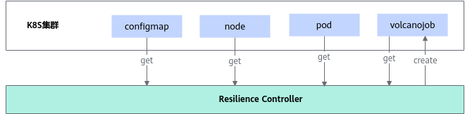

- MindCluster集群调度组件通过K8s将NPU设备、节点状态以及调度配置等信息写入ConfigMap中。
- Resilience Controller读取mindx-dl命名空间下，name前缀为"mindx-dl-nodeinfo-"ConfigMap中的“**NodeInfo**”字段，获取节点心跳情况。
- Resilience Controller读取kube-system命名空间下，name前缀为"mindx-dl-deviceinfo-"的ConfigMap，读取其中“**DeviceInfoCfg**”字段，获取NPU设备健康状态。
- Resilience Controller读取volcano-system命名空间下，名为volcano-scheduler的ConfigMap，读取其中“**grace-over-time**”字段，获取重调度pod优雅删除超时配置。
- Resilience Controller获取集群中所有vcjob对应的pod，读取“**huawei.com/AscendReal**”获取pod实际使用的NPU列表。
- Resilience Controller读取Volcano Job，获取“**fault-scheduling**”、“**elastic-scheduling**”、“**minReplicas**”、“**phase**”等字段，确定该Volcano Job是否可以进行弹性训练。
- 当设备和节点发生故障时，Resilience Controller根据原有Volcano Job的副本数和集群资源情况，创建NPU需求减半的Volcano Job。

## Elastic Agent

>[!NOTE]
>Elastic Agent组件已经日落，相关内容将于2026年12月30日的版本删除。后续进程级恢复能力将使用TaskD组件承载。

**组件应用场景**

因大模型训练任务过程中容易出现各种软硬件故障，导致训练任务受到影响，MindCluster集群调度组件提供了部署在计算节点的Elastic Agent的二进制包，用于提供昇腾设备上训练任务的管理功能。

**组件功能**

- 针对PyTorch框架提供适配昇腾设备的进程管理功能，在出现软硬件故障时，完成训练进程的停止或重启。
- 负责对接K8s集群中的集群控制中心，根据集群控制中心完成训练管理。

**组件上下游依赖**

**图 9**  组件上下游依赖
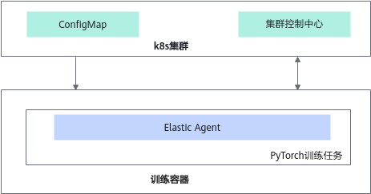

- MindCluster集群调度组件通过K8s将设备和训练任务状态等信息写入ConfigMap中，并映射到容器内，ConfigMap名称为[reset-config-任务名称](../06_api/volcano.md#任务信息)。
- Elastic Agent通过ConfigMap获取当前训练容器所使用的设备状况和训练任务状态等信息。
- Elastic Agent对接K8s集群控制中心，根据集群控制中心完成训练管理。

## TaskD

**组件应用场景**

大模型训练及推理任务在业务执行中会出现故障、性能劣化等问题，导致任务受影响。MindCluster集群调度的TaskD组件提供昇腾设备上训练及推理任务的状态监测和状态控制能力。

**组件功能**

- **业务流一场景下各组件的功能说明如下。**
    - PyTorch、MindSpore框架提供适配昇腾设备的进程管理功能，在出现软硬件故障时，完成训练进程的停止与重启。

    - 负责对接K8s的集群控制中心，根据集群控制中心完成训练管理，管理训练任务的状态。

- **业务流二场景下各组件的功能说明如下。**
    - 提供训练数据的轻量级profiling能力，根据集群控制中心控制完成profiling数据采集。
    - 提供借轨回切、在线压测能力。

**组件上下游依赖**

- **业务流一场景下组件的上下游依赖说明如下。**

    - MindCluster集群调度组件通过K8s将设备和训练状态等信息写入ConfigMap中，并映射到容器内，ConfigMap名称为[reset-config-<任务名称\>](../06_api/ascend_device_plugin.md#任务信息)。
    - MindCluster集群调度组件通过K8s将训练状态检测指令写入ConfigMap中，并映射到容器内。
    - TaskD  Manager通过ConfigMap获取当前训练容器所使用的设备状况和训练任务状态等信息。
    - TaskD  Manager对接K8s集群控制中心，根据集群控制中心完成训练管理。

    **图 10**  组件上下游依赖\_业务流**一**
    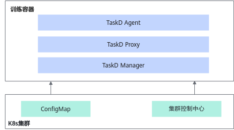

- **业务流二场景下组件的上下游依赖说明如下。**

    - TaskD  Worker通过ConfigMap获取当前任务的训练检测功能开启指令。
    - TaskD  Manager通过gRPC获取当前任务的训练检测功能开启指令。

    **图 11**  组件上下游依赖\_业务流二
    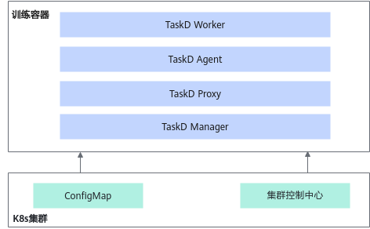

## MindIO ACP

**组件应用场景**

Checkpoint是模型中断训练后恢复的关键点，Checkpoint的密集程度、保存和恢复的性能较为关键，它可以提高训练系统的有效吞吐率。MindIO ACP针对Checkpoint的加速方案，支持昇腾产品在LLM模型领域扩展市场空间。

**组件功能**

在大模型训练中，使用训练服务器内存作为缓存，对Checkpoint的保存及加载进行加速。

**组件上下游依赖**

**图 12** MindIO ACP
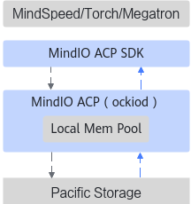

## MindIO TFT

**组件应用场景**

LLM训练中，每次保存Checkpoint数据，加载数据重新迭代训练，保存和加载周期Checkpoint，都需要比较长的时间。在故障发生后，MindIO TFT特性，立即生成一次Checkpoint数据，恢复时也能立即恢复到故障前一刻的状态，减少迭代损失。MindIO UCE和MindIO ARF针对不同的故障类型，完成在线修复或仅故障节点重启级别的在线修复，节约集群停止重启时间。

**组件功能**

MindIO TFT包括临终Checkpoint保存、进程级在线恢复和优雅容错等功能，分别对应：

- MindIO TTP主要是在大模型训练过程中发生故障后，校验中间状态数据的完整性和一致性，生成一次临终Checkpoint数据，恢复训练时能够通过该Checkpoint数据恢复，减少故障造成的训练迭代损失。
- MindIO UCE主要针对大模型训练过程中片上内存的UCE故障检测，并完成在线修复，达到Step级重计算。
- MindIO ARF主要针对训练发生异常后，不用重新拉起整个集群，只需以节点为单位进行重启或替换，完成修复并继续训练。

**组件上下游依赖**

**图 13** MindIO TFT

## Container Manager

**应用场景**

在无K8s的场景下，推理或者训练进程异常后，无法通过Volcano和Ascend Device Plugin停止并重新调度业务容器、隔离故障节点、复位NPU芯片。MindCluster提供了Container Manager组件，用于无K8s场景下的容器管理和芯片复位功能。

**组件功能**

- 从驱动中订阅芯片故障信息，同时将芯片状态和具体故障信息存入缓存，用于后续的容器管理和芯片复位功能。
- 若故障芯片当前正在被容器使用，根据用户的启动配置，对占用故障芯片的容器执行停止操作，在故障芯片复位成功后，重新将容器拉起。
- 若故障芯片处于空闲状态，且重启后可恢复，对芯片执行热复位。

**组件上下游依赖**

**图 14**  组件上下游依赖
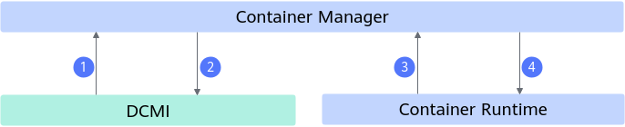

1. 从DCMI中获取芯片的类型、数量、健康状态信息。
2. 向DCMI下发芯片复位命令。
3. 从容器运行时Docker或者Containerd中获取当前运行中的容器和芯片挂载信息。
4. 向容器运行时下发容器停止、启动命令。

## Infer Operator

**应用场景**

MindCluster提供Infer Operator组件，根据推理服务的实例配置，批量拉起推理实例。

**组件功能**

- 一次请求，创建一个任务组，包含多个推理服务Service，每个服务包含多个不同角色的实例Workload。
- 支持推理实例的扩缩容。

**组件上下游依赖**

**图 15**  组件上下游依赖
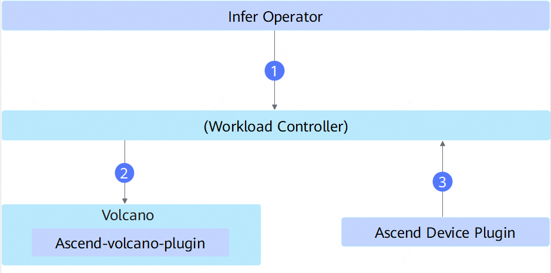

1. 基于用户配置的任务YAML创建推理实例Workload。
2. Workload Controller创建Pod后，Volcano进行资源的最终选定。
3. 若Workload申请占用NPU卡，Ascend Device Plugin获取NPU信息，完成设备的挂载。

## K8s RDMA Shared Dev Plugin

**应用场景**

Kubernetes需要感知RDMA网络设备资源信息来实现资源调度。为了让容器能够使用RDMA网络进行高速数据传输，需要通过设备插件机制将RDMA设备资源注册给Kubernetes。MindCluster提供了部署在计算节点的K8s RDMA Shared Dev Plugin组件，用于管理和共享RDMA设备资源。

**组件功能**

- 从系统中发现RDMA设备，包括PCI和UB两种类型的RDMA设备。
- 支持通过配置文件选择特定的RDMA设备，可配置vendors、deviceIDs、drivers、buses等选择器，其中buses选择器用于指定设备总线类型（如UB总线）。
- 将RDMA设备资源信息上报给kubelet，供Kubernetes调度使用。
- 支持RDMA设备的热插拔和动态更新。
- 支持CDI（Container Device Interface）模式，但**UB类型的RDMA设备不支持CDI模式**，当检测到UB设备时会自动禁用CDI。
- 可配置日志级别、日志备份数量、日志保留天数等日志参数。

**组件上下游依赖**

**图 16**  组件上下游依赖
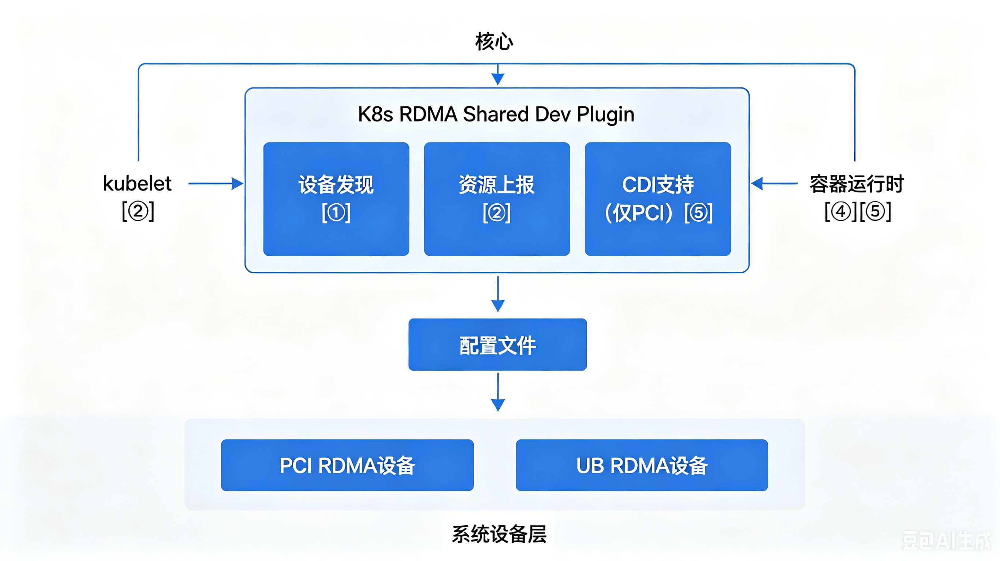

1. 从系统中获取RDMA设备的类型、数量、健康状态信息，区分PCI和UB两种设备类型。
2. 上报RDMA设备的类型、数量和状态给kubelet。
3. 根据配置文件中的选择器信息，筛选需要注册的RDMA设备，支持通过buses选择器指定UB设备。
4. 在容器创建时，将选中的RDMA设备挂载到容器内部。
