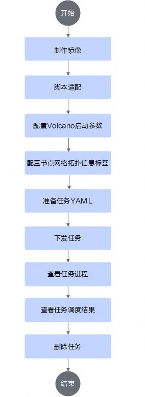
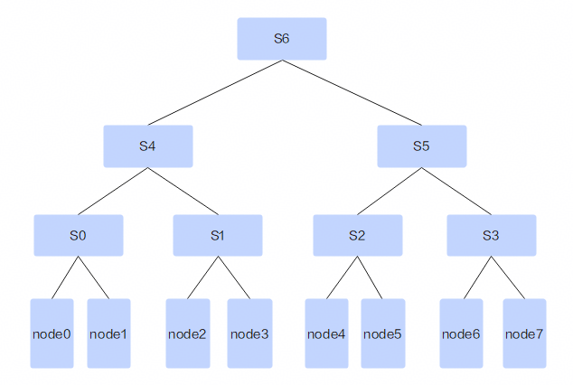

# 多级调度<a name="ZH-CN_TOPIC_000000987564duoji"></a>

## 使用前必读<a name="ZH-CN_TOPIC_0000002511987564duoji"></a>

**前提条件<a name="section52051339787duoji"></a>**

在命令行场景下使用多级调度特性前，需要确保已经安装如下组件，若没有安装，可以参考[安装部署](../../03_installation_guide/02_installation/00_helm_installation.md)章节进行操作。多级调度特性仅支持使用Volcano作为调度器，不支持使用其他调度器。

- Volcano
- Ascend Device Plugin
- Ascend Docker Runtime
- Ascend Operator（使用AscendJob必须安装）
- ClusterD
- NodeD
- Infer Operator（使用InferServiceSet任务必须安装）

**使用方式<a name="section179431435174811duoji"></a>**

- 通过命令行使用：安装集群调度组件，通过命令行使用多级调度特性。
- 集成后使用：将集群调度组件集成到已有的第三方AI平台或者基于集群调度组件开发的AI平台。

**使用说明<a name="section577625973520duoji"></a>**

多级调度特性仅支持下发任务Pod副本配置满节点NPU资源的分布式任务，不支持非满节点NPU资源的分布式任务。

**支持的产品形态<a name="section169961844182917duoji"></a>**

- Atlas 900 A3 SuperPoD 超节点
- Atlas 9000 A3 SuperPoD 集群算力系统

**使用流程**

通过命令行使用多级调度特性流程可以参见[图1](#fig2425249866601duoji)。

**图 1**  使用流程<a name="fig2425249866601duoji"></a>



## 实现原理<a name="ZH-CN_TOPIC_0000002479387150duoji"></a>

多级调度是ascend-for-volcano插件中的一种高级调度策略，专为具有复杂网络拓扑的NPU集群设计。它通过创新的资源树结构和智能调度算法，将集群资源抽象为多层级结构，为NPU集群提供高效、灵活、可靠的调度能力。该功能特别适合大规模分布式训练任务，可以根据实际的网络层级亲和性调度任务，提高集群资源利用率。

**核心概念**

- 资源树：是多级调度的基础，它将集群资源按照物理或逻辑层次进行组织。

  - 树根：代表整个集群同属于同一套拓扑网络的资源，同一个多级调度任务只能调度到单个拓扑网络中。
  - 中间节点：代表不同层级的资源聚合（如机架、交换机等）。
  - 叶子节点：代表具体的计算资源（服务器）。

  资源树中的网络层级可以参考Volcano的[网络拓扑感知调度](https://volcano.sh/docs/keyfeatures/networktopologyaware/)特性中的HyperNode定义。

  **图 2**  资源树样例<a name="fig69396965487duoji"></a>

  

  - 第一层交换机S0-S3直接连接到工作节点。
  - 第二层交换机S4连接到S0和S1交换机，S5连接到S2和S3交换机。
  - 第三层交换机S6连接到S4和S5交换机。

  在上述样例结构中：

  - node0和node1同属于S0，通信效率最高。
  - node0和node2通信需要通过第二层交换机，通信效率较低。
  - node0和node4通信需要通过第三层交换机，通信效率最低。

  实际的硬件组网方式可以映射为样例中一棵或者多棵树型结构，用于后续任务调度。多级调度场景下的资源树配置详细请参见[配置Volcano启动参数](#配置volcano启动参数)。

- 任务树：表示作业的多级资源需求。

  - 每一层对应资源树的一个层级。
  - 每一层的大小表示该层级需要的资源节点数量。
  - 任务树反映了作业的分布式拓扑需求。

- 调度树：在资源树上构建的临时结构，用于执行调度算法。

  - 包含资源节点的可分配性、碎片分数等调度信息。
  - 支持资源预留和碎片优化。
  - 调度树是调度算法的主要操作对象。

**调度流程**

- 作业验证阶段

  在调度开始前，系统会对作业进行验证：

  1. 检查NPU资源需求：确保分布式作业请求完整的节点NPU资源。
  2. 验证多级配置：解析并验证作业的层级配置是否有效。

- 资源树构建阶段

  1. 收集健康节点：过滤出可用的NPU节点。
  2. 构建资源树：根据节点的拓扑标签构建多层级资源树。

- 调度执行阶段

  1. 创建调度树：在资源树的基础上创建调度树，添加调度相关属性。
  2. 初始化节点：计算每个节点的可分配任务数和碎片分数。
  3. 执行调度算法：

     - 优先使用非保留资源进行调度，若调度失败，则尝试使用保留资源进行调度。
     - 选择碎片分数最低的调度方案。

  具体配置方法与调度效果参见[配置示例](#配置示例)。

## 通过命令行使用（Volcano）<a name="ZH-CN_TOPIC_0000002479227158duoji"></a>

>[!NOTE]
>
>多级调度特性是基于整卡调度配置的。

### 制作镜像<a name="ZH-CN_TOPIC_0000002479227164duoji"></a>

详细请参见整卡调度中的[制作镜像](./03_full_npu_scheduling.md#制作镜像)。

### 脚本适配<a name="ZH-CN_TOPIC_0000002511347097duoji"></a>

详细请参见整卡调度中的[脚本适配](./03_full_npu_scheduling.md#脚本适配)。

### 配置Volcano启动参数<a name="ZH-CN_TOPIC_000000251196358duoji"></a>

在“volcano-v<i>\{version\}</i>.yaml”中，根据网络集群的实际拓扑结构配置Volcano启动参数。

```yaml
...
data:
  volcano-scheduler.conf: |
...
    configurations:
      - name: init-params
        arguments: {"grace-over-time":"900","presetVirtualDevice":"true","nslb-version":"1.0","shared-tor-num":"2","useClusterInfoManager":"false","self-maintain-available-card":"true","super-pod-size": "128","reserve-nodes": "2","forceEnqueue":"true","resource-level-config": '{"default":  {"level1": {"label": "huawei.com/topotree.superpodid", "reservedNode": 1}, "level2": {"label": "huawei.com/topotree.groupid"}}}'}
...
```

上述样例表示当前配置了网络树default，网络level1层级对应的节点标签为“huawei.com/topotree.superpodid”，每个level1节点组中预留的节点数量为1，网络level2层级对应的节点标签为“huawei.com/topotree.groupid”。Volcano通过节点标签获取集群中节点的网络拓扑信息。

>[!NOTE]
>
>若在Volcano启动之后再修改以上配置，需要重新执行kubectl apply volcano-v<i>\{version\}</i>.yaml命令，并且重启Volcano组件的Pod，配置才会生效。

### 配置节点网络拓扑信息标签<a name="ZH-CN_TOPIC_00000025666duoji"></a>

节点标签用于标识节点网络层级，需要用户根据集群中实际的网络拓扑进行配置，
Ascend Device Plugin组件会通过昇腾硬件驱动自动获取有效的节点对应的超节点ID，并在Ascend Device Plugin启动之后添加到“huawei.com/topotree.superpodid”标签中。

用户可以通过以下方式为节点添加标签：

- [手动添加节点标签](#手动添加节点标签)
- [通过脚本添加节点标签](#通过脚本添加节点标签)

节点上需要的标签的key和value如下：

- 以“huawei.com/topotree”作为节点标签的key，以Volcano Scheduler启动参数配置中的网络拓扑树的名称作为value，昇腾Volcano插件会在任务调度时将拥有相同“huawei.com/topotree”标签value的节点划分为同一个拓扑树，如果节点上没有配置“huawei.com/topotree”标签，Volcano调度时会默认认为该节点属于default拓扑树。
- Volcano Scheduler拓扑结构启动参数配置中配置的网络层级定义中的label字段的值作为key，节点在物理网络层级中的ID作为value，value值需要在集群中唯一。

#### 手动添加节点标签

在集群中通过kubectl命令或者K8s API向集群节点添加标签，具体方法可以参考[K8s社区文档](https://kubernetes.io/zh-cn/docs/concepts/overview/working-with-objects/labels/)。

#### 通过脚本添加节点标签

手动通过kubectl命令的方式添加节点标签效率较低，且容易出现错误。为此，MindCluster提供了自动化部署脚本方式添加节点标签，替代繁琐的手动操作。用户只需提供基本的标签配置信息，脚本即可自动通过kubectl命令完成添加或者删除节点标签的操作。

**前提条件**

- 环境已经安装Python。
- 存在KubeConfig文件和kubectl二进制工具，kubectl工具可以与K8s集群正常通信。
- csv格式配置文件已经准备完成。

**操作步骤**

1. 从MindCluster-Samples仓库获取源码，进入“multilevel-label-tool”目录。

    ```shell
    git clone https://gitcode.com/Ascend/mindcluster-deploy.git && cd mindcluster-deploy/multilevel-label-tool
    ```

2. （可选）创建并激活Python虚拟环境。该操作可以使得不同Python项目使用不同版本的库而互不干扰。

    ```shell
    python -m venv venv && source venv/bin/activate
    ```

    根据环境实际情况使用Python或Python3。

3. 安装依赖。

    ```shell
    pip install -r requirements.txt
    ```

4. 准备网络配置文件。

   配置文件的格式为csv，第一行表头依次为nodeName，节点标签key。后续每一行的数据为集群中的节点名称，节点标签value。样例如下：

    ```csv
    nodeName,huawei.com/topotree,huawei.com/topotree.groupid
    node0,default,0
    node1,default,0
    ...
    node192,default,1
    node193,default,1
    ...
    ```

    Atlas 9000 A3 SuperPoD 集群算力系统可以通过脚本配合xlsx格式的LLD文档生成网络配置csv文件，命令如下：

    ```shell
    python3 lld_parser.py --input {LLD文档路径}  --output {生成的csv配置文件路径} --topotree-name default
    ```

    若显示如下信息，说明配置文件生成成功。

    ```ColdFusion
    ...
    CSV file successfully generated: {生成的csv配置文件名称}
    ...
    ```

5. 执行脚本添加节点标签。

    ```shell
    python3 label-tool.py apply --config-path {csv配置文件路径}
    ```

    若显示如下信息，说明节点标签添加成功。

    ```ColdFusion
    Adding labels completed successfully!
    ```

>[!NOTE]
>其他详细说明可以通过执行各个脚本的-h参数或者通过multilevel-label-tool目录下的README获取。

### 配置示例<a name="section1674351750duoji"></a>

多级调度需要在集群侧和任务侧分别配置level信息：集群侧通过节点标签描述网络层级（谁和谁离得近），任务侧通过注解声明Pod的层级需求（哪些Pod需要放得近），调度器负责将两者匹配。本节以8节点集群、四机训练任务（总副本数为4，每个Pod申请8个NPU）为例，分三步说明从配置到调度结果的全过程。

**第1步：配置集群侧网络层级（节点标签与Volcano启动参数）**

集群包含8个节点，划分为2个超节点层级（superpodid 0和superpodid 1），所有节点同属一个groupid（groupid 0）。假设节点标签如下：

|节点|huawei.com/topotree|huawei.com/topotree.superpodid|huawei.com/topotree.groupid|
|--|--|--|--|
|node0~node3|default|0|0|
|node4~node7|default|1|0|

node0~node3同属superpodid 0，节点间通过第一层交换机直接互联，通信效率最高；node4~node7同属superpodid 1；两组节点间通信需经过上层交换机，通信效率较低。

在“volcano-v<i>\{version\}</i>.yaml”中通过resource-level-config参数定义每一层网络对应的节点标签：

```yaml
...
data:
  volcano-scheduler.conf: |
...
    configurations:
      - name: init-params
        arguments: {"resource-level-config": '{"default":  {"level1": {"label": "huawei.com/topotree.superpodid", "reservedNode": 1}, "level2": {"label": "huawei.com/topotree.groupid"}}}'}
...
```

- level1：离节点最近的网络层级，使用superpodid标签划分节点组。每个level1节点组中预留1个节点（reservedNode: 1），即node3和node7为保留节点，仅在其他资源不足时参与调度。
- level2：更高一层的网络聚合，使用groupid标签划分节点组。

>[!NOTE]
>
>level的数量应与集群实际组网深度一致，可以定义level1、level2、level3等多层，层级必须从level1开始连续。本例组网为两层，因此只配置两级。

**第2步：配置任务侧层级需求（任务YAML注解）**

四机任务（总副本数为4）的YAML注解配置如下：

```yaml
annotations:
  huawei.com/schedule_policy: multilevel       # 配置调度策略为多级调度策略
  huawei.com/affinity-config: level1=2,level2=4 # 按照任务实际需求配置不同层级的网络组大小
```

完整的任务YAML配置请参见[pytorch_multinodes_acjob_super_pod_multilevel.yaml](https://gitcode.com/Ascend/mindcluster-deploy/tree/master/samples/train/basic-training/multilevel/pytorch_multinodes_acjob_super_pod_multilevel.yaml)。

affinity-config中，level后的数字表示网络层级序号，等号后的数字表示在该层级网络内每几个Pod分为一组。本例中：

- level1=2：每2个Pod为一个紧密小组，小组内的Pod必须落在同一个superpodid下。
- level2=4：4个Pod为一个大组，组内的Pod必须落在同一个groupid下。

上述注解展开后的任务树如下，任务树描述的是作业的通信结构：同level1组的Pod通信最频繁，必须通过第一层交换机直连；跨level1组但同level2组的Pod通信次之，允许经过上层交换机。

```text
任务树（任务要什么）
root（4个Pod）
└── level2组（4个Pod，要求同groupid）
    ├── level1组A（2个Pod，要求同superpodid）→ Pod 1, Pod 2
    └── level1组B（2个Pod，要求同superpodid）→ Pod 3, Pod 4
```

另外，每个Pod申请的NPU资源需要与节点最大NPU数量一致（本例中为“huawei.com/Ascend910: 8”）。

**第3步：调度器匹配任务树与资源树（调度结果）**

调度器收集健康节点构建资源树，并在其上附加调度属性（可分配任务数、保留标记、碎片分数）形成调度树，调度树是调度算法的操作对象：

```text
资源树（集群有什么）
root（default拓扑树，groupid=0，共8个节点）
├── superpodid=0（level1节点组，4个节点）
│   ├── node0（8 NPU，空闲）
│   ├── node1（8 NPU，空闲）
│   ├── node2（8 NPU，空闲）
│   └── node3（8 NPU，空闲，保留节点）
└── superpodid=1（level1节点组，4个节点）
    ├── node4（8 NPU，空闲）
    ├── node5（8 NPU，空闲）
    ├── node6（8 NPU，空闲）
    └── node7（8 NPU，空闲，保留节点）
```

调度器遍历调度树，找到能让任务树完整贴合的放置方案。本例任务树要求“4个Pod同属groupid 0，且每2个Pod同属一个superpodid”，满足约束的候选方案如下：

|候选方案|Pod 1、Pod 2落点|Pod 3、Pod 4落点|
|--|--|--|
|方案1|node0、node1（superpodid 0）|node4、node5（superpodid 1）|
|方案2|node0、node1（superpodid 0）|node4、node6（superpodid 1）|
|方案3|node0、node2（superpodid 0）|node5、node6（superpodid 1）|
|...|...|...|

各候选方案调度后superpodid 0和superpodid 1均剩余2个空闲节点，碎片分数（衡量剩余资源零散程度）相同，调度器按节点优先级选择，最终Pod 1、Pod 2调度到node0、node1，Pod 3、Pod 4调度到node4、node5。

若集群已被其他任务部分占用（如node1、node2已被占满），superpodid 0中空闲的非保留节点仅剩node0，无法单独容纳一个level1组（需要2个节点），因此一个level1组只能使用node0和保留节点node3完成调度；另一个level1组优先使用非保留节点node4和node5。只有当空闲的非保留节点数量不足时，调度器才会将保留节点纳入调度。

若将注解修改为“level1=4,level2=4”，则任务树要求4个Pod同属一个superpodid，调度结果变为node0~node3，Pod间均通过第一层交换机直连，通信效率最高。用户可以根据任务对规模和通信性能的诉求，选择合适的层级配置。

**配置校验失败示例**

若任务总副本数为4，但配置“level1=1,level2=3”，由于任务总副本数量必须是所有层级值的整数倍（4不是3的整数倍），作业验证阶段会校验失败，调度器将拒绝该任务。用户可以根据调度器日志中的校验失败提示，检查affinity-config的层级配置是否满足以下要求：

- 任务层级大于1层时，层级n的值必须是n-1的整数倍。
- 任务总副本数量必须是所有层级的整数倍。
- 任务层级配置必须从level1开始，从小到大连续。

### 准备任务YAML<a name="ZH-CN_TOPIC_000000296583duoji"></a>

#### 选择YAML示例<a name="ZH-CN_TOPIC_0000002479duoji"></a>

多级调度任务是在整卡调度方式的基础上进行额外配置，通过以下YAML示例进行说明。

**表 1** YAML示例

<a name="table57051049102614duoji"></a>
<table><thead align="left"><tr><th class="cellrowborder" valign="top" width="8.799999999999999%" id="mcps1.2.7.1.1"><p>任务类型</p>
</th>
<th class="cellrowborder" valign="top" width="11.65%" id="mcps1.2.7.1.3"><p>训练框架</p>
</th>
<th class="cellrowborder" valign="top" width="39.269999999999996%" id="mcps1.2.7.1.4"><p>YAML文件名称</p>
</th>
<th class="cellrowborder" valign="top" width="10.280000000000001%" id="mcps1.2.7.1.5"><p>说明</p>
</th>
<th class="cellrowborder" valign="top" width="15%" id="mcps1.2.7.1.6"><p>获取链接</p>
</th>
</tr>
</thead>
<tbody><tr id="row570610499268"><td class="cellrowborder" rowspan="2" valign="top" width="8.799999999999999%" headers="mcps1.2.7.1.1 "><p>Ascend Job</p>
</td>
<td class="cellrowborder" valign="top" headers="mcps1.2.7.1.1 "><p><span>PyTorch</span></p>
</td>
<td class="cellrowborder" valign="top" headers="mcps1.2.7.1.2 "><p>pytorch_multinodes_acjob_super_pod.yaml</p>
</td>
<td class="cellrowborder" rowspan="2" valign="top" width="10.280000000000001%" headers="mcps1.2.7.1.5 "><p id="p3707749162616"><a name="p3707749162616"></a><a name="p3707749162616"></a>示例默认为双机任务。</p>
</td>
<td class="cellrowborder" rowspan="2" valign="top" width="15%" headers="mcps1.2.7.1.6 "><p><a href="https://gitcode.com/Ascend/mindcluster-deploy/tree/branch_v26.1.0/samples/train/basic-training/without-ranktable
">获取YAML</a></p>
</td>
</tr>
<tr id="row7707164912262"><td class="cellrowborder" valign="top" headers="mcps1.2.7.1.1 "><p><span>MindSpore</span></p>
</td>
<td class="cellrowborder" valign="top" headers="mcps1.2.7.1.2 "><p>mindspore_multinodes_acjob_super_pod.yaml</p>
</td>
</tr>
</tbody>
</table>

#### YAML参数说明<a name="ZH-CN_TOPIC_000000251196386duoji"></a>

本章节仅提供多级调度需要使用的YAML参数，详细的任务YAML参数说明请参见[acjob任务yaml参数说明](../../06_api/15_yaml_configuration.md#acjob)。

**表 2**  YAML参数说明

<a name="table159746356276duoji"></a>

|参数|取值|说明|
|--|--|--|
|huawei.com/schedule_policy|multilevel|多级调度任务需要指定该唯一调度策略。|
|huawei.com/affinity-config|<p>level1=x,level2=y,...</p><p>其中x,y...为对应的网络层级子任务大小。</p>|<p>配置任务的多级调度的亲和性层级。取值含义及调度效果参见[配置示例](#配置示例)。</p><p>要求满足格式为leveli=ni样式的字符串的拼接，中间使用英文逗号分隔。其中，i为网络层级序号，ni为该网络层级子任务的副本数量。例如，对于总副本数量为8的任务“level1=2,level2=4”，表示任务Pod中每2个Pod分配到有相同level1标签的节点上，每4个Pod分配到有相同level2标签的节点上。</p><p>网络层级配置需要满足以下要求：<ul><li>任务层级大于1层时，层级n的值必须是n-1的整数倍。</li><li>任务总副本数量必须是所有层级的整数倍。</li><li>任务层级配置必须从level1开始，从小到大连续的。</li></ul></p>|

#### 配置YAML<a name="ZH-CN_TOPIC_00000025113471duoji"></a>

本章节指导用户配置多级调度特性的任务YAML。以pytorch_multinodes_acjob_super_pod.yaml为例，在Atlas 9000 A3 SuperPoD 集群算力系统上创建多级调度训练任务，修改示例如下。

```yaml
apiVersion: mindxdl.gitee.com/v1
kind: AscendJob
metadata:
  name: default-test-pytorch
  labels:
    framework: pytorch    # 框架类型
    ring-controller.atlas: ascend-{xxx}b  # 标识产品类型
    podgroup-sched-enable: "true"  # 仅在集群使用openFuyao定制Kubernetes和volcano-ext组件场景下配置。取值为字符串"true"时，表示开启批量调度功能；取值为其他字符串时，表示批量调度功能不生效，使用普通调度；若不配置该参数，表示批量调度功能不生效，使用普通调度。
  annotations:
    huawei.com/schedule_policy: multilevel # 配置调度策略为多级调度策略
    huawei.com/affinity-config: level1=2,level2=4 # 按照任务实际需求配置不同层级的网络组大小
spec:
  schedulerName: volcano  # 当Ascend Operator组件的启动参数enableGangScheduling为true时生效
  runPolicy:
    ttlSecondsAfterFinished: 30 # 作业完成后的TTL（生存时间）。
    schedulingPolicy:    # 当Ascend Operator组件的启动参数enableGangScheduling为true时生效
      minAvailable: 8     # 任务总副本数
      queue: default  # 任务所属队列
  successPolicy: AllWorkers     # 任务成功的前提
  replicaSpecs:
    Master:
      replicas: 1   # 任务Master副本数，只能为1
      restartPolicy: Never
      template:
        metadata:
          labels:
            ring-controller.atlas: ascend-{xxx}b
        spec:
          nodeSelector:
            example-key: example-value    # 示例值，用户可根据调度意图自行配置nodeSelector
          containers:
          - name: ascend  # 必须为ascend，不能修改
            image: pytorch-test:latest      # 训练基础镜像
            imagePullPolicy: IfNotPresent
            env:
...
              - name: ASCEND_VISIBLE_DEVICES     # Ascend Docker Runtime会使用该字段
                valueFrom:
                  fieldRef:
                    fieldPath: metadata.annotations['huawei.com/Ascend910']
...
            ports:                     # 分布式训练集合通信端口
              - containerPort: 2222         # determined by user
                name: ascendjob-port        # do not modify
            resources:
              limits:
                huawei.com/Ascend910: 8   # 任务申请的芯片数量，多级调度任务必须和节点最大npu数量一致
              requests:
                huawei.com/Ascend910: 8   # 与limits取值一致
...
    Worker:
      replicas: 7   # 任务worker副本数，根据实际情况配置
      restartPolicy: Never
      template:
        metadata:
          labels:
            ring-controller.atlas: ascend-{xxx}b
        spec:
          nodeSelector:
            example-key: example-value    # 可选值，用户可根据实际需求配置nodeSelector
          containers:
          - name: ascend  # 必须为ascend，不能修改
            image: pytorch-test:latest      # 训练基础镜像
            imagePullPolicy: IfNotPresent
            env:
...
              - name: ASCEND_VISIBLE_DEVICES     # Ascend Docker Runtime会使用该字段
                valueFrom:
                  fieldRef:
                    fieldPath: metadata.annotations['huawei.com/Ascend910']
...
            ports:                     # 分布式训练集合通信端口
              - containerPort: 2222         # determined by user
                name: ascendjob-port        # do not modify
            resources:
              limits:
                huawei.com/Ascend910: 8   # 任务申请的芯片数量，多级调度任务必须和节点最大npu数量一致
              requests:
                huawei.com/Ascend910: 8   # 与limits取值一致
```

若需要配置CPU、Memory资源、修改训练脚本、代码的挂载路径，请参见整卡调度中[配置YAML](./03_full_npu_scheduling.md#配置yaml)中对应的步骤。

### 下发任务

详细请参见整卡调度中的[下发任务](./03_full_npu_scheduling.md#下发任务)。

### 查看任务进程

详细请参见整卡调度中的[查看任务进程](./03_full_npu_scheduling.md#查看任务进程)。

### 查看任务调度结果

详细请参见整卡调度中的[查看整卡调度结果](./03_full_npu_scheduling.md#查看整卡调度结果)。

### 删除任务

详细请参见整卡调度中的[删除任务](./03_full_npu_scheduling.md#删除任务)。

## 集成后使用

本章节需要用户熟悉编程开发，以及对K8s有一定了解。如果用户已有AI平台或者想基于集群调度组件开发AI平台，需要完成以下内容：

1. 根据编程语言找到对应的K8s的[官方API库](https://github.com/kubernetes-client)。
2. 根据K8s的官方API库，对任务进行创建、查询、删除等操作。
3. 创建、查询或删除任务时，用户需要将[示例YAML](#准备任务yaml)的内容转换成K8s官方API中定义的对象，通过官方API发送给K8s的API Server或者将YAML内容转换成JSON格式直接发送给K8s的API Server。
