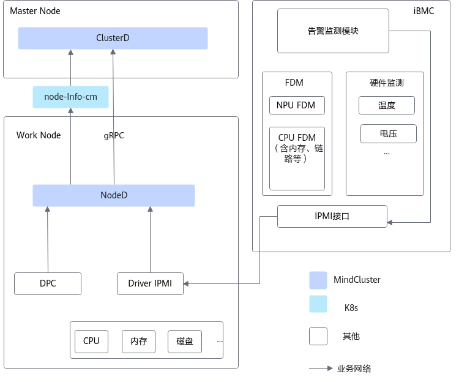

# 节点故障

节点故障的发现主要通过NodeD组件实现。节点故障包括节点健康状态和节点硬件故障、节点共享存储故障，详细说明如下：

- 节点健康状态

    NodeD完成当前节点的节点状态诊断后，收集本节点内的故障信息。当节点发生故障时，通过节点状态上报机制不断向Volcano发送节点状态（当前仅收集本节点内的硬件故障信息）。

- 节点硬件故障

    针对节点硬件故障，NodeD通过IPMI驱动向iBMC发送故障查询请求，iBMC将当前硬件告警信息响应给NodeD。NodeD收集硬件告警信息后，将节点硬件状态上报给Volcano。

- 节点共享存储故障

    针对使用Scale-Out Storage DPC、DTFS产品的节点，可以使用NodeD安装包下的noded-dpc-\{version\}.yaml启动NodeD服务。开启对共享存储的异常检测和上报。

    >[!NOTE]
    >当节点发生故障时，NodeD会上报节点健康状态和节点硬件故障。无故障时，默认节点健康。

**图 1**  节点故障上报

- 当节点发生故障时，NodeD最短5秒（默认）更新本节点的node-info-cm内容，其中字段说明见[mindx-dl-nodeinfo-&lt;nodename&gt;](../../../06_api/03_noded.md#节点资源)表。
- NodeD每隔60秒（默认）从iBMC查询故障信息。当查到的故障信息相比上次查到的有变化或与上次上报的时间间隔30分钟以上时，会在1秒内上报到node-info-cm中。

## 所需组件

为保证节点故障检测功能的正常使用，需要安装以下组件：Volcano、Ascend Operator、NodeD、ClusterD

## 使用约束

- NodeD的节点硬件故障上报能力仅支持以下产品型号：Atlas 800T A2 训练服务器、Atlas 900 A2 PoD 集群基础单元、Atlas 900 A3 SuperPoD 超节点。
- 仅V2 3.15.0.1及以上版本或者V2 3.10.02.55版本的iBMC，且安装了IPMC驱动的产品，支持NodeD的节点硬件故障上报能力。低版本的iBMC或IPMI获取节点故障信息失败时，将只上报节点健康状态。
- 如需使用超节点故障检测功能，需使用V3 5.8.3.35及以上版本的iBMC。
- 如需使用DPC故障检测功能，需使用Scale-Out Storage DPC 24.2.0及以上版本。

## 支持的故障处理类型

Job级别重调度、Pod级别重调度、进程级别重调度

## （可选）配置故障检测的级别

故障检测特性针对节点故障中**节点硬件故障**的不同故障码，提供了默认的故障级别和对应级别的故障处理策略。若用户需要修改故障处理策略，可参见[节点硬件故障](../03_configuration/02_node_faults.md#配置节点故障)。若无特殊需求，请勿随意修改。

## 相关操作

- [配置节点故障](../03_configuration/02_node_faults.md)
- [查询和验证故障](../04_querying_and_verifying_faults.md)
