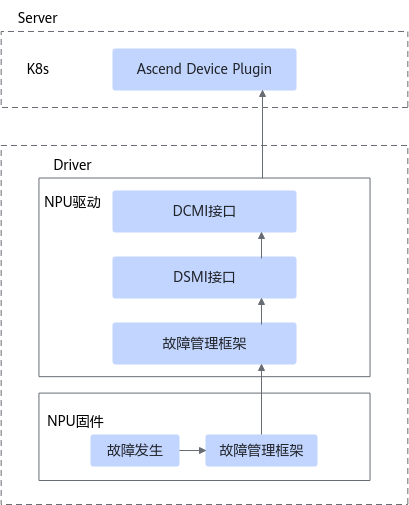
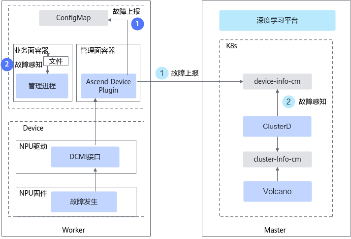

# 芯片故障

芯片故障指的是NPU出现的基础软件类故障和芯片硬件类故障。断点续训特性中芯片故障的检测和上报由设备管理组件Ascend Device Plugin负责。

## NPU上报机制

NPU发生故障时，故障管理框架获取到故障信息后，将该信息上传给NPU驱动的故障管理框架。故障管理框架收到故障信息后，通过DCMI接口上报给Ascend Device Plugin，如[图1](#fig3951191610267)所示。

Ascend Device Plugin通过DCMI接口获取芯片健康状态。当前提供如下两种获取模式：

- 故障订阅模式。Ascend Device Plugin启动时会先调用DCMI故障订阅接口注册监测，故障发生时驱动通过该接口将故障事件上报给Ascend Device Plugin。故障恢复时通过该接口将恢复事件上报给Ascend Device Plugin。
- 故障轮询模式。每隔固定时间，通过故障查询接口查询芯片故障状态，当设备驱动不支持订阅能力时将切换该模式。

**图 1**  芯片故障上报

## Ascend Device Plugin上报机制

Ascend Device Plugin获取到芯片故障信息后，通过ConfigMap的形式上报给K8s。Ascend Device Plugin的故障上报机制如下：

**图 2**  上报故障到K8s

对于不同故障处理模式，上报的路径会有一定差别。

- 重调度模式：Ascend Device Plugin获取到芯片故障后，将芯片故障信息写入该节点所属的device-info-cm中，其中字段说明见[DeviceInfoCfg](../../../06_api/02_ascend_device_plugin.md#芯片资源)表。ClusterD读取每个节点的device-info-cm感知芯片故障并上报给调度器。
- 优雅容错模式（本功能已日落）：Ascend Device Plugin获取到可恢复的芯片故障后，将芯片故障信息写入该任务所属的reset-info-cm中，业务容器通过将reset-info-cm挂载为文件的形式，读取文件感知芯片故障。

    >[!NOTE]
    >若优雅容错模式处理故障失败，回退至重调度模式后，故障上报的路径则按照重调度模式进行上报。

## 所需组件

为保证芯片故障检测功能的正常使用，需要安装以下组件：Volcano、Ascend Operator、Ascend Device Plugin、ClusterD

## （可选）配置故障检测的级别

故障检测特性针对**芯片故障**提供了默认的故障频率、时长、故障级别以及对应级别的故障处理策略。若用户需要修改故障处理策略，可参见[芯片故障](../03_configuration/03_chip_faults.md#ZH-CN_TOPIC_0000002511346521_0101)。若无特殊需求，请勿随意修改。

## 支持的故障处理类型

Job级别重调度、Pod级别重调度、进程级别重调度、进程级在线恢复、优雅容错（本功能已日落）

>[!NOTE]
>仅片上内存出现的不可纠正错误支持进程级在线恢复，其他类型的芯片故障不支持进程级在线恢复。

## 相关操作

- [配置芯片故障](../03_configuration/03_chip_faults.md)
- [查询和验证故障](../04_querying_and_verifying_faults.md)
