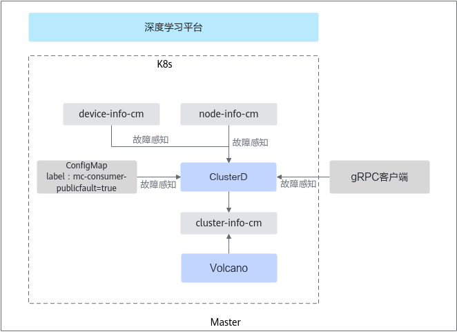

# 公共故障

公共故障指的是其他故障发送方（非MindCluster组件）上报的故障，公共故障包括以下几种类型：NPU故障、节点故障、网络故障和存储故障。

>[!NOTE]
>ClusterD支持接收公共故障的前提是需要在节点上安装Ascend Device Plugin，并且生成了相应的device-info-cm。

## 上报机制

公共故障发送方发现故障后，将通过ConfigMap或gRPC方式，将获取到的故障信息发送给ClusterD。ClusterD会将接收到的信息进行汇总写入cluster-info-device-cm，再上报给Ascend-volcano-plugin。

- 通过ConfigMap获取。故障发现者将故障信息写入ConfigMap中，然后由ClusterD获取故障信息。用户可通过调用ConfigMap接口的方式来注入公共故障，详细说明请参见[ConfigMap](../../../06_api/04_clusterd/03_public_fault_apis.md#configmap)。
- 通过gRPC获取。故障发现者将故障信息通过gRPC通道发送给ClusterD，然后由ClusterD获取故障信息。用户可通过调用gRPC接口的方式来注入公共故障，说明请参见[gRPC接口](../../../06_api/04_clusterd/03_public_fault_apis.md#grpc接口)。

**图 1**  公共故障上报

## 所需组件

为保证公共故障检测功能的正常使用，需要安装以下组件。

- 必选组件：Volcano、Ascend Operator、Ascend Device Plugin、ClusterD
- 可选组件：NodeD

## 支持的故障处理类型

Job级别重调度、Pod级别重调度、进程级别重调度

## （可选）配置故障检测的级别和发送方

故障检测特性针对**公共故障**提供了默认的故障级别以及支持的故障发送方。若用户需要修改公共故障的级别及故障发送方，可参见[公共故障](../03_configuration/08_public_faults.md#ZH-CN_TOPIC_0000002479386564)。若无特殊需求，请勿随意修改。

## 相关操作

- [配置公共故障](../03_configuration/08_public_faults.md)
- [查询和验证故障](../04_querying_and_verifying_faults.md)
