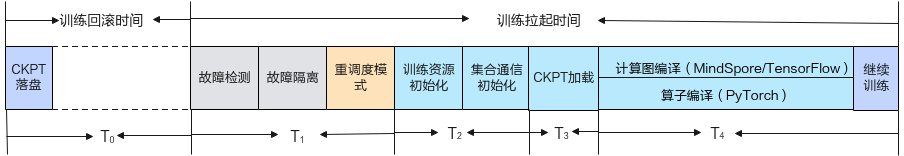
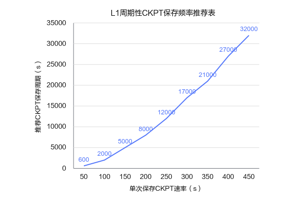

# 恢复加速原理

## 故障恢复时间与训练损失

断点续训特性可以在训练发生故障后恢复训练，降低故障导致的训练损失。断点续训的故障整体恢复时间可以分为训练回滚时间和训练拉起时间，如[图1](#zh-cn_topic_0000002003001306_fig13371418134510)所示。

**图 1**  故障恢复阶段

- T0：训练回滚损失时间

    训练出现故障后会丢失原有的训练数据，需要从保存的CKPT文件中恢复训练。在大模型训练中，由于每次保存CKPT会降低训练效率，因此通常1小时以上才会保存一次CKPT文件，每次故障后将会丢失上次保存CKPT时间点到当前故障时间点的训练数据。训练回滚时间即使用上次保存的CKPT文件训练到出现故障点的时间。设平均训练回滚时间为T0，CKPT保存周期为Gf，则故障平均训练回滚时间T0=Gf/2。

    训练出现故障后，需要重新拉起训练任务，恢复训练容器及训练进程，完成故障检测、故障资源处理或隔离、恢复所需资源重调度、集合通信初始化、CKPT加载和编译等流程后继续往后训练。训练故障后需要完整走完一段训练拉起时间后才能继续训练，训练拉起时间过长会导致资源浪费。

- T1：故障发现和资源处理时间

    T1为故障发生后完成故障检测、故障资源处理或隔离，以及恢复所需资源重调度的时间。

- T2：集合通信时间

    集合通信时间T2是重新拉起训练时完成集合通信初始化的时间。

- T3： CKPT加载时间

    CKPT加载时间T3是重新拉起训练时加载CKPT并恢复训练状态的时间。

- T4：编译和初始化时间

    编译和初始化时间T4是重新拉起训练时完成编译和初始化的时间。因此，训练拉起时间为T1+T2+T3+T4。

单次故障总训练损失时间T=T0+T1+T2+T3+T4。具体的时间参考请参见[训练恢复耗时参考](../00_feature_description.md#zh-cn_topic_0000002003001306_section1672017599123)。

>[!NOTE]
>其中每部分时间与参数规模和集群规模相关，网络与存储性能也会影响总训练损失时间。

watchdog用于缩短T1中的故障检测时间，配置仍位于独立的[配置watchdog故障检测](../../../11_fault_detection_and_diagnosis/03_configuration/04_network_faults.md#配置watchdog故障检测)指南。断点续训现有恢复加速能力仍作用于T0、T2、T3和T4。

## 减少训练状态回滚

### 周期性CKPT

现有大规模集群训练主要通过CKPT（Checkpoint）机制，即在训练过程中周期性保存训练过程数据（模型参数等）作为CKPT。当业务平台检测到故障发生后，可退出当前训练任务，通过重新加载CKPT数据，从CKPT保存时刻开始恢复训练，避免从头开始重新进行训练。

**推荐配置**

在使用故障重调度的CKPT保存能力时，需根据实际情况选择周期性保存CKPT频率，用户可参考如[图2](#fig41241253101)所示的推荐频率。

**图 2**  周期性CKPT保存频率推荐

使用周期性CKPT恢复能力，训练恢复后将丢失上一次周期保存点到故障点这一时间段的训练状态。因此，如果想要降低每次故障导致的训练状态损失，需要降低周期性保存的间隔。但是，每次保存需要中断训练后将CKPT从设备侧落盘到存储侧，这浪费了大量的训练时间。如果降低周期性保存的间隔，将导致训练时间的浪费，从而也会带来训练时间的损失。综上所述，如果单次保存时间恒定，通常需要作出保存损失和故障损失的综合权衡。

为了降低上述损失，需要降低单次保存时间。单次保存时间受到保存数据量及存储性能的影响，通常难以改变这两者。本产品提供MindIO ACP产品解决周期性CKPT恢复损失高的问题。

配置步骤请参见[配置周期性CKPT保存](../03_configuration/02_configuring_training_recovery.md#ZH-CN_TOPIC_0000002479226552)。

### 异步CKPT保存

MindIO ACP提供异步保存周期性CKPT的能力。未使用MindIO ACP时，需要将需要保存的参数从设备拷贝到主机侧，再从主机侧落盘到存储中，这一时间通常在分钟级。MindIO ACP提供异步落盘的能力，当需要保存的参数从设备拷贝到主机侧后，通过异步进程进行落盘到存储，不会阻塞训练进程，落盘的过程中训练可以继续进行。

配置步骤请参见[配置异步CKPT保存](../03_configuration/02_configuring_training_recovery.md#配置异步ckpt保存pytorch)。

### 临终CKPT

尽管通过异步保存周期性CKPT能够降低周期性保存间隔，从而降低每次故障的损失，但是由于仍然具有保存开销，难以将故障损失控制在秒级。因此，MindCluster集群调度组件提供临终保存CKPT能力，在故障时刻保存当前step初始的参数状态，从而将训练恢复的状态损失降低到一个“step”以内。

MindCluster MindIO Try To Persist（下文简称MindIO TTP）提供临终CKPT能力，帮助用户在故障时刻保存临终时刻CKPT。

了解临终CKPT保存的详细介绍，请参见[故障恢复加速](../../../../07_references/00_fault_recovery_acceleration/01_product_description.md)。

了解临终CKPT保存的配置步骤，请参见[配置临终CKPT保存](../03_configuration/02_configuring_training_recovery.md#配置临终ckpt保存)。

**适配功能点**

在临终CKPT中，框架首先初始化MindIO服务，启动服务后优化器更新时会上报对应状态到MindIO。随后，创建DP副本组和优化器副本，以保障模型参数的冗余备份。在异常发生时，通过异常捕获装饰器捕获故障模式，之后执行算子资源清理，基于副本完成临终CKPT保存。

对于非MindSpeed-LLM用户，需在框架侧完成[表1](#table19955141136109)的功能适配。

**表 1**  临终CKPT保存框架适配功能点

<table><thead align="left"><tr id="row169591493619"><th class="cellrowborder" valign="top" width="20.632063206320634%" id="mcps1.2.4.1.1">
适配功能点

</th>
<th class="cellrowborder" valign="top" width="50.51505150515051%" id="mcps1.2.4.1.2">
功能简述

</th>
<th class="cellrowborder" valign="top" width="28.852885288528853%" id="mcps1.2.4.1.3">
参考链接

</th>
</tr>
</thead>
<tbody><tr id="row893618158397"><td class="cellrowborder" valign="top" width="20.632063206320634%" headers="mcps1.2.4.1.1 ">
初始化拉起

</td>
<td class="cellrowborder" valign="top" width="50.51505150515051%" headers="mcps1.2.4.1.2 ">
训练框架初始化时拉起MindIO服务。

</td>
<td class="cellrowborder" rowspan="7" valign="top" width="28.852885288528853%" headers="mcps1.2.4.1.3 ">
<a href="../../../../07_references/00_fault_recovery_acceleration/03_usage_guidance.md#对接非mindspeed-llm框架">对接非MindSpeed-LLM框架</a>

</td>
</tr>
<tr id="row1793717157396"><td class="cellrowborder" valign="top" headers="mcps1.2.4.1.1 ">
上报优化器更新状态

</td>
<td class="cellrowborder" valign="top" headers="mcps1.2.4.1.2 ">
优化器更新前上报优化器更新开始和结束。

</td>
</tr>
<tr id="row193701523914"><td class="cellrowborder" valign="top" headers="mcps1.2.4.1.1 ">
创建DP副本组

</td>
<td class="cellrowborder" valign="top" headers="mcps1.2.4.1.2 ">
新增dp_cp/dp_ep副本组及gloo组创建逻辑，在原生Megatron分布式并行组创建后创建相关副本组。

</td>
</tr>
<tr id="row191961528155914"><td class="cellrowborder" valign="top" headers="mcps1.2.4.1.1 ">
优化器副本

</td>
<td class="cellrowborder" valign="top" headers="mcps1.2.4.1.2 ">
接管、继承相关Megatron原生优化器功能，嵌入MindIO优化器副本管理逻辑。

</td>
</tr>
<tr id="row111971728195915"><td class="cellrowborder" valign="top" headers="mcps1.2.4.1.1 ">
异常捕获装饰器

</td>
<td class="cellrowborder" valign="top" headers="mcps1.2.4.1.2 ">
使用异常捕获装饰器装饰train函数捕获故障模式。

</td>
</tr>
<tr id="row1519712855916"><td class="cellrowborder" valign="top" headers="mcps1.2.4.1.1 ">
算子资源清理

</td>
<td class="cellrowborder" valign="top" headers="mcps1.2.4.1.2 ">
通过回调函数完成算子清理、恢复算子下发能力。

</td>
</tr>
<tr id="row1375943411593"><td class="cellrowborder" valign="top" headers="mcps1.2.4.1.1 ">
临终CKPT

</td>
<td class="cellrowborder" valign="top" headers="mcps1.2.4.1.2 ">
通过新增回调函数、优化器副本dump方法完成临终CKPT保存。

</td>
</tr>
</tbody>
</table>

### 亚健康主动CKPT

发生亚健康故障时，可通过亚健康主动CKPT保存临终遗言。该能力需要将亚健康策略配置为`graceExit`、故障恢复策略配置为`dump`，并确保TaskD和ClusterD可以正常使用。具体操作请参见[配置亚健康主动CKPT保存](../03_configuration/02_configuring_training_recovery.md#subHealthCkptSave)。

## 缩短状态恢复时间

### 内存CKPT加载

MindIO ACP提供基于内存的周期性CKPT加载的能力。在训练恢复时，通常需要从存储加载之前保存的周期性CKPT，加载完成后恢复训练状态再继续训练。但是，由于数据量较大和存储性能限制，大模型任务通常加载时间在分钟级。为了降低CKPT加载时间，从而降低训练恢复的时间，MindIO ACP提供基于内存的周期性CKPT加载机制，故障后直接基于内存加载，将大幅降低加载时间。

配置步骤请参见[配置内存CKPT加载](../03_configuration/02_configuring_training_recovery.md#配置内存ckpt加载pytorch)。

### 参数面CKPT传输

通过临终CKPT能力可以将每次训练由于CKPT回滚机制导致的训练回滚损失降到一个“step”内，但是在故障时刻需要进行落盘保存，并在容错完成训练恢复后需要加载存储中的CKPT进行恢复，将导致整体故障恢复时间延长。因此，为了降低故障恢复时间，MindCluster集群调度组件提供参数面CKPT传输恢复能力。

在故障时刻将参数状态保持在设备侧，在容错完成训练恢复时将正常卡内的参数状态通过参数面网络传输到容错处理的卡上，从而快速恢复容错处理卡的参数状态。当前该能力需要结合进程级别重调度和进程级在线恢复使用，不支持用户独立使用。

了解参数面CKPT的配置步骤，请参见[配置参数面CKPT传输恢复](../03_configuration/02_configuring_training_recovery.md#配置参数面CKPT传输恢复)。

## 缩短训练拉起时间

### 集合通信初始化优化

Parallel Store多线程建链优化：PyTorch框架创建通信组时，使用TCP Store进行信息交换。随着任务规模变大会影响原生TCP Store的信息处理性能，导致创建通信组时间过长。针对该问题，PyTorch Adapter插件支持使用原生TCP Store的优化版本Parallel Store，详细说明请参见[Parallel Store功能说明](../03_configuration/02_configuring_training_recovery.md#zh-cn_topic_0000002163883997_zh-cn_topic_0000002017918296_table14133757143220)。

原生HCCL建链性能优化：PyTorch框架在NPU侧交换集合通信信息后进行NPU间连接建链。随任务规模变大，导致建链时间大幅度增加。针对该问题，CANN对原生HCCL建链进行了性能优化，详细说明请参见[原生HCCL建链性能优化功能说明](../03_configuration/02_configuring_training_recovery.md#zh-cn_topic_0000002163883997_zh-cn_topic_0000002017918296_table10637950133911)。

RankTable模式建链优化：集群调度Ascend Operator组件为PyTorch框架提供生成集合通信配置文件（RankTable File，也叫hccl.json文件）功能，可以通过RankTable模式建链，缩短集群通信建链时间，详细说明请参见[集合通信使用RankTable模式建链](../03_configuration/02_configuring_training_recovery.md#zh-cn_topic_0000002163883997_zh-cn_topic_0000002017918296_table1749892464019)。

### 编译和初始化优化

断点续训过程中拉起训练需要重新执行算子时，算子编译需要消耗大量时间。针对该问题，可选择算子二进制或算子编译缓存降低编译时间，详细说明请参见[算子二进制功能说明](../03_configuration/02_configuring_training_recovery.md#zh-cn_topic_0000002163883997_zh-cn_topic_0000002017918296_table8599191019143)和[算子编译缓存功能说明](../03_configuration/02_configuring_training_recovery.md#zh-cn_topic_0000002163883997_zh-cn_topic_0000002017918296_table2193759172110)。

>[!NOTE]
>算子二进制和算子编译缓存二者不兼容，请选择其中之一进行使用。

断点续训过程中拉起训练时需要构建计算图，在大模型场景下，构建计算图并编译需要消耗大量时间。针对该问题，MindSpore支持在首次编译时将编译缓存文件进行存储，进行故障恢复时可以直接读取存储中的图编译缓存，降低图编译时间，详细说明请参见[图编译缓存功能说明](../03_configuration/02_configuring_training_recovery.md#zh-cn_topic_0000002128524426_zh-cn_topic_0000002053878705_table175224282139)。

## 提升恢复拉起成功率

### HCCL主动建链

**PyTorch单算子场景**

PyTorch单算子场景HCCL建链为懒加载模式，当建立Torch通信组后，该通信组下发的第一个算子将触发HCCL通信域的创建，创建后完成卡间建链。因此，如果需要在训练初始化阶段完成所有通信域的建链，只需要在初始化阶段给每个通信组下发一个通信算子。

HCCL主动建链用于降低故障发生在建链阶段导致恢复失败的风险；现有原文未提供其缩短T2的直接证据，因此不计入集合通信初始化耗时优化。
