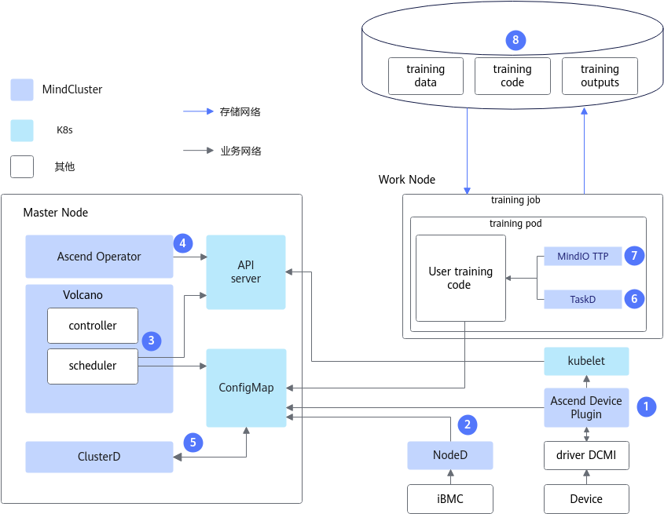
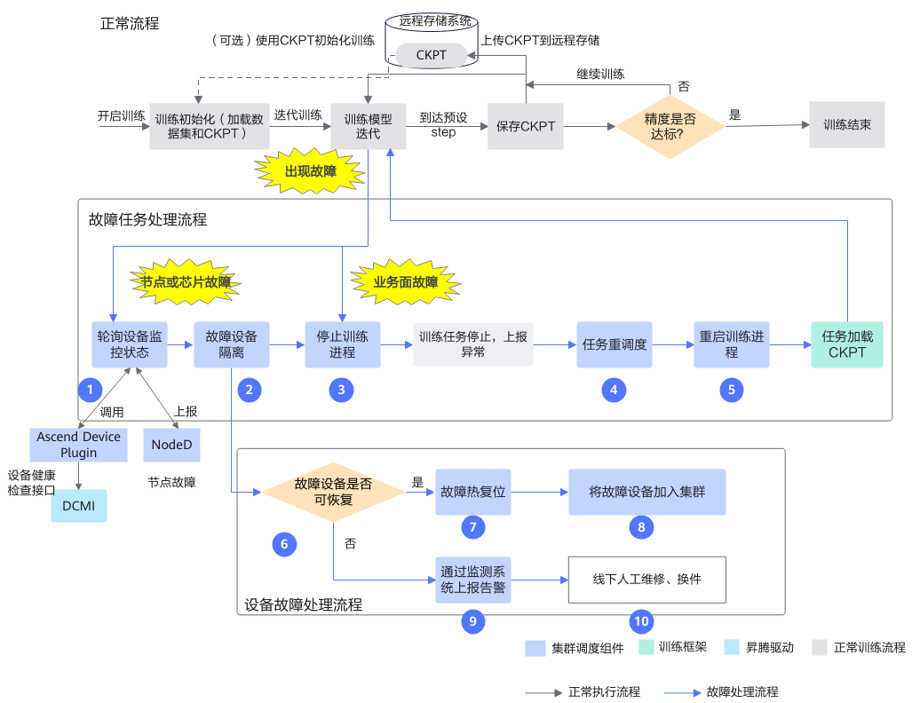
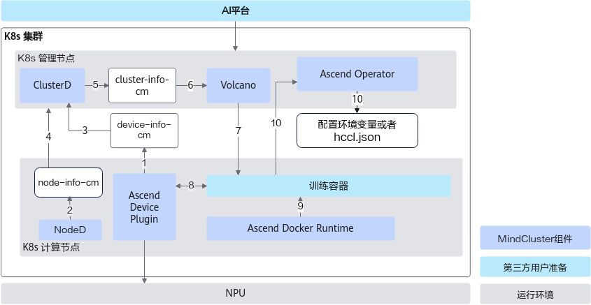
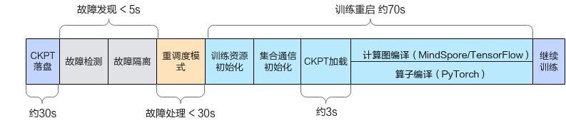

# 特性说明<a name="ZH-CN_TOPIC_0000002511346415"></a>

## 应用场景<a name="ZH-CN_TOPIC_0000002511346439"></a>

随着神经网络和数据集的规模越来越大，单台服务器已经难以完成大规模的训练任务。为了应对这一挑战，通常需要使用多台服务器（配备更多的AI芯片）组成高密度训练集群，进行长时间的分布式训练。但随着硬件数量的增加，设备出现故障的概率也会上升，训练中断也更加频繁。因此，如何提升集群的可用性，成为当前亟需解决的重要问题。

提升集群可用性需要降低每次训练后的故障恢复成本。当前故障恢复通常需要人工排查硬件故障或者软件异常，需要大量人工成本；并且隔离故障设备后再重新拉起训练任务，需要耗费较长时间，影响整体效率。

为了解决这些问题，断点续训依赖故障检测特性提供故障事件、故障级别和资源状态，并通过故障处理和恢复加速能力减少恢复时间，从而显著提升集群的可用性和稳定性。

## 能力定位

**关键功能<a name="section15584171017252"></a>**

<a name="table1866285218270"></a>

|功能名称|说明|配置步骤|
|--|--|--|
|故障检测（前置依赖）|<p>断点续训依赖故障检测特性提供集群和训练业务的故障事件、故障级别和资源状态。</p><p>详细功能及原理介绍请参见[故障检测特性指南](../11_fault_detection_and_diagnosis/00_feature_description.md)。</p>|[配置故障检测](../11_fault_detection_and_diagnosis/03_configuration/01_fault_classification.md)|
|故障处理|<p>断点续训具有故障处理功能，出现故障后不需要人工介入就可自动隔离故障设备。</p><p>详细功能及原理介绍请参见[故障处理](./01_solutions_principles/01_fault_handling.md)。</p>|[配置故障处理](./03_configuration/01_configuring_fault_handling_policies.md)|
|恢复加速|<p>断点续训具有加速训练恢复的功能，用户可自定义加速的策略，降低训练拉起时间。</p><p>详细功能及原理介绍请参见[恢复加速](./01_solutions_principles/02_recovery_acceleration.md)。</p>|[配置恢复加速](./03_configuration/02_configuring_training_recovery.md)|

**应用场景<a name="section1498618364358"></a>**

<a name="table1716618439356"></a>

|场景分类|主要业务|业务价值|
|--|--|--|
|AI训练场景|支持对计算、网络和存储设备资源的监测，AI环境的健康检查和AI作业故障诊断。|<ul><li>整体监测集群环境资源。</li><li>提升AI训练业务的作业成功率。</li><li>减少AI作业训练故障的处理及恢复时间。</li></ul>|

>[!NOTE]
>
>- 较小规模的模型任务训练用时较短（时长 < 1h），硬件出现故障的频率较低，不推荐用户使用断点续训特性。
>- 本特性不适用于算力虚拟化场景。

## 整体架构<a name="ZH-CN_TOPIC_0000002479226568"></a>

在K8s（Kubernetes）集群中训练任务出现故障时，断点续训特性使系统能够感知故障，将故障资源进行处理或隔离，并根据训练任务需要重新分配资源，通过周期性保存或临终保存的CKPT（Checkpoint）重新拉起训练任务，缩短损失时间。

**断点续训整体架构<a name="section1483121685613"></a>**

断点续训架构原理如[图1](#fig1285977919)所示。

**图 1**  整体架构<a name="fig1285977919"></a>



其中各个部分的能力如下：

1. Ascend Device Plugin：故障发现组件，提供NPU资源管理、NPU芯片故障和NPU网络故障上报、执行芯片热复位等能力。
2. NodeD：故障发现组件，提供节点健康状态、节点硬件（包括CPU、内存、芯片等部件）故障、灵衢慢网络故障和共享存储故障上报能力。
3. Volcano：故障处理组件，提供故障任务重调度的能力。
4. Ascend Operator：为不同AI框架的分布式训练任务生成相应的环境变量；提供静态组网集合通信所需的RankTable信息。
5. ClusterD：获取集群中所有Ascend Device Plugin和NodeD上报的数据，整理后发送给Volcano。
6. TaskD：提供与ClusterD的通信功能，完成恢复训练；提供昇腾设备上训练及推理任务的训练状态监测和训练状态控制能力。
7. MindIO TTP：在大模型训练过程中发生故障后，校验中间状态数据的完整性和一致性，生成一次临终CKPT数据，恢复训练时能够通过该CKPT数据恢复，减少故障造成的训练迭代损失。
8. 训练模型代码：需要进行断点续训相关能力的适配操作。

**端到端流程<a name="section11999131581210"></a>**

断点续训特性消费故障检测特性提供的故障事件、故障级别和资源状态，经过故障处理和恢复加速后恢复训练。

**图 2**  端到端流程<a name="fig1968122593112"></a>



各步骤说明如下：

1. 通过轮询的方式查询设备状态，Ascend Device Plugin从DCMI接口获取NPU状态以及NodeD上报的节点健康状态、节点硬件故障信息和灵衢网络故障信息，ClusterD整理所有的故障信息，确定最终故障状态后，上报给Volcano。
2. 查询到节点或芯片故障后，对故障节点或芯片进行隔离，防止再次调度到该设备上。
3. 停止训练进程，退出训练容器。
4. 节点或芯片故障后，系统会将训练任务重调度到健康的设备上，重启训练容器；该训练任务被重调度选择资源时，优先选用未导致本次训练任务重调度的节点。
5. 训练脚本重新拉起训练进程。
6. 运维人员可以根据节点或芯片的故障类型判断是否可进行热复位。
7. 进行故障热复位，使设备恢复健康状态。
8. 恢复后的设备自动重新加入集群中。
9. 不可恢复的设备通过运维监测系统上报告警。
10. 对不可恢复的设备进行线下人工维修和换件。

>[!NOTE]
>业务面故障触发的断点续训功能，将只执行上述步骤3\~步骤5。

**组件调用流程<a name="section1726018439396"></a>**

断点续训组件调用流程如[图3](#fig1710473818543)所示。

**图 3**  架构原理<a name="fig1710473818543"></a>



各步骤说明如下：

1. Ascend Device Plugin发现和上报故障及健康状态。
2. NodeD更新节点硬件故障信息，以便Volcano可以准确判断节点故障类型。
3. ClusterD根据Ascend Device Plugin提供的芯片信息，判断芯片是否健康。
4. ClusterD获取NodeD上报的故障信息。
5. ClusterD将收集来的芯片及节点信息汇总后，放入ConfigMap。
6. Volcano获取整个集群的设备信息，若任务使用的设备上存在故障信息，Volcano会将任务调度到其他健康设备上。
7. Volcano按照亲和性规则选择节点和芯片，并由Ascend Operator创建新的Pod后，再调度训练任务到符合要求的节点上。
8. Ascend Device Plugin根据Pod上Volcano指定的芯片ID来分配芯片，并将芯片IP信息写入容器。
9. 容器启动之前，Ascend Docker Runtime为训练容器自动挂载NPU相关设备，驱动so等文件和目录。
10. Ascend Operator将训练任务需要的相关环境变量（如集合通信信息和训练配置信息等）写入容器中。并且获取训练任务容器上的芯片信息，自动生成分布式训练任务需要的集合通信信息。

**使用条件<a name="section179221342141518"></a>**

- 使用断点续训功能需要安装的组件详见[所需组件](../../01_introduction/02_feature_description.md#断点续训)章节。

- 断点续训特性是基于MindCluster集群调度组件的高阶特性，结合昇腾软硬件全栈实现训练故障恢复，使用断点续训特性前需要满足以下前置条件。

  - 完成K8s集群基础性能调优，详情请参见[K8s集群基础性能调优](../../07_references/05_appendix.md#k8s集群基础性能调优)。

  - 具备共享存储系统

      断点续训特性的部分流程依赖读取存储数据，如加载CKPT、启动训练和编译缓存加载等，存储性能会影响断点续训整体恢复时间。为避免训练恢复时间劣化，建议进行存储性能配置优化，以下提供的推荐配置以万卡规模集群为例。
      - 8k IO读IOPS：\>1024W
      - 8k IO写IOPS：\>128W
      - 大文件顺序读带宽：\>288GB/s
      - 大文件创建写带宽：\>173GB/s

  - （可选）扩展共享内存：使用断点续训功能，建议扩展内存，请按注释添加参数，示例如下。

      ```yaml
      ...
              volumeMounts:                             # 断点续训扩容
               - name: shm
                 mountPath: /dev/shm
              volumes:
              - name: shm
                emptyDir:
                  medium: Memory
                  sizeLimit: 16Gi
      ...
      ```

  - （可选）配置CPU和内存资源：若需要配置CPU、Memory资源，请参见如下示例手动添加“cpu”和“memory”参数和对应的参数值，具体数值请根据实际情况配置。

      ```yaml
      ...
                resources:
                  requests:
                    huawei.com/Ascend910: 8
                    cpu: 1000m
                    memory: 100Gi
                  limits:
                    huawei.com/Ascend910: 8
                    cpu: 1000m
                    memory: 100Gi
      ...
      ```

## 故障恢复耗时说明<a name="ZH-CN_TOPIC_0000002479386472"></a>

故障恢复阶段、训练损失构成以及T<sub>0</sub>～T<sub>4</sub>的定义和计算方式，请参见[故障恢复时间与训练损失](./01_solutions_principles/02_recovery_acceleration.md#故障恢复时间与训练损失)。

**训练恢复耗时参考<a name="zh-cn_topic_0000002003001306_section1672017599123"></a>**

以 PyTorch 框架下的 GPT-3 模型为例，该模型在 NFS 存储读写速度分别为写入 2.7GB/s、读取 4.8GB/s 的条件下，运行参数量为 3B 或 15B 的单机 8 卡任务。**（故障处理模式为重调度，若使用优雅容错模式，可不参考该指标。）**

- 参数量大小为3B，如[图4](#zh-cn_topic_0000002003001306_fig175521679432)所示，该模型的CKPT落盘时间约为**30**秒，断点续训在设备发现阶段用时小于**5**秒，设备处理阶段用时小于**30**秒，训练重启阶段用时大约在**70**秒左右，训练重启阶段的CKPT加载功能用时约**3**秒。
- 参数量大小为15B，如[图5](#zh-cn_topic_0000002003001306_fig10995142020518)所示，该模型的CKPT落盘时间约为**120**秒，断点续训在设备发现阶段用时小于**5**秒，设备处理阶段用时小于**30**秒，训练重启阶段用时大约在**210**秒左右，训练重启阶段的CKPT加载功能用时约**90**秒。

**图 4**  3B模型时间指标<a name="zh-cn_topic_0000002003001306_fig175521679432"></a>



**图 5**  15B模型时间指标<a name="zh-cn_topic_0000002003001306_fig10995142020518"></a>


