# 故障处理原理

## 故障输入与触发流程

在故障检测完成后，针对每一种故障模式，断点续训通过故障处理或故障容错来恢复训练业务。断点续训特性根据恢复粒度由粗到细提供Job级别重调度、Pod级别重调度、进程级别重调度、弹性训练、进程级在线恢复、算子级在线恢复多层故障处理系统。用户可根据实际情况选择使用对应的子特性。

故障检测的详细原理和公共故障级别定义请参见[故障检测特性指南](../../11_fault_detection_and_diagnosis/01_working_principle.md)。

## 故障处理策略选择

**图 1**  故障决策说明

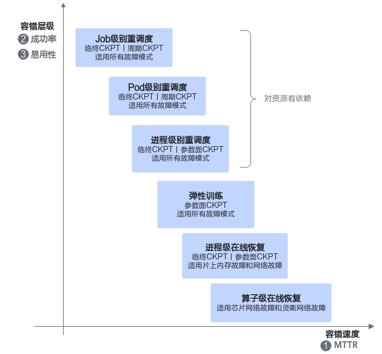

上图中，容错速度代表故障发生到故障恢复的速度，成功率代表故障发生后故障完成恢复的成功率，易用性代表用户使用或集成的成本。

Job级别重调度、Pod级别重调度、进程级别重调度可支持当前断点续训支持的全部故障模式，但依赖存在备份冗余计算服务器资源。如果存在不可修复的硬件故障且无备份冗余计算服务器时，可以通过配置弹性训练功能进行缩容训练。进程级在线恢复当前支持片上内存故障和网络故障。算子级在线恢复当前支持芯片网络故障和灵衢网络故障。

断点续训多层故障处理系统不同层级根据恢复粒度由细到粗可以逐级回退，如[图2](#fig477415371217)所示，如果上一层恢复失败则可以回退到下一层处理方式。

**图 2**  恢复失败说明

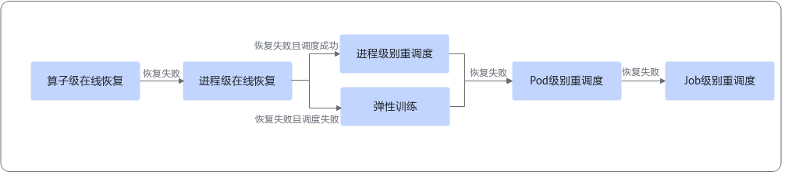

### 重调度模式

#### 重调度级别

重调度模式：将任务调度到健康的芯片上，并隔离故障芯片。

重调度模式默认为**Job级别重调度**，每次故障会停止所有的Pod。但在大规模任务中，停止所有Pod后再重调度的成本较高，存在故障恢复时间过长的问题。除此之外断点续训还提供**Pod级别重调度**功能，用户可根据任务规模配置，在故障时刻只停止故障相关的Pod后重调度少量Pod，从而达成故障的快速恢复。为了进一步缩短故障恢复时间、降低故障影响范围，断点续训还提供进程级别重调度及进程级在线恢复功能。

**表 1**  各种重调度级别的差异

|重调度的级别|恢复训练耗时|配置步骤|说明|
|--|--|--|--|
|Job级别重调度|Job级重调度的恢复时间较长，随着任务规模增加恢复时间超线性劣化。|
Job级重调度操作步骤简单，使用MindCluster的用户仅打开配置开关即可使用。

关键配置步骤请参见[配置Job级别重调度](../03_configuration/01_configuring_fault_handling_policies.md#配置job级别重调度)。
|为了进一步降低恢复中资源调度时间，用户可以选择在Job级重调度上开启Pod级重调度能力。|
|Pod级别重调度|Pod级重调度可以将资源调度时间缩短，且与任务规模无关。但是，Pod级重调度并不能优化训练初始化过程中的时间开销，整体恢复时间仍然会随着任务规模增加而超线性劣化。|
Pod级重调度用户需要额外在训练容器中集成训练进程管理能力，使用MindCluster的用户具备对应进程管理能力后即可使用。

关键配置步骤请参见[配置Pod级别重调度](../03_configuration/01_configuring_fault_handling_policies.md#配置pod级别重调度)。
|为了进一步降低训练初始化中的恢复时间，用户可以选择在Pod级重调度上开启进程级重调度能力。|
|进程级别重调度（进程级恢复）|进程级重调度可以减少训练初始化时间，将整体恢复时间缩短，且与任务规模无关或者弱相关。|
相比Pod级重调度，进程级重调度用户需要额外在训练框架中集成高可用训练能力，使用MindCluster的用户需要修改训练脚本，并开启对应配置开关后使用。

关键配置步骤请参见[配置进程级别重调度](../03_configuration/01_configuring_fault_handling_policies.md#配置进程级别重调度)。
|为了解决大规模场景下MTBF时间较短的问题，进一步降低整体恢复时间，用户可以选择在进程级重调度上开启进程级在线恢复能力。|
|进程级在线恢复|进程级在线恢复比起进程级重调度，恢复训练耗时更低。|
相比进程级重调度，进程级在线恢复用户需要配置对应的配置开关后使用。

关键配置步骤请参见[配置进程级在线恢复](../03_configuration/01_configuring_fault_handling_policies.md#配置进程级在线恢复)。
|当前进程级在线恢复支持片上内存故障和网络故障，其余故障场景将回退其他处理方式。|
|算子级在线恢复|-|关键配置步骤请参见[配置算子级在线恢复](../03_configuration/01_configuring_fault_handling_policies.md#配置算子级在线恢复)。|-|

#### 重调度策略

重调度模式存在以下两种重调度策略。

- **直接重调度**：训练过程中发生集群调度组件可以探测到的硬件故障，系统将故障节点或芯片进行隔离，直接对任务进行重调度。
- **无条件重试**：训练过程中发生集群调度组件不能探测到的故障，导致任务容器异常退出，系统无条件对任务进行重调度。

**表 2**  重调度策略说明

|重调度策略|说明|支持的故障类型|
|--|--|--|
|直接重调度|系统将故障的节点或芯片进行隔离，然后直接对任务进行重调度。|已知的节点故障或重调度处理级别芯片故障。|
|无条件重试|
系统对配置了无条件重试次数的任务，进行指定次数内的重调度。

成功重调度后，任务可重试次数将减1，当可重试次数为0时无法再次触发重调度。

如需使用无条件重试功能，需在YAML中配置fault-retry-times参数，详细参数说明请参见[YAML配置说明](../../../06_api/15_yaml_configuration.md#yaml_configuration)。
|由于参数面网络故障或者训练相关软件故障等，导致任务异常退出，Pod的Status变为Failed状态的相关故障。|

### 故障级别与训练行为

故障级别及其对应的重调度处理、优雅容错处理说明，请参见[故障级别及处理说明](../../11_fault_detection_and_diagnosis/03_configuration/01_fault_classification.md#table103716651410)。

### 亚健康故障处理策略

各亚健康故障处理策略的当前任务行为、CKPT要求、后续动作和配置入口，请参见[配置亚健康故障处理策略](../03_configuration/01_configuring_fault_handling_policies.md#配置亚健康故障处理策略)。

## 重调度恢复

### Job级别重调度

**Job级别重调度**即每次故障停止所有Pod，重新创建并重调度所有Pod后，重启训练任务。重调度模式默认为**Job级别重调度**。

了解Job级别重调度的关键配置步骤，请参见[配置Job级别重调度](../03_configuration/01_configuring_fault_handling_policies.md#配置job级别重调度)。

**使用约束**

- 本功能仅支持在6.0.RC2及以上版本中使用。
- 大规模K8s集群场景下，ConfigMap映射时延不可控，建议RankTable使用共享存储方式。

**支持的产品型号和AI框架**

**表 3**  Job级别重调度支持的产品和框架

|产品类型|硬件形态|训练框架|
|--|--|--|
|Atlas 训练系列产品|<ul><li>Atlas 800 训练服务器（型号 9000）</li><li>Atlas 800 训练服务器（型号 9010）</li></ul>
[!NOTE] 说明
若Atlas 800 训练服务器的芯片工作模式为SMP模式，且每个Pod申请的NPU数量为1、2时，不支持使用重调度模式。查询和设置NPU芯片工作模式的详细介绍请参见《Atlas 800 训练服务器 iBMC用户指南（型号 9000）》中的“[查询和设置NPU芯片工作模式（npuworkmode）](https://support.huawei.com/enterprise/zh/doc/EDOC1100136583/b6e6ed5a)”章节。

|<ul><li>MindSpore</li><li>PyTorch</li></ul>|
|Atlas A2 训练系列产品|<ul><li>Atlas 800T A2 训练服务器</li><li>Atlas 200T A2 Box16 异构子框</li><li>Atlas 900 A2 PoD 集群基础单元</li></ul>|<ul><li>MindSpore</li><li>PyTorch</li></ul>|
|Atlas A3 训练系列产品|<ul><li>Atlas 900 A3 SuperPoD 超节点</li><li>Atlas 800T A3 超节点服务器</li><li>Atlas 9000 A3 SuperPoD 集群算力系统</li></ul>|<ul><li>MindSpore</li><li>PyTorch</li></ul>|
|A200T A3 Box8 超节点服务器|A200T A3 Box8 超节点服务器|<ul><li>MindSpore</li><li>PyTorch</li></ul>|
|Ascend 950 系列产品|<ul><li>Atlas 950 SuperPoD 超节点</li><li>Atlas 850E 超节点</li><li>Atlas 650E 服务器</li></ul>|<ul><li>PyTorch</li></ul>|

**重调度原理**

训练过程中如果出现了软硬件故障，将导致训练状态异常。Job级别重调度首先销毁所有的训练容器，然后隔离故障设备，再重新将训练容器调度启动。训练容器重新启动后重新拉起训练，该行为类似训练首次拉起过程。

**图 3**  原理图

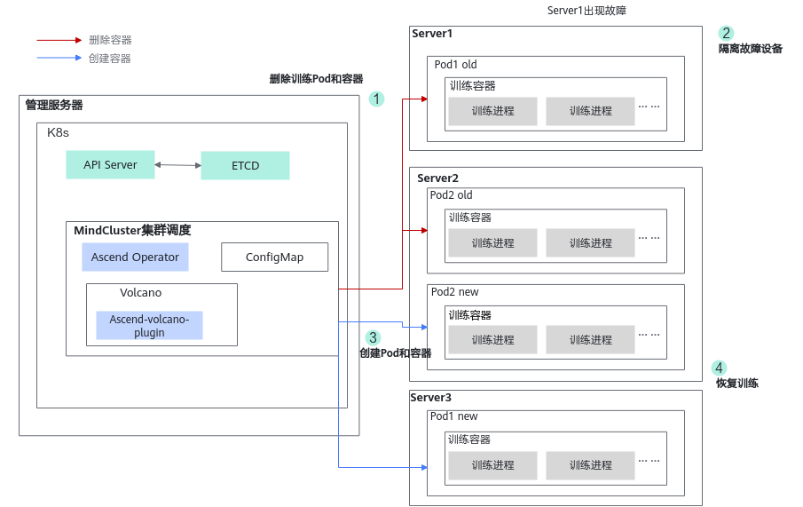

在以上原理图中，各个步骤的说明如下。

1. 检测到故障后，首先删除当前任务所有的Pod和容器。
2. 隔离故障所在的设备，防止再次使用该设备。
3. 重新创建和调度训练Pod和容器。
4. 容器启动后，拉起训练进程恢复训练任务。

### Pod级别重调度

**Pod级别重调度**即每次故障只停止故障相关的Pod，重新创建并重调度故障相关的Pod后，重启训练任务。如果当前故障不能恢复，则回退至Job级重调度模式。相比于Job级别重调度，Pod级别重调度会减少部分资源调度、Pod创建的时间。

了解Pod级别重调度的关键配置步骤，请参见[配置Pod级别重调度](../03_configuration/01_configuring_fault_handling_policies.md#配置pod级别重调度)。

**使用约束**

- 在大集群训练任务中使用**Pod级别重调度**时，建议设置open files参数（可以打开的最大文件数目）足够大，设置过小可能导致Pod重调度出现异常。例如执行**ulimit -n 100000**命令，将open files参数设置为100000。
- 当训练任务的annotation中hccl/rankIndex字段为0的Pod发生故障时，不触发Pod级别重调度和进程级别重调度，直接触发Job级别重调度。
- 请勿使用ConfigMap挂载RankTable文件，否则可能会导致任务重调度失败。

**支持的产品型号和AI框架**

**表 4**  重调度支持的产品和框架

<table><thead align="left"><tr id="zh-cn_topic_0000002003034876_row1091711912447"><th class="cellrowborder" valign="top" width="20.462046204620464%" id="mcps1.2.4.1.1">
产品类型

</th>
<th class="cellrowborder" valign="top" width="63.10631063106311%" id="mcps1.2.4.1.2">
硬件形态

</th>
<th class="cellrowborder" valign="top" width="16.43164316431643%" id="mcps1.2.4.1.3">
训练框架

</th>
</tr>
</thead>
<tbody><tr id="zh-cn_topic_0000002003034876_row12917151994410"><td class="cellrowborder" valign="top" width="20.462046204620464%" headers="mcps1.2.4.1.1 ">
Atlas 训练系列产品

</td>
<td class="cellrowborder" valign="top" width="63.10631063106311%" headers="mcps1.2.4.1.2 "><ul id="zh-cn_topic_0000002003034876_ul17412295261"><li>Atlas 800 训练服务器（型号 9000）</li><li>Atlas 800 训练服务器（型号 9010）
[!NOTE] 说明

若Atlas 800 训练服务器的芯片工作模式为SMP模式，且每个Pod申请的NPU数量为1、2时，不支持使用重调度模式。查询和设置NPU芯片工作模式的详细介绍请参见《Atlas 800 训练服务器 iBMC用户指南（型号 9000）》中的“<a href="https://support.huawei.com/enterprise/zh/doc/EDOC1100136583/b6e6ed5a" target="_blank" rel="noopener noreferrer">查询和设置NPU芯片工作模式（npuworkmode）</a>”章节。

</li></ul>
</td>
<td class="cellrowborder" valign="top" width="16.43164316431643%" headers="mcps1.2.4.1.3 "><ul id="zh-cn_topic_0000002003034876_ul353572894311"><li>MindSpore</li><li>PyTorch</li></ul>
</td>
</tr>
<tr id="zh-cn_topic_0000002003034876_row6171182004512"><td class="cellrowborder" valign="top" width="20.462046204620464%" headers="mcps1.2.4.1.1 ">
Atlas A2 训练系列产品

</td>
<td class="cellrowborder" valign="top" width="63.10631063106311%" headers="mcps1.2.4.1.2 "><ul id="zh-cn_topic_0000002003034876_ul1843217118563"><li>Atlas 800T A2 训练服务器</li><li>Atlas 200T A2 Box16 异构子框</li><li>Atlas 900 A2 PoD 集群基础单元</li></ul>
</td>
<td class="cellrowborder" valign="top" width="16.43164316431643%" headers="mcps1.2.4.1.3 "><ul id="zh-cn_topic_0000002003034876_ul693112434815"><li>MindSpore</li><li>PyTorch</li></ul>
</td>
</tr>
<tr id="zh-cn_topic_0000002003034876_row62157458147"><td class="cellrowborder" valign="top" width="20.462046204620464%" headers="mcps1.2.4.1.1 ">
Atlas A3 训练系列产品

</td>
<td class="cellrowborder" valign="top" width="63.10631063106311%" headers="mcps1.2.4.1.2 "><ul id="zh-cn_topic_0000002003034876_ul1367372444211"><li>
Atlas 900 A3 SuperPoD 超节点

</li><li>Atlas 800T A3 超节点服务器</li><li>Atlas 9000 A3 SuperPoD 集群算力系统</li></ul>
</td>
<td class="cellrowborder" valign="top" width="16.43164316431643%" headers="mcps1.2.4.1.3 "><ul id="zh-cn_topic_0000002039194017_ul7201511105411"><li>MindSpore</li><li>PyTorch</li></ul>
</td>
</tr>
<tr id="row999211122017"><td class="cellrowborder" valign="top" width="20.462046204620464%" headers="mcps1.2.4.1.1 ">
A200T A3 Box8 超节点服务器

</td>
<td class="cellrowborder" valign="top" width="63.10631063106311%" headers="mcps1.2.4.1.2 ">
A200T A3 Box8 超节点服务器

</td>
<td class="cellrowborder" valign="top" width="16.43164316431643%" headers="mcps1.2.4.1.3 "><ul id="ul5581185452113"><li>MindSpore</li><li>PyTorch</li></ul>
</td>
</tr>
<tr id="row_ascend950_pod"><td class="cellrowborder" valign="top" width="20.462046204620464%" headers="mcps1.2.4.1.1 ">
Ascend 950 系列产品

</td>
<td class="cellrowborder" valign="top" width="63.10631063106311%" headers="mcps1.2.4.1.2 "><ul id="ul_ascend950_pod"><li>Atlas 950 SuperPoD 超节点</li><li>Atlas 850E 超节点</li><li>Atlas 650E 服务器</li></ul>
</td>
<td class="cellrowborder" valign="top" width="16.43164316431643%" headers="mcps1.2.4.1.3 "><ul id="ul_ascend950_fw_pod"><li>PyTorch</li></ul>
</td>
</tr>
</tbody>
</table>

**重调度原理**

训练过程中如果出现了软硬件故障，将导致训练状态异常。Pod级别重调度首先销毁当前任务中故障的Pod和容器，并通知其他训练容器中的管理进程销毁所有训练进程，然后隔离故障设备，再重新将训练容器调度启动。待训练容器重新启动后，通知所有容器中的管理进程重新拉起训练进程恢复训练。

1. 检测到故障后，仅删除当前任务中故障的Pod和容器，销毁所有训练进程。
2. 隔离故障所在的设备，防止再次使用该设备。
3. 重新创建和调度训练Pod和容器。
4. 容器启动后，拉起训练进程恢复训练。

### 进程级别重调度

进程级别重调度即每次故障只停止故障相关节点的进程，根据配置策略判断是否退出故障节点。

- recover策略：将故障节点的容器迁移到健康节点；
- recover-in-place策略：对于发生以下两类故障的节点，仅重启故障进程，不迁移故障节点的容器。若多个节点同时发生故障，则只发生以下两类故障的节点仅重启故障进程，不迁移容器，发生其他类型故障的节点会迁移容器。若多个节点发生故障的类型只包含业务进程异常故障，则所有故障节点均会迁移容器。
    - 业务进程异常故障。
    - RestartRequest和RestartBusiness级别的芯片故障。

不能恢复则回退至Job级或Pod级重调度模式。相比于Pod级别重调度，本功能仅重调度故障进程，减少了大量进程间不同步的等待耗时。同时利用了新的HCCL建链方案大大降低了建链耗时，且通过NPU卡间的参数面高速网络P2P传递CKPT信息，避免了CKPT保存和加载的耗时。

了解进程级别重调度的关键配置步骤，请参见[配置进程级别重调度](../03_configuration/01_configuring_fault_handling_policies.md#配置进程级别重调度)。

>[!NOTE]
>
>- 参数面传递CKPT信息依赖故障卡中的全量优化器副本，如果不存在全量优化器副本则回退为加载存储中的CKPT文件恢复参数。
>- 优化器副本依赖额外的显存占用，如果用户的显存较为紧张，可选择本地加载模式，无论是否存在优化器副本都直接加载存储中的CKPT文件恢复参数。

**使用约束**

- 对于PyTorch训练框架，需配套MindSpeed版本使用，版本配套请参见[MindSpeed-LLM](https://gitcode.com/Ascend/MindSpeed-LLM/tree/2.3.0)。
- 对于MindSpore训练框架，需配套MindFormers版本使用，版本配套请参见[MindSpore MindFormers](https://gitcode.com/mindspore/mindformers/tree/master)。
- 当训练任务的annotation中hccl/rankIndex字段为0的Pod发生故障，且需迁移容器时，不触发Pod级别重调度和进程级别重调度，直接触发Job级别重调度。
- 不能和优雅容错功能同时开启。若同时开启，断点续训将通过Job级别重调度恢复训练。
- MindSpore场景下，为保证本功能的正常使用，请将MindSpore和MindIO安装在同一路径下。
- MindSpore场景下，受框架机制限制，进程级重调度存在极小概率失败风险。
- 请勿使用ConfigMap挂载RankTable文件，否则可能会导致任务重调度失败。
- PyTorch只支持单算子模式、基于Megatron框架的模型。
- 只支持acjob类型训练任务。
- 只支持单容器迁移，不支持按照亲和性迁移。
- 不支持多模态模型。
- 不支持开启watchdog功能。
- 不支持在保存Checkpoint期间触发进程级别重调度。
- Atlas A3 训练系列产品场景下，若发生NPU掉卡类、OS断连类的故障，可导致进程级别重调度失败。
- 当故障发生在HCCL建链阶段时，会导致进程级别重调度失败。如果除训练初始化的HCCL建链外，还存在其他训练阶段的HCCL建链，可参考[配置HCCL主动触发建链](../03_configuration/02_configuring_training_recovery.md#配置hccl主动触发建链)章节进行提前建链，防止故障出现在HCCL建链阶段。
- 本功能依赖MindIO组件，使用前请先了解MindIO的[约束限制](../../../07_references/00_fault_recovery_acceleration/02_installation_and_deployment.md#约束限制)。

**支持的产品型号和AI框架**

**表 5**  重调度支持的产品和框架

<table><thead align="left"><tr id="zh-cn_topic_0000002039353153_row1091711912447"><th class="cellrowborder" valign="top" width="20.462046204620464%" id="mcps1.2.4.1.1">
产品类型

</th>
<th class="cellrowborder" valign="top" width="66.2966296629663%" id="mcps1.2.4.1.2">
硬件形态

</th>
<th class="cellrowborder" valign="top" width="13.24132413241324%" id="mcps1.2.4.1.3">
训练框架

</th>
</tr>
</thead>
<tbody><tr id="zh-cn_topic_0000002039353153_row6171182004512"><td class="cellrowborder" valign="top" width="20.462046204620464%" headers="mcps1.2.4.1.1 ">
Atlas A2 训练系列产品

</td>
<td class="cellrowborder" valign="top" width="66.2966296629663%" headers="mcps1.2.4.1.2 "><ul id="zh-cn_topic_0000002039353153_ul1843217118563"><li>
Atlas 800T A2 训练服务器

</li><li>Atlas 200T A2 Box16 异构子框</li><li>Atlas 900 A2 PoD 集群基础单元</li></ul>
</td>
<td class="cellrowborder" valign="top" width="13.24132413241324%" headers="mcps1.2.4.1.3 "><ul id="zh-cn_topic_0000002039353153_ul693112434815"><li>MindSpore</li><li>PyTorch</li></ul>
</td>
</tr>
<tr id="zh-cn_topic_0000002039353153_row62157458147"><td class="cellrowborder" valign="top" width="20.462046204620464%" headers="mcps1.2.4.1.1 ">
Atlas A3 训练系列产品

</td>
<td class="cellrowborder" valign="top" width="66.2966296629663%" headers="mcps1.2.4.1.2 "><ul id="ul61561253231"><li>Atlas 900 A3 SuperPoD 超节点</li><li>Atlas 800T A3 超节点服务器</li><li>Atlas 9000 A3 SuperPoD 集群算力系统</li></ul>
</td>
<td class="cellrowborder" valign="top" width="13.24132413241324%" headers="mcps1.2.4.1.3 "><ul id="ul18946810161311"><li>MindSpore

</li><li>PyTorch</li></ul>
</td>
</tr>
<tr id="row_ascend950_process"><td class="cellrowborder" valign="top" width="20.462046204620464%" headers="mcps1.2.4.1.1 ">
Ascend 950 系列产品

</td>
<td class="cellrowborder" valign="top" width="66.2966296629663%" headers="mcps1.2.4.1.2 "><ul id="ul_ascend950_process"><li>Atlas 950 SuperPoD 超节点</li></ul>
</td>
<td class="cellrowborder" valign="top" width="13.24132413241324%" headers="mcps1.2.4.1.3 "><ul id="ul_ascend950_process_fw"><li>PyTorch</li></ul>
</td>
</tr>
</tbody>
</table>

**重调度原理**

训练过程中如果出现了软硬件故障，将导致训练状态异常。进程级重调度根据配置策略首先销毁故障的训练进程或容器，并通知其他训练容器中的训练进程暂停当前训练任务，然后隔离故障设备，再重新将训练容器调度启动。故障训练容器重新启动后，通知所有容器中的训练进程进行集合通信重建链。建链完成后，将CKPT通过参数面发送给新拉起的训练进程恢复参数，恢复后所有进程重新执行当前step恢复训练。

**图 4**  进程级别重调度原理示意图

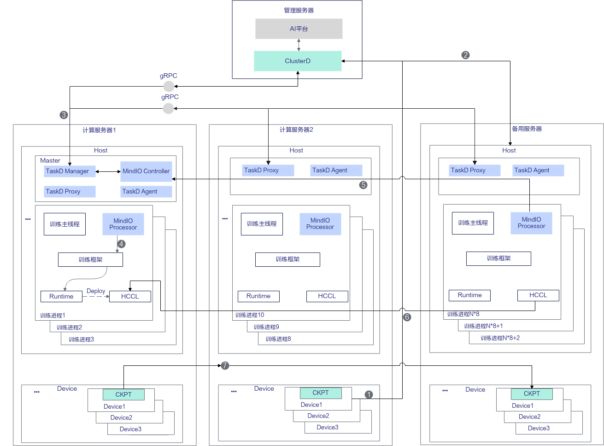

在以上原理图中，各个步骤的说明如下。

1. 设备出现硬件故障后，MindCluster在服务器上的检测组件上报故障信息到ClusterD中，软件故障由容器内MindIO Controller感知并上报到ClusterD。
2. ClusterD将故障服务器上的任务容器退出故障训练进程，重新调度到备用的服务器上。
3. ClusterD通知Master节点上的MindIO Controller进行容错，容错流程包括通知停止训练、通知全局故障、通知恢复策略。
4. MindIO Controller通知每个训练进程中的MindIO Processor，MindIO Processor调用TorchNPU强制停止训练进程。MindIO Processor清理正常节点的资源，销毁通信域，清理后等待新进程加入。
5. 备用服务器上的管理进程拉起训练进程后，创建新的MindIO Processor，MindIO Controller通知每个训练进程中的MindIO Processor恢复训练。
6. 各个进程进行集合通信建链。
7. 正常服务器上的NPU通过参数面将CKPT传递到备用服务器上，完成参数状态恢复后继续训练。

**功能适配点**

在进程级别重调度中，集群大脑会根据全局故障信息决策恢复策略并将策略下发到MindIO，调度器需要支持故障Pod调度，而非整个任务重调度，支持恢复策略依次回退。在训练容器中，框架首先初始化MindIO服务，启动服务后优化器更新时会上报对应状态到MindIO。随后，创建DP副本组和优化器副本，以保障模型参数的冗余备份。在异常发生时，通过异常捕获装饰器捕获故障模式，在恢复时执行算子资源清理，节点重启后触发通信重建。通过参数面在线修复和状态回滚，完成进程级重调度恢复。

对于非MindSpeed-LLM和MindCluster平台用户，需在框架侧完成[表6](#table1995514113610)的功能适配。

**表 6**  进程级别重调度框架适配功能点

<table><thead align="left"><tr id="row169591493619"><th class="cellrowborder" valign="top" width="16.77167716771677%" id="mcps1.2.5.1.1">
适配功能点

</th>
<th class="cellrowborder" valign="top" width="43.23432343234324%" id="mcps1.2.5.1.2">
功能简述

</th>
<th class="cellrowborder" valign="top" width="18.13181318131813%" id="mcps1.2.5.1.3">
适配组件

</th>
<th class="cellrowborder" valign="top" width="21.862186218621858%" id="mcps1.2.5.1.4">
参考链接

</th>
</tr>
</thead>
<tbody><tr id="row893618158397"><td class="cellrowborder" valign="top" width="16.77167716771677%" headers="mcps1.2.5.1.1 ">
初始化拉起

</td>
<td class="cellrowborder" valign="top" width="43.23432343234324%" headers="mcps1.2.5.1.2 ">
训练框架初始化时拉起MindIO服务。

</td>
<td class="cellrowborder" rowspan="9" valign="top" width="18.13181318131813%" headers="mcps1.2.5.1.3 ">
分布式训练框架

</td>
<td class="cellrowborder" rowspan="9" valign="top" width="21.862186218621858%" headers="mcps1.2.5.1.4 ">
<a href="../../../07_references/00_fault_recovery_acceleration/03_usage_guidance.md#对接非mindspeed-llm框架">对接非MindSpeed-LLM框架</a>

</td>
</tr>
<tr id="row1793717157396"><td class="cellrowborder" valign="top" headers="mcps1.2.5.1.1 ">
上报优化器更新状态

</td>
<td class="cellrowborder" valign="top" headers="mcps1.2.5.1.2 ">
优化器更新前上报优化器更新开始和结束。

</td>
</tr>
<tr id="row193701523914"><td class="cellrowborder" valign="top" headers="mcps1.2.5.1.1 ">
创建DP副本组

</td>
<td class="cellrowborder" valign="top" headers="mcps1.2.5.1.2 ">
新增dp_cp/dp_ep副本组及gloo组创建逻辑，在原生Megatron分布式并行组创建后创建相关副本组。

</td>
</tr>
<tr id="row144014113397"><td class="cellrowborder" valign="top" headers="mcps1.2.5.1.1 ">
优化器副本

</td>
<td class="cellrowborder" valign="top" headers="mcps1.2.5.1.2 ">
接管、继承相关Megatron原生优化器功能，嵌入MindIO优化器副本管理逻辑。

</td>
</tr>
<tr id="row74014111391"><td class="cellrowborder" valign="top" headers="mcps1.2.5.1.1 ">
异常捕获装饰器

</td>
<td class="cellrowborder" valign="top" headers="mcps1.2.5.1.2 ">
使用异常捕获装饰器装饰train函数捕获故障模式。

</td>
</tr>
<tr id="row74025111392"><td class="cellrowborder" valign="top" headers="mcps1.2.5.1.1 ">
算子资源清理

</td>
<td class="cellrowborder" valign="top" headers="mcps1.2.5.1.2 ">
通过回调函数完成算子资源清理。

</td>
</tr>
<tr id="row19531411367"><td class="cellrowborder" valign="top" headers="mcps1.2.5.1.1 ">
节点重启及通信重建

</td>
<td class="cellrowborder" valign="top" headers="mcps1.2.5.1.2 ">
通过注册重建回调实现健康节点与故障节点重建通信域。

</td>
</tr>
<tr id="row1708112845416"><td class="cellrowborder" valign="top" headers="mcps1.2.5.1.1 ">
参数面在线修复

</td>
<td class="cellrowborder" valign="top" headers="mcps1.2.5.1.2 ">
通过回调函数完成副本卡与恢复卡恢复处理。

</td>
</tr>
<tr id="row1911610240547"><td class="cellrowborder" valign="top" headers="mcps1.2.5.1.1 ">
状态回滚

</td>
<td class="cellrowborder" valign="top" headers="mcps1.2.5.1.2 ">
通过回调函数完成数据迭代器重建、框架变量重置。

</td>
</tr>
<tr id="row1311652445414"><td class="cellrowborder" valign="top" width="16.77167716771677%" headers="mcps1.2.5.1.1 ">
恢复策略决策

</td>
<td class="cellrowborder" valign="top" width="43.23432343234324%" headers="mcps1.2.5.1.2 ">
根据全局故障信息决策恢复策略，并下发到MindIO，支持恢复策略回退，进程级重调度失败回退到Pod级别、Job级别重调度。

</td>
<td class="cellrowborder" rowspan="2" valign="top" width="18.13181318131813%" headers="mcps1.2.5.1.3 ">
AI平台

</td>
<td class="cellrowborder" valign="top" width="21.862186218621858%" headers="mcps1.2.5.1.4 ">
<a href="https://gitcode.com/Ascend/mind-cluster/tree/branch_v26.1.0/component/clusterd/pkg/application/recover" target="_blank" rel="noopener noreferrer">链接</a>

</td>
</tr>
<tr id="row18952145365"><td class="cellrowborder" valign="top" headers="mcps1.2.5.1.1 ">
故障Pod调度

</td>
<td class="cellrowborder" valign="top" headers="mcps1.2.5.1.2 ">
调度故障Pod，支持调度恢复策略回退。

</td>
<td class="cellrowborder" valign="top" headers="mcps1.2.5.1.3 ">
<a href="https://gitcode.com/Ascend/mind-cluster/tree/branch_v26.1.0/component/ascend-for-volcano/internal/rescheduling" target="_blank" rel="noopener noreferrer">链接</a>

</td>
</tr>
</tbody>
</table>

### 亚健康退出与重调度

- graceExit：不使用亚健康节点，并保存临终CKPT文件后，进行重调度，后续任务不会调度到该节点。
- forceExit：不使用亚健康节点，不保存任务直接退出，进行重调度，后续任务不会调度到该节点。

使用graceExit策略时，需保证任务开启了临终CKPT保存功能。

### 亚健康热切

训练任务配置为亚健康热切策略（hotSwitch）后，当发生亚健康故障时，拉起备份节点后暂停训练进程，再使用备份节点重新拉起训练任务。

**使用约束**

- 对于PyTorch训练框架，需配合MindSpeed-LLM 2.3.0版本使用，版本配套请参见[MindSpeed-LLM](https://gitcode.com/Ascend/MindSpeed-LLM/tree/2.3.0)。
- 对于MindSpore训练框架，需配合MindFormers master版本使用，版本配套请参见[MindSpore MindFormers](https://gitcode.com/mindspore/mindformers/tree/master)。
- 只支持PyTorch单算子模式、基于Megatron框架的模型以及acjob类型训练任务。
- MindSpore场景下，为保证本功能的正常使用，请将MindSpore和MindIO安装在同一路径下。
- 不支持多模态模型。
- 不支持开启watchdog功能。
- 训练任务未出迭代时触发热切，可能会造成MindIO阻塞，最后触发Job级别重调度。
- 当训练任务的annotation中hccl/rankIndex字段为0的Pod发生亚健康故障时，不支持触发亚健康热切。
- 以下异常情况会回退至Job级别重调度，且任务亚健康处理策略降级为ignore，不再处理亚健康故障：
    - 备份Pod拉起后，训练暂停失败。
    - 备份Pod拉起后，MindCluster等待上报训练暂停状态超时（15分钟）。
    - 备份Pod运行失败。
    - 原Pod删除后，训练恢复失败。
    - 原Pod删除后，MindCluster等待上报训练恢复状态超时（15分钟）。

- 配置亚健康热切策略后，会自动增加进程级恢复开关，若发生非亚健康故障，将触发进程级恢复流程。
- 无备节点场景下，无法完成热切流程，任务亚健康处理策略降级为ignore，不再处理亚健康故障。
- 本功能依赖MindIO组件，使用前请先了解MindIO的[约束限制](../../../07_references/00_fault_recovery_acceleration/02_installation_and_deployment.md#约束限制)。

**支持的产品型号和AI框架**

**表 14**  亚健康热切支持的产品和框架

<table><thead align="left"><tr id="zh-cn_topic_0000002039194017_row111997118547"><th class="cellrowborder" valign="top" width="25.172517251725175%" id="mcps1.2.4.1.1">
产品类型

</th>
<th class="cellrowborder" valign="top" width="59.82598259825983%" id="mcps1.2.4.1.2">
硬件形态

</th>
<th class="cellrowborder" valign="top" width="15.001500150015001%" id="mcps1.2.4.1.3">
训练框架

</th>
</tr>
</thead>
<tbody><tr id="zh-cn_topic_0000002039194017_row920001115417"><td class="cellrowborder" valign="top" width="25.172517251725175%" headers="mcps1.2.4.1.1 ">
<term id="zh-cn_topic_0000001519959665_term57208119917">Atlas A2 训练系列产品</term>

</td>
<td class="cellrowborder" valign="top" width="59.82598259825983%" headers="mcps1.2.4.1.2 ">
Atlas 800T A2 训练服务器

</td>
<td class="cellrowborder" valign="top" width="15.001500150015001%" headers="mcps1.2.4.1.3 "><ul id="ul15879359132214"><li>MindSpore</li><li>PyTorch</li></ul>
</td>
</tr>
<tr id="zh-cn_topic_0000002039194017_row13204101125410"><td class="cellrowborder" valign="top" width="25.172517251725175%" headers="mcps1.2.4.1.1 ">
<term id="zh-cn_topic_0000001519959665_term26764913715">Atlas A3 训练系列产品</term>

</td>
<td class="cellrowborder" valign="top" width="59.82598259825983%" headers="mcps1.2.4.1.2 "><ul id="ul9000a3superpod_hotswitch"><li>Atlas 800T A3 超节点服务器</li><li>Atlas 9000 A3 SuperPoD 集群算力系统</li></ul>
</td>
<td class="cellrowborder" valign="top" width="15.001500150015001%" headers="mcps1.2.4.1.3 "><ul id="ul6531100274"><li>MindSpore</li><li>PyTorch</li></ul>
</td>
</tr>
</tbody>
</table>

**亚健康热切原理**

**图 9**  原理图

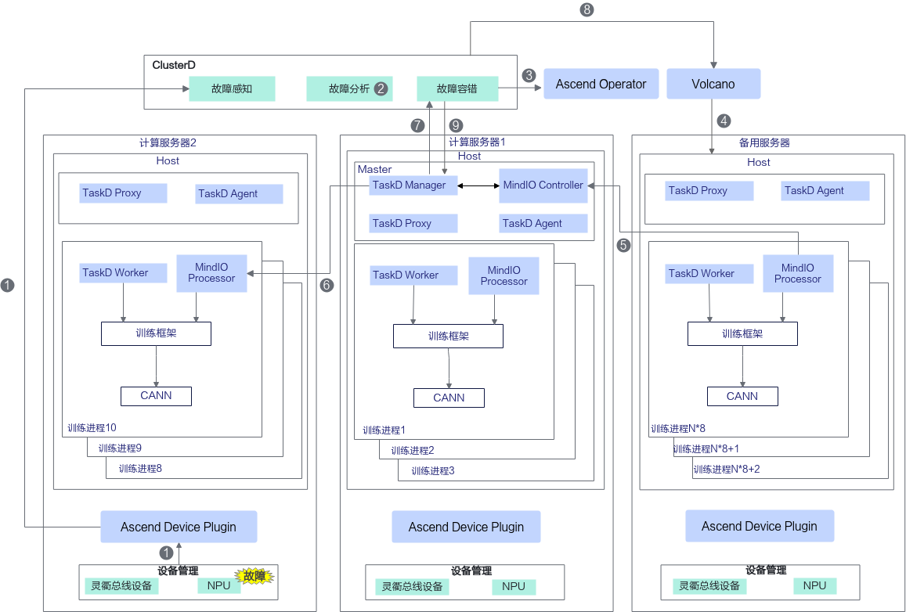

在以上原理图中，各个步骤的说明如下。

1. ClusterD通过Ascend Device Plugin感知到亚健康故障。
2. ClusterD根据配置策略决策是否进行亚健康热切恢复。
3. ClusterD通知Ascend Operator拉起备份Pod。
4. Volcano调度备份Pod。
5. 备份Pod中创建新的MindIO Processor，MindIO Processor向MindIO Controller发起注册。
6. MindIO Controller下发训练暂停通知。
7. MindIO Controller通知ClusterD训练暂停。
8. ClusterD通知Volcano删除故障Pod。
9. ClusterD通知MindIO恢复训练。

**适配功能点**

在亚健康热切中，集群大脑根据亚健康故障信息，为故障Pod设置注解，拉起并调度备份Pod，通知热切策略到MindIO，训练切换到备份Pod后恢复训练。在训练容器中，框架首先初始化MindIO服务，启动服务后优化器更新时会上报对应状态到MindIO。在异常发生时，通过异常捕获装饰器捕获故障模式。在新节点启动后，正常节点暂停训练，之后重建通信域，完成新节点参数面恢复，训练状态完成后完成节点热切换。

对于非MindSpeed-LLM、MindCluster平台用户，需在框架侧完成[表15](#table19955141136104)的功能适配。

**表 15**  亚健康热切框架适配功能点

<table><thead align="left"><tr id="row169591493619"><th class="cellrowborder" valign="top" width="18.200000000000003%" id="mcps1.2.5.1.1">
适配功能点

</th>
<th class="cellrowborder" valign="top" width="39.330000000000005%" id="mcps1.2.5.1.2">
功能简述

</th>
<th class="cellrowborder" valign="top" width="19.670000000000005%" id="mcps1.2.5.1.3">
适配组件

</th>
<th class="cellrowborder" valign="top" width="22.800000000000004%" id="mcps1.2.5.1.4">
参考链接

</th>
</tr>
</thead>
<tbody><tr id="row893618158397"><td class="cellrowborder" valign="top" width="18.200000000000003%" headers="mcps1.2.5.1.1 ">
初始化拉起

</td>
<td class="cellrowborder" valign="top" width="39.330000000000005%" headers="mcps1.2.5.1.2 ">
训练框架初始化时拉起MindIO服务。

</td>
<td class="cellrowborder" rowspan="9" valign="top" width="19.670000000000005%" headers="mcps1.2.5.1.3 ">
分布式训练框架

</td>
<td class="cellrowborder" rowspan="9" valign="top" width="22.800000000000004%" headers="mcps1.2.5.1.4 ">
<a href="../../../07_references/00_fault_recovery_acceleration/03_usage_guidance.md#对接非mindspeed-llm框架">对接非MindSpeed-LLM框架</a>

</td>
</tr>
<tr id="row1793717157396"><td class="cellrowborder" valign="top" headers="mcps1.2.5.1.1 ">
上报优化器更新状态

</td>
<td class="cellrowborder" valign="top" headers="mcps1.2.5.1.2 ">
优化器更新前上报优化器更新开始和结束。

</td>
</tr>
<tr id="row193701523914"><td class="cellrowborder" valign="top" headers="mcps1.2.5.1.1 ">
创建DP副本组

</td>
<td class="cellrowborder" valign="top" headers="mcps1.2.5.1.2 ">
新增dp_cp/dp_ep副本组及gloo组创建逻辑，在原生Megatron分布式并行组创建后创建相关副本组。

</td>
</tr>
<tr id="row191961528155914"><td class="cellrowborder" valign="top" headers="mcps1.2.5.1.1 ">
优化器副本

</td>
<td class="cellrowborder" valign="top" headers="mcps1.2.5.1.2 ">
接管、继承相关Megatron原生优化器功能，嵌入MindIO优化器副本管理逻辑。

</td>
</tr>
<tr id="row111971728195915"><td class="cellrowborder" valign="top" headers="mcps1.2.5.1.1 ">
异常捕获装饰器

</td>
<td class="cellrowborder" valign="top" headers="mcps1.2.5.1.2 ">
使用异常捕获装饰器装饰train函数捕获故障模式。

</td>
</tr>
<tr id="row1519712855916"><td class="cellrowborder" valign="top" headers="mcps1.2.5.1.1 ">
节点重启及通信重建

</td>
<td class="cellrowborder" valign="top" headers="mcps1.2.5.1.2 ">
通过注册重建回调实现健康节点与故障节点重建通信域。

</td>
</tr>
<tr id="row1375943411593"><td class="cellrowborder" valign="top" headers="mcps1.2.5.1.1 ">
参数面在线修复

</td>
<td class="cellrowborder" valign="top" headers="mcps1.2.5.1.2 ">
通过回调函数完成副本卡与恢复卡恢复处理。

</td>
</tr>
<tr id="row876023415918"><td class="cellrowborder" valign="top" headers="mcps1.2.5.1.1 ">
状态回滚

</td>
<td class="cellrowborder" valign="top" headers="mcps1.2.5.1.2 ">
通过回调函数完成数据迭代器重建、框架变量重置。

</td>
</tr>
<tr id="row17605341596"><td class="cellrowborder" valign="top" headers="mcps1.2.5.1.1 ">
优雅暂停

</td>
<td class="cellrowborder" valign="top" headers="mcps1.2.5.1.2 ">
训练迭代循环最尾部增加MindIO函数调用，实现主动暂停功能。

</td>
</tr>
<tr id="row144412445361"><td class="cellrowborder" valign="top" width="18.200000000000003%" headers="mcps1.2.5.1.1 ">
热切流程控制

</td>
<td class="cellrowborder" valign="top" width="39.330000000000005%" headers="mcps1.2.5.1.2 ">
管理热切恢复流程，通过设置注解方式管理备份Pod和故障Pod。

</td>
<td class="cellrowborder" rowspan="2" valign="top" width="19.670000000000005%" headers="mcps1.2.5.1.3 ">
AI平台

</td>
<td class="cellrowborder" valign="top" width="22.800000000000004%" headers="mcps1.2.5.1.4 ">
<a href="https://gitcode.com/Ascend/mind-cluster/blob/branch_v26.1.0/component/clusterd/pkg/application/recover/hot_switch_controller.go" target="_blank" rel="noopener noreferrer">链接</a>

</td>
</tr>
<tr id="row14716101112393"><td class="cellrowborder" valign="top" headers="mcps1.2.5.1.1 ">
Pod创建删除

</td>
<td class="cellrowborder" valign="top" headers="mcps1.2.5.1.2 ">
通过识别特定注解删除和创建Pod。

</td>
<td class="cellrowborder" valign="top" headers="mcps1.2.5.1.3 ">
<a href="https://gitcode.com/Ascend/mind-cluster/blob/branch_v26.1.0/component/ascend-operator/pkg/controllers/v1/ascendjob_controller.go" target="_blank" rel="noopener noreferrer">链接</a>

</td>
</tr>
</tbody>
</table>

## 在线恢复

### 算子级在线恢复

Atlas A3 训练系列产品支持在发生参数面网络故障时，HCCL会执行通信算子重传。在故障进程不退出的情况下，算子级在线恢复可容忍更长时间的网络异常，训练任务不中断。

若网络故障的算子级在线恢复（HCCL通信算子重执行）执行失败，则回退至进程级在线恢复

了解算子级在线恢复的关键配置步骤，请参见[配置算子级在线恢复](../03_configuration/01_configuring_fault_handling_policies.md#配置算子级在线恢复)。

>[!NOTE]
>HCCL（Huawei Collective Communication Library，华为集合通信库）是华为专为昇腾（Ascend）AI处理器设计的分布式通信库，旨在优化多设备（如NPU/GPU）间的高效协作，以加速深度学习模型的分布式训练，适用于需要大规模算力的AI场景。在分布式训练中，HCCL负责协调多个昇腾处理器之间的数据同步（如梯度聚合、参数更新），减少通信开销，提升训练效率。

**使用场景**

当前支持在以下2种故障场景下使用算子级在线恢复功能。

- 对于芯片网络相关故障，当算子重传成功时，Volcano会将任务作为亚健康任务处理。当算子重传失败时，Volcano触发重调度处理。
- 对于灵衢总线设备相关故障，HCCL执行算子级在线恢复后，Volcano会将任务作为亚健康任务处理。

**使用约束**

- 本特性不支持MC2开启场景。
- 不支持开启watchdog功能。

**算子级在线恢复支持的产品和框架**

**表 7**  支持的产品和框架

<table><thead align="left"><tr id="row17647111614214"><th class="cellrowborder" valign="top" width="33.333333333333336%" id="mcps1.2.4.1.1">
产品系列

</th>
<th class="cellrowborder" valign="top" width="33.29332933293329%" id="mcps1.2.4.1.2">
产品名称

</th>
<th class="cellrowborder" valign="top" width="33.373337333733375%" id="mcps1.2.4.1.3">
训练框架

</th>
</tr>
</thead>
<tbody><tr id="row14649101615422"><td class="cellrowborder" valign="top" width="33.333333333333336%" headers="mcps1.2.4.1.1 ">
Atlas A3 训练系列产品

</td>
<td class="cellrowborder" valign="top" width="33.29332933293329%" headers="mcps1.2.4.1.2 "><ul id="ul_op_online_product_list"><li>Atlas 900 A3 SuperPoD 超节点</li><li>Atlas 9000 A3 SuperPoD 集群算力系统</li></ul>
</td>
<td class="cellrowborder" valign="top" width="33.373337333733375%" headers="mcps1.2.4.1.3 ">
-

</td>
</tr>
</tbody>
</table>

**算子级在线恢复原理**

**图 5**  原理图

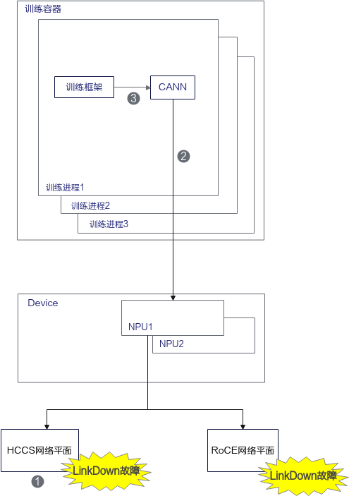

在以上原理图中，各个步骤的说明如下。

1. 训练过程中，发生HCCS网络平面LinkDown故障或RoCE网络平面LinkDown故障。
2. CANN检测到网络故障，当前算子终止后，进行网络链路恢复（HCCS网络平面进行BGP切路，RoCE网络平面进行借轨通信），通信链路恢复后进行网络算子重执行。
3. 算子重执行成功后，恢复训练迭代。

### 进程级在线恢复

进程级在线恢复（Step级别重计算恢复）主要针对以下2种故障类型进行故障处理：

- 网络故障：当前仅支持以下三种场景。
    - HCCS L1-L2端口或链路故障时，BGP切路后，若开启算子级在线恢复且执行失败后进行Step级重试，实现进程不退出的故障快速恢复；若关闭算子级在线恢复，则对训练进程进行Step级重试，实现进程不退出的故障快速恢复。
    - RoCE到上级端口或链路故障，且开启算子级在线恢复并执行失败时，对训练进程进行Step级重试，实现进程不退出的故障快速恢复。
    - Atlas 950 SuperPoD超节点场景下，unions到上级unions/5808的UB端口或链路发生故障时，对训练进程进行Step级重试，实现进程不退出的故障快速恢复。

- 片上内存故障：片上内存上出现的不可纠正错误（如故障码0x80E01801），先隔离故障片上内存空间，然后对训练进程进行Step级重试，实现进程不退出的故障快速恢复。

在以上2种场景下，如果故障不能恢复，则回退至**重调度模式**。

相比于进程级别重调度，进程级在线恢复不会重调度故障进程，减少了大量进程间不同步的等待耗时。同时通过NPU卡间的参数面高速网络P2P传递CKPT信息，避免了CKPT保存和加载的耗时。

该故障处理模式默认关闭，若要开启请参见[（可选）配置组件](../04_examples_and_verification/menu_examples_and_verification.md#ZH-CN_TOPIC_0000002511346449)。

了解进程级在线恢复的关键配置步骤，请参见[配置进程级在线恢复](../03_configuration/01_configuring_fault_handling_policies.md#配置进程级在线恢复)。

>[!NOTE]
>
>- 参数面传递CKPT信息依赖未故障卡中的全量优化器副本，如果不存在全量优化器副本，则回退为加载存储中的CKPT文件恢复参数。
>- 优化器副本依赖额外的显存占用，如果用户的显存较为紧张，可选择本地加载模式，无论是否存在优化器副本都直接加载存储中的CKPT文件恢复参数。

**使用约束**

- 对于PyTorch训练框架，需配套MindSpeed版本使用，版本配套请参见[MindSpeed-LLM](https://gitcode.com/Ascend/MindSpeed-LLM/tree/2.3.0)。
- 对于MindSpore训练框架，需配套MindFormers版本使用，版本配套请参见[MindSpore MindFormers](https://gitcode.com/mindspore/mindformers/tree/master)。
- 依赖于PyTorch的内存管理机制，仅在PYTORCH\_NO\_NPU\_MEMORY\_CACHING未配置时才能使用此功能。
- 针对部分片上内存故障场景无法生效，例如HCCL集合通信使用的内存地址故障，仍需通过进程级重调度或更上层的容错方案恢复。
- 针对MindSpeed-LLM、MindSpeed等模型或训练脚本中定义的全局变量发生故障的场景，详细处理策略请参见[FAQ](https://gitcode.com/Ascend/mind-cluster/issues/368)。
- 与优雅容错不能同时开启。若同时开启，断点续训将通过Job级别重调度恢复训练。
- MindSpore场景下，为保证本功能的正常使用，请将MindSpore和MindIO安装在同一路径下。
- MindSpore场景下，需要在启动TaskD Manager前设置export TASKD\_PROCESS\_ENABLE="on"。
- 请勿使用ConfigMap挂载RankTable文件，否则可能会导致任务重调度失败。
- 不支持多模态模型。
- 不支持MC2开启场景。
- 不支持开启watchdog功能。
- 当故障发生在HCCL建链阶段时，会导致进程级在线恢复失败。如果除训练初始化的HCCL建链外，还存在其他训练阶段的HCCL建链，可参考[配置HCCL主动触发建链](../03_configuration/02_configuring_training_recovery.md#配置hccl主动触发建链)章节进行提前建链，防止故障出现在HCCL建链阶段。
- 本功能依赖MindIO组件，使用前请先了解MindIO的[约束限制](../../../07_references/00_fault_recovery_acceleration/02_installation_and_deployment.md#约束限制)。

**支持的产品型号及AI框架**

**表 8**  网络故障进程级在线恢复支持的产品和框架

<table><thead align="left"><tr id="zh-cn_topic_0000002003193196_row81042144212"><th class="cellrowborder" valign="top" width="33.333333333333336%" id="mcps1.2.4.1.1">
产品系列

</th>
<th class="cellrowborder" valign="top" width="33.29332933293329%" id="mcps1.2.4.1.2">
产品名称

</th>
<th class="cellrowborder" valign="top" width="33.373337333733375%" id="mcps1.2.4.1.3">
训练框架

</th>
</tr>
</thead>
<tbody><tr id="zh-cn_topic_0000002003193196_row1910518141229"><td class="cellrowborder" valign="top" width="33.333333333333336%" headers="mcps1.2.4.1.1 ">
Atlas A3 训练系列产品

</td>
<td class="cellrowborder" valign="top" width="33.29332933293329%" headers="mcps1.2.4.1.2 "><ul id="ul18927338231"><li>Atlas 900 A3 SuperPoD 超节点</li><li>Atlas 800T A3 超节点服务器</li><li>Atlas 9000 A3 SuperPoD 集群算力系统</li></ul>
</td>
<td class="cellrowborder" valign="top" width="33.373337333733375%" headers="mcps1.2.4.1.3 "><ul id="ul17506112910131"><li>MindSpore</li></ul>
<ul id="ul7506132918139"><li>PyTorch</li></ul>
</td>
</tr>
<tr id="row_ascend950_network"><td class="cellrowborder" valign="top" width="33.333333333333336%" headers="mcps1.2.4.1.1 ">
Ascend 950 系列产品

</td>
<td class="cellrowborder" valign="top" width="33.29332933293329%" headers="mcps1.2.4.1.2 "><ul id="ul_ascend950_network"><li>Atlas 950 SuperPoD 超节点</li></ul>
</td>
<td class="cellrowborder" valign="top" width="33.373337333733375%" headers="mcps1.2.4.1.3 "><ul id="ul_ascend950_network_framework"><li>PyTorch</li></ul>
</td>
</tr>
</tbody>
</table>

**表 9** 片上内存故障进程级在线恢复支持的产品和框架

<table><thead align="left"><tr id="row13630161784418"><th class="cellrowborder" valign="top" width="33.333333333333336%" id="mcps1.2.4.1.1">
产品系列

</th>
<th class="cellrowborder" valign="top" width="33.29332933293329%" id="mcps1.2.4.1.2">
产品名称

</th>
<th class="cellrowborder" valign="top" width="33.373337333733375%" id="mcps1.2.4.1.3">
训练框架

</th>
</tr>
</thead>
<tbody><tr id="row5631517114410"><td class="cellrowborder" valign="top" width="33.333333333333336%" headers="mcps1.2.4.1.1 ">
Atlas A2 训练系列产品

</td>
<td class="cellrowborder" valign="top" width="33.29332933293329%" headers="mcps1.2.4.1.2 "><ul id="ul0631181774417"><li>Atlas 800T A2 训练服务器</li><li>Atlas 900 A2 PoD 集群基础单元</li><li>Atlas 900 A2 PoDc 集群基础单元</li></ul>
</td>
<td class="cellrowborder" valign="top" width="33.373337333733375%" headers="mcps1.2.4.1.3 "><ul id="ul3631151714415"><li>MindSpore</li></ul>
<ul id="ul1263181794418"><li>PyTorch</li></ul>
</td>
</tr>
<tr id="row16631181714416"><td class="cellrowborder" valign="top" width="33.333333333333336%" headers="mcps1.2.4.1.1 ">
Atlas A3 训练系列产品

</td>
<td class="cellrowborder" valign="top" width="33.29332933293329%" headers="mcps1.2.4.1.2 "><ul id="ul1763161764415"><li>Atlas 900 A3 SuperPoD 超节点</li><li>Atlas 800T A3 超节点服务器</li><li>Atlas 9000 A3 SuperPoD 集群算力系统</li></ul>
</td>
<td class="cellrowborder" valign="top" width="33.373337333733375%" headers="mcps1.2.4.1.3 "><ul id="ul96311517144415"><li>MindSpore</li></ul>
<ul id="ul7631141712447"><li>PyTorch</li></ul>
</td>
</tr>
<tr id="row_ascend950_hbm"><td class="cellrowborder" valign="top" width="33.333333333333336%" headers="mcps1.2.4.1.1 ">
Ascend 950 系列产品

</td>
<td class="cellrowborder" valign="top" width="33.29332933293329%" headers="mcps1.2.4.1.2 "><ul id="ul_ascend950_hbm"><li>Atlas 950 SuperPoD 超节点</li></ul>
</td>
<td class="cellrowborder" valign="top" width="33.373337333733375%" headers="mcps1.2.4.1.3 "><ul id="ul_ascend950_hbm_fw2"><li>PyTorch</li></ul>
</td>
</tr>
</tbody>
</table>

**进程级在线恢复原理**

训练过程中如果出现了片上内存故障或网络故障，将导致训练状态异常。进程级在线恢复首先通知所有训练进程停止当前训练，然后保留当前训练信息并修复故障。修复完成后，所有训练进程回退训练状态到当前上一个Step结束时，正常服务器通过参数面将CKPT传递到故障服务器上，完成参数恢复后重新执行当前Step，然后恢复训练任务。

**图 6**  进程级在线恢复原理

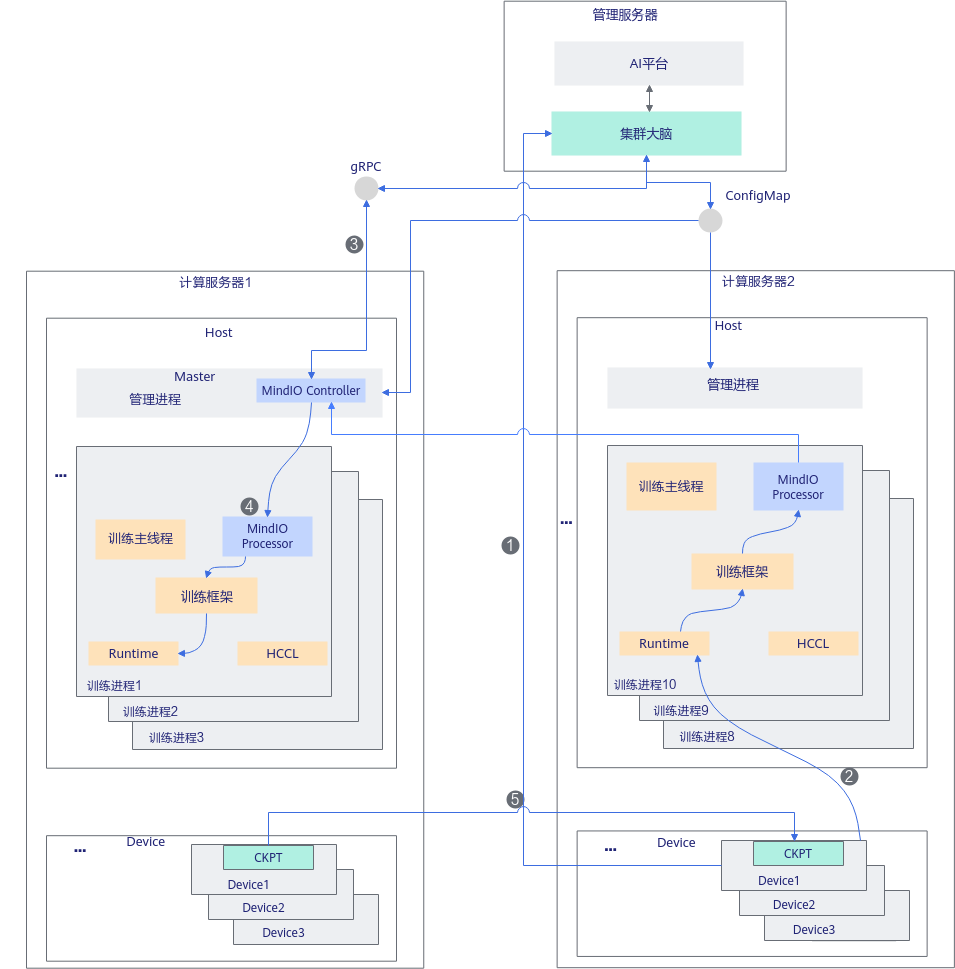

在以上原理图中，各个步骤的说明如下。

1. 设备出现片上内存故障或网络故障后，MindCluster在服务器上的检测组件上报故障信息到集群大脑ClusterD中。
2. 片上内存故障或网络故障被CANN软件感知，经训练框架上报给MindIO Processor和MindIO Controller。
3. MindIO Controller向集群大脑请求决策是否进行Step级别重计算恢复，集群大脑综合集群其他节点的健康状态给出决策。
4. MindIO Controller通知每个训练进程中的MindIO Processor，调用训练框架停止任务、修复故障，保留通信域信息。
5. 正常服务器上的NPU通过参数面将CKPT传递到故障（已修复）服务器上，完成参数状态恢复后继续训练，重新启动当前Step计算。

**适配功能点**

在进程级在线恢复中，集群大脑根据故障信息识别网络故障和片上内存故障，下发对应恢复策略，支持恢复策略回退。在训练容器中，框架首先初始化MindIO服务，启动服务后优化器更新时会上报对应状态到MindIO。随后，创建DP副本组和优化器副本，以保障模型参数的冗余备份。在异常发生时，通过异常捕获装饰器捕获故障模式，在恢复时针对不同故障执行算子资源清理、UCE模型优化器重建、参数面在线修复、状态回滚，完成进程级在线恢复。

对于非MindSpeed-LLM、MindCluster平台用户，针对不同故障需在框架侧完成以下功能适配。

**表 10**  进程级在线恢复针对网络故障框架适配功能点

<table><thead align="left"><tr id="row169591493619"><th class="cellrowborder" valign="top" width="18.61186118611861%" id="mcps1.2.5.1.1">
适配功能点

</th>
<th class="cellrowborder" valign="top" width="36.72367236723672%" id="mcps1.2.5.1.2">
功能简述

</th>
<th class="cellrowborder" valign="top" width="17.981798179817982%" id="mcps1.2.5.1.3">
适配组件

</th>
<th class="cellrowborder" valign="top" width="26.68266826682668%" id="mcps1.2.5.1.4">
参考链接

</th>
</tr>
</thead>
<tbody><tr id="row199614191876"><td class="cellrowborder" valign="top" width="18.61186118611861%" headers="mcps1.2.5.1.1 ">
初始化拉起

</td>
<td class="cellrowborder" valign="top" width="36.72367236723672%" headers="mcps1.2.5.1.2 ">
训练框架初始化时拉起MindIO服务。

</td>
<td class="cellrowborder" rowspan="5" valign="top" width="17.981798179817982%" headers="mcps1.2.5.1.3 ">
分布式训练框架

</td>
<td class="cellrowborder" rowspan="5" valign="top" width="26.68266826682668%" headers="mcps1.2.5.1.4 ">
<a href="../../../07_references/00_fault_recovery_acceleration/03_usage_guidance.md#对接非mindspeed-llm框架">对接非MindSpeed-LLM框架</a>

</td>
</tr>
<tr id="row149661916713"><td class="cellrowborder" valign="top" headers="mcps1.2.5.1.1 ">
上报优化器更新状态

</td>
<td class="cellrowborder" valign="top" headers="mcps1.2.5.1.2 ">
优化器更新前上报优化器更新开始和结束。

</td>
</tr>
<tr id="row1239411299541"><td class="cellrowborder" valign="top" headers="mcps1.2.5.1.1 ">
异常捕获装饰器

</td>
<td class="cellrowborder" valign="top" headers="mcps1.2.5.1.2 ">
使用异常捕获装饰器装饰train函数捕获故障模式。

</td>
</tr>
<tr id="row13395629115418"><td class="cellrowborder" valign="top" headers="mcps1.2.5.1.1 ">
算子资源清理

</td>
<td class="cellrowborder" valign="top" headers="mcps1.2.5.1.2 ">
通过回调函数完成算子资源清理。

</td>
</tr>
<tr id="row7395142913549"><td class="cellrowborder" valign="top" headers="mcps1.2.5.1.1 ">
状态回滚

</td>
<td class="cellrowborder" valign="top" headers="mcps1.2.5.1.2 ">
通过回调函数完成数据迭代器重建、框架变量重置。

</td>
</tr>
<tr id="row539519296541"><td class="cellrowborder" valign="top" width="18.61186118611861%" headers="mcps1.2.5.1.1 ">
恢复策略决策

</td>
<td class="cellrowborder" valign="top" width="36.72367236723672%" headers="mcps1.2.5.1.2 ">
根据故障信息识别网络故障或片上内存故障，下发对应恢复策略，支持恢复策略回退。

</td>
<td class="cellrowborder" rowspan="2" valign="top" width="17.981798179817982%" headers="mcps1.2.5.1.3 ">
AI平台

</td>
<td class="cellrowborder" valign="top" width="26.68266826682668%" headers="mcps1.2.5.1.4 ">
<a href="https://gitcode.com/Ascend/mind-cluster/tree/branch_v26.1.0/component/clusterd/pkg/application/recover" target="_blank" rel="noopener noreferrer">链接</a>

</td>
</tr>
<tr id="row7396029145419"><td class="cellrowborder" valign="top" headers="mcps1.2.5.1.1 ">
故障Pod调度

</td>
<td class="cellrowborder" valign="top" headers="mcps1.2.5.1.2 ">
调度故障Pod，支持调度恢复策略回退。

</td>
<td class="cellrowborder" valign="top" headers="mcps1.2.5.1.3 ">
<a href="https://gitcode.com/Ascend/mind-cluster/tree/branch_v26.1.0/component/ascend-for-volcano/internal/rescheduling" target="_blank" rel="noopener noreferrer">链接</a>

</td>
</tr>
</tbody>
</table>

**表 11**  进程级在线恢复针对片上内存故障框架适配功能点

<table><thead align="left"><tr id="row866213619553"><th class="cellrowborder" valign="top" width="17.119999999999997%" id="mcps1.2.5.1.1">
适配功能点

</th>
<th class="cellrowborder" valign="top" width="38.769999999999996%" id="mcps1.2.5.1.2">
功能简述

</th>
<th class="cellrowborder" valign="top" width="17.43%" id="mcps1.2.5.1.3">
适配组件

</th>
<th class="cellrowborder" valign="top" width="26.68%" id="mcps1.2.5.1.4">
参考链接

</th>
</tr>
</thead>
<tbody><tr id="row19662436145518"><td class="cellrowborder" valign="top" width="17.119999999999997%" headers="mcps1.2.5.1.1 ">
初始化拉起

</td>
<td class="cellrowborder" valign="top" width="38.769999999999996%" headers="mcps1.2.5.1.2 ">
训练框架初始化时拉起MindIO服务。

</td>
<td class="cellrowborder" rowspan="9" valign="top" width="17.43%" headers="mcps1.2.5.1.3 ">
分布式训练框架

</td>
<td class="cellrowborder" rowspan="9" valign="top" width="26.68%" headers="mcps1.2.5.1.4 ">
<a href="../../../07_references/00_fault_recovery_acceleration/03_usage_guidance.md#对接非mindspeed-llm框架">对接非MindSpeed-LLM框架</a>

</td>
</tr>
<tr id="row566215364551"><td class="cellrowborder" valign="top" headers="mcps1.2.5.1.1 ">
上报优化器更新状态

</td>
<td class="cellrowborder" valign="top" headers="mcps1.2.5.1.2 ">
优化器更新前上报优化器更新开始和结束。

</td>
</tr>
<tr id="row06621936185512"><td class="cellrowborder" valign="top" headers="mcps1.2.5.1.1 ">
创建DP副本组

</td>
<td class="cellrowborder" valign="top" headers="mcps1.2.5.1.2 ">
新增dp_cp/dp_ep副本组及gloo组创建逻辑，在原生Megatron分布式并行组创建后创建相关副本组。

</td>
</tr>
<tr id="row2662133617558"><td class="cellrowborder" valign="top" headers="mcps1.2.5.1.1 ">
优化器副本

</td>
<td class="cellrowborder" valign="top" headers="mcps1.2.5.1.2 ">
接管、继承相关Megatron原生优化器功能，嵌入MindIO优化器副本管理逻辑。

</td>
</tr>
<tr id="row066213685511"><td class="cellrowborder" valign="top" headers="mcps1.2.5.1.1 ">
异常捕获装饰器

</td>
<td class="cellrowborder" valign="top" headers="mcps1.2.5.1.2 ">
使用异常捕获装饰器装饰train函数捕获故障模式。

</td>
</tr>
<tr id="row666243613555"><td class="cellrowborder" valign="top" headers="mcps1.2.5.1.1 ">
算子资源清理

</td>
<td class="cellrowborder" valign="top" headers="mcps1.2.5.1.2 ">
通过回调函数完成算子资源清理。

</td>
</tr>
<tr id="row14662143645516"><td class="cellrowborder" valign="top" headers="mcps1.2.5.1.1 ">
UCE模型优化器重建

</td>
<td class="cellrowborder" valign="top" headers="mcps1.2.5.1.2 ">
通过回调函数完成故障卡模型优化器对象操作清理、重建操作。

</td>
</tr>
<tr id="row43068171121"><td class="cellrowborder" valign="top" headers="mcps1.2.5.1.1 ">
参数面在线修复

</td>
<td class="cellrowborder" valign="top" headers="mcps1.2.5.1.2 ">
通过回调函数完成副本卡与恢复卡恢复处理。

</td>
</tr>
<tr id="row17307161715127"><td class="cellrowborder" valign="top" headers="mcps1.2.5.1.1 ">
状态回滚

</td>
<td class="cellrowborder" valign="top" headers="mcps1.2.5.1.2 ">
通过回调函数完成数据迭代器重建、框架变量重置。

</td>
</tr>
<tr id="row966233613558"><td class="cellrowborder" valign="top" width="17.119999999999997%" headers="mcps1.2.5.1.1 ">
恢复策略决策

</td>
<td class="cellrowborder" valign="top" width="38.769999999999996%" headers="mcps1.2.5.1.2 ">
根据故障信息识别网络故障或片上内存故障，下发对应恢复策略，支持恢复策略回退。

</td>
<td class="cellrowborder" rowspan="2" valign="top" width="17.43%" headers="mcps1.2.5.1.3 ">
AI平台

</td>
<td class="cellrowborder" valign="top" width="26.68%" headers="mcps1.2.5.1.4 ">
<a href="https://gitcode.com/Ascend/mind-cluster/tree/branch_v26.1.0/component/clusterd/pkg/application/recover" target="_blank" rel="noopener noreferrer">链接</a>

</td>
</tr>
<tr id="row16621936105516"><td class="cellrowborder" valign="top" headers="mcps1.2.5.1.1 ">
故障Pod调度

</td>
<td class="cellrowborder" valign="top" headers="mcps1.2.5.1.2 ">
调度故障Pod，支持调度恢复策略回退。

</td>
<td class="cellrowborder" valign="top" headers="mcps1.2.5.1.3 ">
<a href="https://gitcode.com/Ascend/mind-cluster/tree/branch_v26.1.0/component/ascend-for-volcano/internal/rescheduling" target="_blank" rel="noopener noreferrer">链接</a>

</td>
</tr>
</tbody>
</table>

## 切换恢复

### 借轨通信任务暂停与回切

Atlas A3 训练系列产品场景下，MindCluster集群调度组件提供训练任务借轨通信的暂停与回切功能。即在训练过程中，使用主动借轨回切接口，可自由切换NPU芯片使用的RoCE网口。

使用借轨回切功能时，NPU芯片的组网关系可参考《Ascend Training Solution 组网指南（Atlas A3训练产品）》中的“网络平面介绍 \> 参数面网络 \> [端口对接策略](https://support.huawei.com/enterprise/zh/doc/EDOC1100570090/3e6a1479)”章节。

了解借轨通信任务暂停与回切功能的详细配置方法，请参见[配置借轨通信任务暂停与回切](../03_configuration/01_configuring_fault_handling_policies.md#配置借轨通信任务暂停与回切)。

- 调用[借轨回切接口](../../../06_api/04_clusterd/08_link_failover_and_switchback_apis.md)执行借轨回切动作前，请先了解NPU芯片组网关系，保证目标NPU的网络链路正常，如果目标NPU为linkdown状态会导致操作失败。
- 以上述组网指南中的接口对接关系为例，对于以下几种情况，调用SwitchNicTrack接口时，指定的dev与op如下：
    1. 若将device0，device8从QDD8借轨切到QDD7，传参dev为\[device0，device8\]，op为\[true，true\]
    2. 若将device0，device8从QDD7回切到QDD8，传参dev为\[device0，device8\]，op为\[false，false\]
    3. 如果单独将device0从QDD8的PortA借轨切到QDD7的PortA，传参dev为\[device0\]，op为\[true\]
    4. 如果单独将device0从QDD7的PortA回切到QDD8的PortA，传参dev为\[device0\]，op为\[false\]
    5. 如果将Leaf1下的全部device借轨切到Leaf2下，传参dev为\[device0，device8，device2，device10，device4，device12，device6，device14 \]，op为\[true，true，true，true，true，true，true，true\]
    6. 如果将Leaf2下的全部device回切到Leaf1下，传参dev为\[device0，device8，device2，device10，device4，device12，device6，device14 \]，op为\[false，false，false，false，false，false，false，false\]

    **图 7**  接口对接关系

    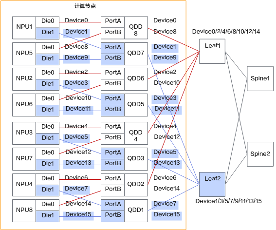

**使用场景**

当前支持在以下2种场景下使用借轨通信任务暂停与回切功能。

- 交换机升级场景：人工触发借轨后升级交换机，再回切。
- 故障处理场景：发生借轨的故障端口在修复完成后，再做人工回切。

**使用约束**

- 请在训练正常迭代后，再进行借轨或回切指令的下发。
- 确保已开启进程级恢复相关功能特性。
- 仅支持Pod间为Roce通信的场景。
- 本功能依赖MindIO组件，使用前请先了解MindIO的[约束限制](../../../07_references/00_fault_recovery_acceleration/02_installation_and_deployment.md#约束限制)。

**支持的产品型号和AI框架**

**表 12**  支持的产品和框架

<table><thead align="left"><tr id="zh-cn_topic_0000002098609234_row22681310134611"><th class="cellrowborder" valign="top" width="33.333333333333336%" id="mcps1.2.4.1.1">
产品系列

</th>
<th class="cellrowborder" valign="top" width="33.29332933293329%" id="mcps1.2.4.1.2">
产品名称

</th>
<th class="cellrowborder" valign="top" width="33.373337333733375%" id="mcps1.2.4.1.3">
训练框架

</th>
</tr>
</thead>
<tbody><tr id="zh-cn_topic_0000002098609234_row71691214122315"><td class="cellrowborder" valign="top" width="33.333333333333336%" headers="mcps1.2.4.1.1 ">
Atlas A3 训练系列产品

</td>
<td class="cellrowborder" valign="top" width="33.29332933293329%" headers="mcps1.2.4.1.2 "><ul id="ul13725194132419"><li>Atlas 900 A3 SuperPoD 超节点</li><li>Atlas 800T A3 超节点服务器</li></ul>
</td>
<td class="cellrowborder" valign="top" width="33.373337333733375%" headers="mcps1.2.4.1.3 "><ul id="ul7583132019396"><li>MindSpore</li></ul>
<ul id="ul75831320173911"><li>PyTorch</li></ul>
</td>
</tr>
</tbody>
</table>

**借轨通信任务暂停与回切原理**

**图 8**  原理图

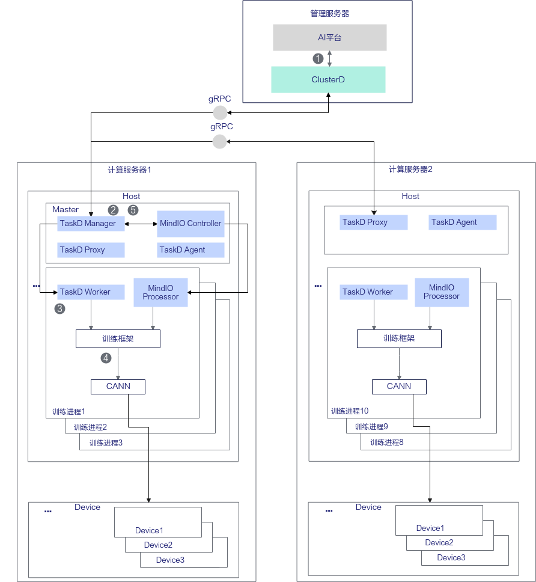

在以上原理图中，各个步骤的说明如下。

1. AI平台集成ClusterD，调用ClusterD的gRPC接口下发切换操作，指定需要切换的NPU卡。
2. ClusterD通知MindIO暂停训练。
3. TaskD Manager通知所有TaskD Worker调用训练框架接口执行切换操作。
4. 训练框架按照通信域逐一调用CANN接口执行切换操作。
5. ClusterD判断所有NPU卡的切换操作完成后，再由TaskD通知MindIO在切换完成后继续执行下一个Step训练。

**适配功能点**

在借轨通信任务暂停与回切中，框架首先初始化MindIO服务，启动服务后优化器更新时会上报对应状态到MindIO。通过主动调用优雅暂停机制，完成当前卡上任务暂停和任务切换。集群大脑需提供对外接口，接收切换指令并管理借轨通信流程。

对于非MindSpeed-LLM、MindCluster平台用户，需在框架侧完成[表13](#table19955141136102)的功能适配。

**表 13**  借轨通信任务暂停与回切框架适配功能点

<table><thead align="left"><tr id="row169591493619"><th class="cellrowborder" valign="top" width="18.87%" id="mcps1.2.5.1.1">
适配功能点

</th>
<th class="cellrowborder" valign="top" width="43.419999999999995%" id="mcps1.2.5.1.2">
功能简述

</th>
<th class="cellrowborder" valign="top" width="14.719999999999999%" id="mcps1.2.5.1.3">
适配组件

</th>
<th class="cellrowborder" valign="top" width="22.99%" id="mcps1.2.5.1.4">
参考链接

</th>
</tr>
</thead>
<tbody><tr id="row893618158397"><td class="cellrowborder" valign="top" width="18.87%" headers="mcps1.2.5.1.1 ">
初始化拉起

</td>
<td class="cellrowborder" valign="top" width="43.419999999999995%" headers="mcps1.2.5.1.2 ">
训练框架初始化时拉起MindIO服务。

</td>
<td class="cellrowborder" rowspan="3" valign="top" width="14.719999999999999%" headers="mcps1.2.5.1.3 ">
分布式训练框架

</td>
<td class="cellrowborder" rowspan="3" valign="top" width="22.99%" headers="mcps1.2.5.1.4 ">
<a href="../../../07_references/00_fault_recovery_acceleration/03_usage_guidance.md#对接非mindspeed-llm框架">对接非MindSpeed-LLM框架</a>

</td>
</tr>
<tr id="row1793717157396"><td class="cellrowborder" valign="top" headers="mcps1.2.5.1.1 ">
上报优化器更新状态

</td>
<td class="cellrowborder" valign="top" headers="mcps1.2.5.1.2 ">
优化器更新前上报优化器更新开始和结束。

</td>
</tr>
<tr id="row193701523914"><td class="cellrowborder" valign="top" headers="mcps1.2.5.1.1 ">
优雅暂停

</td>
<td class="cellrowborder" valign="top" headers="mcps1.2.5.1.2 ">
训练迭代循环最尾部增加MindIO函数调用，实现主动暂停功能。

</td>
</tr>
<tr id="row1297881015253"><td class="cellrowborder" valign="top" width="18.87%" headers="mcps1.2.5.1.1 ">
借轨切换过程管理

</td>
<td class="cellrowborder" valign="top" width="43.419999999999995%" headers="mcps1.2.5.1.2 ">
提供借轨切换请求下发能力，控制训练进程暂停与重启。

</td>
<td class="cellrowborder" valign="top" width="14.719999999999999%" headers="mcps1.2.5.1.3 ">
AI平台

</td>
<td class="cellrowborder" valign="top" width="22.99%" headers="mcps1.2.5.1.4 ">
<a href="https://gitcode.com/Ascend/mind-cluster/blob/branch_v26.1.0/component/clusterd/pkg/application/recover/om_controller.go" target="_blank" rel="noopener noreferrer">链接</a>

</td>
</tr>
</tbody>
</table>

## 弹性恢复

### 弹性训练

当出现硬件故障，且K8s集群中无可用备份资源时，MindCluster会先按照数据并行域缩容部分节点继续训练，当集群中有可用空闲资源时，再触发扩容恢复原有规模训练。相比于进程级别重调度，解决了集群中无可用备份资源被重调度的问题。

**使用约束**

- 仅支持PyTorch配合MindSpeed-LLM 2.3.0版本使用，版本配套请参见[MindSpeed-LLM](https://gitcode.com/Ascend/MindSpeed-LLM/tree/2.3.0)。
- 仅支持acjob类型训练任务。
- 依赖于MindIO的优化器副本，需要存在全量优化器副本，故需要安装MindIO和TaskD配合使用。
- 不能和优雅容错功能同时开启。
- 当训练任务的annotation中hccl/rankIndex字段为0的Pod发生故障时，不支持触发弹性训练。
- 不支持多模态模型。
- 不支持开启watchdog功能。
- 由于弹性训练会额外创建新的通信组，因此可能会导致片上内存占用增加。

    增加内存大小计算公式：增加内存最大值（MB）= HCCL\_BUFFSIZE \* 2 \* 9，其中，HCCL\_BUFFSIZE默认为200MB，HCCL\_BUFFSIZE的说明详细请参见《CANN HCCL集合通信库》中的“[HCCL_BUFFSIZE](https://www.hiascend.com/document/detail/zh/CANNCommunityEdition/910/commlib/hcclug/docs/zh/user_guide/hccl_env/HCCL_BUFFSIZE.md)”章节。

- 本功能依赖MindIO组件，使用前请先了解MindIO的[约束限制](../../../07_references/00_fault_recovery_acceleration/02_installation_and_deployment.md#约束限制)。

更多使用约束可参考[MindSpeed-LLM弹性训练功能使用约束](https://gitcode.com/Ascend/MindSpeed-LLM/blob/2.3.0/docs/pytorch/features/high_availability.md)。

**支持的产品型号和AI框架**

**表 16**  弹性训练支持的产品和框架

<table><thead align="left"><tr id="zh-cn_topic_0000002039353153_row1091711912447"><th class="cellrowborder" valign="top" width="20.462046204620464%" id="mcps1.2.4.1.1">
产品类型

</th>
<th class="cellrowborder" valign="top" width="66.2966296629663%" id="mcps1.2.4.1.2">
硬件形态

</th>
<th class="cellrowborder" valign="top" width="13.24132413241324%" id="mcps1.2.4.1.3">
训练框架

</th>
</tr>
</thead>
<tbody><tr id="zh-cn_topic_0000002039353153_row6171182004512"><td class="cellrowborder" valign="top" width="20.462046204620464%" headers="mcps1.2.4.1.1 ">
Atlas A2 训练系列产品

</td>
<td class="cellrowborder" valign="top" width="66.2966296629663%" headers="mcps1.2.4.1.2 ">
Atlas 800T A2 训练服务器

</td>
<td class="cellrowborder" valign="top" width="13.24132413241324%" headers="mcps1.2.4.1.3 ">
PyTorch

</td>
</tr>
<tr id="zh-cn_topic_0000002039353153_row62157458147"><td class="cellrowborder" valign="top" width="20.462046204620464%" headers="mcps1.2.4.1.1 ">
Atlas A3 训练系列产品

</td>
<td class="cellrowborder" valign="top" width="66.2966296629663%" headers="mcps1.2.4.1.2 ">
Atlas 900 A3 SuperPoD 超节点

</td>
<td class="cellrowborder" valign="top" width="13.24132413241324%" headers="mcps1.2.4.1.3 ">
PyTorch

</td>
</tr>
</tbody>
</table>

**弹性训练原理**

**图 10**  原理图

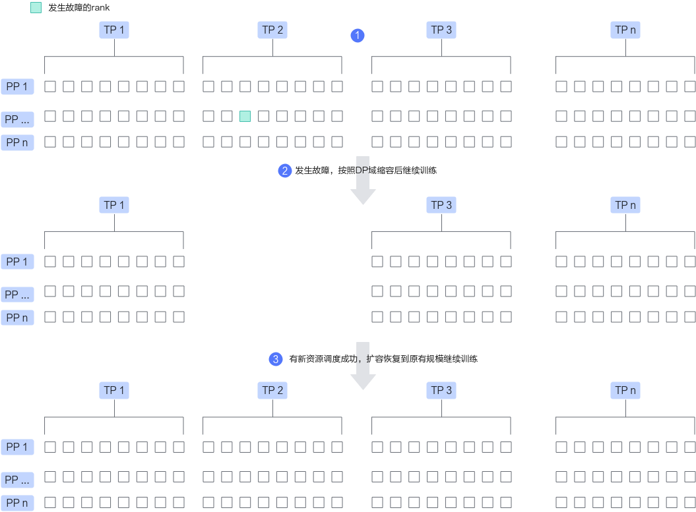

以上示意图仅以缩容1个DP域为例，实际弹性训练过程中可能会一次缩容多个DP域。图中每个方格代表一个rank。

1. 按照TP（Tensor Parallelism，张量并行）、PP（Pipeline Parallelism，流水线并行）、DP（Data Parallelism，数据并行）正常进行分布式训练。
2. 训练到某一时刻，若某张卡发生故障，且集群中无更多空闲资源可被调度进行断点续训，则按照DP域缩容，即缩容1个DP域对应的Pod（可能包含多个Pod）后继续训练。
3. 缩容训练到某一时刻，集群中有空闲资源时，缩容的Pod会被重新调度，扩容恢复到原有规模继续训练。

**图 11**  流程图

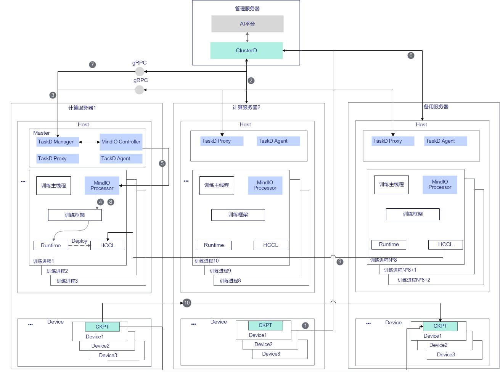

在以上流程图中，各个步骤的说明如下。

1. 设备出现硬件故障后，MindCluster在服务器上的检测组件上报故障信息到ClusterD中，软件故障由容器内MindIO Controller感知并上报到ClusterD。
2. ClusterD将故障服务器上的任务容器销毁。
3. 若没有备份节点调度新容器，ClusterD通知Master节点上的MindIO Controller进行缩容训练。
4. MindIO Controller通知每个训练进程中的MindIO Processor，MindIO Processor调用TorchNPU停止训练进程，清理正常节点的资源。
5. MindIO Controller通知正常的训练进程中的MindIO Processor执行通信组重建等缩容流程，进行缩容训练。
6. 检测到缩容时删除的Pod重调度成功。
7. ClusterD通过TaskD Manager通知MindIO Controller执行扩容。
8. MindIO Controller通知每个训练进程中的MindIO Processor，MindIO Processor调用TorchNPU停止训练进程，清理正常节点的资源。
9. 各个进程进行集合通信建链。
10. 正常服务器上的NPU通过参数面将CKPT传递到备用服务器上，完成参数状态恢复后继续训练。

**适配功能点**

在弹性训练中，集群大脑会根据全局故障信息决策恢复策略，并将策略下发到MindIO。调度器需要支持故障Pod调度，而非整个任务重调度，支持恢复策略依次回退。在训练容器中，框架首先初始化MindIO服务。启动服务后优化器更新时会上报对应状态到MindIO。随后，创建DP副本组和优化器副本，以保证模型参数的冗余备份。当异常发生时，通过异常捕获装饰器捕获故障模式，并由MindIO上报给集群大脑决策。

- 当集群大脑检测到故障，且无冗余备份资源时，下发缩容策略到MindIO，执行算子资源清理、缩容重建，以缩容状态继续训练。
- 当集群大脑检测到有可用资源且新节点成功拉起时，下发扩容策略到MindIO，执行算子资源清理、扩容通信重建、扩容参数面恢复和扩容状态回滚，完成弹性扩容恢复原有规模继续训练。

对于非MindSpeed-LLM和MindCluster平台用户，需在框架侧完成[表17](#table19955141136107)的功能适配。

**表 17**  弹性训练框架适配功能点

<table><thead align="left"><tr id="row169591493619"><th class="cellrowborder" valign="top" width="7.520000000000001%" id="mcps1.2.6.1.1">
序号

</th>
<th class="cellrowborder" valign="top" width="18.810000000000002%" id="mcps1.2.6.1.2">
适配功能点

</th>
<th class="cellrowborder" valign="top" width="34.39%" id="mcps1.2.6.1.3">
功能简述

</th>
<th class="cellrowborder" valign="top" width="18.190000000000005%" id="mcps1.2.6.1.4">
适配组件

</th>
<th class="cellrowborder" valign="top" width="21.090000000000003%" id="mcps1.2.6.1.5">
参考链接

</th>
</tr>
</thead>
<tbody><tr id="row893618158397"><td class="cellrowborder" valign="top" width="7.520000000000001%" headers="mcps1.2.6.1.1 ">
1

</td>
<td class="cellrowborder" valign="top" width="18.810000000000002%" headers="mcps1.2.6.1.2 ">
初始化启动

</td>
<td class="cellrowborder" valign="top" width="34.39%" headers="mcps1.2.6.1.3 ">
训练框架初始化时拉起MindIO服务。

</td>
<td class="cellrowborder" rowspan="16" valign="top" width="18.190000000000005%" headers="mcps1.2.6.1.4 ">
分布式训练框架

</td>
<td class="cellrowborder" rowspan="6" valign="top" width="21.090000000000003%" headers="mcps1.2.6.1.5 ">
<a href="../../../07_references/00_fault_recovery_acceleration/03_usage_guidance.md#对接非mindspeed-llm框架">表2</a>

</td>
</tr>
<tr id="row1793717157396"><td class="cellrowborder" valign="top" headers="mcps1.2.6.1.1 ">
2

</td>
<td class="cellrowborder" valign="top" headers="mcps1.2.6.1.2 ">
上报优化器更新状态

</td>
<td class="cellrowborder" valign="top" headers="mcps1.2.6.1.3 ">
优化器更新前上报优化器更新的开始和结束状态。

</td>
</tr>
<tr id="row193701523914"><td class="cellrowborder" valign="top" headers="mcps1.2.6.1.1 ">
3

</td>
<td class="cellrowborder" valign="top" headers="mcps1.2.6.1.2 ">
创建DP副本组

</td>
<td class="cellrowborder" valign="top" headers="mcps1.2.6.1.3 ">
新增dp_cp/dp_ep副本组及gloo组创建逻辑，在原生Megatron分布式并行组创建后创建相关副本组。

</td>
</tr>
<tr id="row191961528155914"><td class="cellrowborder" valign="top" headers="mcps1.2.6.1.1 ">
4

</td>
<td class="cellrowborder" valign="top" headers="mcps1.2.6.1.2 ">
优化器副本

</td>
<td class="cellrowborder" valign="top" headers="mcps1.2.6.1.3 ">
接管、继承相关Megatron原生优化器功能，嵌入MindIO优化器副本管理逻辑。

</td>
</tr>
<tr id="row111971728195915"><td class="cellrowborder" valign="top" headers="mcps1.2.6.1.1 ">
5

</td>
<td class="cellrowborder" valign="top" headers="mcps1.2.6.1.2 ">
异常捕获装饰器

</td>
<td class="cellrowborder" valign="top" headers="mcps1.2.6.1.3 ">
使用异常捕获装饰器装饰train函数捕获故障模式。

</td>
</tr>
<tr id="row1519712855916"><td class="cellrowborder" valign="top" headers="mcps1.2.6.1.1 ">
6

</td>
<td class="cellrowborder" valign="top" headers="mcps1.2.6.1.2 ">
算子资源清理

</td>
<td class="cellrowborder" valign="top" headers="mcps1.2.6.1.3 ">
通过回调函数完成算子资源清理。

</td>
</tr>
<tr id="row1375943411593"><td class="cellrowborder" valign="top" headers="mcps1.2.6.1.1 ">
7

</td>
<td class="cellrowborder" valign="top" headers="mcps1.2.6.1.2 ">
弹性训练回调注册

</td>
<td class="cellrowborder" valign="top" headers="mcps1.2.6.1.3 ">
将弹性训练各个回调函数注册到MindIO。

</td>
<td class="cellrowborder" valign="top" headers="mcps1.2.6.1.4 ">
<a href="https://gitcode.com/Ascend/MindSpeed-LLM/blob/2.3.0/mindspeed_llm/core/high_availability/elastic_training_register.py" target="_blank" rel="noopener noreferrer">LLM仓参考链接</a>

</td>
</tr>
<tr id="row876023415918"><td class="cellrowborder" valign="top" headers="mcps1.2.6.1.1 ">
8

</td>
<td class="cellrowborder" valign="top" headers="mcps1.2.6.1.2 ">
缩容重建

</td>
<td class="cellrowborder" valign="top" headers="mcps1.2.6.1.3 ">
重建缩容后的通信组、数据迭代器、记录并更新部分框架变量等。

</td>
<td class="cellrowborder" valign="top" headers="mcps1.2.6.1.4 ">
<a href="https://gitcode.com/Ascend/MindSpeed-LLM/blob/2.3.0/mindspeed_llm/core/high_availability/elastic_training_scale_in_rebuild.py" target="_blank" rel="noopener noreferrer">LLM仓参考链接</a>

</td>
</tr>
<tr id="row17605341596"><td class="cellrowborder" valign="top" headers="mcps1.2.6.1.1 ">
9

</td>
<td class="cellrowborder" valign="top" headers="mcps1.2.6.1.2 ">
扩容通信重建

</td>
<td class="cellrowborder" valign="top" headers="mcps1.2.6.1.3 ">
新节点与缩容节点重建通信组。

</td>
<td class="cellrowborder" valign="top" headers="mcps1.2.6.1.4 ">
<a href="https://gitcode.com/Ascend/MindSpeed-LLM/blob/2.3.0/mindspeed_llm/core/high_availability/elastic_training_scale_out_rebuild.py" target="_blank" rel="noopener noreferrer">LLM仓参考链接</a>

</td>
</tr>
<tr id="row144412445361"><td class="cellrowborder" valign="top" headers="mcps1.2.6.1.1 ">
10

</td>
<td class="cellrowborder" valign="top" headers="mcps1.2.6.1.2 ">
扩容参数面恢复

</td>
<td class="cellrowborder" valign="top" headers="mcps1.2.6.1.3 ">
通过副本rank与新拉rank参数传输恢复新节点优化器等参数。

</td>
<td class="cellrowborder" valign="top" headers="mcps1.2.6.1.4 ">
<a href="https://gitcode.com/Ascend/MindSpeed-LLM/blob/2.3.0/mindspeed_llm/core/high_availability/elastic_training_repair.py" target="_blank" rel="noopener noreferrer">LLM仓参考链接</a>

</td>
</tr>
<tr id="row14716101112393"><td class="cellrowborder" valign="top" headers="mcps1.2.6.1.1 ">
11

</td>
<td class="cellrowborder" valign="top" headers="mcps1.2.6.1.2 ">
扩容状态回滚

</td>
<td class="cellrowborder" valign="top" headers="mcps1.2.6.1.3 ">
恢复缩容时更改框架变量、重建数据集等。

</td>
<td class="cellrowborder" valign="top" headers="mcps1.2.6.1.4 ">
<a href="https://gitcode.com/Ascend/MindSpeed-LLM/blob/2.3.0/mindspeed_llm/core/high_availability/elastic_training_rollback.py" target="_blank" rel="noopener noreferrer">LLM仓参考链接</a>

</td>
</tr>
<tr id="row164994019817"><td class="cellrowborder" valign="top" headers="mcps1.2.6.1.1 ">
12

</td>
<td class="cellrowborder" valign="top" headers="mcps1.2.6.1.2 ">
新拉起节点torch通信适配

</td>
<td class="cellrowborder" valign="top" headers="mcps1.2.6.1.3 ">
新拉起节点恢复前跳过通信。

</td>
<td class="cellrowborder" rowspan="2" valign="top" headers="mcps1.2.6.1.4 ">
<a href="https://gitcode.com/Ascend/MindSpeed-LLM/blob/2.3.0/mindspeed_llm/features_manager/high_availability/high_availability.py#:~text=def pre_register_patches(self, patch_manager, args):" target="_blank" rel="noopener noreferrer">LLM仓参考链接</a>

</td>
</tr>
<tr id="row5499401185"><td class="cellrowborder" valign="top" headers="mcps1.2.6.1.1 ">
13

</td>
<td class="cellrowborder" valign="top" headers="mcps1.2.6.1.2 ">
缩容训练全局组通信适配

</td>
<td class="cellrowborder" valign="top" headers="mcps1.2.6.1.3 ">
缩容训练时使用缩容后全局组替换原全局组通信。

</td>
</tr>
<tr id="row1550640684"><td class="cellrowborder" valign="top" headers="mcps1.2.6.1.1 ">
14

</td>
<td class="cellrowborder" valign="top" headers="mcps1.2.6.1.2 ">
缩容训练副本组通信适配

</td>
<td class="cellrowborder" valign="top" headers="mcps1.2.6.1.3 ">
缩容训练时副本rank替代故障rank与故障rank所在副本组通信。

</td>
<td class="cellrowborder" rowspan="2" valign="top" headers="mcps1.2.6.1.4 ">
<a href="https://gitcode.com/Ascend/MindSpeed-LLM/blob/2.3.0/mindspeed_llm/features_manager/high_availability/high_availability.py" target="_blank" rel="noopener noreferrer">LLM仓参考链接</a>

</td>
</tr>
<tr id="row1650540489"><td class="cellrowborder" valign="top" headers="mcps1.2.6.1.1 ">
15

</td>
<td class="cellrowborder" valign="top" headers="mcps1.2.6.1.2 ">
缩容训练参数适配

</td>
<td class="cellrowborder" valign="top" headers="mcps1.2.6.1.3 ">
缩容训练时修改num_microbatches、world_size、global_batch_size等参数。

</td>
</tr>
<tr id="row7501940584"><td class="cellrowborder" valign="top" headers="mcps1.2.6.1.1 ">
16

</td>
<td class="cellrowborder" valign="top" headers="mcps1.2.6.1.2 ">
梯度精度计算适配

</td>
<td class="cellrowborder" valign="top" headers="mcps1.2.6.1.3 ">
适配因缩容num_microbatches等变化导致的精度梯度变化。

</td>
<td class="cellrowborder" valign="top" headers="mcps1.2.6.1.4 ">
<a href="https://gitcode.com/Ascend/MindSpeed-LLM/blob/2.3.0/mindspeed_llm/features_manager/high_availability/high_availability.py" target="_blank" rel="noopener noreferrer">LLM仓参考链接1</a>

<a href="https://gitcode.com/Ascend/MindSpeed-LLM/blob/2.3.0/pretrain_gpt.py#:~text=if args.enable_elastic_training:" target="_blank" rel="noopener noreferrer">LLM仓参考链接2</a>

</td>
</tr>
<tr id="row145017409813"><td class="cellrowborder" valign="top" width="7.520000000000001%" headers="mcps1.2.6.1.1 ">
17

</td>
<td class="cellrowborder" valign="top" width="18.810000000000002%" headers="mcps1.2.6.1.2 ">
恢复策略决策

</td>
<td class="cellrowborder" valign="top" width="34.39%" headers="mcps1.2.6.1.3 ">
根据全局故障信息决策恢复策略，并将策略下发到MindIO。支持恢复策略回退，弹性训练失败回退到临终遗言等策略。

</td>
<td class="cellrowborder" rowspan="2" valign="top" width="18.190000000000005%" headers="mcps1.2.6.1.4 ">
AI平台

</td>
<td class="cellrowborder" valign="top" width="21.090000000000003%" headers="mcps1.2.6.1.5 ">
<a href="https://gitcode.com/Ascend/mind-cluster/tree/branch_v26.1.0/component/clusterd/pkg/application/recover" target="_blank" rel="noopener noreferrer">链接</a>

</td>
</tr>
<tr id="row155014017818"><td class="cellrowborder" valign="top" headers="mcps1.2.6.1.1 ">
18

</td>
<td class="cellrowborder" valign="top" headers="mcps1.2.6.1.2 ">
故障Pod调度

</td>
<td class="cellrowborder" valign="top" headers="mcps1.2.6.1.3 ">
调度故障Pod。

</td>
<td class="cellrowborder" valign="top" headers="mcps1.2.6.1.4 ">
<a href="https://gitcode.com/Ascend/mind-cluster/tree/branch_v26.1.0/component/ascend-for-volcano/internal/rescheduling" target="_blank" rel="noopener noreferrer">链接</a>

</td>
</tr>
</tbody>
</table>

[表17](#table19955141136107)中序号为1-6的适配项为MindIO TFT（MindCluster MindIO Training Fault Tolerance）公共逻辑，序号为17-18的适配项为断点续训公共逻辑，本章节不再详细描述。以下针对弹性训练特有功能点，基于Megatron 0.12.1版本进行简要介绍。

- 弹性训练回调注册

    在训练拉起初始化时调用，将弹性训练缩容和扩容恢复过程中需要执行的回调函数注册到MindIO中，进而在恢复过程中被调用。

- 缩容重建
    1. 基于缩容后成员创建新的全局通信组并记录，后续将替代原全局通信组进行通信。
    2. 记录框架原始DP size、num\_microbatches等参数作为后续扩容恢复使用，并更新为缩容后数据。
    3. 基于故障Rank信息重建缩容后其他局部通信组，并更新模型、优化器等实例对象中的通信组。
    4. 重建数据集、重新初始化部分框架实例、参数等。

- 扩容通信重建
    1. 重建扩容后全局和局部通信组，并更新模型、优化器等实例对象中的通信组。
    2. 恢复框架DP size等参数、重新初始化部分框架实例等。

- 扩容参数面恢复
    1. 为新拉起的rank训练进程和备份rank训练进程创建通信组，用于发送和接收优化器参数等。
    2. 备份rank训练进程向新拉起的rank训练进程发送恢复所需的优化器参数。
    3. 新拉起的rank训练进程接收优化器参数后，按需更新optimizer、opt\_param\_scheduler、全局args等参数。

- 扩容状态回滚
    1. 恢复框架num\_microbatches等参数。
    2. 恢复训练前将优化器参数拷贝到模型参数中，并在对应DP域内进行一次all\_gather通信操作，确保模型参数为最新状态。
    3. 修复打印训练迭代日志。
    4. 重建数据集，重新初始化部分框架实例、参数等。
    5. 销毁恢复过程中发送和接收参数的通信组。

- 新拉起节点torch通信适配
    1. 对于重启节点，从pretrain启动流程到进入train之间，会下发通信算子，但正常训练rank在该阶段并未与重启节点配套重建通信域，集合通信无法成功，因此直接跳过。
    2. 对于重启节点，从pretrain启动流程到进入train之间，会创建并行通信域，但正常训练rank在该阶段并未与重启节点配套重建通信域，对于gloo组会报错，因此直接跳过新建gloo通信组。

- 缩容训练全局组通信适配

    在缩容训练过程中，由于故障节点已经被删除，因此使用原全局通信组通信会失败，需替换为缩容后的全局通信组。

- 缩容训练副本组通信适配

    在[LLM仓参考链接](https://gitcode.com/Ascend/MindSpeed-LLM/blob/2.3.0/mindspeed_llm/features_manager/high_availability/high_availability.py)中，start\_param\_sync\_wrapper、get\_grad\_norm\_fp32\_wrapper、get\_parameter\_state\_dp\_zero\_wrapper等是为了适配缩容训练时副本组通信而patch，下面以get\_parameter\_state\_dp\_zero\_wrapper为例介绍副本组适配原理：

    假设当前tp=8、pp=1、dp=4。DP组分别为rank \[0,8,16,24\]、\[1,9,17,25\]、\[2,10,18,26\]、…、\[7,15,23,31\]，按照副本优化器原理，副本组分别为rank \[0,8\]、\[16,24\]、\[1,9\]、\[17,25\]、\[2,10\]、\[18,26\]、…、\[7,15\]、\[23,31\]，rank 0-15与rank 16-31互为副本。rank 31故障后，将rank 24-31对应DP域删除继续缩容训练。

    原生Megatron会使用优化器实例的data\_parallel\_group\_gloo成员变量对应的group（即DP组，在使用MindIO的优化器副本时为副本组）进行通信。缩容后不包含删除的rank 24-31的副本组，继续按照原有通信组进行通信，包含缩容rank的副本组使用组内正常rank与缩容rank对应的副本rank组成的缩容组进行通信，例如副本组rank \[23,31\]缩容后，通信使用的通信组为rank \[23,15\]。

- 缩容训练参数适配

    在[LLM仓参考链接](https://gitcode.com/Ascend/MindSpeed-LLM/blob/2.3.0/mindspeed_llm/features_manager/high_availability/high_availability.py)中，patch\_world\_size\_func\_wrapper、log\_wrapper、is\_last\_rank\_wrapper、optimizer\_param\_scheduler\_step\_wrapper、track\_app\_tag\_wrapper、print\_rank\_last\_wrapper、num\_floating\_point\_operations\_wrapper等是为了适配global\_batch\_size、world\_size等训练中使用的参数而patch。例如：原生使用dp\_size\*micro\_batch\_size\*num\_microbatches，缩容后各个DP内num\_microbatches可能不一样，因此直接使用args.global\_batch\_size。缩容后判断是否最后一个rank使用缩容后的全局组；全局组大小修改为缩容后的大小等。

- 梯度精度计算适配

    在[LLM仓参考链接1](https://gitcode.com/Ascend/MindSpeed-LLM/blob/2.3.0/mindspeed_llm/features_manager/high_availability/high_availability.py)中，start\_grad\_sync\_wrapper、forward\_step\_wrapper、elastic\_training\_get\_forward\_backward\_func\_wrapper以及[LLM仓参考链接2](https://gitcode.com/Ascend/MindSpeed-LLM/blob/2.3.0/pretrain_gpt.py#:~text=if%20args.enable_elastic_training%3A)所指向的loss\_func的代码是为了适配因缩容导致的精度梯度变化而patch或修改。

    - loss\_func由每个micro\_batch都要进行DP组内all\_reduce通信修改为缩容训练时不进行通信，原因是缩容后每个DP域内num\_micro\_batches数量可能不一样，导致前几个DP会多执行一次all\_reduce而卡住。
    - start\_grad\_sync\_wrapper中将梯度缩放因子gradient\_scaling\_factor修改为1.0 / \(arguments.global\_batch\_size / arguments.micro\_batch\_size\)，即在原1/dp\_size基础上再除以num\_micro\_batches。
    - forward\_step\_wrapper将入参num\_microbatches修改为1，目的是loss计算时不再除以num\_microbatches，因为在start\_grad\_sync\_wrapper中已经除以了num\_microbatches。
    - elastic\_training\_get\_forward\_backward\_func\_wrapper因为loss\_func没有执行DP组内all\_reduce，原生forward\_backward\_func执行完成后，在最后一个PP时将losses\_reduced每个key的和（即所有micro\_batch的lm loss相加）在DP组内执行all\_reduce操作求和。

## 优雅容错机制

### （可选）优雅容错

>[!NOTE]
>该功能已经日落。PyTorch框架在7.2.RC1之后的版本不再支持；MindSpore框架在7.1.RC1之后的版本不再支持。

当用户进行没有备用资源的训练任务，或者期望设备自动恢复时，可以选择使用**优雅容错**功能。即当训练时的芯片设备出现故障后，系统将尝试对故障芯片进行自动恢复，如果可以恢复，则在保持Pod运行状态下，将任务原地拉起继续训练，不能恢复则回退至**重调度模式**。

优雅容错功能无需进行资源调度，即可自动将故障设备恢复。但是它无法降低训练初始化中的恢复时间，通常情况下，优雅容错所需恢复时间大于进程级重调度和进程级在线恢复功能。

了解优雅容错的关键配置步骤，请参见[配置优雅容错](../03_configuration/01_configuring_fault_handling_policies.md#配置优雅容错)。

**使用约束**

- 当前只支持芯片故障使用优雅容错功能。
- 优雅容错功能与进程级别重调度、进程级在线恢复功能不能同时开启。若同时开启，断点续训将通过Job级别重调度恢复训练。

**支持的产品型号和AI框架**

**表 18**  优雅容错支持的产品和框架

<table><thead align="left"><tr id="zh-cn_topic_0000002098609234_row22681310134611"><th class="cellrowborder" valign="top" width="33.333333333333336%" id="mcps1.2.4.1.1">
产品系列

</th>
<th class="cellrowborder" valign="top" width="33.29332933293329%" id="mcps1.2.4.1.2">
产品名称

</th>
<th class="cellrowborder" valign="top" width="33.373337333733375%" id="mcps1.2.4.1.3">
训练框架

</th>
</tr>
</thead>
<tbody><tr id="zh-cn_topic_0000002098609234_row17268131014613"><td class="cellrowborder" valign="top" width="33.333333333333336%" headers="mcps1.2.4.1.1 ">
Atlas 训练系列产品

</td>
<td class="cellrowborder" valign="top" width="33.29332933293329%" headers="mcps1.2.4.1.2 "><ul id="zh-cn_topic_0000002039353153_ul17412295261"><li>Atlas 800 训练服务器（型号 9000）</li><li>Atlas 800 训练服务器（型号 9010）</li></ul>
</td>
<td class="cellrowborder" valign="top" width="33.373337333733375%" headers="mcps1.2.4.1.3 "><ul id="zh-cn_topic_0000002098609234_ul1381333331316"><li>MindSpore</li></ul>
<ul id="zh-cn_topic_0000002098609234_ul10570112811135"><li>PyTorch</li></ul>
</td>
</tr>
<tr id="zh-cn_topic_0000002098609234_row181221631185611"><td class="cellrowborder" valign="top" width="33.333333333333336%" headers="mcps1.2.4.1.1 ">
Atlas A2 训练系列产品

</td>
<td class="cellrowborder" valign="top" width="33.29332933293329%" headers="mcps1.2.4.1.2 "><ul id="zh-cn_topic_0000002098609234_ul13899193245613"><li>Atlas 800T A2 训练服务器</li><li>Atlas 900 A2 PoD 集群基础单元</li></ul>
</td>
<td class="cellrowborder" valign="top" width="33.373337333733375%" headers="mcps1.2.4.1.3 "><ul id="zh-cn_topic_0000002098609234_ul664419915495"><li>MindSpore</li></ul>
<ul id="zh-cn_topic_0000002098609234_ul36445934915"><li>PyTorch</li></ul>
</td>
</tr>
<tr id="zh-cn_topic_0000002098609234_row71691214122315"><td class="cellrowborder" valign="top" width="33.333333333333336%" headers="mcps1.2.4.1.1 ">
Atlas A3 训练系列产品

</td>
<td class="cellrowborder" valign="top" width="33.29332933293329%" headers="mcps1.2.4.1.2 "><ul id="ul13725194132419"><li>Atlas 900 A3 SuperPoD 超节点</li><li>Atlas 800T A3 超节点服务器</li></ul>
</td>
<td class="cellrowborder" valign="top" width="33.373337333733375%" headers="mcps1.2.4.1.3 "><ul id="ul7583132019396"><li>MindSpore</li></ul>
<ul id="ul75831320173911"><li>PyTorch</li></ul>
</td>
</tr>
</tbody>
</table>

**优雅容错原理**

在节点或芯片故障处理过程中，若使用重调度模式，需要运维人员手动恢复设备。若任务恢复不及时可能导致训练集群中出现大量散点故障，降低集群算力利用率。因此，断点续训在**重调度模式**上增加了**优雅容错**功能，用于优化NPU芯片的部分故障容错能力。

NPU芯片故障中的部分故障可以通过退出芯片上的训练进程以及热复位芯片来恢复，优雅容错功能即针对这部分故障进行恢复处理，不需要重调度任务。

Ascend Device Plugin负责故障的上报以及设备的恢复，管理进程（PyTorch场景下为Elastic Agent组件，MindSpore场景下为TaskD组件）根据Ascend Device Plugin上报的信息进行训练进程的停止与重新拉起，完成故障恢复（不能恢复则回退至**重调度模式**）。集成优雅容错模式需要在业务容器中添加管理进程，管理进程需要具备故障感知、停止训练任务和重启训练任务等能力。

优雅容错模式直接将故障上报到业务容器内的管理进程中（通常通过挂载文件的方式），容器内的管理进程读取故障文件信息获取到故障信息，获取故障信息的流程如[图12](#zh-cn_topic_0000002098609234_fig135111361314)所示。

**图 12**  获取故障信息

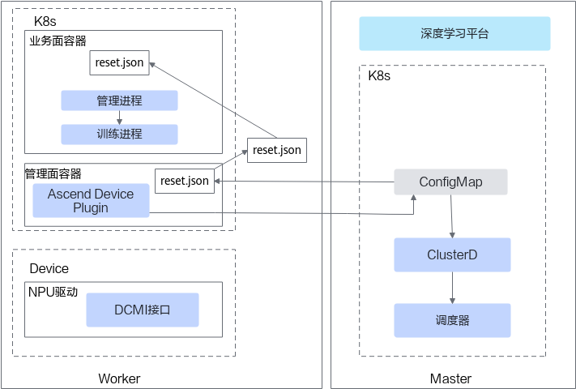

优雅容错模式将故障区分为以下四类，**无需处理**、**重新执行业务**、**需要复位芯片**和**需要重调度**，对于每类故障的处理如[图13](#zh-cn_topic_0000002098609234_fig12620181591012)所示。

**图 13**  优雅容错故障处理流程

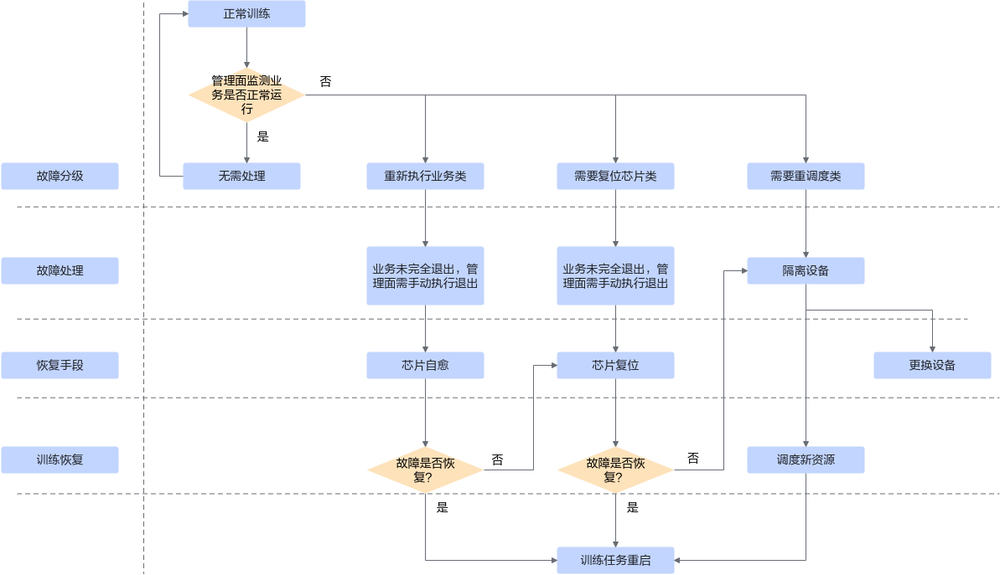
