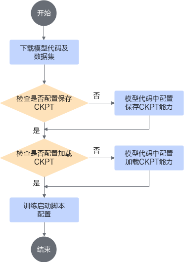
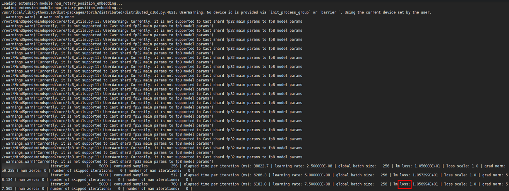
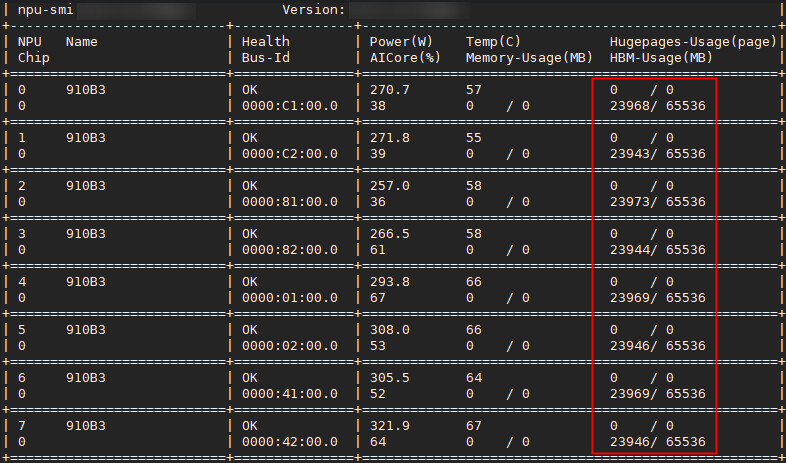
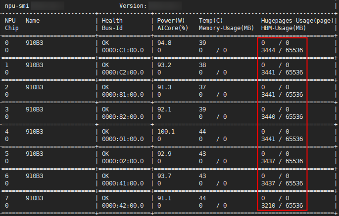

# MindSpore场景示例

## 制作镜像<a name="ZH-CN_TOPIC_0000002511426469-mindspore"></a>

[MindSpore Transformers套件](https://gitcode.com/mindspore/mindformers)（以下简称MindFormers）的目标是构建一个大模型训练、微调、评估、推理、部署的全流程开发套件，提供业内主流的Transformer类预训练模型和SOTA下游任务应用，涵盖丰富的并行特性。期望帮助用户轻松地实现大模型训练和创新研发。

[MindSpore Transformers文档](https://www.mindspore.cn/mindformers/docs/zh-CN/r1.3.0/start/overview.html)的快速入门包括了安装与快速启动章节，可以在镜像制作时参考。

训练镜像可以基于基础训练镜像，结合MindFormers文档自行制作，基础训练镜像的制作可参考[使用Dockerfile构建容器镜像（MindSpore）](../../../07_references/02_common_operations.md#使用dockerfile构建容器镜像mindspore)章节进行操作。

本章节结合基础训练镜像的制作步骤，展示基于Ubuntu 20.04来构建训练镜像。

**准备软件包<a name="zh-cn_topic_0000002003180012_section181941327124212"></a>**

请按照[表1](#zh-cn_topic_0000002003180012_table223643812168)所示，获取对应操作系统的软件包，并准备镜像所需的Dockerfile文件与脚本文件。软件包名称中{version}表示版本号、{arch}表示架构、{chip_type}表示芯片类型。

**表 1**  准备软件包

<a name="zh-cn_topic_0000002003180012_table223643812168"></a>
<table><thead align="left"><tr id="zh-cn_topic_0000002003180012_row6236938171619"><th class="cellrowborder" valign="top" width="25%" id="mcps1.2.5.1.1-mindspore"><p id="zh-cn_topic_0000002003180012_p3390131317171"><a name="zh-cn_topic_0000002003180012_p3390131317171"></a>软件包</p>
</th>
<th class="cellrowborder" valign="top" width="25%" id="mcps1.2.5.1.2-mindspore"><p id="zh-cn_topic_0000002003180012_p173901213151712"><a name="zh-cn_topic_0000002003180012_p173901213151712"></a>是否必选</p>
</th>
<th class="cellrowborder" valign="top" width="25%" id="mcps1.2.5.1.3-mindspore"><p id="zh-cn_topic_0000002003180012_p239018134178"><a name="zh-cn_topic_0000002003180012_p239018134178"></a>说明</p>
</th>
<th class="cellrowborder" valign="top" width="25%" id="mcps1.2.5.1.4-mindspore"><p id="zh-cn_topic_0000002003180012_p1539051321714"><a name="zh-cn_topic_0000002003180012_p1539051321714"></a>获取方法</p>
</th>
</tr>
</thead>
<tbody><tr id="zh-cn_topic_0000002003180012_row13237173817161"><td class="cellrowborder" valign="top" width="25%" headers="mcps1.2.5.1.1-mindspore "><p id="zh-cn_topic_0000002003180012_p6390191319171"><a name="zh-cn_topic_0000002003180012_p6390191319171"></a>MindFormers代码仓</p>
</td>
<td class="cellrowborder" valign="top" width="25%" headers="mcps1.2.5.1.2-mindspore "><p id="zh-cn_topic_0000002003180012_p13390113131712"><a name="zh-cn_topic_0000002003180012_p13390113131712"></a>是</p>
</td>
<td class="cellrowborder" valign="top" width="25%" headers="mcps1.2.5.1.3-mindspore "><p id="zh-cn_topic_0000002003180012_p153901913131711"><a name="zh-cn_topic_0000002003180012_p153901913131711"></a>构建一个大模型训练、微调、评估、推理、部署的全流程开发套件，提供业内主流的Transformer类预训练模型和SOTA下游任务应用，涵盖丰富的并行特性<span id="ph19351335211"><a name="ph19351335211"></a>。</span></p>
</td>
<td class="cellrowborder" valign="top" width="25%" headers="mcps1.2.5.1.4-mindspore "><p id="zh-cn_topic_0000002003180012_p3390131316172"><a name="zh-cn_topic_0000002003180012_p3390131316172"></a>git clone https://gitcode.com/mindspore/mindformers.git</p>
<p id="zh-cn_topic_0000002003180012_p5390101317175"><a name="zh-cn_topic_0000002003180012_p5390101317175"></a>cd mindformers</p>
<p id="zh-cn_topic_0000002003180012_p9390151318171"><a name="zh-cn_topic_0000002003180012_p9390151318171"></a>git checkout 14bc761a09b272657e28a5340efdf91737dfdf82</p>
</td>
</tr>
<tr id="zh-cn_topic_0000002003180012_row_hyperparallel"><td class="cellrowborder" valign="top" width="25%" headers="mcps1.2.5.1.1-mindspore "><p id="zh-cn_topic_0000002003180012_p_hyperparallel_name"><a name="zh-cn_topic_0000002003180012_p_hyperparallel_name"></a>HyperParallel</p>
</td>
<td class="cellrowborder" valign="top" width="25%" headers="mcps1.2.5.1.2-mindspore "><p id="zh-cn_topic_0000002003180012_p_hyperparallel_required"><a name="zh-cn_topic_0000002003180012_p_hyperparallel_required"></a>是</p>
</td>
<td class="cellrowborder" valign="top" width="25%" headers="mcps1.2.5.1.3-mindspore "><p id="zh-cn_topic_0000002003180012_p_hyperparallel_desc"><a name="zh-cn_topic_0000002003180012_p_hyperparallel_desc"></a>昇腾超节点亲和的分布式并行加速库。</p>
</td>
<td class="cellrowborder" valign="top" width="25%" headers="mcps1.2.5.1.4-mindspore "><p id="zh-cn_topic_0000002003180012_p_hyperparallel_clone"><a name="zh-cn_topic_0000002003180012_p_hyperparallel_clone"></a>git clone https://gitcode.com/mindspore/hyper-parallel.git</p>
<p id="zh-cn_topic_0000002003180012_p_hyperparallel_cd"><a name="zh-cn_topic_0000002003180012_p_hyperparallel_cd"></a>cd hyper-parallel</p>
<p id="zh-cn_topic_0000002003180012_p_hyperparallel_checkout"><a name="zh-cn_topic_0000002003180012_p_hyperparallel_checkout"></a>git checkout 18a395befc6f9a60019c63a3e3878654ae2849d7</p>
</td>
</tr>
<tr id="zh-cn_topic_0000002003180012_row14237113817167"><td class="cellrowborder" valign="top" width="25%" headers="mcps1.2.5.1.1-mindspore "><p id="zh-cn_topic_0000002003180012_p133901013201717"><a name="zh-cn_topic_0000002003180012_p133901013201717"></a>requirements.txt文件</p>
</td>
<td class="cellrowborder" valign="top" width="25%" headers="mcps1.2.5.1.2-mindspore "><p id="zh-cn_topic_0000002003180012_p10390813171719"><a name="zh-cn_topic_0000002003180012_p10390813171719"></a>否</p>
</td>
<td class="cellrowborder" valign="top" width="25%" headers="mcps1.2.5.1.3-mindspore "><p id="zh-cn_topic_0000002003180012_p439011371714"><a name="zh-cn_topic_0000002003180012_p439011371714"></a>由于通过pip安装MindSpore时，可能出现依赖的组件安装报错，故可以先安装依赖。</p>
</td>
<td class="cellrowborder" valign="top" width="25%" headers="mcps1.2.5.1.4-mindspore "><p id="zh-cn_topic_0000002003180012_p6390121315177"><a name="zh-cn_topic_0000002003180012_p6390121315177"></a>wget https://gitcode.com/mindspore/mindspore/raw/r2.4.1/requirements.txt</p>
<div class="note" id="zh-cn_topic_0000002003180012_note14449193224617"><a name="zh-cn_topic_0000002003180012_note14449193224617"></a><span class="notetitle">[!NOTE] 说明</span><div class="notebody"><p id="zh-cn_topic_0000002003180012_p15449133274617"><a name="zh-cn_topic_0000002003180012_p15449133274617"></a>MindSpore软件包与<span id="zh-cn_topic_0000002003180012_ph327965117217"><a name="zh-cn_topic_0000002003180012_ph327965117217"></a>Atlas 训练系列产品</span>需配套使用，请参见MindSpore<a href="https://www.mindspore.cn/install" target="_blank" rel="noopener noreferrer">安装指南</a>查看对应关系。</p>
</div></div>
</td>
</tr>
<tr id="zh-cn_topic_0000002003180012_row2023743821619"><td class="cellrowborder" valign="top" width="25%" headers="mcps1.2.5.1.1-mindspore "><p id="zh-cn_topic_0000002003180012_p123901513131714"><a name="zh-cn_topic_0000002003180012_p123901513131714"></a>mindspore-<em id="zh-cn_topic_0000002003180012_i42701940155017"><a name="zh-cn_topic_0000002003180012_i42701940155017"></a>{version}</em>-cp3x-cp3x-linux_aarch64.whl</p>
</td>
<td class="cellrowborder" valign="top" width="25%" headers="mcps1.2.5.1.2-mindspore "><p id="zh-cn_topic_0000002003180012_p73901313101718"><a name="zh-cn_topic_0000002003180012_p73901313101718"></a>是</p>
</td>
<td class="cellrowborder" valign="top" width="25%" headers="mcps1.2.5.1.3-mindspore "><p id="zh-cn_topic_0000002003180012_p1839181315178"><a name="zh-cn_topic_0000002003180012_p1839181315178"></a>MindSpore whl包<span id="ph441575419329"><a name="ph441575419329"></a>。</span></p><p>软件包中的cp3x表示Python版本号，例如x为10表示Python 3.10，请根据实际情况选择对应软件包。</p>
</td>
<td class="cellrowborder" valign="top" width="25%" headers="mcps1.2.5.1.4-mindspore "><p id="zh-cn_topic_0000002003180012_p6391181310177"><a name="zh-cn_topic_0000002003180012_p6391181310177"></a><a href="https://www.mindspore.cn/install/" target="_blank" rel="noopener noreferrer">获取链接</a></p>
</td>
</tr>
<tr id="zh-cn_topic_0000002003180012_row32371838111619"><td class="cellrowborder" valign="top" width="25%" headers="mcps1.2.5.1.1-mindspore "><p id="zh-cn_topic_0000002003180012_p13917139175"><a name="zh-cn_topic_0000002003180012_p13917139175"></a>mindio_ttp-<em id="zh-cn_topic_0000002003180012_i14277191551111"><a name="zh-cn_topic_0000002003180012_i14277191551111"></a>{version}</em>-py3-none-linux_<em id="zh-cn_topic_0000002003180012_i16391113201710"><a name="zh-cn_topic_0000002003180012_i16391113201710"></a>{arch}</em>.whl</p>
</td>
<td class="cellrowborder" valign="top" width="25%" headers="mcps1.2.5.1.2-mindspore "><p id="zh-cn_topic_0000002003180012_p183915136176"><a name="zh-cn_topic_0000002003180012_p183915136176"></a>是</p>
</td>
<td class="cellrowborder" valign="top" width="25%" headers="mcps1.2.5.1.3-mindspore "><p id="zh-cn_topic_0000002003180012_p13906311171017"><a name="zh-cn_topic_0000002003180012_p13906311171017"></a><span id="zh-cn_topic_0000002003180012_ph845710020145"><a name="zh-cn_topic_0000002003180012_ph845710020145"></a>MindIO TFT</span>安装包。</p>
</td>
<td class="cellrowborder" valign="top" width="25%" headers="mcps1.2.5.1.4-mindspore "><p id="zh-cn_topic_0000002003180012_p11392111316172"><a name="zh-cn_topic_0000002003180012_p11392111316172"></a><a href="https://www.hiascend.com/zh/developer/download/community/result?module=dl%2Bcann" target="_blank" rel="noopener noreferrer">获取链接</a></p>
</td>
</tr>
<tr id="zh-cn_topic_0000002003180012_row1423815380168"><td class="cellrowborder" valign="top" width="25%" headers="mcps1.2.5.1.1-mindspore "><p id="zh-cn_topic_0000002003180012_p0915027134813"><a name="zh-cn_topic_0000002003180012_p0915027134813"></a>Ascend-cann-{chip_type}-ops_{version}_linux-{arch}.run</p>
</td>
<td class="cellrowborder" valign="top" width="25%" headers="mcps1.2.5.1.2-mindspore "><p id="zh-cn_topic_0000002003180012_p1139314132170"><a name="zh-cn_topic_0000002003180012_p1139314132170"></a>是</p><p>CANN 8.5.0之前版本该包名为Ascend-cann-kernels-<em>{chip_type}</em>_<em>{version}</em>_linux-<em>{arch}</em>.run</p>
</td>
<td class="cellrowborder" valign="top" width="25%" headers="mcps1.2.5.1.3-mindspore "><p id="zh-cn_topic_0000002003180012_p193931713181710"><a name="zh-cn_topic_0000002003180012_p193931713181710"></a>CANN算子包。</p>
</td>
<td class="cellrowborder" valign="top" width="25%" headers="mcps1.2.5.1.4-mindspore "><p id="zh-cn_topic_0000002003180012_p139312131171"><a name="zh-cn_topic_0000002003180012_p139312131171"></a><a href="https://www.hiascend.com/zh/developer/download/community/result?module=cann" target="_blank" rel="noopener noreferrer">获取链接</a></p>
<div class="note" id="zh-cn_topic_0000002003180012_note13501612171513"><a name="zh-cn_topic_0000002003180012_note13501612171513"></a><span class="notetitle">[!NOTE] 说明</span><div class="notebody"><p id="zh-cn_topic_0000002003180012_p1519161921516"><a name="zh-cn_topic_0000002003180012_p1519161921516"></a>请获取和服务器型号匹配的软件包。</p>
</div></div>
</td>
</tr>
<tr id="zh-cn_topic_0000002003180012_row8238173810165"><td class="cellrowborder" valign="top" width="25%" headers="mcps1.2.5.1.1-mindspore "><p id="zh-cn_topic_0000002003180012_p1439381351714"><a name="zh-cn_topic_0000002003180012_p1439381351714"></a>Ascend-cann-toolkit_{version}_linux-{arch}.run</p>
</td>
<td class="cellrowborder" valign="top" width="25%" headers="mcps1.2.5.1.2-mindspore "><p id="zh-cn_topic_0000002003180012_p1239319131176"><a name="zh-cn_topic_0000002003180012_p1239319131176"></a>是</p>
</td>
<td class="cellrowborder" valign="top" width="25%" headers="mcps1.2.5.1.3-mindspore "><p id="zh-cn_topic_0000002003180012_p5393121371719"><a name="zh-cn_topic_0000002003180012_p5393121371719"></a>CANN Toolkit开发套件包。</p>
</td>
<td class="cellrowborder" valign="top" width="25%" headers="mcps1.2.5.1.4-mindspore "><p id="zh-cn_topic_0000002003180012_p239319132175"><a name="zh-cn_topic_0000002003180012_p239319132175"></a><a href="https://www.hiascend.com/zh/developer/download/community/result?module=cann" target="_blank" rel="noopener noreferrer">获取链接</a></p>
<div class="note" id="zh-cn_topic_0000002003180012_note1733918441613"><a name="zh-cn_topic_0000002003180012_note1733918441613"></a><span class="notetitle">[!NOTE] 说明</span><div class="notebody"><p id="zh-cn_topic_0000002003180012_p533924121616"><a name="zh-cn_topic_0000002003180012_p533924121616"></a>请获取和服务器型号匹配的软件包。</p>
</div></div>
</td>
</tr>
<tr id="zh-cn_topic_0000002003180012_row4825411181413"><td class="cellrowborder" valign="top" width="25%" headers="mcps1.2.5.1.1-mindspore "><p id="zh-cn_topic_0000002003180012_p1882511116142"><a name="zh-cn_topic_0000002003180012_p1882511116142"></a>taskd-{version}-py3-none-linux_{arch}.whl</p>
</td>
<td class="cellrowborder" valign="top" width="25%" headers="mcps1.2.5.1.2-mindspore "><p id="zh-cn_topic_0000002003180012_p10825811101413"><a name="zh-cn_topic_0000002003180012_p10825811101413"></a>是</p>
</td>
<td class="cellrowborder" valign="top" width="25%" headers="mcps1.2.5.1.3-mindspore "><p id="zh-cn_topic_0000002003180012_p4825711171415"><a name="zh-cn_topic_0000002003180012_p4825711171415"></a>集群调度组件断点续训whl包。</p>
</td>
<td class="cellrowborder" valign="top" width="25%" headers="mcps1.2.5.1.4-mindspore "><p id="zh-cn_topic_0000002003180012_p18169645192413"><a name="zh-cn_topic_0000002003180012_p18169645192413"></a><a href="https://www.hiascend.com/zh/developer/download/community/result?module=dl%2Bcann" target="_blank" rel="noopener noreferrer">获取链接</a></p>
<div class="note" id="zh-cn_topic_0000002003180012_note079418496154"><a name="zh-cn_topic_0000002003180012_note079418496154"></a><span class="notetitle"> [!NOTE] 说明</span><div class="notebody"><a name="zh-cn_topic_0000002003180012_ul79293962319"></a><ul id="zh-cn_topic_0000002003180012_ul79293962319"><li>MindSpore场景下使用优雅容错、Pod级别重调度、进程级别重调度、进程级在线恢复，必须安装该whl包。</li><li>用户通过获取链接得到的是<span id="zh-cn_topic_0000002003180012_ph11742444163719"><a name="zh-cn_topic_0000002003180012_ph11742444163719"></a>TaskD</span>压缩包Ascend-mindxdl-taskd_<em id="i112838253389-mindspore"><a name="i112838253389-duplicate-2"></a>{version}</em>_linux-<em id="i1328312515383-mindspore"><a name="i1328312515383-duplicate-2"></a>{arch}</em>.zip，需要通过解压后，获得相应的whl软件包。</li></ul>
</div></div>
</td>
</tr>
<tr id="zh-cn_topic_0000002003180012_row15183115071614"><td class="cellrowborder" valign="top" width="25%" headers="mcps1.2.5.1.1-mindspore "><p id="zh-cn_topic_0000002003180012_p83941613131719"><a name="zh-cn_topic_0000002003180012_p83941613131719"></a>version.info</p>
</td>
<td class="cellrowborder" valign="top" width="25%" headers="mcps1.2.5.1.2-mindspore "><p id="zh-cn_topic_0000002003180012_p4394913121712"><a name="zh-cn_topic_0000002003180012_p4394913121712"></a>是</p>
<p id="zh-cn_topic_0000002003180012_p0394413131713"><a name="zh-cn_topic_0000002003180012_p0394413131713"></a>安装CANN的依赖文件</p>
</td>
<td class="cellrowborder" valign="top" width="25%" headers="mcps1.2.5.1.3-mindspore "><p id="zh-cn_topic_0000002003180012_p73942134170"><a name="zh-cn_topic_0000002003180012_p73942134170"></a>驱动版本信息文件。</p>
</td>
<td class="cellrowborder" valign="top" width="25%" headers="mcps1.2.5.1.4-mindspore "><p id="zh-cn_topic_0000002003180012_p239415135179"><a name="zh-cn_topic_0000002003180012_p239415135179"></a>从host拷贝“/usr/local/Ascend/driver/version.info”文件。</p>
</td>
</tr>
<tr id="zh-cn_topic_0000002003180012_row218375021618"><td class="cellrowborder" valign="top" width="25%" headers="mcps1.2.5.1.1-mindspore "><p id="zh-cn_topic_0000002003180012_p5394141315176"><a name="zh-cn_topic_0000002003180012_p5394141315176"></a>ascend_install.info</p>
</td>
<td class="cellrowborder" valign="top" width="25%" headers="mcps1.2.5.1.2-mindspore "><p id="zh-cn_topic_0000002003180012_p1039401316175"><a name="zh-cn_topic_0000002003180012_p1039401316175"></a>是</p>
<p id="zh-cn_topic_0000002003180012_p14394171331717"><a name="zh-cn_topic_0000002003180012_p14394171331717"></a>安装CANN的依赖文件</p>
</td>
<td class="cellrowborder" valign="top" width="25%" headers="mcps1.2.5.1.3-mindspore "><p id="zh-cn_topic_0000002003180012_p03941613151715"><a name="zh-cn_topic_0000002003180012_p03941613151715"></a>驱动安装信息文件。</p>
</td>
<td class="cellrowborder" valign="top" width="25%" headers="mcps1.2.5.1.4-mindspore "><p id="zh-cn_topic_0000002003180012_p11394141321712"><a name="zh-cn_topic_0000002003180012_p11394141321712"></a>从host拷贝“/etc/ascend_install.info”文件。</p>
</td>
</tr>
<tr id="zh-cn_topic_0000002003180012_row61841150171618"><td class="cellrowborder" valign="top" width="25%" headers="mcps1.2.5.1.1-mindspore "><p id="zh-cn_topic_0000002003180012_p6394713201715"><a name="zh-cn_topic_0000002003180012_p6394713201715"></a>get-pip.py</p>
</td>
<td class="cellrowborder" valign="top" width="25%" headers="mcps1.2.5.1.2-mindspore "><p id="zh-cn_topic_0000002003180012_p14394121310177"><a name="zh-cn_topic_0000002003180012_p14394121310177"></a>是</p>
</td>
<td class="cellrowborder" valign="top" width="25%" headers="mcps1.2.5.1.3-mindspore "><p id="zh-cn_topic_0000002003180012_p63959135172"><a name="zh-cn_topic_0000002003180012_p63959135172"></a>用于安装pip模块</p>
</td>
<td class="cellrowborder" valign="top" width="25%" headers="mcps1.2.5.1.4-mindspore "><p id="zh-cn_topic_0000002003180012_p6395913121711"><a name="zh-cn_topic_0000002003180012_p6395913121711"></a>curl -k https://bootstrap.pypa.io/get-pip.py -o get-pip.py</p>
</td>
</tr>
<tr id="zh-cn_topic_0000002003180012_row618410501169"><td class="cellrowborder" valign="top" width="25%" headers="mcps1.2.5.1.1-mindspore "><p id="zh-cn_topic_0000002003180012_p123971013121710"><a name="zh-cn_topic_0000002003180012_p123971013121710"></a>Dockerfile</p>
</td>
<td class="cellrowborder" valign="top" width="25%" headers="mcps1.2.5.1.2-mindspore "><p id="zh-cn_topic_0000002003180012_p18397713121711"><a name="zh-cn_topic_0000002003180012_p18397713121711"></a>是</p>
</td>
<td class="cellrowborder" valign="top" width="25%" headers="mcps1.2.5.1.3-mindspore "><p id="zh-cn_topic_0000002003180012_p639719136172"><a name="zh-cn_topic_0000002003180012_p639719136172"></a>制作镜像需要。</p>
</td>
<td class="cellrowborder" valign="top" width="25%" headers="mcps1.2.5.1.4-mindspore "><p id="zh-cn_topic_0000002003180012_p639714133170"><a name="zh-cn_topic_0000002003180012_p639714133170"></a>-</p>
</td>
</tr>
</tbody>
</table>

为了防止软件包在传递过程中或存储期间被恶意篡改，下载软件包时需下载对应的数字签名文件用于完整性验证。

taskd和mindio_ttp的校验过程可参考[软件包 SUM 值校验](../../../05_developer_guide/00_installation_deployment/00_manual_installation/00_obtaining_software_packages.md#section51703441649)小节。其余软件包下载之后，请参见《[OpenPGP签名验证指南](https://support.huawei.com/enterprise/zh/doc/EDOC1100209376)》，对从Support网站下载的软件包进行PGP数字签名校验。如果校验失败，请不要使用该软件包，先联系华为技术支持工程师解决。

使用软件包安装/升级之前，也需要按上述过程先验证软件包的数字签名，确保软件包未被篡改。

运营商客户请访问：[https://support.huawei.com/carrier/digitalSignatureAction](https://support.huawei.com/carrier/digitalSignatureAction)

企业客户请访问：[https://support.huawei.com/enterprise/zh/tool/pgp-verify-TL1000000054](https://support.huawei.com/enterprise/zh/tool/pgp-verify-TL1000000054)

>[!NOTE]
>本章节以单台Atlas 800T A2 训练服务器、Ubuntu 20.04、配套Python 3.10为例来介绍制作镜像的详细过程，使用过程中需根据实际情况修改相关步骤。

**操作步骤<a name="zh-cn_topic_0000002003180012_section614453171018"></a>**

1. 在宿主机上完成软件包的准备工作。
2. 构建如下的Dockerfile。

    ```text
    FROM ubuntu:20.04

    WORKDIR /root

    COPY . .

    ARG HOST_ASCEND_BASE=/usr/local/Ascend
    ARG TOOLKIT_PATH=/usr/local/Ascend/cann
    # 示例使用的CANN版本为8.5.0,使用过程中请根据实际情况修改
    ARG TOOLKIT=Ascend-cann-toolkit_8.5.0_linux-aarch64.run
    ARG OPS=Ascend-cann-910b-ops_8.5.0_linux-aarch64.run
    ARG MINDIO_TTP_WHL=mindio_ttp-1.0.0-py3-none-linux_aarch64.whl
    ARG MINDFORMERS=mindformers
    ARG HYPERPARALLEL=hyper-parallel
    ARG MINDSPORE_REQUIREMENTS=requirements.txt
    ARG MINDSPORE_WHL=mindspore-2.5.0-cp310-cp310-linux_aarch64.whl
    ARG TASKD_WHL=taskd-7.0.RC1-py3-none-linux_aarch64.whl

    RUN echo "nameserver 114.114.114.114" > /etc/resolv.conf

    RUN echo "deb http://repo.huaweicloud.com/ubuntu-ports/ focal main restricted universe multiverse\n\
    deb http://repo.huaweicloud.com/ubuntu-ports/ focal-updates main restricted universe multiverse\n\
    deb http://repo.huaweicloud.com/ubuntu-ports/ focal-backports main restricted universe multiverse\n\
    deb http://ports.ubuntu.com/ubuntu-ports/ focal-security main restricted universe multiverse" > /etc/apt/sources.list

    ARG DEBIAN_FRONTEND=noninteractive

    RUN umask 0022 && apt update && \
        apt-get install -y --no-install-recommends \
        software-properties-common
    RUN umask 0022 && add-apt-repository ppa:deadsnakes/ppa && \
        apt update && \
        apt autoremove -y python python3 && \
        apt install -y python3.10 python3.10-dev

    # 建立Python软链接
    RUN ln -s /usr/bin/python3.10 /usr/bin/python
    RUN ln -s /usr/bin/python3.10 /usr/bin/python3
    RUN ln -s /usr/bin/python3.10-config /usr/bin/python-config
    RUN ln -s /usr/bin/python3.10-config /usr/bin/python3-config

    # 系统包
    RUN umask 0022 && apt update && \
        apt-get install -y --no-install-recommends \
            gcc g++ make cmake vim \
            zlib1g zlib1g-dev \
            openssl libsqlite3-dev libssl-dev \
            libffi-dev unzip pciutils \
            net-tools libblas-dev \
            gfortran libblas3 libopenblas-dev \
            curl unzip liblapack3 liblapack-dev \
            libhdf5-dev libxml2 patch

    # 时区
    # RUN ln -sf /usr/share/zoneinfo/Asia/Shanghai /etc/localtime
    RUN ln -sf /usr/share/zoneinfo/UTC /etc/localtime

    # 配置pip源
    RUN mkdir -p ~/.pip \
    && echo '[global] \n\
    index-url=https://mirrors.huaweicloud.com/repository/pypi/simple\n\
    trusted-host=mirrors.huaweicloud.com' >> ~/.pip/pip.conf

    # pip3.10
    RUN cd /tmp && \
        apt-get download python3-distutils && \
        dpkg-deb -x python3-distutils_*.deb / && \
        rm python3-distutils_*.deb && \
        cd - && \
        python get-pip.py && \
    rm get-pip.py

    RUN umask 0022 && \
        pip install sympy==1.4 && \
        pip install cffi && \
        pip install pathlib2 && \
        pip install grpcio && \
        pip install grpcio-tools && \
        pip install absl-py && \
        pip install datasets && \
        pip install tokenizers==0.20.1

    # 创建HwHiAiUser用户和属主，UID和GID请与物理机保持一致避免出现无属主文件。示例中会自动创建user和对应的group，UID和GID都为1000
    RUN useradd -d /home/HwHiAiUser -u 1000 -m -s /bin/bash HwHiAiUser

    # Ascend包
    # 构建之前把host的/usr/local/Ascend/driver/version.info拷贝一份到当前目录
    RUN umask 0022 &&  \
        cp ascend_install.info /etc/ && \
        mkdir -p /usr/local/Ascend/driver/ && \
        cp version.info /usr/local/Ascend/driver/ && \
        chmod +x $TOOLKIT && \
        chmod +x $OPS

    RUN umask 0022 && ./$TOOLKIT --install-path=/usr/local/Ascend/ --install --quiet
    RUN echo "source /usr/local/Ascend/cann/set_env.sh" >> ~/.bashrc
    RUN umask 0022 && ./$OPS --install --quiet

    # 只为了安装toolkit包，所以需要清理，容器启动时通过ascend docker挂载进来
    RUN rm -f version.info && \
        rm -rf /usr/local/Ascend/driver/

    # 安装mindspore
    RUN umask 0022 && pip uninstall te topi hccl -y && \
             pip install sympy && \
             pip install /usr/local/Ascend/cann/lib64/hccl-*-py3-none-any.whl
    RUN umask 0022 && \
        pip install -r $MINDSPORE_REQUIREMENTS && \
        pip install $MINDSPORE_WHL

    # 安装mindformers
    RUN umask 0022 && cd $MINDFORMERS && \
        pip install -r requirements.txt
    # 安装Hyper-parallel
    RUN umask 0022 && cd $HYPERPARALLEL && \
        pip install -r requirements.txt

    # MindCluster无损失断点续训适配脚本
    RUN umask 0022 && \
        pip install $MINDIO_TTP_WHL --target=$(pip show mindspore | awk '/Location:/ {print $2}') && \
        pip install $TASKD_WHL

    # 环境变量
    ENV HCCL_WHITELIST_DISABLE=1

    # 创建/lib64/ld-linux-aarch64.so.1
    RUN umask 0022 && \
        if [ ! -d "/lib64" ]; \
        then \
            mkdir /lib64 && ln -sf /lib/ld-linux-aarch64.so.1 /lib64/ld-linux-aarch64.so.1; \
        fi

    # 增加安装任务调度依赖库
    RUN pip install apscheduler

    RUN rm -rf tmp && \
        rm -f $TOOLKIT && \
        rm -f $OPS && \
        rm -f $MINDIO_TTP_WHL && \
        rm -f $MINDSPORE_REQUIREMENTS && \
        rm -f $MINDSPORE_WHL
    ## 最后打包成镜像mindformers-dl:v1
    ```

3. 构建镜像。执行以下命令生成镜像。为了使Dockerfile更加安全，用户可以根据业务在其中定义HEALTHCHECK检查。通过在容器内部运行**HEALTHCHECK** _\[OPTIONS\]_ **CMD**命令来检查容器的运行状况。**注意不要遗漏命令结尾的**“.”。

    ```shell
    docker build -t mindformers-dl:v1 .
    ```

4. 除按上述流程手动构建镜像外，用户也可直接使用开箱即用的示例镜像`mindspore-sample-dl:v26.2.0-cann8.5.0-mindspore2.5.0-910b-py3.10-aarch64`。示例镜像可通过[AscendHub](https://www.hiascend.com/developer/ascendhub)获取，用于快速验证。

## 脚本适配<a name="ZH-CN_TOPIC_0000002511426481-mindspore"></a>

### 流程说明<a name="ZH-CN_TOPIC_0000002511346469-mindspore"></a>

模型脚本需要适配CKPT之后才可以使用断点续训功能，脚本适配大致流程和逻辑如[图1](#fig88341718121515-mindspore)所示。

**图 1**  脚本适配流程<a name="fig88341718121515-mindspore"></a>



### 适配示例<a name="ZH-CN_TOPIC_0000002511346445-mindspore"></a>

本章节将指导用户step by step地完成断点续训的适配步骤。

>[!NOTE]
>
>- 为保证优雅容错与进程级在线恢复功能的正常使用，请将K8s集群master节点与worker节点的时钟保持一致。
>- 断点续训展示的组件代码为开源代码，其中涉及到相关安全说明请参见[安全说明](../../../07_references/05_appendix.md#安全说明)。
>- 下文中模型示例代码可能与实际版本存在差异，请以实际版本代码为准。
>- 模型的参数配置，根据模型仓的模型配置以实际情况来写。若修改不当，可能会引发不可预知的问题。
>- 若训练过程中出现“Failed to bind the IP port. Reason: The IP address and port have been bound already”报错，可以按照如下进行配置，详情请参见《CANN HCCL集合通信库》中的“[HCCL_HOST_SOCKET_PORT_RANGE](https://www.hiascend.com/document/detail/zh/CANNCommunityEdition/910/commlib/hcclug/docs/zh/user_guide/hccl_env/HCCL_HOST_SOCKET_PORT_RANGE.md)”章节。
>
>   ```shell
>   export HCCL_HOST_SOCKET_PORT_RANGE="60000-60050"
>   export HCCL_NPU_SOCKET_PORT_RANGE="61000-61050"
>   ```
>
>- 若使用TaskD组件且训练容器使用Host网络，则先通过`sysctl net.ipv4.ip_local_reserved_ports`查询当前预留端口配置后，通过`sysctl -w net.ipv4.ip_local_reserved_ports="xxx,9601,9602"`新增预留端口9601、9602（其中xxx指的是前面查出来已配置的端口，若无则省略）。

训练代码与数据集准备，可以参考[MindFormers文档](https://gitcode.com/mindspore/mindformers/tree/master/configs/qwen3)。下面以两台Atlas 900 A3 SuperPoD 超节点为例，说明具体操作步骤。

1. 准备代码。

    ```shell
    mkdir -p /data/atlas_dls/public/code
    cd /data/atlas_dls/public/code
    git clone https://gitcode.com/mindspore/mindformers.git
    cd mindformers
    git checkout 14bc761a09b272657e28a5340efdf91737dfdf82
    cd ..
    git clone https://gitcode.com/mindspore/hyper-parallel.git
    cd hyper-parallel
    git checkout 18a395befc6f9a60019c63a3e3878654ae2849d7
    cp -r hyper_parallel ../mindformers
    cd ..
    # 将mindformers重命名为QWEN3_for_MS_code
    mv mindformers QWEN3_for_MS_code
    ```

2. 准备数据集。

    请用户自行从[DagsHub](https://dagshub.com/DagsHub/WIkiText-103/src/main/dataset/tokens/wiki.train.tokens)下载数据集并放到服务器某目录下，如“/data/atlas\_dls/public/code/QWEN3\_for\_MS\_code/dataset”。

3. 转换数据集。
    1. 下载数据集转换脚本。

        从[数据集转换](https://gitee.com/mindspore/mindformers/issues/ICOKGY)下载数据集转换脚本并放到服务器某目录下，如“/data/atlas\_dls/public/code/QWEN3\_for\_MS\_code/dataset/gen\_wiki\_json.py”。

    2. 下载tokenizer文件。

        从[Qwen3-32B](https://huggingface.co/Qwen/Qwen3-32B/tree/main)下载tokenizer文件并放到服务器某目录下，如“/data/atlas\_dls/public/code/QWEN3\_for\_MS\_code/dataset/Qwen3-32B-tokenizer”。

    3. 转换数据集。
        1. 启动容器并挂载所需文件。

            ```shell
            docker run -it -v /data/atlas_dls/public/code/:/data/atlas_dls/public/code/ mindformers-dl:v1 bash
            ```

        2. 执行转换脚本，将wiki.train.tokens转换为jsonl格式。

            ```shell
            # 执行该脚本需要的Python环境，请提前准备Python环境
            cd /data/atlas_dls/public/code/QWEN3_for_MS_code/dataset
            python gen_wiki_json.py --input wiki.train.tokens  --output wiki.jsonl
            ```

        3. 将jsonl格式数据转为bin格式数据。

            ```shell
            # 执行时若报错ModuleNotFoundError: No module named 'xxx'，请自行安装依赖
            cd /data/atlas_dls/public/code/QWEN3_for_MS_code
            python toolkit/data_preprocess/megatron/preprocess_indexed_dataset.py \
              --input /data/atlas_dls/public/code/QWEN3_for_MS_code/dataset/wiki.jsonl \
              --output-prefix /data/atlas_dls/public/code/QWEN3_for_MS_code/dataset/wiki103-megatron \
              --tokenizer-type HuggingFaceTokenizer \
              --tokenizer-dir /data/atlas_dls/public/code/QWEN3_for_MS_code/dataset/Qwen3-32B-tokenizer # 其他规格的模型可以调整为对应的tokenizer路径
            ```

            运行完成后，“/data/atlas\_dls/public/code/QWEN3\_for\_MS\_code/dataset”目录下会生成“wiki103-megatron\_text\_document.bin”和“wiki103-megatron\_text\_document.idx”文件。填写数据集路径时，需要使用“/data/atlas\_dls/public/code/QWEN3\_for\_MS\_code/dataset/wiki103-megatron\_text\_document”，不需要带后缀名。

4. 获取[训练任务YAML](https://gitcode.com/Ascend/mindcluster-deploy/blob/master/samples/train/resumable-training/fault-tolerance/ranktable/mindspore/Qwen3/yamls/ms_multinodes_acjob_superpod.yaml)和[训练启动脚本](https://gitcode.com/Ascend/mindcluster-deploy/blob/master/samples/train/resumable-training/fault-tolerance/ranktable/mindspore/Qwen3/msrun_launcher.sh)，并进行修改。
    1. 若训练任务YAML中“hostNetwork”参数值为“false”，则需要将启动脚本中“GLOO\_SOCKET\_IFNAME”的值设置为“eth0”。示例如下：

        ```shell
        export GLOO_SOCKET_IFNAME=eth0  #eth0是容器内可以通信的网口
        export HCCL_SOCKET_IFNAME=eth0
        ```

        然后根据实际情况修改启动脚本中的其他参数。

    2. 根据实际情况修改任务YAML中挂载卷的服务器IP地址等配置。
    3. 使用TaskD完成进程级别重调度、进程级在线恢复、进程级别原地恢复、借轨通信任务暂停与回切或在线压测，还需拉起TaskD Manager。
        1. 创建manager.py文件，放在调用训练脚本时的当前目录下，manager.py文件内容如下所示。

            ```python
            from taskd.api import init_taskd_manager, start_taskd_manager
            import os

            job_id=os.getenv("MINDX_TASK_ID")
            node_nums=XX         # 用户填入任务节点总数
            proc_per_node=XX     # 用户填入任务每个节点的训练进程数量

            init_taskd_manager({"job_id":job_id, "node_nums": node_nums, "proc_per_node": proc_per_node})
            start_taskd_manager()
            ```

            >[!NOTE]
            >manager.py文件中的参数详细说明请参见[def init\_taskd\_manager\(config:dict\) -\> bool:](../../../06_api/07_taskd/04_taskd_manager_apis.md#def-init_taskd_managerconfigdict---bool)。

        2. 在训练脚本中增加以下代码拉起TaskD Manager。在以下代码中，前两条语句的作用是将安装TaskD后libtaskd.so的路径配置到环境变量LD\_PRELOAD中。如果这两条语句配置不成功，可通过手动执行pip show taskd命令获取Location的值拼接上/taskd/python/cython\_api/libs/libtaskd.so，然后通过export设置。

            ```shell
            TASKD_SO_PATH="$(pip show taskd | awk '/^Location: / {print $2"/taskd/python/cython_api/libs/libtaskd.so"}')"
            export LD_PRELOAD=$TASKD_SO_PATH:$LD_PRELOAD
            export TASKD_PROCESS_ENABLE="on"
            if [[ "${MS_SCHED_HOST}" == "${POD_IP}" ]]; then
                python /job/code/manager.py 2>> /job/code/alllogs/$MINDX_TASK_ID/taskd/error.log &   # manager.py具体执行路径由当前路径决定，error.log日志路径需提前创建
            fi
            msrun ...
            ```

        3. 修改训练任务YAML，新增容器端口，在所有的Pod下增加TaskD通信使用的端口9601（如已有则跳过）。

            ```yaml
            ...
                    spec:
            ...
                      containers:
            ...
                        ports:
                         - containerPort: 9601
                           name: taskd-port
            ...
            ```

5. 修改参数模型配置文件。
    1. 打开代码目录下“configs/qwen3/pretrain\_qwen3\_32b\_4k.yaml”文件。

        ```shell
        vi configs/qwen3/pretrain_qwen3_32b_4k.yaml
        ```

    2. 按“i”进入编辑模式，修改参数模型配置文件。
        1. 修改如下加粗配置，包括数据集路径、分布式并行参数、模型参数等。以下模型参数仅供参考，如有需要请自行修改。

            <pre codetype="yaml">
            train_dataset: &train_dataset
              data_loader:
                type: BlendedMegatronDatasetDataLoader
                datasets_type: "GPTDataset"
                sizes:
                  - 8000  # Number of samples in the training set
                  - 0     # Number of samples in the test set (currently unsupported)
                  - 0     # Number of samples in the evaluation set (currently unsupported)
                config:
                  seed: 1234  # Random seed for data sampling
                  split: "1, 0, 0"  # Proportions for training, test, and evaluation sets (test/eval currently unsupported)
                  seq_length: 4096  # Sequence length of the dataset
                  eod_mask_loss: False  # Whether to calculate loss at the end-of-document (EOD)
                  reset_position_ids: False  # Whether to reset position_ids at EOD
                  create_attention_mask: True  # Whether to include attention_mask in the dataset
                  reset_attention_mask: False  # Whether to reset attention_mask at EOD, creating a stepped attention_mask
                  create_compressed_eod_mask: False  # Whether to include a compressed attention_mask
                  eod_pad_length: 128  # Length of the compressed attention_mask
                  eod: 1  # Token ID for EOD in the dataset
                  pad: -1  # Token ID for padding in the dataset
                  data_path:  # Sampling proportion and path for the Megatron dataset
                    - '1'
                    <strong>- "/job/data/wiki103-megatron_text_document" # 数据集路径</strong>
            ……
            # Parallel configuration
            parallel_config:
              <strong>data_parallel: &dp 4  # Number of data parallel. If using the high availability feature, it must be an even number.</strong>
              <strong>model_parallel: 8  # Number of model parallel</strong>
              <strong>pipeline_stage: 1  # Number of pipeline parallel</strong>
              <strong>micro_batch_num: 1  # Pipeline parallel microbatch size</strong>
              use_seq_parallel: False  # Whether to enable sequence parallelism
              gradient_aggregation_group: 1  # Size of the gradient communication operator fusion group
            # When model_parallel > 1, setting micro_batch_interleave_num to 2 may accelerate the training process.
            micro_batch_interleave_num: 1
            ……
            model:
              model_config:
                # Configurations from Hugging Face
                <strong>vocab_size: 75968            # 此处改小了模型参数仅供测试，如有需要请自行调整</strong>
                <strong>hidden_size: 2560           # 此处改小了模型参数仅供测试，如有需要请自行调整</strong>
                <strong>intermediate_size: 12800   # 此处改小了模型参数仅供测试，如有需要请自行调整</strong>
                <strong>num_hidden_layers: 32      # 此处改小了模型参数仅供测试，如有需要请自行调整</strong>
                <strong>num_attention_heads: 32    # 此处改小了模型参数仅供测试，如有需要请自行调整</strong>
                num_key_value_heads: 8
                head_dim: 128
                hidden_act: 'swiglu'
                max_position_embeddings: 4096
                seq_length: 4096
                initializer_range: 0.02
                rms_norm_eps: 1.e-6
                use_cache: True
                tie_word_embeddings: False
                rope_theta: 1000000.
                attention_bias: False
                use_flash_attention: True
                add_bias_linear: False
                eos_token_id: 151645
                pad_token_id: 151643
                bos_token_id: 151643
                attention_dropout: 0.0
                # Configurations from MindFormers
                hidden_dropout: 0.0
                input_sliced_sig: True
                untie_embeddings_and_output_weights: True
                position_embedding_type: "rope"
                qk_layernorm: True
                use_contiguous_weight_layout_attention: False
                qkv_concat: True
                <strong>offset: [0]</strong>
                params_dtype: "float32"
                compute_dtype: "bfloat16"
                layernorm_compute_dtype: "float32"
                softmax_compute_dtype: "float32"
                rotary_dtype: "float32"
                residual_dtype: "float32"
                model_type: "qwen3"
                architectures: ["Qwen3ForCausalLM"]</pre>

        2. （可选）使用临终CKPT的场景，在保存CKPT后通过Pod级别重调度加载CKPT，需修改如下配置字段。

            首次拉起必须保证“load\_checkpoint”参数值的目录下存在正常可用的CKPT或该目录为空，否则可能导致训练无法正常拉起。

            ```yaml
            resume_training: True
            src_strategy_path_or_dir: './output/strategy'
            load_checkpoint: './output/checkpoint'
            ```

    3. 按“Esc”键，输入:wq!，按“Enter”保存并退出编辑。

## 准备任务YAML<a name="ZH-CN_TOPIC_0000002511426415-mindspore"></a>

集群调度组件为用户提供YAML示例，用户需要根据使用的功能、模型类型和任务类型等，并根据使用的故障处理模式，选择相应的YAML示例并根据需求进行相应修改后才可使用。

**表 2**  训练任务YAML示例

<a name="table350244433714-mindspore"></a>
<table><thead align="left"><tr id="row135031644183710-mindspore"><th class="cellrowborder" valign="top" width="15.393078615723146%" id="mcps1.2.8.1.1-mindspore"><p id="p8503244173715-mindspore"><a name="p8503244173715-mindspore"></a>任务类型</p>
</th>
<th class="cellrowborder" valign="top" width="16.173234646929384%" id="mcps1.2.8.1.2-mindspore"><p id="p145038448375-mindspore"><a name="p145038448375-mindspore"></a>硬件型号</p>
</th>
<th class="cellrowborder" valign="top" width="8.521704340868173%" id="mcps1.2.8.1.3-mindspore"><p id="p919210345266-mindspore"><a name="p919210345266-mindspore"></a>训练框架</p>
</th>
<th class="cellrowborder" valign="top" width="13.672734546909378%" id="mcps1.2.8.1.4-mindspore"><p id="p5503544193713-mindspore"><a name="p5503544193713-mindspore"></a>模型</p>
</th>
<th class="cellrowborder" valign="top" width="15.393078615723146%" id="mcps1.2.8.1.5-mindspore"><p id="p19672186404-mindspore"><a name="p19672186404-mindspore"></a>YAML文件名称</p>
</th>
<th class="cellrowborder" valign="top" width="15.433086617323463%" id="mcps1.2.8.1.6-mindspore"><p id="p1096741894013-mindspore"><a name="p1096741894013-mindspore"></a>获取链接</p>
</th>
<th class="cellrowborder" valign="top" width="15.413082616523303%" id="mcps1.2.8.1.7-mindspore"><p id="p2967518174012-mindspore"><a name="p2967518174012-mindspore"></a>说明</p>
</th>
</tr>
</thead>
<tbody><tr id="row91607510384-mindspore"><td class="cellrowborder" valign="top" width="15.393078615723146%" headers="mcps1.2.8.1.1-mindspore "><p id="p89371529174019"><a name="p89371529174019"></a>Ascend Job</p>
</td>
<td class="cellrowborder" valign="top" width="16.173234646929384%" headers="mcps1.2.8.1.2-mindspore "><a name="ul393742934014"></a><ul id="ul393742934014"><li><span id="ph139426426441"><a name="ph139426426441"></a>Atlas 800T A2 训练服务器</span></li><li>Atlas 900 A2 PoD 集群基础单元</li></ul>
</td>
<td class="cellrowborder" valign="top" width="8.521704340868173%" headers="mcps1.2.8.1.3-mindspore "><p id="p1319333422617"><a name="p1319333422617"></a>MindSpore</p>
</td>
<td class="cellrowborder" valign="top" width="13.672734546909378%" headers="mcps1.2.8.1.4-mindspore "><p id="p1893752924017"><a name="p1893752924017"></a><span id="ph234505228"><a name="ph234505228"></a>Qwen3</span></p>
</td>
<td class="cellrowborder" valign="top" width="15.393078615723146%" headers="mcps1.2.8.1.5-mindspore "><p id="p1493742904013"><a name="p1493742904013"></a><span id="ph153229411739"><a name="ph153229411739"></a>ms_multinodes_acjob_superpod.yaml</span></p>
</td>
<td class="cellrowborder" valign="top" width="15.433086617323463%" headers="mcps1.2.8.1.6-mindspore "><p id="p1637217494110"><a name="p1637217494110"></a><a href="https://gitcode.com/Ascend/mindcluster-deploy/blob/branch_v26.1.0/samples/train/resumable-training/fault-tolerance/ranktable/mindspore/Qwen3/yamls/ms_multinodes_acjob_superpod.yaml" target="_blank" rel="noopener noreferrer">ms_multinodes_acjob_superpod.yaml</a></p>
</td>
<td class="cellrowborder" valign="top" width="15.413082616523303%" headers="mcps1.2.8.1.7-mindspore "><p id="p79373296408"><a name="p79373296408"></a>示例默认使用2*16卡任务</p>
</td>
</tr>
</tbody>
</table>

>[!NOTE]
>当前部分训练框架未提供Atlas 900 A3 SuperPoD 超节点的断点续训示例YAML，用户可以在示例YAML中的labels下新增annotations字段即可。示例如下：
>
>```yaml
>...
>  labels:
>...
>  annotations:
>    sp-block: "32"   # 逻辑超节点芯片数量，sp-block字段的详细说明，可以参见YAML参数说明。
>    huawei.com/schedule_policy: "chip2-node16-sp"    # 根据硬件形态设置调度策略
>...
>```

## 下发任务<a name="ZH-CN_TOPIC_0000002479226548-mindspore"></a>

示例YAML中，任务部署在default命名空间下。本章节以MindSpore框架为例，下发训练任务。

1. 登录管理节点，进入YAML文件所在路径。
2. 在管理节点执行以下命令，使用YAML下发训练任务。

    ```shell
    kubectl apply -f XXX.yaml
    ```

    例如：

    ```shell
    kubectl apply -f ms_multinodes_acjob_superpod.yaml
    ```

    回显如下：

    ```ColdFusion
    configmap/reset-config-default-test-mindspore created
    ascendjob.mindxdl.gitee.com/default-test-mindspore created
    ```

## 查看任务进程<a name="ZH-CN_TOPIC_0000002511426461-mindspore"></a>

训练任务下发成功后，训练任务就可正常运行。可通过如下内容查看训练任务运行情况。

**查看所有训练任务<a name="section16792164211375-mindspore"></a>**

查看当前节点上运行的所有训练任务，操作步骤如下。

1. 登录管理节点，进入YAML文件所在路径。
2. 执行以下命令，查看训练任务运行情况。

    ```shell
    kubectl get pods -A -o wide
    ```

    回显示例如下。

    ```ColdFusion
    NAMESPACE        NAME                                       READY   STATUS    RESTARTS   AGE   IP                NODE           NOMINATED NODE   READINESS GATES
    default          default-test-mindspore-master-0              1/1     Running   0          5s    xxx.xxx.xxx.xxx   node1          <none>           <none>
    default          default-test-mindspore-worker-0              1/1     Running   0          5s    xxx.xxx.xxx.xxx   node2          <none>           <none>
    ……
    ```

**查看单个Pod的训练任务<a name="zh-cn_topic_0000001621551937_section1141119143319-mindspore"></a>**

查看其中一个Pod上运行的训练任务，操作步骤如下。

执行以下命令，查看训练任务运行情况。

```shell
kubectl logs default-test-mindspore-worker-0 -n default -f
```

回显示例如下，出现loss即表示任务正常运行。



**查看是否存在CKPT文件<a name="section979416428371-mindspore"></a>**

故障恢复功能是通过参考CKPT文件实现的，用户需要查看存储节点上是否存在CKPT文件。

用户可以等待训练任务运行时间超过用户设置的保存CKPT文件的时间后，查看设置的保存CKPT文件的路径下是否存在周期性CKPT文件，操作步骤如下。

1. 登录存储节点，执行以下命令，进入CKPT文件路径。

    ```shell
    cd /data/atlas_dls/public/code/QWEN3_for_MS_code/output/checkpoint
    ```

2. 执行以下命令，查看当前目录是否存在周期性CKPT文件。

    ```shell
    ll ./
    ```

    回显示例如下，说明存在周期性CKPT文件。

    ```ColdFusion
    total 8
    drwxr-xr-x  18 root root   8192 Jun 22 18:39 iter_0000100
    -rw-r--r--  1 root root    2    Jun 22 18:39 latest_checkpointed_iteration.txt
    ```

3. （可选）如果使用临终遗言，可以在保存CKPT的路径下，执行以下命令，查看当前目录是否存在临终CKPT文件。

    ```shell
    ll ./
    ```

    回显示例如下，说明存在临终CKPT文件。

    ```ColdFusion
    total 8
    drwxr-xr-x  18 root root   8192 Jun 22 15:39 iter_0000009
    -rw-r--r--  1 root root    2    Jun 22 15:39 latest_checkpointed_iteration.txt
    ```

## 查看训练结果<a name="ZH-CN_TOPIC_0000002479386554-mindspore"></a>

### （可选）构造故障<a name="ZH-CN_TOPIC_0000002511426449-mindspore"></a>

本章节将指导用户构造简单的故障，包括节点故障、参数面网络故障和业务面故障。

>[!NOTE]
>构造芯片故障存在安全风险，如需构造请联系华为技术支持工程师处理。

**构造节点故障<a name="section173881558133914-mindspore"></a>**

通过重启训练节点，模拟节点下电导致节点状态丢失。该故障在节点重启完成后可自动恢复。

1. 在训练任务正常训练出iteration后，登录正在训练的节点。
2. 执行以下命令，重启该训练节点，模拟节点状态丢失故障。

    ```shell
    reboot
    ```

3. 在Master节点多次执行以下命令，查看Pod状态。

    ```shell
    kubectl get pod -A
    ```

    可以看到Pod状态从Terminating到Pending，最后为Running状态，表示训练任务已经重新拉起。

4. 在Master节点执行以下命令，查看训练日志，记录续训成功时间。

    ```shell
    kubectl logs -n 命名空间名称 Pod名称
    ```

    回显示例如下，表示发生故障时，使用最近保存的第9步的Checkpoint文件恢复，实现训练任务第10个iteration开始继续训练。

    ```ColdFusion
    [2025-06-22 14:47:00] iteration       10/    5000 | consumed samples:          640 | elapsed time per iteration (ms): 1932.5 | learning rate: 2.500000E-07 | global batch size:    64 | lm loss: 1.053084E+01 | loss scale: 1.0 | g      rad norm: 56.739 | num zeros: 0 | number of skipped iterations:   0 | number of nan iterations:   0 |
    [2025-06-22 14:47:02] iteration       11/    5000 | consumed samples:          704 | elapsed time per iteration (ms): 1981.0 | learning rate: 2.750000E-07 | global batch size:    64 | lm loss: 1.044677E+01 | loss scale: 1.0 | g      rad norm: 57.590 | num zeros: 0 | number of skipped iterations:   0 | number of nan iterations:   0 |
    ......
    ```

**构造参数面网络故障<a name="section22113033919-mindspore"></a>**

通过断开NPU网络链路模拟参数面网络故障。NPU网络故障不影响单机训练任务。用户在断开链路后需手动恢复，否则该故障会一直存在。

1. 在训练任务正常训练出iteration后，登录正在训练的节点。
2. 执行以下命令，构造NPU网络链路故障。

    ```shell
    hccn_tool -i {device_id} -link -s down
    ```

    >[!NOTE]
    >device\_id为NPU的ID，可以通过<b>npu-smi info</b>命令查看NPU的ID。

3. 执行以下命令，查看NPU链路状态。

    ```shell
    hccn_tool -i {device_id} -net_health -g
    ```

    回显示例如下，表示NPU网络链路故障构造成功。

    ```ColdFusion
    net health status: Fault
    ```

4. 在Master节点多次执行以下命令，查看Pod状态。

    ```shell
    kubectl get pod -A
    ```

    可以看到Pod状态从Terminating到Pending，最后为Running状态，表示训练任务已经重新拉起。

5. 在Master节点执行以下命令，查看训练日志，记录续训成功时间。

    ```shell
    kubectl logs -n 命名空间名称 Pod名称
    ```

    回显示例如下，表示发生故障时，使用最近保存的第9步的Checkpoint文件恢复，实现训练任务第10个iteration开始继续训练。

    ```ColdFusion
    [2025-06-22 14:47:00] iteration       10/    5000 | consumed samples:          640 | elapsed time per iteration (ms): 1932.5 | learning rate: 2.500000E-07 | global batch size:    64 | lm loss: 1.053084E+01 | loss scale: 1.0 | g      rad norm: 56.739 | num zeros: 0 | number of skipped iterations:   0 | number of nan iterations:   0 |
    [2025-06-22 14:47:02] iteration       11/    5000 | consumed samples:          704 | elapsed time per iteration (ms): 1981.0 | learning rate: 2.750000E-07 | global batch size:    64 | lm loss: 1.044677E+01 | loss scale: 1.0 | g      rad norm: 57.590 | num zeros: 0 | number of skipped iterations:   0 | number of nan iterations:   0 |
    ......
    ```

6. 执行以下命令，恢复NPU网络链路故障。

    ```shell
    hccn_tool -i {device_id} -cfg recovery
    ```

7. 执行以下命令，查看NPU链路状态。

    ```shell
    hccn_tool -i {device_id} -net_health -g
    ```

    回显示例如下，表示NPU网络链路故障已经恢复。

    ```ColdFusion
    net health status: Success
    ```

**构造业务面故障<a name="section9891038124213-mindspore"></a>**

通过删除训练进程，模拟业务面故障。

1. 在训练任务正常训练出iteration后，登录正在训练的节点。
2. 执行以下命令，使用训练启动脚本，查询训练进程信息。

    ```shell
    ps -ef | grep python| grep 训练启动脚本.py
    ```

3. 执行以下命令，手动删除PID最小的训练进程。

    ```shell
    kill -9 pid
    ```

4. 在Master节点多次执行以下命令，查看Pod状态。

    ```shell
    kubectl get pod -A
    ```

    可以看到Pod状态从Terminating到Pending，最后为Running状态，表示训练任务已经重新拉起。

5. 在Master节点执行以下命令，查看训练日志，记录续训成功时间。

    ```shell
    kubectl logs -n 命名空间名称 Pod名称
    ```

    回显示例如下，表示发生故障时，使用最近保存的第9步的Checkpoint文件恢复，实现训练任务第10个iteration开始继续训练。

    ```ColdFusion
    [2025-06-22 14:47:00] iteration       10/    5000 | consumed samples:          640 | elapsed time per iteration (ms): 1932.5 | learning rate: 2.500000E-07 | global batch size:    64 | lm loss: 1.053084E+01 | loss scale: 1.0 | g      rad norm: 56.739 | num zeros: 0 | number of skipped iterations:   0 | number of nan iterations:   0 |
    [2025-06-22 14:47:02] iteration       11/    5000 | consumed samples:          704 | elapsed time per iteration (ms): 1981.0 | learning rate: 2.750000E-07 | global batch size:    64 | lm loss: 1.044677E+01 | loss scale: 1.0 | g      rad norm: 57.590 | num zeros: 0 | number of skipped iterations:   0 | number of nan iterations:   0 |
    ......
    ```

### 重调度模式<a name="ZH-CN_TOPIC_0000002479386534-mindspore"></a>

**重调度情况<a name="section87441013105513-mindspore"></a>**

>[!NOTE]
>当节点发生故障时，Volcano会将该训练任务调度到其他满足条件的节点上继续运行。

登录管理节点，执行以下命令查看训练任务运行情况。

```shell
kubectl get pods -A -o wide
```

故障前，若训练任务调度到了node1和node2上面，当node1节点上发生故障，此时Volcano组件会将node1和node2上训练任务重调度到node2和node3节点上，重调度后回显示例如下。

```ColdFusion
NAMESPACE        NAME                                       READY   STATUS    RESTARTS   AGE   IP                NODE           NOMINATED NODE   READINESS GATES
default          default-test-mindspore-master-0              1/1     Running   0          5s    xxx.xxx.xxx.xxx   node2          <none>           <none>
default          default-test-mindspore-worker-0              1/1     Running   0          5s    xxx.xxx.xxx.xxx   node3          <none>           <none>
……
```

**查看任务重调度记录<a name="section97707231547-mindspore"></a>**

执行如下命令查看任务重调度记录。

```shell
kubectl describe cm -n mindx-dl job-reschedule-reason
```

回显示例如下。

```ColdFusion
Name:         job-reschedule-reason
Namespace:    mindx-dl
Labels:       <none>
Annotations:  <none>
Data
====
recent-reschedule-records:
----
{"default/default-test-mindspore-141274b7-ce93-4d31-adde-6c24456a8a3b":{"JobID":"default/default-test-mindspore-141274b7-ce93-4d31-adde-6c24456a8a3b","TotalRescheduleTimes":1,"RescheduleRecords":[{"LogFileFormatTime":"I0908 11:36:10","RescheduleTimeStamp":1759683370,"ReasonOfTask":[{"RescheduleReason":"pod-failed","PodName":"default-test-mindspore-worker-0","NodeName":"node2","NodeRankIndex":"1"}]}]}}
Events:  <none>
```

### 优雅容错模式（本功能已日落）<a name="ZH-CN_TOPIC_0000002511346479-mindspore"></a>

本章节指导用户查看使用故障处理的优雅容错模式的训练信息。当芯片发生故障时，进程退出后进行优雅容错处理，恢复后重新拉起进程。

**日志说明<a name="section83075820188-mindspore"></a>**

重新拉起的训练进程的训练日志在“_训练脚本路径_/newlog”中，具体说明如下。

- QWEN3（MindSpore）训练日志：“/data/atlas\_dls/public/code/QWEN3\_for\_MS\_code/alllogs”。

**操作步骤<a name="section25042117188-mindspore"></a>**

1. 登录管理节点，执行以下命令查看芯片情况。

    ```shell
    npu-smi info
    ```

    回显示例如下，此时表示训练进程占用片上内存，正常训练中。

    

2. 故障发生后，执行以下命令查看芯片信息。

    ```shell
    npu-smi info
    ```

    回显示例如下，此时表示训练进程已退出，释放片上内存。

    

3. 故障恢复后，执行以下命令查看芯片信息。

    ```shell
    npu-smi info
    ```

    回显示例如下，此时表示训练进程已重新拉起占用片上内存，正常训练中。

    

## 构造故障并验证故障处理

本文档提供多种故障处理策略的验证方法，用户可根据实际配置的故障处理策略，快速跳转到对应验证章节。

**快速导航**

- [验证Job级别重调度](#验证job级别重调度-mindspore)
- [验证Pod级别重调度](#验证pod级别重调度-mindspore)
- [验证进程级别重调度](#验证进程级别重调度-mindspore)
- [验证进程级别在线恢复](#验证进程级别在线恢复-mindspore)

### 验证Job级别重调度<a name="验证job级别重调度-mindspore"></a>

**测试准备**

在基础调度的任务YAML中，添加Job级别重调度的配置，配置说明可参考[配置Job级别重调度](../03_configuration/01_configuring_fault_handling_policies.md#配置job级别重调度)，原理可参考[Job级别重调度](../01_solutions_principles/01_fault_handling.md#job级别重调度)。

**测试操作**

1. 下发任务。

   ```bash
   kubectl apply -f ms_multinodes_acjob_superpod.yaml
   ```

   >[!NOTE]
   > - 请将`ms_multinodes_acjob_superpod.yaml`替换为实际的任务YAML文件。
   > - 任务Pod的名称、命名空间会根据任务YAML中的配置而变化，以下出现的`default-test-mindspore-`和`default`都是示例值，实际值会根据任务YAML中的配置而变化。

2. 查看任务状态和UID。

   1. 查看任务状态。

      ```bash
      kubectl get pod -A -o wide
      ```

      回显示例如下，STATUS字段为Running表示任务正常运行。

      <pre codetype="ColdFusion">
      NAMESPACE        NAME                                            READY   STATUS    RESTARTS   AGE     IP                NODE                    NOMINATED NODE   READINESS GATES
      ...              ...                                             ...     ...       ...        ...     ...               ...                     ...              ...
      default            default-test-mindspore-master-0                  1/1     <strong>Running</strong>    0          2s     xx.xx.xx.xx      node173                 &lt;none&gt;           &lt;none&gt;
      default            default-test-mindspore-worker-0                  1/1     <strong>Running</strong>    0          3s     xx.xx.xx.xx      localhost.localdomain   &lt;none&gt;           &lt;none&gt;
      </pre>

   2. 查看2个Pod的UID：

      ```bash
      kubectl get pod default-test-mindspore-master-0  -n default -o jsonpath='{.metadata.uid}'
      kubectl get pod default-test-mindspore-worker-0  -n default -o jsonpath='{.metadata.uid}'
      ```

      回显示例如下：

      ```bash
      7286faf8-f029-450a-b302-5e6e94d4346c
      997add9e-6115-456c-9e8e-e05e4b70bb12
      ```

3. 构造故障。

   1. 查询任务进程。

      ```bash
      npu-smi info|grep python|awk '{print $5}'
      ```

      回显示例如下：

      ```ColdFusion
      2398104
      2398105
      2398107
      ```

   2. 终止进程模拟故障。

      ```bash
      kill -9 2398104
      ```

4. 观察重调度过程。

   监控该Job的2个Pod状态变化。

   ```bash
   kubectl get pod -A -o wide -w | grep default
   ```

   该Job的2个Pod历史状态如下，观察加粗字段的变化可以发现该Job的2个Pod会经历Terminating→Pending→ContainerCreating→Running阶段，然后正常运行，表示Job重调度成功：

   <pre codetype="ColdFusion">
   default            default-test-mindspore-master-0                  1/1     Running             0          2s      xx.xx.xx.xx       node173                 &lt;none&gt;           &lt;none&gt;
   default            default-test-mindspore-worker-0                  1/1     Running             0          3s      xx.xx.xx.xx       localhost.localdomain   &lt;none&gt;           &lt;none&gt;
   // ===================== 注入故障 ======================
   default            <strong>default-test-mindspore-master-0</strong>                 1/1     <strong>Terminating</strong>         0          43s     xx.xx.xx.xx      node173                 &lt;none&gt;           &lt;none&gt;
   default            <strong>default-test-mindspore-master-0</strong>                 1/1     <strong>Terminating</strong>         0          43s     xx.xx.xx.xx      node173                 &lt;none&gt;           &lt;none&gt;
   default            <strong>default-test-mindspore-worker-0</strong>                 1/1     <strong>Terminating</strong>         0          43s     xx.xx.xx.xx      localhost.localdomain   &lt;none&gt;           &lt;none&gt;
   default            <strong>default-test-mindspore-master-0</strong>                 0/1     <strong>Pending</strong>             0          0s      &lt;none&gt;            &lt;none&gt;                  &lt;none&gt;           &lt;none&gt;
   default            <strong>default-test-mindspore-master-0</strong>                 0/1     <strong>Pending</strong>             0          1s      &lt;none&gt;            &lt;none&gt;                  &lt;none&gt;           &lt;none&gt;
   default            <strong>default-test-mindspore-worker-0</strong>                 0/1     <strong>Terminating</strong>         0          73s     xx.xx.xx.xx      localhost.localdomain   &lt;none&gt;           &lt;none&gt;
   default            <strong>default-test-mindspore-worker-0</strong>                 0/1     <strong>Terminating</strong>         0          85s     xx.xx.xx.xx      localhost.localdomain   &lt;none&gt;           &lt;none&gt;
   default            <strong>default-test-mindspore-worker-0</strong>                 0/1     <strong>Terminating</strong>         0          85s     xx.xx.xx.xx      localhost.localdomain   &lt;none&gt;           &lt;none&gt;
   default            <strong>default-test-mindspore-worker-0</strong>                 0/1     <strong>Pending</strong>             0          0s      &lt;none&gt;            &lt;none&gt;                  &lt;none&gt;           &lt;none&gt;
   default            <strong>default-test-mindspore-worker-0</strong>                 0/1     <strong>Pending</strong>             0          1s      &lt;none&gt;                 localhost.localdomain   &lt;none&gt;           &lt;none&gt;
   default            <strong>default-test-mindspore-master-0</strong>                 0/1     <strong>Pending</strong>             0          43s     &lt;none&gt;                 node173                 &lt;none&gt;           &lt;none&gt;
   default            <strong>default-test-mindspore-master-0</strong>                 0/1     <strong>Pending</strong>             0          43s     &lt;none&gt;                 node173                 &lt;none&gt;           &lt;none&gt;
   default            <strong>default-test-mindspore-worker-0</strong>                 0/1     <strong>Pending</strong>             0          1s      &lt;none&gt;                 localhost.localdomain   &lt;none&gt;           &lt;none&gt;
   default            <strong>default-test-mindspore-master-0</strong>                 0/1     <strong>ContainerCreating</strong>   0          43s     xx.xx.xx.xx      node173                 &lt;none&gt;           &lt;none&gt;
   default            <strong>default-test-mindspore-worker-0</strong>                 0/1     <strong>ContainerCreating</strong>   0          1s      xx.xx.xx.xx      localhost.localdomain   &lt;none&gt;           &lt;none&gt;
   default            <strong>default-test-mindspore-worker-0</strong>                 0/1     <strong>ContainerCreating</strong>   0          1s      xx.xx.xx.xx      localhost.localdomain   &lt;none&gt;           &lt;none&gt;
   default            <strong>default-test-mindspore-master-0</strong>                 0/1     <strong>ContainerCreating</strong>   0          43s     xx.xx.xx.xx      node173                 &lt;none&gt;           &lt;none&gt;
   default            <strong>default-test-mindspore-master-0</strong>                 1/1     <strong>Running</strong>             0          43s     xx.xx.xx.xx      node173                 &lt;none&gt;           &lt;none&gt;
   default            <strong>default-test-mindspore-worker-0</strong>                 1/1     <strong>Running</strong>             0          2s      xx.xx.xx.xx      localhost.localdomain   &lt;none&gt;           &lt;none&gt;
   </pre>

**预期结果**

1. 查看任务状态和UID。

   1. 查看任务状态。

      ```bash
      kubectl get pod -A -o wide
      ```

      回显示例如下，STATUS字段为Running表示任务正常运行。

      <pre codetype="ColdFusion">
      NAMESPACE        NAME                                            READY   STATUS    RESTARTS   AGE     IP                NODE                    NOMINATED NODE   READINESS GATES
      ...              ...                                             ...     ...       ...        ...     ...               ...                     ...              ...
      default            default-test-mindspore-master-0                  1/1     <strong>Running</strong>   0          2s      xx.xx.xx.xx      node173   &lt;none&gt;           &lt;none&gt;
      default            default-test-mindspore-worker-0                  1/1     <strong>Running</strong>   0          33s     xx.xx.xx.xx      node173   &lt;none&gt;           &lt;none&gt;
      </pre>

   2. 查看2个Pod的UID：

      ```bash
      kubectl get pod default-test-mindspore-master-0  -n default -o jsonpath='{.metadata.uid}'
      kubectl get pod default-test-mindspore-worker-0  -n default -o jsonpath='{.metadata.uid}'
      ```

      回显示例如下，该Job的2个Pod的UID均发生变化，说明2个Pod都经历了重调度，即触发Job级别重调度：

      ```ColdFusion
      2a24eee8-88f1-4107-bc9d-dabcfb09dea9
      074f9f9c-35f1-4b9e-9298-5b2bcf3759e7
      ```

### 验证Pod级别重调度<a name="验证pod级别重调度-mindspore"></a>

**测试准备**

在基础调度的任务YAML中，添加Pod级别重调度的配置，配置说明可参考[配置Pod级别重调度](../03_configuration/01_configuring_fault_handling_policies.md#配置pod级别重调度)，原理可参考[Pod级别重调度](../01_solutions_principles/01_fault_handling.md#pod级别重调度)。

**测试操作**

1. 下发任务。

   ```bash
   kubectl apply -f ms_multinodes_acjob_superpod.yaml
   ```

   >[!NOTE]
   > - 请将`ms_multinodes_acjob_superpod.yaml`替换为实际的任务YAML文件。
   > - 任务Pod的名称、命名空间会根据任务YAML中的配置而变化，以下出现的`default-test-mindspore-`和`default`都是示例值，实际值会根据任务YAML中的配置而变化。

2. 查看任务状态和UID。

   1. 查看任务状态。

      ```bash
      kubectl get pod -A -o wide
      ```

      回显示例如下，出现Running表示任务正常运行。

      <pre codetype="ColdFusion">
      default            default-test-mindspore-master-0                  1/1     <strong>Running</strong>             0          6s      xx.xx.xx.xx      node173                 &lt;none&gt;           &lt;none&gt;
      default            default-test-mindspore-worker-0                  1/1     <strong>Running</strong>             0          6s      xx.xx.xx.xx      localhost.localdomain   &lt;none&gt;           &lt;none&gt;
      </pre>

   2. 查看2个Pod的UID。

      ```bash
      kubectl get pod default-test-mindspore-master-0  -n default -o jsonpath='{.metadata.uid}'
      kubectl get pod default-test-mindspore-worker-0  -n default -o jsonpath='{.metadata.uid}'
      ```

      回显示例如下：

      ```ColdFusion
      de1f8848-ed88-4e18-abda-7abc8dbede87
      47291595-85b0-47ff-8393-c922d0e2dfb2
      ```

3. 构造故障。

   1. 查询任务进程。

      ```bash
      npu-smi info|grep python|awk '{print $5}'
      ```

      回显示例如下：

      ```ColdFusion
      2398132
      2398144
      2398158
      ```

   2. 终止进程模拟故障。

      ```bash
      kill -9 2398144
      ```

4. 观察重调度过程。

   监控该Job的2个Pod状态变化。

   ```bash
   kubectl get pod -A -o wide -w | grep default
   ```

   该Job的2个Pod历史状态如下，观察加粗字段的变化可以发现故障Pod（default-test-mindspore-worker-0）会经历Error→Terminating→Pending→ContainerCreating→Running阶段，然后正常运行，表示Pod重调度成功：

   <pre codetype="ColdFusion">
   default            default-test-mindspore-master-0                  1/1     Running              0          6s      xx.xx.xx.xx      node173                 &lt;none&gt;           &lt;none&gt;
   default            default-test-mindspore-worker-0                  1/1     Running              0          6s      xx.xx.xx.xx      localhost.localdomain   &lt;none&gt;           &lt;none&gt;
   // ===================== 注入故障 ======================
   default            <strong>default-test-mindspore-worker-0</strong>                 0/1     <strong>Error</strong>               0          34s     xx.xx.xx.xx      localhost.localdomain   &lt;none&gt;           &lt;none&gt;
   default            <strong>default-test-mindspore-worker-0</strong>                 0/1     <strong>Terminating</strong>         0          35s     xx.xx.xx.xx      localhost.localdomain   &lt;none&gt;           &lt;none&gt;
   default            <strong>default-test-mindspore-worker-0</strong>                 0/1     <strong>Terminating</strong>         0          35s     xx.xx.xx.xx      localhost.localdomain   &lt;none&gt;           &lt;none&gt;
   default            <strong>default-test-mindspore-worker-0</strong>                 0/1     <strong>Pending</strong>             0           0s      &lt;none&gt;            &lt;none&gt;                  &lt;none&gt;           &lt;none&gt;
   default            <strong>default-test-mindspore-worker-0</strong>                 0/1     <strong>Pending</strong>             0           1s      &lt;none&gt;                localhost.localdomain   &lt;none&gt;           &lt;none&gt;
   default            <strong>default-test-mindspore-worker-0</strong>                 0/1     <strong>Pending</strong>             0           1s      &lt;none&gt;                localhost.localdomain   &lt;none&gt;           &lt;none&gt;
   default            <strong>default-test-mindspore-worker-0</strong>                 0/1     <strong>ContainerCreating</strong>   0           1s      xx.xx.xx.xx     localhost.localdomain   &lt;none&gt;           &lt;none&gt;
   default            <strong>default-test-mindspore-worker-0</strong>                 0/1     <strong>ContainerCreating</strong>   0           1s      xx.xx.xx.xx     localhost.localdomain   &lt;none&gt;           &lt;none&gt;
   default            <strong>default-test-mindspore-worker-0</strong>                 1/1     <strong>Running</strong>             0           2s      xx.xx.xx.xx     localhost.localdomain   &lt;none&gt;           &lt;none&gt;
   </pre>

**预期结果**

1. 查看任务状态和UID。

   1. 查看任务状态。

      ```bash
      kubectl get pod -A -o wide
      ```

      回显示例如下，出现Running表示任务正常运行。

      <pre codetype="ColdFusion">
      default            default-test-mindspore-master-0                  1/1     <strong>Running</strong>   0          66s      xx.xx.xx.xx      node173                 &lt;none&gt;           &lt;none&gt;
      default            default-test-mindspore-worker-0                  1/1     <strong>Running</strong>   0          31s      xx.xx.xx.xx      localhost.localdomain   &lt;none&gt;           &lt;none&gt;
      </pre>

   2. 再次查看2个Pod的UID。

      ```bash
      kubectl get pod default-test-mindspore-master-0  -n default -o jsonpath='{.metadata.uid}'
      kubectl get pod default-test-mindspore-worker-0  -n default -o jsonpath='{.metadata.uid}'
      ```

      回显示例如下，default-test-mindspore-master-0 Pod的UID未发生变化，default-test-mindspore-worker-0 Pod的UID发生变化，说明只有发生故障的Pod（default-test-mindspore-worker-0）经历了重调度，即触发Pod级别重调度：

      ```ColdFusion
      de1f8848-ed88-4e18-abda-7abc8dbede87
      6eb3c217-3b63-457a-9010-9d236d281634
      ```

### 验证进程级别重调度<a name="验证进程级别重调度-mindspore"></a>

**测试准备**

在基础调度的任务YAML中，添加进程级别重调度的配置，配置说明可参考[配置进程级别重调度](../03_configuration/01_configuring_fault_handling_policies.md#配置进程级别重调度)，原理可参考[进程级别重调度](../01_solutions_principles/01_fault_handling.md#进程级别重调度)。

**测试操作**

1. 下发任务。

   ```bash
   kubectl apply -f ms_multinodes_acjob_superpod.yaml
   ```

   >[!NOTE]
   > - 请将`ms_multinodes_acjob_superpod.yaml`替换为实际的任务YAML文件。
   > - 任务Pod的名称、命名空间会根据任务YAML中的配置而变化，以下出现的`default-test-mindspore-`和`default`都是示例值，实际值会根据任务YAML中的配置而变化。

2. 查看任务状态。

   ```bash
   kubectl get pod -A -o wide
   ```

   回显示例如下，出现Running表示任务正常运行：
   <pre codetype="ColdFusion">
   default            default-test-mindspore-master-0   1/1     Running   0               14s   xx.xx.xx.xx     master-69-117   &lt;none&gt;           &lt;none&gt;
   default            default-test-mindspore-worker-0   1/1     Running   0               14s   xx.xx.xx.xx     work-69-115     &lt;none&gt;           &lt;none&gt;
   </pre>

3. 查看训练日志迭代步数，确认训练已正常迭代。

   ```bash
   kubectl logs -n default default-test-mindspore-worker-0|grep -Po '] iteration [[:space:]]*'|wc -l
   ```

   回显示例如下：

   ```bash
   50
   ```

4. 查看进程ID，并构造故障。

   1. 查看进程ID。

      ```bash
      npu-smi info|grep python|awk '{print $5}'
      ```

      回显示例如下：

      ```ColdFusion
      635755
      635756
      635760
      635770
      635777
      635784
      635791
      635795
      ```

   2. 终止其中一个进程模拟故障。

      ```bash
      kill -9 635777
      ```

**预期结果**

1. 观察训练日志。

   ```bash
   kubectl logs -n default default-test-mindspore-master-0
   ```

   回显示例如下：

   ```ColdFusion
   # 出现以下信息说明开始触发ARF流程
   Mindx calling notify do ARF repair

   # 出现以下信息说明ARF成功
   ... Mindio do repair operation ok ...
   ```

2. 查看ConfigMap job-reschedule-reason中是否有任务信息。

   ```bash
   kubectl describe cm -n mindx-dl job-reschedule-reason |grep default-test-mindspore
   ```

   回显示例如下，其中包含重调度的时间，触发重调度的pod、node、rank，本任务当前重调度次数等信息：

   ```ColdFusion
   {"default/default-test-mindspore-ebfbc149-5312-4232-a021-453db0d4ce07":{"JobID":"default/default-test-mindspore-ebfbc149-5312-4232-a021-453db0d4ce07","TotalRescheduleTimes":1,"RescheduleRecords":[{"LogFileFormatTime":"I0603 05:16:52","RescheduleTimeStamp":1780435012,"ReasonOfTask":[{"RescheduleReason":"pod-failed","PodName":"default-test-mindspore-worker-0","NodeName":"work-69-115","NodeRankIndex":"1"}]}]}}
   ```

### 验证进程级别在线恢复<a name="验证进程级别在线恢复-mindspore"></a>

本章节通过在训练代码中打桩构造片上内存的UCE故障，指导用户完成进程级在线恢复验证的适配步骤。

>[!NOTE]
>
>- 本章节相关修改仅用于指导用户在测试环境下验证进程级在线恢复功能，切勿将此打桩版本上线到生产环境。
>- 配置本章节步骤前，请确保训练能正常拉起并已配置进程级在线恢复。
>- 为保证进程级在线恢复功能的正常使用，请将K8s集群master节点与worker节点的时钟保持一致。
>- 下文中代码可能与实际版本存在差异，请以实际版本代码为准。

#### MindCluster适配<a name="ZH-CN_TOPIC_0000002479386410-mindspore"></a>

1. <a name="li977718409381-mindspore"></a>拉取MindCluster代码。

    ```shell
    mkdir -p /data/atlas_dls/public/code
    cd /data/atlas_dls/public/code
    git clone https://gitcode.com/Ascend/mind-cluster.git
    cd ./mind-cluster/component/clusterd
    git checkout branch_v26.1.0   # branch_v26.1.0是代码仓版本分支，请自行切换到目标分支
    ```

2. 修改ClusterD代码。
   1. 打开“pkg/application/faultmanager/jobprocess/faultrank/job\_fault\_rank\_processor.go”文件。

      ```shell
      vi pkg/application/faultmanager/jobprocess/faultrank/job_fault_rank_processor.go
      ```

   2. 按“i”进入编辑模式，添加如下加粗代码。

      <pre codetype="go">
         package faultrank

         import (
         …
            <strong>"clusterd/pkg/domain/faultdomain/collector"</strong>
         …
         )
         …
         func (processor *jobRankFaultInfoProcessor) findFaultRankForJob(
         …
               if deviceDetail, ok := processor.retryInBusinessPlane(podInfo.jobId, nodeName, deviceName); ok {
                  faultRankList = append(faultRankList, constant.FaultRank{RankId: deviceInfo.RankID, PodUid: podUid,
                     PodRank: podRankStr, FaultCode: faultdomain.GetRetryCodeByFaultType(deviceDetail.FaultType),
                     FaultLevel:  constant.RestartBusiness,
                     DoStepRetry: processor.canDoStepRetry(podInfo.jobId, nodeName, deviceName),
                     DeviceId:    deviceInfo.DeviceID,
               })
               <strong>collector.ReportInfoCollector.ReportRetryInfo(podInfo.jobId, deviceInfo.RankID, constant.JobNotRecover, constant.UceFaultType)   // 业务面故障时间设置为无效时间，避免单次故障重复触发进程级在线恢复</strong>
            }
        …
      </pre>

   3. 按“Esc”键，输入:wq!，按“Enter”保存并退出编辑。

3. <a name="li114977117517-mindspore"></a>编译ClusterD。

   ```shell
   cd ./build/
   chmod +x build.sh && dos2unix build.sh
   sed -i 's|build_version="v[^"]\+"|build_version="xxx"|g' build.sh  # xxx替换为版本号，如v26.1.0
   sed -i 's|export CGO_ENABLED=0|export CGO_ENABLED=1|g' build.sh  # 开启CGO功能
   ./build.sh # 编译ClusterD，需要提前安装好Go sdk，具体版本以ClusterD组件代码的go.mod文件内容为准
   ```

   编译成功后，会在“../output/”目录下生成相关文件，可执行如下命令进行查看：

   ```shell
   ll ../output/
   ```

   回显示例如下：

   ```bash
   -r-x------. 1 root root 45891128 Aug 13 10:52 clusterd
   -r--------. 1 root root     4021 Aug 13 10:52 clusterd-v26.1.0.yaml
   -r--------. 1 root root      946 Aug 13 10:52 Dockerfile
   -r--------. 1 root root      209 Aug 13 10:52 faultDuration.json
   -r--------. 1 root root      207 Aug 13 10:52 fdConfig.yaml
   -r--------. 1 root root      467 Aug 13 10:52 publicFaultConfiguration.json
   -r--------. 1 root root      756 Aug 13 10:52 relationFaultCustomization.json
   ```

4. <a name="li89701053589-mindspore"></a>进入output目录，制作ClusterD镜像。

   ```shell
   cd ../output/
   docker build --no-cache -t clusterd:{tag} ./  # {tag}与步骤3中build_version="xxx"的取值保持一致
   ```

5. （可选）保存镜像，并将保存后的镜像文件和clusterd-\{tag\}.yaml文件上传到主节点。若[步骤1](#li977718409381-mindspore)到[步骤4](#li89701053589-mindspore)在主节点执行，可跳过该步骤。

   ```shell
   docker save -o clusterd.tar clusterd:{tag}  # 保存镜像
   docker load -i clusterd.tar  # 在主节点导入镜像
   ```

6. 在主节点重新拉起ClusterD。

   ```shell
   kubectl delete -f  clusterd-{tag}.yaml  # 删除旧ClusterD容器
   kubectl apply -f  clusterd-{tag}.yaml  # 拉起新容器
   ```

#### 脚本适配<a name="ZH-CN_TOPIC_0000002479226412-mindspore"></a>

##### MindSpore场景适配示例（基于MindFormers）<a name="ZH-CN_TOPIC_0000002511346369"></a>

1. 搭建训练环境，拉起训练，详细请参见[MindSpore场景适配示例（基于MindFormers）](#ZH-CN_TOPIC_0000002511346445-mindspore)。
2. 开启进程级在线恢复，详细请参见[配置进程级在线恢复](../03_configuration/01_configuring_fault_handling_policies.md#配置进程级在线恢复)。
3. 在“QWEN3\_for\_MS\_code/mindformers/core/callback/callback.py”代码中增加如下加粗内容，打桩注入故障。

   <pre codetype="Python">
      import json
      import os
      ...
      <strong>import ast</strong>
      <strong>GLB_CNT = 0</strong>
      <strong>EPOCH_CNT = 0</strong>
      ...
         def print_output_info(self, cb_params, cur_epoch_num, origin_epochs, throughput,
                              cur_step_num, steps_per_epoch, loss, per_step_seconds,
                              overflow, scaling_sens, time_remain, percent, global_norm):
            """print output information."""
            ...
            logger.info("  %4.1f%% %s %.5f samples/s/p  %s }", percent, show_str, throughput,
                        datetime.timedelta(seconds=int(time_remain)))
            <strong>global GLB_CNT</strong>
            <strong>global EPOCH_CNT</strong>
            <strong>if EPOCH_CNT < cur_epoch_num: </strong>
               <strong>GLB_CNT = 0</strong>
               <strong>EPOCH_CNT = cur_epoch_num</strong>
            <strong>uce_env = os.getenv("RAISE_UCE_ERROR_STEP_AND_RANK", "{}")</strong>
            <strong>uce_step_rank = ast.literal_eval(uce_env)</strong>
            <strong>if cur_step_num in uce_step_rank and get_rank() == uce_step_rank[cur_step_num] and GLB_CNT < cur_step_num: </strong>
               <strong>GLB_CNT = cur_step_num</strong>
               <strong>print(f"############# rank:{get_rank()} start UCE error #############")</strong>
               <strong>raise RuntimeError('UCEError occurred.')</strong>
            if self.tensor_writer is not None:
               ...
   </pre>

4. 修改启动脚本“QWEN3\_for\_MS\_code/scripts/msrun\_launcher.sh”。

   ```shell
   …
   export RAISE_UCE_ERROR_STEP_AND_RANK="{3:8,10:9}"  # 配置故障注入的迭代和卡号，在第3个迭代的rank 8卡和第10个迭代的rank 9卡上注入UCE故障
   sed -i 's/err_strategy = _get_uce_process_strategy()/err_strategy = "RS_UCE_LOWLEVEL"/g' $(pip3 show mindspore | grep Location | awk -F ' ' '{print $2}')/mindspore/train/callback/_train_fault_tolerance.py #修改UCE处理策略
   …
   ```

#### 验证流程

以下示例基于**双机16卡**（单机8卡，Master rank 0–7、Worker rank 8–15）环境，与[脚本适配](#ZH-CN_TOPIC_0000002479226412-mindspore)中 `RAISE_UCE_ERROR_STEP_AND_RANK="{3:8,10:9}"` 的配置一致。若使用单机或其他拓扑，请同步调整环境变量与下文 `grep` 中的rank、Pod名称。

**测试准备**

- 在基础调度的任务 YAML 中，添加进程级在线恢复的配置，配置说明可参考[配置进程级在线恢复](../03_configuration/01_configuring_fault_handling_policies.md#配置进程级在线恢复)，原理可参考[进程级在线恢复](../01_solutions_principles/01_fault_handling.md#进程级在线恢复)。
- 已完成 MindCluster 适配和脚本适配；启动脚本中的 `RAISE_UCE_ERROR_STEP_AND_RANK` 与下文验证命令中的 rank、迭代步保持一致。

**测试操作**

1. 下发任务。

   ```bash
   kubectl apply -f ms_multinodes_acjob_superpod.yaml
   ```

   >[!NOTE]
   > - 请将 `ms_multinodes_acjob_superpod.yaml` 替换为实际的任务YAML文件；若按上文QWEN3脚本适配，请使用对应的任务YAML与Pod名称。
   > - 任务Pod的名称、命名空间会根据任务YAML中的配置而变化，以下出现的 `default-test-mindspore-` 和 `default` 均为示例值。

2. 查看任务状态。

   ```bash
   kubectl get pod -A -o wide
   ```

   回显示例如下，出现Running表示任务正常运行。

   ```ColdFusion
   default            default-test-mindspore-master-0                   1/1     Running   0                 14s     xx.xx.xx.xx     master-x   <none>           <none>
   default            default-test-mindspore-worker-0                   1/1     Running   0                 14s     xx.xx.xx.xx     worker-x   <none>           <none>
   ```

3. 监控训练日志
   1. 监控训练日志检查是否触发UCE故障。

      ```bash
      kubectl logs -n default default-test-mindspore-master-0 --all-containers=true | grep -Fa "status error, rank:8"
      ```

      >[!NOTE]
      > 本示例在第3步将故障注入rank 8。`grep` 关键字中的rank需与环境变量中配置的全局rank保持一致。

      回显示例如下，触发UCE故障。

      ```ColdFusion
      2026-06-04 09:24:31.767278 warn 3062106 [TTP controller.cpp:2510] status error, rank:8 step: 3 npu_status: 2 run_status: 0 data_aval: 0 data_status: 0 diff_time : 0
      2026-06-04 09:24:33.767422 warn 3062106 [TTP controller.cpp:2510] status error, rank:8 step: 3 npu_status: 2 run_status: 0 data_aval: 0 data_status: 0 diff_time : 1417
      ```

      >[!NOTE]
      >日志中的 `step: 3` 表示故障在第3个训练迭代步触发。`npu_status: 2` 表示MindIO/TTP侧已进入UCE处理状态；在本打桩场景下由软件模拟路径触发，不代表真实硬件片上内存故障。

**预期结果**

   1. 检查第3步故障的恢复结果。在Master或Worker任一Pod上输出大于等于1，即说明修复成功。

      ```bash
      kubectl logs -n default default-test-mindspore-master-0 --all-containers=true | grep -Fa "(0, 'Mindio do repair operation ok', {}, 'retry')"|wc -l
      ```

   2. 检查迭代是否正常。

      1. 查看任务状态：

      ```bash
      kubectl get pod -A -o wide
      ```

      回显示例如下：

      ```ColdFusion
      default            default-test-mindspore-master-0                   1/1     Running   0                 110s    xx.xx.xx.xx     master-x   <none>           <none>
      default            default-test-mindspore-worker-0                   1/1     Running   0                 110s    xx.xx.xx.xx     worker-x   <none>           <none>
      ```

      >[!NOTE]
      > 此时请检查RESTARTS列，该数值必须保持为0。证明在整个UCE故障及修复过程中，Pod容器从未发生过重启。

   3. 查看训练迭代步数。

      ```bash
      kubectl logs -n default default-test-mindspore-master-0 | grep -Po "] iteration [[:space:]]*4"|wc -l
      # 返回：0
      kubectl logs -n default default-test-mindspore-worker-0 | grep -Po "] iteration [[:space:]]*4"|wc -l
      # 返回：11
      ```

      >[!NOTE]
      > - 以上命令中 `grep` 的迭代步数（如 `iteration 4`）需根据实际注入故障的步数调整。若故障注入在第 `N` 步，恢复后应从第 `N+1` 步继续训练，因此应为 `grep iteration [[:space:]]*{N+1}`。本示例中第3步故障对应 `iteration 4`，第10步故障对应 `iteration 11`。
      > - 在分布式多机训练中，受训练框架的日志重定向机制影响，各Rank的迭代日志可能仅输出在部分节点的stdout中，或被重定向至本地物理日志文件。
      > - 本示例中Master节点返回0、Worker节点返回11，只要任一节点存在大于0的计数，即证明热修复后训练已跨越对应故障步数并继续。

## 删除任务<a name="ZH-CN_TOPIC_0000002479386566-mindspore"></a>

**操作步骤<a name="section324819211118-mindspore"></a>**

在下发任务的YAML目录执行以下命令，删除对应的训练任务。

```shell
kubectl delete -f XXX.yaml
```

示例如下：

```shell
kubectl delete -f ms_multinodes_acjob_superpod.yaml
```

回显示例如下：

```ColdFusion
configmap "reset-config-default-test-mindspore" deleted
ascendjob.mindxdl.gitee.com "default-test-mindspore" deleted
```

## 运行维护<a name="ZH-CN_TOPIC_0000002479386520-mindspore"></a>

**前提条件<a name="section18751194535314-mindspore"></a>**

此功能只适用于特定场景下，用户需要使用重调度功能，且Ascend Device Plugin的启动YAML中已设置autoStowing参数（该字段已日落）为false。

**操作方法<a name="section8557331115714-mindspore"></a>**

- 用户可以使用以下命令，将健康状态由unhealthy恢复为healthy的芯片重新放入资源池。

    ```shell
    kubectl label nodes node_name huawei.com/Ascend910-Recover-
    ```

    执行该命令后会删除“**huawei.com/Ascend910-Recover**”标签，该标签中的芯片会重新放入资源池中供程序调度。

    >[!NOTE]
    >该命令仅作清除Recover标签信息使用，请不要用于添加标签。

- 用户可以使用以下命令，将参数面网络健康状态由unhealthy恢复为healthy的芯片重新放入资源池。

    ```shell
    kubectl label nodes node_name huawei.com/Ascend910-NetworkRecover-
    ```

    执行该命令后会删除“**huawei.com/Ascend910-NetworkRecover**”标签，同时也会清除“**huawei.com/Ascend910-NetworkUnhealthy**”中对应的芯片。

    >[!NOTE]
    >该命令仅作清除NetworkRecover标签信息使用，请不要用于添加标签。
