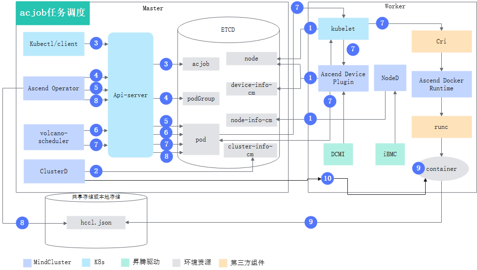
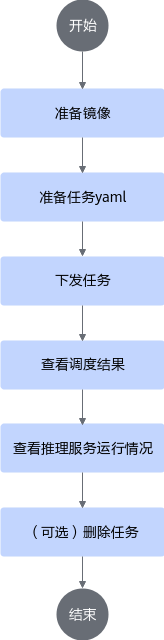
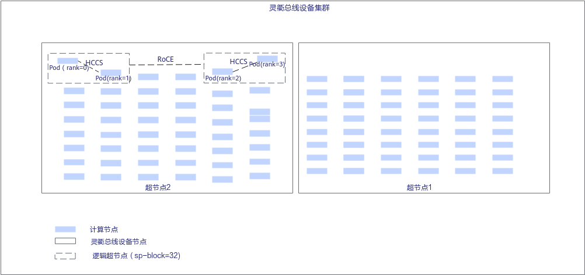

# 部署MindIE Motor<a name="ZH-CN_TOPIC_0000002511346333"></a>

## 实现原理<a name="ZH-CN_TOPIC_0000002511426301"></a>



各步骤说明如下：

1. 集群调度组件定期上报节点和芯片信息。
    - kubelet上报节点芯片数量到节点对象（node）中。
    - Ascend Device Plugin上报芯片内存和拓扑信息。

        对于包含片上内存的芯片，Ascend Device Plugin启动时上报芯片内存情况，见node-label说明；上报整卡信息，将芯片的物理ID上报到device-info-cm中；可调度的芯片总数量（allocatable）、已使用的芯片数量（allocated）和芯片的基础信息（device ip和super\_device\_ip）上报到node中，用于整卡调度。

    - 当节点上存在故障时，NodeD定期上报节点健康状态、节点硬件故障信息到node-info-cm中，将共享存储故障信息上报到ClusterD的公共故障中。

2. ClusterD读取device-info-cm和node-info-cm中的信息，以及公共故障中的信息后，将信息写入cluster-info-cm。
3. 用户通过kubectl或者其他深度学习平台下发不使用NPU卡的MS Controller、MS Coordinator以及数个使用NPU卡的MindIE Server任务。
4. Ascend Operator为任务创建相应的podGroup。关于podGroup的详细说明，可以参考[开源Volcano官方文档](https://volcano.sh/docs/v1.9.0/Concepts/podgroup)。
5. Ascend Operator为任务创建相应的Pod，并注入MindIE Server服务启动所需的环境变量。关于环境变量的详细说明请参见[Ascend Operator注入的训练环境变量](../../06_api/13_environment_variable_description.md#ascend-operator环境变量说明)。
6. 对于MS Controller、MS Coordinator任务，volcano-scheduler根据节点内存、CPU及标签、亲和性选择合适节点。对于MindIE Server任务volcano-scheduler还会参考芯片拓扑信息为其选择合适节点，并在Pod的annotation上写入选择的芯片信息以及节点硬件信息。
7. kubelet创建容器时，对于MindIE Server任务，调用Ascend Device Plugin挂载芯片，Ascend Device Plugin或volcano-scheduler在Pod的annotation上写入芯片和节点硬件信息。Ascend Docker Runtime协助挂载相应资源。
8. Ascend Operator读取每个MindIE Server任务Pod的annotation信息，生成各自的集合通信文件hccl.json，以ConfigMap形式存储在etcd中。
9. ClusterD侦听MS Controller、MS Coordinator任务Pod信息以及各个hccl.json对应ConfigMap的变化，实时生成global-ranktable。关于global-ranktable的详细说明请参见[SubscribeRankTable](../../06_api/04_clusterd/05_service_configuration_apis.md#subscriberanktable)中“global-ranktable文件说明”部分。
10. MS Controller启动后，与ClusterD建立通信，通过gRPC接口订阅global-ranktable的变化。

## 通过命令行使用<a name="ZH-CN_TOPIC_0000002511426327"></a>

>[!NOTICE]
>如果用户未配置RoCE网络：
>
>- 在非超节点调度场景下，单机推理实例可以正常调度，但是推理实例间的KV传输可能异常，导致推理任务无法正常运行。
>- 在超节点调度场景下，如果推理实例的逻辑超节点数量为1，推理实例可以正常调度，但是推理实例间的KV传输可能异常，导致推理任务无法正常运行。

### 流程说明<a name="ZH-CN_TOPIC_0000002511426315"></a>

MindIE Motor包含两个部分，MindIE MS（MindIE Management Service）和MindIE Server。其中MindIE MS包含MS Controller和MS Coordinator，MindIE Server可以分为Prefill实例和Decode实例。其中MS Controller、MS Coordinator不需要使用NPU资源，MindIE Server需要NPU资源。

MindCluster集群调度组件支持MS Controller、MS Coordinator和MindIE Server组件分别运行在独立的Pod内。使用MindCluster集群调度组件进行MindIE Motor任务部署时，MS Controller、MS Coordinator以及MindIE Server中的每个实例分别以一个AscendJob进行部署，例如一个推理任务包含2个Prefill实例和1个Decode实例，则需要部署5个AscendJob。

了解PD分离服务部署的详细说明可参考《MindIE Motor开发指南》中的“集群服务部署 \> [PD分离服务部署](https://www.hiascend.com/document/detail/zh/mindie/300/mindiemotor/motordev/user_guide/service_deployment/pd_separation_service_deployment.md)”章节。

**使用流程<a name="zh-cn_topic_0000002328850238_section5640184231810"></a>**

通过命令行使用MindCluster集群调度组件部署MindIE Motor推理任务时，使用流程如下图所示。

**图 1**  使用流程<a name="fig38991911205815"></a>


### 准备任务YAML<a name="ZH-CN_TOPIC_0000002479386386"></a>

用户可根据实际情况完成制作镜像的准备工作，然后选择相应的YAML示例，对示例进行修改。

**前提条件<a name="zh-cn_topic_0000002362848597_section629963815311"></a>**

已完成镜像的准备工作。

**选择YAML示例<a name="zh-cn_topic_0000002362848597_section132746121119"></a>**

集群调度为用户提供YAML示例，用户需要根据使用的组件、芯片类型和任务类型等，选择相应的YAML示例并根据需求进行相应修改后才可使用。

<a name="zh-cn_topic_0000002362848597_table74058394335"></a>

|类型|硬件型号|YAML名称|获取链接|
|--|--|--|--|
|MS Controller|-|controller.yaml|[获取YAML](https://gitcode.com/Ascend/mindxdl-deploy/tree/c20d2ea32f5ccca8b06b735d31cf36240ed1407f/samples/inference/volcano/mindie-ms)|
|MS Coordinator|-|coordinator.yaml|[获取YAML](https://gitcode.com/Ascend/mindxdl-deploy/tree/c20d2ea32f5ccca8b06b735d31cf36240ed1407f/samples/inference/volcano/mindie-ms)|
|MindIE Server|<p>Atlas 800I A2 推理服务器</p><p>Atlas 800I A3 超节点服务器</p>|server.yaml|[获取YAML](https://gitcode.com/Ascend/mindxdl-deploy/tree/c20d2ea32f5ccca8b06b735d31cf36240ed1407f/samples/inference/volcano/mindie-ms)|

>[!NOTE]
>若使用的设备为Atlas 800I A3 超节点服务器，请在获取YAML后，参考[以下的示例](#li7390175311918)对部分参数进行修改。

**任务YAML说明<a name="zh-cn_topic_0000002362848597_section1870105118125"></a>**

与普通Ascend Job任务相比，MindIE Motor推理任务需要额外增加以下两个label：app和jobID。MindIE Server使用NPU卡，用户需根据Prefill实例和Decode实例数，下发等量的AscendJob。

>[!NOTE]
>关于等量acjob的说明如下：例如一个MindIE Motor推理任务包含1个controller、1个coordinator，x个P实例，y个D实例，则需要部署以下数量的acjob：1+1+x+y。

- **MS Controller、MS Coordinator**不使用NPU卡，分别以一个AscendJob进行部署，支持多副本。MS Controller、MS Coordinator的YAML示例如下。

    <pre codetype="yaml">
    apiVersion: mindxdl.gitee.com/v1
    kind: AscendJob
    metadata:
      name: mindie-ms-test-controller
      namespace: mindie
      labels:
        framework: pytorch
        <strong>app: mindie-ms-controller   # 表示MindIE Motor在Ascend Job任务中的角色,不可修改</strong>
        <strong>jobID: mindie-ms-test       # 当前MindIE Motor任务在集群中的唯一识别ID，用户可根据实际情况进行配置</strong>
        ring-controller.atlas: ascend-910b
    spec:
      schedulerName: volcano   # Ascend Operator启用“gang”调度时所选择的调度器
      runPolicy:
        schedulingPolicy:      # Ascend Operator启用“gang”调度生效且调度器为Volcano时，本字段才生效
          minAvailable: 1      # 任务运行总副本数
          queue: default
      successPolicy: AllWorkers
      replicaSpecs:
        Master:
          replicas: 1
          restartPolicy: Always
          template:
            metadata:
              ...</pre>

在以上示例中，关于app和jobID的参数说明如下。如果想了解其他参数的详细说明请参见[YAML参数说明](#yaml参数说明)。

**app**：当前MindIE Motor在Ascend Job任务中的角色，取值包括mindie-ms-controller、mindie-ms-coordinator、mindie-ms-server。

**jobID**：当前MindIE Motor任务在集群中的唯一识别ID，用户可根据需要进行配置。

- **MindIE Server**的YAML示例如下。

    <pre codetype="yaml">
    apiVersion: v1
    kind: ConfigMap
    metadata:
      name: rings-config-mindie-server-0  # 名称必须与以下AscendJob的名称属性相同。前缀“rings-config-”不能修改。
      namespace: mindie
      labels:
        jobID: mindie-ms-test
        ring-controller.atlas: ascend-910b
        <strong>mx-consumer-cim: "true"</strong>
    data:
      hccl.json: |
        {
            "status":"initializing"
        }
    ---
    apiVersion: mindxdl.gitee.com/v1
    kind: AscendJob
    metadata:
      name: mindie-server-0
      namespace: mindie
      labels:
        framework: pytorch
        <strong>app: mindie-ms-server        # 表示当前MindIE Motor在Ascend Job任务中的角色,不可修改</strong>
        <strong>jobID: mindie-ms-test        # 当前MindIE Motor任务在集群中的唯一识别ID，用户可根据实际情况进行配置</strong>
        ring-controller.atlas: ascend-910b
      annotations:
        huawei.com/schedule.filter.faultCode: "8C1F8608,4C1F8608,80E01801"       # 增加该annotation，配置方法请参见YAML参数说明
        huawei.com/schedule.filter.faultLevel: "RestartRequest"       # 增加该annotation，配置方法请参见YAML参数说明
    spec:
      schedulerName: volcano   # Ascend Operator启用“gang”调度时所选择的调度器
      runPolicy:
        schedulingPolicy:      # Ascend Operator启用“gang”调度生效且调度器为Volcano时，本字段才生效
          minAvailable: 2      # 任务运行总副本数
          queue: default
      successPolicy: AllWorkers
      replicaSpecs:
        Master:</pre>

- <a name="li7390175311918"></a>如果硬件型号为Atlas 800I A3 超节点服务器，**MindIE Server**的任务YAML需要做以下修改：

    <pre codetype="yaml">
    apiVersion: mindxdl.gitee.com/v1
    kind: AscendJob
    metadata:
      name: mindie-server-0
      namespace: mindie
      labels:
        framework: pytorch
        app: mindie-ms-server        # 不可修改
        jobID: mindie-ms-test        # MindIE Motor任务在集群中的唯一识别ID，用户可根据实际情况进行配置
        ring-controller.atlas: ascend-910b
        fault-scheduling: force
      <strong>annotations:</strong>
        <strong>sp-block: "16"         # 增加该annotation，配置方法请参见YAML参数说明</strong>
        <strong>huawei.com/schedule_policy: "chip2-node16"    # 根据硬件形态设置调度策略</strong>
        huawei.com/schedule.filter.faultCode: "8C1F8608,4C1F8608,80E01801"       # 增加该annotation，配置方法请参见YAML参数说明
        huawei.com/schedule.filter.faultLevel: "RestartRequest"       # 增加该annotation，配置方法请参见YAML参数说明
    spec:
      schedulerName: volcano   # Ascend Operator启用“gang”调度时所选择的调度器
      runPolicy:
        schedulingPolicy:      # Ascend Operator启用“gang”调度生效且调度器为Volcano时，本字段才生效
          minAvailable: 2      # 任务运行总副本数
          queue: default
      successPolicy: AllWorkers
      replicaSpecs:
        Master:
          replicas: 1
          restartPolicy: Always
          template:
            metadata:
              labels:
                ring-controller.atlas: ascend-910b
                app: mindie-ms-server
                jobID: mindie-ms-test
            spec:
              nodeSelector:
                accelerator: huawei-Ascend910</pre>

### （可选）配置实例级亲和调度<a name="ZH-CN_TOPIC_0000002511346349"></a>

Atlas 800I A3 超节点服务器场景下，MindCluster集群调度组件支持MindIE Motor推理任务配置任务级别亲和性调度策略，可实现将MindIE Server实例尽量调度到同一个物理超节点中，充分利用HCCS网络，加速实例间的网络通信。

关于逻辑超节点的亲和性调度规则的详细说明，请参见[灵衢总线设备节点网络说明](../03_basic_scheduling/01_affinity_scheduling/03_ascend_ai_processor_based_affinity.md#atlas-900-a3-superpod-超节点)章节。

**图 1**  灵衢总线设备节点网络<a name="zh-cn_topic_0000002362872425_fig1054553210321"></a>


**配置实例级亲和性调度<a name="zh-cn_topic_0000002362872425_section18872194156"></a>**

在已完成镜像的准备工作后，用户在进行[准备任务YAML](#准备任务yaml)时，如需为MindIE Motor推理任务配置实例级亲和性调度策略，可同时进行如下配置。

- 任务YAML中指定sp-block字段，sp-block的值必须和job芯片数量一致，保证整个Job调度到一个物理超节点中。

- MindIE Server实例调度优先保证物理超节点内有预留节点。

- 设置sp-fit为idlest时，MindIE Server实例往更空闲的物理超节点调度。
- 设置podAffinity时，MindIE Server实例往具有更多亲和性Pod的物理超节点调度。

YAML示例如下。

<pre codetype="yaml">
apiVersion: mindxdl.gitee.com/v1
kind: AscendJob
metadata:
  name: mindie-server-0
  namespace: mindie
  labels:
    framework: pytorch
    app: mindie-ms-server        # 表示MindIE Motor在Ascend Job任务中的角色,不可修改
    jobID: mindie-ms-test        # 当前MindIE Motor任务在集群中的唯一识别ID，用户可根据实际情况进行配置
    ring-controller.atlas: ascend-910b
    fault-scheduling: force
  annotations:
    <strong>sp-block: "16"              # 指定sp-block字段，集群调度组件会在物理超节点的基础上根据切分策略划分出逻辑超节点，用于训练任务的亲和性调度</strong>
    <strong>sp-fit: "idlest"            # 超节点调度策略，详细说明请参见YAML参数说明</strong>
    <strong>huawei.com/schedule_policy: "chip2-node16"    # 根据硬件形态设置调度策略</strong>
spec:
  schedulerName: volcano   # Ascend Operator启用“gang”调度时所选择的调度器
  runPolicy:
    schedulingPolicy:      # Ascend Operator启用“gang”调度生效时且调度器为Volcano时，本字段才生效
      minAvailable: 2      # 任务运行总副本数
      queue: default
  successPolicy: AllWorkers
  replicaSpecs:
    Master:
      restartPolicy: Never
      template:
        metadata:
          labels:
            ring-controller.atlas: ascend-910b
        spec:
          affinity:
            <strong>podAffinity:            # 表示逻辑超节点会往具有更多亲和性Pod的物理超节点调度</strong>
              <strong>preferredDuringSchedulingIgnoredDuringExecution:</strong>
              <strong>- weight: 100         # 不可修改</strong>
                <strong>podAffinityTerm:</strong>
                  <strong>labelSelector:</strong>
                    <strong>matchLabels:</strong>
                      <strong>jobID: mindie-ms-test  # 亲和Pod所需要的标签</strong>
                  <strong>topologyKey: kubernetes.io/hostname</strong></pre>

### YAML参数说明<a name="ZH-CN_TOPIC_0000002511346361"></a>

acjob任务下，任务YAML中各参数的说明如下表所示。

**表 1**  YAML参数说明

<a name="zh-cn_topic_0000002329010086_table7602101418317"></a>

|参数|取值|说明|
|---| ---| ---|
|framework|<ul><li>mindspore</li><li>pytorch</li></ul>|-|
|jobID|当前MindIE Motor推理任务在集群中的唯一识别ID，用户可根据实际情况进行配置。|该参数仅支持在Atlas 800I A2 推理服务器、Atlas 800I A3 超节点服务器上使用。|
|app|表示当前MindIE Motor推理任务在Ascend Job任务中的角色，取值包括mindie-ms-controller、mindie-ms-coordinator、mindie-ms-server。|<ul><li>acjob的任务YAML同时包含jobID和app这2个字段时，Ascend Operator组件会自动传入环境变量MINDX\_TASK\_ID、APP\_TYPE、MINDX\_SERVER\_IP及MINDX\_SERVER\_DOMAIN，并将其标识为MindIE推理任务。</li><li>关于以上环境变量的详细说明请参见[Ascend Operator注入的训练环境变量](../../06_api/13_environment_variable_description.md#ascend-operator环境变量说明)。</li><li>该参数仅支持在Atlas 800I A2 推理服务器、Atlas 800I A3 超节点服务器上使用。</li></ul>|
|mx-consumer-cim|标记该ConfigMap是否会被ClusterD侦听。<p>true：是</p>|-|
|mind-cluster/scaling-rule|标记扩缩容规则对应的ConfigMap名称。|仅支持MindIE Motor推理任务在Atlas 800I A2 推理服务器、Atlas 800I A3 超节点服务器上使用本参数。|
|mind-cluster/group-name|标记扩缩容规则中对应的group名称。|仅支持MindIE Motor推理任务在Atlas 800I A2 推理服务器、Atlas 800I A3 超节点服务器上使用本参数。|
|podAffinity|表示逻辑超节点会往具有更多亲和性Pod的物理超节点调度。|仅支持MindIE Motor推理任务Atlas 800I A3 超节点服务器上使用本参数。|
|sp-fit|超节点调度策略。<ul><li>idlest：逻辑超节点会往更空闲的物理超节点调度。</li><li>非idlest：逻辑超节点会优先占满物理超节点。</li></ul>|仅支持MindIE Motor推理任务Atlas 800I A3 超节点服务器上使用本参数。|
|ring-controller.atlas|<ul><li>Atlas A2 训练系列产品、A200T A3 Box8 超节点服务器、Atlas 900 A3 SuperPoD 超节点、Atlas 800T A3 超节点服务器取值为：ascend-<i>{xxx}</i>b</li><li>Atlas 800 训练服务器、服务器（插Atlas 300T 训练卡）取值为：ascend-910</li></ul>|标识任务使用的芯片的产品类型。需要在ConfigMap和任务task中配置。|
|schedulerName|默认值为“volcano”，用户需根据自身情况填写|Ascend Operator启用“gang”调度时所选择的调度器。|
|minAvailable|默认值为任务总副本数|Ascend Operator启用“gang”调度生效，且调度器为Volcano时，任务运行总副本数。|
|queue|默认值为“default”，用户需根据自身情况填写|Ascend Operator启用“gang”调度生效，且调度器为Volcano时，任务所属队列。|
|（可选）successPolicy|<ul><li>默认值为空，若用户不填写该参数，则默认取空值。</li><li>AllWorkers</li></ul>|表明任务成功的前提。空值代表只需要一个Pod成功，整个任务判定为成功。取值为“AllWorkers”表示所有Pod都成功，任务才判定为成功。|
|container.name|ascend|训练容器的名称必须是“ascend”。|
|（可选）ports|若用户未进行设置，系统默认填写以下参数：<ul><li>name：ascendjob-port</li><li>containerPort：2222</li></ul>|分布式训练集合通讯端口。“containerPort”用户可根据实际情况设置，若未进行设置则采用默认端口2222。|
|replicas|<ul><li>单机：1</li><li>分布式：N</li></ul>|N为任务副本数。|
|image|-|训练镜像名称，请根据实际修改。|
|sp-block|指定逻辑超节点芯片数量。<ul><li>单机时需要和任务请求的芯片数量一致。</li><li>分布式时需要是节点芯片数量的整数倍，且任务总芯片数量是其整数倍。</li></ul>|指定sp-block字段，集群调度组件会在物理超节点上根据切分策略划分出逻辑超节点，用于任务的亲和性调度。若用户未指定该字段，Volcano调度时会将此任务的逻辑超节点大小指定为任务配置的NPU总数。<ul><li>了解详细说明请参见[灵衢总线设备节点网络说明](../03_basic_scheduling/01_affinity_scheduling/03_ascend_ai_processor_based_affinity.md#atlas-900-a3-superpod-超节点)。</li><li>仅支持在Atlas 800I A3 超节点服务器中使用该字段。</li><li>使用了该字段后，不需要额外配置tor-affinity字段。</li><li>FAQ：[任务申请的总芯片数量为32，sp-block设置为32可以正常训练，sp-block设置为16无法完成训练，训练容器报错提示初始化连接失败](https://gitcode.com/Ascend/mind-cluster/issues/377)</li></ul>|
|tor-affinity|<ul><li>large-model-schema：大模型任务或填充任务</li><li>normal-schema：普通任务</li><li>null：不使用交换机亲和性调度</li></ul><div class="note"><span class="notetitle">[!NOTE] 说明</span><div class="notebody">用户需要根据任务副本数，选择任务类型。任务副本数小于4为填充任务。任务副本数大于或等于4为大模型任务。普通任务不限制任务副本数。</div></div>|默认值为null，表示不使用交换机亲和性调度。用户需要根据任务类型进行配置。<ul><li>交换机亲和性调度1.0版本支持Atlas 训练系列产品和Atlas A2 训练系列产品；支持PyTorch和MindSpore框架。</li><li>交换机亲和性调度2.0版本支持Atlas A2 训练系列产品；支持PyTorch框架。</li></ul>|
|pod-rescheduling|<ul><li>on：开启Pod级别重调度</li><li>其他值或不使用该字段：关闭Pod级别重调度</li></ul>|Pod级别重调度，表示任务发生故障后，不会删除所有任务Pod，而是将发生故障的Pod进行删除，重新创建新Pod后进行重调度。<ul><li>重调度模式默认为任务级重调度，若需要开启Pod级别重调度，需要新增该字段。</li><li>Pod级别重调度目前只支持MS Controller和MS Coordinator。</li></ul>|
|subHealthyStrategy|<ul><li>ignore：忽略该亚健康节点，后续任务在亲和性调度上不优先调度该节点。</li><li>graceExit：不使用亚健康节点，并保存临终CKPT文件后，进行重调度，后续任务不会调度到该节点。</li><li>forceExit：不使用亚健康节点，不保存任务直接退出，进行重调度，后续任务不会调度到该节点。</li><li>默认取值为ignore。</li></ul>|节点状态为亚健康（SubHealthy）的节点的处理策略。|
|huawei.com/Ascend910|Atlas 800 训练服务器（NPU满配）：<ul><li>单机单芯片：1</li><li>单机多芯片：2、4、8</li><li>分布式：1、2、4、8</li></ul>Atlas 800 训练服务器（NPU半配）：<ul><li>单机单芯片：1</li><li>单机多芯片：2、4</li><li>分布式：1、2、4</li></ul>服务器（插Atlas 300T 训练卡）：<ul><li>单机单芯片：1</li><li>单机多芯片：2</li><li>分布式：2</li></ul>Atlas 800T A2 训练服务器和Atlas 900 A2 PoD 集群基础单元：<ul><li>单机单芯片：1</li><li>单机多芯片：2、3、4、5、6、7、8</li><li>分布式：1、2、3、4、5、6、7、8</li></ul>Atlas 200T A2 Box16 异构子框和Atlas 200I A2 Box16 异构子框：<ul><li>单机单芯片：1</li><li>单机多芯片：2、3、4、5、6、7、8、10、12、14、16</li><li>分布式：1、2、3、4、5、6、7、8、10、12、14、16</li></ul>Atlas 900 A3 SuperPoD 超节点<ul><li>单机单芯片：1</li><li>单机多芯片：2、4、6、8、10、12、14、16</li><li>分布式：16</li></ul>|请求的NPU数量，请根据实际修改。|
|(.kind=="AscendJob").spec.replicaSpecs.{Master\|Scheduler\|Worker}.template.spec.containers\[0\].env\[name==ASCEND\_VISIBLE\_DEVICES\].valueFrom.fieldRef.fieldPath| 取值为metadata.annotations\['huawei.com/AscendXXX'\]，其中XXX表示芯片的型号，支持的取值为910，310和310P。取值需要和环境上实际的芯片类型保持一致。|Ascend Docker Runtime会获取该参数值，用于给容器挂载相应类型的NPU。<div class="note"><span class="notetitle">[!NOTE] 说明</span><div class="notebody">该参数只支持使用Volcano调度器的整卡调度特性，使用静态vNPU调度和其他调度器的用户需要删除示例YAML中该参数的相关字段。</div></div>|
|fault-scheduling|<ul><li>grace：配置任务采用优雅删除模式，并在过程中先优雅删除原Pod，15分钟后若还未成功，使用强制删除原Pod。</li><li>force：配置任务采用强制删除模式，在过程中强制删除原Pod。</li><li>off、无（无fault-scheduling字段）或其他值：该任务不使用断点续训特性，K8s的maxRetry仍然生效。</li></ul>|-|
|fault-retry-times|<ul><li>0 \< fault-retry-times：处理业务面故障，必须配置业务面无条件重试的次数。<ul><li>使用无条件重试功能需保证训练进程异常时容器异常退出，若容器未异常退出则无法成功重试。</li><li>当前仅Atlas 800T A2 训练服务器和Atlas 900 A2 PoD 集群基础单元支持无条件重试功能。</li><li>进行进程级恢复时，将会触发业务面故障，如需使用进程级恢复，必须配置此参数。</li></ul></li><li>无（无fault-retry-times）或0：该任务不使用无条件重试功能，无法感知业务面故障，vcjob的maxRetry仍然生效。</li></ul>|-|
|backoffLimit|<ul><li>0 \< backoffLimit：任务重调度次数。任务故障时，可以重调度的次数，当已经重调度次数与backoffLimit取值相同时，任务将不再进行重调度。<p>同时配置了backoffLimit和fault-retry-times参数时，当已经重调度次数与backoffLimit或fault-retry-times取值有一个相同时，将不再进行重调度。</p></li><li>无（无backoffLimit）或backoffLimit ≤ 0：不限制总重调度次数。若不配置backoffLimit，但是配置了fault-retry-times参数，则使用fault-retry-times的重调度次数。</li></ul>|-|
|restartPolicy|<ul><li>Never：从不重启</li><li>Always：总是重启</li><li>OnFailure：失败时重启</li><li>ExitCode：根据进程退出码决定是否重启Pod，错误码是1~127时不重启，128~255时重启Pod。<div class="note"><span class="notetitle">[!NOTE] 说明</span><div class="notebody">vcjob类型的训练任务不支持ExitCode。</div></div></li></ul>|容器重启策略。当配置业务面故障无条件重试时，容器重启策略取值必须为“Never”。|
|terminationGracePeriodSeconds|0 \< terminationGracePeriodSeconds \< **grace-over-time**参数取值|容器收到SIGTERM到被K8s强制停止经历的时间，该时间需要大于0且小于volcano-v<i>{version}</i>.yaml文件中“**grace-over-time**”参数取值，同时还需要保证能够保存CKPT文件，请根据实际情况修改。具体说明请参考K8s官网[容器生命周期回调](https://kubernetes.io/zh/docs/concepts/containers/container-lifecycle-hooks/)。<p>只有当fault-scheduling配置为grace时，该字段才生效；fault-scheduling配置为force时，该字段无效。</p>|
|hostNetwork|<ul><li>true：使用HostIP创建Pod。</li><li>false：不使用HostIP创建Pod。</li></ul>|<ul><li>当集群规模较大（节点数量\>1000时），推荐使用HostIP创建Pod。</li><li>不传入此参数时，默认不使用HostIP创建Pod。</li></ul><div class="note"><span class="notetitle">[!NOTE] 说明</span><div class="notebody">当HostNetwork取值为true时，若当前任务YAML挂载了RankTable文件路径，则可以通过在训练脚本中解析RankTable文件获取Pod的hostIP来实现建链。若任务YAML未挂载RankTable文件路径，则与原始保持一致，使用serviceIP来实现建链。</div></div>|
|huawei.com/schedule.filter.faultCode|取值示例："8C1F8608:30, 80E01801"，表示在30秒时间窗内，静默8C1F8608故障；在60秒时间窗内，静默80E01801故障。<p>若未配置时间窗，则默认为60，取值范围为0~86400，单位为秒。</p>|配置任务需要静默的故障码和时间窗。<ul><li>故障码仅支持配置芯片故障和灵衢总线设备故障的故障码。支持的故障码详细请参见faultCode.json和SwitchFaultCode.json文件。</li><li>支持配置多个故障码和时间窗，多个配置使用英文逗号分隔。</li><li>对于MindIE Service，若YAML文件中无此配置项，则默认静默以下故障码：<ul><li>8C1F8608静默60秒</li><li>4C1F8608静默60秒</li><li>80E01801静默60秒</li></ul></li></ul>|
|huawei.com/schedule.filter.faultLevel|取值示例："RestartRequest:30, RestartBusiness"，表示在30秒时间窗内，静默所有RestartRequest级别的故障；在60秒时间窗内，静默所有RestartBusiness级别的故障。<p>若未配置时间窗，则默认为60，取值范围为0~86400，单位为秒。</p>|配置任务需要静默的故障级别和时间窗。<ul><li>故障级别仅支持配置芯片故障和灵衢总线设备故障的级别。支持的故障级别详细请参见[配置说明](../04_resumable_training/03_configuration/01_configuring_fault_detection_levels.md#配置说明)。</li><li>支持配置多个故障级别和时间窗，多个配置使用英文逗号分隔。</li><li>对于MindIE Service，若YAML文件中无此配置项，则默认所有RestartRequest级别的故障静默60秒。</li><li>huawei.com/schedule.filter.faultCode的优先级高于huawei.com/schedule.filter.faultLevel。</li><li>对于通知类故障，ClusterD静默此类故障后，可能导致Volcano不主动重调度故障Pod。任务可以通过订阅ClusterD的故障订阅接口，对接收到的故障进行相应处理，若处理失败需主动Error退出Pod。</li></ul>|

### 推理任务的下发、查看与删除<a name="ZH-CN_TOPIC_0000002479386412"></a>

用户完成任务YAML的准备工作之后，就可以进行以下操作：

1. 下发推理任务
2. 查看调度结果
3. 查看推理任务运行情况
4. （可选）删除任务

了解以上步骤的详细说明，请参见《MindIE Motor开发指南》中的“集群服务部署 \> PD分离服务部署 \> 安装部署 \> [使用kubectl部署单机PD分离服务示例](https://www.hiascend.com/document/detail/zh/mindie/300/mindiemotor/motordev/user_guide/service_deployment/pd_separation_service_deployment.md#使用kubectl部署单机pd分离服务示例)”章节。

### global-ranktable说明<a name="ZH-CN_TOPIC_0000002479226414"></a>

ClusterD侦听MS Controller、MS Coordinator任务Pod信息以及各个hccl.json对应ConfigMap的变化，实时生成global-ranktable。global-ranktable中部分字段来自hccl.json文件，关于hccl.json文件的详细说明请参见[hccl.json文件说明](../../06_api/14_hccl.json_file_description.md)。

- <term>Atlas A2 训练系列产品</term>global-ranktable示例如下。

    ```ColdFusion
    {
        "version": "1.0",
        "status": "completed",
        "server_group_list": [
            {
                "group_id": "2",
                "deploy_server": "0",
                "server_count": "1",
                "server_list": [
                    {
                        "device": [
                            {
                                "device_id": "x",
                                "device_ip": "xx.xx.xx.xx",
                                "device_logical_id": "x",
                                "rank_id": "x"
                            }
                        ],
                        "server_id": "xx.xx.xx.xx",
                        "server_ip": "xx.xx.xx.xx"
                    }
                ]
            }
        ]
    }
    ```

- <term>Atlas A3 训练系列产品</term>global-ranktable示例如下。

    ```ColdFusion
    {
        "version": "1.2",
        "status": "completed",
        "server_group_list": [
            {
                "group_id": "2",
                "deploy_server": "1",
                "server_count": "1",
                "server_list": [
                    {
                        "device": [
                            {
                                "device_id": "0",
                                "device_ip": "xx.xx.xx.xx",
                                "super_device_id": "xxxxx",
                                "device_logical_id": "0",
                                "rank_id": "0"
                            }
                        ],
                        "server_id": "xx.xx.xx.xx",
                        "server_ip": "xx.xx.xx.xx"
                    }
                ],
                "super_pod_list": [
                    {
                        "super_pod_id": "0",
                        "server_list": [
                            {
                                "server_id": "xx.xx.xx.xx"
                            }
                        ]
                    }
                ]
            }
        ]
    }
    ```

**表 1**  global-ranktable字段说明

<a name="zh-cn_topic_0000002324328268_table5843145110294"></a>

|字段|说明|
|--|--|
|version|版本|
|status|状态|
|server_group_list|服务组列表|
|group_id|任务组编号|
|server_count|服务器数量|
|server_list|服务器列表|
|server_id|AI Server标识，全局唯一|
|server_ip|Pod IP|
|device_id|NPU的设备ID|
|device_ip|NPU的设备IP|
|super_device_id|<span><term>Atlas A3 训练系列产品</term></span>超节点内NPU的唯一标识|
|rank_id|NPU对应的训练Rank ID|
|device_logical_id|NPU的逻辑ID|
|super_pod_list|超节点列表|
|super_pod_id|逻辑超节点ID|
