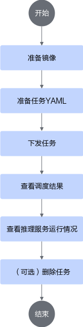

# 部署vLLM推理任务<a name="ZH-CN_TOPIC_0000002516412957"></a>

## 实现原理<a name="ZH-CN_TOPIC_0000002484053032"></a>

1. 集群调度组件定期上报节点和芯片信息。
    - kubelet上报节点芯片数量到节点对象（node）中。
    - Ascend Device Plugin上报芯片内存和拓扑信息。

        对于包含片上内存的芯片，Ascend Device Plugin启动时上报芯片内存情况，见node-label说明；上报整卡信息，将芯片的物理ID上报到device-info-cm中；可调度的芯片总数量（allocatable）、已使用的芯片数量（allocated）和芯片的基础信息（device ip和super\_device\_ip）上报到node中，用于整卡调度。

    - 当节点上存在故障时，NodeD定期上报节点健康状态、节点硬件故障信息到node-info-cm中，将共享存储故障上报到ClusterD的公共故障中。

2. ClusterD读取device-info-cm和node-info-cm中的信息，以及公共故障信息后，将信息整合到cluster-info-cm中。
3. 用户通过kubectl或者其他深度学习平台下发AIBrix框架的StormService推理任务，aibrix-controller-manager根据推理任务的配置生成RoleSet或者PodSet的子工作负载，再由对应的子工作负载生成多个推理服务的任务Pod。关于RoleSet或者PodSet的详细说明，可以参见[AIBrix文档](https://aibrix.readthedocs.io/latest/designs/aibrix-stormservice.html)。
4. volcano-controller为任务创建相应的PodGroup。关于PodGroup的详细说明，可以参见[开源Volcano官方文档](https://volcano.sh/docs/v1.9.0/Concepts/podgroup)。PodGroup生成策略如下：

    当前暂不支持在stormservice.spec.template.spec.schedulingStrategy或stormservice.spec.template.spec.roles[*].schedulingStrategy中设置volcanoSchedulingStrategy。此时由volcano-controller创建对应的PodGroup，具体策略如下：

    - 所有podGroupSize等于1的实例属于一个PodGroup。
    - 每个podGroupSize大于1的实例单独属于独立的PodGroup。

    例如，prefill实例的podGroupSize为1、replicas为2，decode实例的podGroupSize为2、replicas为2时，volcano-controller将会创建3个PodGroup，其中2个prefill实例同属于1个PodGroup，而每个decode实例对应一个PodGroup，即2个PodGroup。

5. volcano-scheduler根据节点内存、CPU及标签、亲和性为Pod选择合适的节点，并在Pod的annotation上写入选择的芯片信息以及节点硬件信息。
6. kubelet创建容器时，调用Ascend Device Plugin挂载芯片，Ascend Device Plugin或volcano-scheduler在Pod的annotation上写入芯片和节点硬件信息。Ascend Docker Runtime协助挂载相应资源。

## 通过命令行使用<a name="ZH-CN_TOPIC_0000002484213018"></a>

### 流程说明<a name="ZH-CN_TOPIC_0000002516292977"></a>

基于AIBrix的vLLM推理任务包含Routing  Pod和推理实例Pod，推理实例Pod可以分为Prefill实例Pod和Decode实例Pod，其中Routing  Pod不需要使用NPU资源，AIBrix根据不同的推理服务配置方式生成不同的工作负载，用于创建不同的推理实例，并由Router统一对外提供推理服务。

关于AIBrix任务部署的详细说明可参见[AIBrix文档](https://aibrix.readthedocs.io/latest/designs/aibrix-stormservice.html)。

**使用流程<a name="section19644656124210"></a>**

通过命令行使用MindCluster集群调度组件部署基于AIBrix的vLLM推理任务时，使用流程如[图1](#fig38991911205815)所示。

**图 1**  使用流程<a name="fig38991911205815"></a>


### 准备任务YAML<a name="ZH-CN_TOPIC_0000002516412959"></a>

用户可根据实际情况完成制作镜像的准备工作，然后选择相应的YAML示例，对示例进行修改。

**前提条件<a name="section3759720141513"></a>**

已完成镜像的准备工作。vLLM推理镜像可参考[vllm-ascend官方文档](https://vllm-ascend.readthedocs.io/)获取。

**选择YAML示例<a name="section1419519264165"></a>**

当前，基于AIBrix框架的vllm-ascend推理任务由StormService自定义CRD部署，StormService的使用和部署请参见[Aibrix StormService文档](https://aibrix.readthedocs.io/latest/designs/aibrix-stormservice.html)。StormService的YAML示例请参见[YAML](https://github.com/vllm-project/aibrix/blob/v0.5.0/samples/disaggregation/vllm/1p1d.yaml)。

AIBrix官方提供的示例均基于GPU，使用NPU时需要适配，以下是一个适配示例，用户可根据实际需求进行修改。

<pre codetype="yaml">
apiVersion: orchestration.aibrix.ai/v1alpha1
kind: StormService
metadata:
  name: "my-test"
  namespace: "default"
spec:
  replicas: 1                # 当前不支持修改，仅为1
  updateStrategy:
    type: "InPlaceUpdate"
  stateful: true
  selector:
    matchLabels:
      app: "my-test"
  template:
    metadata:
      labels:
        app: "my-test"
    spec:
      roles:
        - name: "prefill"         # prefill定义
          replicas: 1             # prefill副本数
          podGroupSize: 1         # prefill Pod副本数
          stateful: true          # 当前仅支持设置为true
          template:
            metadata:
              labels:
                model.aibrix.ai/name: "qwen3-moe"  # aibrix所需label，根据实际情况填写
                model.aibrix.ai/port: "8000"
                model.aibrix.ai/engine: "vllm"
                fault-scheduling: "force"          # 开启重调度
                <strong>pod-rescheduling："on"         # 如果podGroupSize为1，pod-rescheduling需要配置为"on"；如果podGroupSize大于1，则不需要配置，删除该参数</strong>
              annotations:
                <strong>huawei.com/schedule_policy: "chip2-node16-sp"</strong>
                <strong>huawei.com/schedule_minAvailable: "1" # Gang调度策略下最小调度的副本数，在StormService中所有podGroupSize为1的实例会组成一个podGroup进行调度，其最小调度的副本数范围为[1, 实例replicas之和]，建议配置为实例replicas之和；podGroupSize大于1的实例各自组成一个podGroup，其最小调度的副本数范围为[1, podGroupSize]，建议配置为podGroupSize。例如，prefill实例的podGroupSize为1，decode实例的podGroupSize为2，则prefill实例的最小调度副本数设置为prefill实例的replicas，decode实例的最小调度副本数设置为decode实例的podGroupSize</strong>
                <strong>huawei.com/recover_policy_path: "pod"  # pod-rescheduling为"on"时任务执行恢复的路径。设置为"pod"，表明Pod级重调度失败时，不升级到Job级重调度。因为当前podGroup中的每一个Pod都是一个独立的实例，所以其故障处理不能扩散到其他实例。（当使用vcjob时，需要配置该策略：policies: -event:PodFailed -action:RestartTask）</strong>
            spec:
              schedulerName: volcano           # 指定调度器为Volcano
              nodeSelector:
                example-key: example-value    # 示例值，用户可根据调度意图自行配置nodeSelector
              containers:
                - name: prefill
                  image: vllm-ascend:xxx        # 镜像名称
                  ...
                  resources:
                    limits:
                      "huawei.com/Ascend910": 16  # 配置NPU数量
                    requests:
                      "huawei.com/Ascend910": 16
        ...
        - name: decode       # decode定义
          replicas: 1        # decode副本数
          podGroupSize: 2    # decode pod副本数
          stateful: true
          template:
            metadata:
              labels:
                model.aibrix.ai/name: "qwen3-moe"
                model.aibrix.ai/port: "8000"
                model.aibrix.ai/engine: vllm
                fault-scheduling: "force"    # 开启重调度
              annotations:
                <strong>huawei.com/schedule_policy: "chip2-node16-sp"</strong>
                <strong>huawei.com/schedule_minAvailable: "2" # 见prefill实例参数说明</strong>
            spec:
              schedulerName: volcano
              nodeSelector:
                example-key: example-value    # 示例值，用户可根据调度意图自行配置nodeSelector
              containers:
                - name: decode
                  image: vllm-ascend:xxx

                  ...
                  resources:
                    limits:
                      "huawei.com/Ascend910": 16  # 配置NPU数量
                    requests:
                      "huawei.com/Ascend910": 16
        ...
        - name: routing    # routing定义
          replicas: 1      # routing副本数
          stateful: true
          template:
            spec:
              containers:
              - name: router
                image: xxx:yyy   # routing镜像
                ...</pre>

### YAML参数说明<a name="ZH-CN_TOPIC_0000002484053034"></a>

下表仅说明AIBrix的StormService YAML中与MindCluster有关的字段。

**表 1**  YAML参数说明

<a name="zh-cn_topic_0000002329010086_table7602101418317"></a>

|参数|取值|说明|
|---|---|---|
|schedulerName|取值为“volcano”。|配置调度器为Volcano。|
|sp-block|指定逻辑超节点芯片数量。<p>需要是节点芯片数量的整数倍，且P/D实例的总芯片数量是其整数倍。</p>|指定sp-block字段，集群调度组件会在物理超节点上根据切分策略划分出逻辑超节点，用于任务的亲和性调度。若用户未指定该字段，Volcano调度时会将此任务的逻辑超节点大小指定为任务配置的NPU总数。<ul><li>了解详细说明请参见[灵衢总线设备节点网络说明](../03_basic_scheduling/01_affinity_scheduling/03_ascend_ai_processor_based_affinity.md#atlas-900-a3-superpod-超节点)。</li><li>仅支持在Atlas 800I A3 超节点服务器中使用该字段。</li></ul>|
|pod-rescheduling|<ul><li>on：开启Pod级别重调度。</li><li>其他值或不使用该字段：关闭Pod级别重调度。</li></ul>|Pod级重调度，表示任务发生故障后，不会删除PodGroup内的所有任务Pod，而是将发生故障的Pod进行删除，由控制器重新创建新Pod后进行重调度。<div class="note"><span class="notetitle">[!NOTE] 说明</span><div class="notebody">如果podGroupSize为1，pod-rescheduling需要配置为"on"；podGroupSize大于1时，不配置该参数。</div></div>|
|huawei.com/schedule\_minAvailable|数字类型字符串|Gang调度策略下最小调度的副本数。在StormService中，<ul><li>所有podGroupSize为1的实例会组成一个podGroup进行调度，其最小调度的副本数范围为\[1, 实例replicas之和\]，建议配置为实例replicas之和。</li><li>podGroupSize大于1的实例各自组成一个podGroup，其最小调度副本数范围为\[1, podGroupSize\]，建议配置为podGroupSize。</li></ul>例如，prefill实例的podGroupSize为1，decode实例的podGroupSize为2，那么prefill实例的最小调度副本数设置为prefill实例的replicas，decode实例的最小调度副本数设置为decode实例的podGroupSize。|
|huawei.com/recover\_policy\_path|"pod"|pod-rescheduling为"on"时任务执行恢复的路径。设置为"pod"，表明Pod级重调度失败时，不升级到Job级重调度。因为当前podGroup中的每一个Pod都是一个独立的实例，所以其故障处理不能扩散到其他实例。（当使用vcjob时，需要配置该策略：policies: -event:PodFailed -action:RestartTask）|
|huawei.com/Ascend910|<ul><li>Atlas 800I A2 推理服务器：8</li><li>Atlas 900 A3 SuperPoD 超节点、Atlas 800I A3 超节点服务器: 16</li></ul>|请求的NPU数量。当前仅支持整机调度，请根据实际硬件卡数进行修改。|
|env\[name==ASCEND\_VISIBLE\_DEVICES\].valueFrom.fieldRef.fieldPath|取值为metadata.annotations\['huawei.com/Ascend910'\]，和环境上实际的芯片类型保持一致。| Ascend Docker Runtime会获取该参数值，用于给容器挂载相应类型的NPU。<div class="note"><span class="notetitle">[!NOTE] 说明</span><div class="notebody">该参数只支持使用Volcano调度器的整卡调度特性，使用静态vNPU调度和其他调度器的用户需要删除示例YAML中该参数的相关字段。</div></div>|
|fault-scheduling|<ul><li>grace：配置任务采用优雅删除模式，并在过程中先优雅删除原Pod，15分钟后若还未成功，使用强制删除原Pod。</li><li>force：配置任务采用强制删除模式，在过程中强制删除原Pod。</li><li>off、无（无fault-scheduling字段）或其他值：该推理任务不使用故障重调度特性。</li></ul>|-|
|fault-retry-times|<ul><li>0 \< fault-retry-times：处理业务面故障，必须配置业务面无条件重试的次数。</li><li>无（无fault-retry-times）或0：该任务不使用无条件重试功能，发生业务面故障之后Volcano不会主动删除故障的Pod。</li></ul>|-|
|restartPolicy|<ul><li>Never：从不重启</li><li>Always：总是重启</li><li>OnFailure：失败时重启</li><li>ExitCode：根据进程退出码决定是否重启Pod，错误码是1~127时不重启，128~255时重启Pod。<div class="note"><span class="notetitle">[!NOTE] 说明</span><div class="notebody">vcjob类型的训练任务不支持ExitCode。</div></div></li></ul>|容器重启策略。当配置业务面故障无条件重试时，容器重启策略取值必须为“Never”。|

### 推理任务的下发、查看与删除<a name="ZH-CN_TOPIC_0000002484213020"></a>

用户完成任务YAML的准备工作之后，就可以进行以下操作：

1. 下发推理任务
2. 查看调度结果
3. 查看推理任务运行情况
4. （可选）删除任务

了解以上步骤的详细说明，请参见[AIBrix文档](https://aibrix.readthedocs.io/latest/getting_started/quickstart.html)。

## 通过脚本一键式部署使用<a name="ZH-CN_TOPIC_0000002516330447"></a>

用户在K8s集群中部署多个相关联的推理任务，手动编写和维护大量的K8s YAML文件效率低下且容易出错。为此，MindCluster提供一个自动化脚本参考设计，替代繁琐的手动操作。用户只需提供基本的应用信息（如应用名、镜像版本、副本数等），脚本就能自动生成所有必要的、符合规范的K8s YAML文件，并直接部署到指定集群。同时，MindCluster提供一种简单的方式（如指定同一个应用名）一键删除所有相关资源。

当前脚本仅支持P/D分离部署。

**前提条件<a name="section178303526285"></a>**

- MindCluster、AIBrix相关组件安装完成。
- 环境已安装Python，并可联网下载依赖包。
- 存在KubeConfig文件，可以与K8s集群正常通信。

**操作步骤<a name="section582414444317"></a>**

1. 从mindcluster-deploy仓库获取源码，进入“k8s-deploy-tool”目录。

    ```shell
    git clone https://gitcode.com/Ascend/mindcluster-deploy.git && cd mindcluster-deploy/k8s-deploy-tool
    ```

2. （可选）创建并激活Python虚拟环境。该操作可以使得不同Python项目使用不同版本的库而互不干扰。

    ```shell
    python -m venv k8s-deploy-tool && source k8s-deploy-tool/bin/activate
    ```

    根据环境实际情况使用Python或Python3。

3. 安装依赖。

    ```shell
    pip install -r requirements.txt
    ```

4. （可选）修改实例启动脚本。用户可根据模型实际情况进行修改。
    1. 打开“example/scripts/start\_server.sh”文件。

        ```shell
        vi example/scripts/start_server.sh
        ```

    2. 按“i”进入编辑模式，根据模型实际情况，修改vLLM进程启动命令，例如max-model-len、max-num-batched-tokens等。
    3. 按“Esc”键，输入:wq!，按“Enter”保存并退出编辑。

5. （可选）复制启动脚本到主机其他目录或集群其他节点。如果用户环境为单机环境，可以跳过该步骤。如果用户环境包含共享存储，也可以将脚本文件复制到共享存储，并将共享存储挂载给推理服务。

    >[!NOTE]
    >scripts文件夹中默认的[代理脚本](https://gitcode.com/Ascend/mindcluster-deploy/blob/master/k8s-deploy-tool/example/scripts/load_balance_proxy_layerwise_server_example.py)会开启故障隔离功能，若无需该功能，请使用[原生代理脚本](https://github.com/vllm-project/vllm-ascend/blob/main/examples/disaggregated_prefill_v1/load_balance_proxy_layerwise_server_example.py)替换scripts文件夹中的代理脚本。

    ```shell
    cp example/scripts/*  <target_dir>
    scp example/scripts/* <user>@<IP>:<target_dir>
    ```

6. （可选）编辑YAML模板，配置模型、脚本挂载路径。用户可以根据模型和脚本实际路径配置YAML模板。
    1. 打开“src/templates/aibrix/stormservice.yaml.j2”文件。

        ```shell
        vi src/templates/aibrix/stormservice.yaml.j2
        ```

    2. 按“i”进入编辑模式，修改容器中模型存放目录。

        ```Yaml
        volumeMounts:
        - name: model
        mountPath: /mnt/models
        volumes:                  #修改挂载的volume
        - name: model             #设置为模型实际存放目录
        hostPath:
        path: /mnt/models
        - name: scripts           #设置为启动脚本实际存放目录
        hostPath:
        path: /scripts
        ```

    3. 按“Esc”键，输入:wq!，按“Enter”保存并退出编辑。

7. 编辑用户配置文件“config/stormservice-config.yaml”。

    1. 打开“config/stormservice-config.yaml”文件。

        ```shell
        vi config/stormservice-config.yaml
        ```

    2. 按“i”进入编辑模式，按实际情况修改文件中的字段。
    3. 按“Esc”键，输入:wq!，按“Enter”保存并退出编辑。

    >[!NOTE]
    >- “dp\_size”需要为“podGroupSize”的整数倍。
    >- 当“dp\_size”设置为“1”时，“distributed\_dp”只能为“false”，大于“1”时才能设置为“true”。

8. （可选）创建任务命名空间，vllm-test为“config/stormservice-config.yaml”设置的“app\_namespace”。如果“app\_namespace”为“default”或未设置，可以不创建命名空间。

    ```shell
    kubectl create ns vllm-test
    ```

9. 设置服务框架类型为aibrix。

    ```shell
    export SERVING_FRAMEWORK=aibrix
    ```

10. 部署推理任务。

    ```shell
    python main.py deploy -c config/stormservice-config.yaml
    ```

    根据环境实际情况使用Python或Python3。参数说明如下：

    - -c, --config：配置文件路径，必填。
    - -k, --kubeconfig：KubeConfig文件路径，选填。默认值为\~/.kube/config。
    - --dry-run：试运行（不实际部署，展示生成的YAML），选填。

11. 查看任务运行状态。

    ```shell
    python main.py status -n my-test -ns default
    ```

    参数说明如下：

    - -n, --app-name：应用名称，必填。
    - -ns, --namespace：应用命名空间，选填。默认值为"default"。
    - -k, --kubeconfig：KubeConfig文件路径，选填。默认值为\~/.kube/config。

    >[!NOTE]
    >用户也可以使用kubectl命令行工具查看任务运行状态。

12. 新建终端窗口，在当前K8s集群的节点中执行以下命令，访问推理服务。若请求成功返回，表示推理服务部署成功。

    ```shell
    curl http://<routing-podip>:8080/v1/completions \
    -H "Content-Type: application/json" \
    -d '{
    "model": "<模型名称>",
    "prompt": "Who are you?",
    "max_tokens": 10,
    "temperature": 0
    }'
    ```

    >[!NOTE]
    >- <routing-podip\>为Routing Pod的IP地址，可以通过以下命令查看。
    >
    >   ```shell
    >   kubectl get pod -A -o wide
    >   ```
    >
    >- <模型名称>取决于vLLM用于设定模型名称的启动参数`served_model_name`。

13. （可选）删除推理任务。若用户需要删除任务，可以执行该步骤。

    ```shell
    python main.py delete -n my-test -ns default
    ```

    参数说明如下：

    - -n, --app-name：应用名称，必填。
    - -ns, --namespace：应用命名空间，选填。默认值为"default"。
    - -k, --kubeconfig：KubeConfig文件路径，选填。默认值为\~/.kube/config。
