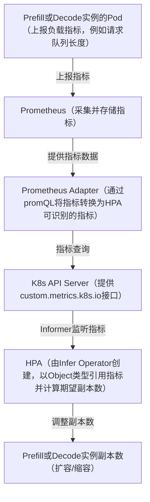
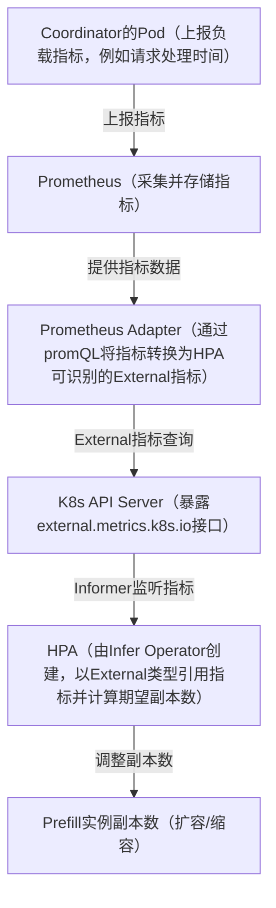

# 配置基于负载的弹性扩缩容

Infer Operator支持给推理实例配置弹性扩缩容策略，从而实现基于推理实例的负载情况自动调整推理实例数量的功能。

> [!NOTE]
> 弹性扩缩容功能当前仅支持在MindIE场景下使用，即通过[基于MindIE PyMotor部署Infer Operator推理任务](./02_deploying_infer_operator_inference_job_with_mindie_pymotor.md)
部署的推理实例支持配置弹性扩缩容。

## 前置准备

- 已完成Infer Operator的[安装部署](../../03_installation_guide/02_installation/00_helm_installation.md)。
- 推理任务需基于MindIE
  PyMotor部署，部署方式请参见[基于MindIE PyMotor部署Infer Operator推理任务](./02_deploying_infer_operator_inference_job_with_mindie_pymotor.md)。
- 如需配置扩缩容指标，需基于Prometheus
  Adapter搭建弹性扩缩容基础环境，具体部署方式及配置示例请参见[搭建弹性扩缩容基础环境](#搭建弹性扩缩容基础环境基于prometheus-adapter)
  章节。

> [!NOTE]
> 故障场景下，不支持进行自动或手动弹性扩缩容，弹性扩缩容开始前，需要保证所有实例处于Running状态

## 弹性扩缩容原理

Infer Operator会根据推理实例的弹性扩缩容配置，为对应实例创建相应的扩缩容控制器资源（例如Horizontal Pod
Autoscaler（HPA）），由扩缩容控制器根据实例的负载情况，自动调整实例的期望数量。

基于Prometheus Adapter的弹性扩缩容，由业务实例将负载指标上报到Prometheus，Prometheus
Adapter通过promQL将指标转换为HPA可识别的指标，HPA基于该指标计算期望副本数并作用到业务实例的副本数。根据指标来源不同，对应的HPA指标类型也不同：Prefill或Decode实例上报的指标对应Object指标类型，如[图1](#fig1)
所示；Coordinator上报的指标对应External指标类型，如[图2](#fig2)所示。

<a id="fig1"></a>

**图1 Prefill或Decode实例指标上报的弹性扩缩容原理（指标类型：Object）**



图1说明：

1. Prefill或Decode实例的Pod内通过NPU-Exporter或其他指标采集组件，将负载指标（例如请求队列长度）上报到Prometheus。
2. Prometheus对业务实例上报的指标进行采集与存储。
3. Prometheus Adapter通过配置的promQL规则，将Prometheus中查询到的指标转换为HPA可识别的指标，注册到K8s API
   Server的custom.metrics.k8s.io接口。
4. HPA以Object类型引用Prefill或Decode实例（Pod）上报的指标，通过Informer监听指标变化，周期性计算期望副本数。
5. HPA将期望副本数写入Prefill或Decode实例工作负载的replicas字段，实现Prefill或Decode实例的扩容与缩容。

<a id="fig2"></a>

**图2 Coordinator指标上报的弹性扩缩容原理（指标类型：External）**



图2说明：

1. Coordinator的Pod通过NPU-Exporter或其他指标采集组件，将负载指标（例如请求处理时间）上报到Prometheus。
2. 指标经过Prometheus采集存储、Prometheus Adapter的promQL转换并注册到K8s API
   Server后，HPA以External类型引用该指标，通过Informer监听指标变化并计算期望副本数，最终作用到Prefill实例的副本数上，实现Prefill实例的扩容与缩容。

与图1相比，图2的指标来源于Coordinator实例而非Prefill或Decode实例，且指标类型为External（图1中Prefill或Decode实例上报的指标类型为Object）。Coordinator上报场景适用于以Coordinator观测到的负载（例如PD分离场景下的请求量）作为决策依据、调整Prefill实例数量的场景。两者的后续链路（Prometheus →
Prometheus Adapter → K8s API Server → HPA Informer → 副本数调整）完全一致。

## 搭建弹性扩缩容基础环境（基于Prometheus Adapter）

基于Prometheus Adapter的弹性扩缩容基础环境由如下组件构成：

| 组件                         | 说明                                                                                                                                       |
|----------------------------|------------------------------------------------------------------------------------------------------------------------------------------|
| 业务实例（Prefill实例/Decode实例/Coordinator等） | 推理任务中的业务Pod，通过NPU-Exporter或其他指标采集组件将负载指标（例如请求队列长度、请求处理时间等）上报到Prometheus                                                                  |
| Prometheus                 | 采集并存储业务实例上报的负载指标                                                                                                                         |
| Prometheus Adapter         | 通过promQL规则将Prometheus中的指标转换为HPA可识别的指标，并注册到K8s API Server的custom.metrics.k8s.io（供Object指标类型使用）或external.metrics.k8s.io（供External指标类型使用）接口 |
| Infer Operator             | 根据scalingPolicy配置，自动创建并管理HPA                                                                                                             |
| HPA                        | 查询Object/External指标，计算期望副本数，调整业务实例副本数；HPA由Infer Operator根据任务的scalingPolicy配置自动创建并管理                                                      |

基础环境的搭建步骤如下：

1. **部署业务实例并上报指标**：业务实例需将Prometheus格式的负载指标上报到Prometheus。
2. **部署Prometheus**
   ：用于采集并存储业务实例上报的负载指标，Prometheus的部署及配置方式请参见[使用Prometheus](../01_resource_monitoring/02_working_with_prometheus.md)。

   若MindIE上报的指标未被Prometheus成功采集，可向mindie-motor-coordinator-obs服务添加Prometheus服务发现annotations，添加后Prometheus会自动通过Kubernetes服务发现（kubernetes_sd_configs）抓取该服务（MindIE）的endpoints，从而成功获取指标。示例annotations如下：

   ```yaml
   metadata:
     annotations:
       prometheus.io/scrape: "true" # 开启Prometheus对该服务endpoints的抓取
       prometheus.io/path: "/metrics" # 指定指标抓取路径
       prometheus.io/port: "<metrics_port>" # 指定指标抓取端口，需为mindie-motor-coordinator-obs服务暴露指标的端口
   ```

3. **部署Prometheus Adapter**：按照Prometheus Adapter[官网](https://github.com/kubernetes-sigs/prometheus-adapter)
   的安装部署指引完成部署（可使用其提供的Helm Chart：`prometheus-community/prometheus-adapter`进行部署），并配置promQL规则，
   将Prometheus中的指标查询结果转换为HPA可识别的指标，注册到K8s API Server的custom.metrics.k8s.io（供Object指标类型使用）
   或external.metrics.k8s.io（供External指标类型使用）接口，供HPA查询。部署时需注意：
    - 配置`--prometheus-url`为实际Prometheus服务的访问地址；
    - 确保Prometheus Adapter对外提供上述接口，以便HPA查询指标。
      promQL规则的配置示例请参见下文[Prometheus Adapter配置示例](#prometheus-adapter配置示例)。
4. **验证指标可用**：通过kubectl查询custom.metrics.k8s.io或external.metrics.k8s.io接口，确认目标指标可查询，例如执行
   `kubectl get --raw "/apis/external.metrics.k8s.io/v1beta1/namespaces/<namespace>/<metric-name>"`命令查看External指标查询结果。

### Prometheus Adapter配置示例

以下以业务指标`num_requests_waiting`、`generation_tokens_per_second`为例，给出Prometheus
Adapter的配置示例，用户可根据实际业务指标及触发规则自定义promQL规则。Prometheus
Adapter的部署方式请参见上文[搭建弹性扩缩容基础环境](#搭建弹性扩缩容基础环境基于prometheus-adapter)章节。

**1. 创建Prometheus Adapter配置（ConfigMap）**

通过ConfigMap中的`config.yaml`定义promQL规则，将Prometheus中的指标转换为HPA可识别的指标。其中，`rules`
下定义的指标注册到custom.metrics.k8s.io接口，供HPA以Object类型引用（对应Prefill或Decode实例上报指标场景）；`externalRules`
下定义的指标注册到external.metrics.k8s.io接口，供HPA以External类型引用（对应Coordinator上报指标场景）。示例如下：

```yaml
apiVersion: v1 # K8s API版本
kind: ConfigMap # 资源类型：配置映射（ConfigMap）
metadata: # 元数据
  name: prometheus-adapter # ConfigMap名称
  namespace: monitoring # 所在命名空间
data: # 配置数据
  config.yaml: | # Prometheus Adapter配置文件内容
    rules: # 规则列表，将指标注册到custom.metrics.k8s.io接口，供HPA以Object类型引用（对应Prefill或Decode实例上报指标场景）
    # 规则1：将num_requests_waiting指标直接暴露为同名指标
    - seriesQuery: '{__name__=~"vllm:num_requests_waiting"}' # 匹配Prometheus中的指标序列，通过__name__指定从Prometheus查询的指标
      resources: # 指标与K8s资源的映射配置，用于将指标关联到K8s资源
        overrides: # 指标标签与K8s资源的映射覆盖规则
          kubernetes_namespace: {resource: "namespace"} # 将指标中的命名空间标签映射为K8s的namespace资源
          kubernetes_pod_name: {resource: "pod"} # 将指标中的Pod名称标签映射为K8s的pod资源
      name: # 对外暴露的指标名称配置
        matches: "^(.*)$" # 正则表达式，用于匹配原始指标名
        as: "vllm_num_requests_waiting" # 转换后的指标名称
      metricsQuery: 'vllm:num_requests_waiting{<<.LabelMatchers>>}' # 对外暴露指标时执行的promQL语句
    externalRules: # 规则列表，将指标注册到external.metrics.k8s.io接口，供HPA以External类型引用（对应Coordinator上报指标场景）
    # 规则2：将num_requests_waiting与num_requests_running相加，暴露为vllm_total_requests指标
    - seriesQuery: '{__name__=~"vllm:(num_requests_waiting|num_requests_running)"}' # 匹配Prometheus中的指标序列，通过__name__指定从Prometheus查询的指标
      resources: # 指标与K8s资源的映射配置，用于将指标关联到K8s资源
        overrides: # 指标标签与K8s资源的映射覆盖规则
          kubernetes_namespace: {resource: "namespace"} # 将指标中的命名空间标签映射为K8s的namespace资源
          kubernetes_pod_name: {resource: "pod"} # 将指标中的Pod名称标签映射为K8s的pod资源
      name: # 对外暴露的指标名称配置
        matches: "^.*$" # 正则表达式，用于匹配原始指标名
        as: "vllm_total_requests" # 转换后的指标名称
      metricsQuery: | # 对外暴露指标时执行的promQL语句，通过修改可实现指标相加、相乘、时间窗口平均等复杂触发规则
        sum(
          vllm:num_requests_waiting{<<.LabelMatchers>>}
          +
          vllm:num_requests_running{<<.LabelMatchers>>}
        ) by (namespace, pod)
```

其中，`seriesQuery`用于匹配Prometheus中的指标序列，`metricsQuery`为对外暴露指标时执行的promQL语句，通过修改
`metricsQuery`即可实现指标相加、指标相乘、时间窗口平均（如`avg_over_time`）等复杂触发规则。

**2. HPA引用指标示例**

Prometheus Adapter将Prometheus指标转换为HPA可识别的指标后，HPA通过`type: Object`（Prefill或Decode实例上报的指标）或`type: External`
（Coordinator上报的指标）引用该指标，`metric.name`需与Prometheus Adapter暴露的指标名保持一致。

Prefill或Decode实例上报指标场景，HPA以`type: Object`引用指标，示例如下：

```yaml
metrics: # HPA扩缩容指标配置列表
  - type: Object # 指标类型：对象指标（Prefill或Decode实例上报的指标）
    object:
      describedObject: # 指标所属对象
        kind: Pod # 对象类型，示例为Prefill或Decode实例的Pod
        name: my-test-prefill-0 # 对象名称（示例值）
      metric:
        name: vllm_num_requests_waiting # 需与Prometheus Adapter暴露的指标名一致
      target: # 目标值配置，HPA根据该目标值判断是否触发扩缩容
        type: Value # 目标值类型，当前支持Utilization、Value、AverageValue
        value: "5" # 目标值，指标值超过该值时触发扩容
```

Coordinator上报指标场景，HPA以`type: External`引用指标，示例如下：

```yaml
metrics:
  - type: External # 指标类型：外部自定义指标（Coordinator上报的指标）
    external:
      metric:
        name: vllm_total_requests # 需与Prometheus Adapter暴露的External指标名一致
      target: # 目标值配置，HPA根据该目标值判断是否触发扩缩容
        type: AverageValue # 目标值类型，当前支持Utilization、Value、AverageValue
        averageValue: "10" # 目标平均值，指标平均值超过该值时触发扩容
```

业务实例、指标类型与HPA引用的对应关系如下表所示：

| 指标上报的业务实例   | Prometheus Adapter配置            | 指标注册接口                  | HPA指标类型  | HPA引用方式              |
|-------------|---------------------------------|-------------------------|----------|----------------------|
| Prefill或Decode实例       | rules（promQL：直接暴露/相加/相乘/时间窗口平均） | custom.metrics.k8s.io   | Object   | object.metric.name   |
| Coordinator | externalRules（promQL）           | external.metrics.k8s.io | External | external.metric.name |

完成上述步骤后，即可在[配置弹性扩缩容策略](#配置弹性扩缩容策略)章节的示例中配置HPA的metrics，本示例以`type: External`
类型配置扩缩容指标；根据弹性扩缩容原理，Prefill或Decode实例上报的指标对应`type: Object`，Coordinator上报的指标对应`type: External`
，指标名需与Prometheus Adapter暴露的指标保持一致。

## 配置弹性扩缩容策略

给推理实例配置弹性扩缩容策略的示例如下，需添加以下加粗部分配置。由于基于MindIE
PyMotor部署的推理任务仅Coordinator实例上报负载指标，Prefill、Decode实例均不上报指标，因此HPA扩缩容指标仅支持以External类型的形式表达（通过Coordinator上报指标经Prometheus
Adapter转换后获取）。

<pre codetype="yaml">
apiVersion: mindcluster.huawei.com/v1
kind: InferServiceSet
metadata:
  name: "my-test"
  namespace: default
spec:
  replicas: 1 # 推理服务副本数
  template:
    roles:
    - name: prefill # prefill定义
      replicas: 1   # prefill副本数
      workload:     # prefill中实例的CRD类型信息
        apiVersion: apps/v1
        kind: StatefulSet # workload类型，当前支持StatefulSet/Deployment
      <strong>scalingPolicy:</strong>
        <strong>type: HPA # 弹性扩缩容策略类型，当前支持HPA</strong>
        <strong>spec: # HPA配置</strong>
          <strong>minReplicas: 1 # 缩容下限</strong>
          <strong>maxReplicas: 4 # 扩容上限</strong>
          <strong>metrics: # HPA扩缩容指标配置列表</strong>
          <strong>- type: External # 指标类型：外部自定义指标</strong>
            <strong>external:</strong>
              <strong>metric:</strong>
                <strong>name: vllm_num_requests_waiting # 外部指标名称</strong>
                <strong>selector: # 可选：外部指标选择器，用于限定指标范围，相关配置项说明请参见YAML参数说明中的HPA相关配置</strong>
                  <strong>matchLabels: # 可选：指标匹配标签，采用Prometheus Adapter格式的标签，标签名中的“.”需替换为“_”</strong>
                    <strong>infer_huawei_com_inferservice_name: my-test-0 # 可选：推理服务名标签，对应infer.huawei.com/inferservice-name，示例值为my-test-0</strong>
                    <strong>kubernetes_namespace: default # 可选：命名空间标签，限定指标所属命名空间</strong>
              <strong>target: # 目标值配置，HPA根据该目标值判断是否触发扩缩容</strong>
                <strong>type: AverageValue # 目标值类型，当前支持Utilization、Value、AverageValue</strong>
                <strong>averageValue: "5" # 目标平均值，指标平均值超过该值时触发扩容</strong>
          <strong>... # 其他HPA配置项，根据需要添加，需符合HPA配置规范</strong>
      metadata:
        labels:
          infer.huawei.com/gang-schedule: 'false' # 关闭gang调度，开启时会为每一个workload实例创建PodGroup
      spec:
        replicas: 1 # prefill中workload的pod副本数
        podManagementPolicy: Parallel # 此配置可不填，当workload为StatefulSet，且infer.huawei.com/gang-schedule为true时，需配置为Parallel
        selector:
          matchLabels:
            app: test-prefill # 用户自定义，需要与下面labels中app配置保持一致
        template:
          metadata:
            labels:
              app: test-prefill # 用户自定义，需要与下面labels中app配置保持一致
              fault-scheduling: 'grace' # 开启重调度
              fault-retry-times: '10'
              ring-controller.atlas: ascend-910b # 标识产品类型
            annotations:
              huawei.com/schedule_policy: chip8-node8 # 根据硬件形态设置
          spec:
            schedulerName: volcano # 指定调度器为Volcano
            nodeSelector:
              example-key: example-value    # 示例值，用户可根据调度意图自行配置nodeSelector
            containers:
            - name: prefill
              image: vllm-ascend:xxx # 自定义vllm镜像名
              ...
              resources:
                requests:
                  huawei.com/Ascend910: 8
                limits:
                  huawei.com/Ascend910: 8
              ... # 补充容器必要的挂载项与运行命令
    - name: decode  # decode定义
      replicas: 1   # decode副本数
      workload:     # decode中实例的CRD类型信息
        apiVersion: apps/v1
        kind: StatefulSet # workload类型，当前支持StatefulSet/Deployment
      <strong>scalingPolicy:</strong>
        <strong>type: HPA # 弹性扩缩容策略类型，当前支持HPA</strong>
        <strong>spec: # HPA配置</strong>
          <strong>minReplicas: 1 # 缩容下限</strong>
          <strong>maxReplicas: 4 # 扩容上限</strong>
          <strong>metrics: # HPA扩缩容指标配置列表</strong>
          <strong>- type: External # 指标类型：外部自定义指标</strong>
            <strong>external:</strong>
              <strong>metric:</strong>
                <strong>name: vllm_total_requests # 外部指标名称</strong>
                <strong>selector: # 可选：外部指标选择器，用于限定指标范围，相关配置项说明请参见YAML参数说明中的HPA相关配置</strong>
                  <strong>matchLabels: # 可选：指标匹配标签，采用Prometheus Adapter格式的标签，标签名中的“.”需替换为“_”</strong>
                    <strong>infer_huawei_com_inferservice_name: my-test-0 # 可选：推理服务名标签，对应infer.huawei.com/inferservice-name，示例值为my-test-0</strong>
                    <strong>kubernetes_namespace: default # 可选：命名空间标签，限定指标所属命名空间</strong>
              <strong>target: # 目标值配置，HPA根据该目标值判断是否触发扩缩容</strong>
                <strong>type: AverageValue # 目标值类型，当前支持Utilization、Value、AverageValue</strong>
                <strong>averageValue: "10" # 目标平均值，指标平均值超过该值时触发扩容</strong>
          <strong>... # 其他HPA配置项，根据需要添加，需符合HPA配置规范</strong>
      metadata:
        labels:
          infer.huawei.com/gang-schedule: 'false' # 关闭gang调度，开启时会为每一个workload实例创建PodGroup
      spec:
        replicas: 1 # decode中workload的pod副本数
        podManagementPolicy: Parallel # 此配置可不填，当workload为StatefulSet，且infer.huawei.com/gang-schedule为true时，需配置为Parallel
        selector:
          matchLabels:
            app: test-decode # 用户自定义，需要与下面labels中app配置保持一致
        template:
          metadata:
            labels:
              app: test-decode # 用户自定义，需要与下面labels中app配置保持一致
              fault-scheduling: 'grace' # 开启重调度
              fault-retry-times: '10'
              ring-controller.atlas: ascend-910b # 标识产品类型
            annotations:
              huawei.com/schedule_policy: chip8-node8 # 根据硬件形态设置
          spec:
            schedulerName: volcano # 指定调度器为Volcano
            containers:
            - name: decode
              image: vllm-ascend:xxx # 自定义vllm镜像名
              ...
              resources:
                requests:
                  huawei.com/Ascend910: 8
                limits:
                  huawei.com/Ascend910: 8
              ... # 补充容器必要的挂载项与运行命令
    - name: router  # router定义
      replicas: 1   # router副本数
      services:     # router services定义，此处定义的service在一个角色范围内仅创建一个
      - name: vllm-router-service
        spec:
          ports:    # service的端口定义
          - port: 1026
            protocol: TCP
            targetPort: 1026
          selector:
            app: test-router # 用户自定义，需要与下面labels中app配置保持一致
          type: ClusterIP
      workload:     # router中实例的CRD类型信息
        apiVersion: apps/v1
        kind: Deployment # workload类型，当前支持StatefulSet/Deployment
      spec:
        replicas: 1 # router中workload的pod副本数
        selector:
          matchLabels:
            app: test-router # 用户自定义，需要与下面labels中app配置保持一致
        template:
          metadata:
            labels:
              app: test-router # 用户自定义，需要与下面labels中app配置保持一致
          spec:
            schedulerName: volcano # 指定调度器为Volcano
            containers:
            - name: router
              image: xxx:yyy # 自定义镜像名
              ... # 补充容器必要的挂载项与运行命令
</pre>

> [!NOTE]
>
>- 该特性支持的K8s版本为1.23及以上。
