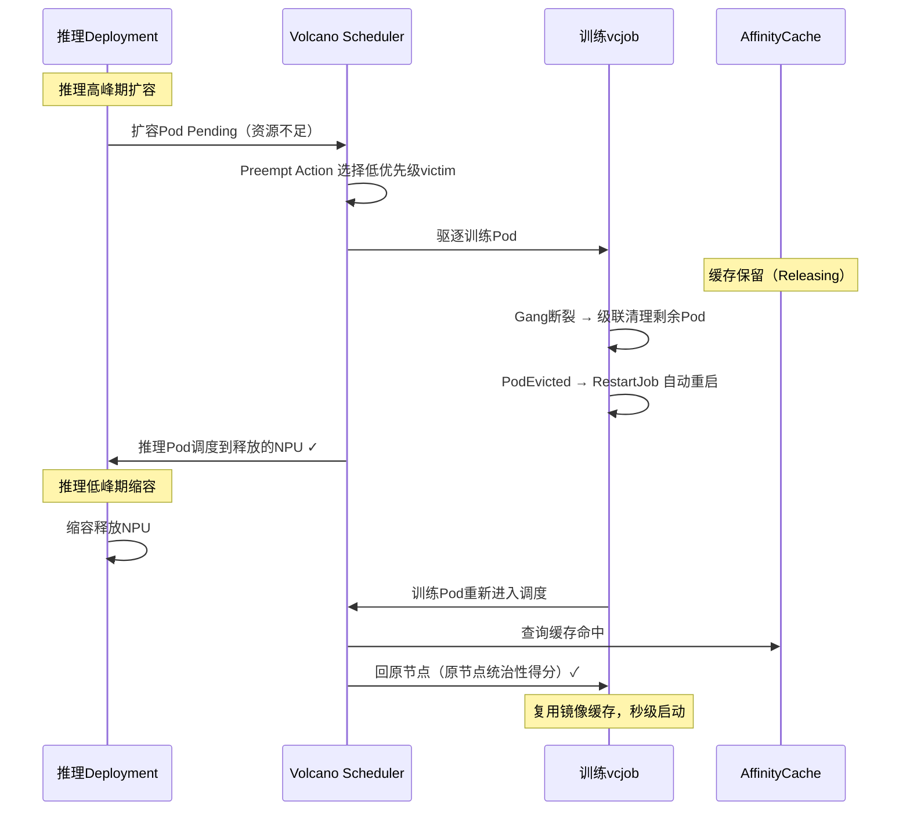

# 基于Preempt的推理/训练任务交替运行<a name="ZH-CN_TOPIC_000000_preempt_alternation"></a>

## 概述<a name="section_overview_preempt"></a>

Preempt（抢占）是Volcano调度器的核心机制：当高优先级任务找不到足够资源时，调度器会从低优先级任务中选择victim，驱逐其占用的Pod以释放资源。

在推理/训练共享集群中，推理任务使用高优先级，训练任务使用低优先级。当推理业务高峰期需要扩容时，自动从训练任务抢占NPU资源；当推理低峰期缩容时，释放的NPU资源归还给训练任务。训练任务配置`minAvailable`等于`replicas`保证gang完整性，Pod被抢占导致Job失败后由重调度模块自动触发Job重启，重建的Pod通过回原节点特性回到原节点，秒级恢复训练。

## 实现原理<a name="section_principle_preempt"></a>



## 操作步骤<a name="section_steps_preempt"></a>

1. 创建PriorityClass。关于PriorityClass相关字段的详细说明，请参见[k8s官方网站](https://kubernetes.io/docs/concepts/scheduling-eviction/pod-priority-preemption/)。

   ```yaml
   # 推理任务：高优先级，可抢占低优先级资源
   apiVersion: scheduling.k8s.io/v1
   kind: PriorityClass
   metadata:
     name: inference-high
   value: 1000
   preemptionPolicy: PreemptLowerPriority
   globalDefault: false
   description: "推理任务高优先级"

   ---
   # 训练任务：低优先级，可被抢占
   apiVersion: scheduling.k8s.io/v1
   kind: PriorityClass
   metadata:
     name: training-low
   value: 100
   globalDefault: false
   preemptionPolicy: Never
   description: "训练任务低优先级，可被抢占"
   ```

2. 修改Scheduler Tier。

   修改Volcano调度器的ConfigMap（`volcano-scheduler-configmap`），删除`enqueue` action，增加`preempt` action，并配置`gang`插件绕过gang保护：

   ```yaml
   data:
     volcano-scheduler.conf: |
       actions: "allocate, preempt, backfill"   # 需要删除enqueue action，并增加preempt action
       tiers:
       - plugins:
         - name: priority
           enableNodeOrder: false
         - name: gang
           enableNodeOrder: false
           enablePreemptable: false      # 绕过gang保护，允许抢占任意训练Pod
         - name: conformance
           enableNodeOrder: false
         - name: volcano-npu_v26.1.0_linux-x86_64
       - plugins:
         - name: drf
           enableNodeOrder: false
         - name: predicates
           enableNodeOrder: false
         - name: proportion
           enableNodeOrder: false
         - name: nodeorder
         - name: binpack
           enableNodeOrder: false
       configurations:
         - name: init-params
           arguments: {"grace-over-time":"900","presetVirtualDevice":"true","nslb-version":"1.0","shared-tor-num":"2",
       "useClusterInfoManager":"true","self-maintain-available-card":"true","super-pod-size": "48", "reserve-nodes": "2",
       "forceEnqueue": "true", "prefer-previous-node": "true"}
   ```

3. 部署训练任务。

   ```yaml
   apiVersion: batch.volcano.sh/v1alpha1
   kind: Job
   metadata:
     name: train-job
     labels:
       fault-scheduling: grace        # 优雅重调度：Pod失败时自动清理并重启Job
     annotations:
       huawei.com/schedule_policy: chip4-node8
   spec:
     queue: default
     schedulerName: volcano
     priorityClassName: training-low
     minAvailable: 2                  # 等于replicas，保证gang完整性
     policies:
     - event: PodEvicted
       action: RestartJob
     tasks:
     - replicas: 2
       name: test
       template:
         spec:
           containers:
           - name: training
             image: ubuntu:22.04
             command:
             - /bin/bash
             - -c
             - sleep inf
             resources:
               limits:
                 huawei.com/Ascend910: 8
               requests:
                 huawei.com/Ascend910: 8
   ```

   执行以下命令部署训练任务及查看rankIndex对应的节点：

   ```bash
   kubectl apply -f train-job.yaml
   kubectl get pods -l volcano.sh/job-name=train-job -o wide
   kubectl describe pod -l volcano.sh/job-name=train-job | grep hccl/rankIndex
   ```

   >[!NOTE]
   >Preempt方案下，`minAvailable`等于`replicas`（gang调度要求）。`gang.enablePreemptable: false`绕过gang保护后，训练Pod仍可被抢占。被抢占后训练任务Pod数低于`minAvailable`，通常无法继续训练，对于vcjob场景可以在YAML中增加policies(event: PodEvicted, action: RestartJob)触发级联清理剩余Pod并重启Job。对于acjob场景，可以增加fault-retry-times和fault-scheduling标签触发重调度模块自动级联清理剩余Pod。重建的Pod通过回原节点特性优先回到原节点。

4. 部署推理任务。

   ```yaml
   apiVersion: apps/v1
   kind: Deployment
   metadata:
     name: inference-deploy
     labels:
       app: inference
   spec:
     replicas: 1                    # 推理副本数，可根据流量扩缩容
     selector:
       matchLabels:
         app: inference
     template:
       metadata:
         labels:
           app: inference
         annotations:
           huawei.com/schedule_policy: chip4-node8
           huawei.com/schedule_minAvailable: "1"      # 任务调度的最小副本数，该推理任务pod间无强关联，可以设置为1
       spec:
         schedulerName: volcano
         priorityClassName: inference-high
         containers:
         - name: inference
           image: ubuntu:22.04
           command:
           - /bin/bash
           - -c
           - sleep inf
           resources:
             limits:
               huawei.com/Ascend910: 8
             requests:
               huawei.com/Ascend910: 8
   ```

   执行以下命令部署推理任务：

   ```bash
   kubectl apply -f inference-deploy.yaml
   kubectl get pods -l app=inference -o wide
   ```

5. 触发任务交替。

   **推理高峰期扩容（触发Preempt抢占训练资源），如果当前集群没有额外节点，则会直接触发驱逐，不需要扩容：**

   ```bash
   kubectl scale deployment inference-deploy --replicas=2
   ```

   观察抢占过程：

   ```bash
   # 观察推理Pod状态变化
   kubectl get pods -l app=inference -w

   # 观察训练Pod被驱逐
   kubectl get pods -l volcano.sh/job-name=train-job -w
   ```

   预期结果：推理新Pod进入Pending后，训练Pod被驱逐，推理Pod调度到释放的NPU。训练Job触发`PodEvicted→RestartJob`策略，级联清理剩余Pod后自动重启，进入Pending等待资源。

   **推理低峰期缩容（释放NPU给训练任务）：**

   ```bash
   kubectl scale deployment inference-deploy --replicas=0
   ```

6. 验证回原节点。

   1. 查看训练Pod重新调度后的节点：

      ```bash
      kubectl get pods -l volcano.sh/job-name=train-job -o wide
      kubectl describe pod -l volcano.sh/job-name=train-job | grep hccl/rankIndex
      ```

   2. 查看调度器日志确认加分生效：

      ```bash
      kubectl logs -n volcano-system <volcano-scheduler-pod> | grep "addPreferPreviousNodeScore"
      # 输出示例:
      # addPreferPreviousNodeScore: task=train-job-test-0 rank=0 boosted selfNode=node-gpu-05 score=100000100
      ```

   训练Pod重建后所在节点应与驱逐前相同或高度一致。还可以继续对推理任务重新进行扩容，查看扩容的pod是否回到原节点执行。
