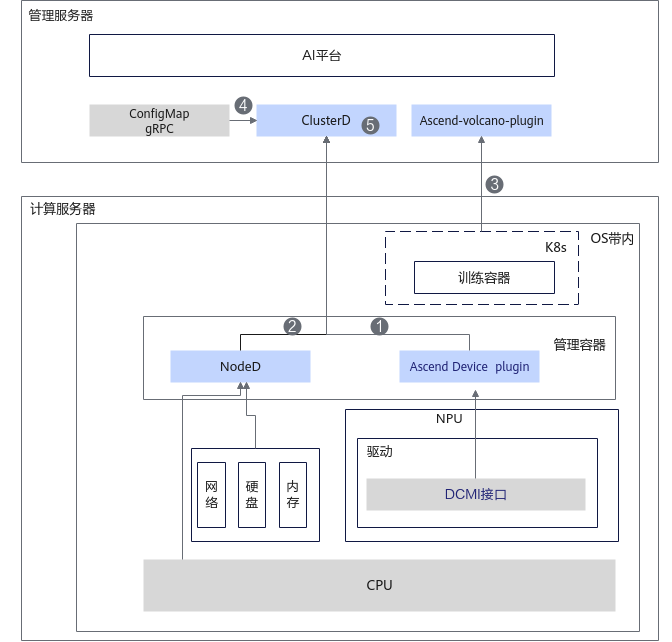

# 实现原理

## 故障检测整体架构

MindCluster集群调度组件Ascend Device Plugin提供NPU芯片故障检测能力及NPU参数面网络故障检测能力，NodeD提供服务器节点故障、共享存储故障和灵衢慢网络故障检测能力，ClusterD提供公共故障检测能力，Volcano提供业务面容器异常检测能力，故障检测整体架构如下图所示。

1. 计算服务器上的Ascend Device Plugin通过驱动获取NPU芯片故障以及参数面网络故障后，将故障信息上报到管理服务器。
2. 计算服务器上的NodeD通过驱动获取服务器节点故障、共享存储故障和灵衢慢网络故障信息后，将故障信息上报到管理服务器。
3. 计算服务器上的K8s监测训练容器状态，训练容器异常后上报到K8s中，管理服务器上的Volcano通过K8s获取训练容器的故障信息。
4. 管理服务器上的ClusterD通过公共故障接口获取公共故障后，将接收到的信息进行汇总写入cluster-info-device-cm。
5. （可选）管理服务器上的ClusterD汇总集群内所有Ascend Device Plugin和NodeD上报的故障信息。

## ConfigMap说明

- 每个计算节点的Ascend Device Plugin均会创建记录本节点NPU和灵衢总线设备信息的ConfigMap文件。该ConfigMap文件名为mindx-dl-deviceinfo-&lt;nodename&gt;（以下简称device-info-cm），故障信息会通过该ConfigMap进行上报。该ConfigMap文件中各字段的说明，请参见[DeviceInfoCfg](../../06_api/02_ascend_device_plugin.md#芯片资源)表。
- 当节点上存在节点故障时，每个计算节点的NodeD会创建记录本节点设备信息的ConfigMap文件。该ConfigMap文件名为mindx-dl-nodeinfo-&lt;nodename&gt;（以下简称node-info-cm），节点故障信息会通过该ConfigMap进行上报。该ConfigMap文件中各字段的说明，请参见[mindx-dl-nodeinfo-&lt;nodename&gt;](../../06_api/03_noded.md#节点资源)表。
- ClusterD会创建记录本集群设备信息的ConfigMap文件，该ConfigMap文件名为cluster-info-<device/switch>-<[0-5]>、cluster-info-node-cm（以下简称cluster-info-cm）。节点及芯片故障信息会通过[cluster-info-cm](../../06_api/04_clusterd/00_cluster_resources.md)进行上报。
- 创建每个任务时，需要在YAML中配置ConfigMap文件，该ConfigMap文件名称为reset-config-&lt;job-name&gt;（以下简称reset-info-cm）。该ConfigMap挂载到容器的“/user/restore/reset/config”路径下。Ascend Device Plugin会自动将ConfigMap挂载到本节点的“/user/restore/reset/&lt;job-namespace&gt;.&lt;job-name&gt;”路径下。

    也可以将节点上/user/restore/reset/&lt;job-namespace&gt;.&lt;job-name&gt;替代ConfigMap，挂载到容器的“/user/restore/reset/config”路径下。该ConfigMap文件字段说明，请参见[reset-config-&lt;job-name&gt;](../../06_api/02_ascend_device_plugin.md#任务信息)表。

## 在线压测

MindCluster支持训练在线压测特性，即在训练过程中可以调用在线压测接口，暂停指定训练任务，对任务使用的节点进行硬件P2P或AIC压力测试，主动判断节点是否存在异常。若不存在故障则恢复训练；若存在故障则隔离故障节点，触发断点续训。

### 使用约束

- 对于PyTorch训练框架，需配合MindSpeed-LLM  2.3.0版本使用，版本配套请参见[MindSpeed-LLM](https://gitcode.com/Ascend/MindSpeed-LLM/tree/2.3.0)。
- 对于MindSpore训练框架，需配合MindFormers master版本使用，版本配套请参见[MindSpore MindFormers](https://gitcode.com/mindspore/mindformers/tree/master)。
- 请在训练正常迭代后，再进行在线压测指令的下发。
- 确保已开启进程级恢复相关功能特性。
- 压测过程中不支持重启ClusterD，如果ClusterD异常重启，需要重启训练并下发压测任务。
- 压测过程中，需要关闭热复位功能。
- P2P压测需确保device侧有10GB以上的空闲内存。
- 对于MindSpore训练框架，需要在启动TaskD Manager前设置export TASKD\_PROCESS\_ENABLE="on"。
- 本功能依赖MindIO组件，使用前请先了解MindIO的[约束限制](../../07_references/00_fault_recovery_acceleration/02_installation_and_deployment.md#约束限制)。

### 支持的产品型号和AI框架

**表 1**  在线压测支持的产品和框架

<table><thead align="left"><tr id="zh-cn_topic_0000002039194017_row111997118547"><th class="cellrowborder" valign="top" width="25.172517251725168%" id="mcps1.2.4.1.1">
产品类型

</th>
<th class="cellrowborder" valign="top" width="43.834383438343835%" id="mcps1.2.4.1.2">
硬件形态

</th>
<th class="cellrowborder" valign="top" width="30.993099309930994%" id="mcps1.2.4.1.3">
训练框架

</th>
</tr>
</thead>
<tbody><tr id="zh-cn_topic_0000002039194017_row920001115417"><td class="cellrowborder" valign="top" width="25.172517251725168%" headers="mcps1.2.4.1.1 ">
<term id="zh-cn_topic_0000001519959665_term57208119917">Atlas A2 训练系列产品</term>

</td>
<td class="cellrowborder" valign="top" width="43.834383438343835%" headers="mcps1.2.4.1.2 ">
Atlas 800T A2 训练服务器

</td>
<td class="cellrowborder" valign="top" width="30.993099309930994%" headers="mcps1.2.4.1.3 "><ul id="ul15879359132214"><li>MindSpore</li><li>PyTorch</li></ul>
</td>
</tr>
<tr id="zh-cn_topic_0000002039194017_row13204101125410"><td class="cellrowborder" valign="top" width="25.172517251725168%" headers="mcps1.2.4.1.1 ">
<term id="zh-cn_topic_0000001519959665_term26764913715">Atlas A3 训练系列产品</term>

</td>
<td class="cellrowborder" valign="top" width="43.834383438343835%" headers="mcps1.2.4.1.2 ">
Atlas 900 A3 SuperPoD 超节点

</td>
<td class="cellrowborder" valign="top" width="30.993099309930994%" headers="mcps1.2.4.1.3 "><ul id="ul13821123132320"><li>MindSpore</li><li>PyTorch</li></ul>
</td>
</tr>
</tbody>
</table>

### 在线压测原理

**图 1**  原理图

在以上原理图中，各个步骤的说明如下。

1. AI平台集成ClusterD，调用ClusterD的gRPC接口下发压测操作，指定需要压测的节点。
2. ClusterD通知MindIO暂停训练。
3. TaskD Manager通知指定TaskD Worker调用训练框架接口执行压测操作。
4. 训练框架调用指定NPU卡上的CANN接口执行压测操作。
5. ClusterD判断指定NPU卡的压测操作完成后，再由TaskD通知MindIO在压测完成后继续执行下一个Step训练。

### 适配功能点

在在线压测中，框架首先初始化MindIO服务，启动服务后优化器更新时会上报对应状态到MindIO。通过主动调用优雅暂停机制，完成当前卡上任务暂停，暂停后进行硬件压力测试，测试完成后继续训练。集群大脑需提供对外接口，接收压测指令并管理压测流程。

对于非MindSpeed-LLM、MindCluster平台用户，需在框架侧完成[表2](#table19955141136103)的功能适配。

**表 2**  在线压测框架适配功能点

<table><thead align="left"><tr id="row169591493619"><th class="cellrowborder" valign="top" width="18.98%" id="mcps1.2.5.1.1">
适配功能点

</th>
<th class="cellrowborder" valign="top" width="39.26%" id="mcps1.2.5.1.2">
功能简述

</th>
<th class="cellrowborder" valign="top" width="18.01%" id="mcps1.2.5.1.3">
适配组件

</th>
<th class="cellrowborder" valign="top" width="23.75%" id="mcps1.2.5.1.4">
参考链接

</th>
</tr>
</thead>
<tbody><tr id="row893618158397"><td class="cellrowborder" valign="top" width="18.98%" headers="mcps1.2.5.1.1 ">
初始化拉起

</td>
<td class="cellrowborder" valign="top" width="39.26%" headers="mcps1.2.5.1.2 ">
训练框架初始化时拉起MindIO服务。

</td>
<td class="cellrowborder" rowspan="3" valign="top" width="18.01%" headers="mcps1.2.5.1.3 ">
分布式训练框架

</td>
<td class="cellrowborder" rowspan="3" valign="top" width="23.75%" headers="mcps1.2.5.1.4 ">
<a href="../../07_references/00_fault_recovery_acceleration/03_usage_guidance.md#对接非mindspeed-llm框架">对接非MindSpeed-LLM框架</a>

</td>
</tr>
<tr id="row1793717157396"><td class="cellrowborder" valign="top" headers="mcps1.2.5.1.1 ">
上报优化器更新状态

</td>
<td class="cellrowborder" valign="top" headers="mcps1.2.5.1.2 ">
优化器更新前上报优化器更新开始和结束。

</td>
</tr>
<tr id="row193701523914"><td class="cellrowborder" valign="top" headers="mcps1.2.5.1.1 ">
优雅暂停

</td>
<td class="cellrowborder" valign="top" headers="mcps1.2.5.1.2 ">
训练迭代循环最尾部增加MindIO函数调用，实现主动暂停功能。

</td>
</tr>
<tr id="row46026594305"><td class="cellrowborder" valign="top" width="18.98%" headers="mcps1.2.5.1.1 ">
在线压测过程管理

</td>
<td class="cellrowborder" valign="top" width="39.26%" headers="mcps1.2.5.1.2 ">
提供在线压测请求下发能力，控制训练进程暂停与恢复。

</td>
<td class="cellrowborder" valign="top" width="18.01%" headers="mcps1.2.5.1.3 ">
AI平台

</td>
<td class="cellrowborder" valign="top" width="23.75%" headers="mcps1.2.5.1.4 ">
<a href="https://gitcode.com/Ascend/mind-cluster/blob/branch_v26.1.0/component/clusterd/pkg/application/recover/om_controller.go" target="_blank" rel="noopener noreferrer">链接</a>

</td>
</tr>
</tbody>
</table>
