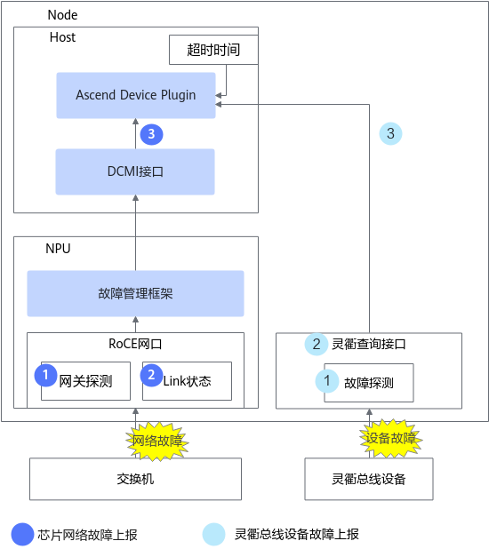
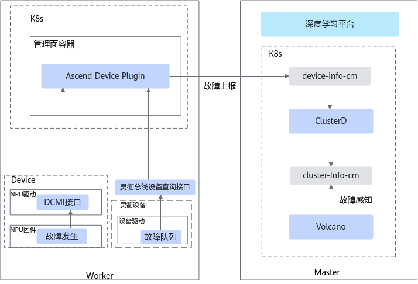

# 网络故障

## 参数面网络故障

NPU的参数面网络故障包括芯片网络相关故障和灵衢总线设备故障。

参数面网络出现故障时，将导致训练任务中断或者训练任务性能较差。灵衢总线设备发生故障后，MindCluster集群调度组件将根据故障级别进行相应的重调度处理。

>[!NOTE]
>
>- 参数面网络故障不会直接触发任务重调度，当参数面故障导致训练任务异常中断时才触发任务重调度。
>- 如果需要对参数面网络故障进行故障处理，需要同时开启业务面故障无条件重试能力。

参数面网络故障检测由设备管理组件Ascend Device Plugin负责，详细原理如[图1](#fig68743107307)所示。

**图 1**  故障检测

### 关键步骤说明

#### 芯片网络故障

1. NPU定时检测和网关地址的通信是否正常，通过故障管理框架上报结果。
2. RoCE驱动实时监测NPU网口Link状态，通过故障管理框架上报Linkdown或Linkup事件。
3. Ascend Device Plugin通过DCMI接口从故障管理框架获取信息，通过轮询的方式查询网关探测结果，并实时订阅网口Linkdown或Linkup事件并进行上报。Ascend Device Plugin统计网关检测异常持续时间、Linkdown持续时间。如果小于或等于RoCE网络超时时间（默认为20秒）则标记为NPU网络故障（默认不处理，可能会引起参数面网络故障）；如果大于20秒，则升级成配置的故障等级。

#### 灵衢总线设备故障

1. 灵衢总线设备将设备发生的故障写入本地队列中。
2. 灵衢查询接口通过查询上述队列，将故障缓存至查询接口，并进行汇总处理。
3. Ascend Device Plugin通过订阅或轮询的方式调用接口获取灵衢总线设备相关故障，并写入device-info-cm进行上报。

### 故障上报机制

- **芯片发生网络故障时**，NPU故障管理框架获取故障信息后，将该信息上报给NPU驱动。NPU驱动收到故障信息后，通过DCMI接口上报给Ascend Device Plugin。Ascend Device Plugin通过DCMI接口获取芯片健康状态。当前提供如下两种获取模式：
    - 故障订阅模式。Ascend Device Plugin启动时会先调用DCMI故障订阅接口注册监测，故障发生或恢复时，驱动通过该接口将故障发生或恢复事件上报给Ascend Device Plugin。
    - 故障轮询模式。每隔固定时间，通过故障查询接口查询芯片故障状态。当设备驱动不支持订阅能力时将切换该模式。

- **灵衢总线设备发生故障时**，Ascend Device Plugin通过灵衢查询接口获取故障信息，当前故障查询提供两种模式：
    - 故障订阅模式：在Ascend Device Plugin启动过程中向灵衢查询接口注册故障处理回调。故障发生后，该回调被调用后将故障上报给Ascend Device Plugin，故障恢复时通过该接口上报恢复事件。
    - 故障轮询模式：Ascend Device Plugin每隔5分钟调用一次全量故障查询接口。

### Ascend Device Plugin上报机制

Ascend Device Plugin获取到参数面网络故障后，将故障信息写入到device-info-cm中，并通过ConfigMap的形式上报给K8s。device-info-cm中各字段的说明，请参见[DeviceInfoCfg](../../../06_api/02_ascend_device_plugin.md#芯片资源)表。

Ascend Device Plugin的故障上报机制如[图2](#fig1587571063011)所示。

**图 2**  故障上报

### watchdog故障检测

参数面网络链路异常（参数面网络故障）可能导致任务中正常NPU无法与故障NPU通信，使所有NPU集合通信陷入超时等待状态；并使任务集合通信出现等待超时异常后才退出（默认为30分钟）。

开启watchdog功能（且开启了业务面故障无条件重试能力）可以在参数面网络链路异常发生后，隔离故障NPU，将任务重调度到健康的NPU上，从而实现6分钟内使任务快速退出。

>[!NOTE]
>仅支持在PyTorch及MindSpore框架下使用watchdog功能。

### 所需组件

为保证参数面网络故障检测功能的正常使用，需要安装以下组件：Volcano、Ascend Operator、Ascend Device Plugin、ClusterD

### 支持的故障处理类型

Job级别重调度、Pod级别重调度、进程级别重调度

### （可选）配置故障检测的级别

故障检测特性针对**参数面故障**提供了默认的故障级别以及对应级别的故障处理策略，若用户需要修改故障处理策略可参见[参数面网络故障](../03_configuration/04_network_faults.md#ZH-CN_TOPIC_0000002479226486)。若无特殊需求，请勿随意修改。

## pingmesh灵衢网络故障

灵衢网络故障是针对超节点内部（包括节点内和节点间）的HCCS网络提供的NPU网络故障检测。

### 上报机制

NodeD调用DCMI接口启动pingmesh任务，并周期性查询pingmesh结果，将该结果写入文件&lt;nodename&gt;.log。该文件所在目录在容器中为固定路径：/user/mind-cluster/pingmesh，物理机默认目录/user/mind-cluster/pingmesh。物理机路径可以修改，修改方式如以下说明所示。

>[!NOTE]
>
>- &lt;nodename&gt;非固定值，为K8s中查询到的节点名称。
>- &lt;nodename&gt;.log文件物理机路径可由用户根据实际情况自行配置：在NodeD的启动YAML中修改挂载卷名称为pingmesh-result的物理机挂载路径。

获取pingmesh结果后，ClusterD会对结果进行初步分析，将故障信息写入到名为[pingmesh-fault-&lt;nodename&gt;](../04_querying_and_verifying_faults.md#zh-cn_topic_0000002193288232_table2371535113510)的ConfigMap文件中。ClusterD会侦听该ConfigMap信息，并将故障汇总后上报给Volcano，由Volcano进行调度。

### 所需组件

在相应节点上完成以下组件的安装：NodeD（必选）、Ascend Device Plugin（可选）、ClusterD（可选）

### 使用约束

本功能仅支持在以下产品型号中使用：Atlas 900 A3 SuperPoD 超节点。

### 已支持的灵衢网络故障

|故障码|故障说明|故障级别|
|--|--|--|
|220001001|NPU卡HCCS网络故障|
SeparateNPU

该故障级别不支持自行配置。
|

## 光链路成员端口故障

包括Atlas 950 SuperPoD 超节点中的npu到unions及5808的端口故障，以及Atlas 850E 超节点和Atlas 650E 服务器中的npu到1825及5808端口的故障等。

### 检测原理

参数面光链路成员端口故障检测由Ascend Device Plugin组件负责，默认每隔固定时间对每个NPU执行一轮检测。检测流程如下：

1. Ascend Device Plugin获取NPU的所有故障码信息。
2. 根据不同故障码信息判断该NPU是否有参数面光链路成员端口故障，以及故障范围是否破坏路由收敛。
3. 将不同级别的故障写入device-info-cm ConfigMap中。

### 所需组件

为保证参数面光链路成员端口故障检测功能的正常使用，需要安装以下组件：Ascend Device Plugin

### 需处理的故障类型

UB PORT link状态变化（UP -> DOWN）；UBOE PORT link状态变化 (UP -> DOWN)。

### 使用约束

本功能仅支持在以下产品型号中使用：适用于Atlas 950 SuperPoD 超节点、Atlas 850E 超节点和Atlas 650E 服务器。

|故障码|故障说明|故障级别|
|--|--|--|
|020001002|超平面路由不可收敛。       |SeparateNPUCodes：隔离NPU故障。|
|020000002|超平面路由可收敛设备亚健康。|SubHealthFaultCodes：亚健康故障。|
|110001024|参数面路由不可收敛。       |PreSeparateNPUCodes：预隔离NPU故障。|
|110000002|参数面路由可收敛设备亚健康。|SubHealthFaultCodes：亚健康故障。|

## 相关操作

- [配置网络故障](../03_configuration/04_network_faults.md)
- [查询和验证故障](../04_querying_and_verifying_faults.md)
